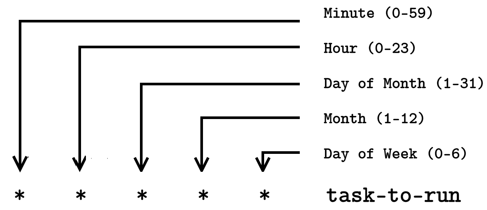

# 十七、你需要一个 Cron 作业

在本章中，您将学习如何使用 cron jobs 在 Linux 中自动执行枯燥的任务，cron jobs 是 Linux 中最有用和最强大的实用程序之一。多亏了 cron jobs，Linux 系统管理员可以在周末休息，和心爱的人一起享受假期。Cron 作业允许您安排任务在特定时间运行。通过 cron 作业，您可以计划运行备份、监控系统资源等等。

# 我们的第一份核心工作

下图显示了 cron 作业的典型格式:



Figure 1: A cron job format

Cron 作业是特定于用户的，因此每个用户都有自己的 cron 作业列表。例如，用户`elliot`可以运行命令`crontab -l`来显示他的 cron 作业:

```sh
elliot@ubuntu-linux:~$ crontab -l 
no crontab for elliot
```

目前用户`elliot`没有任何 cron 作业。

让我们开始创建埃利奥特的第一个 cron 工作。我们将创建一个每分钟运行一次的 cron 作业，它将简单地添加一行“一分钟已经过去了。”到文件`/home/elliot/minutes.txt`。

您可以运行命令`crontab -e`来编辑或创建 cron 作业:

```sh
elliot@ubuntu-linux:~$ crontab -e
```

现在添加以下行，然后保存并退出:

```sh
* * * * * echo "A minute has passed." >> /home/elliot/minutes.txt
```

退出后，您将看到消息:“crontab:安装新的 crontab”:

```sh
elliot@ubuntu-linux:~$ crontab -e 
crontab: installing new crontab
```

最后，用户`elliot`可以列出他们的 cron 作业，以验证新的 cron 作业是否被调度:

```sh
elliot@ubuntu-linux:~$ crontab -l
* * * * * echo "A minute has passed." >> /home/elliot/minutes.txt
```

现在，等待几分钟，然后检查文件的内容`/home/el- liot/minutes.txt`:

```sh
elliot@ubuntu-linux:~$ cat /home/elliot/minutes.txt 
A minute has passed.
A minute has passed. 
A minute has passed. 
A minute has passed. 
A minute has passed.
```

我等了五分钟，然后我查看了文件，看到一行“一分钟过去了。”被添加到文件`minutes.txt`中五次，所以我知道 cron 工作进行得很顺利。

# 每五分钟跑一次

让我们创建另一个每五分钟运行一次的 cron 作业。例如，您可能希望创建一个 cron 作业，每五分钟检查一次系统的平均负载。

运行命令`crontab -e`添加新的 cron 作业:

```sh
elliot@ubuntu-linux:~$ crontab -e
```

现在添加以下行，然后保存并退出:

```sh
*/5 * * * * uptime >> /home/elliot/load.txt
```

最后，让我们查看已安装的 cron 作业列表，以验证新的 cron 作业是否已安排好:

```sh
elliot@ubuntu-linux:~$ crontab -e 
crontab: installing new crontab 
elliot@ubuntu-linux:~$ crontab -l
* * * * * echo "A minute has passed" >> /home/elliot/minutes.txt
*/5 * * * * uptime >> /home/elliot/load.txt
```

现在我们可以看到为用户`elliot`安装了两个 cron 作业。

闲逛五十分钟，然后查看文件内容`/home/elliot/load.txt`。如果没有秒表，运行`sleep 300`命令，等待它结束:

```sh
elliot@ubuntu-linux:~$ sleep 300
```

我给自己泡了点绿茶，十分钟后回来看了文件`/home/elliot/load.txt`:

```sh
elliot@ubuntu-linux:~$ cat /home/elliot/load.txt
14:40:01 up 1 day, 5:13, 2 users, load average: 0.41, 0.40, 0.37
14:45:01 up 1 day, 5:18, 2 users, load average: 0.25, 0.34, 0.35
```

cron 作业在这十分钟内运行了两次，这是意料之中的；我建议你在二十四小时内再次检查文件`/home/elliot/load.txt`，你会看到一个非常可爱的报告，显示你一天中的平均系统负载。

# 更多 cron 示例

您还可以安排 cron 作业以多个时间间隔运行。例如，以下 cron 作业将在周日每小时的分钟`5`、`20`和`40`运行:

```sh
5,20,40 * * * sun task-to-run
```

您也可以指定时间范围。例如，将在`weekdays`(星期一- >星期五)下午`6:30`运行的 cron 作业将具有以下格式:

```sh
30 18 * * 1-5 task-to-run
```

注意`0`是周日，`1`是周一，以此类推。

要查看更多 cron 示例，您可以查看`crontab`手册页的第五部分:

```sh
elliot@ubuntu-linux:~$ man 5 crontab
```

# 自动化系统修补

作为一名 Linux 系统管理员，你可以经常修补(更新)系统。有时，这可能会让您发疯，因为生产服务器被安排在不愉快的时间更新，如周末的午夜、`04:00` AM、`02:00` AM 等。自动完成如此繁忙的任务并获得更多睡眠会很好，对吗？

让我们切换到`root`用户，然后创建一个名为`auto_patch.sh`的 bash 脚本

在`/root`中:

```sh
root@ubuntu-linux:~# cat auto_patch.sh 
#!/bin/bash
apt-get -y update 
apt-get -y upgrade 
shutdown -r now
```

注意脚本`auto_patch.sh`很小；只有三行。我们在`apt-get`命令中使用了
`-y`选项，该选项在系统更新期间自动回复`Yes`所有提示；这很重要，因为脚本运行时，你不会坐在电脑前！

现在使脚本可执行:

```sh
root@ubuntu-linux:~# chmod +x auto_patch.sh
```

最后，您需要安排一个 cron 作业来运行`auto_patch.sh`脚本。让我们假设系统计划在周六凌晨 01:00 更新。在这种情况下，您可以创建以下 cron 作业:

```sh
0 1 * * sat /root/auto_patch.sh
```

请记住`auto_patch.sh`永远不会部署在任何真实的服务器上。我只是想让你了解自动化的概念。您需要编辑`auto_patch.sh`来检查命令退出代码，因为期望一切顺利而没有任何错误是幼稚的。一个好的系统管理员总是创建健壮的脚本来处理各种预期的错误。

# 运行一次作业

你必须在运行后的某个时间删除`auto_patch.sh` cron 作业，否则它会每周更新系统！为此，存在另一种被称为`at`的公用事业，其唯一目的是；也就是说，计划只运行一次作业。

我们首先需要安装`at`包:

```sh
root@ubuntu-linux:~# apt-get -y install at
```

现在，您可以计划在本周六上午`01:00`运行`auto_patch.sh`脚本，命令如下:

```sh
root@ubuntu-linux:~# at 01:00 AM Sat -f /root/patch.sh
```

记住，`at`作业只运行一次，所以周六之后`auto_patch.sh`脚本不会再运行了。

您可以通过阅读其手册页了解更多关于`at`的信息:

```sh
root@ubuntu-linux:~# man at
```

# 知识检查

对于以下练习，打开您的终端并尝试解决以下任务:

1.  为根用户创建 cron 作业，每 10 分钟运行一次。cron 作业将简单地添加一行“10 分钟过去了！”到文件`/root/minutes.txt`。
2.  为根用户创建一个 cron 作业，该作业将在每个圣诞节(`25th of December at 1 AM`)运行。cron 作业将简单地添加一行“圣诞快乐！”到文件`/root/holidays.txt`。