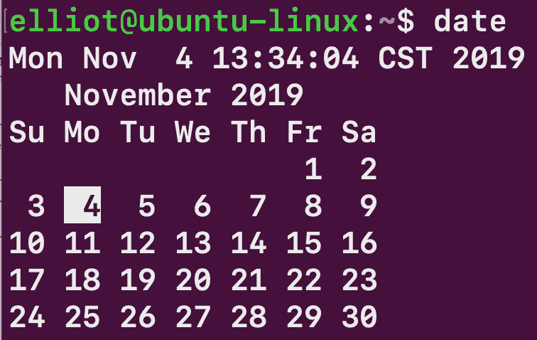
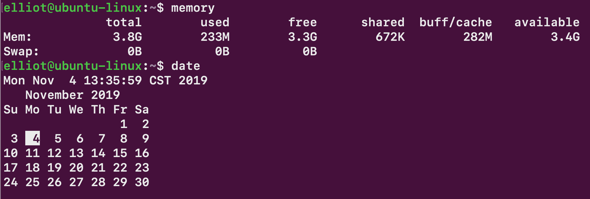

Create Your Own Commands

有时候，你可能很难记住一个命令。其他时候，你会发现自己一遍又一遍地运行一个很长的命令，这让你发疯。在这一章中，你将学习如何让你的*拥有*命令，因为你是真正的老板。

# 你的第一个别名

让我们假设您总是忘记命令`free -h`显示您系统的内存信息:

```sh
elliot@ubuntu-linux:~$ free -h
 total     used     free     shared     buff/cache     available
Mem:       3.9G     939M     2.2G       6.6M           752M         2.7G
Swap:      947M       0B     947M 
```

你可能会问自己:“为什么我不能直接输入`memory`来显示记忆信息而不是`free -h`？”。嗯，你当然可以通过创造一个`alias`来做到这一点。

`alias`命令指示 shell 用另一个字符串(单词)替换一个字符串(单词)。这有什么用？让我给你看；如果运行以下命令:

```sh
elliot@ubuntu-linux:~$ alias memory="free -h"
```

那么每次进入`memory`时，你的Shell就会换成`free -h`:

```sh
elliot@ubuntu-linux:~$ memory
 total     used     free     shared     buff/cache     available
Mem:       3.9G     936M     2.2G       6.6M           756M         2.7G
Swap:      947M       0B     947M
```

哇哦！所以现在你实现了你的梦想！您可以为任何难以记住的 Linux 命令创建一个别名。注意`alias`命令的一般格式如下:

```sh
alias alias_name="command(s)_to_run"
```

# 多个命令的一个别名

您可以使用分号在同一行运行多个命令。例如，要创建名为`newdir`的新目录并一次全部更改为`newdir`，您可以运行以下命令:

```sh
elliot@ubuntu-linux:~$ mkdir newdir; cd newdir 
elliot@ubuntu-linux:~/newdir$
```

所以你用分号来分隔每个命令。通常，在同一行运行多个命令的语法如下:

```sh
command1; command2; command3; command4; ....
```

我们经常喜欢同时查看日历和日期，对吗？为此，我们将创建一个名为`date`的别名，以便每次运行`date`时，它都将运行`date`和`calendar`命令:

```sh
elliot@ubuntu-linux:~$ alias date="date;cal"
```

现在让我们运行`date`看看发生了什么:



请注意，这里我们使用了别名`date`，它已经是一个现有命令的名称；化名完全没问题。

# 列出所有别名

您还应该知道别名是特定于用户的。所以`elliot`创建的别名对用户`smurf`不起作用；看一看:

```sh
elliot@ubuntu-linux:~$ su - smurf 
Password:
smurf@ubuntu-linux:~$ date 
Mon Nov 4 13:33:36 CST 2019
smurf@ubuntu-linux:~$ memory
Command 'memory' not found, did you mean: 
 command 'lmemory' from deb lmemory
Try: apt install <deb name>
```

可以看到，`smurf`不能使用用户`elliot`的别名。所以每个用户都有自己的一套别名。现在，让我们回到用户`elliot`:

```sh
smurf@ubuntu-linux:~$ exit 
logout
elliot@ubuntu-linux:~$ memory
 total     used     free     shared     buff/cache     available
Mem:      3.9G     937M     2.0G       6.6M      990M               2.7G
Swap:     947M       0B     947M 
```

您可以运行`alias`命令，列出当前登录用户可以使用的所有别名:

```sh
elliot@ubuntu-linux:~$ alias 
alias date='date;cal'
alias egrep='egrep --color=auto' 
alias fgrep='fgrep --color=auto' 
alias grep='grep --color=auto' 
alias l='ls -CF'
alias la='ls -A' 
alias ll='ls -alF'
alias ls='ls --color=auto' 
alias memory='free -h'
```

# 创建永久别名

到目前为止，我们一直在创建临时别名；也就是说，我们创建的两个别名`memory`和`date`暂时且仅对当前终端会话有效。一旦你关闭终端，这两个别名就会消失。

打开一个新的终端会话，然后尝试运行我们创建的两个别名:

```sh
elliot@ubuntu-linux:~$ date 
Mon Nov 4 13:43:46 CST 2019
elliot@ubuntu-linux:~$ memory

Command 'memory' not found, did you mean: 
 command 'lmemory' from deb lmemory
Try: sudo apt install <deb name>
```

如你所见，他们不见了！他们甚至已经不在你的化名列表里了:

```sh
elliot@ubuntu-linux:~$ alias 
alias egrep='egrep --color=auto' 
alias fgrep='fgrep --color=auto' 
alias grep='grep --color=auto' 
alias l='ls -CF'
alias la='ls -A' 
alias ll='ls -alF'
alias ls='ls --color=auto'
```

要为用户创建永久别名，您需要将其包含在用户主目录的隐藏`.bashrc`文件中。因此，要永久地将我们的两个别名添加回来，您必须在`/home/el- liot/.bashrc`文件的末尾添加以下两行:

```sh
alias memory = "free -h" 
alias date = "date;cal"
```

您可以通过运行以下两个`echo`命令来实现:

```sh
elliot@ubuntu-linux:~$ echo 'alias memory="free -h"' >> /home/elliot/.bashrc 
elliot@ubuntu-linux:~$ echo 'alias date="date;cal"' >> /home/elliot/.bashrc
```

将两个别名添加到`/home/elliot/.bashrc`文件后，您需要在`/home/elliot/.bashrc`文件上运行`source`命令，以使更改在当前会话中生效:

```sh
elliot@ubuntu-linux:~$ source /home/elliot/.bashrc
```

现在，您可以永远使用您的两个别名`memory`和`date`，而不用担心它们会在您关闭当前终端会话后消失:



# 删除别名

让我们创建另一个名为`lastline`的临时别名，它将显示文件中的最后一行:

```sh
elliot@ubuntu-linux:~$ alias lastline="tail -n 1"
```

现在让我们在`/home/elliot/.bashrc`文件上尝试我们的新别名:

```sh
elliot@ubuntu-linux:~$ lastline /home/elliot/.bashrc 
alias date="date;cal"
```

好吧。效果很好。现在，如果您希望删除别名，那么您可以运行`unalias`命令，后跟别名:

```sh
elliot@ubuntu-linux:~$ unalias lastline
```

所以现在`lastline`别名已经被删除了:

```sh
elliot@ubuntu-linux:~$ lastline /home/elliot/.bashrc 
lastline: command not found
```

您也可以使用`unalias`命令暂时停用永久别名。例如，如果运行以下命令:

```sh
elliot@ubuntu-linux:~$ unalias memory
```

现在，永久别名`memory`在当前终端会话中将不起作用:

```sh
elliot@ubuntu-linux:~$ memory

Command 'memory' not found, did you mean: 
 command 'lmemory' from deb lmemory
Try: sudo apt install <deb name>
```

然而，别名`memory`将在新的终端会话中返回。要删除永久别名，您需要将其从`.bashrc`文件中删除。

# 一些有用的别名

现在让我们创建一些有用的别名，这些别名将使我们在使用 Linux 命令行时的生活更加愉快。

很多人讨厌记住所有的`tar`命令选项，那我们就让这些人轻松一下吧。我们将创建一个名为`extract`的别名，它将从档案中提取文件:

```sh
elliot@ubuntu-linux:~$ alias extract="tar -xvf"
```

你可以在任何档案上尝试别名，它会像一个魅力。

同样，您可以创建一个名为`compress_gzip`的别名，该别名将创建一个 gzip 压缩的档案:

```sh
elliot@ubuntu-linux:~$ alias compress_gzip="tar -czvf"
```

您可能还想创建一个名为`soft`的别名来创建软链接:

```sh
elliot@ubuntu-linux:~$ alias soft="ln -s"
```

您可以使用软别名创建一个名为`logfiles`的指向`/var/logs`目录的软链接:

```sh
elliot@ubuntu-linux:~$ soft /var/logs logfiles 
elliot@ubuntu-linux:~$ ls -l logfiles
lrwxrwxrwx 1 elliot elliot 9 Nov 4 15:08 logfiles -> /var/logs
```

现在让我们创建一个名为`LISTEN`的别名，它将列出您系统上的所有监听端口:

```sh
elliot@ubuntu-linux:~$ alias LISTEN="netstat -tulpen| grep -i listen"
```

现在让我们试着运行`LISTEN`别名:

```sh
elliot@ubuntu-linux:~$ LISTEN
tcp     0     0 127.0.0.53:53     0.0.0.0:*     LISTEN
tcp     0     0 0.0.0.0:22        0.0.0.0:*     LISTEN
tcp     0     0 127.0.0.1:631     0.0.0.0:*     LISTEN
tcp     0     0 127.0.0.1:25      0.0.0.0:*     LISTEN
tcp6    0     0 :::22             :::*          LISTEN
tcp6    0     0 ::1:631           :::*          LISTEN
tcp6    0     0 ::1:25            :::*          LISTEN
```

这很酷！让我们创建最后一个别名`sort_files`，它将列出当前目录中按大小排序的所有文件(按降序排列):

```sh
alias sort_files="du -bs * | sort -rn"
```

现在让我们试着运行`sort_files`别名:

```sh
elliot@ubuntu-linux:~$ sort_files 
9628732 Downloads
2242937 Pictures
65080 minutes.txt
40393 load.txt
32768 dir1
20517 Desktop
20480 small
8192 hackers
476 game.sh
168 practise.txt
161 filetype.sh
142 noweb.sh
108 3x10.sh
92 rename.sh
92 numbers.sh
88 detect.sh
74 hello3.sh
66 fun1.sh
59 hello20.sh
37 hello2.sh
33 hello.sh
17 mydate.sh
16 honey
9 logs
6 softdir1
0 empty
```

如您所见，当前目录中的文件按大小降序排列(即最大的第一个)。当您在系统上做一些清理工作，并且想要检查哪些文件占用了最多的空间时，这将证明是特别有用的。

# 添加安全网

您也可以使用别名来防止愚蠢的错误。例如，为了防止误删除重要文件，您可以添加以下别名:

```sh
elliot@ubuntu-linux:~$ alias rm="rm -i"
```

现在，每次您尝试删除文件时，系统都会要求您确认:

```sh
elliot@ubuntu-linux:~$ rm *
rm: remove regular file '3x10.sh'?
```

# 用化名疯狂

你也可以用别名玩点乐子，让用户疯狂；看看这个别名:

```sh
elliot@ubuntu-linux:~$ alias nano="vi"
```

现在当用户`elliot`试图打开`nano`编辑器时，`vi`编辑器将会打开！用户`elliot`可以通过输入`nano`编辑器的完整路径来克服这个困境。下面是另一个有趣的别名:

```sh
elliot@ubuntu-linux:~$ alias exit="echo No I am not exiting ..."
```

现在看看当用户`elliot`试图退出终端时会发生什么:

```sh
elliot@ubuntu-linux:~$ exit 
No I am not exiting ... 
elliot@ubuntu-linux:~$ exit 
No I am not exiting ...
```

我会让你自己处理这件事；我就是那样邪恶！哈哈。

# 知识检查

对于以下练习，打开您的终端并尝试解决以下任务:

1.  为`apt-get install`命令创建一个名为`ins`的临时别名。
2.  为`dpkg -l`命令创建一个名为`packages`的临时别名。
3.  创建一个名为`clean`的永久别名，删除`/tmp` 目录中的所有文件。