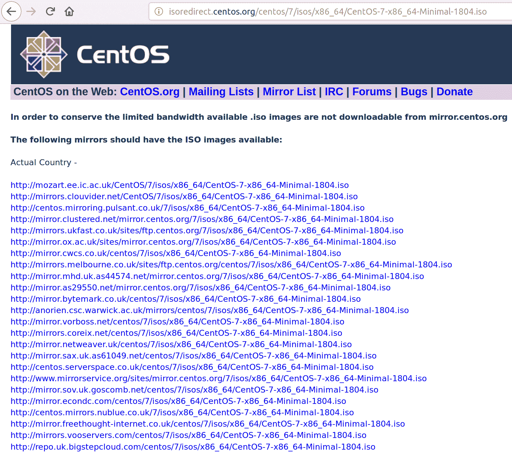
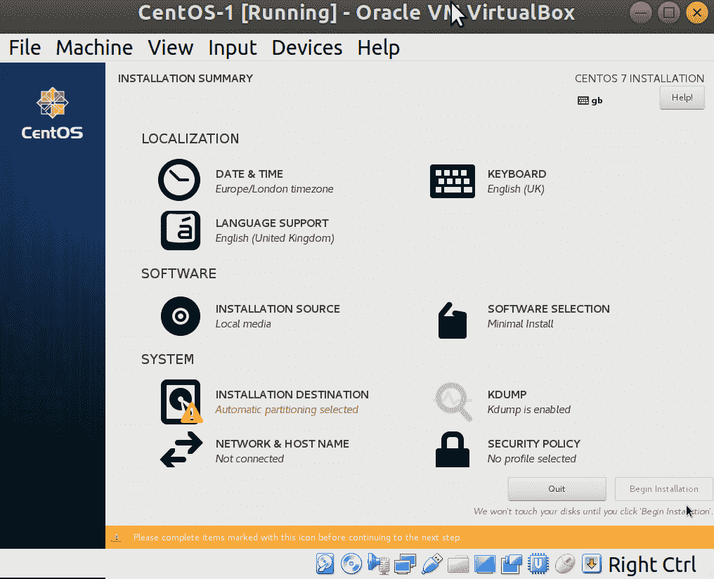
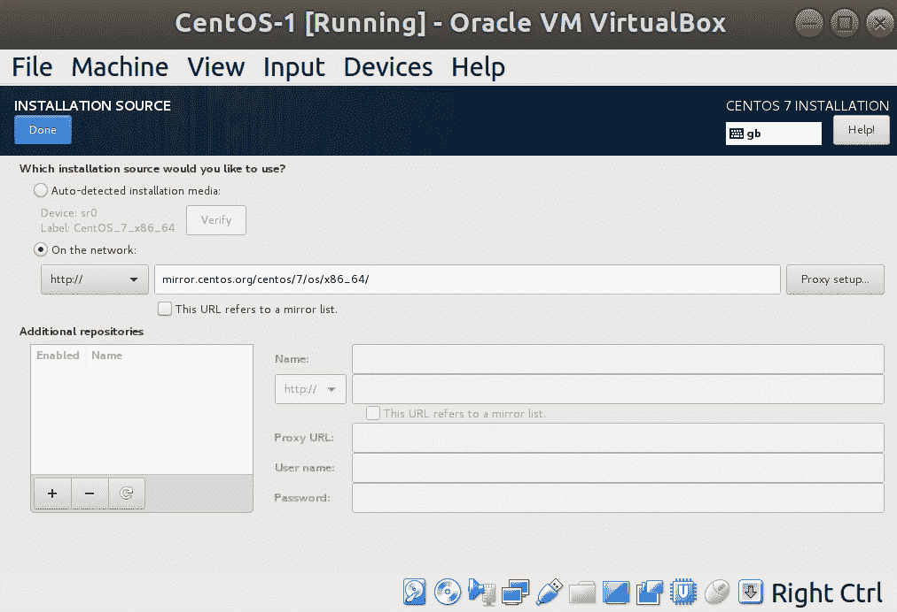
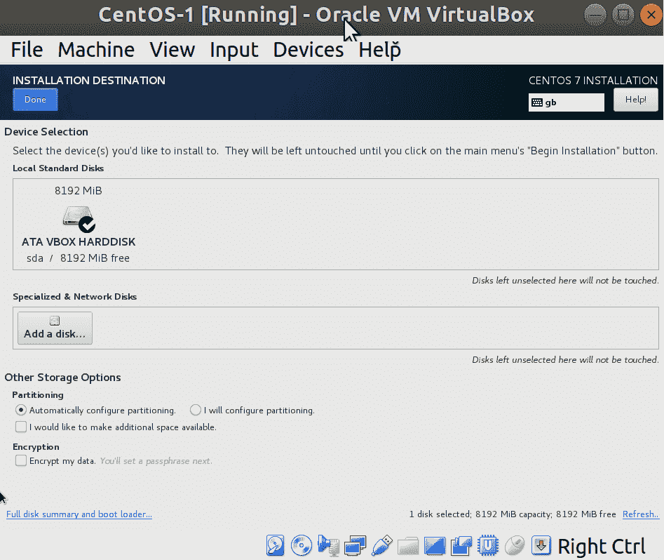
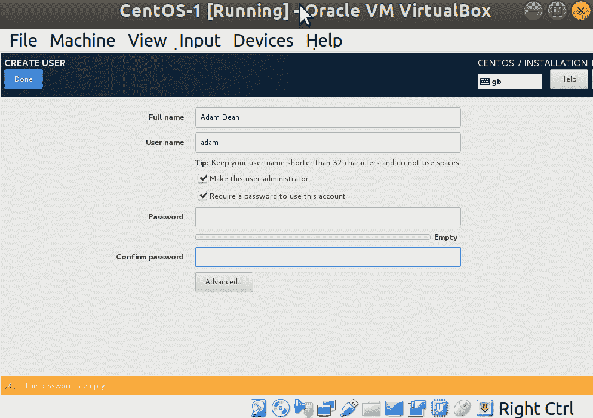
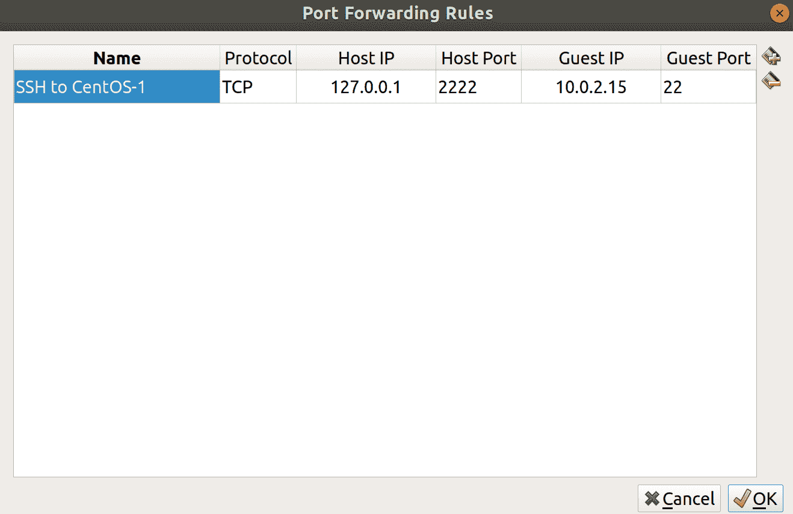
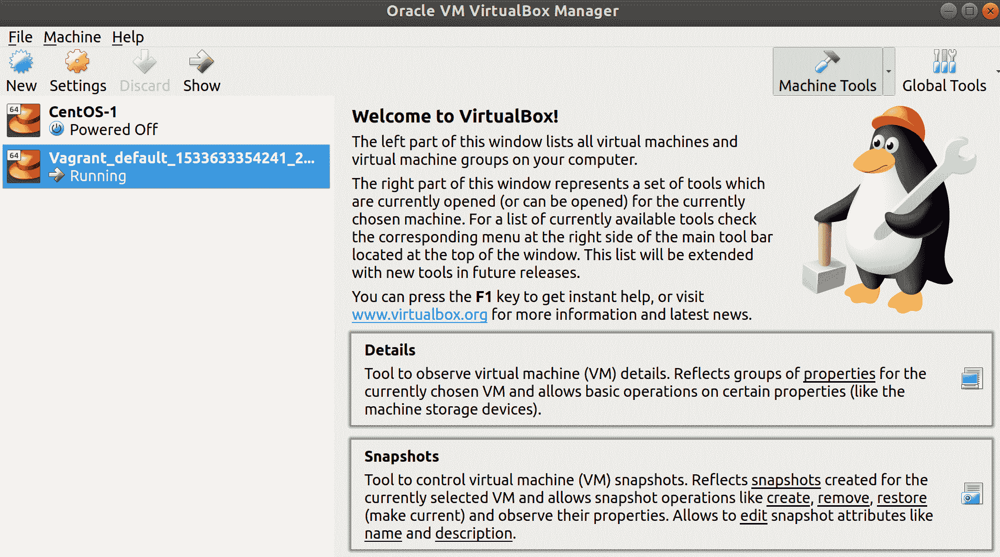

# 一、简介和环境设置

在本章中，我们将介绍以下食谱:

*   理解和选择一个分布
*   安装 VirtualBox
*   手动安装我们选择的发行版
*   连接到我们的**虚拟机** ( **虚拟机**)
*   访问和更新我们的虚拟机
*   了解虚拟机的不同之处
*   快速`sudo`解释
*   使用游民自动配置虚拟机
*   轶事(尝试，尝试，再尝试)

# 介绍

在我们深入了解我们将要使用的发行版(有时简称为“distro”)的本质之前，我们必须先后退一大步，以某种哲学的方式考虑一下 **Linux** 的概念。

对“Linux 是什么”的一个很好的描述可能很难确定，这在很大程度上是由于信息技术专业人员故意传播的混乱程度，因为当他们来解释它时，这让他们听起来比实际上聪明得多。

因为你在读这本书，我打算假设你对 Linux 的了解程度很高；你知道它是一个像 Windows 或 macOS 一样的**操作系统** ( **OS** )，它并没有受到太多的关注，也没有在桌面上普遍使用。

这个评估是对是错，取决于你在和谁说话。

悠闲自在的系统管理员(T2 系统管理员)将会更进一步，认同他们 80 年代的莫霍克风格，并认同 Linux 是一个操作系统——而且是一个体面的操作系统。然后，他们将继续玩他们本周学习的任何流行软件，以便他们下周可以尝试将其硬塞进基础设施。

自称灰胡子的人会停下手中的工作，发出叹息的声音，拿起第四杯咖啡，然后转过身来给你讲讲 GNU/Linux(或 GNU+Linux)和 Linux 内核的区别。

A kernel is an important part of any complete OS. It's the piece of software that sits between the hardware and the software, performing the grunt work of translating between the two. All operating systems will have a kernel of one sort or other, for example, the macOS kernel is call **XNU**.

你所接受的讲座将是乏味的，会涉及到像理查德·斯托尔曼、莱纳斯·托瓦尔兹，甚至可能是安德鲁·塔南鲍姆这样的名字，甚至可能需要一个多小时，但主要的收获将是 Linux 是你正在学习的操作系统的公认名称，同时在技术上也是不正确的。他们会说 Linux 实际上只是内核，除此之外的一切都是包装在 GNU 工具套件之上的发行版。

不惜一切代价避免这场辩论被认为是明智的。

For the purposes of this book, when I refer to Linux, I'm talking about the OS as a whole, and when I refer to the **kernel**, I'm really talking about the Linux kernel, the development of which is spearheaded by Linus Torvalds.

# 理解和选择一个分布

如前一节所暗示的，Linux 是碎片化的。没有更好的方式来描述这一点，因为你可以从许多不同的供应商那里下载大量不同的**发行版**。其中一些供应商是营利性的，通过您购买他们的操作系统来提供支持合同和服务级别协议，还有一些完全是自愿的，由一个人在他们的车库里操作。

从字面上看，有数百种发行版可供选择，每一种都有自己的拥护者大军来告诉你为什么他们的发行版是“唯一真正的发行版”和“真的没有理由为了一个不同的发行版四处逛逛。”

There are also Linux distributions that have been created for specific purposes, such as Red Star OS, the purportedly North Korean Linux distribution.

事实是，大多数企业使用 Linux 发行版是因为:

*   第一个是老板谷歌**免费操作系统**时弹出的
*   第一位信息技术管理员喜欢的那个
*   一个提供合同的公司，当有事情发生时，他们可以调用这个合同

浏览目前的每一个发行版都是徒劳的，因为它们几乎每周都会被创建或放弃。相反，我将浏览一个流行的选择(在服务器空间，而不是桌面)，解释一些关键的区别，然后谈论我将在本书的其余部分使用的选择。

如果您的企业使用的发行版不是我们在这里讨论的发行版，不要被吓到——大多数工具在不同的发行版之间是一致的，并且在不同的地方，有文档可以帮助您。

If you want to learn more about the various distributions available to you, a site called **DistroWatch** ([https://distrowatch.com/](https://distrowatch.com/)) has been around for years, and offers a regularly updated list of most Linux distributions, organized by page hit ranking.

# 人的本质

Ubuntu 是我安装的第一个 Linux 发行版，我敢打赌，对于 2000 年代中期开始使用 Linux 的许多人来说也是如此。这也是我用来写这本书的发行版。

由于其在营销方面的良好尝试(包括其在谷歌搜索排名中的位置)、其作为人类 Linux 的感知以及其用户友好性，它在桌面上一直享有一致的关注度。

在 Debian 的下游，Ubuntu 的开发由 Canonical 领导，虽然他们一开始强调制造坚如磐石的桌面操作系统，但后来他们进入了试图主宰服务器领域的崇高领域，并进入了物联网设备市场。

When we say "downstream" in this sense, we mean that Ubuntu shares a lot of its foundation with Debian, except it adds some extra bits and takes some bits out. In the Linux world, there are few **from-scratch** distributions, with most using another distribution as their bedrock.

Ubuntu 也以其可爱的命名约定(18.04 是仿生海狸)而闻名，Ubuntu 在桌面上如此受欢迎的事实意味着它是系统管理员安装在他们的服务器上的明显选择，达到了他们已经熟悉的程度。

最近，在处理继承系统时发现 Ubuntu 安装变得越来越普遍，通常是一个**长期支持** ( **LTS** )版本(这样可以在合理的时间内避免操作系统升级带来的混乱和头痛。)

Ubuntu 每六个月发布一次，每两年发布一次 LTS 版本(最近一次是 14.04、16.04 和 18.04)。它们的编号惯例是按年发布，然后按月发布(因此 2018 年 4 月是 18.04)。可以从 Ubuntu 的版本升级到另一个版本。

Canonical 也不避讳在 Ubuntu 中引入新技术和软件，即使它偏离了他们的 Debian 基础。最近的例子包括:

*   **快照**:一种分发与分发无关的软件的方式
*   **新贵**:后来也被`systemd`取代的替换初始化系统
*   **Mir** :显示服务器，最初是作为替代老化的 X Window 系统的一种方式构思的

Ubuntu can be downloaded from [https://ubuntu.com](https://ubuntu.com).

# 一种自由操作系统

如前所述，Debian(通用操作系统)是后来出现的许多其他发行版的基础，但它一直是桌面和服务器上最受欢迎的发行版之一。您仍然很有可能选择自己安装 Debian，或者继承一个运行这个发行版的系统，它以稳定著称。

传统上，服务器空间战争是在两个阵营之间进行的，即德比亚德鲁伊和 CentOS 红雀。最近几年，新来者加入了竞争(像 Ubuntu)，但这两个仍然持有相当多的硬件来勒索。

每隔两三年发布一次，Debian 版本以玩具总动员角色命名(7——喘息，8——杰西，9——伸展)。他们以是最稳定的 Linux 发行版之一而闻名，拥有经过测试的软件版本，以及明智的反向修复。

Backporting is the act of taking a fix from a recent release of software, such as the kernel itself, and incorporating those fixes into the version you're running, recompiling it into a new piece of software. Features are rarely backported, due to features having the potential to introduce more breaking changes into long-term support distributions.

有些批评有时是针对 Debian 的，因为在其发布版本中，它通常有旧版本的软件包，可能不包括系统管理员或开发人员想要的所有时髦和酷的功能。这是不公平的，因为人们通常在服务器领域寻求稳定性和安全性，而不是最新最棒的 Node.js 版本。

Debian 有坚定的捍卫者，它在很多人心中占有特殊的地位，尽管在一些企业环境中看到它是不寻常的，因为它是由 Debian Project 开发的，而不是一家可以提供支持合同的传统公司。在我的轶事般的不屑一顾的经历中，我更经常地在需要快速解决方案的小公司和仍然运行一些遗留系统的稍微大一点的公司中看到 Debian。

Debian can be downloaded from [https://www.debian.org](https://www.debian.org).

# 中枢神经系统——我们最常使用的系统

传统服务器空间战争的另一部分，CentOS 有自己的士兵和烈士。它仍然被广泛使用，并以稳定和无聊而闻名，与 Debian 不相上下。

**社区企业操作系统** ( **CentOS** )是红帽企业 Linux 发行版的免费提供和编译版本，旨在提供功能兼容性，一般用 CentOS 标识代替红帽标识，避免商标侵权。(2014 年 1 月，红帽宣布与 CentOS 联手，帮助推动和投资 CentOS 开发。)

由于其性质，许多系统管理员已经安装了 CentOS 来更好地了解红帽世界，因为(如前所述)红帽在企业公司中有很好的声誉，所以安装如此惊人相似的东西是有意义的。

这种安装趋势是双向的。我见过一些公司开始安装 CentOS，因为它很容易获得，并允许他们利用公开可用的免费回购轻松设计基础架构，然后再部署到 RHEL 进行最终产品部署。

**Repos** is a short form way of saying repositories, which are the common location from which software is installed on a Linux system. Where Windows usually has downloads from websites, and macOS has the App Store, Linux has used software repositories for most of its life, and they have the advantage of being easily searchable with a few keystrokes on the command line.

我也见过那些在各地部署 RHEL 的公司，却意识到他们花了很多钱，却从来没有动用他们购买的支持，因为他们的运营团队就是那么好！然后，他们将逐步淘汰红帽部署，转而使用 CentOS，在此过程中变化很小。

版本大约每隔几年发布一次，第 7 版于 2014 年发布，从那以后得到了一致的更新。但是，应该注意的是，2011 年发布的版本 6 将在 2020 年之前获得维护更新。

CentOS can be downloaded from [https://centos.org](https://centos.org). We will go through this in the installation section.

# 红帽企业版 Linux

红帽企业 Linux，或者更常见的 RHEL(因为它是一个很长的名字)，在企业中有着非常坚实的基础。它很好地瞄准了商业空间，因此发现自己在 RHEL 盒子上并不罕见，你最初认为这是一个 CentOS 安装。

让 RHEL 与众不同的是红帽公司提供的支持和各种服务，如果你购买了官方套餐，你可以利用这些服务。

尽管红帽仍然毫无疑问地提供了其发行版的源代码(因此有了 CentOS)，但他们出售从桌面到数据中心安装的各种版本和软件包。

有一句谚语说“没有人因为买了 IBM 而被解雇”，这在这个时代有点过时了，但我不止一次听到人们援引这一哲学来描述红帽。没有人会因为买了红帽而被解雇(但是你可能会被问及用另一个名字免费购买东西有什么好处。)

Beautifully, it was announced while I was in the editing stage of this book that IBM have bought Red Hat, bringing my comment above full circle. The universe is great sometimes. 

除了支持、其他企业喜欢的商业态度以及对整个社区的贡献之外，红帽还提供了一些被不同地描述为“浪费时间”和“对这个角色至关重要”的东西

对考试既有好感又有嘲笑，这取决于你在 Linux 社区中与谁交谈(就像许多事情一样，关于考试有一场圣战)。红帽提供了两个最受欢迎的，还有更多。您可以学习并成为红帽认证系统管理员，然后是红帽认证工程师，这被广泛认为是非常可接受的资格。

作为一名大学辍学生，我很高兴拥有 RHCE 的资格证书。

有些人认为这些考试是通过招聘第一线的一种方式(比如扫描你的简历，寻找他们认可的徽章的人)。其他人认为它们证明了你知道你在 Linux 系统上做什么，因为这些考试是实用的(这意味着它们让你坐在电脑前，给你一套步骤来完成。)有些人完全不考虑考试，尽管他们通常是那些从未尝试过考试的人。

Take a look at [https://www.redhat.com](https://www.redhat.com), taking particular note of the various packages on offer. They do have a developer account too, which gives you access to services you would otherwise pay for (as long as you don't try and sneak them into a production environment!).

# 安装 VirtualBox

正如我在上一节中所说的，我选择在本书的食谱中主要使用 CentOS。希望这给你学习 Linux 管理提供了一个很好的基础，但是如果你打算参加红帽考试，也给你一个好的开始。

我不要求您手边有一台备用笔记本电脑，也不要求您在某个地方租用服务器，而是主张使用虚拟机进行测试并运行给定的示例。

虚拟机就像它们听起来的那样——一种在一台或一组物理机器上虚拟化计算机硬件的方式，因此允许您测试、破解和尽情玩，而不会有让自己的计算机无法启动的风险。

创建虚拟机的方式有很多:macOS 有 xhyve，Windows 有 Hyper-V，Linux 有名为**内核虚拟机** ( **KVM** )的原生实现。

KVM (along with libvirt) is the technology that you will come across most often in the Linux virtualization space. It forms the basis of popular technologies, such as Proxmox and OpenStack, while providing near-native speeds.

另一种创建和管理虚拟机的方法是名为 VirtualBox 的程序，该程序现在由 Oracle 开发。这个软件的好处，也是我将在这里使用它的原因，是它是跨平台的，是为 macOS、Windows 和 Linux 生产的。

# 在 Ubuntu 上安装 VirtualBox

我正在用 Ubuntu 写这本书，所以我将介绍在 Ubuntu 桌面上安装 VirtualBox 的基本方法。

这与在其他发行版上安装它略有不同，但是他们中的许多人都将其打包进行安装，并且应该提供安装指南。

# 命令行安装

打开您的终端并运行以下命令:

```sh
$ sudo apt install virtualbox 
```

Using sudo will generally prompt you for your password, and you won't see anything being printed to screen as you type.

您可能会被提示确认 VirtualBox 及其依赖项的安装(可能有很多——这是一个复杂的程序，如果您有一段时间没有更新，您可能也会获得一些依赖项更新)。

点击*Y**进入*继续。以下屏幕截图显示了从命令行启动的安装示例:


一旦完成，您应该有一个工作的 VirtualBox 安装。

# 图形安装

如果你愿意，你也可以通过 Ubuntu 软件安装 VirtualBox。

只需搜索您想要的软件，在本例中是 VirtualBox，然后点击进入其商店页面。

在那里，点击安装，软件包将被安装，不需要终端！

安装后，您的屏幕将变为显示启动和删除选项。

# 在 macOS 上安装 VirtualBox

虽然我用的是 Ubuntu，但如果你不用也不是世界末日。苹果操作系统也是一个很好的操作系统，它很方便地支持 VirtualBox。

在本食谱中，我们将介绍几种在 macOS 中安装 VirtualBox 的方法。你会发现布局极其相似，不管你用的是什么操作系统。

# 命令行安装

如果您已经安装了命令行程序`brew`，那么获取 VirtualBox 就像运行以下命令一样简单:

```sh
$ brew cask install virtualbox
```

系统可能会提示您输入超级用户密码以完成安装。

Homebrew is available from [https://brew.sh/](https://brew.sh/) and is effectively the package manager that macOS needs, but doesn't have out of the box. I can't readily recommend blindly running scripts from mysterious websites, so be sure you understand what's being done (read the code) before you take the plunge and install brew.

# 图形安装

如果您希望以更传统的方式安装，Oracle 还为 macOS 提供了安装映像。

只需导航至[https://www.virtualbox.org/wiki/Downloads](https://www.virtualbox.org/wiki/Downloads)并选择 OS X 主机选项。

这将提示您将安装程序下载到您的本地系统，您可以解压缩并安装。

在安装过程中，可能会提示您输入超级用户密码。

# 在 Windows 上安装 VirtualBox

如果您没有在计算机上使用 Linux 风格，也没有使用 macOS，那么很有可能您运行的是 Windows(除非您已经深入研究了桌面上的 FreeBSD 或类似的东西，在这种情况下，我无法在这里为您提供帮助——我们需要一整个下午的时间)。

如果使用 Windows，我可以再次建议使用 VirtualBox，由于它的跨 OS 特性，可以再次从 Oracle 的站点安装。

# 图形安装

与 macOS 安装一样，导航至[https://www.virtualbox.org/wiki/Downloads](https://www.virtualbox.org/wiki/Downloads)并选择 Windows 主机选项:


这将下载一个可运行的可执行文件。

It's worth noting that Windows can complain if you're attempting to run multiple virtualization solutions at once. If you've previously run Hyper-V, or Docker, and you experience issues attempting to start VirtualBox machines, try disabling your other solutions first.

# 手动安装我们选择的发行版

唷，那是一段旅程，我们甚至还没有开始！

接下来，我们将考虑手动设置虚拟机。但不要害怕！我们还将考虑使用游民来自动化这个过程，以避免在本书的其余部分中执行重复的步骤。

Seriously, if you're already well-versed in installing CentOS, feel free to skip this section entirely. I have provided Vagrantfiles throughout the rest of this book for automating the boxes we're going to work on.

# 获取我们的 CentOS 安装介质

Linux 发行版的主要分发方式是 ISO 映像的形式。然后，可以根据需要将这些映像刻录到光盘上，或者装载到虚拟机上进行引导。

前往[https://centos.org/download/](https://centos.org/download/)看看提供的选项。

我将下载最小国际标准化组织，原因很快就会变得清楚。

通过点击，您将进入镜像页面:



这是 CentOS 项目的一项节省带宽的措施，通过提示最终用户从任意数量的不同主机下载。他们可以将带宽成本分摊给志愿者。

What you tend to find is that these providers typically fall into two categories, with exceptions. Generally, the images are provided by universities, or hosting providers. The cynic in me thinks that the hosting providers offer a mirror service as an easy source of marketing, rather than some philanthropic gesture.

选择一个靠近您的下载位置，等待下载完成。

You may note that one of the download options is via Torrent. Torrenting is a great way of spreading out the cost of bandwidth to multiple people, and allowing a small piece of the software to be downloaded from multiple locations greatly reduces load on any one source. However, it should be noted that some workplaces watch out for this type of traffic on their networks due to the reputation torrenting has.

# 检查校验和

一旦下载(这可能需要一段时间，因为即使是最小的也很大)，您将面临一个 ISO 映像。

在我的 Ubuntu 安装上，我可以在我的`Downloads`文件夹中看到它:

```sh
$ ls ~/Downloads/
CentOS-7-x86_64-Minimal-1804.iso
```

确认我们的安装媒体并确保我们已经下载了我们期望的内容的一种方法是将下载文件的`Sha256`总和与已知的良好值进行比较。这既证明了它是我们期望的下载，也检查了在文件下载期间没有发生损坏。

CentOS 提供了一个发行说明页面，我们可以访问该页面来查找我们正在比较的`Sha256`sum:[https://wiki.centos.org/Manuals/ReleaseNotes](https://wiki.centos.org/Manuals/ReleaseNotes)。

点击进入 CentOS 7 的发行说明，这将为您带来最新版本的发行说明。

在这个页面上，我们可以向下滚动到验证下载的安装映像，它将列出下载映像的当前`Sha256`总和。

Always make sure that the site you're getting your known-good `Sha256` values from is itself legitimate.

在我的例子中，我可以看到我刚刚下载的文件的`Sha256`值如下:

```sh
714acc0aefb32b7d51b515e25546835e55a90da9fb00417fbee2d03a62801efd  CentOS-7-x86_64-Minimal-1804.iso
```

有了这个，我可以回到我在终端列出文件的地方，运行一个基本命令来检查下载图像的`Sha256`值:

```sh
$ sha256sum CentOS-7-x86_64-Minimal-1804.iso 
714acc0aefb32b7d51b515e25546835e55a90da9fb00417fbee2d03a62801efd  CentOS-7-x86_64-Minimal-1804.iso
```

将 CentOS 网站上的值与我下载的图像中的值进行比较，可以确认它们是相同的。

媒体是我们所期待的！

`Sha256` checks can also be performed on Windows and macOS. On macOS, this is accomplished using built-in tools, though Windows may require other software.

# 设置我们的虚拟机

现在我们已经安装了媒体和 VirtualBox，是时候手动配置(技术术语)我们的机器并安装 CentOS 了。

In this section, we will be provisioning a small VM, but even that will come with the cost of processing power, memory, and disk space. Always ensure that you have the appropriate resources available for the machine you're trying to create. In this case, at least 50 GB of free drive space and a minimum of 8 GB of memory is advisable.

# VirtualBox 主窗口

启动后，您将看到 VirtualBox 主窗口。目前，我们只对左上角的“新建”按钮感兴趣。您需要单击“新建”按钮。

接下来，将提示您命名虚拟机。

呼叫您的第一台机器`CentOS-1`。

请注意，当您命名机器时，“类型和版本”会自动检测您键入的内容，并根据需要重新配置选择。

在这种情况下，它给了我们一个 Linux 类型和一个红帽版本(64 位)。这没关系，因为我们之前说过 CentOS 和红帽企业版 Linux 非常接近。

点击下一步。

64-bit is the architecture of the OS, though the OS you install must be supported by the CPU you have (most CPUs these days are x86_64.) The common architectures were generally x86 (32-bit) and x86_64 (64-bit) for years, but more recently the x86 variant has been dying off. The most common installations these days are x86_64, though ARM and aarch64 machines are becoming more commonplace. In this book, we will only be using x86_64 machines.

现在，我们必须配置给机器的内存量。如果您受此约束，可以将其设置为比默认的`1024` MB (1 GB)更低的值，但 1，024 MB 是一个合理的开始位置，如果需要，我们可以随时稍后调整。

现在，系统会提示我们为虚拟系统配置硬盘。

保留现在选择的创建虚拟硬盘的默认选项，然后单击创建。

系统会提示您选择一种类型。保留选中的默认值，即虚拟磁盘映像。

您可以选择随时间调配磁盘(动态分配)或一次性调配全部磁盘(固定大小)。我倾向于将其保留为动态分配。

接下来，系统会提示您选择磁盘的位置和大小。我建议将磁盘留在默认位置，目前`8` GB 的默认大小应该足够启动了。

点击创建。

如果一切顺利，您将返回主窗口，左侧应该会列出一个新的虚拟机，处于`Powered Off`状态。

# CentOS 安装

现在我们有了虚拟机，是时候在其上安装操作系统了。

选择虚拟机后，单击 VirtualBox 主窗口顶部的开始，应该会提示您首先选择启动盘。

我已经导航到我的`Downloads`文件夹，并选择了之前下载的图片。

按开始将从我们的媒体启动机器。

您将在虚拟机中看到选项屏幕，默认情况下选择测试该介质并安装 CentOS 7。

我通常点击向上箭头(在虚拟机窗口内)选择仅安装 CentOS 7 并跳过介质检查，尽管您可能希望执行测试。

If you're using physical media to install a machine (a DVD or CD), it might be a good idea to run a test of the media prior to installation.

按下*进入*将继续安装。

系统会提示您选择语言。我选择英语，因为我只会一种语言。

完成后，您会发现自己在最新的 CentOS 安装程序的登录页面上:



Note the message at the bottom, suggesting that items marked with the yellow icon need to be completed.

因为我们的日期/时间、键盘和语言都是正确的，我们将进入下一个阶段，但是如果这些设置对您来说是错误的，请随时更正。

请注意，在安装源下，我们选择了本地媒体，在软件选择下，我们选择了最小安装。这是我们之前选择最小图像的产品，给了我们一个很好的机会在互联网上谈论安装。

首先，我们需要配置我们的网络。单击网络和主机名来执行此操作。

在制作我们的虚拟机时，您应该有一个以太网设备，作为默认配置步骤的一部分。

切换设备名称右侧的开/关开关，并检查网络值的填充方式是否与我的相似:


默认情况下，VirtualBox 会创建一个 NAT 网络，这意味着您的虚拟机不会与主机位于完全相同的网络上。相反，虚拟机本身存在于网络中，但有一条通向外部世界的路径(通过您的主机)。

按左上角的完成来完成我们的网络设置(现在)！

回到主屏幕，点击安装来源:


在此屏幕中，您可以看到自动检测到的媒体实际上是我们的磁盘映像(`sr0`是 Linux 对磁盘驱动器的命名)。

将选定的单选按钮更改为“在网络上”。

用以下内容填充网址栏:

```sh
mirror.centos.org/centos/7/os/x86_64/
```

您应该会看到下面的截图:



按左上角的完成。

一旦您回到主屏幕，它将指示您的软件源已经改变，您需要通过进入软件选择窗口来验证这一点。开始吧。

通读不同的选项，但现在选择“最小安装”，然后单击“完成”:


在主屏幕上要做的最后一件事是设置我们的安装目的地。点击进入该屏幕。

看一看这些选项，但目前我们不需要修改默认分区布局或加密磁盘。您还应该看到，默认选择的磁盘是我们的 8 GB VirtualBox 磁盘。

单击完成(您不应该进行任何更改，但安装程序至少会让您进入此屏幕):



我们终于完成了(相当基本的)配置。点击主屏幕底部的开始安装按钮。

您将看到安装开始，并在等待时看到以下屏幕:


依次点击顶部的选项，设置`root`密码，创建用户。

The `root` user is akin to the administrator on a Windows system; it's all-powerful and can be dangerous in the wrong hands. Some distributions don't even prompt you to set a root password on installation, making you use your own user and `su` or `sudo` instead.

创建用户时，也要将他们标记为管理员:



单击“完成”将返回到安装进度屏幕，在该屏幕上，您可能会被提示完成安装的其余部分，并最终被要求重新启动到新安装的系统中。

任何一个正常人都不应该有这么多截图。

# 访问和更新我们的虚拟机

现在我们已经安装了虚拟机，我们将登录并快速浏览一下。

# 从 VirtualBox 窗口登录

如我们在安装过程中所做的那样，单击虚拟机将允许我们在登录提示符下键入:


我们将使用安装时创建的用户，而不是 root 用户。

请注意，您还会获得自上次登录以来的一些登录尝试信息。在这种情况下，我第一次尝试登录失败，它告诉我:


恭喜–您已经安装了 CentOS！

It's very rare to find a Linux server with a **graphical user interface** (**GUI**) installed, though it does happen. Of the thousands of servers I've worked with, I can count the number of times I've come across a GUI on one hand. It's usually cause for momentary confusion and distress, before concluding that someone had to have installed the GUI by accident – there can be no other explanation.

在继续之前，我们将运行一个快速命令来查找我们机器的 IP 地址:

```sh
$ ip a
```

`ip a` is a shorthand way of typing `ip address` which we will cover more later.

这给了我们很多网络信息，但最关键的是它给了我们网络接口的`inet`地址，`10.0.2.15`:


# 从主机终端登录

因为使用 VirtualBox 界面有些麻烦(使复制和粘贴等事情变得棘手)，所以有一种更优雅的方式来连接和交互我们的机器是有意义的。

**安全Shell** ( **SSH** )是我们将用于此的工具，因为它提供了一种快速安全的连接远程机器的方式。

Native SSH clients are available for macOS and all Linux distributions. Windows has made some progress in the area too, though I'm to understand that the easiest way of using SSH on Windows is still to download a program called PuTTY. Think of SSH as a Windows Remote Desktop Protocol. If you're new to this world, only it's generally faster to use, owing to the fact it's not got to stream a graphical connection at you. SSH is entirely text-based.

使用我们刚才的 IP 地址，我们将尝试从我们的主机(运行 VirtualBox 的机器)向我们的虚拟机进行 SSH:)

```sh
$ ssh adam@10.0.2.15
ssh: connect to host 10.0.2.15 port 22: Connection refused
```

哦不！有东西掉了！

我们还没有连接，连接显然被拒绝了！

# 确保 sshd 正在运行

首先，我们将通过登录到 VirtualBox 中的虚拟机并运行以下内容来确保`sshd`的服务器组件正在运行:

```sh
$ sudo systemctl enable sshd
$ sudo systemctl start sshd
```

应该会提示您(至少一次)我们之前设置的用户密码。

我们正在做的是，当服务器用第一个命令启动时，启用`sshd`服务，并立即用第二个命令启动它(这样我们就不必重新启动虚拟机)。

# 确保 VirtualBox 让我们通过

仅仅启动`sshd`并不足以让我们从主机连接到虚拟机——我们还必须为虚拟箱网络地址转换网络设置一些端口转发。

Port Forwarding is the method of manually specifying how traffic is to traverse a NAT'd network. If you were playing Diablo 2 or Warcraft III in the mid-2000s, you may have had great fun trying to get Port Forwarding working with your home router.

在虚拟对话框主窗口中，突出显示您的虚拟机，然后单击顶部的设置。前往网络部分，单击高级旁边的箭头，下拉更大的部分。单击端口转发:


在弹出的新窗口中，单击以在右侧添加新规则，并用以下屏幕截图中的设置填充它，如果不同，则替换您的来宾 IP:



请注意，我们正在有效地将主机上的`127.0.0.1:2222`映射到客人上的`10.0.2.15:22`。我们已经对其进行了设置，以便对主机在端口`2222`上的`localhost`地址进行的任何连接尝试都将被转发到端口`22`上的虚拟机。

`2222` in the example given is entirely random – it could be `8222`, `5123`, `2020`, and so on. I chose `2222` for convenience. You shouldn't attempt to use ports lower than `1024` for this sort of thing, as these are restricted to root-only access.

我们现在可以再次尝试 SSH 命令，针对我们刚刚设置的内容进行了调整:

```sh
$ ssh adam@127.0.0.1 -p2222
The authenticity of host '[127.0.0.1]:2222 ([127.0.0.1]:2222)' can't be established.
ECDSA key fingerprint is SHA256:M2mQKN54oJg3B1lsjJGmbfF/G69MN/Jz/koKHSaWAuU.
Are you sure you want to continue connecting (yes/no)? yes
Warning: Permanently added '[127.0.0.1]:2222' (ECDSA) to the list of known hosts.
adam@127.0.0.1's password: 
```

这个命令有些问题需要解决。

我已经使用`adam@`指定了用户名，并告诉 SSH 尝试连接到本地主机地址`127.0.0.1`，以及我们选择的端口，即`2222`。

我们看到了主持人的指纹，这一点我们稍后会详细讨论，我们也接受。

然后，系统会提示我们使用在虚拟机中设置的密码为用户登录:

```sh
Last login: Mon Aug  6 15:04:26 2018
[adam@localhost ~]$ 
```

成功！

我们现在可以在虚拟机上工作，就像它是一台真正的服务器一样，只是要注意在运行任何命令时确保您在虚拟机上。

# 更新我们的虚拟机

现在我们已经可以访问我们的机器，我们将运行一个命令来确保我们已经安装了所有软件的最新版本:

```sh
$ sudo yum update
```

运行时，您可能会看到一长串要更新的软件。输入 *Y* 确认，点击*进入*即可完成本软件的升级，以及任何需要的相关软件。还可能会提示您接受新的或更新的 GPG 密钥。

GPG is a book by itself – not an exciting book, but certainly a book. If you've upgraded software that's constantly running, such as an Apache web server, it can be a good idea to schedule a restart of that service to make sure that the newer version is in use.

根据经验，更新后需要完全重启系统的只有内核和初始化系统。这与 Windows 截然不同，在 Windows 中，重启似乎是操作系统的设计初衷，而实际工作只是副产品。

在我的例子中，我的内核得到了更新。我可以通过以下操作来确认这一点。

首先，我们列出`kernel`包的安装版本:

```sh
$ yum info kernel
Loaded plugins: fastestmirror
Loading mirror speeds from cached hostfile
 * base: repo.uk.bigstepcloud.com
 * extras: mirror.sov.uk.goscomb.net
 * updates: mirrors.melbourne.co.uk
Installed Packages
Name        : kernel
Arch        : x86_64
Version     : 3.10.0
Release     : 862.el7
Size        : 62 M
Repo        : installed
From repo   : anaconda
Summary     : The Linux kernel
URL         : http://www.kernel.org/
Licence     : GPLv2
Description : The kernel package contains the Linux kernel (vmlinuz), the core of any
 : Linux operating system.  The kernel handles the basic functions
 : of the operating system: memory allocation, process allocation, device
 : input and output, etc.

Name        : kernel
Arch        : x86_64
Version     : 3.10.0
Release     : 862.9.1.el7
Size        : 62 M
Repo        : installed
From repo   : updates
Summary     : The Linux kernel
URL         : http://www.kernel.org/
Licence     : GPLv2
Description : The kernel package contains the Linux kernel (vmlinuz), the core of any
 : Linux operating system.  The kernel handles the basic functions
 : of the operating system: memory allocation, process allocation, device
 : input and output, etc.
```

然后，我们检查当前使用的内核版本，使用`uname`:

```sh
$ uname -a
Linux localhost.localdomain 3.10.0-862.el7.x86_64 #1 SMP Fri Apr 20 16:44:24 UTC 2018 x86_64 x86_64 x86_64 GNU/Linux
```

从这里我们可以看到我们在运行版本`3.10.0-862.el7`，但是我们也有`3.10.0-862.9.1.el7`。

重新启动系统会导致在启动时选择更新的内核，再次运行`uname`会显示不同的结果:

```sh
$ uname -a
Linux localhost.localdomain 3.10.0-862.9.1.el7.x86_64 #1 SMP Mon Jul 16 16:29:36 UTC 2018 x86_64 x86_64 x86_64 GNU/Linux
```

huzzah–我们正在运行更新的内核！

# 了解虚拟机的不同之处

早些时候，我们开始讨论虚拟机以及它们是什么。我们现在将从机器内部研究两种确定我们是否在虚拟机中的方法。

如果我从托管提供商那里获得了一台新的**虚拟专用服务器** ( **VPS** )，并且想知道我的新机器正在使用什么软件进行虚拟化，我通常会这样做。

# 迪米特里

我最喜欢的工具之一，dmidecode，可以用来转储电脑的**桌面管理界面** ( **DMI** )表格。实际上，这意味着它可以用来找出你在机器上运行的是哪种硬件。

该命令需要根访问，因此我们将在这些示例中使用`sudo`。

首先，我们将列出可以传递给 dmidecode 的有效`types`:

```sh
$ dmidecode --type
dmidecode: option '--type' requires an argument
Type number or keyword expected
Valid type keywords are:
 bios
 system
 baseboard
 chassis
 processor
 memory
 cache
 connector
 slot
```

从顶部开始，我们将使用`bios`，看看它是否给了我们任何有用的东西:

```sh
$ sudo dmidecode --type bios
# dmidecode 3.0
Getting SMBIOS data from sysfs.
SMBIOS 2.5 present.

Handle 0x0000, DMI type 0, 20 bytes
BIOS Information
 Vendor: innotek `GmbH`
 Version: VirtualBox
 Release Date: 12/01/2006
 Address: 0xE0000
 Runtime Size: 128 kB
 ROM Size: 128 kB
 Characteristics:
 ISA is supported
 PCI is supported
 Boot from CD is supported
 Selectable boot is supported
 8042 keyboard services are supported (int 9h)
 CGA/mono video services are supported (int 10h)
 ACPI is supported
```

瞬间，我们可以看到`Version`旁边的`VirtualBox`，这是一个相当强的暗示，表明我们正在处理一个虚拟机。

接下来，我们将选择其他东西，`system`:

```sh
$ sudo dmidecode --type system
# dmidecode 3.0
Getting SMBIOS data from sysfs.
SMBIOS 2.5 present.

Handle 0x0001, DMI type 1, 27 bytes
System Information
 Manufacturer: innotek GmbH
 Product Name: VirtualBox
 Version: 1.2
 Serial Number: 0
 UUID: BDC643B8-8D4D-4288-BDA4-A72F606CD0EA
 Wake-up Type: Power Switch
 SKU Number: Not Specified
 Family: Virtual Machine
```

同样，这里看到的`Product Name`是`VirtualBox`，而`Family`是`Virtual Machine`，这两个都是相当确凿的证据。

最后，我们来看看`Chassis Information`:

```sh
$ sudo dmidecode --type chassis
# dmidecode 3.0
Getting SMBIOS data from sysfs.
SMBIOS 2.5 present.

Handle 0x0003, DMI type 3, 13 bytes
Chassis Information
 Manufacturer: Oracle Corporation
 Type: Other
 Lock: Not Present
 Version: Not Specified
 Serial Number: Not Specified
 Asset Tag: Not Specified
 Boot-up State: Safe
 Power Supply State: Safe
 Thermal State: Safe
 Security Status: None
```

甲骨文公司也是一条重要的信息，它让我们相信我们身处一个虚拟化的环境。

如果我们不想要很多其他信息，我们可以使用 dmidecode 的`-s`选项来微调我们的搜索。

在没有参数的情况下运行此选项会输出一个我们可以使用的潜在参数列表:

```sh
$ sudo dmidecode -s
dmidecode: option requires an argument -- 's'
String keyword expected
Valid string keywords are:
 bios-vendor
 bios-version
 bios-release-date
 system-manufacturer
 system-product-name
 system-version
 system-serial-number
 system-uuid
 baseboard-manufacturer
 baseboard-product-name
 baseboard-version
 baseboard-serial-number
 baseboard-asset-tag
 chassis-manufacturer
 chassis-type
 chassis-version
 chassis-serial-number
 chassis-asset-tag
 processor-family
 processor-manufacturer
 processor-version
 processor-frequency
```

在这里，我们可以瞬间看到`bios-version`，从前面我们知道，应该是`VirtualBox`:

```sh
$ sudo dmidecode -s bios-version
VirtualBox
```

这些类型的短输出命令对于脚本编写非常有用，有时简洁是可取的。

dmidecode is usually installed by default, at least on Ubuntu and CentOS installations.

# lshw

如果 dmidecode 不可用，您也可以使用`lshw`，一个列出硬件的命令。同样，它利用了设备上的 DMI 表。

很快，我们可以使用`lshw`的格式选项来显示一个系统的总线信息:

```sh
$ sudo lshw -businfo
Bus info Device Class Description
=====================================================
 system VirtualBox
 bus VirtualBox
 memory 128KiB BIOS
 memory 1GiB System memory
cpu@0 processor Intel(R) Core(TM) i7-7500U CPU @ 2.70GHz
pci@0000:00:00.0 bridge 440FX - 82441FX PMC [Natoma]
pci@0000:00:01.0 bridge 82371SB PIIX3 ISA [Natoma/Triton II]
pci@0000:00:01.1 scsi1 storage 82371AB/EB/MB PIIX4 IDE
scsi@1:0.0.0 /dev/cdrom disk CD-ROM
pci@0000:00:02.0 display VirtualBox Graphics Adapter
pci@0000:00:03.0 enp0s3 network 82540EM Gigabit Ethernet Controller
pci@0000:00:04.0 generic VirtualBox Guest Service
pci@0000:00:05.0 multimedia 82801AA AC'97 Audio Controller
pci@0000:00:06.0 bus KeyLargo/Intrepid USB
usb@1 usb1 bus OHCI PCI host controller
pci@0000:00:07.0 bridge 82371AB/EB/MB PIIX4 ACPI
pci@0000:00:0d.0 scsi2 storage 82801HM/HEM (ICH8M/ICH8M-E) SATA Controller [AHCI mode]
scsi@2:0.0.0 /dev/sda disk 8589MB VBOX HARDDISK
scsi@2:0.0.0,1 /dev/sda1 volume 1GiB Linux filesystem partition
scsi@2:0.0.0,2 /dev/sda2 volume 7167MiB Linux LVM Physical Volume partition
 input PnP device PNP0303
 input PnP device PNP0f03
```

这为我们提供了即时提示虚拟机的信息，例如系统、总线和显示条目。

我们还有一个易于阅读的可用类的细分，这意味着我们可以直接查询这些类，从本例中的`disk`开始:

```sh
$ sudo lshw -c disk
 *-cdrom 
 description: DVD reader
 product: CD-ROM
 vendor: VBOX
 physical id: 0.0.0
 bus info: scsi@1:0.0.0
 logical name: /dev/cdrom
 logical name: /dev/sr0
 version: 1.0
 capabilities: removable audio dvd
 configuration: ansiversion=5 status=nodisc
 *-disk
 description: ATA Disk
 product: VBOX HARDDISK
 vendor: VirtualBox
 physical id: 0.0.0
 bus info: scsi@2:0.0.0
 logical name: /dev/sda
 version: 1.0
 serial: VB5cbf266c-3015878d
 size: 8GiB (8589MB)
 capabilities: partitioned partitioned:dos
 configuration: ansiversion=5 logicalsectorsize=512 sectorsize=512 signature=000b6a88
```

或者，如果我们认为信息太多，我们可以查询系统类:

```sh
$ sudo lshw -c system
localhost.localdomain 
 description: Computer
 product: VirtualBox
 vendor: innotek GmbH
 version: 1.2
 serial: 0
 width: 64 bits
 capabilities: smbios-2.5 dmi-2.5 vsyscall32
 configuration: family=Virtual Machine uuid=BDC643B8-8D4D-4288-BDA4-A72F606CD0EA
```

# 快速 sudo 解释

在前面配方中给出的各种命令中，我们重复使用`sudo`。这样我们就不必以`root`用户的身份登录来执行各种受限操作。

`sudo` is a contraction of 'superuser do' because `sudo` used to be used for running commands as the "superuser" only, nowadays you can use it to run commands as various users. 

通常，如果您试图运行一个您没有权限成功完成的命令，您将会遇到一个错误:

```sh
$ less /etc/sudoers 
/etc/sudoers: Permission denied
```

这里我试着看一下`/etc/sudoers`文件，也正好是决定一个用户`sudo`权限的文件。

用`sudo`运行这个命令就不一样了。相反，它会为我打开文件，将我放入`less`寻呼机。

在这个文件的底部，我们找到了以下块:

```sh
## Allows people in group wheel to run all commands
%wheel  ALL=(ALL)       ALL
```

这个块的`wheel`部分没有注释，上面的文本告诉我们这意味着什么。

那么，显而易见的下一个问题是，我在`wheel`组吗？

The term `wheel` has ancient origins in old-school UNIX installations. These, days it might be called `admin` or other. CentOS keeps it classic by using `wheel`.

谢天谢地，这很容易检查——有问题的文件总是在同一个地方:`/etc/group`。

在这里，我们将`group`文件的内容打印到我们的屏幕上，并专门寻找`wheel`。

我们看到以下布局:

```sh
group_name:password:GID:user_list
```

我们可以看到`group_name`为`wheel`，`password`为较低的`x`，表示正在使用影子密码，组 ID 为`10`，该组唯一用户为本人:

```sh
$ sudo cat /etc/group | grep wheel
wheel:x:10:adam
```

我们甚至可以用一个词来完成这个任务，那就是`groups`命令，它打印出您当前用户所属的组:

```sh
$ groups
adam wheel
```

被授予使用`sudo`运行超级用户命令的能力并不是系统中每个人的直接权利，而是由单个公司和管理团队来决定如何分配这种权力。

有些地方操作中每个人都有`sudo`的力量，有些地方一个人就有那种力量。

# 使用游民自动配置虚拟机

每当你想要测试新的东西，或者创建一个沙箱来工作时，经历安装一个新的虚拟机的单调乏味，会很快变老。

正因为如此，各种各样的管理员和开发人员已经提出了解决方案，使得调配一个(或几个)虚拟机变得轻而易举。

如果我们花点时间思考一下这种方法的优势，很容易突出强调自动化虚拟机配置的几个好处:

*   它消除了在虚拟机窗口中手动键入答案所需的时间。
*   它允许在开发环境中自动运行软件测试。
*   它允许共享文本文件，作为如何构建虚拟机的方法，而不是将大型虚拟机映像从一个站点转移到另一个站点。这是**基础设施的一种形式，代码为** ( **IaC** )。

# Kickstart

自动部署盒子的一种方法是 kickstart 文件，它经常在大型部署中用于自动回答安装程序向用户提出的问题。

如果您查看 CentOS 虚拟机的`/root/`文件夹，很有可能会找到一个名为`anaconda-ks.cfg`的文件，它实际上是安装机器时手动步骤的 kickstart 文件(anaconda 是安装程序的名称)。

这些文件经过调整，或者从头开始编写，然后托管在安装网络上的网络服务器上，准备好被未配置的机器获取。

# 无赖

在本地，kickstart 文件并不实用，而且处理起来也不快捷。我们需要可以快速轻松设置的东西，但它也非常强大。

进入`Vagrant`。

由哈希公司开发的开源软件，可以用于自动配置虚拟机，甚至整个开发环境。

通常，在某个地方，你可能会发现一个`Vagrantfile`(核心流浪者的名字)...文件...)存储在某个内部应用程序的存储库中。

开发应用程序的开发人员将存储库下拉到他们的本地机器上，并使用游民配置文件来加速本地开发环境，然后他们可以使用该环境来测试代码更改或功能添加，而无需使用昂贵的开发环境。

Vagrant is available for macOS, Linux, and Windows.

在我的 Ubuntu 主机上，我这样安装了游民:

```sh
$ sudo apt install vagrant
```

有相当多的依赖项，之后总共使用了大约 200 MB 的磁盘空间。

Ubuntu 的包是相当新的，所以我们得到了一个最新版本:

```sh
$ vagrant --version
Vagrant 2.0.2
```

我对我保存文件的位置非常挑剔，所以我将在我的主目录中创建一个名为`Vagrant`的专用文件夹，用于处理我的流浪虚拟机:

```sh
$ ls
 Desktop     Downloads   Pictures   snap        Videos
 Documents   Music       Public     Templates  'VirtualBox VMs'
$ mkdir Vagrant
$ cd Vagrant/
```

接下来，我们将初始化一个新的`Vagrantfile`。以下命令将自动执行此操作:

```sh
$ vagrant init
$ ls
Vagrantfile
```

在`Vagrantfile`里看一下，不过先不要做任何改动。您会看到列出了许多选项，但默认情况下都被注释掉了。这是一个很好的方式向你介绍什么是流浪汉的能力。

请注意，默认情况下，游民会尝试使用名为`base`的框，但也会提示您查看其他框的[https://vagrantcloud.com/search](https://vagrantcloud.com/search):

```sh
 # Every Vagrant development environment requires a box. You can search for
 # boxes at https://vagrantcloud.com/search.
 config.vm.box = "base"
```

在`vagrantcloud`上搜索 CentOS 会显示一个我们可以使用的不错的默认框:[https://app.vagrantup.com/centos/boxes/7](https://app.vagrantup.com/centos/boxes/7)。

它还列出了可以在其中提供该盒子的提供者。VirtualBox 就是其中之一，这意味着它将在我们的安装中工作。

我们需要改变我们的`Vagrantfile`来指向这个盒子。从您的`Vagrantfile`所在的文件夹中，运行以下命令:

```sh
$ sed -i 's#config.vm.box = "base"#config.vm.box = "centos/7"#g' Vagrantfile
```

我们刚刚使用了`sed`(一个在命令行中编辑文本的常用工具，无论是在文件中还是在标准输出中)和`-i`选项，来就地修改我们的`Vagrantfile`。现在打开文件会显示`base`线改为指向`centos/7`。

现在，我们可以使用另一个简单的命令来调配虚拟机:

```sh
$ vagrant up
Bringing machine 'default' up with 'virtualbox' provider...
==> default: Box 'centos/7' could not be found. Attempting to find and install...
 default: Box Provider: virtualbox
 default: Box Version: >= 0
==> default: Loading metadata for box 'centos/7'
 default: URL: https://vagrantcloud.com/centos/7
==> default: Adding box 'centos/7' (v1804.02) for provider: virtualbox
 default: Downloading: https://vagrantcloud.com/centos/boxes/7/versions/1804.02/providers/virtualbox.box
==> default: Successfully added box 'centos/7' (v1804.02) for 'virtualbox'!
<SNIP>
 default: No guest additions were detected on the base box for this VM! Guest
 default: additions are required for forwarded ports, shared folders, host only
 default: networking, and more. If SSH fails on this machine, please install
 default: the guest additions and repackage the box to continue.
 default: 
 default: This is not an error message; everything may continue to work properly,
 default: in which case you may ignore this message.
==> default: Rsyncing folder: /home/adam/Vagrant/ => /vagrant
```

一切正常，你的虚拟机镜像将从`vagrantcloud`开始下载，你的盒子将在 VirtualBox 中自动旋转。

我们甚至可以在 VirtualBox 主窗口中看到我们的虚拟机:



在“设置|网络和端口转发”下看一看，展示了游民如何自动设置对 NAT 网络的访问，与我们手动设置的方式非常相似。

我们还可以使用内置的漫游快捷方式连接到我们的新虚拟机:

```sh
$ vagrant ssh
Last login: Tue Aug  7 09:16:42 2018 from 10.0.2.2
[vagrant@localhost ~]$
```

这意味着我们已经通过四个命令调配并连接到虚拟机，概括来说:

```sh
$ vagrant init
$ sed -i 's#config.vm.box = "base"#config.vm.box = "centos/7"#g' Vagrantfile
$ vagrant up
$ vagrant ssh
[vagrant@localhost ~]$
```

我们还可以使用一个命令销毁我们在对我们的`Vagrantfile`运行的同一个文件夹中创建的任何虚拟机:

```sh
$ vagrant destroy
```

I wrote about manually setting up the VM with VirtualBox (and took all those screenshots) first, because it's good to get into the habit of learning about how things are done manually prior to automating the tedious bits. This same rule can be applied to most software, because even when it takes longer, knowing how something works under the hood makes troubleshooting much easier later on.

# 轶事-尝试，尝试，再尝试

你会发现，在你的职业生涯中，圣战的概念占据主导地位，每一代新技术都有它的辩护者和反对者。这在分配战中尤其明显，在分配战中，部落派系坚定地捍卫他们选择的操作系统。如果你曾经发现自己处于为一个公司或项目选择安装哪个发行版的位置，考虑你在这里读到的一切，在盲目地接受一个人的观点为真理之前，做你自己的阅读。

这并不是说你应该自己成为一个部落——我曾经安装过前面所有的发行版，其中第一个是 Ubuntu。

早在 2005 年，我就知道了一个叫做 Linux 的东西。

在那之前，我一辈子都知道苹果电脑，因为它是我爸爸决定的品牌。为了玩暗黑破坏神，我还拼凑了一台 Windows 机器，尽管我不能说我喜欢使用操作系统本身。

当我在假期看到一本电脑杂志时，一切都变了，最后我翻了翻各种页面，直到我找到了一篇关于 Linux 的文章，这立即抓住了我的想象力。一些不同的古怪的东西吸引了我的逆反心理，结果我把这个叫做 Ubuntu 的东西烧成了一张光盘(或者几张)。

当时，如果你需要，Canonical 会免费给你发送 Ubuntu 光盘，但我不耐烦了，刻录光盘更快。

我在电脑上备份了所有我关心的东西，一旦我弄清楚如何从光盘启动，我就开始着手完成我的第一次安装。总的来说，一切都很顺利，尽管我不得不偶尔跑到另一台电脑前(不要用智能手机，记住)看看某些选项意味着什么，但我最终还是安装了一个闪亮的新桌面操作系统。

麻烦是从这个时候开始的。

我的无线网卡无法正常工作，显卡似乎运行缓慢，我在重启前只运行了一次更新，这让我没有停留在桌面上，而是停留在命令行界面上。

我以前从未见过命令行界面。

直到今天，我都不知道我是如何在那个盒子上获得一个功能性操作系统的，我一直在与一个名为`NdisWrapper`的程序做斗争，让我的无线设备工作，或者安装专有的(尽管我当时不知道这个词)图形驱动程序，一旦你升级了内核，这些驱动程序就会崩溃(尽管我当时也不知道发生了什么)。

不知何故，我慢慢地走着，当我发现不同的发行版时，很快就厌倦了 Ubuntu，并在接下来的几个月里每周都用不同的桌面。我清楚地记得运行了 Ubuntu、Debian、Fedora、OpenSUSE，以及非常非常早的安装 Gentoo 的尝试，大约五分钟后我放弃了。

我经常出现在论坛上，煞费苦心地将错误复制到谷歌中，试图找到其他有我遇到的问题的人，并且经常发现一个帖子，海报不方便地宣布他们已经**修复了它！**实际上没有提供他们使用的解决方案。

所有这些，虽然当时让我很恼火，但都是一次学习的经历，我想我对 Linux 和计算的总体热爱可以追溯到我第一次安装 Ubuntu 的时候。在那之前，电脑是游戏机，仅此而已。

很快，我就用 Linux Mint 绕过了学校的防火墙，引导到一个 Live USB 驱动器，并忽略了学校 IT 部门启用的所有微弱的阻止尝试(出于某种原因，他们认为 Windows 是唯一存在的操作系统)。我仍然不太清楚这是如何工作的，但关键是它做到了。

在《魔兽世界》的间隙，Linux 是我摆弄了多年的东西，不断更新最新版本，并安装其他发行版来尝试(“频繁地跳发行版”)。我把东西弄坏了，修好了，生 Linux 的气，生一般电脑的气，但总的来说，我慢慢进步了。

时间过得很快，总体上糟糕的学习成绩意味着我没有完成大学学业，也没有上大学就离开了。我的资历很浅，但仍有一定的计算能力。我发现并参加了一个持续了几个月的课程，并获得了几项微软认证，但这最终意味着我可以开始向公司提交稀疏的简历。

我接到一个电话，去曼彻斯特的一家主机提供商面试，并会见了现在的首席技术官。采访很奇怪，我们各种各样地讨论把电脑拆开，一点点 Linux，还有很多反击，因为事实证明他在过去的几年里玩了很多。我离开时感到紧张，但对事情的发展感到相当有趣。

回来后，在被叫回来后，我相当震惊地得到了数据中心工程师的工作，虽然这不是一个专注于 Linux 的职位，但鉴于我的教育水平，这超出了我的期望。这让我非常高兴能被雇用，我永远感谢那家公司和面试官给了我一个机会。

我想从这里展示的是，Linux 相当棒——它甚至可以给我们中最不懂学术的人一个体面的职业，它是如此充满活力和不断发展，以至于总是有新的东西要学。我遇到了一些伟大的人，并在旅途中学到了一些迷人的东西，其中很多我希望在这几页中传递下去。

我希望你会发现这本书的其余部分提供了很多信息，无论你是 Linux 管理的新手，还是只是在寻找你可能不知道的技巧和诀窍的有经验的人。