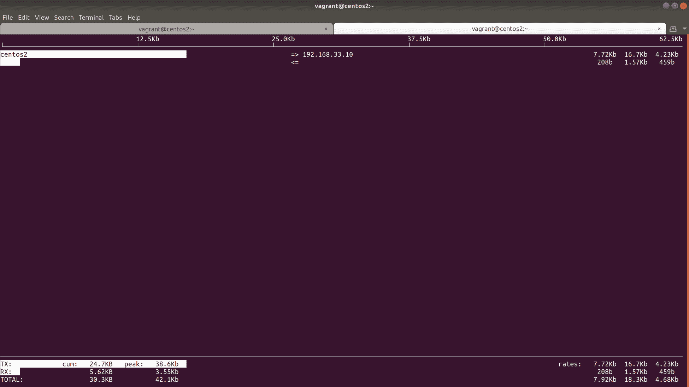
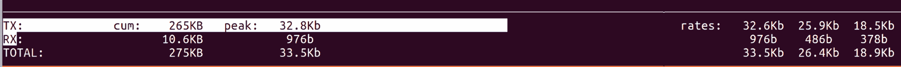

# 网络和防火墙

本章将介绍以下配方:

*   确定我们的网络配置
*   更多使用 IP 套件的示例
*   添加和配置网络接口
*   Linux 上的现代域名解析
*   配置 NTP 和我们面临的问题
*   在命令行中列出防火墙规则
*   在命令行上添加防火墙规则
*   确定正在使用的运行服务和端口
*   用`iftop`调试
*   围捕-防火墙和网络

# 介绍

现在我们知道了 SSH 和连接到我们的机器(无论是本地虚拟机还是远程服务器)的来龙去脉，我们将了解安全洋葱(防火墙)和 Linux 网络堆栈最明显的部分。

传统上，防火墙管理由`iptables`和相关命令处理，事实上，你很难找到不立即在他们找到的每台服务器上安装`iptables`工具套件的系统管理员(还没有安装)。

在现代装置上，可以发现`firewall-cmd` (CentOS)和`ufw` (Ubuntu)代替传统工具安装，或者除了传统工具之外安装。尽管纯粹主义者会誓死捍卫`iptables`，但这些都是为了让防火墙过程变得更加无痛。

无论使用什么用户空间(在内核之外运行的程序的名称，在用户级别)工具，我们所做的所有更改都是使用 Netfilter 内核框架进行的。事实上，一个名为`nft`的`iptables`和网络过滤器的替代品已经在内核中出现了一段时间，尽管它目前还没有被广泛使用。

`iptables` is something of a catchall name, at least informally. Technically, `iptables` is used for IPv4, ip6tables is used for IPv6, ebtables is used for Ethernet frames, and arptables is used for ARP.

在我们进入令人困惑的防火墙世界的过程中，我们将创建一个网络接口，并用静态和动态 IP 分配对其进行配置。

# 技术要求

我们将再次使用游民和虚拟盒子进行工作。我们将配置三个虚拟机。

我整理了以下`Vagrantfile`用于本章:

```sh
# -*- mode: ruby -*-
# vi: set ft=ruby :

$provisionScript = <<-SCRIPT
sed -i 's#PasswordAuthentication no#PasswordAuthentication yes#g' /etc/ssh/sshd_config
systemctl restart sshd
SCRIPT

Vagrant.configure("2") do |config|

 config.vm.provision "shell",
 inline: $provisionScript

 config.vm.define "centos1" do |centos1|
   centos1.vm.box = "centos/7"
   centos1.vm.network "private_network", ip: "192.168.33.10"
   centos1.vm.network "private_network", ip: "192.168.44.10", auto_config: false
   centos1.vm.hostname = "centos1"
   centos1.vm.box_version = "1804.02"
 end

 config.vm.define "centos2" do |centos2|
   centos2.vm.box = "centos/7"
   centos2.vm.network "private_network", ip: "192.168.33.11"
   centos2.vm.network "private_network", ip: "192.168.44.11", auto_config: false
   centos2.vm.hostname = "centos2"
   centos2.vm.box_version = "1804.02"
 end

 config.vm.define "ubuntu1" do |ubuntu1|
   ubuntu1.vm.box = "ubuntu/bionic64"
   ubuntu1.vm.hostname = "ubuntu1"
   ubuntu1.vm.box_version = "20180927.0.0"
 end

end
```

建议创建一个名为`Chapter Three`的文件夹，并将该代码复制到名为`Vagrantfile`的文件中。从包含您的`Vagrantfile`的文件夹中运行`vagrant up`应该配置两个虚拟机进行测试。配置完成后，通过运行以下命令，确保您可以连接到第一个:

```sh
$ vagrant ssh centos1
```

对于本部分，请确保您的`centos1`虚拟机正在运行，并与其连接。本节假设您对网络有基本的了解，也就是说，您了解静态和动态 IP 地址之间的区别，并且您大致知道公共和私有 IP 地址之间的区别。

# 确定我们的网络配置

如果你发现自己在数据中心使用物理设备，你可能会在某个时候被重重地放在一个盒子前，只有一个用户名和密码。您必须使用这些凭据来发现盒子的 IP 信息，以便象牙塔中的另一个人可以远程连接到它。

The individual in the ivory tower will sometimes be paid better than you for lounging around in a chair all day pressing a keyboard. My advice is to not dwell on this, or you'll end up bitter and grumpy ahead of your years.

# 准备好

如果还没有连接到`centos1`。

```sh
$ vagrant ssh centos1
```

为便于演示，请确保也安装了`ifconfig`:

```sh
$ sudo yum install net-tools
```

# 怎么做...

在这一小段中，我们将发现我们的盒子有什么样的 IP 地址，它在什么网络上，我们将了解它是如何配置的。

# 识别知识产权

在现代盒子上，这是通过`ip`完成的，稍后我们将深入讨论:

```sh
$ ip address show
```

You can shorten `ip` commands to make them quicker to type (as we did in the previous chapter,) but in the preceding code I've used the full expression as it better expresses what we're doing.

该命令将为您提供系统上所有接口的信息。就我们的虚拟机而言，情况如下:

```sh
1: lo: <LOOPBACK,UP,LOWER_UP> mtu 65536 qdisc noqueue state UNKNOWN group default qlen 1000
 link/loopback 00:00:00:00:00:00 brd 00:00:00:00:00:00
 inet 127.0.0.1/8 scope host lo
 valid_lft forever preferred_lft forever
 inet6 ::1/128 scope host 
 valid_lft forever preferred_lft forever
2: eth0: <BROADCAST,MULTICAST,UP,LOWER_UP> mtu 1500 qdisc pfifo_fast state UP group default qlen 1000
 link/ether 52:54:00:c9:c7:04 brd ff:ff:ff:ff:ff:ff
 inet 10.0.2.15/24 brd 10.0.2.255 scope global noprefixroute dynamic eth0
 valid_lft 85733sec preferred_lft 85733sec
 inet6 fe80::5054:ff:fec9:c704/64 scope link 
 valid_lft forever preferred_lft forever
3: eth1: <BROADCAST,MULTICAST,UP,LOWER_UP> mtu 1500 qdisc pfifo_fast state UP group default qlen 1000
 link/ether 08:00:27:4b:03:de brd ff:ff:ff:ff:ff:ff
 inet 192.168.33.10/24 brd 192.168.33.255 scope global noprefixroute eth1
 valid_lft forever preferred_lft forever
 inet6 fe80::a00:27ff:fe4b:3de/64 scope link 
 valid_lft forever preferred_lft forever
4: eth2: <BROADCAST,MULTICAST,UP,LOWER_UP> mtu 1500 qdisc pfifo_fast state UP group default qlen 1000
 link/ether 08:00:27:50:a5:cb brd ff:ff:ff:ff:ff:ff
```

我们知道`lo`是回送地址，它将始终具有`127.0.0.1/8`设置，或者该范围内的一些其他地址。

如果您明确知道想要的设备，也可以指定它。在下面的代码中，我们已经用`eth1`完成了:

```sh
$ ip address show dev eth1
```

在打印块中，我们正在寻找 IPv4 地址，它被列为属于`inet`族:

```sh
3: eth1: <BROADCAST,MULTICAST,UP,LOWER_UP> mtu 1500 qdisc pfifo_fast state UP group default qlen 1000
    link/ether 08:00:27:0d:d9:0c brd ff:ff:ff:ff:ff:ff
    inet 192.168.33.10/24 brd 192.168.33.255 scope global noprefixroute eth1
       valid_lft forever preferred_lft forever
    inet6 fe80::a00:27ff:fe0d:d90c/64 scope link 
       valid_lft forever preferred_lft forever
```

我们有 IP，`192.168.33.10`，我们知道它所在的子网，`/24 (255.255.255.0)`。

如果你有点懒，想节省眼球运动，你可以在脚本中使用类似下面的东西来获取这些信息:

```sh
$ ip address show dev eth1 | grep "inet " | awk '{ print $2 }'
192.168.33.10/24
```

The preceding code is one of many, many ways in which you could write a one-liner to generate the output you desire. Linux is flexible, and you might choose to reach the same output in a completely different way. It doesn't overly matter how you do it, but if it's something you plan on sharing, doing it in a succinct and readable style is often best.

# 识别 IP(不推荐使用的方法)

在较旧的系统上，或者由墨守成规的管理员管理的系统上，您也可以使用`ifconfig`来查找 IP 和子网。

简单运行`ifconfig`会打印所有相关信息:

```sh
$ ifconfig
eth0: flags=4163<UP,BROADCAST,RUNNING,MULTICAST> mtu 1500
 inet 10.0.2.15 netmask 255.255.255.0 broadcast 10.0.2.255
 inet6 fe80::5054:ff:fec9:c704 prefixlen 64 scopeid 0x20<link>
 ether 52:54:00:c9:c7:04 txqueuelen 1000 (Ethernet)
 RX packets 14404 bytes 12885029 (12.2 MiB)
 RX errors 0 dropped 0 overruns 0 frame 0
 TX packets 5672 bytes 409079 (399.4 KiB)
 TX errors 0 dropped 0 overruns 0 carrier 0 collisions 0

eth1: flags=4163<UP,BROADCAST,RUNNING,MULTICAST> mtu 1500
 inet 192.168.33.10 netmask 255.255.255.0 broadcast 192.168.33.255
 inet6 fe80::a00:27ff:fe4b:3de prefixlen 64 scopeid 0x20<link>
 ether 08:00:27:4b:03:de txqueuelen 1000 (Ethernet)
 RX packets 8 bytes 3164 (3.0 KiB)
 RX errors 0 dropped 0 overruns 0 frame 0
 TX packets 17 bytes 1906 (1.8 KiB)
 TX errors 0 dropped 0 overruns 0 carrier 0 collisions 0

eth2: flags=4163<UP,BROADCAST,RUNNING,MULTICAST> mtu 1500
 ether 08:00:27:50:a5:cb txqueuelen 1000 (Ethernet)
 RX packets 43 bytes 14706 (14.3 KiB)
 RX errors 0 dropped 0 overruns 0 frame 0
 TX packets 112 bytes 19336 (18.8 KiB)
 TX errors 0 dropped 0 overruns 0 carrier 0 collisions 0

lo: flags=73<UP,LOOPBACK,RUNNING> mtu 65536
 inet 127.0.0.1 netmask 255.0.0.0
 inet6 ::1 prefixlen 128 scopeid 0x10<host>
 loop txqueuelen 1000 (Local Loopback)
 RX packets 0 bytes 0 (0.0 B)
 RX errors 0 dropped 0 overruns 0 frame 0
 TX packets 0 bytes 0 (0.0 B)
 TX errors 0 dropped 0 overruns 0 carrier 0 collisions 0

```

与 IP 一样，转储关于特定接口的信息并不重要。

正如我们在下面的代码中看到的，我们再次关注`eth1`的细节:

```sh
$ ifconfig eth1
eth1: flags=4163<UP,BROADCAST,RUNNING,MULTICAST>  mtu 1500
 inet 192.168.33.10  netmask 255.255.255.0  broadcast 192.168.33.255
 inet6 fe80::a00:27ff:fe0d:d90c  prefixlen 64  scopeid 0x20<link>
 ether 08:00:27:0d:d9:0c  txqueuelen 1000  (Ethernet)
 RX packets 24  bytes 4268 (4.1 KiB)
 RX errors 0  dropped 0  overruns 0  frame 0
 TX packets 20  bytes 2116 (2.0 KiB)
 TX errors 0  dropped 0 overruns 0  carrier 0  collisions 0
```

I use the word deprecated for this, but that's generally only true for the Linux world. In the BSDs and macOS, `ifconfig` is still very much the only show in town, and it's still being actively improved and maintained.

# 识别网关地址

一旦我们有了盒子的 IP 地址和子网，我们可能想知道我们的机器正在使用哪个设备与外部世界通话。

这是交通从你的箱子里拿出来的`default`路线。

使用`ip`命令，很容易发现这一点:

```sh
$ ip route 
default via 10.0.2.2 dev eth0 proto dhcp metric 102 
10.0.2.0/24 dev eth0 proto kernel scope link src 10.0.2.15 metric 102 
192.168.33.0/24 dev eth1 proto kernel scope link src 192.168.33.10 metric 100 
```

注意`default via`部分。

# 识别网关地址(不推荐使用的方法)

安装网络工具后，我们还可以使用`route`命令找到我们的默认路由:

```sh
$ route
Kernel IP routing table
Destination     Gateway         Genmask         Flags Metric Ref    Use Iface
default         gateway         0.0.0.0         UG    102    0        0 eth0
10.0.2.0        0.0.0.0         255.255.255.0   U     102    0        0 eth0
192.168.33.0    0.0.0.0         255.255.255.0   U     100    0        0 eth1
```

# 它是如何工作的...

当您使用`ip`或`ifconfig`时，您正在查询内核知道的网络设备，以及它当前正在管理哪些网络设备的流量。

If you don't see your network device in the list output by either of the common commands, it's likely that your kernel doesn't have a driver for the device in question. This is rare these days, but can happen for custom networking gear, whereupon the vendor should supply a kernel module for use with it.

`ip`本身不仅仅是一个命令:它是一个套件，这意味着当我们在这里使用`ip address`命令时，我们只使用了可用工具的一个子部分。

当您使用`ip route`或`route`命令时，您实际上是在查询分布的路由表。

# 还有更多...

了解网络配置的基本知识很好，但这通常只是第一步。

在这里，我将介绍一些基本的网络故障排除。

# 检查连通性

知道我们的盒子使用什么设备作为网关是一回事，但实际上能够到达它完全是另一回事。

如果你站在一个盒子前，很有可能你已经被召唤去试着找出不工作的部分。尝试 ping 网关是很好的第一步:

```sh
$ ping 10.0.2.2
PING 10.0.2.2 (10.0.2.2) 56(84) bytes of data.
64 bytes from 10.0.2.2: icmp_seq=1 ttl=64 time=0.768 ms
64 bytes from 10.0.2.2: icmp_seq=2 ttl=64 time=0.333 ms
64 bytes from 10.0.2.2: icmp_seq=3 ttl=64 time=0.637 ms
```

在这里，我们的网关设备做出了响应，但是如果你的设备没有响应，或者你得到了`Destination Host Unreachable`，那么很有可能出了问题(或者你的象牙塔里的同事给了你无用的信息——一定要先检查这个)。

在下面的代码中，我们再次使用`ip`命令来检查接口本身的状态:

```sh
$ ip address show dev eth0
2: eth0: <BROADCAST,MULTICAST,UP,LOWER_UP> mtu 1500 qdisc pfifo_fast state UP group default qlen 1000
```

你可能有兴趣知道为什么我们这里有三个`UP`值。

人字纹内的初始`UP`值是接口物理上是否打开。如果电缆已物理连接并处于上升状态，也会显示同样位于人字纹内部的`LOWER_UP`值。人字外的`state UP`值是接口是否管理性开启，可以通过软件更改为`DOWN`。

# 检查我们的箱子会走什么路线

也有可能是连接失败，因为你的盒子试图从错误的接口说话。我们可以再用`ip`来核对一下。

首先，让我们看看在与更广阔的世界交流时，我们将走哪条路线。

在下面的代码中，我们正在检查我们的盒子将如何尝试与带有 IP `1.1.1.1`的设备对话。它向我们显示，我们将通过网关地址`10.0.2.2`和我们的`eth0`界面进入该 IP:

```sh
$ ip route get 1.1.1.1
1.1.1.1 via 10.0.2.2 dev eth0 src 10.0.2.15 
 cache 
```

现在，让我们看看如果我们与网关通信，我们将采取什么路线。在这里，我们可以看到一个直接连接(没有`via`)也走出`eth0`:

```sh
$ ip route get 10.0.2.2
10.0.2.2 dev eth0 src 10.0.2.15 
 cache 
```

到目前为止，一切都很好，但是如果我们想与专用网络上的另一台虚拟机通话，该怎么办？

```sh
$ ip route get 192.168.33.11
192.168.33.11 dev eth1 src 192.168.33.10 
 cache 
```

`eth1`将被使用，考虑到它在同一个网络上，这非常有意义。

请稍等，我们自己的 IP 也在这个子网中，所以如果我们尝试与自己通信会发生什么？

```sh
$ ip route get 192.168.33.10
local 192.168.33.10 dev lo src 192.168.33.10 
 cache <local> 
```

啊！聪明！我们仍然使用回送地址(`dev lo`)来与我们的本地 IP 地址对话，因为 Linux 知道这个 IP 是我们的。

As with the preceding example, Linux occasionally does things that might surprise you, especially if you're coming from a Windows or BSD administration world. Take the `lo` interface—it's not just `127.0.0.1`, but the entire `/8` range. You can ping anywhere from `127.0.0.1` to `127.255.255.254` on a typical Linux system, and get a response from your local machine.

You can even ping `127.1` and get a legitimate response, but I'll leave it as an exercise for the reader to determine why this might be.

# 请参见

看一下`ip`和`ip-address`手册页。

Personally, I would focus on learning about the `ip` suite, instead of the old net-tools, because if you're trying to work on a networking problem, there's a good chance you won't be able to install net-tools in a pinch.

# 更多使用 ip 套件的示例

由于它的现代性质，我们将从现在开始使用`ip`。

本节假设您对网络有基本的了解，也就是说，您了解静态和动态 IP 地址之间的区别，并大致了解公共和私有 IP 地址之间的区别。

# 准备好

在本节中，我们将对我们的网络进行一些更改。如果在任何时候你发现自己被踢出了你的虚拟机，记住*《银河系漫游指南》*，不要惊慌——只要摧毁你的虚拟机，然后重新开始。

从`centos1`命令行开始。

```sh
$ vagrant ssh centos1
```

# 怎么做...

在本节中，我们将使用`ip suite`来更改网络堆栈的一些基本元素，例如添加另一个 IP 地址，或者完全关闭一个接口。

# 根据接口添加和删除 IP

这可以通过`ip address`命令完成，但是需要 root。

在这个例子中，我选择了`192.168.33.0/24`子网中的另一个 IP，我知道它没有被使用:

In the real world, it's good practice to ping an IP first, even if you believe it's free to use.

```sh
$ sudo ip address add 192.168.33.22/24 dev eth1
```

查看我们的`eth1`界面，我们现在可以看到二级 IP:

```sh
3: eth1: <BROADCAST,MULTICAST,UP,LOWER_UP> mtu 1500 qdisc pfifo_fast state UP group default qlen 1000
    link/ether 08:00:27:0d:d9:0c brd ff:ff:ff:ff:ff:ff
    inet 192.168.33.10/24 brd 192.168.33.255 scope global noprefixroute eth1
       valid_lft forever preferred_lft forever
 inet 192.168.33.22/24 scope global secondary eth1
       valid_lft forever preferred_lft forever
    inet6 fe80::a00:27ff:fe0d:d90c/64 scope link 
       valid_lft forever preferred_lft forever
```

Upon a reboot, this change will be lost. We will talk about adding IP information permanently in the section titled 'Adding and configuring network interfaces'. 

如果我们想删除一个 IP，我们再次使用`ip`，这次用`del`指令替换`add`指令:

```sh
$ sudo ip address del 192.168.33.22/24 dev eth1
```

# 管理性地关闭和打开接口

为了使用接口本身，我们需要使用`ip`套件的另一个元素，这就是`ip link`。再次注意`sudo`的用法:

```sh
$ sudo ip link set eth1 down
```

查看我们的界面，可以看到界面处于`DOWN`状态:

```sh
3: eth1: <BROADCAST,MULTICAST> mtu 1500 qdisc pfifo_fast state DOWN group default qlen 1000
 link/ether 08:00:27:0d:d9:0c brd ff:ff:ff:ff:ff:ff
 inet 192.168.33.10/24 brd 192.168.33.255 scope global noprefixroute eth1
 valid_lft forever preferred_lft forever
```

您会发现自己无法从`centos2`ping 通该主机。

要恢复接口，只需运行以下命令:

```sh
$ sudo ip link set eth1 up
```

Note that if you add another IP to an interface on a temporary basis before bringing an interface down and up, your temporary additional IP will not be remembered.

# 向我们的路由表添加新路由

如果我们在目的地不明显的网络中工作，我们可能需要在设置中添加特定的路由。

This is generally seen in cluster scenarios and setups where a route may be accessible via another channel, but may not be advertised by that same channel.

在下面的代码中，我们将告诉我们的虚拟机，如果它想与`172.16.0.0/12`网络上的任何地址通话，它必须通过`eth1`和网关`192.168.33.11`(这是我们的`centos2`虚拟机)发送流量:

```sh
$ sudo ip route add 172.16.0.0/12 via 192.168.33.11 dev eth1
```

检查我们的路由表，我们可以看到我们的路由是否到位:

```sh
$ ip route
default via 10.0.2.2 dev eth0 proto dhcp metric 100 
10.0.2.0/24 dev eth0 proto kernel scope link src 10.0.2.15 metric 100 
172.16.0.0/12 via 192.168.33.11 dev eth1 
192.168.33.0/24 dev eth1 proto kernel scope link src 192.168.33.10 metric 101
```

# 它是如何工作的...

同样，我们使用`ip suite`与我们机器的各种网络元件进行交互。通常，这些命令可用于环境更改的故障排除和测试，然后才能使这些更改永久化。

在向接口添加或删除 IP 地址时，您可以创建一个接口有多个 IP 地址供不同应用程序使用的情况。

Before the days of SNI, it wasn't uncommon to see multiple IP addresses in use on web servers so that each HTTPS site could have its own IP assignment.

在关闭或打开网络接口时，我们首先告诉系统从管理上关闭一个接口，而不是从物理上拔下以太网电缆。如果你关闭一个界面，然后检查你的`/var/log/messages`文件——你应该看到如下内容:

```sh
Aug 12 12:38:09 centos1 NetworkManager[566]: <info>  [1534077489.1507] device (eth1): state change: activated -> unavailable (reason 'carrier-changed', sys-iface-state: 'managed')
Aug 12 12:38:09 centos1 dbus[545]: [system] Activating via systemd: service name='org.freedesktop.nm_dispatcher' unit='dbus-org.freedesktop.nm-dispatcher.service'
Aug 12 12:38:09 centos1 systemd: Starting Network Manager Script Dispatcher Service...
Aug 12 12:38:09 centos1 dbus[545]: [system] Successfully activated service 'org.freedesktop.nm_dispatcher'
Aug 12 12:38:09 centos1 systemd: Started Network Manager Script Dispatcher Service.
Aug 12 12:38:09 centos1 nm-dispatcher: req:1 'down' [eth1]: new request (3 scripts)
Aug 12 12:38:09 centos1 nm-dispatcher: req:1 'down' [eth1]: start running ordered scripts...
```

在这里，我们可以看到网络管理器在意识到设备状态已经改变的情况下运行一系列步骤。

Network manager dispatcher is the service that controls what happens when an interfaces goes down or comes up. Take a look in `/etc/NetworkManager/dispatcher.d/` if you're interested in learning more.

最后，当我们向路由表添加路由时，我们告诉内核的底层路由子系统通过我们的`eth1`接口向网络`172.16.0.0/12`发送数据包，网关地址为`192.168.33.11`。

I have frequently found myself modifying the routing table of devices, though most of that was done for cluster setups in phone PBX environments. It may not be something you do day-to-day, but it's worth knowing!

# 还有更多...

如果您想看到我们的路由流量到达`centos2`，请登录您的第二个虚拟机，并确保安装了`tcpdump`:

```sh
$ sudo yum install -y tcpdump
```

接下来，确保您之前的额外路线在`centos1`上就位，并开始一个`ping`前往范围内的任何地址:

```sh
$ ping 172.16.0.3
PING 172.16.0.3 (172.16.0.3) 56(84) bytes of data.
```

回到`centos2`，启动`tcpdump`对抗我们的`eth1`界面:

```sh
$ sudo tcpdump -i eth1
```

你应该从`centos1`开始看`ICMP echo requests`，没有回应:

```sh
12:48:26.735055 IP 192.168.33.10 > 172.16.0.3: ICMP echo request, id 1696, seq 1, length 64
12:48:27.736195 IP 192.168.33.10 > 172.16.0.3: ICMP echo request, id 1696, seq 2, length 64
12:48:28.738030 IP 192.168.33.10 > 172.16.0.3: ICMP echo request, id 1696, seq 3, length 64
12:48:29.743270 IP 192.168.33.10 > 172.16.0.3: ICMP echo request, id 1696, seq 4, length 64
12:48:30.747098 IP 192.168.33.10 > 172.16.0.3: ICMP echo request, id 1696, seq 5, length 64
12:48:31.750916 IP 192.168.33.10 > 172.16.0.3: ICMP echo request, id 1696, seq 6, length 64
12:48:32.752634 IP 192.168.33.10 > 172.16.0.3: ICMP echo request, id 1696, seq 7, length 64
```

回到`centos1`上，停止你的`ping` ( *Ctrl* + *C* )并记录传输的数据包和丢失的数据包:

```sh
--- 172.16.0.3 ping statistics ---
8 packets transmitted, 0 received, 100% packet loss, time 7019ms
```

因为我们没有地方给`centos2`路由我们的数据包，而`centos2`实际上并没有被设置为路由器，所以数据包根本没有得到应答，`centos1`仍然没有朋友——可怜的`centos1`。

# 请参见

如果你对使用 Linux 作为路由器感兴趣，这是完全可能的，只需要一个 sysctl 的改变，并有可能在防火墙部分伪装一点**。虽然超出了这本书的范围，但你可能会发现自己未来需要它。**

 **# 添加和配置网络接口

在本节中，我们将了解如何在系统中配置多个网络接口，并讨论如何在现实世界中利用这些接口(例如用于备份流量)。

# 准备好了

我们将使用我们的第二个网络，这是本章的新内容。如果您使用的是之前的`Vagrantfile`，那么您已经设置了这个网络。如果您正在运行自己的系统，请为同一网络上的每个虚拟机添加另一个网卡。

使用游民连接`centos1`。

```sh
$ vagrant ssh centos1
```

检查`eth2`界面是否可供您使用。它应该类似于以下内容:

```sh
$ ip link show eth2
4: eth2: <BROADCAST,MULTICAST,UP,LOWER_UP> mtu 1500 qdisc pfifo_fast state UP mode DEFAULT group default qlen 1000
 link/ether 08:00:27:7d:f3:6b brd ff:ff:ff:ff:ff:ff
```

# 怎么做...

我们将考虑使用配置文件永久添加网络信息，这样我们的配置就不会在重新启动后丢失(如果我们使用`ip suite`和临时分配就会出现这种情况)。

# 配置新接口

首先为`eth2`创建一个配置文件:

```sh
$ sudo touch /etc/sysconfig/network-scripts/ifcfg-eth2
```

接下来，使用以下内容填充它:

```sh
$ sudo tee /etc/sysconfig/network-scripts/ifcfg-eth2 << HERE 
BOOTPROTO=none
ONBOOT=yes
IPADDR=192.168.44.10
NETMASK=255.255.255.0
DEVICE=eth2
PEERDNS=no
HERE
```

The `tee` command is used here. It enables reading from standard input and outputting to a destination of our choosing, in this case, a file.

现在，以个人身份重新启动您的界面:

```sh
$ sudo ifdown eth2
$ sudo ifup eth2
```

或者，通常重新启动网络:

```sh
$ sudo systemctl restart network
```

It's generally a good rule of thumb to be the least disruptive when working with components that make up a greater whole. Even in a `dev` environment, it's a good habit to get into.

# 它是如何工作的...

我们在这里所做的就是创建一个接口脚本，您的系统可以使用它在引导时正确配置接口。

让我们浏览一下添加到文件中的选项。

```sh
BOOTPROTO=none
```

该设置代表`boot-time protocol`，我们将其设置为`none`而不是`dhcp`或`bootp`。

在 DHCP 环境中，您希望由您的 DHCP 服务器自动分配地址。这里，我们设置了一个静态地址，所以我们声明如下。

```sh
ONBOOT=yes
```

这一点可能看起来很明显，但是接口的默认行为是在启动时不初始化。通过此设置，我们可以确保网络接口与系统同步。

```sh
IPADDR=192.168.44.10
NETMASK=255.255.255.0
```

有些不言自明，但这些选项是我们正在配置的网络的 IP 地址和子网掩码。在这里，我选择了另一个`/24`网络，比我们的`eth1`配置高几个八位字节。

```sh
DEVICE=eth2
```

此选项用于指定我们的配置将应用于哪个硬件接口。值得注意的是，这些接口名称既可以是通用的(`eth0`、`eth1`等)，也可以是网卡特定的名称(它们可能不总是`eth<something>`)。

```sh
PEERDNS=no
```

默认为`yes`在 DHCP 环境下，这个选项保证了我们的系统在接口被调出时不会试图修改`/etc/resolv.conf`。

# 还有更多...

以太网接口配置文件(`ifcfg-eth2`)还有一些其他选项，在设置网络时可以考虑。在将网络打包到任何脚本中之前，检查是否有可能为您期望的结果进行配置更改。

接口绑定也可以在接口配置文件中创建和配置，以便在机器有两个物理连接到同一个目的地时使用，以防止接口或电缆出现故障。

I have seen exactly one bad `Cat-5e` cable in the entirety of my professional life—cables are physical, and don't spontaneously break.

我们没有做的一件事是指定有问题的接口不是由网络管理器(网络管理守护进程)管理的。

您可以使用简单的`nmcli device`命令查看哪些接口由网络管理器管理，哪些接口不受网络管理器管理:

```sh
$ nmcli device 
DEVICE  TYPE      STATE      CONNECTION 
eth0    ethernet  connected  System eth0 
eth1    ethernet  connected  System eth1 
eth2    ethernet  connected  System eth2 
lo      loopback  unmanaged  --  
```

如果我们希望网络管理器不干涉，我们可以通过在`ifcfg-eth2`文件中添加一个配置选项来改变这一点:

```sh
BOOTPROTO=none
ONBOOT=yes
IPADDR=192.168.44.10
NETMASK=255.255.255.0
DEVICE=eth2
PEERDNS=no
NM_CONTROLLED=no
```

现在，再次上下移动您的界面:

```sh
$ sudo ifdown eth2
$ sudo ifup eth2
```

然后，再次检查`nmcli`，这次注意`unmanaged`状态:

```sh
$ nmcli device 
DEVICE  TYPE      STATE      CONNECTION 
eth0    ethernet  connected  System eth0 
eth1    ethernet  connected  System eth1 
eth2    ethernet  unmanaged  -- 
lo      loopback  unmanaged  --
```

如果您感到好奇，可以查看`nmtui`命令，了解网络管理员知道的配置网络接口的交互方式。

# 请参见

想一想在什么地方安装额外的网络可能会有用。一个很好的常见例子是备份网络，公司将建立一个专门用于备份流量的专用网络。

备份的大小不一，但有时很容易达到千兆字节甚至万亿字节，因此给它们一个完全独立的网络是有意义的。

You can also manage traffic priority with things such as **Quality of Service** (**QoS**) settings on larger and enterprise networks. This can be a valid solution if you would rather deal with the software administration overhead of dealing with such scenarios. Generally, I'm a fan of simple, and though it definitely costs more to have physical equipment, it's less to manage in the long run.

# Linux 上的现代域名解析

在本节中，我们将了解域名解析，特别是安装在典型 CentOS 盒子上的软件，该软件能够在出现域时查找地址。

我们来看看`/etc/resolv.conf`和当前一代 Linux 系统上的域名解析方法(比如网络管理器)。我们将测试与我们的域名系统服务器的连接，并运行域名系统查询，看看它是否工作。

本节假设对域名和 IP 地址有基本的了解。

# 准备好

连接到`centos1`并通过 ping 一个地址来检查您的域解析是否已经工作。

我在英国，所以我默认使用英国广播公司进行测试:

```sh
$ ping bbc.co.uk
PING bbc.co.uk (151.101.0.81) 56(84) bytes of data.
64 bytes from 151.101.0.81 (151.101.0.81): icmp_seq=1 ttl=63 time=30.4 ms
```

如果您的虚拟机由于某种原因无法正常工作，请销毁并重新创建您的虚拟机。

确定可以 ping 通一个域后，安装 dig(以及该软件包附带的无数其他工具):

```sh
$ sudo yum install -y bind-utils
```

# 怎么做...

在这里，我们将运行一些基本的故障排除步骤，旨在帮助您确定问题可能出在哪里。

# 查询域

要在 Linux 上查询域名，可以使用`dig`:

```sh
$ dig bbc.co.uk

; <<>> DiG 9.9.4-RedHat-9.9.4-61.el7 <<>> bbc.co.uk
;; global options: +cmd
;; Got answer:
;; ->>HEADER<<- opcode: QUERY, status: NOERROR, id: 6288
;; flags: qr rd ra; QUERY: 1, ANSWER: 4, AUTHORITY: 0, ADDITIONAL: 1

;; OPT PSEUDOSECTION:
; EDNS: version: 0, flags:; udp: 65494
;; QUESTION SECTION:
;bbc.co.uk.            IN    A

;; ANSWER SECTION:
bbc.co.uk.        227    IN    A    151.101.0.81
bbc.co.uk.        227    IN    A    151.101.64.81
bbc.co.uk.        227    IN    A    151.101.128.81
bbc.co.uk.        227    IN    A    151.101.192.81

;; Query time: 24 msec
;; SERVER: 10.0.2.3#53(10.0.2.3)
;; WHEN: Sun Aug 12 14:20:28 UTC 2018
;; MSG SIZE  rcvd: 102
```

在这里，我们可以看到用于域解析(加粗)的服务器是`10.0.2.3`，恰好是 VirtualBox 提供解析服务。

我们也看到了`ANSWER SECTION`，顾名思义，这就是我们的问题的答案。我们可以在这些地址中的任何一个(目前)找到`bbc.co.uk`。

# 检查域分辨率设置

当涉及到系统上的 DNS 配置时，事实的来源通常是解析器文件`/etc/resolv.conf`，尽管这个文件越来越不直接使用，而是由外部程序管理。

在 CentOS 的情况下，`resolv.conf`文件由我们的朋友网络管理器管理，在其他系统上，它可能是`systemd-resolved`。

看看你的`resolv.conf`文件:

```sh
$ cat /etc/resolv.conf 
# Generated by NetworkManager
search discworld
nameserver 10.0.2.3
```

`search` in the previous code is the search list for hostname lookup. It's generated by looking at the domain the box is sitting on.
`nameserver` is the value of our DNS resolver, in this case, the VirtualBox default.

这告诉我们，网络管理器是填充我们文件的程序。

然后我们可以使用`nmcli`列出它所知道的 DNS 服务器:

```sh
$ nmcli -f ipv4.dns,ipv4.ignore-auto-dns connection show System\ eth0
ipv4.dns:                               --
ipv4.ignore-auto-dns:                   no
```

在前面的代码中，我们使用带有两个过滤器`ipv4.dns`和`ipv4.ignore-auto-dns`的`nmcli`来检查我们的默认界面(这里是`eth0`系统)。

`ipv4.dns`的值没有设置，这意味着它不太可能从接口上的配置指令中读取值。

设置`ipv4.ignore-auto-dns`的值，我们可以从`no`的值看出，我们没有忽略来自 DHCP 服务器的自动 DNS 分配。

# 更改域分辨率设置

要使用我们选择的域名系统服务器，我们应该使用`nmcli`。

在下面的代码中，我们设置了自己的 DNS 服务器值(`1.1.1.1`)，并将`ipv4.ignore-auto-dns`的真值从`no`翻转到`yes`:

```sh
$ sudo nmcli connection modify System\ eth0 ipv4.dns "1.1.1.1" ipv4.ignore-auto-dns "yes"
```

请注意如何在一行中修改这两个字段。

使用以下命令重新加载接口配置:

```sh
$ sudo nmcli connection up System\ eth0
```

查看`/etc/resolv.conf`中的良好测量，只是为了检查:

```sh
$ cat /etc/resolv.conf 
# Generated by NetworkManager
nameserver 1.1.1.1
```

然后，运行`dig`:

```sh
$ dig bbc.co.uk

; <<>> DiG 9.9.4-RedHat-9.9.4-61.el7 <<>> bbc.co.uk
;; global options: +cmd
;; Got answer:
;; ->>HEADER<<- opcode: QUERY, status: NOERROR, id: 10132
;; flags: qr rd ra; QUERY: 1, ANSWER: 4, AUTHORITY: 0, ADDITIONAL: 1

;; OPT PSEUDOSECTION:
; EDNS: version: 0, flags:; udp: 1452
;; QUESTION SECTION:
;bbc.co.uk.            IN    A

;; ANSWER SECTION:
bbc.co.uk.        210    IN    A    151.101.0.81
bbc.co.uk.        210    IN    A    151.101.64.81
bbc.co.uk.        210    IN    A    151.101.128.81
bbc.co.uk.        210    IN    A    151.101.192.81

;; Query time: 23 msec
;; SERVER: 1.1.1.1#53(1.1.1.1)
;; WHEN: Sun Aug 12 14:46:05 UTC 2018
;; MSG SIZE  rcvd: 102
```

`1.1.1.1` is a new and trendy DNS service from Cloudflare and APNIC. This isn't an endorsement, it's just really easy to remember.

# 它是如何工作的...

当您请求系统上某个域的目的地时，您实际上是在向您配置的解析器发送请求，解析器返回它(或更上游的系统)知道的地址。

在我们的例子中，我们可以通过将两个终端连接到`centos1`来看到这个请求的发生。

在我们的第一个终端上，我们将在`eth1`上安装并启动`tcpdump`:

```sh
$ sudo yum install tcpdump -y
$ sudo tcpdump -i eth0 -n port 53
```

一旦设置好，跳到第二个连接，运行你的`dig`对英国广播公司(或你选择的任何一个英国广播公司):

```sh
$ dig bbc.co.uk
```

返回到您的第一个窗口，您应该会看到您的请求的结果:

```sh
14:58:50.303421 IP 10.0.2.15.51686 > 1.1.1.1.domain: 19866+ [1au] A? bbc.co.uk. (38)
14:58:50.331999 IP 1.1.1.1.domain > 10.0.2.15.51686: 19866 4/0/1 A 151.101.0.81, A 151.101.64.81, A 151.101.128.81, A 151.101.192.81 (102)
```

我们问我们的名称服务器`bbc.co.uk`住在什么地址，在回答中，我们得到了几个要连接的 IP 地址。不错吧。

# 还有更多...

这一部分显然使用网络管理器进行了更改，但这并不是说这是唯一的方法。有可能阻止网络管理器劫持并试图控制您的域名系统。

可以在`NetworkManager.conf`文件的`main`部分设置`dns=none`，详见手册页:

"`none: NetworkManager` will not modify `resolv.conf`. This implies
           rc-manager unmanaged"

在`/etc/NetworkManager/NetworkManager.conf`的配置文件中看到，应该是这样的:

```sh
[main]
#plugins=ifcfg-rh,ibft
dns=none
```

此时重启`NetworkManager`会阻止其以后尝试修改`/etc/resolv.conf`。

如果你想用别的东西来管理你的系统的域名系统，这可能会很有用，即使它只是你写的一个脚本，用来在`/etc/resolv.conf`中敲打你的域名系统服务器。

It's possible to not use `NetworkManager` at all, disabling it as a daemon and doing everything in the old script fashion. In fact, it's really easy, but in my opinion it's worth getting to grips with how things are done by default these days.

域名系统通常是成对进行的，最好有一个备用的域名系统服务器，以防第一个服务器崩溃。当你的域名系统失败时，奇怪的事情就会开始发生。

# 请参见

我们实际上在这里使用`nmcli`来更改配置文件。通过查看 DNS 更改命令前后的`eth0`配置文件，我们可以看到这些物理变化。

之前看起来是这样的:

```sh
$ cat /etc/sysconfig/network-scripts/ifcfg-eth0
DEVICE="eth0"
BOOTPROTO="dhcp"
ONBOOT="yes"
TYPE="Ethernet"
PERSISTENT_DHCLIENT="yes"
```

而之后就有点啰嗦了:

```sh
$ cat /etc/sysconfig/network-scripts/ifcfg-eth0
DEVICE=eth0
BOOTPROTO=dhcp
ONBOOT=yes
TYPE=Ethernet
PERSISTENT_DHCLIENT="yes"
PROXY_METHOD=none
BROWSER_ONLY=no
DNS1=1.1.1.1
DEFROUTE=yes
PEERDNS=no
IPV4_FAILURE_FATAL=no
IPV6INIT=no
NAME="System eth0"
UUID=5fb06bd0-0bb0-7ffb-45f1-d6edd65f3e03
```

有一点我们没有涉及到，那就是 IPv6，但是原理和 IPv4 是一样的。

看看 IPv6 服务器是如何配置的，以及它们是如何在`/etc/resolv.conf`结束的。

# 配置 NTP 和我们面临的问题

在本节中，我们将了解**网络时间协议** ( **NTP** ，以及典型安装的默认设置。

本节假设对时间有一个基本的理解。

Depending on how much Pratchett you read, your understanding of time may or may not be linear.

我们要看一些东西。首先，我们将了解什么是 NTP，我们使用什么软件来设置它，以及如何测试您的系统是否正在使用它。

从顶部开始，NTP 在端口`123`上运行，它是用于保持计算机系统时间同步的协议。这通常很重要，因为我们希望像日志时间戳这样的东西在机器之间是一致的，盒子之间的事务在双方都有正确的时间，并且像身份验证这样的东西能够真正工作。

Really though, misconfigured or incorrect time on a system can present a host of problems, not all of them obvious. If you ever find yourself using the phrase "this makes no sense," check the date information on your box, as a good portion of the time it'll be wrong. Funnily, a lot of systems depend on time being correct to work.

# 准备好了

我们将使用`centos1`和`centos2`。`centos1`将作为我们的客户端，`centos2`将作为我们的服务器。对于本节，请确保您有一个对两台机器开放的连接。

同样，如果还没有，在两个盒子上安装`tcpdump`:

```sh
$ sudo yum install -y tcpdump
$ sudo yum install -y tcpdump
```

# 怎么做...

如今，CentOS 和其他系统上的`NTP client/server`是`chrony`，取代了更传统的 NTP 实现。

有两个主要组件，`chronyc`(命令行工具)和`chronyd`(守护进程，它本身可以充当客户端或服务器)。

# 正在检查 NTP 是否正在运行

首先，一个基本的检查是用`date`命令确认日期是你期望的日期:

```sh
$ date
Mon 13 Aug 10:05:31 UTC 2018
```

Note that the preceding date information is set to **universal time coordinated** (**UTC**). This is increasingly being used as distributed computing takes hold. Servers don't have to be locked to one geographical region, and if you've got a thousand boxes over multiple geographical locations, you might choose to unify their time and manage specific differences in other software instead (such as a web app being responsible for writing the timestamp for the location its user is located at, for example).

要检查`chronyd`本身是否正在运行，请使用`systemctl`:

```sh
$ systemctl status chronyd
● chronyd.service - NTP client/server
   Loaded: loaded (/usr/lib/systemd/system/chronyd.service; enabled; vendor preset: enabled)
 Active: active (running) since Mon 2018-08-13 07:20:48 UTC; 2h 43min ago
     Docs: man:chronyd(8)
           man:chrony.conf(5)
  Process: 576 ExecStartPost=/usr/libexec/chrony-helper update-daemon (code=exited, status=0/SUCCESS)
  Process: 556 ExecStart=/usr/sbin/chronyd $OPTIONS (code=exited, status=0/SUCCESS)
 Main PID: 570 (chronyd)
   CGroup: /system.slice/chronyd.service
           └─570 /usr/sbin/chronyd
```

# 检查 NTP 流量是否正在流动

为了确认 NTP 流量实际上正在流动，捕捉方法是用`tcpdump`检查端口。NTP 使用`port 123`，非常好记(这个可能有小考)。

我们知道默认流量应该使用`eth0`进行通信，所以这就是我们要指定的:

```sh
$ sudo tcpdump port 123 -i eth0
```

很快，您应该会看到您的客户端试图与上游服务器通话，询问时间信息:

```sh
10:07:33.229507 IP centos1.37284 > ntp3.wirehive.net.ntp: NTPv4, Client, length 48
10:07:33.266188 IP ntp3.wirehive.net.ntp > centos1.37284: NTPv4, Server, length 48
10:07:39.411433 IP centos1.49376 > 5751b502.skybroadband.com.ntp: NTPv4, Client, length 48
10:07:39.453834 IP 5751b502.skybroadband.com.ntp > centos1.49376: NTPv4, Server, length 48
```

如果没有安装`tcpdump`，也可以使用`chronyc`。

让我们通过使用`chronyc sources`命令来看看我们正在与哪些服务器通话:

```sh
$ chronyc sources
210 Number of sources = 4
MS Name/IP address         Stratum Poll Reach LastRx Last sample 
===============================================================================
^* 85.199.214.100                1   6   377    18   +266us[ +309us] +/- 7548us
^- clocka.ntpjs.org              2   6   377    17   -126us[ -126us] +/-   37ms
^- linnaeus.inf.ed.ac.uk         3   6   377    17    -80us[  -80us] +/-   74ms
^+ 85.199.214.101                1   6   377    17   +166us[ +166us] +/- 7583us
```

通过查看客户端从上次同步中了解到的详细信息，我们也可以获得更多关于客户端状态的详细信息。在下面的例子中，我们可以看到我们的时间与预期相差甚远:

```sh
$ chronyc tracking
Reference ID    : 5751B502 (5751b502.skybroadband.com)
Stratum         : 3
Ref time (UTC)  : Mon Aug 13 17:39:17 2018
System time     : 26450.427734375 seconds slow of NTP time
Last offset     : -0.000067056 seconds
RMS offset      : 777.442565918 seconds
Frequency       : 1.700 ppm slow
Residual freq   : -0.120 ppm
Skew            : 3.203 ppm
Root delay      : 0.052811030 seconds
Root dispersion : 0.006966238 seconds
Update interval : 60.0 seconds
Leap status     : Normal
```

假设你的时间不是离谱的遥远，输出可能看起来如下。在这里，上游和我们之间的时间差可以忽略不计:

```sh
$ chronyc tracking
Reference ID    : 55C7D666 (85.199.214.102)
Stratum         : 2
Ref time (UTC)  : Sun Aug 19 10:55:55 2018
System time     : 0.000031875 seconds slow of NTP time
Last offset     : -0.000032510 seconds
RMS offset      : 0.003755528 seconds
Frequency       : 6.102 ppm slow
Residual freq   : -0.009 ppm
Skew            : 3.659 ppm
Root delay      : 0.014116751 seconds
Root dispersion : 0.000280226 seconds
Update interval : 64.4 seconds
Leap status     : Normal
```

# 启用 NTP 客户端

假设你的系统没有使用`chronyd`，它的日期不断滑动，你可以手动启用。

`chronyd`的配置文件位于`/etc/chrony.conf`。以下是默认配置文件，已注释掉的部分已删除:

```sh
server 0.centos.pool.ntp.org iburst
server 1.centos.pool.ntp.org iburst
server 2.centos.pool.ntp.org iburst
server 3.centos.pool.ntp.org iburst

driftfile /var/lib/chrony/drift

makestep 1.0 3

rtcsync

logdir /var/log/chrony
```

一旦到位，如果尚未到位并运行，则使用`systemd`来维护服务:

```sh
$ sudo systemctl enable chronyd
$ sudo systemctl start chronyd
```

Do check that a rogue admin hasn't taken it upon themselves to install `openntpd`, or a different daemon, to try and manage NTP. You can check this by using the preceding `tcpdump` commands, or seeing if anything is running on `port 123`.

# 启用 NTP 服务器

可能您管理的网络非常受限，需要很长时间才能完成网络更改。在这种情况下，您可能有一个服务器池，该服务器池被指定为剩余资产的 NTP 提供商。

在这种情况下，您需要配置`chronyd`以允许来自其他客户端的连接。我们将使用`centos2`作为服务器。

在`centos2`上，在我们的`chrony.conf`文件底部添加一行，以允许从我们的`eth1`网络(`192.168.33.0`)访问:

```sh
$ sudo tee --append /etc/chrony.conf << HERE
allow 192.168.33.0/24
HERE
```

用新的更改重新启动`chronyd`:

```sh
$ sudo systemctl restart chronyd
```

现在，在将要成为客户端的系统上，执行以下步骤。

首先，通过注释掉现有的服务器行来修改我们的`chrony.conf`文件:

```sh
$ sudo sed -i 's/server/#server/g' /etc/chrony.conf 
```

接下来，添加指向`centos2`所需的配置指令:

```sh
$ sudo tee --append /etc/chrony.conf << HERE
server 192.168.33.11 iburst
allow 192.168.33.11
HERE
```

在`centos1`上重启`chronyd`:

```sh
$ sudo systemctl restart chronyd
```

现在，您已经配置了一个服务器，并连接了一个客户端。

# 它是如何工作的...

NTP 以客户机-服务器的方式工作，其中客户机设备(在我们的例子中为`centos1`)要求服务器设备(`centos2`)提供准确的时间读数，然后将其应用于本地机器。

当我们想要制造自己的服务器时，它是相对琐碎的。在服务器端，我们只需要规定哪些客户端可以与`centos2`同步的那一行:

```sh
allow 192.168.33.0/24
```

在客户端，我们需要首先删除与之对话的服务器(使用`sed`注释掉默认的池行)，然后使用以下配置行添加新的时间源作为我们配置的服务器:

```sh
server 192.168.33.11 iburst
allow 192.168.33.11
```

服务器选项是我们真实来源的地址(或域名，如果配置的话)。`iburst`选项只是加快了前几个请求的速度，以便在启动后同步可以更快地进行。

如果我们在`centos2`上启动`tcpdump`运行，将其配置为服务器后，然后在`centos1`上重新启动`chronyd`，我们应该会看到流量流动:

```sh
$ sudo tcpdump port 123 -i eth1
tcpdump: verbose output suppressed, use -v or -vv for full protocol decode
listening on eth1, link-type EN10MB (Ethernet), capture size 262144 bytes
11:35:51.370634 IP 192.168.33.10.44912 > centos2.ntp: NTPv4, Client, length 48
11:35:51.370965 IP centos2.ntp > 192.168.33.10.44912: NTPv4, Server, length 48
11:35:53.394843 IP 192.168.33.10.52976 > centos2.ntp: NTPv4, Client, length 48
11:35:53.395162 IP centos2.ntp > 192.168.33.10.52976: NTPv4, Server, length 48
11:35:55.414496 IP 192.168.33.10.42977 > centos2.ntp: NTPv4, Client, length 48
11:35:55.414659 IP centos2.ntp > 192.168.33.10.42977: NTPv4, Server, length 48
11:35:57.437187 IP 192.168.33.10.45651 > centos2.ntp: NTPv4, Client, length 48
11:35:57.437539 IP centos2.ntp > 192.168.33.10.45651: NTPv4, Server, length 48
```

我们可以看到我们的客户端机器(`.10`)从`centos2`请求时间，然后`centos2`在下一行响应。

This also works to highlight the `iburst` option in action. Note the two-second differences between packet communication.

如果我们现在再看看客户端上的`chronyc tracking`，我们应该会看到正常的细节:

```sh
$ chronyc tracking
Reference ID    : C0A8210B (192.168.33.11)
Stratum         : 3
Ref time (UTC)  : Sun Aug 19 11:37:01 2018
System time     : 0.000000264 seconds fast of NTP time
Last offset     : -0.000468330 seconds
RMS offset      : 0.000468330 seconds
Frequency       : 6.604 ppm slow
Residual freq   : -5.715 ppm
Skew            : 7.044 ppm
Root delay      : 0.016203152 seconds
Root dispersion : 0.000595987 seconds
Update interval : 64.2 seconds
Leap status     : Normal
```

前面的代码可能需要一秒钟来填充。如果你特别快偏离目标，几秒钟后再试一次。

您可以再次使用`chronyc sources`命令检查客户端是否正在与正确的服务器通话:

```sh
$ sudo chronyc sources
210 Number of sources = 1
MS Name/IP address         Stratum Poll Reach LastRx Last sample 
===============================================================================
^* 192.168.33.11                 2   6   377    48    +53us[ +106us] +/- 7783us
```

# 还有更多...

有时候，你的时间不同步，它不会自动修复自己。如果你的时间离它应该在的位置太远，这可能会发生，因为大多数系统拒绝做突然和突然的抽搐。

这可以通过使用另一个`chrony`命令来解决:

```sh
$ sudo chronyc makestep
200 OK
```

不过要小心——这个命令可能会有意想不到的副作用。有时，程序会检测到突然的抽搐，并会强行杀死自己以避免问题。

如果你想知道你的服务器有多忙，你也可以在命令行使用`serverstats`:

```sh
$ sudo chronyc serverstats
NTP packets received       : 8
NTP packets dropped        : 0
Command packets received   : 1
Command packets dropped    : 0
Client log records dropped : 0
```

# 请参见

Chrony 实际上是一个比我们在这里讨论的更深入的程序，我们几乎没有提到它的命令行实用程序(`chronyc`)，它可以用来动态地进行各种更改。

查看 Chrony 的文档页面:

[https://chroniy . tuxfamily . org/documentation . html](https://chrony.tuxfamily.org/documentation.html)

如果您发现自己处于需要 NTP 池的环境中，那么考虑一下如何建立 NTP 池也是一个好主意。一般来说，经验法则是配置多个潜在的服务器，而不是只有一个(这可能会扭曲或破坏)。三个比一两个好(两个相当糟糕，因为你对什么是正确的时间没有一致意见。)

# 在命令行中列出防火墙规则

在这里，我们将使用较新的方法`firewall-cmd` & `ufw`，以及较旧的(但仍然流行的)方法`iptables`。我们将讨论防火墙内其他表的基础知识，以及规则的存储位置。

# 准备好

连接到您的`centos1`虚拟机(和`ubuntu1`，如果需要)。

启用并启动`firewalld`稍后举例:

```sh
$ sudo systemctl enable --now firewalld
```

# 怎么做...

虽然这本书的大部分内容可以推广到多个发行版，但防火墙是一个不同的领域。

在 CentOS 发行版系列中，`firewall-cmd`是与防火墙交互的常见方式。

在 Ubuntu 家族中，用`ufw`代替。

一般来说，`iptables`应该跨发行版工作，至少在可预见的未来是这样。

# iptables

通常，您希望检查一个盒子上防火墙的运行配置。为此，您可以使用`iptables -L`:

```sh
$ sudo iptables -L
Chain INPUT (policy ACCEPT)
target prot opt source destination 
ACCEPT all -- anywhere anywhere ctstate RELATED,ESTABLISHED
ACCEPT all -- anywhere anywhere 
INPUT_direct all -- anywhere anywhere 
INPUT_ZONES_SOURCE all -- anywhere anywhere 
INPUT_ZONES all -- anywhere anywhere 
DROP all -- anywhere anywhere ctstate INVALID
REJECT all -- anywhere anywhere reject-with icmp-host-prohibited

Chain FORWARD (policy ACCEPT)
target prot opt source destination 
ACCEPT all -- anywhere anywhere ctstate RELATED,ESTABLISHED
ACCEPT all -- anywhere anywhere 
FORWARD_direct all -- anywhere anywhere 
FORWARD_IN_ZONES_SOURCE all -- anywhere anywhere 
FORWARD_IN_ZONES all -- anywhere anywhere 
FORWARD_OUT_ZONES_SOURCE all -- anywhere anywhere 
FORWARD_OUT_ZONES all -- anywhere anywhere 
DROP all -- anywhere anywhere ctstate INVALID
REJECT all -- anywhere anywhere reject-with icmp-host-prohibited
<SNIP>
Chain FWDO_public (3 references)
target prot opt source destination 
FWDO_public_log all -- anywhere anywhere 
FWDO_public_deny all -- anywhere anywhere 
FWDO_public_allow all -- anywhere anywhere 

Chain FWDO_public_allow (1 references)
target prot opt source destination <SNIP>
```

默认情况下，`-L`选项列出默认表中的所有链(`filter`为默认值)。盒子里有五张桌子:

*   `raw`
*   `filter`
*   `mangle`
*   `security`
*   `nat`

我们可能希望在`nat`表中列出规则，在这种情况下，可以使用`-t`选项指定规则:

```sh
$ sudo iptables -t nat -L
Chain PREROUTING (policy ACCEPT)
target prot opt source destination 
PREROUTING_direct all -- anywhere anywhere 
PREROUTING_ZONES_SOURCE all -- anywhere anywhere 
PREROUTING_ZONES all -- anywhere anywhere 

Chain INPUT (policy ACCEPT)
target prot opt source destination 

Chain OUTPUT (policy ACCEPT)
target prot opt source destination 
OUTPUT_direct all -- anywhere anywhere 

Chain POSTROUTING (policy ACCEPT)
target prot opt source destination 
POSTROUTING_direct all -- anywhere anywhere 
POSTROUTING_ZONES_SOURCE all -- anywhere anywhere 
POSTROUTING_ZONES all -- anywhere anywhere 

Chain OUTPUT_direct (1 references)
target prot opt source destination 

Chain POSTROUTING_ZONES (1 references)
target prot opt source destination 
POST_public all -- anywhere anywhere [goto] 
POST_public all -- anywhere anywhere [goto] 
POST_public all -- anywhere anywhere [goto] 
POST_public all -- anywhere anywhere [goto] 

Chain POSTROUTING_ZONES_SOURCE (1 references)
target prot opt source destination 

Chain POSTROUTING_direct (1 references)
target prot opt source destination 
<SNIP>
Chain PRE_public_log (1 references)
target prot opt source destination 
```

一种不同的方法，也是我倾向于首先使用的方法，是在命令行上打印规则，而不是列出它们(这是一个微妙的区别)。这是通过`-S`选项完成的:

```sh
$ sudo iptables -S
-P INPUT ACCEPT
-P FORWARD ACCEPT
-P OUTPUT ACCEPT
-N FORWARD_IN_ZONES
-N FORWARD_IN_ZONES_SOURCE
-N FORWARD_OUT_ZONES
-N FORWARD_OUT_ZONES_SOURCE
-N FORWARD_direct
-N FWDI_public
-N FWDI_public_allow
-N FWDI_public_deny
-N FWDI_public_log
-N FWDO_public
-N FWDO_public_allow
-N FWDO_public_deny
-N FWDO_public_log
-N INPUT_ZONES
-N INPUT_ZONES_SOURCE
-N INPUT_direct
-N IN_public
-N IN_public_allow
-N IN_public_deny
-N IN_public_log
-N OUTPUT_direct
-A INPUT -m conntrack --ctstate RELATED,ESTABLISHED -j ACCEPT
-A INPUT -i lo -j ACCEPT
-A INPUT -j INPUT_direct
-A INPUT -j INPUT_ZONES_SOURCE
-A INPUT -j INPUT_ZONES
-A INPUT -m conntrack --ctstate INVALID -j DROP
-A INPUT -j REJECT --reject-with icmp-host-prohibited
-A FORWARD -m conntrack --ctstate RELATED,ESTABLISHED -j ACCEPT
-A FORWARD -i lo -j ACCEPT
-A FORWARD -j FORWARD_direct
-A FORWARD -j FORWARD_IN_ZONES_SOURCE
-A FORWARD -j FORWARD_IN_ZONES
-A FORWARD -j FORWARD_OUT_ZONES_SOURCE
-A FORWARD -j FORWARD_OUT_ZONES
-A FORWARD -m conntrack --ctstate INVALID -j DROP
-A FORWARD -j REJECT --reject-with icmp-host-prohibited
-A OUTPUT -j OUTPUT_direct
-A FORWARD_IN_ZONES -i eth2 -g FWDI_public
-A FORWARD_IN_ZONES -i eth1 -g FWDI_public
-A FORWARD_IN_ZONES -i eth0 -g FWDI_public
-A FORWARD_IN_ZONES -g FWDI_public
-A FORWARD_OUT_ZONES -o eth2 -g FWDO_public
-A FORWARD_OUT_ZONES -o eth1 -g FWDO_public
-A FORWARD_OUT_ZONES -o eth0 -g FWDO_public
-A FORWARD_OUT_ZONES -g FWDO_public
-A FWDI_public -j FWDI_public_log
-A FWDI_public -j FWDI_public_deny
-A FWDI_public -j FWDI_public_allow
-A FWDI_public -p icmp -j ACCEPT
-A FWDO_public -j FWDO_public_log
-A FWDO_public -j FWDO_public_deny
-A FWDO_public -j FWDO_public_allow
-A INPUT_ZONES -i eth2 -g IN_public
-A INPUT_ZONES -i eth1 -g IN_public
-A INPUT_ZONES -i eth0 -g IN_public
-A INPUT_ZONES -g IN_public
-A IN_public -j IN_public_log
-A IN_public -j IN_public_deny
-A IN_public -j IN_public_allow
-A IN_public -p icmp -j ACCEPT
-A IN_public_allow -p tcp -m tcp --dport 22 -m conntrack --ctstate NEW -j ACCEPT
```

The reason why this method is nicer is that it shows you the syntax used to generate the rule in question. In a tense scenario, this type of knowledge can save time and stress.

# 防火墙-cmd

Firewalld(由`firewall-cmd`控制的守护进程)向 Linux 防火墙引入了区域的概念。

区域被分配给特定的接口，每个区域配置特定的规则。

您也可以使用`firewall-cmd`列出当前配置的区域:

```sh
$ sudo firewall-cmd --get-zones
block dmz drop external home internal public trusted work
```

为了检查我们正在使用哪个区域，在哪个界面上，我们使用`--get-active-zones`。

在下面的代码中，我们可以看到`eth0`和`eth1`正在使用`public`区域:

```sh
$ firewall-cmd --get-active-zones
public
 interfaces: eth0 eth1
```

`eth2` is also under the `public` zone, but the interface is unconfigured, thus, inactive.

因为`eth0`在`public`下是活动的，所以我们列出`public`区的详情:

```sh
$ sudo firewall-cmd --list-all --zone public
public (active)
 target: default
 icmp-block-inversion: no
 interfaces: eth0 eth1 eth2
 sources: 
 services: ssh dhcpv6-client
 ports: 
 protocols: 
 masquerade: no
 forward-ports: 
 source-ports: 
 icmp-blocks: 
 rich rules: 
```

在这里，我们可以看到这个区域知道的服务有`ssh`和`dhcpv6-client`。

我们可以使用`--list-services`具体列出一个区域的服务:

```sh
$ sudo firewall-cmd --zone public --list-services 
ssh dhcpv6-client
```

如果我们想要确切了解该服务允许什么，我们可以使用`--info-service`。

在下面的代码中，我们正在查看`ssh`，发现它允许端口`22/tcp`通过:

```sh
$ sudo firewall-cmd --info-service ssh
ssh
 ports: 22/tcp
 protocols: 
 source-ports: 
 modules: 
 destination:
```

# ufw

在您的 Ubuntu 虚拟机中，`ufw`可能不会被默认启用。我们将启用它，但首先我们要添加一个规则，以确保一旦防火墙打开，我们就可以重新进入:

```sh
vagrant@ubuntu1:~$ sudo ufw allow ssh/tcp
Rule added
Rule added (v6)
```

您可以使用以下命令启用它:

```sh
vagrant@ubuntu1:~$ sudo ufw enable
Command may disrupt existing ssh connections. Proceed with operation (y|n)? y
Firewall is active and enabled on system startup
```

我们现在可以使用`status verbose`选项查看防火墙的状态:

```sh
vagrant@ubuntu1:~$ sudo ufw status verbose
Status: active
Logging: on (low)
Default: deny (incoming), allow (outgoing), disabled (routed)
New profiles: skip

To                         Action      From
--                         ------      ----
22/tcp                     ALLOW IN    Anywhere                  
22/tcp (v6)                ALLOW IN    Anywhere (v6) 
```

防火墙处于活动状态，有`22/tcp`允许规则允许我们进入。

# 它是如何工作的...

前面所有的例子都与内核的网络过滤器框架交互——它们只是使用不同的工具做同样的事情。

当您在命令行上列出规则时，您正在查询内核知道的某个框的安全规则。

您可以使用`iptables`和`firewall-cmd`命令列出规则的原因(在 CentOS 的情况下)是因为它们仅充当用户域前端。

UFW 也是一样，只是在 Ubuntu 的世界里。

这就是为什么你会在野外发现很多设置脚本会移除额外的防火墙工具，比如`firewalld`，并且简单地使用`iptables`套件来管理防火墙。

# 还有更多...

如果你发现自己在一个安装了`firewall-cmd`的盒子上，但没有安装`iptables`用户界面工具，你可能会发现它和`yum`是同一个包:

```sh
$ yum whatprovides iptables
```

在这种情况下，`iptables`是你想要安装的软件包，如果你是一个纯粹主义者的话。

# 请参见

虽然默认情况下尚未安装，但您可能希望查看`nft`和`nftables`系统。

`nftables`是对现有内核框架的替代，`nft`是附带的命令行工具。

# 在命令行上添加和删除防火墙规则

在本节中，我们将了解如何在防火墙设置中添加和删除示例规则。

# 准备好了

确保`firewalld`在`centos1`上安装并启动；

```sh
$ sudo systemctl enable --now firewalld
```

完成后，在后台启动 Python 网络服务器:

```sh
$ python -m SimpleHTTPServer &> /dev/null &
[1] 2732
```

这应该会在端口`8000`上启动一个网络服务器。

连接到`centos2`并尝试在端口`8000`上的`curl`您的`centos1`盒。它应该会失败:

```sh
$ curl 192.168.33.10:8000
curl: (7) Failed connect to 192.168.33.10:8000; No route to host
```

如果你想同时完成 Ubuntu 的例子，登录你的 Ubuntu 盒子。

# 怎么做...

我们将使用`firewall-cmd`、`iptables`和`ufw`来调整我们的防火墙。

# 防火墙-cmd

我们的网络服务器正在监听所有接口(默认)，我们将允许通过`eth1`连接到它。

我们知道`eth1`处于默认(`public`)区域，这要感谢上一节:

```sh
$ sudo firewall-cmd --zone public --list-all
public (active)
 target: default
 icmp-block-inversion: no
 interfaces: eth0 eth1
 sources: 
 services: ssh dhcpv6-client
 ports: 
 protocols: 
 masquerade: no
 forward-ports: 
 source-ports: 
 icmp-blocks: 
 rich rules: 
```

这意味着我们必须向我们的区域添加另一个端口允许，以便连接到`8000/tcp`。

在下面的代码中，我们添加了防火墙配置，但没有修改运行配置——我们添加了`permanent`选项，以便在防火墙重新加载时加载规则:

```sh
$ sudo firewall-cmd --permanent --zone=public --add-port 8000/tcp
```

现在，我们需要再次运行命令，没有`permanent`选项。这样我们的运行配置就被修改了:

```sh
$ sudo firewall-cmd --zone=public --add-port 8000/tcp
```

运行`--list-all`选项将显示您添加的端口:

```sh
$ sudo firewall-cmd --zone public --list-all 
public (active)
 target: default
 icmp-block-inversion: no
 interfaces: eth0 eth1 eth2
 sources: 
 services: ssh dhcpv6-client
 ports: 8000/tcp
 protocols: 
 masquerade: no
 forward-ports: 
 source-ports: 
 icmp-blocks: 
 rich rules:
```

你应该可以从`centos2`在`8000/tcp`上`curl centos1`:

```sh
$ curl 192.168.33.10:8000
<!DOCTYPE html PUBLIC "-//W3C//DTD HTML 3.2 Final//EN"><html>
<title>Directory listing for /</title>
<body>
<h2>Directory listing for /</h2>
<hr>
<ul>
<li><a href=".bash_history">.bash_history</a>
<li><a href=".bash_logout">.bash_logout</a>
<li><a href=".bash_profile">.bash_profile</a>
<li><a href=".bashrc">.bashrc</a>
<li><a href=".ssh/">.ssh/</a>
</ul>
<hr>
</body>
</html>
```

If you find it easier, you can also modify the running config primarily, and then when you're happy with it, apply the rules using the `--runtime-to-permanent` option. The choice is yours.

要反转此添加，您可以将`add-port`换成`remove-port`，如下所示:

```sh
$ sudo firewall-cmd --zone=public --remove-port 8000/tcp
success
```

# iptables

要在`iptables`执行同样的动作，首先要保证`firewalld`不干涉。

通过禁用和停止`firewalld`开始:

```sh
$ sudo systemctl disable --now firewalld
```

您现在应该有一个空的`iptables`配置，如`iptables -S`所示:

```sh
$ sudo iptables -S
-P INPUT ACCEPT
-P FORWARD ACCEPT
-P OUTPUT ACCEPT
```

因为我们有一个空的规则列表，我们将从添加一些基本规则开始。

首先，我们将封锁`centos2`和我们的`eth1`网络上从宋承宪到`centos1`的任何东西:

```sh
$ sudo iptables -A INPUT -i eth1 -p tcp -m tcp --dport 22 -j DROP
```

接下来，我们将只允许来自`10.0.2.0/24`源的传入`SSH`连接:

```sh
$ sudo iptables -A INPUT -s 10.0.2.0/24 -p tcp -m tcp --dport 22 -j ACCEPT
```

最后，我们将默认的传入策略从`ACCEPT`更改为`DROP`:

```sh
$ sudo iptables -P INPUT DROP
```

因为我们已经更改了默认策略，我们还需要确保`RELATED`和`ESTABLISHED`连接是允许的(我们已经从我们的框中启动的那些连接)。这使得我们的防火墙“有状态”或知道状态:

```sh
$ sudo iptables -A INPUT -m conntrack --ctstate RELATED,ESTABLISHED -j ACCEPT
```

运行`iptables -S`将显示您的规则:

```sh
$ sudo iptables -S
-P INPUT DROP
-P FORWARD ACCEPT
-P OUTPUT ACCEPT
-A INPUT -i eth1 -p tcp -m tcp --dport 22 -j DROP
-A INPUT -s 10.0.2.0/24 -p tcp -m tcp --dport 22 -j ACCEPT
-A INPUT -m conntrack --ctstate RELATED,ESTABLISHED -j ACCEPT
```

Our configuration here is somewhat redundant, because while it serves to show the flexibility of `iptables` rules, the default traffic rule is a `-P INPUT DROP`, meaning that if traffic isn't accepted by any of our other rules, it won't be let in. Our `eth1` `DROP` line is therefore pointless.

# ufw

在使用上一节中的`ufw`之前，我们必须添加这个允许规则，以便在防火墙启用后允许 SSH 流量进入:

```sh
vagrant@ubuntu1:~$ sudo ufw allow ssh/tcp
Rule added
Rule added (v6)
```

默认的`ufw`配置文件拒绝传入连接，我们可以在下面的代码中看到:

```sh
vagrant@ubuntu1:~$ sudo ufw status verbose
Status: active
Logging: on (low)
Default: deny (incoming), allow (outgoing), disabled (routed)
New profiles: skip
```

正因为如此，如果我们想访问我们的 Ubuntu 盒子上的网络服务器，我们需要一个新的规则。

之前，我们使用了服务名(`ssh`)，所以这次我们将特别允许来自 VirtualBox 网络的一个端口(`80`，默认 HTTP 端口):

```sh
vagrant@ubuntu1:~$ sudo ufw allow from 10.0.2.0/24 to any port 80 proto tcp
Rule added
```

通过使用`status`选项，我们可以看到这个规则在起作用:

```sh
vagrant@ubuntu1:~$ sudo ufw status
Status: active

To                         Action      From
--                         ------      ----
22/tcp                     ALLOW       Anywhere 
80/tcp                     ALLOW       10.0.2.0/24 
22/tcp (v6)                ALLOW       Anywhere (v6)  
```

用`ufw`删除很简单——只需在你原来的规则(无论是`allow`还是`deny`)前面加上`delete`字:

```sh
vagrant@ubuntu1:~$ sudo ufw delete allow from 10.0.2.0/24 to any port 80 proto tcp
Rule deleted
```

# 它是如何工作的...

每一个例子都被用来操作你的盒子上运行的防火墙配置。当您使用 userland 工具时，就像上一节中的查询示例一样，您实际上是在修改内核的 Netfilter 框架。

就我个人而言，我发现使用`iptables`命令最容易理解正在发生的事情，尽管您可能会发现自己更适合使用替代命令。

正如我们在上一节看到的，如果您启用`firewalld`或`ufw`，您还会发现您默认的`iptables`规则发生了变化。如果不启用`firewalld`或`ufw`，开箱即用的`iptables`配置将会简单得多，如下行所示:

```sh
$ sudo iptables -S
-P INPUT ACCEPT
-P FORWARD ACCEPT
-P OUTPUT ACCEPT
```

每当我们修改防火墙时，我们的更改都会立即应用。

分解这一点，如果我们回到我们的`iptables`例子，我们可以一步一步来看看我们做了什么:

```sh
$ sudo iptables -A INPUT -s 10.0.2.0/24 -p tcp -m tcp --dport 22 -j ACCEPT
```

这里，我们使用`iptables`用户界面工具修改`iptables`:

```sh
$ sudo iptables
```

然后我们`append`给我们的`INPUT`链一个规则(一个链驻留在一个表中):

```sh
-A INPUT
```

我们将流量源设置为我们的 VirtualBox 子网:

```sh
-s 10.0.2.0/24
```

我们指定协议并使用扩展匹配功能:

```sh
-p tcp -m tcp
```

我们说目的端口应该是`22`(SSH 端口):

```sh
--dport 22
```

最后，我们说我们应该`ACCEPT`这个流量:

```sh
-j ACCEPT
```

# 还有更多...

如果使用`firewall-cmd`或`ufw`进行更改，一般可以同时将运行配置保存到持久配置中。

有了`iptables`，我们想用`iptables-save`修改我们保存的配置，并保证它在开机时启动:

```sh
$ sudo iptables-save
# Generated by iptables-save v1.4.21 on Sun Aug 19 15:04:14 2018
*filter
:INPUT DROP [0:0]
:FORWARD ACCEPT [0:0]
:OUTPUT ACCEPT [3:236]
-A INPUT -i eth1 -p tcp -m tcp --dport 22 -j DROP
-A INPUT -s 10.0.2.0/24 -p tcp -m tcp --dport 22 -j ACCEPT
-A INPUT -m conntrack --ctstate RELATED,ESTABLISHED -j ACCEPT
COMMIT
# Completed on Sun Aug 19 15:04:14 2018
```

这一切都很好，除了它打印的配置是标准的，而不是保存在某个地方。让我们通过将其重定向到默认的`iptables`配置位置来解决这个问题:

```sh
$ sudo iptables-save | sudo tee /etc/sysconfig/iptables
```

现在，为了在启动时正确启动，我们需要`iptables-services`包，其中包括`systemd`单元文件等内容:

```sh
$ sudo yum install -y iptables-services
```

我们现在可以启用`iptables`在启动时启动:

```sh
$ sudo systemctl enable iptables
```

运行`iptables`的`systemctl` `restart`命令，确保您的配置正确:

```sh
$ sudo service iptables restart
Redirecting to /bin/systemctl restart iptables.service
$ sudo iptables -S
-P INPUT DROP
-P FORWARD ACCEPT
-P OUTPUT ACCEPT
-A INPUT -i eth1 -p tcp -m tcp --dport 22 -j DROP
-A INPUT -s 10.0.2.0/24 -p tcp -m tcp --dport 22 -j ACCEPT
-A INPUT -m conntrack --ctstate RELATED,ESTABLISHED -j ACCEPT
```

Firewalls can be as complex or as simple as you need them to be. It's a good idea to start simple and make them more complex as you go.

还有`iptables -F`选项，这一部分我们没有涉及。

`-F`意味着刷新，在某些情况下，它可以非常方便地将防火墙刷新回默认配置。

但是，值得注意的是，如果您将默认的`INPUT`策略设置为`DROP`传入流量，那么刷新任何允许您访问的规则都将使您的会话不可用。

我的默认政策是`DROP`:

```sh
$ sudo iptables -S
-P INPUT DROP
-P FORWARD ACCEPT
-P OUTPUT ACCEPT
-A INPUT -i eth1 -p tcp -m tcp --dport 22 -j DROP
-A INPUT -s 10.0.2.0/24 -p tcp -m tcp --dport 22 -j ACCEPT
-A INPUT -m conntrack --ctstate RELATED,ESTABLISHED -j ACCEPT
```

如果我现在刷新规则，我的会话将锁定:

```sh
$ sudo iptables -F
$
```

我们现在需要到达盒子的控制台，恢复允许我们访问的规则。很多时候，这只是运行防火墙`start`命令的一种情况。

# 确定正在使用的运行服务和端口

在本节中，我们将只使用我们的`centos1` VM，因为我们确定了我们的盒子上正在使用的端口，以及它们背后的服务。

# 准备好了

连接到您的`centos1`虚拟机。

您还应该为我们将要看到的一些示例安装`lsof`包:

```sh
$ sudo yum install -y lsof
```

# 怎么做...

当确定服务器上运行的是什么时，您通常想知道是否有任何东西在监听连接以及监听什么端口。

开箱后，**插座统计** ( **ss** )通常可用。较旧的程序`netstat`有时也可能被安装，尽管这里不涉及。

一个很好的第一步是运行`ss -tua`，它将列出所有的 TCP 和 UDP 套接字:

```sh
$ ss -tua
Netid  State      Recv-Q Send-Q                                      Local Address:Port                                                       Peer Address:Port 
udp    UNCONN     0      0                                               127.0.0.1:323                                                                   *:* 
udp    UNCONN     0      0                                                       *:bootpc                                                                *:* 
udp    UNCONN     0      0                                                       *:bootpc                                                                *:* 
udp    UNCONN     0      0                                                       *:sunrpc                                                                *:* 
udp    UNCONN     0      0                                                       *:ntp                                                                   *:* 
udp    UNCONN     0      0                                                       *:728                                                                   *:* 
udp    UNCONN     0      0                                                     ::1:323                                                                  :::* 
udp    UNCONN     0      0                                                      :::sunrpc                                                               :::* 
udp    UNCONN     0      0                                                      :::728                                                                  :::* 
tcp    LISTEN     0      5                                                       *:irdmi                                                                 *:* 
tcp    LISTEN     0      128                                                     *:sunrpc                                                                *:* 
tcp    LISTEN     0      128                                                     *:ssh                                                                   *:* 
tcp    LISTEN     0      100                                             127.0.0.1:smtp                                                                  *:* 
tcp    ESTAB      0      0                                               10.0.2.15:ssh                                                            10.0.2.2:36116 
tcp    LISTEN     0      128                                                    :::sunrpc                                                               :::* 
tcp    LISTEN     0      128                                                    :::ssh                                                                  :::* 
tcp    LISTEN     0      100                                                   ::1:smtp                                                                 :::* 
```

如果我们只想列出到`ESTAB` ( `established`)的连接，我们可以使用`state`指令进行筛选:

```sh
$ ss -tua state established
Netid  Recv-Q Send-Q                                           Local Address:Port                                                            Peer Address:Port 
tcp    0      0                                                    10.0.2.15:ssh                                                                 10.0.2.2:36116       
```

在这里，我们可以从主机上看到我的 SSH 会话。

假设我们现在想要列出所有侦听 TCP 连接的套接字:

```sh
$ ss -tl 
State      Recv-Q Send-Q                                         Local Address:Port                                                          Peer Address:Port 
LISTEN     0      5                                                          *:irdmi                                                                    *:* 
LISTEN     0      128                                                        *:sunrpc                                                                   *:* 
LISTEN     0      128                                                        *:ssh                                                                      *:* 
LISTEN     0      100                                                127.0.0.1:smtp                                                                     *:* 
LISTEN     0      128                                                       :::sunrpc                                                                  :::* 
LISTEN     0      128                                                       :::ssh                                                                     :::* 
LISTEN     0      100                                                      ::1:smtp                                                                    :::*             
```

或者，我们可以为 UDP 这样做:

```sh
$ ss -ul 
State      Recv-Q Send-Q                                         Local Address:Port                                                          Peer Address:Port 
UNCONN     0      0                                                  127.0.0.1:323                                                                      *:* 
UNCONN     0      0                                                          *:bootpc                                                                   *:* 
UNCONN     0      0                                                          *:sunrpc                                                                   *:* 
UNCONN     0      0                                                          *:ntp                                                                      *:* 
UNCONN     0      0                                                          *:728                                                                      *:* 
UNCONN     0      0                                                        ::1:323                                                                     :::* 
UNCONN     0      0                                                         :::sunrpc                                                                  :::* 
UNCONN     0      0                                                         :::728                                                                     :::*          
```

这足以让我们对正在运行的服务有一个很好的概述，但是它没有让我们知道端口。

`ss`将对照已知服务列表进行检查，以确定要显示的名称。在这个例子中，我们特意选择列出监听端口，过滤掉除端口`22`以外的所有内容，可以看到`ssh`已经被选中:

```sh
$ ss -l sport = :22
Netid  State      Recv-Q Send-Q                                      Local Address:Port                                                       Peer Address:Port 
tcp    LISTEN     0      128                                                     *:ssh                                                                   *:* 
tcp    LISTEN     0      128                                                    :::ssh                                                                  :::*       
```

`::` is the IPv6 loopback denotion, which is why it shows up here next to one of the SSH entries.

我们可以查看系统的`services`列表，看看它认为`ssh`应该使用什么:

```sh
$ grep "^ssh " /etc/services
ssh             22/tcp                          # The Secure Shell (SSH) Protocol
ssh             22/udp                          # The Secure Shell (SSH) Protocol
ssh             22/sctp                 # SSH
```

# 它是如何工作的...

`ss`是一种快速确定系统当前使用的套接字的方法，它不限于 TCP 或 UDP，因为它还能够显示 Unix 域套接字(`-x`)。

在这个例子中，我们已经查询了系统来找出哪些端口正在使用中，并且`ss`已经执行了一些解析工作来确定这些端口可能被哪些服务使用。

然而，这并不能保证。例如，如果您在`2222`上启动一个 Python 网络服务器，它会列出以下内容:

```sh
$ ss -l sport = :2222
Netid  State      Recv-Q Send-Q                                      Local Address:Port                                                       Peer Address:Port 
tcp    LISTEN     0      5                                                       *:EtherNet/IP-1                                                         *:*     
```

这仅仅是因为就`/etc/services`而言，该端口由`EtherNet/IP-1`使用:

```sh
$ grep "^EtherNet" /etc/services
EtherNet/IP-1   2222/tcp  EtherNet-IP-1 # EtherNet/IP I/O
EtherNet/IP-1   2222/udp  EtherNet-IP-1 # EtherNet/IP I/O
EtherNet/IP-2   44818/tcp EtherNet-IP-2  # EtherNet/IP messaging
EtherNet/IP-2   44818/udp EtherNet-IP-2  # EtherNet/IP messaging
```

# 还有更多...

确定哪个进程使用哪个端口的一个比较好的方法是使用`lsof`命令。我这么说可能是因为它通常不是默认安装的，尽管它非常方便和强大。

如果我们使用`lsof`并使用端口`22`检查命令，我们会得到以下列表:

```sh
$ sudo lsof -i :22
COMMAND  PID    USER   FD   TYPE DEVICE SIZE/OFF NODE NAME
sshd     877    root    3u  IPv4  17409      0t0  TCP *:ssh (LISTEN)
sshd     877    root    4u  IPv6  17479      0t0  TCP *:ssh (LISTEN)
sshd    4262    root    3u  IPv4  43232      0t0  TCP centos1:ssh->gateway:36116 (ESTABLISHED)
sshd    4265 vagrant    3u  IPv4  43232      0t0  TCP centos1:ssh->gateway:36116 (ESTABLISHED) 
```

如果不想打印主机名(上例中的 centos1)和端口名(上图中的 ssh)，可以使用以下额外的标志来代替(`P` & `n`:)

```sh
$ sudo lsof -Pni :22
COMMAND PID USER FD TYPE DEVICE SIZE/OFF NODE NAME
sshd 3454 root 3u IPv4 26892 0t0 TCP *:22 (LISTEN)
sshd 3454 root 4u IPv6 26894 0t0 TCP *:22 (LISTEN)
sshd 3457 root 3u IPv4 26951 0t0 TCP 10.0.2.15:22->10.0.2.2:33066 (ESTABLISHED)
sshd 3460 vagrant 3u IPv4 26951 0t0 TCP 10.0.2.15:22->10.0.2.2:33066 (ESTABLISHED)
```

如果我们在`2222`上启用了 Python 网络服务器，我们会得到以下结果:

```sh
$ sudo lsof -i :2222
COMMAND  PID    USER   FD   TYPE DEVICE SIZE/OFF NODE NAME
python  4542 vagrant    3u  IPv4  45493      0t0  TCP *:EtherNet/IP-1 (LISTEN)
```

请注意，虽然`NAME`仍然被列为`EtherNet`，但我们知道它是 Python，因为`COMMAND`被列为这样。

因为我们也有 PID ( `4542`)，所以我们可以很容易地得到完整的命令:

```sh
$ ps aux | grep 4542
vagrant   4542  0.0  2.0  97820 10136 pts/2    S    15:39   0:00 python -m SimpleHTTPServer 2222
```

# 使用 iftop 调试

在本节中，我们将看一下`top`家族的一员(该家族相当广泛，以`atop`、`iotop`、`htop`等为特色)，该家族专门针对网络流量统计和调试。

`iftop`既方便又可读性很强。

# 准备好

在这一部分，我们将使用`centos1`和`centos2`，在单独的窗口中连接到两者。

启动前，确保将`iftop`安装在`centos2`上。这来自于企业 Linux 的**额外软件包** ( **EPEL** )存储库，所以我们必须首先安装它:

```sh
$ sudo yum install -y epel-release
$ sudo yum install -y iftop
```

在`centos2`上启动`iftop`:

```sh
$ sudo iftop -i eth1
```

# 怎么做...

在`centos2`上启动`iftop`后，切换到`centos1`，运行`ssh`命令，生成一些到`centos2`的网络流量:

```sh
$ ssh 192.168.33.11
The authenticity of host '192.168.33.11 (192.168.33.11)' can't be established.
ECDSA key fingerprint is SHA256:GwCeJ/ObTsyKxMxzazTaYvvyY3SFgxPl6ucjPDGwmao.
ECDSA key fingerprint is MD5:0d:41:ad:71:67:07:35:d4:59:07:de:41:bf:a4:b4:93.
Are you sure you want to continue connecting (yes/no)? yes
Warning: Permanently added '192.168.33.11' (ECDSA) to the list of known hosts.
vagrant@192.168.33.11's password: 
Last login: Sun Aug 19 15:04:49 2018 from 10.0.2.2
$ 
```

回到`centos2`，你应该会在你的网络屏幕上看到一个显示活动的简短条目:



在我在`centos1`(现在已连接到`centos2`)上的`ssh`会话中，我已经启动了`top`来生成流量流。

在窗口底部，您将看到以下值:

*   `TX`
*   `RX`
*   `TOTAL`:



这些值是传输、接收和总计的总流量。

右边是`2`、`10`和`40`秒的平均速率。

单击返回`centos1`并停止，然后启动`top`，将导致`RX`值上升，因为您已经通过连接发送了击键。

在窗口的顶部，您可以看到交通的可视化表示:


这会以某种可读的格式显示发送回`192.168.33.10` ( `centos1`)的流量和接收到的流量。

传输速率的刻度在顶部，根据数量而变化。

In a real-world scenario, this type of information can be invaluable, as it offers an at-a-glance way of seeing who might be hammering your server.

如果我们切换到观看`eth0`流量，然后重启`chronyd`，我们可以看到更多的服务器连接到:


# 它是如何工作的...

与`tcpdump`一样，`iftop`监听指定接口上的流量，如果没有指定接口，则为默认值。

然后，它会打印主机的带宽使用情况，在您的盒子上给出网络的良好视觉表示。

# 还有更多...

`iftop`提供了很多选择，细读手册页值得考虑。像使用`-n`来禁用主机名查找这样的简单事情会很方便，或者改变带宽速率的显示方式。

您甚至可以使用`-t`标志将纯文本版本打印到`stdout`:

```sh
$ sudo iftop -i eth1 -t
interface: eth1
IP address is: 192.168.33.11
MAC address is: 08:00:27:f1:e9:56
Listening on eth1
 # Host name (port/service if enabled)            last 2s   last 10s   last 40s cumulative
--------------------------------------------------------------------------------------------
 1 centos2                                  =>     35.7Kb     35.7Kb     35.7Kb     8.91KB
 192.168.33.10                            <=       416b       416b       416b       104B
--------------------------------------------------------------------------------------------
Total send rate:                                     35.7Kb     35.7Kb     35.7Kb
Total receive rate:                                    416b       416b       416b
Total send and receive rate:                         36.1Kb     36.1Kb     36.1Kb
--------------------------------------------------------------------------------------------
Peak rate (sent/received/total):                     35.7Kb       416b     36.1Kb
Cumulative (sent/received/total):                    8.91KB       104B     9.02KB
=============================================================================================
```

# 摘要

在这一章中，我们了解了 Linux 世界中的网络和防火墙。我希望它没有太伤你的头，因为它确实让我有些疼痛。

正如我之前提到的，网络和防火墙配置可以像您希望的那样复杂或简单，在不断增长的单用户服务器世界中，我们看到越来越简单的配置在蔓延。

你容易发现问题的地方是多网络和多主机服务器的概念，因为平面网络结构对普通人(包括我自己)来说更容易理解。

你也不必用 Linux 做所有的事情。

是的，Linux 可以作为一个庄园的边界防火墙，但是你也可以使用 *F5* 设备，或者检查点框。

是的，Linux 可以充当路由器，但是您更有可能在网络机柜中看到思科或 Juniper 设备。

这些解决方案有积极的一面，也有消极的一面。

一个简单的积极方面是，一个专门构建的设备通常非常擅长它专门为之构建的东西，并且管理它的工具在它们的方法上非常一致(而不是我们在 Linux 世界中有时得到的混搭)。

一个显而易见的负面影响是，这意味着要么你必须学习你要整合到你的网络中的设备的技术堆栈，要么你必须雇佣一个专门的人来为你管理解决方案，花费时间和金钱。

网络似乎是你喜欢或不喜欢的东西，我坚定地属于后一种阵营。理论上，网络和防火墙一旦建立就“正常工作”，但在实践中，这意味着当边缘案例问题不可避免地发生时，要追踪和纠正它们要困难得多。

最后要提到的一件事——因为我保证在你职业生涯的某个时候你必须处理它——是把自己锁在门外的问题。

它发生了。

当它发生时，不要自责。实际上，我接触过的每个工程师都曾经把自己锁在一个盒子外面，要么是因为错误配置的防火墙规则，要么是因为一个愚蠢的错误，比如没有首先更新 SELinux 配置就更改了 SSH 端口。

如果你把自己锁在门外，并且可以访问控制台，无论是远程键盘视频鼠标系统还是类似云提供商基于网络的终端，你通常都没事——这只是意味着登录并纠正你的错误。

如果你把自己锁在外面，而系统在城市或国家的另一边，你有两个选择:

1.  跳上你的车，让你自己去长途驾驶。
2.  联系远程工程师，向他们跪拜，承认你的错误，请求他们找一辆急救车来解决你的不幸。

如果你选择第二个选项，下次见面时给他们买一杯他们选择的饮料是非常令人愉快的。

I have been both the remote engineer tasked with fixing someone else's mistake, and the person making the mistake. As I said, it happens to us all.**