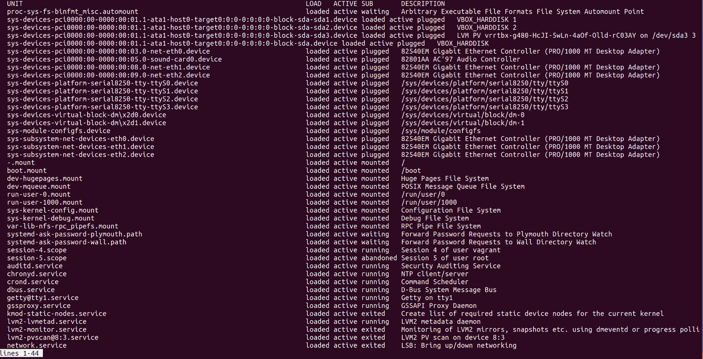

# 服务和守护程序

本章将涵盖以下主题:

*   确定正在运行的服务
*   列出已安装的服务
*   启动和停止服务
*   更改启动时启动和停止的服务
*   您可能期望看到的公共服务
*   了解服务单元文件
*   定制系统单元文件
*   测试正在运行的服务
*   编写基本单元文件
*   使用系统定时器(和 cron)
*   其他`init`系统

# 介绍

systemd(风格化小写)是一个九头蛇。

在旧世界，我们想在系统上做的每一件小事都有一个软件。时间由 NTP 处理，设备由`udev`处理，初始化一般由`SysV Init`处理。

在新世界，我们有系统:

*   系统时钟管理可由`systemd-timesyncd`处理。
*   `udev`被合并到 systemd 代码库中，形成`systemd-udevd`。
*   进程初始化由 systemd 本身的核心处理。

名单还在继续。

一般来说，systemd 一直在采用其他项目，或者将相同的功能写入自己的实现中(例如 systemd-timesyncd，它是 NTP 的替代品。)但是，systemd 套件也是模块化的，这意味着发行版可以广泛选择采用和使用哪些位。

对我们来说，systemd 所做的重要工作是在发行版上取代传统的 init 系统(CentOS、Debian 和 Ubuntu 现在都使用 systemd)。这意味着首先，systemd 管理你的盒子上的服务和守护进程。

systemd is the first process, meaning it will often be assigned the first **process ID** (**PID**). All other processes have systemd as a parent.

在本章中，我们将使用 systemd 的 init 组件，了解单元文件，并确定系统的运行状态。

以前，这一章可能会更长。在 systemd 统治每一个主流发行版之前，碎片化是存在的。Canonical 为 Ubuntu 写了一个叫做 Upstart 的东西(暂时被 Red Hat 采用)，更传统的发行版很难摆脱守护进程管理的`SysV` init 风格。即使在今天，您仍然可以在野外找到使用旧实现的系统:

*   CentOS 采用了 7 版系统
*   Ubuntu 采用了 15.04 版的 systemd
*   德比安与杰西采用的系统(8)

If Canonical wrote Upstart, you might be wondering why they went with systemd in the end. This was mainly due to Debian adopting systemd, after something of a civil war internally, and Ubuntu conceding that they would have an easier time of it if they remained aligned with their upstream distribution. The war was not without bitter battles on both sides and some ripples can still be felt.

# 技术要求

对于本章，需要一个不同的`Vagrantfile`。

如果需要，请随意使用以下示例—请确保`destroy`任何前面的框来释放资源:

```sh
# -*- mode: ruby -*-
# vi: set ft=ruby :

Vagrant.configure("2") do |config|

 config.vm.define "centos1" do |centos1|
   centos1.vm.box = "centos/7"
   centos1.vm.network "private_network", ip: "192.168.33.10"
   centos1.vm.hostname = "centos1"
   centos1.vm.box_version = "1804.02"
 end

 config.vm.define "centos6" do |centos6|
   centos6.vm.box = "centos/6"
 end

 config.vm.define "debian7" do |debian7|
   debian7.vm.box = "debian/wheezy64"
 end

end
```

# 确定正在运行的服务

每当你拿到一个盒子，尤其是一个你不确定的盒子(它藏在橱柜后面的某个地方，对着自己眨眼睛)，找出它上面运行的是什么软件是个好主意。

在现代系统(2013-ish plus)上，这是通过`systemctl`命令完成的。

`systemctl`是任何系统的主要控制机制——字面意思是“系统控制”。把它想象成你的初始化软件(第一个在你的盒子上运行的软件，它管理所有其他软件)的人工前端，允许你修改和调查你的计算机的运行状态。

不仅如此，在 Unix/Linux 世界里，一切都是文件；你的网络连接是一个文件，你的程序是一个文件，你的设备是一个文件，正因为如此，你可以控制一切，只需修改文件。

但这很快就变得乏味了。

`systemctl`通过用简单的命令包装功能，并以人类可读的方式打印结果，为您省去了在系统中手动洗牌的麻烦。

# 怎么做...

在命令行中，键入以下内容:

```sh
$ systemctl
```

你应该被列入系统单位的名单；这是 systemd 知道的每个单元的一个很好的初始概述，但是它非常嘈杂(如下面的截图所示)，我们特别想看到的是守护进程(因为我们的哥特风格):



Services and daemons are somewhat interchangeable in Linux land; for example, systemd refers to daemons as `service` files. This doesn't stop some people from getting passionately angry about "proper usage".

尝试以下方法:

```sh
$ systemctl list-units --type service
```

应该给你一个服务及其状态的列表。

这个视图更好，但它也显示了失败和退出的服务，例如，在我们的游民实例上，我们应该看到以下内容:


如果我想排除这些，我可以使用以下命令:

```sh
$ systemctl list-units --type service --state running
```

现在我们得到了一个更精简的列表，总共有 17 项:

```sh
UNIT                     LOAD   ACTIVE SUB     DESCRIPTION
auditd.service           loaded active running Security Auditing Service
chronyd.service          loaded active running NTP client/server
crond.service            loaded active running Command Scheduler
dbus.service             loaded active running D-Bus System Message Bus
getty@tty1.service       loaded active running Getty on tty1
gssproxy.service         loaded active running GSSAPI Proxy Daemon
lvm2-lvmetad.service     loaded active running LVM2 metadata daemon
NetworkManager.service   loaded active running Network Manager
polkit.service           loaded active running Authorization Manager
postfix.service          loaded active running Postfix Mail Transport Agent
rpcbind.service          loaded active running RPC bind service
rsyslog.service          loaded active running System Logging Service
sshd.service             loaded active running OpenSSH server daemon
systemd-journald.service loaded active running Journal Service
systemd-logind.service   loaded active running Login Service
systemd-udevd.service    loaded active running udev Kernel Device Manager
tuned.service            loaded active running Dynamic System Tuning Daemon

LOAD   = Reflects whether the unit definition was properly loaded.
ACTIVE = The high-level unit activation state, i.e. generalization of SUB.
SUB    = The low-level unit activation state, values depend on unit type.

17 loaded units listed. Pass --all to see loaded but inactive units, too.
To show all installed unit files use 'systemctl list-unit-files'.
```

You can get rid of the helpful-but-noisy header and footer notes with the `--no-legend` option to `systemctl`.

# 它是如何工作的...

在本节中，我们使用`systemctl`命令来查询 systemd。

我们的请求将逐渐变得更加精细，直到我们最终构建了一个只显示我们想要看到的内容的查询，也就是每秒都在运行的服务。

使用`pipes`和`grep`来完成你想要的事情是有道理的，根据你的偏好，你可能会发现这两个命令中的一个比另一个更整洁，尽管它们完成的事情大致相同:

```sh
$ systemctl --no-pager | grep service | grep running | column -t
```

在上一个例子中，我们首先从`systemctl`打印默认的“全部”列表，然后通过`grep`传递几次来过滤我们想要的内容，最后我们用一个列以一种易读的方式显示它。

```sh
$ systemctl list-units --type service --state running --no-legend
```

在这里，我们使用一个命令来获得比前一个命令稍微漂亮的输出，并且我们只使用一个命令来完成它。

# 还有更多...

与已加载并正在运行的服务一样，您可能对已经加载、完成了预期的任何工作，然后退出的服务感兴趣:

```sh
$ systemctl list-units --type service --state exited
```

或者你对失败的服务感兴趣？尝试以下方法:

```sh
$ systemctl list-units --type service --state failed
```

Lastly, systemd will use a pager by default to display results, which while human-friendly, isn't great for scripts. To simply print the output of your command to `stdout`, add `--no-pager` to your command.

# 请参见

通常，查询 init 系统是确定盒子上运行什么服务的最佳方式，尽管如果您正在运行 init 之外的东西，例如由`cron`启动的后台任务，您可能最好使用`ps`或`top`，我们将在后面介绍。

# 列出已安装的服务

在本节中，我们将了解如何列出已安装但永远不会在您的主机上运行的服务，通常是因为它们没有被启用。

# 准备好

连接到您的`centos1`虚拟机。

```sh
$ vagrant ssh centos1
```

# 怎么做...

以用户身份运行以下内容:

```sh
$ systemctl list-unit-files --type service
```

默认情况下，您将被放入一个通常很长的服务列表中。其中很多会被列为`static`，有的会是`enabled`，有的会是`disabled`。

就 systemd 而言，这是它知道的您系统上的所有服务的列表。

# 它是如何工作的...

我们再次使用`systemctl`查询系统，只是这一次我们没有打印正在运行的服务，而是获得了 init 系统知道的所有信息。

服务文件，甚至所有其他类型的单元文件，一般都存在于`/usr/lib/systemd/system`中。从这个位置，文件被符号链接到位于`/etc/systemd/system/`的`runlevel`目录中。

如下图所示，我们将进入`ls`这个目录:

```sh
$ ls -la /etc/systemd/system
total 8
drwxr-xr-x. 13 root root 4096 May 12 2018 .
drwxr-xr-x. 4 root root 151 May 12 2018 ..
drwxr-xr-x. 2 root root 32 May 12 2018 basic.target.wants
lrwxrwxrwx. 1 root root 46 May 12 2018 dbus-org.freedesktop.NetworkManager.service -> /usr/lib/systemd/system/NetworkManager.service
lrwxrwxrwx. 1 root root 57 May 12 2018 dbus-org.freedesktop.nm-dispatcher.service -> /usr/lib/systemd/system/NetworkManager-dispatcher.service
lrwxrwxrwx. 1 root root 37 May 12 2018 default.target -> /lib/systemd/system/multi-user.target
drwxr-xr-x. 2 root root 87 May 12 2018 default.target.wants
drwxr-xr-x. 2 root root 38 May 12 2018 dev-virtio\x2dports-org.qemu.guest_agent.0.device.wants
drwxr-xr-x. 2 root root 32 May 12 2018 getty.target.wants
drwxr-xr-x. 2 root root 35 May 12 2018 local-fs.target.wants
drwxr-xr-x. 2 root root 4096 May 12 2018 multi-user.target.wants
drwxr-xr-x. 2 root root 48 May 12 2018 network-online.target.wants
drwxr-xr-x. 2 root root 31 May 12 2018 remote-fs.target.wants
drwxr-xr-x. 2 root root 51 May 12 2018 sockets.target.wants
drwxr-xr-x. 2 root root 217 May 12 2018 sysinit.target.wants
drwxr-xr-x. 2 root root 44 May 12 2018 system-update.target.wants
```

注意我们有几个`targets`，基本上是一个系统的不同运行级别；您将在`multi-user.target.wants`中与 live 互动的大部分日常服务，基本上都是多用户会话(典型操作模式)所需的服务。

在这个子目录中再次运行`ls`会显示前面提到的符号链接及其在磁盘上的位置:

```sh
$ ls -la /etc/systemd/system/multi-user.target.wants/
total 8
drwxr-xr-x. 2 root root 4096 May 12 2018 .
drwxr-xr-x. 13 root root 4096 May 12 2018 ..
lrwxrwxrwx. 1 root root 38 May 12 2018 auditd.service -> /usr/lib/systemd/system/auditd.service
lrwxrwxrwx. 1 root root 39 May 12 2018 chronyd.service -> /usr/lib/systemd/system/chronyd.service
lrwxrwxrwx. 1 root root 37 May 12 2018 crond.service -> /usr/lib/systemd/system/crond.service
lrwxrwxrwx. 1 root root 42 May 12 2018 irqbalance.service -> /usr/lib/systemd/system/irqbalance.service
lrwxrwxrwx. 1 root root 46 May 12 2018 NetworkManager.service -> /usr/lib/systemd/system/NetworkManager.service
lrwxrwxrwx. 1 root root 41 May 12 2018 nfs-client.target -> /usr/lib/systemd/system/nfs-client.target
lrwxrwxrwx. 1 root root 39 May 12 2018 postfix.service -> /usr/lib/systemd/system/postfix.service
lrwxrwxrwx. 1 root root 40 May 12 2018 remote-fs.target -> /usr/lib/systemd/system/remote-fs.target
lrwxrwxrwx. 1 root root 46 May 12 2018 rhel-configure.service ->
... 
```

这些服务都是在多用户会话中启动的`enabled`。

# 还有更多...

`enabled`和`disabled`的概念相对容易理解，这些状态是服务要么尝试运行，要么不运行。

`static`是不同的东西；这是当一个单元文件存在，没有被启用，但是由于缺少单元文件的`[Install]`部分而不能被启用时使用的术语。

我们可以用下面的行列出这些服务:

```sh
$ systemctl --no-pager list-unit-files --type service --state static
```

随机取一个服务(`sshd-keygen`)，我们可以这样看一下它的服务文件:

```sh
$ systemctl cat sshd-keygen.service
```

Using systemctl's `cat` option is great, as it also shows you the location of the unit file in question.

我们得到以下信息:

```sh
# /usr/lib/systemd/system/sshd-keygen.service
[Unit]
Description=OpenSSH Server Key Generation
ConditionFileNotEmpty=|!/etc/ssh/ssh_host_rsa_key
ConditionFileNotEmpty=|!/etc/ssh/ssh_host_ecdsa_key
ConditionFileNotEmpty=|!/etc/ssh/ssh_host_ed25519_key
PartOf=sshd.service sshd.socket

[Service]
ExecStart=/usr/sbin/sshd-keygen
Type=oneshot
RemainAfterExit=yes
```

从这个文件中，我们可以看到它有一个`PartOf`定义，暗示它作为`sshd`服务的一部分运行。

查看该服务(再次使用 systemctl `cat`)会发现以下内容:

```sh
# /usr/lib/systemd/system/sshd.service
[Unit]
Description=OpenSSH server daemon
Documentation=man:sshd(8) man:sshd_config(5)
After=network.target sshd-keygen.service
Wants=sshd-keygen.service

[Service]
Type=notify
EnvironmentFile=/etc/sysconfig/sshd
ExecStart=/usr/sbin/sshd -D $OPTIONS
ExecReload=/bin/kill -HUP $MAINPID
KillMode=process
Restart=on-failure
RestartSec=42s

[Install]
WantedBy=multi-user.target
```

我们可以在这里看到`Wants`部分，提示`sshd`启动时`sshd-keygen`正在运行。

这解释了为什么它不需要自己启用。

# 请参见

与 Linux 系统上的大多数组件一样，`systemctl`命令有一个手册页。

在这个手册页中，您会发现一个名为`is-enabled output`的表格，在这里您可以了解更多关于打印有您的状态命令的不同术语。

我们有一个`indirect`状态的服务，该表列出了以下含义:

"The unit file itself is not enabled, but it has a non-empty Also= setting in the [Install] unit file section, listing other unit files that might be enabled, or it has an alias under a different name through a symlink that is not specified in Also=. For template unit file, an instance different than the one specified in DefaultInstance= is enabled."

# 启动和停止服务

在这一节中，我们将看一下启动和停止服务的琐碎但重要的方面。

想象一个盒子启动时没有自动启动守护进程能力的世界；每次重启时，您都必须手动进入并启动服务，小心确保每次都以适当的方式启动服务。

那个世界，就像星际之门复制器主宰的世界一样，不是我想要生活的地方。

# 怎么做...

在这个例子中，我们将使用`postfix`，因为它是一个不会在我们的虚拟机上做太多事情的服务。

`postfix` is a **Mail Transport Agent** (**MTA**) typically installed on CentOS boxes. Even if your box isn't handling email, processes might use it to email you warning about failures and things of that ilk.

# 停止我们的服务

运行以下程序(使用`sudo`):

```sh
$ sudo systemctl stop postfix
$ 
```

注意明显缺乏输出来确认或否认你输入的内容是否有效。

# 开始我们的服务

就像停止我们的服务一样，再次启动它并不重要:

```sh
$ sudo systemctl start postfix 
$
```

请再次注意令人困惑的沉默。

Silence upon command completion isn't unique to systemd, and it's actually something of a philosophy in the Unix and Unix-like world. If a command has done what it's supposed to, the user doesn't need to be told.

# 它是如何工作的...

当您指示 systemd 启动或停止一个单元时，您实际上是在运行其单元文件的`ExecStart`或`ExecStop`部分。

以`postfix`为例，它的单位文件是这样的:

```sh
# /usr/lib/systemd/system/postfix.service
[Unit]
Description=Postfix Mail Transport Agent
After=syslog.target network.target
Conflicts=sendmail.service exim.service

[Service]
Type=forking
PIDFile=/var/spool/postfix/pid/master.pid
EnvironmentFile=-/etc/sysconfig/network
ExecStartPre=-/usr/libexec/postfix/aliasesdb
ExecStartPre=-/usr/libexec/postfix/chroot-update
ExecStart=/usr/sbin/postfix start
ExecReload=/usr/sbin/postfix reload
ExecStop=/usr/sbin/postfix stop

[Install]
WantedBy=multi-user.target
```

这里我们可以看到，当我们发出`systemctl start postfix`命令时，它实际上是在运行带有`start`选项的`postfix`二进制文件。`stop`则相反。

我们还有一些`ExecStartPre`行，它们是在主`ExecStart`命令运行之前执行的命令。

# 还有更多...

如果没有`sudo`，可能会提示您认证为`root`；为了使命令可以作为`root`运行，当我忘记首先`sudo`时，我通常会看到这个对话:

```sh
==== AUTHENTICATING FOR org.freedesktop.systemd1.manage-units ===
Authentication is required to manage system services or units.
Authenticating as: root
Password:
```

您也可以使用`status`参数确认服务是快速启动还是停止:

```sh
$ systemctl status postfix
● postfix.service - Postfix Mail Transport Agent
 Loaded: loaded (/usr/lib/systemd/system/postfix.service; enabled; vendor preset: disabled)
 Active: inactive (dead) since Sun 2018-08-26 13:43:46 UTC; 2min 56s ago
```

# 请参见

有关您正在阅读的单位文件的`ExecStart`和`ExecStop`选项的更多信息，请查看该主题的具体`systemd.service`手册页。

还有各种其他选项不是`start`和`stop`，包括`reload-or-try-restart`只是为了混淆视听。这些选项参见`systemctl`命令。

# 更改启动时启动和停止的服务

在 CentOS 世界中，安装一个新服务不会立即启动并启用它，尽管在 Debian 世界中是这样的(默认情况下，也有它的拥护者和贬损者)。

在本例中，我们将启用新服务并重新启动虚拟机，检查启动时会发生什么。

# 准备好

连接到您的`centos1`虚拟机。为这些示例安装`httpd` (Apache):

```sh
$ sudo yum install -y httpd
```

# 怎么做...

首先，让我们看看我们是否真的有`httpd`的单位文件:

```sh
$ systemctl cat httpd
# /usr/lib/systemd/system/httpd.service
[Unit]
Description=The Apache HTTP Server
After=network.target remote-fs.target nss-lookup.target
Documentation=man:httpd(8)
Documentation=man:apachectl(8)

[Service]
Type=notify
EnvironmentFile=/etc/sysconfig/httpd
ExecStart=/usr/sbin/httpd $OPTIONS -DFOREGROUND
ExecReload=/usr/sbin/httpd $OPTIONS -k graceful
ExecStop=/bin/kill -WINCH ${MAINPID}
# We want systemd to give httpd some time to finish gracefully, but still want
# it to kill httpd after TimeoutStopSec if something went wrong during the
# graceful stop. Normally, Systemd sends SIGTERM signal right after the
# ExecStop, which would kill httpd. We are sending useless SIGCONT here to give
# httpd time to finish.
KillSignal=SIGCONT
PrivateTmp=true

[Install]
WantedBy=multi-user.target
```

我们有一个，现在我们需要看看它目前处于什么状态:

```sh
$ systemctl status httpd
```

我们的输出将服务列为`inactive`和`disabled`。

# 启用我们的服务

如果我们只想启动服务，我们可以运行上一节中列出的命令，但这不会在启动时启用服务。

为了启用我们的服务，我们运行`enable`，令人惊讶的是:

```sh
$ sudo systemctl enable httpd
Created symlink from /etc/systemd/system/multi-user.target.wants/httpd.service to /usr/lib/systemd/system/httpd.service.
```

请注意，出于某种原因，我们确实在启用服务的同时获得了输出。

使用`systemctl status`命令重启你的盒子，看看`httpd`是否在启动时启动。

# 禁用我们的服务

现在我们已经启用了`httpd`，我们将再次禁用它，因为我们就是这样的人:

```sh
$ sudo systemctl disable httpd
Removed symlink /etc/systemd/system/multi-user.target.wants/httpd.service.
```

# 它是如何工作的...

在我们禁用和启用服务的输出中可以看到，我们实际上正在创建一个`symlink`，从我们的`httpd`单元文件的默认位置到前面提到的`multi-user.target.wants`目录。

启动时，systemd 将在适当的时候检查这个目录，并启动它在那里找到的服务。

# 还有更多...

同时启动和启用服务是完全可能的，而且肯定比重新启动盒子来改变服务状态更好。

这可以通过在我们的`enable`命令中插入`--now`来轻松完成:

```sh
$ systemctl enable --now httpd
```

实际上，我们在一行中运行了以下内容:

```sh
$ systemctl enable httpd
$ systemctl start httpd
```

# 请参见

`targets`的系统概念本质上类似于你可能熟悉也可能不熟悉的老派`runlevel`。这不是直接比较，因为 systemd 可以同时激活多个目标，而 runlevels 是单数。`multi-user.target`大致相当于 2 级、3 级和 4 级。

详见`systemd.target`手册页。

# 您可能期望看到的公共服务

在本节中，我们将列出您可能期望在给定的框中看到的常见服务。这个列表不会很全面，因为默认情况下有哪些服务可以改变，甚至在发行版之间也是如此。

# 怎么做...

列出我们系统上的服务，即使是静态和禁用的服务:

```sh
$ systemctl list-unit-files --type service
```

在列表中滚动，如果您使用默认的寻呼机(更少)，用`/`搜索。

# auditd.service

从顶部开始，我们有`auditd.service`，“Linux 审计守护进程”。用来写你系统的审计记录，你会在`/var/log/audit/`目录里找到它的工作成果。

# 克罗顿，服务

正如我们在系统上讨论时间时所讨论的那样，`chronyd`负责保持系统时钟正确。我希望看到这个，或者`ntpd`，在野外的大多数服务器上运行。

# 服务时间

不要与`chronyd`混淆，`crond`是守护程序，负责确保调度命令在应该运行的时候运行。

# lvm2-*。服务

`lvm2`服务文件的集合用于维护和监控**逻辑卷管理器** ( **LVM** )设置。您遇到的大多数服务器可能会使用 LVM 来满足其文件系统和卷管理需求。

# NetworkManager.service

我们已经把网络覆盖得死死的，但是知道`NetworkManager.service`文件是少数几个令人讨厌的大写字母之一还是有用的。

这个事实不止一次让我感到困惑。

# nfs.service

通常安装的`nfs`服务套件用于管理**网络文件系统** ( **NFS** )设备。

NFS 仍然被广泛使用，并且由发行商很好地维护着，这意味着即使你不使用它，它也可能存在。

# 后缀. service

典型的 MTA 系统`postfix`是你在红帽、CentOS 和 Fedora 系统上看到的默认系统。在其他系统上，它可能是 Exim 邮件服务器。稍后我们将简要地讨论这些。

# rsyslog.service

或者`rsyslog`或者`syslog-ng`可能会被安装在你的服务器上，至少在可预见的未来是这样。这些是系统日志守护程序，负责将日志写入`/var/log`中的文本文件(通常)。他们在`binary-log-loving journald`有一个竞争对手，我们稍后会谈到。

# sshd.service

我应该希望看到`sshd.service`在我连接的任何系统上运行，否则我不知道我用了什么莫名其妙的方法来连接。

# 系统日志。服务

前面提到的`syslog``journald`的竞争对手是 systemd 管理的日志守护程序，可以在命令行上使用一组语法汤进行查询。

# 系统登录服务

另一个来自`systemd`博格，`logind`管理用户登录您是管理员的系统。

# 它是如何工作的...

这些服务，以及您在机器上运行的任何其他服务，实际上构成了您正在运行的操作系统。

如果你像我一样，你可能会发现自己在业余时间摆弄这个列表，试图弄清楚哪些位可以禁用，而最后仍然有一个正常运行的系统。

我的建议通常是保持默认值不变，因为你永远不知道什么样的随机任务会在你没有意识到的情况下为你清理一个临时目录。

Default services are frequently disabled as part of **hardening** tasks; if you ever find yourself having to harden a system, the usual rules apply. Look into what the current best practices are, and see if your vendor has a ready-made guide.

# 还有更多...

我们可以使用方便的工具，如`systemd-analyze`来查看我们的系统启动需要多长时间:

```sh
$ systemd-analyze 
Startup finished in 253ms (kernel) + 933ms (initrd) + 6.873s (userspace) = 8.060s
```

8 秒还不错，不包括 VirtualBox 初始化我们的 VM 的时间和内核启动的时间(Grub 引导菜单上的 5 秒)。

你甚至可以在最后加上`blame`来运行这个命令，看看是什么过程夺走了你宝贵的时间:

```sh
$ systemd-analyze blame
 3.811s NetworkManager-wait-online.service
 806ms tuned.service
 680ms postfix.service
 490ms lvm2-monitor.service
 ...
```

# 请参见

查看其他系统默认启动的服务。例如，桌面上的 Ubuntu 可能不会启动`auditd`，但它可能会有`gdm`来确保您启动机器时有 Gnome 登录窗口。

# 了解服务单元文件

我们现在很清楚在哪里可以找到服务单元文件，以及如何启用和禁用服务。

之前，我们接触了一个单元文件中的几个条目，尽管我们没有深入研究这些选项，也没有在哪里找到更多信息和您可能想要使用的替代条目。

# 怎么做...

我们将在这里使用`sshd.service`作为一个例子，不仅仅是因为它是一个你可能会看到很多的服务文件，还因为它很好地混合了默认条目。

`cat`我们选择的服务:

```sh
$ systemctl cat sshd.service
# /usr/lib/systemd/system/sshd.service
[Unit]
Description=OpenSSH server daemon
Documentation=man:sshd(8) man:sshd_config(5)
After=network.target sshd-keygen.service
Wants=sshd-keygen.service

[Service]
Type=notify
EnvironmentFile=/etc/sysconfig/sshd
ExecStart=/usr/sbin/sshd -D $OPTIONS
ExecReload=/bin/kill -HUP $MAINPID
KillMode=process
Restart=on-failure
RestartSec=42s

[Install]
WantedBy=multi-user.target
```

为了理解这个文件，我们必须把它分解成它的组成部分。

单元文件的`Main`部分的排序，`[Unit]`是通用条目的区域，而不是特定于`Service`类型的区域:

```sh
[Unit]
```

对于描述，我们有一个简短的条目，可以一目了然:

```sh
Description=OpenSSH server daemon
```

我们也有一个方便的线路，详细说明了合适的 URI 位置，如果你被困住了，请仔细阅读。这里我们有`man:`作为 URI，但它可能是`https://`甚至`info::`:

```sh
Documentation=man:sshd(8) man:sshd_config(5)
```

`info:`指的是信息页面，和手册页一样，但被嘲讽的范围更广。`After=`(和`Before=`)是用空格分隔的单位名称列表，规定了在这一个之后(或之前)需要启动的服务。这里需要启动网络，`ssh-keygen`需要在`sshd`启动之前运行:

```sh
After=network.target sshd-keygen.service
```

我们之前剖析了`Wants=`，但是为了充实一下，您通常会在单元文件中看到`Wants=`，列出了在服务启动之前可以触发的服务:

```sh
Wants=sshd-keygen.service
```

`Wants=` is a less-mandated version of `Requires=`. If a `Wants=` service fails to start, the parent service will still give it a try, if a `Requires=` service fails, the parent doesn't either.

特定于`service`类型的单元文件，`[Service]`块特定于服务选项，也许很明显:

```sh
[Service]
```

进程启动类型`notify`在这里是指一旦守护进程完成启动，系统会发送一条通知消息。只有收到此通知时，systemd 才会继续启动依赖于此通知的服务:

```sh
Type=notify
```

用于将服务指向包含其环境变量的文件，对于`sshd`，这在我们的框`OPTIONS="-u0"`中包含一个选项:

```sh
EnvironmentFile=/etc/sysconfig/sshd
```

服务启动时运行什么的关键，`ExecStart`给了我们运行的命令。还要注意`$OPTIONS`值，从`EnvironmentFile`行规定的文件中读取:

```sh
ExecStart=/usr/sbin/sshd -D $OPTIONS
```

本节告诉系统如果运行`systemctl reload sshd`命令应该运行什么。具体来说，我们向`sshd` PID 发送`HUP`(挂断)信号:

```sh
ExecReload=/bin/kill -HUP $MAINPID
```

该指令规定了如何杀死单位自己创建的进程。`process`这里的意思是只有主进程本身被 systemd 杀死:

```sh
KillMode=process
```

Here, `KillMode` is being used, but `ExecStop` isn't. This is because `ExecStop` is optional, and generally only used if the init daemon has a specific cleanup job to do.

我们的`Restart`选项告诉系统如何重启进程。这里使用的`on-failure`表示`sshd`将在不洁退出代码、不洁信号、超时或违反服务的看门狗超时时重启:

```sh
Restart=on-failure
```

`RestartSec`是重新启动`sshd`服务之前所用的指定时间，符合`Restart=`标准。我会想象这里是`42`秒，因为单元文件的作者是道格拉斯·亚当斯的粉丝:

```sh
RestartSec=42s
```

安装是另一个通用部分，如`[Unit]`。本节包含设备文件的安装信息，这意味着运行时可通过启用和禁用指令读取:

```sh
[Install]
```

这里唯一的指令是这个服务是`WantedBy`多用户目标，也就是说在多用户模式下`sshd`将被启动:

```sh
WantedBy=multi-user.target
```

# 它是如何工作的...

当 systemd 与服务文件交互时，它读取的文件部分决定了它的动作。

如果启动服务，将读取`ExecStart`，如果停止，将读取`ExecStop`。

# 还有更多...

一个单元文件的作者可以使用几个选项，而且每个 systemd 版本都增加了更多选项。很有可能您想要完成的操作可以通过一个单元文件条目来实现。

Despite the overwhelming array of options available to unit file authors, you still get people who insist on writing a bash script to do everything, and simply referring to this in a four-line unit file. It's possible, but it's not neat.

# 请参见

如果你下午有空，读一读`systemd.service`和`systemd.unit`手册页；它们既长又好，是代替安眠药的镇静剂。

# 定制系统单元文件

在这一节中，我们将研究修改 systemd 单元文件的方法。

这里有一个重要的注意事项，那就是，虽然您可以在交付配置文件时对其进行绝对的修改，但不能保证您的更改会在系统的更新中保持不变。包管理人员可能会对你篡改他们的服务文件感到生气，并在没有警告的情况下简单地替换它们。

修改 systemd 单元文件操作的正确方法是编写一个包含您的更改的完整的其他文件。

systemd 这样做的方法叫做代码片段。

# 怎么做...

systemd 内置了一种生成我们需要的覆盖文件的方法。

使用以下命令为`sshd.service`单元创建目录和文件:

```sh
$ sudo systemctl edit sshd.service
```

您将被放置在一个空文件中，但该文件存在于一个新的目录中，即`/etc/systemd/system/sshd.service.d/override.conf`。

将以下内容复制到我们的空文件中:

```sh
[Unit]
Description=OpenSSH server daemon slightly modified
Documentation=man:ssh-additional
Requires=sshd-keygen.service

[Service]
Environment=OPTIONS="-u0"
ExecStart=
ExecStart=/usr/sbin/sshd -4 -D $OPTIONS
RestartSec=10s
```

当我们保存并退出文件时，会运行一个隐式的`systemctl daemon-reload`，这意味着当我们运行一个`systemctl restart sshd`时，我们的新设置会被启用。

# 它是如何工作的...

我们说我们的`edit`命令创建了一个新的目录和文件，其中可以放置覆盖命令；现在，您可以通过更改到以下网址来访问该网站:

```sh
$ cd /etc/systemd/system/sshd.service.d/
$ ls 
override.conf
```

在我们的覆盖文件中，存储了我们的新条目。这些条目通常补充主配置文件中的条目。

分解我们的新配置，我们有以下内容:

```sh
[Unit]
Description=OpenSSH server daemon slightly modified
Documentation=man:ssh-additional
Requires=sshd-keygen.service
```

在这里，我们添加了文件的简短描述，显示它略有修改。有一个假的手动页面条目，我们建议当我们开始写的时候，它可能是一个很好的文档记录的地方。我们还改变了服务，使其现在需要`sshd-keygen`，而不仅仅是想要它。

现在，我们更改服务部分:

```sh
[Service]
EnvironmentFile=
Environment=OPTIONS="-u0"
ExecStart=
ExecStart=/usr/sbin/sshd -4 -D $OPTIONS
RestartSec=10s
```

这里我们添加了`Environment`指令，而不是使用`EnvironmentFile`(我们已经忽略了)。

我们也在消隐`ExecStart`，传递我们自己的(我们已经添加了`-4`)到。

因为我们很无聊，我们决定让`sshd`在 10 秒内重启，而不是`42`。

# 还有更多...

不总是很明显，哪些值可以一个堆叠在另一个上面，哪些值必须先清空。

要测试您的配置是否被正确加载，请使用`systemctl show sshd`读取您的服务的运行配置。

在输出中，我发现下面的行(`Documentation`可以堆叠，所以我们的新条目被添加到最后。):

```sh
Documentation=man:sshd(8) man:sshd_config(5) man:ssh-additional
```

`Description`被覆盖，因为你只能有一个条目，所以我们的优先:

```sh
Description=OpenSSH server daemon slightly modified
```

没有`EnvironmentFile`选项，唯一的条目是我们的`Environment`行:

```sh
Environment=OPTIONS="-u0"
```

只有一行`ExecStart`是我们的，因为我们忽略了原文:

```sh
ExecStart={ path=/usr/sbin/sshd ; argv[]=/usr/sbin/sshd -4 -D $OPTIONS ...
```

# 请参见

还有另一种方法可以改变你自己的单位文件，但是比较麻烦。实际上，您编写了一个完整的单元文件，更改了您想要的选项，并在重新启用服务之前将新文件放入`/etc/systemd/system/`中。这样做的原因是`/etc/systemd/system/`比`/usr/lib/systemd/system/`具有更高的优先级，尽管您现在已经让自己承担了管理整个服务定义的负担，而不仅仅是您想要改变的部分。

# 测试正在运行的服务

在本节中，一旦我们发出`start`命令，我们将从三个方面来查看服务是否正在运行。

我们将从内置的系统方式(`systemctl`)开始，然后转向通用的方式(`ps`)，最后是简单的方式(`telnet`)。

# 准备好了

连接到您的`centos1`虚拟机。如果还没有启动，安装并启动`httpd`。

我们还将安装`telnet`进行一些基本的端口检查:

```sh
$ sudo yum install -y httpd telnet
$ sudo systemctl enable --now httpd
```

# 怎么做...

借助 systemd 的内置工具，我们可以使用`status`选项检查状态:

```sh
[vagrant@centos1 ~]$ systemctl status httpd
● httpd.service - The Apache HTTP Server
 Loaded: loaded (/usr/lib/systemd/system/httpd.service; enabled; vendor preset: disabled)
 Active: active (running) since Sun 2018-08-26 16:15:50 UTC; 5min ago
 Docs: man:httpd(8)
 man:apachectl(8)
 Main PID: 3578 (httpd)
 Status: "Total requests: 0; Current requests/sec: 0; Current traffic:   0 B/sec"
 CGroup: /system.slice/httpd.service
 ├─3578 /usr/sbin/httpd -DFOREGROUND
 ├─3579 /usr/sbin/httpd -DFOREGROUND
 ├─3580 /usr/sbin/httpd -DFOREGROUND
 ├─3581 /usr/sbin/httpd -DFOREGROUND
 ├─3582 /usr/sbin/httpd -DFOREGROUND
 └─3583 /usr/sbin/httpd -DFOREGROUND
```

这是一个很好的迹象，表明一切都很好，因为 systemd 相信它们是好的。我们也可以使用`ps`工具来尝试并确定我们的过程是否已经开始:

```sh
[vagrant@centos1 ~]$ ps aux | grep httpd
root      3578  0.0  1.0 224020  4996 ?        Ss   16:15   0:00 /usr/sbin/httpd -DFOREGROUND
apache    3579  0.0  0.5 224020  2948 ?        S    16:15   0:00 /usr/sbin/httpd -DFOREGROUND
apache    3580  0.0  0.5 224020  2948 ?        S    16:15   0:00 /usr/sbin/httpd -DFOREGROUND
apache    3581  0.0  0.5 224020  2948 ?        S    16:15   0:00 /usr/sbin/httpd -DFOREGROUND
apache    3582  0.0  0.5 224020  2948 ?        S    16:15   0:00 /usr/sbin/httpd -DFOREGROUND
apache    3583  0.0  0.5 224020  2948 ?        S    16:15   0:00 /usr/sbin/httpd -DFOREGROUND
```

Here I use the `aux` option, partly this is because I can reliably do the same thing on my BSD systems, and partly it's because the person I first watched use `ps` used those flags, so it stuck with me.

我们可以看到`httpd`运行着几个进程。

或者，我们可以尝试使用`telnet`在本地连接到端口:

```sh
[vagrant@centos1 ~]$ telnet 127.0.0.1 80
Trying 127.0.0.1...
Connected to 127.0.0.1.
Escape character is '^]'.
```

尽管如果你的网络服务器没有运行在本地主机上，或者`80`，这个测试是没有意义的，并且会失败。

# 它是如何工作的...

我们已经介绍了检查服务是否正在运行的三种方法。第一个，也可以说是最健壮的，是查看 init 系统是否认为服务已经启动。

我们的`systemctl`命令报告了一个活动的运行状态，并给出了服务已经启动的时间。

接下来，我们查询系统的进程列表，看看是否能找到我们的服务器；这很有效，因为可能是一个配置错误的服务文件启动了您的服务，但是没有意识到它的状态，因此认为它已经死了。

最后，我们使用`telnet`尝试连接到我们认为服务可能正在运行的端口；这是检查一个服务是否在本地运行的最不智能的方法，因为它需要你知道细节，`telnet`在默认情况下很少安装。

# 还有更多...

要获取系统上开放套接字的信息，可以使用`ss`；有关您可以使用什么命令来确定已用端口的详细信息，请参见前面的`ss`部分。

# 编写基本单元文件

在本节中，我们将整理一个自己的单元文件。我们还将选择一个位置来保存它，并重新启动我们的系统来检查它是否工作。

# 怎么做...

我们将再次使用 Python 的内置 web 服务器，使用一个小的单元文件启动一个实例。

首先，创建我们要存储单元文件的目录:

```sh
$ sudo mkdir -p /usr/local/lib/systemd/system
```

接下来，我们将把以下内容回显到名为`pythonWebServer.service`的文件中:

```sh
$ sudo tee /usr/local/lib/systemd/system/pythonWebServer.service << HERE
[Unit]
Description=Python Web Server Example

[Service]
ExecStart=/usr/bin/python2.7 -m SimpleHTTPServer

[Install]
WantedBy=multi-user.target
HERE
```

This unit file is for demonstration purposes only, and should **absolutely not** be used in production.

现在，我们可以启用并启动它:

```sh
$ sudo systemctl enable --now pythonWebServer
Created symlink from /etc/systemd/system/multi-user.target.wants/pythonWebServer.service to /usr/local/lib/systemd/system/pythonWebServer.service.
```

使用`status`命令检查它是否正在运行:

```sh
$ systemctl status pythonWebServer.service 
● pythonWebServer.service - Python Web Server Example
 Loaded: loaded (/usr/local/lib/systemd/system/pythonWebServer.service; enabled; vendor preset: disabled)
 Active: active (running) since Sun 2018-08-26 16:43:55 UTC; 1s ago
 Main PID: 3746 (python2.7)
 CGroup: /system.slice/pythonWebServer.service
 └─3746 /usr/bin/python2.7 -m SimpleHTTPServer
```

# 它是如何工作的...

我们在这里所做的就是为 systemd 创建一个本地单元文件来读取和加载。

为了理解我们的路径选择，请尝试在您的系统上运行以下命令，看看返回了什么:

```sh
$ systemctl --no-pager show --property=UnitPath
```

其中一个选项应该是`/usr/local/lib/systemd/system`，一开始不存在，但是我们创建的时候存在。

使用这样的路径是一个好主意，因为它不仅很有可能是空的，这意味着您可以从逻辑上将您的单元文件与其他文件分开，而且它也是整洁的(不像`/etc/systemd/system/`目录)。

然后，我们在这个目录中放置了一个小的示例单元文件，以最小的文件为特色来创建一个正常运行的服务文件。

一旦编写完成，这就是一个启用和启动我们服务的简单案例。

# 还有更多...

我们在这里所做的有几个问题。

首先，我们已经创建了一个非常静态的服务文件，我们只能通过直接操作来更改它。第二个问题是，我们制作了一个 web 服务器，默认情况下，它会列出我们服务器根目录的内容，我非常怀疑您是否想要:

```sh
$ curl localhost:8000
<!DOCTYPE html PUBLIC "-//W3C//DTD HTML 3.2 Final//EN"><html>
<title>Directory listing for /</title>
<body>
<h2>Directory listing for /</h2>
<hr>
<ul>
<li><a href="bin/">bin@</a>
<li><a href="boot/">boot/</a>
<li><a href="dev/">dev/</a>
<li><a href="etc/">etc/</a>
<li><a href="home/">home/</a>
<li><a href="lib/">lib@</a>
<li><a href="lib64/">lib64@</a>
<li><a href="media/">media/</a>
<li><a href="mnt/">mnt/</a>
<li><a href="opt/">opt/</a>
<li><a href="proc/">proc/</a>
<li><a href="root/">root/</a>
<li><a href="run/">run/</a>
<li><a href="sbin/">sbin@</a>
<li><a href="srv/">srv/</a>
<li><a href="sys/">sys/</a>
<li><a href="tmp/">tmp/</a>
<li><a href="usr/">usr/</a>
<li><a href="vagrant/">vagrant/</a>
<li><a href="var/">var/</a>
</ul>
<hr>
</body>
</html>
```

让我们利用到目前为止学到的知识来解决这两个问题。

在您选择的编辑器中打开新的 systemd 单位文件进行编辑，并使用更多选项填充它:

```sh
[Unit]
Description=Python Web Server Example
Documentation=man:python(1)
ConditionFileNotEmpty=/var/www/html/index.html
After=network.target

[Service]
Type=simple
EnvironmentFile=/etc/sysconfig/pythonWebServer
ExecStart=/usr/bin/python2.7 -m SimpleHTTPServer $PORT
Restart=always
WorkingDirectory=/var/www/html/

[Install]
WantedBy=multi-user.target
```

注意一些我们以前用过的，还有一些新的，比如`WorkingDIrectory=`。

接下来，填充`/var/www/html/index.html`:

```sh
$ sudo tee /var/www/html/index.html << HERE
This is a python web server.
Running at the behest of systemd.
Isn't that neat?
HERE
```

并在我们的环境文件中添加一个条目:

```sh
$ sudo tee /etc/sysconfig/pythonWebServer <<HERE
PORT="8000"
HERE
```

重装系统配置:

```sh
$ sudo systemctl daemon-reload
```

并用`curl`测试:

```sh
$ curl localhost:8000
This is a python web server.
Running at the behest of systemd.
Isn't that neat?
```

# 请参见

systemd 单元文件有这么多不同的配置选项；我们在这里没有真正触及表面，它本身绝对可以构成一本书。

阅读相关的手册页，试着写你自己的单元文件，并报告你的发现，你勇敢的探险家。

# 使用系统定时器(和 cron)

街区里新来的孩子，以及另一个被系统带入庞大自我的组件，是系统计时器。定时器是另一种类型的单元，只是在另一个单元触发时作为指令。

在旧世界，你可以用`cron`控制系统上的周期性事件，这仍然被广泛使用，但越来越多的系统计时器正在窃取这一外衣。

I say *new* but new is relative. Basically something can be in systemd for years before it finally trickles into Debian or CentOS. If you want the latest and greatest, run something like Fedora on a laptop.

在本节中，我们将在将 Python 服务器转换为计时器触发的服务之前，查看系统中现有的`cron`和计时器条目。

# 怎么做...

首先，我们将列出系统中现有的定期作业。

# 系统计时器

从 systemd 计时器开始，我们将列出默认情况下盒子上存在的内容:

```sh
$ systemctl --no-pager list-timers --all
NEXT                         LEFT     LAST                         PASSED    UNIT                         ACTIVATES
Mon 2018-08-27 17:39:37 UTC  23h left Sun 2018-08-26 17:39:37 UTC  52min ago systemd-tmpfiles-clean.timer systemd-tmpfiles-clean.service
n/a                          n/a      n/a                          n/a       systemd-readahead-done.timer systemd-readahead-done.service

2 timers listed.
```

在这个输出中，我们可以看到两个计时器。第一个是`systemd-tmpfiles-clean.timer`，它的动作是触发`systemd-tmpfiles-clean.service`。

对该文件运行`systemctl cat`向我们显示其定时器配置:

```sh
# /usr/lib/systemd/system/systemd-tmpfiles-clean.timer
#  This file is part of systemd.
#
#  systemd is free software; you can redistribute it and/or modify it
#  under the terms of the GNU Lesser General Public License as published by
#  the Free Software Foundation; either version 2.1 of the License, or
#  (at your option) any later version.

[Unit]
Description=Daily Cleanup of Temporary Directories
Documentation=man:tmpfiles.d(5) man:systemd-tmpfiles(8)

[Timer]
OnBootSec=15min
OnUnitActiveSec=1d
```

查看服务文件可以发现实际运行的内容:

```sh
# /usr/lib/systemd/system/systemd-tmpfiles-clean.service
#  This file is part of systemd.
#
#  systemd is free software; you can redistribute it and/or modify it
#  under the terms of the GNU Lesser General Public License as published by
#  the Free Software Foundation; either version 2.1 of the License, or
#  (at your option) any later version.

[Unit]
Description=Cleanup of Temporary Directories
Documentation=man:tmpfiles.d(5) man:systemd-tmpfiles(8)
DefaultDependencies=no
Conflicts=shutdown.target
After=systemd-readahead-collect.service systemd-readahead-replay.service local-fs.target time-sync.target
Before=shutdown.target

[Service]
Type=oneshot
ExecStart=/usr/bin/systemd-tmpfiles --clean
IOSchedulingClass=idle
```

请注意，这是一个`oneshot`服务，意味着它应该在运行后退出。

从前面的信息中，我们可以知道我们的计时器最后一次运行的时间以及下一次到期的时间。

The second timer we can see, `systemd-readahead-done.timer` and its companion service file, aren't active. This is denoted by the `n/a` details in the various time fields. This service is used in non-virtualized systems to log disk boot patterns, attempting to speed up subsequent boots.

与`cron`相比，这使得计时器在最后一次运行时更容易读取和计算。

# 时间单位

我不知道从`cron`列出信息的简单方法；如果你知道一个，请写信给我，让我大吃一惊。

`cron`，正如我们之前所说的，是一个用于按计划执行命令的守护进程。它仍在广泛使用，有许多系统采用混合系统定时器/ `cron`设置。

默认情况下，`cron`在`/etc/`中具有以下目录:

```sh
cron.d/       cron.daily/   cron.hourly/  cron.monthly/ cron.weekly/
```

在`cron.d`内，我们可以看到一个名为`0hourly`的单个文件，其内容复制如下:

```sh
cat 0hourly 
# Run the hourly jobs
SHELL=/bin/bash
PATH=/sbin:/bin:/usr/sbin:/usr/bin
MAILTO=root
01 * * * * root run-parts /etc/cron.hourly
```

而在`/etc/cron.hourly`目录内，我们只有`0anacron`:

```sh
#!/bin/sh
# Check whether 0anacron was run today already
if test -r /var/spool/anacron/cron.daily; then
 day=`cat /var/spool/anacron/cron.daily`
fi
if [ `date +%Y%m%d` = "$day" ]; then
 exit 0;
fi

# Do not run jobs when on battery power
if test -x /usr/bin/on_ac_power; then
 /usr/bin/on_ac_power >/dev/null 2>&1
 if test $? -eq 1; then
 exit 0
 fi
fi
/usr/sbin/anacron -s
```

可读，这不是。

一眼看去，通过`cron`计算出什么作业是周期性运行的是很尴尬和复杂的，你总是会得到一个人写的，没有任何日志记录的 bodge-job，他们忘记了。

很有可能你会在生命中的某个时刻被`cron`搞砸，至少直到它永远消失，所以如果你的系统中出现了意想不到的行为，停下来快速浏览一下`cron`目录，寻找一些犯规的迹象。

您可以很容易地从`journalctl`获得具体的`cron`日志:

```sh
$ sudo journalctl -u crond
-- Logs begin at Sun 2018-08-26 17:24:36 UTC, end at Sun 2018-08-26 19:18:33 UTC
Aug 26 17:24:39 centos1 systemd[1]: Started Command Scheduler.
Aug 26 17:24:39 centos1 systemd[1]: Starting Command Scheduler...
Aug 26 17:24:39 centos1 crond[579]: (CRON) INFO (RANDOM_DELAY will be scaled wit
Aug 26 17:24:40 centos1 crond[579]: (CRON) INFO (running with inotify support)
```

# 它是如何工作的...

systemd 定时器很棒；它们也工作得很好，主要是因为它们与管理时间触发器的 init 和 unit 系统有着内在的联系。

在一个完美的世界里，我希望看到 CentOS 和 Debian 中的所有`cron`条目在下一个版本中被完全删除。事实的真相是`cron`可能会存在很长一段时间，像 FreeBSD 这样的系统会在宇宙热死之后很久才使用它。

当我们列出定时器的时候，我们在检查 systemd 知道的触发单位。

当我们在筛选`cron`日志和子目录时，我们把头撞在一张隐喻的桌子上，徒劳地试图找到那个不断接触我们试图删除的文件的模糊的一行字。

# 还有更多...

我们将使用上一个例子中的 Python 单元文件来编写我们自己的定时器单元。

如果您仍在运行该服务，我建议您从禁用该服务开始，或者销毁虚拟机并再次写入，如有必要，请参考最后一节。

让我们从调整我们的`pythonWebServer.service`文件开始，使它看起来像下面这样:

```sh
[Unit]
Description=Python Web Server Example
Documentation=man:python(1)
ConditionFileNotEmpty=/var/www/html/index.html

[Service]
Type=simple
EnvironmentFile=/etc/sysconfig/pythonWebServer
ExecStart=/usr/bin/python2.7 -m SimpleHTTPServer $PORT
WorkingDirectory=/var/www/html/
```

具体来说，我们删除了几行。注意`[Install]`部分的完全删除，因为当定时器控制启动时不需要它。

In the real world, this wouldn't be something permanent such as a web server, it would usually be something small, such as a script to open a web page on a wallboard somewhere or send a request to the coffee machine to make you a latte.

接下来，我们将编写一个`timer`文件，将其放在与我们的`service`文件完全相同的位置:

```sh
$ sudo tee /usr/local/lib/systemd/system/pythonWebServer.timer << HERE
[Unit]
Description=Start python web server after a pause

[Timer]
OnBootSec=20s

[Install]
WantedBy=timers.target
HERE
```

之后，我们将重新加载 systemd 并启用计时器，但不启用服务:

```sh
$ sudo systemctl daemon-reload 
$ sudo systemctl enable pythonWebServer.timer
Created symlink from /etc/systemd/system/timers.target.wants/pythonWebServer.timer to /usr/local/lib/systemd/system/pythonWebServer.timer.

```

注意`symlink`的创建。

让我们重启盒子，看看会发生什么。如果你很快，并且在你的十秒钟结束前成功运行`systemctl list-timers`，你可能会看到如下内容:

```sh
$ systemctl --no-pager list-timers
NEXT                         LEFT       LAST PASSED UNIT                         ACTIVATES
Sun 2018-08-26 19:43:48 UTC  9s left    n/a  n/a    pythonWebServer.timer        pythonWebServer.service
Sun 2018-08-26 19:58:28 UTC  14min left n/a  n/a    systemd-tmpfiles-clean.timer systemd-tmpfiles-clean.service

2 timers listed.
Pass --all to see loaded but inactive timers, too.
```

再次运行它将显示作业已通过:

```sh
$ systemctl --no-pager list-timers
NEXT                         LEFT       LAST                         PASSED UNIT                         ACTIVATES
Sun 2018-08-26 19:43:48 UTC  10s ago    Sun 2018-08-26 19:43:56 UTC  3s ago pythonWebServer.timer        pythonWebServer.service
Sun 2018-08-26 19:58:28 UTC  14min left n/a                          n/a    systemd-tmpfiles-clean.timer systemd-tmpfiles-clean.service

2 timers listed.
Pass --all to see loaded but inactive timers, too.
```

快速`curl`将确认我们的服务启动:

```sh
$ curl localhost:8000
This is a python web server.
Running at the behest of systemd.
Isn't that neat?
```

# 请参见

您可以像检查其他设备一样检查系统定时器的状态。

下图是用于检查我们的`pythonWebServer.timer`状态的输出和命令:

```sh
$ systemctl status pythonWebServer.timer
● pythonWebServer.timer - Start python web server after a pause
 Loaded: loaded (/usr/local/lib/systemd/system/pythonWebServer.timer; enabled; vendor preset: disabled)
 Active: active (running) since Sun 2018-08-26 19:43:30 UTC; 56s ago
```

# 其他初始化系统

systemd 可能是 Linux 世界中占主导地位的 init 系统，但是您仍然会遇到其他系统。在撰写本文时，CentOS 6 非常活跃，拥有其新贵核心。

这还没有深入到 BSD 使用什么和 macOS 启动的本质(我其实很喜欢)。

I have seen some absolutely ancient Debian installations in my time, some of which went out of support half a decade or longer ago. I once worked out that a box I was SSH'd into, could legally drive.

# 准备好

连接到您的两个其他虚拟机:

```sh
$ vagrant ssh centos6
$ vagrant ssh debian7
```

# 怎么做...

我们有两个系统在发挥作用；CentOS 6 使用 Upstart，Debian 7 使用 SysV init。

# CentOS 6 和新贵

在旧世界中，`systemctl`不起作用:

```sh
$ systemctl
-bash: systemctl: command not found
```

还有一点比较讨厌的是没有`upstart`命令。

取而代之的是，`Upstart`被剥皮，看起来像一个典型的`init`系统。主页甚至这样列出:

"init: Upstart process management daemon"

我们用`service --status-all`代替`systemctl`:

```sh
$ service --status-all
```

这为您提供了类似于以下内容的输出:

```sh
smartd is stopped
openssh-daemon (pid  1526) is running...
tuned (pid  1705) is running...
```

令人困惑的是，服务名称可能不是您所看到的。以`sshd`为例。前面的命令可能会让你认为这个系统上的守护进程叫做`openssh-daemon`，但这是不正确的；真的是`sshd`又来了:

```sh
$ sudo service openssh-daemon
openssh-daemon: unrecognized service
$ sudo service sshd status
openssh-daemon (pid  1526) is running...
```

迷茫？我是第一次看到这个。

与服务交互的另一种方式是直接调用它们(因为它们实际上只是一个脚本):

```sh
$ sudo /etc/init.d/sshd status
openssh-daemon (pid  4725) is running...
```

启动和停止非常相似，但有一件事会让你大吃一惊，那就是传统的`init`系统将控制命令放在线路的末端(不像 systemd):

```sh
$ sudo service sshd stop
Stopping sshd:                                             [  OK  ]
$ sudo service sshd start
Starting sshd:                                             [  OK  ]
```

注意末端钉的`stop`和`start`。

禁用和启用服务也不同；在旧的 CentOS 系统上，`chkconfig`是你最好的朋友:

```sh
$ chkconfig --list sshd
sshd               0:off    1:off    2:on    3:on    4:on    5:on    6:off
```

请注意运行级别的概念仍然存在，并且`sshd`从`2`、`3`和`4`开始。

我们可以使用另一个`chkconfig`命令禁用该服务:

```sh
$ sudo chkconfig sshd off
$  chkconfig --list sshd
sshd               0:off    1:off    2:off    3:off    4:off    5:off    6:off
```

我们使用`on`启用它:

```sh
$ sudo chkconfig sshd on
$ chkconfig --list sshd
sshd               0:off    1:off    2:on    3:on    4:on    5:on    6:off
```

因为我们使用的是 runlevels，所以您可以前往`rc*.d`目录。具体来说，我们将进入运行级`3`的`rc3.d`:

```sh
$ pwd
/etc/rc3.d
$ runlevel
N 3
```

在这个目录中，我们再次处理符号链接。您会发现一个运行级别为`3`的所有作业的列表。

一个是`sshd`(假设你在最后一步没有禁用它):

```sh
$ ls -l | grep ssh
lrwxrwxrwx. 1 root root 14 Aug 26 20:13 S55sshd -> ../init.d/sshd
```

# Debian 7 和 SysV init

与 CentOS 6 不同，Debian 7 使用的是一个较旧的`init`系统，它的手动页面是这样列出的:

"init, telinit: process control initialization"

同样，我们在处理系统上的 PID 1——没有太大变化，只是现在流程主要由`/etc/inittab`文件控制。

Runlevels 再次成为主要玩家，尽管我们使用不同的命令来发现我们的位置(作为普通用户，`root`仍然可以访问`runlevel`命令，如果你想使用它的话):

```sh
$ who -r
 run-level 2  2018-08-26 19:54                   last=S
```

与`upstart`一样，我们服务文件的实际目的地是`/etc/init.d/`目录:

```sh
$ ls | grep ssh
ssh
```

这意味着，像`Upstart`一样，我们可以手动与我们的服务脚本交互:

```sh
$ /etc/init.d/ssh status
[ ok ] sshd is running.
```

我们之前使用的工具(`chkconfig`)可以安装在 Debian 7 上，但是默认情况下我们使用名为`update-rc.d`的工具来控制启动时服务的启动和停止:

```sh
$ sudo update-rc.d ssh disable 
update-rc.d: using dependency based boot sequencing
```

如果你真的想用`chkconfig`，我就不吼你了:

```sh
vagrant@wheezy:~$ sudo chkconfig ssh off
vagrant@wheezy:~$ sudo chkconfig ssh 
ssh  off
vagrant@wheezy:~$ sudo chkconfig ssh on
vagrant@wheezy:~$ sudo chkconfig ssh 
ssh  on
```

# 它是如何工作的...

`Upstart`和传统的`init`系统都依赖于`/etc/init.d/`目录，然后是各种`rc`目录来指示它们在哪个运行级别启动什么:

```sh
rc0.d/ rc1.d/ rc2.d/ rc3.d/ rc4.d/ rc5.d/ rc6.d/ rcS.d/ 
```

查看 Debian 的`inittab`我们可以看到默认的`runlevel`配置为:

```sh
# The default runlevel.
id:2:initdefault:
```

因此，我们知道我们可能会在运行级别 2 结束，这意味着我们可以检查在该运行级别启动的服务。

对于`Upstart`也是如此，在我们的 CentOS 系统上，我们可以看到默认设置为 3:

```sh
id:3:initdefault:
```

虽然不得不说，这确实是`inittab`在新贵系统上服务的唯一功能。

# 还有更多...

老实说，`Upstart`还有很多，传统的`init`系统也有很多，但是我建议如果你要使用 Linux 和现代系统，你应该优先考虑学习系统。

如果你正在研究 BSD 系统，阅读他们自己的`init`系统以及它们的不同之处。

如果您使用的是旧服务器，不太可能允许您在短期内关闭，我很抱歉。

# 请参见

http://upstart.ubuntu.com/cookbook/的`Upstart`有很好的文档。

如果你能从互联网的角落找到它们，也有好的报道，详细描述了 Debian 技术委员会对他们新的`init`系统投票的事件。

# 汇总-服务和守护程序

这一部分比我预期的要长得多，但与此同时，我很高兴 Ubuntu、CentOS、红帽和 Debian 现在共享一个`init`系统。

如果我在四年前写这本书，我很可能在这一节开始就放弃了，转而去爬山。

也就是说，一切都结束了，我希望你在最后几页学到了一些关于 systemd 如何工作的知识。

最后要注意的是，尽管 systemd 现在在所有的大玩家中，但它仍然有它的批评者，你肯定会遇到古怪暴躁的 sysadmin，他不能放弃他的 bash 脚本驱动的系统。在这些情况下，我的建议是微笑和点头；太投入是不值得的——或者建议他们可能愿意尝试一下 FreeBSD？

我对 SysV 和暴发户系统的记忆不一，大多数都是围绕着黑客攻击默认的 bash 脚本，只是为了让依赖关系彼此正确工作。当我登录一个系统，发现它正在运行 Fedora Core 3 时，我确实有点怀旧，我被迫记住了我认为已经忘记的关于 SysV init 的一切。

systemd 会留在这里，我个人迫不及待地想看看它接下来会吸入什么。

不过，人们可能会在`systemd-kerneld`划清界限。