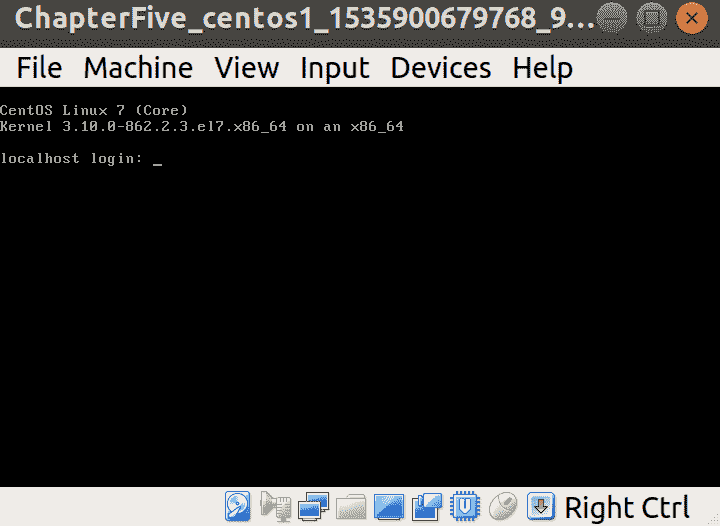
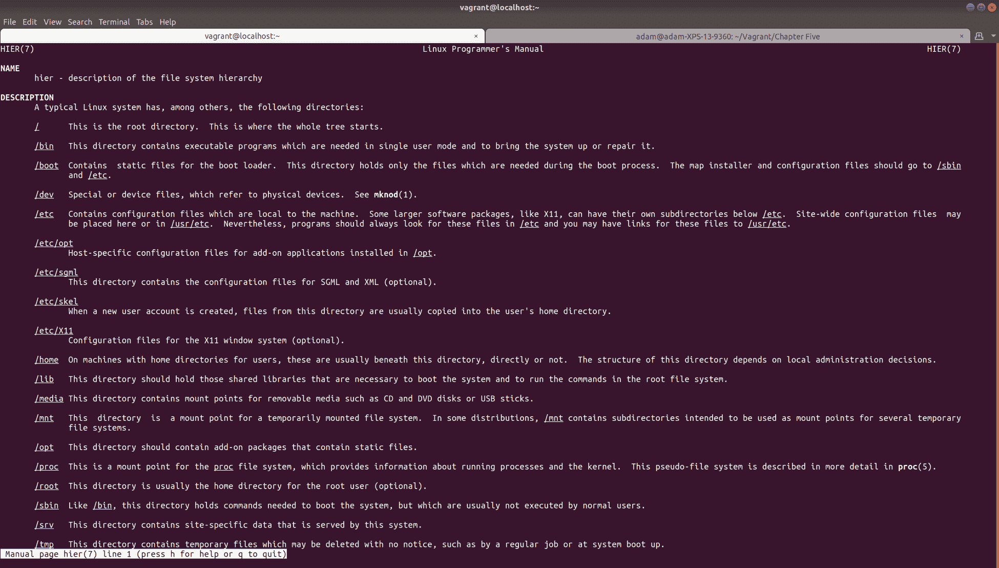
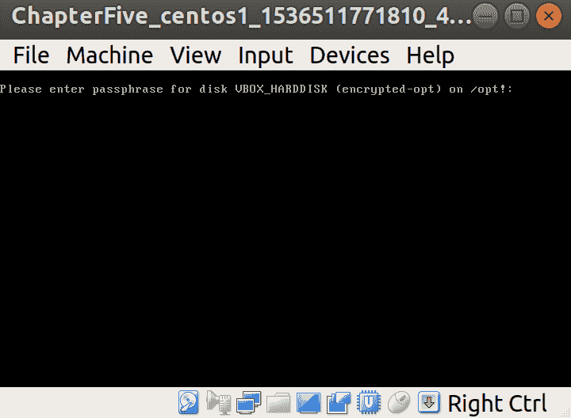

# 硬件和磁盘

本章将涵盖以下主题:

*   确定硬件
*   测试硬件
*   内核的作用
*   Linux 上的磁盘配置
*   文件系统层次结构
*   配置空白磁盘并安装它
*   使用 LVM 重新配置磁盘
*   使用`systemd-mount`和`fstab`
*   磁盘加密和静态加密
*   当前文件系统格式
*   即将推出的文件系统格式

# 介绍

你的硬件不关心你，就像你可能关心它一样。

硬件善变、喜怒无常、变幻莫测、喜怒无常；disks，硬件家族中叛逆的少年，将这一点更上一层楼。

你会发现自己在职业生涯的某个时候感到困惑，不明白为什么看似不相关的错误会发生在你系统的不同部分。您的 SSH 守护程序可能会在传输的奇数点随机死亡，NTP 可能会漂移，您的数据库可能会锁定，并且在您试图找出原因的过程中一直在拼命工作。

硬件通常是这些随机问题的答案(正如我们之前讨论的，时机未到时)。一个坏的记忆棒可能会以奇怪而奇妙的方式失效，而一个偶尔变成只读的磁盘可能意味着零星的夜间干扰事件，这些事件很容易用特别重的锤子解决。

If you don't want to use the phrase "hit it with a hammer" in front of your boss, the accepted nomenclature is "percussive maintenance."

当硬件变坏时，除了更换之外别无选择。我们自己焊接和固定元件的日子已经一去不复返了，因为这根本不是一个可行的解决方案，也不划算。

在某个时候，你会发现自己蹲在数据中心的一台开放式服务器上，对着一排排的`DIMMs`和一排`RAID10`磁盘挠头，试图确定哪一个有故障，这样你就可以把它换出来，把旧的放在研磨机里，让自己安心。

We spell storage disks such as hard drives with a k, and optical-type discs with a c.

在本章中，我们将了解识别特定硬件的方法，以及一些查找坏内存的简单故障排除步骤。与此同时，我们将通过向系统添加新磁盘以及安装后如何配置它们来进行工作。

# 技术要求

在本章中，我们将使用以下`Vagrantfile`，其中包含两个额外的磁盘:

```sh
# -*- mode: ruby -*-
# vi: set ft=ruby :

Vagrant.configure("2") do |config|

  config.vm.define "centos1" do |centos1|
    centos1.vm.box = "centos/7"
    centos1.vm.box_version = "1804.02"
    centos1.vm.provider "virtualbox" do |vbcustom|

      unless File.exist?('centos1.additional.vdi')
        vbcustom.customize ['createhd', '--filename', 'centos1.additional.vdi', '--size', 2 * 1024]
      end
      vbcustom.customize ['storageattach', :id, '--storagectl', 'IDE', '--port', 0, '--device', 1, '--type', 'hdd', '--medium', 'centos1.additional.vdi']

      unless File.exist?('centos1.additional2.vdi')
        vbcustom.customize ['createhd', '--filename', 'centos1.additional2.vdi', '--size', 2 * 1024]
      end
      vbcustom.customize ['storageattach', :id, '--storagectl', 'IDE', '--port', 1, '--device', 1, '--type', 'hdd', '--medium', 'centos1.additional2.vdi']

    end
  end

end
```

The extra disks defined here will be created in the local directory you're running Vagrant from, make sure you have enough space.

# 确定硬件

在第一章中，我们使用`dmidecode`和其他工具来计算我们是否在虚拟机中；在这里，我们将进一步尝试确定系统中可能运行的硬件，从磁盘 id 到正在使用的显卡类型。

# 准备好

连接到您的游民虚拟机，并安装一些我们将使用的额外工具:

```sh
$ vagrant ssh
$ sudo yum install -y pciutils usbutils
```

# 怎么做...

我们将挑选几种不同的方法来确定系统运行的硬件；即使你无法访问互联网，你也应该能够使用默认工具确定一些基本信息。

# lspci

我们从`pciutils`套件`lspci`安装的工具是一个很好的方法来列出您的集体 PCI 设备，没有很多额外的噪音。

如果我们只运行`lspci`，我们会得到一个设备及其标识的列表:

```sh
00:00.0 Host bridge: Intel Corporation 440FX - 82441FX PMC [Natoma] (rev 02)
00:01.0 ISA bridge: Intel Corporation 82371SB PIIX3 ISA [Natoma/Triton II]
00:01.1 IDE interface: Intel Corporation 82371AB/EB/MB PIIX4 IDE (rev 01)
00:02.0 VGA compatible controller: InnoTek Systemberatung GmbH VirtualBox Graphics Adapter
00:03.0 Ethernet controller: Intel Corporation 82540EM Gigabit Ethernet Controller (rev 02)
00:04.0 System peripheral: InnoTek Systemberatung GmbH VirtualBox Guest Service
00:05.0 Multimedia audio controller: Intel Corporation 82801AA AC'97 Audio Controller (rev 01)
00:07.0 Bridge: Intel Corporation 82371AB/EB/MB PIIX4 ACPI (rev 08)
```

在前面的列表中，我们可以看到我们系统中的设备。他们实际上已经将他们的数字标识翻译成了人类可读的格式。

如果要单独列出身份证，可以使用`-n`标志:

```sh
$ lspci -n
00:00.0 0600: 8086:1237 (rev 02)
00:01.0 0601: 8086:7000
00:01.1 0101: 8086:7111 (rev 01)
00:02.0 0300: 80ee:beef
00:03.0 0200: 8086:100e (rev 02)
00:04.0 0880: 80ee:cafe
00:05.0 0401: 8086:2415 (rev 01)
00:07.0 0680: 8086:7113 (rev 08)
```

或者如果两者都要，使用`-nn`:

```sh
$ lspci -nn
00:00.0 Host bridge [0600]: Intel Corporation 440FX - 82441FX PMC [Natoma] [8086:1237] (rev 02)
00:01.0 ISA bridge [0601]: Intel Corporation 82371SB PIIX3 ISA [Natoma/Triton II] [8086:7000]
00:01.1 IDE interface [0101]: Intel Corporation 82371AB/EB/MB PIIX4 IDE [8086:7111] (rev 01)
00:02.0 VGA compatible controller [0300]: InnoTek Systemberatung GmbH VirtualBox Graphics Adapter [80ee:beef]
00:03.0 Ethernet controller [0200]: Intel Corporation 82540EM Gigabit Ethernet Controller [8086:100e] (rev 02)
00:04.0 System peripheral [0880]: InnoTek Systemberatung GmbH VirtualBox Guest Service [80ee:cafe]
00:05.0 Multimedia audio controller [0401]: Intel Corporation 82801AA AC'97 Audio Controller [8086:2415] (rev 01)
00:07.0 Bridge [0680]: Intel Corporation 82371AB/EB/MB PIIX4 ACPI [8086:7113] (rev 08)
```

在这个列表中，我们可以看到一些友好的描述来帮助我们——比如`Ethernet controller`、`VGA compatible controller`、`IDE interface`等等。

一目了然，你应该很好地理解哪个设备做什么，这要感谢那些让`PCI ID`存储库保持最新的人的辛勤工作:[http://pci-ids.ucw.cz/](http://pci-ids.ucw.cz/)。

甚至比在我们的系统中列出设备更好的是，我们还可以用`-k`列出处理设备的内核驱动器。

在下面的片段中，我们可以看到以太网控制器由内核驱动程序`e1000`管理:

```sh
$ lspci -k
00:00.0 Host bridge: Intel Corporation 440FX - 82441FX PMC [Natoma] (rev 02)
00:01.0 ISA bridge: Intel Corporation 82371SB PIIX3 ISA [Natoma/Triton II]
00:01.1 IDE interface: Intel Corporation 82371AB/EB/MB PIIX4 IDE (rev 01)
 Kernel driver in use: ata_piix
 Kernel modules: ata_piix, pata_acpi, ata_generic
00:02.0 VGA compatible controller: InnoTek Systemberatung GmbH VirtualBox Graphics Adapter
00:03.0 Ethernet controller: Intel Corporation 82540EM Gigabit Ethernet Controller (rev 02)
 Subsystem: Intel Corporation PRO/1000 MT Desktop Adapter
 Kernel driver in use: e1000
 Kernel modules: e1000
00:04.0 System peripheral: InnoTek Systemberatung GmbH VirtualBox Guest Service
00:05.0 Multimedia audio controller: Intel Corporation 82801AA AC'97 Audio Controller (rev 01)
 Subsystem: Intel Corporation Device 0000
 Kernel driver in use: snd_intel8x0
 Kernel modules: snd_intel8x0
00:07.0 Bridge: Intel Corporation 82371AB/EB/MB PIIX4 ACPI (rev 08)
 Kernel driver in use: piix4_smbus
 Kernel modules: i2c_piix4
```

The name of the kernel driver and the actual hardware won't always be obvious, which is what makes tools such as `lspci` so handy.

在现代机器中，你可能会看到不止一条 PCI 总线，设备连接到它；碰巧我们的虚拟机对其所有设备只使用一条总线。

这意味着树视图非常平坦:

```sh
$ lspci -t
-[0000:00]-+-00.0
 +-01.0
 +-01.1
 +-02.0
 +-03.0
 +-04.0
 +-05.0
 \-07.0
```

但是，当我们对物理机器(在本例中是我的笔记本电脑)运行`lspci`时，树形视图可以有更多的分支:

```sh
$ lspci -t
-[0000:00]-+-00.0
 +-02.0
 +-04.0
 +-14.0
 +-14.2
 +-15.0
 +-15.1
 +-16.0
 +-1c.0-[01-39]----00.0-[02-39]--+-00.0-[03]--
 |                               +-01.0-[04-38]--
 |                               \-02.0-[39]----00.0
 +-1c.4-[3a]----00.0
 +-1c.5-[3b]----00.0
 +-1d.0-[3c]----00.0
 +-1f.0
 +-1f.2
 +-1f.3
 \-1f.4
```

If you can't see a device you know to be there (a graphics card say), it could be a few things: maybe the device is disabled in the BIOS or the card itself is dead. Try some basic troubleshooting such as checking the BIOS/UEFI configuration or flipping the card to a different slot.

USB 设备也有`lsusb`。如果您使用的是像通用串行总线以太网设备这样的设备，这可能会很方便。在下面的例子中，您可以看到我连接的盒子(树莓皮)的网络端口在 USB 总线上:

```sh
$ lsusb
Bus 001 Device 003: ID 0424:ec00 Standard Microsystems Corp. SMSC9512/9514 Fast Ethernet Adapter
```

# lshw

一个特别有用的程序，`lshw`内置了输出你的硬件树为 JSON、XML、HTML 的能力，并且在开发的时候大概还会有更多。

默认情况下，`lshw`的输出非常冗长，但应该如下所示:

```sh
$ sudo lshw 
localhost.localdomain 
 description: Computer
 product: VirtualBox
 vendor: innotek GmbH
 version: 1.2
 serial: 0
 width: 64 bits
 capabilities: smbios-2.5 dmi-2.5 vsyscall32
<SNIP>
 *-pnp00:00
 product: PnP device PNP0303
 physical id: 3
 capabilities: pnp
 configuration: driver=i8042 kbd
 *-pnp00:01
 product: PnP device PNP0f03
 physical id: 4
 capabilities: pnp
 configuration: driver=i8042 aux

```

我倾向于发现一目了然的解决方案在很多时候可以更好地工作。考虑到这一点，让我们来看看`-short`选项的输出:

```sh
$ sudo lshw -short
H/W path            Device     Class       Description
======================================================
 system      VirtualBox
/0                             bus         VirtualBox
/0/0                           memory      128KiB BIOS
/0/1                           memory      512MiB System memory
/0/2                           processor   Intel(R) Core(TM) i7-7500U CPU @ 2.70GHz
/0/100                         bridge      440FX - 82441FX PMC [Natoma]
/0/100/1                       bridge      82371SB PIIX3 ISA [Natoma/Triton II]
/0/100/1.1          scsi0      storage     82371AB/EB/MB PIIX4 IDE
/0/100/1.1/0.0.0    /dev/sda   disk        42GB VBOX HARDDISK
/0/100/1.1/0.0.0/1  /dev/sda1  volume      1MiB Linux filesystem partition
/0/100/1.1/0.0.0/2             volume      1GiB Linux filesystem partition
/0/100/1.1/0.0.0/3  /dev/sda3  volume      38GiB Linux LVM Physical Volume partition
/0/100/1.1/0        /dev/sdb   disk        2147MB VBOX HARDDISK
/0/100/1.1/1        /dev/sdc   disk        2147MB VBOX HARDDISK
/0/100/2                       display     VirtualBox Graphics Adapter
/0/100/3            eth0       network     82540EM Gigabit Ethernet Controller
/0/100/4                       generic     VirtualBox Guest Service
/0/100/5                       multimedia  82801AA AC'97 Audio Controller
/0/100/7                       bridge      82371AB/EB/MB PIIX4 ACPI
/0/3                           input       PnP device PNP0303
/0/4                           input       PnP device PNP0f03
```

这更容易阅读，也就是说，一眼就能看出系统有三个磁盘，一个网络设备和`512MiB`的系统内存。

正如我们在 [第 1 章](01.html) *【简介及环境设置】*中看到的，您也可以用`-c`选择一个`class`输出，这里用我们的网络设备再次显示:

```sh
$ sudo lshw -c network
 *-network 
 description: Ethernet interface
 product: 82540EM Gigabit Ethernet Controller
 vendor: Intel Corporation
 physical id: 3
 bus info: pci@0000:00:03.0
 logical name: eth0
 version: 02
 serial: 52:54:00:c9:c7:04
 size: 1Gbit/s
 capacity: 1Gbit/s
 width: 32 bits
 clock: 66MHz
 capabilities: pm pcix bus_master cap_list ethernet physical tp 10bt 10bt-fd 100bt 100bt-fd 1000bt-fd autonegotiation
 configuration: autonegotiation=on broadcast=yes driver=e1000 driverversion=7.3.21-k8-NAPI duplex=full ip=10.0.2.15 latency=64 link=yes mingnt=255 multicast=yes port=twisted pair speed=1Gbit/s
 resources: irq:19 memory:f0000000-f001ffff ioport:d010(size=8)
```

从这个输出中，我们可以看到很多相关的信息，比如网络设备的容量(`1Gbit/s`)，以及设备的能力。

我们甚至可以看到它的特定配置，这对于您可能想要进行的潜在更改非常有用。

如果您想查看实际的数字标识，您可以在命令中添加`-numeric`:

```sh
$ sudo lshw -c network -numeric
  *-network                 
       description: Ethernet interface
       product: 82540EM Gigabit Ethernet Controller [8086:100E]
       vendor: Intel Corporation [8086]
       physical id: 3
       bus info: pci@0000:00:03.0
       logical name: eth0
       version: 02
       serial: 52:54:00:c9:c7:04
       size: 1Gbit/s
       capacity: 1Gbit/s
       width: 32 bits
       clock: 66MHz
       capabilities: pm pcix bus_master cap_list ethernet physical tp 10bt 10bt-fd 100bt 100bt-fd 1000bt-fd autonegotiation
       configuration: autonegotiation=on broadcast=yes driver=e1000 driverversion=7.3.21-k8-NAPI duplex=full ip=10.0.2.15 latency=64 link=yes mingnt=255 multicast=yes port=twisted pair speed=1Gbit/s
       resources: irq:19 memory:f0000000-f001ffff ioport:d010(size=8)
```

# /proc

`/proc`是在大多数 Linux 系统(但不是 BSD)上发现的**进程信息伪文件系统**。

它是可读的内核接口数据结构，一些文件是可写的，允许对运行的内核进行动态更改。

这个目录中一些有用的文件是类似`/proc/cpuinfo`的文件，当被查询时，它会给你内核知道的关于你的 CPU 的所有信息:

```sh
$ cat /proc/cpuinfo 
processor    : 0
vendor_id    : GenuineIntel
cpu family    : 6
model        : 142
model name    : Intel(R) Core(TM) i7-7500U CPU @ 2.70GHz
stepping    : 9
cpu MHz        : 2904.000
cache size    : 4096 KB
physical id    : 0
siblings    : 1
core id        : 0
cpu cores    : 1
apicid        : 0
initial apicid    : 0
fpu        : yes
fpu_exception    : yes
cpuid level    : 22
wp        : yes
flags        : fpu vme de pse tsc msr pae mce cx8 apic sep mtrr pge mca cmov pat pse36 clflush mmx fxsr sse sse2 syscall nx rdtscp lm constant_tsc rep_good nopl xtopology nonstop_tsc pni pclmulqdq monitor ssse3 cx16 pcid sse4_1 sse4_2 x2apic movbe popcnt aes xsave avx rdrand hypervisor lahf_lm abm 3dnowprefetch fsgsbase avx2 invpcid rdseed clflushopt
bogomips    : 5808.00
clflush size    : 64
cache_alignment    : 64
address sizes    : 39 bits physical, 48 bits virtual
power management:
```

它还会给你一个处理器号，这意味着如果你想快速统计系统中的处理器数量(正在使用)，你可以用一个简短的命令和一些管道来列出它们。

在这里，我们正在转储文件，寻找单词`processor`，然后计算行数。这不是最万无一失的系统，但在紧要关头却派上了用场:

```sh
$ grep -c "processor" /proc/cpuinfo 
1
```

另一个需要注意的便利文件是`/proc/meminfo`，用于完整转储系统知道的关于您的内存的所有信息:

```sh
$ cat /proc/meminfo
MemTotal:         499428 kB
MemFree:           66164 kB
MemAvailable:     397320 kB
Buffers:            2140 kB
Cached:           324952 kB
SwapCached:            0 kB
Active:           222104 kB
Inactive:         142044 kB
Active(anon):      12764 kB
Inactive(anon):    28916 kB
Active(file):     209340 kB
Inactive(file):   113128 kB
Unevictable:           0 kB
Mlocked:               0 kB
SwapTotal:       1572860 kB
SwapFree:        1572860 kB
Dirty:                 0 kB
Writeback:             0 kB
AnonPages:         37100 kB
Mapped:            22844 kB
Shmem:              4624 kB
Slab:              44216 kB
SReclaimable:      21800 kB
SUnreclaim:        22416 kB
KernelStack:        1728 kB
PageTables:         4200 kB
NFS_Unstable:          0 kB
Bounce:                0 kB
WritebackTmp:          0 kB
CommitLimit:     1822572 kB
Committed_AS:     302040 kB
VmallocTotal:   34359738367 kB
VmallocUsed:        4744 kB
VmallocChunk:   34359730812 kB
HardwareCorrupted:     0 kB
AnonHugePages:         0 kB
CmaTotal:              0 kB
CmaFree:               0 kB
HugePages_Total:       0
HugePages_Free:        0
HugePages_Rsvd:        0
HugePages_Surp:        0
Hugepagesize:       2048 kB
DirectMap4k:       49088 kB
DirectMap2M:      475136 kB
```

The `/proc` filesystem is pretty sprawling and vast; check out the manual page for `proc` if you get a spare moment—you won't regret it in a hurry (you might regret it later).

# /sys

`/sys`或`sysfs`是一个用于导出内核对象的文件系统(根据其手册页)，这意味着它是另一个用于访问内核信息的文件系统(像`/proc`)。

它在脚本中非常有用，例如列出发现的块设备:

```sh
$ ls -l /sys/block
total 0
lrwxrwxrwx. 1 root root 0 Sep  2 12:29 dm-0 -> ../devices/virtual/block/dm-0
lrwxrwxrwx. 1 root root 0 Sep  2 12:29 dm-1 -> ../devices/virtual/block/dm-1
lrwxrwxrwx. 1 root root 0 Sep  2 12:29 sda -> ../devices/pci0000:00/0000:00:01.1/ata1/host0/target0:0:0/0:0:0:0/block/sda
lrwxrwxrwx. 1 root root 0 Sep  2 12:29 sdb -> ../devices/pci0000:00/0000:00:01.1/ata1/host0/target0:0:1/0:0:1:0/block/sdb
lrwxrwxrwx. 1 root root 0 Sep  2 12:29 sdc -> ../devices/pci0000:00/0000:00:01.1/ata2/host1/target1:0:1/1:0:1:0/block/sdc
```

它对于查找单个组件的设备标识也很有用(例如，如果您手边没有`lshw`或`lspci`)。

在以下示例中，我列出了`eth0`设备的供应商和设备标识:

```sh
$ cat /sys/class/net/eth0/device/vendor 
0x8086
$ cat /sys/class/net/eth0/device/device
0x100e
```

有了这些信息，我可以对照设备列表检查详细信息。我选择查看`PCI ID`存储库，在那里我了解到供应商 ID 属于英特尔公司，设备 ID 翻译为 82540EM 千兆以太网控制器。

There's a lot more to `/sys` outside the hardware realm, and it can be a good idea to research the filesystem in more depth. The manual page (`5`) for `sysfs` is a debatable must.

# dmesg(和内核日志)

`dmesg`是一种根据其手册打印或控制内核环形缓冲区的方法，但是，对你我来说，这是一种快速查看您的硬件在初始化时是否被内核检测到的好方法。

运行`dmesg`会打印到`stdout`，所以导入`less`很方便:

```sh
$ dmesg | less
```

一旦完成，您应该能够搜索特定的字符串。继续我们的主题，我们将寻找`Intel`并看看加载了什么:

```sh
[    2.221242] e1000: Intel(R) PRO/1000 Network Driver - version 7.3.21-k8-NAPI
```

如果我们寻找`ATA`，我们还可以看到我们的磁盘被检测到:

```sh
[ 0.940242] ata2.01: ATA-6: VBOX HARDDISK, 1.0, max UDMA/133
[ 0.940248] ata2.01: 4194304 sectors, multi 128: LBA 
[ 0.940807] ata1.00: ATA-6: VBOX HARDDISK, 1.0, max UDMA/133
[ 0.940810] ata1.00: 83886080 sectors, multi 128: LBA 
[ 0.940815] ata1.01: ATA-6: VBOX HARDDISK, 1.0, max UDMA/133
[ 0.940817] ata1.01: 4194304 sectors, multi 128: LBA 
```

甚至还有一个`-T`选项，为您提供人类可读的时间戳，这可能特别有用，如下面针对我们的 IDE ( `PATA`)控制器所示:

```sh
[Sun Sep 2 12:29:08 2018] ata1: PATA max UDMA/33 cmd 0x1f0 ctl 0x3f6 bmdma 0xd000 irq 14
[Sun Sep 2 12:29:08 2018] ata2: PATA max UDMA/33 cmd 0x170 ctl 0x376 bmdma 0xd008 irq 15
```

# 迪米特里

另一个来自[第 1 章](01.html)的嘈杂但又喜欢的工具，我*介绍和环境设置*，`dmidecode`解码了 DMI 表。

我们最初使用它来检查虚拟硬件，但是在非虚拟机上，它可能更有用。

比较以下`-t processor`转储:

```sh
$ sudo dmidecode -t processor
# dmidecode 3.0
Getting SMBIOS data from sysfs.
SMBIOS 2.5 present.
```

请注意，与我的笔记本电脑上的示例相比，我们的虚拟机上一片空白:

```sh
$ sudo dmidecode -t processor
# dmidecode 3.1
Getting SMBIOS data from sysfs.
SMBIOS 3.0.0 present.

Handle 0x003F, DMI type 4, 48 bytes
Processor Information
    Socket Designation: U3E1
    Type: Central Processor
    Family: Core i7
    Manufacturer: Intel(R) Corporation
    ID: E9 06 08 00 FF FB EB BF
    Signature: Type 0, Family 6, Model 142, Stepping 9
    Flags:
<SNIP>
    Core Count: 2
    Core Enabled: 2
    Thread Count: 4
    Characteristics:
        64-bit capable
        Multi-Core
        Hardware Thread
        Execute Protection
        Enhanced Virtualization
        Power/Performance Control
```

这表明，在某些情况下，从物理机器收集的信息可能比从虚拟机器收集的信息多。

The same can be said in reverse: if someone is doing everything in their power to obfuscate what hardware is running from you, firstly you should suspect you're running on a VM, and then secondly you should wonder why they're going to such great lengths to hide that fact.

# /dev

如果要我选一个喜欢的`pseudo-filesystems`，我会是一个古怪的个体，但如果你强迫我，很可能就是`/dev`。

这并不是因为对`dev`这个词的某种喜爱或者对它的过度使用的某种亲近感，而是因为我经常发现自己置身其中。

As with all of the `pseudo-filesystems`, they're transient and temporary (`tmpfs`). Don't do as I once saw a colleague do and store things in them, because the moment you reboot your box: poof, your files are gone.

从表面上看，`/dev`看起来凌乱不堪:

```sh
$ ls /dev/
autofs           hugepages           port    shm       tty18  tty33  tty49  tty7     vcs6
block            hwrng               ppp     snapshot  tty19  tty34  tty5   tty8     vcsa
bsg              initctl             ptmx    snd       tty2   tty35  tty50  tty9     vcsa1
btrfs-control    input               pts     stderr    tty20  tty36  tty51  ttyS0    vcsa2
char             kmsg                random  stdin     tty21  tty37  tty52  ttyS1    vcsa3
console          log                 raw     stdout    tty22  tty38  tty53  ttyS2    vcsa4
core             loop-control        rtc     tty       tty23  tty39  tty54  ttyS3    vcsa5
cpu              mapper              rtc0    tty0      tty24  tty4   tty55  uhid     vcsa6
cpu_dma_latency  mcelog              sda     tty1      tty25  tty40  tty56  uinput   vfio
crash            mem                 sda1    tty10     tty26  tty41  tty57  urandom  vga_arbiter
disk             mqueue              sda2    tty11     tty27  tty42  tty58  usbmon0  vhci
dm-0             net                 sda3    tty12     tty28  tty43  tty59  vcs      vhost-net
dm-1             network_latency     sdb     tty13     tty29  tty44  tty6   vcs1     VolGroup00
fd               network_throughput  sdc     tty14     tty3   tty45  tty60  vcs2     zero
full             null                sg0     tty15     tty30  tty46  tty61  vcs3
fuse             nvram               sg1     tty16     tty31  tty47  tty62  vcs4
hpet             oldmem              sg2     tty17     tty32  tty48  tty63  vcs5
```

然而，当你知道了真相，你会发现它是无价的。

咱们`ls``/dev/disk/`目录:

```sh
$ ls /dev/disk/
by-id  by-path  by-uuid
```

有趣的选择——我确实喜欢！

选择`by-id`选项会显示我们所有的磁盘设备，`by-id`:

```sh
$ ls /dev/disk/by-id/
ata-VBOX_HARDDISK_VB4eceb5be-efcdfb56
ata-VBOX_HARDDISK_VB804908ad-25f1585c
ata-VBOX_HARDDISK_VBcf466104-c1479f0d
ata-VBOX_HARDDISK_VBcf466104-c1479f0d-part1
ata-VBOX_HARDDISK_VBcf466104-c1479f0d-part2
ata-VBOX_HARDDISK_VBcf466104-c1479f0d-part3
dm-name-VolGroup00-LogVol00
dm-name-VolGroup00-LogVol01
dm-uuid-LVM-SA8LTUF2yzFEV1RdgThw0ZiRxhyHFKuUIAjIC6ScnMtvH67BTyTN31hd82bgDSzd
dm-uuid-LVM-SA8LTUF2yzFEV1RdgThw0ZiRxhyHFKuUj6b8IVKEw37bTwOqy81Ud3juFCSJBg12
lvm-pv-uuid-vrrtbx-g480-HcJI-5wLn-4aOf-Olld-rC03AY
$ ls /dev/disk/by-path/
pci-0000:00:01.1-ata-1.0        pci-0000:00:01.1-ata-1.0-part2  pci-0000:00:01.1-ata-1.1
pci-0000:00:01.1-ata-1.0-part1  pci-0000:00:01.1-ata-1.0-part3  pci-0000:00:01.1-ata-2.1
```

以下是我绝对的最爱，`by-uuid`:

```sh
$ ls /dev/disk/by-uuid/
570897ca-e759-4c81-90cf-389da6eee4cc  c39c5bed-f37c-4263-bee8-aeb6a6659d7b
b60e9498-0baa-4d9f-90aa-069048217fee
```

我喜欢这些的主要原因是因为这些条目实际上是指向它们命名的设备的符号链接:

```sh
$ ls -l /dev/disk/by-uuid/
total 0
lrwxrwxrwx. 1 root root 10 Sep  2 12:29 570897ca-e759-4c81-90cf-389da6eee4cc -> ../../sda2
lrwxrwxrwx. 1 root root 10 Sep  2 12:29 b60e9498-0baa-4d9f-90aa-069048217fee -> ../../dm-0
lrwxrwxrwx. 1 root root 10 Sep  2 12:29 c39c5bed-f37c-4263-bee8-aeb6a6659d7b -> ../../dm-1
```

正因为如此，我现在知道我的`sda2`分区有一个`570897ca-e759-4c81-90cf-389da6eee4cc`的 UUID，可以用于各种任务。

UUID 最明显的用途是在大多数系统的文件中:

```sh
$ cat /etc/fstab 

#
# /etc/fstab
# Created by anaconda on Sat May 12 18:50:26 2018
#
# Accessible filesystems, by reference, are maintained under '/dev/disk'
# See man pages fstab(5), findfs(8), mount(8) and/or blkid(8) for more info
#
/dev/mapper/VolGroup00-LogVol00 /                       xfs     defaults        0 0
UUID=570897ca-e759-4c81-90cf-389da6eee4cc /boot                   xfs     defaults        0 0
/dev/mapper/VolGroup00-LogVol01 swap                    swap    defaults        0 0
```

因此，将这两条信息结合起来，我们现在有了我们的`fstab` UUID 条目的实际设备名称(`sda2`)！

The reason UUIDs are used is because device designation can change, historically more so than now. On one boot, your `/boot` filesystem might be denoted as `sda2`, then on another a different device might be found first, and suddenly `/boot` is `sdb2,` breaking `fstab`.

# 它是如何工作的...

我们在这里主要做的是检查内核在连接到您系统的设备方面知道什么。

PCI 设备和 USB 设备的分母在所有操作系统中都是相同的(你会在 Windows、Mac 和 BSD 上看到相同的 Hex 值)。这允许内核选择并加载适当的代码位，这些代码是为与同一设备交互而编写的。

这种情况很少见，但有可能一个模块取代了一个旧的模块，或者两个驱动程序可以同时用于同一个硬件；在这种情况下，了解您的硬件设备标识和运行它们的内核代码位是很有用的。

If you use Linux on the desktop, and use an Nvidia or AMD GPU, there's a high chance you'll be interacting with drivers and what the kernel loads, as there's both closed source and open source versions to pick from.

# 测试硬件

在本节中，我们将讨论通过查看 SMART 和磁盘测试软件来测试潜在故障硬件的方法，以及对内存问题进行物理故障排除。

Working with disks can be exceptionally risky, and you should always make sure that you have working backups before you start anything that might be hazardous to your data.

# 准备好了

在这里，我们将主要使用我们已经创建的游民盒子，但是您可能还想看一下来自[http://www.memtest.org/](http://www.memtest.org/)的 Memtest86+，我提到它用于内存测试。

连接到您的虚拟机并安装`smartmontools`:

```sh
$ vagrant ssh
$ sudo yum install -y smartmontools hdparm
```

您可能还想下载最新的 Memtest86+ ISO。

# 怎么做...

我们将从磁盘运行状况开始。

# 自我监控、分析和报告技术(SMART)

首先，最好确保`smartd`正在您想要查询的任何系统上运行:

```sh
$ sudo systemctl enable smartd
```

`smartd`是 SMART 的监控守护进程；守护进程在启动时尝试在兼容的`ATA`设备上启用监控，默认情况下，每 30 分钟轮询一次`ATA`设备。

默认情况下，`smartd`作为其周期性工作的一部分检测到的错误会使用`SYSLOG`界面进行记录。如果配置为这样做，它还可以通过电子邮件发送给管理员。

一旦启用，就可以使用`smartctl`工具查询磁盘:

```sh
$ sudo smartctl -a /dev/sda
```

注意`sudo`的使用和磁盘设备的无。

可悲的是，因为我们在 VirtualBox 虚拟机中，这不会给我们任何有用的东西:

```sh
smartctl 6.5 2016-05-07 r4318 [x86_64-linux-3.10.0-862.2.3.el7.x86_64] (local build)
Copyright (C) 2002-16, Bruce Allen, Christian Franke, www.smartmontools.org

=== START OF INFORMATION SECTION ===
Device Model: VBOX HARDDISK
Serial Number: VBcf466104-c1479f0d
Firmware Version: 1.0
User Capacity: 42,949,672,960 bytes [42.9 GB]
Sector Size: 512 bytes logical/physical
Device is: Not in smartctl database [for details use: -P showall]
ATA Version is: ATA/ATAPI-6 published, ANSI INCITS 361-2002
Local Time is: Sun Sep 2 14:18:30 2018 UTC
SMART support is: Unavailable - device lacks SMART capability.

A mandatory SMART command failed: exiting. To continue, add one or more '-T permissive' options.
```

但是，如果您在物理机器上尝试这种方法，结果会有所不同，可以收集到更多信息。

# hdparm

您的磁盘可能向您的 SMART 命令报告正常，但您仍然看到某种形式的减速或其他问题。

您可以使用`hdparm`工具(在默认存储库中可用)对磁盘读取进行基准测试。

我们可以使用以下方法测试磁盘的速度:

```sh
$ sudo hdparm -tT /dev/sda
```

The manual page for `hdparm` suggests doing these tests two or three times for average results and running them on otherwise inactive systems.

您的里程可能会有所不同，但我的系统的结果如下:

```sh
/dev/sda:
 Timing cached reads:   13158 MB in  1.99 seconds = 6597.20 MB/sec
 Timing buffered disk reads: 2714 MB in  3.00 seconds = 903.83 MB/sec
```

部分地，我们在这里有一个问题，因为我们实际上正在做的是从内核的页面缓存中读取。我们可以使用`--direct`选项绕过这一点，该选项直接从驱动器读取到`hdparm`的缓冲区中:

```sh
$ sudo hdparm -tT --direct /dev/sda
```

这些结果是更原始的磁盘读取性能:

```sh
/dev/sda:
 Timing O_DIRECT cached reads:   2416 MB in  2.00 seconds = 1208.08 MB/sec
 Timing O_DIRECT disk reads: 3648 MB in  3.00 seconds = 1215.78 MB/sec
```

# 记忆测试

内存更容易测试，尽管检查内存的最彻底方法是在运行 Memtest86+时让内存盒离线几个小时。

Programs such as **memtester** also exist, which can be executed on a running system. The problem with these types of test is that they won't test memory already in use by the system, and they can end up fighting processes such as the **Out Of Memory** (**OOM**) killer.

如果您有来自 Memtest86+网站的 ISO 映像，您可以将其附加到您的虚拟机并引导到程序中(完全独立于 CentOS)。

它看起来像这样:


任何错误都会出现在屏幕的下半部分，你会知道你的记性不好。

I used to let Memtest86+ do five passes over the memory I was testing when I used it every night during my data center days.

如果您发现您的系统根本无法启动，但您怀疑内存问题，那么以二进制方式进行测试可能是个好主意。我的意思是，如果你的服务器有 128 块内存(这并不罕见)，你应该删除其中的 64 块，并测试剩余的一批。如果你的服务器启动，你知道你的故障棒在你移除的 64 的某个地方。如果你的服务器没有启动，你的故障棒就在你留在里面的那一批的某个地方。

重复这种方法，将每次检查的内存减半，直到只剩下两个内存，其中一个内存有问题，然后依次测试。

Testing in the previous fashion may sound obvious, but at two o'clock in the morning, when you can't think straight, having read these words might save your sanity.

# 它是如何工作的...

SMART 通过查询您的目标`/dev/`设备并显示它对 SMART 兼容设备的了解来读取信息。

当我们使用`hdparm`时，我们实际上是在运行测试，而不考虑我们的文件系统，因为程序直接从磁盘读取——正因为如此，真实世界的速度可能会有所不同。

# 还有更多...

我在这一部分没有包括测试显卡和类似的东西，因为通常很容易判断显卡何时退出(图形故障、随机线条和偶尔的蜂鸣声)。

我也没有提到物理磁盘阵列卡，因为数量太多了，不可能为它们列出一个连贯的方法。对于物理 RAID 卡，我能给出的最好建议是查看制造商关于测试的详细信息。

我们没有涉及磁盘的写测试，部分原因是通常很容易区分磁盘问题和单独的读测试，部分原因是很多测试写操作的方法如果做得不正确，可能是破坏性的。

# 内核的作用

我们将观察内核在其启动过程中的运行情况，以及在我们到达操作系统时已经加载了哪些模块。

# 准备好了

在本节中，请确保您的虚拟机已启动并运行，因为我们将讨论硬件初始化:

```sh
$ vagrant ssh
```

连接到您的虚拟机。如果您刚刚完成上一部分，您可能想要销毁并重新创建您的虚拟机，以确保普通的体验。

# 怎么做...

首先，我们要看我们的系统启动。

首先，在我们的引导配置中禁用`quiet`选项，这样我们就可以在虚拟机显示屏上看到信息:

```sh
$ sudo sed -i 's/ quiet//g' /etc/sysconfig/grub
```

现在，我们需要生成一个新的`grub`配置文件，因为我们已经进行了更改:

```sh
$ sudo grub2-mkconfig | sudo tee /boot/grub2/grub.cfg
```

The previous code is a good example of what you would do if someone asked you to make a `grub` configuration change, a surprisingly common action.

现在，打开 VirtualBox 主窗口，双击您的虚拟机，您可以看到黑色控制台:



打开您的终端连接，以便您可以看到两者，并使用`reboot`命令重新启动虚拟机:

```sh
$ sudo reboot
```

眼睛盯着 VirtualBox 窗口；您应该会看到如下截图:


你注意到滚动信息了吗？它可能飞得太快，你看不懂，但它是你的系统通过初始化自己工作的。

您现在可以关闭您的虚拟盒子窗口，并在终端中继续。

如果你有兴趣通读刚才看到的内容，你可能会记得我们之前使用的`dmesg`命令；你刚才看到的一切都可以查看。

现在我们又进入了一个正在运行的系统，我们可以看到内核加载了哪些模块来处理我们的硬件:

```sh
$ lsmod
Module                  Size  Used by
sunrpc                353310  1 
intel_powerclamp       14419  0 
iosf_mbi               14990  0 
crc32_pclmul           13133  0 
ghash_clmulni_intel    13273  0 
snd_intel8x0           38199  0 
ppdev                  17671  0 
snd_ac97_codec        130556  1 snd_intel8x0
ac97_bus               12730  1 snd_ac97_codec
aesni_intel           189415  0 
snd_pcm               101643  2 snd_ac97_codec,snd_intel8x0
snd_timer              29810  1 snd_pcm
lrw                    13286  1 aesni_intel
pcspkr                 12718  0 
sg                     40721  0 
gf128mul               15139  1 lrw
e1000                 137574  0 
glue_helper            13990  1 aesni_intel
ablk_helper            13597  1 aesni_intel
snd                    79215  4 snd_ac97_codec,snd_intel8x0,snd_timer,snd_pcm
cryptd                 20511  3 ghash_clmulni_intel,aesni_intel,ablk_helper
i2c_piix4              22401  0 
soundcore              15047  1 snd
i2c_core               63151  1 i2c_piix4
parport_pc             28205  0 
parport                46395  2 ppdev,parport_pc
video                  24538  0 
ip_tables              27126  0 
xfs                  1003971  2 
libcrc32c              12644  1 xfs
sd_mod                 46322  3 
crc_t10dif             12912  1 sd_mod
crct10dif_generic      12647  0 
ata_generic            12923  0 
pata_acpi              13053  0 
ata_piix               35052  2 
libata                242992  3 pata_acpi,ata_generic,ata_piix
crct10dif_pclmul       14307  1 
crct10dif_common       12595  3 crct10dif_pclmul,crct10dif_generic,crc_t10dif
crc32c_intel           22094  1 
serio_raw              13434  0 
dm_mirror              22289  0 
dm_region_hash         20813  1 dm_mirror
dm_log                 18411  2 dm_region_hash,dm_mirror
dm_mod                123941  8 dm_log,dm_mirror
```

模块太多了！

正如我之前提到的，这些模块中的一些将是显而易见的，更多的仍然不会。

该列表中一个明显的例子可能是`e1000`，因为我们已经知道这是我们之前章节中的网络模块。

我们可以使用`modinfo`获得某个模块的具体信息:

```sh
$ modinfo e1000
filename:       /lib/modules/3.10.0-862.2.3.el7.x86_64/kernel/drivers/net/ethernet/intel/e1000/e1000.ko.xz
version:        7.3.21-k8-NAPI
license:        GPL
description:    Intel(R) PRO/1000 Network Driver
author:         Intel Corporation, <linux.nics@intel.com>
retpoline:      Y
rhelversion:    7.5
srcversion:     04454A212DD89712602561D
alias:          pci:v00008086d00002E6Esv*sd*bc*sc*i*
alias:          pci:v00008086d000010B5sv*sd*bc*sc*i*
alias:          pci:v00008086d00001099sv*sd*bc*sc*i*
<SNIP>
alias:          pci:v00008086d00001000sv*sd*bc*sc*i*
depends: 
intree:         Y
vermagic:       3.10.0-862.2.3.el7.x86_64 SMP mod_unload modversions 
signer:         CentOS Linux kernel signing key
sig_key:        66:6E:F0:31:93:3F:51:27:06:23:72:83:2C:E9:BA:8A:49:00:5C:8F
sig_hashalgo:   sha256
parm:           TxDescriptors:Number of transmit descriptors (array of int)
parm:           RxDescriptors:Number of receive descriptors (array of int)
parm:           Speed:Speed setting (array of int)
parm:           Duplex:Duplex setting (array of int)
parm:           AutoNeg:Advertised auto-negotiation setting (array of int)
parm:           FlowControl:Flow Control setting (array of int)
parm:           XsumRX:Disable or enable Receive Checksum offload (array of int)
parm:           TxIntDelay:Transmit Interrupt Delay (array of int)
parm:           TxAbsIntDelay:Transmit Absolute Interrupt Delay (array of int)
parm:           RxIntDelay:Receive Interrupt Delay (array of int)
parm:           RxAbsIntDelay:Receive Absolute Interrupt Delay (array of int)
parm:           InterruptThrottleRate:Interrupt Throttling Rate (array of int)
parm:           SmartPowerDownEnable:Enable PHY smart power down (array of int)
parm:           copybreak:Maximum size of packet that is copied to a new buffer on receive (uint)
parm:           debug:Debug level (0=none,...,16=all) (int)
```

前面的代码不仅给出了模块和许可证的版本，还提供了作者和他们的联系信息(通常是 bug 报告)。

如果您试图移除正在使用的模块，您将不被允许，如以下`modprobe`示例所示:

```sh
$ sudo modprobe -r libata
modprobe: FATAL: Module libata is in use.
```

同样，如果你想加载一个新的模块(也许是因为你想测试它)，你可以再次使用`modprobe`:

```sh
$ sudo modprobe nf_tables
```

然后我们可以看到加载的模块:

```sh
$ lsmod | grep nf_
nf_tables              74179  0 
nfnetlink              14490  1 nf_tables
```

在启动时加载模块是另一回事，因为如果没有内置到内核中，它需要一个配置文件(内核选项通常是通用的，这样供应商可以覆盖尽可能多的基础而不会导致问题)。

为了确保`nf_tables`从内核的其余部分开始，运行以下命令:

```sh
$ echo "nf_tables" | sudo tee /etc/modules-load.d/nftables.conf
```

重新启动并使用`lsmod`查看您的模块是否已加载。

# 它是如何工作的...

当您的系统启动时，会有几件事情按顺序发生，这些事情会因细微的差异而略有不同(例如您使用的是哪个引导加载程序，尽管现在主要是 Grub)。

其中之一是内核在将控制权移交给`init`系统(`systemd`)之前，会提取自己并加载。

当内核正在加载时，它还会检测系统中的硬件，并将适当的模块添加到其运行状态，以便硬件可以正确地进行交互和管理。

当我们用`lsmod`列出模块时，我们实际上只是以更易读的格式打印`/proc/modules`。

# 还有更多...

您可以动态加载和卸载模块，也可以手动将某些模块列入黑名单。

如果您有一个特定的硬件出现故障，和/或导致内核死机(内核完全停止运行并崩溃)，这将非常有用。

要将某个模块列入黑名单，简单来说就是在`/etc/modprobe.d/`中将其加入黑名单的情况:

```sh
$ echo "blacklist e1000" | sudo tee -a /etc/modprobe.d/blacklist.conf
```

In the previous example, I blacklisted `e1000`. Clearly, this is going to cause me problems as it means my network card won't have appropriate drivers at boot, but it made the system more secure!

# Linux 上的磁盘配置

在本节中，我们将查看虚拟机中磁盘的现成配置，并讨论`vda`、`sda`、`hda`和`nvme`之间的差异。我们还将研究磁盘、虚拟磁盘、分区和文件系统之间的区别。

# 准备好了

在这里，我们将使用我们在本章开头创建的游民箱。

确保您的`centos1`虚拟机已启动并与之连接:

```sh
$ vagrant ssh centos1
```

检查您的虚拟机是否安装了适用于此部分的软件包。

```sh
$ sudo yum install lvm2 -y
```

# 怎么做...

我们将从查看系统中的物理磁盘开始，并计算出它们与我们可以通过`df`命令看到的内容之间的关系。

# 列出带有 lsblk 的磁盘

作为基础系统的一部分，应该安装一个名为`lsblk`的程序。

运行此程序，您可以看到我们系统的数据块设备、它们的逻辑分离以及它们的挂载点的人类可读的树形视图:

```sh
$ lsblk
NAME              MAJ:MIN RM  SIZE RO TYPE MOUNTPOINT
sda                 8:0    0   40G  0 disk 
├─sda1              8:1    0    1M  0 part 
├─sda2              8:2    0    1G  0 part /boot
└─sda3              8:3    0   39G  0 part 
 ├─VolGroup00-LogVol00
 253:0    0 37.5G  0 lvm  /
 └─VolGroup00-LogVol01
 253:1    0  1.5G  0 lvm  [SWAP]
sdb                 8:16   0    2G  0 disk 
sdc                 8:32   0    2G  0 disk 
```

A block device is basically a layer of abstraction atop a storage medium; character (raw) devices allow direct access to the storage medium, but may have restrictions applied that are abstracted away by using a block device instead.

在前面的示例中，我们有物理磁盘:

*   `sda`
*   `sdb`
*   `sdc`

然后我们有我们的分区:

*   `sda1`
*   `sda2`
*   `sda3`

我们有自己的卷组:

*   `VolGroup00`

我们的单个卷组上有逻辑卷:

*   `LogVol00`
*   `LogVol01`

最后，我们有我们的挂载点:

*   `/boot`
*   `/`
*   `[SWAP]`

# 使用 df 列出挂载点

既然我们已经知道了系统的大致磁盘布局，我们可能还想知道所有其他挂载点。这很容易通过名为`df`的程序实现:

```sh
$ df 
Filesystem 1K-blocks Used Available Use% Mounted on
/dev/mapper/VolGroup00-LogVol00 39269648 849960 38419688 3% /
devtmpfs 239968 0 239968 0% /dev
tmpfs 249712 0 249712 0% /dev/shm
tmpfs 249712 4572 245140 2% /run
tmpfs 249712 0 249712 0% /sys/fs/cgroup
/dev/sda2 1038336 64076 974260 7% /boot
tmpfs 49944 0 49944 0% /run/user/1000
```

为了更好的、人类可读的输出，我们可以使用`-h`:

```sh
$ df -h
Filesystem                       Size  Used Avail Use% Mounted on
/dev/mapper/VolGroup00-LogVol00   38G  831M   37G   3% /
devtmpfs                         235M     0  235M   0% /dev
tmpfs                            244M     0  244M   0% /dev/shm
tmpfs                            244M  4.5M  240M   2% /run
tmpfs                            244M     0  244M   0% /sys/fs/cgroup
/dev/sda2                       1014M   63M  952M   7% /boot
tmpfs                             49M     0   49M   0% /run/user/1000
```

在这里，我们可以看到上一节已经知道的挂载点，分别是`/`和`/boot`。

我们还可以看到其他挂载点，特别是标记有`devtmpfs`和`tmpfs`文件系统的挂载点。

这些挂载点安装在内存磁盘上——这个概念已经存在了很多年，但是我们仍然使用它，因为内存非常快(目前比固态硬盘快得多)。

Temporary directories are those that contain files we don't care about preserving across reboots (for the most part).

大多数情况下，您日常关心的装载点都是那些包含非临时文件的装载点。

# 列出带有 df 的文件系统

除了知道哪个磁盘安装在哪里，您可能还想知道哪个文件系统正被用在大块空间上；这是通过`-T`标志完成的:

```sh
$ df -T
Filesystem                      Type     1K-blocks   Used Available Use% Mounted on
/dev/mapper/VolGroup00-LogVol00 xfs       39269648 849924  38419724   3% /
devtmpfs                        devtmpfs    239968      0    239968   0% /dev
tmpfs                           tmpfs       249712      0    249712   0% /dev/shm
tmpfs                           tmpfs       249712   4572    245140   2% /run
tmpfs                           tmpfs       249712      0    249712   0% /sys/fs/cgroup
/dev/sda2                       xfs        1038336  64076    974260   7% /boot
tmpfs                           tmpfs        49944      0     49944   0% /run/user/1000
```

在这里，我们可以很容易地看到我们的斜杠根挂载点(`/`)和引导挂载点被格式化为 XFS。

CentOS and Red Hat prefer to use XFS at present, but it's not uncommon to come across systems using `ext4`, `ext3`, `ext2`, `btrfs`, and `zfs`, to name a few. Functionally, there are differences, but for day-to-day activities, they all handle writing and reading files, which is the important bit.

# 列出逻辑卷管理器磁盘、卷组和逻辑卷

如果您使用的是 LVM(默认情况下是这样，很多系统都是这样)，您可能想知道 LVM 正在处理的磁盘布局。

# 物理磁盘

首先，我们需要知道 LVM 知道哪些物理卷；这是通过`pvs`或`pvdisplay`完成的:

```sh
$ sudo pvs
 PV VG Fmt Attr PSize PFree
 /dev/sda3 VolGroup00 lvm2 a-- <38.97g 0 $ sudo pvdisplay
 --- Physical volume ---
 PV Name /dev/sda3
 VG Name VolGroup00
 PV Size <39.00 GiB / not usable 30.00 MiB
 Allocatable yes (but full)
 PE Size 32.00 MiB
 Total PE 1247
 Free PE 0
 Allocated PE 1247
 PV UUID vrrtbx-g480-HcJI-5wLn-4aOf-Olld-rC03AY
```

注意`sudo pvs`是一个更传统的`unix-y`输出，而第二个输出更适合人工解析。

在这里，我们可以看到 LVM 唯一知道的物理设备是`sda`设备顶部的`sda3`分区。

A physical volume in LVM land can be either an entire device (`sda`) or a partition on that device (`sda3`). Generally, which one is used is down to the system administrator's personal preference, as there are both pros and cons to both methods. Personally, I prefer to give the whole device to LVM and let it do all of the work, removing a layer of abstraction, but I've known people who swear by carving up the disk into partitions before LVM even gets a say.

# 卷组

一个卷组中可以有多个物理卷组合在一起；稍后，这允许在位于顶部的逻辑卷方面具有灵活性。

使用`pvs`和`pvdisplay`时会得到一个打印输出，告诉你磁盘是哪个卷组的一部分，但是如果你想只列出卷组信息，可以使用`vgs`和`vgdisplay`:

```sh
$ sudo vgs
 VG         #PV #LV #SN Attr   VSize   VFree
 VolGroup00   1   2   0 wz--n- <38.97g    0 $ sudo vgdisplay
 --- Volume group ---
 VG Name               VolGroup00
 System ID 
 Format                lvm2
 Metadata Areas        1
 Metadata Sequence No  3
 VG Access             read/write
 VG Status             resizable
 MAX LV                0
 Cur LV                2
 Open LV               2
 Max PV                0
 Cur PV                1
 Act PV                1
 VG Size               <38.97 GiB
 PE Size               32.00 MiB
 Total PE              1247
 Alloc PE / Size       1247 / <38.97 GiB
 Free  PE / Size       0 / 0 
 VG UUID               SA8LTU-F2yz-FEV1-RdgT-hw0Z-iRxh-yHFKuU
```

在这里，我们可以看到在这个卷组的顶部有两个逻辑卷。

# 逻辑卷

最后，在 LVM 堆栈中，我们有逻辑卷。这些是应用文件系统的逻辑设备，然后可以在系统上的某个点装载。

你搞清楚命令命名背后的逻辑了吗？

对于本节，我们将使用`lvs`和`lvdisplay`:

```sh
$ sudo lvs
 LV       VG         Attr       LSize   Pool Origin Data%  Meta%  Move Log Cpy%Sync Convert
 LogVol00 VolGroup00 -wi-ao---- <37.47g 
 LogVol01 VolGroup00 -wi-ao----   1.50g 
$ sudo lvdisplay
 --- Logical volume ---
 LV Path                /dev/VolGroup00/LogVol00
 LV Name                LogVol00
 VG Name                VolGroup00
 LV UUID                j6b8IV-KEw3-7bTw-Oqy8-1Ud3-juFC-SJBg12
 LV Write Access        read/write
 LV Creation host, time localhost.localdomain, 2018-05-12 18:50:24 +0000
 LV Status              available
 # open                 1
 LV Size                <37.47 GiB
 Current LE             1199
 Segments               1
 Allocation             inherit
 Read ahead sectors     auto
 - currently set to     8192
 Block device           253:0

 --- Logical volume ---
 LV Path                /dev/VolGroup00/LogVol01
 LV Name                LogVol01
 VG Name                VolGroup00
 LV UUID                IAjIC6-ScnM-tvH6-7BTy-TN31-hd82-bgDSzd
 LV Write Access        read/write
 LV Creation host, time localhost.localdomain, 2018-05-12 18:50:25 +0000
 LV Status              available
 # open                 2
 LV Size                1.50 GiB
 Current LE             48
 Segments               1
 Allocation             inherit
 Read ahead sectors     auto
 - currently set to     8192
 Block device           253:1
```

有两个逻辑卷！

我们知道它们中的一个位于我们的斜杠根下，并且，由于前面的`lsblk`，我们知道第二个提供了我们的交换空间。

# 上市互换

交换是特殊的，它更像是扩展的、缓慢的、有点烦人的内存，而不是磁盘空间。

当系统内存满了，内核开始将不经常访问的内存卸载到磁盘上，在那里可以以慢得多的速度读回时，就使用交换。

Is it time for another holy war? I think it is! Some systems administrators swear by swap and will always make sure their system has at least a few megabytes of space to swap into, even if they've got 256 GB of RAM; other systems administrators say that, if you're using that much RAM and still swapping, you need more RAM. Smile and nod if you're not the person making the decision about whether or not to even have swap—it's not worth it.

我们可以列出我们的系统与`swapon`使用的交换，如下所示:

```sh
$ swapon --show
NAME      TYPE      SIZE USED PRIO
/dev/dm-1 partition 1.5G   0B   -1
```

在这里，我们可以看到我们的一个交换设备是`/dev/dm-1`，但是我们认为它是一个 LVM 设备？那不可能是对的。

但它可以！

逻辑卷实际上已映射；`dm-1`是我们逻辑卷的低级表示。在我们的逻辑卷设备上运行`ls -l`证明了以下事实:

```sh
$ ls -l /dev/mapper/VolGroup00-LogVol01 
lrwxrwxrwx. 1 root root 7 Sep  9 09:13 /dev/mapper/VolGroup00-LogVol01 -> ../dm-1
```

我们的设备实际上是链接并映射到`dm-1`的，这就是为什么它被列为我们的`swapon`命令中的设备。

# 它是如何工作的...

实际上，你有一个磁盘。

该磁盘可以是硬盘驱动器(老式旋转盘片类型)或某种固态驱动器，无论是 m2 连接器上的`NVMe`还是通用 SATA。

无论磁盘是什么类型，您都希望将其用于存储。

要在磁盘上存储数据，它需要有一些东西。首先，它需要能够被操作系统读取；该位由内核处理。如果内核将磁盘确定为 IDE 驱动器(不常见)，它可能会显示为`hda`设备。

如果磁盘是 SATA 或 SCSI，它可能会显示为`sda`设备。如果是虚拟磁盘，并且显示给虚拟机，它将被列为`vda`。

磁盘刻字是连续的，这就是为什么我们的三个磁盘显示为`sda`、`sdb`和`sdc`。

This lettering doesn't have to be consistent; the disks are assigned their denotion at boot-time, meaning your computer can come up with its first disk as `sdb` one day and `sda` another, because of various factors. The way around this is to use disk UUIDs (seen in `fstab` earlier) or labels.

其次，在操作系统识别出磁盘存在后，它必须检查分区和文件系统。分区是磁盘的一部分，文件系统是如何读写文件到驱动器的方法。

在这一节中，我们从`lsblk`开始，我们使用它来查询`sysfs`文件系统和`udev`数据库，然后以人类可读的方式显示它。一般来说，这是我尝试确定系统外观时的第一站。

之后，我们看了一下挂载点和文件系统。

挂载点是 Linux 层次结构中分配磁盘的区域。与 Windows 不同，Windows 的结构从磁盘开始，而在 Linux 上，结构是固定的，磁盘是合适的(将 Windows 模型翻转过来)。

可视化 Linux 挂载点和文件系统的层次结构有点困难，但是要记住的重要一点是，一切都从根(也就是斜杠根或`/`)开始，并从那里开始构建。您可以有一个磁盘，一个分区，并在该分区上放置斜杠根，从而使最简单的系统成为可能。或者，您可以将您的主目录(`/home`)放在自己的物理磁盘上，但它仍然作为`/home`存在，比斜杠根高一步。

Imagine the logical layout of the Linux hierarchy as the absolute, with the disks almost an irrelevant piece of the puzzle. If you really felt like it, you could mount a bit of the filesystem at `/home/me/favourite_things/pokemon/absol`, entirely on one disk.

文件系统更明显一些，通常是静态的(除非你是一个真正想生活在野外的系统管理员)。一旦你划出了一个你想要使用的磁盘区域(比如安装`/home`)，你就决定了一个文件系统。

最好在工作环境中选择一个典型的，比如 XFS 或者`ext4`，而不是实验性的，比如`btrfs`。

在你的存储创建之旅的最后，你得到了一个磁盘，上面有一个文件系统，安装在 T2。

# 还有更多...

...还有很多！

文件系统的世界是一个不断发展和变化的世界。你会认为，到现在，我们已经解决了数据存储问题，但是你错了。

有些文件系统更适合数千个小文件(例如数据库)，有些文件系统更适合大块文件(例如虚拟机磁盘)。你选择用哪一个由你决定。

有重复数据消除、快照，甚至自修复(显然)文件系统。

FreeBSD 被 ZFS 发誓，它也在 Linux 世界的 Ubuntu 中发布。OpenSUSE 的许多新安装都倾向于`btrfs`，一些发行版保持了经典，出于熟悉的原因发货给了`ext`家族。

无论您决定使用哪种方式，请务必保留备份—备份很重要。

# 文件系统层次结构

在本节中，我们将讨论`hier`和`man hier`作为确定文件系统不同名称含义的一种方式。

当您查看您的系统时，您可能会问为什么某些文件夹以它们的方式命名:

```sh
$ ls
bin   dev  home  lib64  mnt  proc  run   srv  tmp  vagrant
boot  etc  lib   media  opt  root  sbin  sys  usr  var
```

什么是`sbin`或`opt`？

你可能也很好奇，当我们应该在系统的根目录`/`时，为什么会有一个名为`root`的文件夹:

```sh
[vagrant@localhost /]$ pwd
/
```

文件系统层次结构有你想要的答案！

# 准备好

本节将使用我们单独的虚拟机。

如果尚未连接，请连接到您的虚拟机。

我们还将直接引用手册页，因此请确保您的手册页安装了以下内容:

```sh
$ sudo yum reinstall -y man-db man-pages
```

# 怎么做...

要辨别发行版维护者认为发行版文件系统应该是什么样子，运行`man hier`:

```sh
$ man hier
```

手动页面应该在您的默认寻呼机(通常为`less`)中打开，并且可以这样导航。

您应该会看到类似于下面的内容—路径列表，每个路径旁边都有一个描述:



Linux Manual Hier Page

# 它是如何工作的...

这个手册页很重要，不能保证它在你管理的系统中是一致的(也就是说，Debian 和 CentOS 可能看起来很陌生)。

它应该是发行版维护者对这个发行版中特定文件的理解。因此，根据本手册页面，这是以下内容:

"/bin  This directory contains executable programs which are needed in single user mode and to bring the system up or repair it."

这一点很明显，但是如果我们想要一个插件包的目录呢？`hier`对于 CentOS，您是否涵盖了:

"/opt   This directory should contain add-on packages that contain static files."

如果看到一条小路，不确定是干什么的，比如`/usr/games`？请参见以下内容:

"  /usr/games Binaries for games and educational programs (optional)."

奇怪的是，在 CentOS 提供的`hier`手册中有一个目录被省略了，那就是`/srv`，也是我经常使用的一个目录。

取自 Ubuntu `hier`手册，我们可以看到它的定义:

"/srv   This directory contains site-specific data that is served by this system."

这是一个很好的例子，说明不同的系统如何将文件放在不同的地方，这是一个消除混乱的好地方:

"       /      This is the root directory. This is where the whole tree starts.

<SNIP>

       /root  This directory is usually the home directory for the root user (optional)."

# 还有更多...

在系统的`hier`手册底部，您可能会看到对文件系统层次标准的引用，可在[http://www.pathname.com/fhs/](http://www.pathname.com/fhs/)获得。根据手册，本标准如下:

"The filesystem standard has been designed to be used by Unix distribution developers, package developers, and system implementors. However, it is primarily intended to be a reference and is not a tutorial on how to manage a Unix filesystem or directory hierarchy."

这本身并没有太大帮助，因为它实际上是在说“*这些更多的是指导方针而不是规则”*，*加勒比海盗*。

基本上，使用`man hier`作为一个很好的经验法则来制定一个系统是如何布局的，但是不要假设一些自恋的系统管理员没有出现，为了尴尬而把 Terraform 放在`/usr/local/sbin`中。

# 配置空白磁盘并安装它

在本节中，我们将使用 CLI 工具对我们的一个磁盘进行分区和格式化(没有 LVM)，并在此过程中讨论 GPT 和 MBR。然后，我们将在系统上的`/home`处挂载我们的磁盘。

# 准备好

如果您使用本章提供的`Vagrantfile`，您将有一个连接了两个空白磁盘的系统。如果您使用自己的解决方案，现在应该添加几个空白磁盘。

连接到你的虚拟机，确保你能看到`/dev/sdb`；如果你不能，请仔细检查你的流浪设置:

```sh
$ ls -l /dev/sd*
brw-rw----. 1 root disk 8,  0 Sep  9 15:27 /dev/sda
brw-rw----. 1 root disk 8,  1 Sep  9 15:27 /dev/sda1
brw-rw----. 1 root disk 8,  2 Sep  9 15:27 /dev/sda2
brw-rw----. 1 root disk 8,  3 Sep  9 15:27 /dev/sda3
brw-rw----. 1 root disk 8, 16 Sep  9 15:27 /dev/sdb
brw-rw----. 1 root disk 8, 32 Sep  9 15:27 /dev/sdc
```

# 怎么做...

首先，我们需要对磁盘进行分区。在这里，我们将创建两个各占一半磁盘的分区。

用`fdisk`对抗`/dev/sdb`开始:

```sh
$ fdisk /dev/sdb 
```

你会被丢进一个不同的壳里，那就是`fdisk`的壳。

首先，我们将通过键入`g`来创建`GPT disklabel`:

```sh
Command (m for help): g
Building a new GPT disklabel (GUID: DE706D04-7069-456C-B8C4-C3E405D18A06)
```

接下来，我们将创建一个新分区，分区号为`1`，第一个扇区为`2048`，大小为 1 GB。

我们通过按`n`和*进入*，接受前两个提示的默认值(通过按*进入*不输入)，并在提示输入`Last sector`时输入`+1G`:

```sh
Command (m for help): n
Partition number (1-128, default 1): 
First sector (2048-4194270, default 2048):
Last sector, +sectors or +size{K,M,G,T,P} (2048-4194270, default 4194270): +1G
Created partition 1
```

接下来，我们再次使用`n`来创建第二个分区，尽管这一次我们将每次都接受默认值(三次点击*进入*，因为我们想要使用磁盘的其余部分:

```sh
Command (m for help): n
Partition number (2-128, default 2): 
First sector (2099200-4194270, default 2099200): 
Last sector, +sectors or +size{K,M,G,T,P} (2099200-4194270, default 4194270): 
Created partition 2
```

现在，我们已经按照我们想要的方式布局了分区，我们需要将表写入磁盘并存在`fdisk`。使用`w`进行操作:

```sh
Command (m for help): w
The partition table has been altered!

Calling ioctl() to re-read partition table.
Syncing disks.
```

These days, systems are pretty good about automatically re-reading the partition table changes of a device, though occasionally you might still need to run `partprobe` to inform your kernel of any changes manually.

运行`lsblk`现在应该显示我们的新分区:

```sh
$ lsblk
<SNIP>
sdb                       8:16   0    2G  0 disk 
├─sdb1                    8:17   0    1G  0 part 
└─sdb2                    8:18   0 1023M  0 part 
<SNIP>
```

现在我们有了两个分区，我们将用一个文件系统来格式化它们。

为了本教程，我们将一个格式化为`ext4`，一个格式化为 XFS:

```sh
$ sudo mkfs.ext4 /dev/sdb1 
mke2fs 1.42.9 (28-Dec-2013)
Filesystem label=
OS type: Linux
<SNIP>
```

你将会看到各种各样的信息，但希望格式能很快完成。

对于分区二，我们将只使用`mkfs`命令，它缺少使用`mkfs.ext4`的隐含类型:

```sh
$ sudo mkfs -t xfs /dev/sdb2
meta-data=/dev/sdb2              isize=512    agcount=4, agsize=65471 blks
 =                       sectsz=512   attr=2, projid32bit=1
<SNIP>
```

我们可以在这里使用一个新工具(`blkid`)来打印这些分区的 UUID 和`TYPE`:

```sh
$ sudo blkid /dev/sdb1
/dev/sdb1: UUID="4fba66a8-4be9-4835-b393-72db4bb74c0a" TYPE="ext4" PARTUUID="c517d14f-0c9d-42cc-863c-8a6985a272c1" 
$ sudo blkid /dev/sdb2
/dev/sdb2: UUID="44a4b4e1-bf8b-4ec0-8485-d544a0333b00" TYPE="xfs" PARTUUID="671f397a-3e33-46b8-831d-2d87ca3d170d" 
```

看起来不错！

最后，在用新的文件系统替换文件系统之前，最好从您希望安装的位置复制文件。

如果我们看看此刻的`/home`，它看起来是这样的:

```sh
$ ls /home
vagrant
```

如果我们再次在`/home`和`ls`装载一个文件系统，它看起来像这样:

```sh
$ ls /home
lost+found
```

我们流浪用户的个人文件夹不见了！

The `lost+found` folder is a function of `fsck` (the filesystem repair utility) and is the dumping ground for pieces of files that it can't make head nor tail of.

这是因为我们在旧位置的顶部安装了一个系统；如果我们卸载这个新的文件系统并再次`ls`目录，它看起来像这样:

```sh
$ ls /home
vagrant
```

因此，我们真正需要做的是在写入之前复制所有现有数据(保留所有权和权利)。

首先在`/mnt`中创建一个文件夹(做这些事情的标准位置)，挂载我们的新文件系统，并将数据复制到:

```sh
$ sudo mkdir /mnt/home2
$ sudo mount /dev/sdb1 /mnt/home2
$ sudo cp -rp --preserve=all /home/* /mnt/home2/ 
```

In the previous, we used `-r` to recursively copy and `--preserve=all` to preserve things such as the SELinux context of the files, alongside the ownership and timestamps.

通过确认游民用户的 SSH `authorized_keys`文件仍然具有权限`-rw-------`来检查您的结果:

```sh
$ ls -lha /mnt/home2/vagrant/.ssh/authorized_keys 
-rw-------. 1 vagrant vagrant 389 Sep  9 15:28 /mnt/home2/vagrant/.ssh/authorized_keys
```

现在，从我们的临时位置`umount`创建文件系统，并将其安装在前一个`/home`的顶部，确保我们首先不在`/home`(通过移动到不同的目录):

```sh
$ cd /
$ sudo umount /mnt/home2/
$ sudo mount /dev/sdb1 /home
```

We move to the root of the filesystem (`/`) on purpose, to avoid the device being busy and causing complications, though this is more of an issue when trying to unmount a filesystem that you're still sitting in.

运行`df`现在应该显示您新安装的分区:

```sh
$ df
<SNIP>
/dev/sdb1                          999320   2576    927932   1% /home
```

On a reboot, this change will not be preserved. Later, we'll look at making this change permanent with `fstab` and `systemd-mountd`.

# 它是如何工作的...

当我们将物理设备(`sdb`)分割成两个分区时，我们使用`fdisk`创建了它们。

首先，我们必须给磁盘一个分区表，它可以存储我们正在创建的分区的信息。

经典分区表叫**主引导记录** ( **MBR** )新校的叫 **GUID 分区表** ( **GPT** )。

您可能仍然会看到 MBR 系统四处浮动，但客观上，GPT 现在更适合使用，允许使用四个以上的主分区(MBR 仅限于此)。

您可以通过再次加载`fdisk`并在命令行中传递`p`来查看磁盘上的分区:

```sh
Command (m for help): p

Disk /dev/sdb: 2147 MB, 2147483648 bytes, 4194304 sectors
Units = sectors of 1 * 512 = 512 bytes
Sector size (logical/physical): 512 bytes / 512 bytes
I/O size (minimum/optimal): 512 bytes / 512 bytes
Disk label type: gpt
Disk identifier: DE706D04-7069-456C-B8C4-C3E405D18A06

#         Start          End    Size  Type            Name
 1         2048      2099199      1G  Linux filesyste 
 2      2099200      4194270   1023M  Linux filesyste
```

然后，这些逻辑空间可以在其上应用文件系统，这样当您的操作系统试图向磁盘写入文件时，磁盘就知道如何存储数据。

一旦完成，该磁盘就可以装载到 Linux 文件系统层次结构中的任何位置，替换您想要的任何路径。

这是因为 Linux 不关心有多少磁盘连接到您的系统，或者它们是什么类型的磁盘；它只关心挂载点。

# 还有更多...

需要注意的一点是，不同的分区类型有不同的分区系统标识。

CentOS 上可用的 Linux 操作系统列表如下:

```sh
 19 Linux swap                     0657FD6D-A4AB-43C4-84E5-0933C84B4F4F
 20 Linux filesystem               0FC63DAF-8483-4772-8E79-3D69D8477DE4
 21 Linux server data              3B8F8425-20E0-4F3B-907F-1A25A76F98E8
 22 Linux root (x86)               44479540-F297-41B2-9AF7-D131D5F0458A
 23 Linux root (ARM)               69DAD710-2CE4-4E3C-B16C-21A1D49ABED3
 24 Linux root (x86-64)            4F68BCE3-E8CD-4DB1-96E7-FBCAF984B709
 25 Linux root (ARM-64)            B921B045-1DF0-41C3-AF44-4C6F280D3FAE
 26 Linux root    (IA-64)             993D8D3D-F80E-4225-855A-9DAF8ED7EA97
 27 Linux reserved                 8DA63339-0007-60C0-C436-083AC8230908
 28 Linux home                     933AC7E1-2EB4-4F13-B844-0E14E2AEF915
 29 Linux RAID                     A19D880F-05FC-4D3B-A006-743F0F84911E
 30 Linux extended boot            BC13C2FF-59E6-4262-A352-B275FD6F7172
 31 Linux LVM                      E6D6D379-F507-44C2-A23C-238F2A3DF928
```

这些标识现在比其他任何东西都更具信息性，尽管从历史上看，它们可能被用于通知系统读写数据所需的特定方法。

例如，如果一个分区在 OpenBSD 系统上被正确标记，然后它所在的驱动器被插入一个 Linux 系统，Linux 系统应该读取该标识并意识到它是什么，最好不要接触里面的数据。

# 使用 LVM 重新配置磁盘

我们将格式化系统中的第二张磁盘，这一次我们将使用 LVM 进行格式化。我们将使用各种 LVM 工具(`lvs`、`pvs`和`vgs`)来实现这一点，在给出新的逻辑卷之前，我们创建一个文件系统并将其挂载到系统的某个地方。

# 准备好

在本节中，我们将使用系统中的第二个磁盘(它可能是您系统中的`sdc`)。

连接到您的`centos1`虚拟机，并检查另一个磁盘是否可用。

如果您直接从上一节开始，您的`lsblk`可能如下所示:

```sh
$ lsblk
NAME                    MAJ:MIN RM  SIZE RO TYPE MOUNTPOINT
sda                       8:0    0   40G  0 disk 
├─sda1                    8:1    0    1M  0 part 
├─sda2                    8:2    0    1G  0 part /boot
└─sda3                    8:3    0   39G  0 part 
 ├─VolGroup00-LogVol00 253:0    0 37.5G  0 lvm  /
 └─VolGroup00-LogVol01 253:1    0  1.5G  0 lvm  [SWAP]
sdb                       8:16   0    2G  0 disk 
├─sdb1                    8:17   0    1G  0 part /mnt/home2
└─sdb2                    8:18   0 1023M  0 part 
sdc                       8:32   0    2G  0 disk 
```

我们将在这里使用`sdc`。

# 怎么做...

正如我之前提到的，有些人喜欢先在驱动器上创建一个分区，然后再将其引入 LVM 的生活方式。

我们会在这里这样做，但只是因为如果我不这样做，我会和我的一个技术作者打架。

为了增加一点新鲜感，我们将使用`fdisk`而不进入命令的外壳来强调这样一个事实，即在 Linux 中有几种方法可以做同样的事情:

```sh
$ printf "g\nn\n\n\n\nt\n31\nw\n" | sudo fdisk /dev/sdc
```

我们还将分区的系统标识设置为 31，也就是 Linux LVM。

为了更进一步，我们将对分区应用一个分区标签，给它一个友好的名称:

```sh
$ sudo parted /dev/sdc name 1 "MostlyHarmless"
```

PartLabels are insanely useful, though next to no-one uses them! They're also only available for GPT disks. They basically mean you can reference a partition by name, instead of number or partition UUID. If you ever find yourself using ZFS on a USB hard drive, I might have just saved you an aneurysm.

现在我们有了一个分区，让我们把它呈现给 LVM。首先，我们必须让 LVM 意识到这一点，使用`pvcreate`:

```sh
$ sudo pvcreate /dev/disk/by-partlabel/MostlyHarmless
 Physical volume "/dev/disk/by-partlabel/MostlyHarmless" successfully created.
```

一旦完成，一个`pvs`命令将列出我们的新物理设备:

```sh
$ sudo pvs
 PV         VG         Fmt  Attr PSize   PFree 
 /dev/sda3  VolGroup00 lvm2 a--  <38.97g     0 
 /dev/sdc1             lvm2 ---   <2.00g <2.00g
```

将它添加到卷组是第二步，这也包括创建卷组(或者我们可以将其添加到`VolGroup00`，但现在我们将创建一个新的卷组):

```sh
$ sudo vgcreate VolGroup01 /dev/disk/by-partlabel/MostlyHarmless
 Volume group "VolGroup01" successfully created
```

最后，我们将在该组中创建一个逻辑卷，但为了新颖起见，我们不会使用卷组中的所有可用空间:

```sh
$ sudo lvcreate -l 50%FREE -n Home3 VolGroup01
 Logical volume "Home3" created.
```

请注意，现在用`lvs`列出我们的逻辑卷显示了我们的新逻辑卷，它使用了 50%的`VolGroup01`空间:

```sh
$ sudo lvs
 LV       VG         Attr       LSize    Pool Origin Data%  Meta%  Move Log Cpy%Sync Convert
 LogVol00 VolGroup00 -wi-ao----  <37.47g 
 LogVol01 VolGroup00 -wi-ao----    1.50g 
 Home3    VolGroup01 -wi-a----- 1020.00m 
```

Logical volumes can be many things and have various uses. What we have created here is a simple linear volume, suitable for day-to-day tasks, but lacking things such as redundancy.

我们现在有了一个磁盘，可以在将文件系统装载到虚拟机的某个位置之前，将它放在上面。

要创建文件系统，我们再次使用`mkfs`:

```sh
$ sudo mkfs.btrfs /dev/mapper/VolGroup01-Home3 
btrfs-progs v4.9.1
See http://btrfs.wiki.kernel.org for more information.

Label:              (null)
UUID:               7bf4939e-196a-47cf-9326-1408cdf920ac
Node size:          16384
Sector size:        4096
Filesystem size:    1020.00MiB
Block group profiles:
 Data:             single            8.00MiB
 Metadata:         DUP              51.00MiB
 System:           DUP               8.00MiB
SSD detected:       no
Incompat features:  extref, skinny-metadata
Number of devices:  1
Devices:
 ID        SIZE  PATH
 1  1020.00MiB  /dev/mapper/VolGroup01-Home3
```

同样，我们可以`mount`它(首先创建一个挂载点):

```sh
$ sudo mkdir /mnt/home3
$ sudo mount /dev/mapper/VolGroup01-Home3 /mnt/home3
```

`lsblk`可以确认我们的新设置:

```sh
sdc                       8:32   0    2G  0 disk 
└─sdc1                    8:33   0    2G  0 part 
 └─VolGroup01-Home3    253:2    0 1020M  0 lvm  /mnt/home3
```

# 它是如何工作的...

我们创建的是层:

*   我们有我们的物理磁盘(`sdc`)
*   我们的物理磁盘上有一个分区(`sdc1`)
*   我们有我们的体积组，我们的物理体积在里面(`VolGroup01`)
*   我们有自己的逻辑卷，位于卷组的顶部(`Home3`)
*   我们有我们的文件系统，在我们的逻辑卷上面，然后我们在`/mnt/home3`挂载它

这意味着我们有复杂性，但我们也有灵活性。

我们所做的是以逻辑卷的形式创建一个虚拟数据块设备。该逻辑卷将有数据写入其中，然后根据内核的决定，将该数据应用到卷组中的物理卷。

# 还有更多...

当我们创建逻辑卷时，我们只是指定新设备应该使用 50%的可用空间，但我们也可以建议绝对值的特定大小(例如，1G)。

你可能会问为什么你会使用 LVM，如果我们有效地得到了我们在相同的位置，当我们简单地把一个文件系统放在一个磁盘分区上面。答案是:灵活性。

在 LVM-兰德公司，您可以通过向卷组添加更多物理磁盘来增加卷组，您可以将数据从一个物理磁盘移动到另一个物理磁盘(在运行的系统中)，甚至可以在以热插拔(或热拔插)方式移除驱动器之前，将所有数据移出该驱动器。这依赖于您的文件系统支持这样的更改，但是现代的文件系统会(允许您动态地增长和收缩它们)。

作为前面的示例，让我们扩展逻辑卷，以使用卷组的所有可用空间:

```sh
$ sudo lvextend -l +100%FREE VolGroup01/Home3
 Size of logical volume VolGroup01/Home3 changed from 1.00 GiB (256 extents) to <2.00 GiB (511 extents).
 Logical volume VolGroup01/Home3 successfully resized.
```

Note the `+` symbol in front of the `100%` section. This suggests to `lvextend` that you want to add the new size onto the old; it's necessary to use all 2G of the disk to do so.

扩展后，我们仍然需要扩展文件系统以适应可用空间:

```sh
$ df -h /dev/mapper/VolGroup01-Home3 
Filesystem                    Size  Used Avail Use% Mounted on
/dev/mapper/VolGroup01-Home3 1020M   17M  901M   2% /mnt/home3
```

为此，我们需要使用一个`btrfs`命令:

```sh
$ sudo btrfs filesystem resize max /mnt/home3
Resize '/mnt/home3' of 'max'
```

现在，我们应该有自己的空间:

```sh
$ df -h /dev/mapper/VolGroup01-Home3 
Filesystem                    Size  Used Avail Use% Mounted on
/dev/mapper/VolGroup01-Home3  2.0G   17M  1.9G   1% /mnt/home3
```

这只是 LVM 灵活性的一个例子，它在顶部提供了大量的功能。它甚至可以更轻松地迁移数据，因为您可以轻松地将池导入其他系统。

不过，这也有其利弊。例如，我最近试图让虚拟机尽可能快地启动(出于测试目的)，但最终忽略了 LVM，因为它在启动时更快地直接访问磁盘(在操作系统中，这没有什么不同，但对我的环境来说，启动速度很重要)。

# 使用 systemd-mount 和 fstab

在本节中，我们将了解如何确保新配置的磁盘出现在启动时，以及如何运行测试以查看它是否会在启动时出现。

为此，我们将使用向`fstab`文件添加磁盘的传统方法，我们还将使用`systemd-mount`。

您可以使用以下命令直接将`/dev/sdb`重新配置为单个分区，格式化为`ext4`:

```sh
$ printf "g\nn\n\n\n\nw\n" | sudo fdisk /dev/sdb && sudo mkfs.ext4 /dev/sdb1
```

# 准备好

在本节中，我们将同时使用`sdb`和`sdc`驱动器。

如果您已经重建了虚拟机，请尝试前面的部分，最终得到一个驱动器，该驱动器在分区上有一个简单的文件系统，在 LVM 逻辑卷上有一个文件系统。

重新启动您的虚拟机，这样您就处于已分区驱动器的位置，但它们已卸载。

它应该如下所示:

```sh
$ lsblk
NAME                    MAJ:MIN RM  SIZE RO TYPE MOUNTPOINT
sda                       8:0    0   40G  0 disk 
├─sda1                    8:1    0    1M  0 part 
├─sda2                    8:2    0    1G  0 part /boot
└─sda3                    8:3    0   39G  0 part 
 ├─VolGroup00-LogVol00 253:0    0 37.5G  0 lvm  /
 └─VolGroup00-LogVol01 253:1    0  1.5G  0 lvm  [SWAP]
sdb                       8:16   0    2G  0 disk 
└─sdb1                    8:17   0    2G  0 part 
sdc                       8:32   0    2G  0 disk 
└─sdc1                    8:33   0    2G  0 part 
 └─VolGroup01-Home3    253:2    0    2G  0 lvm 
```

(注意`sdb1`和`VolGroup01-Home3`缺少挂载点)。

# 怎么做...

我们将从传统的`fstab`方法开始。

# fstab

我们的`fstab`目前看起来是这样的:

```sh
$ cat /etc/fstab 

#
# /etc/fstab
# Created by anaconda on Sat May 12 18:50:26 2018
#
# Accessible filesystems, by reference, are maintained under '/dev/disk'
# See man pages fstab(5), findfs(8), mount(8) and/or blkid(8) for more info
#
/dev/mapper/VolGroup00-LogVol00 /                       xfs     defaults        0 0
UUID=570897ca-e759-4c81-90cf-389da6eee4cc /boot                   xfs     defaults        0 0
/dev/mapper/VolGroup00-LogVol01 swap                    swap    defaults        0 0
```

我们将在底部添加另一行，提示我们的`/dev/sdb1`分区挂载为`/home`。首先，我们将获得分区的 UUID，因为我们不希望我们的`sdb`设备突然出现为`sdc`并破坏我们的引导:

```sh
$ ls -l /dev/disk/by-uuid/ | grep sdb
lrwxrwxrwx. 1 root root 10 Sep 15 06:45 10572fe4-5f65-4df0-9e69-dcd885e9f01e -> ../../sdb1
```

酷——现在我们有了(`10572fe4-5f65-4df0-9e69-dcd885e9f01e`)，我们可以添加它:

```sh
$ echo "UUID=10572fe4-5f65-4df0-9e69-dcd885e9f01e /opt ext4 defaults 0 0" | sudo tee -a /etc/fstab
```

What we're doing here is telling `fstab` where our partition is (`UUID`), we're telling it where to mount the partition (`/opt`), and we're giving it the filesystem format so that it knows how to mount it (`ext4`). Then, we're telling it to use the default mount options (`defaults`), which are good enough for most use cases; we're specifying that the filesystem doesn't need to be dumped (`0`), and that we do not want to run any checks on it at boot (`0`) though in the real world, you might want to enable this.

注意，我们可以用`mount`立即挂载`fstab`:

```sh
$ sudo mount -a
$ df -h /opt
Filesystem      Size  Used Avail Use% Mounted on
/dev/sdb1       2.0G  6.0M  1.9G   1% /opt
```

任何错误都将立即显而易见，因为`mount`将拒绝工作。

Running `mount -a` prior to rebooting is preferable to having your system stall and become unable to boot—take it from experience.

# 系统挂载

如果你想变得新时尚，你可能想用`systemd-mount`来代替破旧的(强调我的)`fstab`。

首先，创建我们的`local`单元目录，如果它在我们之前的章节中还不存在的话:

```sh
$ sudo mkdir -p /usr/local/lib/systemd/system
```

然后，用以下内容填充一个新文件:

```sh
$ sudo tee /usr/local/lib/systemd/system/srv.mount << HERE
[Unit]
Description=Mounting our logical volume as srv

[Mount]
What=/dev/mapper/VolGroup01-Home3
Where=/srv
Type=btrfs
Options=defaults

[Install]
WantedBy=multi-user.target
HERE
```

现在，我们可以开始`enable`和我们的`mount`:

```sh
$ sudo systemctl enable --now srv.mount
Created symlink from /etc/systemd/system/multi-user.target.wants/srv.mount to /usr/local/lib/systemd/system/srv.mount.
```

在本节结束时，重启后，您的`lsblk`打印输出应该如下所示:

```sh
sdb                       8:16   0    2G  0 disk 
└─sdb1                    8:17   0    2G  0 part /opt
sdc                       8:32   0    2G  0 disk 
└─sdc1                    8:33   0    2G  0 part 
 └─VolGroup01-Home3    253:2    0    2G  0 lvm  /srv
```

# 它是如何工作的...

在`systemd`系统上，反正一般情况下`fstab`是由`systemd`管理的。

当系统启动时，实际发生的是`systemd-fstab-generator`读取`/etc/fstab`文件，并将它在那里找到的内容翻译成`systemd`单位。这就是你可以用`systemctl`列出坐骑的原因:

```sh
$ systemctl list-units *.mount --no-legend
-.mount                      loaded active mounted /
boot.mount                   loaded active mounted /boot
dev-hugepages.mount          loaded active mounted Huge Pages File System
dev-mqueue.mount             loaded active mounted POSIX Message Queue File System
opt.mount                    loaded active mounted /opt
run-user-1000.mount          loaded active mounted /run/user/1000
srv.mount                    loaded active mounted Mounting our logical volume asrv
sys-kernel-config.mount      loaded active mounted Configuration File System
sys-kernel-debug.mount       loaded active mounted Debug File System
var-lib-nfs-rpc_pipefs.mount loaded active mounted RPC Pipe File System
```

这就是为什么我们可以用`systemctl cat`看到分区的细节:

```sh
$ systemctl cat boot.mount
# /run/systemd/generator/boot.mount
# Automatically generated by systemd-fstab-generator

[Unit]
SourcePath=/etc/fstab
Documentation=man:fstab(5) man:systemd-fstab-generator(8)
Before=local-fs.target

[Mount]
What=/dev/disk/by-uuid/570897ca-e759-4c81-90cf-389da6eee4cc
Where=/boot
Type=xfs
```

如果你可以选择完全使用`systemd`，这就引出了一个问题:为什么你会想要使用`fstab`，简单的答案是:传统。目前，人们期望`fstab`成为他们寻找`mount`信息的地方，但是，在未来，这可能会改变。

# 还有更多...

如果您的系统无法启动，在更改了`fstab`或`systemd-mount`文件后，下一步(除了死机)是登录到服务器的控制台。在这种情况下，我们通过连接到 VirtualBox 窗口并连接到控制台会话的图形表示来实现这一点，然后再引导到单用户模式。

然后，您将从配置中删除违规行，并再次重新启动系统。

我已经导致一个系统在启动时被卡住的次数多到我数不清，从历史上看，这并不是一个问题，原因我在前面提到过。然而，在现代云环境中，您可能并不总能获得控制台(在编写本文时，Azure 刚刚实现了该功能)，因此在重新启动之前确保您的`fstab`条目是正确的是一个好主意！

`systemd.mount`手册页是寻找`systemd`理解的挂载选项的好地方。

# 请参见

`fstab`从 1980 年发布的 4.0 BSD 开始，就以这样或那样的形式出现。很显然，当时它并没有使用`systemd`，但当时，4.0 BSD 并没有做太多的事情。

我会看一下`fstab`文件的历史，如果你对那种东西感兴趣，电视上没有什么好节目。

`_netdev`是另一个需要注意的东西，我会在这里提到它，因为它通常会拯救我的培根。这是一个可以添加到挂载点的选项(像默认值一样)，它告诉`systemd`文件系统取决于您的网络是否正常。对于 NFS 和 iSCSI 的环境，这可能是必须的。

# 磁盘加密和静态加密

在这里，我们将看一下使用`dm-crypt`来加密我们的磁盘，以便设备上的数据在从机器上移除时是安全的。我们也将在本地讨论文件加密。

# 准备好

在本节中，我们将使用我们的两个`sdb`驱动器。

如果您已经重建了虚拟机，请尝试前面的部分，最终得到一个在分区顶部具有简单文件系统的驱动器。

在你的虚拟机上，首先，确保你添加的任何`fstab`条目被移除；对我来说，这是一个运行以下`sed`命令的例子:

```sh
$ sudo sed -i 's#UUID=10572fe4-5f65-4df0-9e69-dcd885e9f01e /opt ext4 defaults 0 0##g' /etc/fstab
```

然后我重新启动我的系统以确保`/opt`在启动时没有被挂载，最后我重新生成了我磁盘上的第一个分区:

```sh
$ printf "g\nn\n\n\n\nw\n" | sudo fdisk /dev/sdb
```

同样，您的里程可能会有所不同，但您最终想要的是一个上面有一个分区的磁盘，目前尚未格式化。

我们还需要为此部分安装适当的工具:

```sh
$ sudo yum install -y cryptsetup
```

# 怎么做...

首先，建议在创建加密分区之前，用随机数据填充驱动器；这是为了以后无法恢复未加密的数据。

我要用`shred`来完成这个:

```sh
$ sudo shred -v -n1 /dev/sdb1 
shred: /dev/sdb1: pass 1/1 (random)...
shred: /dev/sdb1: pass 1/1 (random)...1.6GiB/2.0GiB 82%
shred: /dev/sdb1: pass 1/1 (random)...2.0GiB/2.0GiB 100%
```

既然我们已经用随机数据填充了驱动器，我们必须将分区格式化为 **Linux 统一密钥设置** ( **LUKS** )，这是一种加密规范:

```sh
$ sudo cryptsetup luksFormat /dev/sdb1 

WARNING!
========
This will overwrite data on /dev/sdb1 irrevocably.

Are you sure? (Type uppercase yes): YES
Enter passphrase: 
Verify passphrase: 
```

如您所见，有一些健全性检查元素，例如让您在提示输入密码之前键入全部大写的`YES`。密码有一些要求，例如最少 12 个字符，并且不是基于字典单词。

我们已经创建了一个`encrypted`分区，现在我们需要打开它才能使用它:

```sh
$ sudo cryptsetup luksOpen /dev/sdb1 encrypted-opt
Enter passphrase for /dev/sdb1:
```

使用`lsblk`，您现在应该看到了地穴装置:

```sh
sdb                       8:16   0    2G  0 disk 
└─sdb1                    8:17   0    2G  0 part 
 └─encrypted-opt       253:3    0    2G  0 crypt 
```

那么，我们用它做什么？我们将其格式化如下:

```sh
$ sudo mkfs.btrfs /dev/mapper/encrypted-opt
```

You may have noticed that I'm using `btrfs` a lot here; this isn't because of some misplaced allegiance to a filesystem format that can't even do RAID correctly, instead it's because when I type, I read what I'm typing in my head, and it's easier to think "*butter fs*" than it is "*ext*". So now you know; you're welcome.

是时候安装它了:

```sh
$ sudo mount /dev/mapper/encrypted-opt /opt
```

恭喜你！您的加密磁盘现在可以像其他任何磁盘一样运行，并且您可以安全地知道，如果有人窃取您的硬盘，其内容将被加密和密码锁定。我们可以通过`lsblk`看到我们的设置:

```sh
sdb                       8:16   0    2G  0 disk 
└─sdb1                    8:17   0    2G  0 part 
 └─encrypted-opt       253:3    0    2G  0 crypt /opt
```

要关闭加密卷，首先必须卸载文件系统:

```sh
$ sudo umount /opt
```

现在，你再跑一次`cryptsetup`，这次只用`luksClose`:

```sh
$ sudo cryptsetup luksClose encrypted-opt
```

但是如果我们想在启动时挂载磁盘呢？

首先，你应该质疑这样做并考虑后果。加密的目的是保护数据，如果你设置了一个自动出现的磁盘，你就取消了你的安全性(假设整个盒子都被拿走了，而不仅仅是唯一的硬盘)。

但是，有一种观点认为，如果您的驱动器损坏，并且您想将其送回驱动器制造商进行更换，那么加密驱动器但拥有“解锁密钥”来自动解锁和安装它仍然是有用的。没有钥匙，即使他们能从盘片上读取数据，他们得到的只是混乱的噪音。

考虑到这一点，让我们在开机时安装`/dev/sdb1`。

我们需要加密磁盘的 UUID；为此，我们用`luksUUID`让生活变得轻松:

```sh
$ sudo cryptsetup luksUUID /dev/sdb1
8d58f0ec-98f1-4cf8-a78d-3cb6a4643350
```

首先，在`/etc/crypttab`中输入一个条目:

```sh
$ echo "encrypted-opt UUID=8d58f0ec-98f1-4cf8-a78d-3cb6a4643350 /cryptfile" | sudo tee -a /etc/crypttab
```

其次，我们需要为磁盘添加我们的`fstab`条目:

```sh
$ echo "/dev/mapper/encrypted-opt /opt btrfs defaults 0 0" | sudo tee -a /etc/fstab
```

As we saw previously, this could also be its own `systemd` unit file if you so wish.

第三，用适当复杂的密钥创建一个要使用的密钥文件:

```sh
$ echo "SuperSecretKeyPhrase" | sudo tee -a /cryptfile
```

现在，将这个密钥添加到我们的加密分区中。当系统提示输入任何现有密码时，请给出您在首次创建驱动器时给出的密码:

```sh
$ sudo cryptsetup luksAddKey /dev/sdb1 /cryptfile 
Enter any existing passphrase: 
```

此时，您可以重新启动您的虚拟机，并且，希望(密切关注 VirtualBox 中的控制台)它会无缝启动。

值得注意的是，现在可以使用您的密码或密钥文件打开加密卷(如下所示):

```sh
$ sudo cryptsetup luksOpen /dev/sdb1 encrypted-opt -d /cryptfile 
```

# 它是如何工作的...

我们在这里所做的只是创建一个加密卷；这是另一个逻辑磁盘，一旦解锁，系统可以将其视为任何其他存储介质。

`cryptsetup`是这里用到的关键组件，用它自己的手动页面描述再好不过了。

cryptsetup is used to conveniently setup dm-crypt managed device-mapper mappings. These include plain dm-crypt volumes and  LUKS  volumes.  The difference is that LUKS uses a metadata header and can hence offer more features than plain dm-crypt. On the other hand, the header is  visible and vulnerable to damage.

借助`cryptsetup`，我们从格式化我们设置的分区并设置初始密码开始。这就是`luksFormat`元素。完成后，我们的 LUKS 分区就可以打开了，这是将我们分配的密码传递给设备的过程，以便设备自动设置设备映射。然后，我们能够用一个有用的文件系统格式化我们的映射设备，以便在本地使用(`btrfs`)并挂载它。

您使用 LUKS 设备所做的大部分工作将使用`cryptsetup`完成(至少在服务器上)。

# 还有更多...

默认情况下，如果您尝试在加密驱动器上装载文件系统，而不知道或不关心它是 LUKS 加密的，您将会收到一条描述性消息，该消息会提示您:

```sh
$ sudo mount /dev/sdb1 /opt
mount: unknown filesystem type 'crypto_LUKS'
```

此时，你知道你需要先在驱动器上运行`luksOpen`，你可能会发现你早就忘记了密码，磁盘上的数据实际上已经去了硅天堂(或硅炼狱)。

在本节中，我们使用根分区上的密钥文件挂载了我们的驱动器；相反，如果您在`crypttab`中添加一行`none`，然后在`fstab`中添加条目，您将在启动时得到密码提示:

```sh
$ echo "encrypted-opt /dev/sdb1 none" | sudo tee -a /etc/crypttab 
$ echo "/dev/mapper/encrypted-opt /opt btrfs defaults 0 0" | sudo tee -a /etc/fstab
$ sudo reboot
```

现在，您需要转到您的控制台并输入您的 LUKS 密码，如下图所示:



这必须从控制台完成，因为 SSH 还没有启动。显然，在云环境或物理服务器构建中，这可能很棘手。

# 请参见

如果你一直跟着，你可能会问`systemd`怎么处理`crypttab`，如果它把`fstab`翻译成`systemd`单位的话。

答案是，它做了一些非常相似的事情，事实上，在启动时使用了一个类似命名的程序:`systemd-cryptsetup-generator`。

通过分析自动生成的文件，我们可以看到我们的加密设备在启动时发生了什么:

```sh
$ systemctl cat systemd-cryptsetup@encrypted\\x2dopt.service 
# /run/systemd/generator/systemd-cryptsetup@encrypted\x2dopt.service
# Automatically generated by systemd-cryptsetup-generator

[Unit]
Description=Cryptography Setup for %I
Documentation=man:crypttab(5) man:systemd-cryptsetup-generator(8) man:systemd-cryptsetup@.service(8)
SourcePath=/etc/crypttab
DefaultDependencies=no
Conflicts=umount.target
IgnoreOnIsolate=true
After=systemd-readahead-collect.service systemd-readahead-replay.service
After=cryptsetup-pre.target
Before=cryptsetup.target
RequiresMountsFor=/cryptfile
BindsTo=dev-disk-by\x2duuid-8d58f0ec\x2d98f1\x2d4cf8\x2da78d\x2d3cb6a4643350.device
After=dev-disk-by\x2duuid-8d58f0ec\x2d98f1\x2d4cf8\x2da78d\x2d3cb6a4643350.device
Before=umount.target

[Service]
Type=oneshot
RemainAfterExit=yes
TimeoutSec=0
ExecStart=/usr/lib/systemd/systemd-cryptsetup attach 'encrypted-opt' '/dev/disk/by-uuid/8d58f0ec-98f1-4cf8-a78d-3cb6a4643350' '/cryptfile' ''
ExecStop=/usr/lib/systemd/systemd-cryptsetup detach 'encrypted-opt'
```

您可以在底部看到`attach`命令正在运行。

# 当前文件系统格式

有很多文件系统格式——有些比其他更流行；有些用于非常具体的任务；有些是某些操作系统的宠儿；其他人几年前就应该离开了。

在 Windows 世界中，我们通常会看到 NTFS，但在某些情况下，FAT32、exFAT 甚至 FAT16 仍然是选项。

最近，苹果放弃了老化的 HFS+并全力以赴将 APFS 作为其未来的文件系统。

FreeBSD 默认为 ZFS(如果你有内存)或 UFS(如果你没有)。

OpenBSD——好吧，OpenBSD 使用了 FFS，这和它听起来的一样好。

**Fast File System** (**FFS**) is pretty much UFS.

Linux 是另一个完全不同的领域，因为它不仅完成了前面列出的所有文件系统，在不同程度上，它还有数百个其他文件系统可供选择。

现在，我们将了解我们的虚拟机上有哪些可用功能。

# 准备好了

在这一部分，您只需要访问您的虚拟机，可能还需要访问整个互联网。

连接到你的流浪盒子；这个部分纯粹是信息性的，所以不要担心它现在处于什么状态。

# 怎么做...

列出您可以创建的系统相对容易，因为您可以点击几次`mkfs`来获得已建立别名的列表:

```sh
$ mkfs
mkfs         mkfs.cramfs  mkfs.ext3    mkfs.minix 
mkfs.btrfs   mkfs.ext2    mkfs.ext4    mkfs.xfs
```

您的发行版可能有其他可用的版本，尽管默认情况下没有安装。

例如，如果我想管理 DOS 文件系统，我可以安装`dosfstools`:

```sh
$ sudo yum install dosfstools -y
```

我突然有了`msdos`、`vfat`和`fat`选项:

```sh
$ mkfs
mkfs         mkfs.cramfs  mkfs.ext3    mkfs.fat     mkfs.msdos   mkfs.xfs
mkfs.btrfs   mkfs.ext2    mkfs.ext4    mkfs.minix   mkfs.vfat  
```

您还可以使用当前内核的模块目录列出内核能够与之交互的文件系统:

```sh
$ ls /lib/modules/3.10.0-862.2.3.el7.x86_64/kernel/fs
binfmt_misc.ko.xz  cifs    ext4     gfs2   mbcache.ko.xz  nls        udf
btrfs              cramfs  fat      isofs  nfs            overlayfs  xfs
cachefiles         dlm     fscache  jbd2   nfs_common     pstore
ceph               exofs   fuse     lockd  nfsd           squashfs
```

Note that the likes of `ext3` might be managed by an `ext4` module of yours, so just because `ext3` isn't listed doesn't mean you can't mount, read, and write to an `ext3` drive.

# 它是如何工作的...

实际上，这是行不通的。

在一个完美的世界中，我们会有一个跨每个操作系统工作的文件系统，并适合于每个任务，但事实是，总会有一些文件系统在某些工作中比其他工作做得更好。

在撰写本文时，红帽默认使用 XFS 作为它的首选文件系统，一个创建于 1993 年的日志文件系统。在此之前，默认的是`ext`系列文件系统，一些发行版(比如 Debian)继续使用。

OpenSUSE 在最后时刻喜欢`btrfs`，尽管这可能会有多大的变化是任何人都猜不到的，尤其是像红帽这样的公司刚刚决定不将其纳入未来的版本。

这也是在进入用户空间 ( **FUSE** )中的**文件系统之前所做的一切，该文件系统能够将大量其他(用户空间)文件系统带入混合。**

目前，请放心，XFS 和`ext4`可能还会存在一段时间，只要您的需求不是太大，它们是任何系统的可靠选择。如果您计划做一些事情，例如调查哪个文件系统最适合您的新的定制数据库，您可能需要请一名存储工程师。

我的建议是默认使用任何东西。

# 即将推出的文件系统格式

我们已经讨论了旧的最爱，如 XFS 和`ext4`，但我们只触及了像 ZFS 和新奇的文件系统，如`btrfs`。

除了常规的“我的磁盘需要一个文件系统”文件系统之外，还有其他一些值得一提的文件系统，比如 LizardFS 和 SSHFS。

# 准备好

在本节中，您将再次需要访问虚拟机和整个互联网。

连接到您的虚拟机，但也有一个网络浏览器在手边。

# 怎么做...

从简单开始，让我们谈谈 ZFS。

与其说 ZFS 是一个传统的文件系统，不如说它最近被捆绑到 Ubuntu 中，成为了 Linux 的主流(这引起了很多争论，甚至有人声称 Canonical 故意破坏了 GPL 的合规性)，这引起了一些轰动。

多年来，ZFS 是人们安装 FreeBSD 的主要原因(不要给我发电子邮件)，它是基于 Solaris 或 OpenSolaris 的系统的主干文件系统。它的工作原理与 XFS 或 ext4 不同，可以说更接近 LVM 世界。

磁盘被放入虚拟磁盘阵列，虚拟磁盘阵列是处理驱动器镜像或磁盘阵列的位。这些虚拟磁盘形成了 zpools 的基础，zpools 是数据集位于其上的存储池(数据集更像传统的分区——有点像)。

《Linux 上的 ZFS》是让 ZFS 上 Linux 的幕后推手，我建议你去看看。

在 ZFS 之后，您得到了诸如分布式文件系统之类的东西，您可以使用 FUSE 将其安装在本地系统上。LizardFS 就是这样一个文件系统。

如果您想要分布式冗余存储，可以使用 LizardFS，这种存储可以通过网络访问并在本地装载。您可以做一些聪明的事情，比如存储数据的多个副本，甚至对控制器节点进行多主设置，以便在硬件出现故障时有一些冗余(因为硬件确实会出现故障)。

如果所有这些都是你想不到的，不要惊慌:它也是我想不到的时间最长的一个，但它是一个相当漂亮的软件，值得花一个周末去掌握。

SSHFS 是另一个 FUSE 文件系统，只是这一次它是一个用来在本地挂载远程系统目录的软件，这样你就可以随心所欲地修改它们，而不需要在远程盒子的命令行上。

# 它是如何工作的...

同样，它通常不起作用。

文件系统是一个深刻而有趣的话题，对于一个非常专注和特殊的人来说。我遇到过存储工程师，他们可能会花几个小时谈论提供的不同文件系统，以及为什么这些天你不应该费心使用`ext2`作为`/boot`分区，仅仅是因为没有权衡，或者他们喋喋不休地谈论使用**只是一堆磁盘** ( **JBOD** )部署相对于传统 San 的选择性优点。

我将再次指出，所提供的每种类型的文件系统都有用例，甚至维基百科，这没关系！如果你需要的话，只要知道有选择就行了。

# 汇总-硬件和磁盘

本章的大部分内容无意中变成了磁盘和文件系统的细分。这是因为，传统上，磁盘是系统中最有可能出错的东西。最近，磁盘并没有死得那么多，因为廉价的商用固态硬盘的出现消除了许多系统的“旋转铁锈”。

也就是说，数据可以并且将会从你的生活中随机消失。

后援！后援！后援！

不管我说了多少次——你们中的一些人仍然会读到这些话，并认为“*是的，我应该这样做*”，而不是费心去设置一些东西。对于你自己的系统，这是你的选择，但你至少可以考虑一下你管理的那些盒子，因为当你在一次灾难性的失败后中断备份时，这只会让你的生活变得更容易(你是英雄)，这可能会让你的雇主损失数百万。

It should go without saying, but you should make a point of testing your backups frequently, or you will enter the faith-based backups situation, and that is not somewhere you want to be.

文件系统也变得越来越混乱，功能越来越丰富。如果你将类似`ext2`的东西与`btrfs`进行比较，你会发现大量的技巧和聪明的东西，这些东西旨在让你的生活在长期变得更容易，但在短期内会给你留下一系列令人困惑的选择。

在这个世界上，人们也会做一些愚蠢的事情，比如在真实环境中部署 RAID5 `btrfs`解决方案，而没有进行基本的写孔检查，以确保如果磁盘弹出，他们不会丢失任何数据(有关这背后的完整故事，请在互联网上搜索“`btrfs` raid lol”，您可能会得到一些有意义的结果)。

总的来说，只要记住硬件是为了让你，你可能会在这些知识中找到一些黑暗的乐趣，下次你凌晨四点坐在一个数据中心，拿着一个硬盘放在耳边听咔嗒声，因为一个机械头试图正确读取一个重要的工资数据库，但失败了。