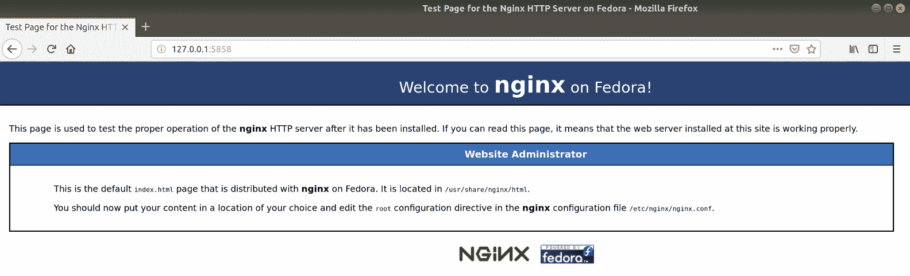

# 吧、权限、SELinux 和 AppArmor

在本章中，我们将涵盖以下主题:

*   Linux 文件权限
*   修改文件权限
*   用户和组
*   外观和修改
*   SELinux 和修改
*   检查 SELinux 是否正在运行，以及保持运行的重要性
*   正在重置 SELinux 权限

# 介绍

在早期，早在 90 年代的迷雾中，Linux 在访问控制方面没有太多东西...然后是权限和属性。权限和属性是文件的元素，它们决定了系统和用户对该文件(或文件夹)的访问权限，以及它在交互方面能对文件做什么。基本上，您可以使用`ls`查看权限信息(稍后将详细介绍)，但现在，请参见以下示例:

```sh
$ ls -l .
total 0
-rw-rw-r--. 1 vagrant vagrant 0 Oct 28 10:42 examplefile
```

在这一章中，我们将学习从基本的 Linux 产品到 SELinux 和 AppArmor 的权限。我们还将查看可能由 SELinux 或 AppArmor 引起的故障排除问题。我们还将了解不禁用扩展权限控制的重要性。

就安全性而言，锁定您的系统显然很重要，在极端情况下，您可以创建一个系统，其中每个程序都不知道其他程序(实际上每个程序都是孤立的)。

虽然安全从来都不是坏事，但平衡至关重要。你不想开始强调 Ubuntu 安装中每个文件的权限，实际上有成千上万个，你会在完成之前发疯...除非这确实是你唯一的工作，或者你想要一个特别无聊的爱好，在这种情况下，你会发疯的！

# 技术要求

在本章中，我们将使用以下`Vagrantfile`；请注意，我们只使用了两台机器:CentOS 来突出 SELinux 的特性和能力，以及一个针对 AppArmor 的 Ubuntu 安装:

```sh
# -*- mode: ruby -*-
# vi: set ft=ruby :

$provisionScript = <<-SCRIPT
sed -i 's/console=tty0 console=ttyS0,115200n8//g' /boot/grub2/grub.cfg
systemctl restart sshd
SCRIPT

Vagrant.configure("2") do |config|

 config.vm.define "centos7" do |centos7|
 centos7.vm.box = "centos/7"
 centos7.vm.box_version = "1804.02"
 centos7.vm.provision "shell",
 inline: $provisionScript
 end

 config.vm.define "ubuntu1804" do |ubuntu1804|
 ubuntu1804.vm.box = "ubuntu/bionic64"
 ubuntu1804.vm.box_version = "20180927.0.0"
 end

end
```

At the time of writing, the `provisionScript` used here is to fix a slight problem with one of the sections in this chapter. If you experience issues surrounding this script, feel free to remove it from your configuration (there is a note later on about this, in the relevant section, where we talk about `.autorelabel`).

# Linux 文件权限

首先，我们将通过查看默认的 Linux 文件权限回到基础。

在本节中，我们将使用 CentOS 盒子上的一个文件和一个目录，来强调一些重要的基础知识，我们可以在以后使用。

File permissions on Unix and Unix-like systems are different from those found on Windows and other OS installations. If you connect a hard drive formatted with a Unix file-system (such as XFS) to a Windows box, it is unlikely it will be able to read the permissions on the files accurately (unless you've got software to do it for you). These lines have been blurred a bit in recent years, thanks to things like the Windows Subsystem for Linux included in Windows 10, but the principle is basically true. 

# 准备好

跳到您的 CentOS 盒子上。出于本节的目的，我们讨论的所有内容在 Linux 发行版中都是通用的:

```sh
$ vagrant ssh centos7
```

按如下方式创建一个文件、一个目录和该目录中的一个文件:

```sh
$ touch examplefile
$ mkdir exampledir
$ touch exampledir/examplefile-in-exampledir
```

# 怎么做...

准备好*中的文件*部分，对我们创建的内容运行`ls -l`:

```sh
$ ls -l
total 0
drwxrwxr-x. 2 vagrant vagrant 39 Oct 28 11:01 exampledir
-rw-rw-r--. 1 vagrant vagrant 0 Oct 28 11:00 examplefile
```

`-l`, used here, means using a long-listing format, and is used not just to print the files and folders found, but to give us a more complete picture.

# 它是如何工作的...

我们需要对此进行分解，因为乍看之下，它可能会显得相当混乱:

# 范例目录

从`exampledir`开始，我们来看看这个目录的权限和所有权。

```sh
drwxrwxr-x. 2 vagrant vagrant
```

我们有一组字母，一个数字`2`，然后是两个名字，`vagrant`和`vagrant`。

```sh
drwxrwxr-x.
```

开头的`d`是一个容易的；它表示列出的项目实际上是一个目录。

```sh
drwxrwxr-x.
```

然后，我们有三个看起来相似的元素，其中第一个是用户权限。这里的权限是读、写和执行。

这意味着用户将能够在目录中`touch`(创建)文件、`mv`(重命名)文件、`ls`(列出)文件、`cat` / `less`(读取)文件，甚至`rm`(删除)文件。

```sh
drwxrwxr-x.
```

接下来，我们拥有组权限，这里同样是读、写和执行。

```sh
drwxrwxr-x.
```

第三，我们拥有每个人的权限，在这种情况下，任何人都可以读取或更改目录。

他们将无法创建、重命名或删除现有文件，因为他们没有 write ( `w`)权限。

This is something that even experienced sysadmins forget. If you're in a group that can access the contents of a file within a directory, but the directory's own permissions don't allow this, you're not going to be able to complete the action. I've heard some quite notable groans of realization related to this little tidbit.

我们还有街区尽头的`.`。现在，我们不必太担心这个问题，但它表明目录应用了安全上下文:

```sh
drwxrwxr-x. 2
```

数字，在本例中为`2`，指的是指向索引节点的位置数(磁盘上实际存储数据的位置)。之所以在这种情况下为`2`，是因为每次创建目录时都会创建两个条目，可通过`ls -la`查看:

```sh
$ ls -la exampledir/
total 0
drwxrwxr-x. 2 vagrant vagrant 39 Oct 28 11:18 .
drwx------. 4 vagrant vagrant 132 Oct 28 11:01 ..
-rw-rw-r--. 1 vagrant vagrant 0 Oct 28 11:18 examplefile-in-exampledir
```

在这里，我们可以看到两个特殊的条目，`.`和`..`，分别指这个目录和父目录。

因此，该目录有两个链接；第一个来自父目录(`/home/vagrant/exampledir`)，第二个来自目录本身(`/home/vagrant/exampledir/.`)。困惑了吗？

现在简单一点的是`vagrant vagrant`条目:

```sh
vagrant vagrant
```

这些只是用户，然后是组，其权限反映在`drwxrwxr-x.`块中。没有适合每个人的参赛作品，因为那毫无意义。

# 示例文件

转到`examplefile`，我们有以下内容:。

```sh
-rw-rw-r--. 1 vagrant vagrant  0 Oct 28 11:00 examplefile
```

在这里，我们可以看到与`exampledir`大致相同，有一些变化。

`d`已经被`a`所取代——字符，这意味着我们正在处理一个实际的文件。

```sh
-rw-rw-r--.
```

用户和组的权限是只读和写的，这意味着文件可以被读取和修改，但还不能被用户和组执行。

```sh
-rw-rw-r--.
```

其他所有人的权限都是只读的，意味着文件可以应用`cat` / `less`，但不能修改或执行。

```sh
-rw-rw-r--. 1
```

最后，我们可以看到链接数量的`1`，这是有意义的，因为底层索引节点不是从其他地方引用的。

# 还有更多...

还有一些值得一提的有用的东西要知道，即使我们在这里不涉及它们。

# 对目录和文件的 Root 访问权限

`god/super/almighty`用户(`root`)几乎可以全权访问系统上的所有内容，这意味着如果人们因无法读取文件而感到沮丧，您可能会看到他们执行以下常见的快捷方式:

```sh
$ sudo cat examplefile
```

这是可行的，因为`root`有那种力量，但是习惯使用`sudo`做任何事情是一个坏习惯。对它有选择性，在你因为沮丧而武断地把`sudo`放在事情前面之前，想想你在做什么。(大部分情况下，这是给自己的一个信息，因为我和任何人一样对此感到内疚。)

# 其他执行字符

除了执行栏中不起眼的`x`之外，还可以看到其他字符，其中最常见的是`s`和`t`。

看看`wall`程序的这些权限:

```sh
$ ls -l /usr/bin/wall
-r-xr-sr-x. 1 root tty 15344 Jun 9 2014 /usr/bin/wall
```

请注意该组如何将`s`设置为代替`x`。

这被称为`setuid`和`setgid`位，取决于它是否在用户或组三元组中，并且它有效地将执行用户的权限更改为所有者或组的权限，同样取决于三元组。在这种情况下，执行`wall`命令的用户获得`tty`组的权限(允许`wall`输出到所有`ttys`)。

这里我用`wall`作为流浪用户:

```sh
$ wall There is no Hitchhikers Movie! 
$ 
Broadcast message from vagrant@localhost.localdomain (pts/0) (Sun Oct 28 11:52:12 2018):

There is no Hitchhikers Movie!
```

`t`条目或粘性位也很少见，但它最常见于`/tmp`目录:

```sh
$ ls -la /tmp
total 0
drwxrwxrwt. 8 root root 172 Oct 28 11:54 .
<SNIP>
```

记住`.`字符是指这个目录。

它设置为只有`/tmp`中文件的所有者可以重命名或删除该文件，这意味着如果我以`vagrant`用户的身份在`/tmp`中创建文件，其他人就不能过来删除我的文件(除了`root`)。从视觉上看，它看起来如下:

```sh
$ rm /tmp/test2 
rm: remove write-protected regular empty file '/tmp/test2'? y
rm: cannot remove '/tmp/test2': Operation not permitted
```

There's more than these two other execute characters, but these are the most common.

# 修改文件权限

创建文件是非常好的，但是最终我们会遇到默认权限不可接受的用例。

SSH 就是一个很好的例子，除非你的公钥和私钥有一些特别严格的文件权限，否则它将完全拒绝运行。

于是，《三个火枪手》以`chown`、`chmod`和`chattr`的形式出现了。

如果你想真的很烦人，很容易失去朋友，坚持用它们的全名来称呼它们:改变所有权，改变模式，改变属性。

# 准备好

在本节中，我们将再次使用我们的`Vagrantfile`中的 CentOS 虚拟机，因为我们所做的一切都是普遍适用的。

到您的中央操作系统虚拟机的 SSH:

```sh
$ vagrant ssh centos7
```

进入`/home`目录(向上一级)，在该目录中创建一个文件、一个目录和一个文件:

```sh
$ cd /home
$ sudo touch permissionfile
$ sudo mkdir permissiondir
$ sudo touch permissiondir/permissionfile-in-permissiondir
```

我们还将创建另一个虚拟用户，我们可以用它来解释我们在这一部分所做的事情:

```sh
$ sudo adduser packt -s /bin/bash -p '$1$2QzaOp2Q$Ke2yWZ1N2h4rk8r8P95Sv/'

```

请注意，我们在这里设置的密码是“correcthorsebatterystaple”。

# 怎么做...

我们将依次运行三个命令(`chown`、`chmod`和`chattr`)。

# 乔恩

从最简单的部分开始，我们将看一下有问题的文件的所有权。

首先列出我们已经拥有的:

```sh
$ ls -lha
total 0
drwxr-xr-x. 4 root root 64 Oct 28 12:37 .
dr-xr-xr-x. 18 root root 239 Oct 28 12:35 ..
drwxr-xr-x. 2 root root 45 Oct 28 12:37 permissiondir
-rw-r--r--. 1 root root 0 Oct 28 12:37 permissionfile
drwx------. 3 vagrant vagrant 74 May 12 18:54 vagrant
```

假设我们想把它做成这样，这样我们的流浪用户就可以写给`permissionfile`，而不是它目前只能读它的能力。请注意以下几点:

```sh
$ echo "RFCs are great if boring." > permissionfile
-bash: permissionfile: Permission denied
```

我们将使用`chown`进行更改，通过传递我们想要更改文件的用户和组:

```sh
$ sudo chown vagrant:root permissionfile
```

现在，检查权限:

```sh
$ ls -l permissionfile
-rw-r--r--. 1 vagrant root 0 Oct 28 12:37 permissionfile
```

这意味着我们作为流浪用户，现在可以写入文件:

```sh
$ echo "RFCs are great if boring." > permissionfile
$ cat permissionfile
RFCs are great if boring.
```

但是，其他用户(不是`root`)不能写入文件:

```sh
$ su - packt -c "echo IMPOSSIBLE > /home/permissionfile"
Password: 
-bash: /home/permissionfile: Permission denied
```

Here, we're using `su` to execute a command as the Packt user, and we're showing that though we tried to `echo IMPOSSIBLE` to the file, it failed. We used the full path for `permissionfile` to make sure we didn't create the file in the Packt user's `home` directory.

# chmod

我们对老 Packt 用户有点不公平，所以让我们给每个人写文件的能力，而不仅仅是`vagrant`:

```sh
$ sudo chmod 646 permissionfile $ ls -l permissionfile
-rw-r--rw-. 1 vagrant root 26 Oct 28 12:48 permissionfile
```

现在，我们应该能够以任何用户的身份写入文件，而不仅仅是流浪:

```sh
$ su - packt -c "echo POSSIBLE > /home/permissionfile"
Password: 
$ cat permissionfile 
POSSIBLE
```

# 聊天

我开始觉得我们在这里太宽大了，所以让我们完全锁定文件，这样任何人(即使是全能的`root`)都不能弄乱它:

```sh
$ sudo chattr +i permissionfile
```

我们已经使文件不可改变！

```sh
$ echo "RFCs are great if boring." > permissionfile
-bash: permissionfile: Permission denied
```

我们可以使用`lsattr`命令看到这一点:

```sh
$ lsattr permissionfile
----i----------- permissionfile
```

而且，甚至`root`也不能修改文件:

```sh
$ sudo echo "RFCs are great if boring." > permissionfile
-bash: permissionfile: Permission denied
```

There are various attributes that can be applied to a file with `chattr`, but I'd put money on the immutable option being the most commonly used.

要删除属性，再次使用`chattr`:

```sh
$ sudo chattr -i permissionfile
```

# 它是如何工作的...

再次运行每个命令，让我们简单看看我们做了什么。

# 乔恩

首先，我们更改了文件的所有权:

```sh
$ sudo chown vagrant:root permissionfile
```

这里，我们以最基本的方式使用`chown`，规定文件应该属于哪个用户和组。这些值是用冒号分隔的，但是如果你像我一样向后，你偶尔会使用不推荐使用和不正确的句号(`.`)来代替。

如果您想单独离开组，您可以只指定一个用户:

```sh
$ sudo chown vagrant permissionfile
```

# chmod

接下来，我们更改了文件，以便任何人都可以向其写入:

```sh
$ sudo chmod 646 permissionfile
```

这里，我们将某些八进制值传递给`permissionfile`，以便依次更改用户、组和其他所有人的权限。

我不会详细讨论这个问题，但实际上，第一个数字表示用户的三元组应该是什么值，然后是组的三元组，然后是其他所有人。

我们的用户获得`6`的值，该值转换为读/写；我们组只能读`4`，其他人都可以读/写`6`。

这是因为每个值都有一个等价的数字，如下所示:

*   `x` = `1`
*   `w` = `2`
*   `r` = `4`

所以`6`值为`4` + `2`，或者`r` / `w`，而`4`值仅为`r`。

You could set `777`, which would mean `r`/`w`/`x` for everything and everyone, and it's frequently done by people who don't understand file permissions properly. It's not a good practice, and should be dissuaded outside of troubleshooting. If I find a box where someone has run `chmod 777` on a file in production, that person is getting their access revoked and a quick primer on permissions plonked into their calendar. 

# 聊天

最后，我们更改了文件的一个属性，特别是使文件不可变到偶数`root`，然后我们再次移除标志。

标志比不可变的多得多；所有这些都列在`chattr`主页面中，其中一些在特殊情况下会很有用:

*   `a`:文件只能追加到(对日志有用)
*   `c`:透明压缩和解压缩
*   `s`:文件删除时，文件块中的结果被清零并写回磁盘

Not all attributes are honored by all file systems; check if your filesystem supports them too (hint: `ext4` doesn't support quite a few).

# 还有更多...

在我们结束这一部分之前，还有一两件事需要注意。

# 避免 chmod 中的八进制符号(如果你不喜欢的话)

在`chmod`世界里，你绝对不需要使用八进制格式；它确实为您提供了其他更容易阅读的选项:

```sh
$ sudo chmod uo=rw,g=r permissionfile
```

前面的命令会给用户和其他人读/写权限，给组读权限。

或者，您可以为权限添加一个值:

```sh
$ sudo chmod g+x permissionfile 
```

这将赋予该组执行文件的额外能力:

```sh
$ ls -l permissionfile
-rw-r-xrw-. 1 vagrant root 26 Oct 28 13:03 permissionfile
```

# 分级权限

我们创建了一个目录，以及该目录中的一个文件，因此让我们快速了解一下目录权限。

首先，我们的`permissiondir`看起来是这样的:

```sh
$ ls -la permissiondir
total 0
drwxr-xr-x. 2 root root 45 Oct 28 12:37 .
drwxr-xr-x. 5 root root 77 Oct 28 12:37 ..
-rw-r--r--. 1 root root 0 Oct 28 12:37 permissionfile-in-permissiondir
```

我们目前无法重命名此文件，尽管我们想这样做，因为它太长了:

```sh
$ mv permissiondir/permissionfile-in-permissiondir permissiondir/permissionfile2
mv: cannot move 'permissiondir/permissionfile-in-permissiondir' to 'permissiondir/permissionfile2': Permission denied
```

因此，让我们为每个人设置此文件的写权限:

```sh
$ sudo chmod 646 permissiondir/permissionfile-in-permissiondir
```

现在，让我们再试一次:

```sh
$ mv permissiondir/permissionfile-in-permissiondir permissiondir/permissionfile2
mv: cannot move 'permissiondir/permissionfile-in-permissiondir' to 'permissiondir/permissionfile2': Permission denied
```

啊。

好的，这样做的原因是因为实际上是目录权限阻止了我们移动文件，而不是文件权限。我们必须修改文件所在的目录，因为权限不允许我们重命名(`mv`)文件:

```sh
$ sudo chmod 667 permissiondir/
```

我们应该能够移动文件，因为我们的权限现在非常自由:

```sh
$ mv permissiondir/permissionfile-in-permissiondir permissiondir/permissionfile2
```

成功！

# 请参见

本节中我们没有涉及的一件事是**访问控制列表**(**ACL**)可用于进一步扩展文件的权限。

首先在我们的`permissionfile`中放一个小命令，让它执行一些事情:

```sh
$ echo "printf 'Fire indeed hot'" > permissionfile
```

假设我们想查看一个文件的整个访问控制列表；我们会用`getfacl`:

```sh
$ getfacl permissionfile 
# file: permissionfile
# owner: vagrant
# group: root
user::rw-
group::r-x
other::rw-
```

在这里，我们可以看到所有者是`vagrant`，用户有`rw`。

但是，如果我们希望 Packt 能够在不影响其他权限的情况下执行文件呢？目前 Packt 不行，因为不在`root`组。

一个可能的解决方案是`setfacl`:

```sh
$ setfacl -m u:packt:rwx permissionfile
```

我们现在可以看到一个带有`ls`的小`+`符号，向我们显示该文件具有扩展的访问控制:

```sh
$ ls -l permissionfile
-rw-r-xrw-+ 1 vagrant root 26 Oct 28 13:03 permissionfile
```

并且，我们可以再次看到那些使用`getfacl`的人:

```sh
$ getfacl permissionfile 
# file: permissionfile
# owner: vagrant
# group: root
user::rw-
user:packt:rwx
group::r-x
mask::rwx
other::rw-
```

这意味着我们的`vagrant`用户无法执行文件:

```sh
$ ./permissionfile
-bash: ./permissionfile: Permission denied
```

但是，我们的 Packt 用户可以:

```sh
$ su - packt -c "/home/permissionfile" 
Password: 
Fire indeed hot
```

# 技术要求

在这一节中，我们将跳转到我们的 CentOS 和 Ubuntu 虚拟机，以强调用户和组方法的一些重要差异。

# 用户和组

我们已经从文件权限的角度介绍了用户和组，但是简单回顾一下我们对用户和组的了解是个好主意。

在本节中，我们将深入研究关于用户和组的简短入门知识，确定进程以哪个用户的身份运行，进程如何改变为该用户，并通过使用`/etc/passwd`和类似命令找到系统中存在的用户。

# 准备好了

在不同的窗口或一个接一个的窗口中，使用游民连接到你的 Ubuntu 和 CentOS 虚拟机:

```sh
$ vagrant ssh centos7 $ vagrant ssh ubuntu1804
```

# 怎么做...

在几个简短的部分中，我们将看看用户和组的不同元素。

# 谁啊

如果你需要知道你是谁，通过深刻的反思和内心的沉思来问自己。

如果您需要知道什么用户以什么身份登录到服务器(或以什么身份运行命令)，那就简单多了:

```sh
$ whoami
vagrant $ sudo whoami
root
```

# 系统上的用户

要显示系统上有哪些用户，请查看`/etc/passwd`。

在 CentOS 上，它看起来像这样:

```sh
$ cat /etc/passwd
root:x:0:0:root:/root:/bin/bash
bin:x:1:1:bin:/bin:/sbin/nologin
daemon:x:2:2:daemon:/sbin:/sbin/nologin
adm:x:3:4:adm:/var/adm:/sbin/nologin
lp:x:4:7:lp:/var/spool/lpd:/sbin/nologin
sync:x:5:0:sync:/sbin:/bin/sync
shutdown:x:6:0:shutdown:/sbin:/sbin/shutdown
halt:x:7:0:halt:/sbin:/sbin/halt
mail:x:8:12:mail:/var/spool/mail:/sbin/nologin
operator:x:11:0:operator:/root:/sbin/nologin
games:x:12:100:games:/usr/games:/sbin/nologin
ftp:x:14:50:FTP User:/var/ftp:/sbin/nologin
nobody:x:99:99:Nobody:/:/sbin/nologin
systemd-network:x:192:192:systemd Network Management:/:/sbin/nologin
dbus:x:81:81:System message bus:/:/sbin/nologin
polkitd:x:999:998:User for polkitd:/:/sbin/nologin
rpc:x:32:32:Rpcbind Daemon:/var/lib/rpcbind:/sbin/nologin
rpcuser:x:29:29:RPC Service User:/var/lib/nfs:/sbin/nologin
nfsnobody:x:65534:65534:Anonymous NFS User:/var/lib/nfs:/sbin/nologin
sshd:x:74:74:Privilege-separated SSH:/var/empty/sshd:/sbin/nologin
postfix:x:89:89::/var/spool/postfix:/sbin/nologin
chrony:x:998:996::/var/lib/chrony:/sbin/nologin
vagrant:x:1000:1000:vagrant:/home/vagrant:/bin/bash
packt:x:1001:1001::/home/packt:/bin/bash
```

在 Ubuntu 上，它看起来像这样:

```sh
$ cat /etc/passwd
root:x:0:0:root:/root:/bin/bash
daemon:x:1:1:daemon:/usr/sbin:/usr/sbin/nologin
bin:x:2:2:bin:/bin:/usr/sbin/nologin
sys:x:3:3:sys:/dev:/usr/sbin/nologin
sync:x:4:65534:sync:/bin:/bin/sync
games:x:5:60:games:/usr/games:/usr/sbin/nologin
man:x:6:12:man:/var/cache/man:/usr/sbin/nologin
lp:x:7:7:lp:/var/spool/lpd:/usr/sbin/nologin
mail:x:8:8:mail:/var/mail:/usr/sbin/nologin
news:x:9:9:news:/var/spool/news:/usr/sbin/nologin
uucp:x:10:10:uucp:/var/spool/uucp:/usr/sbin/nologin
proxy:x:13:13:proxy:/bin:/usr/sbin/nologin
www-data:x:33:33:www-data:/var/www:/usr/sbin/nologin
backup:x:34:34:backup:/var/backups:/usr/sbin/nologin
list:x:38:38:Mailing List Manager:/var/list:/usr/sbin/nologin
irc:x:39:39:ircd:/var/run/ircd:/usr/sbin/nologin
gnats:x:41:41:Gnats Bug-Reporting System (admin):/var/lib/gnats:/usr/sbin/nologin
nobody:x:65534:65534:nobody:/nonexistent:/usr/sbin/nologin
systemd-network:x:100:102:systemd Network Management,,,:/run/systemd/netif:/usr/sbin/nologin
systemd-resolve:x:101:103:systemd Resolver,,,:/run/systemd/resolve:/usr/sbin/nologin
syslog:x:102:106::/home/syslog:/usr/sbin/nologin
messagebus:x:103:107::/nonexistent:/usr/sbin/nologin
_apt:x:104:65534::/nonexistent:/usr/sbin/nologin
lxd:x:105:65534::/var/lib/lxd/:/bin/false
uuidd:x:106:110::/run/uuidd:/usr/sbin/nologin
dnsmasq:x:107:65534:dnsmasq,,,:/var/lib/misc:/usr/sbin/nologin
landscape:x:108:112::/var/lib/landscape:/usr/sbin/nologin
sshd:x:109:65534::/run/sshd:/usr/sbin/nologin
pollinate:x:110:1::/var/cache/pollinate:/bin/false
vagrant:x:1000:1000:,,,:/home/vagrant:/bin/bash
ubuntu:x:1001:1001:Ubuntu:/home/ubuntu:/bin/bash
```

这些用户中的大多数你自己都不会创建；他们大部分是系统用户，或者和你安装的软件捆绑在一起。

# 系统上的组

群组的发现方式与用户相似，同样，您也不会创建大多数群组。

对于 CentOS，请注意以下事项:

```sh
$ cat /etc/group
root:x:0:
bin:x:1:
daemon:x:2:
sys:x:3:
adm:x:4:
tty:x:5:
disk:x:6:
lp:x:7:
mem:x:8:
kmem:x:9:
wheel:x:10:
<SNIP>
postfix:x:89:
chrony:x:996:
screen:x:84:
vagrant:x:1000:vagrant
packt:x:1001:
```

对于 Ubuntu，请注意以下几点:

```sh
$ cat /etc/group
root:x:0:
daemon:x:1:
bin:x:2:
sys:x:3:
adm:x:4:syslog,ubuntu
tty:x:5:
<SNIP>
landscape:x:112:
admin:x:113:
netdev:x:114:ubuntu
vboxsf:x:115:
vagrant:x:1000:
ubuntu:x:1001:
```

I've emboldened the first big difference between this Ubuntu and CentOS system, namely the `wheel` and `admin` groups. `wheel` doesn't exist on our Ubuntu system, because it's been replaced by the `admin` group; this means that the `visudo` file on Ubuntu references the members of the `admin` group instead of `wheel`. Something to remember.

# 使用用户的守护程序

在我们的 Ubuntu 系统上，`syslogd`守护进程是使用`syslog`用户运行的。

我们可以通过定位我们的`rsyslogd`流程并在最左边的列中检查用户来确认这一点:

```sh
$ pidof rsyslogd
917
$ ps -up 917
USER PID %CPU %MEM VSZ RSS TTY STAT START TIME COMMAND
syslog 917 0.0 0.4 263036 4416 ? Ssl 10:41 0:00 /usr/sbin/rsyslogd -n
```

并且我们可以通过查看`/etc/rsyslog.conf`配置文件来了解为什么会找到这个用户:

```sh
$ grep PrivDrop /etc/rsyslog.conf
$PrivDropToUser syslog
$PrivDropToGroup syslog
```

如果您想快速排除作为`root`运行的进程，您可以使用如下快速的一行代码(尽管无论如何它都不是完美的)。

这是在我们的 CentOS 虚拟机上:

```sh
$ ps aux | grep -v root
USER PID %CPU %MEM VSZ RSS TTY STAT START TIME COMMAND
dbus 558 0.0 0.5 66428 2568 ? Ssl 12:34 0:00 /usr/bin/dbus-daemon --system --address=systemd: --nofork --nopidfile --systemd-activation
rpc 559 0.0 0.2 69220 1060 ? Ss 12:34 0:00 /sbin/rpcbind -w
polkitd 568 0.0 1.6 538436 8020 ? Ssl 12:34 0:00 /usr/lib/polkit-1/polkitd --no-debug
chrony 581 0.0 0.3 117752 1828 ? S 12:34 0:00 /usr/sbin/chronyd
postfix 1088 0.0 0.8 89792 4080 ? S 12:35 0:00 qmgr -l -t unix -u
vagrant 3369 0.0 0.5 154904 2688 ? S 14:11 0:00 sshd: vagrant@pts/0
vagrant 3370 0.0 0.5 15776 2660 pts/0 Ss 14:11 0:00 -bash
postfix 3399 0.0 0.8 89724 4052 ? S 14:15 0:00 pickup -l -t unix -u
vagrant 3404 0.0 0.3 55140 1872 pts/0 R+ 14:32 0:00 ps aux
```

# 它是如何工作的...

一般来说，不同的用户和群体会有特定的用途，故意隔离，这样他们自己就不会太强大。如果你有一个多租户系统(这种情况现在很少见)，有一个以上的人登录来做他们的日常工作，你想确保这个人不能通过做一些愚蠢的事情，比如覆盖盒子上的日志，让其他人的生活变得更加困难。

您可以通过将所有人类用户放在一个组中来解决这个问题，同时允许他们自己的用户具有有限的访问权限，然后您可以让该组访问他们可能需要使用的共享目录和应用程序。

进程可以选择放弃它们的特权，尽管并不是所有的进程都会开箱即用，如果你想做更多的工作，通常需要做大量的工作。在这里，我们看到`syslog`启动(作为`root`)，然后立即将其自身的权限级别降低到`syslog`用户和组的权限级别。

之所以`rsyslogd`必须以`root`开始，是因为它绑定了一个比`1024`更低的端口，这是只有`root`程序才能访问的受限端口。

一些发行版和操作系统比其他发行版和操作系统更严格地采用这种方法，但是就像所有与安全相关的东西一样，它就像是安全洋葱的另一层。

# 还有更多...

看看这个用户，在你的 Ubuntu 虚拟机上:

```sh
$ grep apt /etc/passwd
_apt:x:104:65534::/nonexistent:/usr/sbin/nologin
```

它有一个下划线，是整个`/etc/passwd`文件中唯一有一个下划线的下划线；为什么会这样？

一个潜在的原因是，这是一个系统帐户，应用程序维护者或开发人员决定用下划线字符来表示，就像其他操作系统一样。

# 外观和修改

在这一节中，我们将在 Ubuntu 上使用 AppArmor，并确定它对我们的系统有什么影响。

默认情况下，AppArmor 安装在 Ubuntu 上。它最初是由 SUSE 开发的，但是 Canonical 似乎已经在 AppArmor 星球上牢牢地插上了他们的旗帜，在 Ubuntu 7.04 中引入了它，并在 7.10 (2007)中默认打开了它。

像 SELinux 一样，AppArmor 是将强制访问控制(MAC)引入 Linux 的一种方式；自 2.6.36 以来，它一直包含在内核中。

# 准备好

在本节中，我们将使用我们的 Ubuntu 虚拟机。

SSH 到您的 Ubuntu 虚拟机:

```sh
$ vagrant ssh ubuntu1804
```

# 怎么做...

首先，让我们确保`apparmor`正在运行，使用我们的老朋友`systemctl`:

```sh
$ systemctl status apparmor
● apparmor.service - AppArmor initialization
 Loaded: loaded (/lib/systemd/system/apparmor.service; enabled; vendor preset: enabled)
 Active: active (exited) since Sun 2018-10-28 10:41:23 UTC; 4h 21min ago
 Docs: man:apparmor(7)
 http://wiki.apparmor.net/
 Process: 426 ExecStart=/etc/init.d/apparmor start (code=exited, status=0/SUCCESS)
 Main PID: 426 (code=exited, status=0/SUCCESS)

Warning: Journal has been rotated since unit was started. Log output is incomplete or unavailable.
```

要查看加载了哪些配置文件，以及它们以什么模式运行，请使用`apparmor_status`:

```sh
$ sudo apparmor_status 
apparmor module is loaded.
15 profiles are loaded.
15 profiles are in enforce mode.
 /sbin/dhclient
 /usr/bin/lxc-start
 /usr/bin/man
 /usr/lib/NetworkManager/nm-dhcp-client.action
 /usr/lib/NetworkManager/nm-dhcp-helper
 /usr/lib/connman/scripts/dhclient-script
 /usr/lib/snapd/snap-confine
 /usr/lib/snapd/snap-confine//mount-namespace-capture-helper
 /usr/sbin/tcpdump
 lxc-container-default
 lxc-container-default-cgns
 lxc-container-default-with-mounting
 lxc-container-default-with-nesting
 man_filter
 man_groff
0 profiles are in complain mode.
0 processes have profiles defined.
0 processes are in enforce mode.
0 processes are in complain mode.
0 processes are unconfined but have a profile defined.
```

为了理解 appamor 如何限制应用程序，让我们修改一下`tcpdump`配置文件，然后重新启动 appamor:

```sh
$ sudo sed -i 's/capability net_raw,/#capability net_raw,/g' /etc/apparmor.d/usr.sbin.tcpdump
$ sudo systemctl restart apparmor
```

我们在这里做的是移除`tcpdump`捕捉的能力，使其变得相当无用:

```sh
$ sudo tcpdump -i enp0s3
tcpdump: enp0s3: You don't have permission to capture on that device
(socket: Operation not permitted)
```

如果我们查看内核日志，我们可以看到来自我们试图运行`tcpdump`的拒绝:

```sh
$ sudo journalctl -k --since 15:34 --no-pager
-- Logs begin at Sun 2018-10-28 10:41:21 UTC, end at Sun 2018-10-28 15:39:29 UTC. --
Oct 28 15:34:34 ubuntu-bionic kernel: kauditd_printk_skb: 6 callbacks suppressed
Oct 28 15:34:34 ubuntu-bionic kernel: audit: type=1400 audit(1540740874.554:97): apparmor="DENIED" operation="capable" profile="/usr/sbin/tcpdump" pid=3365 comm="tcpdump" capability=13 capname="net_raw"
```

请注意我们之前用`sed`移除的资本名称`net_raw`。

# 它是如何工作的...

使用`apparmor_parser`程序将 AppArmor 的概要文件写入并加载到内核中。大多数情况下，这些将是位于`/etc/apparmor.d/`的配置文件；尽管如果一个程序没有配置文件，AppArmor 不会阻止它运行。

当实际的系统单元启动时，运行一个`init.d`脚本(位于`/etc/init.d/apparmor`)，它执行`apparmor_parser`的实际调用。

当配置文件在强制模式下运行时，就像前面的 15 个配置文件一样，它们必须遵守策略定义，否则它们将无法在策略要求之外采取行动，并且会记录违规。如果配置文件处于投诉模式，则不会强制执行该策略，但会记录违规情况，供以后阅读。

配置文件通常通过用点替换可执行文件的斜杠位置来命名:

```sh
/sbin/dhclient -> sbin.dhclient
/usr/sbin/tcpdump -> usr.sbin.tcpdump
```

如果我们看一下`tcpdump`轮廓的前几行，我们可以开始看到轮廓是如何建立的:

```sh
$ cat /etc/apparmor.d/usr.sbin.tcpdump 
# vim:syntax=apparmor
#include <tunables/global>

/usr/sbin/tcpdump {
 #include <abstractions/base>
 #include <abstractions/nameservice>
 #include <abstractions/user-tmp>

 #capability net_raw,
 capability setuid,
 capability setgid,
 capability dac_override,
 network raw,
 network packet,

 # for -D
 @{PROC}/bus/usb/ r,
 @{PROC}/bus/usb/** r,
<SNIP>
```

我们可以看到，首先指定了二进制文件的名称，然后指定了一定数量的包含(这些规则也可以在其他程序中使用)。

接下来我们有`capability`，包括我们评论出来的那个。有一个功能列表，可以在`man (7) capabilities`页面中查看，其中列出了像`CAP_NET_RAW`和`CAP_SETGID`这样的名称，但这里它们是小写的。

当我们移除这个`capability`，`tcpdump`失去了使用 RAW 和 PACKET 套接字的能力，以及绑定到任何地址进行透明代理的能力。

再往下，我们可以看到文件的作者是如何使用注释和`tcpdump`的标志来描述他们在什么许可下允许什么。在下面的例子中，他们允许使用`gzip`和`bzip2`，这样`-z`选项就可以工作了:

```sh
 # for -z
 /{usr/,}bin/gzip ixr,
 /{usr/,}bin/bzip2 ixr,
```

语法可以使用令人惊讶的详细`apparmor.d`手册页进行比较和理解。

# 还有更多...

虽然 AppArmor 很好，而且它确实做到了它所宣传的，但是有一些警告:

*   它依赖开发人员来编写和提供概要文件(或者贡献时间的其他人)
*   配置文件必须是防弹的，才能包含在默认安装中，这可能是十年后配置文件如此之少的原因
*   这是相当未知的，大多数人甚至不会在违约之外为此烦恼

它也偏离了路径，而不是 inode，这意味着您可以做一些事情，例如创建一个硬链接来绕过限制:

```sh
$ sudo ln /usr/sbin/tcpdump /usr/sbin/tcpdump-clone
```

不可否认的是，如果你在一个盒子上，并且有`sudo`，无论如何，在那个点上游戏已经结束了:

```sh
$ sudo tcpdump -i enp0s3
tcpdump: enp0s3: You don't have permission to capture on that device
(socket: Operation not permitted)
$ sudo tcpdump-clone -i enp0s3
tcpdump-clone: verbose output suppressed, use -v or -vv for full protocol decode
listening on enp0s3, link-type EN10MB (Ethernet), capture size 262144 bytes
15:52:52.803301 IP ubuntu-bionic.ssh > _gateway.37936: Flags [P.], seq 410213354:410213518, ack 1991801602, win 36720, length 164
<SNIP>
```

你可能会问为什么你的系统需要这样的东西，如果它很容易调整和绕过，但答案相对简单。

如果您在公共互联网上有一个 web 服务器，它很有可能在某个时候受到攻击，当这种情况发生时，您可能完全处于最新状态，并被零日攻击(尽管可能性不大)。你的网络服务器可能会受到威胁，然后攻击你的人可能会用它来尝试和设置一个不同的进程，在不同的端口上运行，甚至用它来读取不应该读取的文件。

强制访问控制在很大程度上确保了这种情况不会发生，而对于攻击另一端的人来说，生活变得更加令人沮丧。他们可能有你的网络服务器，但那是他们所有的。

# SELinux 和修改

像 AppArmor 一样，**安全增强 Linux** ( **SELinux** )是将强制访问控制引入 Linux 的一种方式，只是它有几个关键的区别:

*   它比 AppArmor 被更广泛地使用和厌恶
*   它主要用于基于红帽的发行版

如果你在企业世界，或者想去那里，SELinux 是一个很好的工具，可以添加到你的工具带上。

您可能还记得，我们之前已经讨论过 SELinux，做了一些小的改变，允许像 SSH 这样的东西在不同的端口上运行；在这里，我们正在进一步探索。

# 准备好

在本节中，我们将使用我们的 CentOS 虚拟机。

SSH 到您的 CentOS 虚拟机，像您一样转发`8080`:

```sh
$ vagrant ssh centos7 -- -L 127.0.0.1:5858:127.0.0.1:5858
```

确保安装了 NGINX 和一些实用程序，并且为本例启动了 NGINX:

```sh
$ sudo yum install epel-release -y
$ sudo yum install policycoreutils-python setroubleshoot -y
$ sudo yum install nginx -y
$ sudo systemctl enable --now nginx
```

# 怎么做...

我们将更改 NGINX 默认监听的端口，以显示 SELinux 有多痛苦。

首先，通过使用`curl`并打印返回代码，检查 NGINX 是否在端口`80`(默认)上运行:

```sh
$ curl -I localhost:80 
HTTP/1.1 200 OK
Server: nginx/1.12.2
Date: Mon, 29 Oct 2018 17:36:35 GMT
Content-Type: text/html
Content-Length: 3700
Last-Modified: Tue, 06 Mar 2018 09:26:21 GMT
Connection: keep-alive
ETag: "5a9e5ebd-e74"
Accept-Ranges: bytes
```

Using `-I` here means that we don't pull in a screen full of code, and instead we just get the pertinent information, like the return code (`200` being OK).

酷，所以这一切都正常工作，SELinux 不会碍事。

如果我们想让 NGINX 在不同的端口监听呢？比如我们转发的那个？让我们试试看:

```sh
$ sudo sed -i 's/80 default_server;/5858 default_server;/g' /etc/nginx/nginx.conf
$ sudo systemctl restart nginx
Job for nginx.service failed because the control process exited with error code. See "systemctl status nginx.service" and "journalctl -xe" for details.
```

用新端口再次运行我们的`curl`命令应该会报告一个错误(很明显，因为服务无法启动):

```sh
$ curl -I localhost:5858
curl: (7) Failed connect to localhost:5858; Connection refused
```

奇数的...但不是真的。

这是因为 NGINX 只允许在某些端口上运行，`80`是一个，`8080`是另一个，以此类推。`5858`晦涩而怪异；为什么 web 服务器要在上面运行？

因此，我们必须更新 SELinux，以允许 NGINX 在新端口上运行:

```sh
$ sudo semanage port --add --type http_port_t --proto tcp 5858
ValueError: Port tcp/5858 already defined
```

哦，该死的，看起来`5858`已经被定义为其他东西了(在这个例子中是 Node.js–诅咒你 node . js！).

谢天谢地，这不是世界末日，我们只需要修改端口，而不是增加一个:

```sh
$ sudo semanage port --modify --type http_port_t --proto tcp 5858
```

现在，我们可以重启 NGINX，它应该可以正常工作:

```sh
$ sudo systemctl restart nginx
$ curl -I localhost:5858
HTTP/1.1 200 OK
Server: nginx/1.12.2
Date: Mon, 29 Oct 2018 18:17:37 GMT
Content-Type: text/html
Content-Length: 3700
Last-Modified: Tue, 06 Mar 2018 09:26:21 GMT
Connection: keep-alive
ETag: "5a9e5ebd-e74"
Accept-Ranges: bytes
```

您也可以在浏览器中访问它:



Yep, it says Fedora, and yes, it's wrong.

所以，这是第一步，但是现在我们决定不使用默认的 NGINX 欢迎页面，我们希望它在`/srv/webserver/arbitrary-location/`中显示我们的文件。

首先，让我们创建这个目录结构，并在其中放入一个简单的文件:

```sh
$ sudo mkdir -p /srv/webserver/arbitrary-location/
$ echo "HELLO WORLD" | sudo tee /srv/webserver/arbitrary-location/index.html
HELLO WORLD
```

接下来，让我们检查现有页面位置的权限，并确保它们是相同的:

```sh
$ ls -lha /usr/share/nginx/html/
total 20K
drwxr-xr-x. 2 root root 99 Oct 29 17:36 .
drwxr-xr-x. 4 root root 33 Oct 29 17:36 ..
-rw-r--r--. 1 root root 3.6K Mar 6 2018 404.html
-rw-r--r--. 1 root root 3.7K Mar 6 2018 50x.html
-rw-r--r--. 1 root root 3.7K Mar 6 2018 index.html
-rw-r--r--. 1 root root 368 Mar 6 2018 nginx-logo.png
-rw-r--r--. 1 root root 2.8K Mar 6 2018 poweredby.png
```

我们会确保我们的是一样的:

```sh
$ ls -lha /srv/webserver/arbitrary-location/
total 4.0K
drwxr-xr-x. 2 root root 24 Oct 29 18:43 .
drwxr-xr-x. 4 root root 62 Oct 29 18:40 ..
-rw-r--r--. 1 root root 12 Oct 29 18:43 index.html
```

接下来，我们将更新 NGINX 配置以登录到这个新位置:

```sh
$ sudo sed -i 's/\/usr\/share\/nginx\/html/\/srv\/webserver\/arbitrary-location/g' /etc/nginx/nginx.conf
```

现在，我们重新启动服务:

```sh
$ sudo systemctl restart nginx
```

让我们尝试一下`curl`，这次省略了`-I`，这样我们就可以返回页面:

```sh
$ curl localhost:5858
<html>
<head><title>403 Forbidden</title></head>
<body bgcolor="white">
<center><h1>403 Forbidden</h1></center>
<hr><center>nginx/1.12.2</center>
</body>
</html>
```

哎哟...这看起来不对劲。

不出所料，SELinux 是罪魁祸首，但修复是一组相当简单的命令，我们可以使用它们来纠正问题文件的`fcontext`:

```sh
$ sudo semanage fcontext --add --type httpd_sys_content_t /srv/webserver/arbitrary-location/index.html
$ sudo restorecon /srv/webserver/arbitrary-location/index.html
```

尝试我们的`curl`现在应该给我们信息:

```sh
$ curl localhost:5858
HELLO WORLD
```

我们可以在浏览器中这样查看:


If this isn't worthy of Tate Modern, I don't know what is.

# 它是如何工作的...

当我们更改端口并重新启动服务时，出现了一些错误:

```sh
$ sudo journalctl -e -u nginx --no-pager | tail -n 8
Oct 29 17:43:17 localhost.localdomain systemd[1]: Starting The nginx HTTP and reverse proxy server...
Oct 29 17:43:17 localhost.localdomain nginx[4334]: nginx: the configuration file /etc/nginx/nginx.conf syntax is ok
Oct 29 17:43:17 localhost.localdomain nginx[4334]: nginx: [emerg] bind() to 0.0.0.0:5858 failed (13: Permission denied)
Oct 29 17:43:17 localhost.localdomain nginx[4334]: nginx: configuration file /etc/nginx/nginx.conf test failed
Oct 29 17:43:17 localhost.localdomain systemd[1]: nginx.service: control process exited, code=exited status=1
Oct 29 17:43:17 localhost.localdomain systemd[1]: Failed to start The nginx HTTP and reverse proxy server.
Oct 29 17:43:17 localhost.localdomain systemd[1]: Unit nginx.service entered failed state.
Oct 29 17:43:17 localhost.localdomain systemd[1]: nginx.service failed.
```

注意`5858`端口上的具体`Permission denied`条目。

您可以使用我们之前作为实用程序安装的一部分安装的`semanage`命令来查询 SELinux 端口类型及其数量:

```sh
$ sudo semanage port -l | grep http
http_cache_port_t tcp 8080, 8118, 8123, 10001-10010
http_cache_port_t udp 3130
http_port_t tcp 80, 81, 443, 488, 8008, 8009, 8443, 9000
pegasus_http_port_t tcp 5988
pegasus_https_port_t tcp 5989
```

在这里，我们可以看到虽然`80`和其他端口被允许作为 HTTP 端口，但是`5858`最初并不存在。

在我们添加了刚才显示的附加端口后，该命令看起来有所不同:

```sh
$ sudo semanage port -l | grep http
http_cache_port_t tcp 8080, 8118, 8123, 10001-10010
http_cache_port_t udp 3130
http_port_t tcp 5858, 80, 81, 443, 488, 8008, 8009, 8443, 9000
pegasus_http_port_t tcp 5988
pegasus_https_port_t tcp 5989
```

所以，SELinux 现在允许使用这个端口。

在文件方面，我们可以使用`ls -Z`选项来检查`fcontext` NGINX 需要文件拥有什么。

在这里，我们针对默认文件运行它:

```sh
$ ls -lhaZ /usr/share/nginx/html/
drwxr-xr-x. root root system_u:object_r:httpd_sys_content_t:s0 .
drwxr-xr-x. root root system_u:object_r:usr_t:s0 ..
-rw-r--r--. root root system_u:object_r:httpd_sys_content_t:s0 404.html
-rw-r--r--. root root system_u:object_r:httpd_sys_content_t:s0 50x.html
-rw-r--r--. root root system_u:object_r:httpd_sys_content_t:s0 index.html
-rw-r--r--. root root system_u:object_r:httpd_sys_content_t:s0 nginx-logo.png
-rw-r--r--. root root system_u:object_r:httpd_sys_content_t:s0 poweredby.png
```

这是确定您需要给创建的新文件提供什么上下文的好方法。

当我们应用新的策略规则并将策略值恢复到系统中时，我们的文件突然能够被 NGINX 使用。

# 还有更多...

SELinux 其实并不像大家想象的那么糟糕，而且它已经走过了很长的一段路，因为过去的事情总是无缘无故地默默失败。一般来说，当你需要为你的系统和程序找到正确的配置时，有太多的工具和调试程序可供你使用，尽管它们可以(并且确实)自己填充书籍。

如果您从这一部分中删除了任何内容，请理解禁用 SELinux 不是解决办法(也就是说，将其设置为许可模式)，并且在开发环境之外，您所做的只是让自己未来的生活变得不那么安全。

`semanage`也不是管理 SELinux 策略的唯一方法，但它非常容易使用，也是向自己介绍策略文件精彩世界的一种非常简洁的方法。

# 请参见

一般桌面系统不使用 SELinux，除了 Fedora，所以如果你真的想开始乱搞，那就启动一个安装了 Fedora 的 VM，看看`audit2allow`、`chcon`等工具。

# 检查 SELinux 是否正在运行，以及保持运行的重要性

在本节中，我们将了解如何检查 SELinux 是否已启用并在我们的系统上运行，我们将使用 SELinux 在其操作期间写入的日志。同时，我们将使用`setroubleshoot`来帮助我们确定我们正在努力做的事情可能有什么问题。

再次强调，有一段时间，SELinux 开始成为一种东西，人们立即将其摒弃。大多数在线指南都会以不朽的词语“确保检查 SELinux 是否被禁用”开始。谢天谢地，这种心态现在已经基本消失了，人们开始接受 SELinux 是他们唯一的真神。

当您遇到由 SELinux 引起的问题时，简单地禁用它是非常诱人的。如果问题出现在生产服务器上，并且您面临着解决问题的压力，那么这种情况就更是如此。放弃禁用 SELinux 的简单解决方案，因为这样做只会在未来出现并咬你。

也就是说，我现在将讨论如何禁用 SELinux(以帮助故障排除！).

# 准备好

在本节中，我们将使用我们的 CentOS 虚拟机。

到您的中央操作系统虚拟机的 SSH:

```sh
$ vagrant ssh centos7
```

如果上一节没有安装，请确保安装了 NGINX 和我们的各种工具:

```sh
$ sudo yum install epel-release -y
$ sudo yum install policycoreutils-python setroubleshoot -y
$ sudo yum install nginx -y
$ sudo systemctl enable --now nginx
```

# 怎么做...

首先，很容易，你可以通过`sestatus`查看 SELinux 的当前状态:

```sh
$ sestatus
SELinux status: enabled
SELinuxfs mount: /sys/fs/selinux
SELinux root directory: /etc/selinux
Loaded policy name: targeted
Current mode: enforcing
Mode from config file: enforcing
Policy MLS status: enabled
Policy deny_unknown status: allowed
Max kernel policy version: 31
```

在这里，我们看到它是`enabled`，它运行的模式是`enforcing`，意味着违反政策的行为被否认。

要动态(暂时)禁用 SElinux，有一个相对简单的命令:

```sh
$ sudo setenforce Permissive
```

但是这将在启动时再次改变。

现在，让我们保持启用状态:

```sh
$ sudo setenforce Enforcing
```

接下来，我们将更改我们希望 NGINX 使用的端口(再次)，重新启动 NGINX，观察它是否失败，并看看我们将如何确定问题。

更改端口可以这样进行:

```sh
$ sudo sed -i 's/5858 default_server;/5757 default_server;/g' /etc/nginx/nginx.conf 
```

If you didn't change the port in the previous section (you're starting fresh), then you'll want to substitute the `5858` shown here for `80`.

`systemctl`重启 NGINX 最简单:

```sh
$ sudo systemctl restart nginx
Job for nginx.service failed because the control process exited with error code. See "systemctl status nginx.service" and "journalctl -xe" for details.
```

我们现在能做的就是确定它失败的原因:

```sh
$ sudo sealert -a /var/log/audit/audit.log
```

这可能会给你很多结果，尤其是如果你已经运行了一段时间的盒子，但在接近结束时应该是一个类似于下面的报告:

```sh
--------------------------------------------------------------------------------

SELinux is preventing /usr/sbin/nginx from name_bind access on the tcp_socket port 5757.

***** Plugin bind_ports (92.2 confidence) suggests ************************

If you want to allow /usr/sbin/nginx to bind to network port 5757
Then you need to modify the port type.
Do
# semanage port -a -t PORT_TYPE -p tcp 5757
 where PORT_TYPE is one of the following: http_cache_port_t, http_port_t, jboss_management_port_t, jboss_messaging_port_t, ntop_port_t, puppet_port_t.

***** Plugin catchall_boolean (7.83 confidence) suggests ******************

If you want to allow nis to enabled
Then you must tell SELinux about this by enabling the 'nis_enabled' boolean.

Do
setsebool -P nis_enabled 1

***** Plugin catchall (1.41 confidence) suggests **************************

If you believe that nginx should be allowed name_bind access on the port 5757 tcp_socket by default.
Then you should report this as a bug.
You can generate a local policy module to allow this access.
Do
allow this access for now by executing:
# ausearch -c 'nginx' --raw | audit2allow -M my-nginx
# semodule -i my-nginx.pp

Additional Information:
Source Context system_u:system_r:httpd_t:s0
Target Context system_u:object_r:unreserved_port_t:s0
Target Objects port 5757 [ tcp_socket ]
Source nginx
Source Path /usr/sbin/nginx
Port 5757
Host <Unknown>
Source RPM Packages nginx-1.12.2-2.el7.x86_64
Target RPM Packages 
Policy RPM selinux-policy-3.13.1-192.el7_5.3.noarch
Selinux Enabled True
Policy Type targeted
Enforcing Mode Enforcing
Host Name localhost.localdomain
Platform Linux localhost.localdomain
                              3.10.0-862.2.3.el7.x86_64 #1 SMP Wed May 9
                              18:05:47 UTC 2018 x86_64 x86_64
Alert Count 1
First Seen 2018-10-30 17:27:06 UTC
Last Seen 2018-10-30 17:27:06 UTC
Local ID 65a65b11-892c-4795-8a1f-163822aa3a0f

Raw Audit Messages
type=AVC msg=audit(1540920426.452:335): avc: denied { name_bind } for pid=4551 comm="nginx" src=5757 scontext=system_u:system_r:httpd_t:s0 tcontext=system_u:object_r:unreserved_port_t:s0 tclass=tcp_socket

type=SYSCALL msg=audit(1540920426.452:335): arch=x86_64 syscall=bind success=no exit=EACCES a0=6 a1=5580c9397668 a2=10 a3=7fff97b00870 items=0 ppid=1 pid=4551 auid=4294967295 uid=0 gid=0 euid=0 suid=0 fsuid=0 egid=0 sgid=0 fsgid=0 tty=(none) ses=4294967295 comm=nginx exe=/usr/sbin/nginx subj=system_u:system_r:httpd_t:s0 key=(null)

Hash: nginx,httpd_t,unreserved_port_t,tcp_socket,name_bind
```

在顶部鼓起勇气的是`sealert`认为问题所在的一行总结；在这种情况下，它是正确的。

然后它会给你一个`semanage`命令，类似于我们之前使用的命令，来修改策略。

它还为您提供了两个命令，`ausearch`和`semodule`，您可以使用它们来生成本地策略，它可以有效地与基本策略一起使用，但也可以包含在像 Ansible 安装脚本这样的东西中。

例如，您有一个在自定义端口上安装 NGINX 的 Ansible 角色，但这没关系，因为您可以将基于文本的策略与配置捆绑在一起，并在 Ansible 配置运行中加载它。

让我们运行这些:

```sh
$ sudo ausearch -c 'nginx' --raw | audit2allow -M my-nginx
******************** IMPORTANT ***********************
To make this policy package active, execute:

semodule -i my-nginx.pp$ sudo semodule -i my-nginx.pp
```

现在，尝试重新启动 NGINX，并`curl`我们的新端口:

```sh
$ sudo systemctl restart nginx
$ curl -I localhost:5757
HTTP/1.1 200 OK
Server: nginx/1.12.2
Date: Tue, 30 Oct 2018 17:41:42 GMT
Content-Type: text/html
Content-Length: 12
Last-Modified: Mon, 29 Oct 2018 18:43:12 GMT
Connection: keep-alive
ETag: "5bd754c0-c"
Accept-Ranges: bytes
```

汪汪！

# 它是如何工作的...

SELinux 的配置(就其是否在运行以及以何种模式运行而言)在`/etc/selinux/config`文件中设置:

```sh
$ cat /etc/selinux/config 

# This file controls the state of SELinux on the system.
# SELINUX= can take one of these three values:
# enforcing - SELinux security policy is enforced.
# permissive - SELinux prints warnings instead of enforcing.
# disabled - No SELinux policy is loaded.
SELINUX=enforcing
# SELINUXTYPE= can take one of three two values:
# targeted - Targeted processes are protected,
# minimum - Modification of targeted policy. Only selected processes are protected. 
# mls - Multi Level Security protection.
SELINUXTYPE=targeted
```

如果你想永久禁用 SELinux，这是你要更改的文件，将`enforcing`翻转到`permissive`甚至`disabled`。

当谈到我们加载的自定义策略时，我们会看到一些更复杂的东西。

该命令创建了两个文件:

```sh
$ sudo ausearch -c 'nginx' --raw | audit2allow -M my-nginx
$ ls
my-nginx.pp my-nginx.te
```

`.pp`文件是编译好的策略，准备加载，`.te`文件是人类可读的文件，供您确认。

当我们使用`semodule -i`命令加载策略时，我们激活了它。

您可以通过`semodule`再次看到您的积极政策:

```sh
$ sudo semodule -l | grep my-nginx
my-nginx 1.0
```

# 还有更多...

`audit2allow`尽力而为，但并不总是能很好地获取策略文件(或者它创建策略文件的权力太大，实际上使 SELinux 变得无用)。除非你真的非常非常自信，否则在加载配置之前，一定要让别人对你的配置进行全面检查。

# 请参见

我在一开始就说过，确保 SELinux 在运行，并确保它保持运行是很重要的。

禁用它和让它保持禁用状态所产生的问题应该是显而易见的，但是为了给你画一幅画，请注意以下几点。

这是一个星期五的最后一天，就在圣诞节假期之前，大多数工作人员在做了一些最后的检查以确保你的电子商务网站在圣诞节和节礼日人们返回不想要的礼物的高峰期保持开放后已经离开了。

当你注意到网站的一个问题时，你就要打卡下班了，这让客户相信他们可以从最新的任天堂游戏机上获得三百分，你不能有任何这种废话。

您进入并进行手动更改，添加额外的配置文件来正确加载价格，然后重新启动服务。

服务没有恢复。

恐慌开始了。

你的胃会掉出来。

远处有人发出一声惨叫。

凭借速度和灵活性，您可以禁用 SELinux，重新启动服务并使一切恢复在线。网站上线了，控制台现在显示了正确的价格。

唷——你回家吃几个肉馅饼庆祝一下。

然后，没有人会注意到 SELinux 全年都被禁用，直到明年圣诞节推出另一个版本的软件，使用您的配置项/光盘基础架构，也确保 SELinux 被启用。当这种情况发生时，网站就会关闭。

每个人都很恐慌，没有人知道发生了什么，但你不在乎，因为你早就因为让你在愚蠢的时间工作而离开了公司，你已经决定搬到日本开始种植水果的生意。

一切都着火了。

看到你做了什么吗？

保持 SELinux 启用！

# 正在重置 SELinux 权限

在本节中，我们将讨论重置 SELinux 权限，并涉及如何在忘记密码的盒子上重置`root`密码，同时考虑 SELinux，否则会妨碍您。

# 准备好

连接到您的中央操作系统虚拟机:

```sh
$ vagrant ssh centos7
```

# 怎么做...

首先，重要的是要理解，有了 SELinux，我们实际上有了一个运行良好的配置和一个保存的配置。当您运行系统时，保存对 SELinux 所做的任何更改非常重要，以便在 SELinux 重新标记时加载。

为了看到这一点，让我们复制一些上下文。

首先看一下我们的`.bashrc`文件的上下文(因为它立即可用):

```sh
$ ls -lhaZ .bashrc 
-rw-r--r--. vagrant vagrant unconfined_u:object_r:user_home_t:s0 .bashrc
```

There are four parts to this: we have a user (`unconfined_u`), a role (`object_r`), a type (`user_home_t`), and the sensitivity of the resource (`s0.`) The type is what's important to us here.

说我们要换类型；我们可以通过从另一个文件(在这种情况下，是`authorized_keys`文件，看起来像这样)中复制类型来即时完成:

```sh
$ ls -lhaZ .ssh/authorized_keys 
-rw-------. vagrant vagrant unconfined_u:object_r:ssh_home_t:s0 .ssh/authorized_keys $ chcon --reference=.ssh/authorized_keys .bashrc
```

现在请注意，当我们查看我们的`.bashrc`文件时，SELinux 上下文已经改变:

```sh
$ ls -lhaZ .bashrc 
-rw-r--r--. vagrant vagrant unconfined_u:object_r:ssh_home_t:s0 .bashrc
```

但是`chcon`不是永久的，我们已经有效地改变了 SELinux 的运行配置，这意味着我们可以用一个简单的命令重置它:

```sh
$ restorecon .bashrc 
$ ls -lhaZ .bashrc 
-rw-r--r--. vagrant vagrant unconfined_u:object_r:user_home_t:s0 .bashrc
```

您可能还记得，之前我们反过来做了这件事，使用`semanage`向文件添加一个新的上下文，然后使用`restorecon`应用该上下文。

修复临时上下文更改的另一种方法是重新标记文件系统。

让我们再次做出改变，再次复制`authorized_keys`上下文:

```sh
$ chcon --reference=.ssh/authorized_keys .bashrc
```

现在，让我们将一个非常具体的文件放在一个非常具体的位置，然后重新启动:

```sh
$ sudo touch /.autorelabel
$ sudo reboot
```

一旦您的机器恢复运行，请再次查看文件的上下文:

```sh
$ ls -lhaZ .bashrc 
-rw-r--r--. vagrant vagrant unconfined_u:object_r:user_home_t:s0 .bashrc
```

而且，你还会发现我们添加的`.autorelabel`文件已经被自动删除了。

The `Vagrantfile` for this chapter very specifically removes some console options as part of the bootstrap process for the CentOS VM. This is because if you don't, the `.autorelabel` function won't work. If you experience problems with this fix, try it on a physical machine or a vanilla VM (*in a development environment!*).

# 它是如何工作的...

`restorecon`所做的是检查一个文件的上下文和它所期望的真实情况，如果它发现任何错误，它会用它知道的静态配置来纠正它。

当我们运行`.autorelabel`功能时，我们在启动时有效地在整个系统中运行了`fixfiles relabel`命令，在此之前，我们的触摸文件被删除。您会注意到，这款靴子可能需要更长的时间，因为它在推出时有更多的工作要做。

# 还有更多...

默认情况下，`restorecon`将只恢复`type`上下文，而让其他上下文保持原样。这可以被`-F`旗覆盖。

我们还提到了重置`root`用户的密码，这被 SELinux 弄得非常讨厌。

假设你忘记了盒子的`root`密码；解决这个问题的方法是启动到单用户模式，更改密码，然后重新启动...或者至少，以前是这样。

现在，涉及的步骤如下:

1.  重新启动系统。
2.  在 GRUB 超时之前，为您的安装编辑它。
3.  确定`linux16`线是`rw`而不是`ro`，把`init`改成类似`/bin/bash`的。
4.  继续引导过程。
5.  确保你的`/`目录挂载为`rw`，可以编辑文件。
6.  运行`passwd`更新`root`密码。
7.  在`/`目录下运行`touch .autorelabel`，重启。
8.  检查您是否可以登录。

跳过`touch .autorelabel`步就不行了，还得重新开始。

从大局来看，不多，但在当下可能会令人愤怒。

# 综述-权限、SELinux 和 AppArmor

什么时候才算太迟？

你什么时候用尽了所有可能的方法来解决你的问题？

你有合适的备份吗？你已经检查并确认工作了吗？

你在掉头发吗？

已经三天了，从周二开始你就没见过白天吗？

权限可能会很棘手和尴尬，有时说“去它的，这个系统走得太远了，我又开始了”会更好对于这种事情，我的一般经验是，为了解决某件事，我跳过了多少顿饭，如果不止一顿，那就是跳过了太多的饭。

在此之前，我做过一些愚蠢的事情，我想我已经痛苦地在这本书里说得很清楚了。我已经递归地将整个系统添加到`777`中(这破坏了很多)，我删除了目录以释放空间，却发现目录对系统的健康非常重要(我不会分享哪一个，但是它里面有文件和非文件)。我甚至阻止了一次意外的超过我预期的`rm`并让自己沮丧，试图计算出我实际冲洗了多少文件系统。

简而言之，我已经把系统破坏到了技术上可以修复的程度，但是修复所需要的时间超过了恢复的痛苦。

SELinux、AppArmor 和简单的一揽子 Linux 权限可以让你在互联网上搜索模糊的错误消息，希望其他人遇到了和你完全相同的问题，并且他们已经决定分享他们的解决方案(只要不是“没关系，我修复了它，关闭了这个线程”)。

但话虽如此，macOS 系统，甚至是 POSIX 标准文件权限都很重要。可能很费时间，很烦人，但是使用`audit2allow`这样的工具可以大大降低你的血压，同时增加你的敬畏感，学习正确的`chmod`咒语可以将你的故障排除速度提高十倍。

在很大程度上，您从官方存储库中安装的软件将被明智地设置，只要第三方值得他们付出努力，您甚至可能会发现您稍后添加的其他存储库包含对其软件的适当 SELinux 权限。情况比 SELinux 刚开始成为一个东西的时候好多了。

我记得当人们建议禁用 SELinux 作为他们指南的第一步时，我很高兴我们已经超越了那些日子，但有时这很有诱惑力。

当你智穷力竭，只想让你的应用程序正常工作的时候，可能是禁用 SELinux 最诱人的时刻。稳住，坚定，告诉自己你不会被电脑打败。

你又不是在和 HAL 9000 对抗。