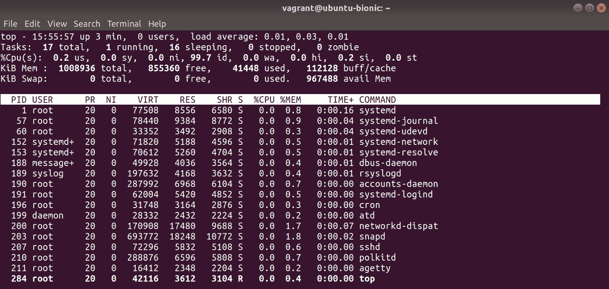
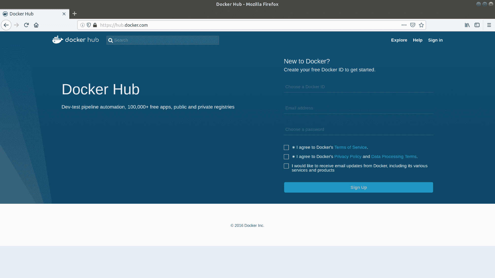
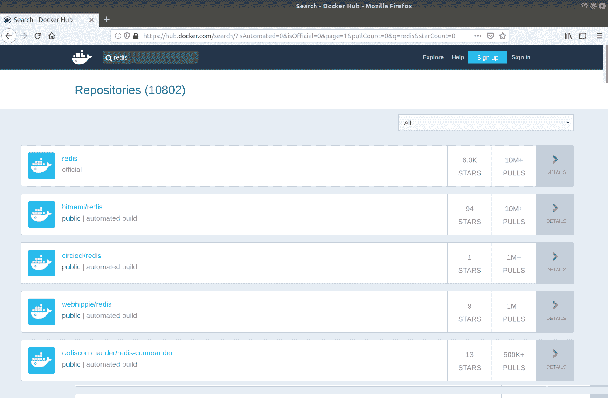
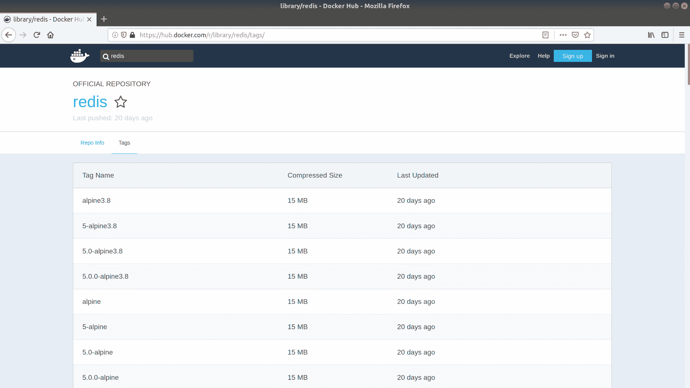
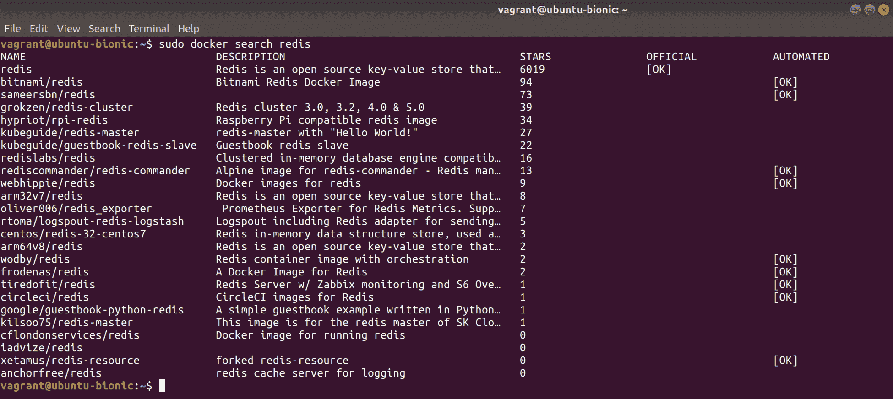
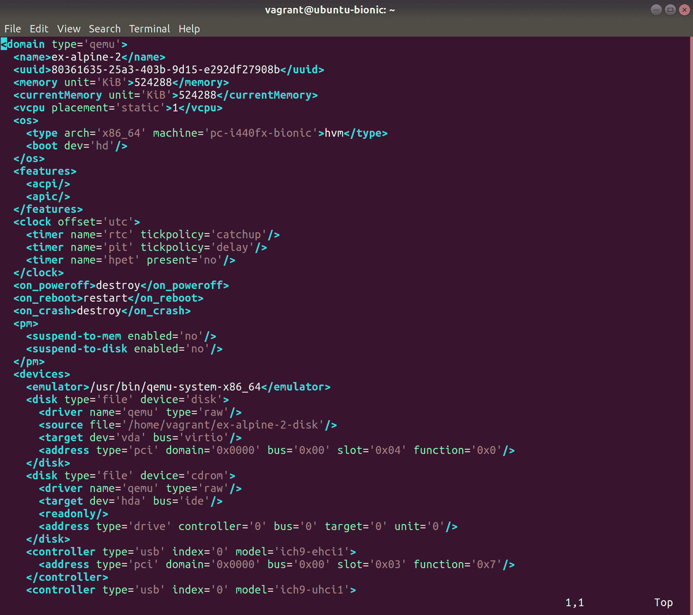
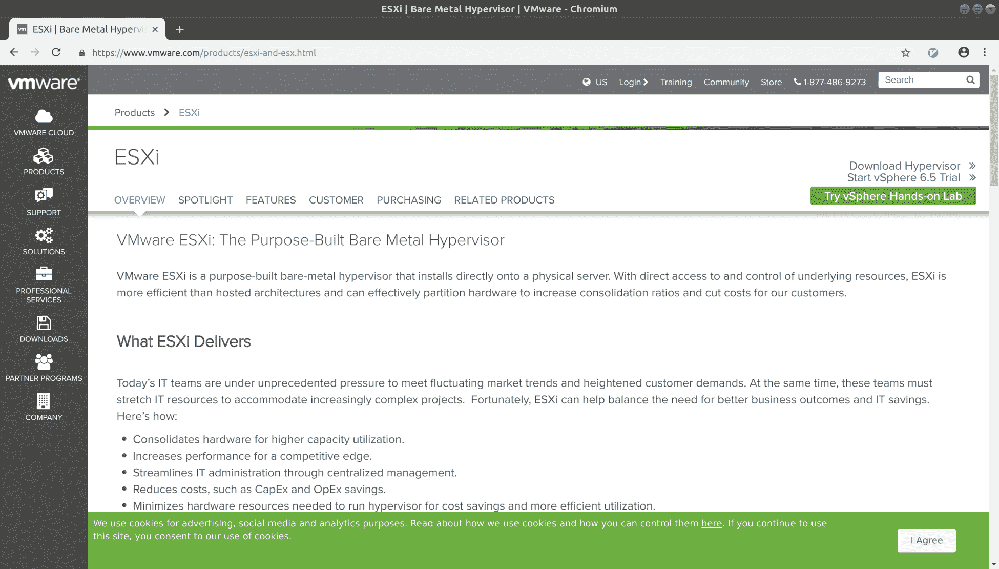
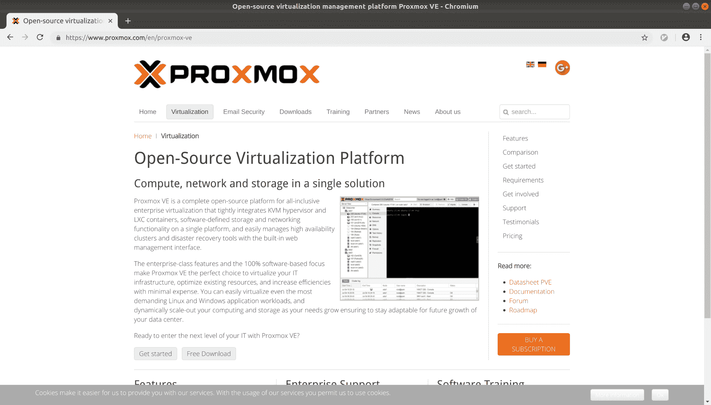
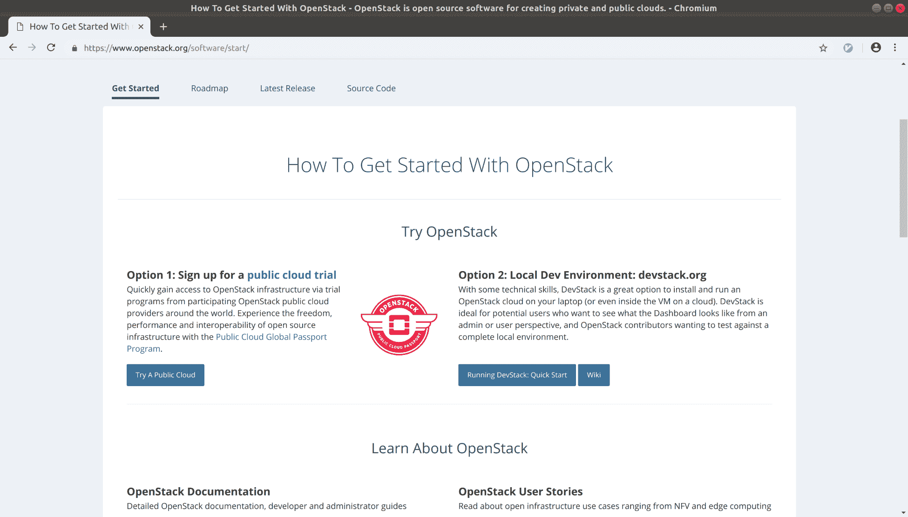

# 容器和虚拟化

在本章中，我们将涵盖以下主题:

*   什么是容器？
*   安装 Docker
*   运行您的第一个 Docker 容器
*   调试容器
*   搜索容器(和安全性)
*   什么是虚拟化？
*   用我们的虚拟机启动 QEMU 机器
*   使用 virsh 和 virt-install
*   比较本地安装、容器和虚拟机的优势
*   虚拟化选项的简要比较(VMware、proxmox 等)

# 介绍

老实说:容器和虚拟化是我最喜欢谈论的关于计算机和服务器的事情之一。能够在你的电脑里安装一台完全不同的电脑，这个概念本身就能给我带来光彩。

这不是一个新的想法；这个原则已经存在了相当长的一段时间，甚至我的第一台 OS9 计算机也能够在某种程度上实现虚拟化。再往前追溯，这个术语的根源来自 20 世纪 60 年代，尽管它的含义与现代白话略有不同。

你可能已经使用过一个**虚拟机** ( **虚拟机**)，尽管你可能甚至不知道你已经使用过。如今，虚拟机速度很快，与在底层 tin 上运行相比，性能损失可以忽略不计，这要归功于虚拟化的优势，这意味着您不再模拟与虚拟机相关的一切，而是将虚拟机指令直接传递给主机的 CPU。

不可否认，虚拟机是主机托管和开发的生力军，能够快速启动和拆除机器，当您不断打破东西或寻找安全廉价的方法来分割服务器的庞大工作负载时，这是天赐良机。

如今，尽管集装箱各有各的优势，但它们在某种程度上已经夺走了虚拟机的衣钵，它们彼此和谐相处，而不是不断发生战争。

与虚拟机不同，容器更像是系统的一部分，如果你愿意的话，有一个共享的核心。

当您在 Linux 系统上使用容器时，您是在共享主机的内核，而不是安装您自己的内核，并且您通常不会为额外硬件(如磁盘控制器)的仿真而烦恼。

同样，容器和集装箱化并不是新概念，这个想法从 FreeBSD 上的监狱时代，以及后来的 Solaris 上的 Zones 时代就已经存在了(这两个概念仍然以这样或那样的形式存在，我们将在后面讨论)。最近(在过去的几年里)随着 Docker 的引入，集装箱出现了爆炸式的增长，这使得集装箱的整个概念更容易被人们接受(而且他们的市场营销非常出色)。

在本章中，我们将研究容器和虚拟机，讨论它们的优缺点，并讨论虚拟环境的管理。

# 技术要求

在这一节和这一章中，我们将主要使用我们的 Ubuntu 机器。

大多数情况下，这是因为 Ubuntu 提供了许多我们需要的开箱即用的最新元素，而 CentOS 由于其长保质期，已经有了许多向后修补的东西。

请随意使用以下`Vagrantfile`:

```sh
# -*- mode: ruby -*-
# vi: set ft=ruby :

Vagrant.configure("2") do |config|

 config.vm.define "ubuntu1804" do |ubuntu1804|
   ubuntu1804.vm.box = "ubuntu/bionic64"
   ubuntu1804.vm.box_version = "20180927.0.0"
 end

 config.vm.define "centos7" do |centos7|
   centos7.vm.box = "centos/7"
   centos7.vm.box_version = "1804.02"
 end

end
```

# 什么是容器？

在这一节中，我们将从比介绍中更深的层次来看什么是容器。

我们不会深入太多(因为我们会迷路，不得不打电话给詹姆斯·卡梅隆让我们出去)，但我们会触及什么使容器成为容器的核心，以及它与运行成熟的虚拟机有何不同。

# 准备好

SSH 到您的 Ubuntu 虚拟机:

```sh
$ vagrant ssh ubuntu1804
```

# 怎么做...

我们将在不使用市场上最流行的工具的情况下创建一个容器。

容器利用了某些内核特性(名称空间和 cgroups)，这意味着它们不能严格地移植到世界上的 Windows 和 MAC 上。

首先，我们将为容器创建一个存储池以供使用:

```sh
$ sudo lxc storage create example-pool dir
```

Directory storage pools are discouraged for production use. You're better off using a tailored solution that uses LVM or ZFS, but for testing and examples, it's fine. 

接下来，我们将使用这个池启动一个容器:

```sh
$ sudo lxc launch ubuntu:18.04 example-container -s example-pool
Creating example
Retrieving image: rootfs: 31% (1.63MB/s)
```

The preceding retrieval can take some time, and will depend on your network connection speed.

在这个过程的最后，应该创建我们的容器。我们可以使用以下内容将其列出:

```sh
$ sudo lxc list
+-------------------+---------+------+------+------------+-----------+
| NAME | STATE | IPV4 | IPV6 | TYPE | SNAPSHOTS |
+-------------------+---------+------+------+------------+-----------+
| example-container | RUNNING | | | PERSISTENT | 0 |
+-------------------+---------+------+------+------------+-----------+
```

然后，我们可以执行其中的命令:

```sh
$ sudo lxc exec example-container hostname
example-container
```

Here, we're running a command that, when run on our host VM, would tell us `ubuntu-bionic`. Therefore, by checking it alongside our `lxc` command, we can prove it's running in the container. 

如果我们想进入容器，我们可以简单地启动一个Shell:

```sh
$ sudo lxc exec example-container bash
root@example-container:~# hostname
example-container
```

这就是了——在你的操作系统中，一个操作系统的快速切片！

完成后，只需键入`exit`或按下 *Ctrl* + *D* 即可退出容器:

```sh
root@example-container:~# exit
```

然后，我们可以使用以下命令销毁它:

```sh
$ sudo lxc stop example-container
$ sudo lxc delete example-container
```

One thing people frequently forget, both in the LXC world and the Docker world, is that you've got more than just the container to contend with. We've deleted the container, but if you really want to clean up shop, you will have to delete the image you downloaded and the storage pool, too.

# 它是如何工作的...

为了详细说明 cgroups 和 namespaces 注释，实际上什么样的容器是内核和用户空间工具的功能，以使事情看起来更好。LXC 是一个将复杂性抽象化的工具，将我们的半隔离机器的设置简化为几个易于使用的命令。

# cggroups(Linux 控制组)

以下是 *Linux 程序员手册*的摘录:

"Control groups, usually referred to as cgroups, are a Linux kernel feature that allows processes to be organized into hierarchical groups whose usage of various types of resources can then be limited and monitored. The kernel's cgroup interface is provided through a pseudo-filesystem called cgroupfs. Grouping is implemented in the core cgroup kernel code, while resource tracking and limits are implemented in a set of per-resource-type subsystems (memory, CPU, and so on)."

实际上，这意味着内核有能力将进程组合成一个堆栈，然后可以控制和监控它的资源使用情况。

# 命名空间

在不开创潮流的情况下，再来看看 *Linux 程序员手册*:

"A namespace wraps a global system resource in an abstraction that makes it appear to the processes within the namespace that they have their own isolated instance of the global resource. Changes to the global resource are visible to other processes that are members of the namespace, but are invisible to other processes. One use of namespaces is to implement containers."

实际上，这意味着您的单一网络接口可以附加多个名称空间，利用进程将认为这是该设备的唯一实例。

网络接口不是唯一的例子，但它们是更明显的候选之一，因为每个虚拟机都需要网卡。

# 我们创作的失败

当我们在本节开始时创建存储池时，我们真正做的是通知我们的系统(T0 守护程序)它需要使用一个特定的目录来存储容器，即`/var/lib/lxd/storage-pools/`下面的目录:

```sh
$ sudo ls /var/lib/lxd/storage-pools/example-pool
containers
```

当我们开始我们的容器时，我们首先做的是从默认的互联网位置下载一个预打包的图像，作为我们创建的容器的基础。

在这里，它被视为一个字母数字字符串，但它实际上是 Ubuntu 18.04 的简化容器形式:

```sh
$ sudo ls -lhA /var/lib/limg/
total 175M
-rw-r--r-- 1 root root 788 Nov 4 15:44 30b9f587eb6fb50566f4183240933496d7b787f719aafb4b58e6a341495a38ad
-rw-r--r-- 1 root root 175M Nov 4 15:47 30b9f587eb6fb50566f4183240933496d7b787f719aafb4b58e6a341495a38ad.rootfs
```

注意这个容器的大小，`175 M`，这是人们强调的关于容器的主要优势之一(它们很小，这实际上是一个更大的例子！).

当我们的容器运行时，我们可以从主机上看到它是一组进程:

```sh
$ ps uf -p 3908 --ppid 3908 --ppid 3919 
```

输出应该如下图所示:


因此，这个容器中有大部分操作系统，它继承了我们拉下的映像，尽管它明显不包含与主机虚拟机共享的内核。

想象一个像橘子一样的容器(我也很喜欢橘子)，其中每个部分都可以作为它自己的多汁的小包裹存在，但是没有橘子的外皮给它结构和传递营养，它是没有用的。这与虚拟机形成对比，虚拟机更像是一只永远年轻的小蜘蛛(听我说)，每只都作为有生命、有呼吸的生物独立存在，但它们仍然骑在妈妈的背上，随时准备向任何接触到一窝幼虫的人传递一剂邪术恐怖。

# 还有更多...

目前，您应该有一个由 LXC 创建的容器，在您自己的笔记本电脑、台式机或服务器上，放在一个由游民(并利用 VirtualBox)管理的虚拟机中。

这可能会有点难以想象，但是很多聪明的人花了很多时间来确保这种设置没有问题。

# LXD 守护进程

一如既往，我们可以使用`systemctl`来可视化我们的服务:

```sh
$ systemctl status lxd
● lxd.service - LXD - main daemon
 Loaded: loaded (/lib/systemd/system/lxd.service; indirect; vendor preset: enabled)
 Active: active (running) since Sun 2018-11-04 15:41:14 UTC; 33min ago
 Docs: man:lxd(1)
 Process: 2058 ExecStartPost=/usr/bin/lxd waitready --timeout=600 (code=exited, status=0/SUCCESS)
 Process: 2036 ExecStartPre=/usr/lib/x86_64-linux-gnu/lxc/lxc-apparmor-load (code=exited, status=0/SUCCESS)
 Main PID: 2057 (lxd)
 Tasks: 16
 CGroup: /system.slice/lxd.service
 └─2057 /usr/lib/lxd/lxd --group lxd --logfile=/var/log/lxd/lxd.log
```

# 请参见

在这一部分的顶部，我们在我们的容器中运行`hostname`，但是这并没有给你一个关于容器正在做什么的线索。我发现特别方便的一件事是检查在我的容器中运行的进程的能力，而不必首先为我的`ps`命令挖掘进程标识。

这里，我使用以下命令:

```sh
$ sudo lxc exec example-container top
```

这给了我以下输出:



请注意，它比主机安静得多，并且容器中实际运行的守护程序很少。

# 安装 Docker

到目前为止，在 Linux 上运行容器的最流行的解决方案(至少在撰写本文时)是 Docker。

作为 Docker Inc .(当时的 dotCloud)在他们的 **PaaS** ( **平台即服务**)公司中更好地利用容器的一种方式，Docker 很快在开源世界中获得了吸引力，并很快被许多圈子视为计算的未来(愤世嫉俗的系统管理员通常是在开发人员风闻之后出现的)。

因为这实际上是一种使用现有内核特性的简单方法，并且包括 Docker Hub，供人们上传和下载预先构建的图像，所以它使容器变得容易。

很快，人们开始将所有东西打包，从火狐到 Nginx，再到整个发行版，只是因为。

I firmly believe that the ease with which Docker made it possible to upload and download their images contributed to its success. As I've already mentioned, the concepts of containers go back to the nineties, but there was no "jail prison" or "zones zone" for people to download pre-built collections of software from. Docker Hub provided this on an already popular platform. 

# 准备好

在传统的存储库中，大多数发行版都带有某种形式的 Docker。然而，这经常与上游不同步，或者只是简单的陈旧，所以在您的环境中利用上游 Docker 存储库是一个好主意。

SSH 到您的 Ubuntu 虚拟机:

```sh
$ vagrant ssh ubuntu1804
```

# 怎么做...

Docker 会保留一个关于如何在您选择的发行版上安装 Docker 的最新页面(参见[https://docs.docker.com/install](https://docs.docker.com/install))。以下是 Ubuntu 的精简说明。

运行更新以确保您准备好安装 Docker:

```sh
$ sudo apt update
```

安装 GPG 密钥，然后添加存储库本身:

```sh
$ wget https://download.docker.com/linux/ubuntu/gpg
$ sudo apt-key add gpg $ sudo apt-add-repository 'deb [arch=amd64] https://download.docker.com/linux/ubuntu bionic stable'
```

As ever, check the GPG fingerprint against an official source.

现在，我们终于可以安装 Docker 本身了(这可能需要一些时间):

```sh
$ sudo apt install docker-ce -y
```

我们也可以通过使用`systemctl`来检查我们的 Docker 守护进程的状态:

```sh
$ systemctl status docker
● docker.service - Docker Application Container Engine
 Loaded: loaded (/lib/systemd/system/docker.service; enabled; vendor preset: enabled)
 Active: active (running) since Sun 2018-11-04 16:56:26 UTC; 52s ago
 Docs: https://docs.docker.com
 Main PID: 11257 (dockerd)
 Tasks: 23
 CGroup: /system.slice/docker.service
 ├─11257 /usr/bin/dockerd -H fd://
 └─11275 docker-containerd --config /var/run/docker/containerd/containerd.toml
```

You may have noticed we haven't started and enabled this service. This is mostly because Debian-derived systems like to start services for you... there are a variety of reasons I don't like this approach personally, but it is what it is.

# 它是如何工作的...

在我们开始之前，你可能已经注意到我们一直在使用一个名为`docker-ce`的包，这是有很好的理由的。

Docker 有两个基础版本，**社区版** **(CE)** 和**企业版** **(EE)** 。大多数情况下，你只会在野外看到 CE，它完全满足你的所有需求。

我们在这里所做的就是直接去软件的作者那里，添加他们自己的 GPG 密钥和存储库信息，以及我们的 Ubuntu 默认值。Docker 是一个非常动态的程序，这意味着它有频繁且可观的发布。在撰写本文时，我们安装了`18.06.1-ce`，但这可能会在您不知不觉中发生变化。Docker 采用年-月发布格式:

```sh
$ docker --version
Docker version 18.06.1-ce, build e68fc7a
```

我们还安装了两个主要组件(以及许多工具和附加组件)，它们是 Docker 命令行工具和 Docker 守护程序。

Docker 的工作方式与其他用户空间工具相同，利用了内核功能。它的与众不同之处在于它对用户的友好程度。

您主要通过命令行工具`docker`与 Docker 一起工作，该工具又与 Docker 守护程序通信。这个守护进程是一个组件，负责管理它被指示创建的容器，并维护它从 Docker Hub 或其他注册表中获取的映像。

A Docker registry is a repository of images. The most popular is Docker Hub, but there's nothing stopping you from creating your own, or using an off-the-shelf solution to manage one, like Artifactory. 

目前要注意的最后一个组件是 Docker 正在使用的运行时，它是开箱即用的`runC`(通用容器运行时)。

运行时实际上只是 Docker 用来运行容器的统一系统集合的名称(想想捆绑在一个词中的 cgroups 和 namespaces，尽管还有其他特性)。这意味着虽然`runC`是特定于 Linux 的，但是如果 Windows 有一个容器运行时(主机计算服务)，那么 Docker 可以利用它。

This does not make the containers universal between operating systems – you can't create a container for Linux and spin it up in the Windows-specific runtime, but it does make the Docker tooling universal.

# 还有更多...

获取您想要了解的关于 Docker 安装的所有信息的最简单方法是使用`docker info`命令:

```sh
$ sudo docker info
Containers: 0
 Running: 0
 Paused: 0
 Stopped: 0
Images: 1
Server Version: 18.06.1-ce
Storage Driver: overlay2
 Backing Filesystem: extfs
 Supports d_type: true
 Native Overlay Diff: true
Logging Driver: json-file
Cgroup Driver: cgroupfs
Plugins:
 Volume: local
 Network: bridge host macvlan null overlay
 Log: awslogs fluentd gcplogs gelf journald json-file logentries splunk syslog
Swarm: inactive
Runtimes: runc
Default Runtime: runc
Init Binary: docker-init
containerd version: 468a545b9edcd5932818eb9de8e72413e616e86e
runc version: 69663f0bd4b60df09991c08812a60108003fa340
init version: fec3683
Security Options:
 apparmor
 seccomp
 Profile: default
Kernel Version: 4.15.0-34-generic
Operating System: Ubuntu 18.04.1 LTS
OSType: linux
Architecture: x86_64
CPUs: 2
Total Memory: 985.3MiB
Name: ubuntu-bionic
ID: T35X:R7ZX:MYMH:3PLU:DGXP:PSBE:KQ7O:YN4O:NBTN:4BHM:XFEN:YE5W
Docker Root Dir: /var/lib/docker
Debug Mode (client): false
Debug Mode (server): false
Registry: https://index.docker.io/v1/
Labels:
Experimental: false
Insecure Registries:
 127.0.0.0/8
Live Restore Enabled: false

WARNING: No swap limit support
```

# 稍微多一点

有一点我没有涉及到`containerd`和类似`CRI-O`的东西。如果你已经知道这些术语，那么你很有可能理解为什么我没有提到它们，因为它们远远超出了本书试图实现的范围。

我鼓励任何对 Docker 及其各种组件感兴趣的人选择专门的文献，因为如果你彻底了解当今最流行的容器化工具，未来几年你都不会失业。

# 请参见

你在 Docker 下载的临时演员列表中发现`pigz`了吗？这是一个特别有趣的软件，因为它基本上是`gzip.`的并行版本，当你解压缩一个文件并且你有十八个内核时，尽可能多地使用它们而不是重载一个是很好的。

# 运行您的第一个 Docker 容器

我们早在 LXC 部分就已经使用了一个容器，但是现在我们将使用更流行的系统来运行容器。

本节将介绍一些基本命令，但不会深入讨论。

# 准备好

在这一节中，我们将使用我们的 Ubuntu 虚拟机，但是请确保首先设置了上一节中的 Docker。

SSH 到您的虚拟机，在安装 Docker 之前，请确保使用前面的部分设置上游 Docker 存储库:

```sh
$ vagrant ssh ubuntu1804
```

# 怎么做...

与 LXC 部分一样，我们将启动一个 Ubuntu 容器，然后与它进行交互。

从以下命令开始:

```sh
$ sudo docker run -itd --rm alpine /bin/ash
Unable to find image 'alpine:latest' locally
latest: Pulling from library/alpine
4fe2ade4980c: Pull complete 
Digest: sha256:621c2f39f8133acb8e64023a94dbdf0d5ca81896102b9e57c0dc184cadaf5528
Status: Downloaded newer image for alpine:latest
5396b707087a161338b6f74862ef949d3081b83bbdcbc3693a35504e5cfbccd4
```

现在容器已经启动并运行，您可以使用`docker ps`查看它:

```sh
$ sudo docker ps
CONTAINER ID IMAGE COMMAND CREATED STATUS PORTS NAMES
5396b707087a alpine "/bin/ash" 45 seconds ago Up 44 seconds ecstatic_lalande
```

如果你愿意，你也可以用`docker exec`输入:

```sh
$ sudo docker exec -it ecstatic_lalande /bin/ash
/ # 
```

You could also use `docker attach`, which would accomplish the same thing on the face of it (giving you access to a shell in the container). The only problem with this method is that you would be attaching to the active process, meaning that when you closed your session, the container would stop too.

再次离开容器(`exit`)会将您带回虚拟机的提示。

从这里，您可以停止您的容器:

```sh
$ sudo docker stop ecstatic_lalande
ecstatic_lalande
```

This may take a few seconds. 

容器现在被删除了，我们可以用另一个`docker ps`来确认:

```sh
$ sudo docker ps -a
CONTAINER ID IMAGE COMMAND CREATED STATUS PORTS NAMES
```

# 它是如何工作的...

让我们分解我们的命令。

# 创建容器

从创建新容器开始，我们使用了以下命令:

```sh
$ sudo docker run -itd --rm alpine /bin/ash
```

在这里，我们告诉 Docker 我们想要在一个新的容器中`run`一个命令:

```sh
docker run
```

然后我们通知它，我们希望它是交互式的，有一个伪 TTY，并开始分离(让我们回到虚拟机Shell):

```sh
-itd
```

接下来，我们告诉 Docker，当容器停止时，我们希望它自动移除自身:

```sh
--rm
```

This is a relatively new feature, only introduced because people didn't realize containers linger after they stop, and people would end up with lists of hundreds of stopped containers.

最后，我们要说的是我们想要使用什么映像(来自 Docker Hub)，运行什么命令(这里，它是 Alpine Linux 的默认Shell，`ash`):

```sh
alpine /bin/ash
```

# 列出我们的容器

其次，我们使用以下命令来列出我们的新容器:

```sh
$ sudo docker ps
```

这显示了我们所有容器的`CONTAINER ID`、`IMAGE`、`COMMAND`、`CREATED`、`STATUS`、`PORTS`和`NAMES`(或者，在本例中，只有一个)。

`CONTAINER ID`部分是随机的字符串分配，`NAMES`部分的特点是随机生成容器的友好名称(尽管这也可以在创建时定义)。

当我们最近将`-a`添加到我们的列表命令中时，它是为了表明容器不会仅仅因为被停止而从初始列表中被省略，因为`-a`标志将显示所有容器，而不仅仅是正在运行的容器。

# 在我们的容器中执行命令

接下来，我们跳到我们的容器中，启动另一个(在创建时已经启动的那个之上)shell 会话:

```sh
$ sudo docker exec -it ecstatic_lalande /bin/ash
```

在这里，我们通过使用一个交互会话和我们的容器中的另一个伪 TTY(这里用来自`docker ps`的友好名称表示)来执行一个命令。

这让我们掉进了集装箱里。如果我们接着运行`top`，我们将看到我们已经启动的`/bin/ash`命令的两个实例:


Did you spot that one of the `/bin/ash` instances is `PID 1`?

# 停止我们的集装箱

一旦我们再次跳出，我们就停止了我们的运行容器:

```sh
$ sudo docker stop ecstatic_lalande
```

这需要几秒钟，但是，一旦完成，容器将消失(正如我们所看到的)，尽管它使用的图像(阿尔卑斯山)将保留。

因为我们的形象还在踢来踢去，下次你想用它做什么的时候，就不用下载了！

# 调试容器

在本节中，我们将再次启动我们的容器，进行一些更改，并检查我们的更改是否有任何影响。

这有助于突出容器的瞬态特性，以及您可以对正在运行的实例做什么。

# 准备好

在这一部分，我们将继续使用我们的 Ubuntu 虚拟机。

SSH 到您的虚拟机(如果尚未连接)，并启动一个容器:

```sh
$ vagrant ssh ubuntu1804 $ sudo docker run -itd --rm -p8080:8080 alpine /bin/ash
```

# 怎么做...

您现在应该有一个正在运行的 docker 容器，在这里用`docker ps`列出:

```sh
$ sudo docker ps
CONTAINER ID IMAGE COMMAND CREATED STATUS PORTS NAMES
0f649283dcaf alpine "/bin/ash" 41 seconds ago Up 39 seconds 0.0.0.0:8080->8080/tcp compassionate_boyd
```

注意，在这个例子中我们还有一个端口被转发，即端口`8080.`

在这种情况下，端口转发与任何其他情况都是一样的——我们将一个端口从主机转发到容器中的一个端口。

尝试`curl`端口:

```sh
$ curl localhost:8080
curl: (56) Recv failure: Connection reset by peer
```

现在，进入虚拟机，让我们在指定的端口上启动一个 web 服务器:

```sh
$ sudo docker exec -it compassionate_boyd /bin/ash
```

首先，我们需要安装一些额外的 busybox 东西:

```sh
# apk add busybox-extras
```

现在，我们可以在退出容器之前，在端口`8080`上启动一个小型 web 服务器:

```sh
# touch index.html
# echo "I hated reading Shakespeare in school." > index.html
# httpd -p8080
# exit
```

现在，从您的虚拟机，您将能够`curl`您的容器的新网络服务器:

```sh
$ curl localhost:8080
I hated reading Shakespeare in school.
```

停止容器，并开始新的容器:

```sh
$ sudo docker stop compassionate_boyd
compassionate_boyd
$ sudo docker run -itd --rm -p8080:8080 alpine /bin/ash
592eceb397e7ea059c27a46e4559c3ce7ee0976ed90297f52bcbdb369e214921
```

请注意，当您现在再次`curl`您的端口时，它将不起作用，因为您之前对运行容器的所有更改都已丢失，而新的更改已经取而代之:

```sh
$ curl localhost:8080
curl: (56) Recv failure: Connection reset by peer
```

# 它是如何工作的...

我们在这里所做的只是强调容器本质上是短暂的，虽然您可以停止和启动同一个容器(减去`--rm`到`docker run`命令)，但您在一个短暂的状态下运行，直到您标记您的容器并将其上传到某个注册表。

在离开容器并保存起来以备后用之前，先启动一个容器，然后在里面安装一堆软件，这通常不是好的做法。更好的方法是使用`Dockerfile`或其他一些自动化和可复制的方式来构建容器。

我们还指出，虽然 docker 容器应该是一个独立的小实体，但这并不意味着您不能跳到它们里面去看看发生了什么，甚至安装额外的软件来帮助您调试，如果您愿意的话。

# 还有更多...

如果你有兴趣用一个`Dockerfile`来做我们在这里做的事情，这是一个相当琐碎的事情，尽管它在技术上超出了本书的范围。

以下内容足以让您入门:

```sh
FROM alpine

MAINTAINER Your Deity of Choice

RUN apk add busybox-extras
RUN touch index.html
RUN echo "I really hated reading Shakespeare in school." > index.html

EXPOSE 8080/tcp

CMD ["/usr/sbin/httpd", "-p8080", "-f"]
```

然后，您可以用类似下面这样的东西来构建它:

```sh
$ sudo docker build .
<SNIP>
Successfully built d097226c4e7c
```

然后，您可以启动生成的容器(分离，并转发端口):

```sh
$ sudo docker run -itd -p8080:8080 d097226c4e7c
```

我们在`Dockerfile`中增加了`-f`来保证进程保持在前台(并且容器不会立即停止):

```sh
$ curl localhost:8080
I really hated reading Shakespeare in school.
```

# 搜索容器(和安全性)

在这一部分，你将需要访问某种浏览器，尽管在紧要关头，你可能会打电话给一个朋友，让他们为你做一个互联网搜索(如果你是一个真正的好朋友，他们确实没有更好的事情可做)。

我们还将使用虚拟机来实践我们的发现。

我们将在 Docker Hub 上搜索容器，我们将涉及下载和使用公共图像的安全含义。

这一部分不是为了吓唬你，就像你不应该害怕运行任何一个你找到的免费(开源)软件一样——它是关于尽职调查的。

# 准备好

跳到你的 Ubuntu 虚拟机上(如果你还没有这样做的话，安装上一节的 docker):

```sh
$ vagrant ssh ubuntu1804
```

# 怎么做...

从你选择的浏览器，对我来说是火狐，前往[https://hub.docker.com](https://hub.docker.com)。

您将看到如下页面:



这里有一些暗示，这是标题为 Docker 的新部分？。没有必要创建一个 Docker ID 来开始，尽管第一句话可能暗示了什么。您可能会发现这样做很方便，您甚至可能有很好的理由创建一个 ID，但是最初绝对没有必要这样做(至少在编写时没有)...).

相反，使用屏幕顶部的搜索栏，输入`redis`:



哇哦！那是一个很大的仓库！

这是了解 Docker 的第一件好事。因为创建图像并上传到 Docker Hub 非常容易(我自己也有一些)，所以很有可能会有多个版本的图像。

在这里，我们可以看到，顶部的结果只是简单地被命名为 redis，而不是像其余的一样是`<username>/redis-foo`。

当一个图像是官方的，它获得了特权的荣誉，只有明确的名称，其软件，在这种情况下，redis。

点击它:


这里有几件事需要注意。

*   有益的是，我们得到一个开始的命令，也就是右边的`docker pull redis`。
*   我们获得存储库信息，这是为我们提供简短完整描述的默认视图。在实践中，这可以很短，也可以很长，只要维护者愿意。
*   最后，此时此刻，我们在顶部看到一个标签部分。立即点击此处:



与 Git 一样，标签是一种表示您想要下载的容器的特定版本的方式。

默认标签是最新的，它是您在运行以下命令时会下载的图像(正如您在紧接我们的命令之后的行中看到的那样):

```sh
$ sudo docker run -d redis
Unable to find image 'redis:latest' locally
latest: Pulling from library/redis
f17d81b4b692: Pull complete 
b32474098757: Pull complete 
<SNIP>
```

如果我们想引入阿尔卑斯版本的 Redis(就像安装在阿尔卑斯 Linux 上的 Redis 一样)，我们可以运行以下内容:

```sh
$ sudo docker run -d redis:alpine
Unable to find image 'redis:alpine' locally
alpine: Pulling from library/redis
4fe2ade4980c: Already exists 
fb758dc2e038: Pull complete 
989f7b0c858b: Pull complete 
<SNIP>
```

Note that we pulled every later except the base one, which already existed in our setup.

瞧！你用 Docker Hub 找到了每个人最喜欢的内存数据库的版本！

# 它是如何工作的...

我们在这里所做的就是从全球 Docker 注册表中提取一个功能映像；这是默认的，欧米茄，最大的，原始的，最好的(根据一些人的说法。)

Docker Hub 是一个由更小的存储库组成的存储库，每个人都可以对自己构建的(或分叉的)容器进行自己的旋转，从而加入到世界的软件汤里。

正如我在前面的讽刺台词中提到的，这显然有缺点。这意味着，因为很容易将您的图像放在 Docker Hub 上，所以找到您想要的图像会变得越来越令人沮丧。

人们也可能是恶意的，上传容器很可能会做他们在罐子上说的事情，同时使用你的计算机的整个核心来挖掘比特币(尽管这种事情发生时通常会很快被发现)。作为系统管理员、DevOps 人员、公司的万事通，您有责任弄清楚容器在做什么，以及它是否是您所需要的。

我遵循一些基本原则:

*   检查`Dockerfile`和信号源是否可用:
    *   通常，Docker Hub 上的存储库是由 GitLab 或其他源代码托管站点触发的构建，这意味着您可以检查容器后面的代码
*   检查容器的下载次数:
    *   虽然不是质量的指标，因为软件的第一张图片通常是最受欢迎的，但它通常是千眼原则的一个很好的例子。如果有成千上万的人在使用它，容器中隐藏恶意内容的可能性就更大(尽管仍有可能)。
*   检查它是否是正式项目的 Docker 容器:
    *   像 Redis、Kibana 和 Swift 这样的项目都有官方的 Docker 容器，所以一般来说我会优先考虑它们的产品。
    *   项目中也可能有容器没有被标记为官方的，仍然带有创作者的名字。在我的书里，这些牢牢地放在简·布洛格斯的容器上面。
    *   这并不是说非官方的是不好的，或者它们没有涵盖稍微不同的需求，但是，十有八九，我发现事实并非如此。
*   你能自己建吗？
    *   假设`Dockerfile`是免费许可的，你可以把它从 GitLab 上拿下来，然后把它粘贴到你的构建服务器上，创建一个你自己的图像。至少这样，你知道你所看到的是你在过程结束时所得到的(假设你没有下载软件作为构建的一部分，从一些你从未听说过的危险的第三方仓库)。

话虽如此——听起来我对土制集装箱非常失望——Docker 赢得了集装箱霸权之战，因为它的市场思维份额和易用性(如果是建造集装箱或简单地找到它们)。

Docker Hub 意味着，即使我没有本地存储库配置，但我确实安装了 Docker，我也可以很快在一个 Alpine 容器上运行一个 web 服务器，该容器插入到 Gentoo 上的一个 MariaDB 容器中。

然后，这个容器可以在大约十分钟内将日志馈送到一个容器化的弹性搜索实例中，该实例运行在 Slackware 上，位于完全相同的主机上。

# 还有更多...

如果您有此想法，也可以从命令行搜索:



I'll be honest, I never do this, and it's mostly because everyone carries a browser around in their pocket these days. However, I know that some people out there are purists.

# 什么是虚拟化？

如果你在这一页随意打开了这本书，那么你现在可能知道什么是虚拟化了。如果你已经做了正常的事情，并且从一开始就开始了，那么同样很有可能你已经明白你已经在这本书的几乎所有部分中使用了虚拟化。

虚拟化是虚拟化的行为(我知道对吗？)一台机器在另一台机器里面。然而，与容器不同的是，我们将从 USB 控制器到软驱的所有东西都可视化了(真的)。

这个概念并不新鲜，但技术在前进。

对于我们的例子，你可能已经做了和我一样的事情，并求助于 VirtualBox 的游民。我选择走这条路是因为 VirtualBox 无处不在，有适用于 macOS、Linux 和 Windows 的版本(还有其他版本！).这有很大的优点，但也有缺点。

虚拟化就其本质而言，与运行它的机箱的软件和硬件密切相关。考虑到这一点，您可能会理解为什么企业通常选择不在任何地方使用 VirtualBox(尽管有 Windows 和 Linux 机器)，而是分别使用 HyperV 和 KVM...他们更土。

在 Linux 领域，选择的虚拟化软件是 **KVM** ( **内核虚拟机**)。

Siderant: KVM is a terrible name for a product or piece of software. It already had a meaning before Kernel Virtual Machine was decided upon, and data center engineers the world over have been cursing this particular three letter acronym since its inception. Keyboard Video Mouse was a standard, and, in my head, I still picture a DC crash-cart when I hear those letters. 

# 准备好

在本节中，我们将了解容器和虚拟化之间的一些基本区别。

我们将首次使用我们的 Ubuntu 虚拟机和我们的 CentOS。

登录您的 CentOS 和 Ubuntu 虚拟机:

```sh
$ vagrant ssh ubuntu1804
$ vagrant ssh centos7
```

# 怎么做...

在我们的容器步骤中，我们简要地观察了这样一个事实，即正在运行的内核在主机虚拟机上与在容器内是相同的。

对于这一步，我们将在两台虚拟机上运行相同的命令，并比较输出:

```sh
$ uname -a
Linux ubuntu-bionic 4.15.0-36-generic #39-Ubuntu SMP Mon Sep 24 16:19:09 UTC 2018 x86_64 x86_64 x86_64 GNU/Linux $ uname -a
Linux localhost.localdomain 3.10.0-862.2.3.el7.x86_64 #1 SMP Wed May 9 18:05:47 UTC 2018 x86_64 x86_64 x86_64 GNU/Linux
```

我们的 Ubuntu 盒子运行的是内核 4.15.0，我们的 CentOS 盒子，版本 3.10.0。

这就是容器的第一个优势，它能够运行完全不同版本的 Linux 内核。

这方面的第二个优势是，虚拟机不必与它们的主机是同一个操作系统:你可以在一个 Linux 盒子上模拟一个 Windows、FreeBSD 甚至 macOS 机器，并且大多数是相同操作系统的任意组合。

macOS is a bit of a special case (isn't it always?) because there are license problems and you have to do it in a very specific fashion, but it can be done. 

让我们来看看其他有点酷的东西。

在我们的 CentOS 虚拟机上，我列出了磁盘:

```sh
$ lsblk
NAME MAJ:MIN RM SIZE RO TYPE MOUNTPOINT
sda 8:0 0 40G 0 disk 
├─sda1 8:1 0 1M 0 part 
├─sda2 8:2 0 1G 0 part /boot
└─sda3 8:3 0 39G 0 part 
 ├─VolGroup00-LogVol00 253:0 0 37.5G 0 lvm /
 └─VolGroup00-LogVol01 253:1 0 1.5G 0 lvm [SWAP]
```

这些不是物理驱动器，它们是虚拟的，因此，您可以根据自己的意愿多次修改它们的配置，而不会损害主机的启动潜力。

This is one thing I hark on about all the time, mostly since I completely hosed the installation I had on my laptop by running a bunch of Ansible in a container. This Ansible, though I didn't know it at the time, messed around with disk partitions and layout quite forcefully, and, in the case of containers, the devices listed in `/dev/` are the devices on your machine, meaning that I'd most excellently destroyed my local install. Thankfully, I worked out what had happened before I rebooted, and was able to save the work I needed before reinstalling, but I didn't do that again. I also changed the tests to use Vagrant and Virtual Machines instead...

现在，很明显，也有缺点——你基本上是在运行一整台机器，这意味着它们必须启动(尽管你可以将这缩短到几秒钟)，并且启动速度会比大多数容器慢。

您可能只需要安装一个程序(例如 Windows VM 上的 Steam)，但是您会得到其他的废话，这意味着无论您是否想要，您都会得到 Edge 浏览器、Paint，以及那些标题为`Music`、`Videos`和`Pictures`的`Documents`部分中令人讨厌的文件夹，甚至令人费解的是，在服务器安装上。

# 它是如何工作的...

在很大程度上，它通过利用中央处理器功能在现代计算机上工作。

当您使用 VirtualBox 或 KVM 模拟您的硬件时，您真正做的是创建一个完整的独立指令集供 CPU 处理。如果我们在本机不知道的 CPU 上模拟虚拟机，并且不能以接近本机的速度处理它们的指令，您甚至必须模拟 CPU，这可能成本高且速度慢(稍后将详细介绍)。

一般来说，过去十年的 CPU 要么是 AMD-V(在 AMD 的情况下)，要么是 VT-x(在英特尔的情况下)，这意味着就原始处理速度而言，您的虚拟机与您的主机几乎无法区分。

还有**完全虚拟化**和**半虚拟化**，前者意味着模拟一切(比如，模拟 x86_64 处理器上的 aarch64 处理器)，后者意味着，虽然进程的执行是分离的，但实际使用的处理器与主机是相同的(我们之前谈到的 CPU 具有虚拟化意识)。

# 还有更多...

您可以用虚拟机做更多很酷的事情，而用容器是不可能做到的。

假设你是一个游戏玩家，你真的不喜欢使用 Windows，但又舍不得承认你真的想和你的朋友一起玩《文明》，他们都是狂热的 Windows 狂热分子。你可以在 Linux 内部做到这一点。

好吧，好吧，所以说你是从 Linux 内部做的有点不真诚，但是这里有一个方法。

启动虚拟机，安装 Windows(合法)，然后将显卡连接到虚拟机...

什么事？

没错。

通过 PCI 直通，可以将显卡交给虚拟机，将显示器插在后面，然后在单独的屏幕上进行所有游戏(使用相同的鼠标和键盘)。

进步！

# 用我们的虚拟机启动 QEMU 机器

在本节中，我们将在虚拟机中启动一个虚拟机，并尝试连接到它。

被预先警告。你可能会认为这个部分的元素很慢。这不是你的机器的错，也不是你自己配置的错——这是物理学的错，也是我们还没有消费级量子计算的事实。

# 准备好

SSH 到您的 Ubuntu 虚拟机:

```sh
$ vagrant ssh ubuntu1804
```

为在 Ubuntu 上运行虚拟机安装适当的组件:

```sh
$ sudo apt install qemu -y
```

# 怎么做...

我们将下载一个 Alpine ISO，并尝试在虚拟机中安装(在我们的虚拟机中):

```sh
$ wget http://dl-cdn.alpinelinux.org/alpine/v3.8/releases/x86_64/alpine-virt-3.8.1-x86_64.iso
```

I chose Alpine for this because it's tiny, fitting into 32 MB. 

接下来，我们需要创建一个虚拟磁盘来安装我们的操作系统:

```sh
$ qemu-img create example-disk 4G
Formatting 'example-disk', fmt=raw size=4294967296
```

现在，我们可以使用 QEMU 在虚拟驱动器上启动我们的 ISO:

```sh
$ qemu-system-x86_64 -drive file=example-disk,format=raw -cdrom alpine-virt-3.8.1-x86_64.iso -boot d -nographic
```

如果运气好的话，您应该会看到如下内容:


在命令行提示符下，您应该能够以 root 用户身份登录(默认情况下没有密码):

```sh
localhost login: root
Welcome to Alpine!

The Alpine Wiki contains a large amount of how-to guides and general
information about administrating Alpine systems.
See <http://wiki.alpinelinux.org>.

You can setup the system with the command: setup-alpine

You may change this message by editing /etc/motd.

localhost:~# 
```

Alpine 的功能就像一张正在播放的 CD，所以我们现在可以继续快速安装到本地驱动器:

```sh
# setup-alpine
```

你会被问到一些标准的问题。大多数情况下，您可以用默认值来回答，但为了完整起见，我做了以下工作:

*   键盘:`gb`
*   键盘变体:`gb`
*   主机名:`[default (localhost)]`
*   界面:`[default (eth0)]`
*   IP 地址:`[default (dhcp)]`
*   手动网络配置:`[default (no)]`
*   密码:随机
*   时区:`[default (UTC)]`
*   代理人:`[default (none)]`
*   魔镜:`3`(英国，你可能会发现离你更近的一个)
*   SSH 服务器:`[default (openssh)]`
*   要使用的磁盘:`sda`
*   如何使用:`sys`
*   擦除并继续:`y`

一旦完成，您将在您的 Ubuntu 虚拟机中安装一个阿尔卑斯 Linux 虚拟机。

关闭阿尔卑斯山安装的电源:

```sh
# poweroff
```

你会发现自己回到了你的 Ubuntu 虚拟机中。现在，我们将再次启动 Alpine，但这次我们将省略 ISO 文件和`-boot`参数:

```sh
$ qemu-system-x86_64 -drive file=example-disk,format=raw -nographic
```

As I said at the start, all of these steps can take a long time to complete, depending on the age of your computer.

启动后，您会发现自己回到了 Alpine 安装中，这次是从我们的虚拟驱动器启动的:

```sh
Welcome to Alpine Linux 3.8
Kernel 4.14.69-0-virt on an x86_64 (/dev/ttyS0)

localhost login: root
Password: 
Welcome to Alpine!

The Alpine Wiki contains a large amount of how-to guides and general
information about administrating Alpine systems.
See <http://wiki.alpinelinux.org>.

You can setup the system with the command: setup-alpine

You may change this message by editing /etc/motd.

localhost:~# 
```

要终止您的会话，请再次关闭虚拟机电源或按下 *Ctrl* + *A* ，然后按下 *X* 。

# 它是如何工作的...

分解我们在这里一步一步做的事情，我们开始从阿尔卑斯山网站下载一个国际标准化组织的图像。这是最容易解释的事情，因为我们正在有效地使用国际标准化组织作为我们安装的真实来源。如果您希望使用机器中的物理驱动器(并且您生活在 2009 年)，您也可以做一些事情，例如将`/dev/cdrom`传递到您的虚拟机。

一旦我们有了 ISO 映像，我们就创建了一个基于文件的块设备来安装在上面。这是为了让我们可以将一个安装从另一个中分割出来，甚至可以根据我们的意愿将安装从一台机器移动到另一台机器。还有其他不涉及使用文件的解决方案–您可以对 LVM 安装程序进行分区，为虚拟机提供一些空间，或者您可以附加一个物理磁盘，将全部空间用于安装。

我们使用`qemu-img`来创建文件，但是没有理由你不能使用另一个工具如`fallocate`来完成同样的事情。

接下来，我们使用以下命令引导虚拟机:

```sh
$ qemu-system-x86_64 -drive file=example-disk,format=raw -cdrom alpine-virt-3.8.1-x86_64.iso -boot d -nographic
```

分解这些，我们有以下内容:

```sh
qemu-system-x86_64
```

这就是我们想要模仿的 QEMU 架构。为此，我坚持使用 x86_64，因为它是最常见的，也是我们下载的 ISO 期望找到的架构。如果我们愿意的话，我们可以使用`qemu-system-aarch64`，前提是我们有合适的光盘映像:

```sh
-drive file=example-disk,format=raw
```

这里，我们传递给 QEMU 一个要使用的驱动器，特别是我们刚刚创建的`example-disk`文件，以及它的创建格式:

```sh
-cdrom alpine-virt-3.8.1-x86_64.iso
```

我们特别告诉 QEMU，我们希望使用我们下载的国际标准化组织:

```sh
-boot d
```

我们希望引导，特别是从光盘而不是虚拟驱动器引导:

```sh
-nographic
```

我们在一个服务器上，通过 SSH 连接，所以我们不能为我们的虚拟机使用图形输出。此选项将串行输入和输出重定向到控制台。

# 还有更多...

除了速度之外，没有什么能阻止你将 QEMU 驱动虚拟机作为一台成熟的机器来使用。

可以安装软件包，甚至可以运行`htop`这样的东西:

```sh
# apk add htop
```


# 请参见

您可能已经注意到了许多我们在这里没有使用的选项，QEMU 的系统工具可以做很多事情。通常情况下，人们不会直接使用 QEMU 构建虚拟机，而是依靠更闪亮、更用户友好的工具来完成工作。

在服务器上，Virsh 是一个很好的选择(本章稍后介绍)，在台式机上，**虚拟机管理器(virt-manager)** 是一个非常常见的安装包，它还允许您连接到远程(无头)服务器，使用 clicky 按钮设置虚拟机。

# 使用 virsh 和 virt-install

`virsh`和`virt-install`对于刚开始在 Linux 上使用虚拟机的个人来说是很好的工具。这听起来有点过时了，但是如果你能在命令行上做得很好，你会奇怪为什么你需要一个点击按钮的图形用户界面来完成这项工作。

当我们以这种方式谈论客户端时，我们指的是`libvirt`库的前端，这是一个 C 工具包，旨在使与内核虚拟化功能的交互更加容易。

`virsh`和`virt-install`与`libvirt`对话，后者反过来与内核对话。

# 准备好

SSH 到你的 Ubuntu VM，然后安装`virtinst`、`libvirt-clients`、`libvirt-bin`和`libvirt-daemon`包:

```sh
$ vagrant ssh ubuntu1804 $ sudo apt update
$ sudo apt install virtinst libvirt-clients libvirt-bin libvirt-daemon -y
```

# 怎么做...

首先，我们将使用我们已经安装的`virt-install`工具来创建我们的虚拟机，然后我们将使用`virsh`来探测它。

创建虚拟机是简单的步骤；维护机器带来的心痛才是真正的拖累。

# 虚拟安装

首先，让我们使用之前下载的 Alpine ISO 来加速并安装一个虚拟机。

如果您还没有从上一节获得国际标准化组织，下面是再次下载它的命令:

```sh
$ wget http://dl-cdn.alpinelinux.org/alpine/v3.8/releases/x86_64/alpine-virt-3.8.1-x86_64.iso
```

这次我们使用`fallocate`来创建一个区块设备:

```sh
$ fallocate -l 2G ex-alpine-2-disk
```

现在，让我们使用一行来提供我们的域(域是这里用于机器和其他位的集合术语):

```sh
$ sudo virt-install --name ex-alpine-2 --memory 512 --disk ex-alpine-2-disk --cdrom alpine-virt-3.8.1-x86_64.iso --graphics none --os-variant virtio26
```

We're using `virtio26` as the OS variant here because there isn't an explicit `alpine` option. Instead, this tells `virt-install` that the OS we're installing is using a kernel later than 2.6, and it supports VirtIO devices (for disks, networking, and so on). This results in us having a functioning VM, which is nice.

假设这符合计划，您应该会再次看到阿尔卑斯靴序列。

使用`root`用户和空白密码登录，然后运行安装过程，就像我们在上一节(安装到 vda 设备)中所做的那样。

安装完成后，按下*Ctrl*+*，断开控制台。*

 *# 维尔什

在命令行上使用 Virsh 作为一系列命令是完全可能的，就像我们之前看到的`<command>` `<flag>` `<argument>`的传统 Unix 风格一样。

然而，以自己的模式交互使用 Virsh 也是完全可以接受的。

使用以下方法启动虚拟终端:

```sh
$ sudo virsh
Welcome to virsh, the virtualization interactive terminal.

Type: 'help' for help with commands
 'quit' to quit

virsh #
```

现在，我们要和我们刚才创造的机器互动。首先在命令行中列出它:

```sh
virsh # list
 Id Name State
----------------------------------------------------
 3 ex-alpine-2 running
```

默认情况下，此命令将向您显示正在运行的域。

如果我们连接到虚拟机并点击*进入*几次，我们可以与我们的安装进行交互:

```sh
virsh # console ex-alpine-2 
Connected to domain ex-alpine-2
Escape character is ^]

localhost:~# 
localhost:~# 
localhost:~# 
```

用*Ctrl*+*】*再次跳出虚拟机。

让我们建立在我们拥有的最基本的领域上，首先看看`virt-install`通过`dominfo`给了我们什么:

```sh
virsh # dominfo ex-alpine-2
Id: 5
Name: ex-alpine-2
UUID: 80361635-25a3-403b-9d15-e292df27908b
OS Type: hvm
State: running
CPU(s): 1
CPU time: 81.7s
Max memory: 524288 KiB
Used memory: 524288 KiB
Persistent: yes
Autostart: disable
Managed save: no
Security model: apparmor
Security DOI: 0
Security label: libvirt-80361635-25a3-403b-9d15-e292df27908b (enforcing)
```

现在有趣的是——我们还没有真正重启我们的虚拟机，在安装之后，让我们使用`virsh`来解决这个问题:

```sh
virsh # destroy ex-alpine-2 
Domain ex-alpine-2 destroyed
virsh # start ex-alpine-2 
Domain ex-alpine-2 started
```

Yes, destroy is a confusing word here, but it's because the actual state of the VM is ephemeral. The data is safe on the drive. The actual configuration is part of the domain so that when we issue the `destroy` and `start` commands, we're not really deleting anything. I dislike the terminology, but it's just something you learn to live with.

现在，我们可以再次从`virsh`控制台连接到我们的虚拟机(这一点可能需要一些时间):

```sh
virsh # console ex-alpine-2 
Connected to domain ex-alpine-2
Escape character is ^]

Welcome to Alpine Linux 3.8
Kernel 4.14.69-0-virt on an x86_64 (/dev/ttyS0)

localhost login: 
```

而且，任何时候，我们都可以使用*Ctrl*+*断开连接。*

 *Virsh 充满了技巧，其中我最喜欢的是编辑您的域的配置 XML 的简单方法。

发出如下`edit`命令:

```sh
virsh # edit ex-alpine-2 

Select an editor. To change later, run 'select-editor'.
 1\. /bin/nano <---- easiest
 2\. /usr/bin/vim.basic
 3\. /usr/bin/vim.tiny
 4\. /bin/ed

Choose 1-4 [1]: 2
```

应该将您放入您选择的编辑器中，并为您的虚拟机显示配置文件:



这是一种额外的做事方式。如果您愿意直接编辑文件，这可能比使用命令行更麻烦(根据我的经验，有几个选项不深入研究这个文件是做不到的)。

在我们离开`virsh`世界之前，还有几件事，第一件是`version`命令:

```sh
virsh # version
Compiled against library: libvirt 4.0.0
Using library: libvirt 4.0.0
Using API: QEMU 4.0.0
Running hypervisor: QEMU 2.11.1
```

这是计算出您所连接的虚拟机管理程序版本、`libvirt`库版本和应用编程接口的好方法。

您还可以检查 vCPU 计数:

```sh
virsh # vcpucount ex-alpine-2 
maximum config 1
maximum live 1
current config 1
current live 1
```

然后，您可以调整数字:

```sh
virsh # setvcpus ex-alpine-2 2 --maximum --config --hotpluggable
```

从`dominfo`我们还知道，我们给了虚拟机 512 MiB 的内存，所以我们降低内存来为其他虚拟机腾出空间:

```sh
virsh # setmem ex-alpine-2 --size 400MiB
```

We could up it too, but not beyond the max memory setting that the VM already has (in this state, at least).

# 它是如何工作的...

如前所述，当您使用`virt-install`创建虚拟机时，您实际上正在做的是编写一个初始的 XML 文件，其中包含虚拟机外观和行为的方法。

这个文件实际上存在于`/etc/libvirt/qemu/ex-alpine-2.xml`并且可以像系统上的任何其他文件一样被读取(`virsh`只是使它更容易，像`systemctl cat`)。

当我们使用诸如`virt-install`、`virt-viewer`或任何一个`virt-*`套件之类的工具时，我们需要大量的打字和复制文件。您可以编写一个 runbook，只需几个单行命令就可以重新创建一个环境。Virsh 然后存在查询你的设置，并获得一些关于你已经旋转解决方案的基本信息。

我们可以使用类似`virsh autostart`的东西在启动时启动虚拟机，如下所示:

```sh
virsh # autostart ex-alpine-2 
Domain ex-alpine-2 marked as autostarted
```

通过这样做，我们使位于`/usr/lib/libvirt/libvirt-guests.sh`的脚本能够在引导期间启动虚拟机。

该脚本又由一个`systemd`单元触发:

```sh
$ systemctl cat libvirt-guests
# /lib/systemd/system/libvirt-guests.service
[Unit]
Description=Suspend/Resume Running libvirt Guests
Wants=libvirtd.service
Requires=virt-guest-shutdown.target
After=network.target
After=time-sync.target
After=libvirtd.service
After=virt-guest-shutdown.target
Documentation=man:libvirtd(8)
Documentation=https://libvirt.org

[Service]
EnvironmentFile=-/etc/default/libvirt-guests
# Hack just call traditional service until we factor
# out the code
ExecStart=/usr/lib/libvirt/libvirt-guests.sh start
ExecStop=/usr/lib/libvirt/libvirt-guests.sh stop
Type=oneshot
RemainAfterExit=yes
StandardOutput=journal+console
TimeoutStopSec=0

[Install]
WantedBy=multi-user.target
```

# 还有更多...

看看剩下的`virt`套件:

```sh
$ virt-
virt-admin virt-convert virt-install virt-pki-validate virt-viewer virt-xml-validate 
virt-clone virt-host-validate virt-login-shell virt-sanlock-cleanup virt-xml
```

凡事都有工具，凡事都有工具。

当你有几分钟的时间，看看`virt-clone`和`virt-viewer`——它们是我的最爱。

# 比较本地安装、容器和虚拟机的优势

我们将看一看本地安装、容器和虚拟机的一些明显的优点和缺点，并决定何时使用其中一个比较理想。

# 准备好

如果您想继续学习这一部分，请确保您已经安装并设置了 Docker，并且启用了 QEMU 工具(这两个都来自前面的部分)。

SSH 到您的 Ubuntu 虚拟机:

```sh
$ vagrant ssh ubuntu1804
```

现在，您可能想要在我们的游民虚拟机中安装游民(对于下面的虚拟机示例):

```sh
$ sudo apt install vagrant -y
```

一旦您将自己添加到适当的组中，在进入本节之前，请注销您的 VirtualBox 虚拟机并重新登录。

# 怎么做...

从您的命令行，让我们启动一个 Nginx 实例。

你可以用三种方法中的一种。

1.  使用`apt`从默认存储库中安装 Nginx
2.  使用 Docker 从 Docker 集线器中拉出正式的 Nginx 映像
3.  使用主机的端口转发，设置一个虚拟机并在其中安装 Nginx

这些可以通过以下方式完成:

```sh
$ sudo apt install nginx -y $ sudo docker run -p80 -d --rm nginx $ cat << HERE > Vagrantfile
# -*- mode: ruby -*-
# vi: set ft=ruby :

\$provisionScript = <<-SCRIPT
apt install nginx -y
SCRIPT

Vagrant.configure("2") do |config|

 config.vm.define "debian8" do |debian8|
 debian8.vm.box = "debian/jessie64"
 debian8.vm.network "forwarded_port", guest: 80, host: 8080
 debian8.vm.provision "shell",
 inline: \$provisionScript

 debian8.vm.provider "libvirt" do |lv|
 lv.driver = "qemu"
 lv.memory = 256
 lv.cpus = 1

 end

 end

end
HERE
$ sudo vagrant up
```

I used a `Vagrantfile` here because it's what we've used throughout this book, but there are other ways we could go about spinning up a VM. This also might not work if there are already other VMs running inside your VM (from the previous section) and could just be far too slow to work at all.

这些不同方法的优缺点是什么？

# 本地 Nginx 安装

首先，本地安装。这是最简单的方法，因为我们只需安装可以从默认 Ubuntu 存储库中轻松获得的软件。

优点:

*   它以 Ubuntu 的方式进行配置(也就是说，一些 Ubuntu 默认值，如启动脚本)，并且它几乎可以保证与您的设置一起工作
*   它安装速度非常快
*   只要存储库保持最新，它也将保持最新，并且从同一位置安装的其他软件应该以本机方式与它交互，避免手动指向依赖项之类的事情
*   很明显，它会很快，因此能够利用你的盒子赋予它的任何东西
*   一般来说，你也可以在问题上得到合理的帮助，无论是在官方论坛上，还是如果你与 Ubuntu 有特定的支持合同(他们可能会假设你已经从他们的默认存储库中安装了东西)

缺点:

*   你不能轻易安装多个版本的 Nginx 虽然这当然是可能的，但这需要做更多的工作
*   你不能轻易删除你所有的配置和文件而不留下一些潜在的东西(重新安装 faff)
*   Nginx 并没有像它与系统的其他部分那样被隔离

# nginx install 坞站

继续，我们接下来设置一个 Nginx Docker 容器，像以前一样转发一个端口。

这里的积极因素如下:

*   启动实例很快
*   可以启动多个实例，而不用担心交叉污染
*   这些进程与主机合理地隔离开了(尽管攻击可能并且确实会发生)
*   容器可以在一个心跳中被拆除和重新部署，不用担心延迟文件可能会给你带来问题

一些消极因素如下:

*   你必须先下载容器
*   映射端口(未明确定义时)会产生一个随机的 NAT 端口，而不是默认的端口`80`

*   您可能最终会在容器中发现与主机操作系统不同的操作系统(这可能会有内部安全合规性问题)
*   您现在已经有效地获得了系统上运行的软件的两个真实来源
*   容器内的配置不一致——如果修改容器，就必须显式保存它的状态
*   调试变得稍微有些尴尬
*   没有初始化系统(通常)，如果你确实需要一个，比如服务文件测试

# vm nginx 安装

这里需要考虑一个小问题，这就是我们在虚拟机中运行虚拟机的事实，但是它突出了一些问题。

一些积极因素是:

*   它有相当完整的操作系统隔离(除了一些漏洞，如熔毁)
*   对虚拟机资源分配的良好控制
*   能够随心所欲地拆卸和旋转
*   如果您需要专门更改硬件以满足软件需求，虚拟机是唯一轻松做到这一点的方法

一些消极因素是:

*   虚拟机可能比容器慢，并且有很多因素需要考虑(例如，如果您的服务器已经是虚拟机)
*   为了一个程序(在这个例子中)，您正在运行一个完全独立的操作系统和内核
*   由于操作系统其余部分需要磁盘空间，虚拟机通常会占用更多空间
*   除了主机之外，您还必须管理另一台机器的更新
*   您需要密切关注资源隔离，这可能意味着额外的监控(如果您执行特定的 CPU 锁定等操作，这一点尤其重要)

# 它是如何工作的...

这并不是试图劝阻你选择任何特定的方法来安装你的软件，有很多理由选择其中一种方法。

我曾在必须主要使用虚拟机的环境中工作过，不想在虚拟机中使用虚拟机这一令人头痛的问题，我使用容器来测试软件。

同样，如前所述，我通过在 Docker 容器中进行硬件配置更改而搞砸了主机安装，导致主机系统再也无法启动。

从经验来说，你会很快厌倦管理不同的安装方法，并且已经使用了系统，其中一些东西是从默认存储库安装的，一些是从快照安装的，一些是从 Flatpak 安装的，还有一些是利用 Docker 容器安装的，它变得非常旧，非常快。

在我们这里看到的例子中，我很难不选择网络服务器上的 Docker，特别是因为它提供的管理功能。我可以很容易地安装多个 Nginx 实例，并且相对自信地说，他们永远不会知道另一个实例的存在，而不必以一种奇怪而奇妙的方式隔离配置文件。

从来都不简单。

此外，值得记住的是，因为我们在我们的虚拟机中使用了游民和`libvirt`，所以在下面，我们可以看到带有 Virsh 的虚拟机:

```sh
virsh # list
 Id    Name                           State
----------------------------------------------------
 22    vagrant_debian8                running

virsh # 
```

我们还可以看到带有 docker 的容器:

```sh
$ sudo docker ps
CONTAINER ID        IMAGE               COMMAND                  CREATED             STATUS              PORTS                   NAMES
4f610d2a6bef        nginx               "nginx -g 'daemon of..."   3 hours ago         Up 3 hours          0.0.0.0:32768->80/tcp   gallant_curie
```

# 虚拟化选项的简要比较(VMware、proxmox 等)

说到虚拟化，每个人都有自己喜欢的解决方案。

到目前为止，您应该知道两个选项，它们是 VirtualBox(我们在本书中一直在使用)和 QEMU/KVM。然而，如果您想在服务器上运行虚拟机，这些并不是您唯一可用的选项，就像容器不限于 Docker 一样。

在这里，我们将介绍几个其他选项，其中大部分您可能会在职业生涯的某个时候遇到:

*   VMware ESXi
*   Proxmox(星球大战)
*   OpenStack

# 准备好

打开你选择的网络浏览器。

# 怎么做...

我们将在每个选项的专用部分中查看一些可用的选项。

# VMware ESXi

VMware(现在是戴尔的子公司)ESXi 提供的各种产品之一不是 Linux 它是一个专用的“操作系统”，位于您的硬件之上，虚拟机可以在 ESXi 之上配置。

这是一个许可产品，它不是开源的，但它非常适合他们与虚拟机管理程序本身一起拥有的 VMware 管理产品(例如，您可以轻松地在一个池中拥有多个虚拟机管理程序，由一个集中的盒子管理)。

就优势而言，VMware ESXi 为您提供了以下优势:

*   一个专用的虚拟机管理程序，旨在完成一项工作，并且做得很好
*   设置简单–只需点击几下鼠标，就可以安装一个盒子
*   广泛的硬件支持，包括一系列服务器
*   易于使用的软件和易于理解的菜单(在本文作者看来)

就缺点而言，您可以考虑以下几点:

*   VMware ESXi 不是开源的；这可能会也可能不会影响你的决定
*   作为专用的虚拟机服务器，ESXi 不能做任何其他值得注意的事情
*   作为一个产品，它可能会变得很贵，虽然可以购买支持并签署协议，但您可能会选择完全基于预算的免费产品

VMware 可从[https://www.vmware.com/products/esxi-and-esx.html](https://www.vmware.com/products/esxi-and-esx.html)获得:



就个人而言，我承认曾多次在各种工作中使用过 VMware 产品，而且它完全按照自己的想法去做，很少在上面大放异彩。它可以在合适的环境下优雅地处理虚拟机故障转移等事情，并且非常简单，任何人都可以放在控制台前轻松导航(尽管我不太喜欢他们第一次尝试基于网络的图形用户界面)。

# 虚拟环境

另一个专用的虚拟机管理程序安装程序 Proxmox (VE)是一个基于 Linux 的(特别是 Debian)操作系统，它同样具有广泛的硬件支持和友好的图形用户界面来帮助您入门。

这种开源解决方案非常适合家庭实验室环境，并且可以扩展到大型安装，这意味着您可以为您的开发人员和生产部署部署相同的解决方案。

就优点而言，您可能会想到以下几点:

*   事实上它是开源的，这可能会影响你的决定
*   事实上它是免费的(就像啤酒一样)，可以选择付费支持和培训
*   它基于众所周知且得到广泛支持的技术，例如 KVM 和 QEMU
*   事实上，它支持容器和虚拟机

就负面影响而言，您可以考虑以下几点:

*   安装基础，以及它不像 VMware ESXi 和其他产品那样广为人知的事实(尽管这可能也会对您产生积极的影响)
*   作为一个专用的虚拟化安装，您的 Proxmox 服务器不会做任何其他事情(比如 ESXi)

Proxmox 虚拟环境可在[https://www.proxmox.com/en/downloads](https://www.proxmox.com/en/downloads)获得:



Proxmox Virtualization Homepage

同样，从个人经验来看，我已经相对轻松地设置了三个具有自动故障转移功能的节点 Proxmox 集群，我与之交谈过的使用 Proxmox 的每个人似乎都很欣赏它在紧要关头是一个多么好的解决方案，同时知道它可以在需要时进一步扩展。

# OpenStack

新推出的 OpenStack 是一系列技术的集合，当这些技术结合在一起时，就形成了一个可以与任何大型虚拟化环境提供商竞争的解决方案。

它可以是虚拟机主机、容器主机、文件存储提供商、数据块存储提供商，并且它有一个快速的开发周期，使新功能不断出现。

与此列表中的其他两个解决方案不同，OpenStack 是一些不同软件组件的名称。

对于专业人士，请考虑以下几点:

*   OpenStack 背后有一个热情而专注的社区
*   这些组件是开源的，由全球各地的人们共同开发
*   许多公司提供 OpenStack 解决方案，并提供不同级别的支持
*   如果你很了解 OpenStack，你在接下来的五十年里都不会失业(猜想)

就缺点而言，我可能会因此收到一些讨厌的邮件:

*   OpenStack 有一个快速的开发周期，这意味着如果你不掌握更新，你通常会被甩在后面
*   OpenStack 位于您想要的任何 Linux 发行版之上，这意味着在许多情况下，您还必须管理底层操作系统
*   当然，在我见过使用 OpenStack 的地方，几乎需要一个专门的 OpenStack 团队来掌控管理
*   在紧要关头，以一种可用的方式进行设置并不容易(尽管开发环境确实存在)
*   关于什么是好的 OpenStack 部署，有多种观点
*   当你遇到一个被忽视的 OpenStack 解决方案时，这是一个正确的痛苦

如果你想试试 OpenStack(我鼓励你这样做)，可以在这里找到入门指南:[https://wiki.openstack.org/wiki/Getting_Started](https://wiki.openstack.org/wiki/Getting_Started)。

还有一个起始页，包括到 devstack 开发环境的链接:



个人想法——我认识一些非常聪明的人，他们喜欢 OpenStack，并以此发誓，但这是一个需要大量爱和关注以及奉献的领域。

# 它是如何工作的...

做同样的事情有不同的方法。大多数体验都是如此，在 Unix 和类 Unix(Linux)世界中尤其如此。

在这里，我们有三个软件和解决方案的好例子，它们允许您以用户友好的方式控制虚拟机部署，尽管您可能认为所有这些解决方案都比您需要的复杂得多。

我在这里提到它们，是因为很高兴知道这些选项是存在的，即使您通过在 Ubuntu 安装上本地安装虚拟机(使用 VirtualBox 或 KVM 和 Libvirt)来开始您的旅程，您也可能希望在未来扩展到更大的领域。

另一个要考虑的选项是公共云产品，虽然我将在后面更详细地讨论这些产品，但值得注意的是，有几个提供商可以消除管理底层软件的麻烦，让您简单地安装和中断虚拟机。

如果您没有硬件或资源，甚至没有预算，您可以按小时付费使用公共云提供商。

看看 Scaleway、数字海洋和 AWS(特别是它们的 Lightsail 产品)。

# 综述-容器和虚拟化

就在几年前，Linux 社区有一场运动。集装箱突然无处不在，并对一个短暂且不断变化的世界中可能发生的事情做出了幻想般的承诺。容器会解决你用软件遇到的所有问题，它们会解决你遇到的所有安全问题，它们会在晚上喂你的宠物时把你塞进去。

我们现在知道，虽然容器很棒，而且在很多情况下确实是一个很好的解决方案，但它们并不是万能的。仍然会有裸机上的软件最好的情况，或者虚拟机比容器更有意义的情况，你知道吗？没关系。

如果你愿意，不要让我劝阻你尝试让你自己的宠物项目在一个容器中工作——这绝对是一个很好的学习体验，你可能会发现这实际上是提升和转移你的安装的最佳方式，但不要得意忘形。

虚拟机也将永远有自己的位置，虽然许多测试、部署和开发环境都采用了无服务器容器部署的方式，但一个好的本地虚拟机仍然可以提供一种很好的工作方式，尤其是如果您想了解某些软件如何与操作系统整体交互(无论是单一应用程序，还是组成一个程序的许多小应用程序)。

说到底，就像我们世界上的大多数事情一样。仅仅因为你可以用一种方式做某事，并不一定意味着这是最好的方式；同样，这并不会让您提出的解决方案变得糟糕，它可以完美地满足您的需求——了解所有选项非常方便。

我真诚地希望我能在这本书里进行更多的探索，并更深入地研究管理和维护虚拟机和容器的不同方式和方法，但这不是一本关于这两者的书——它应该是对 Linux 管理世界的一个总体窥视。

Remember holy wars? I've also met people who are against the very idea of containers, deeming them variously "difficult" and "pointless" solutions. If you take up this mantle and fight this corner, be prepared to lose, because the army of container proponents is bigger than the opponents at this point by a wide margin.**