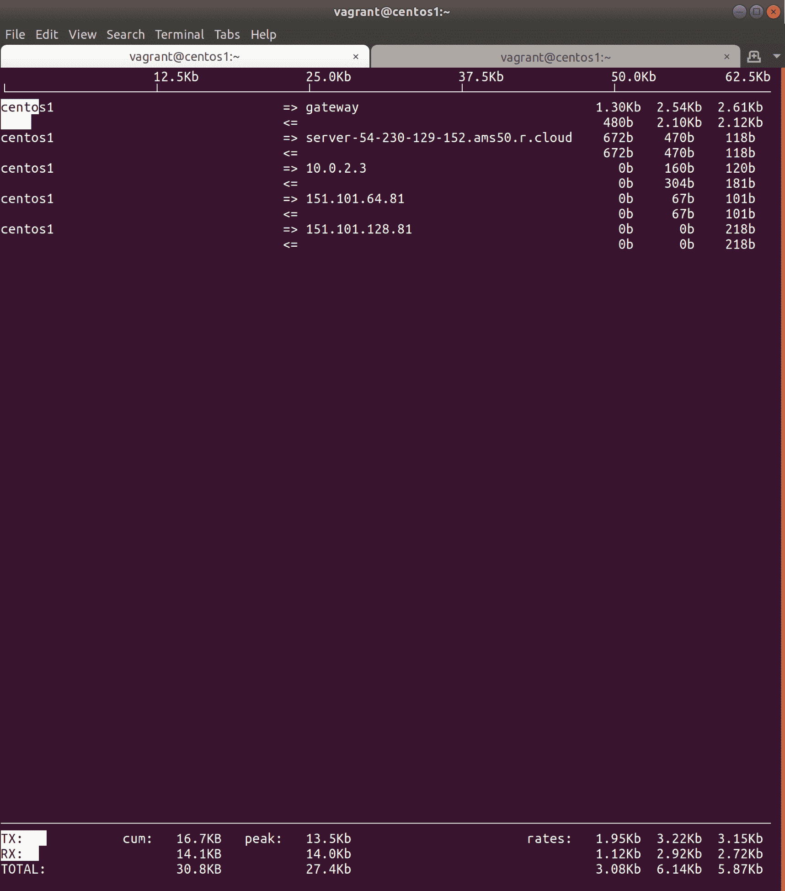

# 十二、故障排除和工作场所外交

在本章中，我们将研究以下主题:

*   什么是故障排除？
*   孤立真正的问题
*   给出估计并决定下一步行动
*   使用`ss`、`iftop`、`tcpdump`等解决网络问题
*   使用`curl`、`wget`和`openssl`解决远程网络问题
*   使用`itop`、`top`和`vmstat`解决本地资源问题
*   使用`ps`、`lsof`、`strace`和`/proc`解决服务问题
*   为以后的调试复制问题
*   临时解决方案以及何时调用它们
*   处理愤怒的开发人员
*   处理愤怒的经理
*   处理愤怒的企业主

# 介绍

在这一章中，我们将开始讨论我们所看到的技术方面。我们不会过多地考虑新的服务和软件，我们使用的软件将主要是那些我们已经在其他领域介绍过的工具(这里我们将只讨论何时以及如何使用它们)。

故障排除是本章的主要重点，也非常强调故障排除的通信方面。你可以成为世界上最好的工程师，一个文字上的密语者，然而如果你不能以别人能理解的方式传达你的发现，你的所有能力都将化为乌有。

当你在额外时间或不足的情况下解决问题时，你必须确保你所学的东西被正确记录下来(即使最初是在一张纸上，后来是在一个文档存储库中，如合流)，这样，如果它再次发生，不是你的人将能够更快地知道发生了什么，并有望更快地解决问题。

在您进行故障排除时，让周围的人了解正在发生的事情也是值得的。这些年来，我已经看到了各种各样的解决方法，但如今，让人们保持关注的一个更常见的解决方案似乎是火箭。聊天或休闲频道，您可以在其中发布公告和信息。这样，任何人都可以随时了解情况，即使只是因为一时的兴趣。

是的，在某些情况下，您正在进行故障排除，有人希望每五分钟更新一次正在发生的事情。这可能是客户、经理、开发人员或企业主，但在这些情况下保持冷静、不感到压力很重要，并确保你的答案简洁明了，没有太多猜测。

# 技术要求

我们在本章中所做的一切都可以使用单个节点来完成；在这种情况下，我使用的是 CentOS 机器。

请随意使用`Vagrantfile`一起玩:

```sh
# -*- mode: ruby -*-
# vi: set ft=ruby :

Vagrant.configure("2") do |config|

  config.vm.define "centos1" do |centos1|
    centos1.vm.box = "centos/7"
    centos1.vm.network "private_network", ip: "192.168.33.10"
    centos1.vm.hostname = "centos1"
    centos1.vm.box_version = "1804.02"
  end

end
```

# 什么是故障排除？

**故障排除**，或**调试**(更常用于特定软件)，是试图找出解决方案当前出了什么问题或某个事件中历史上出了什么问题的行为。这个事件可以是任何事情，从数据中心的整个网络瘫痪，到找出为什么一个 Docker 容器突然决定像网球一样上下弹跳。

没有一个软件是完美的。如果是这样的话，我们都会失业，这是因为这个简单的事实陈述，你几乎不可避免地会发现自己在生活的某个时刻面临着一个破碎的系统，有人尖叫着要你修复它。

在此之前，您可以尽一切努力确保您永远不会遇到生产中断之类的情况，包括使用多个环境和通过升级管道测试变更。但我可以保证，你永远不会解释所有的事情，而且，正如大多数公司会告诉你的那样，生产中也会出现问题。你只需要希望当问题真的发生时，你不会在凌晨两点被叫醒去解决它们，因为你是随叫随到的工程师。

# 怎么做...

排除问题时，首先要采取一些重要的步骤:

1.  喝一杯你自己选择的饮料，或者很好地请某人为你做一杯(如果事件如此严重，需要立即做出反应)。尽量避免这种饮料含有酒精。我通常去喝茶。
2.  确保您知道是什么引起了警报。通常，这将来自监控系统，或者电话另一端惊慌失措的值班工程师。这是下一步的良好起点。
3.  得到问题的影响；例如，这是否意味着网站关闭，没有人可以进行他们的圣诞购物，或者路由来电支持电话的系统关闭了？这将帮助你评估问题的重要性。

There is a difference between people not being able to call into the support desk at three in the morning, and a traffic routing system for a small municipality being down. Surprisingly, though, some people will panic the exact same amount, no matter the scale of the issue. 

4.  一旦这些事情被确定，继续隔离真正的问题。

# 孤立真正的问题

当你在排除故障时，或者你遇到了一个明显的问题，由你来解决问题，重要的是不要急于下结论。看到一个问题，比如一个网站被关闭，马上就会想，*啊，这个我以前见过；也就是那个时候，数据库有太多的行需要计数，网站慢到了爬行的速度——我会在那里寻找*。

闪电确实会在计算中出现两次，尤其是在根本原因尚未解决的情况下，但这是一种反故障排除技术，可以根据与过去问题的暂时相似性，立即假设您知道问题的原因。

# 准备好了

在你获得了关于这个问题的尽可能多的信息后，无论是从你自己对症状的粗略浏览(网站关闭)还是从纠缠你的支持者那里，是时候进入隔离的问题了。

一定要为自己重现这个问题。这是一个重要的、经常被忽视的步骤，任何人在调查一个问题时都应该采取。如果你有办法重现一个问题，你应该从这样做开始，即使这很简单，在你的浏览器中转到公司的网址，自己检查网站没有加载。这一点很重要，因为它给了你一个开始的基础，每次你做出改变，或者相信你已经解决了问题，你都可以使用同样的一系列步骤。如果你能确认问题存在，努力解决上述问题。然后，证明它至少对你是固定的，之后你可以开始让其他人参与这个过程，并要求他们确认同样的事情。

在黑暗中捅刀子不仅会让你有失去手指的风险，还会让你难以置信地难以确定你所创造的机会何时或是否真的产生了影响。

You might also find that in recreating the issue for yourself, you come across some pertinent information that hasn't been readily shared with you. "The website is down" is a vague statement, but "the website is timing out" is more informative, and if you go to a site to find it's been hijacked by someone using it to share pictures of their cat, then it might not be down, but the URL could be compromised. 

# 怎么做...

一旦这个问题被重现，你就可以进入正题了:

1.  首先，你需要知道哪些盒子可能与问题有关，要么是直接的，要么是通过某种程度的分离。例如，如果公司网站关闭，我会立即登录托管该网站的任何系统，同时尝试查找提供该网站的任何系统的信息，例如消息代理或数据库。
2.  如果您不知道部署的拓扑结构是什么样的，并且在内部系统中找不到详细说明布局的文档，那么让其他人参与故障排除过程可能是个好主意。

You might not feel entirely comfortable about waking someone else up in the middle of the night, or pestering someone at their desk, but if it would take you literally hours to reverse-engineer a setup, and it's definitely worth considering circumventing this effort and going to the source instead. If the other person is reasonable, they'll probably offer their knowledge, though they may be grumpy about it, and you'll have to apologise the next time you see them.

3.  一旦你确定你已经有了所有你可能需要检查的系统，或者更好的是，在记事本上，你应该开始隔离。取决于你有多幸运，这可能是一个快速或缓慢的过程。
4.  使用网络服务器和网站关闭的例子，你可能会尝试 SSH 到你的公司网站框，发现你不能。这可能意味着两件事之一:
    *   网络问题阻碍了交流
    *   盒子放下了
5.  这些问题看似广泛，但很容易被孤立。这里的下一步是尝试 SSH 到另一个盒子，最好是在同一个网络中，如果你能连接到它，你已经缩小了问题的范围。这表明第一个盒子坏了，或者遇到了个人网络问题。
6.  假设你不能到达另一个盒子，你应该尝试另一对来确定，如果你也不能到达它们，可能是时候让你的网络团队参与进来了(或者如果你有能力这样做，自己登录交换机或路由器)。
7.  如果您已经确定有一两个盒子有问题，您可能需要让数据中心工程师介入(或者亲自开车，如果这是您的工作)并直接插入盒子。如果这是一个云解决方案，那么是时候打开您可以访问的任何控制台，并以这种方式检查明显的问题了。
8.  一旦你在盒子上，检查相同的问题是否可以在盒子上本地重新创建是一个好主意。一会儿我们将讨论你可能做这件事的方法。
9.  如果您完成了故障排除步骤并确定本地盒不是问题，那么是时候向外工作并测试解决方案中您尚未检查或可能无法直接控制的其他部分了。

People have different techniques when it comes to troubleshooting, but I like to check the stuff I have direct access and control over first. There's a good chance for certain issues that problems are being caused by external factors (such as your distributed content delivery provider having problems), but in cases such as these, it's a good idea to try to prove external factors as much as possible before you get on the phone yourself and start blaming other people. 

10.  检查问题来源的下一个最有可能的候选项(可能是 web 服务器前面的负载平衡器，也可能是它后面的数据库)，并继续下去，直到发现一些不正常的行为。

# 给出估计并决定下一步行动

在故障排除过程中，最好边走边记笔记，并记录事件中的重要时间:

*   该事件首次报道是什么时候？
*   您是什么时候开始进行故障排除的？
*   你什么时候发现这个问题的？
*   相关信息是什么时候发现的？
*   等等

另一件需要注意的是**估计**。在很多情况下，估计是上级喜欢听到的，因为这意味着他们可以将估计传递给自己的上级或客户。

如果你还不清楚是什么导致了问题，你就不能给出一个可靠的估计，你应该解释这一点。但是，如果您设法隔离了该问题，并发现它是由诸如针对数据库运行的存储过程之类的原因引起的，那么在这种情况下可能会给出一个粗略的估计。由于各种因素，决定下一步可能很棘手，我们将在这里看到。

# 准备好了

使用上一个配方中的示例，您发现您正在查看的网站运行缓慢，因为有一个针对数据库运行的存储过程。您已经确定该存储过程每周运行一次，并且它在上周日成功运行，在那里大约花了一个小时完成，然后一切恢复正常，并且没有触发任何警报。

然而，现在已经一个半小时了，没有明显的迹象表明存储过程完成了它的运行。你应该记下你发现了什么，记下你发现它的时间，并告诉任何你需要的人你相信你已经找到了问题的根源。

Try to avoid using phrases such as "it's definitely this" or "I've found the problem," because those kinds of absolutes only succeed in making you look foolish and potentially making other people angry when they turn out to be red herrings. 

# 怎么做...

估计可能很容易，也可能非常困难。我不建议把数字从空气中拿出来，因为当你最终挥舞着自己设定的截止日期时，它们会让你看起来无能。不过，你可以查一下历史记录:

1.  如果您的存储过程正在运行并需要一段时间，请从查看日志开始，并尝试确定最近几次运行花费了多长时间。数据越多越好。
    如果您的日志可以追溯到两年前，并且您可以看到存储过程在其生命之初运行了几分钟，当时公司很小，数据库也很小，那么您可能会开始构建一个工作运行时间越长，数据库就越大的图片。您可以通过检查图表中的每次运行来确认这一点，并查看所用时间的增加是否与大小相关。在这一点上，你可能能够得出一个你知道大概是什么时候工作会完成的数字。
2.  但是，如果这些历史日志显示存储过程总是在相同的时间内同时运行，那么您可能会开始认为是其他原因导致了处理时间的突然增加。你应该注意到这一点，并决定下一步做什么。

It goes without saying, but checking specific process logs (if they exist) is also a must in situations such as this, as is reading through and understanding what the script or stored procedure might do. Again, if you need to get others involved, make a judgement call, but don't try and shoulder absolutely everything yourself, as this only results in more pressure and more stress.

在这种情况下，您必须开始考虑数据库之外可能影响处理时间的因素:

*   最近有没有什么工作可能改变了存储过程的工作方式(查看 Git 日志)？
*   最近是否有人登录该框并进行更改(检查审核日志)？
*   数据库服务器上是否有其他可能影响性能的运行(查看顶部的流程信息)？

由你来决定这些事情的优先级，并一次一个地解决它们。

3.  回到估算问题:如果您已经确定问题的原因是代码更改，并且您需要回滚到早期版本，那么再次提供估算不是不可能的。您应该知道构建一个包需要多长时间，以及在服务重新启动之前多久会部署到盒子中。
4.  不过，归根结底，“*需要多久就需要多久”*这句格言是对的，尽管最好不要对缠着你要答案的人说这句话。更温和地让他们失望，并向他们保证你正在努力...给他们看你的笔记。

# 还有更多...

很多地方都有时间表，规定了事故中应该发生的事情，例如:

*   如果问题在一小时内持续，请仅通知指定的个人
*   如果问题持续时间超过一个小时或两个小时，请告知利益相关方
*   如果问题看起来可能会让系统离线更长时间，请每三十分钟安排一次会议，让利益相关方了解最新情况

Though not consistent anywhere I've worked, good companies have plans in place to make sure everyone is on the same page, and better places don't invite the troubleshooting engineers to these meetings, instead designating a liaison who gets the information from the engineers while they're working.

# 使用 ss、iftop、tcpdump 等解决网络问题

在这个食谱中，我们将列出一些可以用来隔离和调试网络问题的工具，其中大部分可以在常见发行版的默认存储库中找到。

这些工具中的很多(如果不是全部的话)在本书之前已经介绍过了，但是一遍又一遍地重复这些工具是一个好主意，因为您会发现自己在故障排除场景中所做的 20%的事情是试图记住哪种工具适合解决这个特定的问题。

# 准备好

在本食谱中，请随意尝试列出的部分或全部命令(或者甚至脱离脚本，阅读相关手册页)。我们将使用中央操作系统虚拟机。

到您的中央操作系统虚拟机的 SSH:

```sh
$ vagrant ssh centos1
```

安装我们将使用的两个工具:

```sh
$ sudo yum install epel-release -y
$ sudo yum install iftop tcpdump -y
```

# 怎么做...

我们将依次检查我们的工具。

# 砰

如果您认为自己遇到了网络问题，`ping`命令是您可以使用的最古老的工具之一，也是您最好的朋友之一:

1.  首先，确保您的网络已经启动，ping 通您的环回地址和您自己的节点 IP。我们将检查本地主机是否工作:

```sh
$ ping 127.0.0.1
PING 127.0.0.1 (127.0.0.1) 56(84) bytes of data.
64 bytes from 127.0.0.1: icmp_seq=1 ttl=64 time=0.044 ms
64 bytes from 127.0.0.1: icmp_seq=2 ttl=64 time=0.081 ms
64 bytes from 127.0.0.1: icmp_seq=3 ttl=64 time=0.086 ms
--- 127.0.0.1 ping statistics ---
3 packets transmitted, 3 received, 0% packet loss, time 1999ms
rtt min/avg/max/mdev = 0.044/0.070/0.086/0.019 ms
```

2.  然后，查看您的`Eth1`地址:

```sh
$ ping 192.168.33.10
PING 192.168.33.10 (192.168.33.10) 56(84) bytes of data.
64 bytes from 192.168.33.10: icmp_seq=1 ttl=64 time=0.064 ms
64 bytes from 192.168.33.10: icmp_seq=2 ttl=64 time=0.069 ms
64 bytes from 192.168.33.10: icmp_seq=3 ttl=64 time=0.098 ms
--- 192.168.33.10 ping statistics ---
3 packets transmitted, 3 received, 0% packet loss, time 2008ms
rtt min/avg/max/mdev = 0.064/0.077/0.098/0.015 ms
```

3.  现在，您已经确定网络堆栈已建立，请检查您是否可以与路由器通话。如果您不知道路由器的 IP 地址，请首先获取该地址:

```sh
$ ip route | grep default
default via 10.0.2.2 dev eth0 proto dhcp metric 102
```

4.  我们现在将 ping 该 IP:

```sh
$ ping 10.0.2.2
PING 10.0.2.2 (10.0.2.2) 56(84) bytes of data.
64 bytes from 10.0.2.2: icmp_seq=1 ttl=64 time=0.473 ms
64 bytes from 10.0.2.2: icmp_seq=2 ttl=64 time=0.861 ms
64 bytes from 10.0.2.2: icmp_seq=3 ttl=64 time=0.451 ms
--- 10.0.2.2 ping statistics ---
3 packets transmitted, 3 received, 0% packet loss, time 2016ms
rtt min/avg/max/mdev = 0.451/0.595/0.861/0.188 ms
```

太棒了。我们相对确定我们的实际数据包路由是正确的。

5.  接下来，使用`ping`命令检查您的 DNS 是否工作:

```sh
$ ping bbc.co.uk
PING bbc.co.uk (151.101.192.81) 56(84) bytes of data.
64 bytes from 151.101.192.81 (151.101.192.81): icmp_seq=1 ttl=63 time=43.9 ms
64 bytes from 151.101.192.81 (151.101.192.81): icmp_seq=2 ttl=63 time=31.5 ms
64 bytes from 151.101.192.81 (151.101.192.81): icmp_seq=3 ttl=63 time=38.4 ms
--- bbc.co.uk ping statistics ---
3 packets transmitted, 3 received, 0% packet loss, time 2017ms
rtt min/avg/max/mdev = 31.545/37.973/43.910/5.059 ms
```

酷，所以我们知道我们可以将域名解析为 IPs。

Should name resolution not work for some reason, try checking that your `/etc/resolv.conf` actually has a `nameserver` entry in it, and try pinging that server to see whether you can actually reach it for communication. DNS resolution failures can have weird knock-on effects (such as slow SSH connections on some default installations).

Ping 很棒，遇到的很多问题都可以立即追踪到，这得益于它的简单性。

# 悬浮物

`ss`非常适合本地端口检查，因为我可能已经在本书中多次提到过:

1.  如果您的机器上有一个 web 服务器，并且您知道它应该在端口`80`上运行，那么您可能会发现自己首先使用了`fish`参数，不管:

```sh
$ ss -tuna
Netid State Recv-Q Send-Q Local Address:Port Peer Address:Port 
udp UNCONN 0 0 *:733 *:* 
udp UNCONN 0 0 127.0.0.1:323 *:* 
udp UNCONN 0 0 *:68 *:* 
udp UNCONN 0 0 *:111 *:* 
udp UNCONN 0 0 :::733 :::* 
udp UNCONN 0 0 ::1:323 :::* 
udp UNCONN 0 0 :::111 :::* 
tcp LISTEN 0 128 *:111 *:* 
tcp LISTEN 0 128 *:22 *:* 
tcp LISTEN 0 100 127.0.0.1:25 *:* 
tcp ESTAB 0 0 10.0.2.15:22 10.0.2.2:51224 
tcp LISTEN 0 128 :::111 :::* 
tcp LISTEN 0 128 :::22 :::* 
tcp LISTEN 0 100 ::1:25 :::*
```

在某些情况下，我们会立即这样做，只是为了概述盒子认为它在知识产权网络方面正在做什么。

我们可以看到哪些端口是活动的，并在盒子上监听，立即排除常见的可疑点(如`22`和`25`)，我们还可以从远程连接看到已连接的(ESTAB)会话，在本例中是我的机器。

You can also run `ss` without the -n argument, if you want to see a best-guess at service names. I call it "best-guess" because all `ss` will do is read the `/etc/services` file and match a port to a name, but there's no guarantee that SSH is really running on `22`, instead of `2323` or something else.

2.  您也可以使用`ss`来获得机器当前网络状况的快照:

```sh
$ ss -s
Total: 194 (kernel 0)
TCP: 7 (estab 1, closed 0, orphaned 0, synrecv 0, timewait 0/0), ports 0

Transport Total IP IPv6
* 0 - - 
RAW 0 0 0 
UDP 7 4 3 
TCP 7 4 3 
INET 14 8 6 
FRAG 0 0 0 
```

# iftop

这是这个食谱中第一个默认情况下不太可能安装的工具；在故障排除过程中，我们有时会来到`iftop`，因为这对可视化非常有用。人类倾向于喜欢可视化。我们是简单的生物，有着简单的梦，这些梦通常色彩鲜明，并有令人困惑的图表(如果你是我)。

因此，当计算机更喜欢字符串和结构时，我们倾向于喜欢我们正在看的东西的良好表示，并且`iftop`给了我们这个:

```sh
$ sudo iftop
```

我们在这里生成了一些流量，流向三个不同的位置，以展示查看不同来源和通信是多么容易:



在这本书里我们很早就进入`iftop`了，但是记住它是存在的！

# tcpdump

我们之前用过的另一个工具是`tcpdump`；它打印并保存网络流量，以便稍后或此时进行调试:

```sh
$ sudo tcpdump not port 22
tcpdump: verbose output suppressed, use -v or -vv for full protocol decode
listening on eth0, link-type EN10MB (Ethernet), capture size 262144 bytes
15:26:48.864239 IP centos1 > server-54-230-129-152.ams50.r.cloudfront.net: ICMP echo request, id 3927, seq 284, length 64
15:26:48.866009 IP centos1.46283 > 10.0.2.3.domain: 32699+ PTR? 152.129.230.54.in-addr.arpa. (45)
15:26:48.899019 IP 10.0.2.3.domain > centos1.46283: 32699 1/0/0 PTR server-54-230-129-152.ams50.r.cloudfront.net. (103)
15:26:48.899678 IP centos1.44944 > 10.0.2.3.domain: 7093+ PTR? 15.2.0.10.in-addr.arpa. (40)
15:26:48.900853 IP 10.0.2.3.domain > centos1.44944: 7093 NXDomain 0/0/0 (40)
15:26:48.903765 IP centos1.37253 > 10.0.2.3.domain: 25988+ PTR? 3.2.0.10.in-addr.arpa. (39)
15:26:48.911352 IP server-54-230-129-152.ams50.r.cloudfront.net > centos1: ICMP echo reply, id 3927, seq 284, length 64
15:26:48.964402 IP 10.0.2.3.domain > centos1.37253: 25988 NXDomain 0/0/0 (39)
15:26:49.869214 IP centos1 > server-54-230-129-152.ams50.r.cloudfront.net: ICMP echo request, id 3927, seq 285, length 64
15:26:49.909387 IP server-54-230-129-152.ams50.r.cloudfront.net > centos1: ICMP echo reply, id 3927, seq 285, length 64
15:26:50.875756 IP centos1 > server-54-230-129-152.ams50.r.cloudfront.net: ICMP echo request, id 3927, seq 286, length 64
15:26:50.913753 IP server-54-230-129-152.ams50.r.cloudfront.net > centos1: ICMP echo reply, id 3927, seq 286, length 64
15:26:51.881191 IP centos1 > server-54-230-129-152.ams50.r.cloudfront.net: ICMP echo request, id 3927, seq 287, length 64
15:26:51.927357 IP server-54-230-129-152.ams50.r.cloudfront.net > centos1: ICMP echo reply, id 3927, seq 287, length 64
^C
14 packets captured
14 packets received by filter
0 packets dropped by kernel
```

注意前面的例子，我专门运行了`tcpdump`但是排除了 SSH 流量:

```sh
$ sudo tcpdump not port 22
```

结果，我得到了第二次会话 ping 请求的大量信息，但最关键的是，我避免了 SSH 流量的噪音。(这将是额外的噪音，因为每次有东西被打印到我的会话中，这就是 SSH 流量，这意味着它会不断增长。)

虽然如果我们确实想调试 SSH，这是可能的，而且非常容易，因为`tcpdump`允许您输出到一个文件:

```sh
$ sudo tcpdump port 22 -w ssh-traffic.pcap
tcpdump: listening on eth0, link-type EN10MB (Ethernet), capture size 262144 bytes
^C3 packets captured
5 packets received by filter
0 packets dropped by kernel
```

然后可以使用 Wireshark:[https://www.wireshark.org/](https://www.wireshark.org/)等工具打开和读取该文件。

# 使用 cURL、wget 和 OpenSSL 解决远程 web 问题

如果您在漫长的故障排除过程中得出结论，认为您面临的问题是以下问题之一，那么以下一些工具可能适合您:

*   与远程站点的连接有关
*   与远程站点相关的证书有关

# 准备好

到您的中央操作系统虚拟机的 SSH:

```sh
$ vagrant ssh centos1
```

cURL and OpenSSL should be universal at this point, and you can expect a system to have them by default. 

Wget 有点难以捉摸，并且很少是默认安装的一部分，但是它很容易安装:

```sh
$ sudo yum install wget -y
```

At the moment, OpenSSL is everywhere, but due to a string of high-profile vulnerabilities, *cough* heartbleed *cough*, it has been forked a couple of times to produce approximations, though hopefully approximations with a limited number of problems. The most famous of these is `LibreSSL` by the OpenBSD folks, and while it's the default in that particular OS, it's unlikely to be the default in CentOS or Ubuntu any time soon.

对于本食谱中的示例，我们还将打破互联网某些关键领域的信任(不过，只限于您的虚拟机本地，不要担心)。为此，您可以运行以下命令:

```sh
$ sudo mv /etc/pki/ /etc/pki-backup
```

# 怎么做...

我们将介绍这三个程序，包括你如何使用它们的例子。

# 卷曲

如果你曾经使用过任何类型的开源操作系统，那么 CUlR 很有可能被捆绑在它旁边，因此你会在许可协议页面下找到它的许可协议(像游戏控制台、智能汽车和冰箱这样的东西通常都有一个 CUlR 版本)。然而，它通常可以在命令行上使用，因此，它是许多管理员的最爱。这在一定程度上是因为 cURL 提供了一个广泛(且非常详细)的退出代码列表:

1.  例如，卷曲英国广播公司的结果如下:

```sh
$ curl bbc.co.uk
$ echo $?
0
```

`curl`命令成功了，所以我们得到了一个`0`退出代码，它几乎普遍意味着 OK。

我们可以尝试`curl`一个非法的网址:

```sh
$ curl bbc.co.uks
curl: (6) Could not resolve host: bbc.co.uks; Unknown error
$ echo $?
6
```

在这里，我们得到一个`6`退出代码。这在 cURL 手册中定义如下:

```sh
 6      Couldn't resolve host. The given remote host was not resolved.
```

2.  另一个你会看到经常使用的流行标志是`-I`:

```sh
$ curl -I bbc.co.uk
HTTP/1.1 301 Moved Permanently
Server: Varnish
Retry-After: 0
Content-Length: 0
Accept-Ranges: bytes
Date: Sun, 09 Dec 2018 15:25:09 GMT
Via: 1.1 varnish
Connection: close
X-Served-By: cache-lcy19221-LCY
X-Cache: MISS
X-Cache-Hits: 0
X-Timer: S1544369109.457379,VS0,VE0
Location: http://www.bbc.co.uk/
cache-control: public, max-age=3600
```

你看到的是我们试图点击的网站的标题。这立刻告诉我们一些事情:

*   我们实际上得到一个`301`，将我们重定向到一个不同的地址
*   我们遇到了一个`varnish`服务器(一个流行的缓存服务器)

如果我们尝试在 HTTPS 上点击英国广播公司，并使用`www`子域，我们会得到以下退出代码:

```sh
$ curl -I https://www.bbc.co.uk
curl: (77) Problem with the SSL CA cert (path? access rights?)
```

最关键的是，这是因为 cURL 无法访问**证书颁发机构** ( **CA** )，因为我们移动了系统上唯一的颁发机构，在本章的开头。有益的是，它甚至在输出中给出了退出代码，以及它认为问题所在的细节。

3.  这给我们带来了另一个 cURL 选项`-k`:

```sh
$ curl -k -I https://www.bbc.co.uk
HTTP/1.1 200 OK
Content-Type: text/html; charset=utf-8
ETag: W/"48dfc-dDZDVBqnqFbBCKLot3DWVM1tjvM"
X-Frame-Options: SAMEORIGIN
<SNIP>
X-Cache-Hits: 513
X-Cache-Age: 90
Cache-Control: private, max-age=0, must-revalidate
Vary: Accept-Encoding, X-CDN, X-BBC-Edge-Scheme
```

请注意，我们得到了一个`200 (OK)`响应，尽管无法访问 CA 来验证网站是否合法。`-k`用于设置不安全标志，参见 cURL 文档的以下部分(可在[【https://curl.haxx.se/docs/manpage.html】](https://curl.haxx.se/docs/manpage.html)[获得):](https://curl.haxx.se/docs/manpage.html)

-k-没有安全感

默认情况下，curl 建立的每个 SSL 连接都被验证为安全的。该选项允许 curl 继续运行，即使对于被认为不安全的服务器连接也是如此。

Obviously, using `-k` isn't advisable, ideal, or practical for everyday use. Instead, you should ensure that your CAs are up to date and the site you're trying to connect to isn't fraudulent.

4.  请立即更换您的证书颁发机构证书:

```sh
$ sudo mv /etc/pki-backup/ /etc/pki/
```

5.  您也可以使用`curl`通过使用`-o`选项下载远程文件(更换您的 CA 证书后，否则您将获得证书错误):

```sh
$ curl https://www.bbc.co.uk -o index.html
 % Total % Received % Xferd Average Speed Time Time Time Current
 Dload Upload Total Spent Left Speed
100 291k 100 291k 0 0 867k 0 --:--:-- --:--:-- --:--:-- 871k
$ ls -lh
total 292K
-rw-rw-r--. 1 vagrant vagrant 292K Dec 9 15:33 index.html
```

在这里，我们只需拉取整个页面，保存到本地`index.html`即可。

在故障排除和调试过程中也经常使用 cURL 与 REST APIs 对话；这是因为，从命令行，工程师或管理员可以轻松地创建自定义请求，并看到 web 服务器的输出。

# Wget

像 cURL 一样，Wget 是一个与网络服务器对话的工具。

默认情况下，输出相当冗长，会告诉您到底发生了什么:

```sh
$ wget bbc.co.uk
--2018-12-09 15:46:15-- http://bbc.co.uk/
Resolving bbc.co.uk (bbc.co.uk)... 151.101.128.81, 151.101.0.81, 151.101.64.81, ...
Connecting to bbc.co.uk (bbc.co.uk)|151.101.128.81|:80... connected.
HTTP request sent, awaiting response... 301 Moved Permanently
Location: http://www.bbc.co.uk/ [following]
--2018-12-09 15:46:15-- http://www.bbc.co.uk/
Resolving www.bbc.co.uk (www.bbc.co.uk)... 212.58.249.215, 212.58.244.27
Connecting to www.bbc.co.uk (www.bbc.co.uk)|212.58.249.215|:80... connected.
HTTP request sent, awaiting response... 301 Moved Permanently
Location: https://www.bbc.co.uk/ [following]
--2018-12-09 15:46:15-- https://www.bbc.co.uk/
Connecting to www.bbc.co.uk (www.bbc.co.uk)|212.58.249.215|:443... connected.
HTTP request sent, awaiting response... 200 OK
Length: 298285 (291K) [text/html]
Saving to: 'index.html.1'

100%[===========================================================>] 298,285 --.-K/s in 0.1s 

2018-12-09 15:46:15 (2.66 MB/s) - 'index.html.1' saved [298285/298285]
```

在这里，我们可以看到以下内容:

*   `wget`将网站解析为一个 IP 地址
*   连接并获得一个`301`告诉它站点已经移动
*   跟随站点到`http://www.bbc.co.uk`
*   获得另一个`301`告诉客户使用 HTTPS
*   跟随站点到`https://www.bbc.co.uk`
*   最后，连接，获得一个`200`，并立即下载 index.html(它保存到`index.html.1`，因为我们已经有一个来自`curl`)

由此，我们可以推断出，如果英国广播公司只是取消了其中一个重定向(直接指向 HTTPS)，那么它可以为每个请求节省几毫秒的时间，我们还了解到 wget 的默认行为是将内容保存在本地(而不是像 cURL 那样将内容吐到 stdout)。

`wget` also features an "insecure" flag in the form of `--no-check-certificate`, though I don't want to bang on about skipping certificate checks in this book (because they're important).

`wget`被发现是从网站下载多个文件、操纵我们正在下载的内容以及对内容运行校验和检查的理想选择。就我个人而言，我认为标志比 cURL 更直观一点，我发现本地下载文件的默认行为在故障排除时非常有用。

# OpenSSL

说到证书检查，没有比 OpenSSL 更好的工具了。

OpenSSL 用于创建证书和整个 CAs，也可以成为解决证书问题的优秀工具。

比如想快速查看一个网站的证书链，可以使用`s_client`:

```sh
$ openssl s_client -quiet -connect bbc.co.uk:443 
depth=2 C = BE, O = GlobalSign nv-sa, OU = Root CA, CN = GlobalSign Root CA
verify return:1
depth=1 C = BE, O = GlobalSign nv-sa, CN = GlobalSign Organization Validation CA - SHA256 - G2
verify return:1
depth=0 C = GB, ST = London, L = London, O = British Broadcasting Corporation, CN = www.bbc.com
verify return:1
```

这里可以看到`Root CA` (GlobalSign Root CA)，后面是`GlobalSign Organization Validation CA`，最后是`British Broadcasting Corporation`证书。还向我们展示了场地(`www.bbc.com`)的**俗名** ( **CN** )。

这实际上很有趣，因为我们在这样做的时候没有遵循重定向，所以我们实际上返回的是`bbc.co.uk`而不是`www.bbc.co.uk`使用的证书，如下所示:

```sh
$ openssl s_client -quiet -connect www.bbc.co.uk:443 
depth=2 C = BE, O = GlobalSign nv-sa, OU = Root CA, CN = GlobalSign Root CA
verify return:1
depth=1 C = BE, O = GlobalSign nv-sa, CN = GlobalSign Organization Validation CA - SHA256 - G2
verify return:1
depth=0 C = GB, ST = London, L = London, O = British Broadcasting Corporation, CN = *.bbc.co.uk
verify return:1
```

如果您想要链中证书的实际文本表示，您可以打印这些:

```sh
$ openssl s_client -showcerts -connect www.bbc.co.uk:443 
CONNECTED(00000003)
depth=2 C = BE, O = GlobalSign nv-sa, OU = Root CA, CN = GlobalSign Root CA
verify return:1
depth=1 C = BE, O = GlobalSign nv-sa, CN = GlobalSign Organization Validation CA - SHA256 - G2
verify return:1
depth=0 C = GB, ST = London, L = London, O = British Broadcasting Corporation, CN = *.bbc.co.uk
verify return:1
---
Certificate chain
 0 s:/C=GB/ST=London/L=London/O=British Broadcasting Corporation/CN=*.bbc.co.uk
 i:/C=BE/O=GlobalSign nv-sa/CN=GlobalSign Organization Validation CA - SHA256 - G2
-----BEGIN CERTIFICATE-----
MIIHDDCCBfSgAwIBAgIMRXeRavSdIQuVZRucMA0GCSqGSIb3DQEBCwUAMGYxCzAJ
BgNVBAYTAkJFMRkwFwYDVQQKExBHbG9iYWxTaWduIG52LXNhMTwwOgYDVQQDEzNH
<SNIP>
MNHQq0dFAyAa4lcxMjGe/Lfez46BoYQUoQNn8oFv5/xsSI5U3cuxPnKy0ilj1jfc
sDEmTARcxkQrFsFlt7mnmMmCVgEU6ywlqSuR7xg6RLo=
-----END CERTIFICATE-----
 1 s:/C=BE/O=GlobalSign nv-sa/CN=GlobalSign Organization Validation CA - SHA256 - G2
 i:/C=BE/O=GlobalSign nv-sa/OU=Root CA/CN=GlobalSign Root CA
-----BEGIN CERTIFICATE-----
MIIEaTCCA1GgAwIBAgILBAAAAAABRE7wQkcwDQYJKoZIhvcNAQELBQAwVzELMAkG
A1UEBhMCQkUxGTAXBgNVBAoTEEdsb2JhbFNpZ24gbnYtc2ExEDAOBgNVBAsTB1Jv
<SNIP>
SOlCdjSXVWkkDoPWoC209fN5ikkodBpBocLTJIg1MGCUF7ThBCIxPTsvFwayuJ2G
K1pp74P1S8SqtCr4fKGxhZSM9AyHDPSsQPhZSZg=
-----END CERTIFICATE-----
---
Server certificate
subject=/C=GB/ST=London/L=London/O=British Broadcasting Corporation/CN=*.bbc.co.uk
issuer=/C=BE/O=GlobalSign nv-sa/CN=GlobalSign Organization Validation CA - SHA256 - G2
---
No client certificate CA names sent
Peer signing digest: SHA256
<SNIP>
---
```

首先，我们得到 BBC 证书的文本表示，然后是中间 CA 的文本表示。

如果我们想测试并确保使用了安全协议，我们可以使用简单的标志:

1.  首先，我们将检查不安全的`sslv3`是否未启用:

```sh
$ openssl s_client -showcerts -connect bbc.co.uk:443 -ssl3
CONNECTED(00000003)
140015333689232:error:14094410:SSL routines:ssl3_read_bytes:sslv3 alert handshake failure:s3_pkt.c:1493:SSL alert number 40
140015333689232:error:1409E0E5:SSL routines:ssl3_write_bytes:ssl handshake failure:s3_pkt.c:659:
---
no peer certificate available
---
No client certificate CA names sent
---
SSL handshake has read 7 bytes and written 0 bytes
---
New, (NONE), Cipher is (NONE)
Secure Renegotiation IS NOT supported
Compression: NONE
Expansion: NONE
No ALPN negotiated
SSL-Session:
 Protocol : SSLv3
 Cipher : 0000
 Session-ID: 
 Session-ID-ctx: 
 Master-Key: 
 Key-Arg : None
 Krb5 Principal: None
 PSK identity: None
 PSK identity hint: None
 Start Time: 1544372823
 Timeout : 7200 (sec)
 Verify return code: 0 (ok)
---
```

这不管用(谢天谢地)。

2.  现在，我们将检查`TLS1.2`支持:

```sh
$ openssl s_client -showcerts -connect bbc.co.uk:443 -tls1_2
CONNECTED(00000003)
depth=2 C = BE, O = GlobalSign nv-sa, OU = Root CA, CN = GlobalSign Root CA
verify return:1
depth=1 C = BE, O = GlobalSign nv-sa, CN = GlobalSign Organization Validation CA - SHA256 - G2
verify return:1
depth=0 C = GB, ST = London, L = London, O = British Broadcasting Corporation, CN = www.bbc.com
verify return:1
---
Certificate chain
 0 s:/C=GB/ST=London/L=London/O=British Broadcasting Corporation/CN=www.bbc.com
 i:/C=BE/O=GlobalSign nv-sa/CN=GlobalSign Organization Validation CA - SHA256 - G2
-----BEGIN CERTIFICATE-----
MIIGnDCCBYSgAwIBAgIMIrGYrFe1HwATfmJWMA0GCSqGSIb3DQEBCwUAMGYxCzAJ
Y2FjZXJ0L2dzb3JnYW5pemF0aW9udmFsc2hhMmcycjEuY3J0MD8GCCsGAQUFBzAB
<SNIP>
J+k3TBG221H4c3ahePIfp7IzijJhdb7jZ21HHMSbJu4LN+C7Z3QuCQDnCJIGO3lr
YT7jN6sjN7FQXGEk+P0UNg==
-----END CERTIFICATE-----
 1 s:/C=BE/O=GlobalSign nv-sa/CN=GlobalSign Organization Validation CA - SHA256 - G2
 i:/C=BE/O=GlobalSign nv-sa/OU=Root CA/CN=GlobalSign Root CA
-----BEGIN CERTIFICATE-----
MIIEaTCCA1GgAwIBAgILBAAAAAABRE7wQkcwDQYJKoZIhvcNAQELBQAwVzELMAkG
A1UEBhMCQkUxGTAXBgNVBAoTEEdsb2JhbFNpZ24gbnYtc2ExEDAOBgNVBAsTB1Jv
<SNIP>
SOlCdjSXVWkkDoPWoC209fN5ikkodBpBocLTJIg1MGCUF7ThBCIxPTsvFwayuJ2G
K1pp74P1S8SqtCr4fKGxhZSM9AyHDPSsQPhZSZg=
-----END CERTIFICATE-----
---
Server certificate
subject=/C=GB/ST=London/L=London/O=British Broadcasting Corporation/CN=www.bbc.com
issuer=/C=BE/O=GlobalSign nv-sa/CN=GlobalSign Organization Validation CA - SHA256 - G2
---
No client certificate CA names sent
Peer signing digest: SHA512
Server Temp Key: ECDH, P-256, 256 bits
---
SSL handshake has read 3486 bytes and written 415 bytes
---
New, TLSv1/SSLv3, Cipher is ECDHE-RSA-AES128-GCM-SHA256
Server public key is 2048 bit
Secure Renegotiation IS supported
Compression: NONE
<SNIP>
---
```

唷！因此，我们已经确定我们可以与`bbc.co.uk`对话，并且我们看到的证书是有效的。但是如果我们想要那些证书的信息呢？

我们知道我们在打`bbc.co.uk`，然而证书 CN 是`www.bbc.com`；从逻辑上讲，这应该会导致您的浏览器出现证书错误，那么为什么没有呢？

3.  让我们检查一下！

```sh
$ openssl s_client -connect bbc.co.uk:443 | openssl x509 -text | grep DNS
depth=2 C = BE, O = GlobalSign nv-sa, OU = Root CA, CN = GlobalSign Root CA
verify return:1
depth=1 C = BE, O = GlobalSign nv-sa, CN = GlobalSign Organization Validation CA - SHA256 - G2
verify return:1
depth=0 C = GB, ST = London, L = London, O = British Broadcasting Corporation, CN = www.bbc.com
verify return:1
 DNS:www.bbc.com, DNS:fig.bbc.co.uk, DNS:bbc.co.uk, DNS:www.bbc.co.uk, DNS:news.bbc.co.uk, DNS:m.bbc.co.uk, DNS:m.bbc.com, DNS:bbc.com
```

在这里，我们再次将`s_client`命令的输出传送到 OpenSSL 中。然后，我们使用`x509`(证书管理工具)输出证书的文本信息(从之前看到的文本片段中解码)，然后我们为域名系统打包。

具体来说，域名系统通常位于这个标题下:

```sh
            X509v3 Subject Alternative Name: 
                DNS:www.bbc.com, DNS:fig.bbc.co.uk, DNS:bbc.co.uk, DNS:www.bbc.co.uk, DNS:news.bbc.co.uk, DNS:m.bbc.co.uk, DNS:m.bbc.com, DNS:bbc.com
```

**主题替代名称** ( **SANs** )是本证书可以涵盖的替代名称。其中一个名字是`bbc.co.uk`，另一个名字是`www.bbc.co.uk`。还有一个`news`和几个**移动** ( **m** )条目(大概是出于历史原因)。

OpenSSL 不是很酷吗？

...当它没有引起大规模的歇斯底里时。

# 使用 iotop、top 和 vmstat 解决本地资源问题

同样，这些是我们之前肯定介绍过的更多工具，但是在解决本地问题时，特别是那些与资源相关的问题时，这些工具会非常方便。

# 准备好了

到您的中央操作系统虚拟机的 SSH:

```sh
$ vagrant ssh centos1
```

安装适当的软件包:

```sh
$ sudo yum install iotop -y
```

# 怎么做...

我们将简要介绍这些工具，但希望您已经从本书的其余部分了解了它们的基本用法。

# iotop

通过以下命令调用，`iotop`按进程显示系统上的输入/输出使用情况:

```sh
$ sudo iotop
```

在我们的系统上，这意味着我们在活动的方式上看不到什么(因为默认情况下虚拟机做的不多):


与`ps`一样，线程(例如`"[kthrotld]"`)周围的方括号表示内核线程。

如果我们希望看到输入/输出运行，我们可以在另一个会话中执行以下操作:

```sh
$ fallocate -l 2G examplefile
$ rsync -z -P --bwlimit=2M examplefile examplefile-copied
```

We're specifically compressing and bandwidth, limiting the transfer of the preceding file. We've also got a -P in there, but that's mostly so that you can see what's happening as it happens.

在我们的第一个会话(`iotop`)中，我们应该看到 rsync 命令正在运行:


注意最上面一行是我们的命令，显示我们的具体`DISK WRITEs`为 95.21 米/秒

# 顶端

您可能已经多次使用 top 了，以至于您已经厌倦了阅读它，并且您可能非常了解它有多有用，尽管它的调用很简单。

```sh
$ top
```

top 在 UNIX 系统中非常通用，它为您提供了系统中进程使用的近乎实时的表示:


说到故障排除，高层一般是不可或缺的。top 不仅有助于一目了然地看到进程、内存和中央处理器信息，而且占用空间极小，这意味着它很可能在看似呈指数级竞争的系统上工作。

Even if you prefer top alternatives, such as `htop` or glances, there's no guarantee that these programs will be available on each and every system you touch. Because of this, it's a good idea to become familiar with top, then fall back to alternatives once you're sure you can use it properly (or at least passably!).

# vmstat

在竞争非常激烈的系统上，或者您可能希望输出系统信息以供以后关联和调试的系统上，vmstat 是理想的选择。让您更全面地了解您的系统，将周期值存储到文件中会很方便，您可以稍后检查该文件:

1.  当独立运行时，也可以将其设置为定期打印到屏幕:

```sh
$ vmstat -t 3
procs -----------memory---------- ---swap-- -----io---- -system-- ------cpu----- -----timestamp-----
 r b swpd free buff cache si so bi bo in cs us sy id wa st UTC
 2 0 0 15072 164 419900 0 0 1 12 11 11 0 0 100 0 0 2018-12-11 15:40:46
 0 0 0 15084 164 419900 0 0 0 0 15 12 0 0 100 0 0 2018-12-11 15:40:49
 0 0 0 15084 164 419900 0 0 0 0 11 9 0 0 100 0 0 2018-12-11 15:40:52
 0 0 0 15084 164 419900 0 0 0 0 11 10 0 0 100 0 0 2018-12-11 15:40:55
 0 0 0 15084 164 419900 0 0 0 0 10 8 0 0 100 0 0 2018-12-11 15:40:58
 0 0 0 15084 164 419900 0 0 0 0 15 12 0 0 100 0 0 2018-12-11 15:41:01
...
```

2.  输出到文件也一样容易；只需重定向`stdout`:

```sh
$ vmstat -t 3 > vmstats
^C
$ cat vmstats 
procs -----------memory---------- ---swap-- -----io---- -system-- ------cpu----- -----timestamp-----
 r b swpd free buff cache si so bi bo in cs us sy id wa st UTC
 1 0 0 11848 164 423132 0 0 1 12 11 11 0 0 100 0 0 2018-12-11 15:43:35
 0 0 0 11856 164 423136 0 0 0 0 17 12 0 0 100 0 0 2018-12-11 15:43:38
 0 0 0 11856 164 423136 0 0 0 1 15 19 0 0 100 0 0 2018-12-11 15:43:41
 0 0 0 11856 164 423136 0 0 0 0 14 11 0 0 100 0 0 2018-12-11 15:43:44
```

# 使用 ps、lsof、Strace 和/proc 解决服务问题

`ps`、`lsof`、`strace`、`/proc`都是火灾下排除故障的宝贵工具。它们可以显示出你想都没想过要在一百万年内寻找的东西，而且它们还可以比你自己更快地完成某些任务。

`strace`可能是这些工具中最常被忽视的，也很容易成为最难学好的工具之一，但对于程序调试来说，它应该永远在你的脑海中。

Personally, I generally forget about `strace` quite a lot, that is until someone wanders over and asks me why I'm trying to debug something in the most awkward way possible, before reminding me that `strace` is a thing that exists.

# 准备好

到您的中央操作系统虚拟机的 SSH:

```sh
$ vagrant ssh centos1
```

安装本节`lsof`(其他应已安装):

```sh
$ sudo yum install lsof -y
```

# 怎么做...

依次运行我们的每个命令，让我们非常快速地进行我们的`ps`纲要！

# 著名图象处理软件

用于显示系统上当前进程的`snapshot`的`ps`，对于许多管理员来说是第一个调用端口，这是有充分理由的:

```sh
$ ps -ef
UID PID PPID C STIME TTY TIME CMD
root 1 0 0 Dec09 ? 00:00:03 /usr/lib/systemd/systemd --switched-root --system --d
root 2 0 0 Dec09 ? 00:00:00 [kthreadd]
root 3 2 0 Dec09 ? 00:00:01 [ksoftirqd/0]
root 5 2 0 Dec09 ? 00:00:00 [kworker/0:0H]
root 7 2 0 Dec09 ? 00:00:00 [migration/0]
root 8 2 0 Dec09 ? 00:00:00 [rcu_bh]
root 9 2 0 Dec09 ? 00:00:01 [rcu_sched]
<SNIP>
root 2690 2 0 15:28 ? 00:00:01 [kworker/0:1]
postfix 2756 1065 0 15:42 ? 00:00:00 pickup -l -t unix -u
root 2759 2 0 15:43 ? 00:00:00 [kworker/0:2]
root 2783 2 0 15:48 ? 00:00:00 [kworker/0:0]
vagrant 2800 2636 0 15:50 pts/0 00:00:00 ps -ef
```

如上所述，`ps`默认情况下也包括内核线程(方括号中的线程)。

比精心制作的`ps`命令更频繁的是，我刚刚看到人们通过其他命令传输输出来完成他们需要的东西。在野外看到这样的命令并不少见:

```sh
$ ps aux | grep rsysl | grep -v grep | column -t -o, | cut -f1,9,10,11 -d","
root,Dec09,0:22,/usr/sbin/rsyslogd
```

这并不一定是件坏事，它通常是作为一个快速查询来完成的，而不是你实际放在脚本中的东西。

Big tip, no one (well... nearly no one) writes commands, as they're printed in text books. More often than not, the person crafting the command will get a close approximation of what they want using the primary command, and then they'll shove it through a series of other commands to get the output they really need. We all (well... nearly all) do it.

我的意思是，排除故障时记不住确切的`ps`语法时，不用担心；迅速做你能做的任何事情。

# lsof

`lsof`是一个很棒的工具，有一个非常混乱的帮助部分。简而言之，它用于列出系统上打开的文件，但运行原始文件(没有参数)，这是很多信息。

我见过最常见的使用方式是这样的:

```sh
$ lsof | head -n1; sudo lsof | grep "$(pidof rsyslogd)" | grep -v "socket\|lib64\|dev\|rs:main\|in:imjour" | grep REG
COMMAND PID TID USER FD TYPE DEVICE SIZE/OFF NODE NAME
rsyslogd 861 root txt REG 253,0 663872 34070960 /usr/sbin/rsyslogd
rsyslogd 861 root mem REG 0,19 4194304 7276 /run/log/journal/deb74f074ec9471f91c6c5dd7370484f/system.journal
rsyslogd 861 root 4w REG 253,0 182727 100834552 /var/log/messages
rsyslogd 861 root 5r REG 0,19 4194304 7276 /run/log/journal/deb74f074ec9471f91c6c5dd7370484f/system.journal
rsyslogd 861 root 6w REG 253,0 12423 100834553 /var/log/secure
rsyslogd 861 root 7w REG 253,0 15083 100664480 /var/log/cron
rsyslogd 861 root 9w REG 253,0 392 100834554 /var/log/maillog
```

是的，这很令人困惑，所以让我们把它分解一下:

```sh
lsof | head -n1;
```

这是一个愚蠢的技巧，以确保你有标题行在你的输出到屏幕；可以说它确实浪费了时钟周期，因为我们运行`lsof`两次(一次只是为了获得第一行)，但是谁在计算呢？

分号表示命令的结尾:

```sh
sudo lsof | grep "$(pidof rsyslogd)"
```

现在，我们再次使用`lsof`，只是这一次，我们专门清除了与`rsyslogd`的进程标识相匹配的行。这里使用一美元和圆括号调用一个`subshell`返回命令运行的值:

```sh
$ pidof rsyslogd
861
```

最后，我们通过`grep -v`运行输出以返回字符串列表。这些通常是由运行命令的人逐步建立的，同时他们计算出他们不需要的条目。最后，我们对`REG`进行 grep，明确删除我们不感兴趣的其他条目(如`DIR`，对`directory`):

```sh
grep -v "socket\|lib64\|dev\|rs:main\|in:imjour" | grep REG
```

它看起来又蠢又长，但它很管用。

# 失去了

`strace`，一个专门用来跟踪系统调用(和信号)的程序，经常被遗忘，但功能极其强大。如果想实时了解一个程序在做什么，可以使用`strace`。

乍看之下，这可能极其令人费解:

```sh
$ sudo strace -p $(pidof NetworkManager)
strace: Process 550 attached
restart_syscall(<... resuming interrupted poll ...>) = 1
epoll_wait(14, [], 1, 0) = 0
poll([{fd=11, events=POLLIN}], 1, 0) = 1 ([{fd=11, revents=POLLIN}])
read(11, "\2\0\0\0\200\0\0\0G\10\0\0\20\0\0\00054\0\0\0\0\0\0\0\0\0\0\0\0\0\0"..., 2048) = 128
poll([{fd=11, events=POLLIN}], 1, 0) = 0 (Timeout)
poll([{fd=3, events=POLLIN}, {fd=6, events=POLLIN}, {fd=7, events=POLLIN|POLLPRI}, {fd=11, events=POLLIN}, {fd=12, events=POLLIN}, {fd=14, events=POLLIN}, {fd=15, events=POLLIN}], 7, 41395) = 1 ([{fd=11, revents=POLLIN}])
epoll_wait(14, [], 1, 0) 
...
```

我们在这里看到的是我连接到一个盒子时触发的事件(`NetworkManager`是我们正在遵循的过程)。

我们可以看到做了几个系统调用，主要是`epoll_wait`和`poll`。

这些呼叫的手册页列出了以下内容:

*   `epoll_wait`、`epoll_pwait`:等待`epoll`文件描述符的输入/输出事件
*   `poll`、`ppoll`:等待文件描述符上的某个事件

当您不是 C 或内核黑客时，这些可能不会有太大帮助，但是通过阅读手册页，它们可以帮助您找到问题的根源。

一般来说，`strace`是一个很好的工具，当一个程序被锁定时，你不知道为什么(通常是在你检查了日志并发现其中没有任何有用的东西之后)。您可以在程序运行时连接到它，等待(或导致)锁定，然后找到它尝试做的最后几件事。

`strace`的另一个有用的用途是查找程序正在打开的文件:

```sh
$ strace cat testfile 2>&1 | grep open
open("/etc/ld.so.cache", O_RDONLY|O_CLOEXEC) = 3
open("/lib64/libc.so.6", O_RDONLY|O_CLOEXEC) = 3
open("/usr/lib/locale/locale-archive", O_RDONLY|O_CLOEXEC) = 3
open("testfile", O_RDONLY) = -1 ENOENT (No such file or directory)
open("/usr/share/locale/locale.alias", O_RDONLY|O_CLOEXEC) = 3
open("/usr/share/locale/en_GB.UTF-8/LC_MESSAGES/libc.mo", O_RDONLY) = -1 ENOENT (No such file or directory)
open("/usr/share/locale/en_GB.utf8/LC_MESSAGES/libc.mo", O_RDONLY) = -1 ENOENT (No such file or directory)
open("/usr/share/locale/en_GB/LC_MESSAGES/libc.mo", O_RDONLY) = 3
open("/usr/share/locale/en.UTF-8/LC_MESSAGES/libc.mo", O_RDONLY) = -1 ENOENT (No such file or directory)
open("/usr/share/locale/en.utf8/LC_MESSAGES/libc.mo", O_RDONLY) = -1 ENOENT (No such file or directory)
open("/usr/share/locale/en/LC_MESSAGES/libc.mo", O_RDONLY) = -1 ENOENT (No such file or directory)
```

在这里，我们运行了`cat testfile`，但是是以`strace`作为第一个命令运行的。

然后我们可以看到(通过 grep for`open`)cat 在读取我们的文件时试图使用的文件，我们还可以看到当它确定文件不存在时的响应。

`strace` prints to `stderr` by default, so we redirected `stderr` to `stdout` in our command using `2>&1` first.

# /proc

同样，你可能厌倦了阅读`/proc`，但这里有一个现实世界的例子，它是多么有用。

虚拟机的熵值很低，因此计算出系统上可以生成多少随机数据通常是个好主意。你会发现熵的缺乏会严重阻碍需要进行加密文件等操作的进程。

使用`/proc`，我们可以确定当前系统可用的熵:

```sh
$ cat /proc/sys/kernel/random/entropy_avail 
874
```

这是`/proc`有多有用的一个很好的例子。但是它还有什么用呢？

我们可以使用`/proc`来快速计算我们机器的 CPU 内核数量:

```sh
$ cat /proc/cpuinfo | grep "core id"
core id : 0
```

我们的机器只有一个中央处理器内核。网络统计怎么样？

在这里，我们使用`/proc`在当前时间点检查与我们的系统相关的 TCP 统计:

```sh
$ cat /proc/net/snmp | grep Tcp
Tcp: RtoAlgorithm RtoMin RtoMax MaxConn ActiveOpens PassiveOpens AttemptFails EstabResets CurrEstab InSegs OutSegs RetransSegs InErrs OutRsts InCsumErrors
Tcp: 1 200 120000 -1 117 5 0 5 1 19756 13690 2 0 97 0
```

是的，总的来说，有更好、更快的方法来获取这些信息，但重要的是要意识到，您通过其他方式获取的许多信息实际上都是从“进程信息伪文件系统”中获得的。

# 为以后的调试复制问题

在这一节中，我们将讨论为以后的调试复制文件。通常，我们会发现自己的系统出现了导致停机的问题。在这些情况下，工程师之间的动力可以是让系统重新启动，不管问题是什么。

在您的故障排除步骤中，您可能会发现`/var/log`已充满，并已将磁盘的剩余部分带走。在这些情况下，简单地删除有问题的日志文件并重新启动损坏的守护程序是非常诱人的。

你应该这么做，但不是马上。首先，你需要确保你有文件供以后使用，这样问题就不会再次发生。

# 准备好

在这个例子中，我们将处理`/var/log/`中的一些日志文件。我们将再次使用我们的 CentOS 虚拟机。

# 怎么做...

在`/var/log/`中快速查看消息文件:

```sh
$ ls -lh /var/log/messages
-rw-------. 1 root root 179K Dec 11 16:18 /var/log/messages
```

它不是很大，但是如果你有一个非常小的磁盘，这可能是一个大问题。

假设您已经完全用完了`/var/log`分区上的空间，会发生什么情况？

让我们提醒自己一个虚拟机分区布局的例子，注意缺少专用的`'/var'`分区:

```sh
$ df -h
Filesystem Size Used Avail Use% Mounted on
/dev/mapper/VolGroup00-LogVol00 38G 4.8G 33G 13% /
devtmpfs 235M 0 235M 0% /dev
tmpfs 244M 0 244M 0% /dev/shm
tmpfs 244M 4.5M 240M 2% /run
tmpfs 244M 0 244M 0% /sys/fs/cgroup
/dev/sda2 1014M 63M 952M 7% /boot
tmpfs 49M 0 49M 0% /run/user/1000
```

对上述问题的快速回答如下:

*   如果`/var/log`分区和`/`分区是同一个分区(就像这里一样)，那么你就有问题了，甚至可能会因为空间不足而无法重启系统。`/var/log`分区可能会消耗所有可用的磁盘空间，甚至是关键服务(如 SSH)所需的空间。

*   如果`/var/log`分区在自己的分区上(确实应该如此)，那么你就不能再记录任何东西了。虽然这可能不会使系统停机，但如果您需要保留日志以用于调试或审核目的(并且不要将它们传送到其他地方，例如弹性堆栈集群)，这仍然会导致问题。

在第一个问题的情况下，您几乎必须让自己使用几个突然的技巧中的任何一个来重启盒子(或者让数据中心自己看一看)。

在第二个问题的情况下，您必须做一些事情:

1.  使用我们已经讨论过的各种其他技术，确定哪个进程正在疯狂运行。如果不能立即修复，请终止进程并停止服务。
2.  将`/var/log/messages`的内容复制到系统的另一部分(空间更大的分区)或不同的系统(如果需要的话)(使用`rsync`或`scp`)。
3.  看看能不能手动触发`logrotate`旋转压缩你的消息日志。这可能会失败，具体取决于可用的实际空间。

如果您不能手动压缩或`logrotate`文件，可能是时候删除原始消息文件并在其位置创建一个新文件(具有相同的权限)。

You should make a copy of your logs prior to deleting them. Otherwise, you'll have no idea what happened to cause the issue in the first place.

# 临时解决方案以及何时调用它们

根据你所处的情况，临时解决方案可能很好，也是必要的。

例如，如果您发现自己在 5:00 被一个警报唤醒，通知您磁盘只有大约 10%的可用磁盘空间，您可能会决定调用一个临时修复程序:

1.  您已经排除故障并确定磁盘正在以每小时千兆字节的速度填满，这意味着它将在一个半小时内填满
2.  您还确定了机箱上的 LVM 设置有 10 GB 的可用空间，可用于扩展逻辑卷
3.  你检查以确保问题不是由一个更重要的问题(网站关闭)引起的，并意识到这只是一个嘈杂的日志，因为圣诞节销售
4.  您将 50%的空闲 LVM 空间用于逻辑卷，然后继续睡觉

这是一个很好的临时解决方案，因为它意味着问题可以在白天安全地调查(当其他人可能可用时，你让问题变得更糟不会成为太大的问题)。然而，你应该意识到缺陷。

信息技术中的临时解决方案，就像英国政治一样，往往会比你眨眼的速度更快地成为永久的解决方案。在我们的示例中，这将不是什么大问题，因为我们只有有限的磁盘空间，但我已经看到这种情况发生，这种解决方案成为推荐的“解决方案”，工程师继续添加虚拟磁盘的时间比他们应该添加的时间长得多，这只会进一步加剧问题(并可能掩盖其他问题)。

# 怎么做...

如果一个临时的解决方案为你赢得了时间，或者意味着警报停止响起，一个网站重新上线，那么无论如何都要做到这一点，但也要记下你所做的事情，并将其记录在你使用的任何票务系统中。

对自己的杂务负责。确保您的临时 cron 作业、系统计时器或磁盘空间扩展不会成为问题的永久解决方案，这取决于您，也只有您自己。

同样，如果您编写一个 bash 脚本来定期检查日志文件，并且如果日志文件超过一定的大小来压缩它，请确保您也编写检查来确保 bash 脚本正常工作。没有什么比来到一个应用了“修复”的系统，却发现 bash 脚本最终因为无法处理超过一定大小的文件而崩溃，并且没有人注意到更令人讨厌的了。

You will not be thanked if a temporary "fix" that you put in place brings down a box a few months later. This will also only be made worse if you've since left the company, and find that your name is jokingly dragged through the mud forevermore, whenever there's a similar issue to the one you've caused. If there's one thing you should avoid, it's allowing your name to become a verb in relation to something going wrong.

# 处理愤怒的开发人员

如果我们从来不需要和其他人打交道，那么系统管理的生活会简单得多(我想其他人也会这么说我们)。

那么，我们来谈谈开发者。我们的开发者朋友正在做他们的工作，开发。这是计算的本质，没有一个软件是完美的，即使是最漂亮的代码也会有 bugs 它甚至可以通过之前的测试，在开发和预编程环境中完美运行，只是为了降低生产。

你可以认为你有一个完美的解决方案，像梦一样运行，像猫一样咕噜咕噜叫，然后一个开发人员的一个新的“功能”似乎可以使整个解决方案崩溃。在这种情况下，找个人来责备是很有诱惑力的。然而，我反而会敦促大家保持冷静和沉着，因为对某件事感到恼火通常只会让情况变得更糟(而且，有一半的时间，是你做了某件事，却忘了这件事导致了问题...).在噩梦般的情况下，每个人都可以开始责怪其他人，所以你(和你的同事)应该保持冷静，共同努力找到问题的根源。

如果一个开发人员来找你报告一个问题，无论是在实时环境还是在非实时环境中，并且假设他们在这样做之前已经通过了适当的渠道(提交票证、与团队领导交谈等等)，你可能会发现他们已经对正在发生的事情感到沮丧。

# 怎么做...

因为你在忙别的事情，或者你认为解决问题不是你的工作，所以很容易不加控制地拒绝这种请求。这将是糟糕的外交，通常只会导致双方对彼此感到恼火:

1.  相反，要意识到对方只是在尽力做好自己的工作，不管他们来汇报什么，这可能会阻碍他们继续做好自己的工作。问题可能是他们自己的设计，或者是因为您在基础架构中遗漏了一个问题，但是无论是什么原因，小心处理这种情况都很重要。
2.  即使你不是问题的联系人，你甚至不知道如何开始调试它，考虑微笑，礼貌地解释你在这类事情上有多白痴，并引导他们(或者更好的是引导他们)去找一个可能能够分类或帮助他们解决问题的人。

良好的沟通和外交会带来更平静的工作环境，如果你需要一个友好的`dev`来帮助你调试一个你认为可能是由应用程序引起的问题，那么“你挠我的背，我挠你的背”的想法就会发挥作用。

This goes the other way, too; don't feel pressured to drop absolutely everything just because someone has come over to you and started screaming that "your terrible infrastructure sucks"; in these situations, it's best to first find a mediator for the problem (a manager, usually) before looking into an issue. It's not appropriate for anyone to scream at or belittle anyone else in a workplace, remember that, and if you ever find yourself getting wound up, it might be a good idea to remove yourself from a situation entirely before it escalates. I've seen good engineers get into serious trouble and put their jobs on the line, just for having a temper.

# 处理愤怒的经理

经理，比如开发人员，只是在做他们的工作。在某些情况下，他们可能更难交谈，因为他们有时只是想要简单明了的问题和问题的解决方案，即使你还不知道解决方案(或问题)是什么。一些最优秀的管理者明白，不是每一个问题都能在十分钟内找到并解决，同样，一些最糟糕的管理者也希望你能在他们从办公桌前站起来，走向你的办公桌前的这段时间里，找到完整的解决方案。

如果你发现自己不得不与一个愤怒的经理交谈，也许是因为有一个生产问题，而比他们高的人也在压低他们的脖子，试着不要用他们不太可能理解的行话轰炸他们，或者给他们模糊的陈词滥调。

I'm using the term *manager* loosely here; the same logical could be applied to delivery leads, team leads, and so on. 

# 怎么做...

不是所有的经理都是技术型的，但很多都是。一般来说，尽早确定你的经理的技术水平是一个好主意，这样你就可以评估在问题发生时你需要传递给他们的信息的准确水平。如果他们在你的水平之上，你可能会给他们一切，让他们向上游提炼；如果他们技术头脑不太好，最好总结要点。

请记住，优秀的经理管理并保护工程师或其他人免受非技术性工作场所的日常压力。当然，你可能会被邀请参加一个奇怪的会议来解释一个解决方案，或者为一个技术决策辩护，但在大多数情况下，工程师的工作是工程师的，管理员的工作是管理的，经理的工作是管理的(同时还要参加其他人不想参加的所有会议)。

如果一个愤怒的经理开始用问题轰炸你，或者每五分钟要求更新一次，在你试图集中注意力的时候，也许是时候给他们一张你正在记录的票，然后每隔几分钟就在那里贴一条消息，让利益相关者了解最新进展。我也提到了不活跃的渠道，或者其他的交流媒介，这些可以是一个很好的方式让人们了解情况，同时让你有时间集中注意力。

在此之前，在实际问题中，我一直被拖到与以下人员的电话会议上:

*   我的经理
*   我经理的经理
*   我经理的经理的经理
*   团队的其他成员
*   开发团队的成员
*   销售团队的代表
*   客户关系团队的代表

现在，我不知道你的情况，但是当有一个持续的问题时，这似乎是太多人打电话了。

在我的专业意见中，可以说你不能马上加入如此规模的呼叫，同时也提供了你在故障排除中的确切位置的更新。

# 处理愤怒的企业主

上面的同事、经理，甚至部门领导，都是企业主。同样，有好的企业主，也有坏的企业主。大多数时候，你可能永远不会在大公司遇到他们，但这似乎是一个普遍的规律，你会在某个时候遇到，有时，这将与实际的中断重合，只是因为宇宙认为这很有趣。

如果企业主的领导层出现了明显的错误，他们可能会一下子失去工作和业务。这不会是对资本主义的辩护，我也不打算建议工人阶级起来夺取生产资料，但永远值得记住的是，因为你没有给出足够完整(在他们心中)的答案而对你生气的人实际上可能会失去他们的客户群，进而失去生计。

# 怎么做...

当和你谈话的人有权力雇佣或解雇你时，要小心行事，这取决于你说什么。如果你彻底搞砸了，你可能会失去你的工作(坦白地说，这必须是持续的和令人震惊的搞砸)，这只是你的工作，你可能会找到另一份工作，同时把你生活的那个特定篇章抛在脑后。

希望你不会，但是如果你真的发现自己正处于这样一种情况，你正在和一个极其愤怒的人打交道，这个人有能力让你离开(从悬崖上或其他地方)，那通常是踩蛋壳的时候。向他们保证，你正在尽你所能解决这个问题，指出已经取得的进展，如果有的话，并向他们保证，每个健全的人都在努力解决这个问题。

谁知道呢——如果你在危机时刻给他们留下足够深刻的印象，在所有人都失去理智的时候保持冷静，你可能会发现自己在不远的将来处于有利地位。

# 综述-故障排除和职场外交

这一章有点混乱，因为我试图建议在一个生产(甚至是一个小)问题中最好的行动方案是什么。我包括了一些我认为在紧要关头可能对你有用的项目，一些关于停电期间你应该思考什么的模糊指示，然后总结了一些关于在你职业生涯中压力最大的时候如何与他人相处的建议。

话虽如此，我还有时间再谈几点。

# 不要相信时间

整整 70%的时间(随机数字)，我发现时间是我大多数问题的根源。正因为如此，当我登录一个盒子时，我运行的第一个命令是`date`:

```sh
$ date
Tue 11 Dec 17:51:33 UTC 2018
```

如果时间是错误的(而不仅仅是因为时区而偏移)，那么你看到的奇怪而奇妙的问题很有可能是两个或多个计算机系统争论它们对时间的完全任意表示中哪一个是正确的直接结果。

先定时间再定其他事情。

Incorrect time and fixing incorrect time can cause problems of its own so, check and keep backups regularly. 

# 不要忽视简单

在`date`旁边，另一个我几乎冲动的命令是`df -h`:

```sh
$ df -h
Filesystem Size Used Avail Use% Mounted on
/dev/mapper/VolGroup00-LogVol00 38G 4.8G 33G 13% /
devtmpfs 235M 0 235M 0% /dev
tmpfs 244M 0 244M 0% /dev/shm
tmpfs 244M 4.5M 240M 2% /run
tmpfs 244M 0 244M 0% /sys/fs/cgroup
/dev/sda2 1014M 63M 952M 7% /boot
tmpfs 49M 0 49M 0% /run/user/1000
```

就像时间出错一样，当磁盘空间耗尽时，会出现大规模的愚蠢错误，而没有实际的迹象表明真正的问题是什么。程序很少打印*我不能写这个文件，所以我崩溃了，*相反，我通常满足于神秘的、令人困惑的、完全令人麻木的错误，这些错误从表面上看毫无意义。

其次检查磁盘空间。

# 关于“云”部署

又是一次小小的咆哮！

“云”做过的最烦人的事情之一就是引入了“销毁和重新部署”的“解决方案”。

在临时修复领域，我认为最过分的临时修复是“哦，把解决方案拆掉，让它重建；这种错误有时会发生。”

这不是一个“解决方案”，当我听到它时，它让我非常恼火。是的，我们现在可以简单地破坏和重建环境，通常只需轻轻松松，但这并不能原谅最初导致系统崩溃的错误。如果他们做了一次，他们很有可能会再做一次，如果他们在半夜叫醒我或打断我去埃及的假期，有人会收到一封措辞严厉的电子邮件。

“销毁并重新创建”应该是让解决方案恢复在线的一种方法，但是正如我们在本章中所介绍的，您还应该备份任何可能需要的文件，以找出问题所在，并且在问题停止发生之前，您不应该认为问题已经“解决”。

如果有人告诉你一个解决方案是销毁和重建，告诉他们修复他们的代码。

# 从我的错误中学习

在处理愤怒的人方面，我是一个很好的权威，因为正如我以前的许多同事可以证明的那样，我通常就是那个愤怒的人。

我花了好几年才意识到，对一种情况或人们生气并没有让情况变得更好，也没有让我的工作场所变得更好；这只会让我的心情变得更糟。谢天谢地，我从我的错误中吸取了教训，这些天我对问题采取了一种非常不同的方法，不仅仅是立即转向抱怨和责备模式(尽管我总是努力解决问题)，而是先从现状中后退一步，评估它，然后喝一杯好茶。

在危机中禅很难；我不打算声称不是这样，但头脑冷静的人越多，情况就会越平静。当你工作时，很容易跳到随机的线程上，到达死胡同，并在回溯之前变得更加恼火。

深呼吸。