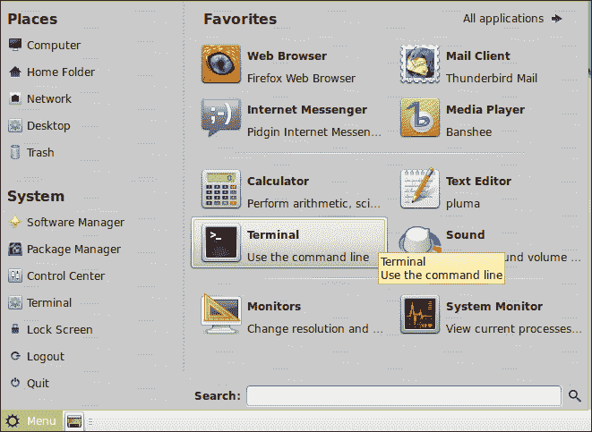
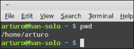
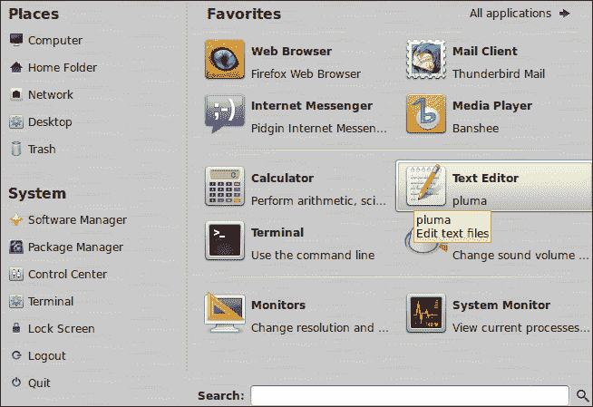
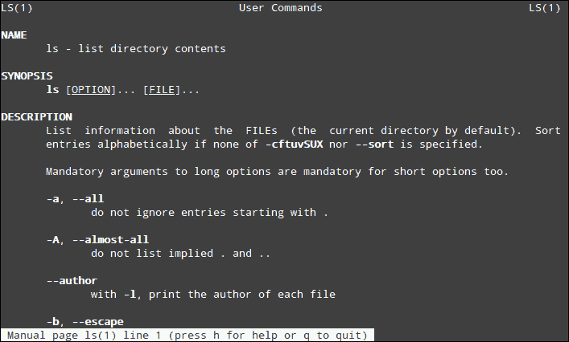
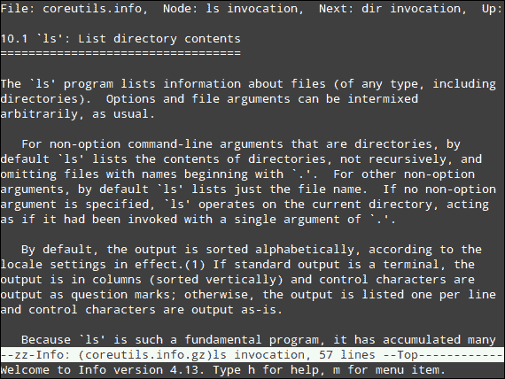

# 三、Shell基础

*上一章我们学习了如何安装 Linux Mint。一旦我们的操作系统安装在计算机上，我们就可以使用它了。首先，你需要了解什么是Shell，这是 Unix 和 GNU/Linux 操作系统最重要的概念之一。然后，您将了解Shell的一些有趣的基本用法，包括一些用于执行应用程序、列出文件和在文件系统中查找文件的有用命令。此外，您将发现一些关于 shell 编程的基本概念。*

本章将讨论以下主题:

*   Shell 基本概念
*   正在查找当前目录
*   如何运行命令和应用程序
*   寻找 shell 命令的绝对路径
*   如何列出、检查和查找文件
*   了解重定向和管道
*   如何设置环境变量
*   查找以前执行的命令
*   创建一个简单的 shell 脚本
*   如何获得帮助？

让我们从学习什么是Shell开始。

# 什么是贝壳？

Shell是 Unix 和 GNU/Linux 操作系统最重要的组件之一。基本上，Shell是为用户提供接口的软件，允许与操作系统的内核通信。使用Shell，用户可以输入命令和执行程序。从技术角度来看，shell 只是一个可以代表用户执行其他程序的程序。通常，Shell被称为命令行界面，也称为 **CLI** 。

第一个 Unix 操作系统将Shell与操作系统的其他组件分开。这意味着Shell是一个可以由用户直接启动的程序。然而，其他组件，如内存管理器、调度器和输入/输出系统直接通过内核工作，无需用户交互。

第六版的 Unix 包含一个Shell作为标准命令解释器。它的名字叫**sh**T2，由肯·汤普森开发，他在贝尔实验室工作。过了一段时间，1979 年，当第七版 Unix 发布时，之前的 shell (sh)被一个名为**Bourne shell**T5 的新 shell 所取代，这个 shell 是由 Stephen Bourne 开发的。几年后，比尔·乔伊写了一个新的 shell，并将其命名为 **C shell** ，这也被称为 **csh** 。Joy 在加州大学工作，他的 shell 成为了一个名为**伯克利系统发行版** ( **BSD** )的特定 Unix 操作系统的一部分。

20 世纪 80 年代中期，**科恩Shell** ( **ksh** ) 由大卫·科恩开发，他当时在流行的 AT & T 贝尔实验室工作。尽管 ksh 与 Bourne shell 兼容，但它包含了一些额外的功能，对于程序员和那些想要应用高级定制的人来说非常有用。

大多数 GNU/Linux 发行版都包含了作为 GNU 项目一部分编写的不同 shell，它的名字是**Bourne-再次 shell** ，它被普遍称为 **bash shell** 。GNU 项目开发人员构建 bash 的目的是获得一个与伯恩Shell兼容的Shell，这对用户和程序员都很有用。

因此，bash 提供了伯恩功能的超集。由于 bash 目前的流行，我们将进一步了解它。此外，Linux Mint 也不例外，它包括 bash 作为默认Shell。

Bash shell 包含可以直接输入的命令。这些命令可帮助您执行有用且常见的操作，例如更改当前目录、显示文件内容或列出特定目录的内容。其中一些命令内置于 bash shell 本身；其他的是 GNU/Linux 发行版中包含的独立程序。这两种命令都被认为是 bash 命令，您将在本章中学习其中的一些。

当你打开一个Shell时，你可以看到一些符号，一些文本和一个闪烁的光标，所有这些都被称为提示，一个它表明Shell已经准备好了，你可以开始输入你的命令。提示显示的信息类型取决于提示的配置方式。基本上，您可以找到关于您的用户名、机器名和当前目录的数据。通常，美元符号(`$`)充当该数据和光标之间的分隔符，光标在您可以键入的地方闪烁。

# 你在哪里？

我们将开始使用 shell，学习如何找到当前目录的位置，以及如何从一个目录切换到另一个目录。此外，我们将发现哪个应用程序为 Linux Mint 提供了命令行界面。

# 行动时间-学习 pwd 和 cd 命令

Linux Mint 使用的命令行界面是由一个名为 **MATE 终端** 的应用程序提供的。我们将搜索它，启动它，然后按照以下步骤学习并执行 `pwd`和`cd` 命令:

1.  点击桌面底部的**菜单**选项。
2.  After clicking, a new window menu is displayed with a lot of options. On the right-hand side pane, you'll see an area called **Favorites**; there, click on the **Terminal** icon for launching MATE Terminal, as shown in the following screenshot:

    

3.  Now that you have a shell running through MATE Terminal, you're ready to type and launch commands. Our first command will be `pwd`, which returns the path of the current directory. Enter `pwd` directly on the MATE Terminal window.

    

4.  When you launch MATE Terminal, your current directory will be your home directory; so the output of the **pwd** command will be that directory, which is evident from the following screenshot:

    

5.  我们将更改当前目录，并通过 使用以下命令将`/tmp`设置为新的当前目录:`arturo@han-solo ~ $ cd /tmp`。
6.  执行完命令后，我们会发现提示发生了变化，向我们指示我们当前的目录现在是`/tmp`，看`arturo@han-solo /tmp $`就可以看到。

## *刚刚发生了什么？*

因为我们使用的是 Linux Mint 的 MATE 版本，所以我们的默认命令行界面是由 MATE Terminal 提供的。然而，其他版本也包含类似的程序。例如，肉桂提供了 GNOME 终端作为其默认的 CLI 应用程序。

MATE 终端让我们可以访问Shell，我们可以通过它启动命令和程序。事实上，MATE 终端使用带有图形用户界面的窗口提供了基于文本的命令行界面。我们已经学习了显示当前目录的第一个命令。这个动作很重要，因为其他一些命令的输出依赖于该目录。

`cd` 命令对于更改当前目录和将文件系统中的其他目录设置为新的当前目录非常有用。为`cd`命令传递的第一个参数是要设置为新的当前目录的目录路径。

重要的是要知道`~`符号标识您的主目录，因此您可以将其用作快捷方式，而不是键入完整路径。

请记住，您的提示看起来会有所不同，因为您的用户名和机器名称与我的不同。在我们的例子中，用户名是`arturo,` ，机器名是`han-solo`。是的，你猜对了，我是《星球大战》的粉丝！

## 拥有一个围棋英雄——使用快捷方式访问你的主目录

尝试在没有参数的情况下执行`cd`命令，你会发现当前目录是如何变成你的主目录的。以下是快速切换到该目录的快捷方式:

```sh
arturo@han-solo /tmp $ cd
arturo@han-solo ~ $

```

MATE 终端可以通过不同的方式进行配置和定制。例如，您可以更改字体类型和大小，并设置特定的配色方案。您可以从**编辑**选项中查看**配置文件首选项**菜单。

# 运行命令

如您所知，Shell允许我们直接与您电脑的操作系统进行通信。这个动作帮助我们启动命令和应用程序。之前你发现了如何启动`cd``pwd`等命令。为此，您只需输入每个命令，然后按*进入*。但是，有些命令用于使用完整路径调用程序。现在你将学会如何去做。

# 行动时间–从命令行启动程序

假设有一个名为 `testme exists`的程序，可以在`/tmp`目录里面找到。我们可以通过以下步骤调用该程序:

1.  使用 MATE 终端应用程序打开一个Shell。
2.  键入`/tmp/testme`并点击*进入*。
3.  程序的输出将显示在Shell上。如果被调用的程序有图形用户界面，将会打开一个新窗口。

## *刚刚发生了什么？*

当您输入命令时，它会直接执行，因为存在一个环境变量来查找所有可以执行的文件。该变量的名称为`$PATH`，其值指示 shell 应该在哪里查找可执行文件。命令和应用程序都是可执行文件，但并非所有文件都位于与`$PATH`相关的目录中。这就是使用完整路径调用任何文件的原因。遵循这个规则，我们通过路径名调用`testme`文件。

操作系统如何知道哪些文件是可执行的？很简单，可执行文件使用一个特定的标志向操作系统指示这个属性；shell 知道这个事实，并且可以轻松地执行它们。

如果您当前的目录是可执行文件所在的目录，您可以使用点加斜线(`./`)调用它，后跟文件名。由于这种技术，您不需要使用完整路径或修改`$PATH`变量。例如，我们的示例`testme`命令可以通过使用以下命令来调用:

```sh
arturo@han-solo ~ $ cd /tmp
arturo@han-solo /tmp $ ./testme

```

一些命令和程序允许我们传递额外的参数；每一个前面必须有一个空格。我们将在后面学习这类命令(至少是一些命令)。

## 拥有一个围棋英雄——不使用完整路径执行程序

可以尝试修改`$PATH`来添加`/tmp`目录，然后可以直接调用`testme`命令而不用使用其完整路径。有关如何设置环境变量的更多信息，请参见本章后面的*设置环境变量*部分。

# 搜索命令

有时候 搜索命令或可执行文件的完整路径很重要，可以通过`$PATH`变量定位。采取该动作最有用的命令是`which`，所以我们将解释如何使用它。

# 行动时间–使用哪个命令

在继续之前，确保你已经启动了 MATE 终端。然后执行以下步骤:

1.  输入以下命令:

    ```sh
    arturo@han-solo ~ $ which find

    ```

2.  `which`命令将显示以下输出:

    ```sh
    /usr/bin/find

    ```

## *刚刚发生了什么？*

`which` shell 命令包含在大多数 GNU/Linux 发行版中，甚至在 Linux Mint 中也是如此。由于该命令，我们可以获得命令或可执行文件的完整路径，该路径可以通过`$PATH`变量定位。另一方面， `find`命令是一个查找文件的程序；你将在这一章中了解更多。

# 列出、检查和查找文件

文件是存储信息的持久资源。图像、声音、程序和命令使用可由用户管理的文件。由于这个事实，学会如何通过我们的 shell 列出、检查和查找文件是很重要的。

# 行动时间–使用 ls、定位、查找和 cat 命令

我们将使用几个命令，如`find`、`locate`、`cat`和 `ls`。最后一个用于显示目录的内容，而 `find` 和 `locate`命令用于在我们的文件系统中查找文件。 `cat`命令用于获取文件的内容作为输出。别忘了确保你的Shell正在运行。

1.  首先，我们将直接从主目录执行`ls`；我们只需要在命令行界面中输入`ls`。
2.  前一个命令的输出如下所示:

    ```sh
    Desktop  Documents  Downloads  Music  Pictures  Public  Templates  Videos

    ```

3.  现在，我们将使用以下命令继续在`/etc/ufw`目录中查找所有扩展名为`.conf`(`*.conf`)的文件:

    ```sh
    arturo@han-solo ~ $ find /etc/ufw -name '*.conf'

    ```

4.  作为`find`命令的输出，您将在主目录中找到所有扩展名为`.conf`的文件:

    ```sh
    /etc/ufw/sysctl.conf
    /etc/ufw/ufw.conf

    ```

5.  当我们知道要查找的文件的名称时，会使用`locate`命令。假设你想找`.bash_history`文件，但是不记得文件所在的目录；在这种情况下，您可以使用以下命令:

    ```sh
    arturo@han-solo ~ $ locate .bash_history

    ```

6.  最后执行的命令的结果如下行:

    ```sh
    /home/arturo/.bash_history

    ```

7.  最后，我们将使用 `cat`命令来显示文本文件的内容。让我们使用以下命令列出文件系统中包含与您的网络接口相关的信息的内容:

    ```sh
    arturo@han-solo ~ $ cat /etc/network/interfaces

    ```

8.  结果，您将得到`/etc/network/interfaces`文件的内容显示为:

    ```sh
    auto lo
    iface lo inet loopback

    ```

## *刚刚发生了什么？*

当您需要查找一个文件或一组文件时，`find`和`locate`命令非常有用。每个命令可以使用不同的参数，我们已经学习了每个参数的基本用法。重要的是要知道`find`命令从当前目录开始搜索。但是，`locate`使用特定的数据库进行搜索，而不考虑当前目录。这意味着`locate`可以找到不在当前目录中的文件。这两个命令都使用基于模式的搜索算法。请记住，我们使用`*.conf`模式作为`find`命令的参数。

`ls`命令是 Linux 系统中使用最多的命令之一，因为它提供了关于目录内容的基本信息。通常，在通过 shell 采取行动之前，您需要这些信息。这个命令支持许多不同的参数，这些参数允许您获取关于目录内容的不同类型的信息。

作为打印文本文件内容的一部分，`cat`命令可以连接不同文件的内容，从而将所有信息直接显示在Shell上。每个文件都可以作为参数传递给`cat`命令。

## 玩一玩英雄-在列出文件时获取更多信息

如果您想获得关于目录中每个文件的更多信息，您可以尝试以`-l`作为参数启动`ls`命令，如下所示:

```sh
arturo@han-solo ~ $ ls -l

```

此外，通过传递不同于 JPEG 的扩展名作为参数来执行`find`命令可能会很有趣。

另外两个命令可以帮助您显示文本文件的内容— `more`和`less`。这两个命令都允许您阅读屏幕上的内容，而不会有意外修改的风险。您只需要将文本文件的名称作为参数传递给这些命令。

# 管道和重定向

在 Unix 和 GNU/Linux 操作系统中，将一个命令的输出作为另一个命令的输入是非常常见的。由于这个概念，有可能只使用Shell中的一行来创建命令组合。我们将使用一个简单的例子来说明管道的使用。具体来说，我们将在文本文件中寻找一个字符串。

重定向是另一种强大而常见的技术，它允许我们将命令的输出附加到机器文件系统中的任何其他可用文件中。为了让事情变得更简单，我们将创建一个包含当前日期的文本文件。

# 行动时间-通过应用不同的命令使用管道和重定向

让我们开始了解管道的工作原理:

1.  在 shell 中输入以下命令:

    ```sh
    $ cat mytext.txt | grep This

    ```

2.  您将获得以下输出:

    ```sh
    This is the content for the mytext.txt file

    ```

3.  现在，我们将使用重定向来创建一个包含一些内容的新文件:

    ```sh
    $ date > current_date.txt

    ```

4.  使用以下命令检查新文件以确保内容有效:

    ```sh
    $ cat current_date.txt
    Sat Sep 23 14:41:29 CEST 2012

    ```

## *刚刚发生了什么？*

虽然我们使用简单的例子来理解管道和重定向，但是通过这些技术可以创建复杂的命令。这取决于用户的能力和经验。

您一定已经意识到，我们使用`|`字符来表示我们将使用管道。可以在不同的命令中多次使用该字符。

就重定向而言，`>`字符用于将命令的输出存储在文件中。另一方面，`date`是获取当前日期的简单应用。最后，`cat`命令帮助您打印名为`current_date.txt`的新文件的内容。

## 玩一个围棋英雄——使用重定向将内容附加到文件中

不需要创建新文件，可以将内容附加到现有文件中；你只需要使用`>>`字符。例如，我们可以使用以下命令向现有文件添加更多内容:

```sh
$ echo 'More text' >> current_date.txt

```

# 设置环境变量

一个环境变量定义了可以影响在操作系统中运行的程序和命令行为的一些方面。每个环境变量都有一个可以通过 shell 动态更改的值。通常，操作系统会创建和设置一些环境变量，但是用户可以更改这些变量并添加新的变量。可以使用环境变量定义默认应用程序，如网络浏览器、文本编辑器和音乐播放器。shell 使用这种变量来获取关于用户环境的信息，并将这些数据设置到命令和程序中。我们将学习如何为特定的环境变量获取和设置一个值。

# 行动时间–设置路径环境变量

执行以下步骤设置`PATH`环境变量:

1.  启动 MATE 终端，准备输入一些命令。
2.  输入以下命令:

    ```sh
     $ PATH=$PATH:/tmp

    ```

3.  使用以下命令获取`PATH`变量的值:

    ```sh
    $ echo $PATH

    ```

4.  你会得到这样的信息:

    ```sh
    /usr/local/sbin:/usr/local/bin:/usr/sbin:/usr/bin::/sbin/bin:/usr/games:/tmp

    ```

## *刚刚发生了什么？*

环境变量的值直接设置在 shell 中；我们只需要使用`=`字符以及变量的期望值。在我们的例子中，我们使用了`PATH`变量并添加了一个新的值，`/tmp`目录。显然，我们可以只使用更简单的值，但是在`PATH`的情况下，我们也希望保持其原始值。

`echo` 命令 接受任何类型的文字作为参数，并将该文字输出到标准输出。如果你想得到一个环境变量的值，你应该在它前面加上`$`符号。因此，`echo $PATH` 命令将输出`PATH`环境变量的值。

## 有一个围棋英雄——学习出口指令

可以得到不同环境变量的值，如`HOME`、`TERM`、`EDITOR`。此外，您可以动态更改其值。

如果您希望环境变量值可用于从原始Shell创建的Shell，您应该使用`export`命令:

```sh
$ export TERM=/bin/bash

```

# 显示命令历史

通常，使用 shell 工作的人会执行很多命令，因此获取已执行命令的历史记录会非常有用。感谢`history` 命令，我们可以找出之前执行过哪些命令。

# 行动时间–使用历史命令

我非常确定你已经执行了一些 shell 命令，所以我们准备直接使用`history`命令:

1.  在Shell中输入`history`。
2.  根据您过去输入的命令，您将获得类似于以下内容的列表:

    ```sh
    cd /tmp
    which find

    ```

## *刚刚发生了什么？*

您在 shell 上键入的每个命令都存储在一个名为`.bash_history` 的文件中，该文件由`history`命令读取，用于向您显示关于先前执行的命令的信息。操作系统为每个用户存储一个`.bash_history`文件，该文件位于用户的主目录中。

## 玩一个围棋英雄——检查已执行命令的历史

如果您正在寻找之前执行的命令，您可以将`history`和`grep` 命令与管道相结合来获取信息。假设您想知道之前执行了哪些`cd`命令；在这种情况下，您可以键入以下命令:

```sh
$ history | grep cd

```

此外，左光标和右光标为您提供了对最后执行的命令的导航。

# 创建第一个 shell 脚本

到目前为止，我们已经通过直接在Shell中键入并按下*进入*来启动命令，但是也可以使用文本文件来编写一组命令，并通过Shell启动该文件。这项技术允许我们创建脚本或小应用程序来启动命令或执行不同的 shell 操作。事实上，Bash shell 为此目的为我们提供了一种特定领域的编程语言。尽管这种特定编程语言的学习曲线并不简单，但我们将学习如何创建一个简单的 Bash 脚本，使用控制结构执行一些命令。

在我们的示例中，我们将创建一个脚本来检查文本文件是否存在。如果答案是肯定的，我们将发布消息通知您。否则，我们将创建一个新的单行文本文件。最后，无论发生什么，我们都会列出创建的文本文件。

# 行动时间–创建和执行Shell脚本

我们需要使用文本编辑器；当然，你可以用你最喜欢的。Linux Mint 为我们提供了几个文本编辑器，比如 Vim、Emacs 和 Pluma。后者有一个图形用户界面，并且是默认安装的，所以我们将在工作中使用它。下面是如何开始的:

1.  Click on the **Menu** button, and then click on the **Text Editor** menu option, as shown in the following screenshot:

    

2.  将显示一个新窗口，您可以使用 Pluma 了。输入以下几行，准备好了就把文件保存为`myscript.sh`:

    ```sh
    #!/bin/bash
    if [ -f "myfile.txt" ]
    then
     echo "Sorry, file already exists."
    else
     echo "Content for file" > myfile.txt
    fi
    ls -l myfile.txt

    ```

3.  给予你的新 shell 脚本执行权限:

    ```sh
    $ chmod +x myscript.txt

    ```

4.  启动你的脚本:

    ```sh
    $ ./myscript.sh

    ```

5.  最后一个命令的输出应该是这样的:

    ```sh
    -rw-rw-r--. 1 arturo arturo 17 Oct 20 11:12 myfile.txt

    ```

6.  此外，您可以使用`cat`命令:

    ```sh
    $ cat myfile.txt

    ```

    检查创建文件的内容

## *刚刚发生了什么？*

所有 shell 脚本都是纯文本文件，因此您可以使用任何文本编辑器来编写这种程序。shell 脚本的第一行应该从指示哪种 shell 将用于执行脚本开始。Linux Mint 中的默认 shell 是 Bash，所以我们将把它用于我们的 shell 脚本。这就是我们 shell 脚本第一行使用`/bin/bash`可执行文件的原因。正如你可能已经意识到的，在那一行中使用了两个特殊的符号。

第一个指示该行是注释，第二个用于知道应该使用什么样的 shell 来执行 shell 脚本。`if`语句是有条件的，它检查某个条件是否满足。在我们的例子中，它检查`myfile.txt`是否存在。如果答案是否定的，将执行`else`语句，我们将使用`echo`命令创建一个新文件，并将输出重定向到该文件。最后，shell 脚本的最后一行将被执行，而不用担心条件语句。为了测试这个事实，您可以启动命令两次；你会发现输出是不同的，因为第二次文件会存在，因为它是之前创建的。

在第三步中，我们使用了一个名为`chmod` 的命令，这对于更改文件的权限非常有用。我们将在下一章详细了解这个命令，但是在我们的 shell 脚本中，我们只为它添加了一个执行权限。一旦我们的 shell 脚本有了这种权限，我们就可以通过命令行直接调用它。

## 有一个围棋英雄——学习高级 shell 编程

虽然我们的示例非常简单，但是您可以通过以下资源了解更多关于 shell 编程的知识:

*   *Bash 编程–入门指南*，来自[http://bit.ly/x24V3](http://bit.ly/x24V3)
*   *高级 Bash-脚本指南*，来自[http://tldp.org/LDP/abs/html/](http://tldp.org/LDP/abs/html/)
*   *Debian Bash 编程指南*，来自[http://bit.ly/Qs12TQ](http://bit.ly/Qs12TQ)

# 如何获得帮助

获得关于 shell 命令和一些可执行文件的帮助很容易，这要归功于两个命令，`man` 和`info`。两者都包含在 Linux Mint 中；让我们发现如何使用它们。

# 行动时间-使用人和信息命令

按照以下步骤更好地理解`man`和`info`命令的用法:

1.  再次，确保您的 shell 正在运行。
2.  执行以下命令获取`ls`命令的信息:

    ```sh
    arturo@han-solo ~ $ man ls

    ```

3.  The following screenshots show you the output of the previously executed command:

    

4.  现在，是时候测试`info`命令了:

    ```sh
    arturo@han-solo ~ $ info ls

    ```

5.  After executing the `info` command, you'll get the following information:

    

## *刚刚发生了什么？*

`man`命令为您提供了许多关于可执行命令或 bash 命令如何工作的信息。作为一个参数，`man`命令接收用于显示信息的 bash 命令或可执行文件的名称。此命令读取以特定格式编写的一个文件或一组文件，以便开发人员可以包含使用该格式的程序的文档。

此外，`info`命令显示一些关于命令的有用信息。但是`info`使用的文档格式与`man`使用的不同。您一定注意到了，尽管我们对两个命令使用了相同的参数，但是它们的输出是不同的。有些用户更喜欢`man`和`info`，但基本上都提供类似的信息。

# 总结

在本章中，我们学习了很多关于 shell 和基本命令的知识，包括如何创建一个简单的 shell 脚本。具体来说，我们处理了以下问题:

*   通过 MATE 终端应用程序对Shell的基本使用
*   寻找你的Shell指向的当前目录
*   运行可执行命令和文件
*   获取`PATH`环境变量引用的命令和可执行文件的完整路径
*   如何使用`ls`命令列出文件
*   如何使用`find`和`locate`命令查找文件
*   如何通过`cat`命令显示文本文件的内容
*   使用管道和重定向技术
*   设置`PATH`环境变量
*   如何使用`history`命令查找之前执行过的命令
*   Shell 编程基础
*   如何获得关于 shell 及其命令的帮助

一旦您了解了基本的 shell 概念和命令，您就可以了解系统管理员最重要的任务之一—如何调配用户帐户。