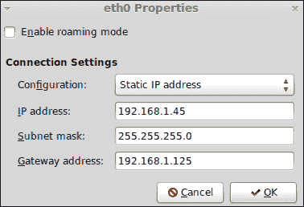
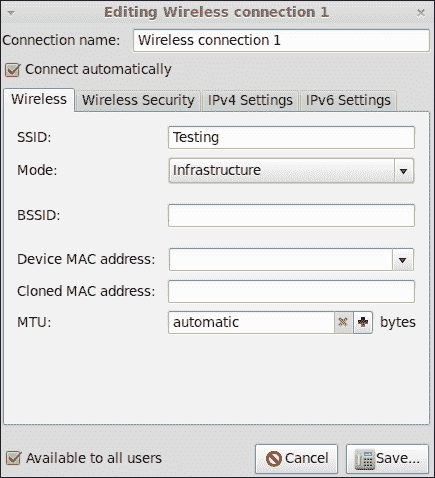
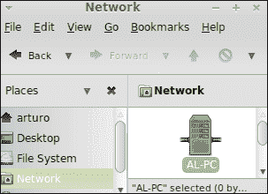
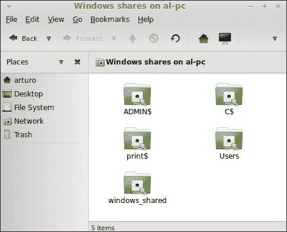
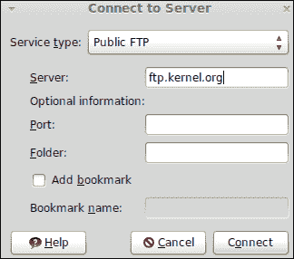
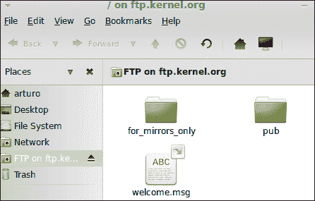

# 第七章。建立工作关系网

*如今，计算机通过网络共享资源(如文件、文件夹和打印机)协同工作。事实上，互联网是一个巨大的网络，计算机在其中工作以交换数据。在本章中，您将学习如何执行一些与网络相关的基本系统管理员任务。*

在本章中，我们将了解以下主题:

*   配置有线和无线网络
*   访问窗口的共享文件夹
*   通过 FTP 协议连接到服务器

# 配置有线网络

虽然无线网络非常广泛，但是很多公司和大学仍然使用有线计算机网络。我们将学习如何配置我们的计算机来访问本地网络，以及访问互联网。请记住，在从本地网络访问互联网之前，您需要访问网络本身。

# 行动时间-配置您的连接

假设我们想使用`192.168.1.45`的静态 IP 将我们的计算机连接到本地网络。我们知道 DNS 服务器正在使用`8.8.8.8`作为 IP 地址。此外，我们的网关可以到达`192.168.1.125`。执行以下步骤来配置您的连接:

1.  从主菜单中启动**控制中心**工具。
2.  点击**互联网与网络**组内的**网络**按钮。
3.  现在您可以访问名为**网络设置**的窗口。
4.  点击**点击进行更改**按钮。
5.  Before continuing to the next step, you should be authenticated. So, you need to enter your password and click on the **Authenticate** button when you're ready. The first tab, called **Connections**, has an option named **Wired** **connection**; click on it, as shown in the following screenshot:

    

6.  点击**网络设置**窗口的**属性**按钮。
7.  Select **Static IP address** from the **Configuration** drop-down menu and enter **192.168.1.45** on the **IP address** input box. After that, the input box loses focus and the **Subnet mask** input box will be filled automatically. Enter **192.168.1.125** in the **Gateway address** input box. All these settings are shown in the following screenshot:

    

8.  完成后点击**确定**按钮。
9.  点击 **DNS** 选项卡，点击**添加**按钮。现在，您可以在第一个输入框中输入`8.8.8.8`。准备好后点击**关闭**按钮；您的网络现已配置完毕。

## *刚刚发生了什么？*

我们已经学习了如何通过 Linux Mint 中包含的简单 GUI 应用程序连接到本地网络。虽然一些系统管理员更喜欢使用命令行界面，但是使用这个图形界面非常简单直观。

在我们的示例中，我们配置了我们的网卡，为其分配了一个静态 IP 地址，并将一个网关和一个特定的服务器设置为**域名服务器** ( **DNS** )。这种服务器的功能非常重要，因为它把域名解析成 IP 地址。

虽然**网络设置**应用程序会自动配置子网掩码，但您也可以添加自己的数据。请注意，子网掩码是根据您输入的 IP 地址计算的。

有些网络使用基于**动态主机配置协议** ( **DHCP** ) 的自动配置，而不是使用静态 IP 地址。在这种情况下，您可以通过从下拉菜单中选择配置的**自动配置(DHCP)来配置您的网络访问。**

## 有一个围棋英雄——改变主机名

如果你愿意，可以更改你的主机名。您需要使用与配置网络时相同的应用程序。只需进入**常规**选项卡，在**主机名**输入框中输入您的新主机名。

# 配置无线网络

如今，无线网络非常普及；公司、大学、机场和咖啡店使用这种网络与互联网建立连接。我们将学习如何配置您的 Linux Mint 计算机使用无线网络。

# 行动时间-如何将电脑连接到无线网络

假设我们需要将我们的计算机连接到无线网络，该网络使用**测试**作为 **SSID** 和 **WEP-128** 方法进行安全保护。此外，我们将对 **IP 地址**、**子网掩码**和**网关地址**输入框使用与上一节配置网络时相同的数据。

1.  从主菜单中启动**控制中心**工具。
2.  单击**其他**组中的**网络连接**选项。
3.  点击**无线**选项卡，然后点击**添加**按钮。
4.  Now you have a new window where you can add your configuration data. Choose a name for your connection, add **Testing** to the **SSID** input box, and click on the **Save...** button when you're ready, as shown in the following screenshot:

    

5.  Click on the **Wireless Security** tab and choose **WEP 128-bit Passphrase** from the **Security** drop-down menu. Inside the **Key** textbox, enter `MyKey`. If you want to make sure what you are entering is correct, check the **Show key** checkbox:

    

6.  现在是时候设置你的 IP 属性了。点击**添加**按钮，在 **IP 地址**输入框中输入`192.168.1.45`，在**子网掩码**输入框中输入`255.255.255.0`，在**网关地址**输入框中输入`192.168.1.125`。
7.  点击**保存...**按钮。您的无线网络现已配置完毕。

## *刚刚发生了什么？*

Mint 为我们提供了一个简单但有效的图形工具来配置我们的无线连接。您已经学习了如何通过手动配置您的 IP 地址、子网掩码和网关来实现这一点。此外，我们的示例使用 **WEP 128 位**方法进行安全保护。这个方法需要一个键，我们需要键入。如果您尝试配置的网络使用不同的安全方法，您可以相应地选择它。其他可用的安全方法有 **WEP 40/128 位**、 **LEAP** 、**动态 WEP** 和 **WPA** 。

另一方面，类似于有线网络，您可以使用 DHCP 来代替手动配置。这取决于您的无线网络。

现在，您一定已经注意到在配置窗口中有一个标记的选项，允许您自动连接到无线网络。由于此选项，您的计算机每次启动时都会连接到无线网络。

如果您的电脑有无线网卡，默认情况下，Mint 会尝试自动检测哪些无线网络可用。您可以通过选择其中任何一个来配置您的连接。

# 访问 Windows 共享文件夹

在计算机网络内部共享文件夹、文件和打印机等资源非常有用。通常，同一网络中的计算机可能使用不同的操作系统。因为 Windows 是使用最广泛的操作系统之一，所以您网络中的多台计算机都可以使用它。记住这个事实，知道如何从 Linux 访问一个 Windows 共享文件夹可能会非常有趣。

# 行动时间–如何访问特定的共享文件夹

我们将访问一个名为`windows_shared`的共享文件夹，它存在于 Windows 7 计算机中，可以通过网络从您的 Linux Mint 计算机访问。这是我们访问特定共享文件夹的方式:

1.  在你的 Linux Mint 桌面上，你可以看到一个图标被描绘成一个有标签的文件夹，表示这个图标代表你的个人文件夹。这个图标让你可以访问 Linux Mint 文件管理器 **Caja** 。例如，如果您的用户名是**约翰**，图标标签将是**约翰的家**。
2.  Caja 现在打开了，可以看到一个带有**网络**标签的图标；点击它。
3.  At this point, you should see an icon that represents a Windows PC. This icon will use a label with the name of the Windows hostname's computer. Click on it to access the shared folders. For example, in the following screenshot, it is named **AL-PC**:

    

4.  现在将显示一个新的对话框窗口，询问您的用户名、密码和域。输入您的数据，准备好后点击**连接**按钮。
5.  Now, the **windows_shared** folder will be available in the Windows manager. You can now double-click on it to access the files inside it.

    

## *刚刚发生了什么？*

多亏了 Samba，现在可以从 Linux 访问 Windows 中的共享文件夹了。从技术角度来看，Samba 是对 **SMB/CIFS** 网络协议的免费重新实现。该协议作为应用层网络运行，由 Windows 用来共享文件、打印机和其他资源。

显然，在从 Linux 访问 Windows 共享文件夹之前，您需要了解一些重要信息，如工作组、用户名和密码。该数据应由 Windows 系统管理员提供。

默认情况下，Linux Mint 会探索您的网络，以发现哪些计算机可以访问。当你点击 Caja 的**网络**按钮时会出现这种情况。当检测到您的 Windows 计算机并单击其图标时，您可以输入数据来访问这些共享文件夹。然后，您可以处理此文件夹中的文件，就像它们在您的计算机中一样。

请记住，默认情况下，所有共享文件夹将在身份验证后显示在 Caja 上。但是，您只能通过连接到 Windows 电脑的用户的权限来访问这些文件夹。

# 连接到服务器

互联网上的服务器通过使用不同的网络协议来提供对其他服务器和计算机的访问是非常常见的。**FTP****SSH**和 **WebDAV** 是访问远程服务器的常见协议，因此了解如何使用这些协议从 Linux Mint 连接到其他计算机将是非常有趣的。

# 行动时间-连接到 FTP 服务器

我们将连接到一个公共 FTP 服务器，它提供对 Linux 内核资源的访问。可在[ftp.kernel.org](http://ftp.kernel.org)联系；我们不需要任何用户名或密码来访问它。

1.  通过点击**位置**组中的**主文件夹**选项打开 Caja 文件管理器，该选项可通过主菜单访问。
2.  进入**文件**菜单，点击**连接服务器**。
3.  A new dialog will be displayed. Choose **Public FTP** from the **Service** drop-down menu. Enter **ftp.kernel.org** in the **Server** textbox as shown in the following screenshot:

    

4.  You can see all the available folders through the FTP server in your file manager window, as shown here:

    

## *刚刚发生了什么？*

Caja 文件管理器帮助我们使用不同的网络协议连接到服务器。在我们的示例中，我们学习了如何连接到公共 FTP 服务器。这种服务器不需要用户名和密码组合。如果您需要连接到这些服务器之一，您可以从**服务**下拉菜单中选择 **FTP(带登录)**选项。一旦建立连接，您就可以通过 Caja 访问文件和文件夹，就像它们在您的计算机中一样。这意味着您可以使用拖放技术直接从另一个文件管理器窗口复制内容。

在连接对话框中，可以看到一个名为**添加书签的选项存在**。通过选择该选项，将在文件管理器中创建一个快捷方式。由于此功能，您可以快速访问最常见的服务器连接。

## 玩得开心点——使用安全 WebDAV 协议连接到服务器

尝试通过安全 WebDAV 协议连接到服务器。您可以按照前面解释的相同步骤连接到公共 FTP 服务器。我们只需要从**安全**下拉菜单中选择**安全网游(HTTPS)** 。此外，您还可以输入服务器的用户名和将建立连接的默认文件夹名称。

# 总结

在本章中，我们学习了很多如何执行一些基本的网络操作。

具体来说，我们涵盖了以下主题:

*   连接到有线和无线网络
*   使用 FTP 和 WebDAV 协议访问远程计算机
*   连接到 Windows 共享文件夹

现在您已经知道如何处理网络，是时候了解不同类型的可用文件系统以及如何制作和恢复备份了。