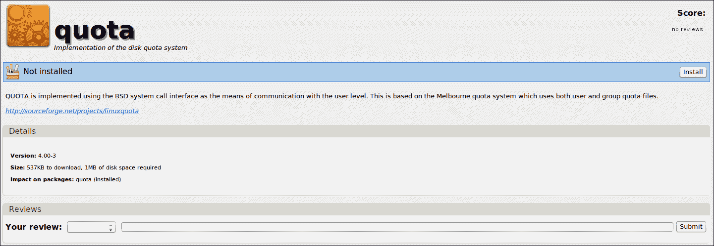
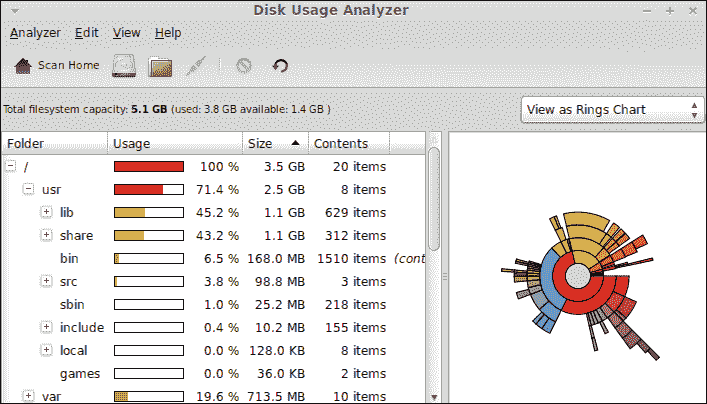
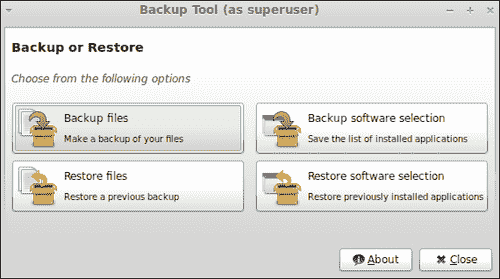
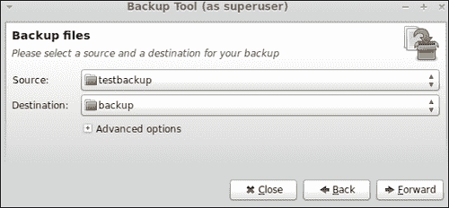
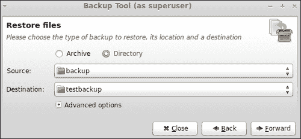

# 八、存储和备份

*本章介绍关于文件系统、存储类型以及如何创建和恢复备份的基本概念和信息。系统管理员应该清楚地了解这些信息，因为这些信息在用户、公司、大学和其他类型的组织中具有巨大的价值。*

在本章中，我们将学习以下主题:

*   找出 GNU/Linux 发行版使用的主要文件系统类型
*   如何为用户分配磁盘配额
*   如何分析磁盘使用情况
*   如何创建和恢复备份

# 文件系统类型

计算机数据在存储设备的特定系统中存储和组织。操作系统应该能够存储、组织、访问和更新这些数据。为了执行所有提到的操作，使用了**文件系统** 。存储设备中的所有文件和文件夹都由文件系统组织，操作系统处理它。存储设备可以是硬盘、外置 u 盘或网络上的一组文件和文件夹。

每个文件系统为系统管理员和用户提供一组元数据来使用它。此元数据包括文件中包含的数据长度、文件所有者以及文件上次修改时间等信息。目前，您可以找到许多文件系统，每个操作系统家族都可以使用其中的许多文件系统。Linux 内核是直接处理文件系统的操作系统的主要组件。此外，Linux 发行版提供了工具和技术来处理不同类型的文件系统。

文件系统和存储设备使用**分区** 的概念，它标识文件系统使用的存储设备的一个片段。通常，每个存储设备都由分区划分，每个分区都可以使用特定的文件系统进行格式化。格式化操作提供了一种在分区内创建文件系统的机制。请记住，在安装过程中，Mint 会自动在我们的硬盘上创建一些分区。

Mint 允许我们使用 Linux 操作系统家族使用的一些最流行的文件系统。具体来说，Linux Mint 可以使用`ext2`、`ext3`、`ext4`、`btrfs`、`xfs`和`reiserfs`等分区。目前，`ext4`是 Linux 分区事实上的标准，Linux Mint 默认使用。虽然`btrfs`是实验性的，但你可以在你的硬盘上测试，这要感谢 Mint。另一方面，`reiserfs`因其日志特征和稳定性而非常受欢迎。由于其高性能日志系统，一些系统管理员更喜欢使用`xfs`。

决定哪种文件系统类型最适合每台计算机和存储设备并不容易。通常，系统管理员更喜欢将`ext4`用于 PC 和工作站；`xfs`和`reiserfs`对于服务器和需要高可用性和高性能的设备来说很常见。

与文件系统相关，我们发现了另一个概念:**存储类型** 。在运行 GNU/Linux 操作系统的服务器中，常用的存储类型有**独立磁盘冗余阵列** ( **RAID** ) 、**逻辑卷管理** ( **LVM** ) 。第一种是一种技术，它基本上将多个磁盘组合成一个独特的逻辑单元。可以应用不同级别的 RAID，流行的有 RAID 5 和 RAID 1。使用 RAID 的一些优势是数据冗余和高性能。

另一方面， LVM 是一种使用传统分区以更方便、更灵活的方式分配存储设备空间的方法。使用 LVM，可以通过拍摄快照来创建备份。除了这一重要功能之外，LVM 还允许系统管理员应用热插拔来添加或更换磁盘，而不会中断设备存储提供的服务。在安装过程中，Mint 允许您使用 LVM 而不是分区。

# 磁盘配额

硬盘和存储空间通常有限，因此执行一些维护任务以防止这些设备达到最大容量非常重要。管理存储限制的一个简单方法是使用**磁盘配额**；这是一种为操作系统的每个用户或组分配特定大小空间的技术。

Linux 内核允许我们对磁盘使用两种类型的配额:**软**和**硬**。使用第一个时，当达到限制时，用户将收到警告。另一方面，硬配额不允许用户在达到限制后创建文件。

# 行动时间–为特定用户分配磁盘配额

我们将学习如何为名为`arturo` 的用户设置特定硬盘的`/dev/sda3`分区的 20 MB 限制。假设`/home`隔板安装在`/dev/sda3`上。分配给用户的配额是软的，因此会收到一条警告消息。显然，您可以为硬盘或其他可通过计算机访问的设备选择不同的用户和分区。

1.  Go to **Menu** and launch the **Software Manager** application, then look for and install an application called **quota**.

    

2.  通过修改`/etc/fstab`文件并将`usrquota`和`grquota`值添加到特定分区，启用文件系统上的配额检查。只有根用户有权限修改上述文件，所以需要先以`root`身份登录，然后才能修改。`/etc/fstab`文件中的行应该如下:

    ```sh
    /dev/sda3  /home  ext4  defaults,usrquota,grpquota   1 2

    ```

3.  编辑更改`/etc/fstab`文件后，必须重启电脑。
4.  执行以下命令检查已启用配额的分区:

    ```sh
    $ quotacheck -avug

    ```

5.  让我们给用户分配一个配额。为此，您需要执行下一个命令，该命令将打开一个编辑器来修改分配配额的特定配置文件:

    ```sh
    $ edquota arturo

    ```

6.  右现在，您可以通过在对应于`/dev/sda3`分区的行中的**软**列中添加值`20480`来修改打开的文件。准备好了就保存文件。磁盘配额现已分配给用户`arturo`。

## *刚刚发生了什么？*

配额应用程序包含两个有用的命令(`quotacheck`和`edquota`，用于为用户和组设置和检查硬盘中的配额。在我们的例子中，我们已经配置了我们的系统，当一个特定的用户试图使用超过 20 MB 的`/home`分区时会发出警告。

在`/etc/fstab`文件中可以找到计算机启动时将要挂载的分区的所有信息，该文件已被修改以激活配额检查。您可以卸载和装载特定分区，而不是重新启动计算机。

我们刚刚使用了 20 MB 的限制来检查警告消息是如何显示的。显然，系统管理员为特定目的选择不同的值，因为每个场景都不同。

## 加油英雄——调度配额检查

您可以定期检查配额是否已经达到存储限制。为此，您可以通过`cron`工具使用`quotacheck`命令。我们只需要创建一个具有以下行的文件`/etc/cron.daily/quotacheck`:

```sh
quotacheck -avug

```

感谢`cron`，操作系统每天都会检查每个配置的用户是否达到了配额。

# 磁盘使用情况分析

我们已经学习了如何为用户分配配额以及如何保留硬盘空间。关于这个功能，知道每个分区和目录中使用了多少空间是很重要的。由于这一特性，系统管理员可以根据磁盘使用情况决定如何组织分区。

# 行动时间–检查磁盘使用情况

我们要去看看我们的硬盘，发现每个分区和目录使用了多少空间。

1.  进入主菜单，点击**磁盘使用分析器**菜单选项，该选项属于**系统工具**菜单组。
2.  Now you have access to a new window, which displays graphic information about your hard drive space and usage:

    

## *刚刚发生了什么？*

**猴面包树**是 Linux Mint 提供的用于分析磁盘使用情况的工具名称。它为我们提供了关于文件系统容量和硬盘空间分布方式的图形化信息。对于`home`文件夹中的每个目录，您可以看到许多文件、百分比空间和大小。此外，还可以选择特定文件夹的信息，这可以通过位于猴面包树主工具栏中的文件夹图标来选择。

关于猴面包树显示的图形信息，我们可以在两种图表中进行选择:**树状图** 和**年轮**。在工具栏下方，一条简单的线告诉我们文件系统的容量和可用空间。这是一个简单但非常实用的信息。

# 创建备份

储存在电脑上的一些信息非常重要，也很有价值，所以我们需要保证它的安全。此外，建议进行备份，这样如果一些信息丢失或损坏，我们可以恢复备份，一切都应该可以正常工作。让我们学习如何从 Linux Mint 创建备份。

# 行动时间–备份特定文件夹

我们将把您的`home`文件夹中名为`testbackup`的文件夹备份到`/tmp`目录中名为`backup`的文件夹中。您可以创建`testbackup`文件夹，并在其中添加一些文件。

1.  点击**菜单**，然后再次点击**所有应用**选项，在**管理**组内选择**备份工具**。
2.  The **Backup Tool** application will be launched and you can see a new window with a few buttons. Click on the **Backup files** button:

    

3.  Choose the **testbackup** folder for the **Source** option and select the **backup** folder from the **/tmp** folder for the **Destination** drop-down option. Click on the **Forward** button when you're ready:

    

4.  下一个选项允许您排除一些文件夹和目录。我们不会排除任何东西，所以你可以点击**前进**按钮。
5.  查看您的源文件夹和目标文件夹。如果一切正常，则点击**应用**。
6.  最后，您可以看到一条消息，通知您备份操作成功。准备好之后，点击**关闭**按钮。看看`backup`文件夹，确保你的文件在那里。

## *刚刚发生了什么？*

备份工具是 Linux Mint 中包含的一个应用程序，它提供了一种简单有效的方法来制作和恢复文件、文件夹和应用程序的备份。我们已经解释了一个基本操作——如何备份文件夹。但是，备份工具也允许您创建一个简单文件的备份，甚至可以创建安装在您计算机上的一些应用程序的备份。

**备份工具提供的高级选项**允许我们选择输出格式和选项来执行覆盖、保留权限和时间戳、跟随符号链接或确认文件和文件夹的完整性。我们使用了默认选项，但您也可以选择自己的偏好。

如果访问`/tmp/backup`文件夹，可以找到备份工具创建的文件。这些文件将与`testbackup`文件夹中的文件相同。

除了在同一个硬盘中选择一个文件夹，您还可以使用不同的设备进行备份，如 u 盘、外置 u 盘或可通过网络访问的文件夹。

请记住，备份工具是通过根用户执行的，因此您可以备份硬盘上的任何目录。此外，在使用此工具之前，您应该经过身份验证。

## 玩个痛快——创建和恢复备份文件

你可以尝试创建一个`tarball`(用`tar`工具创建)文件并恢复它。作为源码，可以用几个文件代替整个目录。备份工具为您提供了只需点击几下鼠标即可完成的机会。不要忘记在**高级选项**中选择**输出**下拉选项的**tar . gz 文件**选项。

# 恢复备份

一旦你对你的重要文件、文件夹或应用程序进行了备份，你应该把它们保存在一个安全的地方。如果出现问题，您可以将这些备份还原到硬盘上选定的文件或文件夹中。尽管每个公司和系统管理员都使用特定的策略来制作和恢复备份，但我们应该学习如何执行简单的文件夹恢复。

# 行动时间–恢复备份文件夹

创建备份后，是时候恢复它了。我们会将`/tmp/backup`文件夹恢复到您的`home`文件夹中的`testbackup`。

1.  从主菜单进入**备份工具**。
2.  点击**恢复文件**按钮。
3.  Select the **Directory** checkbox and choose the **backup** folder from the **tmp** directory. For the **Destination** menu option, you should select **testbackup** from your **home** folder. Click on **Forward** button when you're ready:

    

4.  请检查您的选项，确保您要还原到正确的备份文件夹。
5.  点击**应用，**T3，将显示一条新消息，通知您恢复操作。您的文件应该在`testbackup`文件夹中。

## *刚刚发生了什么？*

我们已经恢复了`home`文件夹中的备份。显然，原始备份应该存在于先前创建它的地方。由于此操作，您可以毫无问题地恢复文件和文件夹。

关于**高级** **选项**，当您恢复备份时，您只能选择您想要应用的覆盖类型。有些选项是**从不**、**按尺寸**、**始终**、**校验和不匹配**；其中，默认情况下会选择一个选项。

除了恢复目录，您还可以恢复使用相同工具创建的备份文件。

## 勇往直前—为应用程序创建备份

证明如何创建和恢复安装在您计算机上的一些应用程序的备份将会很有趣。您可以使用备份工具提供的**备份软件**选择和**恢复** **软件**选择按钮来完成。

# 总结

计算机存储很复杂，因为可以找到不同类型的设备和文件系统。通常，用于存储的技术是复杂的，在决定应该使用哪种类型的存储和文件系统设备之前，对最终场景进行完整的分析非常重要。

在本章中，您已经学习了处理存储的基本概念。此外，您还知道如何创建和恢复简单备份。

具体来说，我们包括:

*   Linux Mint 和其他 GNU/Linux 发行版中使用的主要文件系统
*   如何为用户分配磁盘配额
*   图形化检查您的磁盘使用情况
*   如何创建和制作备份

在下一章中，您将了解安全性，这是与系统管理员更相关的主题之一。