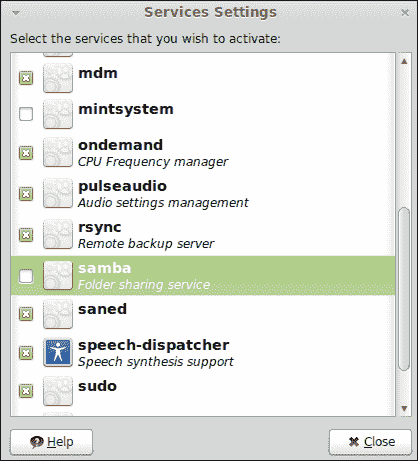

# 第十章。监控您的系统

*一旦一台电脑配置好了，不同的服务都在运行，就该确保一切正常，一切照常进行了。本章将介绍监控负责服务和运行进程的系统的方法，以及如何使用计算机资源，如内存、中央处理器和网络。*

在本章中，我们将涵盖以下主题:

*   什么是流程和服务
*   启动和停止服务
*   激活服务
*   列出正在运行的进程
*   显示中央处理器、内存和网络使用情况

# 流程和服务

Linux 新手用户总是询问 GNU/Linux 发行版中两个广泛使用的概念:进程和服务。这些对系统管理员来说非常重要，因为它们描述了在我们的操作系统上运行的应用程序。显然，当我们谈论如何监督计算机系统时，我们需要注意这一点。进程和服务的数量直接影响服务器的性能。系统管理员应该控制哪些应用程序正在运行，以及它们如何影响操作系统和其他资源及设备。

基本上，一个**进程** 是一个正在执行的计算机程序或应用程序，包括它当前的活动，影响资源，如中央处理器、打开的文件和内存。操作系统需要一组关于执行中的每个进程的信息。这种信息被称为**进程描述符** ，包括状态、父进程、打开文件列表、内存地址和一个名为的唯一标识号。

另一方面，我们发现了与流程相关的服务。**服务** 是一种无需操作系统用户直接干预即可运行的计算机程序。用“背景”这个词来指代这种执行是很常见的。请记住，在后台运行的应用程序不会向终端发送任何输出，尽管为此目的使用文件是一种常见的做法。在基于 UNIX 和 Linux 的操作系统中，谈论**守护进程** 来指代服务是非常常见的。我们可以认为这两个概念是等价的。Linux 内核在启动时启动一些守护进程，所以系统管理员可以决定这一点。一个简单的约定是使用后缀“d”来标识哪些程序作为守护程序运行。例如，`sshd`是运行 SSH 服务器的守护进程的名称。

通常，操作系统包括管理流程和服务的工具。Linux Mint 也不例外，我们稍后会发现哪些工具可以用来通过服务和流程管理正在运行的应用程序。

除了进程和服务，系统管理员还需要控制和管理资源，如中央处理器、内存、网络和文件系统。所有这些都是系统监控的一部分，因为它们会影响性能。在本章中，我们将学习如何监控我们的系统的基础知识，同时关注提到的资源，包括流程和服务。

# 服务的启动和停止

系统管理员需要知道如何启动和停止特定服务。作为日常工作的一部分，系统管理员检查正在运行的服务，启动新的服务。有时服务应该停止；例如，当不再需要某项服务时，我们可以停止它。此外，可能需要重新启动。所有这些任务都可以通过名为`initctl`的应用程序来执行。让我们看看如何使用它。

# 行动时间-停止和启动 SSH 守护程序

我们将学习如何停止和启动我们的 SSH 服务。记得我们之前在[第 9 章](09.html "Chapter 9. Security")*安全*中学习过如何安装 SSH。安装这个应用程序后，我们的 SSH 服务将默认运行，所以我们将开始学习如何停止它。

1.  像往常一样启动 MATE 终端。
2.  在 shell 中键入以下命令:

    ```sh
    $ sudo initctl stop ssh

    ```

3.  我们的 SSH 守护程序被停止，您将收到如下输出消息:

    ```sh
    ssh stop/waiting

    ```

4.  现在，我们将再次启动 SSH 守护程序。只需输入以下命令:

    ```sh
    $ sudo initctl start ssh

    ```

5.  一旦 SSH 服务开始运行，您可以看到如下消息:

    ```sh
    ssh start/running, process 2436

    ```

6.  另外，您可以通过执行以下命令来了解 SSH 服务的当前状态:

    ```sh
    $ sudo initctl status ssh

    ```

## *刚刚发生了什么？*

Linux Mint 包括一个名为`initctl` 的工具，它为我们提供了对`init`守护进程的控制。这个守护进程是一个特殊的守护进程，在 Linux 内核的引导过程中启动，它是其余服务和进程的父进程。通常，`init`的 PID 为`1`，而 Linux Mint 实现了一个特定的基于事件的守护进程`Upstart`。

`initctl`应用程序接受许多命令作为参数；其中两个是`start`和`stop`你之前学过的。作为第三个参数，我们可以传递将受操作影响的服务的名称，所以参数`stop ssh`分别表示操作和服务名称。

在我们的例子中，我们使用`list`操作检查了 SSH 服务的当前状态。该命令返回一条简单的消息，通知我们服务是启动还是关闭。此外，还可以使用`restart`操作，按此顺序停止和启动特定的服务器。

重要的是要知道我们需要作为根用户运行`initctl`，否则我们无法启动、停止或重启服务。这样做的原因是只有根用户可以访问这类操作。如果任何用户都可以这样做，那就没有意义了，因为服务对于系统的安全性和完整性很重要。

## 有一个 go 英雄-检查所有服务的当前状态

有时系统管理员需要了解操作系统中所有正在运行和停止的服务的当前状态。为此，我们可以使用`initctl`工具传递一个名为`list`的参数。命令如下:

```sh
$ sudo initctl list

```

我们会得到回应，如下图截图所示:


# 激活服务

之前我们已经学习了如何通过命令行启动和停止服务。然而，Linux Mint 还包括一个简单的图形用户界面应用程序，允许我们通过简单的按钮点击来选择我们想要在系统启动时激活或停用的服务。让我们看看如何通过**服务设置**应用程序激活服务。

# 行动时间——激活桑巴

为了与 Windows 系统共享文件和目录，我们可以使用 **Samba** 协议。让我们想象一下，我们已经在我们的 Linux Mint 中安装了一套工具和一个守护进程来实现这一点。我们将学习如何激活桑巴服务。

1.  点击**菜单**按钮，再次点击**所有应用**按钮。
2.  点击**管理**组的**服务**菜单选项。
3.  将显示属于**服务设置**应用程序的新窗口。
4.  Look for the **samba** option and click on it:

    

5.  选择**桑巴**选项后，必须输入密码。然后点击**关闭**按钮。下次启动系统时，Samba 服务将自动启动。

## *刚刚发生了什么？*

通常，将许多服务配置为在启动时自动启动非常有用。通过应用这种配置，系统管理员可以节省时间，并且他们确信服务将自动启动。

尽管通过命令行配置您的服务，Linux Mint 提供了一个简单直观的工具来做到这一点。如你所知，这个工具是**服务设置，** ，你可以从主菜单轻松访问。

# 列出正在运行的进程

系统管理员应该监督的最重要的事情之一是在其控制下的每台机器的操作系统上运行的当前进程的列表。请记住，每个正在运行的进程都在使用一些资源，如中央处理器、内存和文件。这意味着控制流程很重要，因为它们直接影响系统的性能和安全性。

Linux Mint 为我们提供了一个特定的工具来监控进程、中央处理器、内存、网络和我们机器的文件系统。我们将学习如何使用这个工具来监控我们的系统，并学习如何列出正在运行的进程。

# 行动时间–列出我们机器上运行的进程

之前我们讨论了一个监控系统的工具。嗯，它的名字是**系统监视器** ，默认安装在 Linux Mint 中。让我们学习如何访问这个工具，以及如何列出正在运行的进程。

1.  Click on the **Menu** button and click again on the **System Monitor** button:

    

2.  然后会显示一个新窗口。点击**流程**选项卡。
3.  Now, you can see the processes that are running and additional information about them, such as CPU and memory usage:

    

## *刚刚发生了什么？*

借助**系统监视器**工具，您可以看到哪些进程正在运行，并可以了解它们的当前状态以及每个进程的 CPU 和内存使用情况。除了这类信息外，**系统监视器**根据 CPU 使用情况显示计算机的平均负载。如您所见，**系统监视器** 显示最近一分钟、五分钟和十五分钟的平均负载信息。这些值有助于系统管理员控制机器的当前状态，并且可以应用阈值来决定何时应该采取某些操作。请记住，我们的目标是帮助我们的机器在不崩溃系统的情况下运行进程。

**系统监视器**为我们提供菜单选项，显示运行进程的不同视图。具体来说，我们可以显示所有进程(默认视图)、活动进程和我的进程(默认情况下为 root 用户)。此外，还可以更改显示信息的顺序，因此您可以显示例如根据内存消耗排序的所有进程。

**编辑**菜单允许我们访问可应用于运行过程的不同操作。您可以停止、终止和更改每个进程的优先级。为了执行这些操作，首先需要从列表中选择一个特定的进程。然后，您可以通过访问属于上述**编辑**菜单的选项来执行每个动作。

**系统监视器**提供的另一个有趣的特性是可以发现每个进程打开了哪些文件。您只需选择一个流程，然后点击**编辑**菜单的**打开** **文件**菜单选项。请记住，当窗口打开时，这些信息会自动改变，因为每个进程在执行过程中都可以打开和关闭文件。

# 显示 CPU、内存和网络使用情况

除了流程和服务之外，照顾好我们机器的资源也非常重要，因为应用程序需要使用这些资源。CPU、内存、和网络是我们计算机使用的最重要的资源，所以系统管理员应该时刻关注它们。为了让生活更轻松，Linux Mint 通过**系统监视器**应用程序实时提供这些资源的使用信息。我们将学习如何显示这些资源的当前使用情况。

# 行动时间–实时显示资源信息

我们来看看如何获取实时使用的主要计算机资源的基本信息。

1.  点击**菜单**按钮，再次点击**系统监视器**按钮。
2.  Click on the **Resources** tab and you have access to all information regarding CPU, memory, and network usage as shown:

    

## *刚刚发生了什么？*

点击**系统监视器**的**资源**选项卡，会显示一组图表。第一个为您提供了按时间划分的 CPU 使用百分比信息。此外，当前的 CPU 百分比显示在图表下方。

关于内存，我们找到了与主内存和交换内存使用相关的信息。显示与总内存相关的百分比值。图表上的紫色线代表主内存，绿色线用于交换内存。这两条线都显示在图表中，因此您可以很容易地进行比较。

网络信息在接收和发送的包之间是分开的；不同的颜色用来表示它们。您可以看到由您的计算机发送和接收的以字节为单位的包总数。此外，您可以获得每秒发送或接收多少封邮件。

正如您已经意识到的，所有关于资源的信息都是基于历史显示的。这意味着每个图形都是基于时间的，从某种意义上说，它是活的，信息是实时显示的。

## 玩个痛快——获取文件系统使用信息

除了内存、进程、CPU 和网络使用情况之外，您还可以获得关于文件系统使用情况的信息。要执行此操作，您只需单击**文件系统**选项卡和**系统监视器**即可显示每个文件系统、已装载目录信息、总空间、可用空间和已用空间百分比。

# 总结

在本章中，我们学习了系统监控的基础知识，这是系统管理员的一个重要领域。我们介绍了流程和服务，然后我们学习了如何管理服务以及如何监控计算机中最有价值的资源:内存、中央处理器、硬盘和网络。

具体来说，我们包括:

*   基本概念，如流程和服务
*   如何处理服务
*   找出正在运行的进程并能够停止它们
*   发现表明 CPU、内存和网络使用如何影响我们的计算机的图表

重要的是要记住，这一章只是对系统监控的基本介绍。这是一个很大的领域，良好的理解和良好的实践需要经验，这取决于我们要监管的系统的复杂性。

在这一点上，我们知道如何配置和监督我们的计算机；在下一章中，我们将讨论如何解决 Linux Mint 服务器或工作站运行时可能出现的常见问题。