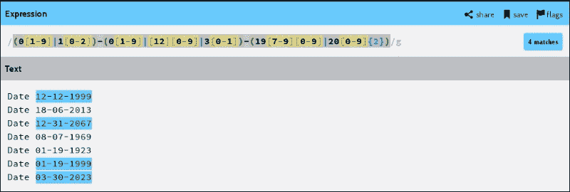
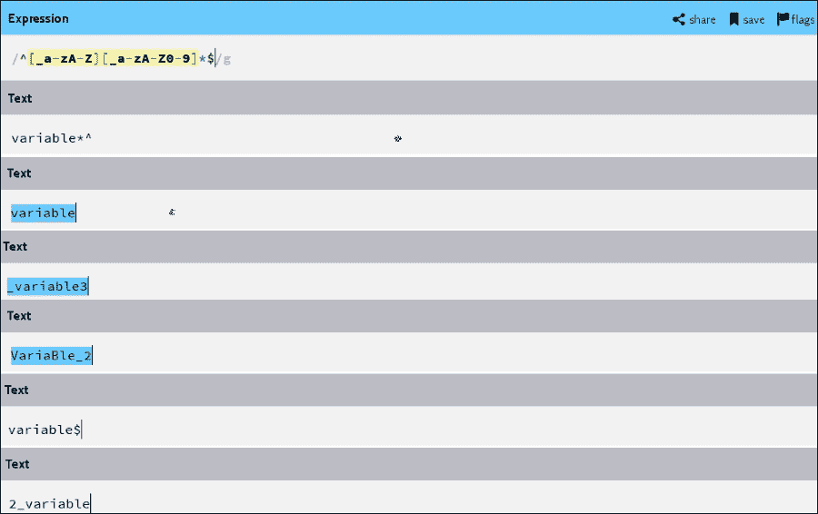
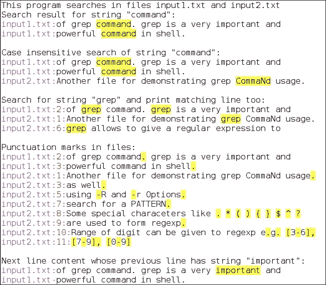
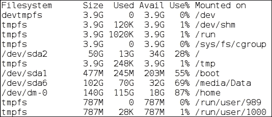
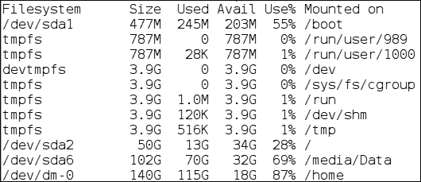
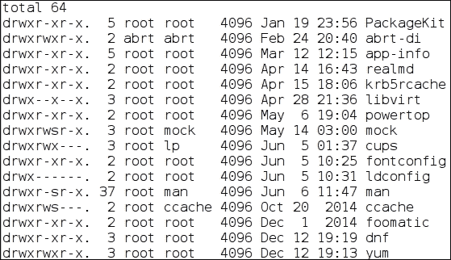
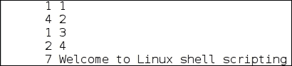
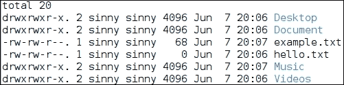
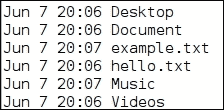
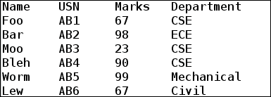

# 第二章。动手操作输入/输出、重定向管道和过滤器

在日常工作中，我们会遇到不同种类的文件，如文本文件、来自不同编程语言的源代码文件(例如，`file.sh`、`file.c`、`file.cpp`)等等。工作时，我们经常对文件或目录执行各种操作，例如搜索给定的字符串或模式、替换字符串、打印几行文件等。如果我们必须手动执行这些操作，那么执行这些操作并不容易。在有数千个文件的目录中手动搜索字符串或模式可能需要几个月的时间，并且很有可能出错。

Shell 提供了许多强大的命令，使我们的工作更容易、更快、更无错误。Shell 命令能够处理和过滤来自不同流的文本，如标准输入、文件等。这些命令有`grep`、`sed`、`head`、`tr`、`sort`等等。Shell 还带有一个用管道将输出从一个命令重定向到另一个命令的功能(`|`)。使用管道有助于避免创建不必要的临时文件。

这些命令最好的品质之一是它们伴随着`man`页出现。我们可以直接进入`man`页面，通过运行`man`命令来查看他们提供了哪些功能。大部分命令都有`--help`查找帮助用法、`--version`知道命令版本号等选项。

本章将详细介绍以下主题:

*   标准输入/输出和错误流
*   重定向标准输入/输出和错误流
*   管道和管线-连接命令
*   正则表达式
*   使用`grep`过滤输出
*   使用`sed`编辑输出
*   使用`tee`复制流
*   排序和查找唯一文本
*   使用`tr`进行基于字符的翻译
*   基于线条的过滤— `head`和`tail`
*   基于剪切的选择

# 标准输入/输出和错误流

在 shell 编程中，在命令或程序执行期间，有不同的方式提供输入(例如，通过键盘和终端)和显示输出(例如，终端和文件)以及错误(例如，终端，如果有的话)。

以下示例显示了运行命令时的输入、输出和错误:

*   用户通过键盘的输入和程序通过标准输入流(即终端)获得的输入如下:

    ```sh
    $ read -p "Enter your name:"
    Enter your name:Foo
    ```

*   打印在标准输出流即终端上的输出如下:

    ```sh
    $ echo "Linux Shell Scripting"
    Linux Shell Scripting
    ```

*   打印在标准错误流即终端上的错误消息如下:

    ```sh
    $  cat hello.txt
    cat: hello.txt: No such file or directory
    ```

程序执行时，默认情况下会打开三个文件，分别是`stdin`、`stdout`和`stderr`。下表简要描述了其中的每一项:

<colgroup><col style="text-align: left"> <col style="text-align: left"> <col style="text-align: left"></colgroup> 
| 

文件描述符号

 | 

文件名

 | 

描述

 |
| --- | --- | --- |
| `0` | `stdin` | 这是从终端读取的标准输入 |
| `1` | `stdout` | 这是终端的标准输出 |
| `2` | `stderr` | 这是对终端的标准误差 |

## 文件描述符

文件描述符是表示操作系统中打开的文件的整数。为每个打开的文件提供唯一的文件描述符编号。文件描述符的编号从`0`开始上升。

每当在 Linux 中创建新的进程时，标准的输入、输出和错误文件都会与其他需要处理的打开文件一起提供给它。

为了知道所有打开的文件描述符都与一个进程相关联，我们将考虑以下示例:

运行一个应用程序，首先获取它的进程标识。考虑以运行`bash`为例获取 bash 的 PID:

```sh
$ pidof bash
2508 2480 2464 2431 1281
```

我们看到多个 bash 进程正在运行。以其中一个 bash PID 为例，`2508`，运行以下命令:

```sh
$  ls -l /proc/2508/fd

```

```sh
total 0
lrwx------. 1 sinny sinny 64 May 20 00:03 0 -> /dev/pts/5
lrwx------. 1 sinny sinny 64 May 20 00:03 1 -> /dev/pts/5
lrwx------. 1 sinny sinny 64 May 19 23:22 2 -> /dev/pts/5
lrwx------. 1 sinny sinny 64 May 20 00:03 255 -> /dev/pts/5
```

我们看到 0、1 和 2 个打开的文件描述符与进程 bash 相关联。目前都指向`/dev/pts/5`。`pts`，为伪终端从机。

所以，无论我们在这个 bash 中做什么，输入、输出以及与这个 PID 相关的错误，输出都会被写入`/dev/pts/5`文件。但是`pts`文件是伪文件，内容在内存中，打开文件就什么也看不到了。

# 重定向标准输入/输出和错误流

我们有一个选项来重定向标准的输入、输出和错误，例如，重定向到一个文件、另一个命令、预期的流等等。重定向在不同方面都很有用。例如，我有一个 bash 脚本，它的输出和错误显示在一个标准输出上——也就是终端上。我们可以通过将错误和输出中的一个或两个重定向到一个文件来避免混淆。不同的操作符用于重定向。下表显示了用于重定向的一些运算符及其说明:

<colgroup><col style="text-align: left"> <col style="text-align: left"></colgroup> 
| 

操作员

 | 

描述

 |
| --- | --- |
| `>` | 这会将标准输出重定向到文件 |
| `>>` | 这将向文件追加一个标准输出 |
| `<` | 这会重定向文件中的标准输入 |
| `>&` | 这将把标准输出和错误重定向到一个文件 |
| `>>&` | 这会将一个标准输出和错误附加到一个文件中 |
| `&#124;` | 这将一个输出重定向到另一个命令 |

## 重定向标准输出

程序或命令的输出可以重定向到文件。当我们将来必须查看输出时，将输出保存到文件中会很有用。使用不同输入运行的程序的大量输出文件可用于研究程序输出行为。

例如，将回声输出重定向到`output.txt`如下所示:

```sh
$ echo "I am redirecting output to a file" > output.txt
$

```

我们可以看到终端上没有显示输出。这是因为输出被重定向到`output.txt`。运算符“`>`”(大于)告诉 shell 将输出重定向到运算符后面提到的任何文件名。在我们这里，是`output.txt`:

```sh
$ cat output.txt
I am redirecting output to a file

```

现在，让我们向`output.txt`文件添加一些更多的输出:

```sh
$ echo "I am adding another line to file" > output.txt
$ cat output.txt
I am adding another line to file

```

我们注意到`output.txt`文件之前的内容被删除了，只有最新的重定向内容。要保留以前的内容并将最新的重定向输出附加到文件中，请使用运算符“`>>`”:

```sh
$ echo "Adding one more line" >> output.txt
$ cat output.txt 
I am adding another line to file
Adding one more line

```

我们还可以使用运算符“`|`”(管道)将程序/命令的输出重定向到 bash 中的另一个命令:

```sh
 $ ls /usr/lib64/ | grep libc.so
libc.so
libc.so.6

```

在本例中，我们使用“`|`”(管道)运算符将`ls`的输出提供给`grep`命令，`grep`提供了`libc.so`库的匹配搜索结果:

## 重定向标准输入

可以使用<(小于)运算符从文件中重定向命令输入，而不是从标准输入中获取输入。例如，我们想要计算从*重定向标准输出*部分创建的`output.txt`文件中的字数:

```sh
$ cat  output.txt
I am adding another line to file
Adding one more line
$  wc -w < output.txt 
11

```

我们可以对`output.txt`的内容进行排序:

```sh
$ sort < output.txt    # Sorting output.txt on stdout
Adding one more line
I am adding another line to file

```

我们也可以给出一个`patch`文件作为`patch`命令的输入，以便在源代码中应用一个`patch.diff`。命令`patch`用于应用文件中所做的附加更改。其他更改作为`diff`文件提供。通过运行`diff`命令，一个`diff`文件包含原始文件和修改文件之间的变化。例如，我有一个补丁文件要在`output.txt`上应用:

```sh
$ cat patch.diff    # Content of patch.diff file

```

```sh
2a3
> Testing patch command
$ patch output.txt < patch.diff   # Applying patch.diff to output.txt
$ cat output.txt    # Checking output.txt content after applying patch
I am adding another line to file
Adding one more line
Testing patch command
```

## 重定向标准误差

在 bash 中执行命令/程序时，由于不同的原因，如输入无效、参数不足、找不到文件、程序中有 bug 等，有可能出现错误:

```sh
$ cd /root  # Doing cd to root directory from a normal user
bash: cd: /root/: Permission denied
Bash prints the error on a terminal saying, permission denied.

```

一般来说，错误会打印在终端上，这样我们就很容易知道错误的原因。在终端上打印错误和输出可能很烦人，因为我们必须手动查看每一行并检查程序是否遇到任何错误:

```sh
$ cd / ; ls; cat hello.txt; cd /bin/; ls *.{py,sh}

```

我们在前面的部分运行了一系列命令。首先`cd`到`/`、`ls`的`/`内容，猫档`hello.txt`、`cd`到`/bin`，查看`/bin/`中匹配`*.py`和`*.sh`的文件。输出如下:

```sh
bin  boot  dev  etc  home  lib  lib64  lost+found  media  mnt  opt  proc  root  run  sbin  srv  sys  tmp  usr  var
cat: hello.txt: No such file or directory 
alsa-info.sh        kmail_clamav.sh    sb_bnfilter.py  sb_mailsort.py      setup-nsssysinit.sh    amuFormat.sh      kmail_fprot.sh   sb_bnserver.py    sb_mboxtrain.py    struct2osd.sh      core_server.py  kmail_sav.sh     sb_chkopts.py      sb_notesfilter.py  
```

我们看到`hello.txt`不存在于`/`目录中，因此终端上也打印了一个错误，还有其他输出。我们可以将错误重定向如下:

```sh
$ (cd / ; ls; cat hello.txt; cd /bin/; ls *.{py,sh}) 2> error.txt

```

```sh
bin  boot  dev  etc  home  lib  lib64  lost+found  media  mnt  opt  proc  root  run  sbin  srv  sys  tmp  usr  var
alsa-info.sh        kmail_clamav.sh    sb_bnfilter.py  sb_mailsort.py      setup-nsssysinit.sh    amuFormat.sh      kmail_fprot.sh   sb_bnserver.py    sb_mboxtrain.py    struct2osd.sh      core_server.py  kmail_sav.sh     sb_chkopts.py      sb_notesfilter.py  
```

我们可以看到错误已经重定向到`error.txt`文件。要验证，请检查`error.txt`内容:

```sh
$ cat error.txt
cat: hello.txt: No such file or directory

```

## 多次重定向

我们可以将`stdin`、`stdout`和`stderr`重定向到一个命令或脚本中，或者它们的组合中。

以下命令重定向`stdout`和`stder`:

```sh
$ (ls /home/ ;cat hello.txt;) > log.txt 2>&1

```

这里，`stdout`被重定向到`log.txt`，错误信息也被重定向到`log.txt`。在`2>&1`中，`2>`表示重定向错误，`&1`表示重定向到`stdout`。在我们的例子中，我们已经将`stdout`重定向到了`log.txt`文件。所以，现在`stdout`和`stderr`输出都将写入`log.txt`，终端上不会打印任何东西。为了验证，我们将检查`log.txt`的内容:

```sh
$ cat log.txt
lost+found
sinny
cat: hello.txt: No such file or directory

```

以下示例显示了`stdin`、`stdout`和`stderr`重定向:

```sh
$  cat < ~/.bashrc > out.txt 2> err.txt

```

这里，`home`目录中的`.bashrc`文件作为`cat`命令的输入，其输出被重定向到`out.txt`文件。其间遇到的任何错误都被重定向到`err.txt`文件。

以下`bash`脚本将更加清晰地解释`stdin`、`stdout`、`stderr`及其重定向:

```sh
#!/bin/bash
# Filename: redirection.sh
# Description: Illustrating standard input, output, error
# and redirecting them

ps -A -o pid -o command > p_snapshot1.txt
echo -n "Running process count at snapshot1: "
wc -l < p_snapshot1.txt
echo -n "Create a new process with pid = "
tail -f /dev/null &  echo $!    # Creating a new process
echo -n "Running process count at snapshot2: "
ps -A -o pid -o command > p_snapshot2.txt
wc -l < p_snapshot2.txt
echo
echo "Diff bewteen two snapshot:"
diff p_snapshot1.txt p_snapshot2.txt
```

该脚本保存系统中所有运行进程的两个快照，并生成`diff`。运行该流程后的输出看起来如下所示:

```sh
$ sh redirection.sh

```

```sh
Running process count at snapshot1: 246
Create a new process with pid = 23874
Running process count at snapshot2: 247

Diff bewteen two snapshot:
246c246,247
< 23872 ps -A -o pid -o command
---
> 23874 tail -f /dev/null
> 23875 ps -A -o pid -o command
```

# 管道和管线-连接命令

程序的输出通常保存在文件中以备将来使用。有时，创建临时文件是为了将一个程序的输出用作另一个程序的输入。我们可以避免创建临时文件，并使用 bash 管道和管道将一个程序的输出作为另一个程序的输入。

## 管道

操作员`|`用表示的管道通过进程间通信机制将左边进程的标准输出连接到右边进程的标准输入。换句话说，`|`(管道)通过提供一个命令的输出作为另一个命令的输入来连接命令。

考虑以下示例:

```sh
$ cat /proc/cpuinfo | less

```

这里，`cat`命令不是在`stdout`上显示`/proc/cpuinfo`文件的内容，而是将其输出作为输入传递给`less`命令。`less`命令从`cat`获取输入，并显示在每页的`stdout`上。

使用管道的另一个示例如下:

```sh
$ ps -aux | wc -l    # Showing number of currently running processes in system
254

```

## 管道

流水线是由操作符“`|`”分隔的一系列程序/命令，其中每个命令的执行输出作为下一个命令的输入给出。管道中的每个命令都在一个新的子外壳中执行。语法如下:

`command1 | command2 | command3 …`

显示管道的示例如下:

```sh
$ ls /usr/lib64/*.so | grep libc | wc -l
13

```

这里，我们首先从扩展名为`.so`的`/usr/lib64`目录中获取一个文件列表。获得的输出作为输入传递给下一个`grep`命令，以寻找`libc`字符串。输出被进一步提供给`wc`命令来计算行数。

# 正则表达式

正则表达式(也称为正则表达式或正则表达式)提供了一种在给定的大块文本数据中指定要匹配的模式的方法。它支持一组字符来指定模式。它被广泛用于文本搜索和字符串操作。很多 shell 命令都提供了选项来指定正则表达式，比如`grep`、`sed`、`find`等等。

正则表达式的概念也用于其他编程语言，如 C++、Python、Java、Perl 等。有不同语言的库支持正则表达式的功能。

## 正则表达式元字符

正则表达式中使用的元字符在下表中解释:

<colgroup><col style="text-align: left"> <col style="text-align: left"></colgroup> 
| 

元字符

 | 

描述

 |
| --- | --- |
| *(星号) | 这与前一个字符的零次或多次出现相匹配 |
| +(加号) | 这与前一个字符的一次或多次出现相匹配 |
| ？ | 这个匹配前一个元素的零个或一个出现 |
| 。(点) | 这个匹配任何一个字符 |
| ^ | 这匹配线的起点 |
| $ | 这与线的末端相匹配 |
| [...] | 这与方括号内的任何一个字符相匹配 |
| [...] | 这与不在方括号内的任何一个字符相匹配 |
| &#124;(条形) | 这与&#124;的左侧或右侧元素相匹配 |
| \{X\} | 这与前一个元素的 X 次出现完全匹配 |
| \{X，} | 这与前一个元素的 X 或更多次出现相匹配 |
| \{X，Y\} | 这与前一元素的 X 到 Y 匹配 |
| \(...\) | 这将所有元素分组 |
| \< | 这与单词开头的空字符串相匹配 |
| \> | 这与单词末尾的空字符串相匹配 |
| \ | 这将禁用下一个字符的特殊含义 |

## 字符范围和类别

当我们查看人类可读的文件或数据时，其主要内容包含字母(a 到 z)和数字(0 到 9)。在编写正则表达式来匹配由 T2 字母或数字组成的模式时，我们可以使用字符范围或类。

### 字符范围

我们也可以在正则表达式中使用字符范围。我们可以用一对由连字符分隔的字符来指定一个范围。任何落在该范围内的字符都是匹配的。字符范围包含在方括号内。

下表显示了一些字符范围:

<colgroup><col style="text-align: left"> <col style="text-align: left"></colgroup> 
| 

字符范围

 | 

描述

 |
| --- | --- |
| `[a-z]` | 这个匹配从 a 到 z 的任何单个小写字母 |
| `[A-Z]` | 这个匹配从 A 到 Z 的任何单个大写字母 |
| `[0-9]` | 这与从 0 到 9 的任意单个数字相匹配 |
| `[a-zA-Z0-9]` | 该匹配任何单个字母或数字字符 |
| `[h-k]` | 这个匹配从 h 到 k 的任何单个字母 |
| `[2-46-8j-lB-M]` | 这个匹配从 2 到 4 或 6 到 8 的任何一个数字或从 j 到 l 或从 B 到 M 的任何一个字母 |

**字符类**:另一种指定字符匹配范围的方法是使用字符类。它在方括号[:class:]中指定。下表中提到了可能的类值:

<colgroup><col style="text-align: left"> <col style="text-align: left"></colgroup> 
| 

字符类

 | 

描述

 |
| --- | --- |
| `[:alnum:]` | 这将匹配任何单个字母或数字字符；例如，[a-zA-Z0-9] |
| `[:alpha:]` | 这匹配任何单个字母字符；例如，[a-zA-Z] |
| `[:digit:]` | 此匹配任意一位数字；例如，[0-9] |
| `[:lower:]` | 这个匹配任何单个小写字母；例如，[a-z] |
| `[:upper:]` | 这与任何单个大写字母匹配；例如，[A-Z] |
| `[:blank:]` | 这与空格或制表符匹配 |
| `[:graph:]` | 这将匹配 ASCII 范围内的字符，例如 33-126，不包括空格字符 |
| `[:print:]` | 这与 ASCII 范围内的字符相匹配，例如。32-126—包括空格字符 |
| `[:punct:]` | 这个匹配任何标点符号，比如“？”, '!', '.'，'，'等等 |
| `[:xdigit:]` | 这匹配任何十六进制字符；例如，[a-fA-F0-9] |
| `[:cntrl:]` | 这匹配任何控制字符 |

**创建自己的正则表达式**:在正则表达式的前面几节中，我们讨论了元字符、字符范围、字符类及其用法。利用这些概念，我们可以创建强大的正则表达式，用于根据我们的需要过滤掉文本数据。现在，我们将使用所学的概念创建一些正则表达式。

### 以毫米-日-年格式匹配日期

我们将考虑从 UNIX 纪元开始的有效日期，即 1970 年 1 月 1 日。在本例中，我们将把 UNIX Epoch 和 2099 年 12 月 30 日之间的所有日期视为有效日期。下面的小节将解释正则表达式的形成:

#### 匹配有效月份

*   0[1-9]匹配 01 至 09 月
*   1[0-2]匹配第 10、11 和 12 个月
*   “|”匹配左表达式或右表达式

综合起来，匹配有效日期月份的正则表达式将是 **0[1-9]|1[0-2]** 。

#### 匹配有效日期

*   0[1-9]匹配01 到 09 天
*   [12][0-9]匹配第 10 到 29 天
*   3[0-1]匹配第 30 到 31 天
*   “|”匹配左表达式或右表达式
*   **0[1-9]|[12][0-9]|3[0-1]** 匹配日期中的所有有效日期

#### 匹配日期中的有效年份

*   19[7-9][[0-9]匹配 1970 年至 1999 年的年
*   20[0-9]{2}匹配 2000 年至 2099 年的年份
*   “|”匹配左表达式或右表达式
*   **19[7-9][0-9]|20[0-9]{2}** 匹配 1970 年至 2099 年之间的所有有效年份

#### 将有效的月、日和年组合起来形成有效的日期

我们的日期将是年月日格式。通过将前面几节中形成的月、日和年的正则表达式放在一起，我们将得到有效日期的正则表达式:

(0[1-9]|1[0-2])-(0[1-9]|[12][0-9]|3[0-1])-(19[7-9][0-9]|20[0-9]{2})

有一个不错的网站，[http://regexr.com/](http://regexr.com/)，也可以验证正则表达式。下面的屏幕截图显示了给定输入中有效日期的匹配:



### 有效外壳变量的 Regex

在[第 1 章](01.html "Chapter 1. The Beginning of the Scripting Journey")*脚本之旅的开始*中，我们学习了 shell 中变量的命名。有效的变量名可以包含字母数字和下划线，变量的第一个字母不能是数字。

记住这些规则，有效的 shell 变量 regex 可以编写如下:

-[_ a-za-z][_ a-za-z0-9]* $。

这里，^(插入符号)匹配一行的开始。

正则表达式[_a-zA-Z]匹配任何大写或小写字母[_a-zA-Z0-9]*匹配零次或多次出现的 _，任何数字或大写和小写字母$(美元)匹配行尾。

在字符类格式中，我们可以将正则表达式写成**^[_[:alpha:]][_[:alnum:]]*$**。

下面的屏幕截图显示了使用 regex 格式的有效外壳变量:



### 注

*   用单引号(')将正则表达式括起来，以避免前壳扩展。
*   在字符前使用反斜杠(\)来转义元字符的特殊含义。
*   元字符，如？、+、{、|、(、和)是已知的扩展正则表达式。当在基本正则表达式中使用时，它们就失去了它们的特殊意义。为了避免这种情况，请将它们与反斜杠“\？”一起使用、“\+”、“\{”、“\|”、“\(”和“\)”。

# 使用 grep 过滤输出

其中的强大和广泛使用的命令在壳牌是`grep`。它在输入文件中搜索并匹配找到给定模式的行。默认情况下，所有匹配的图案都打印在通常为终端的`stdout`上。我们还可以将匹配的输出重定向到其他流，如文件。`grep`也可以从在“`|`”左侧执行的命令的重定向输出中获取输入，而不是从文件中获取输入。

## 语法

使用`grep`命令的语法如下:

`grep [OPTIONS] PATTERN [FILE...]`

在这里，`FILE`可以对多个文件进行一次搜索。如果没有文件作为搜索输入，它将搜索标准输入。

`PATTERN`可以是任何有效的正则表达式。根据需要将`PATTERN`放在单引号(')或双引号(")内。例如，使用单引号(')来避免任何 bash 扩展，使用双引号(")来进行扩展。

很多`OPTIONS`在`grep`都有。下表讨论了一些重要且广泛使用的选项:

<colgroup><col style="text-align: left"> <col style="text-align: left"></colgroup> 
| 

[计]选项

 | 

使用

 |
| --- | --- |
| ［构成来自拉丁语、结尾为-us 的名词的复数］ | 这在模式和输入文件中强制执行不区分大小写的匹配 |
| `-v` | 这会显示不匹配线 |
| `-o` | 此仅显示匹配行中匹配的部分 |
| `-f FILE` | 这将从文件中获取一个模式，每行一个 |
| `-e PATTERN` | 该指定多个搜索模式 |
| `-E` | 将模式视为扩展正则表达式(egrp) |
| `-r` | 这将递归读取目录中的所有文件，除非明确指定为输入文件，否则不包括符号链接的解析 |
| `-R` | 这会递归读取目录中的所有文件并解析符号(如果有) |
| `-a` | 该将二进制文件作为文本文件进行处理 |
| `-n` | 这会在每个匹配的行前面加上一个行号 |
| `-q` | 不要在标准输出上打印任何东西 |
| `-s` | 不打印错误信息 |
| `-c` | 这会打印每个输入文件的匹配行数 |
| `-A NUM` | 这将在实际字符串匹配后打印 NUM 行。(使用-o 选项无效) |
| `-B NUM` | 这将在实际字符串匹配之前打印 NUM 行。(使用-o 选项无效) |
| `-C NUM` | 这将打印实际字符串匹配前后的 NUM 行。(使用-o 选项无效) |

## 在文件中寻找模式

很多时候，我们必须在文件中搜索给定的字符串或模式。`grep`命令为我们提供了在一行中完成的能力。让我们看看下面的例子:

我们示例的输入文件将是`input1.txt`:

```sh
$ cat input1.txt  # Input file for our example

```

```sh
This file is a text file to show demonstration
of grep command. grep is a very important and
powerful command in shell.
This file has been used in chapter 2
```

我们将尝试使用`grep`命令从`input1.txt`文件中获取以下信息:

*   行数
*   以大写字母开头的行
*   以句点(.)结尾的行。)
*   句子数量
*   搜索没有使用字符串`file`次数`periodNumber`的子字符串`sent lines`

下面的 shell 脚本演示了如何执行上述任务:

```sh
#!/bin/bash
#Filename: pattern_search.sh
#Description: Searching for a pattern using input1.txt file

echo "Number of lines = `grep -c '.*' input1.txt`"
echo "Line starting with capital letter:"
grep -c ^[A-Z].* input1.txt
echo
echo "Line ending with full stop (.):"
grep '.*\.$' input1.txt
echo
echo -n "Number of sentence = "
grep -c '\.' input1.txt
echo "Strings matching sub-string sent:"
grep -o "sent" input1.txt
echo
echo "Lines not having full stop are:"
grep -v '\.' input1.txt
echo
echo -n "Number of times string file used: = "
grep -o "file" input1.txt | wc -w
```

运行`pattern_search.sh` shell 脚本后的输出如下:

```sh
Number of lines = 4
Line starting with capital letter:
2

Line ending with full stop (.):
powerful command in shell.

Number of sentence = 2
Strings matching sub-string sent:

Lines not having full stop are:
This file is a text file to show demonstration
This file has been used in chapter 2

Number of times string file used: = 3
```

## 在多个文件中寻找模式

`grep`命令还允许我们在多个文件中搜索一个模式作为输入。为了详细解释这个，我们将直接跳到下面的例子:

在我们的例子中，输入文件将是`input1.txt`和`input2.txt`。

我们将重复使用上例中`input1.txt`文件的内容:

`input2.txt`的内容如下:

```sh
$ cat input2.txt

```

```sh
Another file for demonstrating grep CommaNd usage.
It allows us to do CASE Insensitive string test
as well.
We can also do recursive SEARCH in a directory
using -R and -r Options.
grep allows to give a regular expression to
search for a PATTERN.
Some special characters like . * ( ) { } $ ^ ?
are used to form regexp.
Range of digit can be given to regexp e.g. [3-6],
[7-9], [0-9]
```

我们将尝试使用`grep`命令从`input1.txt`和`input2.txt`文件中获取以下信息:

*   搜索字符串`command`
*   字符串的不区分大小写搜索`command`
*   打印字符串`grep`匹配的行号
*   搜索标点符号
*   搜索字符串`important`时，打印一行，后跟匹配的行

下面的 shell 脚本演示了如何遵循前面的步骤:

```sh
#!/bin/bash
# Filename: multiple_file_search.sh
# Description: Demonstrating search in multiple input files

echo "This program searches in files input1.txt and input2.txt"
echo "Search result for string \"command\":"
grep "command" input1.txt input2.txt
echo
echo "Case insensitive search of string \"command\":"
# input{1,2}.txt will be expanded by bash to input1.txt input2.txt
grep -i "command" input{1,2}.txt
echo
echo "Search for string \"grep\" and print matching line too:"
grep -n "grep" input{1,2}.txt
echo
echo "Punctuation marks in files:"
grep -n [[:punct:]] input{1,2}.txt
echo
echo "Next line content whose previous line has string \"important\":"
grep -A 1 'important' input1.txt input2.txt
```

以下截图是运行 shell 脚本`pattern_search.sh`后的输出。匹配的模式字符串已突出显示:



## 多几个 grep 用法

以下小节将介绍`grep`命令的更多用法。

### 在二进制文件中搜索

到目前为止，我们已经看到了所有运行在文本文件上的例子。我们也可以使用`grep`在二进制文件中搜索模式。为此，我们必须告诉`grep`命令将二进制文件也视为文本文件。选项`-a`或`–text`告诉`grep`将二进制文件视为测试文件。

我们知道`grep`命令本身是一个执行并给出搜索结果的二进制文件。

`grep`中的选项之一是`--text`。字符串`--text`应该在`grep`二进制文件中的某个地方可用。让我们按如下方式搜索它:

```sh
$ grep --text '\-\-text' /usr/bin/grep 
 -a, --text                equivalent to –binary-files=text

```

我们看到字符串`--text`是在搜索路径`/usr/bin/grep`中找到的。反斜杠(“`\`”)用于转义其特殊含义。

现在，让我们在`wc`二进制中搜索`-w`字符串。我们知道`wc`命令有一个选项`-w`，可以计算输入文本的字数。

```sh
$ grep -a '\-w' /usr/bin/wc
 -w, --words            print the word counts

```

### 在目录中搜索

我们还可以告诉 `grep`使用选项`-R`递归搜索目录中的所有文件/目录。这避免了将每个文件指定为`grep`的输入文本文件的麻烦。

例如，我们有兴趣知道在一个标准的`include`目录中有多少地方使用了`#include <stdio.h>`:

```sh
$ grep -R '\#include <stdio\.h>' /usr/include/ | wc -l
77

```

这意味着在`/usr/include`目录中的`77`位置可以找到`#include <stdio.h>`字符串。

在另一个例子中，我们想知道`/usr/lib64/python2.7/`中有多少 Python 文件(扩展名`.py`)有`"import os"`。我们可以如下检查:

```sh
$ grep -R "import os" /usr/lib64/python2.7/*.py | wc -l
93

```

### 从搜索中排除文件/目录

我们也可以指定`grep`命令，从搜索中排除特定的目录或文件。当我们不想让`grep`查看包含一些机密信息的文件或目录时，这很有用。这在我们确信搜索某个目录没有用的情况下也很有用。因此，排除它们将减少搜索时间。

假设有一个叫做`s0`的源代码目录，使用的是`git`版本控制。现在，我们对在源文件中搜索文本或模式感兴趣。在这种情况下，在`.git`子目录中搜索将毫无用处。我们可以将`.git`从搜索中排除，如下所示:

```sh
$  grep -R  --exclude-dir=.git "search_string" s0

```

这里，我们在`s0`目录中搜索`search_string`字符串，告诉`grep`不要在`.git`目录中搜索。

不排除目录，使用`--exclude-from=FILE`选项排除文件。

### 显示具有匹配模式的文件名

在一些用例中，我们不关心搜索在哪里匹配，以及搜索在文件中匹配了多少位置。相反，我们感兴趣的是只知道至少有一个搜索匹配的文件名。

例如，我想保存在文件中找到的具有特定搜索模式的文件名，或者重定向到其他命令进行进一步处理。我们可以使用`-l`选项实现这一点:

```sh
$ grep -Rl "import os" /usr/lib64/python2.7/*.py > search_result.txt
$ wc -l search_result.txt

```

```sh
79
```

本示例获取写入`import os`的文件的名称，并将结果保存在文件`search_result.txt`中。

### 匹配一个精确的单词

单词的精确匹配也可以使用单词边界，即搜索模式两侧的`\b`。

在这里，我们将重用`input1.txt`文件及其内容:

```sh
$ grep -i --color "\ba\b" input1.txt

```

`--color`选项允许彩色打印匹配的搜索结果。

`"\ba\b"`选项告诉`grep`只寻找单独的角色 **a** 。在搜索结果中，它不会匹配字符串中作为子字符串出现的字符`a`。

以下屏幕截图显示了输出:


# 使用 sed 编辑输出

`sed` 命令是一个非交互式流编辑器，允许您修改标准输入或文件的内容。它对管道中的每一行执行操作。语法将是:

`sed [OPTIONS]... {script} [input-file …]`

默认情况下，输出显示在`stdout`上，但如果指定，可以重定向到文件。

`input-file`是需要运行`sed`的文件。如果没有指定文件，则从`stdin`读取。

`script`可以是一个命令，也可以是一个有多个命令传递给`sed`的文件，`OPTIONS`到`sed`如下表所示:

<colgroup><col style="text-align: left"> <col style="text-align: left"></colgroup> 
| 

[计]选项

 | 

描述

 |
| --- | --- |
| 同-EN | 这抑制了图案空间的自动打印 |
| 电子脚本 | 这允许执行多个脚本 |
| -r | 这使用了脚本中的扩展正则表达式 |
| -不 | 这指定了换行长度 |
| - posix | 这将禁用所有 GNU 扩展 |
| -你 | 这将从输入中加载最少量的数据，并频繁刷新输出缓冲区 |

## 使用 s 的字符串替换

`sed`命令广泛用于文本文件中的字符串替换。程序员经常在重命名一个巨大源代码中的变量时使用这个特性。它通过避免手动重命名节省了程序员的大量时间。

替换命令`s`有以下字段:

`s/regex/replacement/`

这里，`s`表示执行替换，`/`作为分隔符，`regex`是需要替换的正则表达式。这里也可以指定一个简单的字符串。最后一个字段`replacement`是匹配的结果应该用什么替换。

默认情况下，`sed`将仅替换一行中匹配模式的第一个匹配。要替换所有事件，请在`/—`结束后使用`g`标志，即`s/regex/replacement/g`。

下表中提到了一些可以使用的标志:

<colgroup><col style="text-align: left"> <col style="text-align: left"></colgroup> 
| 

旗

 | 

描述

 |
| --- | --- |
| `g` | 这将对一行中的所有匹配应用替换 |
| `p` | 如果发生替换，这将打印一个新的图案空间 |
| `w filename` | 这会将替换的模式空间写入文件名 |
| `N` | 这将仅替换匹配行中的第 n 个匹配结果 |

我们有`sed.sh`文件作为示例。该文件的内容如下:

```sh
$ cat sed.sh

```

```sh
#!/bin/bash

var1="sed "
var1+="command "
var1+="usage"

echo $var1
```

这是一个 shell 脚本，其中变量`var1`已经在四个地方使用过了。现在，我们要将变量`var1`重命名为`variable`。我们可以使用`sed`命令非常容易地做到这一点:

```sh
$ sed -i 's/var1/variable/g' sed.sh
$ cat sed.sh

```

```sh
#!/bin/bash

variable="sed "
variable+="command "
variable+="usage"

echo $variable
```

这里`-i`选项用于替换输入文件。

## 多次替换

我们也可以使用`-e`后跟一个命令来指定要执行的多个替换命令。

比如考虑`sed.txt`文件。该文件的内容如下:

```sh
$ cat sed.txt
The sed command is widely used for string
substitution in text file. Programmers frequently
use this feature while renaming a variable in huge source code.
It saves lot of programmers time by avoiding manual renaming.
```

现在，我们要将“`.`”替换为“`,`”，并删除包含字符串`manual`的行:

```sh
$ sed -e 's/\./,/g' -e '/manual/d' sed.txt
The sed command is widely used for string
substitution in text file, Programmers frequently
use this feature while renaming a variable in huge source code,

```

在`sed.txt`文件中，`s/\./,/g`命令首先将“`.`”替换为“`,`”，`/manual/d`进一步删除包含字符串`manual`的行。

# 使用三通复制流

在某些情况下，需要在`stdout`上打印输出，并将输出保存在文件中。一般来说，命令输出可以打印，也可以保存在文件中。要解决它，使用`tee`命令。该命令读取标准输入，并写入标准输出和文件。`tee`的语法如下:

`tee [OPTION] [FILE …]`

`tee`命令将输出复制到每个`FILE`和`stdout`。`OPTIONS`可以如下:

<colgroup><col style="text-align: left"> <col style="text-align: left"></colgroup> 
| 

[计]选项

 | 

描述

 |
| --- | --- |
| `-a, --append` | 这个追加到`FILE`而不是覆盖 |
| `-i, --ignore-interrupts` | 这将忽略中断信号(如果有) |

向`stdout`和文件写入输出:一般来说，要向`stdout`和文件写入输出，我们会调用同一个命令两次，有重定向和没有重定向。例如，以下命令显示了如何在`stdout`上打印输出并将其保存到文件中:

```sh
$  ls /usr/bin/*.pl  # Prints output on stdout
/usr/bin/rsyslog-recover-qi.pl  /usr/bin/syncqt.pl
$  ls /usr/bin/*.pl> out.txt    # Saves output in file out.txt

```

我们可以通过使用`tee`命令运行一次`ls`命令来完成这两个任务，如下所示:

```sh
$  ls /usr/bin/*.pl| tee  out.txt    # Output gets printed to stdout and saved in out.txt
/usr/bin/rsyslog-recover-qi.pl
/usr/bin/syncqt.pl
$ cat out.txt      #Checking content of out.txt
/usr/bin/rsyslog-recover-qi.pl
/usr/bin/syncqt.pl

```

我们也可以为要写入每个文件的输出指定多个文件名到`tee`。这会将输出复制到所有文件:

```sh
$ ls /usr/bin/*.pl| tee  out1.txt out2.txt
/usr/bin/rsyslog-recover-qi.pl
/usr/bin/syncqt.pl

```

通过运行上述命令，输出也将被写入`out1.txt`和`out2.txt`文件:

```sh
$ cat out1.txt
/usr/bin/rsyslog-recover-qi.pl
/usr/bin/syncqt.pl
$ cat out2.txt
/usr/bin/rsyslog-recover-qi.pl
/usr/bin/syncqt.pl

```

## 将输出写入 stdout 并追加到文件中

`tee`命令也允许您将输出附加到文件，而不是覆盖文件。这可以通过使用`tee`的`-a`选项来完成。当我们想要在单个文件中写入各种命令的输出或不同命令执行的错误日志时，将输出附加到文件是有用的。

例如，如果我们希望在`out3.txt`文件中保持运行`ls`和`echo`命令的输出，并在`stdout`上显示结果，我们可以做如下操作:

```sh
$ echo "List of perl file in /usr/bin/ directory" | tee out3.txt
List of perl file in /usr/bin/ directory

$ ls /usr/bin/*.pl| tee  -a out3.txt
/usr/bin/rsyslog-recover-qi.pl
/usr/bin/syncqt.pl

$ cat out3.txt    # Content of file
List of perl file in /usr/bin/ directory
/usr/bin/rsyslog-recover-qi.pl
/usr/bin/syncqt.pl

```

## 向多个命令发送输出

我们也可以使用`tee`命令提供一个命令的输出作为多个命令的输入。这是通过将`tee`输出发送到管道来完成的:

```sh
$ df -h | tee out4.txt | grep tmpfs | wc -l
7

```

这里`df -h`命令的输出保存到`out4.txt`文件中，`stdout`输出重定向到`grep`命令，来自`grep`的搜索结果的输出进一步重定向到`wc`命令。最后`wc`的结果打印在`stdout`上。

# 排序和查找唯一文本

Shell 提供了不同的方式来使用`sort`命令对输入文本进行排序。也可以使用`uniq`命令从排序/未排序的输入文本中删除重复的行。排序和`uniq`命令的输入文本可以从一个文件中给出，或者从另一个命令中重定向。

## 对输入文本进行排序

输入文本中的行按以下顺序排序:

*   从 0 到 9 的数字
*   从 A 到 Z 的大写字母
*   从 a 到 z 的小写字母

语法如下:

`sort [OPTION] [FILE …]`

可提供单个或多个输入文件进行排序，便于排序。

`sort`命令采用多个选项来提供排序的灵活性。下表讨论了要排序的热门和重要的`OPTION`:

<colgroup><col style="text-align: left"> <col style="text-align: left"></colgroup> 
| 

[计]选项

 | 

描述

 |
| --- | --- |
| `-b` | 此忽略前导空格 |
| `-d` | 这仅考虑了空格和字母数字字符 |
| `-f` | 这忽略了一个案例 |
| `-i` | 这将忽略一个不可打印的字符 |
| `-M` | 这个比较未知的月份(例如< JAN < FEB… < DEC) |
| `-n` | 这是根据数值对进行排序 |
| `-r` | 这个按照相反的顺序排序 |
| `-h` | 这个对人类可读的数字进行排序；比如 9K、5M、1G 等等。 |
| `-u` | 这个得到独特的线条 |
| `-o file` | 这会将输出写入文件而不是标准输出 |
| `-m` | 这将合并已经排序的文件，而无需重新排序 |
| `-k n` | 这将根据给定的列 n 对数据进行排序 |

现在，我们将借助示例来了解如何对输入的文本数据进行不同的排序。

### 对单个文件进行排序

在我们的例子中，我们将考虑`sort1.txt`文件进行排序。该文件的内容如下:

```sh
$ cat sort1.txt
Japan
Singapore
Germany
Italy
France
Sri Lanka

```

要按字母顺序对内容进行排序，我们可以使用`sort`命令，无需任何选项:

```sh
$ sort sort1.txt
France
Germany
Italy
Japan
Singapore
Sri Lanka

```

要对内容进行逆序排序，我们可以使用`–r`选项:

```sh
$ sort -r sort1.txt
Sri Lanka
Singapore
Japan
Italy
Germany
France

```

**排序多个文件**:我们也可以对多个文件进行集合排序，排序后的输出可以用于进一步的查询。

比如考虑`sort1.txt`和`sort2.txt`文件。我们将重复使用前面例子中的`sort1.txt`文件的内容。`sort2.txt`的内容如下:

```sh
$ cat sort2.txt
India
USA
Canada
China
Australia

```

我们可以将这两个文件按字母顺序排序如下:

```sh
$ sort sort1.txt sort2.txt
Australia
Canada
China
France
Germany
India
Italy
Japan
Singapore
Sri Lanka
USA

```

我们也可以使用`-o`选项将文件的排序输出保存在一个文件中，而不是显示在`stdout`上:

```sh
$ sort sort1.txt sort2.txt -o sorted.txt
$ cat sorted.txt
Australia
Canada
China
France
Germany
India
Italy
Japan
Singapore
Sri Lanka
USA

```

### 重定向输出进行排序

我们可以对从另一个命令重定向的输出进行排序。以下示例显示了`df -h`命令输出的排序:

```sh
$ df -h    #  Disk space usage in human readable format

```



以下命令按照第二列内容对`df`的输出进行排序:

```sh
$ df -h | sort -hb -k2  #. Sorts by 2nd column according to size available:

```



我们可以根据上次修改的日期和月份对`ls -l`输出进行排序:

```sh
$ ls -l /var/cache/    # Long listing content of /var/cache

```


要对`ls -l`输出进行排序，首先使用`-M`选项根据第 6 个字段的月份进行排序，如果两个或更多行的月份相同，则使用`-n`进行数值排序，根据第 7 个字段的日期进行排序:

```sh
$ ls -l /var/cache/ | sort -bk 6M -nk7

```



## 过滤独特元素

在许多用例中，我们需要移除重复的项目，并且只保留项目的一次出现。当命令或输入文件的输出太大，并且包含大量重复行时，它非常有用。要从文件或重定向输出中获得唯一的行，使用 shell 命令`uniq`。需要注意的一点是，为了得到`uniq`的输出，需要对输入进行排序，或者先运行 sort 命令使其排序。语法如下:

`sort [OPTION] [INPUT [OUTPUT]]`

对`uniq`的输入可以从文件或另一个命令的输出中给出。

如果提供了输入文件，则还可以在命令行上指定可选的输出文件。如果没有指定输出文件，输出将打印在`stdout`上。

下表讨论了`uniq`支持的选项:

<colgroup><col style="text-align: left"> <col style="text-align: left"></colgroup> 
| 

[计]选项

 | 

描述

 |
| --- | --- |
| `-c` | 这会在行首加上的出现次数 |
| `-d` | 这只会打印一次重复行 |
| `-f N` | 这将跳过前 N 个字段的比较 |
| `-i` | 这是项的不区分大小写的比较 |
| `-u` | 这仅打印唯一的线条 |
| `-s N` | 这样可以避免比较第一行的前 N 个字符 |
| `-w N` | 这将仅比较第 N 行的个字符 |

## 文件中的唯一元素

以`unique.txt`文件为例，我们将在其上运行带有选项的 `uniq`命令。`unique.txt`的内容如下:

```sh
$ cat unique.txt
Welcome to Linux shell scripting
1
Welcome to LINUX shell sCripting
2
Welcome To Linux Shell Scripting
4
2
4
Welcome to Linux shell scripting
2
3
Welcome to Linux shell scripting
2
Welcome to Linux shell scripting
Welcome to LINUX shell sCripting

```

要从`unique.txt`文件中删除重复的行，我们可以执行以下操作:

*   首先对文件进行排序，然后将排序后的文本重定向到`uniq`命令:

    ```sh
    $ sort unique.txt | uniq

    ```

*   使用`sort`命令的`-u`选项:

    ```sh
    $ sort  -u unique.txt

    ```

运行这两个命令的输出将是相同的，如下所示:


我们可以使用`-c`选项打印输入文件中每行的出现次数:

```sh
$ sort unique.txt | uniq -c

```


使用选项`-c`和`-i`将打印`uniq`线以及出现次数。唯一行的比较不区分大小写:

```sh
$ sort unique.txt | uniq -ci

```



要仅获取文件中只出现过一次的行，请使用`-u`选项:

```sh
$ sort unique.txt | uniq -u
1
3
Welcome To Linux Shell Scripting

```

类似地，为了获得在一个文件中多次出现的行，使用`-d`:

```sh
$  sort unique.txt | uniq -d
2
4
Welcome to Linux shell scripting
Welcome to LINUX shell sCripting

```

我们还可以告诉`uniq`命令，仅通过比较行的前 N 个字符来查找唯一的行:

```sh
$ sort unique.txt | uniq -w 10
1
2
3
4
Welcome to Linux shell scripting
Welcome To Linux Shell Scripting

```

### 注

*   uniq 命令不会检测重复的行，除非它们是相邻的。
*   要查找唯一的行，首先使用 sort 命令对输入进行排序，然后应用 uniq 命令

# 使用 tr 的基于字符的翻译

另一个有趣的 shell 命令是`tr`。这将从标准输入中翻译、挤压或删除字符。语法如下:

`tr [OPTION]... SET1 [SET2]`

下表解释了`tr`命令的选项:

<colgroup><col style="text-align: left"> <col style="text-align: left"></colgroup> 
| 

[计]选项

 | 

描述

 |
| --- | --- |
| `-c, -C` | 使用 SET1 的补码 |
| `-d` | 这将删除在 SET1 中指定的字符范围。 |
| `-s` | 这将使用单次出现替换 SET1 中的连续多次出现的字符。 |
| `-t` | 这会将 SET1 截断为 SET2 的长度。SET1 中任何多余的字符都不会被考虑翻译。 |

set 是一个字符串，可以使用以下内容指定:

*   一个角色类:`[:alnum:]`、`[:digit:]`、`[:alpha:]`等等
*   一个字符范围:`'a-z'`、`'A-Z'`和`'0-9'`
*   一个转义字符:`\\`、`\b`、`\r`、`\n`、`\f`、`\v`和`\t`

要提供文件的输入文本和文件的输出，我们可以使用文件重定向操作符:`<`(小于输入)和`>`(大于输出)。

## 删除输入字符

有时，从输入文本中删除一些不必要的字符很重要。例如，我们输入的文本在`tr.txt`文件中:

```sh
$ cat tr.txt
This is a text file for demonstrating
tr command.
This input file contains digit 2 3 4 and 5
as well.
THIS IS CAPS LINE
this a lowercase line

```

假设我们想从这个文件中删除所有大写字母。我们可以使用`SET1`作为`'A-Z'`的`-d`选项:

```sh
$ tr -d 'A-Z' < tr.txt
This is a text file for demonstrating
tr command.
This input file contains digit 2 3 4 and 5
as well.

this a lowercase line

```

我们看到输出没有任何大写字母。我们还可以从文件中删除新的行和空格，如下所示:

```sh
$ tr -d ' \n' < tr.txt > tr_out1.txt

```

这里，我们将输出重定向到`tr_out1.txt`:

```sh
$ cat tr_out1.txt
Thisisatextfilefordemonstratingtrcommand.Thisinputfileconatainsdigit234and5aswell.THISISCAPSLINEthisalowercaseline

```

## 挤到一次出现

当我们不想在整个输入文本中删除一个字符时，`-s`选项很有用，相反，如果给定字符连续多次出现，我们希望压缩到一次出现。

它将被证明有用的用例之一是，当我们在两个单词之间有多个空格时，我们希望在输入文本中的任何两个单词/字符串之间缩小到一个空格。以`tr1.txt`文件为例:

```sh
$ cat tr1.txt
India            China              Canada
USA    Japan               Russia
Germany        France               Italy
Australia   Nepal

```

通过查看这个文件，很明显文本没有正确对齐。两个单词之间有多个空格。我们可以使用带有`-s`的`tr`选项将多个空间压缩为一个空间:

```sh
$ tr -s ' ' < tr1.txt 
India China Canada
USA Japan Russia
Germany France Italy
Australia Nepal

```

## 反转要翻译的字符集

命令`tr`还提供了`-c`或`-C`选项来反转要翻译的字符集。当我们知道哪些内容不需要翻译时，这很有用。

例如，我们希望在文本字符串中只保留字母数字、换行符和空格。应该从输入文本中删除所有内容。在这里，很容易指定不删除什么，而不是删除什么。

例如，考虑内容如下的`tr2.txt`文件:

```sh
$ cat tr2.txt
This is an input file.
It conatins special character like ?, ! etc
&^var is an invalid shll variable.
_var1_ is a valid shell variable

```

要删除字母数字、换行符和空格以外的字符，我们可以运行以下命令:

```sh
tr -cd '[:alnum:] \n' < tr2.txt
This is an input file
It conatins special character like   etc
var is an invalid shll variable
var1 is a valid shell variable

```

# 基于线的过滤——头部和尾部

要显示文件的内容，我们将使用`cat`命令。`cat`命令在`stdout`上显示整个文件内容。然而，有时，我们只对查看文件的几行感兴趣。在这种情况下，使用`cat`将是乏味的，因为我们将不得不向下滚动到我们感兴趣的特定行。

Shell 提供给我们 `head`和`tail`命令，只打印我们感兴趣的中的行。这两个命令的主要区别是，`head`从文件的开头打印行，而 tail 从文件的结尾打印行。

## 使用打印头打印线条

语法如下:

`head [OPTION] [FILE …]`

默认情况下，`head`打印每个文件的前 10 行到`stdout`。如果没有提到文件或指定了`-`，则输入取自`stdin`。

head 中可用的选项可用于更改要打印的内容量。下表描述了可用的选项:

<colgroup><col style="text-align: left"> <col style="text-align: left"></colgroup> 
| 

[计]选项

 | 

描述

 |
| --- | --- |
| `-c [-] K` | 这会打印文件的前 K 个字节。如果使用-K，则可以输出除最后 K 个字节之外的所有内容。 |
| `-n [-]K` | 这打印每个文件的前 K 行。如果使用-K，则可以输出除最后 n 行以外的所有行。 |
| `-q` | 这防止输入文件的名称被打印。 |
| `-v` | 这总是输出具有每个文件文件名的标题。 |

## 打印前几行

我们来看看`/usr/lib64/`目录包含`-`多少文件:

```sh
$ ls /usr/lib64 | wc
3954

```

我们看到`/usr/lib64`有 3954 个文件。假设，我们不需要所有的库名，而只需要前五个库名。我们可以对此使用 head 命令，如下所示:

```sh
$ ls /usr/lib64 | head -n 5
akonadi
alsa-lib
ao
apper
apr-util-1

```

### 打印前几个字节

我们使用`-c`选项打印文件的前几个字节，如下所示:

```sh
$  head -c50 /usr/share/dict/linux.words /usr/share/dict/words
==> /usr/share/dict/linux.words <==
1080
10-point
10th
11-point
12-point
16-point
18-p
==> /usr/share/dict/words <==
1080
10-point
10th
11-point
12-point
16-point
18-p

```

第一个打印 50 字节的`/usr/share/dict/linux.words`和`/usr/share/dict/words`文件。

我们可以使用`–q`取消打印文件名为的标题:

```sh
$ head -c50 -q  /usr/share/dict/linux.words /usr/share/dict/words
1080
10-point
10th
11-point
12-point
16-point
18-p1080
10-point
10th
11-point
12-point
16-point
18-p

```

对于单个文件，命令`head`不在输出中打印文件名。要查看，请使用`–v`选项:

```sh
$ head -c50 -v  /usr/share/dict/linux.words
==> /usr/share/dict/linux.words <==
1080
10-point
10th
11-point
12-point
16-point
18-p

```

## 使用尾部打印线条

`tail`的语法如下:

`tail [OPTION] [FILE …]`

默认情况下，`tail`打印每个`FILE`到`stdout`的最后 10 行。如果没有提到文件或指定了`-`，则输入取自`stdin`。

`tail`中可用的选项可用于更改要打印的内容量。下表描述了可用选项:

<colgroup><col style="text-align: left"> <col style="text-align: left"></colgroup> 
| 

[计]选项

 | 

描述

 |
| --- | --- |
| `-c [+]K` | 这会打印每个文件的最后一个`K`字节。如果使用`+K`，则从每个文件的`Kth`字节打印。 |
| `-n [+]K` | 这会打印每个文件的最后行。如果使用+K，则从每个文件的第 Kt 行输出。 |
| `-f [{name&#124;descriptor}]` | 随着文件的增长，输出附加的数据。 |
| `--retry` | 如果文件不可访问，这将使继续尝试打开文件。 |
| `--max-unchanged-stats=N` | 使用`-f`名称，重新打开尚未打开的文件。这显示了在`N`迭代后改变的尺寸(默认为 5)。 |
| `--pid=PID` | 用`-f`，如果`PID`死亡，终止。 |
| `-q` | 不要输出每个文件都有文件名的头。 |
| `-F` | 这是与`-f`名称`--retry`相同的选项。 |
| `-s N` | 这将在迭代之间休眠秒。使用`–pid` = `PID`，在`N`秒内至少检查一次流程。 |
| `-v` | 这总是输出具有每个文件的文件名的标题。 |

### 检查日志条目

`tail`命令经常用于检查最后几次命令运行的错误或消息日志。每次新运行时，日志都会追加到行尾。

我们将在下面的示例中看到，当添加新的 USB 驱动器和移除该驱动器时，会生成内核日志条目:

```sh
$ dmesg | tail -n7    # Log when USB was attached

```

```sh
[120060.536856] sd 10:0:0:0: Attached scsi generic sg1 type 0
[120060.540848] sd 10:0:0:0: [sdb] 1976320 512-byte logical blocks: (1.01 GB/965 MiB)
[120060.541989] sd 10:0:0:0: [sdb] Write Protect is off
[120060.541991] sd 10:0:0:0: [sdb] Mode Sense: 23 00 00 00
[120060.543125] sd 10:0:0:0: [sdb] Write cache: disabled, read cache: enabled, doesn't support DPO or FUA
[120060.550464]  sdb: sdb1
[120060.555682] sd 10:0:0:0: [sdb] Attached SCSI removable disk
```

```sh
$ dmesg | tail -n7  # USB unmounted

```

```sh
[120060.540848] sd 10:0:0:0: [sdb] 1976320 512-byte logical blocks: (1.01 GB/965 MiB)
[120060.541989] sd 10:0:0:0: [sdb] Write Protect is off
[120060.541991] sd 10:0:0:0: [sdb] Mode Sense: 23 00 00 00
[120060.543125] sd 10:0:0:0: [sdb] Write cache: disabled, read cache: enabled, doesn't support DPO or FUA
[120060.550464]  sdb: sdb1
[120060.555682] sd 10:0:0:0: [sdb] Attached SCSI removable disk
[120110.466498] sdb: detected capacity change from 1011875840 to 0
```

我们看到，在卸载 USB 时，添加了一个新的日志条目:`[120110.466498] sdb:`检测到容量从`1011875840`变为`0`要检查基于 RPM 的系统中的最后 10 个 yum 日志，我们可以执行以下操作:

```sh
#  sudo tail -n4 -v /var/log/yum.log

```

```sh
==> /var/log/yum.log-20150320 <==
Mar 19 15:40:19 Updated: libgpg-error-1.17-2.fc21.i686
Mar 19 15:40:19 Updated: libgcrypt-1.6.3-1.fc21.i686
Mar 19 15:40:20 Updated: systemd-libs-216-21.fc21.i686
Mar 19 15:40:21 Updated: krb5-libs-1.12.2-14.fc21.i686
```

要查看实时日志，我们可以使用`-f`选项。例如，`/var/log/messages`文件显示一般的系统活动。有了`tail -f`，附加在`/var/log/messages`中的日志信息也会打印在`stdout`上:

```sh
$ tail -f /var/log/messages

```

```sh
Jun  7 18:21:14 localhost dbus[667]: [system] Rejected send message, 10 matched rules; type="method_return", sender=":1.23" (uid=0 pid=1423 comm="/usr/lib/udisks2/udisksd --no-debug ") interface="(unset)" member="(unset)" error name="(unset)" requested_reply="0" destination=":1.355" (uid=1000 pid=25554 comm="kdeinit4: dolphin [kdeinit] --icon system-fil   ")
Jun  7 18:21:14 localhost systemd-udevd: error: /dev/sdb: No medium found
Jun  7 18:21:14 localhost systemd-udevd: error: /dev/sdb: No medium found
Jun  7 18:27:10 localhost kernel: [135288.809319] usb 3-1.2: USB disconnect, device number 14
Jun  7 18:27:10 localhost kernel: usb 3-1.2: USB disconnect, device number 14
Jun  7 18:27:10 localhost systemd-udevd: error opening USB device 'descriptors' file
```

命令提示不会返回。相反，只要`/var/log/messages`中有新内容，输出就会不断更新。

## 查找文件中的任何一行

我们可以使用头尾查找文件的任意一行。

我们将以`/usr/share/dict/words`文件为例。

现在，要找到该文件的第 10 行，我们可以执行以下操作:

```sh
$ head -10 /usr/share/dict/words | tail -n1  # 10th line
20-point

$ head -200000 /usr/share/dict/words | tail -n1  #  200000th line
intracartilaginous

```

# 基于切割的选择

我们也可以使用`cut`命令从单行/多行文件中选择一个文本。`cut`命令允许我们根据分隔符选择一列。默认情况下，`TAB`用作分隔符。我们还可以通过指定字符或范围来选择一行中的一部分文本。语法如下:

`cut OPTION [FILE …]`

`cut`命令在单个和多个文件上运行。默认情况下，输出打印在`stdout`上。

下表解释了`cut`命令的选项:

<colgroup><col style="text-align: left"> <col style="text-align: left"></colgroup> 
| 

[计]选项

 | 

描述

 |
| --- | --- |
| `-b LIST` | 这将选择列表中指定的字节。 |
| `-c LIST` | 这将选择列表中指定的字符。 |
| `-d DELIM` | 这使用分隔符作为 DELIM，而不是 TAB。它还打印没有分隔符的行。 |
| `-f LIST` | 这仅选择列表中指定的字段。 |
| `--complement` | 这个补充了一组选定的字节、字符或字段。 |
| `-s` | 不要打印没有分隔符的行。 |
| `--output-delimiter=STRING` | 这使用字符串作为输出分隔符。默认情况下，使用输入分隔符。 |

列表由一个或多个用逗号分隔的区域组成。范围指定如下:

<colgroup><col style="text-align: left"> <col style="text-align: left"></colgroup> 
| 

范围

 | 

意义

 |
| --- | --- |
| `N` | 这是从 1 开始计数的第 n 个字节、字符或字段 |
| `N-` | 这是从第 n 个字节、字符或字段到行尾 |
| `N-M` | 这是从第 N 到第 M 字节(包括 M 和 N)、字符或字段的。 |
| `-M` | 这是从第一个到 Mth(包括)字节、字符或字段的。 |

## 跨柱切割

许多 Linux 命令输出的格式是这样的，结果有多个字段，每个字段用空格或制表符隔开。通过向下查看特定字段列，可以查看每个字段的输出。

执行`ls -l ~`命令，观察以下输出:

```sh
$ ls -l ~

```



现在，我们只对知道修改时间和文件名感兴趣。为了实现这一点，我们需要列`6`到`9`:

```sh
$ ls -l ~ | tr -s ' ' |cut -f 6-9 -d ' '

```



默认情况下，`TAB`用作分隔符。这里`ls -l`输出中任意两列之间有多个空格。因此，首先使用`tr -s`，我们将多个空白压缩为单个空白，然后我们将使用分隔符作为空白来剪切列字段范围`6-9`。

## 文件中的文本选择

以 `cut1.txt`文件为例。文件的内容如下:

```sh
$ cat cut1.txt

```

输出将是:



现在，我们有兴趣知道学生的名字。我们可以通过获取第一列来得到这个。这里，每一列由*标签*分隔。因此，我们不必在命令中指定分隔符:

```sh
$ cut -f1 cut1.txt
Name
Foo
Bar
Moo
Bleh
Worm
Lew

```

另一个有趣的事情是获得独特的部门名称。我们可以通过在`cut1.txt`文件中使用以下一组命令来实现这一点:

```sh
$ cut -f4 cut1.txt | tail -n +2 | sort -u
Civil
CSE
ECE
Mechanical

```

我们可以看到`cut1.txt`文件中提到了四个独特的部门。

我们可以做的另一件有趣的事情是找出谁获得了最高分，如下所示:

```sh
$ cut -f1,3 cut1.txt | tail -n +2 | sort -k2 -nr | head -n1
Worm    99

```

为了找出谁得分最高，我们首先从`cut1.txt`文件中选择第一列和第三列。然后，我们用`tail -n +2`排除第一行，它告诉我们这个文件是关于什么的，因为我们不需要这个。之后，我们按照相反的顺序对第二列进行数字排序，其中包含所有学生的分数。现在，我们知道第一栏包含了那些得分最高的人的详细信息。

为了了解系统的各种细节，了解系统处理器的速度很有意思。其中，有一个人知道你的处理器的速度。首先要知道的是所有的处理器细节都在`/proc/cpuinfo`文件中。您可以打开此文件，查看所有可用的详细信息。例如，我们知道处理器的速度在`"model name"`字段中提到。

以下 shell 脚本将显示处理器的速度:

```sh
#!/bin/bash
#Filename: process_speed.sh
#Description: Demonstrating how to find processor speed ofrunning system

grep -R "model name" /proc/cpuinfo | sort -u > /tmp/tmp1.txt
tr -d ' ' </tmp/tmp1.txt > /tmp/tmp2.txt
cut -d '@' -f2 /tmp/tmp2.txt
```

运行此脚本将输出您系统的处理器速度:

```sh
$ sh processor_speed.sh
2.80GHz

```

我们也可以不使用临时文件:

```sh
$ grep -R "model name" /proc/cpuinfo | sort -u | cut -d '@' -f2
2.80GHz

```

# 总结

阅读本章后，您应该知道如何为命令提供输入并打印或保存其结果。您还应该熟悉将输出和输入从一个命令重定向到另一个命令。现在，您可以轻松搜索、替换文件中的字符串或模式，并根据需要过滤掉数据。

从本章开始，我们现在对转换/过滤文本数据有了很好的控制。在下一章中，我们将学习如何通过学习循环、条件、开关和 shell 中最重要的函数来编写更强大、更有用的 shell 脚本。我们还将了解了解命令的退出状态有多重要。在下一章中，我们还将看到本章中所学命令的更高级示例。