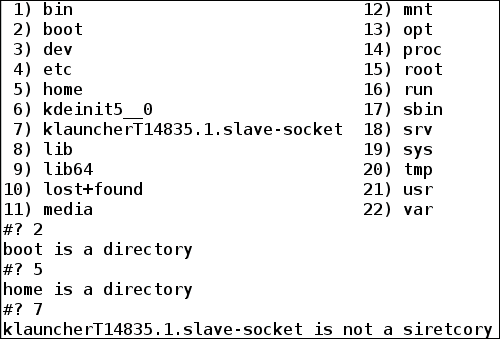
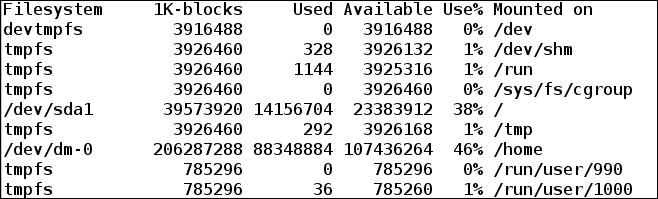

# 第三章。有效的剧本写作

要在 shell 中编写一个有效的脚本，了解 shell 提供的不同实用程序是非常重要的。与其他编程语言类似，shell 编程也需要一种方法来指定在某些条件下跳过或运行某些命令。为了在元素列表上执行某项任务，shell 中也需要循环构造。

在本章中，我们将介绍诸如`if`、`else`、`case`和`select`等主题，这些主题可用于根据条件运行某个命令块。我们将看到`for`、`while`和`until`构造，它们用于在脚本中循环某个命令块。我们将看到在命令或脚本执行之后，退出代码如何在了解命令是否成功执行方面发挥重要作用。我们还将看到如何在 shell 中定义函数，这将允许我们从现在开始编写模块化和可重用的代码。

本章将详细介绍以下主题:

*   退出脚本和退出代码
*   用测试测试表达式
*   使用带有`if`和`else`的条件语句
*   索引数组和关联数组
*   用`for`循环
*   `select`、`while`和`until`循环
*   切换到您的选择
*   使用函数和位置参数
*   使用`xargs`将`stdout`作为参数传递
*   别名
*   `pushd`和`popd`

# 退出脚本和退出代码

我们现在非常熟悉 shell 脚本文件、命令，并在`bash`中运行它们以获得期望的输出。到目前为止，无论我们看到什么样的 shell 脚本示例，它们都会一行一行地运行，直到文件结束。在编写真实世界的 shell 脚本时，情况可能并不总是如此。我们可能需要在两者之间退出一个脚本，例如，当一些错误发生时，不满足某个条件，等等。要退出脚本，使用带有可选返回值的`exit` shell 内建。返回值告诉退出代码，也称为返回状态或退出状态。

## 出口代码

每个命令在执行时都会返回一个退出代码。退出代码是了解命令是否成功执行或是否出现错误的方法之一。根据 **POSIX** ( **可移植操作系统接口**)标准惯例，执行成功的命令或程序返回`0`，执行失败返回`1`或更高的值。

在 bash 中，要查看最后执行的命令的退出状态，我们可以使用“`$?`”。

以下示例显示了成功执行命令的退出代码:

```sh
$ ls /home  # viewing Content of directory /home
foo

```

现在，要查看最后执行的命令，即`ls /home`的退出代码，我们将运行以下命令:

```sh
$ echo $?
0

```

我们看到`ls`命令执行的退出状态为`0`，表示执行成功。

另一个显示不成功命令执行的退出代码的示例如下:

```sh
$  ls /root/
ls: cannot open directory /root/: Permission deniedWe see that the ls command execution was unsuccessful with the Permission denied error. To see the exit status, run the following command:

```

```sh
$ echo $?
2

```

退出状态码为`2`，高于`0`，表示执行不成功。

## 具有特殊含义的出口代码

在不同的情况下，脚本或命令会返回不同的退出代码。在调试脚本或命令时，了解退出代码的含义非常有用。下表说明了在不同的命令或脚本执行条件下，通常会返回哪些退出代码:

<colgroup><col style="text-align: left"> <col style="text-align: left"></colgroup> 
| 

退出代码

 | 

描述

 |
| --- | --- |
| Zero | 成功执行 |
| one | 一般错误 |
| Two | 使用外壳内置命令时出错 |
| One hundred and twenty-six | 执行命令时出现权限问题；我们不能调用请求的命令 |
| One hundred and twenty-seven | 无法调用请求的命令 |
| One hundred and twenty-eight | 指定无效参数以在脚本中退出。只有 0 到 255 之间的值才是有效的退出代码 |
| 128+n | 信号“n”出现致命错误 |
| One hundred and thirty | 使用 Ctl + C 终止脚本 |
| 255* | 超出范围退出代码 |

退出代码 0、1、126-165 和 255 是保留的，当我们在脚本文件中返回退出代码时，我们应该使用这些数字以外的数字。

以下示例显示了命令返回的不同退出代码:

*   **退出代码 0**:以下是`echo`命令的成功执行:

    ```sh
    $ echo "Successful Exit code check"
    Successful Exit code check
    $ echo $?
    0

    ```

*   **退出代码 1** :从`/root`复制文件没有权限如图所示:

    ```sh
    $  cp -r /root/ .
    cp: cannot access '/root/': Permission denied
    $ echo $?
    1

    ```

*   **退出代码 2** :使用读取带无效参数的 shell 内建，如下所示:

    ```sh
    $ echo ;;
    bash: syntax error near unexpected token ';;'
    $ echo $?
    2

    ```

*   **退出代码 126** :运行一个`/usr/bin`目录作为一个实际上不是命令的命令:

    ```sh
    $ /usr/bin
    bash: /usr/bin: Is a directory
    $ echo $?
    126

    ```

*   **退出代码 127** :运行一个名为`foo`的命令，该命令实际上并不存在于系统中:

    ```sh
    $ foo
    bash: foo: command not found
    $ echo $?
    127

    ```

*   **退出代码 128+n** :按 *Ctrl* + *C* :

    ```sh
    $ read

    ^C
    $ echo $?
    130

    ```

    终止脚本

这里 *Ctrl* + *C* 发送`SIGQUIT`信号，其值为`2`。所以，退出代码是`130` (128 + 2)。

## 带有退出代码的脚本

我们还可以使用退出代码退出 shell 内置程序，以了解脚本是成功运行还是遇到了任何错误。调试您自己的脚本时，可以使用不同的错误代码来了解错误的实际原因。

当我们不在脚本中提供任何退出代码时，脚本的退出代码由最后执行的命令决定:

```sh
#!/bin/bash                                                                                                                                                               
# Filename: without_exit_code.sh                                                                                                                                          
# Description: Exit code of script when no exit code is mentioned in script                                                                                                

var="Without exit code in script"
echo $var

cd /root
```

前面的脚本没有指定任何退出代码；运行该脚本将产生以下输出:

```sh
$ sh without_exit_code.sh
Without exit code in script
without_exit_code.sh: line 8: cd: /root: Permission denied
$ echo $?  # checking exit code of script
1

```

这个脚本的退出代码是`1`，因为我们没有指定任何退出代码，最后执行的命令是`cd /root`，由于权限问题失败。

以返回退出代码`0`的下一个例子为例，不管发生了什么错误——也就是说，脚本成功运行:

```sh
#!/bin/bash                                                                                                                                                               
# Filename: with_exit_code.sh                                                                                                                                          
# Description: Exit code of script when exit code is mentioned in scr# ipt                                                                                                

var="Without exit code in script"
echo $var

cd /root

exit 0
```

运行该脚本将产生以下结果:

```sh
$ sh with_exit_code.sh 
Without exit code in script
with_exit_code.sh: line 8: cd: /root: Permission denied
echo $?
0
```

现在，脚本文件返回退出代码为`0`。我们现在知道在脚本中添加退出代码会有什么不同。

退出状态代码的另一个示例如下:

```sh
#!/bin/bash
# Filename: exit_code.sh                                                                                                                                          
# Description: Exit code of script                                                                                            

cmd_foo # running command not installed in system
echo $?

cd /root # Permission problem
echo $?

echo "Hello World!" # Successful echo print
echo $?

exit 200 # Returning script's exit code as 200
```

运行该脚本后的输出如下:

```sh
$ sh exit_status.sh
exit_code.sh: line 5: cmd_foo: command not found
127
exit_code.sh: line 8: cd: /root: Permission denied
1
Hello World!
0
$ echo $?  # Exit code of script
200

```

如果脚本中没有指定退出代码，退出代码将是脚本中运行的最后一个命令的退出状态。

# 用测试来测试表达式

shell 内置的命令`test`可用于检查文件类型和比较表达式值。语法是`test EXPRESSION`或者`test`命令也相当于**【表达式】**。

如果`EXPRESSION`结果为`0`，则返回退出代码`1` ( `false`)，非零`EXPRESSION`结果返回`0` ( `true`)。

如果没有提供`EXPRESSION`，则退出状态设置为`1`(假)。

## 文件检查

使用`test`命令可以对文件进行不同的种检查；例如，文件存在性测试、目录测试、常规文件检查、符号链接检查等等。

下表说明了可用于对文件进行各种检查的选项:

<colgroup><col style="text-align: left"> <col style="text-align: left"></colgroup> 
| 

[计]选项

 | 

描述

 |
| --- | --- |
| -e | 文件检查文件是否存在 |
| -f 文件 | 该文件是常规填充 |
| -d 文件 | 该文件存在，并且是一个目录 |
| 文件 | 该文件是一个符号链接 |
| -b 文件 | 该文件是块特殊的 |
| -c 文件 | 该文件是特殊字符 |
| -S 文件 | 文件是一个套接字 |
| -p 文件 | 该文件是一个命名管道 |
| k 文件 | 文件的粘性位被设置 |
| -g 文件 | 设置文件的组标识位 |
| -u 文件 | 设置文件的 set-user-id (suid)位 |
| -r 文件 | 文件存在读取权限 |
| -w 文件 | 文件的写权限存在 |
| -x 文件 | 文件上存在执行权限 |
| -t fd | 文件描述符 fd 在终端上打开 |
| 文件 1 -ef 文件 2 | 文件 1 是文件 2 的硬链接 |
| 文件 1 -nt 文件 2 | 文件 1 比文件 2 更新 |
| 文件 1-不是文件 2 | 文件 1 的修改时间早于文件 2 |

Shell 脚本对文件执行不同的检查，如下所示:

```sh
#!/bin/bash
# Filename: file_checks.sh
# Description: Performing different check on and between files

# Checking existence of /tmp/file1
echo -n "Does File /tmp/file1 exist? "
test -e /tmp/file1
echo $?

# Create /tmp/file1
touch /tmp/file1 /tmp/file2
echo -n "Does file /tmp/file1 exist now? "
test -e /tmp/file1
echo $?

# Check whether /tmp is a directory or not
echo -n "Is /tmp a directory? "
test -d /tmp
echo $?

# Checking if sticky bit set on /tmp"
echo -n "Is sticky bit set on /tmp ? "
test -k /tmp
echo $?

# Checking if /tmp has execute permission
echo -n "Does /tmp/ has execute permission ? "
test -x /tmp
echo $?

# Creating another file /tmp/file2
touch /tmp/file2

# Check modification time of /tmp/file1 and /tmp/file2
echo -n "Does /tmp/file1 modified more recently than /tmp/file2 ? "
test /tmp/file1 -nt /tmp/file2
echo $?
```

运行该脚本的输出如下:

```sh
Does File /tmp/file1 exist? 1
Does file /tmp/file1 exist now? 0
Is /tmp a directory? 0
Is sticky bit set on /tmp ? 0
Does /tmp/ has execute permission? 0
Does /tmp/file1 modified more recently than /tmp/file2 ? 1
```

在我们的输出中，`0`和`1`是在文件上运行测试命令后的`exist`状态。输出`1`表示测试失败，`0`表示测试成功通过。

## 算术检查

我们也可以进行整数之间的算术检查。下表说明了可能的整数比较:

<colgroup><col style="text-align: left"> <col style="text-align: left"></colgroup> 
| 

比较

 | 

描述

 |
| --- | --- |
| `INTEGER1 -eq INTEGER2` | INTEGER1 等于 INTEGER2 |
| `INTEGER1 -ne INTEGER2` | INTEGER1 不等于 INTEGER2 |
| `INTEGER1 -gt INTEGER2` | 整数 1 大于整数 2 |
| `INTEGER1 -ge INTEGER2` | 整数 1 大于或等于整数 2 |
| `INTEGER1 -lt INTEGER2` | INTEGER1 小于 INTEGER2 |
| `INTEGER1 -le INTEGER2` | 整数 1 小于或等于整数 2 |

Shell 脚本显示了两个整数之间的各种算术检查，如下所示:

```sh
#!/bin/bash
# Filename: integer_checks.sh
# Description: Performing different arithmetic checks between integers

a=12 b=24 c=78 d=24
echo "a = $a , b = $b , c = $c , d = $d"

echo -n "Is a greater than b ? "
test $a -gt $b
echo $?

echo -n "Is b equal to d ? "
test $b -eq $d
echo $?

echo -n "Is c not equal to d ? "
test $c -ne $d
echo $?
```

运行该脚本的输出如下:

```sh
a = 12 , b = 24 , c = 78 , d = 24
Is a greater than b ? 1
Is b equal to d ? 0
Is c not equal to d ? 0
```

此外，这里的测试在运行整数之间的比较测试后返回退出状态，并在成功时返回`0`(真)，如果测试失败则返回`1`(假)。

## 字符串检查

一个命令测试也允许你在字符串上和字符串之间执行检查。下表描述了可能的检查:

<colgroup><col style="text-align: left"> <col style="text-align: left"></colgroup> 
| 

比较

 | 

描述

 |
| --- | --- |
| `-z STRING` | 字符串的长度为零 |
| `-n STRING` | 字符串的长度不为零 |
| `STRING1 = STRING2` | STRING1 和 STRING2 相等 |
| `SRING1 != STRING2` | STRING1 和 STRING2 不相等 |

Shell 脚本显示字符串上和字符串之间的各种字符串检查，如下所示:

```sh
#!/bin/bash
# Filename: string_checks.sh
# Description: Performing checks on and between strings

str1="Hello" str2="Hell" str3="" str4="Hello"
echo "str1 = $str1 , str2 = $str2 , str3 = $str3 , str4 = $str4"

echo -n "Is str3 empty ? "
test -z $str3
echo $?

echo -n "Is str2 not empty? "
test -n $str2
echo $?

echo -n "Are str1 and str4 equal? "
test $str1 = $str4
echo $?

echo -n "Are str1 and str2 different? "
test $str1 != $str2
echo $?
```

运行该脚本的输出如下:

```sh
str1 = Hello , str2 = Hell , str3 =  , str4 = Hello
Is str3 empty ? 0
Is str2 not empty? 0
Are str1 and str4 equal? 0
Are str1 and str2 different? 0
```

这里，如果字符串检查为真，测试返回`0`退出状态，否则返回`1`。

## 表情检查

`test`命令还允许您在表达式上和表达式之间执行检查。一个表达式本身也可以包含多个要计算的表达式。下表说明了可能进行的检查:

<colgroup><col style="text-align: left"> <col style="text-align: left"></colgroup> 
| 

比较

 | 

描述

 |
| --- | --- |
| `( EXPRESSION )` | 这个表达式是正确的 |
| `! EXPRESSION` | 这个 EXPRESSION 是假的 |
| `EXPRESSION1 -a EXPRESSION2` | 两个表达式都为真(与运算) |
| `EXPRESSION1 -o EXPRESSION2` | 任一表达式为真(或运算) |

Shell 脚本显示字符串上和字符串之间的各种字符串检查，如下所示:

```sh
#!/bin/bash
# Filename: expression_checks.sh
# Description: Performing checks on and between expressions

a=5 b=56
str1="Hello" str2="Hello"

echo "a = $a , b = $b , str1 = $str1 , str2 = $str2"
echo -n "Is a and b are not equal, and str1 and str2 are equal? "
test ! $a -eq $b -a  $str1 = $str2
echo $?

echo -n "Is a and b are equal, and str1 and str2 are equal? "
test $a -eq $b -a  $str1 = $str2
echo $?

echo -n "Does /tmp is a sirectory and execute permission exists? "
test -d /tmp -a  -x /tmp
echo $?

echo -n "Is /tmp file is a block file or write permission exists? "
test -b /tmp -o -w /tmp
echo $?
```

运行该脚本的输出如下:

```sh
a = 5 , b = 56 , str1 = Hello , str2 = Hello
Is a and b are not equal, and str1 and str2 are equal? 0
Is a and b are equal, and str1 and str2 are equal? 1
Does /tmp is a sirectory and execute permission exists? 0
Is /tmp file is a block file or write permission exists? 0
```

与使用`test`命令的其他检查类似，`0`退出代码表示评估的表达式为真，`1`表示评估为假。

# 使用带有 if 和 else 的条件语句

Shell 提供`if`和`else`来运行条件语句，具体取决于评估是`true`还是`false`。只有当某个条件是`true`的时候，我们想要执行某个任务才有用。

可以使用测试条件或[条件]给出 if 的测试条件。我们已经在上一节*中学习了测试表达式的多个用例和例子，用测试*测试表达式。

## 简单的如果和否则

`if`条件的语法如下:

```sh
if [ conditional_expression ]
then
  statements
fi
```

如果`conditional_expression`为`true`——即退出状态为`0`——则执行其中的语句。如果没有，那么就忽略，执行`fi`后的下一行。

`if`和`else`的语法如下:

```sh
if [ conditional_expression ]
then
  statements
else
  statements
fi
```

有时候某个条件不成立，我们可能要执行一些语句。在这种情况下，使用`if`和`else`。在这里，如果`conditional_statement`是真的，语句在 if 内得到执行。否则，将执行 else 中的语句。

如果文件存在，下面的 shell 脚本将打印该消息:

```sh
#!/bin/bash
# Filename: file_exist.sh
# Description: Print message if file exists

if [ -e /usr/bin/ls ]
then
        echo "File /usr/bin/ls exists"
fi
```

运行脚本后的输出如下:

```sh
File /usr/bin/ls exists
```

另一个示例显示了两个整数中较大的一个，如下所示:

```sh
#!/bin/bash
# Filename: greater_integer.sh
# Description: Determining greater among two integers

echo "Enter two integers a and b"
read a b        # Reading input from stdin
echo "a = $a , b = $b"
# Finding greater integer
if test $a -gt $b
then
        echo "a is greater than b"
else
        echo "b is greater than a"
fi
```

以下是运行脚本后的输出:

```sh
$ sh greater_integer.sh
Enter two integers a and b
56 8
a = 56 , b = 8
a is greater than b
```

## if、elif 和 else 语句

在有些情况下，存在两个以上的选择，其中只有一个需要执行。如果条件不成立，`elif`允许您使用另一个条件，而不是使用`else`。语法如下:

```sh
if [ conditional_expression1 ]
then
  statements
elif [ conditional_expression2 ]
then
  statements
elif [ conditional_expression3 ]
then
  statements
  # More elif conditions
else
  statements
```

下面的 shell 脚本将使`elif`的用法更加清晰。该脚本要求用户输入带有绝对路径的有效文件或目录名。在有效的常规文件或目录中，它显示以下内容:

```sh
#!/bin/bash
# Filename: elif_usage.sh
# Description: Display content if user input is a regular file or a directoy

echo "Enter a valid file or directory path"
read path
echo "Entered path is $path"

if [ -f $path ]
then
   echo "File is a regular file and its content is:"
   cat $path
elif [ -d $path ]
then
   echo "File is a directory and its content is:"
   ls $path
else
   echo "Not a valid regular file or directory"
fi
```

运行脚本后的输出如下:

```sh
Enter a valid file or directory path
/home/
Entered path is /home/
File is a directory and its content is:
lost+found  sinny
```

## 嵌套 if

在许多情况下，需要多个`if`条件，因为一个条件的执行取决于另一个条件的结果。语法如下:

```sh
if [ conditional_expression1 ]
then
  if [ conditional_expression2 ]
  then
     statements
     if [conditional_expression3 ]
     then
       statements
     fi
  fi
fi
```

以下脚本示例更详细地解释了嵌套的`if`。在这个脚本中，我们将看到如何找到三个整数值中最大的一个:

```sh
#!/bin/bash
# Filename: nested_if.sh
# Description: Finding greatest integer among 3 by making use of nested if

echo "Enter three integer value"
read a b c
echo "a = $a , b = $b, c = $c"

if [ $a -gt $b ]
then
   if [ $a -gt $c ]
   then
      echo "a is the greatest integer"
   else
     echo "c is the greatest integer"
   fi
else
  if [ $b -gt $c ]
  then
    echo "b is the greatest integer"
  else
    echo "c is the greatest integer"
  fi
fi
```

运行脚本后的输出如下:

```sh
Enter three integer value
78 110 7
a = 78 , b = 110, c = 7
b is the greatest integer
```

# 索引数组和关联数组

Bash 提供了在一维数组中声明变量列表(或数组)的功能，一维数组可以是索引数组或关联数组。数组的大小可以是`0`或更大。

## 索引数组

索引数组包含可能已经或可能没有被连续初始化的变量。索引数组的索引从`0`开始。这意味着数组的第一个元素将从一个索引`0`开始。

### 数组声明和值赋值

索引数组可以通过初始化任何索引来声明，如下所示:

`array_name[index]=value`

这里，索引可以是任何正整数，或者表达式必须计算为正整数。

另一种声明方式是使用内置的`declare` shell，如下所示:

`declare -a array_name`

我们还可以在声明过程中用值初始化数组。值用括号括起来，每个值用空格隔开，如下所示:

`declare -a array_name=(value1 value2 value3 …)`

### 对数组的操作

初始化变量并向其声明值是不够的。数组的实际用途是当我们对它执行不同的操作以获得期望的结果时。

以下操作可以在索引数组上完成:

*   通过索引访问数组元素:可以通过引用数组的索引值来访问数组的元素:

    ```sh
    echo ${array_name[index]}

    ```

*   打印数组的内容:如果数组的索引为`@`或`*` :

    ```sh
    echo ${array_name[*]}
    echo ${array_name[@]}

    ```

    ，则可以打印数组的内容
*   获取数组长度:数组长度可以通过`$#`获取，数组变量:

    ```sh
    echo ${#array_name[@]}
    echo ${#array_name[*]}

    ```

*   获取数组元素的长度:数组元素的长度可以使用第 n 个索引

    ```sh
    echo ${#array_name[n]}

    ```

    上的`$#`来获取
*   删除一个元素或整个数组:可以使用`unset`关键字

    ```sh
    unset array_name[index]  # Removes value at index
    unset array_name  # Deletes entire array

    ```

    从数组中删除一个元素

以下 shell 脚本演示了对索引数组的不同操作:

```sh
#!/bin/bash
# Filename: indexed_array.sh
# Description: Demonstrating different operations on indexed array

#Declaring an array conutries and intializing it
declare -a countries=(India Japan Indonesia 'Sri Lanka' USA Canada)

# Printing Length and elements of countries array
echo "Length of array countries = ${#countries[@]}"
echo ${countries[@]}

# Deleting 2nd element of array
unset countries[1]
echo "Updated length and content of countries array"
echo "Length = ${#countries[@]}"
echo ${countries[@]}

# Adding two more countries to array
countries=("${countries[@]}" "Indonesia" "England")
echo "Updated length and content of countries array"
echo "Length = ${#countries[@]}"
echo ${countries[@]}
```

执行该脚本后的输出如下:

```sh
Length of array countries = 6
India Japan Indonesia Sri Lanka USA Canada
Updated length and content of countries array
Length = 5
India Indonesia Sri Lanka USA Canada
Updated length and content of countries array
Length = 7
India Indonesia Sri Lanka USA Canada Indonesia England
```

## 关联数组

关联数组包含一个元素列表，其中每个元素都有一个键值对。关联数组的元素不是通过使用整数值`0`到`N`来引用的。通过提供包含相应值的键名来引用它。每个密钥名称都应该是唯一的。

### 申报和价值转让

关联数组的声明通过使用`-A`选项完成，其中`declare`外壳内置如下:

```sh
declare -A array_name

```

一个关联数组使用一个键而不是方括号内的索引来初始化一个值，如下所示:

```sh
array_name[key]=value

```

可以通过以下方式初始化多个值:

```sh
array_name=([key1]=value1 [key2]=value2 ...)

```

### 对数组的操作

关联数组上的一些操作可以像索引数组一样完成，比如打印数组的长度和内容。操作如下:

*   通过键名访问数组元素；要访问关联数组的元素，请使用如下唯一键:

    ```sh
    echo ${array_name[key]}
    ```

*   打印关联数组内容:以下语法用于打印关联数组:

    ```sh
    echo ${array_name[*]}
    echo ${array_name[@]}
    Obtaining the length of an array:
    echo ${#array_name[@]}
    echo ${#array_name[*]}
    ```

*   获取给定键的值和长度:

    ```sh
    echo ${array_name[k]}  # Value of key k
    echo ${#array_name[k]}  # Length of value of key k
    ```

*   添加新元素；要在关联数组中添加新元素，请使用`+=`运算符，如下所示:

    ```sh
    array_name+=([key]=value)
    ```

*   使用`k`键删除关联数组的元素，如下所示:

    ```sh
    unset array_name[k]
    ```

*   删除关联数组`array_name`，如下所示:

    ```sh
    unset array_name
    ```

以下 shell 脚本演示了对关联数组的不同操作:

```sh
#!/bin/bash
# Filename: associative_array.sh
# Description: Demonstrating different operations on associative array

# Declaring a new associative array
declare -A student

# Assigning different fields in student array
student=([name]=Foo [usn]=2D [subject]=maths [marks]=67)

# Printing length and content of array student
echo "Length of student array = ${#student[@]}"
echo ${student[@]}

# deleting element with key marks
unset student[marks]
echo "Updated array content:"
echo ${student[@]}

# Adding department in student array
student+=([department]=Electronics)
echo "Updated array content:"
echo ${student[@]}
```

执行该脚本后的输出如下:

```sh
Length of student array = 4
Foo 67 maths 2D
Updated array content:
Foo maths 2D
Updated array content:
Foo maths Electronics 2D
```

# 用 for 循环

`for`循环可用于迭代列表中的项目或直到条件为真。

在 bash 中使用`for`循环的语法如下:

```sh
for item in [list]
do
   #Tasks
done
```

书写`for`循环的另一种方式是 C 的方式，如下所示:

```sh
for (( expr1; expr2; expr3 ))
  # Tasks
done
```

这里`expr1`是初始化，`expr2`是条件，`expr3`是增量。

## 简单迭代

下面的【shell 脚本解释了如何使用`for`循环来打印列表的值:

```sh
#!/bin/bash
# Filename: for_loop.sh
# Description: Basic for loop in bash

declare -a names=(Foo Bar Tom Jerry)
echo "Content of names array is:"
for name in ${names[@]}
do
   echo -n "$name "
done
echo
```

脚本的输出如下:

```sh
Content of names array is:
Foo Bar Tom Jerry
```

## 迭代命令输出

我们知道很多命令给出多行输出，比如`ls`、`cat`、`grep`等等。在许多情况下，遍历每一行输出并对其进行进一步处理是有意义的。

以下示例循环显示“`/`”的内容并打印目录:

```sh
#!/bin/bash
# Filename: finding_directories.sh
# Description: Print which all files in / are directories

echo "Directories in / :"
for file in 'ls /'
do
  if [ -d "/"$file ]
  then
     echo -n  "/$file "
  fi
done
echo
```

运行此脚本后的输出如下:

```sh
Directories in / :
/bin /boot /dev /etc /home /lib /lib64 /lost+found /media /mnt /opt /proc /root /run /sbin /srv /sys /tmp /usr /var
```

## 指定 for 循环的范围

我们也可以在`for`循环中指定一个整数范围，并为其设置一个可选的增量值:

```sh
#!/bin/bash
# Filename: range_in_for.sh
# Description: Specifying range of numbers to for loop

echo "Numbers between 5 to 10 -"
for num in {5..10}
do
  echo -n "$num "
done

echo
echo "Odd numbers between 1 to 10 -"
for num in {1..10..2}
do
  echo -n "$num "
done
echo
```

运行该脚本后的输出如下:

```sh
Numbers between 5 to 10 -
5 6 7 8 9 10 
Odd numbers between 1 to 10 -
1 3 5 7 9
```

## 小而甜为圈

在某些情况下，我们不想写一个脚本，然后执行它；相反，我们更喜欢在 shell 本身做一份工作。在这种情况下，在一行中编写完整的 for 循环，而不是将其变成多行，是非常有用和方便的。

例如，可以使用以下代码打印 3 到 20 之间的 3 的倍数:

```sh
$ for num in {3..20..3}; do echo -n "$num " ; done
3 6 9 12 15 18 
```

# 选择、同时和直到循环

`select`、`while`和`until`循环也用于循环和迭代列表中的每个项目，或者直到条件为真，语法略有变化。

## 使用选择循环

选择循环有助于以简单的格式创建编号菜单，用户可以从中选择一个或多个选项。

`select`循环的语法如下:

```sh
select var in list
do
   # Tasks to perform
done
```

在使用`[item1 item2 item3 …]`形式的`select`循环时，可以预先生成或指定`list`。

例如，考虑一个简单的菜单，列出了“`/`”的内容，并要求用户输入一个选项，您想知道它是否是一个目录:

```sh
#!/bin/bash
# Filename: select.sh
# Description: Giving user choice using select to choose

select file in 'ls /'
do
   if [ -d "/"$file ]
   then
     echo "$file is a directory"
   else
     echo "$file is not a directory"
  fi
done
```

以下是运行脚本后的输出截图:



退出脚本，按 *Ctrl* + *C* 。

## while 循环

`while`循环允许你做重复的任务，直到条件成立。语法与我们在 C 和 C++编程语言中使用的非常相似，如下所示:

```sh
while [ condition ]
do
   # Task to perform
done
```

例如，读取应用程序的名称并显示该应用程序所有运行实例的 pids，如下所示:

```sh
#!/bin/bash
# Filename: while_loop.sh
# Description: Using while loop to read user input

echo "Enter application name"
while read line
do
  echo -n "Running PID of application $line :"
  pidof $line
done
```

运行此脚本后的输出如下:

```sh
Enter application name
firefox
Running PID of application firefox : 1771
bash
Running PID of application bash : 9876 9646 5333 4388 3970 2090 2079 2012 1683 1336
ls
Running PID of application ls: 
systemd
Running PID of application systemd : 1330 1026 1
```

退出脚本，按 *Ctrl* + *C* 。

## 直到循环

`until`循环与`while`循环非常相似，但唯一不同的是它执行代码块，直到条件执行到 false。`until`的语法如下:

```sh
until condition
do
     # Task to be executed
 done
```

以为例，假设我们有兴趣在应用程序的任何实例运行时了解它的`pid`。为此，我们可以使用`until`并使用`sleep`以一定的间隔检查应用程序的`pidof`。找到`pid`后，可以退出`until`循环，打印应用程序运行实例的`pid`。

下面的 shell 脚本演示了相同的内容:

```sh
#!/bin/bash
# Filename: until_loop.sh
# Description: Using until loop to read user input

echo "Enter application name"
read app
until  pidof $app
do
  sleep 5
done
echo "$app is running now with pid 'pidof $app'"
```

执行此脚本后的输出如下:

```sh
Enter application name
firefox
1867
firefox is running now with pid 1867
```

# 切换到我的选择

Switch 是用来根据条件或表达式求值的结果，跳转运行某个案例。它可以替代在 bash 中使用多个**(如果**)并保持 bash 脚本清晰可读。

`switch`的语法如下:

```sh
case $variable in
  pattern1)
  # Tasks to be executed
  ;;
  pattern2)
  # Tasks to be executed
  ;;
  …
  pattern n)
  # Tasks to be executed
  ;;
  *)
esac
```

在语法中，`$variable`是需要在提供的选项列表中匹配的表达式或值。

在每个选项中，可以指定一个模式或模式组合。`;;`告诉 bash 给定选择块结束。`esac`关键字指定案例块的结束。

下面是一个计算给定路径中文件和目录数量的示例:

```sh
#!/bin/bash
# Filename: switch_case.sh
# Description: Using case to find count of directories and files in a # path

echo "Enter target path"
read path
files_count=0
dirs_count=0

for file in 'ls -l $path | cut -d ' ' -f1'
do
  case "$file" in

        d*)
        dirs_count='expr $dirs_count + 1 '
        ;;
        -*)
        files_count='expr $files_count + 1'
        ;;
        *)
  esac
done

echo "Directories count = $dirs_count"
echo "Regular file count = $files_count"
```

运行此脚本后的输出如下:

```sh
Enter target path
/usr/lib64
Directories count = 134
Regular file count = 1563
```

在这个示例中，我们首先使用内置的`read`外壳读取用户的输入路径。然后，我们将文件和目录计数的计数器变量初始化为`0`。此外，我们使用`ls -l $path | cut -d ' ' -f1`获取路径内容的文件属性的长列表，然后检索其第一列。我们知道`ls -l`第一列的第一个字符告诉了文件的类型。如果是`d`，那么就是目录，`-`代表常规文件。`dirs_count`或`files_count`变量相应增加。

# 使用 xargs 将 stdout 作为参数传递

`xargs`命令用于从标准输入构建和执行命令行。诸如`cp`、`echo`、`rm`、`wc`等命令不从标准输入中获取输入，也不从另一个命令中获取重定向输出。在这样的命令中，我们可以使用`xargs`提供一个输入作为另一个命令的输出。的语法如下:

`xargs [option]`

下表解释了一些选项:

<colgroup><col style="text-align: left"> <col style="text-align: left"></colgroup> 
| 

[计]选项

 | 

描述

 |
| --- | --- |
| - `a`文件 | 这将从文件而不是标准输入中读取项目 |
| `-0`、`--null` | 输入以空结尾，而不是空白 |
| `-t`、`--verbose` | 执行前在标准输出上打印命令行 |
| `--show-limits` | 这显示了操作系统对命令行长度的限制 |
| `-P max-procs` | 一次运行一个最大进程 |
| `-n max-args` | 这最多使用每个命令行的 max-args 参数 |

## 【xargs 的基本操作

`xargs`命令可以在没有任何选项的情况下使用。它允许你从标准输入输入，当`ctrl + d`被调用时，它打印任何被输入的:

```sh
$ xargs
Linux shell
scripting 
ctrl + d
Linux shell scripting

```

`--show-limits`选项可以用来知道命令行长度的限制:

```sh
$ xargs --show-limits
Your environment variables take up 4017 bytes
POSIX upper limit on argument length (this system): 2091087
POSIX smallest allowable upper limit on argument length (all systems): 4096
Maximum length of command we could actually use: 2087070
Size of command buffer we are actually using: 131072

```

## 使用 xargs 查找最大大小的文件

下面的【shell 脚本将解释如何使用`xargs`递归获取给定目录中最大大小的文件:

```sh
#!/bin/bash
# Filename: max_file_size.sh
# Description: File with maximum size in a directory recursively

echo "Enter path of directory"
read path
echo "File with maximum size:"

find $path -type f | xargs du -h | sort -h | tail -1
```

运行此脚本后的输出如下:

```sh
Enter path of directory
/usr/bin
File with maximum size:
12M     /usr/bin/doxygen
```

在这个例子中，我们使用`xargs`来传递从`find`命令获得的每个常规文件，用于大小计算。此外，`du`的输出被重定向到`sort`命令进行人工数字排序，然后我们可以打印最后一行或排序得到最大大小为的文件。

## 以给定模式归档文件

使用`xargs`的另一个有用的例子是将我们感兴趣的所有文件都归档，这些文件可以作为备份文件保存。

以下 shell 脚本找到指定目录中的所有 shell 脚本，并创建其中的`tar`以供进一步参考:

```sh
#!/bin/bash
# Filename: tar_creation.sh
# Description: Create tar of all shell scripts in a directory

echo "Specify directory path"
read path

find $path -name "*.sh" | xargs tar cvf scripts.tar
```

运行脚本后的输出如下:

```sh
Specify directory path
/usr/lib64
/usr/lib64/nspluginwrapper/npviewer.sh
/usr/lib64/xml2Conf.sh
/usr/lib64/firefox/run-mozilla.sh
/usr/lib64/libreoffice/ure/bin/startup.sh
```

在本例中，所有扩展名为`.sh`的文件都被搜索并作为参数传递给`tar`命令以创建一个档案。文件`scripts.tar`是在调用脚本的目录中创建的。

# 使用函数和位置参数

类似于其他编程语言，函数是一次编写一组动作并多次使用的方式。它使代码模块化和可重用。

编写函数的语法如下:

```sh
function function_name
 {
 # Common set of action to be done
 }

```

这里，`function`是指定函数的关键字，`function_name`是函数的名称；我们也可以通过以下方式定义函数:

```sh
function_name()
{
 # Common set of action to be done
}

```

每当调用一个特定的函数时，花括号内写的动作就会被执行。

## 在 bash 中调用函数

考虑以下定义`my_func()`函数的外壳脚本:

```sh
#!/bin/bash
# Filename: function_call.sh
# Description: Shows how function is defined and called in bash

# Defining my_func function
my_func()
{
  echo "Function my_func is called"
  return 3
}

my_func # Calling my_func function
return_value=$?
echo "Return value of function = $return_value"
```

要在 shell 脚本中调用`my_func()`，我们只需要写一个函数名:

```sh
my_func
```

`my_func`函数的返回值为 3。函数的返回值是函数的退出状态。在前面的例子中，`my_func`功能的退出状态被分配给了`return_value`变量。

运行上述脚本的结果如下:

```sh
Function my_func is called
Return value of function = 3
```

函数的返回值是在其参数中指定的返回外壳。如果没有使用`return`，则在函数中执行最后一个命令的退出代码。在本例中，退出代码将是`echo`命令的退出代码。

## 将参数传递给函数

函数的参数可以通过指定函数的名字后跟空格分隔的参数来提供。shell 中的函数不是通过名称而是通过位置来使用参数；我们也可以说壳函数采用位置参数。位置参数通过函数内部的变量名`$1`、`$2`、`$3`、`$n`等来访问。

可以使用`$#`获取参数的长度，可以使用`$@`或`$*`一起获取传递的参数列表。

下面的 shell 脚本解释了参数是如何传递给 bash 中的函数的:

```sh
#!/bin/bash
# Filename: func_param.sh
# Description: How parameters to function is passed and accessed in bash

upper_case()
{
   if [ $# -eq 1 ]
   then
     echo $1 | tr '[a-z]' '[A-Z]'
   fi
}

upper_case hello
upper_case "Linux shell scripting"
```

前面脚本的输出如下:

```sh
HELLO
LINUX SHELL SCRIPTING
```

在前面的 shell 脚本示例中，我们使用`hello`和`Linux shell scripting`参数调用了`upper_case()`方法两次。两者都被转换成大写。以类似的方式，可以编写其他函数，以避免反复编写重复的工作。

# 别名

shell 中的别名是指给一个命令或一组命令起另一个名字。当命令的名称很长时，它非常有用。借助别名，我们可以避免键入更大的名称，并根据您的方便通过名称调用命令。

要创建别名，需要使用别名 shell 内置命令。语法如下:

`alias alias_name="Commands to be aliased"`

## 创建别名

要以人类可读的格式打印磁盘空间，我们使用带有`-h`选项的`df`命令。通过将`df -h`别名为`df`，我们可以避免反复输入`df -h`。

将`df`命令混叠到`df -h`之前的输出如下图所示:

```sh
$ df

```



现在，要创建 df -h 到 df 的别名，我们将执行以下命令:

```sh
$ alias df="df -h"	# Creating alias
$ df

```

获得的输出如下:


我们看到在创建了`df -h`到`df`的别名之后，一个默认的磁盘空间以人类可读的格式被打印出来。

另一个有用的例子是将`rm`命令别名为`rm -i`。将`rm`与`-i`选项配合使用时，会在删除前要求用户确认:

```sh
#!/bin/bash
# Filename: alias.sh
# Description: Creating alias of rm -i

touch /tmp/file.txt
rm /tmp/file.txt        # File gets deleted silently
touch /tmp/file.txt     # Creating again a file
alias rm="rm -i" # Creating alias of rm -i
rm /tmp/file.txt
```

执行上述脚本后的输出如下:

```sh
rm: remove regular empty file '/tmp/file.txt'? Y
```

我们可以看到，别名创建后，`rm`在删除`/tmp/file.txt`文件前会要求确认。

## 列出所有别名

要查看已经为当前 shell 设置的别名，请使用不带任何参数或带有`–p`选项的别名:

```sh
$ alias
alias df='df -h'
alias egrep='egrep --color=auto'
alias fgrep='fgrep --color=auto'
alias grep='grep --color=auto'
alias l.='ls -d .* --color=auto'
alias ll='ls -l --color=auto'
alias ls='ls --color=auto'
alias vi='vim'
```

我们可以看到，我们创建的`df`别名以及其他已经存在的别名仍然存在。

## 删除别名

要删除已经存在的别名，我们可以使用`unalias` shell 内置命令:

```sh
$ unalias df  # Deletes df alias
$ alias -p  # Printing existing aliases
alias egrep='egrep --color=auto'
alias fgrep='fgrep --color=auto'
alias grep='grep --color=auto'
alias l.='ls -d .* --color=auto'
alias ll='ls -l --color=auto'
alias ls='ls --color=auto'
alias vi='vim'
```

我们看到`df`别名已经被移除。要删除所有别名，请将`unalias`与`a`选项一起使用:

```sh
$ unalias -a  # Delets all aliases for current shell
$ alias -p

```

我们可以看到现在所有的别名都被删除了。

# pushd 和 popd

`pushd`和`popd`都是 shell 内置命令。`pushd`命令用于将当前目录保存到堆栈中，并移动到新目录。此外，`popd`可用于返回堆栈顶部的前一个目录。

当我们必须频繁地在两个目录之间切换时，这非常有用。

使用`pushd`的语法如下:

`pushd [directory]`

如果没有指定目录，`pushd`将目录更改为堆栈顶部的任何目录。

使用 `popd`的语法如下:

`popd`

使用`popd`开关，我们可以回到堆栈顶部的前一个目录，并从堆栈中弹出该目录。

以下示例计算指定目录中文件或目录的数量，直到达到一个级别:

```sh
#!/bin/bash
# Filename: pushd_popd.sh
# Description: Count number of files and directories

echo "Enter a directory path"
read path

if [ -d $path ]
then
   pushd $path > /dev/null
   echo "File count in $path directory = 'ls | wc -l'"
   for f in 'ls'
   do
      if [ -d $f ]
      then
         pushd $f > /dev/null
         echo "File count in sub-directory $f = 'ls | wc -l'"
         popd > /dev/null
      fi
   done
   popd > /dev/null
else
  echo "$path is not a directory"
fi
```

运行上述脚本后的输出如下:

```sh
Enter a directory path
/usr/local   
File count in /usr/local directory = 10
File count in sub-directory bin = 0
File count in sub-directory etc = 0
File count in sub-directory games = 0
File count in sub-directory include = 0
File count in sub-directory lib = 0
File count in sub-directory lib64 = 0
File count in sub-directory libexec = 0
File count in sub-directory sbin = 0
File count in sub-directory share = 3
File count in sub-directory src = 0
```

# 总结

读完这一章，您现在应该有足够的信心通过使用条件语句、循环等来编写一个有效的 shell 脚本。现在，您还可以使用 shell 中的函数编写模块化的可重用代码。了解退出代码将有助于了解命令是否成功执行。你还应该知道一些更有用的外壳插件，比如 `alias`、`pushd`和`popd`。

在下一章中，我们将通过了解如何编写一个可重用的 shell 脚本本身来了解更多关于模块化脚本的知识，它可以在 shell 脚本中使用。我们还将看到如何调试我们的 shell 脚本来修复问题。