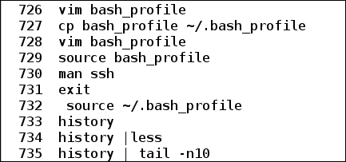

# 第五章。定制环境

在默认系统中，我们会获得预配置的某些设置。随着时间的推移，我们经常觉得需要修改一些提供的默认设置。当我们在一个 shell 中工作以完成事情时，也会出现类似的需求，例如，根据应用程序的需求修改环境。有些功能是如此不可抗拒，以至于我们可能每次都需要它们，例如，应用程序使用的我们选择的编辑器。在执行重要任务时，我们可能会忘记几天前使用的命令。在这种情况下，我们试图尽快调用该命令来完成工作。如果我们记不住，我们就要花时间和精力在网上或课本上搜索确切的命令和语法。

在本章中，我们将看到如何通过添加或更改现有的环境变量，根据我们的应用程序需求修改环境。我们还将看到用户如何修改`.bashrc`、`.bash_profile`和`.bash_logout`文件，以使设置更改永久可用。我们将了解如何搜索和修改以前执行的命令的历史记录。我们还将看到如何从单个 shell 中运行多个任务并一起管理它们。

本章将详细介绍以下主题:

*   了解默认环境
*   修改Shell环境
*   使用 bash 启动文件
*   了解你的历史
*   管理任务

# 了解默认环境

建立一个合适的环境对于运行一个流程非常重要。环境由环境变量组成，这些变量可以设置默认值，也可以不设置默认值。通过修改现有环境变量或创建新的环境变量来设置所需的环境。环境变量是可用于当前进程及其子进程的导出变量。在[第 1 章](01.html "Chapter 1. The Beginning of the Scripting Journey")*脚本之旅的开始*中，我们了解了一些内置 shell 变量，这些变量可以在我们的应用程序中用作环境变量来设置环境。

## 查看Shell环境

要在 shell 中查看当前环境，我们可以使用`printenv`或`env`命令。环境变量可能没有值、只有一个值或有多个值。如果存在多个值，每个值用冒号(:)分隔。

### 印表机名称

我们可以使用`printenv`打印与给定环境变量相关的值。语法如下:

`$ printenv [VARIABLE]`

考虑以下示例:

```sh
$ printenv SHELL    # Prints which shell is being used
/bin/bash
$ printenv PWD    # Present working directory
/home/foo/Documents
$ printenv HOME    # Prints user's home directory
/home/foo
$ printenv PATH    # Path where command to be executed is searched
/usr/lib64/qt-3.3/bin:/usr/lib64/ccache:/bin:/usr/bin:/usr/local/bin:/usr/local/sbin:/usr/sbin:/home/foo
$ printenv USER HOSTNAME  # Prints value of both environment variables
foo
localhost

```

如果未指定`VARIABLE`，则`printenv`打印所有环境变量，如下所示:

```sh
$ printenv  # Prints all environment variables available to current shell

```

### env

我们还可以使用命令查看环境变量，如下所示:

```sh
$ env

```

这将显示为给定Shell定义的所有环境变量。

### 注

要查看特定环境变量的值，也可以使用`echo`命令，后跟以美元符号(`$`)为前缀的环境变量名称。例如`echo $SHELL`。

## Shell和环境变量之间的差异

shell 和环境变量都是可访问的变量，并为给定的 shell 设置，该 shell 中运行的应用程序或命令可以使用这些变量。但是，它们之间有一些区别，如下表所示:

<colgroup><col style="text-align: left"> <col style="text-align: left"></colgroup> 
| 

Shell变量

 | 

环境变量

 |
| --- | --- |
| 本地变量和导出变量都是Shell变量 | 导出的Shell变量是环境变量 |
| `set builtin`命令用于查看Shell变量的名称和对应值 | `env`或`printenv`命令用于查看环境变量的名称和相应值 |
| 局部Shell变量不可由其子Shell使用 | 子Shell继承父Shell中存在的所有环境变量 |
| shell 变量是通过在等号运算符(=)的左侧指定变量名和右侧用冒号(:)分隔的值来创建的 | 可以通过在现有 shell 变量前添加导出 shell 内置命令，或者在创建新 shell 变量时创建环境变量 |

# 修改Shell环境

当一个新的 shell 启动时，它有一个初始环境设置，任何在给定 shell 中执行的应用程序或命令都将使用它。我们现在知道`env`或`setenv` shell 内建命令可用于查看为此 shell 设置了哪些环境变量。Shell还提供了修改当前环境的功能。我们还可以通过创建、修改或删除环境变量来修改当前的 bash 环境。

## 创建环境变量

要在Shell中创建新的环境变量，使用`export`Shell内置命令。

例如，我们将创建一个新的环境变量`ENV_VAR1`:

```sh
$ env | grep ENV_VAR1  # Verifying that ENV_VAR1 doesn't exist
$ export ENV_VAR1='New environment variable'

```

创建一个名为`ENV_VAR1`的新环境变量。要查看新的环境变量，我们可以调用`printenv`或`env`命令:

```sh
$ env | grep ENV_VAR1
ENV_VAR1=New environment variable
$ printenv ENV_VAR1    # Viewing value of ENV_VAR1 environment variable
New environment variable

```

我们也可以使用`echo`命令打印环境变量的值:

```sh
$ echo $ENV_VAR1  # Printing value of ENV_VAR1 environment variable
New environment variable

```

本地 shell 变量也可以作为环境变量进一步导出。例如，我们将创建`ENV_VAR2`和`LOCAL_VAR1`变量:

```sh
$ ENV_VAR2='Another environment variable'
$ LOCAL_VAR1='Local variable'
$ env | grep ENV_VAR2  # Verifying if ENV_VAR2 is an environment variable

```

找不到名为`ENV_VAR2`的环境变量。这是因为在创建`ENV_VAR2`时，没有导出。因此，它将被创建为Shell的局部变量:

```sh
$ set | grep ENV_VAR2
ENV_VAR2='Another environment variable'
$ set | grep  LOCAL_VAR1
LOCAL_VAR1='Local variable'

```

现在，要使`ENV_VAR2` shell 变量成为环境变量，我们可以使用 export 命令:

```sh
$ export ENV_VAR2    # Becomes environment variable
$ printenv ENV_VAR2    # Checking of  ENV_VAR2 is an environment variable
Another environment variable
$ printenv LOCAL_VAR1

```

变量`LOCAL_VAR1`不是环境变量。

环境变量的一个重要特性是它对它的所有子Shell都是可用的。我们可以在下面的例子中看到这一点:

```sh
$ bash  # creating a new bash shell
$ env | grep ENV_VAR2  # Checking if  ENV_VAR2 is available in child shell
ENV_VAR2=Another environment variable
$ env | grep ENV_VAR1
ENV_VAR1=New environment variable
$ env | grep LOCAL_VAR1

```

我们可以看到，来自父Shell的环境变量被子Shell继承，例如`ENV_VAR1`、`ENV_VAR2`，而局部变量，例如`LOCAL_VAR1`，只对创建该变量的Shell可用。

## 修改环境变量

Shell 为修改任何现有的环境变量提供了灵活性。例如，考虑`HOME`环境变量。默认情况下，`HOME`环境变量包含当前登录用户主目录的路径:

```sh
$ printenv HOME
/home/foo
$ pwd    # Checking current working directory
/tmp
$ cd $HOME    # Should change directory to /home/foo
$ pwd    # Check now current working directory
/home/foo

```

现在，我们将`HOME`环境变量值修改为`/tmp`:

```sh
$ HOME=/tmp    # Modifying HOME environment variable
$ printenv HOME    # Checking value of HOME environment variable
/tmp
$ cd $HOME    # Changing directory to what $HOME contains
$ pwd    # Checking current working directory
/tmp

```

我们还可以给环境变量添加一个值。为此，请确保新值用冒号(`:`)分隔。例如，考虑`PATH`环境变量:

```sh
$ printenv PATH
usr/lib64/ccache:/bin:/usr/bin:/usr/local/bin:/usr/local/sbin:/usr/sbin:/home/foo/.local/bin:/home/foo/bin

```

现在，我们想给`PATH`变量添加一个新路径——例如`/home/foo/projects/bin`——这样，在寻找程序或命令时，shell 也可以搜索指定的路径。要将路径附加到`PATH`环境变量，请使用冒号(:)后跟新路径名:

```sh
$ PATH=$PATH:/home/foo/projects/bin  # Appends new path
$ printenv PATH
usr/lib64/ccache:/bin:/usr/bin:/usr/local/bin:/usr/local/sbin:/usr/sbin:/home/foo/.local/bin:/home/foo/bin:/home/foo/projects/bin

```

我们可以看到新路径已经被附加到`PATH`变量的现有值中。

我们也可以给一个环境变量追加多个值；为此，每个值应该用冒号(`:`)分隔。

例如，我们将向`PATH`变量添加另外两个应用程序路径:

```sh
$ PATH=$PATH:/home/foo/project1/bin:PATH:/home/foo/project2/bin
$ printenv PATH
usr/lib64/ccache:/bin:/usr/bin:/usr/local/bin:/usr/local/sbin:/usr/sbin:/home/foo/.local/bin:/home/foo/bin:/home/foo/projects/bin:/home/foo/project1/bin:PATH:/home/foo/project2/bin

```

两个新路径`/home/foo/project1/bin`和`/home/foo/project2/bin`已经被添加到`PATH`变量中。

## 删除环境变量

我们可以使用`unset` shell 内置命令删除或重置环境变量的值。

例如，我们将创建一个名为`ENV1`的环境变量:

```sh
$ export ENV1='My environment variable'
$ env | grep ENV1  # Checking if ENV1 environment variable exist
ENV1=My environment variable
$ unset ENV1    # Deleting ENV1 environment variable
$ env | grep ENV1

```

环境变量`ENV1`被`unset`命令删除。现在，要重置环境变量，请为其分配一个空值:

```sh
$ export ENV2='Another environment variable'
$ env | grep ENV2
ENV2=Another environment variable
$ ENV2=''	# Reset ENV2 to blank
$ env | grep ENV2
ENV2=

```

# 使用 bash 启动文件

直到现在，为了执行任务或为给定的Shell设置任何东西，我们必须在一个Shell中执行所需的命令。这种方法的一个主要限制是，相同的配置在新的 shell 中不可用。在很多情况下，用户可能希望每当他或她启动一个新的 shell 时，就可以使用默认配置之上的新的定制配置。对于定制 bash，用户的主目录中有三个文件，默认情况下，每当用户启动新的 bash 时，这些文件都会被执行。这些文件是`bashrc`、`.bash_profile`和`.bash_logout`。

## 。bashrc

在图形系统中，用户通常使用非登录Shell。要运行非登录 shell，我们不需要登录凭据。在图形系统中启动Shell提供了非登录Shell。当在非登录模式下调用 bash 时，`~/.bashrc`文件被调用，其中可用的配置被执行并应用于任何正在启动的 bash shell 中。登录和非登录Shell都需要的设置保存在`~/.bashrc`文件中。

例如，在 Fedora 22 系统默认值上，`~/.bashrc`文件如下所示:

```sh
# .bashrc

# Source global definitions
if [ -f /etc/bashrc ]; then
        . /etc/bashrc
fi

# Uncomment the following line if you don't like systemctl's auto-paging feature:
# export SYSTEMD_PAGER=

# User specific aliases and functions
```

在`~/.bashrc`中所做的任何添加都将只反映到当前用户的 bash shell 中。我们可以看到`.bashrc`文件也会检查`etc/bashrc`文件是否可用。如果有的话，也会被执行。`/etc/bashrc`文件包含应用于所有用户的 bash shell 的配置，也就是说，系统范围的配置。如果需要将任何配置应用于所有用户的 bash shells，Sysadmin 可以修改`/etc/bashrc`文件。

文件`/etc/bashrc`还查看了`/etc/profile.d`中可用的脚本文件，这可以通过以下取自`/etc/bashrc`文件的代码片段来确认:

```sh
 for i in /etc/profile.d/*.sh; do
        if [ -r "$i" ]; then
            if [ "$PS1" ]; then
                . "$i"
```

以下示例显示了修改后的`.bashrc`文件。命名该文件`custom_bashrc`:

```sh
# custom_bashrc

# Source global definitions
if [ -f /etc/bashrc ]; then
        . /etc/bashrc
fi

# Uncomment the following line if you don't like systemctl's auto-paging feature:
# export SYSTEMD_PAGER=

# User added settings
# Adding aliases
alias rm='rm -i'  # Prompt before every removal
alias cp='cp -i'  # Prompts before overwrite
alias df='df -h'  # Prints size in human readable format
alias ll='ls -l'  # Long listing of file

# Exporting environment variables
# Setting and exporting LD_LIBRARY_PATH variable
export LD_LIBRARY_PATH=$LD_LIBRARY_PATH:~/libs
# Setting number of commands saved in history file to 10000
export HISTFILESIZE=10000

# Defining functions
# Function to calculate size of current directory
function current_directory_size()
{
echo -n "Current directory is $PWD with total used space "
du -chs $PWD 2> /dev/null | grep total | cut -f1
}
```

`LD_LIBRARY_PATH`环境变量用于为运行时共享库加载器(`ld.so`)提供一组额外的目录，以便在搜索共享库时查找。你可以在[上了解更多关于共享库的信息。](http://tldp.org/HOWTO/Program-Library-HOWTO/shared-libraries.html)

在修改之前，备份您的原始`~/.bashrc`文件:

```sh
$ cp ~/.bashrc ~/.bashrc.bak

```

现在，将`custom_bashrc`文件复制到`~/.bashrc`:

```sh
$ cp custom_bashrc ~/.bashrc

```

要应用修改后的设置，请打开一个新的 bash shell。要在同一个 bash shell 中应用新的`.bashrc`，您可以将源文件导入到一个新的`~/.bashrc`文件中:

```sh
$ source ~/.bashrc

```

我们可以检查新设置是否可用:

```sh
$ ll /home  # Using alias ll which we created

```

```sh
total 24
drwx------.  2 root    root    16384 Jun 11 00:46 lost+found
drwx--x---+ 41 foo  foo      4096  Aug  3 12:57 foo
```

```sh
$ alias  # To view aliases

```

```sh
alias cp='cp -i'
alias df='df -h'
alias ll='ls -l'
alias ls='ls --color=auto'
alias rm='rm -i'
alias vi='vim'
```

`alias`命令显示我们在`.bashrc`中添加的别名，即`rm`、`cp`、`df`和`ll`。

现在，调用我们在`.bashrc`中添加的`current_directory_size()`函数:

```sh
$ cd ~	# cd to user's home directory
$ current_directory_size
Current directory is /home/foo with total used space 97G
$ cd /tmp
$  current_directory_size
Current directory is /tmp with total used space 48K

```

请确保移回我们在本示例开始时创建的原始`.bashrc`文件，并将其导入，以获得当前 shell 会话中反映的设置。如果您不希望我们在播放前面的示例时所做的任何配置更改，这是必需的:

```sh
$ mv ~/.bashrc.bak ~/.bashrc
$ source ~/.bashrc

```

### 注

当 bash 作为非登录 shell 调用时，它会加载`~/.bashrc`、`/etc/bashrc`和`/etc/profile.d/*.sh`文件中可用的配置。

## 。bash_profile

在非图形系统中，成功登录后，用户获得一个Shell。这样的Shell称为登录Shell。当 bash 作为登录 shell 调用时，首先执行`/etc/profile`文件；这也运行了`/etc/profile.d/`中可用的脚本。以下摘自`/etc/profile`的代码片段也提到了这一点:

```sh
for i in /etc/profile.d/*.sh ; do
    if [ -r "$i" ]; then
        if [ "${-#*i}" != "$-" ]; then 
            . "$i"
        else
```

这些是应用于任何用户登录Shell的全局设置。此外，为登录Shell执行`~/.bash_profile`。在 Fedora 22 系统上，`~/.bash_profile`文件的默认内容如下所示:

```sh
# .bash_profile

# Get the aliases and functions
if [ -f ~/.bashrc ]; then
        . ~/.bashrc
fi

# User specific environment and startup programs

PATH=$PATH:$HOME/.local/bin:$HOME/bin

export PATH
```

从内容中，我们可以看到它在一个用户的主目录中寻找`.bashrc`文件。如果主目录中有`.bashrc`文件，它就会被执行。我们还知道`~/.bashrc`文件也执行`/etc/bashrc`文件。接下来，我们看到`.bash_profile`在`PATH`变量后面附加了`$HOME/.local/bin`和`$HOME/bin`值。此外，修改后的`PATH`变量作为环境变量导出。

用户可以根据自己定制的配置需求修改`~/.bash_profile`文件，如默认 shell、登录 shell 编辑器等。

以下示例包含在`.bash_profile`中修改的配置。我们将使用`bash_profile`作为它的文件名:

```sh
# .bash_profile

# Get the aliases and functions
if [ -f ~/.bashrc ]; then
        . ~/.bashrc
fi

# User specific environment and startup programs

PATH=$PATH:$HOME/.local/bin:$HOME/bin

export PATH

# Added configuration by us
# Setting user's default editor
EDITOR=/usr/bin/vim
# Show a welcome message to user with some useful information
echo "Welcome 'whoami'"
echo "You are using $SHELL as your shell"
echo "You are running 'uname ' release 'uname -r'"
echo "The machine architecture is 'uname -m'"
echo "$EDITOR will be used as default editor"
echo "Have a great time here!"
```

修改是在**增加配置后由我们**评论。在我们将这个新配置应用到`~/.bash_profile`之前，我们将首先对原始文件进行备份。这将有助于我们恢复`.bash_profile`文件的原始内容:

```sh
$ cp ~/.bash_profile ~/.bash_profile.bak

```

将在`home`目录中创建新文件`.bash_profile.bak`。现在，我们将把我们的新配置复制到`~/.bash_profile`:

```sh
$ cp bash_profile ~/.bash_profile

```

要查看登录Shell中反映的变化，我们可以以非图形界面登录，也可以在同一台机器上执行`ssh`来运行登录Shell。SSH(安全Shell)是一种加密网络协议，用于以安全的方式在远程机器上启动基于文本的Shell会话。在基于 UNIX 和 Linux 的系统中，可以使用`ssh`命令对本地或远程机器进行 SSH。`ssh` ( `man ssh`)的`man`页面显示了它提供的所有功能。要在同一台机器上进行远程登录，我们可以运行`ssh username@localhost`:

```sh
$ ssh foo@localhost    #  foo is the username of user

```

```sh
Last login: Sun Aug  2 20:47:46 2015 from 127.0.0.1
Welcome foo
You are using /bin/bash as your shell
You are running Linux release 4.1.3-200.fc22.x86_64
The machine architecture is x86_64
/usr/bin/vim will be used as default editor
Have a great time here!
```

我们可以看到，我们添加的所有细节都打印在一个登录Shell中。另一种快速测试我们新的`.bash_profile`的方法是对其做源码:

```sh
$ source ~/.bash_profile

```

```sh
Welcome foo
You are using /bin/bash as your shell
You are running Linux release 4.1.3-200.fc22.x86_64
The machine architecture is x86_64
/usr/bin/vim will be used as default editor
Have a great time here!
```

要重置在`~/.bash_profile`文件中所做的更改，请从我们在本示例开始时创建的`~/.bash_profile.bak`文件中复制并将其导入，以使更改反映在当前 shell 中:

```sh
$ mv ~/.bash_profile.bak ~/.bash_profile
$ source ~/.bash_profile

```

### 注

当 bash 作为登录Shell调用时，它会加载`/etc/profile`、`/etc/profile.d/*.sh`、`~/.bash_profile`、`.~/.bashrc`和`~/etc/bashrc`文件中可用的配置。

## 。bash_logout

每次登录 shell 退出时，用户主目录中的`.bash_logout`文件都会被执行。当用户远程登录或具有非图形界面时，这很有用。用户可以在从系统注销之前添加要执行的清理任务。清理任务可能包括删除创建的临时文件、清除环境变量、注销重要数据、归档或加密某些任务、上传到网络等。

# 了解你的历史

shell 提供了一个有趣的特性，可以让你找出你之前在 shell 中执行的所有命令的历史。我们经常会忘记前一天输入了什么命令来执行任务。我们可能记不清确切的语法，但我们可以参考 shell 保存的历史记录，这非常方便。

## 控制历史的Shell变量

有Shell变量可以改变，以改变用户可以看到什么和多少历史。下表中提到了这些Shell变量:

<colgroup><col style="text-align: left"> <col style="text-align: left"></colgroup> 
| 

名字

 | 

价值

 |
| --- | --- |
| HISTFILE(历史文件) | 默认情况下将保存历史记录的文件名 |
| HISTFILESIZE | 要保存在历史文件中的命令数量 |
| 组份大小 | 当前会话要存储在内存中的历史记录数 |
| 列表控件 | 以冒号分隔的值列表，控制命令在历史列表中的保存方式 |

`HISTCONTROL`Shell变量的值可以是:

<colgroup><col style="text-align: left"> <col style="text-align: left"></colgroup> 
| 

价值

 | 

描述

 |
| --- | --- |
| ignorespace | 以空格开头的行不会保存在历史列表中 |
| igboredups | 不要保存与以前保存的历史列表相匹配的行 |
| ignorebooth | 同时应用 ignorespace 和 ignoredups |
| eraisedups | 将匹配当前行的所有先前行从历史中删除，然后将其保存到历史文件中 |

让我们看看这些 shell 变量可能包含哪些值:

```sh
$  echo $HISTFILE
/home/foo/.bash_history
$ echo $HISTFILESIZE
1000
$ echo $HISTSIZE
1000
$ echo $HISTCONTROL
ignoredups

```

从获得的值中，我们可以看到默认历史被保存到用户`home`目录的`.bash_history`文件中，最大历史命令行保存为 1000。此外，先前历史记录行中已经存在的任何重复历史记录都不会保存。

## 历史内置命令

Shell提供`history`内置命令，以便用户了解到目前为止执行的命令的历史。

在没有任何选项的情况下运行历史记录，在`stdout`上打印所有先前键入的命令。当我们从输出的顶部到底部时，命令序列从早到晚提供:

```sh
$ history  # Prints all commands typed previously on stdout
$ history | tail -n10    # Prints last 10 commands executed

```



下表解释了`history`Shell内置命令的可用选项:

<colgroup><col style="text-align: left"> <col style="text-align: left"></colgroup> 
| 

[计]选项

 | 

描述

 |
| --- | --- |
| ［构成动植物的古名或拉丁化的现代名］ | 立即将新的历史记录行追加到历史记录中 |
| -c | 从当前列表中清除历史记录 |
| -d 偏移 | 从指定的偏移量删除历史记录 |
| -r | 将保存的历史内容附加到当前列表 |
| -w | 覆盖现有保存的历史内容后，将当前历史列表写入历史文件 |

要查看最后执行的五个命令，我们还可以执行以下命令:

```sh
$ history 5
 769  cd /tmp/
 770  vi hello
 771  cd ~
 772  vi .bashrc 
 773  history 5

```

我们会发现所有执行的命令都与历史文件中的给定字符串相匹配。例如，搜索包含`set`字符串的命令:

```sh
$ history | grep set 
 555  man setenv
 600  set | grep ENV_VAR2
 601  unset ENV_VAR2
 602  set | grep ENV_VAR2
 603  unset -u  ENV_VAR2 
 604  set -u  ENV_VAR2
 605  set | grep ENV_VAR2
 737  set |grep HIST
 778  history | grep set

```

要清除所有保存的命令历史，并在当前列表中添加可用的历史，我们可以执行以下操作(如果不想丢失保存的命令历史，请不要运行以下命令):

```sh
$ history -c  # Clears history from current list
$ history -w  # Overwrite history file and writes current list which is empty

```

## 修改默认历史行为

默认情况下，shell 为管理历史记录设置了一些值。在前一节中，我们看到历史文件中最多将存储 1000 行历史。如果用户大部分时间都在使用 shell，那么他可能在一两天内就使用了 1000 个以上的命令。在这种情况下，如果他在十天前输入了命令，他将无法查看历史。根据不同的用例，用户可以修改存储在历史文件中的行数。

执行以下命令将历史文件的最大行数设置为`100000`:

```sh
$ HISTFILESIZE=100000

```

同样，我们可以更改历史文件的保存位置。我们看到，默认情况下，它保存在`home`目录下的`.bash_history`文件中。我们可以修改`HISTFILE` shell 变量，并将其设置到我们希望保存命令历史的任何位置:

```sh
$  HISTFILE=~/customized_history_path

```

现在执行的命令历史将保存在主目录的`customized_history_path`文件中，而不是`~/.bash_history`文件中。

要使这些更改反映到用户启动的所有 shells 和所有会话中，请将这些修改添加到`~/.bashrc`文件中。

## 看历史的便捷捷径

根据用户的历史大小设置，历史中可用的命令数量可能很大。如果用户想要寻找特定的命令，他或她将不得不查看整个历史，这有时会很麻烦。Shells 提供了一些快捷方式来帮助我们找到之前执行的特定命令。了解这些快捷方式可以节省在历史中查找以前执行的命令的时间。

当在 shell 中工作时，【 *Ctrl* + *r* 快捷方式允许您搜索历史中的命令。按下[ *Ctrl* + *r* 后开始输入命令；shell 显示了一个完整的命令，该命令与键入的命令的子字符串相匹配。要前进到下一场比赛，再次在键盘上键入[ *Ctrl* + *r* ，以此类推:

```sh
$ [ctrl + r]
(reverse-i-search)'his': man history

```

我们可以看到打字`his`，从历史上建议我们之前打字的`man history`。

### 上下箭头键

键盘上的向上和向下箭头键可用于在用户先前执行的命令历史中来回切换。例如，要获取上一个命令，请按一次向上箭头键。要返回更远的地方，请再次按向上箭头键，以此类推。此外，要在历史中前进，请使用向下箭头键。

### ！！

快捷方式`!!`可用于重新执行 shell 中执行的最后一个命令:

```sh
$ ls /home/
lost+found  foo
$ !!
ls /home/
lost+found  foo

```

### ！(搜索字符串)

此快捷方式执行从`search_string`开始的最后一个命令:

```sh
$ !l
ls /home/
lost+found  skumari
$ !his
history 12

```

### ！？(搜索字符串)

这个快捷方式执行用子字符串`search_string`找到的最后一个命令:

```sh
$ !?h
ls /home/
lost+found  skumari

```

# 任务管理

一个应用运行时，有可能会运行很长一段时间或者运行到电脑关机。在 shell 中运行应用程序时，我们知道 shell 提示符只有在 shell 中运行程序成功完成或由于某种错误而终止时才会返回。除非我们得到一个 shell 提示符，否则我们不能在同一个 shell 中运行另一个命令。我们甚至不能关闭那个Shell，因为它会关闭正在运行的进程。

此外，要运行另一个应用程序，我们必须在新终端中打开另一个Shell，然后运行它。如果我们必须运行大量任务，管理起来会变得困难和乏味。Shells 提供了在后台运行任务以及在前台暂停、终止或返回的方法。

## 后台运行任务

一个任务可以通过附加一个&符号(&)作为Shell中的背景启动。

例如，我们想要在整个文件系统中搜索一个字符串。根据文件系统的大小和文件的数量，这可能需要很多时间。我们可以调用`grep`命令搜索字符串，并将结果保存在文件中。Linux 中的文件系统层次结构从根(“`/`”)开始。

```sh
$ grep -R "search Text" / 2>/dev/null >  out1.txt &
[1] 8871
$

```

这里，`grep`在整个文件系统中搜索一个字符串，向`/dev/null`发送任何错误消息，并将搜索结果保存到`out1.txt`文件中。结尾的一个&符号(&)将整个作业发送到后台，打印已启动任务的 PID，并返回 shell 提示符。

现在，我们可以在同一个打开的 shell 中做其他工作，执行其他任务。

## 向后台发送正在运行的任务

它经常发生的情况是，我们在 shell 中正常运行一个任务——也就是作为前台任务——但是后来我们想把它移到后台。可以这样做，首先使用[ *Ctrl* + *z* 暂停当前任务，然后使用`bg`将任务移动到后台。

以最后一次文本搜索为例。我们通常按如下方式开始搜索:

```sh
$  grep -R "search Text" / 2>/dev/null >  out2.txt

```

我们不会看到Shell上发生任何事情，我们只会继续等待Shell提示返回。或者，我们可以使用[Ctrl + z]暂停正在运行的作业:

```sh
[ctrl + z]
[2]+  Stopped            grep -R "search Text"  / 2> /dev/null > out2.txt

```

然后，使用`bg`命令发送暂停的任务继续在后台运行:

```sh
$ bg
[2]+ grep -R "search Text"  / 2> /dev/null > out2.txt

```

## 列出后台任务

为了找出哪些任务正在后台运行或在当前 shell 中挂起，`jobs` shell 内置如下:

```sh
$ jobs
```

```sh
[1]-  Running        grep -R "search Text" / 2> /dev/null > out1.txt &
[2]+ Running         grep -R "search Text" / 2> /dev/null > out2.txt &
```

这里，索引[1]和[2]是工作编号。

字符“`+`”标识将被`fg`或`bg`命令用作默认值的作业，字符“`-`”标识如果当前默认作业退出或终止将成为默认值的作业。

使用以下命令创建另一个任务并将其挂起:

```sh
$ grep -R "search Text" / 2>/dev/null >  out3.txt 
[ctrl + z]
[3]+  Stopped        grep -R "search Text"  / 2> /dev/null > out3.txt
$ jobs
[1]   Running        grep -R "search Text" / 2> /dev/null > out1.txt &
[2]-  Running        grep -R "search Text" / 2> /dev/null > out2.txt &
[3]+ Stopped         grep-R "search Text" / 2> /dev/null > out3.txt
```

要查看所有后台和暂停任务的 PID，我们可以使用`–p`选项:

```sh
$ jobs -p

```

```sh
8871
8873
8874
```

作业的 PID 是按顺序排列的。要仅查看后台运行的任务，使用`-r`选项如下:

```sh
$ jobs -r

```

```sh
[1]   Running                 grep -R "search Text" / 2> /dev/null > out1.txt &
[2]-  Running                 grep -R "search Text" / 2> /dev/null > out2.txt &
```

要仅查看暂停的任务，使用`-s`选项如下:

```sh
$ jobs -s

```

```sh
[3]+ Stopped                grep-R "search Text" / 2> /dev/null > out3.txt
```

要查看特定的索引作业，请使用带有`jobs`命令的索引号:

```sh
$ jobs 2

```

```sh
[2]-  Running                 grep -R "search Text" / 2> /dev/null > out2.txt &
```

## 将任务移到前台

我们可以使用Shell内置命令`fg`将后台或暂停的任务移动到前台:

```sh
$ jobs  # Listing background and suspended tasks

```

```sh
[1]   Running                 grep -R "search Text" / 2> /dev/null > out1.txt &
[2]-  Running                 grep -R "search Text" / 2> /dev/null > out2.txt &
[3]+ Stopped                grep-R "search Text" / 2> /dev/null > out3.txt
```

工作索引`3`中提到了字符“`+`”。这意味着，运行`fg`命令将在前台运行第三个作业:

```sh
$ fg
$ grep -R "search Text" / 2> /dev/null > out3.txt

[ctrl + z]
[3]+  Stopped                 grep -R "search Text" / 2> /dev/null > out3.txt

```

以下命令暂停第三个任务:

```sh
$ jobs
[1]   Running                 grep -R "search Text" / 2> /dev/null > out1.txt &
[2]-  Running                 grep -R "search Text" / 2> /dev/null > out2.txt &
[3]+ Stopped                grep-R "search Text" / 2> /dev/null > out3.txt

```

要将特定作业移到前台，使用带有任务索引号的`fg`:

```sh
$  fg 1  # Moving first tasks to foreground
$ grep -R "search Text" / 2> /dev/null > out1.txt
[ctrl + z]
[1]+  Stopped            grep -R "search Text" / 2> /dev/null > out1.txt

```

## 终止任务

如果不再需要，我们也可以删除正在运行或暂停的任务。这可以通过使用`disown` shell 内置命令来完成:

```sh
$ jobs  # List running or suspended tasks in current shell

```

```sh
[1]+  Stopped        grep -R "search Text" / 2> /dev/null > out1.txt
[2]   Running        grep -R "search Text" / 2> /dev/null > out2.txt &
[3]-  Stopped        grep -R "search Text" / 2> /dev/null > out3.txt
```

使用不带任何选项的`disown`，删除任务中提到的字符为“`+`”的任务:

```sh
$ disown
bash: warning: deleting stopped job 1 with process group 8871
```

```sh
$ jobs  # Listing available jobs
[2]-   Running       grep -R "search Text" / 2> /dev/null > out2.txt &
[3]+  Stopped        grep -R "search Text" / 2> /dev/null > out3.txt
```

要删除正在运行的任务，使用`-r`选项:

```sh
$ disown -r
jobs
[3]-  Stopped                 grep -R "search Text" / 2> /dev/null > out3.txt
```

要删除所有任务，`-a`选项使用如下:

```sh
$ disown -a  # Gives warning for deleting a suspended task
bash: warning: deleting stopped job 3 with process group 8874
$ jobs

```

`jobs`的输出没有显示任何内容，因为所有暂停和运行的任务都被`-a`选项删除了。

# 总结

阅读本章后，您现在知道如何在 shell 中创建和修改环境变量了。您还知道`.bashrc`和`.bash_profile`如何帮助进行用户所有会话永久可用的更改。您学习了如何搜索我们以前执行过的命令的历史，以及如何使用`fg`和`bg` shell 内置命令在 shell 中运行和管理不同的任务。

在下一章中，我们将看到基于 Linux 的系统上有哪些重要类型的文件，以及可以对它们执行哪些操作来获得有意义的结果。