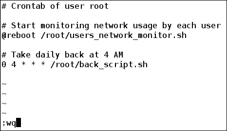
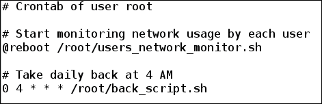
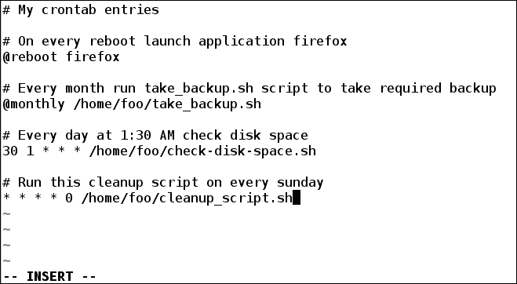
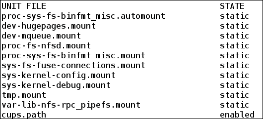
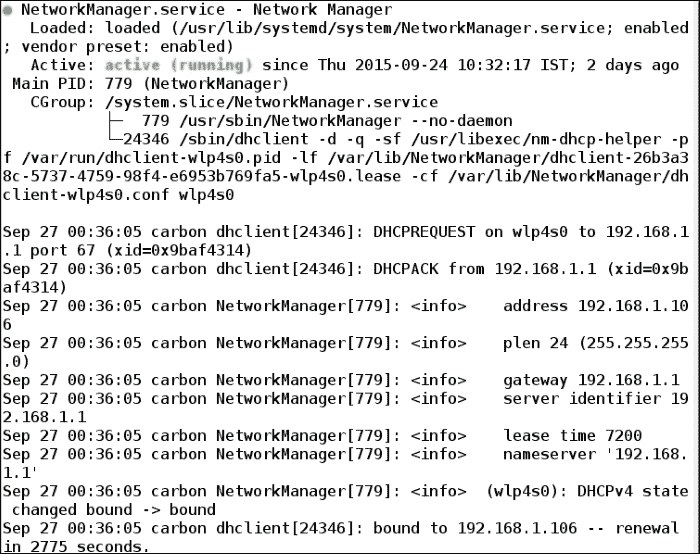
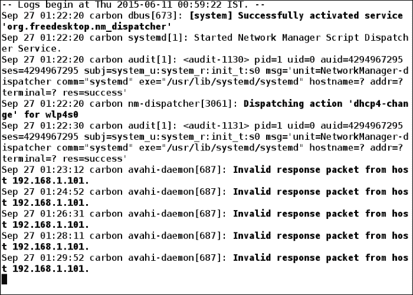
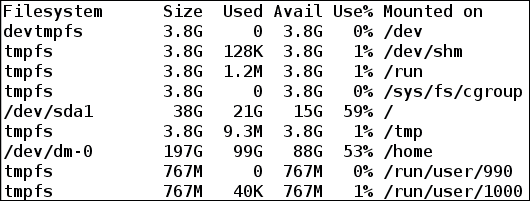

# 第八章。调度任务和在脚本中嵌入语言

到目前为止，我们已经了解了各种有用的 shell 实用程序，以及如何将它们写入 shell 脚本，以避免一次又一次地编写相同的指令。通过编写脚本来自动化任务在一定程度上减少了任务，但是我们仍然必须在需要的时候运行这些脚本。有时，我们希望在特定时间运行命令或脚本，例如，sysadmin 必须在上午 12:30 对数据中心的可用系统进行清理和维护。为了执行所需的操作，sysadmin 将在上午 12:30 左右登录到一台机器上，并执行必要的工作。但是，如果他或她的家庭网络出现故障，并且数据中心离得很远，该怎么办？在那个时候执行任务会很不方便，也很困难。还有一些任务需要每天或每小时执行，例如，监控每个用户的网络使用情况、进行系统备份等。一遍又一遍地执行重复的任务会很无聊。

在本章中，我们将看到如何通过使用实用程序`at`和`crontab`在特定时间或时间间隔调度任务来解决此类问题。我们还将看到 systemd(系统用 PID 1 启动后启动的第一个进程)如何管理系统启动后所需的进程。我们还将看到 systemd 如何管理不同的服务和系统日志。最后，我们将学习如何在 shell 脚本中嵌入其他脚本语言，从而在 shell 脚本中获得额外的功能。

本章将详细介绍以下主题:

*   在特定时间运行任务
*   Cron 作业
*   管理 Crontab 条目
*   系统
*   嵌入语言

# 在特定时间运行任务

一般来说，当我们运行一个命令或脚本时，它会立即开始执行。但是，如果我们希望它稍后在特定时间运行，会怎么样呢？比如我想从网上下载大数据，但又不想在工作的时候拖慢我的互联网带宽。所以，我想在凌晨 1:00 运行我的下载脚本，因为我不会在凌晨 1:00 之后使用互联网进行任何工作。可以使用`at`命令在指定时间安排下载脚本或命令。我们也可以使用`atq`命令列出计划任务，或者使用`atrm`命令删除任何计划任务。

## 使用 at 执行脚本

我们将使用`at`命令在给定的时间运行任务。使用`at`命令的语法如下:

```sh
at [Option] specified_time

```

在前面的语法中，`specified_time`是指命令或脚本应该运行的时间。时间可以采用以下格式:

<colgroup><col style="text-align: left"> <col style="text-align: left"></colgroup> 
| 

时间格式

 | 

描述

 |
| --- | --- |
| HH:MM | 一天中的特定时间，以小时(HH)和分钟(MM)为单位。如果时间已经过去，那么就假设第二天。时间以 24 小时格式指定。 |
| 中午 | 白天 12 点。 |
| 午茶时间 | 下午 16 点或 4 点。 |
| 午夜 | 晚上 12 点。 |
| 今天 | 指当天的当前时间。 |
| 明天 | 指第二天的当前时间。 |
| 上午或下午 | 以时间为后缀，以 12 小时格式指定时间，例如，下午 4:00。 |
| 现在+计算时间单位 | 在某个时间单位后，同时运行一个脚本。计数可以是整数。时间单位可以是分钟、小时、天、周、月或年。 |
| 日期 | 日期可以以月份名称、日期和可选年份的形式给出。日期可以采用以下格式之一:MMDD[抄送]YY、YY、YY 或 YY[抄送]MM-DD。 |

在下表中解释了`at`命令的选项:

<colgroup><col style="text-align: left"> <col style="text-align: left"></colgroup> 
| 

[计]选项

 | 

描述

 |
| --- | --- |
| `-f FILE` | 指定一个要执行的脚本文件。 |
| `-l` | 将别名为`atq`命令。 |
| `-m` | 作业完成时向用户发送电子邮件。 |
| `-M` | 不要给用户发邮件。 |
| `-r` | 将别名为`atrm`命令。 |
| `-t time` | 当时运行一个作业。时间的格式为[[CC]YY]MMDDhhmm[。ss]。 |
| `-c job_number` | 在标准输出上打印与`job_number`相关的作业。 |
| `-v` | 打印作业将被执行的时间。 |

### 调度命令

以下命令计划在 14:00 运行，该命令将文件系统的使用情况存储在用户主目录中名为`file_system_usage.log`的文件中:

```sh
$ at 14:00
warning: commands will be executed using /bin/sh
at> df > ~/file_system_usage.log
at> <EOT>
job 33 at Mon Sep 21 14:00:00 2015

```

当我们运行如图所示的`at`命令时，会打印一条警告消息**警告:将使用/bin/sh** 执行命令，该消息指定将使用哪个 shell 来执行命令。在下一行，我们将看到`at prompt`，在这里我们可以指定要在 14:00 执行的命令列表。在我们的例子中，我们输入了`df > ~/file_system_usage.log`命令，这意味着运行`df`命令并将其结果保存在`file_system_usage.log`文件中。

待输入的命令列表完成后，按*回车*键，然后在下一行，使用 *Ctrl* + *d* 键退出`at`提示。在得到一个正常的 shell 提示之前，我们会看到一条消息，说创建了作业号和执行作业的时间戳。在我们的例子中，作业号是`33`，时间戳是`Mon Sep 21 14:00:00 2015`。

一旦我们指定的时间戳结束，我们就可以检查`file_system_usage.log`文件的内容。

我们可以在`stdout`上打印特定计划作业运行时将要执行的内容:

```sh
$ at -c 33  # Lists content of job 33

```


我们可以看到`df > ~/file_system_usage.log`命令将被执行。其余几行指定任务将在什么环境中执行。

现在，考虑根用户计划的作业:

```sh
# at -v 4am
Mon Sep 21 04:00:00 2015

warning: commands will be executed using /bin/sh
at> reboot
at> <EOT>
job 34 at Mon Sep 21 04:00:00 2015

```

编号为`34`的作业由用户 root 调度。该作业系统将在`4am`重新启动。

### 调度脚本文件

我们可以使用带有`at`命令的`-f`选项将脚本文件安排在特定时间执行。

比如我们想下周下午 4 点运行`loggedin_user_detail.sh`脚本。此脚本列出了登录的用户以及当脚本在计划时间执行时他们正在运行的进程。脚本的内容如下:

```sh
$ cat  loggedin_user_detail.sh
#!/bin/bash
# Filename: loggedin_user_detail.sh
# Description: Collecting information of loggedin users

users_log_file=~/users_log_file.log
echo "List of logged in users list at time 'date'" > $users_log_file
users=('who | cut -d' ' -f1 | sort | uniq')
echo ${users[*]} >> $users_log_file

for i in ${users[*]}
do
 echo "Processes owned by user $i" >> $users_log_file
 ps u -u $i >> $users_log_file
 echo
done
$ chmod +x  loggedin_user_detail.sh  # Provide execute permission

```

现在，为了在下周下午 4 点运行前面的脚本，我们将运行以下命令:

```sh
$at -f loggedin_user_detail.sh 4pm + 1 week
warning: commands will be executed using /bin/sh
job 42 at Sun Sep 27 16:00:00 2015

```

我们可以看到该作业已被安排在一周后运行。

## 列出计划任务

有时候会发生任务被安排在特定时间运行，但是我们忘记了任务应该运行的时间。我们可以使用带有`-l`选项的`atq`或`at`命令之一来查看已经计划的任务:

```sh
$ atq
33      Mon Sep 21 14:00:00 2015 a skumari
42      Sun Sep 27 16:00:00 2015 a skumari

```

`atq`命令显示当前用户计划的作业，包括作业号、时间和用户名:

```sh
$ sudo atq
34      Mon Sep 21 04:00:00 2015 a root
33      Mon Sep 21 14:00:00 2015 a skumari
42      Sun Sep 27 16:00:00 2015 a skumari

```

用`sudo`运行`atq`，列出所有用户安排的作业。

## 删除计划任务

如果任务不再需要执行，我们也可以删除计划任务。当我们想要修改任务的执行时间时，删除任务也很有用。要修改时间，请先删除计划任务，然后用新时间再次创建相同的任务。

例如，我们不想在凌晨 1 点而不是凌晨 4 点重启系统。为此，根用户将首先使用`atrm`命令删除作业`34`:

```sh
# atrm 34
$ sudo atq    # Updated lists of tasks
 33      Mon Sep 21 14:00:00 2015 a skumari
 42      Sun Sep 27 16:00:00 2015 a skumari
# at 1am
warning: commands will be executed using /bin/sh
 at> reboot
 at> <EOT>
job 47 at Mon Sep 21 01:00:00 2015
$ sudo atq
 33      Mon Sep 21 14:00:00 2015 a skumari
 42      Sun Sep 27 16:00:00 2015 a skumari
 47      Mon Sep 21 01:00:00 2015 a root

```

我们可以看到根用户计划的任务现在将在凌晨 1 点运行，而不是凌晨 4 点。

# 克隆作业

Cron 作业是定期运行的作业或任务，与`at`命令不同。比如在办公室，我的工作就是把公司员工所有的详细信息都保密。为了保证它的安全和更新而不丢失任何信息，我必须备份硬盘或闪存驱动器等外部设备中的最新数据。根据员工数量的不同，我可能需要分钟、小时、每天或每周进行备份。每次手动备份，既辛苦又繁琐，还浪费时间。通过掌握如何安排 cron 作业的知识，它可以非常容易地实现。Cron 作业创建通常由系统管理员来完成，以计划定期执行的任务，例如，备份系统、保存每个登录用户的日志、监控和报告每个用户的网络使用情况、执行系统清理、计划系统更新等。

Cron 由两部分组成:Cron 守护进程和 cron 配置。

## Cron 守护程序

当系统启动时，cron 守护程序自动启动，在后台继续运行。守护进程称为 crond，由 systemd 或 init 进程启动，具体取决于您的系统。它的任务是每隔一分钟定期检查配置文件，并检查是否有任何任务要完成。

## Cron 配置

Cron 配置包含将要调度的 Cron 作业写入的文件和目录。它们可以在`/etc/`目录中找到。与 cron 配置相关的最重要的文件是`crontab`。在 Linux 系统中，与 cron 相关的配置文件如下:

*   `/etc/cron.hourly/`:包含每小时要运行的脚本
*   `/etc/cron.daily/`:包含每天运行一次的脚本
*   `/etc/cron.weekly/`:包含每周运行一次的脚本
*   `/etc/cron.monthly/`:包含每月运行一次的脚本
*   `/etc/crontab`:包含命令及其运行的时间间隔
*   `/etc/cron.d/`:这是包含有命令的文件的目录，以及它们应该运行的时间间隔

脚本可以直接添加到任何目录中，如`cron.hourly/`、`cron.daily/`、`cron.weekly/`或`cron.monthly/`，以便分别每小时、每天、每周或每月运行一次。

下面是一个简单的 shell 脚本`firefox_memcheck.sh`，它检查火狐进程是否正在运行。如果火狐正在运行，并且内存使用率超过 30%，请重新启动火狐:

```sh
#!/bin/sh
# Filename: firefox_memcheck.sh
# Desription: Resatrts application firefix if memory usage is more than 30%

pid='pidof firefox' # Get pid of firefox
if [ $pid -gt 1 ]
then
  # Get current memory usage of firefox
  current_mem_usage='ps -u --pid $pid| tail -n1 | tr -s ' ' | cut -d ' ' -f 4'
  # Check if firefox memory  usage is more than 30% or not
  if [ $(echo "$current_mem_usage > 30" | bc) -eq 1 ]
  then
    kill $pid   # Kill firefox if memory usage is > 30%
    firefox &   # Launch firefox
  fi
fi
```

我们可以将这个脚本添加到系统的`/etc/cron.hourly/`目录中，它会继续检查我们的火狐内存使用情况。该脚本也可以修改，以监控其他进程的内存使用情况。

## 克朗塔布条目

通过将脚本放入`cron.{hourly, daily, weekly, monthly}`，我们只能以一小时、一天、一周和一个月的间隔设置任务。如果任务必须以 2 天为间隔、10 天为间隔、90 分钟为间隔等方式运行，该怎么办？为此，我们可以将任务添加到`/etc/crontab`文件或`/etc/cron.d/`目录中。每个用户都可以有自己的 crontab 条目，并且与每个用户相关的文件在`/var/spool/`中可用。

crontab 条目如下所示:


我们可以从前面的截图中看到，crontab 条目有五个星号。每个星号定义一个特定的持续时间。我们可以将*替换为针对每一个的建议值，或者保持不变。如果*在一个字段中被提及，那么它意味着考虑该字段的所有实例。

时序语法也可以描述如下:

*   指定 0 到 59 之间的**分钟**值
*   指定从 0 到 23 的**小时**
*   指定从 1 到 31 的**天**
*   指定从 1 到 12 的**个月**，或者我们可以写 1 月、2 月、…12 月
*   指定一周中的第**天**，其范围可以从 0 到 6，或者我们可以写 sun (0)、mon (1)、…、sat (6)

所有五个字段由空格分隔。后跟一个**用户名**，指定命令将由哪个用户执行。指定用户名是可选的，默认情况下，它以 root 用户身份运行。最后一个字段是计划执行的命令。

演示如何编写 crontab 条目的示例如下:

```sh
20 7 * * 0 foo command

```

每个字段可以解释如下:

*   `20`:第 20 分钟
*   `7` : 7AM
*   `*`:每天
*   `*`:每个月
*   `0`:周日
*   `foo`:该命令将作为 foo 用户运行
*   `command`:这是指定要执行的命令

因此，该命令将在每周日上午 7:20 以 root 用户身份运行。

我们可以使用逗号(，)指定一个字段的多个实例:

```sh
30 20,22 * * * command

```

在这里，`command`将在每天晚上 8:30 和晚上 10:30 运行。

我们还可以使用连字符(`-`)在字段中指定时间范围，如下所示:

```sh
35 7-11 * * 0-3 command

```

这意味着，运行命令在周日、周一、周二和周三的 7:35、8:35、9:35、10:35 和 11:35。

要以特定的时间间隔运行脚本，我们可以指定正斜杠(/)如下:

```sh
20-45/4 8 9 4 * command

```

该命令将于 4 月 9 日上午 8:20 至 8:45 运行，时间间隔为 4 分钟。

### Crontab 中的特殊字符串

Crontab 也可以指定以下字符串:

<colgroup><col style="text-align: left"> <col style="text-align: left"></colgroup> 
| 

线

 | 

描述

 |
| --- | --- |
| `@hourly` | 一小时跑一次，相当于 0 * * * * |
| `@daily`或`@midnight` | 一天跑一次，相当于 0 0 * * * |
| `@weekly` | 一周跑一次，相当于 0 0 * * 0 |
| `@monthly` | 一个月跑一次，相当于 0 0 1 * * |
| `@yearly or @annually` | 一年跑一次，相当于 0 0 1 1 * |
| `@reboot` | 在系统启动时运行 |

# 管理 crontab 条目

我们不直接添加或修改 crontab 的条目。这是通过使用`crontab`命令完成的，该命令允许您添加、修改和列出 crontab 条目。每个用户都可以拥有自己的 crontab，他们可以在其中添加、删除或修改任务。默认情况下，它对所有用户都是启用的，但是如果系统管理员想要限制某些用户，他或她可以在`/etc/cron.deny`文件中添加该用户。

使用`crontab`命令的语法如下:

```sh
crontab [-u user] file
crontab [-u user] [option]

```

下表解释了 crontab 的选项:

<colgroup><col style="text-align: left"> <col style="text-align: left"></colgroup> 
| 

[计]选项

 | 

描述

 |
| --- | --- |
| `-u user` | 追加要修改`crontab`的用户的名称 |
| `-l` | 在`stdout`上显示当前 crontab |
| `-e` | 使用`EDITOR env`指定的编辑器编辑当前`crontab` |
| `-r` | 移除电流`crontab` |
| `-i` | 当与`-r`选项一起使用时，交互式移除当前`crontab` |

## 列出 crontab 条目

要在列表中列出`crontab`条目，我们使用当前用户的`-l`选项:

```sh
$ crontab -l
no crontab for foo

```

输出显示用户`foo`没有`crontab`条目。这意味着用户`foo`还没有在他或她的`crontab`中添加任何任务。

要以超级用户身份查看`crontab`，请键入以下命令:

```sh
# crontab -l
no crontab for root

```

或者，使用以下命令:

```sh
$ sudo crontab -l

```

## 编辑 crontab 条目

使用带有 Crontab 的`-e`选项，可以编辑或修改当前用户的 Crontab :

```sh
$ crontab -e

```

执行上述命令后，编辑器将打开，用户可以在其中将任务添加到`crontab`文件中。在我们的例子中，`vi`编辑器被启动。以下条目已添加到用户`foo crontab`条目中:


保存并退出编辑器后，获得的输出如下:

```sh
no crontab for foo - using an empty one
crontab: installing new crontab
```

要查看用户`foo`修改后的 crontab 条目，再次运行`–l`选项:

```sh
$ crontab -l

```


要创建用户根的`crontab`条目，我们可以以`-e`选项作为根来运行`crontab`:

```sh
# crontab -e

```

运筹学

```sh
$ sudo crontab -e

```

运行上述命令后，编辑器打开，修改用户根的`crontab`，添加条目后如下所示:



要查看根的`crontab`条目，我们可以使用`crontab -l`作为根用户:

```sh
# crontab -l

```



根用户也可以查看和修改另一个用户的`crontab`条目。这是通过指定`-u`选项，后跟用户名来完成的:

```sh
# crontab -u foo -e  # Modifying crontab of user foo as root

```

用户`foo`的 Crontab 将被打开进行修改，如下所示:



要查看另一个用户的`crontab`条目，使用`–u`运行`-l`选项，如下所示:

```sh
# crontab -u foo -l

```

我们可以将用户`foo`的`crontab`显示如下:


Crontab 条目是使用`crontab`命令创建的，并存储在`/var/spool/cron/`目录中。文件由用户的名称创建:

```sh
# ls /var/spool/cron
root  foo

```

我们可以看到为用户`root`和`foo`创建了一个文件。

## 删除 crontab 条目

我们也可以使用`crontab`命令的`-r`选项删除。默认情况下，删除当前用户的`crontab`。使用带有`-i`的选项，允许交互式删除 crontab:

```sh
# crontab -i -r
crontab: really delete root's crontab? Y

```

通过运行前面的命令，用户根的`crontab`条目已经被删除。我们可以通过运行`-l`选项来验证这一点:

```sh
# crontab -l
no crontab for root

#  ls /var/spool/cron
foo

```

用户根也可以通过在`–u`选项中指定用户来删除其他用户的`crontab`:

```sh
# crontab -r -i -u foo
crontab: really delete foo's crontab? n

```

我们指定了“`n`”(否)而不是“`y`”(是)，因此用户`foo crontab`的移除将被中止。

让我们现在删除它:

```sh
# crontab -r -i -u foo
crontab: really delete foo's crontab? Y

```

现在，用户`foo`的`crontab`条目已经被移除。要进行验证，请运行以下命令:

```sh
$  crontab -l
no crontab for foo

```

# 系统

如今，大部分的Linux 发行版系统如 Fedora、Ubuntu、Arch Linux、Debian、openSUSE 等等，都已经从`init`切换到了 systemd。systemd 是系统启动后用 PID 1 启动的第一个进程。它控制和管理应该在系统启动后启动的其他进程。它也被称为操作系统的基本构造块。要了解基于初始化的系统，请参考https://en.wikipedia.org/wiki/Init 的维基百科链接。

## 系统单位

systemd 有几个单元，每个单元包含一个配置文件，其中包含服务、套接字、设备、挂载点、交换文件或分区、启动目标等信息。

下面的表解释了一些单元文件:

<colgroup><col style="text-align: left"> <col style="text-align: left"> <col style="text-align: left"></colgroup> 
| 

设备型号

 | 

文件扩展名

 | 

描述

 |
| --- | --- | --- |
| 服务单位 | `.service` | 系统服务 |
| 设备单元 | `.device` | 内核识别的设备文件 |
| 安装单元 | `.mount` | 文件系统挂载点 |
| 定时器单元 | `.timer` | a 系统计时器 |
| 交换单位 | `.swap` | 交换文件 |

要列出系统中所有已安装的设备文件，请使用`list-unit-files`选项运行`systemctl`命令:

```sh
$ systemctl list-unit-files | head -n 12

```



要列出单位类型的单位文件，请使用`list-unit-files`和`--type`选项。运行以下命令将仅显示系统中可用的服务单元:

```sh
$ systemctl list-unit-files --type=service | head -n 10

```


## 管理服务

systemd 管理系统中所有可用的服务，从 Linux 内核启动到系统关闭。Linux 系统中的服务是在后台运行或等待使用的应用程序。服务管理文件的文件名中有后缀`.service`。

在基于 systemd 的 Linux 系统中，用户或管理员可以使用`systemctl`命令管理服务。

### 服务的状态

要列出服务的当前状态并检查其是否正在运行，请使用`systemctl status`:

例如，要查看我的`NetworkManager`服务的状态，请运行以下命令:

```sh
$ systemctl status -l NetworkManager.service 

```



我们可以看到`NetworkManager`服务正在运行，处于活动状态。它还提供与当前`NetworkManager`服务相关的详细信息。

让我们看看另一个名为`sshd`的服务的状态。`sshd`服务控制`ssh`是否可以连接到系统:

```sh
$ systemctl status sshd.service

```


这表明服务`sshd`当前处于非活动状态。

如果不需要详细的输出，那么我们可以使用`is-active`选项来查看服务状态:

```sh
$ systemctl is-active sshd.service 
unknown
$ systemctl is-active NetworkManager.service
active

```

这里，`active`表示一个服务正在运行，`unknown`表示一个服务没有运行。

### 启用和禁用服务

系统启动后，系统会自动启动一些服务。A 少数服务可能无法正常运行。要使服务在系统启动后运行，请使用`systemctl enable`，要在启动期间停止系统运行的服务，请使用`systemctl disable`。

在系统启动后，执行以下命令将允许系统运行`sshd`服务:

```sh
# systemctl enable sshd.service

```

当系统启动时，执行以下命令将允许系统不运行`sshd.service`:

```sh
# systemctl disable sshd.service

```

要检查服务是否启用，运行`systemctl is-enabled`命令:

```sh
$ systemctl is-enabled sshd.service
disabled
$ systemctl is-enabled NetworkManager.service
enabled

```

这意味着`sshd`服务在系统启动期间当前被禁用，而`NetworkManager`服务在`systemd`启动期间被启用。

### 启动和停止服务

当一个系统运行时，有时我们可能需要一些服务运行。例如，要从另一个系统在我当前的系统中执行`ssh`，必须运行`sshd`服务。

例如，让我们看看服务的当前状态是什么:

```sh
$ systemctl is-active sshd.service
unknown

```

`sshd`服务当前未运行。让我们试着在一个系统中做`ssh`:

```sh
$ ssh foo@localhost  # Doing ssh to same machine  # Doing ssh to same machine
 ssh: connect to host localhost port 22: Connection refused

```

我们可以看到`ssh`连接已经被拒绝。

现在，让我们开始运行`sshd`服务。我们可以使用`systemctl start`命令启动服务，如下所示:

```sh
# systemctl start sshd.service 
$ systemctl is-active sshd.service
active

```

现在，`sshd`服务正在运行。再次尝试对机器执行`ssh`:

```sh
$ ssh foo@localhost
Last login: Fri Sep 25 23:10:21 2015 from 192.168.1.101

```

现在，登录已经成功完成。

我们甚至可以使用`systemctl restart`命令重启正在运行的服务。当服务被修改时，这是必需的。然后，为了启用修改后的设置，我们可以重新启动它。

```sh
#  systemctl restart sshd.service

```

前面的命令将重新启动`sshd`服务。

当`ssh`不再需要时，停止运行是安全的。这避免了对机器的匿名访问。要停止运行服务，运行`systemctl stop`命令:

```sh
# systemctl stop sshd.service
$ systemctl is-active sshd.service
unknown

```

## 查看系统日志

为了检查用户是在个人机器上工作还是在企业机器上工作，查看系统日志对于跟踪问题和获取系统中发生的活动的详细信息非常重要。查看系统日志在监控和确保网络流量不受攻击方面发挥着重要作用。在基于 systemd 的系统中，系统日志由其一个名为`journald`的组件收集和管理。它的任务是收集应用程序和内核的日志。日志文件在`/var/log/journal/`目录下。

要查看由`journald`收集的日志，使用`journalctl`命令:

```sh
# journalctl

```

运行前面的命令会显示收集的所有系统日志，从旧日志开始，一直到新日志。

### 查看最新日志条目

要查看最新的日志条目并连续打印新条目作为日志的附件，请使用`–f`选项:

```sh
$ journalctl -f

```



要查看自系统上次引导以来捕获的日志条目，请使用`–b`选项:

```sh
$ journalctl -b

```


### 查看特定时间间隔的日志

我们还可以查看特定时间间隔的日志。例如，要查看过去 1 小时的日志，我们可以运行以下命令:

```sh
$  journalctl --since "1 hour ago" --until now

```

要查看自 2015 年 7 月 1 日至今的日志条目，我们可以运行以下命令:

```sh
$ journalctl --since 2015-07-01

```

要查看从 2015 年 8 月 7 日晚上 7:23 到 2015 年 8 月 9 日早上 7 点的日志，我们可以运行以下命令:

```sh
$ journalctl --since "2015-08-07 19:23:00" --until "2015-08-09 7:00:00" 

```

# 嵌入语言

与 Python、Ruby、Perl 和 AWK 等其他脚本编程语言相比，Shell 脚本提供了一组特定的特性。与 shell 脚本语言相比，这些语言提供了额外的特性。在基于 Linux 和 UNIX 的系统上，要使用这些语言，如果没有预先安装，我们必须单独安装它们。

考虑一个简单的例子:有一个 json 或 XML 文件，我们想要解析它并检索存储在其中的数据。使用 shell 及其命令很难做到这一点，而且容易出错，但是如果我们了解 Python 或 Ruby 语言，我们可以轻松做到这一点，然后将其嵌入到 shell 脚本中。应该在 shell 脚本中嵌入另一种语言，以减少工作量并获得更好的性能。

在 shell 脚本中嵌入其他语言的语法如下:

<colgroup><col style="text-align: left"> <col style="text-align: left"></colgroup> 
| 

脚本语言

 | 

嵌入外壳脚本的语法

 |
| --- | --- |
| Python (Python 版本 2) | `python -c`' '。在单引号里面写着要处理的 Python 代码 |
| 蟒蛇 3 | `python3 -c`' '。单引号内写着要处理的 Python 第 3 版代码 |
| Perl 语言 | `perl -e`' '。单引号内写着 Perl 代码。 |
| 红宝石 | `ruby -e`' '。单引号里面写着 Ruby 代码。 |
| AWK | 这可以用作命令实用程序。有关可用选项，请参考 awk 手册页。 |

## 嵌入 Python 语言

为了将 Python 语言嵌入到 shell 脚本中，我们将使用`python -c " Python Code"`。要了解 Python，请参考[https://www.python.org/](https://www.python.org/)的官方网站。

一个简单的 Python 例子是用 Python 打印`Hello World`，如下所示:

```sh
print "Hello World"
```

要将它嵌入到 shell 脚本中，我们可以编写如下代码

```sh
#!/bin/bash
# Filename: python_print.sh
# Description: Embeding python in shell script

# Printing using Python
python -c 'print "Hello World"'
```

我们现在将如下执行`python_print.sh`脚本:

```sh
$ sh python_print.sh
Hello World

```

要在 shell 脚本中嵌入多行 Python 代码，请使用以下代码:

```sh
 python -  <<EOF
# Python code
EOF
```

这里， **python -** 指示 python 命令接受 stdin 的输入，`EOF`是一个标签，指示接受 stdin 的输入，直到遇到`EOF`文本。

以下示例在 shell 脚本中嵌入 Python 语言，并从用户的 Gmail 帐户中获取未读电子邮件:

```sh
#!/bin/bash
# Filename: mail_fetch.sh
# Description: Fetching unread email from gmail by embedding python in shell script

# Enter username and password of your gmail account
echo Enter your gmail username:
read USER
echo Enter password:
read -s PASSWD

echo Running python code
python - <<CODE
# Importing required Python module

import urllib2
import getpass
import xml.etree.ElementTree as ET

# Function to get unread messages in XML format
def get_unread_msgs(user, passwd):
    auth_handler = urllib2.HTTPBasicAuthHandler()
    auth_handler.add_password(
        realm='mail.google.com',
        uri='https://mail.google.com',
        user=user,
        passwd=passwd
    )
    opener = urllib2.build_opener(auth_handler)
    urllib2.install_opener(opener)
    feed = urllib2.urlopen('https://mail.google.com/mail/feed/atom')
    return feed.read()

xml_data = get_unread_msgs("$USER", "$PASSWD")
root = ET.fromstring(xml_data)

# Getting Title of unread emails
print "Title of unread messages:"
print "........................"
count=0
for e in root.iter('{http://purl.org/atom/ns#}title'):
    print e.text

CODE

echo "Done!"
```

执行该脚本后，输出示例如下:

```sh
$ sh mail_fetch.sh
Enter your gmail username:
foo@gmail.com
Enter password:

Running python code
Title of unread messages:
.....................……………..
Gmail - Inbox for foo@gmail.com
Unread message1
unread message2
Unread message3
Done!
```

## 嵌入 AWK 语

Awk 是一种为文本处理设计的编程语言，主要用于获取相关数据和报表工具。要了解更多关于 AWK 编程语言的信息，请参考其手册页或访问位于[http://www.gnu.org/software/gawk/manual/gawk.html](http://www.gnu.org/software/gawk/manual/gawk.html)的网站。

Awk 语言可以非常容易地用在 shell 脚本中。例如，考虑运行系统上`df`命令的输出:

```sh
$ df -h

```



要获取第四列，即使用`awk`的`Avail`字段，我们可以使用`awk`编写一个 shell 脚本，如下所示:

```sh
#!/bin/bash
# Filename: awk_embed.sh
# Description: Demonstrating using awk in shell script

# Fetching 4th column of command df output
df -h |awk '{ print $4 }'
```


考虑另一个例子，我们将使用一个输入文件，它将是系统的`/etc/passwd`文件。该文件包含 Linux 或基于 UNIX 的系统上每个用户或帐户的基本信息。

一个`/etc/passwd`文件的每一行如下所示:

```sh
root:x:0:0:root:/root:/bin/bash

```

共有七个字段，每个字段由冒号(:)分隔。要了解每个字段的详细含义，请参考[https://en.wikipedia.org/wiki/Passwd](https://en.wikipedia.org/wiki/Passwd)的维基百科链接。

下面的 shell 脚本利用了 awk 特性，显示了来自`/etc/passwd`文件的一些有用信息。例如，我们将考虑以下内容作为`passwd`文件的内容:

```sh
$ cat passwd
root:x:0:0:root:/root:/bin/bash
bin:x:1:1:bin:/bin:/sbin/nologin
daemon:x:2:2:daemon:/sbin:/sbin/nologin
adm:x:3:4:adm:/var/adm:/sbin/nologin
lp:x:4:7:lp:/var/spool/lpd:/sbin/nologin
sync:x:5:0:sync:/sbin:/bin/sync
shutdown:x:6:0:shutdown:/sbin:/sbin/shutdown
halt:x:7:0:halt:/sbin:/sbin/halt

$ cat passwd_file_info.sh	   # Shell script content
#!/bin/bash
# Filename: passwd_file_info.sh
# Desciption: Fetches useful information from /etc/passwd file using awk

# Fetching 1st and 3rd field i.e. Username and UID and separate them with blank space
awk -F":" '{ print "Username: " $1 "\tUID:" $3 }' passwd

# Searching line whose user is root
echo "User root information"
awk '$1 ~ /^root/' passwd

```

运行该脚本会产生以下结果:

```sh
$ sh passwd_file_info.sh
Username: root  UID:0
Username: bin   UID:1
Username: daemon        UID:2
Username: adm   UID:3
Username: lp    UID:4
Username: sync  UID:5
Username: shutdown      UID:6
Username: halt  UID:7

User root information
root:x:0:0:root:/root:/bin/bash 

```

### 注

也可以在 shell 脚本中使用 C、C++和 Java 等编译语言。为此，编写命令来编译和执行代码。

# 总结

阅读本章后，您现在应该知道如何使用`at`命令安排在特定时间执行任务。您还应该知道创建需要执行多次的 Cron 作业的好处。您还应该学习了如何使用`crontab`命令来添加、修改、列出和删除 crontab 条目。您还很好地理解了`systemd`——在系统上创建的第一个进程——以及它如何管理其他系统进程、服务和日志。您还应该知道如何在 shell 脚本中嵌入其他脚本语言，如 Python、AWK、Ruby 等。

在阅读了所有这些章节并练习了示例之后，您现在应该对 shell 脚本有信心了。作为命令行大师，您现在能够编写自己的 shell 脚本来解决日常任务。最后，如果本书没有涉及到任何内容，您应该查看任何命令的手册页以寻求帮助。