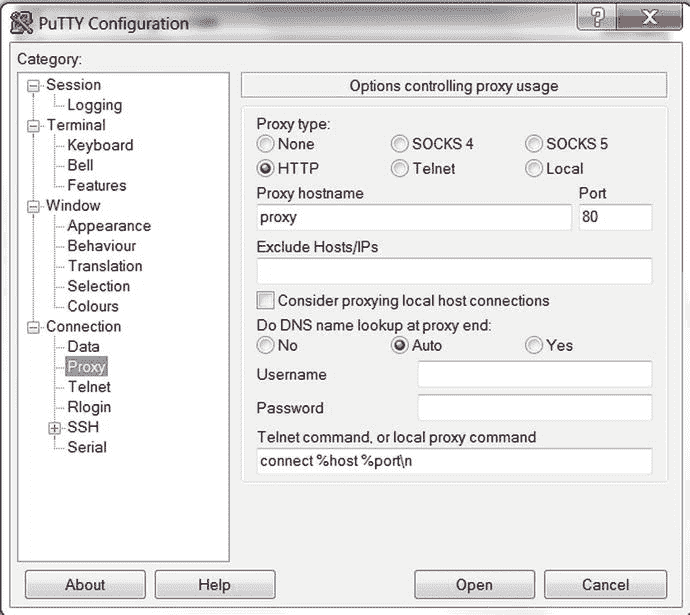

# 第 1 章:入门

Electronic supplementary material The online version of this chapter (doi:[10.​1007/​978-1-4842-1254-7_​1](http://dx.doi.org/10.1007/978-1-4842-1254-7_1)) contains supplementary material, which is available to authorized users.

数据库管理员(DBA)是每个信息技术团队的关键成员。他们负责关键任务，例如:

*   安装软件和创建数据库
*   提供高度可伸缩且性能良好的数据库环境
*   监控和维护公司数据库
*   确保公司数据得到备份、保护和保障
*   排除系统性能和可用性问题
*   作为数据库工程信息的整体来源

这些职责要求数据库管理员同时具备数据库和操作系统(OS)方面的专业知识。事实上，如果不是底层操作系统专家，您(DBA)就无法设计、实现或维护大型高事务数据库环境。在许多情况下，操作系统是您通向数据库的唯一渠道。因此，您必须特别了解操作系统，才能胜任您的数据库管理职责。

当第一次构建数据库时，DBA 应该能够指定可靠的、可伸缩的系统配置。此外，DBA 通常是系统管理员、用户、网络管理员、经理和公司高管之间的桥梁。如果你在一个设计糟糕的系统上工作(事后)，你必须拥有工具来诊断和解决整个技术栈中的瓶颈。不管问题的来源是什么，团队成员通常会寻求经验丰富的 DBA 来解决系统性能、安全性和可用性问题。我们知道这是真的，因为我们每天都生活在其中(包括晚上和周末)。

Oracle 软件运行在各种操作系统上，包括许多 Linux/UNIX 变体和 Windows。大量 Oracle 安装在 Oracle Linux 或 Oracle Solaris 上。Oracle Linux 是基于 Red Hat Enterprise Linux (RHEL)的 Oracle 版本的 Linux。Oracle Solaris 是一个 UNIX 操作系统，最初由 Sun Microsystems 创建，自 Oracle 于 2010 年收购 Sun 后，现归 Oracle Corporation 所有。

Linux 和 Solaris 操作系统被广泛认为是可靠的 24/7 任务关键型企业服务器平台。雇主专门寻找具有 Linux/Solaris 专业知识的数据库管理员。事实上，作为一名 DBA，总有一天您会不可避免地使用 Linux 或 Solaris 服务器来存储您的数据。您将负责确保您的数据库与底层操作系统无缝协作。经理们将指望你来保证公司数据库得到适当的实现和维护。

本书主要帮助您了解如何在 Linux 和 Solaris 服务器上有效地管理 Oracle 软件。从表面上看，您会发现 Linux 和 Solaris 在命令和语法上基本相同(对于 Linux 和任何 UNIX 变体也是如此)。话虽如此，但你必须意识到操作系统之间偶尔会有差异。我们将努力指出这些细微的差异。当没有差异时，我们将简单地把操作系统称为“Linux/Solaris”，这意味着这个概念同样适用于两者。

本书中的信息将使您在履行关键职责时能够像一名专家 DBA 一样发挥作用。我们为运行在 Linux/Solaris 操作系统上的 Oracle 数据库技术的具体问题提供了直接的答案。第一章中的方法假设您对 Linux/Solaris 一无所知，并且涵盖了您第一次连接到服务器并使用 OS 命令时会遇到的情况。如果你对 Linux/Solaris 操作系统已经相当有经验，可以跳过这一章。

在本章中，我们首先向您介绍登录 Linux/Solaris 服务器的一些最常用的方法。然后，我们将讲述运行 Linux/Solaris 命令的基础知识，并详细介绍如何使用内置帮助和在线文档。我们通过展示纠正命令行错误和重置终端屏幕的技术来结束这一章。

## 1-1.安全地连接到远程服务器

### 问题

您正在使用基于 Windows 的笔记本电脑或工作站，并希望通过网络安全地连接到远程 Linux/Solaris 数据库服务器。

### 解决办法

此解决方案展示了如何下载和使用 PuTTY 应用程序来通过网络启动安全的远程连接:

To get started, download PuTTY from an Internet site such as [`www.putty.org`](http://www.putty.org/) or `www.chiark.greenend.org.uk/∼sgtatham/putty/download.html`.   Once on the PuTTY download site, you’ll find links that enable you to download the PuTTY application. You can download just the `putty.exe` file or all utilities available via the `putty.zip` file.   After you download the desired files, navigate on your personal computer to the directory in which you downloaded the PuTTY utility. You should see a screen similar to Figure [1-1](#Fig1). Double-click the PuTTY icon to start the connection utility.

图 1-1。

PuTTY application icon   Figure [1-2](#Fig2) shows a partial screenshot of what you see next. From this screen, you can enter the hostname or IP address and connection port of the remote server to which you want to connect. Enter the connection details of your Linux/Solaris database server and click the Open button to initiate a remote connection. If you aren’t sure about the connection information, contact your system administrator for details.

图 1-2。

PuTTY connection details   After you connect to your database server, you should see the screen shown in Figure [1-3](#Fig3). Enter your username and password (contact your system administrator if you don’t know them). Once logged on, you can run shell commands to perform tasks on your database server. ([Chapter 2](02.html) provides more detail about shells.)

图 1-3。

Linux/Solaris server logon screen  

### 它是如何工作的

PuTTY 是一个免费的开源实用程序，允许您创建到远程数据库服务器的安全外壳(SSH)连接。这个实用程序很受欢迎，因为它是一个免费的、易于使用的应用程序，使您能够通过网络从 Windows 客户机安全地连接到远程 Linux/Solaris 数据库服务器。使用此工具，您可以存储您的服务器首选项和连接信息，这样就不需要重新键入冗长的主机名或 IP 地址。

Note

其他实用程序也允许您通过 SSH 启动远程连接。例如，Cygwin/X 应用程序是 X Window 系统的一个流行的基于 Windows 的实现。这个 Cygwin/X 实用程序允许您在 Windows 桌面上运行 X 应用程序，并启动到数据库服务器的远程 SSH 连接。

您还可以使用 PuTTY 通过代理服务器和 SSH 隧道进行连接。在接下来的部分中简单解释了一些例子。

#### 通过代理服务器连接

出于安全和性能原因，许多公司要求所有的互联网连接都通过代理服务器。要使用 PuTTY 通过代理服务器连接，打开 PuTTY 配置对话框，点击连接类别下的代理节点，如图 [1-4](#Fig4) 所示。

图 1-4。

PuTTY—proxy server configuration

选择 HTTP 作为代理类型，提供代理服务器的主机名或 IP 地址，并提供相应的端口号。保存对 PuTTY 配置的更改，以供将来使用。

#### 通过 SSH 隧道连接

您还可以使用 PuTTY 通过隧道(也称为端口转发)连接到远程服务器。要使用隧道，请打开 PuTTY 配置对话框，然后选择 SSH 作为连接类型。接下来，提供指定 SSH 服务器的主机名或 IP 地址以及 SSH 端口号(默认为 22)。之后，点击连接节点，然后点击 SSH 节点，最后点击隧道节点，如图 [1-5](#Fig5) 所示。

图 1-5。

PuTTY—SSH tunneling configuration

在“添加新转发端口”部分下的“源端口”字段中，提供您将在 Windows 客户端上连接的端口号。在目标字段中，提供 Linux/Solaris 数据库服务器的主机名或 IP 地址，以及端口号。保存对 PuTTY 配置的更改，以供将来使用。

## 1-2.通过命令行远程登录

### 问题

您的系统管理员已经为您提供了数据库服务器的用户名和密码。您现在希望通过命令行实用程序(如`telnet`或`ssh`)登录到服务器。

### 解决办法

这个例子假设您可以访问一个终端，从这个终端您可以启动一个`ssh`命令。根据您的环境，您的“终端”可以是您的家用 PC 或工作站上的 PuTTY 会话(参见配方 1-1)。如果您不确定如何启动终端会话，请向您的系统管理员寻求帮助(根据您的工作环境，这可能会有很大差异)。

在这一行代码中，用户名是`oracle`，主机名是`rmoug1`:

`$ ssh -l oracle rmoug1`

如果`ssh`成功找到数据库服务器，系统会提示您输入密码(提示可能因操作系统版本而异):

`Password:`

出于安全考虑，您的密码在键入时不会显示。键入密码后，按 Enter 或 Return 键完成登录过程。

Tip

如果您认为在输入密码时犯了错误，请按 Ctrl+U 清除密码行中所有不可见的文本。这项技术将节省您的时间，并防止许多意外失败的登录。或者，您可以尝试使用退格键或 Delete 键来抹掉您输入的任何文本。

### 它是如何工作的

`ssh`实用程序在 Linux/Solaris 环境中广泛用于建立到远程服务器的安全连接。默认情况下，大多数 SSH 服务器监听端口 22。您可以通过查看`/etc/ssh/sshd_config`文件的内容来验证端口。这里有一个例子:

`$ cat /etc/ssh/sshd_config`

下面是输出的部分清单:

`# The strategy used for options in the default sshd_config shipped with`

`# OpenSSH is to specify options with their default value where`

`# possible, but leave them commented. Uncommented options change a`

`# default value.`

`#Port 22`

如果您的系统管理员已经将服务器设置为监听 22 以外的端口，您必须使用`-p` (port)选项明确指定它。这个例子通过端口 71 将`oracle`用户连接到`rmoug1`服务器:

`$ ssh -p 71 -l oracle rmoug1`

输入有效的用户名和密码后，您的系统可能会显示诸如您上次登录的时间、您从哪台机器发起连接、您的帐户是否有未读邮件等信息。此外，如果您的系统管理员在`/etc/motd`(每日消息)文件中输入了任何文本，也会显示该信息。以下文本是典型的登录消息:

`Last login: Wed Mar 28 14:12:50 2015 from from hlrn.rmoug.net`

在您的用户名和密码被 Linux/Solaris 服务器成功认证之后，您应该会看到一个`$`(美元符号)提示:

`$`

字符`$`表示您在 shell 命令行提示符下。`$`字符是大多数 Linux/Solaris 系统的默认命令行提示符。

Note

本书中的所有命令行示例都显示了`$`提示符。您不必在本书的任何示例命令中键入`$`提示符。

您的系统管理员可能已将您的帐户配置为显示不同于`$`字符的提示。DBA 有时会将提示符配置为包含服务器名和数据库名等信息。请参阅配方 2-6，更改命令行提示，而不是默认的。

Note

如果您使用`root`帐户(有时称为`superuser`)登录，默认的命令行提示符是`#`字符。

一些服务器接受来自`telnet`客户端的远程连接。出于安全原因，我们建议您不要使用`telnet`通过网络登录服务器。`telnet`实用程序不使用加密技术，容易受到网络黑客的窥探。只要有可能，您应该使用安全的`ssh`工具进行远程连接。然而，你可能偶尔不得不使用`telnet`，因为`ssh`不可用。以下示例使用`telnet`通过网络登录到远程服务器:

`$ telnet -l oracle dbsrver`

## 1-3.注销服务器

### 问题

您想要注销服务器。

### 解决办法

本解决方案涵盖了注销数据库服务器的三种方法:

*   按 Ctrl+D
*   打字`exit`
*   打字`logout`

注销的最快方法是按 Ctrl+D，这将使您立即从服务器上注销。在本例中，同时按下 Ctrl 和 D 键:

`$ Ctrl+D`

您现在应该会看到类似这样的消息:

`Connection to <your server> closed.`

您还可以键入`exit`命令来注销您的数据库服务器:

`$ exit`

您现在应该会看到类似这样的消息:

`Connection to <your server> closed.`

您也可以键入`logout`命令来注销系统:

`$ logout`

您现在应该会看到类似这样的消息:

`Connection to <your server> closed.`

### 它是如何工作的

如果您在一个现有的 shell 会话中启动一个子 shell，那么“解决方案”一节中描述的注销技术将只从最内层的 shell 中退出。例如，假设您已经登录到服务器，然后发出以下命令:

`$ bash`

您现在已经启动了一个 subshell。如果您想退出 subshell，请使用“解决方案”一节中描述的技术之一:

`$ exit`

类似地，如果您发出`su`命令切换到另一个用户，当您退出该会话时，您将返回到启动`su`命令的 shell。

如果您计划离开终端，注销您的操作系统会话是一个很好的安全做法。作为 DBA，您通常会发现自己作为拥有数据库二进制文件的用户(通常是`oracle` OS 帐户)登录到服务器。这个`oracle`账户就像一个数据库`superuser`账户。

数据库操作系统帐户可以执行潜在的破坏性操作，如删除数据库、删除数据库文件等。注销可确保您的数据库操作系统帐户不会受到威胁。

Tip

设置`TMOUT`变量以限制会话在自动注销前的空闲时间。该参数可以在`/etc/bashrc`文件中进行全局设置。登录到服务器时，如何自动设置变量，见配方 2-5。

## 1-4.运行命令

### 问题

您刚接触 Linux/Solaris，希望从操作系统提示符下运行一个 shell 命令。

### 解决办法

通过键入 Linux/Solaris 命令并按 Enter 或 Return 键，可以从命令行运行这些命令。该示例使用`df` (disk-free)命令显示数据库服务器上未使用的磁盘空间量:

`$ df`

根据您的操作系统版本，`df`的输出可能会有一些差异。在 Linux 系统上，您应该会看到类似如下的输出:

`Filesystem           1K-blocks      Used Available Use% Mounted on`

`/dev/xvda2           200095024 123528852  66237984  66% /`

`/dev/xvda1             1019208    138748    827852  15% /boot`

在 Solaris 系统上，`df`命令的输出可能会有所不同:

`$ df`

`/                  (rpool/ROOT/solaris-1):104676373 blocks  104676373 files`

`/devices           (/devices            ):        0 blocks          0 files`

`/dev               (/dev                ):        0 blocks          0 files`

`/system/contract   (ctfs                ):        0 blocks 2147483592 files`

有时，各种操作系统命令的输出格式在 Linux 和 Solaris 之间有所不同。通常，只有当你试图编写一个程序(例如，一个 shell 脚本)期望信息始终位于特定的列中时，这才是重要的(关于 shell 脚本的详细信息，参见[第 7 章](07.html))。您必须根据每个操作系统的输出格式来调整脚本。

### 它是如何工作的

当您登录到 Linux 或 Solaris 机器时，缺省情况下您会被置于命令行。(命令行是您键入 shell 命令来完成给定 DBA 任务的地方。)大多数系统的默认命令行提示符是`$`字符。

通过使用一个或多个选项(有时称为标志或开关)运行命令，可以修改命令的默认行为。该示例使用带有`-h`选项的`df`命令，以更易于阅读的格式显示输出:

`$ df -h`

`Filesystem            Size  Used Avail Use% Mounted on`

`/dev/xvda2            191G  118G   64G  66% /`

`/dev/xvda1            996M  136M  809M  15% /boot`

命令也可以带参数，这些参数通常指定命令应该使用的文件或文本。运行命令时，参数通常放在选项之后。本例使用带有`-h`选项的`df`命令，并使用`/dev/sda2`的参数(这是一个特定的文件系统):

`$ df -h /dev/xvda2`

`Filesystem            Size  Used Avail Use% Mounted on`

`/dev/xvda2            191G  118G   64G  66% /`

这本书没有详细介绍各种图形用户界面(GUI)的使用，当你不知道实际的命令时，这些界面是很有帮助的。尽管这些图形工具非常有用，但我们强烈建议您在命令行提示符下使用命令进行探索。作为一名 DBA，您会遇到 GUI 工具不能完成您完成任务所需的一切的情况。对于某些问题，您需要访问命令行来调试和解决问题。许多复杂或定制的 DBA 任务要求您精通命令行编程技术。虽然有些网站有有用的图形用户界面，但有些却没有。所有站点都有命令行。如果你依赖一个特定的图形用户界面来完成你的工作，当你到达一个没有图形用户界面的站点时，你可能会迷失方向。

如果您不知道合适的 shell 命令及其特性，您可能会浪费时间和精力来解决问题，而如果您知道有哪些工具和选项可用，问题本来可以很容易地解决。

GOLDEN HAMMER RULE

金锤法则可以这样表述:“当你唯一的工具是锤子时，一切看起来都像钉子。”这是什么意思？当人们找到解决问题的工具时，他们会自然而然地一次又一次地使用该工具来解决其他问题。这种依赖之所以会发生，是因为在你熟悉了一个给定的工具或技术之后，你会继续使用它，因为它是可用的；您已经接受了使用该工具的培训；你也发展了一套技能。

这种方法本身没有任何问题。然而，如果您想成为一名更有市场的 DBA，您应该通过学习新技能和研究解决问题的最新方法来不时地扩展您的视野。在当今不断变化的技术环境中，拥有最新技能的 DBA 往往是生存时间最长的人。

不使用 Linux/Solaris 的数据库环境越来越难找到了。作为一名 DBA，您应该主动了解 Linux/Solaris，以及世界各地的公司如何使用这项技术来提供经济高效的信息技术解决方案。

## 1-5.获得帮助

### 问题

您希望找到有关如何使用 shell 命令的更多信息。

### 解决办法

Linux/Solaris 的一个非常好的特性是有几个选项可以快速获得关于 shell 命令的更多信息。表 [1-1](#Tab1) 包含了大多数系统上都有的命令行帮助特性的描述:

表 1-1。

Common Help Features

<colgroup><col> <col></colgroup> 
| 帮助功能 | 描述 |
| --- | --- |
| `man` | 阅读命令的在线手册。 |
| `whatis` | 查看命令的简短描述。 |
| `which` | 找个工具。 |
| `--help` | 显示帮助。 |
| `apropos` | 显示`man`页面文件。 |
| `info` | 列出大量文档。 |
| Tab 键 | 显示可用的命令。 |

表 [1-1](#Tab1) 中的每个帮助方法将在以下章节中描述。

#### 阅读手册页

命令的`man`(手动)页面显示了几乎每个 shell 命令的在线文档。以下命令显示关于`man`的信息:

`$ man man`

下面是输出的部分清单:

`man(1)`

`NAME`

`man - format and display the on-line manual pages`

`SYNOPSIS`

`man  [-acdfFhkKtwW]  [--path]  [-m  system]  [-p string] [-C config_file]`

`[-M pathlist] [-P pager] [-B browser] [-H htmlpager]...`

`man`命令使用屏幕分页器——通常是`less`命令——来显示帮助页面。`less`实用程序在屏幕的左下角显示一个`:`(冒号)提示。您可以使用空格键转到下一页，并使用上下箭头逐行滚动文档。

表 [1-2](#Tab2) 列出了查看`man`页面时可用的`less`命令选项。按 Q 键退出`man`实用程序。

表 1-2。

The `less` Command Options Available While Viewing `man` Pages

<colgroup><col> <col></colgroup> 
| 按键 | 行动 |
| --- | --- |
| j、E 或向下箭头 | 向下移动一行。 |
| k、Y 或向上箭头 | 向上移动一行。 |
| 向上箭头 | 向上移动一行。 |
| 下箭头键 | 向下移动一行。 |
| / | 搜索<string>。</string> |
| n | 向前重复前面的搜索。 |
| Shift+N | 向后重复先前的搜索。 |
| H | 显示帮助页面。 |
| f、空格键或向下翻页 | 下移一页。 |
| b 或向上翻页 | 上移一页。 |
| Q | 退出`man`页面。 |

页面通常被分成十个部分。`man`命令显示它为指定命令找到的第一个`man`页面匹配。有时一个 Linux/Solaris 实用程序会在不止一个`man`章节中被记录。要查看工具可用的所有`man`文档，使用`-f`选项(相当于运行`whatis`命令)。本例使用`cd`命令查看所有可用的`man`页面:

`$ man -f cd`

从输出中，您可以看到`cd`被记录在几个不同的`man`部分中:

`cd                  (1p)  - change the working directory`

`cd                   (n)  - Change working directory`

`cd [builtins]        (1)  - bash built-in commands, see bash(1)`

要查看特定于`cd`实用程序的`man`文档，请指定`1p`页面:

`$ man 1p cd`

要滚动浏览与命令相关的所有`man`部分，使用`-a`选项。这里有一个例子:

`$ man -a cd`

在此模式下，按 Q 键前进到下一个`man`信息部分。

CAPTURING MAN PAGES IN A TEXT FILE

有时将`man`命令的输出捕获到一个文件中会很有帮助，该文件可以在以后使用文本编辑器进行搜索和滚动。以下命令将`find`命令的`man`页面的输出写到名为`find.txt`的文件中:

`$ man find >find.txt`

但是，如果您检查输出文件，您可能会注意到它包含从`man`页面输出产生的不可读字符。运行以下命令来清理`man`页面的输出:

`$ man find | col -b >find.txt`

前一个命令从`man`命令获取输出，并将其发送给`col -b`(后处理过滤器)命令。该过滤命令从`man`页面输出中删除不可读的退格字符，使其可读。

#### 查看命令的简要描述

如果您是 Linux/Solaris 的新手(或者如果您忘记了材料)，请使用名副其实的`whatis`命令来回答这个问题:“命令的基本信息是什么？”命令列出了来自`man`页面的第一行文本。这个例子展示了如何使用`whatis`命令来查找关于`pwd`命令的更多信息:

`$ whatis pwd`

`pwd                  (1)  - print name of current/working directory`

`pwd                 (1p)  - return working directory name`

`pwd                  (n)  - return the absolute path of the current working directory`

`pwd [builtins]       (1)  - bash built-in commands, see bash(1)`

`pwd.h [pwd]         (0p)  - password structure`

数字/字母(括在括号中)指定了`man`页面中可以找到该命令的部分。当您看到由`whatis`列出的多行时，该命令在`man`页面中的多个位置都有记录。输出还表明该命令有一个内置的 Bash 版本(参见[第 2 章](02.html)了解更多关于内置命令的细节)。

`whatis`命令的另一个有趣用途是查看`/bin`目录中命令的单行描述。本例使用带有`ls`、`xargs`和`less`的`whatis`一次一页地查看`/bin`目录中所有命令的描述:

`$ cd /bin`

`$ ls | xargs whatis | less`

`arch                 (1)  - print machine architecture`

`awk                 (1p)  - pattern scanning and processing language`

`basename             (1)  - strip directory and suffix from filenames`

`...`

前面的代码首先列出了`/bin`目录中的文件；然后，它的输出被传送到`xargs`命令。`xargs`命令获取`ls`的输出，并将其发送给`whatis`实用程序。`less`命令一次显示一页输出。要退出文档(由`less`显示)，按 Q 键(退出)。

Note

`whatis`命令与`man -f`命令相同。

#### 定位命令

使用`which`命令定位命令的可执行二进制文件。这行代码定位二进制`man`可执行文件:

`$ which man`

`/usr/bin/man`

`which`命令对于确定二进制文件或实用程序在服务器上是否可用以及它们的位置非常有用。您可能会发现许多命令和实用程序并不总是可用，这取决于安装了哪些 Linux/Solaris 软件包。如果您需要不可用的实用程序，请咨询您的系统管理员。

#### 显示帮助

在 Linux 系统上，使用`--help`选项快速显示关于工具使用和语法的基本信息。这个例子演示了如何获得`df`命令的帮助:

`$ df --help`

下面是输出的部分清单:

`Usage: df [OPTION]... [FILE]...`

`Show information about the filesystem on which each FILE resides,`

`or all filesystems by default. Mandatory arguments to long options are mandatory`

`for short options too.`

`-a, --all             include filesystems having 0 blocks`

`-B, --block-size=SIZE use SIZE-byte blocks`

`-h, --human-readable  print sizes in human readable format (e.g., 1K 234M 2G)`

根据操作系统的版本，shell 命令可能没有`--help`选项。在这一点上，Solaris shell 命令没有`--help`选项。如果是这种情况，你必须使用本食谱中列出的其他文件来源之一(如`man`)。

#### 查找手册页文档

如果您只能记住您要查找的实用程序的部分名称，请使用`apropos`命令来查找更多文档。`apropos`命令类似于`whatis`，除了它搜索匹配你输入的任何字符串。以下示例在`whatis`命令中搜索字符串`find`:

`$ apropos` `find`

下面是输出的一部分:

`find               (1)    - search for files in a directory hierarchy`

`find              (1p)    - find files`

`find2perl          (1)    - translate find command lines to Perl code`

`findchip           (8)    - checks the FIR chipset`

`findfs             (8)    - find a filesystem by label or UUID`

前面的输出显示了许多不同类型的`find`命令是可用的。使用`man`命令(之前在本配方中讨论过)查看特定`find`命令的更多信息。第二列(括号中)中的数字列出了包含该文档的`man`页面部分。

Note

`apropos`命令相当于`man -k`命令。

#### 列出大量文档

`info`实用程序通常包含许多 Linux/Solaris 命令的大量文档。要查看所有可用的文档，请键入不带参数的`info`，如下所示:

`$ info`

以下是输出的一小部分:

`File: dir       Node: Top       This is the top of the INFO tree`

`This (the Directory node) gives a menu of major topics.`

`Typing "q" exits, "?" lists all Info commands, "d" returns here,`

`"h" gives a primer for first-timers,`

`"mEmacs<Return>" visits the Emacs topic, etc.`

`In Emacs, you can click mouse button 2 on a menu item or cross reference`

`to select it.`

`* Menu:`

`Texinfo documentation system`

`* Pinfo: (pinfo).           curses based lynx-style info browser.`

`* Texi2HTML: (texi2html).  Texinfo to HTML Converter.`

`...`

进入实用程序后，使用 N 键进入下一部分。P 键将带您进入前一部分。任何以星号(`*`)开头的行都是到文档中其他部分(节点)的链接。要转到链接的文档，请导航到包含星号的行，然后按 Enter 或 Return 键。按 Q 键退出`info`页面。

表 [1-3](#Tab3) 列出了一些常用的导航`info`命令。

表 1-3。

Commonly Used Navigation Keystrokes Within the `info` Utility

<colgroup><col> <col></colgroup> 
| 按键 | 行动 |
| --- | --- |
| 普通 | 转到下一部分。 |
| P | 移至前一部分。 |
| 输入/返回 | 移动到链接的文档。 |
| Q | 退出。 |
| ？ | 列出所有命令。 |
| D | 返回简介页面。 |
| H | 转到教程。 |

您还可以查看有关特定命令的信息。本例启动`info`实用程序来显示`cpio`命令的帮助:

`$ info cpio`

要查看关于`info`的教程，请键入`$ info`。

#### 显示可用命令

如果您正在使用 Bash shell(关于使用 shell 的详细信息，请参见[第 2 章](02.html))，您可以使用 Tab 键来显示所有以某个字符串开头的可执行文件。例如，如果您想查看以字符串`ls`开头的所有命令，请键入`ls`并按 Tab 键两次(在`ls`命令和按 Tab 键之间没有空格):

`$ ls<Tab><Tab>`

`ls            lsb_release  lsnrctl       lspgpot`

`lsattr        lshal        lsnrctl0      lss16toppm`

在 Tab 键被按下两次之后，Bash shell 试图查找所有以`ls`开头的命令，这些命令位于包含在`PATH`变量中的任何目录中。这种自动查找文件的功能称为命令完成。(有关命令完成的更多详细信息，请参见配方 2-2。)

### 它是如何工作的

本菜谱的“解决方案”部分包含一些提升 Linux/Solaris 技能所需的最有用的信息。你应该花些时间熟悉这个食谱中描述的所有有用的技术。

Linux/Solaris 具有丰富的实用程序，可以方便地查看命令文档。使用这些内置的帮助功能，您可以快速找到给定 shell 命令的基本语法和用法。特别建议你熟悉`man`和`info`；你会经常使用这些信息工具。

## 1-6.纠正命令行错误

### 问题

您是一个典型的 DBA，所以经常在命令行上输入错误的内容。你想知道是否有命令行工具来纠正你的打字错误。

### 解决办法

如果您正在使用 Bash shell(关于使用 shell 的详细信息，请参见[第 2 章](02.html))，同时按 Ctrl+_(下划线)来撤销您刚刚在命令行输入的内容。请注意，您必须使用 Shift 键来获取下划线(_)字符。如果您键入一个长命令字符串，按 Ctrl+_ 会清除提示符左侧的所有内容。如果在命令上退格，按 Ctrl+_ 撤消退格。

### 它是如何工作的

其他击键可以帮助您撤销刚刚键入的内容。例如，您可以使用 Ctrl+T 来转置提示符左侧的两个字符(确保命令字符和 Ctrl+T 之间没有空格)。下一段代码使用 Ctrl+T 来转置字母`pdw`的最后两个字符:

`$ pdw Ctrl+T`

您现在应该看到以下内容:

`$ pwd`

表 [1-4](#Tab4) 总结了可用于在命令行纠正打字错误的命令。

表 1-4。

Command-Line Keystrokes to Correct Typing Errors

<colgroup><col> <col></colgroup> 
| 按键 | 行动 |
| --- | --- |
| Ctrl+_ | 撤消刚刚输入的内容。 |
| Ctrl+U | 清除提示符左侧的所有内容。 |
| Ctrl+T | 调换紧靠提示左侧的两个字符。 |
| Alt+T | 调换提示左侧的两个单词。 |

## 1-7.清除屏幕

### 问题

您的屏幕已经被命令输出弄得乱七八糟。您希望清除屏幕上任何以前显示的文本或命令输出。

### 解决办法

使用`clear`命令或按 Ctrl+L 清除终端屏幕。`clear`命令做了您所期望的事情:清除屏幕。只需键入如下所示的命令，不带任何选项或参数:

`$ clear`

如果你正在使用 Bash shell(关于 shell 的详细信息，请参见[第 2 章](02.html))，另一种清空屏幕的方法是按 Ctrl+L:

`$ Ctrl+L`

Ctrl+L 的一个很好的特性是，您可以在命令行上输入其他命令的同时输入这个命令。按 Ctrl+L 清除屏幕并保留您在命令行中输入的任何当前命令。例如，假设您正在键入一个`find`命令；您可以输入 Ctrl+L，如下所示:

`$ find . -name *.sql Ctrl+L`

当您按 Ctrl+L 时，它会清除屏幕并将您当前键入的命令放在屏幕顶部。在本例中，`find`命令出现在屏幕顶部:

`$ find . -name *.sql`

### 它是如何工作的

`clear`命令删除屏幕上可见的所有输出，并从`terminfo`数据库中检索环境信息，以确定如何清除屏幕(使用`man terminfo`了解有关环境的详细信息)。

Ctrl+L 击键适用于 Bash shell，也可以适用于其他 shell，这取决于您的操作系统版本。与`clear`命令不同，Ctrl+L 保留您当前正在键入的任何命令，并将其显示在清空屏幕的顶部。

## 1-8.重置屏幕

### 问题

你的屏幕被奇怪的、不可读的字符弄得乱七八糟。使用`clear command`和 Ctrl+L 没有任何效果。

### 解决办法

尝试使用`reset`命令将屏幕恢复到正常状态:

`$ reset`

如果`reset`命令不起作用，尝试`stty sane`命令:

`$ stty sane`

如果不起作用，请尝试退出终端会话并重新启动。虽然这不是理想的解决方案，但有时这是唯一有效的方法。

### 它是如何工作的

有时你的屏幕会被不可读的字符弄得乱七八糟。例如，如果您不小心使用了`cat`命令来显示二进制文件的内容，就会发生这种情况。使用`reset`或`stty sane`命令将屏幕恢复到正常状态。

`reset`命令实际上是一个到`tset`(终端初始化)命令的符号链接(关于链接的更多细节，见配方 5-33)。(查看`tset`的`man`页面，了解该实用程序的更多详细信息。)当一个程序异常中止并使终端处于异常状态时，`reset`命令对于清空你的屏幕特别有用。

`stty`(设置终端类型)命令显示或改变终端特征。如果您键入不带任何选项的`stty`，它将显示与发出`stty sane`命令不同的设置。