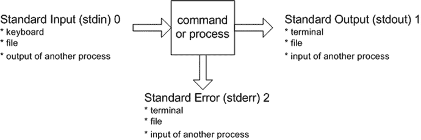

# 第 2 章:第 2 章:在 Shell 中工作

每个 Linux/Solaris 系统都至少包括一个命令行解释程序，使您能够与操作系统进行交互。这个解释器被称为 shell。这是一个合适的名字，因为 shell 的目的是充当一个层，保护您不必了解操作系统的内部工作方式。shell 允许您使用简单的命令执行复杂的任务。

如果您是 DBA，您应该知道如何从命令行(OS 提示符)运行 shell 命令。是的，您可以通过各种 GUI 执行许多 DBA 任务，但是无论 GUI 的健壮性如何，您仍然必须使用命令行来执行 GUI 无法处理的任务。例如，您可能处于一个压力很大的数据库还原和恢复环境中，您只能访问终端来运行适当的命令。在这种情况下，您的工作取决于能否从命令行诊断可能的介质故障，然后执行适当的数据库还原和恢复操作。

有许多命令行解释器可用(Bourne Again (Bash) shell、Korn shell、C shell 等等)。因为 Bash shell 通常是许多系统的默认命令行解释器，所以本章(以及本书)的重点是如何使用 Bash shell 执行 DBA 任务。我们强烈建议您使用 Bash shell 作为默认的命令行解释器，因为它包含了其他可用 shell 的大多数有用特性，并提供了额外的功能。在适当的地方，我们还将把 Bash shell 的关键特性与 Korn shell 和 C shell 并置。

当您登录到数据库服务器时，您处于一个 shell 中，这意味着您可以输入命令，shell 将为您解释和运行这些命令。最常见的缺省 shell 提示符是`$`(美元符号)字符，所以本书中的大多数例子都用`$`字符表示 shell 命令行。这里有一个例子:

`$ <commands run here>`

Note

`#`(散列)用于提示，表示需要作为`root`用户执行的操作。

本章涵盖的主题包括获取关于 shell 环境的信息并对其进行定制。这些解决方案将使您能够在数据库服务器的命令行上高效地工作。命令行是您执行大多数数据库管理员活动的地方。

因为典型的 DBA 每天都要花几个小时在 shell 提示符下使用命令，所以 shell 是所有 DBA 都必须完全理解的工具。本章中的解决方案将构成本书其余部分所涵盖的更复杂的 DBA 任务的基础。

## 2-1.显示当前外壳

### 问题

您想要验证您当前使用的是哪个 shell。

### 解决办法

当您第一次登录到服务器时，您可以通过查看`SHELL`变量的值来验证默认 shell。必须在变量前面指定一个`$`来显示其内容:

`$ echo $SHELL`

在本例中，输出表明 Bash shell 正在使用中:

`/bin/bash`

本章中的许多食谱都需要使用 Bash shell。如果前面的输出显示您使用的是一个 shell 而不是 Bash shell，那会怎么样呢？例如，假设您查看了包含在`$SHELL`中的值，它表明您的默认 shell 是首次登录后的 C shell:

`$ echo $SHELL`

`/bin/csh`

在这种情况下，要在`bash`命令中输入 Bash shell 会话类型，请使用以下命令:

`$ bash`

prior 命令不会改变您的默认登录 shell，所以`SHELL`的值保持不变。然而，您可以使用`$0`变量来显示您当前的工作 shell。`$0`变量保存当前运行的 shell 或脚本的名称。以下命令验证当前工作的 shell 是否已更改为 Bash shell:

`$ echo $0`

`bash`

在这种情况下，要退出 Bash shell 会话，键入`exit`命令，这将使您返回到父会话:

`exit`

Tip

有关更改默认登录外壳的详细信息，请参见配方 2-13。

### 它是如何工作的

您可能偶尔会登录到一台机器上，并想知道为什么某些 Bash shell 命令不起作用。这很可能是因为您的默认登录 shell 不是 Bash shell。在拥有大量 Linux/Solaris 服务器的企业中，可能没有一个一致的 shell 作为通用标准。在这些类型的环境中，首先通过显示`SHELL`变量的内容来验证正在使用的默认登录 shell。如本菜谱的解决方案部分所示，您可以通过输入您想要输入的 shell 的名称来修改当前的工作 shell。

Note

在 Linux 机器上，您可以通过查看`/etc/shells`文件的内容来验证哪些 shells 是可用的。该文件不是 Solaris 系统上的标准文件，但可以由系统管理员创建。

查看当前 shell 的另一种方法是不带任何选项运行`ps`命令:

`$ ps`

输出的第一行显示了您当前使用的 shell。您应该会看到类似如下的输出:

`PID  TTY       TIME     CMD`

`9088 pts/1     00:00:00 bash`

`9137 pts/1     00:00:00 ps`

如果您从一个 shell 输入一个 shell(例如，从 C shell 到 Bash shell)，您应该在输出中看到所有正在使用的 shell。下面的示例演示了这一点。首先验证您的默认 shell:

`$ echo $SHELL`

`/bin/csh`

接下来，进入 Bash shell:

`$ bash`

`$ echo $0`

`bash`

现在查看流程状态:

`$ ps`

`PID TTY          TIME CMD`

`1521 pts/13   00:00:00 csh`

`5944 pts/13   00:00:00 bash`

`5951 pts/13   00:00:00 ps`

当使用不带任何参数的`ps`命令时，它显示与当前用户和终端相关的所有进程。因此，根据您在当前会话中执行的命令，您可能会看到更多的进程。

Tip

在 Linux 机器上，使用`pstree`命令查看进程的层次关系。在 Solaris 系统上，使用`ptree`命令查看进程祖先。

## 2-2.运行以前输入的命令

### 问题

您需要花费大量时间重新输入之前输入的命令。您想要查看、编辑和重新运行最近执行的 shell 命令。

### 解决办法

Bash shell 的一个节省时间的特性是它有几个方法来编辑和重新运行以前执行的命令。此项目符号列表突出显示了可用于操作先前键入的命令的几个选项:

*   用上下箭头键滚动
*   使用 Ctrl+P 和 Ctrl+N
*   列出命令历史记录
*   反向搜索
*   设置命令编辑器

下面几节将简要介绍这些技术。请记住，根据操作系统版本的不同，其中一些技术可能不可用。

#### 用上下箭头键滚动

使用向上箭头向上滚动查看您最近的命令历史记录。当您滚动浏览以前运行的命令时，可以通过按 Enter 或 Return 键重新运行所需的命令。

如果要编辑命令，请使用退格键删除字符，或者使用向左箭头导航到命令文本中的所需位置。在命令堆栈中向上滚动后，使用向下箭头向下滚动以前查看的命令。

Note

如果您熟悉 Windows，滚动命令堆栈类似于`DOSKEY`实用程序。

#### 按 Ctrl+P 和 Ctrl+N

Ctrl+P 击键(同时按下 Ctrl 和 P 键)显示您先前输入的命令。如果多次按下 Ctrl+P，可以通过按下 Ctrl+N(同时按下 Ctrl 和 N 键)向下滚动命令堆栈。

#### 列出命令历史记录

使用`history`命令显示用户之前输入的命令:

`$ history`

根据之前执行的命令数量，您可能会看到一个很长的堆栈。通过在命令中提供一个数字，可以将输出限制为最后 n 个命令。例如，下面列出了最近运行的五个命令:

`$ history 5`

以下是一些示例输出:

`273  cd -`

`274  grep -i ora alert.log`

`275  ssh -Y -l oracle 65.217.177.98`

`276  pwd`

`277  history 5`

要在输出中运行之前列出的命令，请使用感叹号(`!`，有时称为“砰”)，后跟历史编号。在这个例子中，要在第 276 行运行`pwd`命令，使用`!`如下:

`$ ! 276`

要运行您运行的最后一个命令，请使用`!!`，如下所示:

`$ !!`

#### 反向搜索

按 Ctrl+R(同时按 Ctrl 和 R 键)，您将看到 Bash shell 反向搜索实用程序:

`$ (reverse-i-search)`’:`

当您从`reverse-i-search`提示符键入每个字母时，该工具会自动搜索先前运行的命令，这些命令的文本与您输入的字符串相似。一旦看到所需的命令匹配，就可以通过按 Enter 或 Return 键重新运行该命令。要查看与字符串匹配的所有命令，请重复按 Ctrl+R。若要退出反向搜索，请按 Ctrl+C。

#### 设置命令编辑器

您可以使用`set -o`命令使您的命令行编辑器成为`vi`或`emacs`。该示例将命令行编辑器设置为`vi`:

`$ set -o vi`

现在，当您按 Esc+K 时，您将进入一种模式，在这种模式下，您可以使用`vi`命令在先前输入的命令堆栈中进行搜索。

例如，如果您想要向上滚动命令堆栈，可以使用 K 键，也可以使用 J 键向下滚动。在此模式下，您可以使用斜杠(/)键，然后键入要在整个命令堆栈中搜索的字符串。

Tip

在你尝试使用命令编辑器功能之前，确保你完全熟悉`vi`或`emacs`编辑器(关于使用`vi`的详细信息，参见[第 4 章](04.html))。

一个简短的例子说明了这个特性的强大之处。假设您知道大约一小时前运行了`ls -altr`命令。您想再次运行它，但是这次没有`r`(反向排序)选项。要进入命令堆栈，请按 Esc+K:

`$ Esc+K`

您现在应该会看到您执行的最后一个命令。要在命令堆栈中搜索`ls`命令，请键入`/ls`，然后按 Enter 或 Return 键:

`$ /ls`

最近执行的`ls`命令应该出现在提示符下:

`$ ls -altr`

要删除`r`选项，使用右箭头键将提示置于屏幕上的`r`上，并按 X 键删除命令末尾的`r`。编辑完命令后，按 Enter 或 Return 键执行该命令。

### 它是如何工作的

您的命令历史记录是您以前输入的所有命令的存储顺序列表。您可以使用本食谱“解决方案”部分描述的任何技术来查看和操作先前输入的命令。

Bash shell 命令历史存储在您的主目录中一个名为`.bash_history`的文件中。如果您当前的工作目录是您的主目录，那么您可以使用一个实用程序来查看这个文件的内容，比如`cat`。以下示例使用`cd`命令导航到主目录，然后使用`cat`命令显示`.bash_history`文件的内容:

`$ cd`

`$ cat .bash_history`

存储在`.bash_history`文件中的条目数量由`HISTSIZE` OS 变量决定。您可以使用`echo`实用程序来验证历史记录的大小。在此系统上，命令历史大小为 1000:

`$ echo $HISTSIZE`

`1000`

系统管理员通常在`/etc/profile`文件中设置`HISTSIZE`变量，每当用户登录到服务器时，该变量就会自动执行。通过在一个特殊的启动文件中设置`HISTSIZE`变量，可以覆盖命令历史的系统默认值(详情见配方 2-5)。

查看 Bash shell 命令历史的最简单方法是使用上下箭头来查找感兴趣的命令，并使用左右箭头和/或退格键来修改命令。其他 shells 通常不允许使用上下箭头。

表 [2-1](#Tab1) 列出了一些常见的 shells 和每个工具支持的命令历史操作类型。

表 2-1。

Command History Options Available in Each Shell

<colgroup><col> <col> <col> <col> <col> <col></colgroup> 
| 壳 | 向上/向下箭头 | 反向搜索 | Ctrl+P 和 Ctrl+N | 选项名 | 命令历史 |
| --- | --- | --- | --- | --- | --- |
| 尝试 | 是 | 是 | 是 | 是 | 是 |
| 科恩乐队 | 不 | 不 | 不 | 是 | 是 |
| C | 不 | 不 | 不 | 不 | 是 |

## 2-3.自动完成长命令

### 问题

您厌倦了键入长命令，并且想知道是否有某种方法可以让 Bash shell 自动填充长命令字符串的文本。

### 解决办法

Tab 键可用于命令补全。例如，假设当前目录下有两个文件:`initRMOUGDB.ora`和`initBRDSTN.ora`:

`$ ls`

`initBRDSTN.ora initRMOUGDB.ora`

在本例中，您想要用`vi`实用程序编辑`initRMOUGDB.ora`文件。您只需键入足够的字符使文件名在目录中唯一，然后按 Tab 键(确保文本和 Tab 键之间没有空格):

`$ vi initR<Tab>`

因为当前目录中没有其他以字符串`initR`开头的文件，所以 Bash shell 会自动填充文本`initRMOUGDB.ora`:

`$ vi initRMOUGDB.ora`

现在，您可以按 Enter 或 Return 来编辑该文件。请注意，您可以在任何程序、目录、命令或文件上使用这种技术。例如，如果您需要将目录更改为名为`products`的子目录，并且当前工作目录下没有其他以字母 p 开头的目录，您可以键入`cd p`然后按 Tab。然后，您的提示会显示以下内容:

`$ cd products/`

现在可以按 Enter 或 Return 键执行`cd products`命令。

### 它是如何工作的

Bash shell 的一个节省时间的特性是命令完成，它允许您只输入程序、命令、文件或目录的一部分。然后按 Tab 键，shell 会尝试完成文本的剩余部分。

如果 Bash shell 不能唯一地标识一个程序、命令、文件或目录，那么在您按 Tab 键后，它会发出哔哔声(或者什么也不做)。在这种情况下，如果再次按 Tab，shell 将显示与部分键入的字符串匹配的所有可能的程序、命令、文件或目录。

例如，命令完成可用于显示所有以某个字符串开头的可执行文件。如果您想查看以字符串`di`开头的所有命令，请键入`di`并按 Tab 键两次:

`$ di<Tab><Tab>`

`diff        diff-jars  dir        dirname    disable    disown`

`diff3       dig        dircolors  dirs       disol`

进入第一个标签页后，您可能会听到铃声或哔哔声。Bash shell 将搜索以字符串`di`开头的命令，这些命令位于包含在`PATH`变量中的任何目录中。

## 2-4.查看环境变量

### 问题

您想要查看环境变量的当前设置。

### 解决办法

您可以使用以下任何 Linux/Solaris 命令来显示 OS 变量:

*   `printenv`
*   `env`
*   `set`
*   `export`
*   `echo`

要显示您的环境中设置的所有变量，使用这些命令中的任何一个(不带任何选项):`printenv`、`env`、`set`或`export`。下一段代码使用`printenv`命令显示所有环境变量:

`$ printenv`

下面是输出的部分清单:

`HOSTNAME=rmg.rmg.org`

`TERM=cygwin`

`SHELL=/bin/bash`

`HISTSIZE=1000`

`SSH_TTY=/dev/pts/0`

`USER=oracle`

如果你知道你想要显示的变量的名字，你可以用`echo`命令直接显示。要显示 OS 变量的内容，必须在它前面加上一个`$`(美元符号)字符。这个例子使用了`echo`命令来显示`USER`变量的内容:

`$ echo $USER`

`oracle`

您也可以使用`printenv`命令来显示环境变量。以下示例使用`printenv`来显示`USER`变量的当前设置:

`$ printenv USER`

`oracle`

### 它是如何工作的

大多数数据库管理员使用多台数据库服务器。每当您登录到服务器时，某些操作系统变量会自动为您设置。表 [2-2](#Tab2) 列出了几个你应该知道的环境变量。使用本方法的“解决方案”部分中描述的任何命令来查看您环境中的变量。

表 2-2。

Commonly Used Environment Variables

<colgroup><col> <col></colgroup> 
| 可变的 | 描述 |
| --- | --- |
| `PATH` | 包含一个目录列表，shell 在其中查找可执行命令。该变量通常由 shell 启动脚本设置。 |
| `USER`或`LOGNAME` | 包含您用来登录服务器的用户帐户。它是在您登录时自动为您设置的。 |
| `HOME` | 保存用户的主目录。它是在您登录时为您设置的。 |
| `∼` | 保存用户的主目录。波浪号字符是引用您的主目录的一种简写方式。它是在您登录时为您设置的。 |
| `PWD` | 包含当前工作目录的位置。每当您使用`cd`导航到一个新目录时，它就会被设置。 |
| `SHELL` | 包含您的登录 shell 的名称。 |
| `EDITOR` | 保存一些实用程序使用的默认编辑器的名称(如`cron`)。 |
| `PS1` | 包含用于显示命令提示符的值。 |
| `SHLVL` | 记录你当前的壳层有多少层。 |
| `DISPLAY` | 由 X 应用程序用来确定用于输入和输出的显示服务器。 |

有时您可能不知道变量的确切名称。您可以使用`grep`命令来过滤输出。这个例子使用了`set`命令，并将输出发送给`grep`命令来过滤任何变量:

`$ set | grep ORA`

以下是前一个命令的典型输出:

`ORACLE_BASE=/oracle`

`ORACLE_HOME=/oracle/product/10.2`

`ORACLE_SID=RMDB1`

`PS1=’[\h:\u:${ORACLE_SID}]$ ’`

Tip

有关 Bash shell 在您的环境中设置的所有变量的详细信息，请查看`man bash`命令的输出。在`man`页面中搜索 Shell 变量部分。

## 2-5.自动设置外壳变量

### 问题

您希望在登录数据库服务器时自动设置各种数据库变量。

### 解决办法

将您想要自动设置(当您登录时)的 shell 变量放在主目录的`.bash_profile`文件中。在下一个例子中，`ORACLE_SID`变量被设置为`BRDSTN`。以下文本放在`.bash_profile`文件中:

`export ORACLE_SID=BRDSTN`

如果您注销并重新登录，您可以通过回显来验证此变量是否已设置:

`$ echo $ORACLE_SID`

`BRDSTN`

如果您不想注销并重新打开，可以使用`.`(点)命令手动运行该文件，该命令会执行文件中包含的行。以下示例运行`.bash_profile`文件:

`$ . $HOME/.bash_profile`

`. (dot)`指示 shell 获取脚本。Sourcing 告诉 shell 进程，您当前登录是为了继承在执行的脚本中使用`export`命令设置的任何变量。如果不使用`. (dot)`符号，脚本中设置的变量只在脚本执行时产生的子 shell 的上下文中可见。

Note

在 Bash shell 中，`source`命令相当于`.`(点)命令。

### 它是如何工作的

当您使用 Bash shell 时，当您第一次登录到数据库服务器时，可以为您执行几个特殊的启动文件:

*   `/etc/profile`
*   `∼/.bash_profile`
*   `∼/.bash_login`
*   `∼/.profile`

Note

根据 Linux/Solaris 操作系统的版本，可能会使用不同的启动文件。在您的主目录中运行`ls -altr`命令来查看所有可用的文件。以点开头的文件有时被称为隐藏文件，当不带参数使用时，它不会出现在`ls`命令的输出中。

`/etc/profile`文件由您的系统管理员维护，您需要`root`权限来修改它。该文件设置登录系统的所有用户共有的系统范围的变量。下面是`/etc/profile`文件中一些典型条目的片段:

`# No core files by default`

`ulimit -S -c 0 > /dev/null 2>&1`

`# Set OS variables`

`USER="`id -un`"`

`LOGNAME=$USER`

`MAIL="/var/spool/mail/$USER"`

`HOSTNAME=`/bin/hostname``

`HISTSIZE=1000`

运行完`/etc/profile`文件后，Bash shell 接下来搜索下面的文件，并只运行它找到的第一个文件(按以下顺序):`∼/.bash_profile`、`∼/.bash_login`、`∼/.profile`。

以下是`oracle`用户的`∼/.bash_profile`文件中的一些典型条目:

`# User specific environment and startup programs`

`export ORACLE_SID=O1212`

`export ORACLE_HOME=/u01/app/oracle/product/12.1.0.2/db_1`

`export PATH=$PATH:$ORACLE_HOME/bin`

`PS1=’[\h:\u:${ORACLE_SID}]$ ’`

您应该知道另外两个重要的启动类型文件:

*   `∼/.bashrc`
*   `∼/.bash_logout`

如果您通过在命令行键入`bash`来启动一个非登录 Bash shell，那么会自动为您执行`∼/.bashrc`文件。DBA 将命令放在`∼/.bashrc`中，以确保与数据库相关的操作系统命令设置一致，不管它们使用的是登录 shell 还是非登录 shell。解决这个问题的一个常用技术是将下面的代码放在`∼/.bash_profile`文件中:

`# Run .bashrc if it exists`

`if [ -f ∼/.bashrc ]; then`

`. ∼/.bashrc`

`fi`

当第一次登录到服务器时，前面的代码检查是否存在`∼/.bashrc`文件；如果是，它就运行它。该方法确保以一致的方式定义别名和函数，而不管它是登录还是非登录 shell。

`∼/.bash_logout`文件被恰当地命名，并在您发出`exit`命令时被执行。通常，您可能会看到在`∼/.bash_logout`文件中执行的`clear`命令，用于在注销时清除终端上的文本。

## 2-6.自定义命令提示符

### 问题

您使用几个数据库服务器，并且通常在屏幕上同时打开几个终端屏幕。为了避免混淆，您希望主机名和用户名显示在命令提示符中。

### 解决办法

在 Bash shell 中，特殊的 OS 变量`PS1`保存出现在命令提示符中的文本字符串。这个示例更改了`PS1`变量来保存主机名和用户名:

`PS1=’[\h:\u]$ ’`

`\h`和`\u variables`是特殊的 Bash 变量，分别保存主机名和用户名。在本例中设置了`PS1`后，提示符现在显示如下:

`[rmougprd1:oracle] $`

在前面的字符串中，`rmougprd1`是主机名，`oracle`是当前 OS 用户。您还可以将特殊变量和用户定义的变量组合起来显示在提示中。例如，以下组合包含当前主机名、用户名和数据库 SID:

`PS1=’[\h:\u:${ORACLE_SID}] $ ’`

下面是命令提示符现在的样子:

`[rmougprd1:oracle:ORA12CR1] $`

如果您将前一行代码放在您的`.bashrc`启动文件中(详情请参见方法 2-5)，那么每次您登录到服务器或启动一个新的 Bash shell 时，您的提示将自动设置为包含主机名、操作系统用户和当前的`ORACLE_SID`值。此外，如果您更改`ORACLE_SID`的值，您的提示将自动反映新的设置。

### 它是如何工作的

对于使用多个服务器、操作系统帐户和数据库的 DBA 来说，将命令提示符设置为一些信息性的内容是非常宝贵的。如果你在复杂的环境中工作，这个简单的技巧会让你意识到你当前的环境。

Tip

您可以通过发出一个`man bash`命令来查看环境中所有可用的变量。在`man`页面中搜索提示。

表 [2-3](#Tab3) 列出了许多 Bash shell 反斜杠转义的特殊变量，可以用来定制命令提示符。

表 2-3。

Bash Shell Backslash–Escaped Variables Used to Customize the Command Prompt

<colgroup><col> <col></colgroup> 
| 可变的 | 描述 |
| --- | --- |
| `\a` | ASCII 钟形字符。 |
| `\d` | “工作日月份日期”格式的日期(例如，8 月 21 日星期四)。 |
| `\e` | ASCII 转义字符。 |
| `\h` | 主机名。 |
| `\j` | 由 shell 管理的作业数。 |
| `\l` | shell 终端设备的基本名称。 |
| `\n` | 换行。 |
| `\r` | 回车。 |
| `\s` | 外壳的名称。 |
| `\t` | 24 小时制 HH:MM:SS 格式的时间。 |
| `\T` | 以 12 小时制 HH:MM:SS 表示的时间。 |
| `\@` | 时间采用上午/下午 12 小时制。 |
| `\A` | 24 小时制 HH:MM 格式的时间。 |
| `\u` | 当前用户名。 |
| `\v` | Bash shell 的版本。 |
| `\V` | Bash shell 的发布。 |
| `\w` | 当前工作目录。 |
| `\W` | 当前工作目录的基本名称。 |
| `\!` | 命令的历史编号。 |
| `\$` | 如果有效 UID 为 0，显示`#`。否则，显示`$`。 |

## 2-7.创建命令快捷方式

### 问题

您经常重新键入长的命令集，并希望为冗长的命令创建快捷方式。

### 解决办法

创建其他命令的快捷方式有两种非常常见的方法:别名和函数。这两种技术将在下面的章节中介绍。

#### 使用化名

假设您经常导航到数据库后台进程日志记录目的地来查看日志文件。您必须键入类似如下的内容:

`$ cd /u01/app/oracle/diag/rdbms/o1212/O1212/trace`

您可以使用`alias`命令创建一个快捷方式来完成相同的任务。此示例创建一个名为`ad`(警报目录)的别名，该别名将目录更改到一个后台位置，该位置取决于`ORACLE_SID`变量的值:

`$ alias ad=’cd /u01/app/oracle/diag/rdbms/o1212/O1212/trace’`

现在可以键入`ad`，这与将当前工作目录更改为 Oracle 后台`dump`目录是一样的。

#### 使用函数

您也可以使用函数来创建命令快捷键。我们只提供一个简单的例子来说明如何在这个食谱中使用一个函数；关于使用功能的全部细节，参见第 7 章[。下面一行代码创建了一个名为`ad`的简单函数:](07.html)

`$ function ad { cd /u01/app/oracle/diag/rdbms/o1212/O1212/trace; pwd;}`

现在，您可以在命令行中键入`ad`来将您的工作目录更改为 Oracle 后台`dump`目录。注意，在你改变目录后，当前的工作目录是由`pwd`命令显示的。

### 它是如何工作的

别名是一种简单的机制，用于创建一小段执行其他 shell 命令的文本。要显示所有已定义的别名，请使用不带参数的`alias`命令:

`$ alias`

这里列出了数据库管理员使用的别名定义的一些常见示例:

`alias l.=’ls -d .*’`

`alias ll=’ls -l’`

`alias lsd=’ls -altr | grep ^d’`

`alias ad=’cd /u01/app/oracle/diag/rdbms/o1212/O1212/trace’`

`alias sqlp=’sqlplus "/ as sysdba"’`

`alias shutdb=’echo "shutdown immediate;" | sqlp’`

`alias startdb=’echo "startup;" | sqlp’`

`alias valert=’view /u01/app/oracle/diag/rdbms/o1212/O1212/trace/alert_O1212.log’`

根据您实施的 Oracle 最佳灵活架构(OFA)标准和 Oracle 版本，您必须修改一些以前的别名定义。对于`alert.log`文件的位置来说尤其如此。

如果要查看特定别名的定义，请使用以下命令:

`$ alias ad`

`alias ad=’cd /u01/app/oracle/diag/rdbms/o1212/O1212/trace’`

您也可以使用`type`命令来验证别名:

`$ type ad`

`ad is an alias for ’cd /u01/app/oracle/diag/rdbms/o1212/O1212/trace’`

如果您想从当前环境中删除别名定义，请使用`unalias`命令。以下示例删除了`ad`的别名:

`$ unalias ad`

unalias 命令只影响您当前的连接。虽然使用别名是创建命令快捷方式的常用方法，但我们建议使用函数而不是别名。函数的功能更加强大，因为它具有对命令行中传递的参数进行操作的能力，并且可以包含多个命令。

功能在[第 7 章](07.html)中有更详细的描述，但是我们在这里会花几分钟来讨论它们。DBA 通常通过在`$HOME/.bashrc`文件中设置别名和函数来建立它们。例如，这里我们创建了一个名为`dba_fncs`的文件，并在其中放置了以下代码行:

`#------------------------------------------`

`# cd to alert log directory`

`function ad {`

`if [ $ORACLE_SID = "O1212" ]; then`

`cd  /u01/app/oracle/diag/rdbms/o1212/O1212/trace`

`elif [ $ORACLE_SID = "DWREP" ]; then`

`cd /orahome/app/oracle/diag/rdbms/dwrep/DWREP/trace`

`fi`

`pwd`

`} # ad`

`#------------------------------------------`

常见的做法是在`oracle`帐户的主目录下创建一个`bin`目录，并将`dba_fncs`文件放在`HOME/bin`中。`dba_fncs`文件可以手动获取，如下所示:

`. $HOME/bin/dba_fcns`

如果您将前面的一行代码放在`$HOME/.bashrc`文件中，那么`dba_fncs`文件中的函数就是源代码，您可以在每次登录时将其用作命令快捷方式。

如果您想知道快捷键是别名还是函数，使用`type`命令来验证命令的来源:

`$ type ad`

`ad is a function`

`ad ()`

`{`

`if [ $ORACLE_SID = "O1212" ]; then`

`cd /u01/app/oracle/diag/rdbms/o1212/O1212/trace;`

`else`

`if [ $ORACLE_SID = "DWREP" ]; then`

`cd /orahome/app/oracle/diag/rdbms/dwrep/DWREP/trace;`

`fi;`

`fi;`

`pwd`

`}`

## 2-8.为命令提供输入

### 问题

您希望 shell 命令从文件或另一个进程接收输入，而不是从键盘输入命令。

### 解决办法

在 Linux/Solaris 中，您可以指示命令从带有`<`字符的文件中接收输入。这种技术被称为重定向。在本例中，`mailx`命令用于将一个名为的跟踪文件发送到一个电子邮件地址:

`$ mailx -s "trace file"``dba@gmail.com`T2】

您也可以使用一个命令的输出作为另一个命令的输入。这种技术被称为流水线技术。管道(`|`)字符指示一个进程从另一个进程的输出接收其输入。这个例子使用`cat`命令的输出作为`mail`命令的输入:

`$ cat O1212_ora_21018.trc | mailx -s "trace file"` `dba@gmail.com`

这种通过管道将输出从一个命令传递到另一个命令的技术是一种非常强大的工具。之所以称为管道，是因为第一个命令的输出流经管道，成为下一个命令的输入。您也可以将管道视为一个临时内存缓冲区，用于保存管道左侧命令的输出。管道右边的命令使用存储在内存缓冲区中的输出作为其输入。DBA 和开发人员使用这种方法将命令链接在一起，以执行复杂的任务。整本书提供了这种方法的许多例子。

### 它是如何工作的

在 Linux/Solaris 中，有三个数据流与一个进程相关联:

*   标准输入(也称为标准输入或标准输入)
*   标准输出(也称为标准输出或标准输出)
*   标准误差(也称为标准误差)

图 [2-1](#Fig1) 显示了与每个过程相关的三个数据流。从图的左侧开始，标准输入是提供给流程的数据，通常是您从键盘输入的数据。正如本菜谱的“解决方案”部分所展示的，标准输入也可以来自一个文件或作为另一个过程的输出。

图 2-1。

Process input and output data streams

外壳程序经常生成输出数据。默认情况下，标准输出数据被定向到终端。标准输出也可以重定向到一个文件或另一个进程。

有时外壳程序会生成错误消息。默认情况下，标准错误消息会显示在您的终端上。像标准输出一样，标准错误消息可以被重定向到文件或另一个进程。

流程不关心它的输入来自哪里，也不关心输出被传递到哪里。这意味着您可以将命令组合串在一起，将一个命令的输出作为另一个命令的输入。命令输出到另一个命令输入的管道是 shell 的一个非常强大和灵活的特性。

表 [2-4](#Tab4) 总结了使用 Bash shell 重定向标准输入、输出和错误的方法。

表 2-4。

Command Input and Output Redirection Operators

<colgroup><col> <col></colgroup> 
| 操作 | Bash Shell 重定向语法 |
| --- | --- |
| 从文件中读取标准输入 | `command <file` |
| 读取标准输入，直到标记结束 | `command <<end of marker` |
| 将标准输出写入文件 | `command >file` |
| 将标准输出附加到文件末尾 | `command >>file` |
| 将标准输出和标准错误写入不同的文件 | `command >file 2>file2` |
| 将标准输出和标准错误写入同一文件 | `command >file 2>&1` |
| 将标准输出和标准错误写入同一文件 | `command &&#x003E; file` |
| 将标准输出和标准错误追加到文件末尾 | `command >>file 2>&1` |
| 将第一个命令的标准输出发送(管道)到第二个命令的输入 | `command &#124; command2` |
| 将(管道)标准输出和标准误差发送到第二个命令的输入 | `command 2>&1 &#124; command2` |

解释表 [2-4](#Tab4) 的第二列需要一些额外的解释。注意，`<`和`<<`重定向操作符用于重定向标准输入。`>`和`>>`重定向操作符用于重定向标准输出。还要注意重定向操作符`>`和`>>`是`1>`和`1>>`的简写。

`2>`和`2>>`重定向操作符用于重定向标准错误。语法`2>&1`指示 shell 将标准错误流重定向到与标准输出相同的位置。在 Bash shell 中，您还可以使用语法`&&#x003E;`将标准错误和标准输出发送到同一个文件。

`&0`、`&1`和`&2`文件描述符分别与`/dev/stdin`、`/dev/stdout`和`/dev/stderr`文件同义。为了说明这一点，本例使用文件`/dev/stdout`将标准错误重定向到与标准输出相同的位置:

`$ cat initBRDSTN.ora 1>myfile.txt 2>/dev/stdout`

前面的命令相当于以下命令:

`$ cat initBRDSTN.ora 1>myfile.txt 2>&1`

前面的命令指示将标准输出`1>`发送到`myfile.txt`。如果在发出命令时遇到任何错误(例如，如果文件`initBRDSTN.ora`不存在)，标准错误流`2>`将被发送到与标准输出相同的位置(即`myfile.txt`)。

## 2-9.重定向命令输出

### 问题

您希望将命令的输出保存到文件中。

### 解决办法

默认情况下，命令的输出显示在您的终端上。字符`>`将命令的输出重定向到指定的文件。`>`是`1>`的同义词。例如，以下命令获取`cat`命令的输出，并将其放在名为`output.txt`的文件中:

`$ cat init.ora >output.txt`

如果`init.ora`文件不存在，您会收到如下错误消息:

`cat: init.ora: No such file or directory`

### 它是如何工作的

您应该知道重定向命令输出的一些其他有趣的特性。例如，您还可以指示 shell 命令将运行脚本时遇到的任何错误重定向到一个单独的文件。`2>`字符指定错误应该被写入的位置。正如`>`表示将输出重定向到文件一样，`2>`表示将错误消息重定向到文件。这个例子将标准输出重定向到文件`output.txt`，并将遇到的任何错误消息发送到`errors.txt`:

`$ cat init.ora >output.txt 2>errors.txt`

您还可以使用简写符号将标准输出和错误消息发送到同一个文件:

`$ cat init.ora >output.txt 2>&1`

`2>&1`符号指示 shell 将输出流 2(错误输出)发送到与输出流 1(标准输出)相同的位置。您会发现在运行脚本(如数据库监控作业)时使用这种符号非常有用。

如果出于某种原因您不想覆盖输出文件，可以使用`>>`语法，该语法指示 shell 将任何消息附加到现有文件的末尾:

`$ cat init.ora >>output.txt 2>&1`

## 2-10.将输出发送到任何地方

### 问题

您想要运行一个命令，但是不希望在任何地方显示或保存输出。

### 解决办法

如果你不希望文本出现在你的屏幕上或保存在一个物理文件中，你可以将它发送到众所周知的“比特桶”(称为`/dev/null`设备)。

当您不想看到一个命令产生的所有错误消息时,`/dev/null`设备非常有用。例如，下面的`find`命令为它无法读取的目录生成错误消息:

`$ cd /`

`$ find . -name "alert*.log"`

以下是输出的一部分:

`find: cannot read dir ./var/fm/fmd/xprt: Permission denied`

`find: cannot read dir ./var/fm/fmd/rsrc: Permission denied`

`find: cannot read dir ./var/fm/fmd/ckpt: Permission denied`

为了消除这些错误信息，将错误输出发送到`/dev/null`设备:

`$ find . -name "alert*.log" 2>/dev/null`

如果您知道您将运行一个生成您不需要的输出的程序或命令，您可以将输出重定向到`/dev/null`设备。

Tip

`/dev/null`设备也可用于在不删除原始文件的情况下，快速将大文件压缩至 0 字节(详见配方 5-31)。

### 它是如何工作的

`/dev/null`文件是一个特殊的文件，称为空设备。它也称为斜杠 dev 斜杠 null 或位桶。它不包含任何内容，您发送到这个特殊文件的任何输出都不会再被看到。

以下是一个略有不同的使用`/dev/null`设备的例子。假设您想测试读取一个文件需要多长时间，但是您不想让`dd`命令的输出实际创建一个文件。在本例中，使用`of`参数将输出发送到`/dev/null`设备:

`$ time dd if=/u01/dbfile/O1212/users01.dbf of=/dev/null`

以下是一些示例输出:

`20496+0 records in`

`20496+0 records out`

`10493952 bytes (10 MB) copied, 0.0820684 seconds, 128 MB/s`

`real    0m0.09s`

`user    0m0.00s`

`sys     0m0.01s`

前一个命令对于排除磁盘 I/O 问题非常有用，无需物理创建文件。如果将数据文件大小除以命令运行的总时间，就可以得到磁盘 I/O 率。您可以将该值与`V$BACKUP_ASYNC_ IO.EFFECTIVE_BYTES_PER_SECOND`进行比较，以帮助您确定恢复管理器(RMAN)是否有潜在的 I/O 问题。

CHECKING FOR DATA FILE CORRUPTION

在过去，在出现诸如`dbverify`和 Oracle Recovery Manager (RMAN)这样的工具之前，DBA 需要一种方法来检测数据文件中的损坏块。为了完成这个任务，DBA 使用了`export`实用程序。随着`export`实用程序的运行，它将检测到的损坏块的信息写入数据库`alert.log`文件。

如果 DBA 只想检查块损坏，而不想将导出的输出保存到文件中，则可以将输出发送到`/dev/null`文件，如下所示:

$ exp user/pass full = y file =/dev/null

因此，DBA 可以检测到数据库损坏，而不必实际创建一个可能很大的导出文件。尽管如此，您不应该依赖这种方法来检测数据库损坏，因为它有几个已知的限制(例如，它不能检测表的高水位线以上的块中的损坏，请参见 MOS note 214369.1 了解详细信息)。您应该使用`dbverify`或 RMAN 来检测 Oracle 数据库数据文件中的坏块。

## 2-11.显示和捕获命令输出

### 问题

您希望在屏幕上看到命令的输出，并将该输出存储在文件中。

### 解决办法

如果您只想捕获与特定操作系统命令执行相关的输出，您可以使用`tee`命令，该命令可以将命令生成的任何输出写入屏幕和指定文件。

以下示例运行`ls`命令来列出目录中的所有文件。它还将输出保存到一个文件中，以后可以查看该文件以确定特定日期的文件名称和大小:

`$ ls -altr /ora01/BRDSTN | tee /home/oracle/log/oct15_df.log`

以下是显示在屏幕上并记录在日志文件中的一些示例输出:

`-rw-r----- 1 oracle oinstall 52429312 Oct 15 08:00 redo03a.log`

`-rw-r----- 1 oracle oinstall 838868992 Oct 15 08:25 undotbs01.dbf`

`-rw-r----- 1 oracle oinstall 524296192 Oct 15 08:30 system01.dbf`

`-rw-r----- 1 oracle oinstall 15056896 Oct 15 08:37 control01.ctl`

### 它是如何工作的

当您想要交互式地查看屏幕上显示的命令输出，并且还需要将显示记录到一个文件中，以便以后进行调试或故障排除活动时，可以使用`tee`命令。例如，当您备份一个数据库并希望将所有输出记录到一个文件中时，您可以使用 RMAN 实用程序来完成，如下所示:

`$ rman target / | tee rman.log`

连接到 RMAN 时运行的命令的任何输出都将显示在屏幕上，并记录在日志文件中。

Tip

`tee`命令类似于一个管道 t-splitter 管道，它允许一个输入流被分成单独的输出管道。

## 2-12.记录所有 Shell 命令输出

### 问题

您正在执行数据库升级，需要运行几个 SQL 脚本。您希望将打印到屏幕上的所有内容记录到一个日志文件中。

### 解决办法

`script`命令可将打印到屏幕上的所有输出记录写入操作系统文件。该示例将所有输出写入名为`upgrade.log`的文件:

`$ script upgrade.log`

`Script started, file is upgrade.log`

从这一点开始，所有打印到终端的输出也记录在脚本`upgrade.log`中。要结束`script`日志记录会话，请按 Ctrl+D 或键入`exit`。您应该会看到类似以下内容的消息:

`Script done, file is upgrade.log`

### 它是如何工作的

当您需要捕获打印到终端的所有输出时,`script`命令非常有用。此命令将所有输出存储在操作系统文件中，稍后可用于验证所执行的任务以及操作是成功还是失败。

如果在使用`script`时没有指定文件名，则会创建一个名为`typescript`的默认文件。如果您需要追加到一个已经存在的文件，使用带有`-a`选项的`script`，如下所示:

`$ script -a upgrade.log`

这段代码能够捕获正在运行的所有脚本的所有输出。当您混合了操作系统命令和数据库命令，并且想要捕获每个操作的输出时，它会非常有用。

当开发升级脚本的人(DBA #1)将脚本传递给不同的团队成员(DBA #2)以在另一个数据库环境中执行这些脚本时，DBA 使用`script`命令。在这个场景中，DBA #2 将启动一个`script`作业，运行升级脚本，结束`script`日志记录，并将生成的日志文件发送给 DBA #1 进行验证。

## 2-13.更改登录外壳

### 问题

您的系统管理员已经将您的操作系统帐户设置为使用 Korn shell，您希望将其更改为 Bash shell。

### 解决办法

使用`chsh`(更改外壳)命令更改默认登录外壳。您可以使用`-s`选项直接指定所需的登录 shell。在这个例子中，`oracle`用户的默认 shell 被更改为 Bash shell:

`$ chsh -s /bin/bash`

`Changing shell for oracle.`

`Password:`

成功输入密码后，会显示“shell changed”消息。现在，当您随后登录到 oracle 帐户时，默认 shell 将是 Bash shell。

### 它是如何工作的

如果缺省值不是您的首选 shell，您可能需要更改您的 shell。我们建议您在 Linux/Solaris 系统上使用 Bash shell。Bash shell 非常健壮，包含了 Bourne shell、Korn shell 和 C shell 的大多数有用特性。

服务器上可用的有效 shells 存储在`/etc/shells`文件中。您可以使用`chsh -l`命令或`cat`命令查看`/etc/shells`文件的内容。这个例子使用了`cat`命令来显示可用的外壳:

`$ cat /etc/shells`

`/bin/sh`

`/bin/bash`

`/bin/tcsh`

`/bin/csh`

`/bin/ksh`

表 [2-5](#Tab5) 描述了 Linux/Solaris 环境中可用的各种 shells。

表 2-5。

Descriptions of Popular Shells Available

<colgroup><col> <col></colgroup> 
| 壳 | 描述 |
| --- | --- |
| `bsh`或`sh` | 史蒂夫·伯恩写的原版伯恩外壳。 |
| `bash` | Bourne Again 外壳被认为是最坚固的外壳之一。 |
| `ash` | Almquist shell 比 Bash shell 占用的内存少，在磁盘空间有限的系统上非常有用。 |
| `ksh` | Korn shell 在各种 UNIX 上的数据库管理员中很受欢迎。 |
| `pdksh` | 这个 shell 是 Korn shell 的公共域实现。 |
| `tcsh` | TENEX C shell 是 C shell 的增强版本。 |
| `csh` | C shell 类似于 C 编程语言，在许多旧版本的 UNIX 上很流行。 |

您可以通过查看`/etc/passwd`文件的内容来验证默认登录 shell 的设置。例如，要查看`oracle`用户的默认 shell，使用`cat`和`grep`命令:

`$ cat /etc/passwd | grep -i oracle`

`oracle:x:2000:500:sb-db1 Oracle Account:/orahome/oracle:/bin/bash`

Note

使用`chsh`命令不需要任何特殊权限或系统管理员的帮助。

## 2-14.修改命令路径搜索

### 问题

您需要您的 shell 自动查找当前不在包含在您的`PATH`变量中的目录中的可执行程序。您想要将目录添加到您的`PATH`变量中。

### 解决办法

您可以使用`export`命令手动添加一个目录到您的`PATH`变量。以下示例将`/orahome/app/oracle`目录添加到`PATH`变量的当前内容之前:

`$ export PATH=/orahome/app/oracle:$PATH`

在前面的代码行中，`PATH`变量被定义为包含 Oracle 二进制文件的目录加上`PATH`目录的内容。在`PATH`变量中用冒号(`:`)分隔目录。

如果您想在每次登录数据库服务器时将一个目录添加到您的`PATH`变量中，请将`export`命令放在一个特殊的启动文件中(详情见方法 2-5)。

### 它是如何工作的

`export`命令允许您定义可用于后续执行命令的变量。您可以通过导出将目录添加到`PATH`变量中。要验证您的`PATH`变量的内容，您可以使用`echo`命令:

`$ echo $PATH`

有时，当目录`/usr/X11R6/bin`出现在变量`PATH`中的`ORACLE_HOME/bin`目录之前时，您可能会遇到 Oracle RMAN 问题。当您尝试启动`rman`时，您会看到一条错误消息:

`$ rman target /`

`rman: can’t open target`

您收到此错误是因为在`/usr/X11R6/bin`目录中有一个与 Oracle `rman`备份和恢复实用程序无关的`rman`可执行文件。在这个场景中，您必须修改您的`PATH`变量，以确保`ORACLE_HOME/bin`出现在`/usr/X11R6/bin`之前:

`$ export PATH=$ORACLE_HOME/bin:$PATH`

另一种方法是将`/usr/X11R6/bin`中的`rman`可执行文件重命名为类似于`rman.X11`的名字。

Tip

有关`PATH`变量和`rman`可执行文件的问题，请参见 MOS 注释 101050.1。

CURRENT WORKING DIRECTORY AND PATH

要设置包含当前工作目录的路径，只需使用以下命令:

`$ export PATH=$PATH:`。

安全专家建议不要在一个`PATH`变量的开头附近引用当前的工作目录，因为一个恶意的人可能会将一个程序放在一个目录中，对您的系统造成不良影响。例如，有人可以在用户的主目录中放置一个名为`ls`的脚本，并让`ls`脚本中的命令递归地删除文件。如果在`/bin`或`/usr/bin`中的`ls`命令之前引用了错误的`ls`脚本，结果可能会很糟糕。

## 2-15.查看内置命令

### 问题

您想知道您是在运行 shell 命令的内置版本，还是在使用位于`/bin`目录中的二进制程序。

### 解决办法

使用`help`命令查看所有内置命令。例如，如果键入不带参数的`help`，所有内置命令都将显示:

`$ help`

以下是输出的部分清单:

`alias [-p] [name[=value] ... ]     bg [job_spec ...]`

`bind [-lpvsPVS] [-m keymap] [-f fi break [n]`

`builtin [shell-builtin [arg ...]]  caller [EXPR]`

`case WORD in [PATTERN [| PATTERN]. cd [-L|-P] [dir]`

`command [-pVv] command [arg ...]   compgen [-abcdefgjksuv] [-o option`

`complete [-abcdefgjksuv] [-pr] [-o continue [n]`

你也可以使用`type`命令来确定一个程序是否是内置的。使用`type`的`-a`选项打印`PATH`变量中包含命令的所有位置(包括所有别名和功能)。下面的例子显示了在`/bin`目录中有一个内置的`pwd`命令和一个`pwd`程序:

`$ type -a pwd`

`pwd is a shell builtin`

`pwd is /bin/pwd`

Note

您可能想知道为什么 Linux/Solaris 为`pwd`提供了一个内置命令和一个程序。因为有些 shells 可能没有内置的`pwd`命令，所以在`/bin`或`/usr/bin`目录中显式提供了一个程序。

### 它是如何工作的

一些命令内置在 Bash shell 中。内置仅仅意味着 shell 包含它自己的命令版本。因此，如果您运行一个内置命令，比如`pwd`，Bash shell 将运行其版本的`pwd`命令，而不是位于`/bin`或`/usr/bin`目录中的可执行程序。如果你想在`/bin`目录下显式运行`pwd`命令，请指定完整的路径和文件名。该示例显示了如何运行位于`/bin`目录中的`pwd`程序:

`$ /bin/pwd`

在某些情况下，了解命令是否内置在 shell 中非常重要。内置命令比它们在`/bin`或`/usr/bin`目录中的对应命令执行得更快，因为没有在目录中查找命令然后将命令加载到内存中执行的开销。

此外，还有代码可移植性问题需要考虑。从一个操作系统到另一个操作系统，内置命令通常具有相同的行为，而`/bin`和`/usr/bin`目录中的命令在 Linux/Solaris(尤其是旧版本)的不同端口之间可能有不同的行为。

内置命令在执行时不会启动单独的进程(有时称为分叉、子进程或衍生进程)。这是一些命令的要求，比如`cd`，因为子进程不能修改它的父进程。如果`cd`作为子进程执行，它不能修改父进程的当前工作目录，因此没有多大用处。出于这个原因，Bash shell 包含了自己的用于`cd`命令的可执行代码。表 [2-6](#Tab6) 描述了一些更常用的 Bash 内置命令。

表 2-6。

Commonly Used Bash Built-in Commands

<colgroup><col> <col></colgroup> 
| Bash 内置命令 | 描述 |
| --- | --- |
| `cd` | 更改目录 |
| `echo` | 显示字符串和变量的内容 |
| `help` | 显示 Bash 内置命令的帮助 |
| `history` | 显示最近运行的命令 |
| `pwd` | 打印当前工作目录 |
| `ulimit` | 设置和显示对 shell 施加的各种系统资源限制 |

您可以使用`builtin`命令指示 Bash shell 显式运行一个内置命令，这在不同版本的 Linux/Solaris 之间移植脚本时非常有用。

`builtin`命令运行该命令的内置版本，即使为它声明了一个别名。这个例子运行了`pwd`内置命令:

`$ builtin pwd`

同样，您可以显式地指示 Bash 运行 Linux/Solaris 程序版本的命令，即使有一个用相同名称定义的内置命令或别名。该示例运行位于`/bin`目录中的`pwd`命令的程序版本:

`$ command pwd`

您也可以使用`enable`命令来启用或禁用内置命令。这个例子使用`enable -n`来禁用`pwd`内置命令:

`$ enable -n pwd`

`$ type pwd`

`pwd is /bin/pwd`

本例重新启用了`pwd`命令:

`$ enable pwd`

`$ type pwd`

`pwd is a shell builtin`

Tip

您也可以使用`man bash`命令查看所有内置命令。查看`man`页面时，搜索“shell builtin”字符串。

## 2-16.设置退格键

### 问题

您输入了不正确的命令，并且您想要退格到先前输入的字符上以便更正它们。当您尝试使用退格键时，它会显示`^?`字符，而不是删除之前输入的字符。

### 解决办法

使用`stty`命令设置退格键以正确删除字符。以下代码将退格键设置为删除字符:

`$ stty erase Ctrl+Backspace`

在前面的命令中，确保同时按下 Ctrl 和 Backspace 键。这可能因您的系统而异；例如，下面是设置退格键的另一种方法:

`$ stty erase <Backspace>`

在前一行代码中，不要键入单词 Backspace 相反，请按退格键。

### 它是如何工作的

`stty`命令用于查看和更改终端设置。要查看当前的`stty`设置，发出以下命令:

`$ stty -a`

`speed 38400 baud; rows 36; columns 97; line = 0;`

`intr = ^C; quit = ^\; erase = ^?; kill = ^U; eof = ^D; eol = <undef>; eol2 = <undef>;`

`...`

当您使用旧版本的 Linux 或 Solaris 时，如果退格键不起作用，您可能会登录到服务器。在这种情况下，您必须手动设置退格键才能正常工作。如果您想在每次登录服务器时自动设置退格键，请将`stty`命令放在一个特殊的启动文件中(详情见方法 2-5)。

Note

在一些旧的 Linux 或 Solaris 系统上，您可能需要使用`stty erase ^H`命令或`stty erase ^?`命令来设置退格键。

## 2-17.在多行中键入一个长命令

### 问题

您想键入一个长命令，但它不适合放在一行中。

### 解决办法

要将一行代码扩展到下一行，请使用反斜杠(`\`)字符，然后按 Enter 或 Return 键。以下示例显示了如何在几行中断开一个长的`rman`连接命令:

`$ /usr/oracle/product/10.2.0/db_1/bin/rman \`

`>  target / \`

`>  catalog rman/rman@db11g_bllnx1 \`

`>  cmdfile=/home/oracle/scripts/rmancheck.rmn \`

`>  msglog=/home/oracle/rmanlog/rmancheck01.log append`

虽然您可以在一行中键入前面的命令，但是当终端宽度有限时，可以考虑将一个命令分成多行。

### 它是如何工作的

出于可读性的原因，有时需要将一个命令扩展到多行。当您键入`\`然后按 Enter 或 Return 键时，下一行将会以`>`字符开头。该字符表示命令已经扩展到下一行。使用这种技术时，会忽略反斜杠和换行符。

反斜杠放在命令中的哪个位置无关紧要；您可以根据需要将一个命令拆分成任意多行。