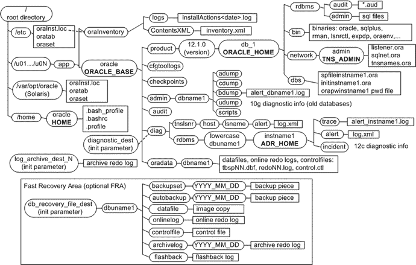

# 第 5 章:管理文件和目录

每个 Oracle DBA 作业的一个复杂部分都涉及到处理文件和目录。因此，DBA 必须是文件操作方面的专家。您的工作需要一些技能，例如实现数据库安全、执行备份和恢复、监控以及解决性能问题。这些关键任务都依赖于管理文件的命令行知识。专业 DBA 知道如何管理文件和在文件系统中导航。

文件是 Linux/Solaris 系统的基本构造块，是存储在磁盘上的信息的容器。你通过文件名来访问一个文件。在本书中，我们将术语文件和文件名作为同义词使用。文件名最长可达 256 个字符，可以包含常规字母；数字；以及`. (period)`、`_ (underscore)`和`– (hyphen)`字符。

目录就像一个文件夹；它的目的是提供一个逻辑容器，方便处理文件组。每个服务器都有一个由正斜杠(`/`)表示的根目录；把正斜杠想象成一棵树从左向右向前倒下。`/`目录是每个服务器上最顶层的目录，就像一棵倒挂的树，主干是根目录，而树的分支是子目录。

图 [5-1](#Fig1) 显示了 Oracle 数据库服务器上的部分层次目录结构。请注意，图 [5-1](#Fig1) 仅显示了通常创建的目录的一小部分。该图的要点是让您了解典型 Oracle 系统使用的树状目录结构。由于目录结构的复杂性，DBA 必须熟悉命令行目录导航和文件操作。

图 5-1。

Common directories used on an Oracle database server

本章讨论使用文件和目录时会遇到的常见问题和解决方案。它从基础开始，如查看目录结构，然后进展到更复杂的主题，如查找某些类型的文件。

## 5-1.显示当前工作目录

### 问题

您登录到数据库服务器，并希望查看当前目录路径。

### 解决办法

使用`pwd`(打印工作目录)命令显示当前工作目录的完整路径名:

`$ pwd`

`/home/oracle`

从前面的输出可以看出`/home/oracle`是当前的工作目录。

Note

如果您是 Windows 用户，Linux/Solaris `pwd`命令类似于不带选项发出的 DOS `cd`命令。不带任何选项的 DOS `cd`命令只是打印当前的工作目录。

### 它是如何工作的

在 Linux/Solaris 中，您正在工作的目录被定义为您当前的工作目录。`pwd`命令不是很复杂；它只是打印当前的工作目录。虽然很简单，但你会一直用到它。DBA 经常使用这个命令来验证他们是否在正确的目录中。在你操作目录或文件之前，明智的做法是确认你是否在你认为你应该在的地方。

`pwd`命令有两个有趣的选项:`-L`和`-P`。`-L`选项打印逻辑路径，这是默认选项。它总是打印 OS `PWD`变量的值。例如，以下两个命令总是显示相同的目录:

`$ echo $PWD`

`/home/oracle`

`$ pwd`

`/home/oracle`

`-P`选项打印实际的物理路径。如果您正在使用的系统具有通过符号链接导航到的目录，这些选项非常有用(关于软链接的讨论，请参见配方 5-33)。`-L`选项打印由符号链接定义的目录名。`-P`选项显示由实际物理路径定义的目录。

一个例子可以帮助说明知道何时使用`-P`选项的价值。在数据库服务器上，`root`目录下有一个定义为`oradev`的符号链接。以下是符号链接的一个长列表示例:

`$ ls -altr /oradev`

`lrwxrwxrwx 1 root root 9 Apr 15 19:49 oradev -> /oradisk2`

首先，通过符号链接导航到该目录，并发出带有`-L`选项的`pwd`命令:

`$ cd /oradev`

`$ pwd -L`

`/oradev`

现在，在不更改目录的情况下，使用带有`-P`选项的`pwd`命令:

`$ pwd -P`

`/oradisk2`

如果您在使用符号链接的环境中工作，理解`pwd`命令的`-L`和`-P`选项之间的区别是很重要的。

## 5-2.更改目录

### 问题

您希望将当前工作目录更改到不同的位置。

### 解决办法

使用`cd`(更改目录)命令在文件系统中导航。该命令的基本语法如下:

`cd <directory>`

本示例将当前工作目录更改为`/orahome/app`:

`$ cd /orahome/app`

使用`pwd`命令来验证`cd`命令是否按预期工作通常是一个好主意:

`$ pwd`

`/orahome/app`

您还可以导航到存储在 OS 变量中的目录路径。下一组命令显示`TNS_` `ADMIN`变量的内容，然后导航到该目录:

`$ echo $TNS_ADMIN`

`/orahome/app/oracle/product/12.1.0.2/db_1/network/admin`

`$ cd $TNS_ADMIN`

`$ pwd`

`/orahome/app/oracle/product/12.1.0.2/db_1/network/admin`

如果您尝试导航到一个不存在的目录，您将收到类似于以下内容的错误:

`No such file or directory`

目录的所有者必须在目录的所有者级别设置了 execute 权限，所有者才能导航到该目录。一个例子说明了这个概念；这里列出了`oracle`拥有的`scripts`目录的权限:

`$ ls -ld scripts`

`d---rwxrwx 2 oracle oinstall 4096 Jul 30 19:26 scripts`

作为`oracle`用户，您在尝试导航到`scripts`目录时收到一条错误消息:

`$ cd scripts`

`-bash: cd: scripts: Permission denied`

如果您修改目录以包含所有者执行权限，您现在可以成功导航到该目录:

`$ chmod 100 scripts`

`$ cd scripts`

### 它是如何工作的

`cd`命令是一个强大的实用程序，您将在 DBA 生活中经常使用。以下各节包含了使您在使用此命令时更加有效的技巧。

#### 导航回家

如果不为`cd`命令提供一个目录，默认情况下，该目录将被更改为`HOME`变量中的值。这个例子通过查看当前目录、显示`HOME,`的值并使用`cd`导航到该目录来演示这个概念:

`$ pwd`

`/orahome/app/oracle/product/12.1.0.2/db_1`

接下来，显示`HOME`变量的内容:

`$ echo $HOME`

`/orahome/oracle`

通过不向`cd`命令提供目录名，将目录更改为包含在`HOME`中的值:

`$ cd`

`$ pwd`

`/orahome/oracle`

在 Bash 和 Korn shells 中，`∼`(波浪号)字符是包含在`HOME` OS 变量中的值的同义词。下面两行代码也将您的目录更改为`HOME`目录:

`$ cd ∼`

`$ cd $HOME`

#### 导航到父目录

`..`(两点)目录项包含当前工作目录的父目录值。如果要将目录更改为父目录，请使用以下语法:

`$ cd ..`

通过用正斜杠字符分隔`..`字符串，您可以在给定路径中导航尽可能多的父目录。例如，要向上导航三个目录，请使用以下命令语法:

`$ cd ../../..`

您还可以使用`..`目录条目在目录树中向上导航，然后向下导航到不同的子目录。在下面的例子中，当前工作目录是`/orahome/oracle/scripts`，使用`cd`命令导航到`/orahome/oracle/bin`:

`$ pwd`

`/orahome/oracle/scripts`

`$ cd ../bin`

`$ pwd`

`/orahome/oracle/bin`

#### 导航到子目录

要导航到子目录，请指定前面不带正斜杠的目录名。该示例首先打印当前工作目录，导航到`admin`子目录，最后用`pwd`命令验证成功:

`$ pwd`

`/home/oracle`

`$ cd admin`

`$ pwd`

`/home/oracle/admin`

#### 使用通配符

您还可以在`cd`命令中使用通配符星号(`*`)来导航到其他目录。在下一个例子中，当前工作目录是`/oracle`，而`product`子目录是目标目录:

`$ cd p*`

`$ pwd`

`/oracle/product`

导航到子目录时，必须指定足够的目录，使其名称对于当前工作目录下的任何其他子目录都是唯一的。如果多个目录匹配一个通配符字符串，您可能无法获得所需的目录导航，具体取决于您的操作系统版本。总是用`pwd`命令验证你当前的工作目录。

使用 Bash shell 时，还可以使用 Tab 键来完成击键序列。例如，如果您只有一个以字母`p`开头的子目录，您可以按如下方式`cd`到它:

`$ cd p<Tab>`

在本例中，当前工作目录下只有一个以`p`开头的子目录，因此您现在可以在终端上看到以下内容:

`$ cd product/`

现在，您可以按 Enter 或 Return 来完成命令。Bash shell 的这一特性被称为 tab 补全(更多细节请参见菜谱 2-2)。

#### 导航到上一个目录

连字符(`-`)通常用于导航到上一个工作目录。在下一个例子中，当前工作目录是`/oracle01`，之前的工作目录是`/oracle02`。要导航到`/oracle02`，向`cd`命令提供`-`，如下所示:

`$ cd -`

另一种导航到上一个工作目录的方法是通过`OLDPWD`变量，它包含上一个目录的位置。要导航到最近访问过的目录，您可以更改目录，如下所示:

`$ cd $OLDPWD`

## 5-3.创建目录

### 问题

您希望将 SQL 脚本存储在一个特殊的目录中。为此，首先需要创建一个目录。

### 解决办法

使用`mkdir`(创建目录)命令创建一个新目录。这个例子在`/home/oracle`目录下创建了名为`scripts`的目录:

`$ cd /home/oracle`

`$ mkdir scripts`

现在使用`cd`和`pwd`命令验证目录是否存在:

`$ cd scripts`

`$ pwd`

`/home/oracle/scripts`

当导航到另一个目录时，如果该目录不存在，您将收到类似以下内容的错误消息:

`No such file or directory`

### 它是如何工作的

在创建目录之前，您必须对父目录具有写权限才能创建子目录。如果您尝试创建一个目录，但没有用户或组级别的写权限，您会收到一个错误。这个例子试图在`/`目录下创建一个名为`oradump`的目录:

`$ mkdir /oradump`

`mkdir: cannot create directory `/oradump’: Permission denied`

对`/`目录的权限显示只有`root`用户有写权限(因此是唯一可以在`/`下创建目录的用户):

`$ ls -altrd /`

`drwxr-xr-x 29 root root 4096 Apr 15 19:49 /`

如果您没有`root`访问权限，您需要与您的 SA 合作，在`/`目录下创建任何所需的目录。获取`root`权限的示例见配方 3-11。

有时您会发现用一个命令在一个路径中创建几个目录很方便。这个例子使用`-p`(父)选项创建目录`backups`和路径中不存在的任何父目录:

`$ mkdir -p /oradump/db/dev/backups`

当您需要创建长而复杂的目录结构并且不想一次创建一个目录时，前面的目录创建技术非常方便。

## 5-4.查看目录列表

### 问题

您希望只列出目录，而不是当前工作位置中的其他常规文件。

### 解决办法

将`ls -l`命令与`grep`结合使用，仅列出目录。这里是一些没有使用`grep`过滤任何东西的示例`ls -l`输出:

`$ ls -l`

`drwxr-x---  3 oracle dba   4096 Apr 25 19:44 orahome`

`drwxr-xr-x  9 oracle dba   4096 Dec 29 07:43 orainst`

`-rw-r-----  1 oracle dba 124506 Apr 25 20:10 ora.zip`

`-rw-r-----  1 oracle dba 112640 Apr 25 18:14 o.tar`

`-rw-r--r--  1 oracle dba     82 Apr  4 14:30 output.txt`

接下来添加`grep`过滤器:

`$ ls -l | grep ’^d’`

`drwxr-x---  3 oracle dba   4096 Apr 25 19:44 orahome`

`drwxr-xr-x  9 oracle dba   4096 Dec 29 07:43 orainst`

在前面的代码行中，`ls -l`输出通过管道传输到`grep`，后者查找以`d`字符开头的文件。脱字符`^`(脱字符)是一个正则表达式，它告诉`grep`命令匹配字符串开头的`d`字符。通过这种方式，您可以只列出目录。

### 它是如何工作的

DBA 通常会创建一个别名或函数，以便于输入本菜谱“解决方案”部分中显示的命令。该命令创建一个名为`lsd`的别名，可用于列出目录:

`$ alias lsd="ls -l | grep ’^d’"`

创建别名后，键入`lsd`。它将运行`ls`和`grep`命令。有关创建别名和功能的详细信息，请参见制作方法 2-7。

查看目录的另一种方式是使用`ls -p`和`grep`作为正斜杠字符。下一个例子使用了`ls -p`，它指示`ls`命令在每个目录的末尾添加一个`/`。`ls -p`的输出通过管道传输到`grep`，T6 搜索`/`字符:

`$ ls -p | grep /`

`orahome/`

`orainst/`

当试图列出一个目录时，使用通配符有时会很方便。例如，假设您想要确定以`b`字符开头的`ORACLE_HOME`目录中的所有目录和文件。为了确定这一点，您尝试发出以下命令:

`$ ls $ORACLE_HOME/b*`

该命令的输出可能不是您所期望的。如果通配符与目录名匹配，将列出目录中包含的文件(不是目录名)。在这个例子中，输出包含了在`ORACLE_HOME/bin`目录中列出的所有文件；下面是输出的一小段:

`acfsroot             exp            lsnrctl0         plshprofO`

`adapters             expdp          lxchknlb         proc`

`adrci                expdpO         lxegen           procob`

为了避免这种行为，使用`ls -d`来列出目录，而不是它们的内容。以下命令列出了`ORACLE_HOME`下以字母`b`开头的所有目录:

`$ ls -d $ORACLE_HOME/b*`

`/orahome/app/oracle/product/12.1.0.2/db_1/bin`

## 5-5.删除目录

### 问题

您希望删除一个目录以及该目录下的所有文件。

### 解决办法

使用`rmdir`命令删除一个目录。此命令只能用于删除不包含其他文件的目录。在本例中，`rmdir`命令用于删除当前工作目录下名为`scripts`的目录:

`$ rmdir scripts`

如果目录不为空，您会看到类似以下的错误:

`rmdir: scripts: Directory not empty`

如果你想删除包含文件的目录，使用`rm -r`(递归删除)命令。该示例删除目录`scripts`以及位于`scripts`目录下的所有文件和子目录:

`$ rm -r scripts`

### 它是如何工作的

如果`rm -r`命令遇到任何未启用写权限的文件，将显示如下消息:

`rm: remove write-protected regular file ’<file name>’?`

如果要删除该文件，请键入 y(表示是)。如果许多文件都是写保护的(比如在 oracle 拥有的目录中)，那么反复键入 y 会变得很乏味。

您可以指示 rm 删除写保护文件，而无需使用`-f`(强制)选项进行提示。此示例删除子目录脚本下的所有文件，而不提示受保护的文件:

`$ rm -rf scripts`

有时当您删除旧的数据库安装时，使用`rm -rf`命令会很方便。此命令将清除整个目录树，删除写保护文件时不要求确认。在运行此命令之前，请确保您确切知道您要删除的内容。

Caution

明智地使用`rm -rf`命令。该命令将递归删除指定目录下的每个文件和目录，而不提示您确认。

## 5-6.列出文件

### 问题

您想要查看目录中存在哪些文件。

### 解决办法

使用`ls` (list)命令列出指定目录中的文件(和目录)。这行代码使用不带任何选项的`ls`命令来列出当前工作目录中的文件:

`$ ls`

以下是输出的部分清单:

`dlock.sql  dropem.sql  login.sql  proc.sql  rmfile.bsh`

### 它是如何工作的

没有任何选项的`ls`命令不是很有用；它只显示有限的文件信息。使用`ls`的一个更有用的方法是列出所有文件、保护、所有权、大小和修改时间——从最近创建到最后一次排序。这是通过`-altr`选项实现的:

`$ ls -altr`

以下是输出的部分清单:

`-rwxr-x--- 1 oracle dba 1543 Mar 29 16:09 proc.sql`

`-rw-r----- 1 oracle dba 1082 May  7 19:53 dlock.sql`

`-rw-r----- 1 oracle dba  442 May  7 19:53 login.sql`

`drwxr-x--- 4 oracle dba 4096 May  7 19:53 ..`

`-rw-r----- 1 oracle dba    0 May  7 19:54 dropem.sql`

`-rw-r----- 1 oracle dba    0 May  7 19:54 rmfile.bsh`

`-a` (all)选项指定应该列出所有文件，包括隐藏文件。`-l`(长列表)选项显示权限、所有权、大小和修改时间。`-t`(时间)选项使输出按时间排序(最新的优先)。要将最新修改的文件列在底部，使用`-r`(反向)选项。表 [5-1](#Tab1) 显示了如何解释先前输出的第一行的长列表。

表 5-1。

Interpreting Long Listing Output

<colgroup><col> <col> <col> <col> <col> <col> <col></colgroup> 
| 类型和权限 | 链接数量 | 物主 | 组 | 字节大小 | 修改日期 | 文件名 |
| --- | --- | --- | --- | --- | --- | --- |
| `-rwxr-x---` | one | `oracle` | `dba` | One thousand five hundred and forty-three | 3 月 29 日 16 时 09 分 | `proc.sql` |

表格 [5-1](#Tab1) 的第一列有 10 个字符。第一个字符显示文件类型。字符 2 到 10 显示文件权限。字符`r`、`w`和`x`分别表示读取、写入和执行权限。连字符(`-`)表示没有权限。以下输出总结了文件长列表的首列字符位置和含义:

`File Type          User Perms   Group Perms   Other Perms`

`Column 1           2   3   4    5   6   7     8   9   10`

`-, d, l, s, c, b   r   w   x    r   w   x     r   w   x`

在输出的第一列的第一个字符中，连字符表示它是一个常规文件。同样，如果第一个字符是一个`d`，它就是一个目录。如果第一个字符是一个`l`，它是一个符号链接。表 [5-2](#Tab2) 列出了不同的文件类型。

表 5-2。

Long Listing First Character File Type Meanings

<colgroup><col> <col></colgroup> 
| 文件类型字符 | 意义 |
| --- | --- |
| `-` | 常规文件 |
| `d` | 目录 |
| `l` | 符号链接 |
| `s` | 窝 |
| `c` | 字符设备文件 |
| `b` | 块设备文件 |

在不同版本的 Linux/Solaris 之间,`ls`命令可能略有不同。该命令通常有 50 多个不同的选项。使用`man ls`命令查看系统上所有可用的功能。

最后一点注意:当用`ls -l`列出一个文件时，您可能会注意到在权限的末尾多了一个`+`；例如:

`$ ls -l`

`drwxr-xr-x+  2 oracle     dba            3 May  2 15:02 scripts`

`-rw-r--r--+  1 oracle     dba         1627 May  2 15:12 act.sql`

这意味着您的文件具有扩展的安全权限。运行`getfacl (get file access control lists)`命令查看文件的全部权限；例如:

`$ getfacl scripts`

`# file: scripts`

`# owner: oracle`

`# group: dba`

`user::rwx`

`group::r-x`

`mask::rwx`

`other::r-x`

USING ECHO TO DISPLAY FILES

有趣的是，您还可以使用 echo 命令来列出文件。例如，您可以使用此命令列出当前工作目录中的文件:

`$ echo *`

`echo`命令是一个内置命令(关于内置命令的详细信息，参见制作方法 2-15)。这意味着如果包含`ls`可执行文件的文件系统由于某种原因(可能是因为损坏)不可用，您仍然可以使用`echo`命令列出文件。

## 5-7.快速创建文件

### 问题

您正在设置 Oracle RMAN 备份。您想要快速创建一个文件，以便可以测试`oracle`用户是否有正确的权限写入新创建的目录。

### 解决办法

在您想要确定是否可以创建文件的目录中，使用`touch`命令快速确定是否可以创建文件。这个例子使用`touch`在当前工作目录中创建一个名为`test.txt`的文件:

`$ touch test.txt`

现在使用`ls`命令来验证文件是否存在:

`$ ls -al`

`-rw-r----- 1 oracle dba 0 May  7 20:00 test.txt`

从输出来看，文件被创建，其中没有任何内容(由 0 字节大小表示)。

Note

关于如何编辑文本文件的详细信息，参见第 4 章。

### 它是如何工作的

有时，您只需要创建一个文件来测试是否能够写入备份位置，或者检查 shell 程序某些方面的功能。您可以使用`touch`命令来实现这些目的。如果您正在触摸的文件已经存在，`touch`命令将更新文件的最后修改日期。

如果您`touch`一个已经存在的文件，它的访问时间和修改时间将被设置为当前系统时间(包括日期部分)。如果您只想修改访问时间，使用`touch`的`-a`选项。类似地，`-m`选项将只更新修改时间。使用`--help`选项显示系统上`touch`可用的所有选项。

注意，您也可以使用下面的`cat`命令快速创建一个文件:

`$ cat /dev/null> test.txt`

运行前面的命令时要小心；如果文件已经存在，将`/dev/null`连接到文件将会删除文件中包含的任何内容。

## 5-8.更改文件权限

### 问题

您希望更改文件的权限，以便没有公共级别的访问。

### 解决办法

使用`chmod`命令改变文件的权限。本例将`scrub.bsh`文件的权限更改为 750:

`$ chmod 750 scrub.bsh`

用`ls`命令快速检查一下，显示权限设置正确:

`$ ls -altr scrub.bsh`

`-rwxr-x--- 1 oracle dba 0 May  7 20:07 scrub.bsh`

前面的输出表明所有者拥有读、写和执行权限；该组已读取并执行；而世界的其他地方没有权限(见配方 5-6 关于由`ls`命令列出的文件权限的讨论)。

Note

您必须拥有文件或目录的`root`访问权限或者是其所有者，才能更改其权限。

### 它是如何工作的

DBA 经常使用`chmod`命令来更改文件和目录的权限。知道如何使用这个命令很重要。正确的文件访问对于数据库安全至关重要。在许多情况下，您不希望授予对包含敏感信息的文件的任何公共访问权限。

您可以使用数字格式(如 750)或字母来更改文件的权限。使用数字格式时，第一个数字映射到所有者，第二个数字映射到组，第三个数字映射到系统上的所有其他用户。750 的权限被翻译为指示所有者的读、写和执行；为组读取和执行；其他用户没有权限。检查表 [5-3](#Tab3) 中数字权限的翻译。

表 5-3。

Meanings of Numeric Permissions

<colgroup><col> <col> <col> <col></colgroup> 
| 数字 | 许可 | 二进制数 | 信函格式 |
| --- | --- | --- | --- |
| Zero | 没有权限 | 000 | `---` |
| one | 仅执行 | 001 | `--x` |
| Two | 只写 | 010 | `-w-` |
| three | 编写并执行 | 011 | `-wx` |
| four | 只读 | One hundred | `r--` |
| five | 阅读并执行 | One hundred and one | `r-x` |
| six | 直读式记录 | One hundred and ten | `rw-` |
| seven | 读取、写入和执行 | One hundred and eleven | `rwx` |

您还可以使用字母来更改文件的权限，这对于新的 Linux/Solaris 用户来说有时更直观。使用字母时，请记住`o`权限并不表示“所有者”；它指定了“其他”表 [5-4](#Tab4) 列出了权限适用对象的含义。

表 5-4。

To Whom the Permissions Are Applied

<colgroup><col> <col></colgroup> 
| 谁的信 | 意义 |
| --- | --- |
| `u` | 用户(所有者) |
| `g` | 组 |
| `o` | 其他(系统上的所有其他) |
| `a` | 所有(用户、组和其他) |

下一个示例使文件可由用户(所有者)、组和其他人执行:

`$ chmod ugo+x mvcheck.bsh`

这行代码取消了组(`g`)和所有其他(`o`)对所有以扩展名`.bsh`结尾的文件的写和执行权限:

`$ chmod go-wx *.bsh`

您可以使用三个操作数来应用权限:`+`、`-`和`=`。加号(`+`)字符增加权限，减号(`-`)字符取消权限。等号(`=`)操作数分配指定的权限并删除任何未列出的权限。例如，以下两行是等效的:

`$ chmod 760 mvcheck.bsh`

`$ chmod u=rwx,g=rw,o= mvcheck.bsh`

文件的快速列表验证了权限设置是否符合预期:

`$ ls -altr mvcheck.bsh`

`-rwxrw---- 1 oracle dba 0 May  7 20:10 mvcheck.bsh`

您还可以递归地更改目录及其子目录中的文件权限。有时这在安装软件时很有用。以下代码以递归方式将当前目录中所有文件和子目录中所有文件的权限更改为 711(所有者读、写、执行；组执行；其他执行):

`$ chmod -R 711 *.*`

您还可以使用`chmod`实用程序来更改文件的权限，以匹配现有文件的设置。本示例将当前目录中以扩展名`.bsh`结尾的所有文件更改为与`master.bsh`文件具有相同的权限:

`$ chmod --reference=master.bsh *.bsh`

#### 默认文件权限

根据`umask`设置，在创建文件时为文件分配默认权限。文件创建掩码决定了从文件中排除哪些权限。要查看文件创建掩码的当前设置，请发出不带选项的`umask`:

`$ umask`

`0022`

您也可以使用`-S`选项查看`umask`设置的字符版本:

`$ umask -S`

`u=rwx,g=rx,o=rx`

当您创建一个常规文本文件时，权限被设置为 0666 减去`umask`设置的值。如果`umask`设置为 0022，则文件的权限设置为 0644，即`-rw-r--r--`。

#### 执行时设置用户 ID

与`chmod`命令相关的另一个概念是`setuid`权限(有时也称为`suid`)。检查`oracle`二进制文件的权限:

`$ cd $ORACLE_HOME/bin`

`$ ls -l oracle`

`-rwsr-s--x   1 oracle   dba     126812248 Jun 12 15:24 oracle`

注意，所有者和组可执行设置是一个`s`(不是一个`x`)，这表明已经设置了`setuid`权限位。这意味着当某人运行程序时，它是以文件所有者的权限运行的，而不是以运行该文件的进程的权限运行的。这允许用户运行`oracle`二进制文件，就好像它拥有`oracle`用户的权限一样。因此，服务器进程可以执行`oracle`二进制文件，就好像它们是所有者(通常是`oracle` OS 用户)一样，来读写数据库文件。

要设置`setuid`权限，您必须在使用`chmod`更改文件权限时为数字权限指定前面的第四个数字。如果您想在用户和组级别上启用`setuid`权限，请使用前面的 6，如下所示:

`$ chmod 6751 $ORACLE_HOME/bin/oracle`

`$ ls -l oracle`

`-rwsr-sr-x   1 oracle   dba      118965728 Jun 16  2014 oracle`

如果您只想在所有者级别启用`setuid`权限，请使用前面的 4，如下所示:

`$ chmod 4751 $ORACLE_HOME/bin/oracle`

`$ ls -l oracle`

`-rwsr-x--x   1 oracle   dba      118965728 Jun 16  2014 oracle`

作为一名 DBA，了解`setuid`权限非常重要，因为根据 Oracle 的版本，您可能需要解决文件权限问题。例如，有关 Enterprise Manager Grid Control 和`setuid`依赖关系的问题，请参见 MOS 注释 271598.1。此外，当数据库软件所在的服务器上有非`oracle`用户时，您可能会遇到 Oracle 可访问性问题。在这些情况下，理解`setuid`权限如何影响文件访问是很重要的。

THE STICKY BIT

列出一长串`/tmp`目录并检查权限:

`$ ls -altrd /tmp`

`drwxrwxrwt 4 root root 4096 May 10 17:24 /tmp`

乍一看，似乎所有用户都拥有/tmp 目录中文件的所有权限。但是，请注意“其他”权限被设置为 rwt。最后一个权限字符是一个 t，它表示已经在该目录上启用了 sticky 位。当启用粘滞位时，只有文件所有者可以删除该目录中的文件。使用以下语法设置粘性位:

`chmod +t <shared directory>`

或者

`chmod 3775 <shared directory>`

设置粘滞位使许多不同的用户能够共享目录中的文件，但是防止用户删除不属于他们的文件(在启用粘滞位的目录中)。

## 5-9.更改文件所有权和组成员资格

### 问题

您需要更改一个文件的文件所有权和组成员资格，以便它归`oracle` OS 用户所有，并且它的组是`dba`。

### 解决办法

你需要`root`权限来改变文件的所有者。使用`chown`(更改所有者)命令更改文件的所有者及其组。本例将`/var/opt/oracle`目录上的所有者更改为`oracle`，将其组更改为`dba`:

`# chown oracle:dba /var/opt/oracle`

文件列表现在显示目录所有者是`oracle`用户，它所属的组是`dba`:

`$ ls -altrd /var/opt/oracle`

`drwxr-xr-x  2 oracle dba 4096 Dec 28 10:31 /var/opt/oracle`

如果您只想更改文件的组权限，请使用`chgrp`命令。您必须是文件所有者或拥有`root`权限才能更改文件的组。以下示例递归地将当前目录和所有子目录中扩展名为`.sql`的所有文件的组更改为`dba`:

`$ chgrp -R dba *.sql`

### 它是如何工作的

在设置或维护数据库服务器时，有时需要更改文件或目录的所有权。以下几行显示了用于更改所有者和/或组的各种组合的`chown`语法:

`chown user file`

`chown user:group file`

`chown :group file`

如果你有`root`权限，可以直接更改文件所有权。如果您没有`root`权限，有时 SAs 会通过`sudo`实用程序授予您访问需要`root`权限的命令的权限(详情请参见方法 3-11)。

## 5-10.查看文本文件的内容

### 问题

您想查看一个文本文件的内容，但又不想用编辑器(比如`vi`)打开该文件，因为您担心可能会不小心修改了该文件。

### 解决办法

使用`view`、`less`或`more`命令仅查看(不修改)文件内容。`view`命令将以只读模式使用`vi`或`vim`编辑器打开一个文件。当你以只读模式打开一个文件时，你不能用`vi`编辑器`:wq`(写然后退出)命令保存文件。以下示例查看了`initBRDSTN.ora`文件:

`$ view initBRDSTN.ora`

使用`view`命令与运行`vi -R`命令或`vim -R`命令是一样的(关于`vi`的更多细节，参见[第 4 章](04.html))。要退出`view`实用程序，输入命令`:q`。

Note

查看文件时，可以在退出时用`:wq!`命令强制写入。

如果您想一次显示一页文件的内容，请使用分页实用程序，如`more`或`less`。这个例子使用`less`来查看`initBRDSTN.ora`文件:

`$ less initBRDSTN.ora`

`less`实用程序将在屏幕的左下角显示一个`:`(冒号)提示。您可以使用空格键转到下一页，并使用上下箭头逐行滚动文档。进入`q`退出`less`。

下一个例子使用`more`命令浏览文件:

`$ more initBRDSTN.ora`

像`less`实用程序一样，使用空格键显示下一页，使用`q`退出`more`。

### 它是如何工作的

`more`和`less`实用程序被称为寻呼机，因为它们一次在屏幕上显示一页信息。这些实用程序具有相似的特性，人们可能会认为它们或多或少是相同的。对于 DBA 使用这些实用程序的方式，这基本上是正确的。对于铁杆极客来说，`less`实用程序比`more`更健壮一些。使用`man less`和`man more`命令查看这些实用程序的所有可用选项。

当使用`more`或`less`时，您可以使用`vi`命令在显示的输出中导航。例如，如果您想搜索一个字符串，您可以输入一个正斜杠和一个字符串来搜索`more`或`less`输出中的文本。此示例在`less`的输出中搜索字符串"`sga_max_size"`:$ less initbrdstn . ora

`/sga_max_size`

您也可以使用`cat`命令将文件内容快速显示到您的标准输出中(通常是您的屏幕)。这个例子将`initBRDSTN.ora`文件的输出转储到屏幕上:

`$ cat initBRDSTN.ora`

当你有小文件时，使用`cat`来显示文件的内容很好。然而，如果文件很大，你会看到大量的文本流得太快而没有任何意义。使用`view`、`less`或`more`(而不是`cat`)来查看文件内容几乎总是更好。这些命令允许您快速检查文件的内容，而没有意外修改的风险。

## 5-11.查看文件中的非打印字符

### 问题

您试图用一个实用程序(如`SQL*Loader`)将文本字符串从一个文件加载到数据库中，但是数据在插入到目标表中后似乎已经损坏。您想要查看可能嵌入到文件中的任何控制字符。

### 解决办法

使用`cat -v`命令查看非打印和控制字符。本例显示了`data.ctl`文件中的非打印和控制字符:

`$ cat -v data.ctl`

Note

`cat -v`命令不显示换行符或制表符。

### 它是如何工作的

当处理从文本文件加载到数据库中的数据时，您有时可能会发现您的 SQL 查询不像预期的那样运行。例如，您可能搜索一个字符串，但是 SQL 查询没有返回预期的数据。这可能是因为数据库中插入了非打印字符。使用本配方中所述的`cat -v`命令对这类数据问题进行故障排除。

为了说明如何查看非打印字符，您可以从一个`SQL*Plus`会话中假脱机以下输出:

`SQL> spool out.txt`

`SQL> select chr(7) || ’ring the bell’ from dual;`

`SQL> exit;`

这里您使用`cat`来显示文件`out.txt`的内容:

`$ cat out.txt`

`SQL> select chr(7) || ’ring the bell’ from dual;`

`CHR(7)||’RINGT`

`--------------`

`ring the bell`

`SQL> exit;`

当您使用`-v`选项时，请注意输出的最后一行中的`^G` ASCII 响铃或蜂鸣控制字符:

`$ cat -v out.txt`

`SQL> select chr(7) || ’ring the bell’ from dual;`

`CHR(7)||’RINGT`

`--------------`

`^Gring the bell`

`SQL> exit;`

## 5-12.查看隐藏文件

### 问题

您正在尝试清理您的主目录，并希望查看隐藏的配置文件和/或隐藏目录的名称。

### 解决办法

使用带有`-a`(全部)选项的`ls`命令。这段代码使用长列表格式列出了所有文件，并按照修改的相反顺序排序:

`$ ls -altr $HOME`

以下是部分输出的示例:

`drwxr-xr-x 3 root   root     4096 Sep 29 13:30 ..`

`-rw-r--r-- 1 oracle oinstall  124 Sep 29 13:30 .bashrc`

`-rw-r--r-- 1 oracle oinstall   24 Sep 29 13:30 .bash_logout`

`-rw-r--r-- 1 oracle oinstall  223 Sep 29 13:53 .bash_profile`

`drwxr-xr-x 2 oracle oinstall 4096 Oct  2 17:55 db`

`drwxr-xr-x 2 oracle oinstall 4096 Oct 15 08:33 scripts`

`drwx------ 2 oracle oinstall 4096 Oct 15 08:34 .ssh`

`-rw------- 1 oracle oinstall 6076 Oct 15 13:19 .bash_history`

`-rw------- 1 oracle oinstall 5662 Oct 15 13:41 .viminfo`

`drwx------ 5 oracle oinstall 4096 Oct 15 13:55 .`

前面列表中任何以`.`(点号或句点)开头的文件都被归类为隐藏文件。当使用 Bash shell 时，您的主目录中常见的隐藏文件有`.bash_profile`、`.bashrc`、`.bash_logout`和`.bash_history`(关于这些文件的用法，请参见食谱 2-5)。

如果您只想列出隐藏文件，可以按如下方式操作:

`$ ls -d .*`

以下是相应的输出:

`.a             .bash_profile  .lesshst  .sh_history  .viminfo  .Xauthority`

`..  .bash_history  .history       .ocm      .ssh         .vnc`

您可能希望为前面的命令创建一个别名，如下所示:

`$ alias ls.=’ls -d .*’`

### 它是如何工作的

隐藏文件和非隐藏文件的唯一区别是隐藏文件以一个`.`(点或句点)字符开始。隐藏文件没有任何秘密或安全可言。隐藏文件通常是众所周知的具有不同用途的文件(例如存储环境配置命令)。

您可能不希望混淆目录中每个文件的`ls`命令的输出。`ls`命令的默认行为是不列出隐藏文件。`-a`选项明确告诉`ls`命令列出所有文件，包括隐藏文件。如果您想列出除了`.`和`..`文件之外的所有文件，使用`-A`选项:

`$ ls -A`

Note

`.`文件是指当前工作目录的特殊文件。`..`文件是指当前工作目录的父目录。

## 5-13.确定文件类型

### 问题

您希望显示文件是目录还是常规文件。

### 解决办法

使用带有`-F`选项的`ls`命令显示文件名和文件类型。以下示例列出了当前工作目录中的文件名和文件类型:

`$ ls -F`

以下是一些示例输出的部分列表:

`alert.log        gcc-3.4.6-3.1.x86_64.rpm  ora01/    ss.bsh*`

`anaconda-ks.cfg  install.log               ora02/    test/`

`ls -F`命令在文件名后附加一个特殊字符来表示文件类型。在前面的输出中，附加了`/`的文件名是目录，附加了`*`的文件名是可执行文件。

Tip

另一种确定文件类型的方法是使用`ls --color`命令，它根据文件的类型给文件着色。

您也可以使用`file`命令来显示文件的特征。该命令将显示文件是 ASCII 文件、tar 文件还是详细信息可执行文件。例如，DBA 使用`type`命令的一种方式是判断`oracle`二进制文件是 32 位还是 64 位。下面显示了 64 位服务器上的`oracle`二进制文件:

`$ file $ORACLE_HOME/bin/oracle`

以下是相应的输出:

`/orahome/app/oracle/product/12.1.0.2/db_1/bin/oracle: setuid setgid ELF 64-bit LSB executable,`

`AMD x86-64, version 1 (SYSV), for GNU/Linux 2.6.9, dynamically linked (uses shared libs),`

`not stripped`

当使用 Bash shell 时，如果感兴趣的文件位于您的`PATH`变量的目录中，您可以使用命令替换来为`file`命令提供输入。命令替换将包含在`$()`中的命令的输出作为给定命令的输入；例如:

`$ file $(which oracle)`

在前面的代码行中，`which`命令的输出被用作`file`命令的输入。

### 它是如何工作的

您可以使用`ls`命令的`-F`选项显示文件的指示器。表 [5-5](#Tab5) 描述了不同的文件名类型指示器。文件类型指示器允许您过滤输出并查找特定的文件类型。例如，要列出所有目录，请在`ls -F`命令的输出中搜索`/`字符:

表 5-5。

File Type Indicator Characters and Meanings

<colgroup><col> <col></colgroup> 
| 指示器字符 | 描述 |
| --- | --- |
| `/` | 该文件是一个目录。 |
| `*` | 该文件是可执行文件。 |
| `=` | 该文件是一个套接字(一个用于进程间通信的特殊文件)。 |
| `@` | 该文件是一个符号链接(详情见配方 5-33)。 |
| `&#124;` | 该文件是一个命名管道(进程间通信中使用的特殊文件)。 |

`$ ls -F | grep /`

DBA 经常将类似这样的命令串封装在别名或函数中，这允许他们创建长命令的快捷方式(详情见方法 2-7)。

Tip

使用`type`命令确定命令文件的特征。它将显示该命令是实用程序、内置命令、别名还是函数。

`stat`命令是显示文件特征的另一个有用的命令。这个命令以人类可读的格式打印一个 inode 的内容。inode(读作“eye-node”)是一种 Linux/Solaris 数据结构，用于存储文件信息。下一个示例显示了`oracle`二进制文件的 inode 信息:

`$ stat $ORACLE_HOME/bin/oracle`

以下是相应的输出:

`File: `/orahome/app/oracle/product/12.1.0.2/db_1/bin/oracle’`

`Size: 323762476       Blocks: 632992     IO Block: 4096   regular file`

`Device: fd00h/64768d    Inode: 34838017    Links: 1`

`Access: (6751/-rwsr-s--x)  Uid: ( 2000/  oracle)   Gid: (  500/     dba)`

`Access: 2015-04-21 11:32:14.000000000 -0600`

`Modify: 2014-12-29 09:17:28.000000000 -0700`

`Change: 2014-12-29 09:17:28.000000000 -0700`

您可以从`ls`命令中获得一些前面的输出。但是，请注意，`stat`输出还包含诸如分配的块数等信息；信息节点设备类型；、以及最后一次访问文件的时间、最后一次修改文件的时间或文件状态改变的时间。

## 5-14.查找文件之间的差异

### 问题

您有两个数据库，它们的设置应该是相同的。您希望看到初始化文件中的任何差异。

### 解决办法

使用`diff`(差异)命令识别文件中的差异。该命令的一般语法如下:

`$ diff <file1> <file2>`

这个例子使用`diff`来查看名为`initDEV1.ora`和`initDEV2.ora`的两个文件之间的差异:

`$ diff initDEV1.ora initDEV2.ora`

以下是一些显示文件差异的输出示例:

`6,7c6,7`

`< sga_max_size=400M`

`< sga_target=400M`

`---`

`> sga_max_size=600M`

`> sga_target=600M`

`20a21`

`> # star_transformation_enabled=true`

### 它是如何工作的

理解来自`diff`的输出的关键是，它为你提供了如何使`file1`看起来像`file2`的指示。输出告诉您如何追加、更改和删除行。这些指令在输出中用`a`、`c`或`d`表示。

由`<`前置的行来自`file1`。`>`前的行来自`file2`。`a`、`c`或`d`左侧的行号适用于`file1`。`a`、`c`或`d`右侧的行号适用于`file2`。

从这个配方的解决方案的前一个输出中，第一行`6,7c6,7`被翻译成“将`file1`中的第 6 行和第 7 行改为`file2`中的第 6 行和第 7 行。”输出的倒数第二行是`20a21`，表示“在`file1`的第 20 行之后，追加`file2`的第 21 行。”

`diff`的输出被称为差异报告，它可以与`patch`命令结合使用，使`file1`看起来像`file2`。在使用`patch`命令之前，首先必须将差异报告输出保存在一个文件中。以下示例将差异输出存储在名为`init.diff`的文件中:

`$ diff initDEV1.ora initDEV2.ora > init.diff`

要将`initDEV1.ora`转换为`initDEV2.ora`，使用带有差异报告输出的`patch`命令:

`$ patch initDEV1.ora init.diff`

您还可以使用`sdiff`(并排)实用程序来显示文件差异。`sdiff`输出通常比`diff`命令更容易解释，因为差异在输出中是并列显示的。以下示例使用`sdiff`来显示两个文件之间的差异:

`$ sdiff initDEV1.ora initDEV2.ora`

以下是并列差异的一个片段:

`sga_max_size=400M             | sga_max_size=600M`

`sga_target=400M               | sga_target=600M`

`...`

`>#star_transformation_enabled=true`

Tip

使用`diff3`实用程序比较三个文件之间的差异。

## 5-15.比较目录的内容

### 问题

您希望确保两个不同的目录在文件数量、文件名和文件内容方面具有相同的内容。

### 解决办法

您可以使用`diff`命令显示两个目录在文件名和文件内容方面的任何差异。此示例将`/ora01/upgrade`目录中的文件与`/cvsroot/prod_scripts`目录中的文件进行比较:

`$ diff /cvsroot/prod_scripts /ora01/upgrade`

如果没有差异，您将看不到任何输出。如果有一个文件存在于一个目录中，而不存在于另一个目录中，您将看到类似于以下内容的消息:

`Only in /ora01/upgrade: tab.sql`

如果每个目录中的任何文件存在差异，您将看到类似以下内容的消息:

`22c22`

`< # cd to udump`

`---`

`> # cd to udump directory.`

关于解释`diff`实用程序输出的详细信息，见配方 5-14。如果您只想看到不同的文件名(而不是文件的不同之处)，请使用`--brief`选项:

`$ diff --brief /cvsroot/prod_scripts /ora01/upgrade`

### 它是如何工作的

维护数据库环境时，有时您可能需要比较目录的内容。在这些情况下，使用`diff`命令比较一个目录和另一个目录的内容。

如果你想递归地查看子目录并比较同名文件，你可以使用`-r`选项。此示例递归搜索子目录，并报告同名文件中的任何差异:

`diff -r /cvsroot/prod_scripts /ora01/upgrade`

您也可以使用递归选项的长列表来获得相同的结果:

`diff --recursive /cvsroot/prod_scripts /ora01/upgrade`

## 5-16.复制文件

### 问题

您希望在修改文件之前制作一份副本。

### 解决办法

第一个例子展示了如何使用`cp` (copy)命令创建一个文件的副本。例如，`cp is used here`对`listener.ora`文件进行备份:

`$ cp listener.ora listener.old.ora`

您可以使用`ls`命令来验证复制是否有效:

`$ ls listener*.ora`

`listener.old.ora listener.ora`

如果需要通过网络复制文件，可以使用命令行实用程序，如`scp`、`ftp`、`rsync`、`wget`或`curl`。我们将展示一个在这个食谱中使用`scp`的例子。在配方 5-17 中有使用`scp`和`rsync`复制目录和文件的例子。我们一般不使用`ftp`，因为它被认为不是通过网络复制文件的安全方式。在配方 5-36 中有使用`wget`和`curl`下载文件的例子。

说到这里，我们再来看`scp`；`scp`的基本语法如下:

`scp [options] sourcefile destinationfile`

源/目标可以是目录和/或文件。上述语法行中的源/目标目录/文件可以采用以下常规形式之一:

*   `directory/file`
*   `host:directory/file`
*   `user@host:directory/file`

在下一行代码中，一个文件被从远程主机复制到本地主机。远程用户为`oracle`，远程主机为`srv2`，远程文件为`/u01`目录下的`initTRG.ora`，文件正在被复制到本地当前工作目录(用点号表示):

`$ scp oracle@srv2:/u01/initTRG.ora  .`

`scp`命令提示您输入远程用户的密码。如果您从未从远程服务器拷贝过，系统还会提示您确定要从指定的远程服务器拷贝。

以下示例将文件从本地服务器复制到远程主机:

`$ scp startup.sql oracle@srv2` `:.`

仔细检查前面的语法。被复制的本地文件是`startup.sql`，存在于当前工作目录中。使用远程用户`oracle`将文件复制到远程服务器`srv2`和 oracle 用户的`HOME`目录(由紧跟在冒号后面的点指定)。假设远程`HOME`目录是`/home/oracle`，下面的示例将文件复制到与前面示例相同的目录中:

`$ scp startup.sql oracle@srv2:/home/oracle`

### 它是如何工作的

DBA 经常需要创建文件的副本。例如，`cp`实用程序提供了一种创建文件备份或快速复制目录的方法。`cp`命令的基本语法如下:

`cp [options] source_file target_file`

复制文件时要小心。如果目标文件在发出`copy`命令之前已经存在，它将被源文件的内容覆盖。如果您想在覆盖现有文件之前得到警告，请使用`-i`(交互式)选项。在这个例子中，已经存在一个名为`init.old.ora`的文件:

`$ cp -i init.ora init.old.ora`

`cp: overwrite `init.old.ora’?`

现在您可以回答`y`或`n`(分别表示是或否)，这取决于您是否希望用源文件覆盖目标文件。许多 DBA 为映射到`cp -i`的`cp`创建一个快捷命令(关于如何创建快捷方式的详细信息，请参见方法 2-7)。例如，此代码有助于防止您意外覆盖以前存在的文件:

`$ alias cp=’cp -i’`

您也可以使用以下语法将文件直接复制到现有的目录结构中:

`cp [options] source_file(s) directory`

如果目的地是一个目录，`cp`命令会将文件复制到该目录中。该目录不会被覆盖。本示例将当前工作目录中扩展名为`.sql`的所有文件复制到`scripts`目录中:

`$ cp *.sql scripts`

当您复制一个文件时，原始文件和由`copy`命令新创建的文件之间的原始时间戳和文件权限可能不同。有时最好保留源文件的原始属性。例如，您可能想要制作一个文件的副本，但是出于故障排除的目的，您希望仍然能够查看原始时间戳和所有权。如果您想保留原始的时间戳、所有权和文件权限，请使用`-p` (preserve)选项:

`$ cp -p listener.ora listener.old.ora`

通过使用`--parents`选项，您还可以使用`cp`实用程序来创建与源文件相关联的目录结构。要使此命令生效，目标必须是一个目录。该示例创建一个`network/admin/log`目录，并将所有以扩展名`.ora`结尾的文件复制到目标`∼/backup`目录下的一个目录中:

`$ cp --parents network/admin/*.ora ∼/backup`

源目录中任何扩展名为`.ora`的文件现在应该存在于`∼/backup/network/admin`目标目录中。

## 5-17.复制目录

### 问题

您希望将目录下的所有文件和子目录复制到新位置。

### 解决办法

使用带有`-r`选项的`cp`命令递归复制一个目录和子目录中的所有文件。本例将`/orahome/scripts`目录树中的所有文件复制到`/orahome/backups`目录中:

`$ cp -r /orahome/scripts /orahome/backups`

现在，`/orahome/backups`目录应该拥有与`/orahome/scripts`源目录中的文件和子目录完全相同的副本。请注意，如果目标目录中的现有文件与从源目录复制的文件同名，它们将被覆盖。如果您想在文件被覆盖前得到提示，也可以使用`-i`(交互式)选项:

`$ cp -ri /orahome/scripts /orahome/backups`

如果您需要通过网络安全地复制目录(和文件)，请使用`scp`(安全复制)命令。`scp`的基本语法如下:

`scp [options] sourcefile destinationfile`

源/目标可以是目录和/或文件。上述语法行中的源/目标目录/文件可以采用以下常规形式之一:

*   `directory/file`
*   `host:directory/file`
*   `user@host:directory/file`

使用`scp`命令的`-r`和`-p`选项递归复制和保存目录和文件。这个例子递归地将`scripts`目录(以及任何子目录和文件)从本地机器复制到名为`rmougdev2`的远程机器，作为`oracle`用户:

`$ scp -rp scripts oracle@rmougdev2:/home/oracle/scripts`

在前面的代码行中，如果目标目录不存在，将会创建它。如果该目录已经存在，将在现有的`scripts`目录下创建一个名为`scripts`的子目录。

`scp`命令将提示您输入远程用户的密码。如果您从未从远程服务器拷贝过，系统还会提示您确定要从指定的远程服务器拷贝。

### 它是如何工作的

作为日常工作的一部分，DBA 和开发人员经常将目录和文件从一个位置复制到另一个位置。该位置可以是本地的或远程的。如果您正在安装软件，或者如果您只想确保将文件备份复制到不同的位置，您可能需要这样做。

另一个用于同步目录的强大工具是`rsync`命令。`rsync`的基本语法如下:

`rsync [options] sourcefiles destinationfile`

默认情况下，`rsync`工具将只传输它在源和目标之间找到的差异。这使得它成为一种非常灵活有效的方法来同步一个目录树和另一个目录树。

如果源和目标在同一台服务器上，可以使用普通的文件名和目录名。使用`-r`和`-a`选项递归复制一个目录树并保留权限和所有权；`--delete`选项还指定删除目标中存在的、源中不存在的任何文件。此示例确保两个本地目录具有完全相同的目录结构和文件；换句话说，它确保`test2`与`test1`相同:

`$ rsync -ra --delete /home/oracle/test1/ /home/oracle/test2/`

您可以从本地复制到远程服务器，也可以从远程服务器复制到本地服务器。如果目录或文件是远程的，它通常采用以下形式:

`user@host:port/filename`

例如，您可以使用`rsync`将远程目录结构与本地目录结构同步。这行代码以用户`oracle`的身份将本地`scripts`目录的内容递归复制到远程`rmougdev2`服务器:

`$ rsync -ra --delete --progress scripts/ oracle@rmougdev2:/home/oracle/scripts`

您将被提示输入`oracle`用户的密码。源文件夹末尾的/确保了如果目标文件夹存在，`rsync`将同步两个目录。如果目标文件夹不存在，将会创建它。如果源目录末尾没有`/`，如果目标目录已经存在，将会在它下面创建一个子目录。

`rsync`命令非常灵活和强大。如果您从未使用过它，您应该熟悉它，并将其纳入您的文件传输技巧包中。

## 5-18.移动文件和目录

### 问题

您想要重命名或重定位文件。

### 解决办法

使用`mv`(移动)命令重新定位或重命名文件。本示例将一个文件从`initdw.ora`重命名为新名称`initDWDB.ora`:

`$ mv initdw.ora initDWDB.ora`

您也可以使用`mv`命令将文件重定位到不同的目录。这段代码将文件从当前工作目录移动到其父目录:

`$ mv scrub.sql` `..`

通常，您需要将文件从当前工作目录移动到子目录中。以下示例将文件从当前工作目录移动到名为`scripts`的子目录中:

`$ mv scrub.sql scripts`

在前面的代码行中，如果`scripts`子目录不存在，您最终会将`scrub.sql`文件重命名为一个名为`scripts`的文件。换句话说，在您发出`mv`命令之前，目标子目录必须存在(否则您将最终重命名文件)。

也有可能重新定位目录。以下示例将`scripts`目录移动到`sqlscripts`目录:

`$ mv scripts sqlscripts`

在前面的代码行中，如果`sqlscripts`目录已经存在，那么`scripts`目录将被创建为`sqlscripts`目录下的子目录。如果您不希望出现这种行为，这可能会有点令人困惑。一种想法是，如果目录已经存在，那么`mv`命令不会覆盖它们。

### 它是如何工作的

`mv`命令用于重新定位或重命名文件或目录。`mv`实用程序使用以下语法:

`mv [options] source(s) target`

请注意，`mv`命令将会毫不客气地覆盖一个已经存在的文件。例如，假设您在一个目录中有以下两个文件:

`$ ls`

`initdw.ora init.ora`

如果您将`initdw.ora`移动到`init.ora`的名称，它将覆盖`init.ora`文件的内容，而不会提示您。为了防止意外覆盖文件，请使用`-i`(交互式)选项:

`$ mv -i initdw.ora init.ora mv: overwrite `init.ora’?`

您现在可以输入`y`或`n`分别表示是或否。你可以通过一个函数或别名将`mv`命令实现为`mv -i`，以防止错误地覆盖文件(有关命令快捷方式的详细信息，请参见配方 2-7)。

表 [5-6](#Tab6) 描述了`mv`操作的各种结果，取决于源和目标的状态。

表 5-6。

Results of Moving File(s) and Directories

<colgroup><col> <col> <col></colgroup> 
| 来源 | 目标 | 结果 |
| --- | --- | --- |
| 文件 | 文件不存在。 | 源文件被重命名为目标文件。 |
| 文件 | 文件存在。 | 源文件覆盖目标。 |
| 文件 | 目录存在。 | 源文件被移动到目标目录。 |
| 目录 | 目录不存在。 | 源目录被重命名为目标目录。 |
| 目录 | 目录存在。 | 源目录创建为目标目录下的子目录。 |

## 5-19.重命名文件或目录

### 问题

您想要更改文件或目录的名称。

### 解决办法

使用`mv`(移动)命令重命名文件。例如，下面一行代码将一个文件从`credb1.sql`重命名为`credatabase.sql`:

`$ mv credb1.sql credatabase.sql`

您也可以重命名目录。下面将目录从`dev`重命名为`test`:

`$ mv dev test`

请注意，在重命名目录时，如果您试图将目录重命名为现有目录的名称，则会在现有目录下创建一个新目录作为子目录。关于`mv`命令行为的详细信息，见表 [5-6](#Tab6) 。

### 它是如何工作的

您也可以使用`rename`命令来更改文件名。`rename`实用程序具有以下语法:

`rename oldname newname files`

这个命令比`mv`命令有一个很大的优势，因为它允许你一次重命名几个文件。例如，有一种方法可以将一个以扩展名`.trc`结尾的目录中的所有文件重命名为新的扩展名`.trace`:

`$ rename .trc .trace *.trc`

你也可以使用`rename`来改变一个文件的名称。这里的文件`initDEV.ora is renamed`到`initTEST.ora`:

`$ rename initDEV.ora initTEST.ora initDEV.ora`

## 5-20.删除文件

### 问题

你想从磁盘上删除一个文件。

### 解决办法

首先，使用`ls`命令来识别您想要删除的文件。在本例中，显示了所有扩展名为`.trc`的文件:

`$ ls -altr *.trc`

在目视确认您想要删除的文件后，使用`rm`命令永久删除文件:

`$ rm *.trc`

### 它是如何工作的

使用`rm`命令时要非常小心。一旦文件被删除，恢复它们的唯一方法是通过备份(如果有的话)。DBA 可能会因为意外删除文件而惹上很多麻烦。

DBA 通常作为`oracle`操作系统用户登录到服务器。这个特殊用户通常是所有关键数据库文件的所有者，因此这个用户可以删除数据库文件，即使它们当前正在使用中。

因为`rm`命令不会提示您确认，我们建议您总是使用`ls`命令来验证哪些文件将被删除。

如果您想在删除文件前得到确认，请使用`-i`选项:

`$ rm -i *.trc`

现在，在删除每个文件之前，系统会提示您进行确认:

`rm: remove regular file `rmdb1_j001_11186.trc’?`

键入`y`删除文件，或者键入`n`保留文件。这种方法需要更长时间，但是可以让你确信你删除的是正确的文件。

另一种防止意外删除错误文件的技术是使用`!$`变量。`!$`字符包含命令行上输入的最后一个字符串。例如，要使用`!$`删除文件，首先使用`ls`命令列出要删除的文件:

`$ ls *.trc`

以下是一些示例输出:

`ora.trc`

现在值`*.trc`存储在`!$`参数中。您可以使用`rm`删除前面的`ls`命令列出的文件:

`$ rm !$`

如果您不确定`!$`变量的内容，使用`echo`命令显示其内容:

`$ echo !$`

`echo *.trc`

`ora.trc`

## 5-21.在没有提示的情况下删除受保护文件

### 问题

您希望删除与数据库的旧安装相关联的所有文件。但是，当您发出`rm` (remove)命令时，您会看到以下提示:

`rm: remove write-protected regular empty file`

您想知道是否可以在没有提示的情况下运行`rm`命令。

### 解决办法

移除写保护文件有两种技术:`rm -f`和`yes`。这个例子使用`rm -rf` (remove，recursive，force)递归地删除一个目录下的所有文件，而不需要提示:

`$ rm -rf /oracle/product/11.0`

这个例子使用`yes`命令递归地删除一个目录下的所有文件，而不需要提示:

`$ yes | rm -r /oracle/product/11.0`

如果您键入不带任何选项的`yes`命令，随后的输出将是屏幕上重复出现的`y`,直到您按下 Ctrl+C。您可以将`yes`命令的输出通过管道传递给另一个命令，该命令需要一个`y`或`n`作为输入才能继续。

### 它是如何工作的

使用本食谱“解决方案”部分描述的去除方法时要非常小心。这些技术允许您用一个命令轻松地删除整个目录和子目录。只有当你完全确定不需要某个目录的内容时，才使用这些技术。在删除目录树之前，考虑使用`tar`或`cpio`递归备份目录树(详见[第 6 章](06.html)

## 5-22.移除奇怪命名的文件

### 问题

不知何故，一个文件用奇怪的名字`-f,`创建，显然它不能用`rm`(删除)命令删除。你想知道如何使用`rm`命令删除它。

### 解决办法

首先使用`ls`命令查看奇怪命名的文件:

`$ ls`

`-f`

您可以尝试使用`rm`命令删除该文件:

`$ rm -f`

然而，`rm`命令认为`-f`是该命令的`force`参数，并且不处理`-f`文件。要删除文件，请用文件名指定当前路径，如下所示:

`$ rm ./-f`

### 它是如何工作的

具有奇怪名称的文件有时是偶然创建的。有时，您可能会用错误的语法键入命令，并以一个不期望的名称结束文件。例如，下面将创建一个文件名`-f`:

`$ ls > "-f"`

现在，当您列出目录的内容时，您会看到一个名为`-f`的文件:

`$ ls`

`-f`

更糟糕的是，您的系统上可能有一个恶意用户，他创建了这样一个文件:

`$ ls > "-r home"`

在这种情况下要非常小心。如果您试图在不指定路径的情况下删除文件，该命令将如下所示:

`$ rm -r home`

如果您碰巧在当前目录中有一个名为`home`的目录，这个命令将删除`home`目录。要删除文件，使用当前路径`./`，如下图所示:

`$ rm "./-r home"`

在前面的命令中，您需要用引号将路径名和文件名括起来，因为文件名中有一个空格。如果没有引号，`rm`命令将试图删除名为`./-r`的文件和另一个名为`home`的文件。

## 5-23.查找文件

### 问题

您希望在数据库服务器上找到某个文件。

### 解决办法

使用`find`命令搜索文件。搜索文件最基本的方法是指示`find`在当前工作目录及其任何子目录中递归查找文件。以下命令在当前目录和任何子目录中查找以字符串`"alert"`开头并以扩展名`.log`结尾的任何文件:

`$ find . -name "alert*.log"`

下面是一些示例输出，表明找到的文件相对于当前工作目录的位置:

`./RMDB1/admin/bdump/alert_RMDB1.log`

### 它是如何工作的

花些时间了解一下`find`命令是非常值得的。此命令将允许您从命令行轻松搜索文件。因为这个工具在很多不同的方面被使用，我们决定包括单独的方法来记录这些任务。本章接下来的几个菜谱展示了 DBA 如何使用`find`命令的例子。

如果您的操作系统帐户没有正确的目录或文件访问权限，`find`将显示一条错误消息。这个示例将目录更改为`/`目录，并发出一个`find`命令:

`$ cd /`

`$ find . -name "alert*.log"`

以下是部分输出列表，表明无法访问某些目录:

`find: ./proc/11686/task/11686/fd: Permission denied`

`find: ./proc/11688/task/11688/fd: Permission denied`

`find: ./proc/15638/task/15638/fd: Permission denied`

为了消除这些错误信息，将错误输出发送到`null`设备:

`$ find . -name "alert*.log" 2>/dev/null`

## 5-24.在文件中查找字符串

### 问题

您希望在一个文本文件中搜索一个字符串，该字符串可能位于给定目录路径下的某个位置。

### 解决办法

结合使用`find`和`grep`命令来搜索目录树中文件中的字符串。第一个例子使用`find`来定位一个目录下的所有 SQL 文件，并将输出传送到`xargs`，T3 执行`grep`命令来搜索`create database`字符串:

`$ find . -name "*.sql" | xargs grep -i "create database"`

如果您的系统支持，请考虑以彩色显示正在搜索的字符串:

`$ find . -name "*.sql" | xargs grep -i --color "create database"`

您也可以使用带有`exec`、`grep`和`print`的`find`命令来搜索文件中的字符串。以下命令等同于使用`xargs`的先前命令:

`$ find . -name "*.sql" -exec grep -i "create database" ’{}’ \; -print`

在前面的代码行中，`find`命令在一个目录树中查找扩展名为`*.sql`的所有文件。输出被传递给`-exec ’{}’`命令，该命令将找到的每个文件提供给`grep -i`命令。`\;`标志着`-exec`命令的结束，`-print`显示找到的所有文件。

您也可以使用命令替换来实现相同的功能；例如:

`$ grep -i "create database" $(find . -name "*.sql")`

根据您的操作系统版本，`grep`命令可能支持`-r`(递归搜索)选项。以下命令递归搜索当前工作目录下的所有子目录和文件，查找`create database`字符串:

`$ grep -ir "create database" .`

前面的命令可能需要很长时间，这取决于它搜索的文件数量。本解决方案部分前面的示例更有效，因为它们搜索特定类型的文件，然后在文件中搜索字符串。

### 它是如何工作的

在文件中搜索特定的字符串是一项非常常见的任务。尽管“解决方案”一节演示了完成这项任务的几种技术，但您可能会发现还有一些其他相关的示例。例如，假设您只想显示文件名，而不想显示搜索字符串的实例。为此，使用`grep`的`-q`选项。本示例在跟踪文件中搜索单词`error`，并仅显示包含搜索字符串的文件名:

`$ find . -name "*.trc" -exec grep -qi "error" ’{}’ \; -print`

对问题进行故障排除时，查看文件名和文件上次修改的时间也很有帮助:

`$ find . -name "*.trc" -exec grep -qi "error" ’{}’ \; \`

`-printf "%p %TY-%Tm-%Td %TH:%TM:%TS %Tz\n"`

Note

在某些系统上，`-q`选项可能不可用。例如，Solaris 上的类似功能将通过`-l`选项来实现。使用 man `grep`来显示你的服务器上所有可用的选项。

有时，您希望在一个文件中搜索两个或更多字符串的出现。使用带有`-e`选项的`grep`来完成此操作。该命令搜索`"error"`或`"ora-"`字符串:

`$ find . -name "*.trc" -exec grep -ie "error" -e "ora-" ’{}’ \; -print`

您还可以使用 egrep 在一个文件中搜索多个字符串:

`$ find . -name "*.trc" -exec egrep "error|ora-" ’{}’ \; -print`

有时，您可能需要检查二进制文件。例如，假设在使用`spfile`(服务器参数文件)时，您错误地设置了一个参数，如下所示:

`SQL> alter system set processes=10000000 scope=spfile;`

`System altered.`

然后，当您尝试停止和启动数据库时，您会发现设置不正确:

`ORA-00821: Specified value of sga_target 512M is too small`

在这种情况下，您甚至不能以`nomount`模式启动您的数据库，因此您不能使用`ALTER SYSTEM`命令来修改`spfile`。但是，您可以使用`strings`命令从二进制文件`spfile`中提取文本字符串，以快速创建一个基于文本的 init.ora 文件:

`$ cd $ORACLE_HOME/dbs`

`$ strings spfileORA12CR1.ora >initORA12CR1.ora`

现在修改新创建的 init.ora 文件，以便消除导致问题的值，然后重命名`spfile`，以便 Oracle 在启动实例时自动使用 init.ora 文件。

这种情况只是 DBA 可能不得不使用`strings`命令的一个例子；需要记住的重要一点是，这个实用程序为您提供了一种在二进制文件中查找文本字符串的方法。

DOES DATABASE WRITER WRITE TO DATAFILES IN BACKUP MODE?

早在 RMAN 出现之前，一些 DBA 就有一种误解，认为当数据文件的表空间处于热备份模式时，数据库写入器会停止写入数据文件。以下示例使用`strings`命令来验证数据库写入程序是否确实继续写入数据文件，即使在备份模式下也是如此。

首先验证数据文件中不存在字符串:

`$ strings users01.dbf | grep -i denver`

验证前面的命令没有返回任何内容。接下来创建一个表，并将其放在`USERS`表空间中:

`SQL> create table city(name varchar2(50)) tablespace users;`

接下来，将表空间更改为备份模式:

`SQL> alter tablespace users begin backup;`

现在将一个字符串插入到`CITY`表中:

`SQL> insert into city values(’Denver’);`

以`SYS`身份连接并运行以下命令，将修改过的块从内存刷新到磁盘:

`SQL> alter system checkpoint;`

从操作系统命令行，在`USERS`数据库文件中搜索`"denver"`字符串:

`$ strings users01.dbf | grep -i denver`

您应该会看到以下输出:

`Denver`

这将验证数据库写入程序是否继续写入数据文件，即使相应的表空间处于备份模式。不要忘记让`USERS`表空间退出备份模式。

## 5-25.查找最近修改的文件

### 问题

您最近创建了一个文件，但不记得它在服务器上的位置。您想要查找任何具有最近创建日期的文件。

### 解决办法

使用带有`-mmin`(修改分钟数)选项的`find`命令来查找最近修改的文件。本示例在当前工作目录下查找最近 30 分钟内发生更改的所有文件:

`$ find . -mmin -30`

要查找 30 分钟前修改过的所有文件，请使用`+`符号代替`-`符号:

`$ find . -mmin +30`

有时，当您对问题进行故障排除时，额外查明文件被修改的确切时间会很有帮助；您可以使用`stat`命令来实现这一点:

`$ find . -mmin -30 -exec stat -c "%n %y" {} \;`

此外，`-printf`选项将显示文件修改的时间:

`$ find . -mmin -30 -printf "%p %TY-%Tm-%Td %TH:%TM:%TS %Tz\n"`

以下是一些输出示例:

`./dbcreate.sql 2015-05-09 10:21:46 -0700`

`./.mozilla/firefox/q5xf2w9k.default 2015-05-09 12:07:05 -0700`

### 它是如何工作的

带有时间相关选项的`find`命令对于定位最近更新或更改的文件非常有用。当您不记得最近修改或下载文件的位置时，此命令会很有用。

如果您使用的是不支持`-mmin`选项的`find`版本，请尝试使用`-ctime`选项。以下命令在`ORACLE_HOME`目录下找到服务器上最近一天发生更改的所有文件:

`$ find $ORACLE_HOME -ctime -1`

当您试图查找文件时，有许多选项可用。例如，使用`-amin`(访问分钟)选项根据上次访问时间来查找文件。这行代码查找 60 分钟前在当前工作目录下访问过的所有文件:

`$ find . -amin -60`

表 [5-7](#Tab7) 描述了`find`命令常用的时间相关选项的子集。

表 5-7。

Commonly Used Time-Related Options to Find Files

<colgroup><col> <col></colgroup> 
| [计]选项 | 描述 |
| --- | --- |
| `-amin` | 查找超过`+n`、不到`-n`或恰好`n`分钟前访问过的文件 |
| `-atime` | 查找早于`+n`、早于`-n`或恰好在`n`天前访问过的文件 |
| `-cmin` | 查找超过`+n`、小于`-n`或恰好`n`分钟前更改的文件 |
| `-ctime` | 查找早于`+n`、早于`-n`或恰好在`n`天前更改的文件 |
| `-mmin` | 查找超过`+n`、不到`-n`或恰好`n`分钟前修改的文件 |
| `-mtime` | 查找早于`+n`、早于`-n`或恰好在`n`天前修改的文件 |
| `-newer <file>` | 查找比`<file>`更新的文件 |

`find`命令提供了多种选项。使用`man find`命令显示系统上可用的选项。

## 5-26.查找和删除旧文件

### 问题

您注意到在一个消耗磁盘空间的诊断目录中创建了数千个跟踪文件。您希望找到旧的跟踪文件并删除它们。

### 解决办法

使用`find`命令定位超过一定时间的文件。一旦识别出旧文件，使用`rm`命令删除它们。以下示例识别超过 14 天的文件，并使用一行代码将其全部删除:

`$ find $ORACLE_BASE/diag/rdbms/dwrep/DWREP/trace/*.trc -type f -mtime +14 -exec rm -f {} \;`

前面的命令查找指定目录及其子目录中超过 14 天的所有文件(选项`-type f`表示常规文件)。对于由`find`命令定位的每个文件名，执行一次`rm`命令(`-exec`)。`{}`的作用是将`find`返回的每个文件插入`rm -f`命令行。使用`-f`(强制)选项时，如果真的要删除写保护文件(未启用写权限的文件)，系统不会提示；`\;`表示`exec`命令行的结束。

您也可以结合使用`find`命令和`xargs`来查找并删除旧文件:

`$ find $ORACLE_BASE/diag/rdbms/dwrep/DWREP/trace/*.trc -mtime +14 | xargs rm`

在前面的代码行中，`xargs`命令向`rm`命令提供由`find`命令返回的任何文件名作为输入。

另一种变化是使用命令替换`$(<command>)`；例如:

`$ rm $(find $ORACLE_BASE/diag/rdbms/dwrep/DWREP/trace/*.trm -mtime +14)`

在前面的代码行中，由`$()`包围的`find`命令返回的任何文件名都将被`rm`命令删除。

您可能想知道为什么不能直接将`find`命令的标准输出作为`rm`命令的标准输入。例如，这不起作用:

`$ find $ORACLE_BASE/diag/rdbms/trg1/TRG/trace/*.trm -mtime +14 | rm`

`rm: missing operand`

一些命令(如`rm`和`kill`)不直接接受另一个命令的标准输出作为标准输入。要使用`find`命令的标准输出作为`rm`命令的标准输入，您必须使用本“解决方案部分”中描述的技术之一(例如，`exec`、`xargs`或命令替换)。

### 它是如何工作的

活动数据库会定期生成跟踪文件，作为其正常操作的一部分。这些文件通常包含有关数据库潜在问题的详细信息。您通常不需要将跟踪和审计文件永远保存在磁盘上。随着这些文件越来越旧，其中的信息变得越来越没有价值。

DBA 通常会编写一个小的 shell 脚本来清理旧文件。这个 shell 脚本可以从`cron`这样的实用程序中定期自动运行。关于 shell 脚本的细节参见[第 7 章](07.html)，关于通过`cron`自动化任务的细节参见[第 11 章](11.html)。

## 5-27.查找最大的文件

### 问题

您的数据库遇到可用性问题，因为磁盘已满。您希望在目录树中找到最大的文件。

### 解决办法

使用`find`命令在目录树中递归定位文件。以下命令将`find`操作的输出发送到`sort`和`head`命令，以限制输出到当前工作目录下任意目录中的五个最大的文件:

`$ find . -ls | sort -nrk7 | head -5`

以下是输出示例:

`6602760 820012 -rw-r-----     1 oracle    oinstall 838868992 Jan 21 14:55`

`./RMDB1/undotbs01.dbf`

`6602759 512512 -rw-r-----     1 oracle    oinstall 524296192 Jan 21 14:55`

`./RMDB1/system01.dbf`

`6602758 51260 -rw-r-----     1 oracle    oinstall 52429312 Jan 20 22:00`

`./RMDB1/redo03a.log`

`6602757 51260 -rw-r-----     1 oracle    oinstall 52429312 Jan 19 06:00`

`./RMDB1/redo02a.log`

`6602756 51260 -rw-r-----     1 oracle    oinstall 52429312 Jan 21 14:55`

`./RMDcB1/redo01a.log`

前面的`sort`命令的`-nrk7`选项根据第七列的位置，以相反的顺序对输出进行数字排序。如输出所示，输出从大到小排序。最上面的清单显示最大的文件大约是 800MB。

### 它是如何工作的

您也可以使用`find`命令来查找特定类型的文件。要查找特定扩展名的文件，请使用`-name`选项。例如，以下命令在当前工作目录和扩展名为`.log`的子目录下查找最大的文件:

`$ find . -name "*.log" -ls | sort -nrk7 | head`

DBA 经常创建封装了长命令字符串的快捷方式(通过 shell 函数或别名)。这行代码显示了如何创建别名命令快捷方式:

`$ alias flog=’find . -name "*.log" -ls | sort -nrk7 | head’`

命令快捷方式可以节省时间并防止键入错误。有关创建功能和别名的详细信息，请参见制作方法 2-7。

## 5-28.查找特定大小的文件

### 问题

您正在耗尽磁盘空间，并且您想要递归地定位目录下超过特定大小的所有文件。

### 解决办法

结合使用`find`命令和`-size`选项来完成该任务。这个例子使用`-size`选项在当前工作目录和任何子目录中查找任何大于 1GB 的文件:

`$ find . -size +1000000k`

以下是输出的一小部分:

`./ORA1212/sysaux01.dbf`

`./ORA12CR1/users01.dbf`

`./ORA12CR1/undotbs01.dbf`

如果您想查看文件的大小，使用`stat`命令:

`$ find . -size +1000000k -exec stat -c "%n %s" {} \;`

下面是相应的输出:

`./ORA1212/sysaux01.dbf 1073750016`

`./ORA12CR1/users01.dbf 5368717312`

`./ORA12CR1/undotbs01.dbf 4294975488`

### 它是如何工作的

您可以以多种有用的方式使用`find`命令的`-size`选项。例如，如果你想找到一个小于一定大小的文件，使用`– (`(减号)。这行代码在名为`/home/oracle`的目录下查找小于 20MB 的文件:

`$ find . -size -20000k`

如果您想找到一个确切大小的文件，请在文件指示符的大小前去掉加号或减号。此示例查找所有大小为 16，384 字节的文件:

`$ find . -size 16384c`

## 5-29.按大小分类文件

### 问题

您希望按从大到小的顺序列出文件。

### 解决办法

`ls -alS`命令显示从最大到最小排序的所有文件的长列表；例如:

`$ ls -` `alS`

以下是输出示例:

`total 4001584`

`-rwxr----- 1 oracle oinstall 2039488512 Jan 21 16:39 o1_mf_undotbs1_3gpysv9n_.dbf`

`-rwxr----- 1 oracle oinstall 983834624 Jan 21 16:37 o1_mf_sysaux_3gpystwj_.dbf`

`-rwxr----- 1 oracle oinstall 775954432 Jan 21 16:39 o1_mf_system_3gpysttv_.dbf`

`-rwxrwxr-x 1 oracle oinstall 176168960 Jan 21 02:31 o1_mf_temp_3gpz8s70_.tmp`

要从输出中消除目录，请使用以下技巧:

`$ ls -lS | grep ’^-’`

如果您想颠倒排序顺序(从最小到最大)，包括`-r`(反向)开关:

`$ ls -arlS`

### 它是如何工作的

如果一个目录中有许多文件，您可以结合使用`ls`和`head`来列出一个目录中的“前 n 个”文件。以下示例将`ls`的输出限制为前五行:

`$ ls -alS | head -5`

如果您使用的是 Solaris，它可能没有用于`ls`命令的`-S`选项。在 Solaris 系统上，使用如下命令显示按大小排序的文件:

`$ ls -l | sort -nrk5 | head`

还要注意，排序列(前面一行代码中的`5`)可能会有所不同，这取决于输出的长列表。

## 5-30.查找占用空间最大的目录

### 问题

您有一个空间不足的挂载点，您需要确定哪些目录占用了最多的空间。

### 解决办法

使用`du`命令报告磁盘使用情况。以下示例报告了当前工作目录下占用磁盘空间最多的前五个目录:

`$ du -S . | sort -nr | head -5`

`-S`(不包括子目录的大小)选项指示`du`报告每个目录中使用的空间量。默认情况下，已用空间的输出以千字节为单位进行报告。以下是输出示例:

`1068448 ./lib`

`680104  ./assistants/dbca/templates`

`550140  ./bin`

`260136  ./rdbms/audit`

`227868  ./inventory/Scripts/ext/lib`

如果您想报告一个目录(包括其子目录)所消耗的累积空间，请关闭`-S`选项:

`$ du . | sort -nr | head -5`

以下是相应的输出:

`6197828 .`

`1074732 ./lib`

`695236  ./assistants`

`684212  ./assistants/dbca`

`680104  ./assistants/dbca/templates`

当不使用`-S`选项时，顶层目录将总是报告最大的消耗空间，因为它是其磁盘空间加上其子目录使用的任何空间的总和。

在某些系统上，可能没有`-S`选项。例如，在 Solaris 上，`-o`选项执行与 Linux `-S`选项相同的功能:

`$ du -o . | sort -nr | head -10`

使用`man du`列出数据库服务器上所有可用的选项。

### 它是如何工作的

`du`命令递归地列出一个目录及其下每个子目录所使用的磁盘空间量。如果不提供目录名作为参数，默认情况下，`du`从当前工作目录开始。`du`命令在一行中报告消耗的空间量和目录名。

`du`命令有多种有用的选项。例如，`-s` (summary)选项用于报告一个目录及其子目录下所有已用空间的总计。该命令报告在`/orahome`目录下使用的总磁盘空间:

`$ du -s /orahome`

`3324160 /orahome`

您也可以使用`-h`选项使输出更具可读性:

`$ du -sh /orahome`

`3.2G /orahome`

## 5-31.截断操作系统文件

### 问题

您有一个由数据库进程写入的大型跟踪文件。您知道跟踪文件不包含任何需要保留的内容。跟踪文件已填满磁盘，您希望在不删除文件的情况下将文件大小设为 0 字节，因为您知道有一个数据库进程正在积极地写入该文件。

### 解决办法

将`/dev/null`的内容复制到文件中。你可以使用`cat`命令或`echo`命令来完成这个任务。该示例使用`cat`命令使现有日志文件的大小为 0 字节:

`$ cat /dev/null > listener.log`

另一种将文件清零的方法是使用`cp`命令。该示例将`/dev/null`的内容复制到跟踪文件:

`$ cp /dev/null listener.log`

### 它是如何工作的

我们中的一个人最近有一个数据库挂起，因为其中一个装载点已满，这使得 Oracle 无法写入磁盘，并随后挂起了数据库。经过进一步检查，发现一个 Oracle Net 跟踪文件的大小已经增长到 4GB。该文件变得很大，因为一位 DBA 同事在此环境中启用了详细跟踪，并且忘记了监控该文件或通知其他 DBA 这一新级别的跟踪。

在这种情况下，有一个 Oracle Net 进程主动写入该文件，因此我们不想简单地移动或删除该文件，因为我们不确定后台进程会如何反应。在这种情况下，将文件设为 0 字节更安全。`/dev/null`装置俗称钻头桶。当您不需要保存输出时，它通常用于发送输出的位置。它还可以用来在不删除文件的情况下使文件变成 0 字节。

Caution

将文件清零会永久删除其内容。只有当你确定不需要文件中包含的信息时，才使用本方法中的技术。

## 5-32.计算文件中的行数和字数

### 问题

您希望计算一个 shell 脚本中的行数和字数。

### 解决办法

使用`wc`(字数统计)命令统计文件中的行数和字数。这个例子计算了`rmanback.bsh` shell 脚本中的字数:

`$ wc rmanback.bsh`

`35  204 1361 rmanback.bsh`

前面的输出表明文件中有 35 行、204 个单词和 1，361 个字符。

### 它是如何工作的

如果您只想查看文件中的行数，请使用带有`-l`选项的`wc`:

`$ wc -l rmanback.bsh`

`35 rmanback.bsh`

同样，如果您只想显示字数，使用`-w`选项:

`$ wc -w rmanback.bsh`

`204 rmanback.bsh`

如果您想查看目录中所有文件的行数，从最小到最大，请使用以下命令:

`$ wc -l *.* | sort -nk1`

前面的命令将`wc`的输出传递给`sort`命令(在输出的第一列排序)。

## 5-33.为文件创建第二个名称

### 问题

当执行 Oracle 二进制文件的新安装时，您的初始化参数文件位于 Oracle 灵活架构(OFA)目录中，如`/ora01/admin/DBS/pfile`。启动数据库时，默认情况下，Oracle 会在`ORACLE_HOME/dbs`目录中查找初始化文件。

您不希望在两个单独的目录中维护初始化文件。相反，您希望创建一个从 OFA 目录到默认目录的链接。

### 解决办法

使用`ln -s`命令创建另一个文件名的软链接。下面为`/ora01/admin/DEV/pfile/initDEV.ora`中的物理文件创建一个到`/ora01/product/12.1.0/dbs/initDEV.ora`链接的软链接:

`$ ln -s /ora01/admin/DEV/pfile/initDEV.ora /ora01/product/12.1.0/dbs/initDEV.ora`

一长串软链接显示它指向物理文件:

`$ ls -altr /ora01/product/12.1.0/dbs/initDEV.ora`

`lrwxrwxrwx    1 oracle dba    39    Apr 15 15:58 initDEV.ora ->`

`/ora01/admin/DEV/pfile/initDEV.ora`

如果需要删除软链接，可以使用`rm`或`unlink`命令。作为预防措施，您可能希望在删除软链接之前创建该文件的副本。注意你删除的是软链接，而不是物理文件。对于此示例，软链接被删除(而不是物理文件):

`$ unlink /ora01/product/12.1.0/dbs/initDEV.ora`

位于`/ora01/admin/DEV`目录中的物理文件应该仍然存在。

### 它是如何工作的

软链接(也称为符号链接)创建一个文件，作为指向另一个物理文件的指针。当 DBA 需要一个文件看起来好像在两个独立的目录中，但实际上只驻留在一个位置时，他们会使用软链接。

Oracle DBAs 通常使用本方法的解决方案中描述的技术来管理初始化文件。这种技术允许 DBA 从软链接名或实际的物理文件名查看和编辑文件。

## 5-34.为目录创建第二个名称

### 问题

您希望将数据文件物理移动到不同的磁盘位置，而不必更改任何 Oracle 元数据。

### 解决办法

使用软链接使一个目录看起来存在，而实际上它只是一个指向物理位置的指针。此示例显示了如何将表空间数据文件从一个装载点移动到另一个装载点，而不必更改数据字典中显示的数据文件的名称。在本例中，数据文件将从`/oradisk1/DBS`移动到`/oradisk2/DBS`。

在此服务器上，存在以下物理装载点:

`/oradisk1/DBS`

`/oradisk2/DBS`

一个长列表显示了挂载点的所有权，如下所示:

`$ ls -altrd /oradisk*`

`drwxr-xr-x  3 oracle oinstall 4096 Apr 15 19:17 /oradisk2`

`drwxr-xr-x  3 oracle oinstall 4096 Apr 15 19:19 /oradisk1`

作为`root`用户创建以下软链接:

`# ln -s /oradisk1 /oradev`

这里有一个简单的测试来帮助你理解引擎盖下发生了什么。将目录更改为软链接目录名:

`$ cd /oradev/DBS`

注意，如果使用内置的 Bash `pwd`命令，会报告软链接目录:

`$ pwd`

`/oradev/DBS`

与使用位于`/bin`目录中的`pwd`实用程序相比，它报告实际的物理位置:

`$ /bin/pwd`

`/oradisk1/DBS`

Note

您还可以通过使用`-P`(物理)选项，让 Bash 内置的`pwd`命令显示物理位置(更多细节见方法 5-1)。

接下来，创建一个引用软链接目录的表空间。这里有一个例子:

`SQL> CREATE TABLESPACE td01`

`DATAFILE ’/oradev/DBS/td01.dbf’ SIZE 50M;`

来自`V$DATAFILE`的查询显示了数据文件的软链接位置:

`SQL> select name from v$datafile;`

以下是与此示例相关的输出:

`/oradev/DBS/td01.dbf`

接下来，关闭数据库:

`SQL> shutdown immediate;`

现在，将数据文件移动到新位置:

`$ mv /oradisk1/DBS/td01.dbf /oradisk2/DBS/td01.dbf`

接下来(如`root`)删除之前定义的软链接:

`# rm /oradev`

现在(如`root`)重新定义软链接指向新位置:

`# ln -s /oradisk2 /oradev`

现在(作为`oracle`)重启数据库:

`SQL> startup`

如果一切正常，您的数据库应该会启动。您已经实际移动了数据文件，而无需更改任何数据字典元数据信息。

### 它是如何工作的

当您重定位数据文件时，在目录上使用软链接为您提供了一些强大的选项。这种技术允许您让 Oracle 认为一个需要的目录存在，而它实际上是一个到不同物理位置的软链接。

当使用 RMAN 将数据库复制到远程服务器时，本方法的“解决方案”部分中的技术非常有用。在这种情况下，您可以使用符号链接使辅助数据库服务器看起来类似于源数据库服务器文件系统。它提供了一种将数据库重新定位到与原始服务器具有不同装载点的服务器的方法，在这种方法中，您可以使一个装载点或目录看起来像是存在于 Oracle 中，而实际上它是一个软链接。

## 5-35.查看大文件

### 问题

数据库转储了一个大的跟踪文件，您正在对该问题进行故障排除，并试图用文本编辑器(例如，`vi`)查看该文件。您会收到以下错误:

`Tmp file too large`

`:`

您需要以某种方式阅读这个文件来诊断问题。

### 解决办法

在这种情况下，如果您想要滚动文件，您可以使用诸如`more`或`less`这样的工具来查看文件的各个部分；例如:

`$ more TRG_m000_1489.trc`

如果您知道您感兴趣的信息在文件末尾附近，您可以使用`tail`创建一个包含您感兴趣的内容的单独文件:

`$ tail -100000 TRG_m000_1489.trc > out.txt`

您也可以使用带有`-l` (lines)选项的实用程序，如`split`，将文件分成几部分:

`$ split -l 100000 TRG_m000_1489.trc`

原始文件仍然是完整的，但是您现在应该看到几个以`x`字符开头的文件。根据您指定的行数，每个 x 文件包含原始跟踪文件的一部分；例如:

`$ ls x*`

`xaa  xab  xac  xad  xae  xaf`

现在，您应该能够使用文本编辑器单独查看这些较小的文件了。您可以控制拆分文件的名称；例如，下面用字符串`"` new `"`命名分割文件:

`$ split -l 100000 TRG_m000_1489.trc new`

快速列表验证了这一点:

`$ ls new*`

`newaa  newab  newac ...`

### 它是如何工作的

有时数据库在遇到问题时会转储大型跟踪文件。如果一个文件太大，不适合文本编辑器使用的内存区域，你将不能直接查看它；您必须使用“解决方案”一节中讨论的技术之一来查看该文件。

`more`、`less`和`tail`命令对大文件的较小部分进行操作，因此它们可以逐段显示大文件。`split`命令对于获取一个大文件并将其分成小块非常有用。

根据您的操作系统版本，`split`命令可能配备有`-n`参数，该参数允许您指定一个文件被分成多少个块。例如，要创建四个大小大致相同的拆分文件，请使用以下命令:

`$ split -n4 TRG_m000_1489.trc`

如果`-n`选项不可用，您可以使用`expr`命令和命令替换来计算尺寸。以下示例根据行数将跟踪文件分成四等份:

`$ split -l $(expr $(wc -l TRG_m000_1489.trc | awk ’{print $1}’) / 4) TRG_m000_1489.trc`

## 5-36.下载文件

### 问题

您希望使用命令行工具从远程网站下载文件。

### 解决办法

从互联网上下载文件有多种工具；这个菜谱关注两个功能丰富的实用程序:`curl`和`wget`。首先出场的是`curl`。

#### 卷曲

`curl`(传输一个 URL)命令是一个非常强大的工具，可以使用常见的网络协议(如 HTTP、HTTPS、FTP、FTPS 等)从远程网站下载文件。例如，假设您想从`github.com`网站下载一个有用的 DBA shell 脚本。您可以这样做:

`$ curl -kL github.com/ardentperf/racattack/raw/master/makeDVD/auto.sh -o auto.sh`

`-k`选项用于不安全的下载，`-L`表示位置。`-o`选项允许您指定本地创建的文件的名称。如果成功，您现在应该有了一个`auto.sh`文件的副本。

下面是一个从 FTP 站点下载文件的示例:

`$ curl`[`http://ftp.gnu.org/gnu/wget/wget-1.5.3.tar.gz -o wget-1.5.3.tar.gz`T3】](http://ftp.gnu.org/gnu/wget/wget-1.5.3.tar.gz%20-o%20wget-1.5.3.tar.gz)

通过这种方式，您可以使用命令行从互联网下载文件。本节仅包含几个如何使用`curl`的例子。强大的下载工具提供了许多选项和功能。使用`curl --help`命令显示所有选项。

#### 工具

`wget`(网络下载器)实用程序也可以用来从远程网站下载文件。例如，这里我们从`github.com`网站下载了一个文件:

`$ wget`[`https://github.com/ardentperf/racattack/raw/master/makeDVD/auto.sh`T3】](https://github.com/ardentperf/racattack/raw/master/makeDVD/auto.sh)

下面是另一个使用`wget`的例子，从 FTP 站点下载一个 tar 文件:

`$ wget`[`http://ftp.gnu.org/gnu/wget/wget-1.5.3.tar.gz`T3】](http://ftp.gnu.org/gnu/wget/wget-1.5.3.tar.gz)

如果你想重命名一个文件，使用`-O`选项；例如:

`$ wget`[`http://ftp.gnu.org/gnu/wget/wget-1.5.3.tar.gz -O my.tar.gz`T3】](http://ftp.gnu.org/gnu/wget/wget-1.5.3.tar.gz%20-O%20my.tar.gz)

您还可以用想要下载的文件名创建一个文本文件，然后使用-i 选项指示 wget 下载文本文件中的文件名。例如，假设文件名放在名为`download.txt`的文件中:

`$ wget -i download.txt`

这样，您可以从命令行高效地自动从互联网下载文件。我们仅仅触及了`wget`可用特性的表面。使用`wget --help`快速查阅所有可用参数。

### 它是如何工作的

能够从远程服务器下载文件有时很有用。这些文件可能是 DBA 发布的脚本或 Oracle 安装软件。如果您有下载 URL 地址，`curl`和`wget`命令允许您下载远程文件。这些命令的基本语法如下:

`$ curl "download_url" -o file_name`

`$ wget "download_url" -O file_name`

可以通过这种方式从任何允许下载的网站下载文件。例如，可以从 My Oracle Support (MOS)网站下载文件。如果您有一个经过验证的帐户，您可以使用以下语法直接下载文件(您必须有一个有效的用户名和密码才能这样做):

`$ wget --http-user=user@domain.com --ask-password "file_url" -O file_name`

使用这种方法下载文件允许您编写脚本并自动执行任务，否则需要使用 web 浏览器来启动下载。使用 web 浏览器没什么问题(事实上，大多数文件都是这样下载的)，但是如果您需要通过命令行自动完成下载任务，`curl`和`wget`对于这项任务来说是非常灵活和强大的工具。