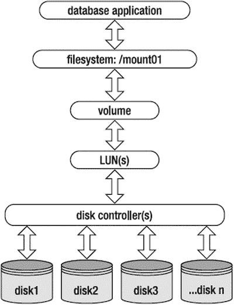

# 第 8 章:分析服务器性能

SA 和 DBA 之间的任务划分通常很模糊。这种角色的模糊在你身兼数职的小商店里尤其明显。即使在具有既定角色和职责的大型组织中，您仍会偶尔经历“全员参与”的消防演习，在演习中，您需要对服务器问题进行故障排除。在这些情况下，您必须熟悉用于从服务器提取信息的操作系统命令。专家级 DBA 不会凭空诊断数据库问题；你必须精通服务器。

每当出现应用程序性能问题或可用性问题时，从 DBA 的角度来看，首先会问这样一个问题:“数据库出了什么问题？”不管问题的来源是什么，验证数据库是否运行良好的负担通常落在 DBA 身上。这个过程有时包括识别服务器瓶颈。数据库和服务器具有相互依赖的关系。DBA 需要精通监控服务器活动的技术。

当您有一个包含几十个数据库的服务器，并且遇到性能问题时，您必须确定瓶颈是与 CPU、内存、I/O 还是网络有关。此外，您必须查明机器上哪些进程消耗了最多的资源。在这些情况下，使用操作系统工具诊断问题，引导您找到消耗最多服务器资源的进程，会更有成效。识别进程后，您可以确定它是否与数据库相关联，然后进一步识别进程的类型(SQL*Plus、RMAN、数据泵等)。

本章介绍了用于分析服务器的 CPU、内存、I/O 和网络性能的技术。花些时间熟悉每一节中涉及的相关命令。能够快速调查系统活动将极大地拓宽您的 DBA 技能集。

表 [8-1](#Tab1) 总结了 DBA 和 sa 常用的操作系统实用程序。下表列出了讨论该工具的方法，以及该工具涵盖的性能方面(注意，有些工具在其他章节中有所涉及)。熟悉这些操作系统命令以及如何解释输出将使您在诊断服务器性能问题时能够与 SAs、存储管理员、网络工程师和开发人员合作。

表 8-1。

Performance and Monitoring Utilities

<colgroup><col> <col> <col> <col> <col> <col> <col> <col> <col></colgroup> 
| 工具 | 描述 | 食谱 | 过程 | 中央处理器 | 记忆 | 输入－输出 | 网络 | 追踪 |
| --- | --- | --- | --- | --- | --- | --- | --- | --- |
| `vmstat` | 处理 CPU、内存和 IO 消耗 | 8-1, 8-6 | X | X | X | X |   |   |
| `sar` | 当前和历史资源使用情况 | 8-2, 8-9 |   | X | X | X | X |   |
| `top` | 识别消耗 CPU 和内存的会话 | 8-3, 8-5 | X | X | X |   |   |   |
| `ps` | 处理内存和 CPU 消耗 | 8-3, 8-5 | X | X | X |   |   |   |
| `prstat` | Solaris 活动进程统计信息 | 8-3 | X | X | X |   |   |   |
| `mpstat` | CPU 统计 | 8-4 |   | X |   |   |   |   |
| `uptime` | 系统正常运行时间和负载 | 3-6 |   | X | X |   |   |   |
| `w` | 机器上的用户和进程 | 3-6 | X | X | X |   |   |   |
| `ipcs` | 共享内存和信号量 | 9-8 |   |   | X |   |   |   |
| `sysresv` | Oracle 实例内存和信号量 | 9-9 |   |   | X |   |   |   |
| `free` | 空闲和已用内存 | 8-6 |   |   | X |   |   |   |
| `iotop` | 过程 I/O 使用 | 8-7 | X |   |   | X |   |   |
| `iostat` | 磁盘 I/O 统计 | 8-8 |   |   |   | X |   |   |
| `df` | 可用磁盘空间 | 7-4, 8-12 |   |   |   | X |   |   |
| `du` | 磁盘使用 | 5-30 |   |   |   | X |   |   |
| `dd` | 文件复制和格式化 | 8-1, 8-8 |   |   |   | X |   |   |
| `netstat` | 网络统计 | 8-9 |   |   |   |   | X |   |
| `traceroute` | 跟踪数据包从一台服务器到另一台服务器的路由 | 8-9 |   |   |   |   | X |   |
| `ping` | 服务器之间的连接 | 8-10 |   |   |   |   | X |   |
| `tnsping` | Oracle 数据库连接 | 8-10, 8-11 |   |   |   |   | X |   |
| `strace` | Linux 进程跟踪 | 8-11 |   |   |   |   |   | X |
| `truss` | Solaris 进程跟踪 | 8-11 |   |   |   |   |   | X |
| `lsof` | 进程当前打开的 Linux 文件 | 8-12 | X |   |   |   |   |   |
| `pfiles` | 进程当前打开的 Solaris 文件 | 8-12 | X |   |   |   |   |   |

诊断服务器问题时，从`vmstat`、`sar`、`top`和`ps`等实用程序开始。这些工具可让您快速了解整体系统性能。然后，您可以使用其他工具深入研究 CPU、内存、I/O 和网络细节。

## 8-1.识别系统瓶颈

### 问题

应用程序用户报告说数据库似乎很慢。您希望确定数据库服务器上是否存在任何系统资源瓶颈。

### 解决办法

`vmstat`(虚拟内存统计)工具旨在帮助您快速识别服务器上的瓶颈。`vmstat`命令显示关于进程、内存、分页、磁盘 I/O 和 CPU 使用情况的实时性能信息。这个例子展示了在 Linux 服务器上使用`vmstat`(在 Solaris 上输出略有不同)来显示没有指定选项的默认输出:

`$ vmstat`

`procs -----------memory------------ --swap-- ----io---- --system-- -------cpu-------`

`r  b  swpd    free     buff   cache  si   so  bi    bo    in   cs   us sy  id  wa st`

`0  0     0 1185336 10615632  991736   0    0   5     9     9   12    0  0 100   0  0`

这里有一些在解释`vmstat`的输出时可以使用的通用启发法:

*   如果`b`(进程休眠)持续大于 0，您可能没有足够的 CPU 处理能力。
*   如果`so`(换出到磁盘的内存)和`si`(从磁盘换入的内存)始终大于 0，则可能存在内存瓶颈。在一些系统中，这些列可能被标记为`pi`和`po`。
*   如果`wa`(等待 I/O 的时间)列很高，通常表示存储子系统过载。

默认情况下，运行`vmstat`时只显示一行服务器统计数据(不提供任何选项)。这一行输出显示了自上次系统重新启动以来计算的平均统计数据。虽然这对于快速快照来说很好，但是如果您想要收集一段时间内的指标，请使用带有此语法的`vmstat`:

`$ vmstat <interval in seconds> <number of intervals>`

在此模式下，`vmstat`报告从一个时间间隔到下一个时间间隔的统计采样。例如，如果您希望在 10 个时间间隔内每 2 秒报告一次系统统计信息，请发出以下命令:

`$ vmstat 2 10`

`vmstat`的内存列的默认度量单位是千字节。如果您想查看以兆字节为单位的内存统计数据，请使用`-S m`(以兆字节为单位的统计数据)选项:

`$ vmstat -S m`

### 它是如何工作的

如果您的数据库服务器看起来很慢，分析`vmstat`输出以确定资源消耗在哪里。表 [8-2](#Tab2) 详细说明了`vmstat`默认输出中显示的列的含义。

表 8-2。

Column Descriptions of `vmstat` Output

<colgroup><col> <col></colgroup> 
| 圆柱 | 描述 |
| --- | --- |
| `R` | 等待运行时的进程数 |
| `b` | 处于不间断睡眠状态的进程数 |
| `swpd` | 正在使用的总虚拟内存(交换空间)(KB) |
| `free` | 总空闲内存(KB) |
| `buff` | 用作缓冲区的总内存(KB) |
| `cache` | 用作缓存的总内存(KB) |
| `si` | 从磁盘换入的内存(KB/s) |
| `so` | 换出到磁盘的内存(KB/s) |
| `bi` | 从块设备读入的块数(块数/秒) |
| `bo` | 每秒向块设备写出的块数(块数/秒) |
| `in` | 每秒中断数 |
| `cs` | 每秒的上下文切换 |
| `us` | 用户级代码时间占总 CPU 时间的百分比 |
| `sy` | 系统级代码时间占总 CPU 时间的百分比 |
| `id` | 空闲时间占总 CPU 时间的百分比 |
| `wa` | 等待 I/O 完成的时间 |
| `st` | 从虚拟机窃取的时间 |

您还可以将`vmstat`输出发送到一个文件，这对于分析一段时间内的历史性能非常有用。此示例每 5 秒钟对总共 60 个报告的统计数据进行一次采样，然后将输出记录在一个文件中:

`$ vmstat 5 60 > vmout.perf`

使用`vmstat`的另一个有用的方法是使用`watch`工具。`watch`命令用于定期执行另一个程序。该示例使用`watch`每 5 秒运行一次`vmstat`命令，并在屏幕上突出显示每个快照之间的任何差异:

`$ watch -n 5 -d vmstat`

在`watch -d`(差异)模式下运行`vmstat`时，您会在屏幕上看到不同快照之间的变化。要退出`watch`，按 Ctrl+C

通过在模拟一些服务器活动时查看输出，您可以更好地了解`vmstat`是如何操作的。首先，在系统活动很少时检查`vmstat`的输出:

`$ vmstat 2 10`

`procs -----------memory------------ ---swap-- ----io----  --system-- -----cpu-------`

`r  b   swpd    free   buff   cache  si   so   bi    bo     in   cs  us sy  id wa st`

`0  0  44588 3170020 184644 5222292   0    0    2    68      1    0   5  1  94  0  0`

`0  0  44588 3169392 184644 5222336   0    0    0     8    497  864   2  0  98  0  0`

`0  0  44588 3169400 184644 5222396   0    0    0   220    448  746   0  0 100  0  0`

现在，通过使用`dd`命令创建一个随机填充的 1GB 大文件来模拟服务器活动:

`$ dd if=/dev/urandom of=GIGtestfile bs=1M count=1024 oflag=direct &`

随着随机数的生成，这应该会增加 CPU 的使用率。此外，在填充文件时，应该会生成 I/O 活动。当前命令在后台运行时(通过`&`操作符)，您可以运行`vmstat`:

`$ vmstat 2 10`

以下几行输出表明 CPU 空闲更少(更忙), I/O 块写出(输出中的`bo`列)参数增加了:

`procs -----------memory------------ --swap--  ----io----  --system-- -----cpu------`

`r  b   swpd    free   buff   cache  si   so   bi    bo     in   cs  us sy id wa st`

`1  0  44588 3128704 184664 5256092   0    0    0   912    743  920   1 25 74  0  0`

`1  0  44588 3108500 184664 5274432   0    0    0   400    664  934   1 25 74  0  0`

`5  0  44588 3070472 184664 5311608   0    0    0   366    647  882   1 25 73  0  0`

OSWATCHER

Oracle 提供了一组脚本，用于收集和存储 CPU、内存、磁盘和网络使用情况的指标。OSWatcher 工具套件使用诸如`top`、`vmstat`、`iostat`、`mpstat`、`netstat`和`traceroute`等工具自动收集统计数据。

您可以从 Oracle MOS 网站获得 OSWatcher。搜索文档 ID 301137.1 或标题为“OSWatcher 用户指南”的文档导航到目录页面并搜索下载链接。

该实用程序还有一个可选的图形组件，用于直观地显示性能指标。OSWatcher 实用程序目前在以下平台上受支持:Linux、Solaris、AIX 和 HP-UX。对于 Windows，Oracle 建议使用集群健康监视器(请参见文档 ID 736752.1)。

## 8-2.分析当前和过去的系统性能

### 问题

用户报告说，数据库应用程序在每天上午 10:00 似乎很慢。要解决该问题，您需要查看服务器上当前的 CPU、内存和 I/O 负载。并显示一周前几天上午 10:00 的资源活动。

### 解决办法

`sar`(系统活动报告器)实用程序的独特之处在于它允许您查看当前的 CPU、内存和 I/O 资源使用情况；以及过去某个时间点的服务器活动(例如，一小时前、昨天等等)。

#### 显示 CPU 使用情况

要显示实时 CPU 统计数据，请使用`-u` (CPU 利用率)选项，并指定快照间隔(秒)和报告数量。以下显示当前处理器活动，快照间隔为 2 秒，总共 10 个报告:

`$ sar -u 2 10`

以下是一些示例输出:

`12:50:42          CPU     %user     %nice   %system   %iowait    %steal     %idle`

`12:50:44          all      0.00      0.00      0.00      0.00      0.00    100.00`

`12:50:46          all      2.49      0.00      0.37      0.12      0.00     97.01`

`12:50:48          all      0.37      0.00      0.37      0.00      0.12     99.13`

输出中最重要的列是`%idle`。低`%idle`可能表示 CPU 动力不足，或者表示应用程序负载较高。`%iowait`列显示等待 I/O 的时间。因此，`%iowait`时间长表示 I/O 子系统是一个潜在的瓶颈。

如果您有多个 CPU，您可以使用`-P ALL`选项查看每个 CPU 的输出。现在，您应该在输出中看到每个 CPU 一行:

`$ sar -u -P ALL`

要报告当天的 CPU 活动，请使用不带间隔的`-u`选项:

`$ sar -u`

要查看前一天的统计数据，使用带有`-f`(文件)选项的`sar`。在 Linux 系统上，`sar`用来报告一个月中不同日期的统计数据的文件记录在`/var/log/sa`目录中(在 Solaris 系统上，在`/var/adm/sa`目录中查找)。这些文件的命名约定是`saNN`，其中`NN`是一个月中的第几天。因此，如果今天是本月的第九天，并且您想要报告第八天的 CPU 活动，请使用以下命令:

`$ sar -u -f /var/log/sa/sa08`

请记住，默认情况下，`sar`只保留最近 7 天的历史文件。如果您需要延长保存期，请参见本配方的“工作原理”部分。

使用`-f`选项的输出可能会很长。您可以通过`-s`(开始时间)和`-e`(结束时间)选项报告时间范围。例如，要报告从上午 10:00 开始到上午 11:00 结束的内存负载，请执行以下操作:

`$ sar -r -f /var/log/sa/sa08 -s 10:00:00 -e 11:00:00`

一些旧版本的`sar`不提供结束时间选项。您可以创造性地使用诸如`grep`这样的命令来过滤期望时间的输出；例如:

`$ sar -r -f /var/log/sa/sa08 | grep ^10 | grep AM`

通过这种方式，您可以缩小想要显示的活动范围。

#### 显示内存活动

使用`sar`和`-r`(报告内存)选项来报告内存统计数据。要显示实时内存统计信息，请指定快照间隔(以秒为单位)和报告数量。以下显示了当前内存活动，快照间隔为 2 秒，共 10 个报告:

`$ sar -r 2 10`

下面是一小段输出:

`08:44:45 AM kbmemfree kbmemused  %memused kbbuffers  kbcached kbswpfree kbswpused  %swpused`

`kbswpcad`

`08:44:47 AM   2616532  13005612     83.25    200668   5705848  10243940     44500      0.43`

`836`

`...`

输出显示了可用和已用的总内存，以及已用的交换空间量。高度的交换表明您可能需要更多的内存。在这种模式下运行时，输出可能很宽且很长；它不太适合这个物理页面的限制。

要报告实时交换统计数据，请指定`-W`选项。此示例每 3 秒钟为总共 10 份报告生成一次当前交换统计数据快照:

`$ sar -W 3 10`

下面是一些示例输出，表明很少或没有交换发生:

`08:54:01 AM  pswpin/s pswpout/s`

`08:54:04 AM      0.00      0.00`

`08:54:07 AM      0.00      0.00`

要报告当天的内存活动，请使用不带间隔的`-r`选项:

`$ sar -r`

要查看历史内存统计数据，使用带有`-f`(文件)选项的`sar`。例如，要让`sar`显示每月第一天的内存分页统计数据，可以使用`-B`(报告分页统计数据)和`-f`(文件)选项运行它，如下所示:

`$ sar -B -f /var/log/sa/sa01`

以下是该报告的部分列表:

`11:10:01 AM  pgpgin/s pgpgout/s   fault/s  majflt/s`

`11:20:01 AM      0.02     16.17     18.37      0.00`

`11:30:01 AM      3.49     21.68     74.15      0.04`

`11:40:01 AM   4182.58    439.44    320.94      0.68`

`11:50:02 AM   4960.03    1027.79  4384.73      0.51`

前面的输出显示，大约在上午 11:40，从磁盘调入的页面(`pgpgin/s`)、从磁盘调出的页面(`pgpgout/s`)和每秒的页面错误(`fault/s`)都有大幅增加

#### 显示 I/O 负载

使用带有`-b (report I/O)`选项的`sar`来报告 I/O 统计数据。要显示实时 I/O 统计信息，请指定快照间隔(秒)和报告数量。在 Linux 系统上，以下显示了当前的 I/O 活动，快照间隔为 2 秒，共有 10 个报告:

`$ sar -b 2 10`

下面是输出的一部分(这个输出可能会根据您的 Linux 版本和`sar`命令而有所不同):

`09:01:19 AM       tps      rtps      wtps   bread/s   bwrtn/s`

`09:01:21 AM     19.39      0.00     19.39      0.00    448.98`

`09:01:23 AM     13.93      0.00     13.93      0.00    366.17`

`...`

`tps`栏显示每秒向设备传输的 I/O。`rtps`表示每秒的读请求，`wtps`显示每秒的写请求。

Note

在 Solaris 系统上，使用带有`-d`(磁盘)选项的`sar`来报告磁盘活动。根据版本的不同，`-d`选项可能在 Linux 上可用。

要报告当天的 I/O 活动，请指定不带时间间隔的`-b`选项:

`$ sar -b`

要报告当月前一天的 I/O 统计数据，请使用带有`-f`选项的`-b`。例如，要让`sar`显示该月第十天的磁盘统计数据，请按如下方式运行它:

`$ sar -b -f /var/log/sa/sa10`

### 它是如何工作的

`sar`实用程序用于生成当前负载指标，以及报告过去某个时间点的系统资源使用情况。如果您需要对过去发生的性能问题进行故障排除，可以使用`sar`实用程序。

你可以把`sar`看作是操作系统的 AWR 或 Statspack。AWR 或 Statspack 工具允许您查看过去一段时间内的数据库活动。`sar`实用程序与此类似，它允许您报告 CPU、内存和 I/O 的历史服务器活动。AWR 或 Statspack 报告依赖于定期使用包含历史数据库活动的信息填充永久数据库表的计划数据库作业。而`sar`实用程序使用`cron`作业来定期填充 OS 文件，这些文件可用于服务器活动的历史报告。

记住这一点，让我们更仔细地看看`sar cron`作业、资源使用历史文件，以及如何手动创建一个`sar`文件。

#### 了解`sar cron`工作

这个`sar`实用程序是在您安装`sysstat`系统包时配置的。您可以按如下方式检查它是否存在:

`$ sar -V`

`sysstat version ...`

如果没有安装`sysstat`，并且你有`root`访问权限，你可以用`yum`工具(或者任何你用来安装包的标准工具)安装它，如下所示:

`# yum install sysstat`

当你安装`sysstat`包的时候，`sar`将会和两个`cron`任务一起被安装。这些`cron`任务将被实例化，以创建由`sar`实用程序用来报告历史服务器统计数据的文件。在 Linux 系统上，您可以通过查看`/etc/cron.d/sysstat`文件来查看这些`cron`作业；例如，这里有一个示例`cron`条目:

`# run system activity accounting tool every 10 minutes`

`*/10 * * * * root /usr/lib64/sa/sa1 1 1`

`# generate a daily summary of process accounting at 23:53`

`53 23 * * * root /usr/lib64/sa/sa2 -A`

一旦`cron`任务已经运行了几天，要报告前一天的 CPU 统计数据，可以使用`-f`选项来指定与感兴趣的那一天相对应的文件。

在 Solaris 系统上，您可以通过查看`/var/spool/cron/crontabs/sys`文件来查看与`sar`相关的 cron 作业。下面是一个示例条目:

`0 * * * 0-6 /usr/lib/sa/sa1`

`20,40 8-17 * * 1-5 /usr/lib/sa/sa1`

`5 18 * * 1-5 /usr/lib/sa/sa2 -s 8:00 -e 18:01 -i 1200 -A`

#### 更改`sar`文件保存期限

在 Linux 系统上，`sar`用来报告一个月中不同日期的统计数据的文件位于`/var/log/sa`目录中。在 Solaris 系统上，`sar`文件位于`/var/adm/sa`目录中。

这些文件的命名约定是`saNN`，其中`NN`是一个月中的第几天。通常只保留最后一周左右的文件。快速列出`/var/adm/sa`目录有助于澄清这一点:

`$ cd /var/log/sa`

`$ ls -la sa[0-9]*`

以下是一些示例输出:

`-rw-r--r-- 1 root root 332016 Jun  1 16:50 sa01`

`-rw-r--r-- 1 root root 332016 Jun  2 16:50 sa02`

`-rw-r--r-- 1 root root 332016 Jun  3 16:50 sa03`

`-rw-r--r-- 1 root root 332016 Jun  4 16:50 sa04`

`-rw-r--r-- 1 root root 332016 Jun  5 16:50 sa05`

`-rw-r--r-- 1 root root 332016 Jun  6 16:50 sa06`

`-rw-r--r-- 1 root root 255984 Jun  7 11:20 sa07`

`-rw-r--r-- 1 root root 332016 May 30 16:50 sa30`

`-rw-r--r-- 1 root root 332016 May 31 16:50 sa31`

根据之前的输出，最后 9 天的文件将被保留。这些文件由`sar` cron 任务创建和填充。`sar`实用程序使用其中包含的信息来报告历史性能指标。

在 Linux 系统上，您可以通过修改`/etc/sysconfig/sysstat`文件中的`HISTORY`参数来控制保留的文件数量。`sysstat`文件的位置因操作系统而异。

在 Solaris 系统上，旧的`sar`文件由`/usr/lib/sa/sa2`实用程序删除。`sa2`脚本的最后一行找到最旧的`sar`文件并删除它们；例如:

`/usr/bin/find /var/adm/sa \( -name ’sar*’ -o -name ’sa*’ \) -mtime +7 -exec /usr/bin/rm {} \;`

作为`root`，您可以根据需要手动调整`-mtime`参数。通常 7 天的默认值就足够了。

#### 创建一个`sar`文件

在报告实时统计数据时，使用`-o` (out)选项将输出发送到文件:

`$ sar -b 2 10 -o saroutJun1.perf`

这段代码创建了一个二进制输出文件，稍后可用于分析磁盘 I/O 指标。稍后，您可以使用带有`-f`选项的`sar`来报告该文件的内容；例如:

`$ sar -b -f saroutJun1.perf`

这段代码提供了一种无限期保存给定时间点的`sar`指标的方法。在一个安静的时期，您可能想要这样做来建立一个度量的基线，或者在一个高负载的时期来捕获您想要在以后某个时间点分析的特定度量(并且不用担心文件被自动删除)。

## 8-3.识别 CPU 密集型进程

### 问题

您希望确定哪个 Oracle 会话消耗了数据库服务器上最多的 CPU。如果是运行 SQL 查询的 Oracle 会话，您希望显示关联的 SQL。

### 解决办法

有两个工具可用于快速识别消耗 CPU 最多的进程:`top`和`ps`。首先，我们来讨论一下`top`。

#### 使用`top`

`top`实用程序是 DBA 或 s a 用来查看服务器资源使用情况的第一批工具之一。此实用工具提供一个动态报告，每隔几秒钟刷新一次，并显示消耗资源最多的进程；例如:

`$ top`

以下是输出的部分清单:

`top - 15:31:27 up 7 days,  5:17,  2 users,  load average: 0.17, 0.35, 0.37`

`Tasks: 222 total,   2 running, 220 sleeping,   0 stopped,   0 zombie`

`Cpu(s):  8.2%us, 16.3%sy,  0.0%ni, 75.4%id,  0.0%wa,  0.0%hi,  0.0%si,  0.1%st`

`Mem:  15622144k total, 15524472k used,    97672k free,  9085000k buffers`

`Swap: 10288440k total,        0k used, 10288440k free,  3160848k cached`

`PID USER      PR  NI  VIRT  RES  SHR S %CPU %MEM    TIME+  COMMAND`

`9156 oracle    25   0 2595m 366m 184m R 99.9  2.4  13:51.84 oracle_9156_o12`

`1 root      15   0 10368  676  572 S  0.0  0.0   0:00.17 init`

`2 root      RT  -5     0    0    0 S  0.0  0.0   0:00.38 migration/0`

`3 root      34  19     0    0    0 S  0.0  0.0   0:00.05 ksoftirqd/0`

`...`

前五行显示系统负载、正在运行的进程摘要、CPU 负载、内存负载和交换统计信息。之后的几行显示了单个进程和相应的资源消耗。对于这个特殊的例子，Oracle 进程 9156 消耗了大量的 CPU。输出将每隔几秒刷新一次。要退出`top`，请按 Ctrl+C。

#### 使用`ps`

现在比较一下`top`和`ps`命令的用法。`ps`命令(结合`pcpu`选项)用于识别消耗服务器上最多 CPU 的会话的 PIDs 例如:

`$ ps -e -o pcpu,pid,user,tty,args | sort -n -k 1 -r | head`

以下是输出的部分清单:

`31.0  9156 oracle   ?        oracleO1212 (DESCRIPTION=(LOCAL=YES)(ADDRESS=(PROTOCOL=beq)))`

`1.0   9155 oracle   pts/2    sqlplus   as sysdba`

`...`

第一列是消耗的 CPU 的百分比。第二列显示 PID(进程 9156 消耗了此服务器上的大部分 CPU)。第三列显示`oracle`用户正在运行这个过程，我们可以从第五列得到数据库名称为`O1212`。

我们建议您为`ps`命令创建一个别名；例如:

`$ alias topcpu=’ps -e -o pcpu,pid,user,tty,args | sort -n -k 1 -r | head’`

此示例允许您快速运行命令，而不必记住语法:

`$ topcpu`

#### 检索 Oracle 进程信息

使用`top`和`ps`从前面几节中得出的主要结论是，进程 9156 消耗了服务器上的大量 CPU，并且它是一个与`O1212`数据库相关联的 Oracle 进程。现在，您可以将输出中的 PID 用作以下查询的输入，以显示有关导致高 CPU 资源消耗的 Oracle 会话的信息:

`SET LINES 200 PAGES 0 HEAD OFF LONG 100000`

`COL dummy_value NOPRINT`

`--`

`SELECT ’dummy_value’ dummy_value,`

`’USERNAME    : ’ || s.username     || CHR(10) ||`

`’SCHEMA      : ’ || s.schemaname   || CHR(10) ||`

`’OSUSER      : ’ || s.osuser       || CHR(10) ||`

`’MODULE      : ’ || s.program      || CHR(10) ||`

`’ACTION      : ’ || s.schemaname   || CHR(10) ||`

`’CLIENT INFO : ’ || s.osuser       || CHR(10) ||`

`’PROGRAM     : ’ || s.program      || CHR(10) ||`

`’SPID        : ’ || p.spid         || CHR(10) ||`

`’SID         : ’ || s.sid          || CHR(10) ||`

`’SERIAL#     : ’ || s.serial#      || CHR(10) ||`

`’KILL STRING : ’ || ’’’’ || s.sid || ’,’ || s.serial# || ’’’’  || CHR(10) ||`

`’MACHINE     : ’ || s.machine      || CHR(10) ||`

`’TYPE        : ’ || s.type         || CHR(10) ||`

`’TERMINAL    : ’ || s.terminal     || CHR(10) ||`

`’CPU         : ’ || q.cpu_time/1000000     || CHR(10) ||`

`’ELAPSED_TIME: ’ || q.elapsed_time/1000000 || CHR(10) ||`

`’BUFFER_GETS : ’ || q.buffer_gets  || CHR(10) ||`

`’SQL_ID      : ’ || q.sql_id       || CHR(10) ||`

`’CHILD_NUM   : ’ || q.child_number || CHR(10) ||`

`’START_TIME  : ’ || TO_CHAR(s.sql_exec_start,’dd-mon-yy hh24:mi’) || CHR(10) ||`

`’STATUS      : ’ || s.status       || CHR(10) ||`

`’SQL_TEXT    : ’ || q.sql_fulltext`

`FROM            v$session s`

`JOIN            v$process p ON (s.paddr  = p.addr)`

`LEFT OUTER JOIN v$sql     q ON (s.sql_id = q.sql_id)`

`WHERE s.username IS NOT NULL -- eliminates background procs`

`AND NVL(q.sql_text,’x’) NOT LIKE ’%dummy_value%’ -- eliminates this query from output`

`AND   p.spid           = ’&PID_FROM_OS’`

`ORDER BY q.cpu_time;`

对于此示例，当您运行前面的查询并向其提供 PID 9156 时，您将获得以下输出:

`USERNAME    : SYS`

`SCHEMA      : SYS`

`OSUSER      : oracle`

`MODULE      : sqlplus@dtc07dsg (TNS V1-V3)`

`ACTION      : SYS`

`CLIENT INFO : oracle`

`PROGRAM     : sqlplus@dtc07dsg (TNS V1-V3)`

`SPID        : 9156`

`SID         : 91`

`SERIAL#     : 60916`

`KILL STRING : ’91,60916’`

`MACHINE     : dtc07dsg`

`TYPE        : USER`

`TERMINAL    : pts/2`

`CPU         : 275.473216`

`ELAPSED_TIME: 279.805467`

`BUFFER_GETS : 64650`

`SQL_ID      : 1z4xyfmw1rpqy`

`CHILD_NUM   : 0`

`START_TIME  : 02-may-15 15:09`

`STATUS      : ACTIVE`

`SQL_TEXT    : select a.table_name from dba_tables a, dba_indexes, dba_extents, ...`

从前面的输出中，您可以看到一个 SQL*Plus 会话消耗了大量的 CPU 时间。您还可以从输出中确定查询开始的时间、用户名、删除字符串和 SQL 标识符。

一旦您确定了有关流程的信息，您就可以进一步深入显示执行计划和流程正在等待的资源。例如，您可以查看带有 SQL ID 和子编号的 SQL 执行计划:

`SQL> SELECT * FROM table(DBMS_XPLAN.DISPLAY_CURSOR(’&sql_id’,&child_num));`

下面是另一个有用的查询，它使用 SID 和序列号来显示会话的状态，以及它是在工作还是在等待资源:

`SELECT sid,`

`DECODE(state, ’WAITING’,’Waiting’, ’Working’) state,`

`DECODE(state, ’WAITING’, ’So far ’||seconds_in_wait,`

`’Last waited ’|| wait_time/100)|| ’ seconds for ’||event`

`FROM v$session`

`WHERE sid = ’&&session_id’`

`AND serial# = ’&&serial’;`

在诊断与服务器上运行的 Oracle 进程相关的性能问题时，此信息非常有用。

### 它是如何工作的

当您在一台服务器上运行多个数据库并遇到服务器性能问题时，很难确定哪个数据库和会话消耗了最多的系统资源。在这些情况下，使用`top`实用程序或`ps`命令来识别消耗最高的进程。`top`实用程序提供了一个动态界面，它会定期刷新，为您提供资源消耗的当前快照，而`ps`命令提供了顶级资源使用的快速一次性快照。

您可能想知道使用`top`还是`ps`来识别消耗资源的进程更好。如果你的服务器安装了`top`，那么`top`可能会是你的首选；它的易用性和交互式输出是无与伦比的。话虽如此，`ps`命令是普遍可用的，所以如果`top`命令不可用，您可能必须使用`ps`。此外,`ps`命令可能会向您显示一个与流程相关的更具描述性的程序名。

一旦您确定了一个进程，如果它是一个 Oracle 进程，请使用“解决方案”部分中的 SQL 查询来进一步确定 Oracle 进程的类型。然后，您可以选择尝试调整操作(无论是 SQL、RMAN 等等)，或者您可能想要终止进程(有关如何终止进程和/或停止 SQL 会话的详细信息，请参见方法 3-2)。

#### 解释`top`

与本菜谱的“解决方案”一节中显示的内容相比,`top`命令值得多做一点解释。默认情况下，`top`将重复刷新(每 3 秒钟)关于 CPU 密集型进程的信息。当`top`运行时，你可以交互地改变它的输出。例如，如果您键入`>`,`top`正在排序的列将向右移动一个位置。

表 [8-3](#Tab3) 列出了一些关键特性，您可以使用这些特性将`top`显示更改为所需的格式。

表 8-3。

Commands to Interactively Change the `top` Output

<colgroup><col> <col></colgroup> 
| 命令 | 功能 |
| --- | --- |
| 空格键 | 立即刷新输出。 |
| `<`或`>` | 将排序列向左或向右移动一个位置。默认情况下，`top`按 CPU 列排序。 |
| `d` | 更改刷新时间。 |
| `R` | 反转排序顺序。 |
| `z` | 切换颜色输出。 |
| `h` | 显示帮助菜单。 |
| `F`或`O` | 选择排序列。 |

键入`q`或按 Ctrl+C 退出`top`。表 [8-4](#Tab4) 描述了`top`默认输出中显示的几列。

表 8-4。

Column Descriptions of the `top` Output

<colgroup><col> <col></colgroup> 
| 圆柱 | 描述 |
| --- | --- |
| `PID` | 唯一流程标识符。 |
| `USER` | 运行进程的操作系统用户名。 |
| `PR` | 进程的优先级。 |
| `NI` | 很好的价值或过程。负值表示高优先级。正值表示低优先级。 |
| `VIRT` | 进程使用的总虚拟内存。 |
| `RES` | 使用的非交换物理内存。 |
| `SHR` | 进程使用的共享内存。 |
| `S` | 流程状态。 |
| `%CPU` | 处理自上次屏幕刷新以来的 CPU 消耗百分比。 |
| `%MEM` | 进程消耗的物理内存的百分比。 |
| `TIME` | 进程使用的总 CPU 时间。 |
| `TIME+` | 总 CPU 时间，显示百分之一秒。 |
| `COMMAND` | 用于启动进程的命令行。 |

您也可以使用`-b`(批处理模式)选项运行`top`,并将输出发送到一个文件供以后分析:

`$ top -b > tophat.out`

在批处理模式下，`top`命令将一直运行，直到您终止它(通过按 Ctrl+C)或者直到它达到指定的迭代次数。您可以用`nohup`和`&`的组合在批处理模式下运行前面的`top`命令来保持它的运行，不管您是否登录到系统。危险在于您可能会忘记它，最终创建一个非常大的输出文件(和一个愤怒的 SA)。

如果您有兴趣监控某个特定的进程，可以使用`-p`选项来监控 PID，或者使用`-U`选项来监控特定的用户名。您也可以通过使用`-d`和`-n`选项来指定延迟和迭代次数。以下示例在 25 次迭代中以 5 秒的延迟监控`oracle`用户:

`$ top -U oracle -d 5 -n 25`

Tip

使用`man top`或`top --help`命令列出您的操作系统版本的所有可用选项。

#### Solaris〔t0〕

请注意，在 Solaris 系统上，`prstat`实用程序还可以用来确定哪些进程消耗了最多的 CPU 资源。例如，您可以指示`prstat`每 5 秒报告一次系统统计数据:

`$ prstat 5`

以下是一些示例输出:

`PID USERNAME  SIZE   RSS STATE   PRI NICE      TIME  CPU PROCESS/NLWP`

`7601 oracle   8430M 4081M sleep   101    -   3:51:47 2.0% oracle/1`

`1614 oracle   6382M 4093M sleep   101    -  48:07:20 0.0% oracle/1`

`20071 oracle   8431M 7746M sleep    54    0   0:00:00 0.0% oracle/1`

键入`q`或按 Ctrl+C 退出`prstat`。在确定了消耗资源最多的进程之后，您可以使用`ps`命令来确定该进程与哪个数据库相关联。此示例报告与 PID 7601 相关的进程信息:

`$ ps -ef | grep 7601 | grep -v grep`

`oracle  7601     1   0   Apr 10 ?         231:47 ora_vktm_DWREP`

USING THE /PROC/<PID> FILES TO MONITOR PROCESS ACTIVITY

对于每个正在运行的 Linux 进程，都会在虚拟文件系统中创建一个目录。例如，如果您想查看关于 9156 的操作 PID 的详细信息，您可以导航到虚拟的`/proc/9156`目录并列出一个长列表。在那里，您将看到几个与该运行进程相关的信息文件和目录:

`$ cd /proc/9156`

`$ ls -l`

以下是输出的部分清单:

`-r-------- 1 oracle dba 0 May  2 15:42 auxv`

`-r--r--r-- 1 oracle dba 0 May  2 15:02 cmdline`

`-rw-r--r-- 1 oracle dba 0 May  2 15:42 coredump_filter`

`-r--r--r-- 1 oracle dba 0 May  2 15:42 cpuset`

`lrwxrwxrwx 1 oracle dba 0 May  2 15:42 cwd -> /u01/app/oracle/product/12.1.0.2/db_1/dbs`

`-r-------- 1 oracle dba 0 May  2 15:29 environ`

`lrwxrwxrwx 1 oracle dba 0 May  2 15:42 exe -> /u01/app/oracle/product/12.1.0.2/db_1/bin/oracle`

输出表明这是一个`oracle`进程，现在您可以通过查看内存使用情况`maps`文件或`status`文件来进一步分析它。因为这些文件不存在于磁盘上，所以使用一个实用程序如`cat`来显示它们的内容:

`$ cat /proc/<PID>/maps`

`$ cat /proc/<PID>/status`

## 8-4.识别 CPU 瓶颈

### 问题

您希望监视 CPU 上的系统负载。

### 解决办法

作为 DBA，您还需要定期检查 CPU 上的负载，以确定系统瓶颈。`mpstat`(多处理器统计)实用程序显示服务器上处理器的统计数据:

`$ mpstat`

下面是输出的一个片段:

`Linux 2.6.18-308.4.1.0.1.el5xen (rmougserv)      05/02/2015`

`04:53:12 PM  CPU   %user   %nice    %sys %iowait    %irq   %soft  %steal   %idle    intr/s`

`04:53:12 PM  all    0.10    0.00    0.10    0.10    0.00    0.00    0.01   99.70    179.01`

`mpstat`的默认输出只显示服务器上所有 CPU 的一行汇总统计数据。您还可以查看报告间隔期间累积的统计信息的快照。以下示例使用`-P`选项仅报告处理器 0；它每 2 秒钟显示 10 个不同报告的输出:

`$ mpstat -P 0 2 10`

以下是几行输出:

`04:54:22 PM  CPU   %user   %nice    %sys %iowait    %irq   %soft  %steal   %idle    intr/s`

`04:54:24 PM    0    0.00    0.00    0.00    0.00    0.00    0.00    0.00  100.00     93.94`

`04:54:26 PM    0    0.00    0.00    0.00    0.00    0.00    0.00    0.00  100.00     92.61`

`04:54:28 PM    0    0.00    0.00    0.00    0.00    0.00    0.00    0.00  100.00    135.68`

空闲时间是最重要的统计数据。如果 CPU 的空闲百分比较低，则表明负载较高。关于`mpstat`输出的解释，参见表 [8-5](#Tab5) 。

表 8-5。

Column Definitions for `mpstat` Processor Statistics

<colgroup><col> <col></colgroup> 
| 圆柱 | 描述 |
| --- | --- |
| `CPU` | 处理器号。从 0 开始。`all`行报告所有处理器的平均统计数据。 |
| `%user` | 在用户级别执行时 CPU 利用率的百分比。 |
| `%nice` | 以 nice 优先级在用户级别执行时的 CPU 利用率百分比。 |
| `%sys` | 在内核级执行时 CPU 利用率的百分比。 |
| `%iowait` | 在未完成的磁盘 I/O 操作期间，CPU 空闲的时间百分比。 |
| `%irq` | CPU 处理中断所花费的时间百分比。 |
| `%soft` | CPU 为软件中断提供服务所花费的时间百分比。 |
| `%steal` | 虚拟机管理程序为另一个虚拟处理器提供服务时 CPU 等待的时间百分比。 |
| `%idle` | 没有未完成的磁盘 I/O 操作的 CPU 空闲时间的百分比。 |
| `intr/s` | CPU 每秒接收的中断总数。 |

在 Solaris 系统上，`mpstat`的输出略有不同；例如:

`$ mpstat -P 0 2 20`

`CPU minf mjf xcal  intr ithr  csw icsw migr smtx  srw syscl  usr sys  wt idl`

`0    8   0  358   795  266  645    5   68  195    3   497    3   3   0  94`

`1    8   0  235   477  133  677    5   68  177    3   515    4   3   0  94`

`2    7   0  328   609  257  705    5   70  197    3   511    3   3   0  94`

空闲时间的数量是最能说明问题的统计数据。空闲时间低表示处理器负载高。

### 它是如何工作的

`mpstat`实用程序对于专门分析 CPU 负载非常有用。以下是解释其输出的一些通用准则:

*   如果`%idle`很高，您的 CPU 很可能不会过载。
*   如果`%iowait`输出是一个非零数字，您可能有一些磁盘 I/O 争用。

在多处理器服务器上，您可以使用`mpstat`命令的`-P ALL`选项在单独的行上打印每个 CPU 的统计数据:

`$ mpstat -P ALL`

下面是输出的部分清单:

`05:07:53 PM  CPU   %user   %nice    %sys %iowait    %irq   %soft  %steal   %idle    intr/s`

`05:07:53 PM  all    0.11    0.00    0.12    0.10    0.00    0.00    0.01   99.67    179.26`

`05:07:53 PM    0    0.18    0.01    0.21    0.36    0.00    0.00    0.01   99.23    117.26`

`05:07:53 PM    1    0.11    0.00    0.12    0.01    0.00    0.00    0.00   99.76     18.92`

`05:07:53 PM    2    0.06    0.00    0.04    0.01    0.00    0.00    0.00   99.89     21.05`

`05:07:53 PM    3    0.09    0.00    0.10    0.01    0.00    0.00    0.00   99.80     22.04`

前面的输出显示该服务器有四个 CPU(用一条线表示 CPUs 0、1、2 和 3)。`%idle`列在 99%的范围内，表示该机箱上的 CPU 负载很小。

您也可以将`mpstat`的输出保存到文件中。此示例将 100 次每 10 秒报告的所有 CPU 活动保存到一个文件中:

`$ mpstat -P ALL 10 100 > mpperf.perf`

这段代码允许您保存性能统计数据，以便您可以分析和对比不同时间段的性能。

## 8-5.识别内存密集型进程

### 问题

您希望确定哪个 Oracle 会话消耗了数据库服务器上最多的内存。如果是运行 SQL 查询的 Oracle 会话，您希望显示关联的 SQL。

### 解决办法

您可以使用`top`实用程序或`ps`命令来显示使用进程的顶级内存。让我们先来看看`top`。

#### 使用`top`

运行`top`最简单的方法如下:

`$ top`

默认情况下，`top`显示按 CPU 使用率排序的输出。要将输出转换为按内存使用情况排序，使用`>`键将报告输出向右移动一列(`%MEM`)。以下是一些示例输出:

`Tasks: 223 total,   1 running, 222 sleeping,   0 stopped,   0 zombie`

`Cpu(s):  0.0%us,  0.0%sy,  0.0%ni,100.0%id,  0.0%wa,  0.0%hi,  0.0%si,  0.0%st`

`Mem:  15622144k total, 15369420k used,   252724k free,  8759664k buffers`

`Swap: 10288440k total,        0k used, 10288440k free,  3505156k cached`

`PID USER      PR  NI  VIRT  RES  SHR S %CPU %MEM    TIME+  COMMAND`

`3217 cloudera  19   0 2770m 1.0g  17m S  0.0  6.9   0:52.84 java`

`637 oracle    15   0 2409m 404m 394m S  0.0  2.7   0:00.65 ora_dbw0_o1212`

`4204 emcadm    16   0  671m 249m  12m S  0.0  1.6   1:02.31 java`

`2525 oracle    25   0 2462m 193m 186m S  0.0  1.3   0:15.40 oracle_2525_o12`

#### 使用`ps`

您还可以使用带有`pmem`选项的`ps`命令来识别消耗内存最多的进程及其相关的 PID。我们建议您专门搜索 Oracle 流程，因为`ps`输出可能会很长；例如:

`$ ps -e -o pmem,pid,user,tty,args | grep -i oracle | sort -n -k 1 -r | head`

以下是一些示例输出:

`1.2   625 oracle   ?        ora_mman_O1212`

`0.7   655 oracle   ?        ora_mmon_O1212`

`0.4   691 oracle   ?        ora_cjq0_O1212`

在上一个输出的第二列中，ID 为 625 的进程消耗了 1.2%的内存。现在您已经有了 PID，您可以使用配方 8-2 的“解决方案”部分的查询来进一步确定 Oracle 进程的类型(例如，RMAN、SQL*Plus、数据泵等)。

### 它是如何工作的

如果您遇到性能问题，确定哪些进程消耗的内存最多将为您提供另一条信息来解决问题。在这方面，`top`和`ps`命令非常有用。`top`命令提供了一种动态查看内存使用模式的交互方式，而`ps`命令作为一个获取内存活动快照的单行命令更有用。我们建议您为`ps`命令创建一个别名；例如:

`$ alias topmem=’ps -e -o pmem,pid,user,tty,args | grep -i oracle | sort -n -k 1 -r | head’`

这段代码将允许您快速运行命令，而不必记住语法:

`$ topmem`

您应该使用内存使用信息和 CPU 使用信息(见方法 8-2)来确定哪些进程消耗了最多的资源，然后进一步调查这些进程。

## 8-6.识别内存瓶颈

### 问题

您希望查看数据库服务器上内存的当前使用情况。

### 解决办法

分页和交换活动是服务器内存使用效率的指标。通常，大量的分页和交换表示内存不足。有许多实用程序可以用来监控分页和交换。例如，您可以使用`vmstat`(虚拟内存统计)来监控当前的内存使用情况。在这一行代码中，`vmstat`报告每 2 秒生成一次，总共 3 个报告:

`$ vmstat 2 3`

以下是一些示例输出:

`procs  -----------memory----------- --swap-- ----io---- --system-- ------cpu------`

`r  b   swpd   free    buff   cache  si   so   bi    bo   in   cs  us sy  id wa st`

`0  0      0 358448 8753168 3539596   0    0    4    10    8    1   1  1  98  0  0`

`0  0      0 358424 8753168 3539596   0    0    0    16  416  637   0  0 100  0  0`

`0  0      0 358424 8753168 3539596   0    0    0   378  484  631   0  0 100  0  0`

如果您有一个相当新的 Linux 版本，您也可以使用`-a`选项，它显示活动和不活动的内存。下面是一个使用`-a`选项运行`vmstat`的例子:

`$ vmstat -a 2 3`

下面是附加列的输出:

`procs -----------memory----------- ---swap-- -----io--- --system-- ------cpu-------`

`r  b  swpd   free   inact  active  si   so   bi    bo    in   cs   us sy  id wa st`

`0  0     0 358812 9180892 4841900   0    0    4    10     8    1    1  1  98  0  0`

`0  0     0 358812 9180892 4841912   0    0    0    62   427  637    0  0 100  0  0`

`0  0     0 358812 9180892 4841912   0    0    0     0   421  629    0  0 100  0  0`

如果您的服务器显示大量从磁盘换入的内存(`si`列)或换出到磁盘的内存(`so`列)，您可能有内存瓶颈。

Solaris 上的`vmstat`输出报告与 Linux 系统相同类型的信息；例如:

`$ vmstat 2 3`

`kthr      memory            page            disk          faults      cpu`

`r b w     swap    free  re  mf pi po fr de sr vc  vc  vc --   in   sy    cs us sy  id`

`0 0 0 18541480 2994160  20 119  0  0  0  0  0  2 184 146  0 9203 8216 10930  3  3  94`

`0 0 0 18463736 3091248 138 335  0  0  0  0  0  2   6   5  0 5188 3617  5081  0  0  99`

`0 0 0 18464824 3090824   0   3  0  0  0  0  0  0   2  38  0 4792 2256  4600  0  0 100`

在此输出中，`page`部分报告交换，I/O 在`disk`下报告。

### 它是如何工作的

内存健康的主要指标之一是发生的分页和交换的数量。如果您阅读了五种不同的 Linux 性能调优白皮书，您将会得到五种略有不同的分页和交换定义。我们对那些术语的确切定义不做细微的争论；我们的说法是，一般来说，分页和交换是将内存内容移入和移出磁盘。

当没有足够的物理内存来满足服务器上所有进程的内存需求时，就会发生分页和交换。当发生分页和交换时，性能通常会受到影响，因为将内存内容复制到磁盘和从磁盘复制内容的过程本身就是一项缓慢的活动。像`vmstat`这样的工具可以帮助你识别过多的交换。

#### 使用`free`

您也可以使用`free`命令显示当前使用的物理和虚拟内存(交换):

`$ free`

`total       used       free     shared    buffers     cached`

`Mem:      15622144   15269820     352324          0    8753168    3539596`

`-/+ buffers/cache:    2977056   12645088`

`Swap:     10288440          0   10288440`

从前面的输出中，您可以看到这个系统有 15GB 的 RAM，几乎全部都被使用了。它有大约 10GB 的交换空间，几乎没有被使用。如果您的 Linux 系统正在使用它的大部分物理内存，不要太惊慌；这在许多 Linux 服务器上都很典型。

Note

关于使用`ipcs`查看数据库使用的内存和信号量的详细信息，参见[第 9 章](09.html)。

您可以使用`-s`选项让`free`命令以重复的时间间隔报告输出。这个例子使用`free`在两秒钟的快照中显示内存使用情况，并将输出发送到一个文件:

`$ free -s 2 > freemem.perf`

使用`-s`选项时，按 Ctrl+C 退出`free`。默认情况下，`free`输出以千字节为单位报告内存使用情况。使用`-m`以兆字节为单位打印，或使用`-g`以千兆字节为单位显示`free`的输出。

#### 使用`watch`

使用`free`的一个有效方法是与`watch`命令结合使用。`watch`命令用于定期执行另一个程序。这个例子使用`watch`通过`-n`(间隔)选项每 3 秒运行一次`free`实用程序。`-d`(差异)选项用于在不同快照的数值发生变化时，在屏幕上高亮显示输出:

`$ watch -n 3 -d free`

`Every 3.0s: free                                 Sun May  3 17:42:33 2015`

`total       used       free     shared    buffers     cached`

`Mem:      15622144   15264004     358140          0    8753168    3539700`

`-/+ buffers/cache:    2971136   12651008`

`Swap:     10288440          0   10288440`

在这种模式下运行时，您应该能够在屏幕上直观地看到内存活动的任何变化。要从`watch`退出，按 Ctrl+C。

您也可以通过查看`/proc/meminfo`文件来查看内存的当前特性。您可以使用该文件来显示当前正在使用的物理内存和交换空间。这个例子使用了`cat`实用程序来显示当前的内存使用情况:

`$ watch -d cat /proc/meminfo`

默认情况下，`watch`命令每 2 秒刷新一次屏幕。您应该可以直观地看到各个时间间隔之间突出显示的差异:

`Every 2.0s: cat /proc/meminfo               Sun May  3 17:44:38 2015`

`MemTotal:     15622144 kB`

`MemFree:        358044 kB`

`Buffers:       8753168 kB`

`Cached:        3539912 kB`

`SwapCached:          0 kB`

`Active:        4842728 kB`

`SwapTotal:    10288440 kB`

`SwapFree:     10243872 kB`

`...`

如果您看到使用了异常数量的交换空间(低`SwapFree`)，这表明您的服务器需要更多内存。要从`watch`退出，请按 Ctrl+C。

## 8-7.识别 I/O 密集型流程

### 问题

您希望确定哪些进程产生了最多的 I/O。

### 解决办法

使用`iotop`实用程序显示排名靠前的 I/O 生成进程。在大多数系统上，运行`iotop`需要`root`访问(在本例中由`#`字符命令提示符表示)。下面是调用它的最简单的方法:

`# iotop`

以下是一些示例输出:

`TID  PRIO   USER      DISK READ   DISK WRITE  SWAPIN  IO>     COMMAND`

`21553  be/4 oracle      0.00 B/s    0.00 B/s    -5.02 % 99.99 % [oracle_21553_o1]`

`24423  be/4 oracle      0.00 B/s    0.00 B/s     0.00 %  1.99 % ora_p003_O1212`

`24348  be/4 oracle      0.00 B/s    0.00 B/s     0.00 %  1.36 % ora_lgwr_O1212`

`24331  be/4 oracle      0.00 B/s    0.00 B/s     0.00 %  0.72 % ora_gen0_O1212`

`24401  be/4 oracle      0.00 B/s    0.00 B/s     0.00 %  0.64 % ora_arc3_O1212`

`24427  be/4 oracle      0.00 B/s    0.00 B/s     1.99 %  0.56 % ora_p005_O1212`

该输出显示总体磁盘读取和写入速率，以及 PID、用户和命令。如果是 Oracle 流程，您可以使用配方 8-2 的“解决方案”部分的 SQL 查询，从数据字典中检索有关流程的更多详细信息。

### 它是如何工作的

`iotop`实用程序是一个类似 top 的实用程序，显示进程和相关的 I/O。您可以使用许多不同的模式。例如，如果您想显示与一个用户相关联的 I/O，可以按如下方式进行:

`# iotop -user oracle`

如果您想要更改刷新率(以秒为单位)，您可以使用`-d`开关指定间隔。以下指令指示`iotop`每 5 秒刷新一次屏幕:

`# iotop -d 5`

`iotop`是一个有效的实用程序，可以显示服务器上消耗 I/O 最多的进程。当您遇到磁盘 I/O 瓶颈时，该工具提供了一种快速识别可能需要进一步调查的进程的方法。

## 8-8.识别 I/O 瓶颈

### 问题

您希望确定您的磁盘存储是否是一个瓶颈。

### 解决办法

`iostat`命令可以帮助您确定磁盘 I/O 是否是性能问题的潜在来源。将`-x`(扩展)选项与`-d`(设备)选项结合使用是生成 I/O 统计信息的一种有用方式。此示例使用`-x`和`-d`选项每 10 秒显示一次扩展设备统计信息:

`$ iostat -xd 10`

您需要一个真正宽的屏幕来查看这个输出；以下是部分清单:

`Device:    rrqm/s wrqm/s   r/s   w/s  rsec/s  wsec/s    rkB/s    wkB/s avgrq-sz`

`avgqu-sz   await  svctm  %util`

`sda          0.01   3.31  0.11  0.31    5.32   28.97     2.66    14.49    83.13`

`0.06  138.44   1.89   0.08`

Note

在 Solaris 系统上，`iostat`输出可能会将磁盘利用率报告为`%b`(繁忙百分比)。同样在 Solaris 系统上，使用`iostat -Mnxz <n>`以兆字节为单位显示输出，列出描述性名称，显示扩展统计信息，并删除全零行。

这种周期性扩展输出允许您实时查看哪些设备的读写活动出现峰值。要退出之前的`iostat`命令，按 Ctrl+C

当试图确定设备 I/O 是否是瓶颈时，以下是检查`iostat`输出时的一些通用指南:

*   查找每秒读取或写入的块数异常高的设备。
*   如果任何设备的利用率接近 100%，这是 I/O 成为瓶颈的强烈信号。

一旦确定存在磁盘 I/O 争用问题，您可以使用 AWR(如果获得许可)、Statspack(不需要许可)或`V$`视图等工具来确定您的数据库是否存在 I/O 压力。例如，AWR 报告包含一个 I/O 统计信息部分，其中包含以下子部分:

*   IOStat 按功能汇总
*   按文件类型列出的 IOStat 摘要
*   按函数/文件类型列出的 IOStat 摘要
*   表空间 IO 统计
*   文件 IO 统计

如果要显示正在等待 I/O 资源的当前数据库会话，可以按如下方式查询数据字典:

`SELECT a.username, a.sql_id, b.object_name, b.object_type, a.event`

`FROM v$session a`

`,dba_objects b`

`,v$event_name c`

`WHERE b.object_id = a.row_wait_obj#`

`AND   a.event = c.name`

`AND   c.wait_class = ’User I/O’;`

### 它是如何工作的

`iostat`命令可以帮助您确定磁盘 I/O 是否是性能问题的潜在来源。如果您不带任何选项执行`iostat`,您将得到一个默认报告，显示自系统上次启动以来的平均值:

`$ iostat`

`avg-cpu:  %user   %nice    %sys %iowait   %idle`

`18.91    0.04    1.20    0.15   79.70`

`Device:            tps   Blk_read/s   Blk_wrtn/s   Blk_read   Blk_wrtn`

`sda               7.14       398.01       409.52  164484368  169239542`

`sda1              0.00         0.00         0.00       1538        166`

`sda2              54.15      396.92       407.74  164032098  168505032`

`sda3              0.35         1.04         1.77     429820     733168`

注意在`iostat`输出中有两个部分。第一部分是 CPU 利用率报告。第二部分与磁盘 I/O 相关，称为设备利用率报告。

表 [8-6](#Tab6) 描述了用于磁盘 I/O 的列。(使用`iostat`的`-d`选项仅显示设备统计数据。)

表 8-6。

Column Descriptions of `iostat` Disk I/O Output

<colgroup><col> <col></colgroup> 
| 圆柱 | 描述 |
| --- | --- |
| 设备 | 设备或分区名称 |
| `tps` | 每秒向设备传输的 I/O 数 |
| `Blk_read/s` | 每秒从设备读取的块数 |
| `Blk_wrtn/s` | 每秒写入设备的块数 |
| `Blk_read` | 读取的块数 |
| `Blk_wrtn` | 写入的块数 |
| `rrqm/s` | 每秒向设备排队的合并读取请求数 |
| `wrqm/s` | 排队到设备的每秒合并的写请求数 |
| `r/s` | 每秒读取请求数 |
| `w/s` | 每秒写入请求数 |
| `rsec/s` | 每秒读取的扇区 |
| `wsec/s` | 每秒写入的扇区 |
| `rkB/s` | 每秒读取的千字节数 |
| `wkB/s` | 每秒写入的千字节数 |
| `avgrq-sz` | 扇区中请求的平均大小 |
| `avgqu-sz` | 请求的平均队列长度 |
| `await` | 发送到设备的 I/O 请求得到服务的平均时间(毫秒) |
| `svctm` | 平均服务时间(毫秒) |
| `%util` | 向设备发出 I/O 请求的 CPU 时间百分比；接近 100%表示设备饱和 |

您还可以指示`iostat`以指定的时间间隔显示报告。显示的第一个报告报告自上次服务器重新启动以来的平均值；每个后续报告都会显示自之前生成快照以来的统计信息。以下示例每 3 秒显示一次设备统计报告:

`$ iostat -d 3`

要退出前面的`iostat`命令，请按 Ctrl+C。您还可以指定想要生成的有限数量的报告，这对于收集要在一段时间内分析的指标非常有用。该示例指示`iostat`每 2 秒报告一次，总共 15 次报告:

`$ iostat 2 15`

当您使用本地连接的磁盘时，`iostat`命令的输出清楚地显示了 I/O 发生的位置。但是，在使用外部阵列进行存储的环境中，这一点并不明确。您在文件系统层看到的是某种虚拟磁盘，它也可能是由卷管理器配置的。虚拟磁盘通常被称为卷或逻辑单元(LUN)。

LUN 是物理上由一个或多个物理磁盘组成的逻辑磁盘。LUN 代表物理磁盘和数据库服务器上运行的应用程序之间的虚拟化层。图 [8-1](#Fig1) 从较高的层面说明了虚拟磁盘所涉及的抽象。

图 8-1。

Abstraction layers between database application and physical disks

当您使用虚拟磁盘时，`iostat`的输出报告虚拟磁盘级别的读/写活动，而不是底层物理磁盘。在这些情况下，数据库应用程序和物理磁盘之间可能有许多抽象层，这使得很难隔离 I/O 瓶颈的确切来源。我们建议您与存储管理员密切合作，确定一组特定的 LUN 和底层物理磁盘是否是 I/O 性能低下的原因。

DETERMINING I/O RATES

要估计存储系统的 I/O 速率，请结合使用`dd`命令和`time`命令。在 Linux 系统上，使用`ofile`和`ifile`参数模拟直接 I/O；否则，您正在读取和写入内存，将会收到误导性的结果。例如，使用以下公式来估计写入次数:

`$ time dd if=/dev/zero of=testfile bs=8k count=1000 oflag=direct`

以下估计数如下:

`$ time dd of=/dev/null if=testfile bs=8k count=1000 iflag=direct`

这些指标有助于确定操作系统读写文件的速度。请记住，它将提供顺序写入/读取的估计值。您必须考虑更复杂的东西来模拟数据库 I/O 活动(随机写/读和多个进程)。话虽如此，这种方法仍然是诊断 I/O 问题的良好起点。

在 Solaris 系统上，`dd`命令没有`oflag`和`iflag`选项。如果存储在 ZFS，使用`zfs`实用程序通过`zfs set primarycache=metadata <filesystem>`将缓存设置为元数据。您很可能需要联系您的存储管理员，以便使用适当的文件系统运行前面的命令。

## 8-9.监控网络流量

### 问题

您怀疑网络可能是一个瓶颈。您想要查看网络统计数据。

### 解决办法

使用`netstat`(网络统计)命令显示网络流量。也许查看`netstat`输出最有用的方法是使用`-ptc`选项。这些选项显示 PID 和 TCP 连接，并持续更新输出:

`$ netstat -ptc`

按 Ctrl+C 退出上一个命令。下面是输出的部分清单:

`(Not all processes could be identified, non-owned process info will not be shown, you would have to be root to see it all.) Active Internet connections (w/o servers)`

`Proto Recv-Q Send-Q Local Address  Foreign Address  State       PID/Program name`

`tcp        0      0 rmug.com:62386 rmug.com:1521    ESTABLISHED 22864/ora_pmon_RMDB`

`tcp        0      0 rmug.com:53930 rmug.com:1521    ESTABLISHED 6091/sqlplus`

`tcp        0      0 rmug.com:1521  rmug.com:53930   ESTABLISHED 6093/oracleRMDB1`

`tcp        0      0 rmug.com:1521  rmug.com:62386   ESTABLISHED 10718/tnslsnr`

如果`Send-Q`(未被远程主机确认的字节)列对于某个进程具有异常高的值，则可能表示网络过载。前面输出的有用之处在于，您可以确定与网络连接相关联的 OS PID。如果您怀疑有问题的连接是一个`oracle`会话，您可以使用方法 8-2 的“解决方案”一节中描述的技术将操作系统 PID 映射到一个`oracle`进程或 SQL 语句。

Note

在 Linux 系统上，`/proc/net`目录存储了关于当前网络设置和活动的信息。

### 它是如何工作的

出现性能问题时，网络通常不是原因。您很可能会发现糟糕的性能与 SQL 语句构造不当、磁盘 I/O 不足或者 CPU 或内存资源不足有关。然而，作为一名 DBA，您需要了解性能瓶颈的所有来源以及如何诊断它们。在当今高度互联的世界中，您必须掌握网络故障排除和监控技能。`netstat`实用程序是监控服务器网络连接的良好起点。

在 Linux 系统上，您还可以使用带有`-n`选项的`sar`命令来报告网络统计数据。`-n`选项将下列选项之一作为参数:`DEV`(网络设备)、`EDEV`(错误计数)、`SOCK`(套接字)或`FULL`(全部)。以下命令显示当天的网络设备统计信息:

`$ sar -n DEV`

以下是有限的输出列表:

`12:00:01 AM  IFACE  rxpck/s txpck/s  rxbyt/s  txbyt/s  rxcmp/s  txcmp/s  rxmcst/s`

`12:10:01 AM     lo     0.00    0.00     0.00     0.00     0.00     0.00      0.00`

`12:10:01 AM   eth0     0.34    0.11    39.17    10.22     0.00     0.00      0.04`

`12:10:01 AM   eth1     0.00    0.00     0.00     0.00     0.00     0.00      0.00`

`12:10:01 AM   sit0     0.00    0.00     0.00     0.00     0.00     0.00      0.00`

前面的输出显示了每秒发送和接收的数据包数量，以及字节和压缩的数据包(以 10 分钟为间隔拍摄的快照)。

如果您在连接到远程服务器时遇到性能问题，有时查看数据包从一台服务器到达另一台服务器所采用的路由会很有用。要使用`traceroute`，登录到服务器，然后追踪到远程服务器的路径:

`$ traceroute <remote_server_name>`

这些信息对网络工程师很有意义，可以排除网络性能问题。

## 8-10.数据库连接故障排除

### 问题

您正在尝试连接到数据库，并收到以下错误:

`ERROR:`

`ORA-12154: TNS:could not resolve the connect identifier specified`

您希望确定此问题的根本原因。

### 解决办法

要诊断数据库连接问题，首先使用 OS `ping`实用程序来确定远程机器是否可访问；例如:

`$ ping dwdb`

`dwdb is alive`

如果`ping`不起作用，请与您的 SA 或网络管理员合作，确保您有服务器到服务器的连接。

接下来，使用`telnet`查看是否可以连接到远程服务器和端口(监听器正在监听的端口)；例如:

`$ telnet dwdb 1521`

`Trying 127.0.0.1...`

`Connected to dwdb.`

`Escape character is ’^]’.`

此输出表明与服务器和端口的连接正常。如果它不起作用(您在输出中看不到“连接到”)，请联系您的 SA 或网络管理员以获得进一步的帮助。

现在使用`tnsping`来确定 Oracle Net 是否在工作。该实用程序将验证 Oracle Net 侦听器是否正在远程服务器上运行；例如:

`$ tnsping dwrep`

`..........`

`Used TNSNAMES adapter to resolve the alias`

`Attempting to contact (DESCRIPTION = (ADDRESS = (PROTOCOL = TCP)`

`(HOST = dwdb.us.farm.com)(PORT = 1521))`

`(CONNECT_DATA = (SERVER = DEDICATED) (SERVICE_NAME = DWREP)))`

`OK (500 msec)`

有时令人困惑的是，先前的输出只表明侦听器正在接收请求；这并不一定表示实际上有一个服务(在本例中为`DWREP`)注册到了远程主机上的监听器。为了进一步验证实际的服务是否注册到了监听器，您必须登录到远程服务器并运行`lsnrctl`实用程序来验证注册到监听器的服务:

`$ lsnrctl services <listener_name>`

如果不提供侦听器名称，则采用默认名称`LISTENER`。您还可以使用`lsnrctl status <listener_name>`命令来验证监听器是否启动，以及哪些服务注册到了监听器。如果您不确定监听器名称是什么，可以使用`ps`命令来识别它:

`$ ps -ef | grep tns`

以下是一些示例输出，表明在此服务器上使用了默认的侦听器名称(`LISTENER`):

`oracle   27480     1  0 10:09 ?        00:00:00`

`/u01/app/oracle/product/12.1.0.2/db_1/bin/tnslsnr LISTENER -inherit`

还要通过建立一个非`SYS`帐户的本地连接来验证远程数据库是否可用(`SYS`通常可以连接到一个有问题的数据库，而其他模式则不能)；例如:

`$ sqlplus system/manager`

如果您不能通过该命令连接，请通过`df`命令验证一个关键挂载点没有被填满:

`$ df -h`

如果 Oracle 无法写入到`ORACLE_HOME/dbs`目录中的文件，或者如果启用了归档并且归档位置已满，则数据库将挂起并且不接受新连接。

如果此时一切正常，请验证`TNS`信息是否正确。如果远程监听器和数据库正在工作，确保用于确定`TNS`信息的机制(比如`tnsnames.ora`文件)包含正确的信息。有时客户机会有多个`TNS_ADMIN`位置和`tnsnames.ora`文件。验证某个特定的`tnsnames.ora`文件是否正在被使用的一种方法是重命名该文件，并查看当您试图连接到远程数据库时是否会得到不同的错误。

### 它是如何工作的

诊断数据库连接问题可能会非常令人沮丧。如果你已经遵循了这个诀窍的“解决方案”部分中的所有建议，并且仍然有问题，检查客户机`sqlnet.log`文件和/或服务器`listener.log`文件。有时，这些日志文件会显示一些附加信息，帮助确定问题所在。这些文件的位置会因 Oracle 版本和数据库管理员实施 Oracle Net 的方式而异。Oracle Net 文件通常位于以下目录中:

`$ORACLE_BASE/diag/tnslsnr/instance_name/listener/trace`

如果找不到文件，使用`find`命令；例如:

`$ cd $ORACLE_BASE`

`$ find . -name listener.log`

以下是一些示例输出:

`./diag/tnslsnr/dwrep/listener/trace/listener.log`

如果所有这些都失败了，您可以对 Oracle Net 日志文件启用更高级别的输出。有关详细信息，请参见 Oracle 数据库网络服务管理员指南(可从`docs.oracle.com`网站免费下载)。

## 8-11.跟踪流程

### 问题

您正在对数据库网络连接问题进行故障诊断，并且想要跟踪`tnsping`进程以确定正在使用哪个`tnsnames.ora`文件。换句话说，您想要确定目录位置以及`tnsping`查找`tnsnames.ora`文件的顺序。

### 解决办法

这个解决方案有两部分:一部分用于在 Linux 上使用`strace`,另一部分用于在 Solaris 上使用`truss`。

#### 使用`strace`

重申一下，手头的任务是确定`tnsping`实用程序以什么顺序在哪个目录中寻找`tnsnames.ora`文件。你知道`tnsping`在多个位置寻找，但是不确定顺序。`strace`工具可以提供这些信息。首先，在没有任何选项的情况下运行`strace`追踪`tnsping`:

`$ strace tnsping bogus_service`

这段代码生成了大量的输出；这里有一小段:

`access("/u01/app/oracle/product/12.1.0.2/db_1/network/admin/tnsnames.ora", F_OK)`

`= -1 ENOENT (No such file or directory)`

`mmap(NULL, 143360, PROT_READ|PROT_WRITE, MAP_PRIVATE|MAP_ANONYMOUS, -1, 0)`

`= 0x2ac9aa003000`

`munmap(0x2ac9aa003000, 143360)          = 0`

`stat("/u01/app/oracle/product/12.1.0.2/db_1/ldap/admin/ldap.ora", 0x7fffba717a30) = -1`

`ENOENT (No such file or directory)`

`brk(0x126ff000)                         = 0x126ff000`

`...`

大多数输出都是无用的。要提取相关的行，将输出通过管道传输到`grep`和`cut`感兴趣的字段(用双引号分隔):

`$ strace tnsping bogus_sid 2>&1 >/dev/null|grep ’\.ora’|cut -f2 -d\"|cut -f1 -d\"|uniq`

以下是有用的输出，显示了目录位置以及`tnsping`查找`tnsnames.ora`文件的顺序:

`/u01/app/oracle/product/12.1.0.2/db_1/network/admin/sqlnet.ora`

`/home/oracle/.tnsnames.ora`

`/u01/app/oracle/product/12.1.0.2/db_1/network/admin/tnsnames.ora`

`/var/yp/binding/us.oracle.com.2`

`/u01/app/oracle/product/12.1.0.2/db_1/ldap/admin/fips.ora`

`/u01/app/oracle/product/12.1.0.2/db_1/ldap/admin/ldap.ora`

`/u01/app/oracle/product/12.1.0.2/db_1/network/admin/ldap.ora`

这个输出显示了当试图连接到一个注册了监听器的服务时，`tnsping`进程搜索的顺序、位置和文件名。

#### 使用`truss`

在 Solaris 系统上，您可以使用`truss`来跟踪进程。首先，在没有任何选项的情况下使用`truss`追踪`tnsping`:

`$ truss tnsping bogus_service`

这是大量输出中的一小部分:

`stat("/orahome/app/oracle/product/12.1.0.2/db_1/network/admin/ldap.ora", 0xFFFFFFFF7FFF5EB0) Err#2 ENOENT`

`stat("/etc/resolv.conf", 0xFFFFFFFF7FFF6540)    = 0`

`open("/etc/resolv.conf", O_RDONLY)              = 7`

大多数输出都是无用的。要提取相关的行，用管道将输出传送到`grep`并剪切相关的字段(用双引号分隔):

`$ truss tnsping bogus_service 2>&1 | grep ’\.ora’ | cut -f2 -d\" | cut -f1 -d\" | uniq`

以下信息显示了`tnsping`正在访问的文件的顺序和位置:

`/orahome/app/oracle/product/12.1.0.2/db_1/network/admin/sqlnet.ora`

`/orahome/oracle/.tnsnames.ora`

`/orahome/app/oracle/product/12.1.0.2/db_1/network/admin/tnsnames.ora`

`/orahome/app/oracle/product/12.1.0.2/db_1/ldap/admin/fips.ora`

`/orahome/app/oracle/product/12.1.0.2/db_1/ldap/admin/ldap.ora`

`/orahome/app/oracle/product/12.1.0.2/db_1/network/admin/ldap.ora`

所以通过追踪这个过程，你可以收集到更多关于其内部工作的信息。

### 它是如何工作的

跟踪实用程序为您提供了一个窗口，让您可以了解由进程启动的内部系统调用(和参数)。在极少数情况下，您可能需要跟踪一个过程。根据我们的经验，DBA 很少使用跟踪工具。然而，正如“解决方案”一节所展示的，在某些情况下，跟踪流程是一种有效的故障排除技术。`strace` (Linux)和`truss` (Solaris)实用程序提供了跟踪进程的能力。

“解决方案”一节展示了在交互执行命令时启动进程跟踪的示例。还可以跟踪已经在运行的进程。假设您想要跟踪一个 Oracle 后台进程。首先确定其 PID:

`$ ps -ef | grep smon`

`oracle   24354     1  0 09:46 ?        00:00:00 ora_smon_O1212`

在 Linux 上，运行`strace`并向它提供 PID:

`$ strace -p 24354`

要将输出发送到文件，使用`-o`选项:

`$ strace -o smon.txt  -p 24354`

在 Solaris 上，使用适当的 PID 运行`truss`。首先，使用`ps`确定过程的 PID:

`$ ps -ef | grep smon`

`oracle 18618     1   0   Jun 12 ?           1:04 ora_smon_TRG`

现在使用`truss`来跟踪该过程:

`$ truss -p 18618`

在这里，跟踪时输出被发送到一个文件:

`$ truss -o smon.txt -p 18618`

请注意，`dtrace`实用程序适用于 Linux 和 Solaris。这个实用程序是一个完整的框架，它有自己的脚本语言，可以洞察操作系统的各个方面。如果您需要广泛的跟踪能力，那么使用`dtrace`可能会非常复杂，但是非常关键。`strace`和`truss`工具更适合跟踪单个流程。

## 8-12.列出进程打开的文件

### 问题

您已经登录到一个数据库服务器，并希望帮助诊断一个问题。登录到服务器后，您意识到没有自动设置`oracle`操作系统变量的机制，所以还没有为您的用户设置标准变量(`ORACLE_HOME`、`ORACLE_SID`等等)。你要确定`ORACLE_HOME`的位置。

### 解决办法

确定服务器上运行的 Oracle 实例。使用`ps`和`grep`命令隔离任何 Oracle SMON 后台进程:

`$ ps -ef | grep smon`

输出表明 PID 25128 与 SMON 后台进程相关联:

`oraus    25128     1  0 Mar18 ?        00:02:23 ora_smon_semgc1`

现在使用`lsof`(列出打开的文件)命令来识别该进程打开的文件。以下代码行在输出中搜索字符串`"oracle"`:

`$ lsof -p 25128 | grep ’bin\/oracle’ | awk ’{ print $9 }’`

以下是一些示例输出:

`/orahome/app/oracle/product/12.1.0.1/db_1/bin/oracle`

这样，即使没有为当前用户登录设置标准变量，您也可以快速确定`ORACLE_HOME`的位置。

### 它是如何工作的

`lsof`命令是识别进程和相关打开文件的理想选择。这个命令非常灵活，有许多选项。例如，如果您想要查看打开了特定文件的进程，可以通过将文件名传递给命令来实现；例如:

`$ lsof /u01/dbfile/O1212/system01.dbf`

以下是几行输出:

`COMMAND     PID   USER   FD   TYPE DEVICE  SIZE/OFF     NODE NAME`

`ora_dbrm_ 16201 oracle  256u   REG  202,2 524296192 14065848 /u01/dbfile/O1212/system01.dbf`

`ora_dbw0_ 16207 oracle  258uW  REG  202,2 524296192 14065848 /u01/dbfile/O1212/system01.dbf`

`ora_lgwr_ 16209 oracle  260u   REG  202,2 524296192 14065848 /u01/dbfile/O1212/system01.dbf`

`...`

如果您想要查看已经在特定目录下打开文件的进程，您可以使用`+D`选项:

`$ lsof +D /u01/dbfile/O1212`

要报告特定用户打开的文件，请使用`-u`选项:

`$ lsof -u oracle`

在 Solaris 系统上，`lsof`命令可能不可用。相反，使用`pfiles`命令列出打开的文件。例如，如果您想在一个 Solaris 环境中识别`ORACLE_HOME`，首先识别在服务器上运行的 SMON 进程:

`$ ps -ef | grep smon`

`oracle 22184     1   0   Mar 13 ?           5:15 ora_smon_EMREP`

要识别先前进程打开的文件，使用`pfiles`命令，向其传递 PID，然后搜索任何有用的关键字，比如字符串`"dbs"`:

`$ pfiles 22184 | grep dbs`

以下是一些输出:

`/orahome/app/oracle/product/12.1.0.2/db_1/dbs/hc_EMREP.dat`

这样，您可以确定 Oracle 进程使用的文件的位置。