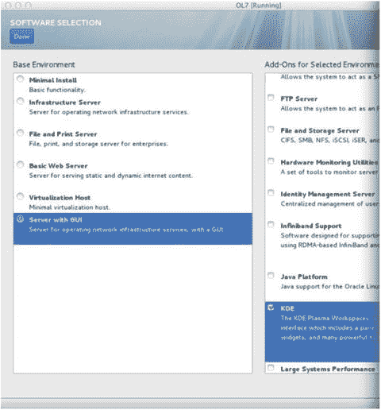

# 第 13 章:为 Oracle 数据库优化 Linux

公司正在从大型 IBM、HP 或 Sun 硬件迁移到运行 Linux 的商用硬件。凭借价格合理的 18 核英特尔芯片，公司可以运行大量的 Linux 计算节点，而成本只是 IBM、HP 和 Sun 上的企业 UNIX 服务器的一小部分。事实证明，Linux 拥有坚如磐石的操作系统，提供了与 IBM AIX、惠普/UX 和 Sun Solaris 等 UNIX 操作系统类似的极高可靠性。通过适当的优化，Linux 可以像它的同类产品一样扩展，甚至可以更快地运行 Oracle 数据库。想象一下数据库云服务器 X5-2 配置上的单个计算节点。它配有 36 个 CPU 内核和高达 768GB 的物理内存。如果您为四分之一机架运行 2 节点 RAC，您可以利用 72 个核心的处理能力和大约 1.5TB 的内存。

优化 Linux 操作系统是 Oracle 数据库服务器不可或缺的一部分。拥有一个调优的 Linux 引擎对数据库性能至关重要。公司将最佳实践和优化整合到 Linux 构建的参考架构中。您将专注于为 Oracle 创建一个精简、安全的 Linux 基础设施，该基础设施将在每次构建中保持一致。

为 Oracle 数据库设计一个设计良好的 Linux 架构是成功的关键因素。本章将为 Oracle 数据库的 Linux 参考体系结构奠定最佳基础。您将了解如何从内存角度优化 Linux，调整内核参数以获得额外的吞吐量，选择正确的 I/O 调度程序，以及增加 Oracle 的网络带宽。

## 13-1.最小化 Linux 环境以提高性能和安全性

### 问题

您希望只安装安装和配置 Oracle Database 12c 所需的软件包。

### 解决办法

在安装 Oracle 或 Red Hat Linux 的过程中，您希望选择最小安装选项。您可以从软件选择屏幕的左上角选择最小安装选项(参见图 [13-1](#Fig1) )。

图 13-1。

Software selection for Linux installation

使用最小安装方法，您只能获得 Linux 操作系统的基本功能。您将在最低限度的 Linux 安装后跟进，并利用 Oracle 12c RDBMS 服务器预安装 RPM 继续下一阶段。Oracle RDBMS 预安装 RPM 仅安装安装 Oracle 所需的一组 RPMS。除了 Oracle RDBMS 预安装 RPM 所安装的内容之外，大多数 Linux 数据库服务器不需要更多的 RPMS。

Note

有关利用 Oracle 12c RDBMS 服务器预安装 RPM 为 Oracle 数据库自动配置 Linux 服务器的信息，请查看第 11 章[。](11.html)

然后，您可以构建额外的基础设施——比如大页面、I/O 优化、网络优化和内核优化——将 Linux 优化提升到另一个层次。

### 它是如何工作的

您希望只安装最少的软件包，以便有效地限制数据库服务器上运行的各种进程的数量，并且只在数据库服务器上运行与数据库相关的进程。许多客户犯了在 Linux 服务器上安装完整 GUI 桌面的错误。尽管这种方法非常适合教育目的，但是您不应该在生产数据库服务器上安装 GUI 桌面。从性能角度来看，最少的安装有助于保持服务器的“精简和平均”此外，服务器上的内容越少，需要保护的内容就越少。当谈到修补 Linux 服务器时，安装得越少，用更新修补服务器的次数就越少。

软件较少的精简服务器通常比安装了所有软件的服务器运行得更快。例如，X-Server 或 VNC 服务器没有以最小安装安装，并且您看不到 X-Server 进程在数据库服务器上运行。同时，如果您执行`chkconfig --list`命令来查看所有具有运行级别设置的服务，那么大多数与 Oracle 无关的服务都应该被关闭。您还应该禁用数据库服务器上的 http 等服务。为了获得最佳的数据库性能，一个很好的规则是将数据库服务器进程与应用程序服务器进程分开。

在数据库服务器上，您应该在运行级别 3(带网络的多用户模式)下运行，并且永远不要在运行级别 GUI 桌面模式)下运行数据库服务器(与运行级别 3 +显示管理器相同)。默认运行级别由`/etc/inittab`文件控制。一般来说，你在后台运行的进程越少，你的情况就越好。控制运行级别的参数如下所示:

`id:3:initdefault:`

## 13-2.配置大型页面

### 问题

您希望配置 hugepages 来节省内存并提高运行在 Linux 服务器上的 Oracle 的性能。

### 解决办法

设置 hugePages 需要更改一个内核参数，并修改`/etc/securities/limits.conf`文件的两个条目。必须修改的内核参数是`/etc/sysctl.conf`文件中的`vm.nr_hugepages`。

必须调整`/etc/security/limits.conf`文件，以分别考虑 Oracle 的软限制和硬限制，从而增加最大锁定内存限制:

`oracle          soft    memlock        50331648`

`oracle          hard    memlock        50331648`

设置内核参数后，强烈建议您重新启动服务器。

### 它是如何工作的

利用 hugepages 在 Linux 服务器上提供了巨大的优势。您将通过增加翻译后备缓冲区(TLB)命中率来识别性能。大页面确保系统全局区域(SGA)组件被锁定在内存中，永远不会被换出。大页面还减少了与内核管理内核页面的簿记工作相关的开销。

假设默认的内核页面是 4KB。通过将内核页面增加到 2M，您可以有效地将需要管理的内核页面数量减少 500 倍。内核参数通常以 2MB 为单位进行设置。例如，如果分配 48GB 作为大页面大小，那么必须在`/etc/sysctl.conf`文件中将内核参数设置为 24576 (48*1024/2)。

天下没有免费的午餐:在实现大页面时，不能使用 Oracle 的自动内存管理(AMM)特性。更具体地说，Oracle 数据库的`MEMORY_TARGET`初始化参数不能使用。程序全局区(PGA)也是 AMM 的一部分，不能自动更改，所以当使用 hugepages 时，必须使用`SGA_TARGET`和`SGA_MAX_SIZE`参数。好消息是`PGA_AGGREGATE_TARGET`是一个动态参数，可以根据需要进行调整。您可以查看与 PGA 相关联的动态视图，并智能地设置该参数，如 Oracle 的 advisor view 所建议的:`V$PGA_TARGET_ADVICE`。

应该根据 Linux 服务器上每个数据库的物理内存量和 SGA 总量来设置大页面的设置。作为标准，您可以根据服务器上的物理内存量来确定服务器的大页面默认设置。默认设置只是新服务器构建的一个标准起点。为大页面分配的内存量因不同的数据库和应用程序而异。一些应用可能需要更多的 PGA 内存分配。例如，您可以为您的公司指定以下一组准则:

*   =<20GB 物理内存及以下；将为大页面配置 1/2 的物理内存
*   > 20GB 的物理内存，3/4 的物理内存将被配置用于大页面

### 自动化大页面服务器配置

这里有一个方便的脚本添加到你的军火库中，有一天它会为你节省大量宝贵的时间。无论是在新服务器上还是在具有多个数据库的现有服务器上设置 hugepages，都可以用一个 shell 脚本为服务器设置 hugepages。这个脚本`set_hugepages.ksh`接受一个命令行选项，指定您要为大页面分配的内存量(MB)。如果不指定为大页面分配的内存量，脚本将确定服务器的总物理内存，并使用由`DEFAULT_HP_PERCENTAGE`变量指定的大部分内存。当前脚本被设置为物理内存的 60%。

以下脚本的目标是确定安全限制配置文件的内核参数`vm.nr_hugepages`以及软参数和硬参数`memlock`的值:

`# cat set_hugepages.ksh`

`#!/bin/ksh`

`export HP_SIZE_MB=$1`

`DEFAULT_HP_PERCENTAGE=60`

`if [ "$HP_SIZE_MB" = "" ]; then`

`echo "HugePage Value not specified in the command-line options."`

`echo "We will set the HugePages value based on $DEFAULT_HP_PERCENTAGE % of physical memory"`

`SERVER_MEMORY_KB=$(grep ^MemTotal /proc/meminfo |sed -e ’s/[^0-9]*//g’ -e ’s/ //g’)`

`let SERVER_MEMORY_MB=$SERVER_MEMORY_KB/1024`

`echo "Server Memory: $SERVER_MEMORY_MB"`

`let DEFAULT_HP_SIZE=$SERVER_MEMORY_MB*$DEFAULT_HP_PERCENTAGE/100`

`echo "Default HugePage size based on $DEFAULT_HP_PERCENTAGE %: $DEFAULT_HP_SIZE"`

`export HP_SIZE_MB=$DEFAULT_HP_SIZE`

`fi`

`LINUX_VER=$(cat /etc/redhat-release |sed -e ’s/[^0-9]*//g’ -e ’s/ //g’)`

`echo "Linux Version is: $LINUX_VER"`

`echo ""`

`echo "Checking to see if HugePages is already set"`

`grep -i vm.nr_hugepages /etc/sysctl.conf`

`RC=$?`

`echo ""`

`function calc_hp {`

`let HP_KB=$HP_SIZE_MB*1024`

`echo "HugePages KB = $HP_KB"`

`let HP_PRESETTING=$HP_KB/2048`

`let HP_SETTING=$HP_PRESETTING+6`

`echo "HP Settings:  $HP_PRESETTING $HP_SETTING"`

`echo "New HugePage Setting for /etc/sysctl.conf"`

`echo "vm.nr_hugepages=$HP_SETTING"`

`}`

`calc_hp`

`export TMP_SYSCTL=/tmp/sysctl.conf.tmp`

`if [ "$RC" -eq 1 ]; then`

`echo "Return Code for HugePages: $RC"`

`echo "HugePages is not set!"`

`echo "# -- HugePage Setting for Oracle Databases -- #" >>/etc/sysctl.conf`

`echo "vm.nr_hugepages=$HP_SETTING" >>/etc/sysctl.conf`

`elif [ "$RC" -eq 0 ]; then`

`echo "HugePages is set..."`

`cp /etc/sysctl.conf /tmp/sysctl.conf.$$`

`cat /etc/sysctl.conf |grep -v "vm.nr_hugepages" >$TMP_SYSCTL`

`echo "vm.nr_hugepages=$HP_SETTING" >>$TMP_SYSCTL`

`cp $TMP_SYSCTL /etc/sysctl.conf`

`fi`

`let MEMLOCK_VALUE=$HP_SETTING*2048`

`cat /etc/security/limits.conf |grep -v ^# |grep -i memlock |grep -v grep 2>/dev/null`

`export MEMLOCK_RC=$?`

`if [ "$MEMLOCK_RC" -eq 0 ]; then`

`export SECURITY_LIMITS_FILE=/etc/security/limits.conf`

`else`

`export SECURITY_LIMITS_FILE=$(grep -il memlock /etc/security/limits.d/*.conf)`

`fi`

`# -- MEMLOCK has never been set so we need to find the limits.conf file`

`cat /etc/security/limits.conf |egrep -v "^#" |grep nproc`

`export NPROC_RC=$?`

`if [ "$SECURITY_LIMITS_FILE" = "" ]; then`

`if [ "$NPROC_RC" -eq 0 ]; then`

`export SECURITY_LIMITS_FILE=/etc/security/limits.conf`

`else`

`# -- We need to find the limits file for RHEL 6 directory structure`

`export SECURITY_LIMITS_FILE=$(grep -i nproc /etc/security/limits.d/* |awk -F ":" {’print $1’} |tail -1)`

`[ "$SECURITY_LIMITS_FILE" = "" ] && export SECURITY_LIMITS_FILE=/etc/security/limits.d/90-memlock.conf`

`fi`

`fi`

`export TMP_LIMITS_FILE=/tmp/limits.conf.tmp`

`#echo "Security Limits File:  $SECURITY_LIMITS_FILE"`

`cp $SECURITY_LIMITS_FILE /tmp/limits.conf.$$`

`cat $SECURITY_LIMITS_FILE |egrep -v "memlock" >$TMP_LIMITS_FILE`

`echo ""`

`echo "# -- HugePage Setting for Oracle Databases -- #" >>$TMP_LIMITS_FILE`

`echo "# -- Here’s the changes that were made to the $SECURITY_LIMITS_FILE"`

`echo "oracle soft memlock $MEMLOCK_VALUE" >>$TMP_LIMITS_FILE`

`echo "oracle hard memlock $MEMLOCK_VALUE" >>$TMP_LIMITS_FILE`

`cp $TMP_LIMITS_FILE $SECURITY_LIMITS_FILE`

`grep -i memlock $SECURITY_LIMITS_FILE`

`echo ""`

`echo "# ------------------------------------------------------- #"`

`echo "# Your system has been set for hugepages.  "`

`echo "# Please reboot your server to see the changes!"`

`echo ""`

在对当前内核参数和配置文件进行更改之前，请将文件复制到`/tmp`目录中进行备份。在覆盖原始文件之前，还需要在`/tmp`目录下创建一个扩展名为`.tmp`的临时文件。您可以从`DBAExpert.com`网站下载这个脚本。这个脚本是不断发展的，并将随着 Oracle 和 Red Hat Linux 的每一个版本而改进。

执行前面的`set_hugepages.ksh`脚本会产生以下输出:

`# ./set_hugepages.ksh`

`HugePage Value not specified in the command-line options.`

`We will set the HugePages value based on 60 % of physical memory`

`Server Memory: 3587`

`Default HugePage size based on 60 %: 2152`

`Linux Version is: 66`

`Checking to see if HugePages is already set`

`vm.nr_hugepages=15006`

`HugePages KB = 2203648`

`HP Settings:  1076 1082`

`New HugePage Setting for /etc/sysctl.conf`

`vm.nr_hugepages=1082`

`HugePages is set...`

`# -- Here’s the changes that were made to the /etc/security/limits.d/oracle-rdbms-server-12cR1-preinstall.conf`

`oracle soft memlock 2215936`

`oracle hard memlock 2215936`

`# ------------------------------------------------------- #`

`# Your system has been set for hugepages.`

`# Please reboot your server to see the changes!`

要为 hugepages 指定一个精确的值，请向脚本中传递一个以兆字节为单位的参数值:

`# ./set_hugepages.ksh 64000`

您必须重新启动服务器才能识别大量页面更改。如果您以 Oracle Linux 帐户所有者的身份登录，您可以通过键入带有`–l`选项的`ulimit`命令来确认 hugepage 设置。`–l`选项报告可以锁定到内存中的最大大小:

`# su - oracle`

`[oracle@dal66a ∼]$ ulimit -l`

`30732288`

请注意，`ulimit –l`的值与安全限制配置文件中的软值和硬值`memlock`相匹配。

### 计算现有 Linux 服务器上巨大页面的价值

Oracle Support 提供了一个漂亮的 shell 脚本，用于计算运行一个或多个 Oracle 数据库的服务器的总页数。简而言之，该脚本将通过汇总所有共享内存段来计算当前数据库服务器的 HugePages/HugeTLB 配置的推荐值。请查看 shell 脚本以计算推荐的针对 Linux 的巨大页面/HugeTLB 配置(文档 ID 401749.1)。

您可以复制并粘贴名为`hugepages_settings.sh`的脚本，并在已经运行了现有数据库的服务器上执行。该脚本依赖于这样一个事实，即数据库正在运行，并且数据库已经分配了使用`ipcs –m`命令可见的共享内存。该脚本还假设数据库没有在 AMM 模式下运行。下面是`hugepages_settings.sh`脚本的输出示例:

`$ ./hugepages_setting.sh`

`This script is provided by Doc ID 401749.1 from My Oracle Support`

`(`[`http://support.oracle.com`](http://support.oracle.com/)T2】

`the recommended HugePages/HugeTLB configuration for the current shared`

`memory segments. Before proceeding with the execution please note following:`

`* For ASM instance, it needs to configure ASMM instead of AMM.`

`* The ’pga_aggregate_target’ is outside the SGA and`

`you should accommodate this while calculating SGA size.`

`* In case you changes the DB SGA size,`

`as the new SGA will not fit in the previous HugePages configuration,`

`it had better disable the whole HugePages,`

`start the DB with new SGA size and run the script again.`

`And make sure that:`

`* Oracle Database instance(s) are up and running`

`* Oracle Database 11g Automatic Memory Management (AMM) is not setup`

`(See Doc ID 749851.1)`

`* The shared memory segments can be listed by command:`

`# ipcs -m`

`Press Enter to proceed...`

`Recommended setting: vm.nr_hugepages = 603`

### 禁用透明大页面

Red Hat 和 Oracle Linux 6 有一个新特性叫做透明大页面(THP)，默认情况下是启用的。THP 旨在简化情景应用程序的大页面配置，因为对于 Oracle 新手情景应用程序来说，手动配置大页面可能很困难。大页面是在引导时分配的，通常用于 Oracle 数据库的高度静态内存分配。内核中的`khugepaged`线程可以在运行时动态设置 THP。

对于 Oracle 数据库，Oracle 建议通过执行以下命令在数据库服务器上禁用 THP:

`# echo never > /sys/kernel/mm/transparent_hugepage/enabled`

请参考 Oracle 文档“ALERT:Disable Transparent huge pages on SLES 11、RHEL6、OL6 和 UEK2 内核”(文档 ID 1557478.1)。要永久禁用透明的大页面，将`transparent_hugepage=never`添加到`/etc/grub.conf`中的内核引导行，然后重启服务器:

`# cat /etc/grub.conf`

`# grub.conf generated by anaconda`

`#`

`# Note that you do not have to rerun grub after making changes to this file`

`# NOTICE:  You have a /boot partition.  This means that`

`#          all kernel and initrd paths are relative to /boot/, eg.`

`#          root (hd0,0)`

`#          kernel /vmlinuz-version ro root=/dev/mapper/vg_rac01-lv_root`

`#          initrd /initrd-[generic-]version.img`

`#boot=/dev/sda`

`default=2`

`timeout=5`

`splashimage=(hd0,0)/grub/splash.xpm.gz`

`hiddenmenu`

`title Oracle Linux Server Red Hat Compatible Kernel (2.6.32-358.23.2.el6.x86_64.debug)`

`root (hd0,0)`

`kernel /vmlinuz-2.6.32-358.23.2.el6.x86_64.debug ro root=/dev/mapper/vg_rac01-lv_root rd_NO_LUKS rd_LVM_LV=vg_rac01/lv_root LANG=en_US.UTF-8 rd_NO_MD SYSFONT=latarcyrheb-sun16  rd_LVM_LV=vg_rac01/lv_swap  KEYBOARDTYPE=pc KEYTABLE=us rd_NO_DM rhgb quiet numa=off transparent_hugepage=never crashkernel=auto`

`initrd /initramfs-2.6.32-358.23.2.el6.x86_64.debug.img`

`title Oracle Linux Server Unbreakable Enterprise Kernel (3.8.13-16.2.1.el6uek.x86_64)`

`root (hd0,0)`

`kernel /vmlinuz-3.8.13-16.2.1.el6uek.x86_64 ro root=/dev/mapper/vg_rac01-lv_root rd_NO_LUKS rd_LVM_LV=vg_rac01/lv_root LANG=en_US.UTF-8 rd_NO_MD SYSFONT=latarcyrheb-sun16 rd_LVM_LV=vg_rac01/lv_swap  KEYBOARDTYPE=pc KEYTABLE=us rd_NO_DM rhgb quiet numa=off transparent_hugepage=never`

`initrd /initramfs-3.8.13-16.2.1.el6uek.x86_64.img`

`title Oracle Linux Server Red Hat Compatible Kernel (2.6.32-431.el6.x86_64)`

`root (hd0,0)`

`kernel /vmlinuz-2.6.32-431.el6.x86_64 ro root=/dev/mapper/vg_rac01-lv_root rd_NO_LUKS rd_LVM_LV=vg_rac01/lv_root LANG=en_US.UTF-8 rd_NO_MD SYSFONT=latarcyrheb-sun16 crashkernel=auto rd_LVM_LV=vg_rac01/lv_swap  KEYBOARDTYPE=pc KEYTABLE=us rd_NO_DM rhgb quiet numa=off transparent_hugepage=never`

`initrd /initramfs-2.6.32-431.el6.x86_64.img`

或者，您可以在/etc/rc.local 文件中添加以下行，以便在引导时禁用 THP。

`[ -f /sys/kernel/mm/transparent_hugepage/enabled ] && echo never > /sys/kernel/mm/transparent_hugepage/enabled`

`[ -f /sys/kernel/mm/transparent_hugepage/defrag ] &&  echo never > /sys/kernel/mm/transparent_hugepage/defrag`

## 13-3.启用巨型帧

### 问题

您希望增加专用网络传输单元上的数据包大小，以提高网络性能。您还希望在专用网络上启用巨型帧，以优化 NFS 或 iSCSI 存储性能。

### 解决办法

要在 Linux 服务器上启用巨型帧，作为`root`用户，执行`ifconfig`命令将新的 MTU 设置为`9000`:

`# ifconfig eth0 mtu 9000`

修改特定于网络接口的网络接口配置文件，以使更改永久生效。以下示例说明，通过在网络接口文件的末尾添加参数行`MTU=9000`，您可以永久设置巨型帧:

`# cat /etc/sysconfig/network-scripts/ifcfg-eth0`

`DEVICE=eth0`

`IPADDR=10.0.0.100`

`NETMASK=255.255.255.0`

`ONBOOT=yes`

`BOOTPROTO=none`

`USERCTL=no`

`VLAN=yes`

`MTU=9000`

对网络接口配置文件进行更改后，您必须通过执行`ifdown`和`ifup`命令来重启网络接口，在本例中为`eth0`:

`# ifdown eth0`

`# ifup eth0`

或者，您可以使用`service network restart`命令重启所有网络接口。通常，您必须与网络工程师协调巨型帧配置。必须在交换机上启用巨型交换机支持，并且如果在源和目标数据库服务器之间有多个交换机，则必须启用所有交换机来支持巨型帧。`ping`命令将测试源和目标主机名或 IP 之间的端到端连接。

为操作系统和网络交换机启用巨型帧后，使用`-M`、`do`和`-s`选项执行简单的`ping`测试，以端到端测试巨型帧连接性:

`$ ping -M do -s 8972 -c 2 dalrac01a-priv`

`$ ping -M do -s 8972 -c 2 dalrac01b-priv`

`$ ping -M do -s 8972 -c 2 dalrac02a-priv`

`$ ping -M do -s 8972 -c 2 dalrac02b-priv`

`PING dalrac01a (10.17.33.31) 8972(9000) bytes of data.`

`8980 bytes from dalrac01a-priv (10.17.33.31): icmp_seq=1 ttl=64 time=0.017 ms`

`8980 bytes from dalrac01a-priv (10.17.33.31): icmp_seq=2 ttl=64 time=0.018 ms`

`-s`选项指定数据包大小。您可以向网络指定仅 8，972 字节的数据包大小。剩余的 28 个字节组成了报头信息:20 个字节的 IP 报头信息和 8 个字节的 ICMP 报头数据。发送大于 8972 字节的数据包会导致`ping`命令出错。如果您没有用`–s`选项指定数据包大小，您将发送`ping`命令的默认数据包大小，它恰好是 56 字节，没有 ICMP 报头数据或 IP 报头字节。该示例还指定了`-c`选项，只发送两次`ping`命令的迭代。

一般建议为 RAC 配置的专用网络接口启用巨型帧。当您处理 NFS 或 iSCSI 磁盘时，在与 NFS 或 iSCSI 流量专用网络相关的网络上设置巨型帧可以显著提高性能。

您可以利用带有`healthcheck`选项的`cluvfy`命令来验证 RAC 数据库服务器上是否配置了巨型帧。当您检查最佳实践(包括巨型帧的设置)时，您还可以利用`healthcheck`选项和`–bestpractice`选项。

下面是带有`healthcheck`和`–bestpractice`选项的`cluvfy`命令的一小段语法和高级输出:

`$ cluvfy comp healthcheck -collect cluster -bestpractice -deviations`

`Verifying OS Best Practice`

`Verifying Hardware Clock synchronization at shutdown ...warning`

`Verifying Clusterware Best Practice\`

`Verifying Ethernet Jumbo Frames ...warning`

`Verifying disk free space for Oracle Clusterware home "/u01/app/12.1.0/grid"passed`

`...`

`...`

`...`

### 它是如何工作的

简而言之，巨型帧是指有效负载最大传输单元(MTU)超过 1，500 字节的以太网帧。使用巨型帧，您可以有效地将以太网帧的大小从 IEEE 802 规范的 1，500 字节增加到 9，000 字节。当集群互连或并行查询引擎等应用程序发送大于 1，500 字节的消息时，消息会从一个端点到另一个端点被分割成 1，500 字节或更小的帧。通过将 MTU 大小设置为 9，000 字节，可以提高网络吞吐量性能；因为数据包越大，所以通过网络发送的应用程序数据数据包就越少，从而加快了传输速度，减少了发送和接收服务器的 CPU 开销。

应将巨型帧作为 Oracle RAC 互连标准的一部分来启用。如前所述，巨型帧的配置必须端到端启用。不正确地做它会导致次优的性能。巨型帧不仅仅用于 RAC 其他使用案例包括在 NFS 甚至 iSCSI 协议上运行 Oracle 数据库文件。增加在 NFS 或 iSCSI 上运行的数据库的巨型帧可以显著提高性能。如果您的 RMAN 备份到分布式 NFS，您肯定应该从数据库服务器和网络连接存储(NAS)服务器运行巨型帧。

确保您正在运行 Oracle 的直接 NFS，以最大限度地发挥所有性能和配置优势。对于 RAC 互连流量，使用巨型帧正确配置的网络接口可以降低 TCP 和 UDP 开销，从而提高性能。当必须将大型消息分解为标准以太网的较小帧时，会产生这种开销。如果您使用 10GB (gigE)或更高的网络接口，正确设置巨型帧尤为重要。

## 13-4.确定和实施正确的 I/O 调度程序

### 问题

您希望通过选择正确的 I/O 调度程序来最大限度地发挥 Oracle 数据库的 I/O 潜力。

### 解决办法

从 Red Hat/Oracle Linux 5 开始，您可以动态修改块设备的 I/O 调度程序，而无需重新启动服务器。为了获得最佳性能，Oracle 建议为大量 I/O 密集型请求使用的设备使用截止时间调度程序。强烈建议 Oracle 数据库使用截止时间调度程序，以实现更高的吞吐量和更低的延迟。对于闪存盘或固态硬盘(SSD)，将 I/O 调度程序设置为`noop`。通过操作`/sys/block/BLOCKDEVICE_NAME/queue/scheduler`目录的内容，您可以动态地将 I/O 调度程序设置为`deadline`。作为`root`或特权用户，对每个磁盘执行以下命令:

`# echo deadline > /sys/block/BLOCKDEVICE1/queue/scheduler`

`# echo deadline > /sys/block/BLOCKDEVICE2/queue/scheduler`

服务器重新启动后，使用前面的语法为块设备设置 I/O 调度程序将不再有效。通过将闪存盘和固态硬盘的引导参数`elevator=deadline`或`elevator=noop`设置为`/etc/grub/grub.conf`中的活动内核，可以使更改永久化。这里有一个示例`grub.conf file`，演示了如何在服务器启动时设置配置:

`default=0`

`timeout=5`

`splashimage=(hd0,0)/grub/splash.xpm.gz`

`hiddenmenu`

`title Red Hat Enterprise Linux Server (2.6.18-238.el5)`

`root (hd0,0)`

`kernel /vmlinuz-2.6.18-238.el5 ro root=/dev/VolGroup00/LogVol00 rhgb quiet elevator=deadline`

`initrd /initrd-2.6.18-238.el5.img`

如果您运行的是 Oracle Unbreakable Enterprise Kernel(UEK)，I/O deadline scheduler 的`/etc/grub.conf`设置会自动设置为默认设置。

可以利用以下一行脚本来验证磁盘是否配置了正确的 I/O 调度程序。从输出中可以看出，块设备设置了截止时间调度程序:

`$ find /sys/block/*/queue -name scheduler -exec sh -c ’echo -n "$0 : "; cat $0’ {} \; |tail -10`

`/sys/block/sda/queue/scheduler : noop anticipatory [deadline] cfq`

`/sys/block/sdb/queue/scheduler : noop anticipatory [deadline] cfq`

`/sys/block/sdc/queue/scheduler : noop anticipatory [deadline] cfq`

`/sys/block/sdd/queue/scheduler : noop anticipatory [deadline] cfq`

`/sys/block/sde/queue/scheduler : noop anticipatory [deadline] cfq`

`/sys/block/sdf/queue/scheduler : noop anticipatory [deadline] cfq`

`/sys/block/sdg/queue/scheduler : noop anticipatory [deadline] cfq`

`/sys/block/sdh/queue/scheduler : noop anticipatory [deadline] cfq`

`/sys/block/sdi/queue/scheduler : noop anticipatory [deadline] cfq`

`/sys/block/sr0/queue/scheduler : noop anticipatory deadline [cfq]`

### 它是如何工作的

有了 Red Hat 和 Oracle Linux，不同的 I/O 调度程序可以在 Oracle 数据库工作负载繁重的情况下提供更好的性能。Red Hat 附带的默认 I/O 调度程序是完全公平队列(CFQ)调度程序，它在延迟和吞吐量之间提供了一个很好的折衷。Oracle UEK 附带的默认 I/O 调度程序是截止时间调度程序。noop I/O 调度程序非常适合固态硬盘或基于闪存的系统，在这些系统中，读/写磁头已被证明不会影响应用性能。预期 I/O 调度程序类似于截止期调度程序。虽然它是启发式的，可以提高性能，但也会降低性能。使用截止期 I/O 调度程序，对延迟进行了硬性限制，并保证了请求的启动服务时间。

对于在 VMware 等虚拟化环境中运行的数据库，一般建议将 I/O 调度程序设置为 noop。在虚拟化基础架构中，虚拟机管理程序还执行 I/O 调度和优化。您不希望虚拟机管理程序和来宾操作系统(VM)都执行 I/O 调度；来宾操作系统应该将 I/O 调度交给虚拟机管理程序。

## 13-5.为 Oracle 数据库设置相关的内核参数

### 问题

您希望优化相关的 Linux 内核参数，以便有效地运行 Oracle 数据库。

### 解决办法

这个方法在`/etc/sysctl.conf`文件中检查与 Oracle 数据库相关的内核参数。在您的环境中，如果建议的内核参数值高于下面列出的值，您不应该降低该值。范围值(如`net.ipv4.ip_local_port_range`或`/proc/sys/net/ipv4/ip_local_port_range`)应该匹配。

`/proc/sys/net/ipv4/ip_local_port_range`值定义了 TCP 和 UDP 流量使用的本地端口范围。您必须用两个数字设置这个参数:第一个数字表示服务器上允许 TCP 和 UDP 通信的第一个本地端口，第二个数字表示最后一个本地端口。在 Oracle 以前的版本中，`net.ipv4.ip_local_port_range`的推荐值是 1024 和 65500。

应该根据数据库服务器上的物理内存量来调整`SHMMAX`等参数。例如，您通常应该告诉客户，一个好的开始数字是物理内存的 1/2 或 2/3 或更多，这取决于他们有多少物理内存、他们有多少 PGA 以及他们期望的专用服务器进程的数量。`SHMALL`也是基于物理 RAM 大小/页面大小得出的。关键要提的是，`SHMMAX`的值是以字节为单位设置的，而`SHMMALL`的值是以页为单位设置的。要确定系统的页面大小，执行`getconf`，如下所示:

`# getconf PAGE_SIZE`

`4096`

在下面的示例中，您选择在一台内存为 256GB 的服务器上为`SHMALL`分配大约 66%的物理内存(大约 170GB)。您可以使用下面的等式得出`SHMALL`值:

`1024 * 1024 * 1024 * 170 /4096`

`kernel.shmall=44564480`

下面是 Oracle-RDBMS-server-12cr 1-预安装 RPM 修改的内核参数的完整列表:

`# Controls the maximum number of shared memory segments, in pages`

`kernel.shmall = 4294967296`

`# oracle-rdbms-server-12cR1-preinstall setting for fs.file-max is 6815744`

`fs.file-max = 6815744`

`# oracle-rdbms-server-12cR1-preinstall setting for kernel.sem is ’250 32000 100 128’`

`kernel.sem = 250 32000 100 128`

`# oracle-rdbms-server-12cR1-preinstall setting for kernel.shmmni is 4096`

`kernel.shmmni = 4096`

`# oracle-rdbms-server-12cR1-preinstall setting for kernel.shmall is 1073741824 on x86_64`

`# oracle-rdbms-server-12cR1-preinstall setting for kernel.shmmax is 4398046511104 on x86_64`

`kernel.shmmax = 4398046511104`

`# oracle-rdbms-server-12cR1-preinstall setting for net.core.rmem_default is 262144`

`net.core.rmem_default = 262144`

`# oracle-rdbms-server-12cR1-preinstall setting for net.core.rmem_max is 4194304`

`net.core.rmem_max = 4194304`

`# oracle-rdbms-server-12cR1-preinstall setting for net.core.wmem_default is 262144`

`net.core.wmem_default = 262144`

`# oracle-rdbms-server-12cR1-preinstall setting for net.core.wmem_max is 1048576`

`net.core.wmem_max = 1048576`

`# oracle-rdbms-server-12cR1-preinstall setting for fs.aio-max-nr is 1048576`

`fs.aio-max-nr = 1048576`

`# oracle-rdbms-server-12cR1-preinstall setting for net.ipv4.ip_local_port_range is 9000 65500`

`net.ipv4.ip_local_port_range = 9000 65500`

您必须根据 SGA 的要求调整`SHMALL`和`SHMMAX`的设置。Oracle-RDBMS-server-12cr 1-pre install RPM 设置的其他内核设置应该足以满足大多数数据库服务器的需求。如果您有大量并发专用会话的需求，您可能需要调整`semmsl`和`semmns`的设置。

### 它是如何工作的

您将重点关注该配方解决方案中提到的参数列表。表 [13-1](#Tab1) 提供了 Oracle 数据库的所有相关内核参数:

表 13-1。

Pertinent Kernel Parameters for Oracle Databases

<colgroup><col> <col></colgroup> 
| 内核参数 | 描述 |
| --- | --- |
| `kernel.shmall` | 表示 4Kb 页面中的最大总共享内存。 |
| `fs.file-max` | 表示打开文件的最大数量。 |
| `kernel.sem` | 有四个参数(按顺序):`SEMMSL`、`SEMMNS`、`SEMOPM`和`SEMMNI`:`semmsl`指定每组的最大信号量。`semmns`指定信号量的最大数量。`semopm`指定每个`semop`调用的最大操作数。`semmni`指定信号量集的最大数量。 |
| `kernel.shmmni` | 表示共享内存段的最大数量。 |
| `kernel.shmmax` | 表示单个共享内存段的最大大小。我们建议起始值为物理内存大小的 1/2 或 2/3(以字节为单位),在一些较大的企业服务器上可以高达 90%。 |
| `net.core.rmem_default` | 表示默认的操作系统接收缓冲区大小。 |
| `net.core.rmem_max` | 表示最大操作系统接收缓冲区大小。 |
| `net.core.wmem_default` | 表示默认的操作系统发送缓冲区大小。 |
| `net.core.wmem_max` | 表示最大操作系统发送缓冲区大小。 |
| `fs.aio-max-nr` | 表示并发未完成 I/O 请求的总数。 |
| `net.ip_local_port_range` | 表示用于客户端连接的端口范围。 |

对于 Oracle 数据库 11g 及以上版本，在`/etc/sysctl.conf file`中设置以下网络相关内核参数:

*   `net.core.rmem_default`至`262144`
*   `net.core.wmem_default`至`262144`
*   `net.core.rmem_max`至`4194304`
*   `net.core.wmem_max`至`1048576`

在 Linux 中，内核被设计成超量使用超过其物理内存的内存，以使内存使用更加有效。当包括磁盘交换空间在内的所有可用内存都被耗尽时，过量使用模式有时会出现问题。当达到这种状态时，内核将开始终止进程以保持运行。Linux 内存不足(OOM)杀手的工作就是牺牲一个或多个进程来为系统释放内存。

对于 Red Hat/Oracle Linux 5 客户来说，设置`vm.min_free_kbytes`内核参数以防止 OOM 杀手条件非常重要。在本例中，您将把这个值设置为 51200KB (50 MB)，这将告诉内核始终保留 50 MB 的内存。要将这些新设置激活到运行内核空间中，请以`root`的身份运行`sysctl –p`命令。

对于 Red Hat/Oracle Linux 6 客户，设置`panic_on_oops`内核参数。当内核崩溃或遇到致命错误时，您将会遇到服务器的潜在问题。如果该参数设置为`0`，内核将尝试继续运行。如果该参数设置为`1`，内核将进入紧急状态并关机/重启。作为`root`用户，执行以下命令:

`# echo 1 > /proc/sys/kernel/panic_on_oops`

要使这个内核参数永久改变，修改`/etc/sysctl.conf`文件并添加以下条目:

`kernel.panic_on_oops = 1`

优化虚拟内存需要更改一组内核参数，这些参数通过影响 Oracle 数据库消耗和释放虚拟内存的速率来影响 Oracle 数据库的性能:`vm.swappiness`、`vm.dirty_background_ratio`、`vm.dirty_ratio`、`vm.dirty_expire_centisecs`和`vm.dirty_writeback_centisecs`。

一些企业 Linux SAs 不喜欢禁用交换的想法。`vm.swappiness`参数决定了内存页面交换到磁盘的积极性。取值范围为 0-100，默认值为`60`。该值越大，当物理内存处于非活动状态时，换出物理内存的速度越快。我们建议将`vm.swappiness`参数设置为`0`。对于 Red Hat 6，Oracle 建议的值是`0`。您可以使用诸如`top`、`mem`和`vmstat`等本地命令来监控交换空间的使用情况。

`vm.dirty_background_ratio`参数指定页面数量，以百分比表示，在该数量时`pdflush`后台写回守护程序将开始写出脏数据。默认值为`10`；甲骨文推荐的值是`3`。

`vm.dirty_ratio`参数规定了页面的数量，以占总页面的百分比表示，在该数量时，生成磁盘写入的进程开始写出脏数据。这是应用程序磁盘写入创建的脏页将被刷新到磁盘的比率。默认值为`20`；Oracle 建议的值是`80`。

`vm.dirty_expire_centisecs`参数指示脏的内存数据何时足够旧，可以由内核刷新线程写出。下次刷新程序线程唤醒时，将写出早于此参数值的内存中脏数据。默认值是`3000`，以百分之一秒表示。

`vm.dirty_writeback_centisecs`参数规定了将脏内存数据写入磁盘的时间间隔。默认值是`500`，以百分之一秒表示。甲骨文推荐值是`100`。

在`/etc/sysctl.conf`文件中，可以为数据库服务器设置以下 Linux 内核参数:

`vm.swappiness = 0`

`vm.dirty_background_ratio = 3`

`vm.dirty_ratio = 80`

`vm.dirty_expire_centisecs = 500`

`vm.dirty_writeback_centisecs = 100`

对于不同的数据库工作负载，您可以根据需要调整这些内核参数。

## 13-6.为 Oracle 配置 NTP

### 问题

您希望配置网络时间协议(NTP)来保持服务器时钟与所有服务器同步。

### 解决办法

您应该通过启用`ntp`守护进程来同步 RAC 节点之间的系统时间，甚至是主数据库服务器和备用数据库服务器的系统时间，守护进程应该使用`–x`选项进行配置，以接受逐渐的时间变化，也称为回转。对于 RAC 来说，`slewonly`选项是必需的，对于 data guard 配置来说也是推荐选项。要用`–x`选项设置`ntp`，修改`/etc/sysconfig/ntpd`文件，将所需的标志添加到`OPTIONS`变量，然后用`service ntpd restart`命令重启服务:

`# Drop root to id ’ntp:ntp’ by default.`

`#OPTIONS="-u ntp:ntp -p /var/run/ntpd.pid -g"`

`OPTIONS="-x -u ntp:ntp -p /var/run/ntpd.pid"`

`# SYNC_HWCLOCK=no`

一些 s a 选择通过 cron 中的一个调度作业执行`nptdate`命令来更新系统时钟，这将对系统时钟进行强力更新。如果系统时钟相差 40 分钟，时间会立即得到校正。对于 RAC 环境，用`ntpdate`设置系统时钟可能会导致问题。当时间瞬间停止或检测到时间的突然变化时，NTP 会导致节点驱逐。

在使用`slewonly`选项修改了`ntpd`文件之后，您必须将文件推送到所有数据库服务器:

`# for i in rac02 rac03 rac04; do scp ntpd ${i}:$PWD; done`

`ntpd                                          100%  255     0.3KB/s   00:00`

`ntpd                                          100%  255     0.3KB/s   00:00`

`ntpd                                          100%  255     0.3KB/s   00:00`

您可以通过检查进程状态和过滤`ntp`守护进程来检查您当前的 NTP 配置。在下面的例子中，`ntpd`服务启动，并使用`ps`命令检查以确认设置是否正确:

`[root@rac1 sysconfig]# service ntpd start`

`Starting ntpd:                                             [  OK  ]`

`[root@rac1 sysconfig]# ps -ef |grep -i ntp`

`ntp       3496     1  0 10:38 ?        00:00:00 ntpd -x -u ntp:ntp -p /var/run/ntpd.pid`

`root      3500  2420  0 10:39 pts/1    00:00:00 grep -i ntp`

为主机上的时间同步设置 NTP 进程，以便在服务器重新启动后重新启动。启用`ntpd`守护进程后，执行`chkconfig`命令来验证它是否设置为在适当的运行级别启动:

`# chkconfig ntpd on`

`# chkconfig --list|grep ntpd ntpd`

`0:off 1:off 2:on 3:on 4:on`

### 它是如何工作的

数据库服务器之间的时间一致性对于管理、故障排除、运行和调试数据库事件的各个方面都至关重要，因为一切都以时间为中心。您必须确保在查看事件和日志文件时有一个参考点。您必须使用 NTP 维护准确的系统时钟，以便应用程序服务器和数据库服务器之间的操作系统时间相同。如果您还利用数据库链接，您必须确保源服务器和远程服务器的时间是同步的。

从 Oracle Clusterware 11g 第 2 版(11.2)开始，Oracle 为无法利用 NTP 服务的 Oracle 客户提供了另一个时间同步选项:Oracle 集群时间同步服务(`ctssd`)。如果您利用 NTP，Oracle `ctssd`仅在观察者模式下启动。如果不利用 NTP，`ctssd`会以主动模式启动，并跨所有 RAC 节点同步时间。如果您计划利用`ctssd`，使用以下命令停用 NTP:

`# service ntpd stop`

`# chkconfig ntpd off`

要确认`ctss`守护进程(`ctssd`)的工作模式，请使用以下命令:

`$ crsctl check ctss`

## 13-7.绑定网络接口

### 问题

您希望将两个网络接口卡(NIC)配对，以增加带宽并提供高可用性。

### 解决办法

本菜谱回顾了组合多个网络接口(称为通道绑定或以太网绑定)为数据库服务器提供冗余的过程。绑定网卡等同于端口中继，相对简单。首先，您必须配置 Linux bond 驱动程序。比如在 Red Hat 5 中，必须修改`/etc/modprobe.conf`文件才能启用绑定驱动。对于红帽 6，必须修改`/etc/modprobe.d/bonding.conf`文件。您必须在`modprobe.conf`文件中为每个逻辑接口添加如下所示的条目:

`alias bond0 bonding alias bond1 bonding`

`options bonding miimon=100 mode=1`

模式值`0`表示您想要一个平衡的循环调度。模式值`1`表示您想要一个用于故障保护的活动备份，其中在给定时间只有一个从接口是活动的。不同的从机接口仅在活动从机出现故障时才变为活动。模式值`5`指定您想要一个自适应传输负载平衡。传出的传输将被分配给每个从接口的负载。如果其中一台设备出现故障，另一台设备将承担责任并完成网络请求。这种配置很受欢迎，因为不需要网络交换机支持。`100`的`miimon`值以毫秒为单位指定了检查链路故障的时间。

在这个特定的解决方案中，您将添加两个绑定接口:一个用于专用互连，另一个用于公共网络。你也有四个网络接口:`eth0`、`eth1`、`eth2`和`eth3`。

如果您以前没有绑定网络接口，很可能绑定模块没有加载到内核中。作为 root，从`/lib/modules/ uname -r/kernel/drivers/net/bonding`目录执行`insmod bonding.ko`命令，将模块插入内核。为了确认绑定模块已经加载，您可以利用`lsmod`命令连接到`grep`命令，如下所示，以提供内核中模块的状态:

`# lsmod |grep -i bonding`

`bonding     65128  0`

一旦您确认绑定模块已经加载到内核中，您就可以通过在`/etc/sysconfig/network-scripts`目录中创建或修改两个配置文件来配置逻辑接口:`ifcfg-bond0`和`ifcfg-bond1`。专用网络的`ifcfg-bond0`条目如下所示:

`DEVICE=bond0`

`IPADDR=192.168.1.20`

`NETWORK=192.168.1.0`

`NETMASK=255.255.255.0`

`USERCTL=no`

`BOOTPROTO=none`

`ONBOOT=yes`

您必须修改`ifcfg-eth0`和`ifcfg-eth1`文件，它们是`ifcfg-bond0`的网卡。首先用这些设置修改`ifcfg-eth0`文件:

`DEVICE=eth0`

`USERCTL=no`

`ONBOOT=yes`

`MASTER=bond0`

`SLAVE=yes`

`BOOTPROTO=none`

类似地，您可以修改`ifcfg-eth1`文件，使其看起来如下所示:

`DEVICE=eth1`

`USERCTL=no ONBOOT=yes MASTER=bond0`

`SLAVE=yes`

`BOOTPROTO=none`

现在，您必须重复前面描述的过程，为公共网络接口配置`ifcfg-bond1`接口。`ifcfg-bond1`接口文件必须如下所示:

`DEVICE=bond1`

`IPADDR=72.99.67.100`

`NETWORK=72.99.67.0`

`NETMASK=255.255.255.0`

`USERCTL=no`

`BOOTPROTO=none`

`ONBOOT=yes`

`ifcfg-bond0`和`ifcfg-bond1`的主要区别是`IPADDR`、`NETWORK`和`NETMASK`线。创建`ifcfg-bond1`文件后，您可以继续修改`ifcfg-eth3`和`ifcfg-eth4`文件。您可以创建类似于`ifcfg-eth0`和`ifcfg-eth1`的这两个文件，并相应地修改`DEVICE`和`MASTER`的名称。

要启用新配置的绑定网络，您必须退回网络服务。您可以使用服务网络`stop`命令关闭所有接口。作为最后一步，您必须通过执行服务网络`start`命令来启动绑定的网络接口。

### 它是如何工作的

Linux 内核附带了一个绑定模块，它提供了 NIC 绑定功能。内核绑定模块将多个物理接口组合成一个逻辑接口。

绑定或配对网络是 RAC 的一个重要概念。未绑定的网络接口是单点故障。正如 RAC 的所有其他组件都是为冗余而构建的一样，网络基础架构也必须如此。

在`/etc/modprobe.conf`文件中，您指定了`options bonding miimon=100 mode=1`。`miimon`参数代表媒体无关接口监视器，代表链路监控的频率。`miimon`的值以毫秒(ms)为单位，默认设置为`0`，并被禁用。

`mode`参数指定要部署的配置类型。默认值`0`表示将实施循环策略，每个接口将轮流为请求提供服务。您可以使用循环策略来实现负载平衡。值`1`表示将部署一个活动的备份策略。在主动备份策略中，绑定中只有一个从设备是主动的。在任何给定时刻，只有一个设备会进行传输。值`6`表示自适应负载平衡。

在`ifcfg-eth[x]`文件中，`MASTER`参数表示特定 NIC 所属的逻辑接口。`SLAVE`参数表示参与的网卡是绑定接口的成员。一只`SLAVE`只能属于一个主人。

## 13-8.启用网络服务缓存守护程序(nscd)

### 问题

您希望使`nscd`能够更好地容忍与 NAS 设备或 NFS 挂载点相关的网络故障。

### 解决办法

要启用`ncsd`，首先修改`/etc/nscd.conf`配置文件。您必须通过将`enable-cache`行修改为`no`来禁用`passwd`、`group`和`netgroup`的`nscd`选项，如下所示:

`# cat /etc/nscd.conf |grep enable-cache |grep -v \^# |sort -k3`

`enable-cache      netgroup   no`

`enable-cache      group      no`

`enable-cache      passwd     no`

`enable-cache      services   yes`

`enable-cache      hosts      yes`

作为`root`或特权用户，用`service start nscd`命令启动`nscd`服务。您必须通过发出以下`chkconfig`命令使`nscd`在系统重启时启动:

`# chkconfig –level 345 nscd on`

为了确认`nscd`已启用，发出带有`–g`参数的`nscd`命令，打印当前的配置统计数据。要查看`nscd`的所有有效选项，请传递`-?`参数。

如果您执行了最小操作系统安装，您必须使用以下`yum`命令手动安装`nscd`:

`# yum –y install nscd`

### 它是如何工作的

`nscd`是一个小内存守护进程，为最常见的名称服务请求提供了一个缓存工具。当你遇到网络故障时，`nscd`可以帮上忙，只需要最小的改动就可以启用`ncsd`。Oracle 数据库服务器可以承载大量基于网络的工作负载，并在 NFS 或集群环境中执行大量名称查找。目标是减少服务请求的延迟，并减少对使用`nscd`的共享基础设施的影响。使用 DNS、NIS、NIS+和 LDAP 等命名服务时，您还可以期待性能提升。

## 13-9.正确对齐磁盘分区

### 问题

许多 DBA 并不知道他们必须在数据库磁盘上创建一个分区。正确对齐的分区可以提高数据库工作负载的性能。

### 解决办法

有几种技术可以正确配置分区对齐:`parted`、`fdisk`或`sfdisk`。在本例中，您将关注于`parted`分区编辑器，在一个 LUN 上创建一个分区，用于存放 Oracle 的数据库文件。

Note

在 Oracle Database 11g 中，Oracle ASM 磁盘的最大大小不能超过 2TB。从 Oracle Database 12c 开始，对于 8MB 的分配大小(AU ), ASM 磁盘的最大大小可以达到 32pb。对于其他 AU 大小，最大 ASM 磁盘大小为:1MB AU 大小为 4PB，2MB AU 大小为 8PB，4MB AU 大小为 16PB。

您将看到使用`parted`命令的例子，因为`parted`可以处理大于 2TB 的磁盘大小。关于利用`sfdisk`命令的例子，请访问 [`http://www.dbaexpert.com/blog/partition-alignment-with-sfdisk/`](http://www.dbaexpert.com/blog/partition-alignment-with-sfdisk/) 。您可以使用`parted`命令添加、删除、克隆或修改磁盘上的分区。这个例子用 GNU `parted`可执行文件创建了 1MB 的分区对齐:

`# /sbin/parted -s /dev/sdb mklabel gpt mkpart /dev/sdb1 asm1 2048s 32.0GB`

在前面的示例中，传递了相当多的参数。您从`–s`选项开始，它指定您想要编写命令行选项的脚本，而不是交互式提示。您还可以传递您正在操作的设备名，后跟标签类型的`gpt`值，这是 GUID 分区表。`mklabel`选项为分区表创建一个新的磁盘标签。`mkpart`选项告诉`parted`命令在指定的设备名称上创建一个分区，并给出该分区的文件系统类型、起始点和结束点。起点和终点可以是扇区或兆字节。参数 2048s 代表 2048s 个扇区，这相当于 1MB，因为每个扇区代表 512 个字节。在本例中，您选择创建一个大小为 32GB 的分区。在您的环境中，您可能会创建最大 LUN 大小的分区。

为 ASM 磁盘创建分区后，仔细检查设置，确保分区对齐设置正确。要检查现有设备上的分区对齐情况，请使用以下命令:

`# /sbin/parted -s /dev/sdb print`

`Model: VMware, VMware Virtual S (scsi)`

`Disk /dev/sdb: 34.4GB`

`Sector size (logical/physical): 512B/512B`

`Partition Table: gpt`

`Number  Start   End     Size    File system  Name       Flags`

`1049kB  32.0GB  32.0GB               /dev/sdb1`

### 它是如何工作的

未对齐的 ASM 磁盘可能会导致 Oracle 数据库工作负载的性能不佳。默认情况下，在 Linux 上，前 63 个块是为主引导记录(MBR)保留的。第一个数据分区从 31.5KB 的偏移量开始，这是从 63 个数据块乘以 512 个字节得到的。31.5KB 的偏移量可能会导致许多存储阵列的内存缓存或 RAID 配置出现错位情况，从而由于 I/o 重叠而导致性能不佳。对于 Oracle 数据库，您希望分区偏移量为 1MB 或 4MB。

最重要的是，使用`parted`而不是`fdisk`甚至`sfdisk`，因为可以用`parted`为大于 2TB 的磁盘创建分区。在 Oracle Database 12c 之前，您可以灵活地使用`sfdisk`，因为 ASM LUN 的大小不能超过 2TB。从 Oracle Database 12c 开始，取消了对 LUN 大小的 2TB 限制，您必须开始迁移到诸如`parted`之类的命令。