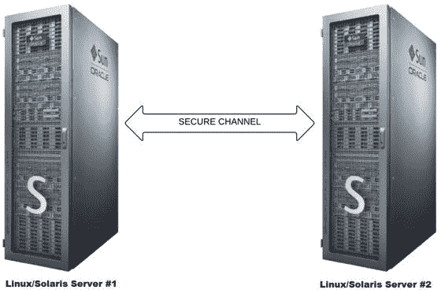
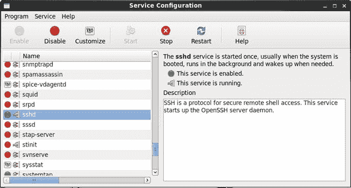

# 十四、在网络上安全地工作

安全通信是一个问题，尤其是在人们之间共享机密和重要信息时。例如，第二次世界大战期间，英国首相温斯顿·丘吉尔和美国总统富兰克林·d·罗斯福共享重要的军事信息，如军队调动。为了保护他们通过电话进行的语音对话，SIGSALY(又名青蜂侠)被设计成使用密钥进行加密和解密。

今天，我们无法想象有人不担心网络安全。即使是不太懂技术的人也应该关注。例如，如果您的银行网络不安全，黑客窃取了您的银行账号和 PIN，该怎么办？同样，DBA 在办公室或家中工作时，可能希望连接到位于远程地理位置的 Linux/Solaris 服务器或大楼中的另一个房间。如果一名 DBA 正在访问敏感数据，而他的同事在偷听，该怎么办？

为了解决这些网络安全问题，1995 年诞生了 SSH 的第 1 版，但是一年后，为了增强安全性，它被第 2 版所取代。SSH 是一种网络协议，其中加密数据使用计算机之间的安全通道在网络中传输，如图 [14-1](#Fig1) 所示。`ssh`协议取代了旧的网络协议(`telnet`、`rlogin`和`rsh`),`scp`命令取代了`rcp`命令。旧的协议和命令被替换，因为它们缺乏安全特性；只是最初设计时没有考虑到这一点。

图 14-1。

SSH connection

本章主要讨论如何通过 SSH 安全地登录到远程 Linux/Solaris 服务器。它还讨论了如何生成服务器的 SSH 主机密钥，如何使用 SSH 公钥代替用户名密码进行身份验证，以及如何在 Linux/Solaris 服务器之间安全地复制文件。

## 14-1.设置 SSH

### 问题

您希望配置 SSH，以便能够与远程 Linux/Solaris 服务器建立安全且加密的连接。

### 解决办法

在配置 SSH 之前，请确保您拥有所需的包:`openssh`、`openssh-server`、`openssh-clients`和`openssh-askpass`。您可以通过运行`rpm`命令来验证服务器上安装的 SSH 软件包，如下所示:

`# rpm -qa | grep -i openssh`

`openssh-5.3p1-94.el6.x86_64`

`openssh-clients-5.3p1-94.el6.x86_64`

`openssh-server-5.3p1-94.el6.x86_64`

`openssh-askpass-5.3p1-94.el6.x86_64`

Note

运行`ssh -V`命令检查服务器上安装的 SSH 的类型和版本。

在连接到远程 Linux/Solaris 服务器之前，SSH 守护进程服务器(`sshd`)必须正在运行。您可以如下运行`sshd`:

`# service sshd start`

`Starting sshd:                                          [ OK ]`

您也可以通过调用以下脚本来运行`sshd`，该脚本与前面的命令调用的脚本相同:

`# /etc/rc.d/init.d/sshd start`

`Starting sshd:                                          [ OK ]`

但是，如果`sshd`已经启动，您可以如下所示重新启动它。另一种方法是发出命令`/etc/rc.d/init.d/sshd restart`:

`# service sshd restart`

`Stopping sshd:                                          [ OK ]`

`Starting sshd:                                          [ OK ]`

对于 Solaris，发出以下命令来启用`ssh`服务，如下所示:

`# svcadm enable network/ssh`

要禁用`ssh`服务，发出以下命令:

`# svcadm disable network/ssh`

之后，运行以下命令来验证`ssh`服务是在线还是离线:

`# svcs -v ssh`

为了让`sshd`在 Linux 服务器重启时自动启动，您需要激活`sshd`。您可以使用`chkconfig`、`ntsysv`或`system-config-services`激活`sshd`。

对于`chkconfig`命令，使用`--level`选项并提供您希望`sshd`启动的运行级别。以下命令表示`sshd`被配置为在运行级别 2、3、4 和 5 启动:

`# chkconfig --level 2345 sshd on`

Note

关于 Linux 系统`V init`运行级别的讨论，请参考[第 11 章](11.html)。

对于`ntsysv`命令，也使用`--level`选项并指定`sshd`启动的运行级别。如果没有指定运行级别，`sshd`将仅在当前运行级别被激活。以下命令运行`ntsysv`，仅影响运行级别 3 和 5:

`# ntsysv --level 35`

Note

您也可以通过运行 OS `setup`命令并从菜单中选择系统服务，通过文本模式设置实用程序启动`ntsysv`。

启动`ntsysv`命令后，会出现文本控制台服务配置工具屏幕，如图 [14-2](#Fig2) 所示。使用箭头键向下滚动导航，直到光标位于`sshd`上。方括号内的星号(`*`)表示服务的状态为活动；空方括号表示它不活动。(您可以按空格键将状态切换为活动或不活动。)要保存更改，请单击 Tab 键突出显示 Ok 按钮，然后按 Enter 键。

图 14-2。

Launching the `ntsysv` command

激活`sshd`的另一种方法是运行`system-config-services`命令；您可以按如下方式启动该工具:

`# /usr/sbin/system-config-services`

启动`system-config-services`后，会出现基于 GUI 的服务配置工具，如图 [14-3](#Fig3) 所示。向下滚动到`sshd`服务，选中旁边的复选框将其激活。在这个对话框中，您还可以选择启动、停止和重启`sshd`服务。您还可以检查状态和 PID。

图 14-3。

Launching `system-config-services`

### 它是如何工作的

默认情况下，所需的 SSH 软件包包含在主要的 Linux/Solaris 发行版中。否则，您可以从任何 Linux/Solaris 软件包下载站点下载它们，例如 [`http://www.openssh.com`](http://www.openssh.com/) 。

一旦 SSH 软件包安装在远程 Linux/Solaris 服务器上，您就可以激活并运行`sshd`守护进程，它应该准备好接受 SSH 连接了。但是，您可以进行一些更改，比如修改默认端口号，让`sshd`监听这个端口号。

Note

Linux/Solaris 服务器将监听的默认 SSH 端口号是 22。要更改默认的 SSH 端口号，请修改`/etc/ssh/sshd_config`文件中参数`Port`的值。

`/etc/ssh/sshd_config`文件是 Linux/Solaris 服务器上的 SSH 系统级配置文件，这是您希望通过 SSH 连接的计算机。`/etc/ssh/ssh_config`文件是 SSH 客户机的配置文件，它是您启动 SSH 的计算机。如果您对`/etc/ssh/sshd_config`文件做了一些更改，您必须通过运行`service sshd reload`来重新加载`sshd`，如下所示:

`[root@BLLNX2 stage]# service sshd reload`

`Reloading sshd:                                         [ OK ]`

你也可以运行`service sshd restart`命令；另一种方法是停止并启动`sshd`服务，这将给出相同的结果，如下所示:

`# service sshd stop`

`Stopping sshd:                                          [ OK ]`

`# service sshd start`

`Starting sshd:                                          [ OK ]`

对于 Solaris，运行以下命令:

`# svcadm disable network/ssh`

`# svcadm enable network/ssh`

要验证`sshd`配置为启动的运行级别，运行带有`--list`选项的`chkconfig`命令。如此处所示，`sshd`被设置为在运行级别 2、3、4 和 5 上启动:

`# chkconfig --list sshd`

`sshd            0:off   1:off   2:on    3:on    4:on    5:on    6:off`

一旦`sshd`正在运行，发出下面的 OS 命令来验证相应的`sshd`进程是否正在运行。如果没有结果，这意味着`sshd`还没有运行。所以你必须运行`service sshd start`命令来手动启动`sshd`:

`# ps -ef | grep -v grep | grep ssh`

`root       4025    1  0 16:32 ?        00:00:00 /usr/sbin/sshd`

Note

要禁止`root`用户通过 SSH 登录，请在`/etc/ssh/sshd_config`文件中将参数`PermitRootLogin`设置为`no`。一旦非`root`用户通过 SSH 成功登录到 Linux/Solaris 服务器，他们就可以运行`su - root`命令或运行`sudo`命令。

## 14-2.正在生成主机密钥

### 问题

远程 Linux/Solaris 服务器的 SSH 主机密钥丢失、损坏，或者在安装 SSH 软件包时或第一次运行时没有生成。您想要生成一个新的 SSH 主机密钥。

### 解决办法

要生成 Linux/Solaris 服务器的新 SSH 主机密钥，请以`root`身份登录并运行带有`-t`选项的`ssh-keygen`命令，该选项指示要生成的密钥类型。您必须提供`-f`选项，后跟密钥文件的文件名。如果省略`-f`选项，它将为 OS 帐户`root`创建公钥，而不是 Linux/Solaris 服务器上的 SSH 主机密钥。

以下示例为 RSA 类型生成 SSH 主机密钥。如果 SSH 主机密钥的文件已经存在，系统会询问您是否要覆盖它们。

接下来，要求您提供密码:

`root@BLSOL02:∼# ssh-keygen -t rsa -f /etc/ssh/ssh_host_rsa_key`

`Generating public/private rsa key pair.`

`/etc/ssh/ssh_host_rsa_key already exists.`

`Overwrite (yes/no)? yes`

`Enter passphrase (empty for no passphrase):`

`Enter same passphrase again:`

`Your identification has been saved in /etc/ssh/ssh_host_rsa_key.`

`Your public key has been saved in /etc/ssh/ssh_host_rsa_key.pub.`

`The key fingerprint is:`

`03:bc:53:70:ff:d2:c8:f5:2d:2e:6d:07:3d:3d:1a:66 root@BLSOL02`

要为 DSA 类型生成 SSH 主机密钥，请运行以下命令:

`root@BLSOL02:∼# ssh-keygen -t dsa -f /etc/ssh/ssh_host_dsa_key`

`Generating public/private dsa key pair.`

`/etc/ssh/ssh_host_dsa_key already exists.`

`Overwrite (yes/no)? yes`

`Enter passphrase (empty for no passphrase):`

`Enter same passphrase again:`

`Your identification has been saved in /etc/ssh/ssh_host_dsa_key.`

`Your public key has been saved in /etc/ssh/ssh_host_dsa_key.pub.`

`The key fingerprint is:`

`ee:0d:88:61:1a:27:20:2e:69:27:7b:bc:70:de:a2:5c root@BLSOL02`

Note

出于安全原因，我们建议您在创建 SSH 主机密钥时提供一个密码。这可以防止非`root`用户通过运行带有`-y`选项的`ssh-keygen`偷看 SSH 主机密钥(下一节将详细讨论)。

### 它是如何工作的

SSH 主机密钥就像一个主密钥，可以加密和解密远程 Linux/Solaris 服务器和客户端计算机之间传输的数据，您可以从客户端计算机启动 SSH 连接。这保护了您与远程 Linux/Solaris 服务器的连接，并消除了遭受中间人攻击的漏洞。

当创建新的 SSH 主机密钥时，您必须提供与 SSH 版本和加密算法类型(RSA 或 DSA)相对应的密钥类型。RSA 和 DSA 都支持一些安全方法和不同的加密算法。在安全性方面，DSA 和 RSA 在使用相同长度的密钥进行比较时是相似的。然而，加密和解密的速度没有明显的赢家。

SSH 主机密钥的有效值为`rsa1`、`rsa`、`dsa. rsa1`是指 SSH 版本 1 (SSHv1)的 RSA`rsa`和`dsa`是针对 SSH 版本 2 (SSHv2)的。

Note

如果您的 Linux/Solaris 服务器只支持 SSHv2，请在`/etc/ssh/sshd_config`中将参数`Protocol`的值设置为`2`。

要创建 RSA 主机密钥，运行带有`-t rsa`选项的`ssh-keygen`，这将创建两个文件:`/etc/ssh/ssh_host_rsa_key`和`/etc/ssh/ssh_host_rsa_key.pub`。对于 DSA 主机密钥，使用`-t dsa`选项运行`-keygen`，这将创建`/etc/ssh/ssh_host_dsa_key`和`/etc/ ssh/ssh_host_dsa_key.pub`。`ssh_host_rsa_key`和`ssh_host_dsa_key`都包含私钥和公钥，而`ssh_host_rsa_key.pub`和`ssh_host_dsa_key.pub`只包含公钥。公钥用于加密数据；私钥用于解密数据。

第一次登录远程 Linux/Solaris 服务器(即通过 SSH 连接的计算机)时，系统会提示您确认服务器的 SSH 主机密钥指纹，如下所示。如果您接受它，文件`$HOME/.ssh/known_hosts`将在本地 Linux/Solaris 服务器上创建，这是您启动 SSH 连接的计算机。`$HOME/.ssh/known_hosts`包含服务器的 SSH 主机密钥。

`oracle@BLSOL01:∼$ ssh BLSOL02`

`The authenticity of host ’blsol02 (192.168.2.42)’ can’t be established.`

`RSA key fingerprint is 03:bc:53:70:ff:d2:c8:f5:2d:2e:6d:07:3d:3d:1a:66.`

`Are you sure you want to continue connecting (yes/no)? yes`

`Warning: Permanently added ’blsol02,192.168.2.42’ (RSA) to the list of known hosts.`

`Password:`

`Last login: Thu Aug 20 23:59:50 2015 from ol6-121-rac1`

`Oracle Corporation      SunOS 5.11      11.2    June 2014`

`oracle@BLSOL02:∼$`

要确定远程 Linux/Solaris 服务器上的 SSH 密钥指纹，请运行带有`-l`选项的`ssh-keygen`命令，如下所示。它验证您是否拥有想要通过 SSH 连接的远程 Linux/Solaris 服务器的正确 SSH 主机密钥指纹。

`root@BLSOL02:∼# ssh-keygen -l -f /etc/ssh/ssh_host_dsa_key.pub`

`1024 ee:0d:88:61:1a:27:20:2e:69:27:7b:bc:70:de:a2:5c /etc/ssh/ssh_host_dsa_key.pub`

`root@BLSOL02:∼#`

`root@BLSOL02:∼# ssh-keygen -l -f /etc/ssh/ssh_host_rsa_key.pub`

`2048 03:bc:53:70:ff:d2:c8:f5:2d:2e:6d:07:3d:3d:1a:66 /etc/ssh/ssh_host_rsa_key.pub`

同时，要确定远程 Linux/Solaris 服务器上的 SSH 主机密钥，运行带有`-y`选项的`ssh-keygen`命令，如下所示。出于安全原因，可能会要求您提供创建 SSH 主机密钥时提供的密码。

`root@BLSOL02:∼# ssh-keygen -y -f /etc/ssh/ssh_host_dsa_key`

`ssh-dss AAAAB3NzaC1kc3MAAACBAJ2G5jV/4MHg9dG4DNb13Wrh94kbN5yUDQeW5SOP0JCzCQVpS2BnsV53L6CUQUPiNilXCqiLVMGaJmm+GSNL4Z82zAvNekTihXa1XabdAN7hBWccaxzH7ppmNbexiZVE/63aKIN+QnsjZ+cFbrqgDN9/10O8DKVM7AJQbyaPDbOrAAAAFQCmFbD9ei01XVMKkOzvqOpp4SwqXQAAAIBNRewVPbCM/p2GZ4PlepXnY2EtbeUZ8WFe15gEfrTwk9lDVh1M2RBs5NRqzHe3JNNddln116fhr++tFK2/xOtG9bNbWfIUEO++gULfYDqn1Ir17L7MZ3gK1KeELyJqtbkZKs2Ne/SA0oaZeJC0CMbi8Vs6ESkdMoSq34xbceDeugAAAIBc4ZWy840UAb7EURncb9KJg9wLFXfYpy7XubGGXhgfsw/z4Uect++kP8QpSYY3QynCzJ4ix3FpOyMKx4VShXKxQcYEMCNx5mnNOiLk/YmEfyeZI/pNR7WIixvQQIj0JObjQRzdz2T+K3Y83S8f522N76dNVBgJmCbW0SalhwqoIw==`

`root@BLSOL02:∼#`

`root@BLSOL02:∼# ssh-keygen -y -f /etc/ssh/ssh_host_rsa_key`

`ssh-rsa AAAAB3NzaC1yc2EAAAABIwAAAQEAs/WovKxUpZw8T03HoH4dOlYGLzQ9bbfqayRd8Me33odUzKc8loUhOAdck7ySzaU3fd0Y+OYt1V/CN7wKo2qKowknf2K9JDsPyztSlSZi5FcT2WU6uDlb0FnEg+VAad83ETfDQQ+Ei2s5tV24n+QKAJd7qiAImITTfC55D/ftxpdKZL+m4Meupva6rTiagsLc7fiR4w6FYtuNI3oqaxElDuhJ3675XoTTF3FzhUj0spj4ZLZ6nkN3mYTVyAfrrjzeHDG6N59B6O46C2zW9hCW3e0ZQ3g1sQlDaE/hScErd4JoLR8F2VnWlrj0MQx+4328/p5C668LdPzULEuNEzXNPQ==`

在您的本地客户端计算机上，运行`tail`命令，如下所示。检查 SSH 主机密钥，它包含在`ssh-rsa`或`ssh-dsa`之后的字符，并将它们与`ssh-keygen -y`选项的结果进行比较。

`oracle@BLSOL01:∼$ tail -1 $HOME/.ssh/known_hosts`

`blsol02,192.168.2.42 ssh-rsa AAAAB3NzaC1yc2EAAAABIwAAAQEAs/WovKxUpZw8T03HoH4dOlYGLzQ9bbfqayRd8Me33odUzKc8loUhOAdck7ySzaU3fd0Y+OYt1V/CN7wKo2qKowknf2K9JDsPyztSlSZi5FcT2WU6uDlb0FnEg+VAad83ETfDQQ+Ei2s5tV24n+QKAJd7qiAImITTfC55D/ftxpdKZL+m4Meupva6rTiagsLc7fiR4w6FYtuNI3oqaxElDuhJ3675XoTTF3FzhUj0spj4ZLZ6nkN3mYTVyAfrrjzeHDG6N59B6O46C2zW9hCW3e0ZQ3g1sQlDaE/hScErd4JoLR8F2VnWlrj0MQx+4328/p5C668LdPzULEuNEzXNPQ==`

但是，当远程 Linux/Solaris 服务器具有重复的主机名或 IP 地址时，您将在下次登录时看到以下错误消息:

`[root@ol6-121-rac1 ∼]# ssh oracle@BLSOL01`

`@@@@@@@@@@@@@@@@@@@@@@@@@@@@@@@@@@@@@@@@@@@@@@@@@@@@@@@@@@@`

`@    WARNING: REMOTE HOST IDENTIFICATION HAS CHANGED!     @`

`@@@@@@@@@@@@@@@@@@@@@@@@@@@@@@@@@@@@@@@@@@@@@@@@@@@@@@@@@@@`

`IT IS POSSIBLE THAT SOMEONE IS DOING SOMETHING NASTY!`

`Someone could be eavesdropping on you right now (man-in-the-middle attack)!`

`It is also possible that the DSA host key has just been changed.`

`The fingerprint for the DSA key sent by the remote host is`

`8d:fa:39:1e:36:a7:6a:b1:87:ea:63:1a:c0:84:4a:3d.`

`Please contact your system administrator.`

`Add correct host key in /root/.ssh/known_hosts to get rid of this message.`

`Offending key in /root/.ssh/known_hosts:6`

`DSA host key for blsol01 has changed and you have requested strict checking.`

`Host key verification failed.`

要解决这个问题，您可以重命名`$HOME/.ssh/known_hosts`，但这并不可取，因为您将丢失对其他服务器的 SSH 主机密钥的引用。另一种解决方法是编辑`$HOME/.ssh/known_hosts`,删除与您希望通过 SSH 连接的远程 Linux/Solaris 服务器的主机名或 IP 地址以及 SSH 主机密钥类型相对应的条目。在您编辑`$HOME/.ssh/known_hosts`之前，我们建议您制作该文件的另一个副本。

## 14-3.安全登录

### 问题

您希望通过安全且加密的连接登录到远程 Linux/Solaris 服务器。

### 解决办法

在本地服务器上，运行`ssh`命令，后跟您想要连接的远程 Linux/Solaris 服务器的主机名或 IP 地址。然后，在远程 Linux/Solaris 服务器上提供相应操作系统用户的密码。

在以下示例的第一行中，操作系统提示符`oracle@BLSOL01:∼$`指示操作系统用户名为`oracle`，该用户名登录到本地 Linux/Solaris 服务器`BLSOL01`。下面的`ssh`命令连接到远程 Linux/Solaris 服务器`BLSOL02`，并登录到相同的操作系统用户名`oracle`。然后提示您提供远程 Linux/Solaris 服务器上操作系统用户的密码`BLSOL02`:

`oracle@BLSOL01:∼$ ssh BLSOL02`

`Password:`

`Last login: Wed Aug 19 18:13:50 2015 from blsol01`

`Oracle Corporation      SunOS 5.11      11.2    June 2014`

`oracle@BLSOL02:∼$`

成功登录后，您可以验证自己是否已经在远程 Linux/Solaris 服务器中。在以下示例中，操作系统提示显示您现在以服务器`BLSOL02`上的`oracle`身份登录。但是，您可以运行操作系统命令`echo $HOSTNAME`和`echo $USER`，如下所示，分别显示 Linux/Solaris 服务器的主机名和操作系统用户名:

`oracle@BLSOL02:∼$ echo $HOSTNAME`

`BLSOL02`

`oracle@BLSOL02:∼$ echo $USER`

`oracle`

`oracle@BLSOL02:∼$`

### 它是如何工作的

在本地服务器上运行`ssh`之前，确保已经安装了`open-ssh`和`openssh-clients`包。否则，您可以从任何 Linux/Solaris 软件包下载站点下载它们，如 [`http://www.openssh.com`](http://www.openssh.com/) 。

要从另一台 UNIX/Linux 计算机或 Mac OS 连接到远程 Linux/Solaris 服务器，请运行`ssh`命令。如果您从 Windows 启动 SSH 连接，我们建议您使用 PuTTY 软件，如方法 1-1 所示。另一个选择是下载并安装 OpenSSH for Windows。

首次通过 SSH 登录远程 Linux/Solaris 服务器时，系统会提示您确认远程 Linux/Solaris 服务器的 SSH 主机密钥指纹，如下所示。一旦您接受了 SSH 主机密钥指纹，就会在本地 Linux/Solaris 服务器的`$HOME/.ssh/known_hosts`中添加一行，其中包含远程 Linux/Solaris 服务器的主机名、IP 地址和 SSH 主机密钥。

`oracle@BLSOL01:∼$ ssh BLSOL02`

`The authenticity of host ’blsol02 (192.168.2.42)’ can’t be established.`

`DSA key fingerprint is 8d:fa:39:1e:36:a7:6a:b1:87:ea:63:1a:c0:84:4a:3d.`

`Are you sure you want to continue connecting (yes/no)? yes`

`Warning: Permanently added ’blsol02,192.168.2.42’ (DSA) to the list of known hosts.`

`Password:`

`Last login: Wed Aug 19 18:18:37 2015 from blsol01`

`Oracle Corporation      SunOS 5.11      11.2    June 2014`

`oracle@BLSOL02:∼$`

Note

您可以运行`ssh-keygen -l -f /etc/ssh/ssh_host_rsa_key`和`ssh-keygen -y -f /etc/ssh/ssh_host_rsa_key`命令来验证服务器的 SSH 主机密钥指纹和 SSH 主机密钥。

要在连接到远程 Linux/Solaris 服务器时登录到不同的操作系统用户，您需要添加`-l`选项，后跟用户名，如下所示。注意，第一行的提示是`oracle@BLSOL01:∼$`，所以当前的 OS 用户名是`oracle`，主机名是`BLSOL01`。最后一行提示是`[bslopuz@BLSOL02 ∼]$`，显示你现在以远程服务器`BLSOL02`的用户名`bslopuz`登录:

`oracle@BLSOL01:∼$ ssh -l bslopuz BLSOL02`

`Password:`

`Last login: Wed Aug 19 15:59:33 2015 from 192.168.2.101`

`Oracle Corporation      SunOS 5.11      11.2    June 2014`

`bslopuz@BLSOL02:∼$`

另一种使用不同于当前登录用户名的用户名进行连接的方法是运行`ssh bslopuz@BLSOL0`命令，其中`username`和`hostname`与`@`字符连接，如下所示:

`oracle@BLSOL01:∼$ ssh bslopuz@BLSOL02`

`Password:`

`Last login: Wed Aug 19 18:24:15 2015 from blsol01`

`Oracle Corporation      SunOS 5.11      11.2    June 2014`

`bslopuz@BLSOL02:∼$`

默认情况下，SSH 守护进程服务器(`sshd`)监听端口号 22。如果远程 Linux/Solaris 服务器上的`/etc/ssh/sshd_config`中的参数`Port`指向的不是 22，那么在运行`ssh`命令时，您必须添加`-p`选项，后跟正确的 SSH 端口号，如下所示:

`oracle@BLSOL01:∼$ ssh -p 51 ol6-121-rac1`

`oracle@ol6-121-rac1’s password:`

`Last login: Wed Aug 19 18:30:37 2015 from blsol01`

`[oracle@ol6-121-rac1 ∼]$`

Note

如果您想在远程 Linux/Solaris 服务器上运行 X Window 应用程序，请运行带有`-X`选项的`ssh`命令。有关通过 SSH 运行 X Window 应用程序的更多信息，请参考配方 15-5。

如果不能通过 SSH 连接到远程 Linux/Solaris 服务器，运行`ping`命令，如下所示。它验证您是否直接连接到 Linux/Solaris 服务器。`ping`命令的`-c3`选项意味着它将只向远程 Linux 服务器发送三次请求。

`[oracle@ol6-121-rac1 ∼]$ ping -c3 BLSOL01`

`PING BLSOL01 (192.168.2.41) 56(84) bytes of data.`

`64 bytes from BLSOL01 (192.168.2.41): icmp_seq=1 ttl=255 time=0.452 ms`

`64 bytes from BLSOL01 (192.168.2.41): icmp_seq=2 ttl=255 time=0.245 ms`

`64 bytes from BLSOL01 (192.168.2.41): icmp_seq=3 ttl=255 time=0.209 ms`

`--- BLSOL01 ping statistics ---`

`3 packets transmitted, 3 received, 0% packet loss, time 2001ms`

`rtt min/avg/max/mdev = 0.209/0.302/0.452/0.107 ms`

对于 Solaris 服务器，我们建议使用`ping`命令的`–s`选项，该选项将持续向远程服务器发送数据包，如下所示:

`oracle@BLSOL01:∼$ ping -s BLSOL02`

`PING BLSOL02: 56 data bytes`

`64 bytes from BLSOL02 (192.168.2.42): icmp_seq=0\. time=0.520 ms`

`64 bytes from BLSOL02 (192.168.2.42): icmp_seq=1\. time=0.379 ms`

`64 bytes from BLSOL02 (192.168.2.42): icmp_seq=2\. time=0.290 ms`

`64 bytes from BLSOL02 (192.168.2.42): icmp_seq=3\. time=0.228 ms`

`64 bytes from BLSOL02 (192.168.2.42): icmp_seq=4\. time=0.251 ms`

`64 bytes from BLSOL02 (192.168.2.42): icmp_seq=5\. time=0.195 ms`

`^C`

`----BLSOL02 PING Statistics----`

`6 packets transmitted, 6 packets received, 0% packet loss`

`round-trip (ms)  min/avg/max/stddev = 0.195/0.310/0.520/0.121`

但是，如果您在连接到远程 Linux/Solaris 服务器之前通过代理服务器，我们建议您使用 PuTTY 软件，因为它很容易配置代理服务器设置(请参考方法 1-1)。如果远程 Linux/Solaris 服务器位于防火墙之后，请咨询您的 SA，查看相应的 SSH 端口号是否打开。

要监控通过 SSH 连接到远程 Linux 服务器的操作系统用户，请检查`/var/log/secure`文件，如下所示。该日志文件提供重要信息，例如特定操作系统用户登录的日期和时间、启动 SSH 连接的主机名或 IP 地址，以及显示您可能无法登录的原因的相关消息。

`[root@ol6-121-rac1 ∼]# tail -f /var/log/secure`

`Aug 19 19:17:01 ol6-121-rac1 su: pam_unix(su-l:session): session opened for user oracle by (uid=0)`

`Aug 19 19:17:02 ol6-121-rac1 su: pam_unix(su-l:session): session closed for user oracle`

`Aug 19 19:17:04 ol6-121-rac1 sshd[5330]: Accepted password for oracle from 192.168.2.42 port 38569 ssh2`

`Aug 19 19:17:04 ol6-121-rac1 sshd[5330]: pam_unix(sshd:session): session opened for user oracle by (uid=0)`

`Aug 19 19:17:20 ol6-121-rac1 sshd[5330]: pam_unix(sshd:session): session closed for user oracle`

Note

要对 SSH 连接进行故障排除，请运行带有`-v`选项的`ssh`命令来显示调试消息。要获得更多的调试消息，请使用`-vvv`选项。我们还建议您查看一下`/var/log/secure`和`/var/log/messages`文件。

## 14-4.安全复制文件

### 问题

您希望通过安全和加密的连接在 Linux/Solaris 服务器之间复制文件。

### 解决办法

运行`scp`命令，通过 SSH 在 Linux/Solaris 服务器之间复制文件。要运行`scp`命令，请提供源文件和目标文件。这些文件可以位于本地和/或远程 Linux/Solaris 服务器中。在下面的例子中，`/home/oracle/temp/ccf_output01.log`文件被从服务器`BLSOL01`复制到服务器`BLSOL02`上的同一个目录。将提示您输入远程 Linux/Solaris 服务器上用户名的密码:

`oracle@BLSOL01:∼$ scp /export/home/oracle/temp/ccf_output01.log BLSOL02:/export/home/oracle/temp`

`Password:`

`ccf_output01.log     100% |*****************************| 14956       00:00`

Note

`sftp`命令是另一种在 Linux/Solaris 服务器之间安全传输文件的协议。然而，我们排除了`sftp`命令的例子，因为`sftp`协议还不是互联网标准。

### 它是如何工作的

与使用`ssh`命令类似，首次运行`scp`命令通过 SSH 将文件安全地复制到远程 Linux/Solaris 服务器时，系统会提示您确认远程 Linux/Solaris 服务器的 SSH 主机密钥指纹，如下所示。接受 SSH 主机密钥指纹后，本地 Linux/Solaris 服务器的`$HOME/.ssh/known_hosts`中将添加一行，其中包含远程 Linux/Solaris 服务器的主机名、IP 地址、密钥类型和 SSH 主机密钥。

`oracle@BLSOL01:∼$ scp /export/home/oracle/temp/ccf_output01.log BLSOL02:/export/home/oracle/temp`

`The authenticity of host ’blsol02 (192.168.2.42)’ can’t be established.`

`DSA key fingerprint is 8d:fa:39:1e:36:a7:6a:b1:87:ea:63:1a:c0:84:4a:3d.`

`Are you sure you want to continue connecting (yes/no)? yes`

`Warning: Permanently added ’blsol02,192.168.2.42’ (DSA) to the list of known hosts.`

`Password:`

`ccf_output01.log     100% |*****************************| 14956       00:00`

Note

`scp`命令取代了`rcp`命令，因为后者不是在 Linux/Solaris 服务器之间复制文件的安全方式，尤其是当数据在互联网上传输时。我们建议您使用`scp`命令来保护您的关键数据。

下面是`scp`命令的语法。主机名可以是不同的 Linux/Solaris 服务器。如果没有定义主机名，文件将被复制到同一个本地 Linux/Solaris 服务器。本地和远程 Linux/Solaris 服务器的用户名可能不同。

`scp [<option>] [source_user@]source_host:]source_file`

`[[target_user@]target_host:]target_file`

表 [14-1](#Tab1) 显示了`scp`命令的常用选项。您可以运行`man scp`来确定其他选项。

表 14-1。

Common Options of `scp` Command

<colgroup><col> <col></colgroup> 
| [计]选项 | 意义 |
| --- | --- |
| `P` | 保留源文件的权限和日期时间戳。 |
| `P` | 获取远程 Linux/Solaris 服务器的 SSH 端口号。 |
| `Q` | 隐藏进度指示器。 |
| `R` | 递归复制所有子目录及其文件。 |
| `v` | 显示调试消息。 |

要递归复制所有文件和目录，使用`-r`选项。以下命令会将本地服务器`BLSOL01`的`$HOME/temp1`的所有文件和子目录复制到远程 Linux/Solaris 服务器`BLSOL02`的`$HOME`目录下:

`oracle@BLSOL01:∼$ scp -r $HOME/temp1 BLSOL02:$HOME`

`Password:`

`ol6-121-rac1.localdo 100% |*****************************|    54       00:00`

`test03.txt           100% |*****************************|     0       00:00`

`ccf_output01.log     100% |*****************************| 14956       00:00`

`test02.txt           100% |*****************************|     0       00:00`

`test01.txt           100% |*****************************|    29       00:00`

类似于使用`cp`命令，您可以使用通配符，如星号(`*`)来复制选定的文件。以下命令将把远程 Linux/Solaris 服务器`BLSOL02`上目录`$HOME/temp1`中扩展名为`txt`的所有文件复制到本地 Linux/Solaris 服务器`BLSOL01`上的目录`$HOME/temp2`中:

`oracle@BLSOL01:∼$ scp BLSOL02:$HOME/temp1/*.txt $HOME/temp2`

`Password:`

`ol6-121-rac1.localdo 100% |*****************************|    54       00:00`

`test01.txt           100% |*****************************|    29       00:00`

`test02.txt           100% |*****************************|     0       00:00`

`test03.txt           100% |*****************************|     0       00:00`

Note

PuTTY 还提供了一个`pscp.exe`客户端，可以安全地将文件从 Microsoft Windows 环境复制到 UNIX/Linux 环境。你可以从 PuTTY 的下载页面下载`pscp.exe`。

## 14-5.通过公钥进行身份验证

### 问题

当通过 SSH 连接时，您希望登录到远程 Linux/Solaris 服务器。您希望使用公钥而不是键入操作系统密码来进行身份验证。

### 解决办法

在下面的例子中，操作系统用户名`oracle`当前登录到本地 Linux/Solaris 服务器`BLSOL01`，并将登录到远程 Linux/Solaris 服务器`BLSOL02`。执行以下步骤，使用公钥进行身份验证，而不是提示输入密码:

On the local Linux/Solaris server `BLSOL01`, run the `ssh-keygen` command with the `-t rsa` option to generate the RSA public key or with `-t dsa` for the DSA public key. If the files of the RSA and DSA keys already exist, you will be asked whether you want to overwrite them. If no, you can skip this step, but ensure that you remember their passphrases because you will need them later. If yes, you are prompted to provide the passphrase, which is used to access the newly created private key. Afterward, the names of the private and public key files and key fingerprints are displayed. `oracle@BLSOL01:∼$ /usr/bin/ssh-keygen -t rsa` `Generating public/private rsa key pair.` `Enter file in which to save the key (/export/home/oracle/.ssh/id_rsa):` `Enter passphrase (empty for no passphrase):` `Enter same passphrase again:` `Your identification has been saved in /export/home/oracle/.ssh/id_rsa.` `Your public key has been saved in /export/home/oracle/.ssh/id_rsa.pub.` `The key fingerprint is:` `8b:de:0e:b3:22:de:77:3b:fa:37:ff:90:96:22:8a:60 oracle@BLSOL01`   On the local Linux/Solaris server `BLSOL01`, provide the read, write, and execute permission only to the owner for security reasons so the private and public keys are not accessible to others: `oracle@BLSOL01:∼$ chmod 700 $HOME/.ssh` `oracle@BLSOL01:∼$ chmod 600 $HOME/.ssh/*`   Copy the public key from the local Linux/Solaris server `BLSOL01` to the remote Linux/Solaris server `BLSOL02`. You may need to supply the password of the OS user on the remote Linux/Solaris server `BLSOL02`. This public key must be from the OS username on the local Linux/Solaris server `BLSOL01`, which is the computer from which you want to initiate the logon to the remote Linux/Solaris server and connect via SSH. `oracle@BLSOL01:∼$ scp $HOME/.ssh/id_rsa.pub BLSOL02:$HOME` `Password:` `id_rsa.pub           100% |*****************************|   396       00:00`   Note

我们建议您制作关键文件的本地副本，比如`id_rsa`和`id_rsa.pub`。万一有人错误地执行了`ssh-keygen -t rsa`，至少你可以随时恢复原来的副本。

Create the directory `$HOME/.ssh` if not yet available on the remote Linux/Solaris server `BLSOL02`: `oracle@BLSOL02:∼$ mkdir $HOME/.ssh`   On the remote Linux/Solaris server `BLSOL02`, append the public key from the local Linux/Solaris server `BLSOL01` to `$HOME/.ssh/authorized_keys`. Afterward, delete the key file `$HOME/id_rsa.pub` on the remote Linux/Solaris server `BLSOL02`, which you copied from the local Linux/Solaris server `BLSOL01`. `oracle@BLSOL02:∼$ ls -l $HOME/.ssh/authorized_keys` `/export/home/oracle/.ssh/authorized_keys: No such file or directory` `oracle@BLSOL02:∼$ cat $HOME/id_rsa.pub >> $HOME/.ssh/authorized_keys` `oracle@BLSOL02:∼$ ls -l $HOME/.ssh/authorized_keys` `-rw-r--r--   1 oracle   staff        396 Aug 19 20:34 /export/home/oracle/.ssh/authorized_keys` `oracle@BLSOL02:∼$ rm $HOME/id_rsa.pub`   On the remote Linux/Solaris server `BLSOL02`, provide the read, write, and execute permission only to the owner for security reasons. Other users can’t access and modify `$HOME/.ssh/authorized_keys.` `oracle@BLSOL02:∼$ chmod 700 $HOME/.ssh` `oracle@BLSOL02:∼$ chmod 600 $HOME/.ssh/authorized_keys` `oracle@BLSOL02:∼$ ls -l $HOME/.ssh/authorized_keys` `-rw-------   1 oracle   staff        396 Aug 19 20:34 /export/home/oracle/.ssh/authorized_keys`   After the public key is successfully appended to `$HOME/.ssh/authorized_keys` on the remote Linux/Solaris server `BLSOL02`, you can now log on without supplying the password of the OS user when connecting via SSH to the remote Linux/Solaris server `BLSOL02`, as shown here. Instead, you will be prompted for the passphrase, which is actually the passphrase you supplied when creating the public key on the local Linux/Solaris server `BLSOL01`. `oracle@BLSOL01:∼$ ssh BLSOL02` `Enter passphrase for key ’/export/home/oracle/.ssh/id_rsa’:` `Last login: Wed Aug 19 20:31:17 2015 from blsol01` `Oracle Corporation      SunOS 5.11      11.2    June 2014`   Note

如果在要求您提供密码时立即按 Enter 或 Return 键，或者如果您连续三次输入错误的密码，系统将会提示您输入登录远程 Linux/Solaris 服务器时要使用的操作系统用户名的实际密码。

### 它是如何工作的

要使用公钥进行身份验证，请运行`ssh-keygen`命令在本地 Linux/Solaris 服务器上生成公钥，您将从该服务器启动 SSH 连接。然后复制新生成的公钥，并将其附加到远程 Linux/Solaris 服务器上的`$HOME/.ssh/authorized_keys`中，这是您将要通过 SSH 连接的计算机。

`ssh-keygen`将创建 RSA 和 DSA 密钥文件，用于加密和解密数据。对于 RSA，使用`-t rsa`选项命令，这将创建两个文件:`$HOME/.ssh/id_rsa`和`$HOME/.ssh/id_rsa.pub`。对于 DSA，使用`-t dsa`选项，这将创建`$HOME/.ssh/id_dsa`和`$HOME/.ssh/id_dsa.pub`。

`$HOME/.ssh/id_rsa`和`$HOME/.ssh/id_dsa`包含私钥和公钥，而`$HOME/.ssh/id_rsa.pub`和`$HOME/.ssh/id_dsa.pub`只包含公钥。公钥用于加密数据；私钥用于解密数据。出于安全原因，请确保私钥和公钥文件都只能由所有者写入和读取。

创建公钥时，系统会提示您提供密码，密码可以是任意长度的字符串。密码短语是您解密数据的密码。即使私钥和公钥被盗，没有密码它们也是无用的，因为数据无法被解密。因此，将密码留给自己是很重要的；不要和别人分享。

要更改密码，请运行带有`-p`选项的`ssh-keygen`命令，如下所示。但是，在更改密码之前，您必须提供旧的密码，以防止未经授权的用户更改您的密码:

`oracle@BLSOL01:∼$ ssh-keygen -p`

`Enter file in which the key is (/export/home/oracle/.ssh/id_rsa):`

`Enter old passphrase:`

`Key has comment ’/export/home/oracle/.ssh/id_rsa’`

`Enter new passphrase (empty for no passphrase):`

`Enter same passphrase again:`

`Your identification has been saved with the new passphrase.`

当通过 SSH 连接到远程 Linux/Solaris 服务器时，使用公钥作为身份验证的方式可能会带来安全风险。例如，如果其他操作系统用户可以修改您的`$HOME/.ssh/ authorized_keys`，他们可以将自己的公钥附加到该文件中。因此，他们可以在远程 Linux/Solaris 服务器上登录到您的帐户，而不需要您的密码。

作为一项安全措施，我们建议您在创建公钥时提供一个密码，并且不要与任何人共享该密码。此外，运行`chmod 700 $HOME`命令，确保`$HOME`目录下的目录和文件只能由所有者写、读和执行。这样做可以防止其他操作系统用户偷看和修改从你的`$HOME`目录开始的任何文件。

成功登录后，运行以下操作系统命令来验证远程 Linux/Solaris 服务器`BLSOL02`的操作系统用户名和主机名，如下所示。尽管这些信息有时在操作系统提示符中显而易见，但验证这些信息是一个很好的练习。

`oracle@BLSOL02:∼$ echo $HOSTNAME`

`BLSOL02`

`oracle@BLSOL02:∼$ echo $USER`

`oracle`

## 14-6.配置无提示登录

### 问题

当通过 SSH 连接到远程 Linux/Solaris 服务器时，您希望在不提供远程操作系统用户密码和公钥密码的情况下登录。

### 解决办法

在下面的例子中，操作系统用户名`oracle`当前登录到本地 Linux/Solaris 服务器`BLSOL01`，并将登录到远程 Linux/Solaris 服务器`BLSOL02`。通过 SSH 连接到远程 Linux/Solaris 服务器时，执行以下步骤来设置无提示登录:

Create the public key on the local Linux/Solaris server `BLSOL01` and the OS username where you will initiate the SSH connection. For additional details, refer to recipe 14-5 because you need to perform the same steps as in that recipe.   Run the SSH agent and capture the output to `$HOME/ssh-agent.sh`: `oracle@BLSOL01:∼$ /usr/bin/ssh-agent > $HOME/ssh-agent.sh`   Run `$HOME/ssh-agent.sh` to set the environment variables `SSH_AUTH_SOCK` and `SSH_AGENT_PID`: `oracle@BLSOL01:∼$ source $HOME/ssh-agent.sh` `Agent pid 4566`   Run the `ssh-add` command and provide the passphrase you supplied when the public key was created on the local Linux/Solaris server: `oracle@BLSOL01:∼$ /usr/bin/ssh-add` `Enter passphrase for /export/home/oracle/.ssh/id_rsa:` `Identity added: /export/home/oracle/.ssh/id_rsa` `(/export/home/oracle/.ssh/id_rsa)`   As shown here, the OS username `oracle` on the local Linux/Solaris server `BLSOL01` can now log on to the remote Linux/Solaris server `BLSOL02` without providing the OS user password and the public key passphrase: `oracle@BLSOL01:∼$ ssh BLSOL02` `Last login: Wed Aug 19 20:41:48 2015 from blsol01` `Oracle Corporation      SunOS 5.11      11.2    June 2014` `oracle@BLSOL02:∼$`  

### 它是如何工作的

在方法 14-5 中，您在远程 Linux/Solaris 服务器上使用公钥代替操作系统用户名的密码进行身份验证。但是，系统会要求您提供密码，该密码是在本地 Linux/Solaris 服务器上创建公钥时生成的。所以仍然会提示您输入一些内容。

要在通过 SSH 连接时完全无提示地登录到远程 Linux/Solaris 服务器，请运行`ssh-agent`和`ssh-add`命令。`ssh-agent`命令将创建一个套接字并缓存私钥的密码短语。它还将在`/tmp`下创建一个新目录，如环境变量`SSH_AUTH_SOCK`中所定义的。`ssh-add`命令将添加 RSA 和 DSA 身份，并将它们呈现给 SSH 代理。然后，您可以登录到远程 Linux/Solaris 服务器，而不需要任何密码提示。

要验证密钥指纹，运行带有`-l`选项的`ssh-add`命令，检查呈现给 SSH 代理的内容。接下来，运行带有`-l`选项的`ssh-keygen`命令，后跟私钥文件的路径名。如此处所示，请注意两个输出具有相似的按键指纹，即`8b:de:0e:b3:22:de:77:3b:fa:37:ff:90:96:22:8a:60`:

`oracle@BLSOL01:∼$ /usr/bin/ssh-add -l`

`2048 8b:de:0e:b3:22:de:77:3b:fa:37:ff:90:96:22:8a:60 /export/home/oracle/.ssh/id_rsa (RSA)`

`oracle@BLSOL01:∼$ /usr/bin/ssh-keygen -l -f $HOME/.ssh/id_rsa`

`2048 8b:de:0e:b3:22:de:77:3b:fa:37:ff:90:96:22:8a:60 /export/home/oracle/.ssh/id_rsa.pub`

要删除呈现给 SSH 代理的身份，运行带有`-d`选项的`ssh-add`。要删除所有内容，请使用`-D`选项:

`oracle@BLSOL01:∼$ /usr/bin/ssh-add -d`

`Identity removed: /export/home/oracle/.ssh/id_rsa (/export/home/oracle/.ssh/id_rsa.pub)`

对于无提示登录，关键是要确保环境变量`SSH_ AUTH_SOCK`在通过 SSH 连接之前指向正确的路径名。否则，当您退出 shell 或注销系统时，系统会再次提示您输入密码。

一种解决方法是运行`ssh-agent`命令并将输出捕获到`$HOME/ssh-agent.sh`。在通过 SSH 连接到远程 Linux/Solaris 服务器之前，必须运行`$HOME/ssh-agent.sh`来为`SSH_AUTH_SOCK`环境变量设置相同的值。该设置应与第一次执行`ssh-agent`命令时相同。

要在`cron`作业中调度`ssh`或`scp`命令，请确保每次登录本地 Linux/Solaris 服务器上的操作系统用户名时都正确设置了环境变量`SSH_AUTH_SOCK`。为此，我们建议您在`$HOME/.bashrc`中添加以下几行。注意，当您运行`$HOME/ssh-agent.sh`时，您将输出发送到`/dev/null`,以避免每次登录到该操作系统用户名时显示 SSH 代理 PID:

`if [ -f $HOME/ssh-agent.sh ]; then`

`source $HOME/ssh-agent.sh > /dev/null`

`fi`

如果您认为您已经正确配置了所有内容，但是仍然提示您输入密码，那么您必须排除故障。首先验证 SSH 代理的操作系统进程仍然处于活动状态，并且环境变量设置正确。发出`ps -ef | grep ssh-agent`命令来确定 SSH 代理的 PID:

`oracle@BLSOL01:∼$ ps -ef | grep ssh-agent`

`bslopuz  1639  1601   0   Aug 17 ?           0:01 /usr/bin/ssh-agent -- gnome-session`

`oracle  4566     1   0 20:44:03 ?           0:00 /usr/bin/ssh-agent`

运行`env | grep SSH`命令来显示环境变量，如下所示。SSH 代理的`SSH_AGENT_PID`和 PID 的值应该相同。在本例中，PID 是`4566`:

`oracle@BLSOL01:∼$ env | grep SSH`

`SSH_AGENT_PID=4566`

`SSH_AUTH_SOCK=/tmp/ssh-XXXXoGaO6i/agent.4565`

另外，环境变量`SSH_AUTH_SOCK`的值应该指向一个现有的路径名。要进行验证，运行`ls`命令，如下所示:

`oracle@BLSOL01:∼$ ls -l /tmp/ssh-XXXXoGaO6i/agent.4565`

`srw-------   1 oracle   staff          0 Aug 19 20:44 /tmp/ssh-XXXXoGaO6i/agent.4565`

成功登录后，运行以下操作系统命令来验证远程 Linux/Solaris 服务器`BLLNX2`的操作系统用户名和主机名，如下所示。即使这些信息有时在操作系统提示符中显而易见，验证它们也是一个很好的练习。

`oracle@BLSOL02:∼$ echo $HOSTNAME`

`BLSOL02`

`oracle@BLSOL02:∼$ echo $USER`

`oracle`