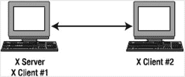
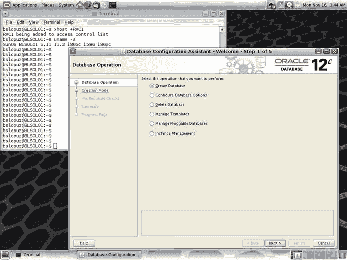

# 第 15 章:管理 X 窗口

许多 DBA 认为大多数 Linux/Solaris 服务器不需要 X Window 系统，即使托管 Oracle 数据库也是如此。事实上，本书的前几章表明，您可以使用文本控制台在 Linux/Solaris 服务器上管理 Oracle 数据库；你真的不需要图形控制台。在食谱 10-11 和 10-12 中，您学习了如何安装 Oracle RDBMS 软件，以及如何在不运行需要图形显示的 Oracle 通用安装程序(OUI)的情况下创建 Oracle 数据库。

但是，对于计划从 Windows 环境迁移并希望在 Linux/Solaris 环境中探索 Oracle 数据库的 DBA 来说，通过命令行键入(并准确记住)OS、SQL 和 RMAN 命令可能会令人望而生畏。如果你喜欢运行基于图形用户界面的程序，比如使用 DBCA 创建 Oracle 数据库，这一章绝对适合你。

为了理解 Linux/Solaris 环境中 X Window 系统的概念，回顾一下网络环境中客户机和服务器的类比。一个 X 客户机和一个 X 服务器都可以托管在一台计算机上(这在典型的客户机/服务器环境中是一个不常见的特性),也可以托管在网络上的两台不同的计算机上，如图 [15-1](#Fig1) 所示。但术语与许多人的预期有所不同。例如，X 服务器是您在客户端 PC 上运行的与应用程序交互的设备。因此，您在某个远程机器上运行的应用程序实际上是客户端。您在本地运行的应用程序(X Window)实际上是服务器。

图 15-1。

X clients on local or remote Linux/Solaris servers

本章向您展示了如何配置、启动和停止 X 服务器。以及如何将 X 显示器重定向并保护到远程计算机。您还将学习如何在运行 X 终端时改变外观。如果您使用 Windows 作为您的客户端计算机，您可以探索用于 Windows 的 OpenSSH，或者使用虚拟网络计算(VNC)，这将在第 16 章中详细讨论。

## 15-1.配置 X 服务器

### 问题

您希望在 Linux/Solaris 服务器上配置一个 X Window 服务器，以运行基于 GUI 的应用程序(如 DBCA)来创建 Oracle 数据库。

### 解决办法

要在 Linux/Solaris 服务器上设置一个 X Window 服务器(通常称为 X 服务器)，您必须编辑`xorg.conf` X Window 配置文件，该文件通常位于`/etc/X11`目录中。编辑`/etc/X11/xorg.conf`文件有两种方法:

*   直接修改`/etc/X11/xorg.conf`文件
*   运行`Xorg`应用程序

要配置`/etc/X11/xorg.conf`文件，运行带有`configure`选项的`Xorg`，这会创建一个名为`/root/xorg.conf.new`的临时配置文件。以下是运行`Xorg -configure`命令后的结果片段:

`# /usr/bin/Xorg -configure`

`X.Org X Server 1.14.5`

`Release Date: 2013-12-12`

`X Protocol Version 11, Revision 0`

`Build Operating System: SunOS 5.11 i86pc`

`Current Operating System: SunOS BLSOL01 5.11 11.2 i86pc`

`Solaris ABI: 64-bit`

`Current version of pixman: 0.29.2`

`Before reporting problems, check`[`http://support.oracle.com/`T3】](http://support.oracle.com/)

`to make sure that you have the latest version.`

`Markers: (--) probed, (**) from config file, (==) default setting,`

`(++) from command line, (!!) notice, (II) informational,`

`(WW) warning, (EE) error, (NI) not implemented, (??) unknown.`

`(==) Log file: "/var/log/Xorg.0.log", Time: Fri Nov 13 00:38:29 2015`

`List of video drivers:`

`intel`

`openchrome`

`r128`

`vmware`

`mga`

`vboxvideo`

`radeon`

`cirrus`

`ast`

`mach64`

`ati`

`vesa`

`(++) Using config file: "/root/xorg.conf.new"`

`(==) Using config directory: "/etc/X11/xorg.conf.d"`

`(==) Using system config directory "/usr/share/X11/xorg.conf.d"`

`Number of created screens does not match number of detected devices.`

`Configuration failed.`

`(EE) Server terminated with error (2). Closing log file.`

Note

运行`Xorg -configure`时，您可能会看到以下错误消息:“致命的服务器错误:服务器已经为显示 0 激活。如果该服务器不再运行，请移除`/tmp/.X0-lock`并重新启动。若要避免此错误，请删除错误消息中描述的文件。

然后，您可以通过执行命令`X -config /root/xorg.conf.new`来测试`/root/xorg.conf.new`配置。如果 X 服务器使用新创建的`/root/xorg.conf.new`配置文件运行良好，将该文件复制到`/etc/X11/xorg.conf`。

### 它是如何工作的

当您启动 X 服务器时，它会读取默认位于`/etc/X11`目录中的`xorg.conf`文件。`/etc/X11/xorg.conf`文件包含运行 X Window 系统的 Linux/Solaris 服务器的系统资源、视频卡、键盘、鼠标和监视器的配置。

你必须把已经改变的部分放入`xorg.conf`文件中。否则，未指定的部分将使用默认设置。还会从`/etc/X11/xorg.conf.d`目录中的文件中读取其他内容。

在“解决方案”一节中，描述了创建和更新`/etc/X11/xorg.conf`文件的两种方法。其中一种方法是手动修改文件，我们不建议这样做，除非您确定会发生变化。无论您想采用哪种方法，在尝试修改之前，请确保备份或创建另一个`/etc/X11/xorg.conf`文件的副本。这样，如果新的更改不起作用，您可以随时恢复到原始设置。

Note

在对 X 服务器进行故障排除时，总是要检查日志文件`/var/log/Xorg.0.log`，对于 Linux 还要检查`/var/log/messages`，对于 Solaris 还要检查`/var/adm/messages`。

## 15-2.启动 X 服务器

### 问题

您希望在 Linux/Solaris 服务器上启动一个 X 服务器来运行基于 GUI 的软件应用程序。

### 解决办法

对于 Solaris 服务器，请执行以下步骤:

Run the `svcs` command to verify the status of the GDM service. `# svcs gdm` `STATE          STIME    FMRI` `disabled        1:25:37 svc:/application/graphical-login/gdm:default`   If the state of GDM service is disabled, run the following command: `# svcadm enable gdm`  

对于 Linux 服务器，有三种方法可以启动 X 服务器:

*   手动运行`X`命令。
*   运行`init 5`或`telinit 5`。
*   修改`/etc/inittab`并重启服务器。

第一种方法恰好是最复杂的，需要在 Linux 服务器的控制台上手动启动 X 服务器。请遵循以下步骤:

If you are prompted to log on, do so as the OS user from which you want to run the X server.   Run the X server by typing the `X` command followed by an ampersand (`&`), as shown in the following line of code. Make sure you add an `&` at the end so the X server will run in the background. That way, you can still type other OS commands in the same console session. `$ X &`   Press Ctrl+Alt+F7 to change to the graphical console. An x will appear in the center of a blank screen, which represents the cursor of your mouse.   Press Ctrl+Alt+F1 to return to the text console session.  

启动 X 服务器的第二种方法是在 OS 提示符下运行`init 5`或`telinit 5`命令作为`root`。可能会出现基于 GUI 的登录屏幕。

第三种方法是在`/etc/inittab`文件中将`initdefault`变量的值改为`5`，如下所示。但是您必须重新启动 Linux 服务器，以使在`/etc/inittab`文件中所做的更改生效。

`id:5:initdefault:`

Note

要显示 X 服务器的细节，运行 OS 命令`xdpyinfo`。

### 它是如何工作的

对于 Solaris 服务器，您可以运行命令`svcadm enable gdm`来启动 GDM 服务。如果您对 X 窗口配置文件`xorg.conf`进行了更改，您可以运行命令`svcadm restart gdm`。要验证 GDM 服务的状态，发出命令`svcs gdm`。以下结果表明 GDM 服务处于在线状态(即已启用):

`# svcs gdm`

`STATE          STIME    FMRI`

`online         11:23:58 svc:/application/graphical-login/gdm:default`

对于 Linux 服务器，如果运行级别设置为`5`，那么当 Linux 服务器重新启动时，X 服务器会自动启动。但是，如果 Linux 服务器以运行级别`3`启动，其中默认的屏幕显示是文本控制台，并且您想要运行一些基于 GUI 的应用程序，比如`dbca`来创建 Oracle 数据库，那么您必须在 Linux 服务器上手动启动 X 服务器。

可以用三种方式启动 X 服务器。首先，您可以通过运行`X`命令手动启动 X 服务器，如“解决方案”部分所示。另一种方法是运行`init`或`telinit`命令并将`5`作为参数传递，但是您必须是`root`或拥有`sudo`权限才能运行这些命令。最后，如果您希望 X server 在每次 Linux 服务器重启时自动运行，您必须将`/etc/inittab`中的`id`指令改为运行第 5 级。

因为大多数 DBA 不在服务器控制台前工作，所以当 Linux 服务器启动时，没有必要启动 X 服务器。但是如果您的 Linux 服务器上有足够的物理内存，我们建议您使用第三种方法。如果当前级别为 3，请使用第一种或第二种方法来启动 X 服务器。我们推荐第二种方法，因为它比`X`命令更简单，需要的步骤更少。

Note

在 Linux 数据库服务器上运行 X 服务器会带来安全问题，因为另一个客户机可以访问和观察您的击键。就安全措施而言，我们建议你使用`xhost`或 SSH 上的隧道 X 来进行访问控制，如方法 15-4 和 15-5 中所讨论的。

`X`命令实际上调用了`Xorg`，如下图所示:

`# which X`

`/usr/bin/X`

`# ls -l /usr/bin/X`

`lrwxrwxrwx. 1 root root 4 Jan 13  2014 /usr/bin/X -> Xorg`

`# which Xorg`

`/usr/bin/Xorg`

`# ls -l /usr/bin/Xorg`

`-rwsr-xr-x. 1 root root 2274240 Nov 21  2013 /usr/bin/Xorg`

Note

`X`命令可能位于与其他 Linux 发行版不同的目录中，所以运行命令`which X`来确定确切的目录。

不用运行`X`命令来启动 X 服务器，您可以运行`startx`命令，然后它会代表您调用`X`命令，并启动一个图形显示管理器。大多数 Linux 发行版的默认显示管理器是 GNOME。如果你更喜欢另一个图形显示管理器，请看食谱 15-6 关于如何从 GNOME 切换到 KDE，反之亦然。

一旦 X 服务器已经在运行，你可以按 Ctrl+Alt+F1 切换到文本控制台，或者按 Alt+F7 切换到图形控制台。您可以重复这些步骤，在文本和图形控制台之间来回切换。

## 15-3.停止 X 服务器

### 问题

您想要停止在您的 Linux 服务器上运行的 X 服务器。例如，您可能希望节省资源，例如基于 GUI 的软件应用程序所消耗的内存。

### 解决办法

对于 Solaris 服务器，发出以下命令:

`# svcadm disable gdm`

对于 Linux 服务器，有三种方法可以停止 X 服务器:

*   运行`init 3`或`telinit 3`。
*   按 Ctrl+Alt+Backspace。
*   修改`/etc/inittab`并重启服务器。

对于第一种方法，执行以下步骤来手动停止 Linux 服务器上的 X 服务器:

If the X Window system is already running, press Ctrl+Alt+F1 to change to a text console.   If you are prompted to log on, do so as `root`.   Issue either `init 3` or `telinit 3` to stop the X server: `# init 3`  

对于第二种方法，请执行以下步骤:

Press Alt+F7 to change to the graphical console. If you are already on the graphical console, you can skip this step.   Press Ctrl+Alt+Backspace to stop the X server.  

对于第三种方法，在`/etc/inittab`文件中将`initdefault`变量的值改为`3`，如下所示:

`id:3:initdefault:`

然后，您必须重新启动 Linux 服务器以使更改生效。

### 它是如何工作的

要在 Solaris 中停止 X 服务器，可以发出命令`svcadm disable gdm`。之后，发出命令`svcs gdm`。以下结果表明 GDM 服务被禁用:

`# svcs gdm`

`STATE          STIME    FMRI`

`disabled       11:18:03 svc:/application/graphical-login/gdm:default`

对于 Linux，有三种方法可以停止 X 服务器。您可以通过在文本控制台上运行`init 3`或`telinit 3`来手动停止 X 服务器，将当前运行级别更改为 3。但是你必须是`root`或者有`sudo`权限才能运行这些命令。如果当前运行级别已经是 3，当您在图形控制台上时，可以按 Ctrl+Alt+Backspace。如果您不希望 X 服务器在每次 Linux 服务器重启时自动运行，那么在`/etc/inittab`中将`id`指令改为运行级别 3。

第一种和第二种方法取决于当前运行级别。如果当前运行级别为 5，并且您执行了第二种方法，它将始终返回到图形登录屏幕。因此，如果当前级别为 5，则执行第一种方法；否则，使用第二种方法。

发出`runlevel`命令显示先前和当前的运行级别。在下面的例子中，第一个字符是`N`，表示运行级别还没有改变；第二个字符表示当前运行级别是`5`:

`# runlevel`

`N 5`

## 15-4.在远程服务器上显示 X 客户端

### 问题

您想在本地 Linux 服务器上运行 X 客户机或基于 GUI 的软件应用程序，但是 X 服务器没有运行。相反，您希望将图形显示重定向到运行 X 服务器的远程 Linux/Solaris 服务器。

### 解决办法

在下面的例子中，操作系统用户`oracle`当前登录到本地 Linux 服务器`RAC1`，您希望在这里运行 X 客户端或基于 GUI 的软件应用程序，但是 X 服务器没有运行。同时，Solaris 服务器`BLSOL01`是一个远程 Linux 服务器，X 服务器在其上运行。

当运行 X 客户端或基于 GUI 的软件应用程序(如`dbca`)以在 Linux 服务器`RAC1`上创建 Oracle 数据库时，执行以下步骤将图形显示重定向到 Solaris 服务器`BLSOL01`:

On the Linux server `RAC1`, set the OS environment variable `DISPLAY` to point to the Solaris server `BLSOL01`. `[oracle@RAC1 ∼]$ export DISPLAY=BLSOL01:0.0`   Run `dbca` on the Linux server `RAC1`. `[oracle@RAC1 ∼]$ dbca`   Note

如果没有设置 OS 环境变量`DISPLAY`，您可能会看到以下错误消息:“DISPLAY not set。设置显示环境变量，然后重新运行。要解决这个错误，请确保将 OS 环境变量`DISPLAY`设置为指向运行 X 服务器的服务器。

Next, the Database Configuration Assistant screen will appear, as shown in Figure [15-2](#Fig2). Behind the screen, notice that the output of the OS command `uname -a`, executed on the terminal window, confirms that the Solaris server is `BLSOL01`.

图 15-2。

Database Configuration Assistant screen  

### 它是如何工作的

您通常运行 X 客户端或基于 GUI 的软件应用程序，并在您当前登录的本地 Linux/Solaris 服务器上显示图形。但是如果 X 服务器没有运行在本地 Linux/Solaris 服务器上呢？您可以选择将图形显示重定向到另一个运行 X 服务器的远程 Linux 服务器。

但是，您可能会遇到以下错误，因为本地 Linux/Solaris 服务器(在“解决方案”部分所示的示例中是 Linux 服务器`RAC1`)可能没有被授予对远程 Solaris 服务器(服务器`BLSOL01`)的访问控制:

`[oracle@RAC1 ∼]$ dbca`

`No protocol specified`

`Error: Can’t open display: BLSOL01:0.0`

要确认是否已授予访问权限，请在 Solaris 服务器`BLSOL01`上运行不带任何参数的 OS 命令`xhost`。如果消息说`"access control enabled", only authorized clients can connect`。如果 Linux 服务器`RAC1`不在列表中，这就解释了为什么您在运行`dbca`时会得到早期的错误消息。这里有一个例子:

`bslopuz@BLSOL01:∼$ xhost`

`access control enabled, only authorized clients can connect`

`INET: BLSOL02`

`INET: RAC1`

有两种方法可以解决这个问题:从 Solaris 服务器`BLSOL01`运行命令`xhost +RAC1`，或者在 Solaris 服务器`BLSOL01`上运行命令`xhost +`。使用第一种方法只允许来自主机`RAC1`的客户端连接。这里有一个例子:

`bslopuz@BLSOL01:∼$ xhost +RAC1`

`RAC1 being added to access control list`

`bslopuz@BLSOL01:∼$ xhost`

`access control enabled, only authorized clients can connect`

`INET: RAC1`

另一方面，OS 命令`xhost +`将把访问控制授予所有可以直接访问`BLSOL01`的服务器。我们不建议您授予那么多的访问权限，因为您基本上允许来自任何服务器的访问。这里有一个例子:

`bslopuz@BLSOL01:∼$ xhost +`

`access control disabled, clients can connect from any host`

要撤销访问控制，运行操作系统命令`xhost -RAC1`撤销特定服务器`RAC1`的权限，如下例所示。注意，在第一个 OS 命令的结果中，`xhost`没有任何参数，服务器`RAC1`在列表中。同时，在您运行操作系统命令`xhost -RAC1`之后，在您第二次不带任何参数运行操作系统命令`xhost`时，服务器`RAC1`不再在列表中。

`bslopuz@BLSOL01:∼$ xhost`

`access control enabled, only authorized clients can connect`

`INET:BLSOL02`

`INET:RAC1`

`bslopuz@BLSOL01:∼$ xhost -RAC1`

`RAC1 being removed from access control list`

`bslopuz@BLSOL01:∼$ xhost`

`access control enabled, only authorized clients can connect`

`INET:BLSOL02`

但是，如果您之前发出 OS 命令，并且当您发出不带任何参数的 OS 命令`xhost`时，消息显示`"access control disabled", clients can connect from any host`。任何服务器，比如 Linux 服务器`RAC1`，仍然可以访问 Solaris 服务器`BLSOL01`，即使您已经从特定的 Linux 服务器`RAC1`撤销了特权。要撤销所有服务器的访问控制，您可以发出`xhost -`，如下所示:

`bslopuz@BLSOL01:∼$ xhost -`

`access control enabled, only authorized clients can connect`

`bslopuz@BLSOL01:∼$ xhost`

`access control enabled, only authorized clients can connect`

## 15-5.SSH 上的隧道 X

### 问题

您希望在远程 Linux/Solaris 服务器上运行 X 客户端或基于 GUI 的软件应用程序。但是，您希望通过安全连接登录到远程 Linux 服务器，并对服务器之间传输的数据进行加密。

### 解决办法

在下面的例子中，操作系统用户`oracle`当前登录到本地 Linux 服务器`BLSOL01`；服务器`BLSOL02`是远程 Solaris 服务器。执行以下步骤，通过 SSH 从服务器`BLSOL01`连接到服务器`BLSOL02`，并在服务器`BLLNX2`上执行 X 软件应用程序:

On the local Solaris server `BLSOL01`, run `ssh` with the `-X` (uppercase X) option, as shown here. You may be prompted to provide a password of the OS user on `BLSOL02`. `bslopuz@BLSOL01:∼$ ssh -X BLSOL02` `Password:` `Last login: Mon Nov 16 02:17:46 2015` `Oracle Corporation      SunOS 5.11      11.2    June 2014`   If `X11Forwarding` is properly set up, the `DISPLAY` variable is automatically set up once you are successfully connected to the remote Linux/Solaris server, as shown here: `bslopuz@BLSOL02:∼$ echo $DISPLAY` `localhost:10.0`   Once you are successfully connected to server `BLSOL02`, you can now run an X client or GUI-based software application on server `BLSOL02`. To test this, we recommend that you run a simple X client, such as `xeyes`, as shown in Figure [15-3](#Fig3).

图 15-3。

`xeyes` display   Note

X 服务器的默认端口是 6000。如果这个端口被阻塞，一个解决方法是运行带有`-X`选项的`ssh`来显示应用程序，例如`xclock`或 Oracle 的`dbca`。

### 它是如何工作的

配方 15-4 允许您将图形显示重定向到远程 Linux/Solaris 服务器。但是，在服务器之间传输的数据是不安全的，因为它没有加密。出于安全原因，我们建议您通过 SSH 转发或传输图形显示，如本食谱所示。

Note

要了解如何使用 PuTTY 配置 SSH 隧道，请参考方法 1-1。

要在远程 Linux/Solaris 服务器上转发 X 客户端或基于 GUI 的软件应用程序的显示，请运行带有`-X`(大写 X)选项的`ssh`。`-x`(小写 X)选项禁用 X 转发。但是，在使用`ssh`开始连接之前，请确保安全 Shell 守护程序或`sshd`已经在远程 Linux/Solaris 服务器上运行。否则，查看第 14 章的[，尤其是配方 14-1，它详细讨论了如何设置`ssh`。](14.html)

在远程 Linux/Solaris 服务器上运行 X 客户端或基于 GUI 的软件应用程序时，您可能会收到以下消息:“`Warning: Remote host denied X11 forwarding`”此外，如果您运行 X 客户端或基于 GUI 的软件，您将会收到消息“`Error: Can’t open display`”要解决这些错误，请确保在远程 Linux/Solaris 服务器上的`/etc/ssh/sshd_config`文件中将`X11Forwarding`设置为`yes`。

Note

要对 SSH 连接进行故障排除，请运行带有`-v`选项的`ssh`命令来显示调试消息。要获得更多的调试消息，请使用`-vvv`选项。我们还建议您查看一下`/var/log/secure`和`/var/log/messages`文件。

## 15-6.操作 X 窗口的终端模拟器

### 问题

您希望启动默认的 X 终端，并更改外观以支持不同的数据库环境:开发、质量保证和生产数据库环境。

### 解决办法

要启动 X Window 终端，您可以执行`xterm`命令。如果您的 OS 环境变量`DISPLAY`被正确设置到 Hummingbird X 服务器、Reflection X 服务器或 Cygwin X 服务器(或者如果您正在本地运行 X 服务器)，将会出现一个白色的小终端。这个小窗口可能不足以支持当今支持许多数据库环境的数据库管理员的日常活动。更有可能的是，你会有一个更大的窗口，一个指定窗口名称的标题，不同的颜色以方便识别环境，以及一个更大的滚动缓冲区。这里有几个`xterm`示例，您可以在您的环境中执行以支持多种数据库环境:

`xterm -sl 32000 -sb -title "Production" -geometry 128x40 -bg red -fg white &`

`xterm -sl 32000 -sb -title "QA" -geometry 128x40 -bg yellow -fg black &`

`xterm -sl 32000 -sb -title "Development" -geometry 128x40 -bg blue -fg white &`

每个`xterm`窗口都设计有不同的背景颜色和`-bg`参数，以区分数据库环境。在我们的例子中，蓝色窗口代表开发环境，黄色窗口代表 QA 环境，当然，红色窗口代表生产环境。DBA 应该注意配色方案，并且要格外小心，记住在红色背景下，他们是登录到生产数据库服务器的。

除了背景颜色，我们将滚动长度缓冲区定义为 32，000 行。默认的滚动缓冲区在窗口顶部上方 64 行。由`-sl`参数指定的 32，000 行的滚动缓冲区将消耗服务器上更多的内存，但将证明是值得的，尤其是在诊断问题时。

窗口的标题也可以用参数`-title`来定义，这个参数应该用双引号括起来，这样你就可以定制标题来满足你的需求。

可通过`-geometry`参数管理`xterm`窗口的尺寸，该参数定义了窗口的大小和位置。您可以使用`-font`参数定义特定的字体、字体大小和其他属性。指定字体和大小属性最简单的方法是执行`xfontsel`命令。执行`xfontsel`命令将打开另一个类似于图 [15-4](#Fig4) 所示的 X 窗口。

图 15-4。

`xfontsel` window

当您决定字体类型和大小属性时，您可以点击选择按钮，并使用`xterm`命令粘贴到另一个终端，类似于以下命令:

`xterm -font -adobe-courier-bold-*-*-*-12-*-*-*-*-*-*-*`

一旦你对字体的外观和感觉感到满意，你可以返回到`xfontsel`窗口并点击退出按钮。

`xterm`的另一个流行参数是`-e`参数。使用`-e`选项，您可以指定在`xterm`窗口中运行的程序和参数。这里有一个如何操作`-e`选项的例子:

`xterm -e "ssh rac3 -l root"`

### 它是如何工作的

`xterm`是运行在 X Windows 中的标准终端模拟器。Linux 中的其他终端模拟器包括 Konsole(默认的 KDE 终端)、GNOME 终端(默认的 GNOME 终端)、rxvt(对`xterm`的精简替代)和 Eterm。`xterm`是所有 UNIX 操作系统中终端事实上的标准。无论您运行的是 Linux、Sun Solaris、IBM AIX 还是 HP/UX，`xterm`的外观和行为都是一样的。一种行为包括复制和粘贴的能力。在`xterm`窗口中，如果您高亮显示一个单词或一个句子，高亮显示的部分将自动复制到内存缓冲区。要复制内存缓冲区，您只需按下鼠标中键；对于双按钮鼠标，中间的按钮通常是轨迹球。您可以按轨迹球来粘贴内存缓冲区的内容。如果你有老式的传统双键鼠标，同时按下左右键会粘贴内存缓冲区。

同样，如果您按住 Ctrl 键，同时按下左、中或右按钮，您将看到以下菜单选项:

*   按 Ctrl 和鼠标左键查看主要选项。
*   对于 VT 字体，按 Ctrl 和鼠标右键。
*   按 Ctrl 和鼠标中键查看 VT 选项。

例如，使用 VT 字体菜单，您可以将字体大小更改为不可读、微小、小、中、大和巨大。当你改变字体的大小时，窗口的直径也会随之改变。使用 VT Options 菜单，您可以修改一些简单的事情，如启用或禁用滚动条或启用反向视频。

为了获得大量`xterm`参数的帮助，您可以执行`xterm -help`命令。