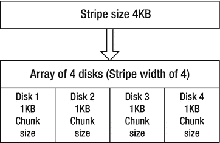
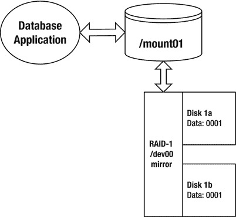
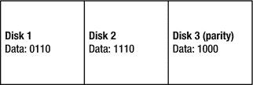
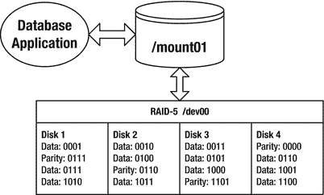
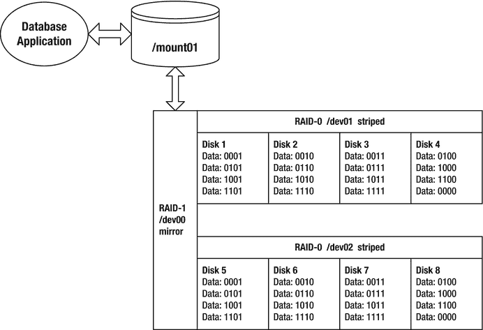
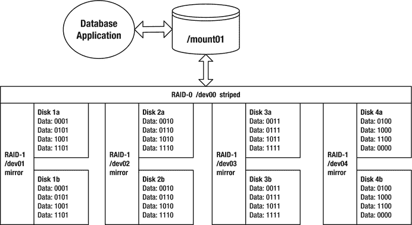

# 第 17 章:RAID 概念

在不太遥远的过去，1TB 大小的数据库被认为是相当大的。目前，1PB–2PB 是大型数据库的下限。在不久的将来，exabyte、zettabyte 和 yottabyte 将成为 DBA 水冷器附近的常用术语。

随着公司存储越来越多的数据，对磁盘空间的需求也在不断增长。管理数据库存储是每个数据库管理员的主要职责。DBA 的任务是估计数据库的初始大小，识别增长模式，并监控磁盘使用情况。监督这些操作对于确保公司数据的可用性至关重要。

以下是一些与存储管理相关的常见 DBA 任务:

*   确定数据库应用程序的磁盘体系结构
*   规划数据库容量
*   监控和管理数据库文件的增长

在向数据库服务器添加更多存储之前，sa 和 DBA 应该坐下来，找出哪种磁盘体系结构能够在给定的预算下提供最佳的可用性和性能。当使用 SAs 时，一个有效的 DBA 需要在磁盘技术语言方面相当流利。具体来说，数据库管理员必须对 RAID 磁盘技术及其对数据库性能和可用性的影响有基本的了解。

即使没有征求您对磁盘技术的意见，您仍然需要熟悉基本的 RAID 配置，这将使您能够对数据库调优和故障排除做出明智的决策。本附录讨论了数据库管理员需要了解的关于 RAID 的基本信息。

## 了解 RAID

作为 DBA，您需要了解 RAID 设计，以确保为您的数据库应用程序使用合适的磁盘架构。RAID 是廉价[或独立]磁盘冗余阵列的首字母缩写，它允许您配置几个独立的磁盘，以便在逻辑上对应用程序显示为一个磁盘。使用 RAID 有两个重要原因:

*   将 I/O 分散到几个磁盘上，从而提高带宽
*   消除作为单点故障的单独物理磁盘

如果读写磁盘更新的数据库进程可以跨多个磁盘(而不是单个磁盘)并行执行 I/O，那么带宽可以显著提高。RAID 还允许您配置几个磁盘，这样就不会有一个磁盘成为单点故障。对于大多数数据库系统来说，拥有冗余硬件以确保数据库可用性是至关重要的。

本节的目的不是支持一种 RAID 技术胜过另一种。您会发现大量关于 RAID 主题的博客和白皮书。每一个信息来源都有自己的导师，他宣扬一种形式的突袭胜过另一种形式。所有这些来源都有有效的论据来说明为什么他们最喜欢的 RAID 风格最适合特定的情况。

警惕关于 RAID 技术的性能和可用性的笼统陈述。例如，您可能会听到有人说，对于数据库应用程序，RAID 5 总是比 RAID 1 好。您可能还会听到有人说 RAID 1 比 RAID 5 具有更好的容错能力。在大多数情况下，一种 RAID 技术优于另一种技术取决于几个因素，例如数据库应用程序的 I/O 行为以及底层硬件和软件堆栈的各种组件。你可能会发现在一个场景中表现良好的东西在另一个场景中并不适用；这实际上取决于所使用的整套技术。

这里的目标是描述最常用的 RAID 技术的性能和容错特征。我们用简单的术语和清晰的例子解释 RAID 技术的基本形式是如何工作的。这些基础知识使您能够根据当前环境的业务需求做出明智的磁盘技术决策。您还应该能够将本节包含的信息应用到更复杂和新兴的 RAID 体系结构中。

### 定义阵列、条带宽度、条带大小、区块大小

在深入 RAID 的技术细节之前，您首先需要熟悉一些术语:阵列、条带宽度、条带大小和区块大小。

阵列只是组合在一起的磁盘的集合，对应用程序来说就像一个设备。磁盘阵列可以提高性能和容错能力。

条带宽度是可以同时写入或读取到阵列的并行数据的数量。条带宽度通常等于阵列中磁盘的数量。一般来说(在所有其他因素相同的情况下)，条带宽度越大，阵列的吞吐量性能就越高。例如，您通常会看到由 12 个 32GB 驱动器组成的阵列比由 4 个 96GB 驱动器组成的阵列具有更高的读/写性能。

条带大小是您希望并行写入磁盘阵列的数据量。确定最佳条带大小可能是一个极具争议的话题。减小条带大小通常会增加文件用于存储数据的驱动器数量。增加条带大小通常会减少文件用于向阵列写入和读取的驱动器数量。最佳条带大小取决于您的数据库应用程序 I/O 特征，以及系统的硬件和软件。

Note

条带大小通常是一个可配置的参数，可由存储管理员动态配置。与之相比，条带宽度只能通过增加或减少磁盘的物理数量来改变。

区块大小是条带大小的子集。区块大小(也称为条带单元)是写入阵列中每个磁盘的数据量，是条带大小的一部分。

图 [17-1](#Fig1) 显示了一个 4KB 大小的条带正在被写入一个由四个磁盘组成的阵列(条带宽度为 4)。每个磁盘都会写入 1KB 的数据块。

图 17-1。

A 4KB stripe of data is written to four disks as 1KB chunks

区块大小会对性能产生显著影响。不适当的区块大小会导致 I/O 集中在阵列中的单个磁盘上。如果发生这种情况，您最终可能会得到一个昂贵的磁盘阵列，其性能并不比单个磁盘好。

对于数据库应用程序，正确的块大小是多少？这在一定程度上取决于数据库生成的 I/O 的平均大小。通常，数据库 I/O 由几个并发的小型 I/O 请求组成。理想情况下，每个小的 I/O 请求应该由一个磁盘处理，多个 I/O 请求分布在阵列中的所有磁盘上。因此，在这种情况下，您希望块大小比平均数据库 I/O 大小稍大一些。

Tip

您必须测试特定的数据库和磁盘配置，以确定对于给定的应用程序，哪种块大小可以产生最佳的 I/O 分布及其平均 I/O 大小。

### RAID 0

RAID 0 通常被称为条带化，这是一种以并行方式跨磁盘阵列写入数据块的技术。数据也以同样的方式从磁盘中读取，这允许几个磁盘参与读/写操作。条带化背后的想法是，同时访问多个磁盘比 I/O 访问单个磁盘具有更大的带宽。

Note

RAID 0 设备中的一个磁盘可以比其他磁盘大(并且仍然使用额外的空间)。但是，不建议这样做，因为 I/O 将集中在有更多可用空间的大磁盘上。

图 [17-2](#Fig2) 展示了 RAID 0 是如何工作的。这个 RAID 0 磁盘阵列实际上由四个磁盘组成。从逻辑上讲，对于应用程序来说，它看起来就像一个磁盘(`/mount01`)。写入 RAID 0 设备的数据条带由 16 位组成:0001001000110100。每个磁盘接收一个 4 位的条带块。

图 17-2。

Four-disk RAID 0 striped device

使用 RAID 0，您实现的磁盘容量是磁盘数量乘以磁盘大小。例如，如果您有四个 100GB 的驱动器，应用程序可用的总实现磁盘容量是 400GB。从这个意义上说，RAID 0 是一个非常划算的解决方案。

RAID 0 还提供了出色的 I/O 性能。它允许同时读写阵列中的所有磁盘。这分散了 I/O，减少了磁盘争用，缓解了瓶颈，并提供了出色的 I/O 性能。

RAID 0 的巨大缺点是它不提供任何冗余。如果一个磁盘出现故障，整个阵列都会出现故障。因此，您不应该对您认为重要的数据使用 RAID 0。您应该仅对易于恢复的文件使用 RAID 0，并且只在不需要高可用性时使用。

Tip

记住 RAID 0 含义的一种方法是，它提供“0”冗余。RAID 0 可以实现零容错。如果一个磁盘出现故障，整个磁盘阵列都会出现故障。

### RAID 1

RAID 1 通常被称为镜像，这意味着每次数据被写入存储设备时，它被物理地写入两个(或更多)磁盘。在这种配置中，如果您丢失了阵列中的一个磁盘，您仍有另一个磁盘包含数据的完全相同的副本。

图 [17-3](#Fig3) 显示了 RAID 1 是如何工作的。镜像磁盘阵列由两个磁盘组成。磁盘 1b 是磁盘 1a 的副本(镜像)。当数据位 0001 被写入磁盘 1a 时，数据的副本也被写入磁盘 1b。从逻辑上讲，两个磁盘的 RAID 1 阵列对应用程序来说就像一个磁盘(`/mount01`)。

图 17-3。

RAID 1 two-disk mirror

RAID 1 的写入性能需要的时间比单个磁盘稍长，因为数据必须写入每个参与的镜像磁盘。但是，由于对镜像阵列中包含的数据的并行访问，读取带宽增加了。

RAID 1 之所以受欢迎，是因为它易于实施并提供容错能力。您可以丢失一个镜像磁盘，但只要有一个幸存成员，您就可以继续操作。RAID 1 的一个缺点是它减少了应用程序可用的实际磁盘空间。虽然镜像阵列中通常只有两个磁盘，但是一个镜像中可以有两个以上的磁盘。镜像阵列中实现的磁盘空间就是磁盘的大小。

下面是计算 RAID 1 实现的磁盘空间的公式:

`Number of mirrored arrays * Disk Capacity`

例如，假设您有四个 100GB 的磁盘，并且想要创建两个镜像阵列，每个阵列中有两个磁盘。实际可用磁盘空间的计算如下所示:

`2 arrays * 100 gigabytes = 200 gigabytes`

另一种表述方式如下:

`(Number of disks available / number of disks in the array) * Disk Capacity`

此公式还显示应用程序可用的磁盘空间量为 200GB:

`(4 / 2) * 100 gigabytes = 200 gigabytes`

Tip

记住 RAID 1 含义的一种方法是它提供 100%冗余。您可以失去 RAID 1 阵列中的一个成员，但仍然可以继续操作。

## 生成奇偶校验

在讨论下一级 RAID 之前，理解奇偶校验的概念以及它是如何产生的非常重要。RAID 4 和 RAID 5 配置使用奇偶校验信息来针对单个磁盘故障提供冗余。对于三磁盘 RAID 4 或 RAID 5 配置，每次写入都会导致以条带化方式写入两个磁盘，第三个磁盘存储奇偶校验信息。

奇偶校验数据包含在一个磁盘出现故障时重建数据所需的信息。奇偶校验信息由 XOR(异或)运算生成。

表 [17-1](#Tab1) 描述了异或运算的输入和输出。该表如下所示:如果有且仅有一个输入为 1，则输出为 1；否则，输出为 0。

表 17-1。

Behavior of an XOR Operation

<colgroup><col> <col> <col></colgroup> 
| 输入 A | 输入 B | 输出 |
| --- | --- | --- |
| one | one | Zero |
| one | Zero | one |
| Zero | one | one |
| Zero | Zero | Zero |

例如，从表 [17-1](#Tab1) 的第一行开始，如果两位都是 1，则 XOR 运算的输出是 0。从第二和第三行开始，如果一位是 1，另一位是 0，则 XOR 运算的输出是 1。最后一行显示，如果两位都是 0，则输出为 0。

一个稍微复杂一点的例子将有助于澄清这个概念。在图 [17-4](#Fig4) 所示的例子中，有三个圆盘。磁盘 1 写入 0110，磁盘 2 写入 1110。磁盘 3 包含对写入磁盘 1 和磁盘 2 的数据进行 XOR 运算的输出所生成的奇偶校验信息。

图 17-4。

Disk 1 XOR Disk 2 = Disk 3 (parity)

1000 奇偶信息是怎么算出来的？写入磁盘 1 和磁盘 2 的数据的前两位是 0 和 1；因此，XOR 输出为 1。后两位都是 1，所以 XOR 输出是 0。第三组位都是 1，输出是 0。第四位都是零，因此输出为 0。

这里以方程式的形式总结了这一讨论:

`Disk1 XOR Disk2 = Disk3 (parity disk)`

`----- --- -----   -----`

`0110  XOR 1110  = 1000`

如果出现故障，奇偶校验如何允许重新计算数据？对于本例，假设您丢失了磁盘 2。通过对奇偶校验信息(磁盘 3)与写入磁盘 1 的数据进行 XOR 运算，可以重新生成磁盘 2 上的信息。0110 和 1000 的异或运算产生 1110(最初写入磁盘 2)。这里以方程式的形式总结了这一讨论:

`Disk1 XOR Disk3 = Disk2`

`----- --- -----   -----`

`0110  XOR 1000  = 1110`

您可以对任意数量的磁盘执行 XOR 运算。假设您有一个四磁盘配置。磁盘 1 写入 0101，磁盘 2 写入 1110，磁盘 3 写入 0001。磁盘 4 包含奇偶校验信息，这是磁盘 1 异或磁盘 2 异或磁盘 3 的结果:

`Disk1 XOR Disk2 XOR Disk3 = Disk4 (parity disk)`

`----- --- ----  --- -----   -----`

`0101  XOR 1110  XOR 0001  = 1010`

假设您丢失了磁盘 2。要在磁盘 2 上重新生成信息，您需要对磁盘 1、磁盘 3 和奇偶校验信息(磁盘 4)执行 XOR 运算，结果是 1110:

`Disk1 XOR Disk3 XOR Disk4 = Disk2`

`----- --- ----- --- -----   -----`

`0101  XOR 0001  XOR 1010  = 1110`

通过使用奇偶校验信息对剩余磁盘执行 XOR 运算，您始终可以在损坏的驱动器上重新生成数据。RAID 4 和 RAID 5 技术使用奇偶校验作为提供容错的关键组件。这些以奇偶校验为中心的技术将在接下来的两节中介绍。

### RAID 4

RAID 4 有时也称为专用奇偶校验，它跨磁盘阵列写入一个条带(以区块为单位)。一个驱动器总是专用于奇偶校验信息。RAID 4 配置至少需要三个磁盘:两个用于数据，一个用于奇偶校验。术语 RAID 4 并不意味着阵列中有四个磁盘；RAID 4 配置中可以有三个或更多磁盘。

图 [17-5](#Fig5) 显示了一个四磁盘 RAID 4 配置。磁盘 4 是专用的奇偶校验磁盘。第一个条带由数据 000100100011 组成。数据区块 0001、0010 和 0011 分别写入磁盘 1、2 和 3。计算奇偶校验值 0000，并将其写入磁盘 4。

图 17-5。

Four-disk RAID 4 dedicated parity device

RAID 4 使用 XOR 运算来生成奇偶校验信息。对于图 [17-5](#Fig5) 中的每个条带，奇偶校验信息生成如下:

`Disk1 XOR Disk2 XOR Disk3 = Parity`

`----- --- ----- --- -----   ------`

`0001  XOR 0010  XOR 0011  = 0000`

`0100  XOR 0101  XOR 0110  = 0111`

`0111  XOR 1000  XOR 1001  = 0110`

`1010  XOR 1011  XOR 1100  = 1101`

Tip

关于 XOR 运算如何工作的详细信息，请参考前面的“生成奇偶校验”一节。

RAID 4 要求为每次写入生成和更新奇偶校验信息，因此 RAID 4 配置中的写入时间比 RAID 0 写入时间长。从 RAID 4 配置中读取数据的速度很快，因为数据分布在多个驱动器上(可能还有多个控制器)。

使用 RAID 4，您可以获得比使用 RAID 1 更多的实际磁盘空间。应用程序可用的 RAID 4 磁盘空间量按以下公式计算:

`(Number of disks – 1) * Disk Capacity`

例如，如果您有四个 100GB 磁盘，则应用程序可用的实际磁盘容量如下所示:

`(4 -1) * 100 gigabytes = 300 gigabytes`

如果一个磁盘出现故障，阵列中的其余磁盘可以继续工作。例如，假设磁盘 1 出现故障。可以使用奇偶校验信息重新生成磁盘 1 信息，如下所示:

`Disk2 XOR Disk3 XOR Parity = Disk1`

`----- --- ----- --- ------   -----`

`0010  XOR 0011  XOR 0000   = 0001`

`0101  XOR 0110  XOR 0111   = 0100`

`1000  XOR 1001  XOR 0110   = 0111`

`1011  XOR 1100  XOR 1101   = 1010`

在单个磁盘故障期间，RAID 4 性能将会下降，因为在故障驱动器上生成数据需要奇偶校验信息。更换故障磁盘并重新生成其信息后，性能将恢复到正常水平。实际上，由于专用奇偶校验磁盘固有的瓶颈，很少使用 RAID 4。

### RAID 5

RAID 5 有时也称为分布式奇偶校验，它类似于 RAID 4，只是 RAID 5 在磁盘阵列中所有可用的驱动器之间交错奇偶校验信息。RAID 5 配置至少需要三个磁盘:两个用于数据，一个用于奇偶校验。术语 RAID 5 并不意味着阵列中有五个磁盘；RAID 5 配置中可以有三个或更多磁盘。

图 [17-6](#Fig6) 显示了一个四磁盘 RAID 5 阵列。第一个数据条带由 000100100011 组成。三个区块 0001、0010 和 0011 被写入磁盘 1、2 和 3；0000 的奇偶校验被写入磁盘 4。第二个条带将其奇偶校验信息写入磁盘 1，第三个条带将其奇偶校验写入磁盘 2，依此类推。

图 17-6。

Four-disk RAID 5 distributed parity device

RAID 5 使用 XOR 运算来生成奇偶校验信息。对于图 [17-6](#Fig6) 中的每个条带，奇偶校验信息生成如下:

`0001    XOR 0010    XOR 0011    = 0000`

`0100    XOR 0101    XOR 0110    = 0111`

`0111    XOR 1000    XOR 1001    = 0110`

`1010    XOR 1011    XOR 1100    = 1101`

Tip

关于 XOR 运算如何工作的详细信息，请参考前面的“生成奇偶校验”一节。

与 RAID 4 一样，RAID 5 写入会受到轻微的写入性能影响，因为奇偶校验信息需要额外的更新。RAID 5 的性能优于 RAID 4，因为它将生成和更新奇偶校验信息的负载分散到阵列中的所有磁盘。因此，RAID 5 几乎总是比 RAID 4 更受青睐。

RAID 5 很受欢迎，因为它结合了良好的 I/O 性能、容错能力和成本效益。使用 RAID 5，您可以获得比使用 RAID 1 更多的实际磁盘空间。应用程序可用的 RAID 5 磁盘空间量按以下公式计算:

`(Number of disks – 1) * Disk Capacity`

使用前面的公式，如果您有四个 100GB 磁盘，应用程序可用的实际磁盘容量计算如下:

`(4 -1) * 100 gigabytes = 300 gigabytes`

RAID 5 通过奇偶校验信息提供针对单个磁盘故障的保护。如果一个磁盘出现故障，可以从 RAID 5 阵列中剩余的驱动器重新计算故障磁盘的信息。例如，假设磁盘 3 出现故障；磁盘 1、磁盘 2 和磁盘 4 上的剩余数据可以重新生成所需的磁盘 3 信息，如下所示:

`DISK1 XOR DISK2 XOR DISK4 = DISK3`

`----- --- ----- --- -----   -----`

`0001  XOR 0010  XOR 0000  = 0011`

`0111  XOR 0100  XOR 0110  = 0101`

`0111  XOR 0110  XOR 1001  = 1000`

`1010  XOR 1011  XOR 1100  = 1101`

在单个磁盘故障期间，RAID 5 性能将会下降，因为在故障驱动器上生成数据需要奇偶校验信息。更换故障磁盘并重新生成其信息后，性能将恢复到正常水平。

## 构建混合(嵌套)RAID 设备

RAID 0、RAID 1 和 RAID 5 体系结构是更复杂的存储体系结构的构造块。需要更高可用性的公司可以结合这些基本的 RAID 技术来构建具有更好容错能力的磁盘阵列。一些常见的混合 RAID 体系结构如下:

*   RAID 0+1(条带化，然后镜像)
*   RAID 1+0(镜像，然后分条)
*   RAID 5+0 (RAID 5，然后分条)

这些配置有时被称为混合或嵌套 RAID 级别。就像乐高积木一样，您可以采用底层 RAID 体系结构，并将它们组合在一起，以获得一些有趣的配置，这些配置具有性能、容错能力以及成本优势和劣势。这些技术将在下面的章节中详细描述。

Note

各种 RAID 级别的命名标准存在一定程度的混淆。嵌套 RAID 级别最常见的行业标准是 RAID A+B，这意味着首先构建 RAID 级别 A，然后在 RAID 级别 A 之上构建 RAID 级别 B。并非所有存储供应商都始终如一地应用此标准。您必须仔细阅读给定存储设备的规格，以确保您了解正在使用的 RAID 级别。

### RAID 0+1

RAID 0+1 是先条带化，然后镜像的磁盘阵列(条带的镜像)。图 [17-7](#Fig7) 显示了一个八磁盘 RAID 0+1 配置。磁盘 1 至 4 以条带方式写入。磁盘 5 至 8 是磁盘 1 至 4 的镜像。

图 17-7。

RAID 0+1 striped and then mirrored device

RAID 0+1 提供了条带化的 I/O 优势，同时提供了镜像设备的强大容错能力。这是一个相对昂贵的解决方案，因为阵列中只有一半的磁盘构成您的可用磁盘空间。应用程序可用的 RAID 0+1 磁盘空间量按以下公式计算:

`(Number of disks in stripe) * Disk Capacity`

使用前面的公式，如果您有八个 100GB 驱动器，每个条带中有四个驱动器，则应用程序可用的实际磁盘容量计算如下:

`4 * 100 gigabytes = 400 gigabytes`

只有当故障发生在一个条带内时，RAID 0+1 配置才能承受多个磁盘故障。如果一个故障在一个条带中(`/dev01`)，而另一个磁盘故障在第二个条带中(`/dev02`)，则 RAID 0+1 无法承受两个磁盘故障。

### RAID 1+0

RAID 1+0 是一种先镜像，然后分条(镜像条带)的磁盘阵列。图 [17-8](#Fig8) 显示了一个八磁盘 RAID 1+0 配置。这种配置通常也称为 RAID 10。

图 17-8。

RAID 1+0 mirrored and then striped device

RAID 1+0 结合了镜像的容错能力和条带化的性能优势。这是一个相对昂贵的解决方案，因为阵列中只有一半的磁盘构成您的可用磁盘空间。应用程序可用的 RAID 1+0 磁盘空间量按以下公式计算:

`(Number of mirrored devices) * Disk Capacity`

例如，如果您从八个 100GB 驱动器开始，构建四个镜像设备，每个设备两个磁盘，则应用程序的总实现容量计算如下:

`4 * 100 gigabytes = 400 gigabytes`

有趣的是，RAID 1+0 排列提供了比 RAID 0+1 更好的容错能力。仔细分析图 [17-8](#Fig8) 。RAID 1+0 混合配置可以承受每个条带中的磁盘故障，也可以承受每个镜像中的一个磁盘故障。例如，在此配置中，磁盘 1a、磁盘 2b、磁盘 3a 和磁盘 4b 可能会出现故障；但是由于磁盘 1b、磁盘 2a、磁盘 3b 和磁盘 4a 中的镜像，整个设备将继续工作。

同样，整个 RAID 1+0 条带可能会出现故障，而整个设备将继续运行，因为镜像成员仍然存在。例如，磁盘 1b、磁盘 2b、磁盘 3b 和磁盘 4b 可能会出现故障；但是由于磁盘 1a、磁盘 2a、磁盘 3a 和磁盘 4a 中的镜像，整个设备将继续工作。

许多文章、书籍和存储供应商文档混淆了 RAID 0+1 和 RAID 1+0 配置(它们实际上指的是一个，而不是另一个)。理解这两种体系结构在容错方面的差异非常重要。如果您正在设计磁盘阵列，请确保使用满足您业务需求的磁盘阵列。

RAID 0+1 和 RAID 1+0 体系结构都拥有条带化存储设备的卓越性能，而没有生成奇偶校验的开销。RAID 1+0 的性能是否优于 RAID 0+1(反之亦然)？不幸的是，对于这个问题的答案，我们不得不含糊其辞(没有双关语的意思):视情况而定。性能特征取决于底层 RAID 设备的配置、缓存数量、控制器数量、数据库应用程序的 I/O 分布等项目。我们建议您执行 I/O 负载测试，以确定哪种 RAID 体系结构最适合您的环境。

### RAID 5+0

RAID 5+0 是一组放置在 RAID 5 配置中然后进行分条的磁盘阵列。图 [17-9](#Fig9) 显示了八磁盘 RAID 5+0 配置的架构。

图 17-9。

RAID 5+0 (RAID 5 and then striped) device

RAID 5+0 有时也称为条带化奇偶校验。读取性能略低于其他混合(嵌套)方法。但是，写入性能很好，因为每个条带都由一个 RAID 5 设备组成。因为这种混合由 RAID 5 设备支撑，所以比 RAID 0+1 和 RAID 1+0 配置更加经济高效。应用程序可用的 RAID 5+0 磁盘空间量按以下公式计算:

`(Number of disks - number of disks used for parity) * Disk Capacity`

例如，如果您有八个 100GB 磁盘，每个 RAID 5 设备中有四个磁盘，则总实现容量的计算如下所示:

`(8 - 2) * 100 gigabytes = 600 gigabytes`

RAID 5+0 可以承受任一 RAID 5 设备中的单个磁盘故障。但是，如果一个 RAID 5 设备中有两个磁盘出现故障，则整个 RAID 5+0 设备都将出现故障。

## 确定磁盘要求

哪种 RAID 技术最适合您的环境？这取决于您的业务需求。一些存储专家推荐数据库使用 RAID 5；其他人认为 RAID 5 不应该被使用。双方都有站得住脚的论据。您可能所在的商店已经有一组存储专家，他们在没有 DBA 团队参与的情况下就预先确定了底层磁盘技术。理想情况下，您希望参与影响数据库的架构决策，但实际上这并不总是发生。

或者，您可能在一家受成本限制的商店中，并可能得出 RAID 5 配置是唯一可行的体系结构的结论。对于您的数据库应用程序，您必须确定经济高效的 RAID 解决方案，该解决方案性能良好，同时还能提供所需的容错能力。这很可能需要您与您的存储专家一起监控磁盘性能和 I/O 特征。

Tip

有关如何使用`iostat`和`sar`等工具监控磁盘 I/O 行为的详细信息，请参考[第 8 章](08.html)。

表 [17-2](#Tab2) 总结了每种 RAID 技术的各种特征。这些是一般的指导原则，所以在实现生产系统之前，要测试底层架构，以确保它满足您的业务需求。

表 17-2。

Comparison of RAID Technologies

<colgroup><col> <col> <col> <col> <col></colgroup> 
| 磁盘技术 | 阅读 | 写 | 容错 | 费用 |
| --- | --- | --- | --- | --- |
| RAID 0 | 优秀的 | 优秀的 | 严重的 | 低的 |
| RAID 1 | 好的 | 慢的 | 很好 | 高的 |
| RAID 4 | 好的 | 好的 | 好的 | 低的 |
| RAID 5 | 好的 | 好的 | 好的 | 低的 |
| RAID 0+1 | 好的 | 好的 | 很好 | 高的 |
| RAID 1+0 | 好的 | 好的 | 优秀的 | 高的 |
| RAID 5+0 | 好的 | 好的 | 好的 | 中等 |

表 [17-2](#Tab2) 仅旨在为确定适合您环境的 RAID 技术提供一般启发。有些技术专家可能不同意这些通用指南。从我们的经验来看，经常有两种截然相反的观点，而且都有站得住脚的观点。

特定环境特有的一些变量也会影响最佳解决方案的决策。因此，很难准确确定区块、条带大小、条带宽度、底层 RAID 技术和存储供应商的哪种组合最适合各种数据库应用程序。如果您有足够的资源来测试每种 I/O 负载下的每种排列，您可能就能确定前面提到的变量的最佳组合。

实际上，很少有公司有时间和金钱来为每个数据库应用程序测试每种可能的存储体系结构。您必须与您的 SA 和存储供应商合作，为您的企业设计一个经济高效的解决方案，该解决方案能够在各种数据库应用程序上运行良好。

Caution

使用 RAID 技术并不能消除对备份和恢复策略的需求。您应该始终有一个适当的策略来确保您可以还原和恢复您的数据库。您应该定期测试您的备份和恢复策略，以确保在所有磁盘都出现故障(由于火灾、地震、龙卷风、雪崩、手榴弹、飓风等)时，它能够保护您。

## 容量规划

数据库管理员经常参与磁盘存储容量规划。当数据库服务器磁盘需求首次被规定(指定)时，他们必须确保有足够的磁盘空间可用，包括最初的和未来的增长。使用 RAID 技术时，您必须能够在给定可用磁盘的情况下计算出可用的实际磁盘空间量。

例如，当 SA 说有 x 个 Y 类型磁盘配置了给定的 RAID 级别时，您必须计算是否有足够的磁盘空间来满足您的数据库需求。

表 [17-3](#Tab3) 详细说明了用于计算每个 RAID 级别的可用磁盘空间量的公式。

表 17-3。

Calculating the Amount of RAID Disk Space Realized

<colgroup><col> <col></colgroup> 
| 磁盘技术 | 实际磁盘容量 |
| --- | --- |
| RAID 0(条带化) | 条带中的磁盘数量*磁盘大小 |
| RAID 1(镜像) | 镜像阵列数量*磁盘大小 |
| RAID 4(专用奇偶校验) | (磁盘数量–1)*磁盘大小 |
| RAID 5(分布式奇偶校验) | (磁盘数量–1)*磁盘大小 |
| RAID 0+1(条带化，然后镜像) | 条带中的磁盘数量*磁盘大小 |
| RAID 1+0(镜像，然后分条) | 镜像阵列数量*磁盘大小 |
| RAID 5+0 (RAID 5，然后进行条带化) | (磁盘数量–奇偶校验磁盘数量)*磁盘大小 |

请确保在计算磁盘空间时考虑到未来的数据库增长需求。还要考虑数据库事务日志和数据库二进制文件等文件所需的磁盘空间，以及数据库备份所需的空间(请记住，您可能希望在磁盘上保留多天的备份)。

Tip

一个好的经验法则是始终在磁盘上保留一个数据库备份，将数据库备份文件备份到磁带上，然后将备份磁带转移到异地。您将获得日常备份和恢复任务所需的良好性能，以及针对全面灾难的保护。