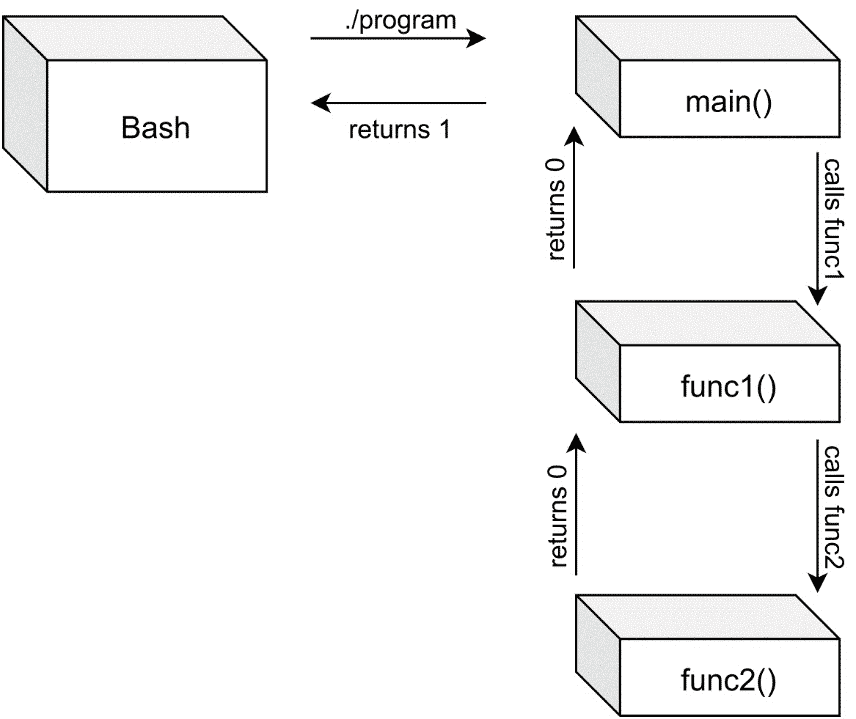

# 二、让你的程序更容易编写

Linux 和其他 **Unix** 系统有强大的**脚本**支持。从一开始，Unix 的全部思想就是让系统易于开发。其中一个特性是获取一个程序的输出，并使其成为另一个程序的输入，从而用现有的程序构建新的工具。在为 Linux 创建程序时，我们应该始终牢记这一点。Unix 的理念是让小程序只做一件事——并且做得很好。通过拥有许多只做一件事的小程序，我们可以自由选择如何组合它们。通过组合小程序，我们可以编写Shell脚本——这是 Unix 和 Linux 中的常见任务。

本章将教我们如何制作易于编写脚本和易于与其他程序交互的程序。这样，其他人会发现它们更有用。他们甚至可能会找到我们从未想过的新的使用我们程序的方式，让程序更受欢迎，更容易使用。

在本章中，我们将介绍以下食谱:

*   返回值以及如何读取它们
*   退出具有相关返回值的程序
*   重定向标准输入、标准输出和标准错误
*   使用管道连接程序
*   写入 stdout 和 stderr
*   从 stdin 读取
*   编写管道友好程序
*   将结果重定向到文件
*   读取环境变量

我们开始吧！

# 技术要求

本章所需要的只是一台安装了 GCC 和 Make 的 Linux 计算机，最好是通过 [*第 1 章*](01.html#_idTextAnchor020)*中提到的元包或组安装之一，获取必要的工具并编写我们的第一个 Linux 程序*。如果您使用 *Bash shell* 以获得最佳兼容性，也是更好的选择。大多数例子也适用于其他Shell，但是不能保证在所有可能的Shell上一切都是一样的。您可以通过在终端中运行`echo $SHELL`来检查您使用的是哪个Shell。如果你用的是 Bash，它会说`/bin/bash`。

你可以从[https://github . com/PacktPublishing/Linux-System-Programming-technologies/tree/master/CH2](https://github.com/PacktPublishing/Linux-System-Programming-Techniques/tree/master/ch2)下载本章所有代码。

查看以下链接，查看《行动守则》视频:[https://bit.ly/3u5VItw](https://bit.ly/3u5VItw)

# 返回值以及如何读取

**返回值**在 Linux 以及其他 Unix 和类似 Unix 的系统中是一件大事。它们在 C 语言编程中也很重要。C 中的大多数函数都用`return`返回一些值。这就是我们用来将值从`main()`返回到 shell 的相同的`return`语句。最初的 Unix 操作系统和 C 编程语言同时出现，并且来自同一个地方。20 世纪 70 年代初，C 语言一完成，Unix 就被改写成了 C 语言。以前，它只是用汇编语言编写的。因此，C 和 Unix 紧密地结合在一起。

返回值在 Linux 中如此重要的原因是我们可以构建 shell 脚本。这些 shell 脚本使用其他程序，希望还有我们的程序作为它的一部分。为了让 shell 脚本能够检查一个程序是否成功，它会读取该程序的返回值。

在这个食谱中，我们将编写一个程序，告诉用户一个文件或目录是否存在。

## 做好准备

建议您在这个食谱中使用 Bash。我不能保证与其他Shell兼容。

## 怎么做…

在这个食谱中，我们将编写一个小的 **shell 脚本**，演示返回值的用途，如何读取它们，以及如何解释它们。让我们开始吧:

1.  在编写代码之前，我们必须调查程序使用了哪些返回值，我们将在脚本中使用这些返回值。执行以下命令，记下我们得到的返回值。`test`命令是一个测试特定条件的小型实用程序。在本例中，我们将使用它来确定文件或目录是否存在。`-e`选项代表*存在*。`test`命令没有给我们任何输出；它只是带着一个返回值退出:

    ```sh
    $> test -e /
    $> echo $?
    0
    $> test -e /asdfasdf
    $> echo $?
    1
    ```

2.  既然我们知道了`test`程序给我们的返回值(文件或目录存在时为 0，否则为 1)，我们就可以继续写脚本了。将以下代码写入一个文件并保存为`exist.sh`。你也可以从[下载。shell 脚本使用`test`命令来确定指定的文件或目录是否存在:

    ```sh
    #!/bin/bash 
    # Check if the user supplied exactly one argument 
    if [ "$#" -ne 1 ]; then 
        echo "You must supply exactly one argument." 
        echo "Example: $0 /etc" 
        exit 1 # Return with value 1 
    fi 
    # Check if the file/directory exists 
    test -e "$1" # Perform the actual test
    if [ "$?" -eq 0 ]; then 
        echo "File or directory exists" 
    elif [ "$?" -eq 1 ]; then 
        echo "File or directory does not exist" 
        exit 3 # Return with a special code so other
               # programs can use the value to see if a 
               # file dosen't exist
    else 
        echo "Unknown return value from test..."
        exit 1 # Unknown error occured, so exit with 1
    fi 
    exit 0 # If the file or directory exists, we exit 
           # with 
    ```](https://github.com/PacktPublishing/Linux-System-Programming-Techniques/blob/master/ch2/exist.sh) 
3.  然后，您需要使用以下命令使其*可执行*:

    ```sh
    $> chmod +x exist.sh
    ```

4.  现在，是时候尝试一下我们的脚本了。我们用存在的目录和不存在的目录来尝试它。我们还会在每次运行后检查退出代码:

    ```sh
    $> ./exist.sh  
    You must supply exactly one argument. 
    Example: ./exist.sh /etc 
    $> echo $?
    1
    $> ./exist.sh /etc 
    File or directory exists 
    $> echo $?
    0
    $> ./exist.sh /asdfasdf 
    File or directory does not exist
    $> echo $?
    3
    ```

5.  现在我们知道它正在工作并留下了正确的退出代码，我们可以编写**一行文字**来与例如`echo`一起使用我们的脚本来打印说明文件或目录是否存在的文本:

    ```sh
    $> ./exist.sh / && echo "Nice, that one exists"
    File or directory exists
    Nice, that one exists
    $> ./exist.sh /asdf && echo "Nice, that one exists"
    File or directory does not exist
    ```

6.  我们还可以编写一个更复杂的单行代码——利用我们在脚本中分配给“文件未找到”的唯一错误代码 3。注意不要在第二行的开头打`>`。当第一行以反斜杠结束时，Shell会自动插入该字符，以指示长行的延续:

    ```sh
    $> ./exist.sh /asdf &> /dev/null; \
    > if [ $? -eq 3 ]; then echo "That doesn't exist"; fi
    That doesn't exist
    ```

## 它是如何工作的…

`test`程序是一个小工具，用于测试文件和目录，比较值，等等。在我们的例子中，我们使用它来测试指定的文件或目录是否存在(对于存在`-e`)。

`test`程序不打印任何东西；它只是安静地退出。然而，它确实留下了一个返回值。我们用`$?`变量检查的就是这个返回值。这也是我们在脚本的`if`语句中检查的同一个变量。

在我们使用的脚本中还有一些其他的特殊变量。第一个是`$#`，包含传递给脚本的**参数**的数量。它的工作原理类似于 c 语言中的`argc`，在剧本一开始，我们将`$#`是否*不等于*与 1 进行了比较(`-ne`代表*不等于*)。如果`$#`不等于 1，将打印一条错误消息，脚本将中止，代码为 1。

之所以把`$#`放在引号里面，只是一种安全机制。如果在某些不可预见的事件中，`$#`包含空格，我们仍然希望将内容评估为单个值，而不是两个值。脚本中其他变量周围的引号也是如此。

下一个特殊变量是`$0`。这个变量包含参数 0，它是程序的名称，就像 C 语言中的`argv[0]`一样，就像我们在 [*第 1 章*](01.html#_idTextAnchor020) *中看到的*，获取必要的工具并编写我们的第一个 Linux 程序*。*

程序的第一个参数存储在`$1`中，如`test`所示。在我们的例子中，第一个参数是我们要测试的文件名或目录。

像我们的 C 程序一样，我们希望我们的脚本以一个相关的返回值(或**退出代码**，因为它也被称为)退出。我们使用`exit`离开脚本并设置一个返回值。如果用户没有精确地提供一个参数，我们将退出代码 1，一个通用的错误代码。如果脚本按应该的方式执行，并且文件或目录存在，我们将退出，代码为 0。如果脚本正常执行，但文件或目录不存在，我们会以代码 3 退出，代码 3 不是为特定用途保留的，但仍然指示错误(所有*非零*代码都是错误代码)。这样，其他脚本可以获取我们脚本的返回值并对其进行操作。

在*第 5 步*中，我们做到了这一点——使用以下命令处理脚本中的退出代码:

```sh
$> ./exist.sh / && echo "Nice, that one exists"
```

`&&`表示“和”。我们可以把整行看做`if`语句。如果`exist.sh`为真，即退出代码 0，则执行`echo`命令。如果`exit`代码不是 0，那么`echo`命令永远不会执行。

在*步骤 6* 中，我们将脚本的所有输出重定向到`/dev/null`，然后使用完整的`if`语句检查错误代码 3。如果遇到错误代码 3，我们会打印一条带有`echo`的信息。

## 还有更多…

我们可以用`test`程序做更多的测试和比较。它们都列在手册里；也就是`man 1 test`。

如果您不熟悉 Bash 和 shell 脚本，手册页中有很多有用的信息，`man 1 bash`。

`&&`的反义词是`||`，发音为“或”因此，与我们在这个食谱中所做的相反的是:

```sh
$> ./exist.sh / || echo "That doesn't exist"
File or directory exists
$> ./exist.sh /asdf || echo "That doesn't exist"
File or directory does not exist
That doesn't exist
```

## 另见

如果你想深入了解 Bash 和 shell 脚本的世界，在*Linux 文档项目*有一个很好的指南:https://tldp.org/LDP/Bash-Beginners-Guide/html/index.html.

# 退出带有相关返回值的程序

在这个食谱中，我们将学习如何用一个相关的**返回值**退出一个 C 程序。我们将从更广的角度来看两种不同的方法来退出一个有返回值的程序，以及`return`如何与系统结合在一起。我们还将了解一些常见的返回值的含义。

## 做好准备

对于这个食谱，我们只需要 GCC 编译器和 Make 工具。

## 怎么做…

我们将在这里编写一个程序的两个不同版本，向您展示退出的两种不同方法。让我们开始吧:

1.  我们将从使用`return`编写第一个版本开始，我们之前已经看到过。但是这次，我们将使用它从**功能**返回，一直返回到`main()`和最终返回到**父进程**，也就是Shell。将以下程序保存在名为`functions_ver1.c`的文件中。所有的返回语句都在下面的代码中突出显示:

    ```sh
    #include <stdio.h>
    int func1(void);
    int func2(void);
    int main(int argc, char *argv[])
    {
       printf("Inside main\n");
       printf("Calling function one\n");
       if (func1())
       {
          printf("Everything ok from function one\n");
          printf("Return with 0 from main - all ok\n");
          return 0;
       }
       else
       {
          printf("Caught an error from function one\n");
          printf("Return with 1 from main - error\n");
          return 1;
       }
       return 0; /* We shouldn't reach this, but 
                    just in case */
    }
    int func1(void)
    {
       printf("Inside function one\n");
       printf("Calling function two\n");
       if (func2())
       {
          printf("Everything ok from function two\n");
          return 1;
       }
       else
       {
          printf("Caught an error from function two\n");
          return 0;
       }
    }
    int func2(void)
    {
       printf("Inside function two\n");
       printf("Returning with 0 (error) from "
          "function two\n");
       return 0;
    }
    ```

2.  现在，**编译**它:

    ```sh
    $> gcc functions_ver1.c -o functions_ver1
    ```

3.  然后，运行它。尝试跟随并查看哪些函数调用并返回到哪些其他函数:

    ```sh
    $> ./functions-ver1
    Inside main 
    Calling function one 
    Inside function one 
    Calling function two 
    Inside function two 
    Returning with 0 (error) from function two 
    Caught an error from function two 
    Caught an error from function one 
    Return with 1 from main – error
    ```

4.  检查返回值:

    ```sh
    $> echo $?
    1
    ```

5.  现在，我们重写前面的程序，改为在函数内部使用`exit()`。接下来会发生的是`exit()`一被调用，程序就会以指定的值**退出**。如果在另一个函数中调用`exit()`，该函数不会先返回`main()`。将以下程序保存在一个新文件中作为`functions_ver2.c`。所有`return`和`exit`语句在以下代码中突出显示:

    ```sh
    #include <stdio.h>
    #include <stdlib.h>
    int func1(void);
    int func2(void);
    int main(int argc, char *argv[])
    {
       printf("Inside main\n");
       printf("Calling function one\n");
       if (func1())
       {
          printf("Everything ok from function one\n");
          printf("Return with 0 from main - all ok\n");
          return 0;
       }
       else
       {
          printf("Caught an error from funtcion one\n");
          printf("Return with 1 from main - error\n");
          return 1;
       }
       return 0; /* We shouldn't reach this, but just 
                    in case */
    }
    int func1(void)
    {
       printf("Inside function one\n");
       printf("Calling function two\n");
       if (func2())
       {
          printf("Everything ok from function two\n");
          exit(0);
       }
       else
       {
          printf("Caught an error from function two\n");
          exit(1);
       }
    }
    ```

6.  现在，编译这个版本:

    ```sh
    $> gcc functions_ver2.c -o functions_ver2
    ```

7.  然后，运行它并看看会发生什么(并比较上一个程序的输出):

    ```sh
    $> ./functions_ver2
    Inside main
    Calling function one
    Inside function one
    Calling function two
    Inside function two
    Returning with (error) from function two
    ```

8.  最后，检查返回值:

    ```sh
    $> echo $?
    1
    ```

## 它是如何工作的…

请注意，在 C 中，0 被认为是*假*或错误，而其他任何东西都被认为是*真*(或正确)。这与Shell的返回值相反。这一开始可能有点令人困惑。然而，就Shell而言，0“一切正常”，而其他任何东西都表示错误。

两个版本的区别在于函数和整个程序如何返回。在第一个版本中，每个函数都返回到调用函数——按照它们被调用的顺序。在第二个版本中，每个函数都以`exit()`函数退出。这意味着程序将直接退出，并将指定的值返回给 shell。第二个版本不是好的实践；回到调用函数要好得多。如果其他人在另一个程序中使用你的函数，它突然退出整个程序，那将是一个很大的惊喜。我们通常不这么做。不过，我想在这里演示一下`exit()`和`return`的区别。

我还想证明另一点。就像一个函数用`return`返回到它的调用函数一样，一个程序也以同样的方式返回到它的父进程(通常是 shell)。因此，在某种程度上，Linux 中的程序被视为程序中的函数。

下图显示了【Bash 如何调用程序(上箭头)，该程序从`main()`开始，然后调用下一个函数(右边的箭头)，以此类推。左边返回的箭头显示了每个函数如何返回到调用函数，然后最终返回到 Bash:



图 2.1–呼叫和返回

## 还有更多…

我们可以使用更多的返回代码。最常见的是我们在这里看到的；`0`为*ok*`1`为*错误*。然而，除了`0`之外的所有其他代码都表示某种形式的错误。代码`1`是一般错误，其他错误代码比较具体。没有确切的标准，但有一些常用的代码。一些最常见的代码如下:


图 2.2–Linux 和其他类似 UNIX 的系统中常见的错误代码

除了这些代码，在`/usr/include/sysexit.h`的末尾还列出了一些额外的代码。该文件中列出的代码范围从`64`到`78`，并解决数据格式错误、服务不可用、**输入/输出**错误等错误。

# 重定向标准输入、标准输出和标准错误

在本食谱中，我们将学习如何将**重定向** *标准输入*、*标准输出*、*标准错误*到文件和中。将数据重定向到文件和从文件重定向是 Linux 和其他 Unix 系统的基本原则之一。

**stdin** 是**标准输入**的简写字。**标准输出**和**标准误差**分别是**标准输出**和**标准误差**的简写。

## 做好准备

出于兼容性的目的，我们最好将 Bash shell 用于这个配方。

## 怎么做…

为了掌握重定向的窍门，我们将在这里进行一系列实验。我们真的要扭转方向，看到 stdout、stderr 和 stdin 以各种方式运行。让我们开始吧:

1.  让我们从保存顶级根目录中的文件和目录列表开始。我们可以通过将标准的输出(stdout)从`ls`命令重定向到一个文件中来做到这一点:

    ```sh
    $> cd
    $> ls / > root-directory.txt
    ```

2.  现在，看一下带有`cat` :

    ```sh
    $> cat root-directory.txt
    ```

    的文件
3.  现在，让我们尝试使用`wc`命令来计算行数、字数和字符数。输入完信息后记得按*Ctrl+D*:

    ```sh
    $> wc
    hello,
    how are you?
    *Ctrl+D*
         2       4      20
    ```

4.  现在我们知道了`wc`是如何工作的，我们可以将它的输入改为来自一个文件——我们用文件列表

    ```sh
    $> wc < root-directory.txt
    29  29 177
    ```

    创建的文件
5.  标准误差呢？标准误差是它自己的输出流，与标准输出分开。如果我们重定向标准输出并生成错误，我们仍然会在屏幕上看到错误消息。我们来试试:

    ```sh
    $> ls /asdfasdf > non-existent.txt
    ls: cannot access '/asdfasdf': No such file or directory
    ```

6.  就像标准输出一样，我们可以重定向标准错误。请注意，我们在这里没有收到任何错误消息:

    ```sh
    $> ls /asdfasdf 2> errors.txt
    ```

7.  错误信息保存在`errors.txt` :

    ```sh
    $> cat errors.txt
    ls: cannot access '/asdfasdf': No such file or directory
    ```

    中
8.  我们甚至可以将标准输出和标准错误同时重定向到不同的文件:

    ```sh
    $> ls /asdfasdf > root-directory.txt 2> errors.txt
    ```

9.  为了方便起见，我们还可以将标准输出和错误重定向到同一个文件中:

    ```sh
    $> ls /asdfasdf &> all-output.txt
    ```

10.  我们甚至可以同时重定向所有三个(stdin、stdout 和 stderr):

    ```sh
    $> wc < all-output.txt > wc-output.txt 2> \
    > wc-errors.txt
    ```

11.  我们也可以从 shell 中写入标准错误来写入我们自己的错误消息:

    ```sh
    $> echo hello > /dev/stderr
    hello
    ```

12.  从 Bash 向 stderr 打印消息的另一种方式如下:

    ```sh
    $> echo hello 1>&2
    hello
    ```

13.  然而，这并不能证明我们的问候信息被打印到标准错误。我们可以通过将标准输出重定向到一个文件来证明这一点。如果我们仍然看到错误信息，那么它将被打印在标准错误上。当我们这样做时，我们需要将第一条语句包装在括号中，以将其与最后一条重定向分开:

    ```sh
    $> (echo hello > /dev/stderr) > hello.txt
    hello
    $> (echo hello 1>&2) > hello.txt
    hello
    ```

14.  Stdin、stdout 和 stderr 由`/dev`目录中的文件表示。这意味着我们甚至可以从文件中重定向 stdin。这个实验没有做任何有用的事情——我们本可以直接输入`wc`，但它证明了一点:

    ```sh
    $> wc < /dev/stdin
    hello, world!
    *Ctrl+D*
         1       2      14
    ```

15.  所有这些意味着我们甚至可以将标准错误消息重定向回标准输出:

    ```sh
    $> (ls /asdfasdf 2> /dev/stdout) > \ 
    > error-msg-from-stdout.txt
    $> cat error-msg-from-stdout.txt 
    ls: cannot access '/asdfasdf': No such file or directory
    ```

## 它是如何工作的…

标准输出，或 stdout，是程序的所有正常输出被打印的地方。Stdout 也称为**文件描述符** 1。

标准错误，或*标准错误*，是打印所有错误信息的地方。Stderr 也被称为文件描述符 2。这就是为什么我们在将 stderr 重定向到一个文件时使用了`2>`。如果我们想的话，为了清楚起见，我们可以将 *stdout* 重定向为`1>`，而不仅仅是`>`。但是`>`的默认重定向是 stdout，所以没有必要这样做。

当我们在*步骤 9* 中重定向 stdout 和 stderr 时，我们使用了`&`标志。其内容为“标准输出*和*标准误差”。

标准输入或*标准输入*是读取所有输入数据的地方。Stdin 也被称为文件描述符 0。Stdin 用`<`重定向，但是就像 stdout 和 stderr 一样，我们也可以把它写成`0<`。

将两个输出(stdout 和 stderr)分开的原因是，当我们将输出从一个程序重定向到一个文件时，我们应该仍然能够在屏幕上看到错误信息。我们也不希望文件被错误信息弄得杂乱无章。

有了单独的输出，还可以有一个文件作为实际输出，另一个文件作为错误消息的日志文件。这在脚本中特别方便。

你可能听过这样一句话“*Linux 中的一切不是文件就是进程*”。那句话是真的。Linux 中除了文件或者进程之外，没有其他的*东西*。我们对`/dev/stdout`、`/dev/stderr`和`/dev/stdin`的实验证明了这一点。文件甚至代表程序的输入和输出。

在*步骤 11* 中，我们将输出重定向到`/dev/stderr`文件，这是标准错误。因此，信息被打印在标准错误上。

在*第 12 步*中，我们几乎做了同样的事情，但是没有使用实际的设备文件。滑稽的`1>&2`重定向显示为“*向标准错误*发送标准输出”。

## 还有更多…

例如，我们可以使用 **fd** 代表**文件描述符**，而不是使用`/dev/stderr`。同样的道理也适用于 stdout，也就是`/dev/fd/1`，和 stdin，也就是`/dev/fd/0`。例如，下面将把列表打印到 stderr:

```sh
$> ls / > /dev/fd/2
```

就像我们可以用`1>&2`将标准输出发送到标准误差一样，我们可以用`2>&1`做相反的事情，也就是说我们可以将标准误差发送到标准输出。

# 使用管道连接程序

在这个食谱中，我们将学习如何使用**管道**连接程序。当我们编写我们的 C 程序时，我们总是想努力使它们易于与其他程序一起管道化。这样，我们的程序会更有用。有时，与管道连接的程序被称为**过滤器**。这样做的原因是，通常，当我们用管道连接程序时，是为了过滤或转换一些数据。

## 做好准备

就像前面的食谱一样，建议我们使用 Bash shell。

## 怎么做…

按照以下步骤探索 Linux 中的管道:

1.  我们已经从之前的食谱中熟悉了`wc`和`ls`。在这里，我们将使用它们和一个管道来统计系统根目录中的文件和目录的数量。管道是垂直线符号:

    ```sh
    $> ls / | wc -l
    29
    ```

2.  让我们把事情变得更有趣一点。这次，我们只想在根目录中列出**符号链接**(通过使用两个带管道的程序)。结果将因系统而异:

    ```sh
    $> ls -l / | grep lrwx
    lrwxrwxrwx   1 root root    31 okt 21 06:53 initrd.img -> boot/initrd.img-4.19.0-12-amd64
    lrwxrwxrwx   1 root root    31 okt 21 06:53 initrd.img.old -> boot/initrd.img-4.19.0-11-amd64
    lrwxrwxrwx   1 root root    28 okt 21 06:53 vmlinuz -> boot/vmlinuz-4.19.0-12-amd64
    lrwxrwxrwx   1 root root    28 okt 21 06:53 vmlinuz.old -> boot/vmlinuz-4.19.0-11-amd64
    ```

3.  现在，我们只需要的实际文件名，而不是关于它们的信息。所以，这一次，我们将在最后添加另一个名为`awk`的程序。在这个例子中，我们告诉`awk`打印第九个字段。一个或多个空格分隔每个字段:

    ```sh
    $> ls -l / | grep lrwx | awk '{ print $9 }'
    initrd.img
    initrd.img.old
    vmlinuz
    vmlinuz.old
    ```

4.  我们可以添加另一个“**过滤器**”，一个在每个链接前面添加一些文本的过滤器。这可以通过`sed`–`s`表示*替代*来实现。然后，我们可以告诉`sed`我们要用文本`This is a link:` :

    ```sh
    $> ls -l / | grep lrwx | awk '{ print $9 }' \
    > | sed 's/^/This is a link: /'
    This is a link: initrd.img
    This is a link: initrd.img.old
    This is a link: vmlinuz
    This is a link: vmlinuz.old
    ```

    替换行首(`^`)

## 它是如何工作的…

这里发生了很多事情，但是如果你没有得到所有，不要感到气馁。这个配方的重要性在于演示如何使用*管道*(垂直线符号，`|`)。

在第一步中，我们使用`wc`计算文件系统根目录中的文件和目录的数量。当交互运行`ls`时，我们会得到一个跨越终端宽度的好看的列表。输出也很可能是彩色编码的。但是当我们通过管道重定向输出来运行`ls`时，`ls`没有真正的输出终端，所以它返回到每行输出一个文件或目录的文本，没有任何颜色。如果您愿意，您可以通过运行以下命令亲自尝试:

```sh
$> ls / | cat
```

由于`ls`每行输出一个文件或目录，我们可以用`wc`(T2)选项来计算行数。

在下一步(*步骤 2* )中，我们使用`grep`仅从`ls -l`的输出中列出链接。`ls -l`输出中的链接以行首的字母`l`开始。之后是访问权，对于链接来说是每个人的`rwx`。这就是我们用`lrwx`和`grep`搜索的。

然后，我们只需要实际的文件名，所以我们添加了一个名为`awk`的程序。`awk`工具允许我们在输出中选择特定的列或字段。我们挑出第九列(`$9`)，这是文件名。

通过另外两个工具运行`ls`的输出，我们创建了一个只有根目录中链接的列表。

在*第三步*中，我们添加了另一个工具，或者有时叫做过滤器。这个工具是`sed`，一个*流编辑器*。有了这个程序，我们可以对文本进行修改。在这种情况下，我们在每个链接前面添加了文本`This is a link:`。以下是对该行的简短解释:

```sh
sed 's/^/This is a link: /'
```

`s`表示“替代品”；也就是说，我们希望修改一些文本。在前两个斜线(`/`)中是应该与我们想要修改的内容相匹配的文本或表达式。在这里，我们有行的开始，`^`。然后，在第二个斜线之后，我们有我们想要替换匹配文本的文本，直到最后一个斜线。这里，我们有文字`This is a link:`。

## 还有更多…

小心不必要的管道；很容易陷入没完没了的管道中。一个愚蠢但有启发性的例子是:

```sh
$> ls / | cat | grep tmp
tmp
```

我们可以省去`cat`而仍然得到相同的结果:

```sh
$> ls / | grep tmp
tmp
```

这一次也是如此(我时常为自己感到内疚):

```sh
$> cat /etc/passwd | grep root
root:x:0:0:root:/root:/bin/bash
```

根本没有理由管前面的例子。`grep`实用程序可以接受文件名参数，如下所示:

```sh
$> grep root /etc/passwd
root:x:0:0:root:/root:/bin/bash
```

## 另见

对于任何对 Unix 的历史和管道有多远感兴趣的人来说，YouTube 上有一段 1982 年的激动人心的视频，由美国电话电报公司上传:[https://www.youtube.com/watch?v=tc4ROCJYbm0](https://www.youtube.com/watch?v=tc4ROCJYbm0)。

# 写入 stdout 和 stderr

在这个食谱中，我们将学习如何在一个 C 程序中将文本打印到 *stdout* 和 *stderr* 上。在前面的两个食谱中，我们了解了什么是 stdout 和 stderr，它们为什么存在，以及如何重定向它们。现在，轮到我们编写正确的程序，在标准错误上输出错误消息，在标准输出上输出常规消息。

## 怎么做…

按照以下步骤学习如何在 C 程序中将输出写入 stdout 和 stderr:

1.  将以下代码写入名为`output.c`的文件并保存。在这个程序中，我们将使用三个不同的函数来编写输出:`printf()`、`fprintf()`和`dprintf()`。使用`fprintf()`，我们可以指定一个文件流，如 stdout 或 stderr，而使用`dprintf()`，我们可以指定文件描述符(1 用于 stdout，2 用于 stderr，就像我们之前看到的那样):

    ```sh
    #define _POSIX_C_SOURCE 200809L
    #include <stdio.h>
    int main(void)
    {
       printf("A regular message on stdout\n");
       /* Using streams with fprintf() */
       fprintf(stdout, "Also a regular message on " 
         	 "stdout\n");
       fprintf(stderr, "An error message on stderr\n");
       /* Using file descriptors with dprintf().
        * This requires _POSIX_C_SOURCE 200809L 
        * (man 3 dprintf)*/
       dprintf(1, "A regular message, printed to "
          	  "fd 1\n");
       dprintf(2, "An error message, printed to "
          	   "fd 2\n");
       return 0;
    }
    ```

2.  编译程序:

    ```sh
    $> gcc output.c -o output
    ```

3.  像平常一样运行程序会:

    ```sh
    $> ./output 
    A regular message on stdout
    Also a regular message on stdout
    An error message on stderr
    A regular message, printed to fd 1
    An error message, printed to fd 2
    ```

4.  为了证明常规消息被打印到 stdout，我们可以将错误消息发送到`/dev/null`，Linux 系统中的一个黑洞。这样做只会显示打印到 stdout 的消息:

    ```sh
    $> ./output 2> /dev/null 
    A regular message on stdout
    Also a regular message on stdout
    A regular message, printed to fd 1
    ```

5.  现在，我们将做相反的事情；我们将把打印到 stdout 的消息发送到`/dev/null`，只显示打印到 stderr 的错误消息:

    ```sh
    $> ./output > /dev/null
    An error message on stderr
    An error message, printed to fd 2
    ```

6.  最后，让我们将所有消息从 stdout 和 stderr 发送到`/dev/null`。这将不会显示任何内容:

    ```sh
    $> ./output &> /dev/null
    ```

## 它是如何工作的…

我们使用`printf()`的第一个例子，不包含任何新的或独特的东西。所有用常规`printf()`功能打印的输出都打印到 stdout。

然后，我们看到了一些新的例子，包括我们使用`fprintf()`的两行。该功能`fprintf()`允许我们指定一个**文件流**来打印文本。我们将在本书后面介绍什么是流。但简而言之，文件流是我们在使用标准库读取或写入 C 语言文件时通常打开的。记住，在 Linux 中，所有的东西要么是一个文件，要么是一个进程。当一个程序在 Linux 中打开时，会自动打开三个文件流——stdin、stdout 和 stderr(假设该程序包含`stdio.h`)。

然后，我们看了一些使用`dprintf()`的例子。该功能允许我们指定一个**文件描述符**来打印。我们在本章前面的食谱中介绍了文件描述符，但是我们将在本书后面更深入地讨论它们。在我们在 Linux 上编写的每个程序中，有三个文件描述符总是打开的——0(stdin)、1 (stdout)和 2 (stderr)。这里，我们将常规消息打印到文件描述符( *fd* 的缩写)1，将错误消息打印到文件描述符 2。

为了在我们的代码中保持正确，为了`dprintf()`，我们需要包含第一行(第`#define`行)。我们可以在手册页(`man 3 dprintf`)的*特性测试宏需求*下了解到这一切。我们定义的**宏**`_POSIX_C_SOURCE`，是为了 **POSIX** 标准和兼容性。我们将在本书后面更深入地讨论这个问题。

当我们测试程序时，我们通过将错误消息重定向到一个名为`/dev/null`的文件来验证常规消息是否被打印到标准输出，该文件仅显示打印到标准输出的消息。然后，我们进行相反的操作，以验证错误消息是否打印为标准错误。

特殊文件`/dev/null`在 Linux 和其他 Unix 系统中充当黑洞。我们发送到该文件的所有内容都会消失。比如用`ls / &> /dev/null`试试。没有输出将被显示，因为一切都被重定向到黑洞。

## 还有更多…

我提到在一个程序中打开三个文件流，假设它包括`stdio.h`，以及三个文件描述符。这三个文件描述符总是打开的，即使不包括`stdio.h`。如果我们包括`unistd.h`，我们也可以使用三个文件描述符的宏名称。

下表显示了这些文件描述符、它们的宏名和文件流，便于将来参考:


图 2.3–Linux 中的文件描述符和文件流

# 从 stdin 读取

在这个食谱中，我们将学习如何用 C 语言编写一个从标准输入读取的程序。这样做可以让你的程序通过一个*管道*从其他程序获取输入，使它们更容易作为过滤器使用，从而使它们从长远来看更加有用。

## 做好准备

您将需要 GCC 编译器，最好是 Bash Shell来实现这个方法，尽管它应该可以与任何Shell一起工作。

要完全理解我们将要编写的程序，您应该看一个 ASCII 表，其示例可以在以下网址找到:[https://github . com/PacktPublishing/Linux-System-Programming-technologies/blob/master/CH2/ASCII-table . MD](https://github.com/PacktPublishing/Linux-System-Programming-Techniques/blob/master/ch2/ascii-table.md)。

## 怎么做…

在这个食谱中，我们将编写一个程序，该程序以单个单词为输入，将转换为它们的大小写(大写转换为小写，小写转换为大写)，并将结果打印到标准输出。让我们开始吧:

1.  将以下代码写入文件并保存为`case-changer.c`。在这个程序中，我们使用`fgets()`从 stdin 中读取字符。然后，我们使用`for`循环逐个字符地循环输入。在我们用下一行输入开始下一个循环之前，我们必须使用`memset()` :

    ```sh
    #include <stdio.h>
    #include <string.h>
    int main(void)
    {
        char c[20] = { 0 };
        char newcase[20] = { 0 };
        int i;
        while(fgets(c, sizeof(c), stdin) != NULL)
        {
            for(i=0; i<=sizeof(c); i++)
            {
                /* Upper case to lower case */
                if ( (c[i] >= 65) && (c[i] <= 90) )
                {
                    newcase[i] = c[i] + 32;
                }
                /* Lower case to upper case */
                if ( (c[i] >= 97 && c[i] <= 122) )
                {
                    newcase[i] = c[i] - 32;
                }
            }
            printf("%s\n", newcase);
            /* zero out the arrays so there are no
               left-overs in the next run */
            memset(c, 0, sizeof(c));
            memset(newcase, 0, sizeof(newcase));
        }
        return 0;
    }
    ```

    将数组清零
2.  编译程序:

    ```sh
    $> gcc case-changer.c -o case-changer
    ```

3.  试着在里面输入一些单词。按 *Ctrl + D* :

    ```sh
    $> ./case-changer
    hello
    HELLO
    AbCdEf
    aBcDeF
    ```

    退出程序
4.  现在，试着将*管道*中的一些输入其中，例如，从`ls` :

    ```sh
    $> ls / | head -n 5 | ./case-changer
    BIN
    BOOT
    DEV
    ETC
    HOME
    ```

    开始的前五行
5.  让我们试着从一个手册页中输入一些大写的单词:

    ```sh
    $> man ls | egrep '^[A-Z]+$' | ./case-changer 
    name
    synopsis
    description
    author
    copyrigh
    ```

## 它是如何工作的…

首先，我们创建了两个各 20 字节的字符**数组**，并将它们初始化为 0。

然后，我们使用包装在`while`循环中的`fgets()`从标准输入中读取字符。`fgets()`函数读取字符，直到到达一个*换行符*或一个**文件结束符** ( **EOF** )。读取的字符存储在`c`数组中，也返回。

为了读取更多的输入——也就是说，不止一个单词——我们在`while`循环的帮助下继续读取输入。直到我们按下 *Ctrl + D* 或者输入流为空，`while`循环才会结束。

`fgets()`函数返回成功时读取的字符和错误时读取的字符，或者当没有读取字符时(即没有更多的输入)出现电渗流时。让我们分解`fgets()`函数，以便更好地理解它:

```sh
fgets(c, sizeof(c), stdin)
```

第一个参数`c`，是我们存储数据的地方。在这种情况下，它是我们的字符数组。

第二个参数`sizeof(c)`，是我们想要读取的最大大小。`fgets()`功能在这里是安全的；它的读数比我们指定的尺寸小一个。在我们的例子中，它将只读取 19 个字符，为**空字符**留出的空间。

最后也是第三个参数`stdin`，是我们想要读取的流——在我们的例子中，是标准输入。

在`while`循环中是进行大小写转换的地方，在`for`循环中一个字符接一个字符。在第一个`if`语句中，我们检查当前字符是否是大写字符。如果是，那么我们给这个角色加上 32。例如，如果字符是 *A* ，则在 **ASCII 表**中用 65 表示。加 32，得到 97，就是 *a* 。整个字母表也是如此。大小写字母之间总是相隔 32 个字符。

下一个`if`语句则相反。如果字符是小写的，我们减去 32，得到大写的版本。

由于我们只检查 65 到 90 之间以及 97 到 122 之间的字符，因此所有其他字符都被忽略。

一旦我们将结果打印在屏幕上，我们就用`memset()`将字符数组重置为全零。如果我们不这样做，我们将在下一次运行中有剩余的字符。

### 使用程序

我们通过交互运行程序并在其中输入单词来尝试这个程序。每次我们按下*进入*键，这个词就转换了；大写字母将变成小写字母，反之亦然。

然后，我们从`ls`命令向它传输数据。输出被转换成大写字母。

然后，我们尝试从手册页(标题)中用大写字母来引导它。手册页中的所有标题都是大写的，从行首开始。这就是我们用`egrep`来“grep”的目的，然后管道到我们的`case-changer`程序。

## 还有更多…

有关`fgets()`的更多信息，请参见手册页`man 3 fgets`。

你可以写一个小程序来打印字母 *a-z* 和 *A-Z* 的最小 ASCII 表。这个小程序还演示了每个字符由一个数字表示:

ascii-table.c

```sh
#include <stdio.h>
int main(void)
{
    char c;
    for (c = 65; c<=90; c++)
    {
        printf("%c = %d    ", c, c); /* upper case */
        printf("%c = %d\n", c+32, c+32); /* lower case */
    }
    return 0;
}
```

# 编写管道友好程序

在这个食谱中，我们将学习如何编写一个管道友好的程序。它将从标准输入中获取输入，并在标准输出中输出结果。任何错误信息都将打印在标准错误上。

## 做好准备

我们需要 GCC 编译器，GNU Make，最好是这个配方的 **Bash** Shell。

## 怎么做…

在这个食谱中，我们将编写一个程序，将每小时英里数转换为每小时公里数。作为测试，我们将从一个文本文件中把*数据*传输到它上面，该文本文件包含以平均速度进行的汽车试运行的测量值。文本文件是在**英里每小时** ( **英里每小时**)，但我们希望他们在**公里每小时** ( **公里每小时**)代替。让我们开始吧:

1.  首先创建以下文本文件或从[网站下载。如果是你自己创造的，命名为`avg.txt`。本文将作为我们将要编写的程序的输入。本文模拟汽车试运行的测量值:

    ```sh
    10-minute average: 61 mph
    30-minute average: 55 mph
    45-minute average: 54 mph
    60-minute average: 52 mph
    90-minute average: 52 mph
    99-minute average: nn mph
    ```](https://github.com/PacktPublishing/Linux-System-Programming-Techniques/blob/master/ch2/avg.txt) 
2.  现在，创建实际的程序。输入以下代码并将其保存为`mph-to-kph.c`，或从[https://GitHub . com/PacktPublishing/Linux-System-Programming-technologies/blob/master/CH2/mph-to-kph . c](https://github.com/PacktPublishing/Linux-System-Programming-Techniques/blob/master/ch2/mph-to-kph.c)下载。这个程序将把每小时英里数转换成每小时公里数。该转换在`printf()`语句中执行:

    ```sh
    #include <stdio.h>
    #include <stdlib.h>
    #include <string.h>
    int main(void)
    {
        char mph[10] = { 0 };
        while(fgets(mph, sizeof(mph), stdin) != NULL)
        {
            /* Check if mph is numeric 
             * (and do conversion) */
            if( strspn(mph, "0123456789.-\n") == 
                strlen(mph) )
            {
                printf("%.1f\n", (atof(mph)*1.60934) );
            }
            /* If mph is NOT numeric, print error 
             * and return */
            else
            {
                fprintf(stderr, "Found non-numeric" 
                    " value\n");
                return 1;
            }
        }
        return 0;
    }
    ```

3.  编译程序:

    ```sh
    $> gcc mph-to-kph.c -o mph-to-kph
    ```

4.  通过交互运行测试程序。输入一些英里每小时的数值，并在每个数值后点击*输入*。程序会以公里每小时为单位打印出相应的数值:

    ```sh
    $> ./mph-to-kph 
    50
    80.5
    60
    96.6
    100
    160.9
    hello
    Found non-numeric value
    $> echo $?
    1
    $> ./mph-to-kph
    50
    80.5
    *Ctrl+D*
    $> echo $?
    0
    ```

5.  现在，是时候使用我们的程序作为过滤器，将包含每小时英里数的表转换为每小时公里数。但是首先，我们必须只过滤掉 mph 值。我们可以通过`awk` :

    ```sh
    $> cat avg.txt | awk '{ print $3 }'
    61
    55
    54
    52
    52
    nn
    ```

    来做到这一点
6.  现在我们只有一个数字列表，我们可以在最后添加我们的`mph-to-kph`程序来转换值:

    ```sh
    $> cat avg.txt | awk '{ print $3 }' | ./mph-to-kph 
    98.2
    88.5
    86.9
    83.7
    83.7
    Found non-numeric value
    ```

7.  由于最后一个值是`nn`，一个非数值，这是测量中的一个错误，我们不想在输出中显示错误信息。因此，我们将 stderr 重定向到`/dev/null`。请注意重定向前表达式周围的括号:

    ```sh
    $> (cat avg.txt | awk '{ print $3 }' | \ 
    > ./mph-to-kph) 2> /dev/null
    98.2
    88.5
    86.9
    83.7
    83.7
    ```

8.  这个好看多了！但是，我们也要在每条线的末尾加上*公里/小时*才能知道值多少。我们可以用`sed`来完成这个:

    ```sh
    $> (cat avg.txt | awk '{ print $3 }' | \ 
    > ./mph-to-kph) 2> /dev/null | sed 's/$/ km\/h/'
    98.2 km/h
    88.5 km/h
    86.9 km/h
    83.7 km/h
    83.7 km/h
    ```

## 它是如何工作的…

这个程序类似于上一个食谱中的。我们在这里添加的功能检查输入数据是否是数字，如果不是，程序将中止，并显示一条错误消息，打印到 stderr。只要没有错误，常规输出仍然打印到 stdout。

程序只打印数值，不打印其他信息。这使得它作为过滤器更好，因为 *km/h* 文本可以由用户用其他程序添加。这样，该程序可以用于更多我们没有考虑过的场景。

我们检查数字输入的行可能需要一些解释:

```sh
if( strspn(mph, "0123456789.-\n") == strlen(mph) )
```

`strspn()`函数只读取我们在函数的第二个参数中指定的字符，然后返回读取的字符数。然后，我们可以将`strspn()`读取的字符数与字符串的整个长度进行比较，这是通过`strlen()`获得的。如果匹配，我们知道每个字符要么是数字，要么是点，要么是减号，要么是换行符。如果它们不匹配，这意味着在字符串中发现了非法字符。

为了`strspn()`和`strlen()`工作，我们包括了`string.h`。为了`atof()`工作，我们包括了`stdlib.h`。

### 将数据传送到程序

在*第 5 步*中，我们使用`awk`程序仅选择了第三个字段 mph 值。awk `$3`变量表示字段编号 3。每个字段都是一个新单词，用空格隔开。

在*第 6 步*中，我们将`awk`程序的输出 mph 值——重定向到我们的`mph-to-kph`程序中。结果，我们的程序在屏幕上打印了 km/h 值。

在*第 7 步*中，我们将错误信息重定向到`/dev/null`，这样程序的输出就干净了。

最后，在*第 8 步*中，我们在输出中的 kph 值后添加了文本 *km/h* 。我们通过使用`sed`程序做到了这一点。`sed`程序可能看起来有点神秘，所以让我们分解一下:

```sh
sed 's/$/ km\/h/'
```

这个`sed`脚本和我们之前看到的类似。但是这一次，我们用`$`符号代替了行尾的`^`符号。所以，我们在这里所做的是用文本“km/h”替换行尾。但是，请注意，我们需要用反斜杠将“/km/h”中的斜杠*转义为*。

## 还有更多…

在各自的手册页中有很多关于`strlen()`和`strspn()`的有用信息。你可以用`man 3 strlen`和`man 3 strspn`阅读它们。

# 将结果重定向到文件

在这个食谱中，我们将学习如何将一个程序的输出重定向到两个不同的文件。我们还将学习一些在编写**过滤器**时的最佳实践，这是一个专门为用管道与其他程序连接而制作的程序。

我们将在这个配方中构建的程序是前一个配方的新版本。上一个食谱中的`mph-to-kph`程序有一个缺点:当它发现一个非数字字符时，它总是停止。通常，当我们对长输入数据运行过滤器时，我们希望程序继续运行，即使它检测到一些错误的数据。这是我们将在这个版本中修复的内容。

我们将保持默认行为，就像以前一样；也就是说，当遇到非数值时，它将中止程序。但是，我们将添加一个选项(`-c`)，这样即使检测到非数值，它也可以继续运行程序。然后，由最终用户决定他或她希望如何运行它。

## 做好准备

本章*技术要求*部分列出的所有要求都适用于此处(GCC 编译器、Make 工具和 Bash shell)。

## 怎么做…

这个程序会稍微长一点，但是如果你愿意的话，你可以从 GitHub 下载，网址是[https://GitHub . com/PacktPublishing/Linux-System-Programming-technologies/blob/master/CH2/mph-to-kph _ v2 . c](https://github.com/PacktPublishing/Linux-System-Programming-Techniques/blob/master/ch2/mph-to-kph_v2.c)。由于代码有点长，我将把它分成几个步骤。然而，所有的代码仍然保存在一个名为`mph-to-kph_v2.c`的文件中。让我们开始吧:

1.  让我们从功能宏和所需的头文件开始。既然要用`getopt()`，就需要`_XOPEN_SOURCE`宏，以及`unistd.h`头文件:

    ```sh
    #define _XOPEN_SOURCE 500
    #include <stdio.h>
    #include <stdlib.h>
    #include <string.h>
    #include <unistd.h
    ```

2.  接下来，我们将为帮助函数添加函数原型。我们也将开始编写`main()`函数体:

    ```sh
    void printHelp(FILE *stream, char progname[]);
    int main(int argc, char *argv[])
    {
       char mph[10] = { 0 };
       int opt;
       int cont = 0; 
    ```

3.  然后，我们将在一个`while`循环中添加`getopt()`功能。这是类似于*从 [*第 1 章*](01.html#_idTextAnchor020) *编写解析命令行选项配方*的程序，获取必要的工具并编写我们的第一个 Linux 程序* :

    ```sh
    /* Parse command-line options */    
       while ((opt = getopt(argc, argv, "ch")) != -1)
       {
          switch(opt)
          {
             case 'h':
                printHelp(stdout, argv[0]);
                return 0;
             case 'c':
                cont = 1;
                break;
             default:
                printHelp(stderr, argv[0]);
                return 1;
          }
       }
    ```

4.  然后，我们必须创建另一个`while`循环，我们将使用`fgets()` :

    ```sh
    while(fgets(mph, sizeof(mph), stdin) != NULL)
       {
          /* Check if mph is numeric 
           * (and do conversion) */
          if( strspn(mph, "0123456789.-\n") == 
                strlen(mph) )
          {
             printf("%.1f\n", (atof(mph)*1.60934) );
          }
          /* If mph is NOT numeric, print error 
           * and return */
          else
          {
             fprintf(stderr, "Found non-numeric " 
                "value\n");
             if (cont == 1) /* Check if -c is set */
             {
                continue; /* Skip and continue if 
                           * -c is set */
             }
             else
             {
                return 1; /* Abort if -c is not set */
             }
          }
       }
       return 0;
    }
    ```

    从 stdin 获取数据
5.  最后，我们必须为`help`函数写函数体:

    ```sh
    void printHelp(FILE *stream, char progname[])
    {
       fprintf(stream, "%s [-c] [-h]\n", progname);
       fprintf(stream, " -c continues even though a non" 
          "-numeric value was detected in the input\n"
          " -h print help\n");
    } 
    ```

6.  使用 Make:

    ```sh
    $> make mph-to-kph_v2
    cc     mph-to-kph_v2.c   -o mph-to-kph_v2
    ```

    编译程序
7.  让我们在没有任何选项的情况下，通过给它一些数值和一个非数值来尝试一下。结果应该和我们之前收到的一样:

    ```sh
    $> ./mph-to-kph_v2 
    60
    96.6
    40
    64.4
    hello
    Found non-numeric value
    ```

8.  现在，让我们使用`-c`选项来尝试一下，这样即使检测到非数值，我们也可以继续运行程序。在程序中输入一些数值和非数值:

    ```sh
    $> ./mph-to-kph_v2 -c
    50
    80.5
    90
    144.8
    hello
    Found non-numeric value
    10
    16.1
    20
    32.2
    ```

9.  效果很好！现在，让我们向`avg.txt`文件添加一些更多的数据，并将其保存为`avg-with-garbage.txt`。这一次，非数值的行会更多。你也可以从[下载文件](https://github.com/PacktPublishing/Linux-System-Programming-Techniques/blob/master/ch2/avg-with-garbage.txt)
10.  现在，让我们再次在文件上运行以仅查看值:

    ```sh
    $> cat avg-with-garbage.txt | awk '{ print $3 }'
    61
    55
    54
    52
    52
    nn
    49
    47
    nn
    data
    43
    ```

11.  真相大白的时刻到了。让我们用`-c`选项在最后添加`mph-to-kph_v2`程序。这会将所有 mph 值转换为 kph 值并继续运行，即使会发现非数值:

    ```sh
    $> cat avg-with-garbage.txt | awk '{ print $3 }' \
    > | ./mph-to-kph_v2 -c
    98.2
    88.5
    86.9
    83.7
    83.7
    Found non-numeric value
    78.9
    75.6
    Found non-numeric value
    Found non-numeric value
    69.2
    ```

12.  成功了。程序继续，尽管有非数值。由于错误消息被打印到 stderr，值被打印到 stdout，我们可以将输出重定向到两个不同的文件。这给我们留下了一个干净的输出文件和一个单独的错误文件:

    ```sh
    $> (cat avg-with-garbage.txt | awk '{ print $3 }' \
    > | ./mph-to-kph_v2 -c) 2> errors.txt 1> output.txt
    ```

13.  我们来看看这两个文件:

    ```sh
    $> cat output.txt 
    98.2
    88.5
    86.9
    83.7
    83.7
    78.9
    75.6
    69.2
    $> cat errors.txt 
    Found non-numeric value
    Found non-numeric value
    Found non-numeric value
    ```

## 它是如何工作的…

代码本身是类似于我们在前面的食谱，除了增加了`getopt()`和帮助功能。我们在 [*第 1 章*](01.html#_idTextAnchor020)*中详细介绍了`getopt()`获取必要的工具和编写我们的第一个 Linux 程序*，所以这里就不需要再赘述了。

当找到一个非数值时(使用`-c`选项)，为了继续从 stdin 读取数据，我们使用`continue`跳过循环的一次迭代。我们没有中止程序，而是向 stderr 打印一条错误消息，然后继续下一个迭代，让程序继续运行。

另外，请注意，我们向`printHelp()`函数传递了两个参数。第一个参数是一个`FILE`指针。我们用它将 *stderr* 或 *stdout* 传递给函数。Stdout 和 stderr 是*流*，可以通过它们的`FILE`指针到达。这样，我们可以选择是将帮助消息打印到 stdout(以防用户请求帮助)还是 stderr(以防出现错误)。

第二个参数是程序的名称，正如我们已经看到的。

然后我们编译并测试了这个程序。如果没有`-c`选项，它的工作原理和以前一样。

之后，我们用包含一些垃圾的文件中的数据来尝试这个程序。这通常是数据的样子；它往往不“完美”。这就是为什么我们添加了继续选项，即使发现了非数值。

就像前面的食谱一样，我们使用`awk`从文件中只选择第三个字段(`print $3`)。

激动人心的部分是*第 12 步*，在这里我们重定向了*标准错误*和*标准输出*。我们将两个输出分成两个不同的文件。这样，我们就有了一个干净的输出文件，只有 km/h 值。然后，我们可以使用该文件进行进一步处理，因为它不包含任何错误消息。

我们可以编写程序来完成所有的步骤，比如从文本文件中过滤出值，进行转换，然后将结果写入一个新文件。但这是 Linux 和 Unix 中的反模式**。相反，我们希望编写只做一件事的小工具——并且把它做好。这样，该程序可以用于具有不同结构的其他文件，或者用于完全不同的目的。如果我们愿意，我们甚至可以直接从设备或调制解调器中获取数据，并将其传输到我们的程序中。已经创建了从文件(或设备)中提取正确字段的工具；没有必要重新发明轮子。**

 **请注意，在重定向输出和错误消息之前，我们需要用管道和所有的东西来封装整个命令。

## 还有更多…

Eric S. Raymond 写了一些优秀的规则，在为 Linux 和 Unix 开发软件时要坚持。它们都可以在他的书《Unix 编程的艺术》中找到。在这个食谱中，适用于我们的两个规则包括模块化的*规则*，它说我们应该编写与干净接口连接的简单部分。另一个适用于我们的规则是*合成规则*，它说要编写将与其他程序连接的程序。

他的书可以在 http://www.catb.org/~esr/writings/taoup/html/在线免费获得。

# 读取环境变量

另一种与Shell通信的方式——以及配置程序——是通过环境变量。默认情况下，已经设置了很多环境变量。这些变量包含关于用户和设置的任何信息。一些示例包括用户名、您使用的终端类型、我们在前面的食谱中讨论的路径变量、您的首选编辑器、您的首选区域设置和语言等等。

知道如何读取这些变量将使您更容易使您的程序适应用户的环境。

在这个食谱中，我们将编写一个程序，读取环境变量，调整其输出，并打印一些关于用户和会话的信息。

## 做好准备

对于这个配方，我们几乎可以使用任何Shell。除了Shell，我们还需要 GCC 编译器。

## 怎么做…

按照以下步骤编写一个读取环境变量的程序:

1.  将以下代码保存到名为`env-var.c`的文件中。你也可以从[下载整个程序。这个程序将使用`getenv()`函数从你的Shell中读取一些常见的环境变量。奇怪的数字序列(`\033[0;31`)用于给输出着色:

    ```sh
    #include <stdio.h>
    #include <stdlib.h>
    #include <string.h>
    int main(void)
    {
       /* Using getenv() to fetch env. variables */
       printf("Your username is %s\n", getenv("USER"));
       printf("Your home directory is %s\n", 
          getenv("HOME"));
       printf("Your preferred editor is %s\n", 
          getenv("EDITOR"));
       printf("Your shell is %s\n", getenv("SHELL"));
       /* Check if the current terminal support colors*/
       if ( strstr(getenv("TERM"), "256color")  )
       {
          /* Color the output with \033 + colorcode */
          printf("\033[0;31mYour \033[0;32mterminal "
             "\033[0;35msupport "
             "\033[0;33mcolors\033[0m\n");
       }
       else
       {
          printf("Your terminal doesn't support" 
             " colors\n");
       }
       return 0;
    }
    ```](https://github.com/PacktPublishing/Linux-System-Programming-Techniques/blob/master/ch2/env-var.c) 
2.  使用 GCC 编译程序:

    ```sh
    $> gcc env-var.c -o env-var
    ```

3.  运行程序。将为您打印的信息将与我的不同。如果您的终端支持，最后一行也将是彩色的。如果不支持，会告诉你你的终端不支持颜色:

    ```sh
    $> ./env-var 
    Your username is jake
    Your home directory is /home/jake
    Your preferred editor is vim
    Your shell is /bin/bash
    Your terminal support colors
    ```

4.  让我们通过使用`echo`来调查一下我们使用的环境变量。记下`$TERM`变量。美元符号(`$`)告诉 shell，我们要打印`TERM`变量，而不是单词 *TERM* :

    ```sh
    $> echo $USER
    jake
    $> echo $HOME
    /home/jake
    $> echo $EDITOR
    vim
    $> echo $SHELL
    /bin/bash
    $> echo $TERM
    screen-256color
    ```

5.  如果我们将`$TERM`变量更改为常规的`xterm`，没有颜色支持，我们将从程序中获得不同的输出:

    ```sh
    $> export TERM=xterm
    $> ./env-var 
    Your username is jake
    Your home directory is /home/jake
    Your preferred editor is vim
    Your shell is /bin/bash
    Your terminal doesn't support colors
    ```

6.  在继续之前，我们应该将终端重置为更改之前的值。这可能是你电脑上的其他东西:

    ```sh
    $> export TERM=screen-256color
    ```

7.  也可以在程序运行期间临时设置一个环境变量。我们可以通过设置变量并在同一行上执行程序来做到这一点。请注意，当程序结束时，变量仍然和以前一样。我们只是在程序执行时覆盖变量:

    ```sh
    $> echo $TERM
    xterm-256color
    $> TERM=xterm ./env-var
    Your username is jake
    Your home directory is /home/jake
    Your preferred editor is vim
    Your shell is /bin/bash
    Your terminal doesn't support colors
    $> echo $TERM
    xterm-256colo
    ```

8.  我们也可以使用`env`命令打印所有环境变量的完整列表。名单可能有几页长。所有这些变量都可以使用`getenv()` C 函数来访问:

    ```sh
    $> env
    ```

## 它是如何工作的…

我们使用`getenv()`函数从Shell的环境变量中获取值。我们将这些变量打印到屏幕上。

然后，在程序结束时，我们检查当前终端是否支持颜色。这通常用`xterm-256color`、`screen-256color`等表示。然后我们使用`strstr()`函数(从`string.h`开始)检查`$TERM`变量是否包含`256color`子串。如果是的话，终端有颜色支持，我们在屏幕上打印彩色信息。如果没有，但是，我们打印终端没有颜色支持，没有使用任何颜色。

这些变量都是 shell 的*环境变量*，可以用`echo`命令打印；例如，`echo $TERM`。我们也可以在 shell 中设置自己的环境变量；例如`export FULLNAME=Jack-Benny`。同样，我们可以通过覆盖现有的变量来改变它们，就像我们对`$TERM`变量所做的那样。我们也可以通过在运行时设置它们来覆盖它们，就像我们对`TERM=xterm ./env-var`所做的那样。

用`FULLNAME=Jack-Benny`语法设置的常规变量只对当前 shell 可用，因此被称为**局部变量**。当我们使用`export`命令设置变量时，它们变成**全局变量**或*环境变量*，这是一个更常见的名称，可用于子Shell和子进程。

还有更多…

我们也可以使用`setenv()`函数在 C 程序中更改环境变量并创建新的环境变量。然而，当我们这样做时，那些变量在启动程序的 shell 中是不可用的。我们运行的程序是Shell的**子进程**，因此它不能改变Shell的变量；即其**母进程**。但是从我们自己的程序中启动的任何其他程序都能够看到这些变量。我们将在本书后面更深入地讨论父进程和子进程。

下面是一个如何使用`setenv()`的小例子。第三个参数`setenv()`中的`1`表示如果变量已经存在，我们想要覆盖它。如果我们将其更改为`0`，它会防止覆盖:

环境变量集 c

```sh
#define _POSIX_C_SOURCE 200112L
#include <stdio.h>
#include <stdlib.h>
int main(void)
{
    setenv("FULLNAME", "Jack-Benny", 1);
    printf("Your full name is %s\n", getenv("FULLNAME"));
    return 0;
}
```

如果我们编译并运行程序，然后尝试从 shell 中读取`$FULLNAME`，我们会注意到它不存在:

```sh
$> gcc env-var-set.c -o env-var-set
$> ./env-var-set 
Your full name is Jack-Benny
$> echo $FULLNAME
```**