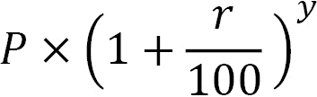
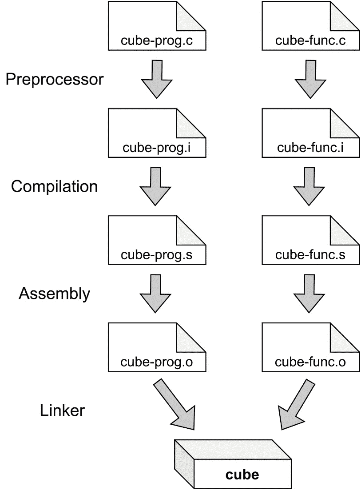

# *第三章*:深入 Linux C 语言

是时候深入了解一下 Linux 中的 C 编程了。在这里，我们将了解更多关于**编译器**，从源代码到**二进制程序**的四个阶段，如何使用 **Make** 工具，以及系统调用和标准库函数的区别。说到 Linux 我们还会看一些必不可少的头文件，看一些 **C** 和**可移植操作系统接口** ( **POSIX** ) **标准**。C 与 Linux 紧密结合，掌握 C 有助于你理解 Linux。

在本章中，我们将为 Linux 开发程序和库。我们还将为更重要的项目编写通用的 **Makefile** 和更高级的 Makefile。在此过程中，我们还将了解不同的 **C 标准**，它们为什么重要，以及它们如何影响您的程序。

本章将涵盖以下食谱:

*   使用 **GNU 编译器集合** ( **GCC** )链接库
*   改变 C 标准
*   使用系统调用
*   沙子什么时候不用
*   获取关于特定于 Linux 和 Unix 的头文件的信息
*   定义特性测试宏
*   看看编译的四个阶段
*   用 Make 编译
*   用 GCC 选项编写一个通用的 Makefile
*   编写简单的 Makefile
*   编写更高级的 Makefile

# 技术要求

在本章中，您将需要 Make 工具和 GCC 编译器，最好通过 [*第 1 章*](01.html#_idTextAnchor020)*中提到的元包或组安装获得必要的工具并编写我们的第一个 Linux 程序*。

本章的所有源代码都可以在[https://github . com/packt publishing/Linux-System-Programming-technologies/tree/master/CH3](https://github.com/PacktPublishing/Linux-System-Programming-Techniques/tree/master/ch3)获得。

查看以下链接，查看《行动守则》视频:[https://bit.ly/3sElIvu](https://bit.ly/3sElIvu)

# 使用 GCC 链接文库

在这个食谱中，我们将学习如何将一个程序链接到一个外部**库**，一个是全系统安装的，一个是驻留在我们主目录中的。然而，在我们链接到一个库之前，我们需要创建它。这也是我们将在本食谱中介绍的内容。知道如何链接到库将使你能够利用各种各样的现成功能。您可以使用已经可用的库，而不是自己编写所有内容。通常，没有必要重新发明轮子，从而节省了你很多时间。

## 做好准备

对于这个食谱，你只需要本章*技术要求*部分列出的内容。

## 怎么做…

在这里，我们将学习如何针对安装在您系统上的**共享库**和您主目录中的库进行链接。我们将从你的系统中已经有的一个库开始:T4 数学库。

### 链接到数学库

在这里，我们将制作一个小程序，计算一个银行账户的复利。为此，我们需要`pow()`函数，它包含在数学库中。

1.  编写以下代码，并保存在名为`interest.c`的文件中。请注意，我们在顶部包括`math.h`。`pow()`函数的第一个参数是基数；第二个论点是指数:

    ```sh
    #include <stdio.h>
    #include <math.h>
    int main(void)
    {
        int years = 15; /* The number of years you will 
                         * keep the money in the bank 
                         * account */
        int savings = 99000; /* The inital amount */
        float interest = 1.5; /* The interest in % */
        printf("The total savings after %d years " 
            "is %.2f\n", years, 
            savings * pow(1+(interest/100), years));
        return 0;
    }
    ```

2.  现在，编译并**链接**程序。链接库的选项为`-l`，库名为`m`(详见`man 3 pow`手册页):

    ```sh
    $> gcc -lm interest.c -o interest
    ```

3.  最后，让我们试试这个程序:

    ```sh
    $> ./interest
    The total savings after 15 years is 123772.95
    ```

### 创建我们自己的图书馆

在这里，我们将创建我们自己的共享库。在这个食谱的下一部分，我们将链接一个程序到这个库。我们在这里创建的库用于找出一个数是否是质数。

1.  让我们从创建一个简单的头文件开始。这个文件只包含一行——函数原型。将以下内容写入一个文件并命名为`prime.h` :

    ```sh
    int isprime(long int number);
    ```

2.  现在，是时候编写将包含在库中的实际函数了。将以下代码写入文件并保存为`primc.c` :

    ```sh
    int isprime(long int number)
    {
       long int j;
       int prime = 1;

       /* Test if the number is divisible, starting 
        * from 2 */
       for(j=2; j<number; j++)
       {
          /* Use the modulo operator to test if the 
           * number is evenly divisible, i.e., a 
           * prime number */
          if(number%j == 0)
          {
             prime = 0;
          }
       }
       if(prime == 1)
       {
          return 1;
       }
       else
       {
          return 0;
       }
    }
    ```

3.  我们需要以某种方式将其转换为库。第一步是把它编译成一个叫做目标文件的东西。我们还需要向编译器解析一些额外的参数，以使其在库中工作。更具体地说，我们需要使其成为**位置无关代码**，或简称为 **PIC** 。下面的编译器命令生成了一个名为`prime.o`的文件，我们将通过`ls -l`命令看到它。我们将在本章稍后了解更多关于目标文件的信息:

    ```sh
    $> gcc -Wall -Wextra -pedantic -fPIC -c prime.c
    $> ls -l prime.o 
    -rw-r--r-- 1 jake jake 1296 nov 28 19:18 prime.o
    ```

4.  现在，我们必须将对象文件打包为库。在下面的命令中，`-shared`选项听起来就是这样:它创建了一个**共享库**。`-Wl,-soname,libprime.so`选项用于链接器。这告诉链接器共享库名称(`soname`)将是`libprime.so`。`-o`选项指定输出文件名，即`libprime.so`。这是**动态链接库**的标准命名约定。`so`结尾代表*共享对象*。当库在系统范围内使用时，通常会添加一个数字来指示版本。在命令的最后，我们有包含在这个库中的`prime.o`对象文件:

    ```sh
    $> gcc -shared -Wl,-soname,libprime.so -o \
    > libprime.so prime.o
    ```

### 链接到主目录中的库

有时，您的主目录(或其他目录)中有一个想要链接的共享库。也许是你从网上下载的一个库，或者是你自己建立的一个库，就像这个例子。我们将在本书的后一章中了解更多关于建立我们自己的图书馆的知识。在这里，我们使用我们刚刚制作的小样本库，称为`libprime.so`。

1.  将下面的源代码写在一个文件中，并命名为`is-it-a-prime.c`。这个程序将使用我们刚刚下载的库。我们还必须包括我们创建的头文件`prime.h`。注意包含本地头文件(不是系统范围的头文件)的不同语法:

    ```sh
    #include <stdio.h>
    #include <stdlib.h>
    #include <string.h>
    #include "prime.h"
    int main(int argc, char *argv[])
    {
       long int num;
       /* Only one argument is accepted */
       if (argc != 2)
       {
          fprintf(stderr, "Usage: %s number\n", 
             argv[0]);
          return 1;
       }
       /* Only numbers 0-9 are accepted */
       if ( strspn(argv[1], "0123456789") != 
          strlen(argv[1]) )
       {
          fprintf(stderr, "Only numeric values are "
             "accepted\n");
          return 1;
       }
       num = atol(argv[1]); /* String to long */
       if (isprime(num)) /* Check if num is a prime */
       {
          printf("%ld is a prime\n", num);
       }
       else
       {
          printf("%ld is not a prime\n", num);
       }

       return 0;
    }
    ```

2.  现在，编译它并链接到`libprime.so`。由于库位于我们的主目录中，我们需要指定它的路径:

    ```sh
    $> gcc -L${PWD} -lprime is-it-a-prime.c \
    > -o is-it-a-prime
    ```

3.  在运行程序之前，我们需要将`$LD_LIBRARY_PATH` **环境变量**设置为当前目录(库所在的目录)。原因是库是动态链接的，并且不在库的通常系统路径上:

    ```sh
    $> export LD_LIBRARY_PATH=${PWD}:${LD_LIBRARY_PATH}
    ```

4.  And now, we can finally run the program. Test it with some different numbers to find out if they are prime numbers or not:

    ```sh
    $> ./is-it-a-prime 11
    11 is a prime
    $> ./is-it-a-prime 13
    13 is a prime
    $> ./is-it-a-prime 15
    15 is not a prime
    $> ./is-it-a-prime 1000024073
    1000024073 is a prime
    $> ./is-it-a-prime 1000024075
    1000024075 is not a prime
    ```

    通过`ldd`程序，我们可以看到一个程序依赖于哪些库。如果我们检查一下`is-it-a-prime`程序，我们会发现它依赖于我们的`libprime.so`库。还有其他的依赖关系，比如`libc.so.6`，就是标准的 C 库:

    ```sh
    $> ldd is-it-a-prime
       linux-vdso.so.1 (0x00007ffc3c9f2000)
       libprime.so => /home/jake/libprime.so (0x00007fd8b1e48000)
       libc.so.6 => /lib/x86_64-linux-gnu/libc.so.6 (0x00007fd8b1c4c000)
       /lib64/ld-linux-x86-64.so.2 (0x00007fd8b1e54000)
    ```

## 它是如何工作的…

我们在*链接数学库*部分中使用的`pow()`函数要求我们链接数学库`libm.so`。您可以在系统的某个库位置找到该文件，通常在`/usr/lib`或`/usr/lib64`中。在 Debian 和 Ubuntu 上，通常是`/usr/lib/x86_64-linux-gnu`(对于 64 位系统)。由于文件位于系统的默认库位置，我们可以仅使用`-l`选项将其包括在内。库文件的全称是`libm.so`，但是当我们指定要链接的库时，我们只指定`m`部分(即去掉`lib`部分和`.so`扩展名)。`-l`和`m`部分之间不应该有任何空间，所以为了与之链接，我们键入`-lm`。

我们需要链接库来使用`pow()`函数的原因是数学库与标准的 C 库`libc.so`是分开的。我们之前使用的所有功能都是*标准库*的一部分，也就是`libc.so`文件。这个库是默认链接的，所以不需要指定。如果我们真的想在编译时指定到`libc.so`的链接，我们可以通过`gcc -lc some-program.c -o some-program`来实现。

`pow()`函数接受两个参数， *x* ，和 *y* ，如`pow(x,y)`。该函数随后将 *x* 的值返回到 *y* 的幂。例如，`pow(2,8)`将返回 256。返回值为**双浮动**，且 *x* 和 *y* 均为双浮动。

计算复利的公式如下所示:



在这里， *P* 是你存入账户的起始资金， *r* 是利率，单位为百分比， *y* 是资金应该在账户中保持不动的年限。

### 链接到主目录中的库

在`is-it-a-prime.c` C 程序中，我们需要包含`prime.h`头文件。头文件只包含一行:`isprime()`函数的函数原型。实际的`isprime()`功能包含在我们从`prime.o`创建的`libprime.so`库中，它是我们从`prime.c`创建的。一个`.so`文件是一个**共享库**或**共享对象文件**。共享库包含已编译的函数目标文件。我们将在本章后面介绍什么是目标文件。

当我们想要链接一个我们自己下载或创建的库，而这个库没有安装在系统默认的库位置时，事情就变得有点复杂了。

首先，我们需要指定库的名称和库所在的路径。路径由`-L`选项指定。在这里，我们设置了创建库的当前目录的路径。`${PWD}`是一个 shell 环境变量，包含当前目录的完整路径。你可以用`echo ${PWD}`试试。

但是，为了能够运行程序，我们需要为当前目录(以及它已经包含的任何内容)设置一个名为`$LD_LIBRARY_PATH`的环境变量。这样做的原因是程序是**动态链接**与库，意味着库不包含在程序中；它在程序之外。对于找到库的程序，我们需要告诉它去哪里找，这就是我们用`$LD_LIBRARY_PATH`做的。我们也不想覆盖已经在`$LD_LIBRARY_PATH`变量中的内容；这就是为什么我们也包括变量的内容。如果我们没有设置那个环境变量，我们会在执行程序时收到一条错误消息，说“加载共享库时出现*错误:libprime.so* ”。当我们用`ldd`列出依赖项时，我们看到`libprime.so`位于主目录中，而不是系统的库位置。

## 还有更多…

如果有兴趣阅读更多关于标准 C 库的内容，可以阅读`man libc`。要了解更多关于`pow()`功能的信息，您可以阅读`man 3 pow`。

我也鼓励大家用`man ldd`阅读`ldd`的手册页。另外，检查一些程序与`ldd`的依赖关系——例如，我们在这个食谱中写的`interest`程序。在此过程中，您将看到`libm.so`及其在系统中的位置。也可以在系统二进制上尝试`ldd`，比如`/bin/ls`。

# 改变碳标准

在这个食谱中，我们将学习和探索不同的 T2 标准，它们是什么，它们为什么重要，以及它们如何影响我们的程序。我们还将学习如何在**编译**时设置 C 标准。

如今最常用的 C 标准有**C89****C99****C11**(1989 年为 C89，2011 年为 C11，以此类推)。许多编译器仍然默认使用 C89，因为它是最兼容、最广泛和最完整的实现。然而，C99 是一个更加灵活和现代化的实现。通常，在较新版本的 Linux 下，默认值是 **C18** ，以及一些 POSIX 标准。

我们将编写两个程序，并用 C89 和 C99 编译它们，看看它们的区别。

## 做好准备

你只需要一台安装了 GCC 的 Linux 电脑，最好是通过 [*第 1 章*](01.html#_idTextAnchor020)*中描述的元包或包组，获取必要的工具并编写我们的第一个 Linux 程序*。

## 怎么做…

继续探索 C 标准之间的差异。

1.  编写这里显示的小 C 程序，保存为`no-return.c`。注意缺失的`return`语句:

    ```sh
    #include <stdio.h>
    int main(void)
    {
        printf("Hello, world\n");
    }
    ```

2.  现在，使用 C89 标准编译它:

    ```sh
    $> gcc -std=c89 no-return.c -o no-return
    ```

3.  运行程序并检查退出代码:

    ```sh
    $> ./no-return 
    Hello, world
    $> echo $?
    13
    ```

4.  现在，用同样的 C 标准重新编译程序，但是启用*所有警告*、*额外警告*、*迂腐*检查(`-W`是警告的选项，`all`是哪个警告，因此是`-Wall`)。注意我们从 GCC 得到的错误信息:

    ```sh
    $> gcc -Wall -Wextra -pedantic -std=c89 \
    > no-return.c -o no-return
    no-return.c: In function 'main':
    no-return.c:6:1: warning: control reaches end of non-void function [-Wreturn-type]
     }
     ^
    ```

5.  现在，使用 C99 标准重新编译程序，并启用所有警告和迂腐的检查。这次不应该显示错误:

    ```sh
    $> gcc -Wall -Wextra -pedantic -std=c99 \
    > no-return.c -o no-return
    ```

6.  重新运行程序并检查退出代码。注意区别:

    ```sh
    $> ./no-return 
    Hello, world
    $> echo $?
    0
    ```

7.  写下以下程序并命名为`for-test.c`。这个程序在`for`循环中创建一个`i`整数变量。这仅在 C99:

    ```sh
    #include <stdio.h>
    int main(void)
    {
        for (int i = 10; i>0; i--)
        {
            printf("%d\n", i);
        }
        return 0;
    }
    ```

    中允许
8.  使用 C99 标准进行编译:

    ```sh
    $> gcc -std=c99 for-test.c -o for-test
    ```

9.  然后，运行它。一切都应该很好:

    ```sh
    $> ./for-test 
    10
    9
    8
    7
    6
    5
    4
    3
    2
    1
    ```

10.  现在，相反，尝试用 C89 标准编译它。请注意，错误消息清楚地解释了这仅适用于 C99 或更高版本。来自 GCC 的错误信息是有用的，所以一定要阅读它们。他们可以帮你节省很多时间:

    ```sh
    $> gcc -std=c89 for-test.c -o for-test
    for-test.c: In function 'main':
    for-test.c:5:5: error: 'for' loop initial declarations are only allowed in C99 or C11 mode
         for (int i = 10; i>0; i--)
         ^~~
    ```

11.  现在，写下下面这个小程序并命名为`comments.c`。在这个程序中，我们使用 C99 注释(也称为 C++注释):

    ```sh
    #include <stdio.h>
    int main(void)
    {
        // A C99 comment
        printf("hello, world\n");
        return 0;
    }
    ```

12.  用 C99:

    ```sh
    $> gcc -std=c99 comments.c -o comments
    ```

    编译
13.  现在，试着用 C89 编译它。请注意，此错误消息也很有帮助:

    ```sh
    $> gcc -std=c89 comments.c -o comments
    comments.c: In function 'main':
    comments.c:5:5: error: C++ style comments are not allowed in ISO C90
         // A C99 comment
         ^
    comments.c:5:5: error: (this will be reported only once per input file)
    ```

## 它是如何工作的…

这些是 C89 和 C99 之间更常见的一些区别。在使用 GCC 的 Linux 中，还有其他不明显的区别。我们将在本食谱的*部分讨论这些看不见的差异，还有更多……*部分。

我们将带有`-std`选项的 C 标准更改为 GCC。在这个食谱中，我们尝试了两个标准，C89 和 C99。

在*步骤 1-6* 中，我们看到了当我们忘记返回值时会发生什么变化。在 C99 中，假定返回值为 0，因为没有指定其他值。另一方面，在 C89 中，忘记返回值是不行的。程序仍将编译，但程序将返回值 13(一个错误代码)，这是错误的，因为我们的程序中没有发生错误。虽然实际返回的代码可能不同，但它总是大于 0。当我们启用*所有警告*、*额外警告*、*迂腐*检查代码(`-Wall -Wextra -pedantic`)时，我们还看到编译器发出了警告消息，意思是忘记返回值是不合法的。因此，在 C89 中总是返回一个带有`return`的值。

然后，在*步骤 7-10* 中，我们看到在 C99 中可以在`for`循环中声明一个新变量，这在 C89 中是不可以的。

在*第 11-13 步*中，我们看到了一种使用注释的新方式，两个斜线`//`。这在 C89 是不合法的。

## 还有更多…

除了 C89 和 C99，还有更多的 C 标准和方言。再提几个，有 *C11* 、 *GNU99* (GNU 的 C99 方言)、 *GNU11* (GNU 的 C11 方言)等，但今天最常用的是 C89、C99、C11。C18 开始作为一些编译器和发行版的默认值出现。

C89 和 C99 之间的差异实际上比我们在这里看到的要多。其中一些差异在 Linux 中无法用 GCC 演示，因为 GCC 已经为这些差异实现了变通办法。其他一些编译器也是如此。但是在 C89 中，例如`long long int`类型没有指定；它在 C99 中有详细说明。但是尽管如此，一些编译器(包括 GCC)在 C89 中支持`long long int`，但是我们应该小心在 C89 中使用它，因为不是所有的编译器都支持它。如果要用`long long int`，用 C99、C11、C18 比较安全。

我建议你总是用`-Wall`、`-Wextra`和`-pedantic`选项编译你的程序。这些会警告你各种各样的事情，否则会被忽视。

# 使用系统调用–以及何时不使用它们

**系统调用**在任何关于 Unix 和 Linux 的对话中都是一个激动人心的话题。在 Linux 系统编程方面，它们是最低的部分之一。如果我们从自上而下的方法来看这个，我们运行的 shell 和二进制文件将位于顶部。就在下面，我们有标准的 C 库函数，比如`printf()`、`fgets()`、`putc()`等等。在它们下面，最底层，我们有系统调用，比如`creat()`、`write()`等等:


图 3.1–高级功能和低级功能

当我在本书这里谈到系统调用时，我指的是作为内核提供的 C 函数的系统调用，而不是实际的系统调用表。我们在这里使用的系统调用函数位于**用户空间**，但是函数本身在**内核空间**中执行。

许多标准的 C 库函数，如`putc()`，在窗帘后面使用一个或多个系统调用函数。`putc()`功能就是一个很好的例子；这个使用`write()`在屏幕上打印一个字符(这是一个系统调用)。还有完全不使用任何系统调用的标准 C 库函数，比如`atoi()`，完全驻留在用户空间。没有必要让内核将字符串转换成数字。

一般来说，如果有一个标准的 C 库函数可用，我们应该使用它来代替系统调用。系统调用通常更难处理，也更原始。把系统调用想象成*低级*操作，把标准 C 函数想象成*高级*操作。

然而，有些情况下，当我们需要使用系统调用时，或者当它们更容易使用或更有益时。学习何时以及为什么使用系统调用会让你成为一个更好的系统程序员。例如，我们可以通过系统调用在 Linux 上执行许多文件系统操作，这些操作在其他地方是不可用的。另一个例子当我们需要使用一个系统调用时，就是当我们想要`fork()`一个进程时，这一点我们将在后面更详细地讨论。换句话说，当我们需要执行某种形式的*系统操作*时，我们需要使用系统调用。

## 做好准备

在这个食谱中，我们将使用一个特定于 Linux 的系统调用，所以你将需要一台 Linux 计算机(自从你阅读这本书以来，你很可能已经有了)。但是请注意`sysinfo()`系统调用在 FreeBSD 或 macOS 下无法工作。

## 怎么做…

使用标准 C 库中的函数和使用系统调用函数实际上没有太大区别。Linux 中的系统调用是在`unistd.h`中声明的，所以我们在使用系统调用的时候需要包含这个文件。

1.  写下面这个小程序，命名为`sys-write.c`。它使用`write()`系统调用。请注意，这里不包括`stdio.h`。因为我们没有使用任何`printf()`函数或任何 stdin、stdout 或 stderr 文件流，所以这里不需要`stdio.h`。我们直接打印到文件描述符 1，这是标准输出。三个标准文件描述符总是打开的:

    ```sh
    #include <unistd.h>
    int main(void)
    {
        write(1, "hello, world\n", 13);
        return 0;
    }
    ```

2.  编译它。从现在开始，我们会一直包含`-Wall`、`-Wextra`、`-pedantic`来写更干净更好的代码:

    ```sh
    $> gcc -Wall -Wextra -pedantic -std=c99 \
    > sys-write.c -o sys-write
    ```

3.  运行程序:

    ```sh
    $> ./sys-write 
    hello, world
    ```

4.  现在，编写同样的程序，但是用`fputs()`函数代替——一个更高级的函数。请注意，这里包含`stdio.h`，而不是`unistd.h`。命名程序`write-chars.c` :

    ```sh
    #include <stdio.h>
    int main(void)
    {
        fputs("hello, world\n", stdout);
        return 0;
    }
    ```

5.  编译一下:

    ```sh
    $> gcc -Wall -Wextra -pedantic -std=c99 \
    > write-chars.c -o write-chars
    ```

6.  然后，运行它:

    ```sh
    $> ./write-chars 
    hello, world
    ```

7.  现在，是时候写一个程序来读取一些用户和系统信息了。将程序保存为`my-sys.c`。程序中的所有系统调用都会突出显示。该程序获取您的用户标识、当前工作目录、机器总数和空闲的**随机存储器** ( **内存**)和当前**进程标识** ( **进程标识** ):

    ```sh
    #include <stdio.h>
    #include <unistd.h>
    #include <sys/types.h>
    #include <sys/sysinfo.h>
    int main(void)
    {
       char cwd[100] = { 0 }; /* for current dir */
       struct sysinfo si; /* for system information */
       getcwd(cwd, 100); /* get current working dir */
       sysinfo(&si); /* get system information 
                      * (linux only) */

       printf("Your user ID is %d\n", getuid());
       printf("Your effective user ID is %d\n", 
          geteuid());
       printf("Your current working directory is %s\n", 
          cwd);
       printf("Your machine has %ld megabytes of " 
          "total RAM\n", si.totalram / 1024  / 1024);
       printf("Your machine has %ld megabytes of "
          "free RAM\n", si.freeram / 1024 / 1024);
       printf("Currently, there are %d processes "
          "running\n", si.procs);
       printf("This process ID is %d\n", getpid());
       printf("The parent process ID is %d\n", 
          getppid());
       return 0;
    }
    ```

8.  编译程序:

    ```sh
    $> gcc -Wall -Wextra -pedantic -std=c99 my-sys.c -o \
    > my-sys
    ```

9.  然后，运行程序。您现在应该看到一些关于您的用户和您正在使用的机器的信息:

    ```sh
    $> ./my-sys 
    Your user ID is 1000
    Your effective user ID is 1000
    Your current working directory is /mnt/localnas_disk2/linux-sys/ch3/code
    Your machine has 31033 megabytes of total RAM
    Your machine has 6117 megabytes of free RAM
    Currently, there are 2496 processes running
    This process ID is 30421
    The parent process ID is 11101
    ```

## 它是如何工作的…

在*步骤 1-6* 中，我们探究了`write()`和`fputs()`之间的差异。区别可能没有那么明显，但是系统调用`write()`，使用**文件描述符**而不是**文件流**。这适用于几乎所有的系统调用。文件描述符比文件流更原始。文件描述符和文件流采用同样的从上到下的方法。文件流分层在文件描述符之上，并提供更高级别的接口。但是，有时我们需要使用文件描述符，因为这些描述符提供了更多的控制。另一方面，文件流提供了更强大、更丰富的输入和输出，并带有格式化的输出，例如`printf()`。

在*步骤 7-9* 中，我们编写了一个程序，获取一些系统和用户信息。这里，我们包含了三个系统调用特定的头文件:`unistd.h`、`sys/types.h`和`sys/sysinfo.h`。

我们已经看到了`unistd.h`，一个在 Unix 和 Linux 系统中用于系统调用的通用头文件。`sys/types.h`头文件是系统调用的另一个常见头文件，尤其是在从系统获取值时。此头文件包含特殊变量类型；例如`uid_t`和`gid_t`为**用户标识** ( **UID** )和**组标识** ( **GID** )。这些通常是`int`。其他为**索引节点**号的`ino_t`，PiD 的`pid_t`等等。

`sys/sysinfo.h`头文件是专门为`sysinfo()`函数准备的，这是一个专门针对 Linux 的系统调用，因此在其他 Unix 系统下，如 macOS、Solaris 或 FreeBSD/OpenBSD/NetBSD 下，这将不起作用。这个头文件声明了`sysinfo`结构，我们通过调用`sysinfo()`函数来填充信息。

我们在程序中使用的第一个系统调用是`getcwd()`，获取当前的工作目录。该函数有两个参数:保存路径的缓冲区和缓冲区的长度。

下一个系统调用是 Linux 特有的`sysinfo()`函数。这个给了我们很多信息。函数执行时，所有数据都保存到结构`sysinfo`中。该信息包括系统的**正常运行时间**；**负荷平均值**；内存总量；可用和用过的内存；总可用**交换空间**；和正在运行的进程总数。在`man 2 sysinfo`中，您可以找到关于结构`sysinfo`中的变量及其数据类型的信息。在代码的后面，我们使用`printf()`打印其中一些值，例如`si.totalram`，它包含系统内存的大小。

其余系统调用直接从`printf()`调用，返回整数值。

## 还有更多…

手册中有很多关于 Linux 系统调用的详细信息。一个好的起点是`man 2 intro`和`man 2 syscalls`。

小费

如果发生错误，大多数系统调用将返回-1。检查该值以检测错误通常是个好主意。

# 获取特定于 Linux 和 Unix 的头文件的信息

Linux 等 Unix 系统有很多具体的功能和**头文件**。一般来说这些都是 **POSIX** 函数，虽然有些是 Linux 特有的，比如`sysinfo()`。我们已经在之前的食谱中看到了两个 POSIX 文件:`unistd.h`和`sys/types.h`。因为它们是 POSIX 文件，所以它们在所有类似 Unix 的系统中都可用，比如 Linux、FreeBSD、OpenBSD、macOS 和 Solaris。

在这个食谱中，我们将了解更多关于这些 POSIX 头文件，它们做什么，以及何时和如何使用它们。我们还将学习如何在手册页中查找这些文件的信息。

## 做好准备

在本食谱中，我们将在手册中查找头文件。如果您使用的是基于软呢帽的系统，如 **CentOS** 、**软呢帽**或**红帽**，这些手册页是已经安装在您的系统上的。如果由于某种原因它们丢失了，你可以用`dnf install man-pages`作为根，或者用`sudo`安装它们。

另一方面，如果你使用的是基于 Debian 的系统，比如 **Ubuntu** 或者 **Debian** ，你需要先安装那些手动页面。按照此处的说明安装该配方所需的手册页。

### 一种自由操作系统

Debian 对更严格，不包括非自由软件，所以我们需要多走几步。

1.  以 root 身份在编辑器中打开`/etc/apt/sources.list`。
2.  在末尾写着`main`的行后面加上`non-free`这个词(在`main`和`non-free`之间留一个空格)。
3.  保存文件。
4.  以 root 身份运行`apt update`。
5.  以 root 用户身份运行`apt install manpages-posix-dev`安装手动页面。

### 人的本质

Ubuntu 和基于 Ubuntu 的其他发行版对非自由软件没有那么严格，所以在这里我们可以马上安装正确的软件包。

只需运行`sudo apt install manpages-posix-dev`。

## 怎么做…

有很多头文件需要覆盖，所以更重要的是学习如何知道我们应该使用哪些头文件以及如何找到关于它们的信息，阅读它们的手册页，并知道如何列出它们。我们将在这里讨论所有这些。

在之前的食谱中，我们使用了`sysinfo()`和`getpid()`功能。在这里，我们将学习如何找到与这些系统调用和所需头文件相关的每一条可能的信息。

1.  First of all, we start by reading the manual page for `sysinfo()`:

    ```sh
    $> man 2 sysinfo
    ```

    在**提要**标题下，我们发现以下两行:

    ```sh
    #include <sys/sysinfo.h>
    int sysinfo(struct sysinfo *info);
    ```

2.  这个信息意味着我们需要包含`sys/sysinfo.h`才能使用`sysinfo()`。这也表明该函数以一个名为`sysinfo`的结构作为参数。在**描述**下，我们看到了`sysinfo`结构的样子。
3.  Now, let's look up `getpid()`. It's a POSIX function, and hence there is more information available:

    ```sh
    $> man 2 getpid
    ```

    这里，在**提要**下，我们需要包含两个头文件:`sys/types.h`和`unistd.h`。我们还看到该函数返回一个类型为`pid_t`的值。

4.  Let's continue investigating. Open up the manual page for `sys/types.h`:

    ```sh
    $> man sys_types.h
    ```

    在**名称**下，我们看到文件包含数据类型。在**描述**下，我们发现一个`pid_t`数据类型被用于*进程 id*和*进程组 id*，但这并没有告诉我们它实际上是什么样的数据类型。所以，让我们继续向下滚动，直到找到一个副标题，上面写着**另外还有**。这里我们看到一句话说:“`blksize_t`、`pid_t`、`ssize_t`应为有符号整数类型。”任务完成——现在，我们知道它是一个有符号整数类型，我们可以使用`%d`格式化操作符来打印它。

5.  但是让我们进一步调查。让我们阅读`unistd.h` :

    ```sh
    $> man unistd.h
    ```

    的手册页
6.  Now, search this manual page for the word `pid_t`, and we'll find even more information about it.

    输入一个`/`字符，然后输入`pid_t`，按*进入*进行搜索。按下键盘上的字母 *n* ，搜索下一个出现的单词。你会发现其他函数也返回一个`pid_t`类型——例如，`fork()`、`getpgrp()`和`getsid()`，仅举几例。

7.  当你在阅读`unistd.h`的手册页时，你也可以看到这个头文件中声明的所有函数。找不到就搜索`Declarations`。按 */* ，输入`Declarations`，按*进入*。

## 它是如何工作的…

*7posix* 或 *0p* 特殊部分中的手册页，取决于您的 Linux 发行版，来自名为 *POSIX 程序员手册*的东西。比如打开`man unistd.h`，可以看到文字 *POSIX 程序员手册*，而不是`man 2 write`，上面写着 *Linux 程序员手册*。 *POSIX 程序员手册*来自**电气电子工程师协会** ( **IEEE** )和**开放集团**，不是来自 **GNU 项目**或 Linux 社区。

由于 *POSIX 程序员手册*不是免费的(就像在开源中一样)，Debian 选择不将其包含在他们的主存储库中。这就是为什么我们需要将非自由存储库添加到 Debian 中。

POSIX 是由 IEEE 指定的一组标准。该标准的目的是在所有 POSIX 操作系统(大多数 Unix 和类似 Unix 的系统)之间有一个通用的编程接口。如果您在程序中只使用 POSIX 函数和 POSIX 头文件，它将与所有其他 Unix 和类似 Unix 的系统兼容。实际实现可能因系统而异，但总体功能应该是相同的。

有时候，当我们需要一些特定的信息(比如`pid_t`是哪种类型)时，我们需要阅读不止一个手册页，就像我们在这个食谱中所做的那样。

这里的要点是使用函数的手动页面找到相应的头文件，然后使用头文件的手动页面找到更具体的信息。

## 还有更多…

POSIX 头文件的手册页在手册页的特殊部分，没有在`man man`中列出。在 Fedora 和 CentOS 下，这个部分被称为 *0p* ，在 Debian 和 Ubuntu 下，它被称为 *7posix* 。

小费

您可以使用带点的`apropos`命令列出给定部分中所有可用的手动页面(点表示全部匹配)。

例如，要列出*第 2 节*中的所有手动页面，请键入`apropos -s 2.`(包括点-这是命令的一部分)。要在 Ubuntu 下的 *7posix* 特殊部分列出所有手册页，请键入`apropos -s 7posix.`

# 定义特性测试宏

在这个食谱中，我们将学习一些常见的 POSIX 标准是什么，如何以及为什么使用它们，以及我们如何使用**特性测试宏**来指定它们。

我们已经看到几个例子，当我们已经包括了一个 POSIX 标准或一些特定的 C 标准。例如，当我们使用`getopt()`时，我们在源代码文件的最顶部定义了`_XOPEN_SOURCE 500`(来自 [*第 2 章*](02.html#_idTextAnchor050) 、*使您的程序易于编写脚本*)。

功能测试宏控制系统头文件公开的定义。我们可以通过两种方式利用这一点。我们可以使用它来创建可移植的应用程序，方法是使用防止我们使用非标准定义的特性测试宏，或者我们可以反过来使用它，允许我们使用非标准定义。

## 做好准备

我们将在这个食谱中写两个小程序，`str-posix.c`和`which-c.c`。你可以从[https://github . com/packktpublishing/Linux-System-Programming-technologies/tree/master/CH3](https://github.com/PacktPublishing/Linux-System-Programming-Techniques/tree/master/ch3)下载，也可以跟着写。您还需要我们在 [*第 1 章*](01.html#_idTextAnchor020)*中安装的 GCC 编译器，获取必要的工具并编写我们的第一个 Linux 程序*。访问所有的手动页面也是一个好主意，包括上一份食谱中提到的 *POSIX 程序员手册*中的页面。

## 怎么做…

在这里，我们将探索特性测试宏、POSIX 和 C 标准以及其他相关事物内部工作的黑暗角落。

1.  编写以下代码，并保存在名为`str-posix.c`的文件中。这个程序将简单地使用`strdup()`复制一个字符串，然后打印出来。请注意，这里包括`string.h`:

    ```sh
    #include <string.h>
    #include <stdio.h>
    int main(void)
    {
        char a[] = "Hello";
        char *b;
        b = strdup(a);
        printf("b = %s\n", b);
        return 0;
    }
    ```

2.  现在，我们从使用 C99 标准编译它开始，看看会发生什么。将打印多个错误信息:

    ```sh
    $> gcc -Wall -Wextra -pedantic -std=c99 \
    > str-posix.c -o str-posix
    str-posix.c: In function 'main':
    str-posix.c:8:9: warning: implicit declaration of function 'strdup'; did you mean 'strcmp'? [-Wimplicit-function-declaration]
         b = strdup(a);
             ^~~~~~
             strcmp
    str-posix.c:8:7: warning: assignment to 'char *' from 'int' makes pointer from integer without a cast [-Wint-conversion]
         b = strdup(a);
    ```

3.  That generated a pretty severe warning. The compilation succeeded, though. If we try to run the program, it will fail on some distributions but not others. This is what's called **undefined behavior**:

    ```sh
    $> ./str-posix 
    Segmentation fault
    ```

    在另一个 Linux 发行版上，我们可能会看到以下内容:

    ```sh
    $> ./str-posix
    b = Hello
    ```

4.  现在是引人入胜——又有点令人困惑——的部分。这个程序有时崩溃有一个原因，但是有几种可能的解决方法。我们会把它们都放在这里。但首先，它失败的原因是`strdup()`不是 C99 的一部分(我们将在*如何工作…* 一节中介绍为什么它*有时*会工作)。最直截了当的解决方案是查看手册页，其中明确说明我们需要将`_XOPEN_SOURCE`特性测试宏设置为`500`或更高。为了这个实验，我们把它设置为`700`(后面我会解释为什么)。在`str-posix.c`的最上方加上下面一行。它需要在任何`include`声明之前的第一行；否则不起作用:

    ```sh
    #define _XOPEN_SOURCE 700
    ```

5.  现在您已经添加了前面的行，让我们尝试重新编译程序:

    ```sh
    $> gcc -Wall -Wextra -pedantic -std=c99 \
    > str-posix.c -o str-posix
    ```

6.  这次没有警告，所以让我们运行程序:

    ```sh
    $> ./str-posix 
    b = Hello
    ```

7.  这是可能的解决方案之一，也是最明显的一个。现在，再次删除第一行(整个`#define`行)。
8.  一旦删除了`#define`行，我们将重新编译程序，但是这次，我们改为在命令行设置特性测试宏。我们使用海合会的`-D`旗来完成这个任务:

    ```sh
    $> gcc -Wall -Wextra -pedantic -std=c99 \
    > -D_XOPEN_SOURCE=700 str-posix.c -o str-posix
    ```

9.  让我们试着运行它:

    ```sh
    $> ./str-posix 
    b = Hello
    ```

10.  这是第二个解决方案。但是如果我们阅读带有`man feature_test_macros`的特性测试宏的手册页，我们会看到值为 700 或更大的`_XOPEN_SOURCE`与值为 200809L 或更大的定义`_POSIX_C_SOURCE`具有相同的效果。所以，让我们试着用`_POSIX_C_SOURCE`代替

    ```sh
    $> gcc -Wall -Wextra -pedantic -std=c99 \
    > -D_POSIX_C_SOURCE=200809L str-posix.c -o str-posix
    ```

    重新编译程序
11.  效果不错。现在，对于最终的——也可能是危险的——解决方案。这次，我们将重新编译程序，完全不设置任何 C 标准或任何特性测试宏:

    ```sh
    $> gcc -Wall -Wextra -pedantic str-posix.c \ 
    > -o str-posix
    ```

12.  没有警告，所以让我们试着运行它:

    ```sh
    $> ./str-posix 
    b = Hello
    ```

13.  当我们不得不定义所有这些宏和标准时，究竟是如何工作的？事实证明，当我们不设置任何 C 标准或任何特性测试宏时，编译器会自己设置一些标准。为了证明这一点，并了解您的编译器是如何工作的，让我们编写以下程序。命名为`which-c.c`。该程序将打印正在使用的 C 标准和任何通常定义的特性测试宏:

    ```sh
    #include <stdio.h>
    int main(void)
    {
       #ifdef __STDC_VERSION__
          printf("Standard C version: %ld\n", 
             __STDC_VERSION__);
       #endif
       #ifdef _XOPEN_SOURCE
          printf("XOPEN_SOURCE: %d\n", 
             _XOPEN_SOURCE);
       #endif
       #ifdef _POSIX_C_SOURCE
          printf("POSIX_C_SOURCE: %ld\n", 
             _POSIX_C_SOURCE);
       #endif
       #ifdef _GNU_SOURCE
          printf("GNU_SOURCE: %d\n", 
             _GNU_SOURCE);
       #endif
       #ifdef _BSD_SOURCE
          printf("BSD_SOURCE: %d\n", _BSD_SOURCE);
       #endif
       #ifdef _DEFAULT_SOURCE
          printf("DEFAULT_SOURCE: %d\n", 
             _DEFAULT_SOURCE);
       #endif
       return 0;
    }
    ```

14.  让我们在不设置任何 C 标准或特性测试宏的情况下编译并运行这个程序【T1:

    ```sh
    $> gcc -Wall -Wextra -pedantic which-c.c -o which-c
    $> ./which-c 
    Standard C version: 201710
    POSIX_C_SOURCE: 200809
    DEFAULT_SOURCE: 1
    ```

15.  让我们试着指定我们要使用 C 标准 C99，并重新编译`which.c`。这里将发生的事情是编译器将强制执行严格的 C 标准模式，并禁用默认的特性测试宏，否则它可能已经设置:

    ```sh
    $> gcc -Wall -Wextra -pedantic -std=c99 \
    > which-c.c -o which-c
    $> ./which-c 
    Standard C version: 199901
    ```

16.  让我们看看当我们将`_XOPEN_SOURCE`设置为`600`时会发生什么:

    ```sh
    $> gcc -Wall -Wextra -pedantic -std=c99 \
    > -D_XOPEN_SOURCE=600 which-c.c -o which-c
    $> ./which-c 
    Standard C version: 199901
    XOPEN_SOURCE: 600
    POSIX_C_SOURCE: 200112
    ```

## 它是如何工作的…

在*步骤 1-10* 中，我们看到了当我们使用不同的标准和特性测试宏时，我们的程序发生了什么。我们还注意到，令人惊讶的是，它在没有指定任何 C 标准或特性测试宏的情况下也能工作。这是因为 GCC——以及其他编译器——默认设置了许多这样的特性和标准。但我们不能指望它。自己指定总是更安全；这样，我们知道它会起作用。

在*第 13 步*中，我们编写了一个程序来打印出编译时使用的特性测试宏。为了防止编译器在没有设置特性测试宏的情况下产生错误，我们将所有的`printf()`行包装在`#ifdef`和`#endif`语句中。这些语句是编译器的`if`语句，不是生成的程序。例如，我们来看下面一行:

```sh
#ifdef _XOPEN_SOURCE
    printf("XOPEN_SOURCE: %d\n", _XOPEN_SOURCE);
#endif
```

如果未定义`_XOPEN_SOURCE`，则在编译的**预处理**阶段后，该`printf()`行不包括在内。另一方面，如果`_XOPEN_SOURCE`被定义，它将被包括在内。我们将在下一个食谱中介绍什么是预处理。

在*第 14 步*中，我们看到在我的系统中，编译器将`_POSIX_C_SOURCE`设置为`200809`。但是手册上说我们应该将`_XOPEN_SOURCE`设置为`500`或更高。但它仍然有效——为什么？

如果我们阅读特性测试宏(`man feature_test_macros`)的手册页，我们会发现大于`700`的值`_XOPEN_SOURCE`与将`_POSIX_C_STANARD`设置为`200809`或更大具有相同的效果。而由于 GCC 为我们设置了`_POSIX_C_STANDARD`到`200809`，这和`_XOPEN_SOURCE` `700`的影响是一样的。

在*第 15 步*中，我们了解到当我们指定一个标准时，编译器会强制执行一个严格的 C 标准——例如`-std=c99`。这就是`str-posix.c`运行失败(编译时得到警告信息)的原因。`strdup()`函数不是标准的 C 函数；这是一个 POSIX 函数。这就是为什么我们需要包含一些 POSIX 标准来使用它。当编译器使用严格的 C 标准时，不会启用其他功能。这使我们能够使用支持 C99 的 C 编译器编写可移植到所有系统的代码。

在*步骤 16* 中，我们在编译程序时指定了`_XOPEN_SOURCE``600`——这样做也将`_POSIX_C_STANDARD`设置为`200112`。我们可以在手册页(`man feature_test_macros`)上读到这一点。从手册中:*“[当] _XOPEN_SOURCE 被定义为大于或等于 500 的值时[…]以下宏被隐式定义，_POSIX_C_SOURCE […]* ”。

但是功能宏是做什么的呢？他们如何修改代码？

系统上的头文件全是`#ifdef`语句，启用和禁用各种功能和特性，具体取决于设置了哪些特性测试宏。例如，在我们使用`strdup()`的情况下，`string.h`头文件具有包装在`#ifdef`语句中的`strdup()`功能。这些语句检查是否定义了`_XOPEN_SOURCE`或其他 POSIX 标准。如果没有指定此类标准，则`strdup()`不可见。这就是特性测试宏的工作方式。

但是为什么程序在某些 Linux 发行版上以*步骤 3* 中的分段错误结束，而不是其他版本？如前所述，`strdup()`函数是存在的，但是没有特性测试宏就没有它的声明。接下来发生的是*未定义*。由于一些具体的实现细节，它可以工作，但是它也不能工作。当我们编程时，我们应该始终避免*未定义的行为*。仅仅因为在这个特定的计算机上，在这个 Linux 发行版上，在这个编译器版本上，在这个特定的满月之夜，某些东西可以工作，这并不能保证它会在其他某个夜晚在其他人的计算机上工作。因此，我们应该始终努力按照特定的标准编写正确的代码。这样，我们就避免了未定义的行为。

## 还有更多…

我们定义的所有这些特性测试宏都对应于 POSIX 或其他某种标准。这些标准背后的思想是在不同的 Unix 版本和类似 Unix 的系统之间创建一个统一的编程接口。

对于任何想要深入研究标准和特性测试宏的人来说，有一些优秀的手册页可供使用。仅举几个例子:

*   `man 7 feature_test_macros`(在这里，你可以读到所有关于哪些特性测试宏对应哪些标准的内容，比如 POSIX、Single Unix 规范、XPG (X/Open Portability Guide)等等。)
*   `man 7 standards`(关于标准的更多信息)
*   `man unistd.h`
*   `man 7 libc`
*   `man 7 posixoptions`

# 看编译的四个阶段

当我们一般谈到编译时，我们指的是将代码转化为运行中的二进制程序的整个过程。但是将源代码文件编译成运行中的二进制程序实际上需要四个步骤，而这只是其中一个叫做编译的步骤。

了解这四个步骤，以及如何提取中间文件，使我们能够完成从编写高效 Makefiles 到编写共享库的所有工作。

## 做好准备

对于这个食谱，我们将编写三个小的 C 源代码文件。也可以从[https://github . com/PacktPublishing/Linux-系统-编程-技巧/tree/master/ch3](https://github.com/PacktPublishing/Linux-System-Programming-Techniques/tree/master/ch3) 下载。您还需要我们在 [*第 1 章*](01.html#_idTextAnchor020)*中安装的 GCC 编译器，获取必要的工具并编写我们的第一个 Linux 程序*。

## 怎么做…

在这个食谱中，我们将创建一个小程序，然后使用编译器的标志，通过单独执行每个步骤来手动编译它。我们还将查看每一步生成的文件。我们将要编写的程序有意做得很小，这样我们就可以在没有太多混乱的情况下查看结果代码。我们将要编写的程序将简单地返回一个立方数——在我们的例子中，是 4 的立方数。

1.  这个食谱的第一个源代码文件是一个名为`cube-prog.c`的文件。这将是带有`main()`功能的源代码文件:

    ```sh
    #include "cube.h"
    #define NUMBER 4
    int main(void)
    {
        return cube(NUMBER);
    }
    ```

2.  现在，我们在名为`cubed-func.c` :

    ```sh
    int cube(int n)
    {
        return n*n*n;
    }
    ```

    的文件中为`cube()`编写函数
3.  最后，我们编写头文件`cube.h`。这只是功能原型:

    ```sh
    int cube(int n);
    ```

4.  Before we build the program step by step, we first compile it as usual since we haven't covered how to compile a program that consists of several files yet. To compile a program that's made up of more than one source file, we simply list them at the GCC command line. Note, however, that we don't list the header file here. Since the header file is included with a `#include` line, the compiler already knows about it.

    这就是我们如何用几个文件编译一个程序:

    ```sh
    $> gcc -Wall -Wextra -pedantic -std=c99 \
    > cube-prog.c cube-func.c -o cube
    ```

5.  然后，让我们运行它，并检查返回值:

    ```sh
    $> ./cube 
    $> echo $?
    64
    ```

6.  现在，我们开始逐步构建程序。首先，我们删除已经生成的二进制文件:

    ```sh
    $> rm cube
    ```

7.  现在，让我们开始一步一步地编译程序。第一步是所谓的**预处理器**。预处理器对代码进行文本修改——例如，它将`#include`文件的内容放入程序本身:

    ```sh
    $> gcc -E -P cube-prog.c -o cube-prog.i
    $> gcc -E -P cube-func.c -o cube-func.i
    ```

8.  Now, we have two *preprocessed* files (`cube-prog.i` and `cube-func.i`). Let's take a look at them with `cat` or an editor. I have highlighted the changes in the following code snippet. Note how the `#include` statement has been replaced by the code from the header file, and how the `NUMBER` macro has been replaced by a `4`.

    首先，我们来看看`cube-prog.i`:

    ```sh
    int cube(int n);
    int main(void)
    {
        return cube(4);
    }
    ```

    然后，我们来看看`cube-func.i`。这里没有任何变化:

    ```sh
    int cube(int n)
    {
        return n*n*n;
    }
    ```

9.  第二步是**编译**。正是在这里我们的预处理文件被翻译成*汇编语言*。生成的装配文件在不同的机器和架构上会有所不同:

    ```sh
    $> gcc -S cube-prog.i -o cube-prog.s
    $> gcc -S cube-func.i -o cube-func.s
    ```

10.  Let's take a look at these files as well, but do note that these files can be different on your machine.

    首先，我们来看看`cube-prog.s`:

    ```sh
    	.file	"cube-prog.i"
    	.text
    	.globl	main
    	.type	main, @function
    main:
    .LFB0:
    	.cfi_startproc
    	pushq	%rbp
    	.cfi_def_cfa_offset 16
    	.cfi_offset 6, -16
    	movq	%rsp, %rbp
    	.cfi_def_cfa_register 6
    	movl	$4, %edi
    	call	cube@PLT
    	popq	%rbp
    	.cfi_def_cfa 7, 8
    	ret
    	.cfi_endproc
    .LFE0:
    	.size	main, .-main
    	.ident	"GCC: (Debian 8.3.0-6) 8.3.0"
    	.section	.note.GNU-stack,"",@progbits
    ```

    现在，我们来看看`cube-func.s`:

    ```sh
    	.file	"cube-func.i"
    	.text
    	.globl	cube
    	.type	cube, @function
    cube:
    .LFB0:
    	.cfi_startproc
    	pushq	%rbp
    	.cfi_def_cfa_offset 16
    	.cfi_offset 6, -16
    	movq	%rsp, %rbp
    	.cfi_def_cfa_register 6
    	movl	%edi, -4(%rbp)
    	movl	-4(%rbp), %eax
    	imull	-4(%rbp), %eax
    	imull	-4(%rbp), %eax
    	popq	%rbp
    	.cfi_def_cfa 7, 8
    	ret
    	.cfi_endproc
    .LFE0:
    	.size	cube, .-cube
    	.ident	"GCC: (Debian 8.3.0-6) 8.3.0"
    	.section	.note.GNU-stack,"",@progbits
    ```

11.  第三步是叫**组装**。这一步是将汇编源代码文件构建到被称为**目标文件** :

    ```sh
    $> gcc -c cube-prog.s -o cube-prog.o
    $> gcc -c cube-func.s -o cube-func.o
    ```

    的地方
12.  现在，我们有两个目标文件。因为它们是二进制文件，所以我们不能查看它们，但是我们可以使用`file`命令来查看它们是什么。这里的描述在不同的架构上也可能有所不同，例如，32 位 x86 机器、ARM64 等等:

    ```sh
    $> file cube-prog.o cube-prog.o: ELF 64-bit LSB relocatable, x86-64, version 1 (SYSV), not stripped $> file cube-func.o cube-func.o: ELF 64-bit LSB relocatable, x86-64, version 1 (SYSV), not stripped
    ```

13.  现在，我们正处于第四步，也是最后一步。这是我们将所有的目标文件合并成一个单一的二进制文件的地方。这一步称为**链接器** :

    ```sh
    $> gcc cube-prog.o cube-func.o -o cube
    ```

14.  现在，我们准备好了一个二进制文件，叫做`cube`。让我们看看`file`对此有何评论:

    ```sh
    $> file cube
    cube: ELF 64-bit LSB pie executable, x86-64, version 1 (SYSV), dynamically linked, interpreter /lib64/ld-linux-x86-64.so.2, for GNU/Linux 3.2.0, BuildID[sha1]=53054824b4a495b7941cbbc95b550e7670481943, not stripped
    ```

15.  最后，让我们运行它来验证它是否工作:

    ```sh
    $> ./cube 
    $> echo $?
    64
    ```

## 它是如何工作的…

在*步骤 7* (流程的第一步)中，我们使用`-E`和`-P`选项生成*预处理文件*。`-E`选项使 GCC 在预处理文件后停止，即创建预处理文件。`-P`选项是预处理器不在预处理文件中包含行标记的选项。我们想要干净的输出文件。

所有`#include`语句都将那些文件的内容包含在预处理文件中。同样，任何宏(如`NUMBERS`)都将被实际数字替换。预处理文件通常有一个`.i`扩展名。

在*第 9 步*(流程的第二步)中，我们编译了预处理文件。编译步骤创建汇编语言文件。对于这一步，我们使用了`-S`选项，它告诉 GCC 在编译过程完成后停止。装配文件通常有一个`.s`扩展名。

在*第 11 步*(流程的第三步)中，我们*组装*文件。这一步也称为*装配*阶段。这一步取汇编语言文件，制作*目标文件*。我们将在本书后面创建库时使用对象文件。`-c`选项告诉 GCC 在组装阶段后(或编译后)停止。目标文件通常有一个`.o`扩展名。

然后，在*第 13 步*(第四步也是最后一步)中，我们*链接*这些文件，创建一个我们可以执行的二进制文件。这不需要任何选项，因为 GCC 采取的默认操作是运行所有步骤，最后将文件链接到一个二进制文件。在我们链接了这些文件之后，我们得到了一个运行中的二进制文件`cube`:



图 3.2–编译的四个阶段

# 用 Make 编译

我们已经看到了一些使用**制造**的例子。在这里，我们将回顾【Make 是什么，以及我们如何使用它来编译程序，这样我们就不必键入 GCC 命令。

## 做好准备

你只需要 GCC 编译器和 Make。如果您遵循第 1 章*获取必要的工具并编写我们的第一个 Linux 程序*，您已经安装了这些工具。

## 怎么做…

我们将编写一个小的程序，计算给定半径的圆的周长。然后我们将使用 Make 工具来编译它。Make 工具足够智能，可以计算出源代码文件的名称。

1.  编写以下代码并保存为`circumference.c`。该程序建立在与前一章

    ```sh
    #include <stdio.h>
    #include <stdlib.h>
    #include <string.h>
    #define PI 3.14159
    int main(void)
    {
       char radius[20] = { 0 };
       while(fgets(radius, sizeof(radius), stdin) 
          != NULL)
       {
          /* Check if radius is numeric 
           * (and do conversion) */
          if( strspn(radius,"0123456789.\n") == 
             strlen(radius) )
          {
             printf("%.5f\n", PI*(atof(radius)*2) );
          }
          /* If radius is NOT numeric, print error 
           * and return */
          else
          {
             fprintf(stderr, "Found non-numeric "
                "value\n");
             return 1;
          }
       }
       return 0;
    }
    ```

    相同的代码上
2.  现在，让我们用 Make:

    ```sh
    $> make circumference
    cc     circumference.c   -o circumference
    ```

    来编译它
3.  如果我们试图重新编译它，它只会告诉我们程序是最新的:

    ```sh
    $> make circumference
    make: 'circumference' is up to date
    ```

4.  Add some more decimal places to the `PI` macro, making it 3.14159265 instead. The fourth line in the code should now look like this:

    ```sh
    #define PI 3.14159265
    ```

    一旦进行了更改，保存文件。

5.  如果我们现在尝试重新编译程序，它会这样做，因为它注意到代码已经改变:

    ```sh
    $> make circumference
    cc     circumference.c   -o circumference
    ```

6.  我们来试试程序:

    ```sh
    $> ./circumference 
    5
    31.41593
    10
    62.83185
    103.3
    649.05304
    *Ctrl*+*D*
    ```

## 它是如何工作的…

Make 工具是一个让大型项目的编译变得容易的工具，但是它甚至对像这样的小程序也很有用。

当我们执行`make circumference`时，它假设我们想要构建一个名为`circumference`的程序，并且它的源代码文件是`circumference.c`。它还假设我们的编译器命令是`cc` ( `cc`是大多数 Linux 系统上到`gcc`的*链接)，并使用`cc circumference.c -o circumference`命令编译程序。这个命令和我们编译程序时为自己运行的命令是一样的，只是我们用了真名——`gcc`——来代替。在下一个食谱中，我们将学习如何更改这个默认命令。*

Make 工具也足够聪明，除非有必要，否则不会重新编译程序。这个特性在大型项目中非常有用，在那里需要几个小时来重新编译。只有重新编译更改的文件才能节省大量时间。

# 编写一个带有 GCC 选项的通用 Makefile

在之前的食谱中，我们了解到 Make 使用`cc prog.c -o prog`命令编译程序。在本食谱中，我们将学习如何更改默认命令。为了控制默认命令，我们编写了一个 **Makefile** 和将该文件放在与源文件相同的目录中。

为你的所有项目编写一个通用的 Makefile 是一个很好的主意，因为你可以为你编译的所有文件启用`-Wall`、`-Wextra`和`-pedantic`。启用这三个选项后，GCC 将警告您代码中更多的错误和不规则性，使您的程序变得更好。这就是我们在这个食谱中要做的。

## 做好准备

在这个食谱中，我们将使用我们在前面食谱中编写的`circumference.c`源代码文件。如果你的电脑上还没有这个文件，你可以从[下载。](https://github.com/PacktPublishing/Linux-System-Programming-Techniques/blob/master/ch3/circumference.c)

## 怎么做…

在这里，我们将编写一个通用的 Makefile，您可以将其用于所有项目，以确保您的程序遵循 C99 标准，并且不包含任何明显的错误。

1.  编写以下代码，并将其保存为名为`Makefile`的文件，该文件与`circumference.c`位于同一目录下。这个 Makefile 设置你的默认编译器和一些常见的编译器选项:

    ```sh
    CC=gcc
    CFLAGS=-Wall -Wextra -pedantic -std=c99
    ```

2.  现在，如果你还有上一个食谱中的`circumference`二进制文件，就把它删除。如果你没有，就跳过。
3.  现在，用 Make 编译`circumference`程序，注意编译命令与之前的食谱有什么不同。我们刚才在 Makefile 中指定的选项现在应该被应用:

    ```sh
    $> make circumference
    gcc -Wall -Wextra -pedantic -std=c99    circumference.c   -o circumference
    ```

4.  运行程序，确保其正常工作:

    ```sh
    $> ./circumference 
    5
    31.41590
    10
    62.83180
    15
    94.24770
    *Ctrl*+*D*
    ```

## 它是如何工作的…

我们创建的 Makefile 控制 Make 行为。因为这个 Makefile 不是为任何特定项目编写的，所以它适用于同一目录下的所有程序。

在 Makefile 的第一行，我们使用特殊的`CC`变量将编译器设置为`gcc`。在第二行，我们使用特殊的`CFLAGS`变量为编译器设置标志。我们将该变量设置为`-Wall -Wextra -pedantic -std=c99`。

当我们执行`make`时，它将`CC`变量和`CFLAGS`变量放在一起，从而产生一个`gcc -Wall -Wextra -pedantic -std=c99`命令。而且，正如我们在前面的食谱中了解到的，Make 假设我们希望使用的二进制名称是我们给它的名称。它还假设源代码文件具有相同的名称，但是以`.c`结尾。

即使在这样一个只有一个文件的小项目中，Make 也可以让我们在每次想要重新编译的时候都不用键入一个很长的 GCC 命令。这就是 Make 的意义所在:为我们节省时间和精力。

## 还有更多…

如果你想了解更多关于 Make 的知识，你可以阅读`man 1 make`。`info make`中有更详细的信息。如果你没有的`info`命令，你需要首先使用你的包管理器作为根来安装它。该软件包在大多数 Linux 发行版上被称为`info`。

# 写一个简单的 Makefile

在这个食谱中，我们将学习如何为特定的项目编写 Makefile。我们在前面的食谱中写的 Makefile 是通用的，但这将只适用于单个项目。当你开始制作更复杂的程序时，知道如何为你的项目编写 Makefiles 会节省你很多时间和精力。

此外，在项目中包含一个 Makefile 被认为是好的方式。下载你的项目的人通常不知道如何构建它。那个人只想用你的程序，而不是被强迫去理解事物是如何组合在一起的，以及如何编译它。例如，在下载了一个开源项目后，他们希望能够只键入`make`和`make install`(或者也可能是某种形式的配置脚本，但我们在这里不涉及这一点)。然后程序应该可以运行了。

## 做好准备

对于这个配方，我们将使用我们在*中制作的`cube`程序，查看本章中*配方的四个编译阶段。我们将使用的源代码文件是`cube-prog.c`、`cube-func.c`和`cube.h`。都可以从[https://github . com/PacktPublishing/Linux-系统-编程-技巧/tree/master/ch3](https://github.com/PacktPublishing/Linux-System-Programming-Techniques/tree/master/ch3) 下载。

将这三个文件保存在一个新的单独的目录中，最好称为`cube`。创建 Makefile 时，请确保您在该目录中。

## 怎么做…

在我们开始编写代码之前，请确保您在保存`cube`程序源代码文件的目录中。

1.  让我们为`cube`程序创建 Makefile。将文件保存为`Makefile`。在这个 Makefile 中，我们只有一个*目标*`cube`。在目标下面，我们有编译程序的命令:

    ```sh
    CC=gcc
    CFLAGS=-Wall -Wextra -pedantic -std=c99
    cube: cube.h cube-prog.c cube-func.c
        $(CC) $(CFLAGS) -o cube cube-prog.c cube-func.c
    ```

2.  现在，是时候尝试使用 Make:

    ```sh
    $> make
    gcc -Wall -Wextra -pedantic -std=c99 -o cube cube-prog.c cube-func.c
    ```

    构建程序了
3.  最后，我们执行程序。别忘了还要检查返回值:

    ```sh
    $> ./cube 
    $> echo $?
    64
    ```

4.  如果我们现在尝试重建程序，它会说一切都是最新的，确实如此。我们来试试:

    ```sh
    $> make
    make: 'cube' is up to date.
    ```

5.  但是如果我们改变了其中一个源代码文件中的某些内容，它将会重建程序。让我们将`NUMBER`宏更改为`2`。`cube-prog.c`文件的第二行现在应该是这样的:

    ```sh
    #define NUMBER 2
    ```

6.  现在，我们可以用 Make:

    ```sh
    $> make
    gcc -Wall -Wextra -pedantic -std=c99 -o cube cube-prog.c cube-func.c
    ```

    重新编译程序
7.  然后，让我们查看对我们的程序所做的更改:

    ```sh
    $> ./cube 
    $> echo $?
    8
    ```

8.  现在，删除`cube`程序，以便我们可以在下一步尝试重新编译它:

    ```sh
    $> rm cube
    ```

9.  重命名其中一个源代码文件，例如`cube.h`到`cube.p` :

    ```sh
    $> mv cube.h cube.p
    ```

10.  如果我们现在尝试重新编译它，Make 会抗议它丢失了`cube.h`并拒绝进一步操作:

    ```sh
    $> make
    make: *** No rule to make target 'cube.h', needed by 'cube'.  Stop.
    ```

## 它是如何工作的…

我们已经看到了 Makefile 中的前两行。第一个`CC`，将默认的 C 编译器设置为`gcc`。第二个，`CFLAGS`，设置我们想要传递给编译器的标志。

下一行——以`cube:`开头的一行——叫做**目标**。就在目标之后，在同一行，我们列出这个目标所依赖的所有文件，都是源代码文件和头文件。

在目标下方，我们有一条缩进线，内容如下:

```sh
$(CC) $(CFLAGS) -o cube cube-prog.c cube-func.c
```

这一行是编译程序的命令。`$(CC)`和`$(CFLAGS)`将被替换为那些变量的内容，也就是`gcc`和`-Wall -Wextra -pedantic -std=c99`。基本上，我们只编写了通常在命令行中编写的内容，而是在 Makefile 中。

在下一个食谱中，我们将学习如何利用 Make 中一些更聪明的东西。

# 编写更高级的 Makefile

在之前的食谱中，我们编写了一个基本的 Makefile，没有使用它的任何更高级的特性。然而，在这个食谱中，我们将使用目标文件、更多变量、依赖关系和其他花哨的东西来编写一个更高级的 Makefile。

在这里，我们将创建一个新程序。该程序将计算三种不同物体的面积:圆形、三角形和矩形。每个计算都将在自己的函数中执行，每个函数都将驻留在自己的文件中。除此之外，我们将在一个单独的帮助文本文件中有一个函数。还会有一个头文件保存所有的函数原型。

## 做好准备

这个项目将包括总共七个文件。如果愿意，可以选择[https://github . com/PacktPublishing/Linux-System-Programming-technologies/tree/master/CH3/area](https://github.com/PacktPublishing/Linux-System-Programming-Techniques/tree/master/ch3/area)从目录下载所有文件。

因为我们将为这个项目创建一个 Makefile，所以我真的建议您将所有的项目文件放在一个新的单独的目录中。

您还需要安装在 [*第 1 章*](01.html#_idTextAnchor020)*中的 Make 工具和 GCC 编译器，获取必要的工具并编写我们的第一个 Linux 程序*。

## 怎么做…

首先，我们编写这个程序所需的所有代码文件。然后，我们尝试使用 Make 编译程序，最后，我们尝试运行它。跟着走。

1.  让我们从编写一个名为`area.c`的主程序文件开始。这是程序的主要部分，包含`main()`功能:

    ```sh
    #define _XOPEN_SOURCE 700
    #include <stdio.h>
    #include <unistd.h>
    #include "area.h"
    int main(int argc, char *argv[])
    {
        int opt;
        /* Sanity check number of options */
        if (argc != 2)
        {
            printHelp(stderr, argv[0]);
            return 1;
        }
        /* Parse command-line options */    
        while ((opt = getopt(argc, argv, "crth")) != -1)
        {
            switch(opt)
            {
                case 'c':
                    if (circle() == -1)
                    {
                        printHelp(stderr, argv[0]);
                        return 1;
                    }
                    break;
                case 'r':
                    if (rectangle() == -1)
                    {
                        printHelp(stderr, argv[0]);
                        return 1;
                    }
                    break;
                case 't':
                    if (triangle() == -1)
                    {
                        printHelp(stderr, argv[0]);
                        return 1;
                    }
                    break;
               case 'h':
                    printHelp(stdout, argv[0]);
                    return 0;
               default:
                    printHelp(stderr, argv[0]);
                    return 1;
            }
    ```

2.  接下来，我们编写头文件，叫做`area.h`。该文件包含所有功能原型:

    ```sh
    void printHelp(FILE *stream, char progname[]);
    int circle(void);
    int rectangle(void);
    int triangle(void);
    ```

3.  现在，在自己的文件中添加`help`函数，名为`help.c`:(尚卡尔)

    ```sh
    #include <stdio.h>void printHelp(FILE *stream, char progname[ ])
    {
          fprintf(stream, "\nUsage: %s [-c] [-t] [-r] "
          "[-h]\n"
          "-c calculates the area of a circle\n"
          "-t calculates the area of a triangle\n"
          "-r calculates the area of a rectangle\n"
          "-h shows this help\n"
          "Example: %s -t\n"
          "Enter the height and width of the "
          "triangle: 5 9\n"
          "22.500\n", progname, progname);
    }
    ```

4.  现在，让我们为写一个计算圆面积的函数。我们把它写在一个名为`circle.c` :

    ```sh
    #define _XOPEN_SOURCE 700
    #include <math.h>
    #include <stdio.h>
    int circle(void)
    {
        float radius;
        printf("Enter the radius of the circle: ");
        if (scanf("%f", &radius))
        {
            printf("%.3f\n", M_PI*pow(radius, 2));
            return 1;
        }
        else
        {
            return -1;
        }  
    }
    ```

    的文件中
5.  接下来是一个计算矩形面积的函数。我们将此文件命名为`rectangle.c` :

    ```sh
    #include <stdio.h>
    int rectangle(void)
    {
        float length, width;
        printf("Enter the length and width of "
            "the rectangle: ");
        if (scanf("%f %f", &length, &width))
        {
            printf("%.3f\n", length*width);
            return 1;
        }
        else
        {
            return -1;
        }
    }
    ```

6.  最后一个功能是计算三角形的面积。我们将此文件命名为`triangle.c` :

    ```sh
    #include <stdio.h>
    int triangle(void)
    {
        float height, width;
        printf("Enter the height and width of "
            "the triangle: ");
        if (scanf("%f %f", &height, &width))
        {
            printf("%.3f\n", height*width/2);
            return 1;
        }
        else
        {
            return -1;
        }
    }
    ```

7.  现在是激动人心的部分:T0。请注意，Makefile 中的缩进必须是精确的一个制表符。注意`area`目标使用`OBJS`变量列出了所有的目标文件。这个目标的命令`$(CC) -o area $(OBJS) $(LIBS)`使用所谓的链接器将所有目标文件链接到一个二进制文件中。但是由于链接器依赖于所有的目标文件，Make 在链接前首先构建它们:

    ```sh
    CC=gcc
    CFLAGS=-std=c99 -Wall -Wextra -pedantic
    LIBS=-lm
    OBJS=area.o help.o rectangle.o triangle.o circle.o
    DEPS=area.h
    bindir=/usr/local/bin
    area: $(OBJS)
    	$(CC) -o area $(OBJS) $(LIBS)
    area.o: $(DEPS)
    clean:
    	rm area $(OBJS)
    install: area
    	install -g root -o root area $(bindir)/area
    uninstall: $(bindir)/area
    	rm $(bindir)/area
    ```

8.  最后，我们可以试着通过输入`make`来编译整个程序。请注意，您必须与源代码文件和 Makefile 在同一个目录中。请注意，这里所有的目标文件首先被编译，然后在最后一步被链接:

    ```sh
    $> make
    gcc -std=c99 -Wall -Wextra -pedantic   -c -o area.o area.c
    gcc -std=c99 -Wall -Wextra -pedantic   -c -o help.o help.c
    gcc -std=c99 -Wall -Wextra -pedantic   -c -o rectangle.o rectangle.c
    gcc -std=c99 -Wall -Wextra -pedantic   -c -o triangle.o triangle.c
    gcc -std=c99 -Wall -Wextra -pedantic   -c -o circle.o circle.c
    gcc -o area area.o help.o rectangle.o triangle.o circle.o -lm
    ```

9.  现在，让我们来试试这个程序。测试所有不同的功能:

    ```sh
    $> ./area -c
    Enter the radius of the circle: 9
    254.469
    $> ./area -t
    Enter the height and width of the triangle: 9 4
    18.000
    $> ./area -r
    Enter the length and width of the rectangle: 5.5 4.9
    26.950
    $> ./area -r
    Enter the length and width of the rectangle: abcde 
    Usage: ./area [-c] [-t] [-r] [-h]
    -c calculates the area of a circle
    -t calculates the area of a triangle
    -r calculates the area of a rectangle
    -h shows this help
    Example: ./area -t
    Enter the height and width of the triangle: 5 9
    22.500
    ```

10.  现在，让我们假设我们已经通过更新其时间戳来更改了`circle.c`文件的某个部分。我们可以通过运行`touch`来更新文件的时间戳:

    ```sh
    $> touch circle.c
    ```

11.  现在，我们重建程序。比较*第 8 步*的输出，所有的目标文件都是在这里编译的。这一次，唯一被重新编译的文件是`circle.o`。在`circle.o`的重新编译之后，二进制被重新链接成一个单一的二进制:

    ```sh
    $> make
    gcc -std=c99 -Wall -Wextra -pedantic   -c -o circle.o circle.c
    gcc -o area area.o help.o rectangle.o triangle.o circle.o -lm
    ```

12.  现在，让我们尝试使用`install`目标在系统上安装程序。要成功，您需要使用`su`或`sudo` :

    ```sh
    $> sudo make install
    install -g root -o root area /usr/local/bin/area
    ```

    以 root 用户身份运行它
13.  让我们从系统中卸载这个程序。最好包含一个`uninstall`目标，尤其是如果`install`目标在系统上安装了大量的文件:

    ```sh
    $> sudo make uninstall
    rm /usr/local/bin/area
    ```

14.  我们也来试试名为`clean`的目标。这将删除所有的目标文件和二进制文件。最好包括一个清理目标文件和其他临时文件的目标:

    ```sh
    $> make clean
    rm area area.o help.o rectangle.o triangle.o circle.o
    ```

## 它是如何工作的…

尽管这个食谱的程序示例相当大，但它是一个相当简单的程序。不过，其中有些部分值得评论。

所有的 C 文件被编译成相互独立的目标文件。这就是为什么我们需要在每个使用`printf()`或`scanf()`的文件中包含。

在`circle.c`文件中，我们已经包含了`math.h`头文件。该头文件用于`pow()`功能。我们还用`700`的值定义了`_XOPEN_SOURCE`。原因是持有 Pi 值的`M_PI`宏不包含在 C 标准中，但另一方面，它包含在 **X/Open** 标准中。

### 生成文件

现在，是时候更详细地讨论 Makefile 了。我们已经在之前的食谱中看到了前两个变量`CC`和`CFLAGS`，但是请注意我们没有在代码中的任何地方使用`CFLAGS`变量。我们不需要。`CFLAGS`在编译目标文件时自动应用。如果我们在`area`目标的命令中的`CC`变量之后手动应用`CFLAGS`变量，这些标志也将用于链接过程。换句话说，我们为目标指定的命令`area`只是用于链接阶段。目标文件的编译自动进行。由于对象文件是一个依赖项，Make 试图找出如何自己构建它们。

当我们在没有指定目标的情况下运行 Make 时，Make 将运行 Make 文件中的第一个目标。这就是我们把`area`目标放在文件第一位的原因，这样当我们简单地键入`make`时，程序就构建好了。

然后，我们有`LIBS=-lm`。这个变量被添加到`area`目标的末尾，以链接到数学库，但是请注意，只有链接器使用这个变量。查看*第 8 步*的输出。所有的目标文件都照常编译，但是在最后一个阶段，当链接器将所有的目标文件汇编成一个二进制文件时，在最后添加了`-lm`。

然后，我们有下面一行:

```sh
OBJS=area.o help.o rectangle.o triangle.o circle.o
```

这个变量列出了所有的目标文件。这就是 Make 变得非常聪明的地方。我们使用`OBJS`的第一个地方是对`area`目标的依赖。为了组合出`area`二进制程序，我们需要所有的目标文件。

我们使用`OBJS`的下一个地方是`area`二进制的构建命令。注意，我们这里没有指定 C 文件，只有目标文件(通过`OBJS`)。Make 很聪明地发现，要构建二进制文件，我们首先需要目标文件，而要编译目标文件，我们需要与目标文件同名的 C 文件。因此，我们不需要用所有的源代码文件拼出整个命令。独自解决这个问题。

下一个新的变量是`DEPS`。在这个变量中，我们列出了构建`area.o`对象文件所需的头文件。我们在`area.o: $(DEPS)`线上指定了这种依赖性。该目标不包含任何命令；我们只是用它来验证依赖性。

最后一个变量是`bindir`，它包含二进制文件应该安装的完整路径。该变量用于`install`和`uninstall`目标，我们接下来将讨论。

在关于变量的讨论中，我们已经讨论了`area`和`area.o`目标。那么，让我们继续讨论`clean`、`install`和`uninstall`目标。这些目标在大多数项目中都很常见。把他们包括在内被认为是礼貌。它们与编译和构建程序无关，但它们帮助最终用户在系统上安装和卸载软件。`clean`目标帮助最终用户保持源代码目录与临时文件(如目标文件)的干净。每个目标下的命令都是典型的 Linux 命令，结合了我们已经介绍过的变量。

在`install`目标中使用的`install`命令将`area`文件复制到`bindir`指向的位置(在我们的例子中为`/usr/local/bin`)。它还为安装的文件设置用户和组。

请注意，我们已经为`install`和`uninstall`目标指定了依赖项(依赖项是要安装或删除的文件)。这是有道理的；如果文件不存在，就没有必要运行这些命令。但是对于`clean`的目标，我们没有具体说明任何依赖性。可能是用户自己已经删除了一些目标文件*。当他们运行`make clean`时，他们不希望整个目标失败，而是继续删除任何剩余的文件。*