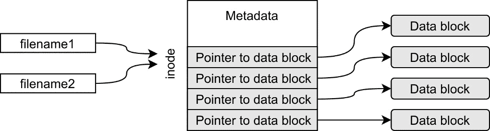
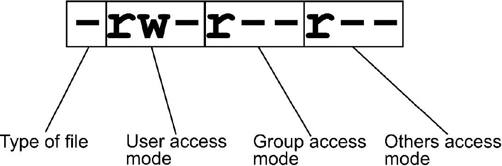

# *第 5 章*:处理文件输入/输出和文件系统操作

文件输入/输出是系统编程的一个重要部分，因为大多数程序必须读写文件中的数据。进行文件输入/输出还要求开发人员对文件系统略知一二。

掌握文件输入/输出和文件系统操作将使您不仅成为更好的程序员，而且成为更好的系统管理员。

在本章中，我们将了解 Linux 文件系统和信息节点。我们还将学习如何使用流和文件描述符在系统上读写文件。我们还将研究创建和删除文件以及更改文件权限和所有权的系统调用。在这一章的最后，我们将学习如何获取关于文件的信息。

在本章中，我们将介绍以下食谱:

*   读取索引节点信息并学习文件系统
*   创建软链接和硬链接
*   创建文件并更新时间戳
*   删除文件
*   获得访问权限和所有权
*   设置访问权限和所有权
*   使用文件描述符写入文件
*   从具有文件描述符的文件中读取
*   用流写入文件
*   从带有流的文件中读取
*   用流读写二进制数据
*   在文件内移动`lseek()`
*   在文件内移动`fseek()`

# 技术要求

对于本章，您将需要 GCC 编译器、Make 工具和我们在*中制作的通用 Makefile 在 [*第 3 章*](03.html#_idTextAnchor097)*中使用 GCC 选项*编写通用 Makefile 在 Linux* 中深入 C。 [*第 1 章*](01.html#_idTextAnchor020)*获取必要的工具并编写我们的第一个 Linux 程序*，涵盖了安装编译器和 Make 工具。

通用 Makefile 以及本章的所有源代码示例可以从 GitHub 下载，网址为:[https://GitHub . com/packt publishing/Linux-System-Programming-technologies/tree/master/ch5](https://github.com/PacktPublishing/Linux-System-Programming-Techniques/tree/master/ch5)。

我们将在 Linux 的内置手册中查找函数和头文件。如果您使用的是 Debian 或 Ubuntu，Linux 程序员手册是作为*构建基础*元包的一部分安装的，包含在 [*第 1 章*](01.html#_idTextAnchor020)*获取必要的工具并编写我们的第一个 Linux 程序*中。您还需要安装*中的 *POSIX 程序员手册*，在 [*第 3 章*](03.html#_idTextAnchor097)*中获取关于 Linux 和 Unix 特定头文件的信息*配方，在 Linux 中深入 C 语言*。如果您正在使用 CentOS 或 Fedora，这些手册很可能已经安装。否则，查看我提到的 [*第三章*](03.html#_idTextAnchor097)*在 Linux* 中深入 C 的食谱。

查看以下链接，查看《行动守则》视频:[https://bit.ly/3u4OuWz](https://bit.ly/3u4OuWz)

# 读取索引节点信息并学习文件系统

理解索引节点是更深层次理解 Linux 中文件系统的关键。文件名不是 Linux 或 Unix 系统中的真实文件。这只是一个指向信息节点的**指针**。inode 包含关于实际数据存储位置的信息以及关于文件的大量元数据，例如文件模式、上次修改日期和所有者。

在这个食谱中，我们将对**文件系统**以及索引节点如何适应这个文件系统有一个大致的了解。我们还将查看信息节点信息，并了解一些相关命令。我们还将编写一个小的 C 程序，从文件名中读取索引节点信息。

## 做好准备

在这个食谱中，我们将使用命令和 C 程序来探索索引节点的概念。本章的*技术要求*部分涵盖了您需要的所有配方。

## 怎么做…

在本食谱中，我们将从探索系统中已经存在的命令开始，以查看信息节点信息。然后，我们将创建一个小的 C 程序来打印索引节点信息:

1.  我们将从创建一个小的文本文件开始，我们将在整个食谱中使用它:

    ```sh
    $> echo "This is just a small file we'll use" \
    > > testfile1
    $> cat testfile1 
    This is just a small file we'll use
    ```

2.  现在，让我们查看这个文件的*索引节点号*，以及它的大小、块计数和其他信息。每个系统和每个文件的索引节点号都不同:

    ```sh
    $> stat testfile1 
      File: testfile1
      Size: 36              Blocks: 8          IO Block: 262144 regular file
    Device: 35h/53d Inode: 19374124    Links: 1
    Access: (0644/-rw-r--r--)  Uid: ( 1000/    jake)   Gid: ( 1000/    jake)
    Access: 2020-10-16 22:19:02.770945984 +0200
    Modify: 2020-10-16 22:19:02.774945969 +0200
    Change: 2020-10-16 22:19:02.774945969 +0200
     Birth: -
    ```

3.  大小以字节为单位，为 36 字节。由于文本中没有使用特殊字符，这将与文件包含的字符数相同。我们可以用`wc` :

    ```sh
    $> wc -c testfile1 
    36 testfile1
    ```

    来统计字符数
4.  现在，让我们构建一个小程序来提取一些信息；索引节点号、文件大小和**链接**的数量(我们将在下一个食谱中返回链接的数量)。将以下代码写入一个文件并保存为`my-stat-v1.c`。我们将用来提取信息的系统调用函数的名称与命令行工具`stat`同名。系统调用功能在代码中突出显示:

    ```sh
    #include <stdio.h>
    #include <sys/types.h>
    #include <sys/stat.h>
    #include <unistd.h>
    #include <errno.h>
    #include <string.h>
    int main(int argc, char *argv[])
    {
       struct stat filestat;
       if ( argc != 2 )
       {
          fprintf(stderr, "Usage: %s <file>\n", 
             argv[0]);
          return 1;
       }
       if ( stat(argv[1], &filestat) == -1 )
       {
          fprintf(stderr, "Can't read file %s: %s\n", 
             argv[1], strerror(errno));
          return errno;
       }
       printf("Inode: %lu\n", filestat.st_ino);
       printf("Size: %zd\n", filestat.st_size);
       printf("Links: %lu\n", filestat.st_nlink);
       return 0;
    }
    ```

5.  现在使用 Make 和通用的`Makefile` :

    ```sh
    $> make my-stat-v1
    gcc -Wall -Wextra -pedantic -std=c99    my-stat-v1.c   -o my-stat-v1
    ```

    编译这个程序
6.  让我们试试`testfile1`上的程序。比较索引节点的数量、大小和链接数量。这些数字应该和我们使用`stat`程序时一样:

    ```sh
    $> ./my-stat-v1 testfile1 
    Inode: 19374124
    Size: 36
    Links: 1
    ```

7.  如果我们不输入参数，我们会得到一条使用信息:

    ```sh
    $> ./my-stat-v1
    Usage: ./my-stat-v1 <file>
    ```

8.  如果我们在一个不存在的文件上尝试，我们会得到一条错误消息:

    ```sh
    $> ./my-stat-v1 hello123
    Can't read file hello123: No such file or directory
    ```

## 它是如何工作的…

文件的文件名不是数据或文件。文件名只是一个指向索引节点的链接。而该索引节点又包含关于文件系统上实际数据存储位置的信息。正如我们将在下一个食谱中看到的，一个索引节点可以有多个名称或*链接*。文件名有时也称为链接。下图说明了指向索引节点的文件名的概念，索引节点包含关于**数据块**存储位置的信息:



图 5.1–信息节点和文件名

索引节点还包含**元数据**，如创建日期、上次修改日期、总文件大小、所有者和访问权限等。在*步骤 2* 中，我们使用`stat`命令提取了这些元数据。

在*第 4 步*中，我们创建了一个小的 C 程序，它使用与命令`stat()`同名的系统调用函数读取这些元数据。`stat()`系统调用提取的数据比我们在这里打印的要多得多。我们将在本章中打印更多此类信息。所有这些信息都存储在一个名为`stat`的结构中。我们在`man 2 stat`手册页中找到了关于该结构的所有信息。在该手册页中，我们还可以看到变量是什么数据类型(`ino_t`、`off_t`和`nlink_t`)。然后在`man sys_types.h`中，在**另外**下，我们找到这些是什么类型。

我们在这里使用的字段是`st_ino`代表索引节点号，`st_size`代表文件大小，`st_nlink`代表文件的链接数。

在*第 6 步*中，我们看到使用我们的 C 程序提取的信息与来自`stat`命令的信息相同。

我们还在程序中实现了错误处理。`stat()`函数是用`if`语句包装的，检查其返回值为-1。如果确实发生了错误，我们会打印一条错误消息到 *stderr* ，文件名和错误消息来自`errno`。程序还会将`errno`变量返回给 shell。我们在 [*第 4 章*](04.html#_idTextAnchor147) *【处理程序中的错误】*中学习了所有关于错误处理和`errno`的知识。

# 创建软链接和硬链接

在上一个食谱中，我们谈到了链接的问题。在本食谱中，我们将了解更多关于链接以及它们如何影响索引节点的信息。我们还将调查**软链接**和**硬链接**之间的差异。简而言之，硬链接是文件名，软链接就像是文件名的快捷方式。

除此之外，我们将编写两个程序，一个创建硬链接，一个创建软链接。然后我们将使用我们在前面的食谱中创建的程序来检查**链接计数**。

## 做好准备

除了本章开头列出的要求之外，您还需要我们在之前的食谱`my-stat-v1.c`中创建的程序。您还需要我们在之前的配方中创建的测试文件，名为`testfile1`。如果你还没有创建这些文件，你也可以从[网站下载。](https://github.com/PacktPublishing/Linux-System-Programming-Techniques/tree/master/ch5)

您还需要使用 Make 编译`my-stat-v1.c`程序，这样您就可以执行它，如果您还没有这样做的话。你用`make my-stat-v1`编译一下。

## 怎么做…

我们将创建软链接和硬链接，使用内置命令和编写简单的 C 程序来实现:

1.  我们将从创建一个新的硬链接到我们的测试文件开始。我们将命名新的硬链接`my-file`:T2
2.  现在让我们来看看这个新文件名。注意链接是如何从增加到`2`的，但是其余的和`testfile1`一样:

    ```sh
    $> cat my-file 
    This is just a small file we'll use
    $> ls -l my-file 
    -rw-r--r-- 3 jake jake 36 okt 16 22:19 my-file
    $> ./my-stat-v1 my-file 
    Inode: 19374124
    Size: 36
    Links: 2
    ```

3.  现在将这些数字与`testfile1`文件进行比较。它们应该都是一样的:

    ```sh
    $> ls -l testfile1 
    -rw-r--r-- 3 jake jake 36 okt 16 22:19 testfile1
    $> ./my-stat-v1 testfile1 
    Inode: 19374124
    Size: 36
    Links: 2
    ```

4.  让我们创建另一个名为`another-name`的硬链接。我们使用名称`my-file`作为目标来创建这个链接:

    ```sh
    $> ln my-file another-name
    ```

5.  我们也会调查这个文件:

    ```sh
    $> ls -l another-name 
    -rw-r--r-- 2 jake jake 36 okt 16 22:19 another-name
    $> ./my-stat-v1 another-name 
    Inode: 19374124
    Size: 36
    Links: 3
    ```

6.  现在我们删除`testfile1`文件名:

    ```sh
    $> rm testfile1
    ```

7.  现在已经删除了我们创建的第一个文件名，我们将研究另外两个名字:

    ```sh
    $> cat my-file 
    This is just a small file we'll use
    $> ls -l my-file 
    -rw-r--r-- 2 jake jake 36 okt 16 22:19 my-file
    $> ./my-stat-v1 my-file 
    Inode: 19374124
    Size: 36
    Links: 2
    $> cat another-name 
    This is just a small file we'll use
    $> ls -l another-name 
    -rw-r--r-- 2 jake jake 36 okt 16 22:19 another-name
    $> ./my-stat-v1 another-name 
    Inode: 19374124
    Size: 36
    Links: 2
    ```

8.  是时候创建一个软链接了。我们创建了一个名为`my-soft-link`的软链接到`another-name` :

    ```sh
    $> ln -s another-name my-soft-link
    ```

9.  软链接是一种特殊的文件类型，我们可以通过`ls`命令看到。请注意，我们在这里获得了一个新的时间戳。此外，请注意这是一个特殊的文件，可以通过文件模式字段中的第一个字母看到，字母`l`表示链接:

    ```sh
    $> ls -l my-soft-link 
    lrwxrwxrwx 1 jake jake 12 okt 17 01:49 my-soft-link -> another-name
    ```

10.  现在我们来看看`another-name`的链接数。注意计数器没有随软链接增加:

    ```sh
    $> ./my-stat-v1 another-name 
    Inode: 19374124
    Size: 36
    Links: 2
    ```

11.  是时候写我们自己的程序来创建硬链接了。有一个简单易用的**系统调用**命名为`link()`，我们将使用它。将以下代码写入一个文件并保存为`new-name.c`。`link()`系统调用在代码中突出显示:

    ```sh
    #include <stdio.h>
    #include <unistd.h>
    #include <string.h>
    #include <errno.h>
    int main(int argc, char *argv[])
    {
        if (argc != 3)
        {
            fprintf(stderr, "Usage: %s [target] " 
                "[new-name]\n", argv[0]);
            return 1;
        }
        if (link(argv[1], argv[2]) == -1)
        {
            perror("Can't create link");
            return 1;
        }
        return 0;
    }
    ```

12.  编译程序:

    ```sh
    $> make new-name
    gcc -Wall -Wextra -pedantic -std=c99    new-name.c   -o new-name
    ```

13.  为我们之前的`my-file`文件创建一个新的名称。命名新文件`third-name`。我们还尝试生成一些错误，以确保程序打印出正确的错误消息。注意`third-name`的索引节点信息与`my-file`相同:

    ```sh
    $> ./new-name 
    Usage: ./new-name [target][new-name]
    $> ./new-name my-file third-name
    $> ./my-stat-v1 third-name
    Inode: 19374124
    Size: 36
    Links: 3
    $> ./new-name my-file /home/carl/hello
    Can't create link: Permission denied
    $> ./new-name my-file /mnt/localnas_disk2/
    Can't create link: File exists
    $> ./new-name my-file /mnt/localnas_disk2/third-name
    Can't create link: Invalid cross-device link
    ```

14.  现在让我们创建一个创建软链接的程序。这个也有一个易用的系统调用，叫做`symlink()`，为**符号链接**，是**软链接**的别称。本程序将与前一程序相似。将以下代码写入一个文件并保存为`new-symlink.c`。`symlink()`系统调用在代码中突出显示。注意所有这些系统调用函数是多么相似:

    ```sh
    #define _XOPEN_SOURCE 700
    #include <stdio.h>
    #include <unistd.h>
    #include <string.h>
    #include <errno.h>
    int main(int argc, char *argv[])
    {
        if (argc != 3)
        {
            fprintf(stderr, "Usage: %s [target] " 
                "[link]\n", argv[0]);
            return 1;
        }
        if (symlink(argv[1], argv[2]) == -1)
        {
            perror("Can't create link");
            return 1;
        }
        return 0;
    }
    ```

15.  编译一下:

    ```sh
    $> make new-symlink
    gcc -Wall -Wextra -pedantic -std=c99    new-symlink.c   -o new-symlink
    ```

16.  让我们试试，创建一个名为`new-soft-link`到`third-name`的新软链接。此外，让我们尝试生成一些错误，以便我们可以验证错误处理正在工作:

    ```sh
    $> ./new-symlink third-name new-soft-link
    $> ls -l new-soft-link 
    lrwxrwxrwx 1 jake jake 10 okt 18 00:31 new-soft-link -> third-name
    $> ./new-symlink third-name new-soft-link
    Can't create link: File exists
    $> ./new-symlink third-name /etc/new-soft-link
    Can't create link: Permission denied
    ```

## 它是如何工作的…

这里发生了很多事情，让我们从头开始。

在步骤 1 到 7 中，我们创建了两个到`testfile1`文件的新硬链接。但是正如我们注意到的，硬链接没有什么特别的；这只是 inode 的另一个名称。所有文件名都是硬链接。文件名只是一个指向索引节点的链接。我们删除`testfile1`文件名时看到了这一点。其余两个名称链接到同一个信息节点，并且包含相同的文本。第一个文件名或链接没有什么特别的。没有办法告诉哪个硬链接是第一个创建的。他们是平等的；他们甚至共享同一个日期，即使其他链接是在稍后的时间制作的。日期是索引节点的，而不是文件名的。

当我们创建和删除硬链接时，我们看到了链接数量是如何增加和减少的。这是索引节点记录它有多少链接(或名称)。

直到最后一个名称被删除，也就是当链接计数器达到零时，索引节点才被删除。

在*步骤 8 到 10* 中，我们看到一个软链接，另一方面，是一个特殊的文件类型。软链接不计入索引节点的链接计数器。该文件在`ls -l`输出开始时用`l`表示。我们也可以在`ls -l`输出中看到软链接指向的文件。把软链接当成捷径。

在第 11 步到第 13 步中，我们编写了一个 C 程序，创建一个硬链接——一个新的名字——到一个现有的文件名。在这里我们了解到系统调用创建新名称称为`link()`，并采用两个参数，目标和新名称。

在*步骤 13* 中，我们见证了硬链接的一个有趣属性。它们不能跨越设备。当我们思考它时，它是有意义的。文件名不能保留在独立于信息节点的设备上。如果设备被删除，则可能不再有指向信息节点的名称，从而使其不可访问。

对于剩下的步骤，我们编写了一个 C 程序，创建到现有文件的软链接。这个系统调用类似于`link()`，但被称为`symlink()`。

## 还有更多…

请查看我们在本食谱中介绍的系统调用的手册页；它们包含了硬链接和软链接的一些很好的解释。手动页面为`man 2 link`和`man 2 symlink`。

# 创建文件并更新时间戳

现在我们已经理解了文件系统、索引节点和硬链接，我们将学习如何通过在 c 语言中编写自己版本的`touch`来创建文件。我们已经开始在 [*第 4 章*](04.html#_idTextAnchor147) *中编写版本的`touch`，在这里我们*学习了错误处理。我们将继续使用该程序的最新版本，我们将其命名为`simple-touch-v7.c`。`touch`的真实版本更新文件的修改和访问**时间戳**如果文件存在的话。在这个食谱中，我们将把这个特性添加到我们的新版本中。

## 做好准备

本章的*技术要求*部分列出了您需要的所有配方。虽然我们会添加最新版本的`simple-touch`，但我们会在这个食谱中编写完整的代码。但是要完全理解程序，明智的做法是先通读 [*第四章*](04.html#_idTextAnchor147) *【处理程序中的错误】*。

## 怎么做…

在第八版`simple-touch`中，我们将添加更新文件访问和修改日期的功能:

1.  将以下代码写入一个文件并保存为`simple-touch-v8.c`。这里我们将使用`utime()`系统调用来更新文件的访问和修改时间戳。代码中突出显示了以前版本的更改(添加的注释除外)。另外，请注意`creat()`系统调用是如何进入`if`语句的。`creat()`系统调用仅在文件不存在时调用:

    ```sh
    #include <stdio.h>
    #include <fcntl.h>
    #include <string.h>
    #include <errno.h>
    #include <utime.h>
    #define MAX_LENGTH 100
    int main(int argc, char *argv[])
    {
       char filename[MAX_LENGTH] = { 0 };
       /* Check number of arguments */
       if (argc != 2)
       {
          fprintf(stderr, "You must supply a filename "
             "as an argument\n");
          return 1;
       }
       strncat(filename, argv[1], sizeof(filename)-1);
       /* Update the access and modification time */
       if ( utime(filename, NULL) == -1 )
       {
          /* If the file doesn't exist, create it */
          if (errno == ENOENT)
          {
             if ( creat(filename, 00644) == -1 )
             {
                perror("Can't create file");
                return errno;
             }
          }
          /* If we can't update the timestamp,
             something is wrong */
          else
          {
             perror("Can't update timestamp");
             return errno;
          }
       }
       return 0;
    }
    ```

2.  使用 Make:

    ```sh
    $> make simple-touch-v8
    gcc -Wall -Wextra -pedantic -std=c99    simple-touch-v8.c   -o simple-touch-v8
    ```

    编译程序
3.  我们来试试看看效果如何。我们将在我们在前面的食谱中创建的文件名上尝试一下，看看每个文件名如何获得相同的时间戳，因为它们都指向相同的索引节点:

    ```sh
    $> ./simple-touch-v8 a-new-file
    $> ls -l a-new-file 
    -rw-r--r-- 1 jake jake 0 okt 18 19:57 a-new-file
    $> ls -l my-file 
    -rw-r--r-- 3 jake jake 36 okt 16 22:19 my-file
    $> ls -l third-name 
    -rw-r--r-- 3 jake jake 36 okt 16 22:19 third-name
    $> ./simple-touch-v8 third-name
    $> ls -l my-file 
    -rw-r--r-- 3 jake jake 36 okt 18 19:58 my-file
    $> ls -l third-name 
    -rw-r--r-- 3 jake jake 36 okt 18 19:58 third-name
    $> ./simple-touch-v8 /etc/passwd
    Can't change filename: Permission denied
    $> ./simple-touch-v8 /etc/hello123
    Can't create file: Permission denied
    ```

## 它是如何工作的…

在这个配方中，我们添加了更新文件时间戳的功能，也就是我们所知道的 inode。

要更新的访问和修改时间，我们使用`utime()`系统调用。`utime()`系统调用需要两个参数，一个文件名和一个时间戳。但是如果我们给函数`NULL`作为第二个参数，它将使用当前的时间和日期。

对`utime()`的调用被包装在`if`语句中，该语句检查返回值是否为-1。如果是，那就有问题了，设置`errno`(详见 [*第四章*](04.html#_idTextAnchor147) *【你程序中的错误处理】*，对`errno`的深入讲解)。然后我们使用`errno`检查是否是*文件未找到*错误(`ENOTENT`)。如果文件不存在，我们使用`creat()`系统调用创建它。对`creat()`的调用也包含在`if`语句中。如果创建文件时出现问题，程序会打印一条错误消息并返回`errno`值。如果程序设法创建了文件，它将继续向下到`return 0`。

如果来自`utime()`的`errno`值不是`ENOENT`，它会继续向下到`else`语句，打印一条错误消息，并返回`errno`。

当我们尝试该程序时，我们注意到当我们更新其中一个时`my-file`和`third-name`都获得了更新的时间戳。这是因为文件名只是指向同一索引节点的链接。时间戳是索引节点中的元数据。

## 还有更多…

`man 2 creat`和`man 2 utime`中有很多有用的信息。如果你有兴趣在 Linux 中学习更多关于时间和日期的知识，我推荐你阅读`man 2 time`、`man 3 asctime`和`man time.h`。

# 删除文件

在本食谱中，我们学习如何使用系统调用删除文件，以及名称—`unlink()`—的来源。这个食谱将增强你对链接的理解，并关闭这个圈子。这将提高你对 Linux 及其文件系统的整体知识。知道如何使用系统调用删除文件将使您能够直接从程序中删除文件。

这里我们将编写自己版本的`rm`，我们称之为`remove`。在这个食谱之后，我们知道如何创建和删除文件以及如何制作链接。这些是一些最常见的文件系统操作。

## 做好准备

在这个食谱中，我们将使用`my-stat-v1`程序，我们在*中写道读取索引节点信息和学习文件系统*食谱。我们还将继续实验我们在之前的食谱中创建的文件名:`my-file`、`another-name`和`third-name`。除此之外，您还需要本章*技术要求*下列出的内容，即 GCC 编译器、Make 工具和通用 Makefile。

## 怎么做…

跟着这里写一个简单版本的`rm`:

1.  将以下代码写入一个文件并保存为`remove.c`。该程序使用`unlink()`系统调用删除一个文件。系统调用在代码中突出显示:

    ```sh
    #include <stdio.h>
    #include <unistd.h>
    #include <errno.h>
    int main(int argc, char *argv[])
    {
        if (argc != 2)
        {
            fprintf(stderr, "Usage: %s [path]\n",
                argv[0]);
            return 1;
        }
        if ( unlink(argv[1]) == -1 )
        {
            perror("Can't remove file");
            return errno;
        }
        return 0;
    }
    ```

2.  使用**制作**工具

    ```sh
    $> make remove
    gcc -Wall -Wextra -pedantic -std=c99    remove.c   -o remove
    ```

    编译
3.  让我们来试试:

    ```sh
    $> ./my-stat-v1 my-file 
    Inode: 19374124
    Size: 36
    Links: 3
    $> ./remove another-name 
    $> ./my-stat-v1 my-file 
    Inode: 19374124
    Size: 36
    Links: 2
    ```

## 它是如何工作的…

系统调用删除一个文件称为`unlink()`。这个名称来自于这样一个事实:当我们删除一个文件名时，我们只删除了一个指向该索引节点的硬链接；因此我们**取消**文件名的链接。如果它恰好是某个信息节点的最后一个文件名，则该信息节点也会被删除。

`unlink()`系统调用只需要一个参数:我们想要删除的文件名。

# 获取访问权限和所有权

在这个食谱中，我们将编写一个程序，使用我们在本章前面看到的`stat()`系统调用读取文件的访问权限和所有权。我们将继续在本章第一个食谱中构建的`my-stat-v1`程序的基础上进行构建。在这里，我们将添加一些功能来显示所有权和访问权限。了解如何以编程方式获得所有者和访问权限是处理文件和目录的关键。它将使您能够检查用户是否有适当的权限，如果没有，则打印一条错误消息。

我们还将学习如何在 Linux 中解释访问权限，以及如何在数字表示和字母表示之间进行转换。理解 Linux 中的访问权限是成为 Linux 系统程序员的关键。整个系统上的每个文件和目录都有访问权限，并有一个所有者和一个分配给他们的组。不管它是日志文件、系统文件还是用户拥有的文本文件。所有东西都有使用权。

## 做好准备

对于这个食谱，你只需要本章*技术要求*部分列出的内容。

## 怎么做…

我们将在这个食谱中写一个新版本的`my-stat-v1`。不过，我们将在这里编写整个程序，因此您不需要以前的版本:

1.  将以下代码写入一个文件并保存为`my-stat-v2.c`。在这个版本中，我们将获取关于文件的所有者和组以及文件模式的信息。要将**用户标识**号码翻译成用户名，我们使用`getpwuid()`。要获取**组的组名，我们使用`getgrgid()`。代码中突出显示了这些变化:

    ```sh
    #include <stdio.h>
    #include <sys/types.h>
    #include <sys/stat.h>
    #include <unistd.h>
    #include <errno.h>
    #include <string.h>
    #include <pwd.h>
    #include <grp.h>
    int main(int argc, char *argv[])
    {
        struct stat filestat;
        struct passwd *userinfo;
        struct group *groupinfo;
        if ( argc != 2 )
        {
            fprintf(stderr, "Usage: %s <file>\n",
                argv[0]);
            return 1;
        }
        if ( stat(argv[1], &filestat) == -1 )
        {
            fprintf(stderr, "Can't read file %s: %s\n", 
                argv[1], strerror(errno));
            return errno;
        }
        if ( (userinfo = getpwuid(filestat.st_uid)) ==
            NULL )
        {
            perror("Can't get username");
            return errno;
        }
        if ( (groupinfo = getgrgid(filestat.st_gid)) ==
            NULL )
        {
            perror("Can't get groupname");
            return errno;
        }
        printf("Inode: %lu\n", filestat.st_ino);
        printf("Size: %zd\n", filestat.st_size);
        printf("Links: %lu\n", filestat.st_nlink);
    printf("Owner: %d (%s)\n", filestat.st_uid, 
            userinfo->pw_name);
    printf("Group: %d (%s)\n", filestat.st_gid, 
            groupinfo->gr_name);
        printf("File mode: %o\n", filestat.st_mode);
        return 0;
    }
    ```** 
2.  编译程序:

    ```sh
    $> make my-stat-v2
    gcc -Wall -Wextra -pedantic -std=c99    my-stat-v2.c   -o my-stat-v2
    ```

3.  在一些不同的文件上试用程序:

    ```sh
    $> ./my-stat-v2 third-name 
    Inode: 19374124
    Size: 36
    Links: 2
    Owner: 1000 (jake)
    Group: 1000 (jake)
    File mode: 100644
    $> ./my-stat-v2 /etc/passwd
    Inode: 4721815
    Size: 2620
    Links: 1
    Owner: 0 (root)
    Group: 0 (root)
    File mode: 100644
    $> ./my-stat-v2 /bin/ls
    Inode: 3540019
    Size: 138856
    Links: 1
    Owner: 0 (root)
    Group: 0 (root)
    File mode: 100755
    ```

## 它是如何工作的…

在这个版本的`my-stat`中，我们增加了检索文件访问模式的功能，或者实际上是**文件模式**。文件的完整文件模式由六个八进制数字组成。前两个(左边)是文件类型。在这种情况下，它是一个常规文件(10 等于一个常规文件)。第四个八进制数字是**设置用户标识位**、**设置组标识位**和**粘性位**。最后三个八进制数字用于**访问模式**。

在`ls -l`的输出中，所有这些位都表示为字母。但是当我们写程序的时候，我们必须把这些设置和读取为数字。在我们继续之前，让我们检查一下文件模式的字母版本，以便我们真正理解它:



图 5.2–文件访问模式

set-user-ID 位是一个允许进程作为二进制文件的所有者运行的位，即使它是作为不同的用户执行的。设置设置用户标识位有潜在的危险，而*不是*是我们应该在程序中设置的。一个使用设置用户标识位的程序是`passwd`程序。当用户更改密码时，`passwd`程序必须更新`/etc/passwd`和`/etc/shadow`文件，即使这些文件属于 root 用户。正常情况下，我们甚至不能作为普通用户读取`/etc/shadow`文件，但是通过`passwd`程序上设置的 set-user-ID 位，它甚至可以对其进行写入。如果设置了用户标识位，则在用户访问模式的第三个位置用`s`表示。

set-group-ID 也有类似的效果。当一个程序被执行，并且设置组标识位被设置时，它作为该组被执行。设置组标识后，在组访问模式的第三个位置用`s`表示。

历史上，粘性的位用于将程序粘贴到交换空间，以获得更快的加载时间。如今，它的用法完全不同。现在，名称和含义已更改为*限制删除标志*。当目录设置了粘性位时，只有文件的所有者、目录所有者或根用户可以删除文件，即使该目录对任何人都是可写的。例如`/tmp`目录通常设置了粘性位。粘性位由最后一组的最后一个位置的`t`表示。

### 文件访问模式

当我们在一个文件上运行`ls -l`时，我们总是会看到两个名字。第一个名称是用户(所有者)，第二个名称是拥有文件的组。以此为例:

```sh
$> ls -l Makefile 
-rw-r--r-- 1 jake devops 134 okt 27 23:39 Makefile
```

在这种情况下，`jake`是用户(所有者)，`devops`是组。

文件访问模式比我们刚才介绍的特殊标志更容易理解。请看*图 5.2* 。前三个字母是用户的访问模式(文件的所有者)。这个特殊的例子有`rw-`，这意味着用户可以读写文件，但不能执行。如果用户能够执行它，那将在最后用`x`表示。

中间三个字母代表组访问模式(拥有文件的组)。在这种情况下，该组只能读取文件，因为该组缺少用于写入的`w`和用于执行的`x`。

最后三个字母代表所有其他人(不是所有者，也不在所有者组中)。在这种情况下，其他人只能读取文件。

全套权限将是`rwxrwxrwx`。

### 在字母和数字之间转换访问模式

一个**八进制数**代表文件访问模式。在我们习惯它之前，把字母转换成八进制的最简单的方法就是用笔和纸。我们将设置访问位的每个组中的所有数字相加。如果没有设置(破折号)，那么我们就不加那个数字。添加完每个组后，我们就有了访问模式:

```sh
rw- r-- r—
421 421 421
 6   4   4
```

因此，前面的八进制访问模式是 644。让我们做另一个例子:

```sh
rwx rwx r-x
421 421 421
 7   7   5
```

前面的访问模式结果是 775。我们再举一个例子:

```sh
rw- --- ---
421 421 421
 6   0   0
```

这种访问模式是 600。

反过来也可以用纸笔完成。假设我们有访问模式 750，我们想把它转换成字母:

```sh
 7   5   0
421 401 000
rwx r-x ---
```

因此，750 变成`rwxr-x---`。

当你做了一段时间后，你学会了最常用的访问模式，不再需要笔和纸了。

### 八进制文件模式

同样的原理也适用于文件访问模式。请记住，在用户的执行位置，设置用户标识是由`s`表示的，而在组的执行位，设置组标识是由`s`表示的。一个`t`字符表示最后一个执行位位置的粘性位(“其他”)。如果我们连续写，我们会得到:

```sh
s s t
4 2 1
```

所以如果只有 set-user-ID 位被置位，我们得到一个 4。如果设置了集用户标识和集组标识，我们得到 *4+2=6* 。如果只有设置组标识位被设置，我们得到一个 2。如果只有粘性位被设置，我们得到 1，以此类推。如果所有的位都被设置，我们得到一个 *7 (4+2+1)* 。

这些文件模式由文件访问模式之前的数字表示。例如，八进制文件模式`4755`设置了设置用户标识位(4)。

当我们在 Linux 下编程时，我们甚至可以遇到另外两个数字，就像我们在`my-stat-v2`程序的输出中看到的那样。在那里，我们有这个:

```sh
File mode: 100755
```

本例中的前两个数字`10`是文件类型。这两个数字的确切含义是我们必须在`man 7 inode`手册页中查找的。我们有一张漂亮的桌子告诉我们这意味着什么。我在这里做了一个简化的列表，只显示了我们感兴趣的前两个数字以及它代表的文件类型:

```sh
14   socket
12   symbolic link
10   regular file
06   block device
04   directory
02   character device
01   FIFO
```

这意味着我们的示例文件是一个常规文件(10)。

如果我们将刚刚学习的所有内容加起来，并从前面的例子中翻译文件模式 *100755* 从`my-stat-v2`输出，我们会得到:

```sh
10  = a regular file
0   = no set-user-ID, set-group-ID or sticky bit is set
755 = the user can read, write, and execute it. The group can read and execute it, and all others can also read and execute it.
```

文件类型在第一个位置也用字母表示(见*图 5.2* )。这些信件如下:

```sh
s   socket
l   symbolic link
-   regular file
b   block device
d   directory
c   character device
p   FIFO
```

# 设置访问权限和所有权

在之前的菜谱中，我们学习了如何读取文件和文件夹的**访问权限**。在这个食谱中，我们将学习如何使用`chmod`命令和`chmod()`系统调用来设置访问权限。我们还将学习如何使用`chown`命令和`chown()`系统调用来更改文件的所有者和组。

了解如何正确设置访问权限将有助于保护您的系统和文件的安全。

## 做好准备

对于这个食谱，你只需要本章*技术要求*部分列出的内容。阅读前面的食谱来理解 Linux 中的权限也是一个好主意。您还需要上一份食谱中的`my-stat-v2`程序。

## 怎么做…

这些步骤将教会我们如何更改文件和目录的访问权限和所有权。

### 访问权限

我们将通过使用`chmod`命令设置文件的访问权限来开始。然后我们将使用`chmod()`系统调用编写一个简单的 C 版`chmod`命令:

1.  让我们从使用`chmod`命令删除`my-stat-v2`程序的执行权限开始。以下命令中的`-x`表示*移除执行* :

    ```sh
    $> chmod -x my-stat-v2
    ```

2.  现在让我们试着执行这个程序。这应该会失败，权限被拒绝:

    ```sh
    $> ./my-stat-v2
    bash: ./my-stat-v2: Permission denied
    ```

3.  现在我们再次将它改回来，但是这次我们使用八进制数设置*绝对*权限。可执行文件的合适权限是 755，翻译过来就是`rwxr-xr-x`。这反过来意味着用户拥有完全权限，并且该组可以读取和执行该文件。其他人也是如此；他们可以阅读和执行它:

    ```sh
    $> chmod 755 my-stat-v2
    ```

4.  这个命令之后，我们可以再次执行程序:

    ```sh
    ./my-stat-v2 
    Usage: ./my-stat-v2 <file>
    ```

5.  现在是时候使用`chmod()`系统调用编写一个简单版本的`chmod`命令了。将以下代码写入一个文件并保存为`my-chmod.c`。`chmod()`系统调用采用两个参数，文件或目录的路径和文件权限，用八进制数表示。在我们到达`chmod()`系统调用之前，我们执行一些检查以确保权限看起来合理(三位数或四位数的八进制数)。检查后，我们用`strtol()`将数字转换成八进制数。`strtol()`的第三个参数是基数，在本例中为`8` :

    ```sh
    #include <stdio.h>
    #include <sys/stat.h>
    #include <string.h>
    #include <stdlib.h>
    void printUsage(FILE *stream, char progname[]);
    int main(int argc, char *argv[])
    {
       long int accessmode; /*To hold the access mode*/
       /* Check that the user supplied two arguments */
       if (argc != 3)
       {
          printUsage(stderr, argv[0]);
          return 1;
       }
       /* Simple check for octal numbers and 
          correct length */
       if( strspn(argv[1], "01234567\n") 
             != strlen(argv[1]) 
             || ( strlen(argv[1]) != 3 && 
                  strlen(argv[1]) != 4 ) )
       {
          printUsage(stderr, argv[0]);
          return 1;
       }
       /* Convert to octal and set the permissions */
       accessmode = strtol(argv[1], NULL, 8);
       if (chmod(argv[2], accessmode) == -1)
       {
          perror("Can't change permissions");
       }
       return 0;
    }
    void printUsage(FILE *stream, char progname[])
    {
        fprintf(stream, "Usage: %s <numerical "
            "permissions> <path>\n", progname);
    }
    ```

6.  现在编译程序:

    ```sh
    $> make my-chmod
    gcc -Wall -Wextra -pedantic -std=c99    my-chmod.c   -o my-chmod
    ```

7.  使用不同的权限测试程序。别忘了用`ls -l` :

    ```sh
    $> ./my-chmod 
    Usage: ./my-chmod <numerical permissions> <path>
    $> ./my-chmod 700 my-stat-v2
    $> ls -l my-stat-v2
    -rwx------ 1 jake jake 17072 Nov  1 07:29 my-stat-v2
    $> ./my-chmod 750 my-stat-v2
    $> ls -l my-stat-v2
    -rwxr-x--- 1 jake jake 17072 Nov  1 07:29 my-stat-v2
    ```

    检查结果
8.  让我们也尝试设置 set-user-ID 位。这个设置用户标识位(以及设置组标识和粘性位)是访问模式前面的第四个数字。这里的`4`设置设置用户标识位。请注意用户字段中的`s`(在以下代码中突出显示):

    ```sh
    $> chmod 4755 my-stat-v2
    $> ls -l my-stat-v2
    -rwsr-xr-x 1 jake jake 17072 Nov  1 07:29 my-stat-v2
    ```

9.  让我们尝试设置所有位(设置-用户-标识、设置-组-标识、粘性位和所有权限):

    ```sh
    $> chmod 7777 my-stat-v2
    $> ls -l my-stat-v2
    -rwsrwsrwt 1 jake jake 17072 Nov  1 07:29 my-stat-v2
    ```

10.  最后，把改回更合理的状态:

    ```sh
    $> chmod 755 my-stat-v2
    $> ls -l my-stat-v2
    -rwxr-xr-x 1 jake jake 17072 Nov  1 07:29 my-stat-v2
    ```

### 所有权

但是我们也需要知道如何改变文件的所有权，而不仅仅是文件访问模式。这是通过`chown`命令或`chown()`系统调用完成的:

1.  要更改文件的所有者，我们必须是 root 用户。普通用户不能泄露他们文件的所有权。同样，他们也不能声称拥有其他人的文件。让我们尝试使用`chown`命令将`my-stat-v2`的所有者更改为 root:

    ```sh
    $> sudo chown root my-stat-v2
    $> ls -l my-stat-v2
    -rwxr-xr-x 1 root jake 17072 Nov  1 07:29 my-stat-v2
    ```

2.  如果我们想改变所有者和组，我们用冒号将用户和组分开。第一个字段是所有者，第二个字段是组:

    ```sh
    $> sudo chown root:root my-stat-v2
    $> ls -l my-stat-v2
    -rwxr-xr-x 1 root root 17072 Nov  1 07:29 my-stat-v2
    ```

3.  现在轮到我们使用`chown()`系统调用编写`chown`的简化版本了。`chown()`系统调用只取用户标识作为数值。为了能够使用名称，我们必须首先使用`getpwnam()`查找用户名。这将在`passwd`结构的`pw_uid`字段中给出数值。这个团体也是如此。我们必须使用其名称，使用`getgrnam()`系统调用来获取数字组标识。现在我们知道了所有的系统调用，让我们编写程序。命名为`my-chown.c`。这个程序有点长，所以我有把它分成几个步骤。请记住，所有步骤都应该放在一个文件中(`my-chown.c`)。如果您愿意，也可以从[https://github . com/PacktPublishing/Linux-System-Programming-technologies/blob/master/ch5/my-chown . c](https://github.com/PacktPublishing/Linux-System-Programming-Techniques/blob/master/ch5/my-chown.c)下载整个代码。让我们从所有头文件、变量和参数检查开始:

    ```sh
    #include <stdio.h>
    #include <stdlib.h>
    #include <unistd.h>
    #include <sys/types.h>
    #include <pwd.h>
    #include <grp.h>
    #include <string.h>
    #include <errno.h>
    int main(int argc, char *argv[])
    {
       struct passwd *user; /* struct for getpwnam */
       struct group *grp; /* struct for getgrnam */
       char *username = { 0 }; /* extracted username */
       char *groupname = { 0 }; /*extracted groupname*/
       unsigned int uid, gid; /* extracted UID/GID */
       /* Check that the user supplied two arguments 
          (filename and user or user:group) */
       if (argc != 3)
       {
          fprintf(stderr, "Usage: %s [user][:group]" 
             " [path]\n", argv[0]);
          return 1;
       }
    ```

4.  由于我们在参数中将用户名和组写为`username:group`，因此我们需要提取用户名部分和组部分。我们使用名为`strtok()`的字符串函数来实现这一点。我们只在对`strtok()`的第一次调用中提供第一个参数(字符串)。之后，我们从`user`结构中获取**用户标识** ( **UID** )并从`grp`结构中获取**组标识** ( **GID** )。我们还会检查用户和组是否存在:

    ```sh
     /* Extract username and groupname */
       username = strtok(argv[1], ":");
       groupname = strtok(NULL, ":");

       if ( (user = getpwnam(username)) == NULL )
       {
          fprintf(stderr, "Invalid username\n");
          return 1;
       }
       uid = user->pw_uid; /* get the UID */
       if (groupname != NULL) /* if we typed a group */
       {
          if ( (grp = getgrnam(groupname)) == NULL )
          {
             fprintf(stderr, "Invalid groupname\n");
             return 1;
          }
          gid = grp->gr_gid; /* get the GID */
       }
       else
       {
          /* if no group is specifed, -1 won't change 
             it (man 2 chown) */
          gid = -1;
       }
    ```

5.  最后，我们使用`chown()`系统调用更新文件的用户和组:

    ```sh
       /* update user/group (argv[2] is the filename)*/
       if ( chown(argv[2], uid, gid) == -1 )
       {
          perror("Can't change owner/group");
          return 1;
       }
       return 0;
    }
    ```

6.  让我们编译程序，以便我们可以尝试:

    ```sh
    $> make my-chown
    gcc -Wall -Wextra -pedantic -std=c99    my-chown.c   -o my-chown
    ```

7.  现在我们在文件上测试程序。请记住，我们需要 root 用户才能更改文件的所有者和组:

    ```sh
    $> ls -l my-stat-v2 
    -rwxr-xr-x 1 root root 17072 nov  7 19:59 my-stat-v2
    $> sudo ./my-chown jake my-stat-v2 
    $> ls -l my-stat-v2 
    -rwxr-xr-x 1 jake root 17072 nov  7 19:59 my-stat-v2
    $> sudo ./my-chown carl:carl my-stat-v2 
    $> ls -l my-stat-v2 
    -rwxr-xr-x 1 carl carl 17072 nov  7 19:59 my-stat-v2
    ```

## 它是如何工作的…

系统上的每个文件和目录都有访问权限和所有者/组对。访问权限通过`chmod`命令或`chmod()`系统调用进行更改。该名称是*更改模式位*的缩写。在前面的食谱中，我们介绍了如何在更易于阅读的文本格式和数字八进制形式之间转换访问权限。在这个配方中，我们编写了一个程序，使用数字形式的`chmod()`系统调用来改变模式位。

为了将数字形式转换为八进制数，我们使用了`strtol()`和`8`作为第三个参数，这是数字系统的基础。基数 8 是八进制；十进制是我们日常生活中使用的常规十进制；基数 16 是十六进制，以此类推。

我们编写了程序，以便用户可以选择他们想要设置的任何内容，无论是访问模式位(三位数)还是特殊位，如 set-user-ID、set-group-ID 和粘性位(四位数)。为了确定用户输入的位数，我们使用`strlen()`。

在我们编写的下一个程序中，我们使用`chown()`来更新文件或目录的所有者和组。由于我们想使用名称而不是数字 UID 和 GID 来更新用户和组，程序变得更加复杂。`chown()`系统调用只取 UID 和 GID，不取名字。这意味着我们需要先查找 UID 和 GID，然后才能调用`chown()`。要查找 UID 和 GID，我们使用`getpwnam()`和`getgrnam()`。这些功能中的每一个都为我们提供了一个`struct`，其中包含了相应用户或组的所有可用信息。从这些结构中，我们提取 UID 和 GID，然后在调用`chown()`时使用。

要从命令行(冒号)中分离出用户名和组部分，我们使用`strtok()`函数。在函数的第一次调用中，我们将字符串指定为第一个参数(在本例中为`argv[1]`)和分隔符(一个冒号)。在对`strtok()`的下一次调用中，我们通过将其设置为`NULL`省略了字符串，但是我们仍然指定了分隔符。第一个调用给我们用户名，第二个调用给我们组名。

之后，我们在调用`getpwnam()`和`getgrnam()`时检查用户名和组名是否存在。如果用户名或组名不存在，功能返回`NULL`。

## 还有更多…

有几个类似于`getpwnam()`和`getgrnam()`的功能，取决于你有什么信息，你有什么信息。如果你有 UID，你可以用`getpwuid()`。同样，如果你有 GID，你可以使用`getgrgid()`。如果你阅读`man 3 getpwnam`和`man 3 getgrnam`手册页，会发现更多信息和更多功能。

# 用文件描述符写入文件

我们已经在之前的章节中看到了**文件描述符**的一些用法，例如，0、1 和 2 ( *stdin* 、 *stdout* 和 *stderr* )。但是在这个方法中，我们将使用文件描述符从一个程序向文件中写入文本。

了解如何使用文件描述符写入文件，既能让你对系统有更深入的了解，又能让你做一些低级的事情。

## 做好准备

这个食谱，你只需要*技术要求*部分列出的内容。

## 怎么做…

在这里，我们将编写一个向文件中写入文本的小程序:

1.  将以下代码写入一个文件并保存为`fd-write.c`。这个程序有两个参数:一个字符串和一个文件名。要使用文件描述符写入文件，我们必须首先使用`open()`系统调用打开文件。`open()`系统调用返回一个文件描述符，它是一个整数。然后，我们将该文件描述符(整数)用于`write()`系统调用。我们已经在 [*第三章*](03.html#_idTextAnchor097) *中看到`write()`，在 Linux* 中深入 C。在那一章中，我们用`write()`写了一个小的文字给 stdout。这次，我们使用`write()`将文本写入文件。注意`open()`系统调用有三个参数:文件的路径，文件应该以哪种模式打开(在这种情况下，如果文件不存在，就创建文件，并以读写模式打开)，以及**访问模式**(此处为`0644` ):

    ```sh
    #include <stdio.h>
    #include <unistd.h>
    #include <fcntl.h>
    #include <string.h>
    #include <sys/types.h>
    #include <sys/stat.h>
    int main(int argc, char *argv[])
    {
       int fd; /* for the file descriptor */
       if (argc != 3)
       {
          fprintf(stderr, "Usage: %s [path] [string]\n",
             argv[0]);
          return 1;
       }
       /* Open the file (argv[1]) and create it if it 
          doesn't exist and set it in read-write mode. 
          Set the access mode to 644 */
       if ( (fd = open(argv[1], O_CREAT|O_RDWR, 00644)) 
          == -1 )
       {
          perror("Can't open file for writing");
          return 1;
       }
       /* write content to file */
       if ( (write(fd, argv[2], strlen(argv[2]))) 
          == -1 )
       {
          perror("Can't write to file");
          return 1;
       }
       return 0;
    }
    ```

2.  让我们编译程序:

    ```sh
    $> make fd-write
    gcc -Wall -Wextra -pedantic -std=c99    fd-write.c   -o fd-write
    ```

3.  让我们试着写一些文字到一个文件。请记住，如果文件已经存在，内容将被覆盖！如果新文本比文件的旧内容小，只有开头的会被覆盖。还要注意，如果文本不包含新行，文件中的文本也不会包含新行:

    ```sh
    $> ./fd-write testfile1.txt "Hello! How are you doing?"
    $> cat testfile1.txt 
    Hello! How are you doing?$>*Enter*
    $> ls -l testfile1.txt 
    -rw-r--r-- 1 jake jake 2048 nov  8 16:34 testfile1.txt
    $> ./fd-write testfile1.txt "A new text"
    $> cat testfile1.txt 
    A new text are you doing?$>
    ```

4.  如果我们使用`xargs`，我们甚至可以从另一个文件中给它输入，这是一个允许我们获取一个程序的输出并将其解析为另一个程序的命令行参数的程序。请注意，这次，`testfile1`将在末尾有一个新行。`xargs`的`-0`选项使其忽略新行，而是使用空字符来指示参数的结束:

    ```sh
    $> head -n 3 /etc/passwd | xargs -0 \
    > ./fd-write testfile1.txt 
    $> cat testfile1.txt 
    root:x:0:0:root:/root:/bin/bash
    daemon:x:1:1:daemon:/usr/sbin:/usr/sbin/nologin
    bin:x:2:2:bin:/bin:/usr/sbin/nologin
    ```

## 它是如何工作的…

`open()`系统调用返回一个文件描述符，我们将其保存在`fd`变量中。文件描述符只是一个整数，就像 0、1 和 3 是*标准输入*、*标准输出*和*标准输出*一样。

我们给`open()`的第二个参数是带有模式位的宏，使用*位或*组合在一起。在我们的例子中，我们同时使用`O_CREAT`和`O_RDWR`。第一个`O_CREAT`表示如果文件不存在，则创建该文件。第二个，`O_RDWR`表示文件应该是开放的，可以读写。

要将字符串写入文件，我们将文件描述符作为第一个参数传递给`write()`。作为第二个参数，我们给它`argv[2]`，它包含我们想要写入文件描述符的字符串。最后一个论点是我们想写的东西的大小。在我们的例子中，我们用`strlen`得到`argv[2]`的大小，这是从`string.h`得到字符串长度的函数。

就像前面的食谱一样，我们检查了`-1`的所有系统调用。如果他们返回`-1`，说明出了问题，我们用`perror()`打印错误信息，然后返回`1`。

## 还有更多…

当程序正常返回时，所有打开的文件描述符都会自动关闭。但是如果我们想显式关闭一个文件描述符，我们使用`close()`系统调用，文件描述符作为它的参数。在我们的例子中，我们可以在返回之前添加`close(fd)`。

手册页上有很多关于`open()`、`close()`、`write()`的好信息。我建议你阅读它们以获得更深入的信息。您可以通过以下方式阅读它们:

*   `man 2 open`
*   `man 2 close`
*   `man 2 write`

# 读取带有文件描述符的文件

在前面的食谱中，我们学习了如何使用文件描述符写入文件。在这个食谱中，我们将学习如何使用文件描述符从文件中读取。因此，我们将编写一个类似于`cat`的小程序。它只需要一个参数——文件名——并将其内容打印到标准输出中。

了解如何读取和使用文件描述符，不仅可以读取文件，还可以读取通过文件描述符获得的各种数据。文件描述符是 Unix 和 Linux 中读写数据的通用方式。

## 做好准备

本章的*技术要求*一节列出了这个配方唯一需要的东西。

## 怎么做…

使用文件描述符读取文件类似于写入文件。我们将使用`read()`系统调用，而不是使用`write()`系统调用。在阅读内容之前，我们必须先弄清楚文件的大小。我们可以为此使用`fstat()`系统调用，它为我们提供了关于文件描述符的信息:

1.  将下面的代码写在一个文件中，并命名为`fd-read.c`。注意我们如何使用`fstat()`获取文件信息，然后使用`read()`读取数据。我们仍然使用`open()`系统调用，但是这次我们移除了`O_CREATE`并将`O_RDRW`更改为`O_RDONLY`以仅允许读取。我们将在这里使用 4，096 的缓冲区大小，这样我们将能够读取一些更大的文件。这个程序有点长，所以我把它分成了几个步骤。但是，所有步骤中的所有代码都放在一个文件中。首先，我们开始写所有的`include`行、变量和参数检查:

    ```sh
    #include <stdio.h>
    #include <unistd.h>
    #include <fcntl.h>
    #include <sys/stat.h>
    #include <sys/types.h>
    #define MAXSIZE 4096
    int main(int argc, char *argv[])
    {
       int fd; /* for the file descriptor */
       int maxread; /* the maximum we want to read*/
       off_t filesize; /* for the file size */
       struct stat fileinfo; /* struct for fstat */
       char rbuf[MAXSIZE] = { 0 }; /* the read buffer*/

       if (argc != 2)
       {
          fprintf(stderr, "Usage: %s [path]\n",
             argv[0]);
          return 1;
       }
    ```

2.  现在，我们使用`open()`系统调用编写打开文件描述符的代码。我们还通过将它包装在一个`if`语句中来添加一些错误处理:

    ```sh
       /* open the file in read-only mode and get
          the file size */
       if ( (fd = open(argv[1], O_RDONLY)) == -1 )
       {
          perror("Can't open file for reading");
          return 1;
       }
    ```

3.  现在，我们使用`fstat()`系统调用编写获取文件大小的代码。这里我们也检查文件的大小是否大于`MAXSIZE`，在这种情况下我们将`maxread`设置为`MAXSIZE-1`。否则，我们将其设置为文件大小。然后，我们使用`read()`系统调用读取文件。最后，我们使用`printf()` :

    ```sh
       fstat(fd, &fileinfo);
       filesize = fileinfo.st_size;
       /* determine the max size we want to read
          so we don't overflow the read buffer */
       if ( filesize >= MAXSIZE )
          maxread = MAXSIZE-1;
       else
          maxread = filesize;

       /* read the content and print it */
       if ( (read(fd, rbuf, maxread)) == -1 )
       {
          perror("Can't read file");
          return 1;
       }
       printf("%s", rbuf);
       return 0;
    }
    ```

    打印内容
4.  让我们编译程序:

    ```sh
    $> make fd-read
    gcc -Wall -Wextra -pedantic -std=c99    fd-read.c   -o fd-read
    ```

5.  让我们在一些文件上试试看是否能读懂它们:

    ```sh
    $> ./fd-read testfile1.txt 
    root:x:0:0:root:/root:/bin/bash
    daemon:x:1:1:daemon:/usr/sbin:/usr/sbin/nologin
    bin:x:2:2:bin:/bin:/usr/sbin/nologin
    $> ./fd-read Makefile 
    CC=gcc
    CFLAGS=-Wall -Wextra -pedantic -std=c99
    $> ./fd-read /etc/shadow
    Can't open file for reading: Permission denied
    $> ./fd-read asdfasdf
    Can't open file for reading: No such file or directory
    ```

## 它是如何工作的…

当我们从文件描述符中读取数据时，我们必须指定应该读取多少个字符。这里我们必须注意不要溢出缓冲区。除了文件实际包含的内容，我们也不想读更多的内容。为了解决这一切，我们首先使用`fstat()`找出文件的大小。该函数给我们提供的信息与我们之前在`my-stat-v2`程序中使用`stat()`时看到的信息相同。`stat()`和`fstat()`这两个功能做的是同一件事，但是操作的东西不同。`stat()`功能直接作用于文件，而`fstat()`作用于文件描述符。因为我们已经有了一个打开到正确文件的文件描述符，所以使用它是有意义的。这两个函数都将其信息保存到一个名为`stat`的结构中。

为了不使溢出缓冲区，我们检查哪个更大，文件大小还是`MAXSIZE`。如果文件大小大于或等于`MAXSIZE`，我们使用`MAXSIZE-1`作为最大读取字符数。否则，我们使用文件的最大大小。

`read()`系统调用采用与`write()`相同的参数，即文件描述符、缓冲区和我们想要读取的大小(或者在`write()`的情况下写入)。

因为我们从文件中读入的是一堆字符，所以我们可以使用常规的`printf()`将整个缓冲区打印到 stdout。

## 还有更多…

如果你查一下`man 2 fstat`，你会发现它和`man 2 stat`是同一个手册页。

# 用流写入文件

在这个食谱中，我们将使用**文件流**而不是文件描述符来写入文件，就像我们在早期的食谱中所做的那样。

与之前的食谱一样，我们已经看到了文件描述符 1、2 和 3，以及它们的一些系统调用，我们也已经看到了文件流，比如我们已经创建的一些`printUsage()`函数。我们创建的一些函数有两个参数，第一个被声明为`FILE *stream`。我们提供的参数是 stderr 或 stdout。

但是我们也可以使用文件流来写入文件，这将在本食谱中进行。

你可能已经注意到了，有些东西一次又一次地出现，比如文件描述符和文件流。

使用文件流而不是文件描述符有一些优势。例如，对于文件流，我们可以使用`fprintf()`等函数写入文件。这意味着有更多更强大的读写数据的功能。

## 做好准备

对于这个配方，我们只需要本章*技术要求*部分列出的内容。

## 怎么做…

这里我们编写一个程序，将文本写入文件。该程序将类似于我们之前使用文件描述符编写的。但是这次我们将从 stdin 而不是命令行读取文本。我们还将使用文件流而不是文件描述符来编写文本:

1.  将下面的代码写在一个文件中，并命名为`stream-write.c`。请注意，尽管我们添加了一个`while`循环来读取 stdin 中的所有内容，这个程序还是小了很多。因为我们可以使用 C 语言中所有对流进行操作的函数，所以我们不需要使用任何特殊的系统调用来读取、写入等等。我们甚至没有包括任何特殊的头文件，除了`stdio.h`，我们总是包括无论如何。我们使用`fprintf()`将文本写入文件，正如我们在写入 stdout 或 stderr:

    ```sh
    #include <stdio.h>
    int main(int argc, char *argv[])
    {
       FILE *fp; /* pointer to a file stream */
       char linebuf[1024] = { 0 }; /* line buffer */
       if ( argc != 2 )
       {
          fprintf(stderr, "Usage: %s [path]\n", 
             argv[0]);
          return 1;
       }
       /* open file with write mode */
       if ( (fp = fopen(argv[1], "w")) == NULL )
       {
          perror("Can't open file for writing");
          return 1;
       } 

       /*loop over each line and write it to the file*/
       while(fgets(linebuf, sizeof(linebuf), stdin) 
          != NULL)
       {
          fprintf(fp, linebuf);
       }
       fclose(fp); /* close the stream */
       return 0;
    }
    ```

    时已经多次看到的那样
2.  我们来编译程序:

    ```sh
    $> make stream-write
    gcc -Wall -Wextra -pedantic -std=c99    stream-write.c   -o stream-write
    ```

3.  现在让我们试试这个程序，通过向它输入数据和使用管道将数据重定向到它。在我们使用我们的程序将整个密码文件重定向到一个新文件后，我们使用`diff`检查它们是否相同，它们应该是相同的。我们还尝试写入目录中的新文件，但我们没有权限这样做。当我们按下 *Ctrl* + *D* 时，我们向程序发送 **EOF** ，意思是**文件结束**，表示不再接收数据:

    ```sh
    $> ./stream-write my-test-file.txt
    Hello! How are you doing?
    I'm doing just fine, thank you. 
    *Ctrl*+*D*
    $> cat my-test-file.txt 
    Hello! How are you doing?
    I'm doing just fine, thank you.
    $> cat /etc/passwd | ./stream-write my-test-file.txt
    $> tail -n 3 my-test-file.txt 
    telegraf:x:999:999::/etc/telegraf:/bin/false
    _rpc:x:103:65534::/run/rpcbind:/usr/sbin/nologin
    systemd-coredump:x:997:997:systemd Core Dumper:/:/usr/sbin/nologin
    $> diff /etc/passwd my-test-file.txt
    $> ./stream-write /a-new-file.txt
    Can't open file for writing: Permission denied
    ```

## 它是如何工作的…

正如你可能已经注意到的，这个程序比我们在本章前面写的相应文件描述符版本要短得多也容易得多。

我们首先使用`FILE *fp`创建一个指向文件流的指针。然后我们为每一行创建一个缓冲区。

然后，我们使用`fopen()`打开文件流。这个函数有两个参数，文件名和模式。这里的模式也比较容易设置，只是一个`"w"`用于写。

之后，我们使用`while`循环来循环进入 stdin 的每一条输入线。在每次迭代中，我们使用`fprintf()`将当前行写入文件。作为`fprintf()`的第一个参数，我们使用文件流指针，就像我们在程序顶部的`if`语句中使用 stderr 一样。

在程序返回之前，我们用`fclose()`关闭文件流。关闭流并不是绝对必要的，但这是一件好事，以防万一。

## 另见

`man 3 fopen`里面有很多信息，如果你想深入挖掘的话。

有关文件描述符和文件流之间区别的更深入的解释，请参见 GNU libc 手册:[https://www . GNU . org/software/libc/manual/html _ node/Streams-and-File-descriptor . html](https://www.gnu.org/software/libc/manual/html_node/Streams-and-File-Descriptors.html)。

流的另一个重要方面是它们被缓冲。关于流缓冲的更多信息请访问 GNU libc 手册，网址为:[https://www . GNU . org/software/libc/manual/html _ node/Buffering-concepts . html](https://www.gnu.org/software/libc/manual/html_node/Buffering-Concepts.html)。

# 读取带有流的文件

现在我们知道如何使用流写入文件，我们将学习如何使用流读取文件。在这个食谱中，我们将编写一个类似于上一个食谱的程序。但是这次，我们将一行一行地从文件中读取，并将其打印到 stdout。

掌握流的写入和读取将使您能够在 Linux 中做许多事情。

## 做好准备

您需要的所有配方都列在本章的*技术要求*部分。

## 怎么做…

这里我们将编写一个非常类似于前面食谱的程序，但是它将改为从文件中读取文本。程序的原理与前面的配方相同:

1.  将以下代码写入一个文件并保存为`stream-read.c`。注意这个程序有多相似。用`fopen()`打开流时，我们已经将写入模式(`"w"`)更改为读取模式(`"r"`)。在`while`循环中，我们从文件指针`fp`而不是 stdin 中读取。在`while`循环中，我们打印缓冲区中的内容，即当前行:

    ```sh
    #include <stdio.h>
    int main(int argc, char *argv[])
    {
       FILE *fp; /* pointer to a file stream */
       char linebuf[1024] = { 0 }; /* line buffer */
       if ( argc != 2 )
       {
          fprintf(stderr, "Usage: %s [path]\n", 
             argv[0]);
          return 1;
       }
       /* open file with read mode */
       if ( (fp = fopen(argv[1], "r")) == NULL )
       {
          perror("Can't open file for reading");
          return 1;
       } 

       /* loop over each line and write it to stdout */
       while(fgets(linebuf, sizeof(linebuf), fp) 
          != NULL)
       {
          printf("%s", linebuf);
       }
       fclose(fp); /* close the stream */
       return 0;
    }
    ```

2.  编译程序:

    ```sh
    $> make stream-read
    gcc -Wall -Wextra -pedantic -std=c99    stream-read.c   -o stream-read
    ```

3.  现在我们可以在一些文件上尝试程序。在这里，我在我们之前创建的测试文件和 Makefile 上进行了尝试:

    ```sh
    $> ./stream-read testfile1.txt 
    root:x:0:0:root:/root:/bin/bash
    daemon:x:1:1:daemon:/usr/sbin:/usr/sbin/nologin
    bin:x:2:2:bin:/bin:/usr/sbin/nologin
    $> ./stream-read Makefile 
    CC=gcc
    CFLAGS=-Wall -Wextra -pedantic -std=c99
    ```

## 它是如何工作的…

你可能已经注意到了，这个程序和之前的食谱非常相似。但是不是打开文件写(`"w"`)，而是打开文件读(`"r"`)。文件指针看起来一样，行缓冲区和错误处理也一样。

为了阅读每一行，我们使用`fgets()`循环文件流。正如你可能已经注意到的，在这个和之前的食谱中，我们没有使用`sizeof(linebuf)-1`，只有`sizeof(linebuf)`。那是因为`fgets()`只比我们给它的尺寸少一个*。*

## 还有更多…

有很多类似`fgets()`的功能。你可以通过`man 3 fgets`阅读手册页找到它们。

# 用流读写二进制数据

有一段时间，我们必须将程序中的变量或数组保存到文件中。例如，如果我们为一个仓库制作一个库存保存程序，我们就不希望每次启动程序时都重写整个仓库的库存。这将违背该计划的目的。有了流，很容易将变量保存为文件中的二进制数据，供以后检索。

在这一章中，我们将编写两个小程序:一个向用户请求两个浮点数，将它们保存在一个数组中，并将它们写入一个文件，另一个程序重新读取该数组。

## 做好准备

您只需要 GCC 编译器、Make 工具和这个配方的通用 Makefile。

## 怎么做…

在这个食谱中，我们将编写两个小程序:一个写二进制数据，一个读二进制数据。数据是一个浮点数组:

1.  在文件中写入以下代码，并将其保存为。请注意，我们在*模式下打开文件，写入*模式和*二进制*模式，由`"wb"`表示为`fopen()`的第二个参数。在二进制模式下，我们可以将变量、数组和结构写入文件。该程序中的数组将被写入当前工作目录中名为`my-binary-file`的文件中。当我们用`fwrite()`写二进制数据时，我们必须指定单个元素的大小(在这种情况下是`float`)以及我们想要写的元素数量。`fwrite()`的第二个参数是单个元素的大小，第三个参数是元素的数量:

    ```sh
    #include <stdio.h>
    int main(void)
    {
       FILE *fp;
       float x[2];
       if ( (fp = fopen("my-binary-file", "wb")) == 0 )
       {
          fprintf(stderr, "Can't open file for "
             "writing\n");
          return 1;
       }
       printf("Type two floating point numbers, "
          "separated by a space: ");
       scanf("%f %f", &x[0], &x[1]);
       fwrite(&x, sizeof(float), 
          sizeof(x) / sizeof(float), fp);
       fclose(fp);
       return 0;
    }
    ```

2.  在继续之前，让我们编译这个程序:

    ```sh
    $> make binary-write
    gcc -Wall -Wextra -pedantic -std=c99    binary-write.c   -o binary-write
    ```

3.  让我们试试这个程序，并验证它写的是二进制文件。由于是二进制文件，我们无法用`more`等程序读取。但是，我们可以用一个名为`hexdump` :

    ```sh
    $> ./binary-write 
    Type two floating point numbers, separated by a space: 3.14159 2.71828
    $> file my-binary-file 
    my-binary-file: data
    $> hexdump -C my-binary-file 
    00000000  d0 0f 49 40 4d f8 2d 40            |..I@M.-@|
    00000008
    ```

    的程序来看它
4.  现在是时间写程序从文件中读回数组。将以下代码写入一个文件并保存为`binary-ready.c`。注意我们这里用`"rb"`，对于*读*和*二进制*。`fread()`的论点与`fwrite()`相同。另外，注意我们需要在这里创建一个相同类型和长度的数组。我们将从二进制文件中读取数据到该数组中:

    ```sh
    #include <stdio.h>
    int main(void)
    {
       FILE *fp;
       float x[2];
       if ( (fp = fopen("my-binary-file", "rb")) == 0 )
       {
          fprintf(stderr, "Can't open file for "
             "reading\n");
          return 1;
       }
       fread(&x, sizeof(float), 
          sizeof(x) / sizeof(float), fp);
       printf("The first number was: %f\n", x[0]);
       printf("The second number was: %f\n", x[1]);
       fclose(fp);
       return 0;
    }
    ```

5.  现在，让我们编译这个程序:

    ```sh
    $> make binary-read
    gcc -Wall -Wextra -pedantic -std=c99    binary-read.c   -o binary-read
    ```

6.  最后，让我们运行程序。注意这里打印的数字和我们给`binary-write`的那些数字是一样的:

    ```sh
    $> ./binary-read 
    The first number was: 3.141590
    The second number was: 2.718280
    ```

## 它是如何工作的…

这里重要的是`fwrite()`和`fread()`，更确切的说是我们指定的尺寸:

```sh
fwrite(&x, sizeof(float), sizeof(x) / sizeof(float), fp);
```

首先，我们有`x`阵。接下来，我们指定单个元素或项目的大小。在这种情况下，我们通过使用`sizeof(float)`来获得尺寸。然后，作为第三个参数，我们指定这些元素或项目的数量。这里，我们不仅仅是输入一个文字`2`，而是通过取数组的全部大小，除以浮点数的大小来计算项目的数量。这是通过`sizeof(x) / sizeof(float)`完成的。这给了我们，在这种情况下，2。

计算项目比仅仅设置一个数字更好的原因是为了避免将来更新代码时出错。如果我们在几个月内将数组更改为 6 个项目，很可能我们会忘记将参数更新为`fread()`和`fwrite()`。

## 还有更多…

如果我们事先不知道这个数组包含了多少浮点运算，我们可以用下面几行代码计算出来。我们将在本章下文中了解更多关于`fseek()`的信息:

```sh
fseek(fp, 0, SEEK_END); /* move to the end of the file */
bytes = ftell(fp); /* the total number of bytes */
rewind(fp); /* go back to the start of the file */
items = bytes / sizeof(float); /*number of items (floats)*/
```

# 使用 lseek()在文件内移动

在这个食谱中，我们将学习如何在文件中使用`lseek()`移动。该功能在**文件描述符**上运行，因此请注意，我们现在使用的是文件描述符，而不是流。借助`lseek()`，我们可以在文件描述符内自由移动(或**寻找**)。如果我们只想让读取文件的特定部分，或者我们想回去读两遍一些数据，那么这样做会很方便。

在这个食谱中，我们将修改我们以前的程序，称为`fd-read.c`，以指定我们要从哪里开始阅读。我们还让用户可以指定从那个位置应该读取多少个字符。

## 做好准备

为了更容易理解这个食谱，我鼓励你在阅读这个食谱之前，先阅读本章中名为*从带有文件描述符*的文件中读取的食谱。

## 怎么做…

我们将在这里编写的程序将使用文件描述符读取文件。用户还必须设置读取应该开始的开始位置。用户还可以(可选地)指定从该位置读取多少字符:

1.  编写以下代码，并保存在名为`fd-seek.c`的文件中。注意在我们做`read()`之前增加的`lseek()`。我们还添加了一个额外的检查(`else if`)来检查用户读取的内容是否超过缓冲区所能容纳的内容。当我们将文件打印到 stdout 时，我们还在`printf()`中添加了一个换行符。否则，当我们指定要读取多少个字符时，不会有新的一行，提示将在同一行结束。这个程序也比较长，所以我把它分成了几个步骤。请记住，所有步骤进入同一个文件。让我们从变量开始，检查参数的数量:

    ```sh
    #include <stdio.h>
    #include <unistd.h>
    #include <fcntl.h>
    #include <sys/stat.h>
    #include <sys/types.h>
    #include <stdlib.h>
    #define MAXSIZE 4096
    int main(int argc, char *argv[])
    {
       int fd; /* for the file descriptor */
       int maxread; /* the maximum we want to read*/
       off_t filesize; /* for the file size */
       struct stat fileinfo; /* struct for fstat */
       char rbuf[MAXSIZE] = { 0 }; /* the read buffer */
       if (argc < 3 || argc > 4)
       {
          fprintf(stderr, "Usage: %s [path] [from pos] "
             "[bytes to read]\n", argv[0]);
          return 1;
       }
    ```

2.  现在我们使用`open()`系统调用打开文件。就像以前一样，我们通过将系统调用包装在一个`if`语句中来检查错误:

    ```sh
       /* open the file in read-only mode and get
          the file size */
       if ( (fd = open(argv[1], O_RDONLY)) == -1 )
       {
          perror("Can't open file for reading");
          return 1;
       }
    ```

3.  现在，我们使用`fstat()`系统调用来获取文件的大小。这里还要检查文件是否大于`MAXSIZE`，在的情况下我们将`maxread`设置为`MAXSIZE-1`。在`else if`中，我们检查用户是否提供了第三个参数(阅读量)，并将`maxread`设置为用户键入的任何内容:

    ```sh
       fstat(fd, &fileinfo);
       filesize = fileinfo.st_size;
       /* determine the max size we want to read
          so we don't overflow the read buffer */
       if ( filesize >= MAXSIZE )
       {
          maxread = MAXSIZE-1;
       }
       else if ( argv[3] != NULL )
       {
          if ( atoi(argv[3]) >= MAXSIZE )
          {
             fprintf(stderr, "To big size specified\n");
             return 1;
          }
          maxread = atoi(argv[3]);
       }
       else
       {
          maxread = filesize;
       }
    ```

4.  最后，我们编写代码，用`lseek()`移动读取位置。之后用`read()`阅读内容，用`printf()` :

    ```sh
       /* move the read position */
       lseek(fd, atoi(argv[2]), SEEK_SET);
       /* read the content and print it */
       if ( (read(fd, rbuf, maxread)) == -1 )
       {
          perror("Can't read file");
          return 1;
       }
       printf("%s\n", rbuf);
       return 0;
    }
    ```

    打印
5.  现在编译程序:

    ```sh
    $> make fd-seek
    gcc -Wall -Wextra -pedantic -std=c99    fd-seek.c   -o fd-seek
    ```

6.  让我们来试试这个程序。这里我们阅读当前目录下的密码文件和通用 Makefile:

    ```sh
    $> ./fd-seek /etc/passwd 40 100
    :1:1:daemon:/usr/sbin:/usr/sbin/nologin
    bin:x:2:2:bin:/bin:/usr/sbin/nologin
    sys:x:3:3:sys:/dev:/usr
    $> ./fd-seek Makefile 10
    AGS=-Wall -Wextra -pedantic -std=c99
    $> ./fd-seek Makefile
    Usage: ./fd-seek [path] [from pos] [bytes to read]
    ```

## 它是如何工作的…

`lseek()`功能将文件描述符内的*读头*(有时称为*光标*)移动到我们指定的位置。然后光标保持在那个位置，直到我们开始`read()`。为了仅读取我们指定为第三个参数的字符数，我们采用该参数并将值赋给`maxread`。由于`read()`的阅读量不比`maxread`(第三个参数到`read()`)多，所以只阅读那些字符。如果我们不给程序第三个参数，`maxread`被设置为文件大小或`MAXSIZE`，以最小者为准。

`lseek()`、`SEEK_SET`的第三个参数是光标相对于我们作为第二个参数给出的值应该位于的位置。在这种情况下，对于`SEEK_SET`，这意味着位置应该设置为我们指定为第二个参数的任何值。如果我们想相对于当前位置移动位置，我们会使用`SEEK_CUR`来代替。如果我们想相对于文件的结尾移动光标，我们会使用`SEEK_END`。

# 使用 fseek()在文件内移动

既然我们已经看到了如何用`lseek()`在文件描述符中**寻找**，我们就可以看到我们如何用`fseek()`在文件流中这样做。在这个食谱中，我们将编写一个类似于上一个食谱的程序，但是现在我们将使用文件流来代替。这里还会有另一个区别，即我们如何指定我们想要阅读多长时间。在前面的配方中，我们将第三个参数指定为要读取的字符数或字节数。但是在这个食谱中，我们将改为指定一个位置，即从位置到位置的一个*。*

## 做好准备

我建议你在阅读本章之前，先阅读本章前面的*从流文件中读取*配方。这会让你更好地了解这里发生了什么。

## 怎么做…

我们将编写一个程序，从给定的位置读取文件，并可选地读取到结束位置。如果没有给出结束位置，文件将被读到最后:

1.  将以下代码写入一个文件并保存为`stream-seek.c`。该程序类似于`stream-read.c`，但增加了指定开始位置和可选的结束位置的功能。请注意，我们添加了`fseek()`来设置开始位置。为了中止读取，当我们到达结束位置时，我们使用`ftell()`来告诉我们当前位置。如果到达终点位置，我们打破`while`循环。此外，我们不再阅读整行文字，而是阅读单个字符。我们用`fgetc()`做这个。我们也打印单个字符，而不是整个字符串(行)。我们用`putchar()`来做。循环结束后，我们打印一个换行符，这样提示就不会与输出在同一行:

    ```sh
    #include <stdio.h>
    #include <stdlib.h>
    int main(int argc, char *argv[])
    {
       int ch; /* for each character */
       FILE *fp; /* pointer to a file stream */
       if ( argc < 3 || argc > 4 )
       {
          fprintf(stderr, "Usage: %s [path] [from pos]"
             " [to pos]\n", argv[0]);
          return 1;
       }

       /* open file with read mode */
       if ( (fp = fopen(argv[1], "r")) == NULL )
       {
          perror("Can't open file for reading");
          return 1;
       } 

       fseek(fp, atoi(argv[2]), SEEK_SET);
       /* loop over each line and write it to stdout */
       while( (ch = fgetc(fp)) != EOF )
       {
          if ( argv[3] != NULL)
          {
             if ( ftell(fp) >= atoi(argv[3]) )
             {
                break;
             }
          }
          putchar(ch);
       }
       printf("\n");
       fclose(fp); /* close the stream */
       return 0;
    }
    ```

2.  现在让我们编译一下:

    ```sh
    $> make stream-seek
    gcc -Wall -Wextra -pedantic -std=c99    stream-seek.c   -o stream-seek
    ```

3.  让我们在一些文件上试试。我们尝试两种可能的组合:只有一个开始位置，以及开始和结束位置:

    ```sh
    $> ./stream-seek /etc/passwd 2000 2100
    24:Libvirt Qemu,,,:/var/lib/libvirt:/bin/false
    Debian-exim:x:120:126::/var/spool/exim4:/bin/false
    s
    $> ./stream-seek Makefile 20
    -Wextra -pedantic -std=c99
    ```

## 它是如何工作的…

`fseek()`功能的工作原理类似于`lseek()`，正如我们在前面的食谱中看到的。我们指定`SEEK_SET`告诉`fseek()`寻求绝对位置，作为第二个参数，我们指定位置。

程序和`stream-read.c`类似，但是我们改变了程序的读取方式。我们阅读单个字符，而不是阅读整行。这是为了让我们可以在指定为结束位置的精确位置停止读取。如果我们一行一行地读，那是不可能的。因为我们改变了逐个字符读取文件的行为，所以我们也改变了打印文件的方式。现在我们用`putchar()`代替打印每个字符。

在每个字符之后，我们检查我们是否在指定的结束位置上。如果是，我们`break`退出循环，结束整个读取。

## 还有更多…

存在与`fseek()`相关的一整套功能。你可以通过阅读`man 3 fseek`手册页找到它们。