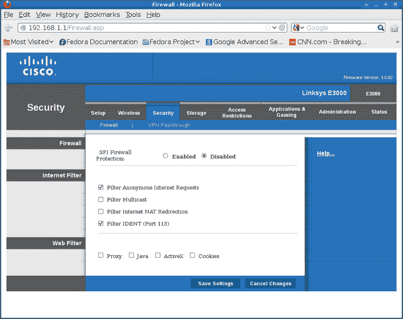

# 五、权限、访问和安全性

在本章中，我们将介绍:

*   创建和管理用户帐户–用户添加
*   使用密码
*   使用文件权限
*   使用防火墙和路由器设置
*   使用安全的 Linux**–**SELinux
*   使用 sudo 保护系统
*   /tmp 目录

# 简介

本章将简要回顾 Linux 文件权限，以及密码系统如何处理对机器的访问。它还将展示如何使用防火墙和路由器中的安全功能，并提到了 SELinux 和 sudo。

# 创建和管理用户帐户–用户添加

在部分我们将向您展示如何使用`useradd`程序添加用户帐户。

## 做好准备

这些命令不应破坏您的系统；但是，您需要成为根用户。

### 注

在大多数 Linux 发行版中，这个命令有两个版本，`useradd`和`adduser`。他们并不总是做同样的事情，所以请查阅您的`man`页面(和/或`file`命令)以确保您正在运行正确的页面。在软呢帽上，`adduser`是`useradd`的象征性链接，所以它们是等价的。

## 怎么做...

这里我们将运行运行`useradd`命令添加用户，运行`passwd`命令设置密码。下一节将对`passwd`进行更多的讨论:

1.  首先，我们将更改`/etc/passwd`，所以让我们对其进行备份。运行以下命令:`cp /etc/passwd /tmp/passwd.orig`
2.  现在让我们创建一个名为`test1` :

    ```sh
    useradd test1

    ```

    的用户
3.  它应该无声无息地返回到命令行。现在我们来试试:

    ```sh
    su  -  test1

    ```

4.  您应该会看到提示更改。跑`whoami,`应该说`test1`。每次使用`su`一定要运行这个。现在让我们更改密码:

    ```sh
    run 
    passwd

    ```

5.  它会说类似**为用户测试 1** 更改密码。但是它会提示输入当前密码。这是什么意思？它想要什么密码？
6.  我真的不知道这个问题的答案，而**人**页也没用。他们总是跳过这一步，这是相当奇怪的。使用加密函数和其他一些复杂的过程可以实现这一点。然而，以下是我的方法:
7.  按 *Ctrl + C* 退出`passwd`命令，运行`exit`返回根账号。现在 `edit /etc/passwd`又走到了底线。`1003`下面可能会在你的系统上有所不同，但你应该会看到一条类似的线:

    ```sh
    test1:x:1003:1003::/home/test1:/bin/bash

    ```

8.  删除`x`，使该行现在看起来像:

    ```sh
    test1::1003:1003::/home/test1:/bin/bash

    ```

9.  保存文件并退出。如果出现权限错误，请记住您必须是此过程的根用户。
10.  现在运行`su`再次成为`test1`用户:

    ```sh
    su – test1

    ```

11.  运行`passwd`。
12.  嘿，酷，这次不是问当前密码。所以现在就去创建一个吧，因为我们真的不想在系统上开账户。如果你打算保留这个账号，我建议你把这个密码写下来，或者更好的方法是把它放在一个安全的加密文件中。
13.  输入两次相同的新密码后，您应该会收到类似于

    ```sh
    passwd: all authentication tokens updated successfully

    ```

    的消息

我们现在有了一个新用户。请注意，一般来说这个用户可以执行他拥有适当权限的命令行上的大多数活动。但是，根据 Linux 发行版，用户可能无法访问所有资源(例如声音系统)。

这是在我的 Fedora 17 系统上拍摄的 user add-help 的截图:


## 还有更多...

`useradd`命令可以做的不仅仅是创建新账户。您可以更改现有帐户的工作方式或到期时间。你甚至可以给一个用户系统权限，这样他就几乎拥有根用户的权力。有关更多信息，请参考手册页或使用`–help`选项。

# 使用密码

我在前面的食谱中提到了 `passwd`命令。它用于更新用户的身份验证令牌。在本例中，您需要成为根用户。我们将使用上一节中创建的`test1`用户。

## 怎么做...

让我们稍微使用一下`passwd`命令:

1.  从用户帐户登录`test1`以确保仍按预期工作:

    ```sh
    su - test1

    ```

2.  出现提示时输入密码。这应该没有错误。
3.  现在让我们锁定这个帐户。退出回根并运行:

    ```sh
    passwd -l test1

    ```

4.  从用户帐户运行`su - test1`并再次输入密码。它应该会失败。
5.  使用命令`passwd -u test1`返回 root 并解锁账户。再次登录以确保其正常工作。
6.  现在让我们让帐户过期。这将迫使用户创建新密码。以 root 用户身份运行以下命令:

    ```sh
    passwd -e test1

    ```

7.  现在作为来宾用户，使用命令`su - test1`登录`test1`。输入您的密码。
8.  您将被告知创建一个新密码。这里要小心，因为你必须再次输入旧的(当前的)密码，然后两次输入新的密码。是的，我们不得不再次输入旧密码，这看起来确实很奇怪，因为我们刚刚输入了旧密码。
9.  请注意，您可以通过运行`passwd -d test1`来删除用户帐户的密码。这比我们在上面部分中直接编辑`/etc/passwd`文件要容易。

## 还有更多...

您可以在用户帐户上设置许多其他内容。其中包括帐户保持活动状态的时间，以及何时开始警告用户更改密码。有关更多信息，请参见手册页。

### 注

**关于密码的一句话**

在过去，我们会选择一个相对简单的密码，并永远保存它。我们不需要一直改，什么都能用，所以没必要写下来。不幸的是，这种情况现在已经改变。密码通常需要由大写字母、数字甚至特殊字符组成。它们的长度也要长得多。您不能总是将它们用于所有事情，因为一个系统上的密码规则可能与另一个系统上的规则不同。出于这些原因，我建议在合理的情况下为每个帐户使用不同的密码，并将其记录在安全的地方。您很可能必须定期更改此密码。

# 使用文件权限

由于 Linux 被设计为多用户操作系统，每个文件都有与之相关的文件权限和所有权。这是为了防止一个用户覆盖另一个用户的文件(有意或无意)。根用户可以(通常)访问系统中的每个文件。

## 做好准备

下面是对基本文件系统权限的快速回顾。对于本例，假设`umask`设置为`0022`。运行`umask` 以确保。

观察我的备份脚本 b 的以下`ls -la`列表:

```sh
-rwxr-xr-x. 1 guest1 root 559 Mar 28 12:43 b

```

从左边开始，第一个位置表示这是什么类型的文件。A `-`，如图，表示这是一个普通文件。一个`d`代表一个目录，一个`l`代表一个链接。接下来的三组三个字母是文件权限，可以在符号或数字模式下引用。我们将使用数字(八进制)模式。

前三组`rwx`，是这个文件的所有者(`guest1`)的设置。接下来的三个，`r-x`，是组(`root`)的设置。第三套是给其他人的。`r`表示文件可读，`w`表示文件可写，`x`表示文件可执行。

`chmod`命令接受一到四个八进制数字。如果缺少一个数字，则认为它是前导零。第一个数字设置用户标识、组标识或粘性位。第二个数字选择该用户的权限，第三个数字选择其他用户的权限。

现在，让我们更改临时文件的一些权限，看看会发生什么。

## 怎么做...

让我们使用一些文件权限:

1.  让我们使用命令

    ```sh
     cd  /tmp

    ```

    切换到`/tmp`目录
2.  如果文件`f1`存在，使用以下命令删除它:

    ```sh
    rmf1

    ```

3.  使用来宾帐户(在我的例子中为`jklewis`)使用命令

    ```sh
    ls>f1

    ```

    创建一个临时文件
4.  现在运行以下命令:

    ```sh
    ls -al f1

    ```

5.  它应该显示如下输出:

    ```sh
    -rw-rw-r--. 1 jklewisjklewis 131 Mar 29 10:35 f1

    ```

6.  这些是基于`umask`命令的默认权限。这表明所有者和组拥有读写权限，而其他人只有读取权限。
7.  那么我们如何改变这些呢？通过使用`chmod`命令。假设这是一个脚本，我们想让它可执行。运行以下命令:

    ```sh
    chmod 775  f1

    ```

8.  现在运行`ls -la f1`；现在它应该看起来像下面的输出:

    ```sh
    -rwxrwxr-x. 1 jklewisjklewis 131 Mar 29 10:35 f1

    ```

9.  那些`x`表示每个用户都可以运行文件。让我们再做一个。运行`chmod 000 f1`然后`ls -la f1`，会显示如下输出:

    ```sh
    ----------. 1 jklewisjklewis 131 Mar 29 10:35 f1

    ```

哇哦！现在没人能处理这个文件了，对吗？不，文件的所有者仍然可以更改权限。说到所有权，`chown`命令用于更改该字段。它通常作为根用户运行。

## 还有更多...

我没有提到`setuid`、`setgid`或`sticky`位。有关这些设置的信息，请参考`chmod`手册页。在*/tmp 目录*部分提到了受限删除位。

# 使用防火墙和路由器设置

防火墙用于防止对机器的未授权网络访问，同时仍允许正常(或合法)流量通过。`iptables`命令用于在内核中设置、配置和查看IP v4 规则的表格。这有点复杂，所以这只是一个简单的概述。

`iptables`使用一个或多个表。每个表都有许多预制链，也可以包含用户创建的链。链是规则列表，规则指定如何处理匹配的数据包。这个“匹配”被称为一个T2【目标】。

当数据包不匹配时，将查看链中的下一个规则。如果匹配，可以为数据包指定以下选项之一:

*   `ACCEPT`:它允许数据包传递
*   `DROP`:拒绝数据包
*   `QUEUE`:它将数据包传递到用户空间
*   `RETURN`:停止该链的运行，继续调用链中的下一个规则

## 怎么做...

这里有几个`iptable`命令。不要在您的系统上运行这些命令；这只是一个例子:

1.  要删除所有现有规则，请使用以下命令:

    ```sh
    iptables -F

    ```

2.  要阻止特定的 IP 地址，请使用以下命令:

    ```sh
    iptables  -A INPUT -s 192.168.1.115  -j DROP

    ```

3.  要允许环回访问，请使用以下命令:

    ```sh
    iptables -A INPUT -i lo -j ACCEPT
    iptables -A OUTPUT -o lo -j ACCEPT

    ```

现在我们来谈谈路由器。大多数路由器内置防火墙，可以通过网络浏览器进行管理。虽然它不能取代`iptables`，但它通常更容易配置，并且可以在整个网络中工作。

典型家庭路由器的网页通常有一个`192.168.1.1`地址。现在就在你的浏览器里试试吧。

这是我的路由器在**安全**页面的截图:



您可能需要输入身份证和密码。如果尚未更改默认值，请查阅路由器文档。进入**安全**(或同等)标签访问这些功能。

## 还有更多...

`iptables`还有很多，足以填满整本书。有关更多信息，请参考手册页或一本关于防火墙的书。关于这个话题的好网站也不少。

# 使用安全的 Linux–SELinux

本部分将作为**安全增强 Linux** ( **SELinux** )的概述。在*使用文件权限*一节中，我们讨论了标准 Linux 如何为系统提供保护。这种方法叫做**自由访问控制** ( **DAC** )，有的一些局限性。例如，一个典型的用户可能会无意中或有意地打开他的文件，让任何其他用户读取或写入。这可能允许未经授权访问敏感信息。为了提供更多的安全性，SELinux 使用 **MAC** ( **强制访问控制**)。MAC 使用覆盖系统中所有进程和文件的安全策略。SELinux 中的所有文件都有包含安全相关信息的标签。

例如，以下是数模转换器下文件的正常列表:

```sh
ls -la ifcfg-eth0
-rw-r--r--. 1 root root 73 Apr 22  2011 ifcfg-eth0

```

同一个文件，但是将 Z(安全上下文)选项设置为`ls`:

```sh
ls -Z ifcfg-eth0
-rw-r--r--. root root unconfined_u:object_r:default_t:s0ifcfg-eth0

```

`unconfined_u`是用户，`object_r`是角色，`default_t`是类型，`s0`是级别。该信息用于做出访问控制决策。请注意，首先检查正常的数模转换器规则，如果它们不允许该操作，则不使用 SELinux 规则。

## 做好准备

我们只是以 root 身份运行一些命令，查看一些设置。我们不会对配置进行任何更改。这个例子假设您已经在强制模式下运行了 SELinux。要确定是否如此，请运行`sestatus`命令。输出应该类似于下面的截图


## 怎么做...

好的，让我们运行一些 SELinux 命令。

1.  运行`getenforce`；它应该报告执行情况。
2.  现在让我们查看映射列表:

    ```sh
    semanage login -l

    ```

3.  要查看进程的 SELinux 上下文，请运行以下命令:

    ```sh
    ps –eZ

    ```

4.  要查看用户的上下文，请运行以下命令:

    ```sh
    id –Z

    ```

5.  `sealert`命令用于在出现错误时查看完整的 SELinux 消息。检查您的`/var/log/messages`文件，查看是否已生成任何警报，如果是，可以在该号码上运行`sealert -l`以获得详细视图。
6.  要获得带有描述的 SELinux 布尔人的详细列表，请运行以下命令:

    ```sh
    semanage boolean –l

    ```

7.  要查看没有描述的列表，运行以下命令:

    ```sh
    getsebool –a

    ```

8.  要检查文件和目录是否具有正确的 SELinux 上下文，请运行以下命令:

    ```sh
    matchpathcon

    ```

## 还有更多...

正如我提到的，在大多数发行版中，SELinux 通常是默认安装的。在某些情况下，你可能甚至没有意识到它就在那里。然而，有时它会妨碍你。如果您尝试安装一个服务，例如`vsftpd`，它可能会失败，因为它将违反 SELinux 策略。它通常会弹出一个相当不错的错误消息。这条信息甚至可以告诉你如何解决这个问题，然而，我在实践中发现它不起作用。您执行它给出的操作，它似乎没有错误地运行，但是访问仍然被拒绝。在这些情况下，我使用`setenforce`命令将 SELinux 置于许可模式，然后继续我的活动:

```sh
setenforce 0

```

请注意，这只在下次重新启动之前有效。

关于 SELinux 的更多信息，在 Fedora 网站上有一个相当优秀的指南。

# 使用 sudo 保护系统

有些时候可能会想给用户更多的计算机访问权限，但实际上不是根权限，尤其是如果你是系统管理员的话。这可以通过修改`/etc/sudoers`文件并让您的用户调用`sudo`命令来完成。

## 做好准备...

以下步骤不应损害您的系统。我们将使用上面创建的用户帐户来执行这些操作。您需要成为该部分的超级用户。

## 怎么做...

这里我们将使用`/etc/sudoers`文件:

1.  制作你的`/etc/sudoers file`T2 的备份:T1】
2.  你不要直接编辑这个文件，使用`visudo`命令。如果相应地导出`EDITOR`变量，任何文本编辑器都可以使用，因此命名不当。如果需要，设置变量，然后运行命令:

    ```sh
    visudo

    ```

3.  该命令制作`sudoers`文件的临时副本并进行编辑。如果一切顺利，当你完成时，它会将临时文件复制到原始文件上。让我们看看这个文件。
4.  阅读别名一节。他们被分成不同的组，例如**网络、软件、服务、定位**等。现在让我们跳进去看看这是如何工作的。
5.  但首先让我们尝试一些东西。以来宾用户身份打开另一个会话。我会用我的`jklewis`账户。
6.  在`jklewis`账户下输入以下命令:

    ```sh
    cd /tmp

    ```

7.  使用命令

    ```sh
    ls>f1

    ```

    创建文件
8.  现在尝试将该文件复制到`/usr/bin` :

    ```sh
    cp f1 /usr/bin

    ```

9.  你应该收到一个错误。这当然是正确的，一个正常的用户是无法正常写入`/usr/bin`目录的。现在回到你的`visudo`会议。
10.  您需要机器的主机名。在这个例子中，我们将使用数字 IP。如果需要，您可以从`ifconfig`命令获得。
11.  在提到关闭命令的行之后，我们将为我们的来宾用户添加一行。语法是用户名、主机名、命令和选项，所以添加行:

    ```sh
    jklewis  192.168.1.115=(ALL)  ALL

    ```

12.  保存文件并关闭`visudo`会话。现在再次尝试这个命令。趁还在`/tmp`目录下运行`cpf1 /usr/bin`。它仍然应该给出错误消息。现在像下面的命令一样尝试一下:

    ```sh
    sudo cp f1 /usr/bin

    ```

13.  啊，是要密码，对吧？是的，它要求的是用户的密码，而不是 root 的密码。这可能很容易混淆(反正对我来说是这样)。记住这一点的最好方法是你可能不应该知道根密码是什么。输入你的。
14.  如果这是该用户第一次使用`sudo`，可能会弹出一个有趣的通知。阅读并理解它，以避免激怒你的系统管理员。
15.  在所有这些之后，这次命令应该会毫无错误地继续执行。很酷吧？由于我们在添加到`sudoers`文件的行中使用了`ALL`，它有效地给予了该用户完全的访问权限。请注意，有些事情仍然不一样，重定向就是其中之一。
16.  好吧，所以我们可能真的不想让这个`jklewis`混蛋搞乱我们的系统，所以让我们稍微调整一下。再次运行`visudo`。
17.  向下滚动或搜索**进程**。通过移除`#`标记取消对`# Cmnd_Alias PROCESSES`线的注释。
18.  向下滚动回我们之前添加的`jklewis`行。改为:

    ```sh
    jklewis  192.168.1.115=(ALL) PROCESSES

    ```

19.  现在我们需要一个杀人的过程。作为根启动一个`vi`会话。类似`vi mybook`的东西会起作用。
20.  在用户会话中运行`psauxw | grep”vi mybook”`并记住进程号( **PID** )。
21.  同样在您的用户会话中，在上面的 PID 上运行`kill -9`。它会给出一个错误。现在再次运行它，但是使用类似下面的命令:

    ```sh
    sudo kill -9 <pid>

    ```

22.  The process with `vi` should be killed.

    ### 类型

    如果屏幕保持蓝色或其他颜色，只需运行 `the ls command.`即可清除。

以下是我的`/etc/sudoers`文件截图:


## 还有更多...

从`sudoers`文件中可以看到可以对其进行大量的微调。用户可以被赋予很少的额外权限，或者一大堆权限。欲了解更多信息，请运行`man sudoers`。

这是我的两分钱。有许多计算机用户可以被信任以 root 身份运行，而不会损害系统。然而，也有例外。如果你设置了`sudo`，你可能会花很多时间试图把它做得恰到好处，却发现你总是不得不添加更多的东西。你的用户会不高兴，因为他们不能做他们的工作，直到你做出改变。然后，当你认为你终于做对了的时候，有人用`sudo`，还是会搞砸，搞砸的很糟糕。我的经验是，如果一个用户犯了一次这样的错误，他会一次又一次地这样做。

# /tmp 目录

`/tmp`目录有些特殊，因为默认情况下，它允许所有用户向其写入文件。以下是我的系统中`/tmp`的列表:

```sh
drwxrwxrwt.  10 root    root      4096 Mar 31 03:48 tmp

```

你可以看到这是对所有人开放的。权限中的`t`表示目录上设置了限制删除位。那么这究竟意味着什么呢？对于目录，它阻止普通用户删除或重命名目录中他们没有适当权限的文件。

作为一个普通用户，写`/tmp`的时候还是要小心，因为有一些限制。

## 怎么做...

让我们尝试一些事情来了解一下是如何工作的:

1.  运行以下命令:

    ```sh
    cd /tmp

    ```

2.  如果有早期部分的临时`.txt`文件，清理干净；一个`rm *.txt`文件应该就可以了。
3.  现在运行以下命令:

    ```sh
    ls>root1.txt

    ```

4.  在另一个会话中，作为来宾用户(我将使用`jklewis`)，运行以下命令:

    ```sh
    cd /tmp

    ```

5.  运行以下命令:

    ```sh
    ls>jklewis.txt

    ```

6.  这应该可以正常工作。现在试试:

    ```sh
     ls>root1.txt

    ```

7.  您应该收到**权限被拒绝**错误。为什么呢？因为即使普通用户都可以写入`/tmp`目录，也必须遵循普通文件系统(DAC)权限。

## 还有更多...

出于上述原因，我建议除了真正的临时文件之外，不要使用`/tmp`目录。此外，大多数发行版通常会清除`/tmp`，因此任何不属于 root 的东西都会被删除。在生成临时文件时，尤其是在编写脚本时，请记住所有这些(更多信息请参见[第 8 章](08.html "Chapter 8. Working with Scripts")、*使用脚本*)。