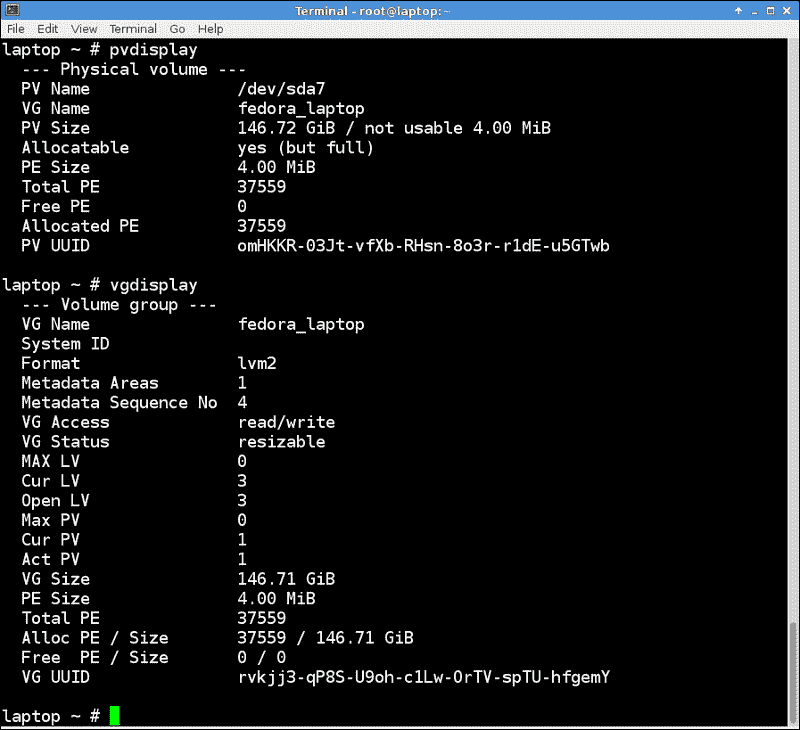

# 第七章。磁盘和分区

在本章中，我们将涵盖以下主题:

*   使用`fdisk`
*   使用`mkfs`格式化驱动器
*   使用`fsck`检查文件系统
*   逻辑卷管理(LVM)

# 简介

安装机器时，您可以采用默认设置，或者以任何您想要的方式设置磁盘。这里简单回顾一下分区和文件系统。典型的 Linux 系统通常至少有三个独立的分区。它们被标记为`/`、`/boot`和`swap`。`/`(发音为*根*)是目录结构的父级。`/boot` 是系统内核和地图文件驻留的地方。`swap`分区用于部分内存因过度使用而需要移动到硬盘时。这叫做*换出*到磁盘。

以下内容通常位于不同的分区上:

*   `/`:是父目录
*   `/boot`:引导文件和映射文件都在这里
*   `(swap)`:表示交换空间

以下内容传统上位于单独的分区上，但并非必须如此:

*   `/home`
*   `/tmp`
*   `/etc`
*   `/var`

这里是部分列表文件系统和目录以及它们的一般用途，通常出现在 Linux 系统上。这是取自 Fedora 17 64 位:

*   `/`:是父目录。
*   `/boot`:里面有引导，映射文件，系统内核。
*   `(swap)`:它代表交换空间。
*   `/root`:是超级用户的主目录。
*   `/home`:这里是用户目录(例如`/home/guest1`，本书通篇都在使用)。
*   `/tmp`:是设置了文件删除位的目录。用户和各种其他程序可以将临时文件放在这里。由 root 运行的一个`cron`作业定期清理`/tmp`(通常一周一次)。
*   `/usr`:它由操作系统(OS)的父用户目录组成。
*   `/usr/bin`:有 OS 的可执行程序。
*   `/usr/etc`:它包含操作系统的配置文件。
*   `/usr/games`:它由发行提供的游戏组成。
*   `/usr/include`:它包含 c 等编程语言的文件。
*   `/usr/lib`:它包含操作系统的库文件。
*   `/usr/lib64`:它由 64 位版本的操作系统库文件组成。
*   `/usr/local`:系统管理员可以将用户程序放在这里使用。
*   `/usr/sbin`:它有系统使用的 OS 的可执行程序。
*   `/usr/share`:它包含了 OS 的共享程序和文件。
*   `/usr/src`:OS 的内核源码，包含，制作文件都放在这里
*   `/dev`:表示设备目录。例如`/dev/sda`设备指向第一个 SCSI 硬盘。
*   `/lib`:是到`/usr/lib`的象征性链接。
*   `/lib64`:是到`/usr/lib64`的符号链接。
*   `/mnt`:用作挂载点。
*   `/opt`:表示可选文件。
*   `/var/logs`:它由操作系统的日志组成。
*   `/var/spool`:它包含打印机文件。
*   `/var/run`:操作系统在这里保存运行程序的数据。
*   `/run`:是到`/var/run`的符号链接。
*   `lost+found`:这是操作系统跟踪文件系统数据的地方。
*   `/etc`:发音为*等*，代表*其他一切*。配置文件往往位于此处。

虚拟文件系统的不同类型如下:

*   `/proc`:操作系统在这里记录进程。有关更多信息，请参见上一章。
*   `/sys`:操作系统跟踪这个目录中的其他进程。

其他一些有用的术语已在以下列表中定义:

*   **装置**:它指的是整个盘面。例如，第一个 SCSI 磁盘通常被命名为`/dev/sda`。
*   **分区**:是设备名称后面跟着一个数字。第一个 SCSI 分区将是`/dev/sda1`。
*   **文件系统**:它定义了正在使用的文件系统的类型。例如`ext2`、`ext3`、`ext4`、`vfat`和`xfs`。
*   **挂载点**:指向分区的是目录。`/etc/fstab`文件包含一个显示挂载点及其相关分区的表格。该文件由系统安装程序(如 Anaconda)创建，超级用户可以手动编辑该文件以添加或删除设备和装载。

引导分区是操作系统内核和其他启动文件的位置。以下是在`/boot`中找到的文件的描述:

*   `vmlinuz`:它代表了一个到内核的符号链接。比如指向 Fedora 14 上的`vmlinuz-2.6.35.6-45.fc14.x86_64`。
*   `initramfs`:它代表初始 RAM 盘。在 Fedora 14 上，它被命名为`initramfs-2.6.35.6-45.fc14.x86_64.img`。
*   `config`:此文件用于配置内核。我们将在[第 10 章](10.html "Chapter 10. The Kernel")*内核*中看到更多。在 Fedora 14 上，它被命名为`config-2.6.35.6-45.fc14.x86_64`。
*   `map`:这是系统映射文件，包含各种内核例程的入口点。在 Fedora 14 上，它被命名为`System.map-2.6.35.6-45.fc14.x86_64`。

初始内存盘需要更多的解释。该文件包含加载和运行内核所需的所有设备驱动程序。例如，内核需要访问硬盘才能启动。如果它需要一个特殊的驱动程序(也就是说，如果它不能被 BIOS 单独访问)，它必须位于`initramfs`文件中，否则它将无法完成这个过程。`initramfs`文件是在系统安装时创建的，有经验的人可以修改。这通常在测试和/或使用新硬件时进行。这是一个压缩的`GZIP`文件，未压缩，在启动过程中放在 ram(内存中)磁盘上。

以下是我的 Fedora 17 系统上的`/boot`和文件命令的快照:


`df`程序用于报告文件系统磁盘空间使用统计。下面的输出是我的 Fedora 14 系统中的一个`df -h`列表。`-h`参数将输出转换成更易于阅读的形式(在大型磁盘上很有用):

```sh
Big4 ~ # df -h
Filesystem            Size  Used Avail Use% Mounted on
/dev/sda3              97G   48G   45G  52% /
tmpfs                 5.9G  780K  5.9G   1% /dev/shm
/dev/sda1             485M   51M  409M  12% /boot
/dev/sda2             385G  124G  242G  34% /data
/dev/sda5              49G  8.3G   38G  19% /lewis
/dev/sdf1             932G  243G  690G  27% /megadrive
/dev/sdg1             7.3G  3.1G  4.3G  42% /usb

```

第一列显示了文件系统的分区。第二个显示分区的大小。第三个是使用的数量，然后是仍然可用的数量。`Use%`是使用的百分比，最后一列是挂载点。

这个输出告诉你很多关于我如何设置这个系统。我没有为`/home`、`/tmp`、`/etc`或`/var`做单独的分区。他们都在同一个分区`/`下。我有所需的`/boot`分区，由于我经常构建新的内核，我把它做得比默认的更大。有一个单独的`/data`和`/lewis`分区。所有提到的分区都在`/dev/sda`设备上。那么`/dev/sdf1`和`/dev/sdg1`是什么设备和分区呢？第一个是 Iomega 外置 u 盘，第二个是 8 GB **通用串行总线** ( **USB** ) 棒。这些用于备份，以防主驱动器坏了。

`fsck`程序用于检查并选择性地修复损坏的文件系统。它可以并行检查多个文件系统以加快处理速度。如果没有给出参数，`fsck`默认检查`/etc/fstab`文件中的文件系统。

使用分区时，必须记住目录安装在哪里。例如，假设`/`上的空间越来越紧，因此您决定删除位于`/tmp`目录中的一些大文件。您需要首先确保`/tmp`确实安装在`/`上，而不是安装在自己的分区上。犯这个错误很容易，所以要记住。如果您是许多机器的系统管理员，而这些机器的设置方式并不完全相同，那么这就更成问题了。

# 使用 fdisk

`fdisk`程序用于操作磁盘分区表。您可以使用此实用程序创建、修改和删除分区。

## 做好准备

只要不使用将表写入磁盘操作，就可以使用这些命令。然而，为了安全起见，您可能想使用 u 盘或其他您不关心的驱动器或系统。

交互版`fdisk`的语法是`fdisk <device-name>`。在这个例子中，我将使用 4GB 的 u 盘`/dev/sdb`。请记住`fdisk`适用于整个设备，因此在启动命令时不要使用分区号。我们将以 root 用户身份执行这些操作。

以下是 Fedora 18 上显示`fdisk`的截图:


## 怎么做...

执行以下步骤运行`fdisk`:

1.  在设备上运行`fdisk`启动命令:

    ```sh
    fdisk /dev/sdb

    ```

2.  显示帮助菜单:`enter an m`。它会调出可在此设备上执行的操作列表。
3.  显示分区表:`enter a p`。将显示该设备上的分区列表。
4.  就我的 u 盘来说，只有一个分区。所以我们删除它:

    ```sh
    enter a d

    ```

5.  因为只有一个分区，所以默认情况下被删除。现在让我们添加一个:

    ```sh
    enter an n
    ```

6.  因为这是第一个分区，所以`press a p`代表主分区。
7.  现在运行`enter a 1`并取默认起始扇区。
8.  我们现在必须输入一个尺寸。这可以通过扇区号或大小来实现。让我们使用大小，使其为 1 GB:

    ```sh
    enter +1G

    ```

9.  再次运行`enter a p`看看我们有什么。您应该会看到如下输出:

    ```sh
     Command (m for help): p
     Disk /dev/sdb: 4009 MB, 4009754624 bytes, 7831552 sectors
     Units = sectors of 1 * 512 = 512 bytes
     Sector size (logical/physical): 512 bytes / 512 bytes
     I/O size (minimum/optimal): 512 bytes / 512 bytes
     Disk identifier: 0xc3072e18
     Device Boot      Start         End      Blocks   Id  System
     /dev/sdb1            2048     2099199     1048576   83  Linux
     Command (m for help):

    ```

10.  这个看起来不错。现在我们再添加一个，然后取默认值:

    ```sh
    enter n, then p, then 2, and the default first sector

    ```

11.  尺寸方面，这次用 2gb:

    ```sh
    enter +2G

    ```

12.  看它是什么样子:

    ```sh
    enter a p

    ```

13.  该表现在应该显示两个分区。此时，您可以继续创建更多分区，或者保存该表。如果您有所需的磁盘空间，以后可以创建更多的分区。
14.  对于本例，我们将退出而不保存更改:

    ```sh
    enter a q

    ```

15.  为了确保没有出错，运行`fdisk /dev/sdb -l`获取列表。应该和我们开始的时候一样。

## 还有更多...

您可能已经注意到`fdisk`帮助屏幕上的一些其他操作。您可以更改单元的显示方式，列出已知的分区类型，以及其他一些事情。更多信息，请参考`fdisk man`页面。

# 使用 mkfs 格式化驱动器

`mkfs`命令在设备上构建文件系统(类似于格式化驱动器)。它确定文件系统类型并调用适当的`mkfs.<type>`程序。例如，如果你运行`mkfs -t ext4 /dev/sdb5`，它实际上会运行`mkfs.ext4`程序。`mkfs`选项如下:

*   `-t`:指定所需的文件系统类型
*   `-V`:产生详细输出
*   `-V`:如果作为唯一参数，则显示版本信息
*   `-h`:显示帮助画面

请注意，没有其他参数被传递给文件系统的特定程序。还要注意，在某些情况下，需要提供大小值。

## 做好准备

`mkfs`程序将销毁当前驻留在分区中的任何数据。因此，在继续执行此命令之前，请确保您已经执行了所需的备份。一旦采取了这一行动，就无法逆转。如果你想遵循这些步骤，你应该首先在 u 盘或其他你不关心的设备上练习。

在继续之前，请务必卸载该分区。

## 怎么做...

执行以下步骤在 Linux 中格式化分区:

1.  对于这个例子，我插入了一个 u 盘(一个我不在乎的)。为了确保我们有正确的设备，运行`dmesg`并查看最后一行:

    ```sh
    dmesg | tail -20

    ```

2.  在我的系统上，显示设备为`/dev/sdh1`(相应替换你的设备)。它没有安装它，所以我准备继续。但是，如果您的是自动装载的，您应该能够通过运行以下命令卸载它:

    ```sh
    umount /dev/sdh1

    ```

3.  请注意，以下命令将销毁此设备上的任何数据。因此，在继续之前，请确保您已经备份了任何想要保留的内容！
4.  运行命令`mkfs -V -t vfat /dev/sdh1`。以下输出显示在我的系统上:

    ```sh
    Big2 /temp # mkfs -V -t vfat /dev/sdh1
    mkfs (util-linux 2.21.2)
    mkfs.vfat /dev/sdh1
    mkfs.vfat 3.0.12 (29 Oct 2011)

    ```

5.  现在安装设备:`mount /dev/sdh1 /usb2`(替换您认为合适的设备和安装点)。
6.  运行`ls -la /usb2`。它应该看起来像下面的输出:

    ```sh
    Big2 /temp # ls -la /usb2
    total 8
    drwxr-xr-x.  2 root root 4096 Dec 31  1969 .
    dr-xr-xr-x. 25 root root 4096 Jun  7 10:04 ..

    ```

这对`mkfs`来说已经够了。使用此命令时一定要非常小心，并在继续之前先仔细检查所有内容。

# 使用 fsck 检查文件系统

为了检查和修复一个 Linux 文件系统，使用了`fsck`程序。实际上，`fsck`只是文件系统特定检查器的前端(类似于`mkfs`)。

`fsck`程序可以在不同的文件系统上并行运行，以加快处理速度。请注意，此功能可以在资源不足的计算机上禁用。

一般来说，`fsck`的语法如下:

```sh
 fsck [-lsAVRTMNP] [-C [fd]] [-t fstype] [filesys...]  [--] [fs-specific-options]

```

## 做好准备

如果`fsck`程序使用不正确，可能会损坏当前驻留在分区上的数据。因此，在继续执行此命令之前，请确保您已经进行了所有所需的备份。一旦采取了这一行动，就无法逆转。如果你想遵循这些步骤，你可能首先想在一个你不关心的 u 盘上练习。

运行命令之前，必须卸载设备。

## 怎么做...

执行以下步骤来检查和运行分区:

1.  对于这个例子，我已经插入了一个 u 盘(一个我并不真正关心的)。为了确保我们有正确的设备，运行`dmesg`并查看最后一行:

    ```sh
    dmesg | tail -20

    ```

2.  在我的系统上，显示设备为`/dev/sdh1`(相应替换你的设备)。它没有安装它，所以我准备继续。但是，如果您的是自动挂载的，您应该可以通过运行`umount /dev/sdh1`来卸载它。
3.  我们现在可以运行`fsck`程序。我首先想看看它会采取什么行动，所以，会使用`-N`选项。奔跑`fsck -N /dev/sdh1`。以下输出显示在我的系统上:

    ```sh
    Big2 /home/guest1 # fsck -N /dev/sdh1
    fsck from util-linux 2.21.2
    [/sbin/fsck.vfat (1) -- /dev/sdh1] fsck.vfat /dev/sdh1

    ```

4.  这看起来不错，所以让我们包含一个进度条，并真实运行它:`fsck -C /dev/sdh1`。在我的系统上获得以下结果:

    ```sh
    Big2 /home/guest1 # fsck -C /dev/sdh1
    fsck from util-linux 2.21.2
    dosfsck 3.0.12, 29 Oct 2011, FAT32, LFN
    /dev/sdh1: 1743 files, 234381/977025 clusters

    ```

由于这个 u 盘没有问题，输出不是很令人兴奋。我在过去看到过一些非常严重的错误，如果这种情况发生在你身上，我建议尽快从驱动器上获取数据，然后要么用`mkfs`重新格式化驱动器，要么为了安全起见获取一个新的。

## 还有更多...

以下是`fdisk`的选项及其功能的简要列表:

*   `-l`:检查前会锁定设备，一次只能在一台设备上使用。
*   `-s`:将文件检查操作序列化。在交互模式下，当一次检查多个文件系统时，它非常有用。
*   `-A`:它使用`/etc/fstab`文件中的条目在一次运行中检查所有文件系统。通常，首先检查根文件系统，然后根据`passno`值检查其他文件系统。有关可用选项的更多信息，请参见`fstab`的`man`页面。
*   `-C`:会显示进度条。
*   `-M`:指定不检查挂载的文件系统。
*   `-N`:它会显示在这个设备上会执行什么操作，但实际上并没有执行这些操作
*   `-P`:它将与其他系统并行检查根文件系统。永远不要使用这个选项。
*   `-R`:它将跳过根文件系统，同时检查其他文件系统。
*   `-V`:会启用详细输出，所以推荐使用。

以下是文件系统特定程序通常支持的选项列表:

*   `-a`:会自动修复文件系统，没有任何问题。这个选项要非常小心，因为我不止一次看到它出了可怕的问题。
*   `-n`:这个选项应该是告诉具体的检查人员不要进行任何维修。它不可靠，所以不推荐。
*   `-r`:它将交互修复文件系统。如果并行运行`fsck`，请勿使用该选项。
*   `-y`:告诉一些特定的跳棋自动进行修复。

理论上，日志文件系统，如`ext3`或`ext4`，不需要大量检查或修复。如果您的系统不是这种情况，我会怀疑硬件或硬件 CMOS 水平。确保系统中的所有内容都被刷新到正确的版本。

### 注

为了修复文件系统，必须不装载它。此外，检查挂载的文件系统有时可能会给出虚假的错误消息。

# 逻辑卷管理(LVM)

Linux 的 LVM 允许将磁盘或磁盘阵列作为一个大的存储池来管理。LVM 由一个或多个物理卷以及一个或多个逻辑卷组成。

例如`/root`和`/home`等目录位于一个逻辑卷中。管理 LVM 有几个命令。有些在物理卷上运行，有些在逻辑卷上运行，有些在两者上运行。

以下列表可用作 LVM 命令的快速参考指南:

*   `pvcreate`:初始化一个磁盘或分区
*   `pvchange`:改变一个或多个物理卷的分配权限
*   `pvck`:检查物理卷元数据
*   `pvdisplay`:显示物理体积的属性
*   `pvmove`:移动物理范围
*   `pvremove`:移除一个物理体积
*   `pvresize`:它会调整磁盘或分区的大小
*   `pvs`:报告物理卷的信息
*   `pvscan`:它扫描所有磁盘的物理卷
*   `vgcfgbackup`:备份卷组描述符区
*   `vgcfgrestore`:恢复卷组描述符区域
*   `vgchange`:它改变一个体积组的属性
*   `vgck`:检查卷组元数据
*   `vgconvert`:转换卷组元数据格式
*   `vgcreate`:它创建一个卷组
*   `vgdisplay`:显示体积组的属性
*   `vgexport`:它使系统不知道卷组
*   `vgextend`:它将物理卷添加到一个卷组中
*   `vgimport`:使系统知道导出的卷组
*   `vgimportclone`:它导入并重命名复制的卷组
*   `vgmerge`:合并了两个卷组
*   `vgmknodes`:它重新创建一个卷组目录和逻辑卷特殊文件
*   `vgreduce`:它从卷组中删除未使用的物理卷
*   `vgremove`:删除一个卷组
*   `vgrename`:将重命名为卷组
*   `vgs`:报告卷组的信息
*   `vgscan`:扫描所有磁盘的卷组，重建缓存
*   `vgsplit`:它将一个卷组拆分为两个
*   `lvchange`:它改变了逻辑卷的属性
*   `lvconvert`:它将逻辑卷从线性转换为镜像或快照
*   `lvcreate`:它在现有卷组中创建一个逻辑卷
*   `lvdisplay`:显示逻辑卷的属性
*   `lvextend`:它扩展了逻辑卷的大小
*   `lvmdiskscan`:它扫描所有可见的设备到 lvm2
*   `lvmdump`:它为诊断目的创建 lvm2 信息转储
*   `lvreduce`:它减少了逻辑卷的大小
*   `lvremove`:删除了一个逻辑卷
*   `lvrename`:它重命名一个逻辑卷
*   `lvresize`:它调整一个逻辑卷的大小
*   `lvs`:报告逻辑卷的信息
*   `lvscan`:它扫描所有磁盘的逻辑卷

## 做好准备

以下命令假设您正在运行一个 LVM 感知系统。请注意，您不需要实际将驱动器设置为 LVM 格式就可以尝试这些命令。

## 怎么做...

以下是您可以在系统上尝试的一些非破坏性命令(您需要以 root 用户身份运行这些命令):

1.  让我们看看系统上所有的物理卷:

    ```sh
    pvdisplay

    ```

2.  现在让我们扫描磁盘:

    ```sh
    pvscan

    ```

3.  然后，显示卷组的属性:

    ```sh
    vgdisplay

    ```

4.  我们报告有关卷组的信息:

    ```sh
    vgs

    ```

5.  然后扫描所有卷组的磁盘:

    ```sh
    vgscan

    ```

6.  然后需要显示逻辑卷的属性(这个经常被使用):

    ```sh
    lvdisplay

    ```

7.  扫描 LVM 可以看到的所有设备:

    ```sh
    lvmdiskscan

    ```

8.  报告关于逻辑卷的信息:

    ```sh
    lvs

    ```

9.  扫描所有磁盘的逻辑卷:

    ```sh
    lvscan

    ```

以下是我的 Fedora 14 系统上`pvdisplay`和`vgdisplay`的截图:



## 还有更多...

如果你习惯了配置磁盘驱动器的传统方法，LVM 可能需要一段时间才能习惯。我发现手册页在这方面相当不错，互联网上也有一些不错的文章。

### 了解不同的文件系统

在撰写本文时，有 60 多个不同的文件系统可用于 Linux。以下是您可能经常遇到的常见问题的简要概述:

*   `Btrfs` : B 树文件系统是甲骨文在 2007 年开发的写时复制文件系统。它仍处于发展阶段，被认为是实验性的。`Btrfs`的目的是允许文件系统随着驱动器越来越大而扩展。由于它的优点，它被认为是取代`ext4`的文件系统。
*   `ext2`:1993 年引进。该文件系统没有日志功能，因此每个周期的写入次数更少，是闪存驱动器的一个不错的选择。
*   `ext3`:非常类似`ext2`，增加了日志功能，提高了可靠性，尤其是在不干净的关机之后。
*   `ext4`:2008 年发布，被认为是`ext3`的继承者。它可以处理多达 1 个字节的卷和多达 16 个字节的文件。该文件系统使用范围来取代早期版本 ext 使用的传统块映射方案。它具有允许更快的文件系统检查的增强功能(`fsck`)。
*   `FAT`:这是文件分配表的缩写，格式最初是 DOS、OS/2、Windows 使用的。它在内核中可用，主要是为 u 盘等外部设备提供支持。
*   `ReiserFS`(或`Reiser3`):这是一个带有日志的通用文件系统，最初由汉斯·赖泽设计和编写。创建时，它包含了许多当时还不可用的功能，包括日志记录、在线增长和限制内部碎片的方案。
*   `Reiser4`:是`ReiserFS`的继承人(由于设计师汉斯·赖泽被判谋杀罪，未来发展未卜)。