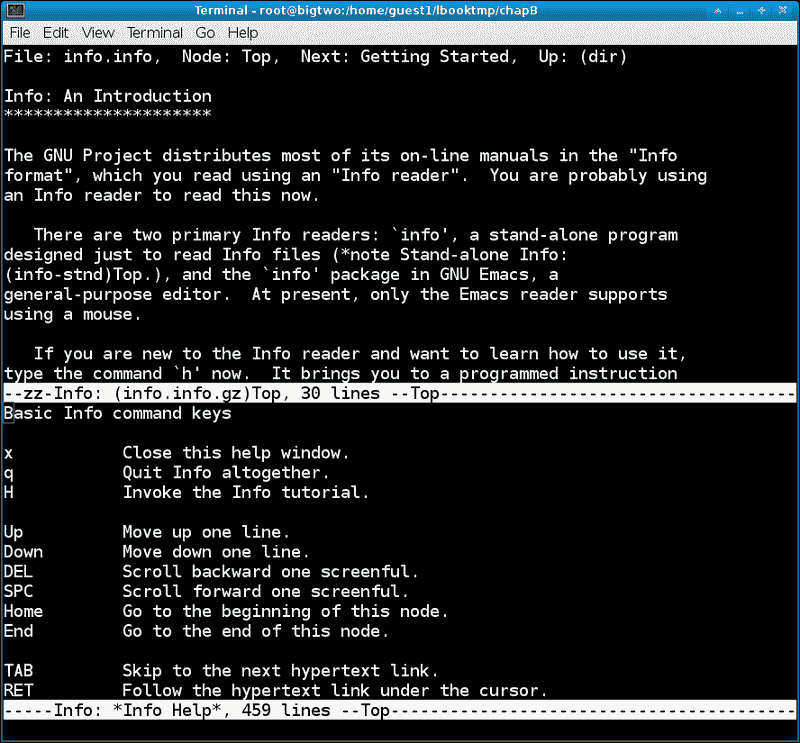
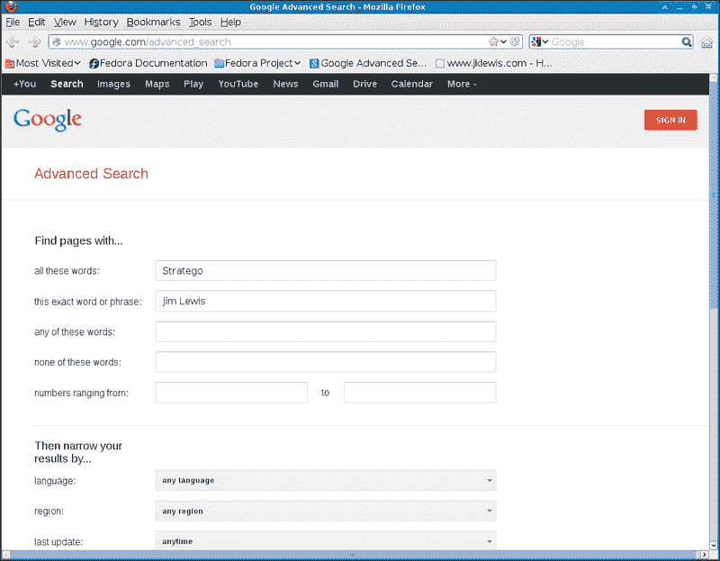
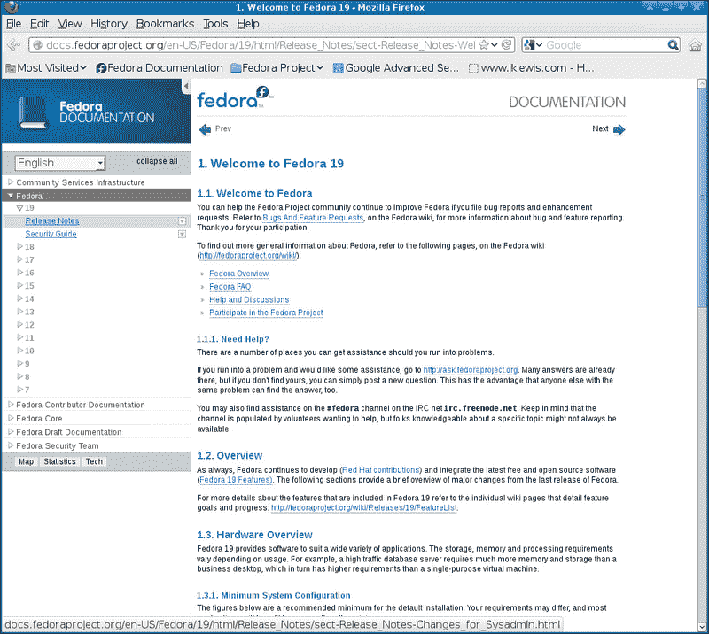
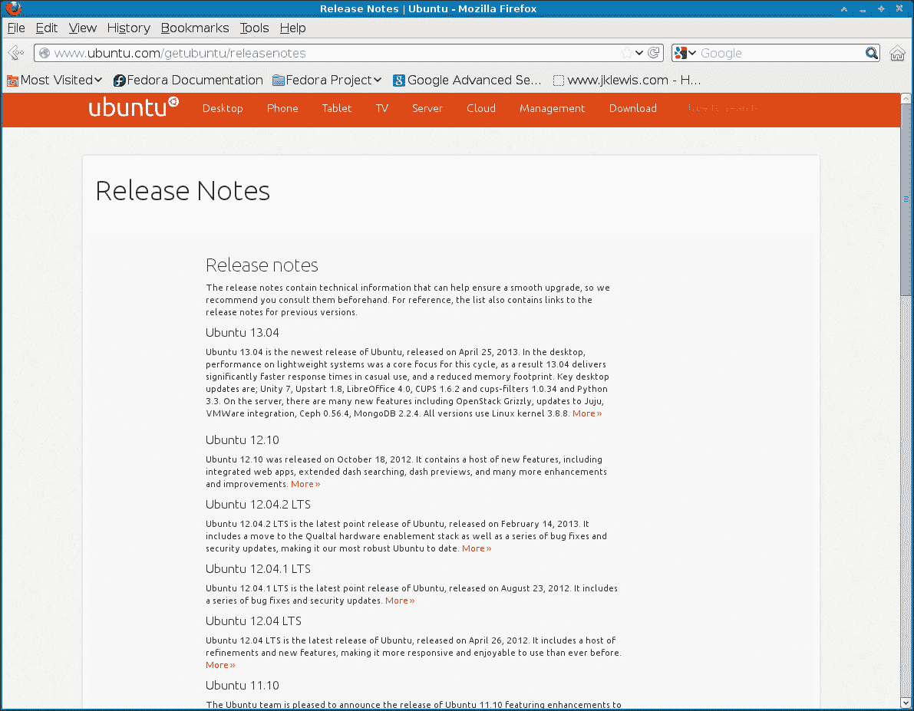
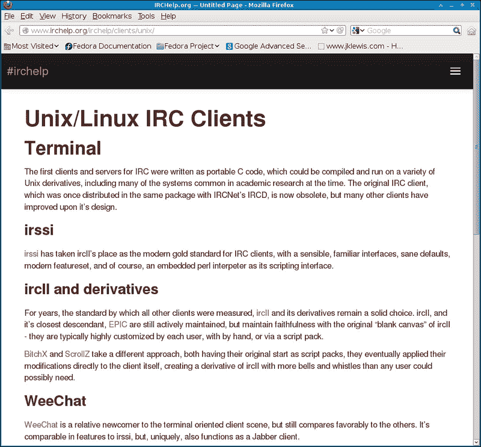

# 附录 b .寻找帮助

在本附录中，我们将涵盖以下主题:

*   使用`man`页
*   使用`info`命令
*   命令和`Usage`部分
*   本地文档目录
*   浏览网页寻找帮助
*   发行发行说明
*   Linux 用户组
*   互联网中继聊天

# 简介

在 Linux 上有很多不同的地方可以找到帮助。也有相当多的信息；事实上，在某些情况下，它太多了。很难从好的东西中过滤出噪音。在这里，我们试图向您展示如何快速有效地获得您需要的东西。

# 使用手册页

`man`实用程序是本地参考手册的接口。它用于快速查找程序、实用程序、函数和其他主题的信息。`man`实用程序将接受几个选项；然而，通常的调用只是`man page`，页面实际上指的是一个主题。甚至可以自己运行`man`学习使用。

以下是命令`man man`的截图:


在页面上运行`man` 显示感兴趣的主题。空格键用来翻页， *Q* 用来退出。页面(主题)以或多或少的标准顺序呈现，这些可能的部分名称为:`NAME`、`SYNOPSIS`、`CONFIGURATION`、`DESCRIPTION`、`EXAMPLES`、`OVERVIEW`、`DEFAULTS`、`OPTIONS`、`EXIT STATUS`、`RETURN VALUE`、`ENVIRONMENT`、`FILES`、`VERSIONS`、`CONFORMING TO`、`NOTES`、`BUGS`、`AUTHORS`、`HISTORY`和`SEE ALSO`。

`man`显示找到的第一页，即使其他部分有更多的页面。例如，假设你正在寻找如何在你的 C 程序中编码`readlink`函数的信息。您可以尝试以下命令:

```sh
man readlink

```

它会调出一个页面，但是是命令`readlink`的页面，而不是 C 函数的页面。为什么呢？因为它显示的是第一页，除非你在页前指定了版号。你怎么知道那是什么？您可以通过以下方式使用`-a`选项运行`man`:

```sh
man -a readlink

```

这将像以前一样调出命令`readlink`。现在按 *Q* 退出。页面消失了，但是`man`会话并没有终止，而是显示了如下内容:

```sh
Big4 /lewis/Fedora/17 # man -a readlink
--Man-- next: readlink(2) [ view (return) | skip (Ctrl-D) | quit (Ctrl-C) ]

```

这是给一个选择:按*回车*显示下一页(话题) *Ctrl* + *D* 跳到下一个话题， *Ctrl* + *C* 结束`man`会话。当你在最后一个话题时按下 *Q* 会导致`man`像以前一样正常终止。

那么，如果您已经知道您想要第 3 节中的页面并直接加载它，该怎么办呢？您可以通过以下方式指定它:

```sh
man 3 readlink

```

这将跳过前两个，直接进入 POSIX 程序员手册的`readlink`页面。

以下是部分编号及其名称的列表:

*   1:可执行程序或外壳命令
*   2:系统调用(内核提供的函数)
*   3:库调用(程序库中的函数)
*   4:特殊文件(通常在`/dev`中找到)
*   5:文件格式和约定(例如`/etc/passwd`)
*   6:游戏
*   7:杂项(包括宏包和约定)，例如 man(7)和 groff(7)
*   8:系统管理命令
*   9:内核例程

当地的参考手册可能是一个很好的信息来源。它们包含了 Linux 系统中几乎所有东西的大量数据。不幸的是，它们确实有一些缺点。大多数都写得很好，很有意义。有些很可怕。当这种情况发生时，还有其他地方可以寻求帮助。

# 使用信息命令

除了手册页，大多数 Linux 系统也有`Info`文档。这些都可以通过`info`程序访问。总的来说，`Info`文档提供的数据往往比典型的`man`页面更详细，信息量更大。

像`man`一样，你可以自己运行信息:

```sh
info info

```

这里介绍一下如何使用`info`。最后一段说**如果是新信息，现在输入“h”。这将带您进入编程指令序列**。如果你有兴趣学习如何最大限度地使用`info`，我建议在这里按 *H* 运行教程。

下面是运行`info info`然后按 *H* 的截图:



# 命令和用法部分

Linux 中的大部分命令都有`Usage`部分，用`--help`选项运行即可显示。这方面的典型例子有`cat``cut``ifconfig``bash``rm`，还有很多等。

以下为`rm --help`截图:


请注意，一般来说， `Usage`部分并不是真的要教某人很多关于命令的知识。它实际上是用来提醒用户参数是什么，以及命令的一般格式。

请注意，有些命令，尤其是那些需要参数才能完成的命令，只需在没有给定参数的情况下调用，就会显示它们的使用信息。

以下是无参数运行`awk`命令的截图:


# 本地文档目录

大多数完整的 Linux 发行版都有包含各种主题文档的目录。根据使用的发行版本，布局可能略有不同，但在大多数情况下，文件位于`/usr/share/doc`目录。以下是取自 Fedora 14 的`/usr/share/doc`目录的部分列表:

*   `/usr/share/doc/BackupPC-3.1.0`
*   `/usr/share/doc/ConsoleKit-0.4.2`
*   `/usr/share/doc/Django-1.2.3`
*   `/usr/share/doc/GConf2-2.31.91`
*   `/usr/share/doc/GeoIP-1.4.7`
*   `/usr/share/doc/GitPython-0.2.0`
*   `/usr/share/doc/HTML`
*   `/usr/share/doc/ImageMagick-6.6.4.1`
*   `/usr/share/doc/ModemManager-0.4`
*   `/usr/share/doc/MySQL-python-1.2.3`
*   `/usr/share/doc/NetworkManager-0.8.1`
*   `/usr/share/doc/abrt-1.1.13`
*   `/usr/share/doc/ant-1.7.1`
*   `/usr/share/doc/apcupsd-3.14.8`
*   `/usr/share/doc/doxygen-1.7.1`
*   `/usr/share/doc/ethtool-2.6.38`
*   `/usr/share/doc/fedora-release-14`
*   `/usr/share/doc/gcc-4.5.1`
*   `/usr/share/doc/gcc-c++-4.5.1`
*   `/usr/share/doc/gimp-2.6.11`
*   `/usr/share/doc/git-1.7.3.1`
*   `/usr/share/doc/gnome-desktop-2.32.0`
*   `/usr/share/doc/gnuchess-5.07`
*   `/usr/share/doc/httpd-2.2.16`
*   `/usr/share/doc/httpd-tools-2.2.16`
*   `/usr/share/doc/java-1.6.0-openjdk-1.6.0.0`
*   `/usr/share/doc/java-1.6.0-openjdk-devel-1.6.0.0`
*   `/usr/share/doc/kaffeine-1.1`
*   `/usr/share/doc/mailx-12.4`
*   `/usr/share/doc/make-3.82`
*   `/usr/share/doc/man-db-2.5.7`
*   `/usr/share/doc/man-pages-3.25`

还有一个文档查看器/浏览器，通常通过文件夹对话框访问。比如打开文件管理器，转到`/usr/share/doc`下的某个目录，会看到很多文件。点击`README`文件将在您的系统中显示关于该特定程序的更多信息。可能还有其他可读文件，如`CONTENT`、`AUTHOR`、`MAINTAINERS`、`INSTALLATION`等。

# 浏览网页寻找帮助

使用互联网当然是在 Linux 任务上寻找帮助的好方法。在许多情况下，它甚至可能比依赖本地来源更好，因为自从文档最后一次放在您的系统上以来，可能已经发生了更新。当我需要使用网络查找东西时，我会直接进入谷歌高级搜索。

以下是[http://www.google.com/advanced_search](http://www.google.com/advanced_search)的截图，部分字段已经填写完毕:



使用这种搜索方法速度很快，你可以使用那些字段来缩小你正在寻找的范围。

请记住，互联网上有很多信息。其中一些是准确的，也正是你要找的。然而，在许多情况下，信息是不正确的。给出答案的人可能表现得好像他或她是这方面的专家，而事实上，他或她不是。许多人也不总是在把他们的解决方案作为你的问题的明确答案之前检查它。当你尝试互联网上给出的解决方案时，请注意这一点。

这种情况的反面也是如此。如果你想帮助别人，那绝对是伟大的。然而，请考虑周全，在发送任何您希望提供的解决方案作为对他们问题的回复之前，测试其准确性。

# 发行发行说明

了解 Linux 发行版更多信息的一个好方法是查看发行说明。这些通常包含如下信息:

*   他们记录了自上次发布以来所做的更改。这通常被分成针对特定用户的部分，例如系统管理员、桌面用户、开发人员和其他人。请注意，在某些发行版中，更多信息可在`Technical Notes`文档中获得。
*   它们详细说明了有效运行`distro`所需的最低硬件要求/架构。特别关注内存、图形和视频问题。
*   他们给出安装说明，强调引导，以及特殊或不寻常的设置。
*   它们提供了可以安装的可能桌面环境的列表，通常还附带了安装步骤。这是一个非常重要的部分，因为使用设计不佳和/或有问题的桌面会阻碍你的工作效率。
*   他们对新发布的特性、功能和程序进行了解释。这之后有时是加法背后的推理，以及它所取代的程序。
*   它们由折旧(删除)程序和功能的列表组成。
*   他们有关于从哪里获得额外帮助的指示，如网站和聊天室。
*   它们包含了`distro`中仍然存在的已知错误和问题的列表，以及关于可能的解决方法的信息。在提交 bug 报告之前，一定要查阅这个列表。
*   它们给出了如何在发行版和发行说明中提供反馈的说明，以及您希望看到的任何新增/更改的功能。

以下是来自[http://docs . fedoraproject . org/en-US/Fedora/19/html/Release _ Notes/index . html](http://docs.fedoraproject.org/en-US/Fedora/19/html/Release_Notes/index.html)的 Fedora 19 发行说明截图:



以下是来自[https://wiki.ubuntu.com/RaringRingtail/ReleaseNotes](https://wiki.ubuntu.com/RaringRingtail/ReleaseNotes)的 Ubuntu 13.04】发行说明的链接:



以下截图为德比安 7.0(喘息)取自[http://www.debian.org/releases/stable/amd64/release-notes](http://www.debian.org/releases/stable/amd64/release-notes):


发行说明非常适合阅读。我在安装新发行版之前、期间和之后浏览它们。这可以确保我从发行版中获得最大的收益，告知我新的特性，并帮助我避免花费太多的时间和精力来解决已知的错误或问题。

# Linux 用户群

另一个寻求帮助的好地方是你的本地用户组。要在你附近找到一个，在 Linux 用户组上尝试一个高级的谷歌搜索，然后放入你的城市(如果需要的话还有州)。你应该有几个选择。请注意，大多数只需要一个有效的电子邮件地址就可以订阅该组。一般来说，要问一个问题，你只需像普通问题一样编写它，然后通过电子邮件发送到小组的电子邮件地址。在这方面有知识的人通常会很快提供帮助，并通过电子邮件给小组回复可能的答案。在大多数情况下，你也可以通过搜索小组的档案来寻找东西。

通过在**德州中部 Linux 用户组** ( **CTLUG** )上提问，我找到了很多难题的答案。

以下是位于[http://ctlug.org/](http://ctlug.org/)的 CTLUG 网站截图:


# 互联网中继聊天(IRC)

使用 IRC 是了解您感兴趣的各种主题的好方法。这也是一个寻求帮助的好地方。经常使用这些聊天室的人通过加入与他们感兴趣和了解的主题相关的频道来这样做。这些都是实时完成的，不需要等待电子邮件回复。您只需要一个 IRC 客户端、一个服务器和一个要加入的组(通道)，并且(在大多数情况下)已经准备好了。有相当多不同的 IRC 客户端。其中一些是文本模式(命令行)，一些是基于图形用户界面的。

以下是[http://www.irchelp.org/irchelp/clients/unix/](http://www.irchelp.org/irchelp/clients/unix/)的截图，该网站展示了 Linux 和 Unix 的不同 IRC 客户端:



如果你是 IRC 的新手，这里有几个建议让你开始。我还没有一个，所以从获得一个客户开始。我更喜欢命令行程序，因此通过以 root 用户身份运行`yum`命令将`irssi`安装在我的 Fedora 17 机器上:

```sh
yum -y install irssi

```

这很管用。

以下是 Fedora 17 上`irssi –help`的截图:


该程序允许进行大量定制。我的系统上的默认配置包含在`/home/<user>/.irssi/config`文件中。您可以使用以前的设置覆盖此设置。现在，让我们简单地运行它，看看它是什么样子。

1.  从运行`irssi`开始。它会弹出一个文本模式屏幕，并向您显示欢迎消息，因为这是您第一次登录。
2.  连接到服务器。对于这个例子，我们将使用 freenode。运行:

    ```sh
    /connect irc.freenode.net

    ```

3.  您应该会看到另一条欢迎消息。现在我们需要一个渠道。例如，运行`/join #chat`命令(不要忘记`#`符号)。
4.  您现在应该通过通道`#chat`连接到 freenode，并且能够与其他用户聊天。

注意`irssi`确实需要一点适应。底部是状态屏幕。你可能会看到类似**【第二幕】**或类似的东西。这表示在另一个窗口中有新的文本，您可以通过按下后面跟着数字的 *Alt* 键来访问该文本。所以， *Alt* + *2* 会让你进入下一个画面。

您键入的任何前面没有`/`符号的都将被当前组中的每个人使用。请记住，这是一个公共论坛；注意你说的话，按照指示去做。还要注意不要将个人信息放在聊天会话中。

有相当多的网站包含关于 IRC 的信息。以下是我发现的几个:

*   [http://www.irchelp.org/](http://www.irchelp.org/)
*   [http://www.linux.org/article/view/irssi-for-beginners-2012](http://www.linux.org/article/view/irssi-for-beginners-2012)
*   [http://www.tldp.org/LDP/sag/html/irc.html](http://www.tldp.org/LDP/sag/html/irc.html)
*   [https://wiki.archlinux.org/index.php/IRC_Channel](https://wiki.archlinux.org/index.php/IRC_Channel)

Linux 频道太多了，很难把它们放在一个列表中。有些要求身份验证，而有些则允许您立即开始聊天。找到这些的最好方法是在互联网上搜索你正在寻求帮助的主题，并包括短语 IRC。连接到适当的服务器，加入频道，遵循任何可能的特殊指示，并享受聊天的乐趣！