# 二、安全

在本章中，我们将找到不同的工具和实用程序，可以用来保护我们正在使用的 CentOS 系统。安全性是系统或服务器最重要的部分，因此，系统管理员的工作始终是保持系统最新，并保护系统免受定期发生在服务器上的各种攻击。

我们将在这里讨论几个工具，从 SELinux 到我们可以在 CentOS 7 系统上采用的其他安全工具和措施。让我们一个一个地深入研究它们。

在本章中，我们将研究:

*   SELinux 及其工具
*   安装 SELinux
*   域转换
*   SELinux 用户
*   SELinux 审计日志和故障排除

# 介绍 SELinux

**安全增强 Linux** ( **SELinux** )是一套内核修改和用户空间工具，已经在 CentOS 中出现了相当长的时间。它是一种支持强制访问控制安全策略的机制，最初由美国国家安全局开发，后来在公共领域发布，以保护计算机系统免受恶意入侵和篡改。

没有多少系统管理员使用 SELinux。通常，人们不愿意了解 SELinux，只是直接禁用它。然而，一个配置合理的 SELinux 系统可以在很大程度上降低安全风险。

SELinux 实现了 **强制访问控制** ( **MAC** )，它在 CentOS 7 上已经可用的**自由访问控制** ( **DAC** )的基础上工作。数模转换器是我们在 Linux 系统上的传统安全模型，其中我们有三个实体:用户、组和其他人，他们可以对文件和目录拥有读、写和执行权限。默认情况下，如果用户在其主目录中创建了任何文件，则该用户及其组将拥有读访问权限，该用户将拥有对该文件的写访问权限，但其他实体也可能拥有对该文件的读访问权限。

拥有文件的用户可以更改此访问策略，并授予或撤销文件的访问权限和所有权。这可能会使关键文件暴露给不需要访问这些文件的帐户，从而对正在运行的系统构成安全威胁。它将每个进程限制在自己的域中，并确保它只能与定义类型的文件和进程交互，从而保护系统免受黑客劫持脚本或进程并通过它获得系统范围的控制。

要检查系统上安装了哪些 SELinux 软件包，请运行以下命令:

```sh
rpm -qa | grep selinux

```

该命令将显示以下输出:

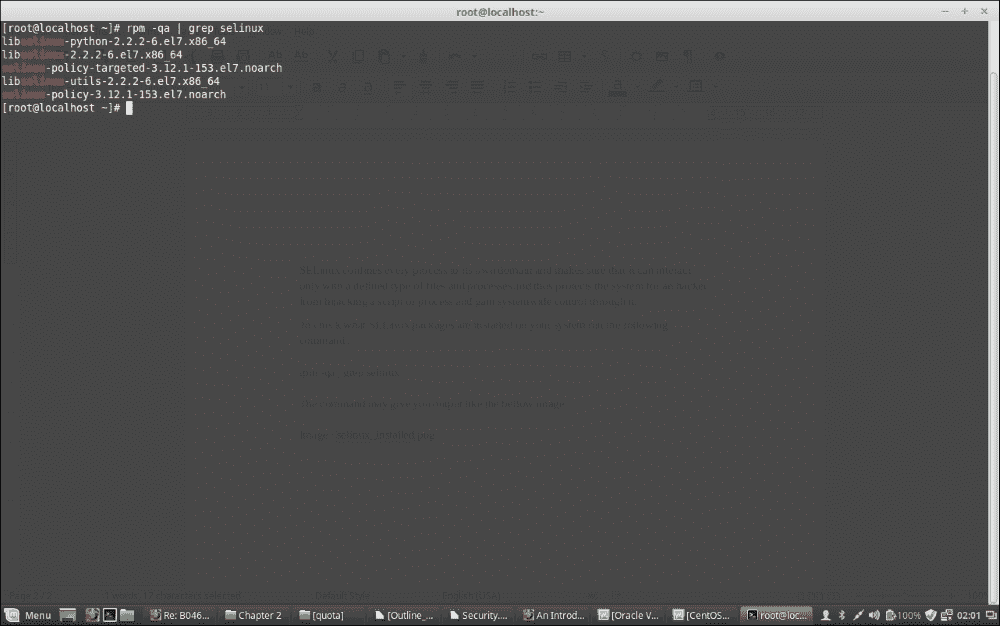

## 安装 SELinux

用以下命令安装所有包；这将安装其余的软件包，并更新系统上已经安装的软件包:

```sh
yum install policycoreutils policycoreutils-python selinux-policy selinux-policy-targeted libselinux-utils setroubleshoot-server setools setools-console mcstrans

```

现在，我们将在系统上安装 SELinux 所需的所有包。让我们在系统上为 web 服务器和 FTP ( `vsftpd`)服务器再安装两个 apache 服务(`httpd`)，这样我们就可以用它们测试 SELinux 了:

```sh
yum install httpd vsftpd

```

使用以下命令之一立即运行 apache 服务:

```sh
systemctl start httpd
service httpd start

```

使用以下任一命令检查 httpd 的状态:

```sh
service status httpd
systemctl status httpd

```

这些命令将显示它正在运行，如下图所示:

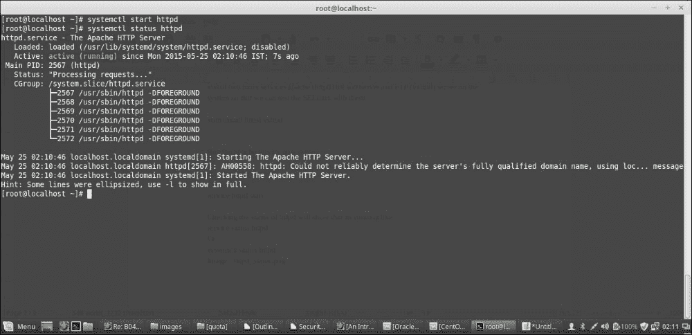

另外，`start vsftpd`使用以下任一命令，然后以同样的方式检查`vsftp`的状态:

```sh
systemctl start vsftpd
service vsftpd start

```

使用以下任一命令检查ftpd 的状态:

```sh
service status ftpd
systemctl status ftpd

```


## SELinux 模式

SELinux 模式有三种类型；它们如下:

*   **实施**:在这种模式下，SELinux 将其策略实施到系统上，并确保所有未经授权的用户或进程的访问都被拒绝。这些拒绝访问事件也会被登录到系统中，我们将在本章稍后部分对此进行讨论。
*   **许可**:这就像半启用模式状态，SELinux 不拒绝任何访问，因为策略处于许可模式。这是测试 SELinux 策略的最佳模式。
*   **禁用**:在此模式下，SELinux 处于完全禁用状态，不会创建日志或拒绝权限。

我们可以运行以下命令来获得当前的 SELinux 状态:

```sh
getenforce
sestatus

```

当系统上启用 SELinux 时，上述命令的输出如下图所示:

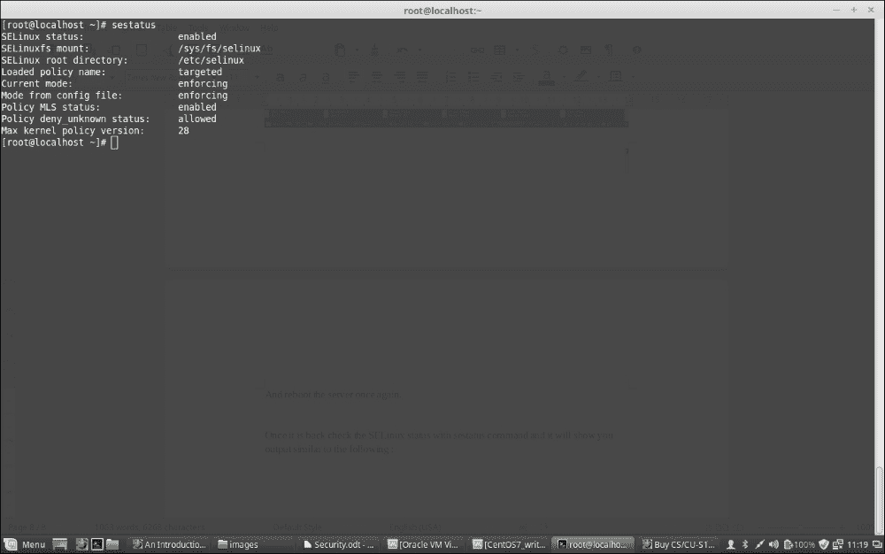

主 SELinux 配置文件是`/etc/selinux/config`。我们现在将通过在该文件中设置`SELINUX=permissive`，然后保存并重新启动系统来启用 SELinux。


`config`文件中的`SELINUXTYPE`参数也有三个选项，如下:

*   **目标**:这是默认值，允许您自定义并微调您的策略
*   **最小值**:在此模式下，仅保护选定的进程
*   **MLS** :多级安全是一个高级的保护模式，你也需要一个额外的软件包来安装它

我们将`SELINUXTYPE`保持默认值(即目标值)。

这对于在 SELinux 第一次运行时将其设置为许可模式是必要的，因为它需要标记系统上的所有文件。否则，在受限域下运行的进程可能会失败，因为它们无法使用正确的上下文访问文件。

一旦我们设置好并重新启动系统，它将标记所有文件，这将需要一些时间，具体取决于具有 SELinux 上下文的系统。由于它处于许可模式，将只报告失败和访问拒绝。

我们必须使用以下命令检查系统是否有任何错误:

```sh
grep 'SELinux' /var/log/messages

```

如果 SELinux 在许可模式下运行，这将向您显示如下输出:

```sh
May 25 01:54:46 localhost kernel: SELinux:  Disabled at runtime.
May 25 03:06:40 localhost kernel: SELinux:  Initializing.
May 25 03:06:58 localhost systemd[1]: Successfully loaded SELinux policy in 2.863609s.
May 27 06:31:39 localhost kernel: SELinux:  Initializing.
May 27 06:31:55 localhost systemd[1]: Successfully loaded SELinux policy in 1.944267s.

```

现在，由于所有的规则都已加载，文件也已标记，我们必须启用 SELinux 强制模式，而不是许可模式。因此，再次编辑`SELinux config`文件，并将以下内容设置为强制:

```sh
SELINUX=enforcing

```

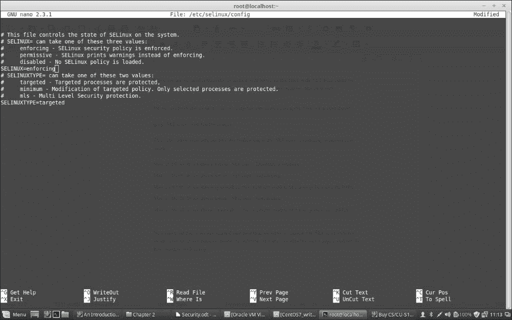

现在，再次重新启动服务器。

一旦它返回，用`sestatus`命令检查 SELinux 状态，它将显示类似如下的输出:


现在，如果你在`/var/log/messages`中`grep` SELinux，你会发现以下内容:

```sh
May 27 11:18:21 localhost kernel: SELinux: Initializing.
May 27 11:18:34 localhost systemd[1]: Successfully loaded SELinux policy in 715.664ms.

```

要检查 SELinux 执行状态，运行`getenforce`命令，它将显示状态为 `enforcing`。

`sestatus`命令将显示更多关于运行 SELinux 配置的详细信息，如下所示:

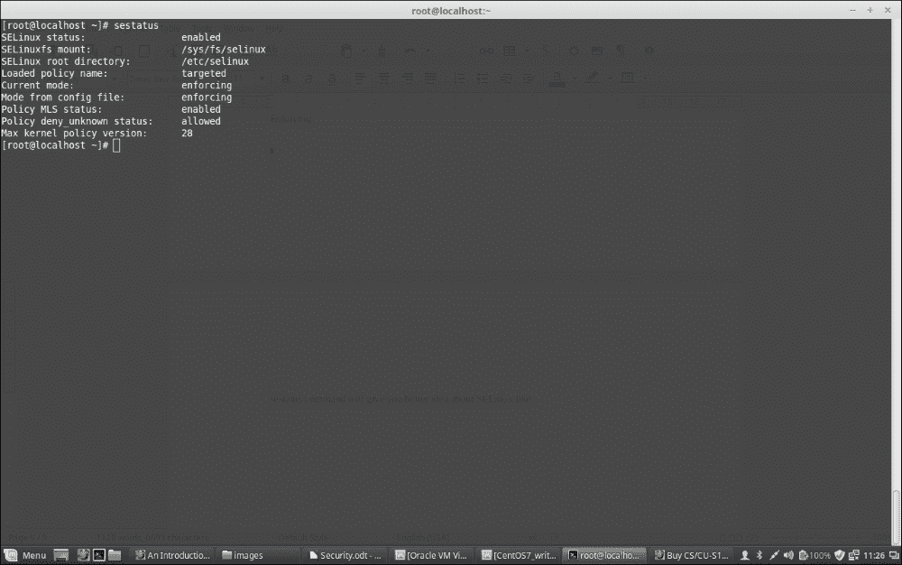

如果我们想在运行 SELinux 的同时临时改变 SELinux 模式，我们可以使用`setenforce`命令，如下所示:

```sh
setenforce permissive

```

现在，`sestatus`将显示如下画面:

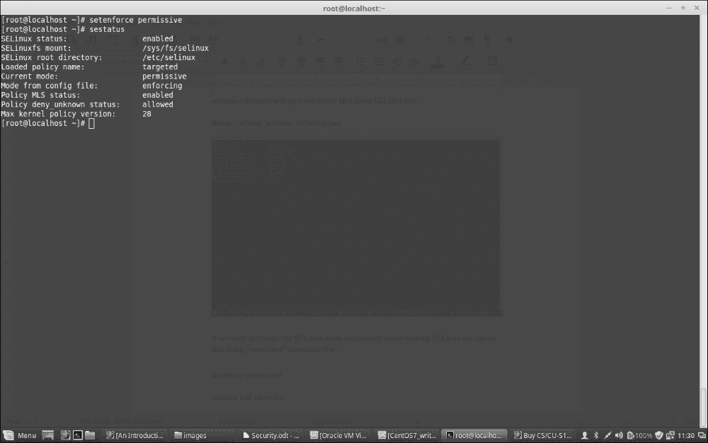

使用以下命令切换回强制模式:

```sh
setenforce enforcing

```

## SELinux 策略

您一定已经从`/var/log/messages`中先前的 SELinux 输出中注意到是基于策略的。策略是指一组定义关系、安全性和对以下内容的访问权限的规则:

*   **用户**:所有常规的 Linux 用户都是由一个或多个 SELinux 用户定义的。但是请注意，SELinux 用户和 Linux 用户是不同的。此外，请注意，运行的进程或程序在 SELinux 中被定义为主体。
*   **角色**:它们就像过滤器，定义哪个用户可以访问一个进程等等。它就像用户和流程之间的网关。用户只能在角色授权的情况下运行特定的进程，并且用户可以访问角色。SELinux 基于**基于角色的访问控制** ( **RBAC** )。
*   **主语****宾语**:主语是就像一个过程或者一个程序，宾语是任何不能被作用的东西；比如文件、端口、目录等等。主体对对象执行的操作取决于主体的权限。
*   **域**:这就像是一个包裹着主体(流程)的包装器，告诉流程它能做什么，不能做什么。例如，域将定义进程可以访问的目录、文件夹、文件、端口等。在 SELinux 中，域与主题相关。
*   **类型**:文件的上下文称为其类型。例如，文件的上下文描述了它是只能由本地 web 服务器进程访问，还是可以由任何其他目录(如`/`等)中的任何进程访问，或者哪个特定的 SELinux 用户是文件的所有者。类型与 SELinux 中的对象相关。

在 SELinux 中，策略定义了用户访问角色、角色访问域和域访问类型的规则。

SELinux 中有三种访问控制形式，由`/etc/selinux/config`文件中的`SELINUXTYPE`定义:

*   **类型强制** ( **TE** ):这是在目标策略中使用的主要访问控制机制
*   **基于角色的访问控制** ( **RBAC** ):这是基于 SELinux 用户(不一定是与 Linux 用户相同的，但在默认定向策略中不使用
*   **多级安全** ( **MLS** ):这是不常用也经常隐藏在默认的针对性策略中。

目标策略是 SELinux 中默认使用的，我们将在这里基于它继续讨论。

另外，请记住，SELinux 不会取代 Linux 系统中的传统 DAC 策略。相反，如果数模转换器策略禁止文件访问，即使 SELinux 允许，SELinux 策略也不会被评估，也不会授予对文件的访问权限。

SELinux 策略以模块化格式加载到内存中，非常像内核模块，可以使用以下命令查看:

```sh
semodule -l | more

```


`semodule`命令可用于安装、移除、重装、升级、启用以及禁用 SELinux 策略模块。

模块文件位于扩展名为`.pp`的`/etc/selinux/targeted/modules/active/modules/`中，不可读。但是，如果你仔细观察它们，你肯定会发现它们实际上与 Linux 中的不同应用程序相关。


这些策略模块被组合成一个活动策略，然后被加载到存储器中。这个组合的二进制策略可以在`/etc/selinux/targeted/policy/`目录中找到:


我们不能直接修改这些规则，但是可以使用`semanage boolean`命令来管理它们。`semanage boolean -l | less`命令的输出将向我们显示:


在前面输出的第二行中可以清楚地看到，此时对用户主目录的 FTP 服务访问被关闭。我们还可以使用以下命令管道来查看`ftpd`服务策略的状态:

```sh
semanage boolean -l | grep ftpd

```

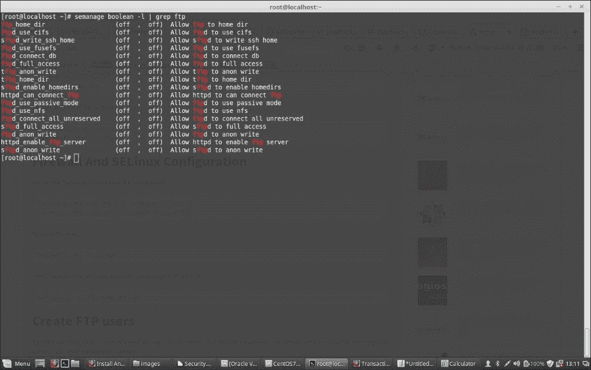

现在，为了允许 FTP 用户访问他们的主目录并允许读写访问，我们必须发出以下命令。首先使用以下命令检查`ftp_home_dir`策略的状态:

```sh
getsebool ftp_home_dir

```

这将显示以下输出:

```sh
ftp_home_dir --> off

```

现在，使用`setsebool -P`永久启用对用户主目录的访问:

```sh
setsebool -P ftp_home_dir on

```

现在，再次检查状态:

```sh
getsebool ftp_home_dir

```

这将显示以下输出:

```sh
ftp_home_dir --> on

```

现在，用户将被允许通过提供的文件传输协议访问他们的主目录；防火墙中允许使用 FTP 协议。

## SELinux 文件和进程

到目前为止，我们已经研究了 SELinux 的基础知识，以及如何允许像`vsftpd`这样的服务允许用户从 ftp 访问他们的文件。让我们看看文件上下文的细节，以及它们是如何在 SELinux 中定义的。SELinux 中的上下文是与安全相关的信息的集合，它帮助 SELinux 确定访问控制策略。在 Linux 中，任何东西都可以有一个安全上下文，比如文件、目录、服务或端口，但是安全上下文对于不同的对象意味着不同类型的东西。

我们可以使用`ls –Z`参数显示任何文件的 SELinux 文件上下文，如下所示:

```sh
ls -laZ /home/test/*

```

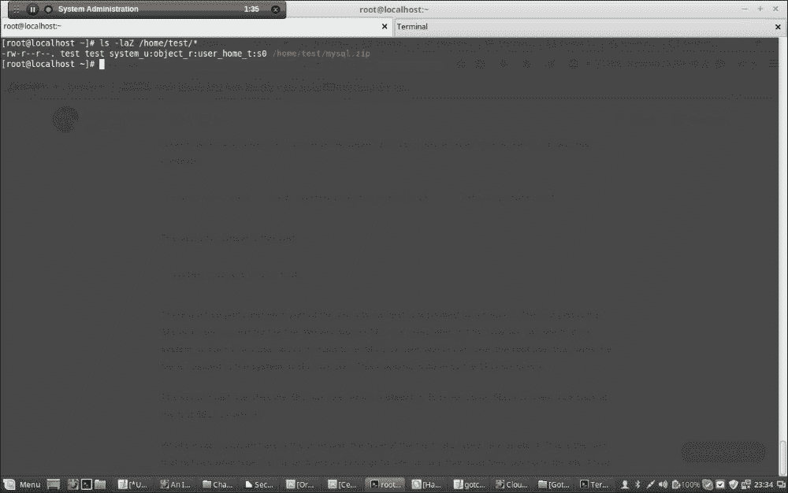

在前面的输出中，这部分是该特定文件的 SELinux 上下文:

```sh
system_u:object_r:user_home_t:s0

```

共有四个部分，每个部分由冒号(`:`)分隔。第一部分是 SELinux 用户上下文，这里显示为`system_u`。正如你已经知道的，每个 Linux 系统用户被映射到一个 SELinux 用户，这里是`system_u`。

第二部分是 SELinux 角色，这里是`object_r`。

这里最重要的部分是第三部分，被称为`user_home_t`。这是定义文件类型的一个，由此可以了解到它属于用户的家目录。

第四部分(s0)实际上解释了文件的敏感性，它实际上与多级安全性一起工作。前三个部分更重要，所以我们只和它们一起工作。

现在，让我们使用之前安装的`httpd`文件来看看 SELinux 进程的上下文。让我们首先使用以下命令开始`httpd`流程:

```sh
systemctl httpd start

```

现在让我们运行带有附加`-Z`标志的`ps` 命令来查看流程上下文:

```sh
ps -efZ | grep httpd

```


前面输出中的安全上下文如下:

```sh
system_u:system_r:httpd_t:s0

```

在 SELinux 中，用户以`_u`为后缀，角色以`_r`为后缀，类型以`_t`为后缀。

对于像`httpd`这样运行的进程，它需要访问其文件并对其进行操作。我们已经看到，每个进程只能访问某些类型(文件、目录、端口等)。

SELinux 在策略中定义这些访问规则。这些访问规则遵循以下标准`allow`声明:

```sh
allow <domain> <type>:<class> { <permissions> };

```

通用`allow` 语句表示:

*   一个进程是否属于某个领域
*   进程试图访问的资源对象属于某个类和类型
*   它是允许访问还是拒绝访问

让我们看看这在我们已经研究过的 https 过程的安全上下文中是如何工作的。

`httpd`的文档根目录或默认目录是`/var/www/html`。现在，让我们在其中创建一个文件并检查它的安全上下文:

```sh
touch /var/www/html/index.html
ls -Z /var/www/html/*

```


我们创建的`index.html`文件的文件上下文显示为`httpd_sys_content_t`。

我们将以下列方式使用 `sesearch`命令来检查`httpd`守护程序允许的访问类型:

```sh
sesearch --allow --source httpd_t --target httpd_sys_content_t --class file

```

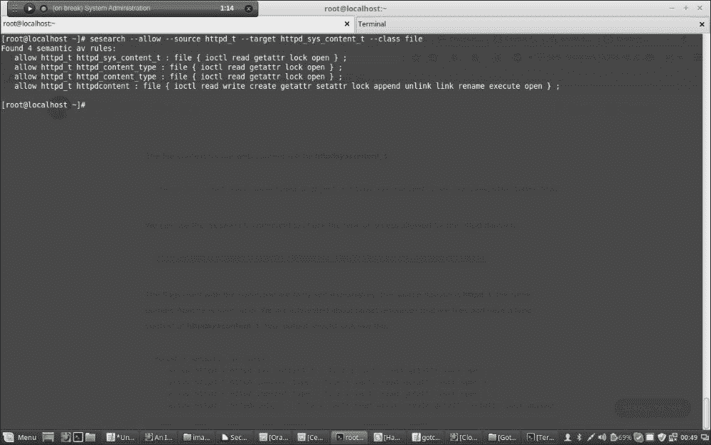

前面命令中使用的标志很容易理解；源域是`httpd_t`，也就是 apache 运行的域。我们想要列出的目标资源是文件，并且具有类型上下文`httpd_sys_content_t`。

注意前面截图中上下文输出的第一行是:

```sh
allow httpd_t httpd_sys_content_t : file { ioctl read getattr lock open } ;

```

现在，如果您将与之前的通用允许语句联系起来，我们将清楚地理解`httpd`服务具有对`httpd_sys_content_t`类型文件的输入/输出控制、读取、获取属性、锁定和打开访问。在我们的例子中，我们创建的`index.html`文件也是同一类型的，这意味着`httpd`服务可以访问这个`index.html`文件。

让我们创建一个修改`index.html`文件的测试网页，这样我们就可以从浏览器中检查它的输出。使用您喜欢的编辑器将以下行添加到`index.html`文件中并保存:

```sh
<html>
    <title>
  Test page
    </title>
    <body>
  <h1>This is a test page</h1>
    </body>
</html>
```

我们将使用以下命令更改`/var/www`文件夹后面的`httpd restart`的权限:

```sh
chmod -R 755 /var/wwwsystemctl restart httpd

```

如果是第一次使用以下命令，您可能需要允许防火墙中的 http 端口:

```sh
firewall-cmd --permanent --add-port=80/tcp
firewall-cmd --permanent --add-service=http
firewall-cmd –reload

```

现在试着从浏览器访问它。它将显示如下截图所示的输出:

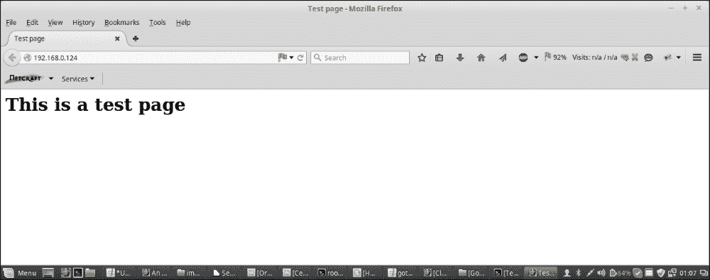

现在，让我们看看如果我们改变`index.html`文件的类型上下文，我们是否仍然能够访问它。我们将使用`chcon`命令来更改类型上下文，并将使用`–type`标志来实现此目的，如下所示:

```sh
chcon --type var_t /var/www/html/index.html

```

如果我们使用`ls -Z`检查文件的上下文，它会显示:

```sh
-rwxr-xr-x. root root unconfined_u:object_r:var_t:s0   /var/www/html/index.html

```

这里可以看到类型已经改为`var_t`。

现在，如果您再次尝试访问该网页，它将显示一个错误，或者您可能会看到一个默认页面，但与我们之前看到的页面不同。这是因为我们已经更改了`index.html`文件的类型上下文。

要恢复它，我们将使用以下命令:

```sh
restorecon -v /var/www/html/index.html

```

现在，如果我们再次访问该网站，我们将看到它像以前一样再次工作。

SELinux 强制模式保证，除非策略另有规定，否则进程和文件是使用与其父进程相同的上下文创建的。这意味着，如果进程 A 正在生成进程 B，则生成的进程 B 将在与进程 A 相同的域中运行，除非 SELinux 策略有不同的指定，同样，如果我们有一个具有某种`context_t`类型的目录，除非另有定义，否则其下的文件或目录将继承相同的`context_t`类型。

在 CentOS 7 中，系统中存在的所有文件的上下文列在`/etc/selinux/targeted/contexts/files/file_contexts`文件中，新目录和文件的上下文记录在`/etc/selinux/targeted/contexts/files/file_contexts.local` 文件中。由于`chcon`用于临时改变上下文，`restorecon`用于恢复上下文，`restorecon`实际上查看该文件以恢复文件的原始上下文。

让我们创建`/www/html`:

```sh
mkdir -p /www/html

```

现在，我们使用以下命令将内容从`/var/www/html`复制到`/www/html`:

```sh
cp /var/www/html/index.html /www/html/

```

如果我们检查文件的上下文，我们会发现它不同于我们对`/var/www/html/index.html`及其`default_t`的上下文，因为那是其父目录的上下文。

此外，即使我们从这个新位置将`httpd`配置文件更改为打开的`index.html`文件，我们仍然会面临错误，因为上下文还不正确。从`/var/www/html to /www/html`复制`index.html`文件时，它从其父目录`default_t`继承了上下文。

为了解决这个问题，我们必须改变它的背景。

要永久地更改我们之前创建的`/www/html`下的`index.html`文件的上下文，我们将遵循两个步骤:

```sh
semanage fcontext --add --type httpd_sys_content_t "/www(/.*)?"
semanage fcontext --add --type httpd_sys_content_t "/www/html(/.*)?"

```

现在，我们从`/etc/selinux/targeted/contexts/files/file_contexts.local` 文件检查上下文数据库:

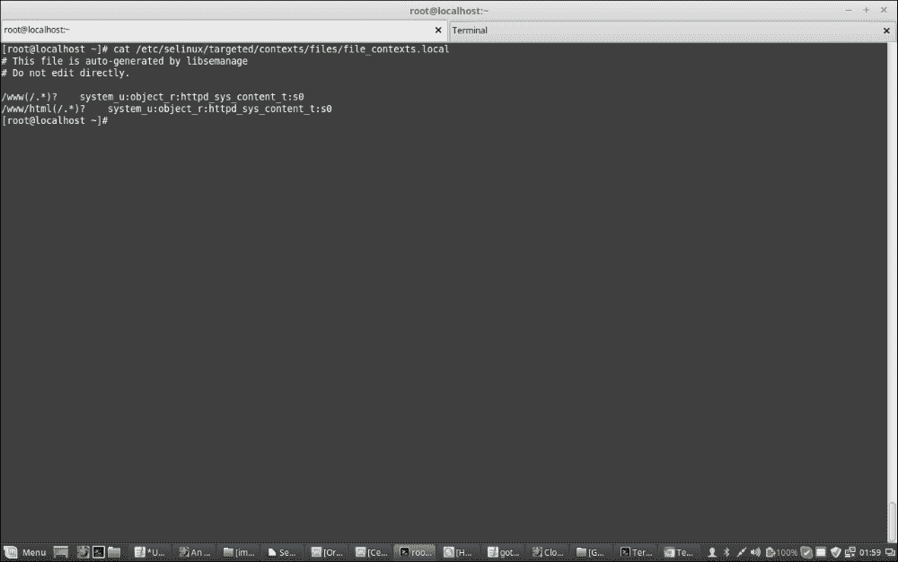

现在，我们将运行`restorecon`命令，将文件或目录重新标记为上一步中记录的:

```sh
restorecon -Rv /www

```

这将在三个层面发挥作用；首先它会重新标记`/www`目录，然后是`/www/html`目录，最后是`/www/html/index.html`文件。


现在，如果我们尝试访问网页，它应该会工作。

还有一个名为`matchpathcon`的命令，对上下文相关问题的排查非常得心应手。它可以将当前资源的上下文与 SELinux 上下文数据库下的内容进行比较，并进行报告。如果匹配不同，则建议进行所需的更改。我们可以通过以下方式使用`/www/html/index.html`的`-V`标志运行命令:

```sh
matchpathcon -V /www/html/index.html

```

# 域转换

现在，我们来看看进程是如何访问其他进程的。

让我们考虑一下`vsftpd`进程正在运行；如果没有启动，我们可以使用以下命令启动它:

```sh
systemctl start vsftpd

```

`vsftpd`过程由`systemd`过程开始；这是对`Sys V init`流程的替代，在`init_t`的背景下运行:

```sh
ps -eZ | grep init

```

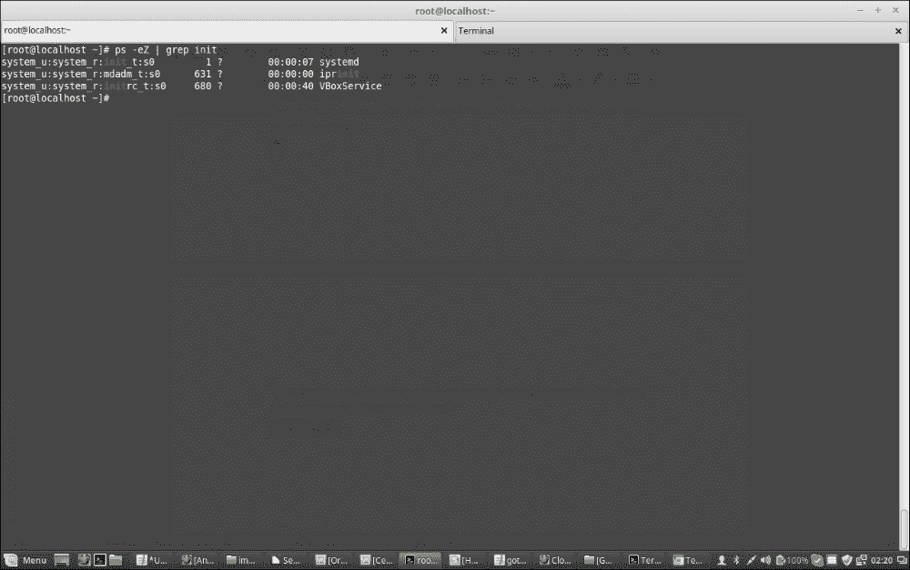

在`init_t`域下运行的`systemd`进程寿命很短；它调用`/usr/sbin/vsftpd`，它有一个类型上下文`ftpd_exec_t`，当这个二进制可执行文件启动时，它就变成了`vsftpd`服务本身，并在`ftpd_t`域中运行。

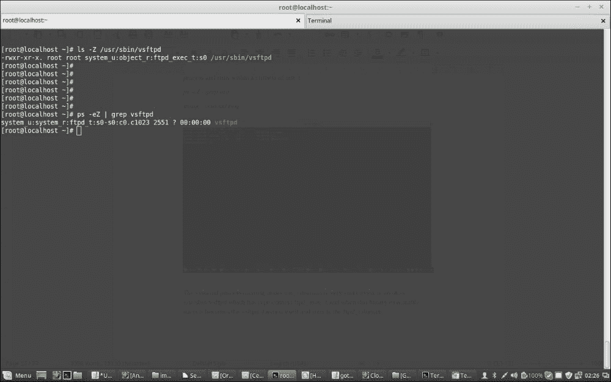

所以，这是在`init_t` 域下运行的`systemd`进程执行一个带有`ftpd_exec_t`类型的二进制文件。然后二进制文件在`ftpd_t`域内启动服务。

域转换遵循三个严格的规则:

*   源域的父进程必须拥有在两个域之间执行应用程序的权限
*   该应用程序的文件上下文必须被标识为目标域的入口点
*   必须允许原始域转移到目标域

让我们运行`vsftpd`服务的`sesearch`命令来检查它是否遵循这些规则:

1.  First, the source domain `init_t` must have permission to execute the application in the `ftpd_exec_t` context. So we run:

    ```sh
    sesearch -s init_t -t ftpd_exec_t -c file -p execute -Ad

    ```

    我们发现了以下输出:

    ```sh
    allow init_t ftpd_exec_t : file { read getattr execute open } ;

    ```

    因此，`init_t`可以读取、获取属性、执行和打开`ftpd_exec_t`上下文的文件。

    

2.  Next, we check whether the binary file is the entry point for the target domain `ftpd_t`:

    ```sh
    sesearch -s ftpd_t -t ftpd_exec_t -c file -p entrypoint -Ad

    ```

    我们发现它是:

    ```sh
    allow ftpd_t ftpd_exec_t : file { ioctl read getattr lock execute execute_no_trans entrypoint open } ;

    ```

    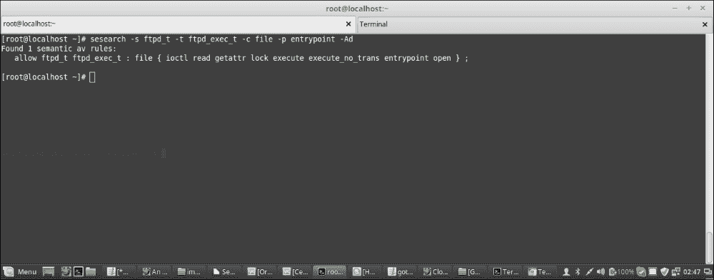

3.  Finally, the source domain `init_t` needs to have permission to transit to the target `ftpd_t` domain:

    ```sh
    sesearch -s init_t -t ftpd_t -c process -p transition –Ad

    ```

    我们可以看到源域也拥有该权限:

    ```sh
    allow init_t ftpd_t : process transition ;

    ```

    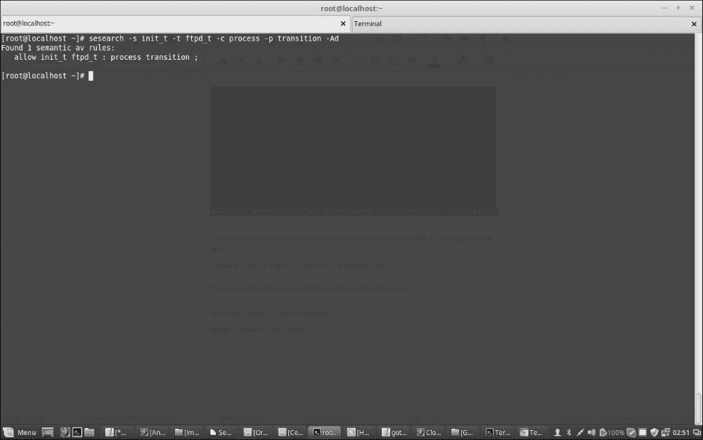

SELinux 还支持在非受限域下运行的进程；例如`unconfined_t`。默认情况下，这是登录用户运行其进程的域。

# SELinux 用户

前面解释过，SELinux 用户和正常的 Linux 用户是不一样的。SELinux 用户是在引导时加载到内存中的策略中定义的，这些用户只有少数。

执行 SELinux 后，每个常规用户帐户被映射到一个 SELinux 用户帐户。可以有多个用户帐户映射到同一个 SELinux 用户。这使得普通用户帐户能够继承其对应的 SELinux 的权限。

要查看映射，我们将运行以下命令:

```sh
semanage login -l

```

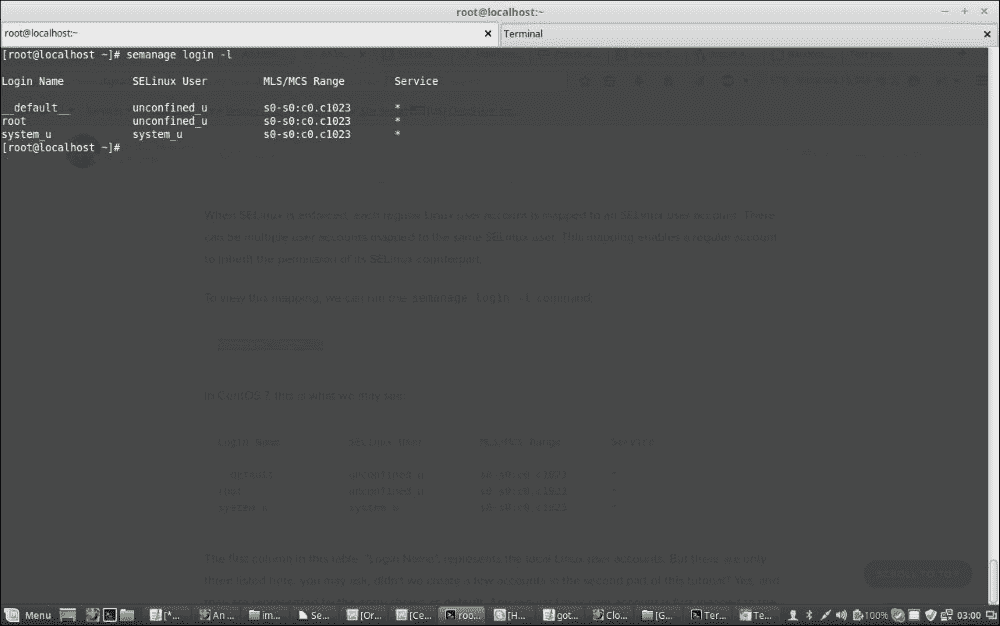

在这里，我们会发现只有三个登录名，如前面代表 Linux 用户帐户的截图所示。任何 Linux 用户都被映射到这里显示为`__default__`的条目。用户根没有映射到默认值，而是有自己的条目，并且有用于运行的进程或服务的`system_u`。第二列指示它们映射到的 SELinux 用户。普通用户账户和根映射到`unconfined_u`，而流程和服务映射到`system_u` SELinux 用户。现在忽略第三列，显示用户的**多级安全** ( **MLS** ) **多类别安全** (MCS)类，以及最后一列(服务)。

要查看系统中可用的 SELinux 用户，请使用`semanage`用户命令，如下所示:

```sh
semanage user -l

```

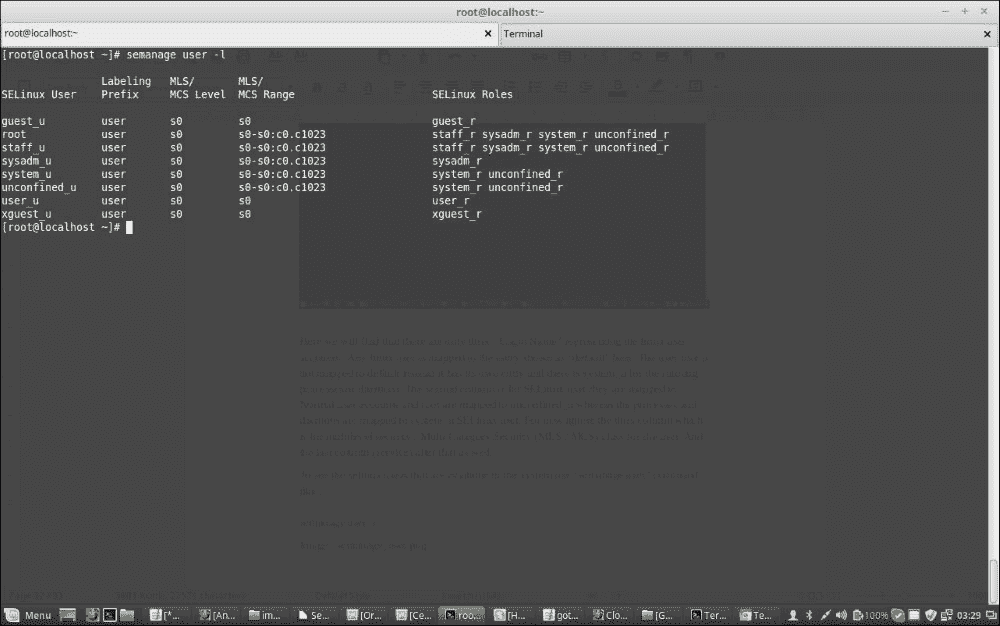

前面截图中的表格显示了系统中可用的 SELinux 用户以及他们可以访问的角色。我们已经讨论过 SELinux 角色就像用户和进程之间的网关。我们还将它们与过滤器进行了比较，在过滤器中，用户可以输入一个角色，前提是该角色授予它。如果角色被授权访问流程域，则与该角色相关联的用户将能够进入该流程域。

现在，以 root 用户身份运行 id `-Z`命令。它将显示根的 SELinux 安全上下文:

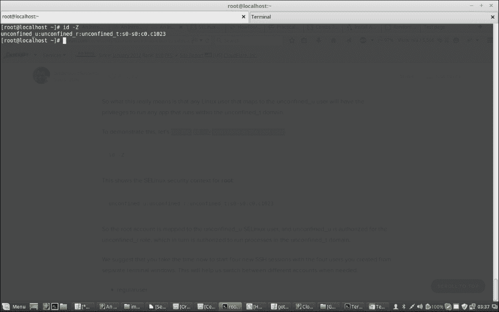

因此，根用户被映射到`unconfined_t` SELinux 用户，后者被授权到`unconfined_r`角色，后者又被授权在`unconfined_t`域中运行进程。

我们已经看到系统中有几个 SELinux 用户可用。让我们在这里讨论其中的一些:

*   `guest_u`:此类用户无法访问 X Windows 系统或网络，也无法执行`su`或`sudo`命令
*   `xguest_u`:这类用户只能通过浏览器访问 GUI 和网络
*   `user_u`:此类用户拥有对 GUI 和网络的一般访问权限，但无法运行`su`或`sudo`
*   `staff_u`:这个和`user_u`一样，只不过他们可以跑`sudo`。
*   `system_u`:这意味着用于系统服务，不与常规用户账户映射

# 限制访问 su 或 sudo

我们可以通过更改用户的 SELinux 用户映射来限制用户运行`su`或`sudo`命令，如下所示:

```sh
semanage login -a -s user_u test

```

前面的命令会将 Linux `test`用户的映射更改为`user_u`，并且不允许`su`或`sudo`命令访问。

### 注

这只会在用户未登录时生效。

## 限制运行脚本的权限

要限制 Linux `test`用户运行脚本的能力，我们必须做两件事。首先，我们将用户的映射更改为`guest_u`，与之前相同:

```sh
semanage login -a -s guest_u test

```

默认情况下，SELinux 允许映射到`guest_t` 的用户从其主目录执行脚本。我们可以使用以下命令来确认:

```sh
getsebool allow_guest_exec_content

```

会显示`guest_exec_content`开启。所以，第二步是我们用这个禁用`guest_exec_content`:

```sh
setsebool allow_guest_exec_content off

```

现在，我们为其更改了映射的测试用户将无法执行任何脚本，即使他对自己的主目录以及在那里创建的文件拥有完全访问权限。

如果我们做一个 grep 来看看 SELinux 阻止了什么`/var/log/messages`，它会显示拒绝访问和一个警报 ID。我们可以记录警报标识并运行:

```sh
sealert -l <alert id>

```

它将向我们展示关于拒绝访问的全部细节，以及一些消除它的建议。

## 限制获取服务

假设我们有一个可以访问`sudo`的用户管理员，这样它就可以用`sudo`运行命令来启动和停止像`httpd`这样的服务。现在，即使用户拥有`sudo`访问权限，我们也可以通过将他的用户映射更改为`user_u`来阻止他对服务的管理访问权限，就像我们之前所做的那样:

```sh
semanage login -a -s user_u admin

```

这将限制用户管理员重新启动或停止服务。

我们可以通过以 root 用户身份运行`seinfo`命令来验证`user_u`访问信息:

```sh
seinfo -uuser_u -x

```


该输出显示了`user_u`可以访问的角色；他们是`object_r`和`user_r`。

让我们更进一步，运行相同的命令来找出`user_r`角色被授权进入哪些域:

```sh
seinfo -ruser_r -x

```

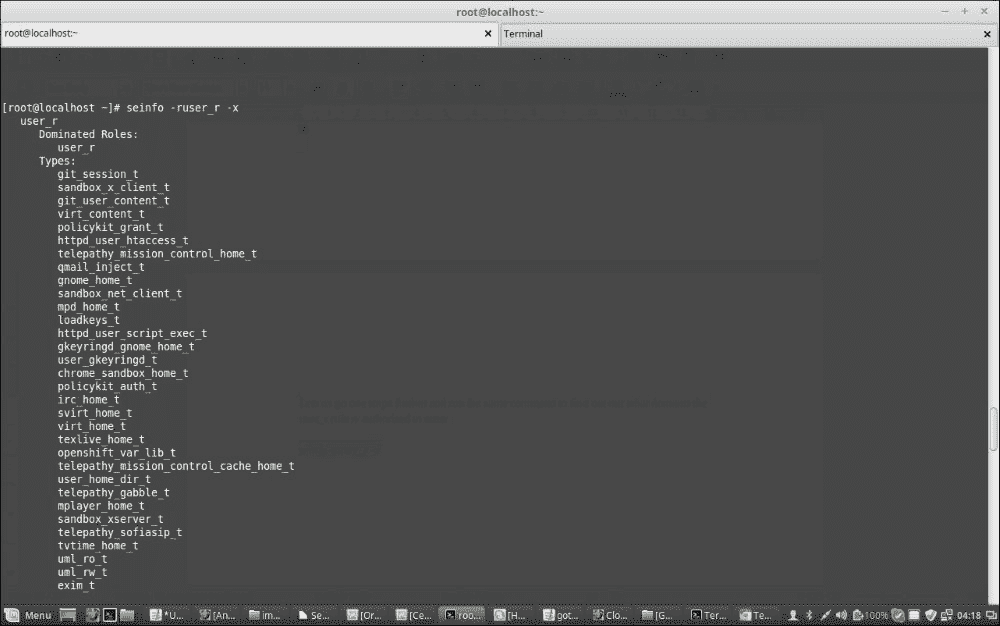

角色可以输入的域列表很长。现在，让我们通过使用 grep 过滤输出来了解角色是否可以进入域`httpd_t`:

```sh
seinfo -ruser_r -x | grep httpd_t

```

这将返回无，这意味着`user_r`角色没有被授权进入`httpd_t`域，因此无法启动`httpd`进程或守护进程。

# SELinux 审核日志

在 CentOS 7 中，我们应该查看两个文件中与 SELinux 相关的错误和警报；它们如下:

*   `/var/log/audit/audit.log`
*   `/var/log/messages`

# SELinux 故障排除

SELinux 附带了一些对检查错误和故障排除非常有用的工具。我们已经看到了一个`sealert -l <alert id>`，我们通过查看`/var/log/messages`来收集警报标识。还有一个名为`ausearch`的命令，如果`auditd`服务正在运行，这个命令对检查错误也很有帮助，如下所示:

```sh
ausearch -m avc -c httpd

```

# 总结

在本章中，我们研究了 SELinux 的各个方面以及如何配置它；我们还演示了如何根据我们的需求来使用它。但是，要小心，不要在生产系统上测试 SELinux。最好使用生产副本，并首先在那里测试所有内容。如果配置得当，SELinux 工具将增强系统的安全性，但最好在需要严格的安全控制时使用，并且只有在小心部署时才使用。

在下一章中，我们将看看 Linux 如何用于各种目的。