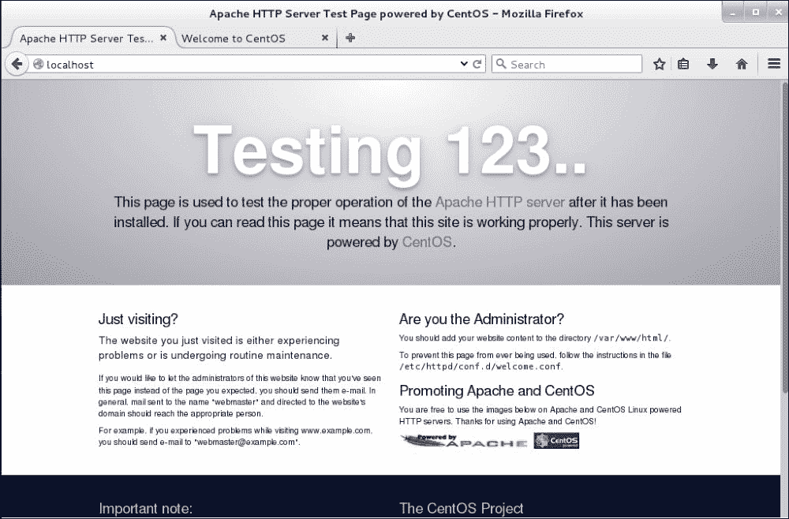
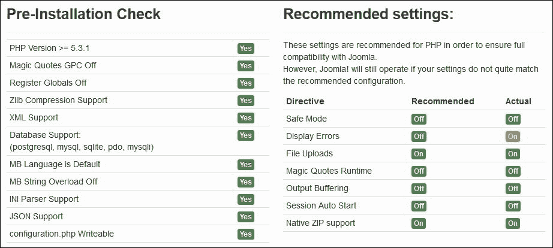

# 第三章。不同用途的 Linux

我们制定的建立服务器基础设施或数据中心的计划基本相同。我们总是试图在我们运行的服务器之间组织服务，尊重我们的需求。在 Linux 系统上运行的服务器可以用来一次运行多个服务，或者只运行一个服务，这取决于该服务需要多少处理能力以及它在网络中的位置。根据用户的需求，系统管理员应该随时准备在其基础架构中设置或关闭服务。通常，对于基本的系统安装，会有许多已经安装但配置不佳的服务。

本章将介绍大多数用户需要的主要 Linux 服务，以及如何设置、配置和操作这些服务。然后，我们将探讨这些服务的一些方面，如何保护它们，以及如何以最佳方式操作它们。

在本章中，我们将学习:

*   使用 iptables 和 IP 伪装配置网关服务器
*   安装虚拟专用网服务器
*   将 BIND 实现为域名系统服务器
*   使用 Apache-MySQL-PHP 和 ModSecurity 设置和使用网络服务器
*   安装一个文件传输协议服务器
*   在 Apache 和 FTP 中实现 OpenSSL

# 配置网关服务器

在许多网络基础设施中，系统管理员需要将其服务器和工作站分隔在多个子网内。其他人使用专用网络地址，这些地址可以使用 **网络地址转换** ( **NAT** )技术与公共地址相关联。Linux 网关服务器是帮助设置这种配置的常见解决方案之一。下面的屏幕截图展示了网关服务器用于通过本地和外部网络的架构示例:


根据的要求，我们需要一个至少有两个网络接口的 Linux 服务器(作为最佳实践)。然后，我们需要在与之相关的两个网络之间架起一座桥梁。在本节中，我们将使用 IP 转发和 NAT 规则在公共(外部)和私有(本地)地址之间设置网关，以将流量从私有网络路由到公共网络。我们称外部网络为 **广域网** ( **广域网**)和局域网**局域网** ( **局域网**)。

### 注

从本地网络生成的流量将看起来是从网关服务器到外部网络的。在本例中，我们将需要另一台机器来呈现局域网内的服务器。

首先，我们将设置`WAN`界面的网络配置。要做到这一点，将有两种选择:要么接口将通过 DHCP 获取其 IP 配置(自动)，要么我们自己手动设置(静态)。在我们的例子中，我们将进行自动配置，因为我们的广域网是由服务于 DHCP 配置的路由器提供的。

我们将从编辑指定界面的配置文件`eth0`开始:

```sh
$ sudo nano /etc/sysconfig/network-scripts/ifcfg-eth0

```

该文件将包含以下几行:

```sh
HWADDR="XX:XX:XX:XX:XX:XX"
TYPE="Ethernet"
BOOTPROTO="dhcp"
DEFROUTE="yes"
PEERDNS="yes"
PEERROUTES="yes"
IPV4_FAILURE_FATAL="no"
IPV6INIT="yes"
IPV6_AUTOCONF="yes"
IPV6_DEFROUTE="yes"
IPV6_PEERDNS="yes"
IPV6_PEERROUTES="yes"
IPV6_FAILURE_FATAL="no"
DEVICE="eth0"
UUID="01f7dbb3-7ac8-406d-a88b-76082e0fa6eb"
ONBOOT="yes"

```

我们应该关注写`BOOTPROTO`的那一行，这是网络配置要用的协议，我们需要确保设置在`dhcp`上。

默认安装会将所有接口设置为 DHCP 配置，除非它们在安装期间或之后被修改过。

此外，我们需要确保`DEVICE`被设置为我们将用于服务于 DHCP 服务器的接口名称，并在我们的服务器中命名(对于我们的情况，它是`eth0`)。然后选项`ONBOOT`被设置为`yes`。

### 注

编辑完文件后，如果需要，请确保在离开文本编辑器之前保存修改。

确保所有更改都设置成功后，我们需要重新启动网络管理器，以便机器可以采用 DHCP 配置:

```sh
$ sudo systemctl restart network.service

```

在执行此步骤的过程中，网络连接可能会丢失。我们需要确保在此期间我们不需要它。

现在我们可以转到连接到局域网的网关服务器的第二个网络接口的配置。对于这种配置，我们需要使用静态 IP 地址。

与第一个界面类似，我们要编辑这个界面的配置文件`eth1`:

```sh
$ sudo nano /etc/sysconfig/network-scripts/ifcfg-eth1

```

此外，该文件将包含一些配置文件，但我们只对其中的一些感兴趣:

```sh
HWADDR="XX:XX:XX:XX:XX:XX"
TYPE="Ethernet"
BOOTPROTO="dhcp"
DEFROUTE="yes"
PEERDNS="yes"
PEERROUTES="yes"
IPV4_FAILURE_FATAL="no"
IPV6INIT="yes"
IPV6_AUTOCONF="yes"
IPV6_DEFROUTE="yes"
IPV6_PEERDNS="yes"
IPV6_PEERROUTES="yes"
IPV6_FAILURE_FATAL="no"
DEVICE="eth1"
UUID=" b3fcc00e-a7d9-4b55-a32c-1e88e394aaf6"
ONBOOT="yes"

```

这是的默认配置，所以我们需要把它从动态配置改为静态配置。

修改将包括修改一些行和添加其他行。

我们首先将配置协议从`dhcp`更改为`static`，如下所示:

`BOOTPROTO="static"`

然后我们用这一行添加静态 IP 地址:`IPADDR="10.0.1.1"`。

然后是网络掩码，`NETMASK="255.255.255.0"`。

最后，我们确保选项`DEVICE`设置为`eth1`，选项`ONBOOT`设置为`yes`。

同样，为了确保成功应用此配置，我们需要重新启动网络服务:

```sh
$ sudo systemctl restart network.service

```

### 注

如果在输入`ifconfig`时配置没有生效，为了检查接口的配置，我们需要运行以下命令:

```sh
$ sudo systemctl restart network.service
$ sudo systemctl status network.service

```

现在我们来看客户端的配置，即使用网关服务器的机器。所以我们需要为局域网配置它的接口。由于我们不限于一个特定的客户端，如果我们有一个图形界面，我们可以直接进入连接的界面并输入这些配置:

**IP 地址** : `10.0.1.2`

**网络掩码** : `255.255.255.0`

**关口** : `10.0.1.1`

对于 DNS 服务器，我们将采用谷歌 DNS，它非常可靠:

**DNS 服务器** : `8.8.8.8`

### 注

输入谷歌 DNS 服务器地址不是义务。一些站点可能正在阻止它，其他站点可能正在使用它们的本地 DNS 服务器。根据需要，如果我们没有，谷歌域名系统也可以。

如果我们需要使用另一台 CentOS 7 服务器，我们可能需要在静态服务器配置期间执行相同的步骤。

我们编辑界面的配置文件:

```sh
$ sudo nano /etc/sysconfig/network-scripts/ifcfg-eth1

```

通过将配置协议更改为`static`并添加这两行:

```sh
IPADDR="10.0.1.2"
NETMASK="255.255.255.0"

```

我们也确定`ONBOOT=yes`和`DEVICE=eth0`。

要使用谷歌域名服务器，我们可以编辑`/etc/resolv.conf`文件:

```sh
$ nano /etc/resolv.conf

```

要添加这两行:

```sh
nameserver 8.8.8.8
nameserver 8.8.4.4

```

然后重新启动网络服务:

```sh
$ sudo systemctl restart network.service

```

我们回到网关服务器，然后开始配置 IP 转发。首先，我们需要为 IPv4 数据包转发启用它:

```sh
$ sudo sysctl -w net.ipv4.ip_forward=1

```

为了在每次系统重启时保持配置不变，我们需要修改 IP 转发配置文件:

```sh
$ sudo nano /etc/sysctl.conf

```

然后添加这一行并保存:

```sh
net.ipv4.ip_forward = 1

```

要重新加载对文件所做的配置，我们需要运行以下命令:

```sh
$ sudo sysctl –w

```

当前配置可以通过以下命令可视化:

```sh
$ sudo cat /proc/sys/net/ipv4/ip_forward

```

现在我们转到启用 NAT 配置。使用`iptables`，我们需要启用 IP 伪装。`firewalld`是一项允许轻松配置`iptables`的服务。要使用`firewalld`我们将依靠`firewalld-cmd`命令，然后我们进入所需的配置。

我们从`firewalld`中配置 NAT 开始。首先，我们将局域网设置为可信区域:

```sh
$ sudo firewall-cmd --permanent --zone=trusted --add-source=10.0.1.0/24

```

然后我们将局域网接口`eth1`集成到一个名为`internal`的区域:

```sh
$ sudo firewall-cmd --change-interface=eth1 --zone=internal --permanent

```

对于广域网接口`eth0`到一个名为`external`的区域，我们也这样做:

```sh
$ sudo firewall-cmd --change-interface=eth0 --zone=external --permanent

```

然后，我们为外部广域网配置`masquerade`选项:

```sh
$ sudo firewall-cmd --zone=external --add-masquerade --permanent

```

对于可选的域名系统配置，我们可以使其通过`internal`区域:

```sh
$ sudo firewall-cmd --zone=internal --add-service=dns –-permanent

```

在我们完成之前，我们确保 NAT 配置为将流量从局域网传递到广域网接口:

```sh
$ sudo firewall-cmd --permanent --direct --passthrough ipv4 -t nat -I POSTROUTING -o eth0 -j MASQUERADE -s 10.0.1.0/24 

```

最后，我们需要重新加载防火墙服务，以便配置生效:

```sh
$ sudo firewall-cmd –reload

```

此时，网关服务器应该运行良好。为了测试配置，我们需要从局域网上的任何机器 ping 通任何网站:

```sh
$ ping www.google.com

```

然后，我们需要看到以下类型的输出，以了解我们的网关服务器是否正常工作:

```sh
PING www.google.com (216.58.210.196): 56 data bytes
64 bytes from 216.58.210.196: seq=0 ttl=50 time=55.799 ms
64 bytes from 216.58.210.196: seq=1 ttl=50 time=65.751 ms
64 bytes from 216.58.210.196: seq=2 ttl=50 time=54.878 ms
64 bytes from 216.58.210.196: seq=3 ttl=50 time=54.186 ms
64 bytes from 216.58.210.196: seq=4 ttl=50 time=93.656 ms
--- www.google.com ping statistics ---
5 packets transmitted, 5 packets received, 0% packet loss
round-trip min/avg/max = 54.186/64.854/93.656 ms

```

如果我们使用的是台式机，不需要静态配置，我们会建议使用 DHCP 服务器来设置所有客户端的配置。即使对于更高级的 DHCP 配置，我们也可以通过接口的 MAC 地址将特定的 IP 地址与服务器相关联。

# 设置虚拟专用网服务器

OpenVPN 是一个开源软件应用，它实现了 **虚拟专用网络** ( **VPN** )技术，用于在路由或桥接配置和远程访问设施中创建安全的点对点或站点到站点连接。

作为本节的要求，我们需要一台能够安装一些软件包并对网络配置文件(互联网和根访问)进行一些更改的 CentOS 7 服务器。在稍后的阶段，我们可能需要创建一些身份验证证书。我们也将介绍如何做到这一点。

首先，我们将从安装所需的软件包开始。在此之前，OpenVPN 在默认的 CentOS 标准存储库中不可用，因此我们需要添加包含流行附加包的 EPEL 存储库:

```sh
$ sudo yum install epel-release

```

这个命令完成后，我们就可以启动 OpenVPN 了。我们还需要安装一个 RSA 生成器来生成我们将用来保护 VPN 连接的 SSL 密钥对:

```sh
$ sudo yum install openvpn easy-rsa

```

在命令执行结束时，OpenVPN 和 easy-rsa 已成功安装在系统上。

现在我们转到 OpenVPN 的配置部分。由于 OpenVPN 在其文档目录中有一个配置文件的示例，我们将使用`server.conf`文件作为我们的初始配置，并在此基础上进行构建。为此，我们需要将其复制到`/etc`目录:

```sh
$ sudo cp /usr/share/doc/openvpn-*/sample/sample-config-files/server.conf /etc/openvpn/

```

然后我们可以编辑它以满足我们的需求:

```sh
$ sudo nano /etc/openvpn/server.conf

```

打开文件后，我们需要删除一些注释行，做一些小的修改，如下(使用`nano`寻找要修改的行，我们应该使用 *Ctrl* + *w* ，然后输入我们要找的单词)。

首先，我们需要将 RSA 加密长度设置为 2048 字节，因此我们需要确保指示文件名的选项行将像这样使用。

```sh
dh dh2048.pem

```

### 注

一些文章建议 1024 字节的 DH 密钥容易受到攻击，因此我们建议使用 2048 字节或更大的 DH 密钥，以获得更好的安全性。该漏洞被称为 Logjam，更多详细信息，请访问:[http://sourceforge.net/p/openvpn/mailman/message/34132515/](http://sourceforge.net/p/openvpn/mailman/message/34132515/)

然后我们需要取消对第`push redirect-gateway def1 bypass-dhcp"",`行的注释，该行告诉客户端将所有流量重定向到 OpenVPN。

接下来，我们需要为客户端设置一个 DNS 服务器，因为它将无法使用 ISP 提供的服务器。同样，我将使用谷歌域名系统`8.8.8.8`和`8.8.4.4`:

```sh
push "dhcp-option DNS 8.8.8.8"
push "dhcp-option DNS 8.8.4.4"

```

最后，为了让 OpenVPN 顺利运行，我们需要首先通过无权限运行它。为此，我们需要通过名为`nobody`的用户和组来运行它:

```sh
user nobody
group nobody

```

然后保存文件并退出。

到目前为止，OpenVPN 服务的配置部分已经完成。我们将继续讨论证书和密钥生成部分，其中我们需要使用 Easy RSA 创建一些脚本。我们首先在 OpenVPN 的配置文件夹中创建一个 Easy RSA 目录:

```sh
$ sudo mkdir -p /etc/openvpn/easy-rsa/keys

```

然后，我们需要用生成密钥和证书的 Easy RSA 预定义脚本填充文件夹:

```sh
$ sudo cp -rf /usr/share/easy-rsa/2.0/* /etc/openvpn/easy-rsa/

```

为了执行简单的虚拟专用网设置，我们将从在`vars`文件中一劳永逸地键入我们的信息开始:

```sh
$ sudo nano /etc/openvpn/easy-rsa/vars

```

我们基本上是更改以`export KEY_`开始的行，以更新它们的值来匹配所需的组织的值，并且在某些时候我们可能需要取消它们的注释:

```sh
export KEY_COUNTRY="UK"
export KEY_PROVINCE="GL"
export KEY_CITY="London"
export KEY_ORG="City-Center"
export KEY_EMAIL="user@packt.co.uk"
export KEY_OU="PacktPublishing"

# X509 Subject Field
export KEY_NAME="server"

export KEY_CN="openvpn.packt.co.uk"

```

然后保存文件并退出。

字段`KEY_NAME`代表文件`.key`和`.crt`的名称。

字段`KEY_CN`是我们应该放置通向我们的 VPN 服务器的域或子域的地方。

为了确保在使用 OpenSSL 配置文件时不会因为版本更新而出现问题，我们将从文件名中删除该版本:

```sh
$ sudo cp /etc/openvpn/easy-rsa/openssl-1.0.0.cnf /etc/openvpn/easy-rsa/openssl.cnf

```

现在，我们开始创建证书和密钥。我们需要在`/etc/openvpn/easy-ras`文件夹中运行脚本:

```sh
$ cd /etc/openvpn/easy-rsa

```

然后我们从变量开始:

```sh
$ sudo source ./vars

```

之后，我们清除所有旧生成的密钥和证书:

```sh
$ sudo ./clean-all

```

然后我们构建证书颁发机构，它的信息已经被定义为默认选项:

```sh
$ sudo ./build-ca

```

现在我们为我们的虚拟专用网服务器创建密钥和证书。我们通过按*进入*跳过挑战密码阶段。然后，我们确保通过为最后一步键入`Y`来验证:

```sh
$ sudo ./build-key-server server

```

运行此命令时，如果它运行正常，我们应该会看到以下消息:

```sh
Check that the request matches the signature
Signature ok
The Subject's Distinguished Name is as follows
countryName           :PRINTABLE:'UK'
stateOrProvinceName   :PRINTABLE:'GL'
localityName          :PRINTABLE:'London'
organizationName      :PRINTABLE:'City-Center'
organizationalUnitName:PRINTABLE:'PacktPublishing'
commonName            :PRINTABLE:'server'
name                  :PRINTABLE:'server'
emailAddress          :IA5STRING:'user@packt.co.uk'

```

另外，我们需要生成 Diffie-Hellman ( `dh`)密钥交换。与其他命令相比，这可能需要一段时间:

```sh
$ sudo ./build-dh

```

完成这一步后，我们将准备好所有的密钥和证书。我们需要复制它们，以便我们的 OpenVPN 服务可以使用它们:

```sh
$ cd /etc/openvpn/easy-rsa/keys
$ sudo cp dh2048.pem ca.crt server.crt server.key /etc/openvpn

```

该虚拟专用网服务器的所有客户端都需要证书来获得身份验证。因此，我们需要与期望的客户端共享这些密钥和证书。最好为每个需要连接的客户端生成单独的密钥。

对于本例，我们将只为一个客户端生成密钥:

```sh
$ cd /etc/openvpn/easy-rsa
$ sudo ./build-key client

```

有了这一步，我们可以说我们完成了证书。

现在是路由步骤。我们将直接使用`iptables`进行路由配置，不需要使用`firewalld`。

如果我们只想使用`iptables`配置，我们将首先确保安装其服务:

```sh
$ sudo yum install iptables-services

```

然后禁用`firewalld`服务:

```sh
$ sudo systemctl mask firewalld
$ sudo systemctl enable iptables
$ sudo systemctl stop firewalld
$ sudo systemctl start iptables
$ sudo iptables --flush

```

然后我们将规则添加到`iptables`中，将路由转发到 OpenVPN 子网:

```sh
$ sudo iptables -t nat -A POSTROUTING -s 10.0.1.0/24 -o eth0 -j MASQUERADE
$ sudo iptables-save > /etc/sysconfig/iptables

```

然后我们需要通过编辑文件`sysctl.conf`在`sysctl`中启用 IP 转发:

```sh
$ sudo nano /etc/sysctl.conf

```

然后添加以下一行:

```sh
net.ipv4.ip_forward = 1

```

最后，重新启动网络服务，以便此配置生效:

```sh
$ sudo systemctl restart network.service

```

我们现在可以启动 OpenVPN 服务，但在此之前，我们需要将其添加到`systemctl`:

```sh
$ sudo systemctl -f enable openvpn@server.service

```

然后我们可以启动服务:

```sh
$ sudo systemctl start openvpn@server.service

```

如果我们想检查服务是否正在运行，我们可以使用命令`systemctl`:

```sh
$ sudo systemctl status openvpn@server.service

```

我们应该看到这个消息，活动状态`active (running)`:

```sh
openvpn@server.service - OpenVPN Robust And Highly Flexible Tunneling Application On server
 Loaded: loaded (/usr/lib/systemd/system/openvpn@.service; enabled)
 Active: active (running) since Thu 2015-07-30 15:54:52 CET; 25s ago

```

经过这次检查，我们可以说我们的 VPN 服务器配置完成了。现在，无论操作系统如何，我们都可以进入客户端配置。我们需要从服务器复制证书和密钥。我们需要复制这三个文件:

```sh
/etc/openvpn/easy-rsa/keys/ca.crt
/etc/openvpn/easy-rsa/keys/client.crt
/etc/openvpn/easy-rsa/keys/client.key

```

有多种工具可以将这些文件从服务器复制到任何客户端。最简单的是`scp`，两台 Unix 机器之间的 shell copy 命令。对于 Windows 机器，我们可以使用 Samba 之类的文件夹共享工具，或者我们可以使用另一个相当于 SCP 的工具，叫做 **WinSCP** 。

从客户机开始，我们复制所需的文件:

```sh
$ scp user@openvpn.packt.co.uk:/etc/openvpn/easy-rsa/keys/ca.crt /home/user/
$ scp user@openvpn.packt.co.uk:/etc/openvpn/easy-rsa/keys/client.crt /home/user/
$ scp user@openvpn.packt.co.uk:/etc/openvpn/easy-rsa/keys/client.key /home/user/

```

复制完成后我们应该创建一个文件，`client.ovpn`，这是一个 OpenVPN 客户端的配置文件，帮助设置客户端连接到服务器提供的 VPN 网络。该文件应包含以下内容:

```sh
client
dev tun
proto udp
remote server.packt.co.uk 1194
resolv-retry infinite
nobind
persist-key
persist-tun
comp-lzo
verb 3
ca /home/user/ca.crt
cert /home/user/client.crt
key /home/user/client.key

```

我们需要确保第一行包含键入密钥和证书的客户端的名称。在此之后，远程应该是服务器的公共 IP 地址或其域地址。最后，应该从服务器复制三个客户端文件的正确位置。

文件`client.ovpn`可以与多个虚拟专用网客户端(用于 Linux 的 OpenVPN 客户端、用于 MAC OS X 的隧道插件、用于窗口的 OpenVPN 社区版二进制文件)一起使用，以将它们配置为连接到虚拟专用网。

在 CentOS 7 服务器上，我们将使用 OpenVPN 客户端。要使用该配置，我们使用命令`openvpn --config`:

```sh
$ sudo openvpn --config ~/path/to/client.ovpn

```

通过将客户端连接到虚拟专用网服务器，我们可以确认我们的虚拟专用网服务工作正常。

# 将 BIND 实现为 DNS 服务器

BIND 是应用最广泛的开源名称服务器应用。它帮助实现互联网的**域名系统** ( **域名系统**)协议。它为构建分布式计算系统提供了一个健壮稳定的平台，并且知道这些系统完全符合已发布的 DNS 标准。它通过将这些问题发送到适当的服务器并对服务器的回复做出适当的响应来帮助解决关于名称的查询。

作为实现 BIND 的一个例子，我们将设置一个内部 DNS 服务器来解析网络内部的一些公共 IP 地址，以简化大环境内部的映射。

我们需要以下先决条件来实现 BIND:

*   一台安装并配置了 BIND 的服务器
*   两台机器，服务器或简单的工作站，来测试 DNS 服务
*   能够设置 BIND 和配置网络以从我们的内部 DNS 服务器解析的根权限

首先，我们将从在我们的 DNS 服务器上安装 BIND 开始:

```sh
$ sudo yum install bind bind-utils

```

在安装了 BIND 之后，我们开始配置我们的 DNS 服务器。

BIND 服务有一堆配置文件，它们包含在主配置文件`named.conf`中，该文件与 BIND 运行的进程相关联:

```sh
$ sudo nano /etc/named.conf

```

在文件的开头，我们需要在`options`块之前添加一个块，即`acl "trusted"`块，在这里我们将定义允许进行递归 DNS 查询的客户端列表。由于我们的服务器将服务于两个子网，我们将添加它的两个地址:

```sh
acl "trusted" {
 192.168.8.12;  # Our DNS server inside the subnet 192.168.8.0/24
 10.0.1.1;  # Our DNS server inside the subnet 10.0.1.0/24
 192.168.8.5;    # Webserver
 10.0.1.2;    # client host
};

```

我们需要在`options`内部做一些修改。由于我们仅使用 IPv4，我们需要对 IPv6 行进行注释:

```sh
# listen-on-v6 port 53 { ::1; }; 

```

为了确保域名系统服务器能够监听两个子网，我们将添加以下两个地址:

```sh
listen-on port 53 { 127.0.0.1; 192.168.8.12; 10.0.1.1; };

```

以 IP 地址`192.168.8.12`作为 DNS 服务器的 IP 地址。

然后我们将线`allow-query`从指向`localhost`改为指向`trusted`客户端 ACL:

```sh
allow-query { trusted; };

```

### 注

如果我们没有完全依靠我们的域名系统服务器来响应所有查询，我们可以通过在`options`中键入以下命令来使用辅助域名系统服务器:

```sh
allow-transfer { localhost; 192.168.8.1; };

```

最后，在文件的末尾，我们需要添加包含本地文件配置的行:

```sh
include "/etc/named/named.conf.local";

```

然后，我们保存文件，并移动到本地文件配置来设置域名系统区域:

```sh
$ sudo nano /etc/named/named.conf.local

```

文件将是空的，因为我们是创建它的人，所以我们需要用必要的区域填充它。

首先，我们将添加前进区域。为此，我们需要输入以下几行:

```sh
zone "packt.co.uk" {
type master;
file "/etc/named/zones/db.packt.co.uk";  # The location of the zone configuration file.
};

```

现在我们将添加反向区域。因为我们的第一个着陆是在`192.168.8.0` / `24`我们从反向区域名称开始，它将是`8.168.192`，与`192.168.8`相反:

```sh
zone "8.168.192.in-addr.arpa" {
type master;
file "/etc/named/zones/db.8.168.192";  # The subnet of 192.168.8.0/24
};

```

现在我们在`10.0.1.0/24`上对我们的第二个局域网做同样的操作，所以它的反向区域名称`1.0.10`:

```sh
zone "1.0.10.in-addr.arpa" {
type master;
file "/etc/named/zones/db.1.0.10";  # The subnet of 10.0.1.0/24
};

```

我们需要对网络中的所有子网做同样的事情，然后保存文件。

在完成设置区域和反向区域后，我们继续创建和填充它们对应的文件。

我们从创建转发文件开始，这是我们为转发 DNS 查找定义 DNS 记录的地方。我们创建一个文件夹，将所有区域文件放入其中。然后我们开始在其中创建我们的区域文件:

```sh
$ sudo chmod 755 /etc/named
$ sudo mkdir /etc/named/zones

```

然后，我们创建转发区域文件并填充它:

```sh
$ sudo nano /etc/named/zones/db.packt.co.uk

```

我们需要添加以下几行。从 SOA 记录开始，通过添加 DNS 服务器的域，我们需要在每次编辑区域文件时增加序列号值，以便更改可以在重新启动服务后生效:

```sh
$TTL    604800
@  IN  SOA  server.packt.co.uk.  admin.packt.co.uk.  (
3    ; Serial
604800    ; Refresh
86400    ; Retry
2419200  ; Expire
604800 )  ; Negative Cache TTL

```

对于连载，我们可以让它看起来像一个`date: {yyyymmmdddss} yyyy = year`、`mm = month`、`dd = day`、`ss = a`的序号，这样更容易理解。

然后我们添加名称服务器记录:

```sh
; name servers - NS records 
IN  NS  server.packt.co.uk.

```

然后，我们为属于该区域的主机添加`A records`，这将包括每台机器，无论是服务器还是工作站，我们希望用我们的 DNS 服务器来寻址:

```sh
; name servers - A records
server.packt.co.uk.  IN  A  192.168.8.12

; 192.168.8.0/24 - A records
server2.packt.co.uk.  IN  A  192.168.8.5

; 10.0.1.0/24 - A records
client1.packt.co.uk.  IN  A  10.0.1.2
server.packt.co.uk.  IN  A  10.0.1.1

```

现在我们创建反向区域文件。这是我们为反向域名系统查找定义域名系统 PTR 记录的地方。

我们从第一个反向区域`db.1.0.10`开始:

```sh
$ sudo nano /etc/named/zones/db.1.0.10

```

正如我们对第一个区域文件所做的那样，我们需要定义 SOA 域:

```sh
$TTL    604800
@  IN  SOA  server.packt.co.uk.  admin.packt.co.uk. (
 3         ; Serial
 604800         ; Refresh
 86400         ; Retry
 2419200         ; Expire
 604800 )       ; Negative Cache TTL

```

然后名称服务器记录:

```sh
; name servers - NS records
IN  NS  server.packt.co.uk.

```

最后，我们添加列出所有 IP 地址在区域文件子网中的机器的 PTR 记录:

```sh
; PTR Records
1  IN  PTR  server.packt.co.uk.  ; 10.0.1.1
2  IN  PTR  client1.packt.co.uk.  ; 10.0.1.2

```

然后我们做第二个反向区域文件`db.8.168.192`:

```sh
$ sudo nano /etc/named/zones/db.8.168.192

```

我们添加了 SOA 领域:

```sh
$TTL    604800
@  IN  SOA  server.packt.co.uk.  admin.packt.co.uk. (
 3         ; Serial
 604800         ; Refresh
 86400         ; Retry
 2419200         ; Expire
 604800 )       ; Negative Cache TTL

```

然后我们添加名称服务器记录:

```sh
; name servers - NS records
IN  NS  server.packt.co.uk.

```

我们以 PTR 记录结束:

```sh
; PTR Records
12  IN  PTR  server.packt.co.uk.  ; 192.168.8.12
5  IN  PTR  webserver.packt.co.uk.  ; 192.168.8.5

```

我们保存所有文件。我们通过检查文件`named.conf*`的语法来检查 BIND 配置:

```sh
$ sudo named-checkconf

```

如果没有显示错误，这意味着所有配置文件都写得很好，没有语法错误。否则，请尝试跟踪错误并使用错误消息修复它们。

然后使用命令`named-checkzone`在每个区域检查区域文件，如果我们有很多:

```sh
$ sudo named-checkzone packt.co.uk /etc/named/zones/db.packt.co.uk

```

如果区域设置成功，我们应该会看到这样的消息:

```sh
zone packt.co.uk/IN: loaded serial 3
OK

```

对于反向区域，我们应该看到同样的情况:

```sh
$ sudo named-checkzone 1.0.10.in-addr.arpa /etc/named/zones/db.1.0.10
$ sudo named-checkzone 8.168.192.in-addr.arpa /etc/named/zones/db.8.168.192

```

如果一切配置良好，我们也应该会看到同样的消息。否则，我们需要对以下错误消息进行故障排除:

```sh
zone 8.168.192.in-addr.arpa/IN: loaded serial 3
OK

```

检查完所有配置后，我们现在准备启动 BIND 服务。

在此之前，我们需要确保我们的防火墙允许我们这样做。我们需要使用`Firewalld`服务打开端口 53:

```sh
$ sudo firewall-cmd --permanent --add-port=53/tcp
$ sudo firewall-cmd --permanent --add-port=53/udp
$ sudo firewall-cmd --reload

```

重新加载防火墙后，更改将生效，现在我们可以启动 DNS 服务:

```sh
$ sudo systemctl start named

```

然后，我们启用它，以便它可以在系统启动时启动:

```sh
$ sudo systemctl enable named

```

通过这一步，域名系统服务器现在可以接收和响应域名系统查询。

现在让我们做一个客户端配置来测试 DNS 服务器。在 Linux 服务器上，我们只需要通过添加名称服务器 IP 地址和搜索域来修改`resolv.conf`文件:

```sh
$ sudo nano /etc/resolv.conf

```

通过添加以下行，然后保存:

```sh
search nyc3.example.   # Our domain
nameserver 10.0.1.1   # The DNS server IP address

```

现在我们可以开始测试了。我们将使用简单的 ping 和命令`nslookup`。ping 只会测试我们是否能到达给出域名的机器:

```sh
$ ping webserver.packt.co.uk
PING webserver.packt.co.uk (192.168.8.5): 56 data bytes
64 bytes from 192.168.8.5: icmp_seq=0 ttl=64 time=0.046 ms
64 bytes from 192.168.8.5: icmp_seq=1 ttl=64 time=0.092 ms
64 bytes from 192.168.8.5: icmp_seq=2 ttl=64 time=0.117 ms
64 bytes from 192.168.8.5: icmp_seq=3 ttl=64 time=0.092 ms

--- webserver.packt.co.uk ping statistics ---
4 packets transmitted, 4 packets received, 0.0% packet loss
round-trip min/avg/max/stddev = 0.046/0.087/0.117/0.026 ms

```

还有其他工具可以在测试 DNS 服务时给出更详细的结果，例如`dig`和`nslookup`进行简单的 DNS 查找:

```sh
$ nslookup webserver.packt.co.uk
Server:    10.0.1.1
Address:    10.0.1.1#53

Name:      webserver.packt.co.uk
Address:     192.168.8.5 webserver.packt.co.uk

```

运行域名系统查找后，我们将尝试反向域名系统查找:

```sh
$ nslookup webserver.packt.co.uk
Server:    10.0.1.1
Address:    10.0.1.1#53

5.8.168.192.in-addr.arpa  name = webserver.packt.co.uk.

```

在运行完所有这些测试后，我们应该检查是否所有的值都是`true`，以确认我们有一个完全工作的 DNS 服务器。

# 使用 Apache-MySQL-PHP 设置网络服务器

Linux 服务器提供的常见服务之一是网络服务器，让用户能够在一个安全、快速、可靠的位置托管他们的网络内容，可以从世界各地浏览。在本节中，我们将通过向您展示如何在 CentOS 7 服务器上设置一个可靠的网络服务器，该服务器带有一些安全模块来保护网站，我们将实现一个 **内容管理系统** ( **CMS** ): Joomla。

我们的网络服务器将托管动态网站和网络应用。因此，我们将安装一个 LAMP (Stack)服务器，用 Apache web 服务器表示一个 Linux 操作系统，其中站点数据将存储在 MySQL 数据库中(使用 MariaDB，这是 MySQL 关系数据库管理系统的一个社区开发的分叉，旨在 GNU GPL 下保持自由)，动态内容由 PHP 处理。

我们将从安装 Apache 网络服务器开始，这是世界上最受欢迎的网络服务器:

```sh
$ sudo yum install httpd

```

命令结束时，Apache web 服务器已成功安装。我们可以使用命令`systemctl`启动它:

```sh
$ sudo systemctl start httpd.service

```

在测试服务之前，我们需要确保服务器防火墙允许 web 访问。因此，我们需要打开 Apache 提供服务的端口，HTTP (80)和 HTTPS (443):

```sh
$ sudo firewall-cmd --permanent --add-service=http
$ sudo firewall-cmd --permanent --add-service=https
$ sudo firewall-cmd --reload

```

我们现在可以通过在服务器的相同网络 IP 地址(`http://Server_IP_Address`)内的任何其他机器网络浏览器中键入来测试网络服务器。我们应该看到这样的东西:



在确定服务工作正常后，我们需要将其添加到系统启动服务中:

```sh
$ sudo systemctl enable httpd.service

```

现在我们将在 Apache 上设置两个虚拟主机，以展示 Apache 支持多个网站的能力。

对于下一部分，我们将对 Apache 配置文件进行一些更改，因此我们将创建一个备份文件:

```sh
$ sudo cp /etc/httpd/conf/httpd.conf /etc/httpd/conf/httpd.conf.backup

```

Apache 有能力将其功能和组件分离成可以独立定制和配置的单元。这些单位被称为 **虚拟主机**。虚拟主机允许我们托管多个域。每个已配置的域将引导访问者到网站指定的特定文件夹，该文件夹保存其信息。只要服务器能够处理存储在其中的网站所吸引的流量，这项技术就是可扩展的。

首先，我们需要制作存放网站的文件夹。目录`/var/www/`是我们的 web 服务器根目录:

```sh
$ sudo mkdir –p /var/www/packt.co.uk/home
$ sudo mkdir –p /var/www/packt2.co.uk/home

```

然后我们授予访问这些文件夹的权限，方法是将所有权从根用户(刚刚创建它们的用户)更改为`$USER`(当前登录的用户):

```sh
$ sudo chown –R $USER:$USER /var/www/packt.co.uk/home
$ sudo chown –R $USER:$USER /var/www/packt2.co.uk/home

```

为了全面测试虚拟主机，我们需要创建一个示例 HTML 页面，在客户端 web 浏览器中打开:

```sh
$ nano /var/www/packt.co.uk/home/index.html

```

然后我们添加一些 HTML 代码来填充页面:

```sh
<html>
  <head>
    <title>Packt Home Page</title>
  </head>
  <body>
    <h1>Welcome to the home page of the Packt Publishing 1st example web server </h1>
  </body>
</html>
```

同样，对于第二个主机，我们需要创建具有不同内容的相同文件来区分:

```sh
$ nano /var/www/packt2.co.uk/home/index.html

```

然后我们放入下面的 HTML 代码:

```sh
<html>
  <head>
    <title>Packt2 Home Page</title>
  </head>
  <body>
    <h1>Welcome to the home page of the Packt Publishing 2nd example web server </h1>
  </body>
</html>
```

现在我们需要在 Apache 配置文件夹中创建虚拟主机文件。我们首先创建需要放置文件的文件夹:

```sh
$ sudo mkdir /etc/httpd/sites-available
$ sudo mkdir /etc/httpd/sites-enabled

```

然后我们需要告诉 Apache 服务通过编辑 Apache 主配置文件来使用`sites-enabled`目录中提供的配置。该配置也可以作为配置目录`/etc/httpd/conf.d`获得。

```sh
$ sudo nano /etc/httpd/conf/httpd.conf.

```

然后我们在文件末尾添加下面一行:

```sh
IncludeOptional sites-enabled/*.conf

```

我们保存文件，然后我们移动到虚拟主机文件夹`sites-available`中创建文件。文件应该总是以`.conf`结尾，这样 Apache 服务就可以使用它:

```sh
$ sudo nano /etc/httpd/sites-available/packt.co.uk.conf

```

然后，我们将以下配置放入其中:

```sh
<VirtualHost *:80>

 ServerName www.packt.co.uk
 ServerAlias packt.co.uk
 DocumentRoot /var/www/packt.co.uk/home
 ErrorLog /var/log/httpd/packt.co.uk_error.log
 CustomLog /var/log/httpd/packt.co.uk_requests.log combined

</VirtualHost>

```

我们保存文件，然后对第二个虚拟主机执行相同的操作:

```sh
$ sudo nano /etc/httpd/sites-available/packt2.co.uk.conf

```

我们在里面放了以下命令:

```sh
<VirtualHost *:80>

 ServerName www.packt2.co.uk
 ServerAlias packt2.co.uk
 DocumentRoot /var/www/packt2.co.uk/home
 ErrorLog /var/log/httpd/packt2.co.uk_error.log
 CustomLog /var/log/httpd/packt2.co.uk_requests.log combined

</VirtualHost>

```

配置两个站点后，我们现在可以激活虚拟主机使其可用:

```sh
$ sudo ln -s /etc/httpd/sites-available/packt.co.uk.conf /etc/httpd/sites-enabled/packt.co.uk.conf
$ sudo ln -s /etc/httpd/sites-available/packt2.co.uk.conf /etc/httpd/sites-enabled/packt2.co.uk.conf

```

为了确保我们所做的所有配置都将生效，我们需要使用以下任一命令重新启动 Apache 服务:

```sh
$ sudo apachectl restart
$ sudo systemctl restart httpd.service

```

### 注

如果我们遇到任何与服务器主机名相关的错误，请尝试使用以下命令进行更改并消除错误:

```sh
$ sudo hostnamectl set-hostname --static packt.co.uk

```

在我们的例子中，那些域不是公共的，也不是由任何域名系统服务器定义的。因此，我们可以将它们添加到我们的本地域名系统服务器，也可以将它们添加到我们客户端机器(我们要打开网络浏览器的机器)的`/etc/hosts`文件中。这一步只是做测试。通常，我们应该使用 ISP 的 DNS 服务器或本地 DNS 服务器来定义它们:

```sh
$ sudo nano /etc/hosts

```

然后，我们添加两行，将我们的 web 服务器 IP 地址与我们创建的两个域相关联:

```sh
Server_IP_Address    packt.co.uk
Server_IP_Address    packt2.co.uk

```

然后我们转到客户端 web 浏览器，在地址栏中键入域:

```sh
http://packt.co.uk

```

我们应该看到与第一个域相关联的页面。我们对第二个域做同样的事情。如果测试有效，我们确认虚拟主机已正确创建。

现在，我们可以着手保护 Apache 免受影响全球网站的最常见攻击之一。暴力攻击或**分布式拒绝服务** ( **分布式拒绝服务**)攻击是一种向同一台网络服务器发送多个请求以使其过载并无法访问的攻击。现在，我们将设置一些模块，帮助保护我们的 web 服务器免受各种攻击。`Mod_Security`和`Mod_evasive`是基本模块，将有助于检测和防止入侵，并有助于加强网络服务器对暴力或分布式拒绝服务攻击的保护。首先，我们需要使用包管理器安装模块。我们要求系统已经安装了 EPEL 存储库:

```sh
$ sudo yum install mod_security mod_evasive

```

因此，为了验证安装是否完成，我们需要查看`/etc/httpd/conf.d/`文件夹中是否已经创建了两个文件:

```sh
$ sudo ls /etc/httpd/conf.d/mod_*
/etc/httpd/conf.d/mod_evasive.conf
/etc/httpd/conf.d/mod_security.conf

```

为了确保 Apache 在启动时加载这两个模块，我们需要在安装后创建的两个配置文件中添加一些配置选项:

```sh
$ sudo nano /etc/httpd/conf.d/mod_evasive.conf
$ sudo nano /etc/httpd/conf.d/mod_security.conf

```

我们分别添加以下几行，或者确保它们没有注释:

```sh
LoadModule evasive20_module modules/mod_evasive24.so
LoadModule security2_module modules/mod_security2.so

```

现在，我们可以重新启动 Apache，以便配置生效:

```sh
$ sudo service httpd restart

```

我们从配置`Mod_Security`模块开始。所以我们需要建立一个**核心规则集** ( **CRS** )。我们将下载一个免费的 CRS (OWASP)来为我们的网络服务器配置它。在下载包之前，我们需要创建一个目录来放置规则:

```sh
$ sudo mkdir /etc/httpd/crs-tecmint
$ cd /etc/httpd/crs-tecmint
$ sudo wget https://github.com/SpiderLabs/owasp-modsecurity-crs/tarball/master

```

之后，我们可以在那里提取包，并将其名称更改为适当的名称:

```sh
$ sudo tar –xzvf master
$ sudo mv SpiderLabs-owasp-modsecurity-crs-c63affc/ owasp-modsecurity-crs

```

现在我们可以开始配置`Mod_Security` 模块了。我们需要将示例文件配置复制到另一个没有。`example`分机:

```sh
$ cd owasp-modsecurity-crs
$ sudo cp modsecurity_crs_10_setup.conf.example modsecurity_crs_10_setup.conf

```

然后告诉 Apache 使用这个模块，在 Apache 主配置文件中插入以下行:

```sh
$ sudo nano /etc/httpd/conf/httpd.conf
<IfModule security2_module>
    Include crs-tecmint/owasp-modsecurity-crs/modsecurity_crs_10_setup.conf
    Include crs-tecmint/owasp-modsecurity-crs/base_rules/*.conf
</IfModule>
```

现在我们需要在`/etc/httpd/modsecurity.d/`目录中创建一个配置文件，以便在有更新版本的情况下更容易升级 CRSs:

```sh
$ sudo nano /etc/httpd/modsecurity.d/tecmint.conf

```

创建新文件后，我们需要添加以下行并保存文件:

```sh
<IfModule mod_security2.c>
 SecRuleEngine On
 SecRequestBodyAccess On
 SecResponseBodyAccess On 
 SecResponseBodyMimeType text/plain text/html text/xml application/octet-stream 
 SecDataDir /tmp
</IfModule>

```

通过这一步我们可以说`Mod_Security`模块安装配置成功。我们现在可以进入下一个模块`Mod_Evasive`。要配置此模块，我们需要确保在主配置文件中没有注释某些行:

```sh
$ sudo nano /etc/httpd/conf.d/mod_evasive.conf

```

然后检查`IfModule`选项是否设置成功:

```sh
<IfModule mod_evasive24.c>
 DOSHashTableSize    3097
 DOSPageCount        2
 DOSSiteCount        50
 DOSPageInterval     1
 DOSSiteInterval     1
 DOSBlockingPeriod   10
</IfModule>

```

让我们更详细地看一下前面的代码:

*   `DOSHashTableSize`:该选项指定用于跟踪 IP 活动的哈希表的大小
*   `DOSPageCount`:从一个 IP 地址到一个资源的相同请求的合法数量
*   `DOSSiteCount`:和`DOSPageCount`一样，但是对于所有可以提出的请求
*   `DOSBlockingPeriod`:某个 IP 的黑名单期，不包括上面的选项

这些数字是配置的一个例子。我们可以根据需要改变它们。

一个额外有用的选项是`DOSSystemCommand`，它有助于运行一些可以阻止 IP 地址的脚本。为此，我们需要将其添加到配置文件中。

```sh
DOSSystemCommand "sudo /etc/httpd/scripts/ban_ip.sh %s".

```

我们需要在适当的位置创建脚本:

```sh
$ sudo nano /etc/httpd/scripts/ban_ip.sh

```

我们应该在其中添加以下代码:

```sh
#!/bin/sh
IP=$1
IPTABLES="/sbin/iptables"
MOD_EVASIVE_LOGDIR=/tmp
$IPTABLES -I INPUT -s $IP -j DROP
echo "$IPTABLES -D INPUT -s $IP -j DROP" | at now + 2 hours
rm -f "$MOD_EVASIVE_LOGDIR"/dos-"$IP"

```

该脚本需要一些系统修改才能正常运行。让我们使它可执行:

```sh
$ sudo chmod +x /etc/httpd/scripts/ban_ip.sh

```

我们需要在`Sudoers`规则文件中添加一行:

```sh
$ sudo nano /etc/Sudoers
apache ALL=NOPASSWD: /usr/local/bin/scripts/ban_ip.sh
Defaults:apache !requiretty

```

出于安全原因，直接编辑文件可能是有害的。我们建议使用以下命令:

```sh
$ sudo visudo

```

第二，这个脚本使用`iptables`工作，所以我们需要停用`Firewalld`和`install`并激活`iptables`:

```sh
$ sudo yum update && yum install iptables-services
$ sudo systemctl enable iptables
$ sudo systemctl start iptables
$ sudo systemctl status iptables

```

然后应用我们重新启动 Apache 服务所需的新配置:

```sh
$ sudo systemctl restart httpd

```

最后，我们的网络服务器得到了很好的保护和配置。

作为一个小提示，默认情况下，Apache 服务器显示它运行的是什么操作系统和版本。有时它会显示安装了哪些模块。这些信息对于攻击者来说非常有价值，可以用作漏洞，因此我们需要禁用这些信息的显示:

```sh
$ sudo nano /etc/httpd/conf/httpd.conf

```

然后我们把下面两行改成这样:

```sh
ServerSignature Off
ServerTokens Prod

```

我们现在可以转到数据库安装。服务器中的数据库对于动态网站的运行是必不可少的，它被用作存储数据的媒介。通常，在旧的 Linux 版本上，我们安装 MySQL 作为我们的默认数据库服务器，但是最近大多数 Linux 发行版已经迁移到 MariaDB 数据库服务器。为此，我们需要使用包管理器来安装它:

```sh
$ sudo yum install mariadb-server mariadb

```

我们将安装一些默认存储库中没有的模块。因此，我们需要安装 EPEL 存储库，以确保我们涵盖了这一部分:

```sh
$ sudo yum install epel-release

```

然后，我们启动服务，并为下次启动启用它:

```sh
$ sudo systemctl start mariadb
$ sudo systemctl enable mariadb.service

```

为了拥有一个安全的数据库服务器，我们需要使用 MariaDB 安全安装命令。此命令对于使用各种选项自定义数据库服务器的安全级别非常有用:

```sh
$ sudo mysql_secure_installation

```

### 注

我们应该确保在执行命令的过程中为数据库指定一个强大的根密码。

为了确保我们的数据库服务器正常工作，我们可以运行命令行界面并运行一些基本的 SQL 命令:

```sh
$ sudo mysql -u root -p

```

我们键入在安全安装期间已经设置的密码，我们将拥有马里亚数据库命令行界面。要退出，只需输入`quit`。

为了不需要每次都输入密码，我们可以将密码写在位于我们主目录`~/.my.cnf`的文件中，并添加以下一行:

```sh
[mysql]\npassword=password

```

我们现在可以转移到 PHP5 安装。未来，我们将添加`phpmyadmin`，这是一个允许通过图形界面管理 MariaDB 数据库的程序，该界面可通过网络浏览器访问。首先，我们从安装 PHP5 和支持 MySQL 的库开始:

```sh
$ sudo yum install php php-mysql

```

我们可以编辑`/etc/php/php.ini`来配置错误消息放在哪里，上传文件到网站的最大大小(对于处理文件的动态网站非常有用)等等。

我们可以做一些小的配置，让 PHP 更安全。首先，我们可以删除信息和错误消息，并将它们记录到日志文件中。然后关闭远程代码执行。此外，如果我们不需要在网站上传文件，我们可以禁用它。我们需要使用安全的 SQL 模式。最后，我们禁用危险的 PGP 功能:

```sh
$ sudo nano /etc/php.d/secutity.ini

```

然后，更改以下行:

```sh
expose_php=Off
display_errors=Off

log_errors=On
error_log=/var/log/httpd/php_scripts_error.log

allow_url_fopen=Off
allow_url_include=Off

sql.safe_mode=On
magic_quotes_gpc=Off

disable_functions =exec,passthru,shell_exec,system,proc_open,popen,curl_exec,curl_multi_exec,parse_ini_file,show_source

```

为了保护 PHP 免受已知和未知流的影响，我们考虑安装苏霍辛高级保护系统:

```sh
$ sudo yum install php-devel
$ sudo cd /usr/local 
$ sudo wget –c https://download.suhosin.org/suhosin-0.9.38.tar.gz
$ sudo tar -xzvf suhosin-0.9.38.tar.gz
$ sudo cd suhosin-0.9.38
$ sudo phpize
$ sudo ./configure
$ sudo make 
$ sudo make install

```

现在我们对其进行配置，以便 Apache 开始使用它:

```sh
$ sudo echo 'extension=suhosin.so' > /etc/php.d/suhosin.ini

```

然后我们重启 Apache:

```sh
$ sudo systemctl restart httpd

```

现在，我们开始安装`phpmyadmin`安装所需的软件包:

```sh
$ sudo yum install php-gd php-pear php-mbstring 

```

安装后，我们安装`phpmyadmin`包:

```sh
$ sudo yum install phpMyAdmin

```

我们需要做一个的小配置来启用外部访问`phpmyadmin`的接口，而不是从服务器本身。我们需要编辑它的配置文件:

```sh
$ sudo nano /etc/httpd/conf.d/phpMyAdmin.conf

```

然后我们需要评论一下旧的配置:

```sh
#<Directory /usr/share/phpMyAdmin/>
#   <IfModule mod_authz_core.c>
#     # Apache 2.4
#     <RequireAny>
#       Require ip 127.0.0.1
#       Require ip ::1
#     </RequireAny>
#   </IfModule>
#   <IfModule !mod_authz_core.c>
#     # Apache 2.2
#     Order Deny,Allow
#     Deny from All
#     Allow from 127.0.0.1
#     Allow from ::1
#   </IfModule>
#</Directory>

```

并添加授予访问权限的新配置:

```sh
<Directory /usr/share/phpMyAdmin/>
 Options none
 AllowOverride Limit
 Require all granted
</Directory>

```

最后，我们需要将认证从`cookie`更改为`http`:

```sh
$ sudo nano /etc/phpMyAdmin/config.inc.php

```

把这条线改成这样:

```sh
$cfg['Servers'][$i]['auth_type']     = 'http';

```

为了使更改生效，我们需要重新启动 Apache:

```sh
$ sudo systemctl restart httpd.service

```

为了测试是否有效，我们只需要在与网络服务器`http://Server_IP_Addr` `ess/phpmyadmin`位于同一网络的任何网络浏览器中输入即可。然后我们需要提供数据库根用户及其密码来登录。我们可以通过编辑其配置文件来保护`phpMyAdmin`的安全，例如限制可以访问该服务的源 IP 地址。

为了能够安装一个 **内容管理系统** ( **CMS** )比如 Wordpress，Joomla，或者 Drupal，我们需要安装一些 PHP 模块:

```sh
$ sudo yum -y install php-gd php-ldap php-odbc php-pear php-xml php-xmlrpc php-mbstring php-snmp php-soap curl curl-devel

```

安装完这些模块后，我们就可以继续安装 CMS 了。在我们的例子中，我们将安装 Joomla。首先，我们需要去 Joomla 网站下载最新版本到`/var/www`或者任何`Virtual Host`文件夹。使用 Wget，我们将下载 Joomla 包:

```sh
$ cd /var/www/packt2.co.uk/home/
$ get -c https://github.com/joomla/joomla-cms/releases/download/3.4.3/Joomla_3.4.3-Stable-Full_Package.zip

```

然后我们需要使用`unzip`命令提取包:

```sh
$ unzip Joomla_3.4.3-Stable-Full_Package.zip

```

### 注

我们需要确保我们要提取包的文件夹是空的，以便安全安装，没有错误。

之后，我们可以在任何客户端 web 浏览器中打开提取 CMS 包的域:

```sh
http://packt2.co.uk

```

然后我们需要遵循网站上提供的安装步骤。以下是我们应该提供的完成安装的简要说明:

1.  We need to provide the website name and some of the site administrator information (mail, name, password):

    

2.  In the database part, we need to provide which database we are using (`MySQL`), then the server host name (`localhost`), and the user and password of the database (`root`), and finally a name of the database in which to store the site information:

    

3.  如果需要，我们可以通过提供 FTP 用户及其密码来启用 FTP 服务器，并验证服务以检查其是否正在运行。
4.  然后我们将有一个概述，我们可以在其中检查我们已经输入的配置，我们可以通过电子邮件将其发送给管理员。
5.  Finally, we click install to have the website installed and configured.

    如这张截图所示，我们可以确定我们的内容管理系统的预需求状态:

    

6.  安装网站将提醒我们删除安装文件夹，因为它可能会给网站带来漏洞。所以为了加强安全性，我们需要手动移除它:

    ```sh
    $ sudo rm -rf installation/

    ```

7.  然后我们需要复制网站上提供的配置，并将其放入我们在网站文件夹中创建的文件中，然后保存它:

    ```sh
    $ sudo nano configuration.php

    ```

我们可以访问网站并导航到它，或者我们可以打开管理面板对网站进行一些调整或管理设置:

```sh
http://packt2.co.uk/administator

```

现在我们可以说，我们已经安装并保护了我们的 web 服务器，它已经可以使用了。

# 设置文件传输协议服务器

正如我们所知，多个客户端需要一个文件交换，而允许简单快速文件交换的常见服务之一是 FTP 技术。在本节中，我们将讨论如何设置 FTP 服务器来帮助在同一网络或不同网络中的两台机器之间传输数据。

首先，我们需要使用默认的包管理器安装一个 FTP 服务器:

```sh
$ sudo yum install vsftpd ftp

```

安装好服务器后，我们可以通过编辑`VSFTPD`配置文件开始配置:

```sh
$ sudo nano /etc/vsftpd/vsftpd.conf

```

我们需要找到以下几行，并按如下所示进行更改:

```sh
anonymous_enable=NO  # Disable anonymous login
ftpd_banner=Welcome to The Packt FTP Service.  # Banner message
use_localtime=YES  # Make the server use the local machine time
local_enable=YES  # Allow local users to login
write_enable=YES  # Allow Local users to write to directory

```

然后，我们应该重新启动服务，并将其添加到系统启动中，以便在下次启动时自动启动:

```sh
$ sudo systemctl enable vsftpd
$ sudo systemctl start vsftpd

```

### 注

基本上，大多数不会让服务启动的错误都与配置文件中的错别字有关。如果我们得到任何，我们应该首先检查该文件是否有任何写错的选项。

之后，为了确保除机器本身之外的其他机器也可以访问该服务，我们需要打开防火墙中的 FTP 端口:

```sh
$ sudo firewall-cmd --permanent --add-port=21/tcp
$ sudo firewall-cmd --permanent --add-port=20/tcp
$ sudo firewall-cmd --permanent --add-service=ftp
$ sudo firewall-cmd --reload

```

然后更新 FTP 服务的 SELinux 布尔值:

```sh
$ sudo setsebool -P ftp_home_dir on

```

最后，我们应该创建一些 FTP 用户，以便客户端可以使用它们登录:

```sh
$ sudo useradd packt
$ sudo passwd packt

```

现在，我们可以通过访问同一网络上或外部的一个客户端来开始测试该服务，具体操作如下:

```sh
$ ftp Server_IP_Address

```

或者:

```sh
$ ftp domain_name

```

然后我们输入我们已经定义好的用户及其密码。如果我们可以访问文件传输协议服务，这意味着我们的文件传输协议服务器设置成功。

# 用 OpenSSL 保护 Apache 和 FTP

世界各地提供的大多数服务对黑客攻击和窃取有价值的信息或阻止其活动非常有吸引力。在本节中，我们将展示一个解决方案，帮助保护两个最常用的服务(`HTTPFTP`)。这个解决方案是 OpenSSL，它是一个开源工具包，实现了 **【安全套接字层】** ( **SSL** )和**传输层安全性** ( **TLS** ) 协议以及健壮的加密库。

我们将从实现用于文件传输协议文件传输的 OpenSSL 开始，以使其更加安全。首先，我们需要确保 OpenSSL 安装在我们的系统上:

```sh
$ sudo yum install openssl

```

然后，我们开始配置服务，以便与我们的 FTP 服务器 VSFTPD 一起工作。因此，我们需要创建一个 SSL 证书来与 TLS 一起使用，因为它是最新创建的最安全的技术。为此，我们需要创建一个文件夹来存储要使用 SSL 生成的文件:

```sh
$ sudo mkdir /etc/ssl/private

```

然后我们用密钥创建证书:

```sh
$ sudo openssl req -x509 -nodes -days 365 -newkey rsa:2048 -keyout /etc/ssl/private/vsftpd.pem -out /etc/ssl/private/vsftpd.pem  -sha256

```

我们需要填写执行命令期间所需的详细信息:

*   `openssl`:管理 SSL 证书和密钥的基本 SSL 命令
*   `req –x509`:指定 SSL 和 TLS 的公钥基础设施标准
*   `-node`:告诉 OpenSSL 跳过密码安全选项
*   `-days 365`:设置本证书有效期的时间
*   `-newkey rsa:1024`:创建一个 1024 位长的新 RSA 密钥
*   `-keyout`:告诉 OpenSSL 在哪里生成私钥文件
*   `-out`:告诉 OpenSSL 在哪里生成证书文件

然后我们将 SSL 详细信息添加到我们的 FTP 服务器主配置文件中:

```sh
$ sudo nano /etc/vsftpd/vsftpd.conf

```

我们指定证书和密钥文件的位置:

```sh
rsa_cert_file=/etc/ssl/private/vsftpd.pem
rsa_private_key_file=/etc/ssl/private/vsftpd.pem

```

然后，我们启用 SSL 的使用:

```sh
ssl_enable=YES
allow_anon_ssl=NO
force_local_data_ssl=YES
force_local_logins_ssl=YES

```

然后，我们将连接限制到顶级域名系统:

```sh
ssl_tlsv1=YES
ssl_sslv2=NO
ssl_sslv3=NO

```

然后我们添加一些可选配置来加强站点安全性:

```sh
require_ssl_reuse=NO
ssl_ciphers=HIGH

```

然后，我们重新启动 FTP 服务以启用更改:

```sh
$ sudo systemctl restart vsftpd

```

然后我们可以通过一个 FTP 客户端(Filezilla)测试它，该客户端有能力通过 FTPS 进行连接，以查看连接/传输现在是否安全。

我们现在进入本节的第二部分，我们将保护我们的网络服务器 Apache。我们将为 Apache 安装 OpenSSL 模块，然后我们将配置它来保护 Apache。

首先，我们需要确保 Apache 安装成功，同样的事情也可以为 OpenSSL 启动。然后我们可以开始安装模块`Mod_ssl`:

```sh
$ sudo yum install mod_ssl

```

安装后，我们进入配置部分。我们需要创建一个文件夹来存储我们的密钥和证书文件:

```sh
$ sudo mkdir /etc/httpd/ssl

```

然后，我们使用 OpenSSL 创建密钥和证书:

```sh
$ sudo sudo openssl req -x509 -nodes -days 365 -newkey rsa:2048 -keyout /etc/httpd/ssl/apache.key -out /etc/httpd/ssl/apache.crt –sha256

```

我们需要填写所有必需的细节来完成文件的创建。

### 注

Apache 中的 SSL 密钥必须不带密码，以免每次服务器重新启动时导致手动重新配置。

创建完所有文件后，我们需要设置一个虚拟主机来使用新证书。为此，我们需要从编辑 Apache 的 SSL 配置文件开始:

```sh
$ sudo nano /etc/httpd/conf.d/ssl.conf

```

我们需要找到以`<VirtualHost _default_:443>`开头的部分，对其进行一些更改，以确保 SSL 证书设置正确。

首先，我们需要取消`DocumentRoot`线的注释，并将位置更改为我们需要保护的所需站点:

```sh
DocumentRoot "/var/www/packt.co.uk/home"

```

我们对线`ServerName`做同样的事情，我们需要将域更改为想要的域:

```sh
ServerName packt.co.uk:443

```

最后，我们需要找到`SSLCertificateFile`和`SSLCertificateKeyFile`行，并将它们更改为指向我们已经创建 SSL 证书和密钥的位置:

```sh
SSLCertificateFile /etc/httpd/ssl/apache.crt
SSLCertificateKeyFile /etc/httpd/ssl/apache.key
SSLEngine on
SSLProtocol all -SSLv2 -SSLv3
SSLCipherSuite HIGH:MEDIUM:!aNULL:!MD5

```

然后，我们保存文件并重新启动 Apache 来启用更改:

```sh
$ sudo systemctl restart httpd

```

为了测试这个配置，我们需要使用客户端机器的网络浏览器，输入[https://www.packtpub.com/](https://www.packtpub.com/)T0。然后接受证书并访问网站。

# 参考文献

现在我们已经浏览了一章，让我们看一下使用的参考文献:

*   防火墙配置指南:[https://www . digitalocean . com/community/教程/如何设置防火墙-使用防火墙-on-centos-7](https://www.digitalocean.com/community/tutorials/how-to-set-up-a-firewall-using-firewalld-on-centos-7)
*   OpenVPN 服务器概述:[https://openvpn.net/index.php/access-server/overview.html](https://openvpn.net/index.php/access-server/overview.html)
*   绑定域名系统服务器页面:[https://www.isc.org/downloads/bind/](https://www.isc.org/downloads/bind/)
*   Web 服务器(LAMP) wiki 页面:[https://en . Wikipedia . org/wiki/LAMP _(software _ bundle)](https://en.wikipedia.org/wiki/LAMP_(software_bundle))
*   FTP 服务器维基页面:[https://en.wikipedia.org/wiki/File_Transfer_Protocol](https://en.wikipedia.org/wiki/File_Transfer_Protocol)
*   FTPS vsSFTP:[https://www.eldos.com/security/articles/4672.php?page=all](https://www.eldos.com/security/articles/4672.php?page=all)
*   阿帕奇文档:[http://www.modssl.org/docs/](http://www.modssl.org/docs/)
*   OpenSSL 网页:[https://www.openssl.org/](https://www.openssl.org/)

# 总结

本章描述了 CentOS Linux 系统为用户提供的一系列服务。本说明逐步解释了如何在 CentOS 7 上安装这些服务，以及如何配置它们以获得最佳实践。我们已经讨论了在本地网络中使用防火墙实现网关服务器。然后我们建立了一个虚拟专用网服务器，使用 OpenVPN，让来自世界各地的客户端访问网络。之后，我们已经使用 BIND 服务设置了一个 DNS 服务器。然后，我们安装了必要的软件包来建立一个完全运行的网络服务器，该服务器可以支持一个动态网站，并使用 Apache 及其模块、MariaDB 和 PHP 进行一些调整，使其更加安全、易于管理和可扩展。我们开始设置一个文件传输协议服务器，让客户访问它来传输数据。我们已经完成了使用 OpenSSL 自签名证书和密钥来保护我们的网络服务器和文件传输协议服务器。

我们还没有完成 CentOS 7 能够提供的功能。查看我们的下一篇[第 4 章](4.html#11C3M2-f9a6cd90c19b48959347647adb332073 "Chapter 4. Mail Server with Postfix")、*使用 Postfix 的邮件服务器*，深入探讨如何使用 PostFix 设置、配置和保护邮件服务器。