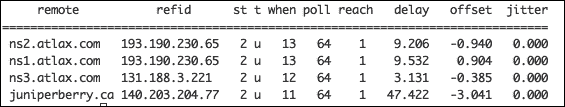
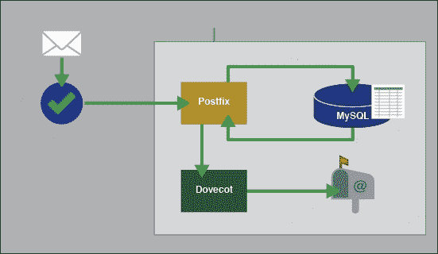

# 第四章。带有后缀的邮件服务器

如今，许多人已经在使用配置好的可靠的基于网络的邮件服务，如 Gmail、雅虎等。这些人中的大多数都质疑在他们的服务器环境中安装本地电子邮件服务器的必要性。嗯，服务器也需要发送电子邮件，不仅仅是人类；它对于许多其他需求也很有用，尤其是在通知管理员服务器是否处于紧急状态时。

**Postfix** 是 Linux 系统的高性能开源 **邮件传输代理** ( **MTA** )。它快速、易于管理且安全。它有助于路由和传递电子邮件。Postfix 支持加密和虚拟域，其配置文件清晰，易于理解和编辑。

后缀的安装将分为多个部分。由于这一章是关于使用 Postfix 设置电子邮件服务器，并添加一些工具使其完全合格，然后保护它，我们将一步一步地进行安装，每次添加新工具或新调整时，我们都将把它扩展到不同的章节部分。

在本章中，我们将学习以下内容:

*   使用 CentOS 7 Linux 设置和配置 Postfix 电子邮件服务器
*   将其配置为在 MySQL 数据库中存储用户和虚拟域
*   设置一个邮件工具(Dovecot)来获取电子邮件
*   配置 OpenLDAP 活动目录
*   使用 SSL/TLS 保护两种邮件服务

# 设置和配置后缀邮件服务器

众所周知，后缀作为一个 MTA，作为一个 SMTP 服务器。它接受传入的邮件，并将其传递给负责检索邮件的服务。然后，它将发出的邮件转发给下一个负责的 SMTP 服务器。对于 SMTP 服务，我们需要在系统的防火墙中打开端口 25/TCP。后缀很容易设置和配置。我们只需要确保一些预安装步骤已经完成，以便有一个干净的设置。

首先，我们需要使用`Firewalld`，在防火墙上为邮件服务器的所有所需服务打开所需的端口。我们将要打开的端口来自以下服务:

*   **简单邮件传输协议(SMTP)**:TCP 上的 25
*   **在 TCP 上保护 SMTP (SMTPS)** : 465
*   **邮件提交代理(MSA)**:TCP 上的 587
*   **TCP 上的邮局协议 3 (POP3)** : 110
*   **在 TCP 上保护 POP3** : 995
*   **互联网消息访问协议(IMAP)**:143【TCP 上的 T2】
*   **Secure IMAP (IMAP SSL)**: 993 on TCP

    以下是如何使用 Firewalld 在系统本地防火墙中应用更改:

```sh
$ sudo firewall-cmd --permanent --add-port=25/tcp
$ sudo firewall-cmd --permanent --add-port=465/tcp
$ sudo firewall-cmd --permanent --add-port=587/tcp
$ sudo firewall-cmd --permanent --add-port=995/tcp
$ sudo firewall-cmd --permanent --add-port=993/tcp
$ sudo firewall-cmd --permanent --add-port=143/tcp
$ sudo firewall-cmd --permanent --add-port=110/tcp
$ sudo firewall-cmd --reload

```

之后，我们需要有一个服务器的准确时间，所以我们需要安装一个 **NTP** 客户端来与全球可用的许多 NTP 服务器之一同步机器时间。我们需要使用`yum`包管理器安装 NTP 客户端服务:

```sh
$ sudo yum install ntpd

```

通常，NTP 客户端在安装后，已经配置了一些默认的 NTP 服务器来与它们同步时间。但是如果我们有一个本地的 NTP 服务器，我们想使用它，我们总是可以去 NTP 的配置文件并添加它。作为最佳实践，建议始终至少有三个 NTP 服务器:

```sh
$ sudo nano /etc/ntp.conf

```

我们寻找以`server`开头的行，对不需要的服务器进行注释，并添加我们想要的服务器(在下面的代码片段中显示为`LOCAL_NTP_SERVER_IP_ADDRESS`):

```sh
#server 0.centos.pool.ntp.org iburst
server LOCAL_NTP_SERVER_IP_ADDRESS iburst

```

我们需要启动 NTP 服务，并将其添加到系统启动服务中:

```sh
$ sudo systemctl start ntpd
$ sudo systemctl enable ntpd

```

要验证 NTP 客户端是否正在与定义的服务器同步，我们需要使用命令`ntpq -p`。让我们看看下面的输出:



在使我们的服务器时间准确后，我们需要确保我们的服务器的主机名配置良好，因为国外邮件服务器可能由于其可疑的名称而不接受来自我们服务器的邮件。我们可以使用以下命令验证这一点:

```sh
$ hostname -f

```

如果我们收到一个完全合格的域名`server.domain`，我们可以继续，其中`server`是我们服务器的主机名，`domain`是它所属的域名。否则，我们需要通过编辑主机名配置文件来设置一个:

```sh
$ sudo nano /etc/hosts
$ sudo nano /etc/hostname

```

或者您也可以使用以下命令:

```sh
$ sudo hostnamectl set-hostname

```

我们应该确保写一个写得很好的域名地址。然后我们保存文件。

最后，我们需要检查我们的域名解析。我们的服务器应该使用完全合格的域名系统，这意味着它可以解析来自网络各地的地址。我们需要检查`/etc/resov.conf`文件:

```sh
$ sudo cat /etc/resolv.conf

```

如果我们不确定配置的 DNS 服务器是否很好地更新以处理我们的所有查询，我们可以编辑文件并添加一些我们确定合格的 DNS 服务器(谷歌 DNS: `8.8.8.8`、`8.8.4.4`)。我们可以使用`nslookup`命令测试我们的域名系统服务器:

```sh
$ sudo nano /etc/resolv.conf

```

我们现在准备在我们的服务器上安装 Postfix。正如我们之前提到的，安装和配置将继续为每个部分添加和配置相同的服务器。

在本节中，我们将从安装和配置我们的后缀作为 SMTP 服务器开始。首先，我们需要使用`yum`安装`postfix`包。我们需要为接下来的部分做计划。由于`yum`包管理器中默认版本的 Postfix 不支持**Mariadb**(MySQL 的插件替代)，我们需要从 **CentOSPlus 存储库**安装 Postfix。就在开始安装之前，我们需要给一些存储库添加一个排除项，以防止覆盖 Postfix 包更新:

```sh
$ sudo nano /etc/yum.repos.d/CentOS-Base.repo

```

然后我们需要确保将行`exclude=postfix`添加到`[base]`的末尾，并且`[updates]`存储库源如下所示:

```sh
[base]
name=CentOS-$releasever - Base
exclude=postfix

#released updates
[updates]
name=CentOS-$releasever - Updates
exclude=postfix
```

保存文件后，我们可以开始软件包安装。我们将安装必要的软件包，以拥有一个功能齐全的邮件服务器:Postfix 作为 SMTP 的 MTA 邮件服务器，Dovecot 为 IMAP 服务，POP 守护程序和一些用于身份验证服务的支持软件包:

```sh
$ sudo yum --enablerepo=centosplus install postfix
$ sudo yum install dovecot mariadb-server dovecot-mysql

```

在这里，我们将合并工具的安装，但是配置将被分成本章的每一节。

安装完 Postfix 邮件服务器后，我们就可以开始配置了。Postfix 几乎所有的选项要么是注释的，要么是不完全适用的。因此，要完全配置 Postfix，我们需要转到它的主配置文件并进行一些更改。首先，我们使用任何文本编辑器打开文件:

```sh
$ sudo nano /etc/postfix/main.cf

```

然后，我们开始更改未注释的行，并添加关于所需邮件服务器的信息。因为我们将在一个大文件中进行许多单独的更改，所以我们不应该添加任何不必要的行，因为我们将一次指向我们应该更改的行。在任何时候，如果我们使用 **nano** 作为文本编辑器，我们总是可以使用搜索选项，通过组合使用 *Ctrl* + *W* 并键入行的第一部分来查找所需的行。

接下来，我们需要定义我们的邮件服务器主机名。我们转到选项`myhostname`的行，取消对该行的注释，并用所需的信息对其进行更改，如下例所示:

```sh
myhostname = server.packt.co.uk
```

然后，我们需要在选项`mydomain`的行设置域名，如下例所示:

```sh
mydomain = packt.co.uk
```

接下来是原点，与域的值相同，位于选项`myorigin`的行:

```sh
myorigin = $mydomain
```

然后我们定义我们的服务器将向哪个网络接口提供服务(监听)。在我们的例子中，我们将使用所有的。要设置它，我们要么注释行`116`和取消注释行`113`，要么将行`116`更改为以下代码:

```sh
inet_interfaces = all
```

然后我们移动到选项`mydestination`的行，将域地址添加到目的域的行尾:

```sh
mydestination = $myhostname, localhost.$mydomain, localhost, $mydomain
```

然后，我们跳转到选项`mynetworks`的行，取消对它的注释，并添加我们将用于与服务器相关的网络的其他网络:

```sh
mynetworks = 127.0.0.0/8, 192.168.8.0/24, 10.0.1.0/24
```

然后，我们跳转到选项`home_mailbox`的行，取消邮箱文件夹位置选项的注释，并将其更改为适合我们需要的内容:

```sh
home_mailbox = maildir/
```

我们通过转到选项`smtpd_banner`的行来结束行计数，取消注释并将其更改为如下代码:

```sh
smtpd_banner = $myhostname ESMTP
```

然后我们转到文件的末尾，添加以下几行，并限制服务器处理的电子邮件大小(10 兆字节= 10485760):

```sh
message_size_limit = 10485760
```

此外，我们需要限制邮箱文件夹的大小(= 1073741824):

```sh
mailbox_size_limit = 1073741824
```

最后，我们设置了 SMTP 服务器身份验证配置选项行:

```sh
smtpd_sasl_type = dovecot
smtpd_sasl_path = private/auth
smtpd_sasl_auth_enable = yes
smtpd_sasl_security_options = noanonymous
broken_sasl_auth_clients = yes
smtpd_sasl_local_domain = $myhostname
smtpd_recipient_restrictions = permit_mynetworks,permit_auth_destination,permit_sasl_authenticated,reject
```

这种配置被认为是初始配置。设置好之后，我们总是可以使用`postconf -e`命令来改变一个选项或者设置一个新的选项。如果我们需要更改服务器主机名，我们需要按如下方式编写:

```sh
$ sudo postconf -e 'myhostname = mailserver.packt.co.uk'

```

在确定所有配置都设置好之后，我们可以启动我们的 Postfix 服务，并将其添加到系统启动服务中:

```sh
$ sudo systemctl restart postfix
$ sudo systemctl enable postfix

```

只是为了验证一切正常，我们需要对 Postfix 服务做一个小测试。做这个测试有很多方法。我们将继续使用命令`mail`发送邮件，然后验证位于`/var/log/maillog`的邮件日志文件的传统方式:

```sh
$ echo "Testing the Postfix mail service" | mail -s "This is a test mail" user2@server.packt.co.uk && tail -f /var/log/maillog

```

然后，我们应该在邮件日志文件中看到以下消息，它告诉我们以下消息，以知道邮件已经发送正常，并且 Postfix 服务工作正常:

```sh
server postfix/local[28480]: 98E2F61B6365: to=<user2@server.packt.co.uk>, relay=local, delay=0.02, delays=0.01/0/0/0, dsn=2.0.0, status=sent (delivered to maildir)

```

通过这一步，我们可以说我们已经成功地将 Postfix 配置为 MTA。但这可能不是一个设置良好的邮件服务器。我们需要添加和配置一些工具来帮助使它合格和安全。在接下来的部分中，我们将开始添加和配置必要的工具。这就是我们的邮件服务器安装并运行所有 it 组件后的样子:


# 为虚拟域和用户设置马里亚数据库

由于我们已经在后缀安装期间安装了**马里亚数据库**(MySQL 的嵌入式替代)，我们可以继续进行配置。但是如果我们需要重新安装包，我们总是可以使用`yum`:

```sh
$ sudo yum install mariadb-server

```

启动 MariaDB 配置要做的第一件事是启动服务。此外，我们需要将其添加到系统启动服务中:

```sh
$ sudo systemctl enable mariadb.service
$ sudo systemctl start mariadb.service

```

然后，我们通过设置安全安装模式开始配置，在该模式下，我们可以设置或更改 MariaDB 根密码、删除匿名用户帐户、禁用本地主机之外的根登录，等等:

```sh
$ sudo mysql_secure_installation

```

我们应该确保在最后回答是以完成配置。

现在，我们已经很好地配置了 MariaDB 服务，并且可以使用了。我们将开始建立新的数据库，与 Postfix 一起使用。要添加新数据库，我们需要打开 MariaDB Shell:

```sh
$ sudo mysql -u root -p

```

然后我们创建一个新的数据库:

```sh
> CREATE DATABASE mail;

```

接下来，我们切换到该数据库，开始对其进行更改:

```sh
> USE mail;

```

然后，我们创建一个数据库用户作为邮件管理员，授予他们邮件数据库的权限:

```sh
> GRANT SELECT, INSERT, UPDATE, DELETE ON mail.* TO 'mail_admin'@'localhost' IDENTIFIED BY 'mail_admin_password';
> GRANT SELECT, INSERT, UPDATE, DELETE ON mail.* TO 'mail_admin'@'localhost.localdomain' IDENTIFIED BY 'mail_admin_password';

```

管理员密码`mail_admin_password`应该是非常强的密码，以便更好地保护邮件服务器数据库。

然后我们提交更改:

```sh
> FLUSH PRIVILEGES;

```

现在我们开始在数据库中创建必要的表。首先，我们创建虚拟域表:

```sh
> CREATE TABLE domains (domain varchar(50) NOT NULL, PRIMARY KEY (domain) );

```

然后我们创建处理邮件转发的表:

```sh
> CREATE TABLE forwardings (source varchar(80) NOT NULL, destination TEXT NOT NULL, PRIMARY KEY (source) );

```

接下来，我们创建一个表来存储邮件服务器用户:

```sh
> CREATE TABLE users (email varchar(80) NOT NULL, password varchar(20) NOT NULL, PRIMARY KEY (email) );

```

最后，我们创建传输表:

```sh
> CREATE TABLE transport ( domain varchar(128) NOT NULL default '', transport varchar(128) NOT NULL default '', UNIQUE KEY domain (domain) );

```

我们已经成功地设置了邮件服务器数据库表的初始配置。我们现在可以离开马里亚数据库Shell:

```sh
> quit

```

为了使 Postfix 能够与 MariaDB 服务器通信，我们需要设置 MariaDB 来监听 IP 地址`127.0.0.1`处的本地主机。要设置此配置，我们需要编辑`/etc/my.cnf`并添加以下部分`[mysql]`:

```sh
bind-address=127.0.0.1
```

然后我们重新启动 MariaDB 服务:

```sh
$ sudo systemctl restart mariadb.service

```

我们还没有完成邮件服务器数据库的配置。现在我们回到 Postfix 配置，在 MariaDB 中设置与数据库的通信，该数据库之前创建了代码。所以我们需要告诉 Postfix 它应该使用哪个数据库的哪个表来存储特定的信息(用户、虚拟域等等)。

我们首先为每个表创建配置文件。对于虚拟的域配置，我们正在创建一个名为`/etc/postfix/mysql-virtual_domains.cf`的文件:

```sh
$ sudo nano /etc/postfix/mysql-virtual_domains.cf

```

然后我们将以下代码放入其中并保存:

```sh
user = mail_admin
password = mail_admin_password
dbname = mail
query = SELECT domain AS virtual FROM domains WHERE domain='%s'
hosts = 127.0.0.1
```

还是那句话`mail_admin_password`应该换成我们之前创造的强者。这适用于我们将要创建的以下所有文件。

然后我们在`/etc/postfix/mysql-virtual_forwardings.cf`为虚拟转发创建配置文件:

```sh
$ sudo nano /etc/postfix/mysql-virtual_forwardings.cf

```

我们在其中添加了以下代码:

```sh
user = mail_admin
password = mail_admin_password
dbname = mail
query = SELECT destination FROM forwardings WHERE source='%s'
hosts = 127.0.0.1
```

我们为名为`/etc/postfix/mysql-virtual_mailboxes.cf`的虚拟邮箱创建了另一个配置文件:

```sh
$ sudo nano /etc/postfix/mysql-virtual_mailboxes.cf

```

我们插入以下代码:

```sh
user = mail_admin
password = mail_admin_password
dbname = mail
query = SELECT CONCAT(SUBSTRING_INDEX(email,'@',-1),'/',SUBSTRING_INDEX(email,'@',1),'/') FROM users WHERE email='%s'
hosts = 127.0.0.1
```

最后，我们通过创建文件`/etc/postfix/mysql-virtual_email2email.cf`，对虚拟电子邮件映射进行同样的操作:

```sh
$ sudo nano /etc/postfix/ mysql-virtual_email2email.cf

```

然后在其中添加以下代码并保存:

```sh
user = mail_admin
password = mail_admin_password
dbname = mail
query = SELECT email FROM users WHERE email='%s'
hosts = 127.0.0.1
```

现在我们设置文件的权限和所有权，使后缀能够处理新的配置文件:

```sh
$ sudo chmod o= /etc/postfix/mysql-virtual_*.cf
$ sudo chgrp postfix /etc/postfix/mysql-virtual_*.cf

```

然后我们为邮件处理创建一个用户和组。虚拟邮箱将全部存储在此用户主目录下。我们选择 5000 组是为了与系统为普通用户创建的组保持距离:

```sh
$ sudo groupadd -g 5000 vmail
$ sudo useradd -g vmail -u 5000 vmail -d /home/vmail -m

```

为了完成配置，我们需要对 Postfix 配置进行一些小的更改。我们不会打开配置文件并编辑它，我们只会使用命令`postconf -e`添加它们。

我们首先找到为处理数据库表而创建的新配置文件:

```sh
$ sudo postconf -e 'virtual_alias_domains ='
$ sudo postconf -e 'virtual_alias_maps = proxy:mysql:/etc/postfix/mysql-virtual_forwardings.cf, mysql:/etc/postfix/mysql-virtual_email2email.cf'
$ sudo postconf -e 'virtual_mailbox_domains = proxy:mysql:/etc/postfix/mysql-virtual_domains.cf'
$ sudo postconf -e 'virtual_mailbox_maps = proxy:mysql:/etc/postfix/mysql-virtual_mailboxes.cf'

```

然后我们设置邮箱文件夹的创建位置:

```sh
$ sudo postconf -e 'virtual_mailbox_base = /home/vmail'

```

最后，我们看到将控制配置文件并添加邮箱文件夹的用户 UID:

```sh
$ sudo postconf -e 'virtual_uid_maps = static:5000'
$ sudo postconf -e 'virtual_gid_maps = static:5000'

```

要完成邮件服务器数据库配置，我们需要重新启动 Postfix 服务来提交更改:

```sh
$ sudo systemctl restart postfix.service

```

我们可以说已经完成了我们的邮件服务器数据库服务。尽管如此，如果我们需要用虚拟域配置 Postfix 以使用不同于系统默认域名的域名发送电子邮件，我们需要对 Postfix 主配置文件进行一些小的修改。此外，我们可以随时使用命令`postconf -e`进行快速更改:

```sh
$ sudo nano /etc/postfix/main.cf

```

然后我们在文件末尾添加以下代码:

```sh
virtual_alias_domains = packtmail2.co.uk
virtual_alias_maps = hash:/etc/postfix/virtual
```

然后我们需要将新的域添加到虚拟域文件中，`/etc/postfix/virtual`:

```sh
$ sudo nano /etc/postfix/virtual

```

然后我们在任何地方添加以下代码片段:

```sh
user1@mail.packtmail2.co.uk user1
```

然后，我们通过刷新 Postfix 映射并重新启动服务来应用更改:

```sh
$ sudo postmap /etc/postfix/virtual
$ sudo systemctl reload postfix

```

# 设置邮件工具(Dovecot)来检索邮件

正如我们之前所说的， **Dovecot** 是一个开源的 **IMAP** 和 **POP3** 服务器。设置和配置快速简单，占用内存很少。对于这一部分，我们将安装它以与 Postfix 一起作为 **MDA** (POP/IMAP 服务)工作，并在邮件服务器 POP/IMAP 服务上筛选邮件进行分类。如图所示，Dovocot 位于用户邮箱和 Postfix 之间:



由于我们已经安装了鸽笼，我们现在只需要将其配置为与 Postfix 一起工作。如果我们错过了安装，我们可以随时使用`yum`包管理器重新安装:

```sh
$ sudo yum install dovecot

```

然后，我们需要在 Postfix 配置文件中添加 Dovecot 支持。同样，我们不会去编辑文件；我们将只使用命令`postconf -e`。首先，我们需要启用 Dovecot 来使用 SMTP 并启用服务身份验证:

```sh
$ sudo postconf -e 'smtpd_sasl_type = dovecot'
$ sudo postconf -e 'smtpd_sasl_path = private/auth'
$ sudo postconf -e 'smtpd_sasl_auth_enable = yes'
$ sudo postconf -e 'broken_sasl_auth_clients = yes'
$ sudo postconf -e 'smtpd_sasl_authenticated_header = yes'

```

然后，如果需要，我们启用 Postfix 来创建和扩展邮件目录:

```sh
$ sudo postconf -e 'virtual_create_maildirsize = yes'
$ sudo postconf -e 'virtual_maildir_extended = yes'

```

最后，我们设置邮件传输参数:

```sh
$ sudo postconf -e 'proxy_read_maps = $local_recipient_maps $mydestination $virtual_alias_maps $virtual_alias_domains $virtual_mailbox_maps $virtual_mailbox_domains $relay_recipient_maps $relay_domains $canonical_maps $sender_canonical_maps $recipient_canonical_maps $relocated_maps $transport_maps $mynetworks $virtual_mailbox_limit_maps'
$ sudo postconf -e 'virtual_transport = dovecot'
$ sudo postconf -e 'dovecot_destination_recipient_limit = 1'

```

在本节中，我们将使用 Dovecot 提供的默认安全选项，因此我们需要告诉 Postfix 使用 Dovecot 提供的 SSL 证书和密钥:

```sh
$ sudo postconf -e 'smtpd_use_tls = yes'
$ sudo postconf -e 'smtpd_tls_cert_file = /etc/pki/dovecot/certs/dovecot.pem'
$ sudo postconf -e 'smtpd_tls_key_file = /etc/pki/dovecot/private/dovecot.pem'

```

然后我们转到 Postfix 的服务配置文件，`/etc/postfix/master.cf`:

```sh
$ sudo nano /etc/postfix/master.cf

```

将 Dovecot 服务添加到文件底部，然后保存并退出:

```sh
dovecot   unix  -       n       n       -       -       pipe
 flags=DRhu user=vmail:vmail argv=/usr/libexec/dovecot/deliver -f ${sender} -d ${recipient}

```

然后我们转到鸽舍服务配置。在开始配置之前，我们需要备份初始配置文件的副本:

```sh
$ sudo cp /etc/dovecot/dovecot.conf /etc/dovecot/dovecot.conf-backup

```

对于这个例子，我们将创建我们自己的新配置文件，在这里我们将逐一指定每个参数。我们将创建一个与原始配置文件同名的新文件:

```sh
$ sudo nano /etc/dovecot/dovecot.conf

```

然后我们添加以下没有描述的代码:

```sh
# We define the protocols that we want to be serving
protocols = imap pop3
# Enable Dovecot to listen to all domains
listen = *
# Define the time format to be shown at the log file
log_timestamp = "%Y-%m-%d %H:%M:%S "
# Define the location of the received mails
mail_location = maildir:/home/vmail/%d/%n/Maildir
# Locate the files to be used for the SSL authentication
ssl_cert = /etc/pki/dovecot/certs/dovecot.pem
ssl_key = /etc/pki/dovecot/private/dovecot.pem

# Define Mailbox main domain setting
namespace {
    type = private
    separator = .
    prefix = INBOX.
    inbox = yes
}

# Define the service users option 
service auth {
    unix_listener auth-master {
        mode = 0600
        user = vmail
    }

    unix_listener /var/spool/postfix/private/auth {
        mode = 0666
        user = postfix
        group = postfix
    }

user = root
}

service auth-worker {
    user = root
}
# Configure the protocol LDA
protocol lda {
    log_path = /home/vmail/dovecot-deliver.log
    auth_socket_path = /var/run/dovecot/auth-master
    postmaster_address = postmaster@packt.co.uk
}
# Configure the protocol POP3
protocol pop3 {
    pop3_uidl_format = %08Xu%08Xv
}
# Database configuration
passdb {
    driver = sql
    args = /etc/dovecot/dovecot-sql.conf.ext
}

userdb {
    driver = static
    args = uid=5000 gid=5000 home=/home/vmail/%d/%n allow_all_users=yes
}
```

我们保存文件以保存配置。然后我们需要创建已经分配给 Dovecot 配置文件的数据库文件:

```sh
$ sudo nano /etc/dovecot/dovecot-sql.conf.ext

```

然后我们添加以下代码，将邮件管理员密码`mail_admin_password`更改为我们在前面设置 MariaDB 数据库的部分中已经设置的密码:

```sh
driver = mysql
connect = host=127.0.0.1 dbname=mail user=mail_admin password=mail_admin_password
default_pass_scheme = CRYPT
password_query = SELECT email as user, password FROM users WHERE email='%u';
```

然后，我们安排文件权限和所有权来限制对文件的访问:

```sh
$ sudo chgrp dovecot /etc/dovecot/dovecot-sql.conf.ext
$ sudo chmod o= /etc/dovecot/dovecot-sql.conf.ext

```

然后我们转到配置位于其配置文件夹`/etc/dovecot/conf.d/`中的 Dovecot 身份验证参数。我们从身份验证过程配置文件开始:

```sh
$ sudo nano /etc/dovecot/conf.d/10-auth.conf

```

我们需要定位并更改以下行:

```sh
# Line 10: needs to uncommented and changed
disable_plaintext_auth = no

# Line 100: We need to add it login at the end
auth_mechanisms = plain login 
```

然后我们转到邮箱配置文件:

```sh
$ sudo nano /etc/dovecot/conf.d/10-mail.conf

```

然后取消对下面一行的注释，并更改其结尾以匹配下面的代码:

```sh
# Line 30: Define the mailbox directory location
mail_location = maildir:~/maildir
```

同样，我们需要编辑主配置文件来定义将使用 SMTP 身份验证的后缀用户:

```sh
$ sudo nano /etc/dovecot/conf.d/10-master.conf

```

然后取消`unix_listener /var/spool/postfix/private/auth`部分的注释，并将其添加到用户和组行:

```sh
# Line 96-100: Set the user and group for the Unix listener section
unix_listener /var/spool/postfix/private/auth {
    mode = 0666
    user = postfix 
    group = postfix 
}
```

最后，我们配置 SSL 身份验证配置文件:

```sh
$ sudo nano /etc/dovecot/conf.d/10-ssl.conf

```

我们将 SSL 选项从`no`更改为`yes`:

```sh
# Line 8: change it yes
ssl = yes
```

在开始测试之前，我们需要确保我们已经在`/etc/aliases`配置文件中定义了两个变量:

```sh
$ sudo nano /etc/aliases

```

然后我们检查以下代码:

```sh
postmaster: root
root: postmaster@packt.co.uk
```

然后我们更新别名列表:

```sh
$ sudo newaliases

```

为了完成 Dovecot 配置，我们需要重新启动 Postfix 和 Dovecot 服务。此外，我们需要向系统启动服务中添加 Dovecot:

```sh
$ sudo systemctl restart postfix.service
$ sudo systemctl restart dovecot.service
$ sudo systemctl enable dovecot.service

```

要验证服务运行良好并且配置文件没有问题，我们需要检查邮件日志文件:

```sh
$ sudo tail /var/log/maillog

```

我们应该看到类似以下代码的内容，以了解 Dovecot 运行良好:

```sh
dovecot: master: Dovecot v2.2.10 starting up for imap, pop3 (core dumps disabled)

```

### 注

有时，SELinux 阻止 Dovecot 使用系统资源，因此我们需要授予 Dovecot 对系统资源的访问权限，或者如果我们有保护服务器的替代方法，我们可以禁用 SELinux 或将其设置为许可。

在这一点上，我们的邮件服务器完全有资格作为一个发送者和接收者工作，具有组织良好的数据库和中等安全级别。我们可以开始测试我们的邮件服务器。

首先，我们将使用 **Telnet** 服务检查 **Postfix SMTP-AUTH** 和 **TLS** 是否正常工作。我们需要安装远程登录，如果系统上不存在远程登录，运行以下命令:

```sh
$ sudo yum install telnet

```

然后我们运行测试:

```sh
$ telnet localhost 25

```

远程登录将连接，我们将看到远程登录Shell，我们在里面键入以下命令:

```sh
> ehlo localhost

```

要知道我们的测试是阳性的，我们需要看到以下信息:

```sh
250-server.packt.co.uk
250-PIPELINING
250-SIZE 10485760
250-VRFY
250-ETRN
250-STARTTLS
250-AUTH PLAIN
250-AUTH=PLAIN
250-ENHANCEDSTATUSCODES
250-8BITMIME
250 DSN

```

然后我们退出远程登录Shell:

```sh
> quit

```

现在我们将测试邮件服务。为此，我们需要首先用测试域和用户填充我们的数据库。首先，我们进入 MariaDB 数据库Shell:

```sh
$ sudo mysql -u root -p

```

然后我们切换到邮件数据库:

```sh
> USE mail;

```

然后，我们在“域”表中创建新的域:

```sh
> INSERT INTO domains (domain) VALUES ('packtmail.co.uk');

```

我们向该域添加一个新用户。我们需要为以后的真实用户输入一个好的密码:

```sh
> INSERT INTO users (email, password) VALUES ('user1@packtmail.co.uk', ENCRYPT('user_password'));

```

然后我们退出 MariaDB Shell。

现在我们需要向新创建的用户发送一封测试邮件。我们需要使用 **Mailx** ，所以如果我们没有安装它，我们需要在测试之前安装它:

```sh
$ sudo yum install mailx

```

然后我们发送测试邮件:

```sh
$ mailx user1@packtmail.co.uk

```

我们需要放`Subject`然后按*进入*。如果我们需要插入复制的地址，我们需要写`Cc:`然后添加复制的地址。然后我们输入信息并按*进入*，然后要发送它，我们需要把`.`放在最后并按*进入*。

要检查邮件是否已经发送，我们转到邮件日志文件；

```sh
$ sudo tail /var/log/maillog

```

那么我们应该看到类似下面的代码，知道就可以了:

```sh
to=<user1@packtmail.co.uk>, relay=dovecot, delay=0.11, delays=0.07/0.01/0/0.03, dsn=2.0.0, status=sent (delivered via dovecot service) 

```

现在，我们通过可视化鸽舍交付日志来检查鸽舍交付:

```sh
$ sudo tail /home/vmail/dovecot-deliver.log

```

我们应该看到类似下面这一行的内容，以确保它是有效的:

```sh
lda(user1@packtmail.co.uk): Info: msgid=<20150822073408.6537761B3936@server.packt.co.uk>: saved mail to INBOX

```

现在我们可以通过邮件客户端测试我们的邮箱了。对于这个例子，我们将使用 **Mutt** ，这是一个简单的邮件客户端。但是在使用之前，我们需要先安装它:

```sh
$ sudo yum install mutt

```

然后我们需要转到存储新用户邮箱的位置并运行 Mutt:

```sh
$ sudo cd /home/vmail/packtmail.co.uk/user1/Maildir/

```

现在我们运行马特:

```sh
$ sudo mutt –f .

```

显示我们需要创建根邮箱的消息不是必需的，因此我们可以跳过它。并退出 Mutt 类型`q`。

然后我们将有一个相当清晰的界面，在那里我们可以使用键盘方向导航，并按下*进入*查看邮件中的内容。为了确认我们的邮件服务器配置良好并且正在运行，我们应该看到我们使用 Mailx 发送的测试邮件:


# 使用后缀配置 OpenLDAP 活动目录

在这一节中，我们将使用 OpenLDAP 作为我们的 Postfix(作为 MTA)和 Dovecot(作为 POP3/IMAP 服务器)用户的后端，以便他们能够相互连接，并帮助进行地址查找和别名。

### 注

OpenLDAP 是 **轻量级目录访问协议** ( **LDAP** )的开源实现。本节不包括如何安装 OpenLDAP 服务器。我们将假设我们的网络中已经配置了一个。

我们的 OpenLDAP 服务器有以下信息:

```sh
dn: uid=user,ou=people,dc=packtldap,dc=co,dc=uk
objectClass: posixAccount
objectClass: inetOrgPerson
uid: user1
homeDirectory: /home/user1
userPassword: <passwordhash>
```

对于我们两个服务的 LDAP 设置的配置，我们需要编辑一些选项并添加到它们的配置文件中。我们将从多维特科特开始。我们将首先用文本编辑器打开 Dovecot 主配置文件，然后进行必要的更改:

```sh
$ sudo nano /etc/dovecot/dovecot.conf

```

然后我们检查以下选项是否需要任何更改，或者如果它们不存在，我们需要添加它们:

```sh
# Define the mail user and group UID and GID
mail_uid = 5000
mail_gid = 5000
# Define the default Authentication method
auth default {
  mechanisms = plain
  # Define the LDAP database password file
  passdb ldap {
          args = /etc/dovecot/dovecot-ldap.pass
  }
  # Define the LDAP database user file
  userdb ldap {
          args = /etc/dovecot/dovecot-ldap.user
  }

  # Define the socket Listening parameters 
  socket listen {
        client {
          path = /var/spool/postfix/private/auth
          mode = 0660
          user = postfix
          group = postfix
  }
}
```

然后，我们需要创建 LDAP 数据库文件并填充它们:

```sh
$ sudo nano /etc/dovecot/dovecot-ldap.user

```

接下来，我们添加以下带有必要更改的代码，然后保存:

```sh
hosts = packtldap.co.uk:389
sasl_bind = no
auth_bind = yes
ldap_version = 3
deref = never
base = uid=%n,ou=people,dc=packtldap,dc=co,dc=uk
scope = base
user_attrs = homeDirectory=home
dn = uid=manager,dc=packtldap,dc=co,dc=uk
dnpass = password
```

下图显示，OpenLDAP 同时为收件箱和发件箱邮件服务:


我们对第二个 LDAP 数据库文件做同样的事情:

```sh
$ sudo nano /etc/dovecot/dovecot-ldap.pass

```

然后，我们添加带有必要更改的以下代码，保存文件，并退出:

```sh
hosts = packtldap.co.uk:389
sasl_bind = no
auth_bind = yes
ldap_version = 3
deref = never
base = uid=%n,ou=people,dc=packtldap,dc=co,dc=uk
scope = base
dn = uid=manager,dc=packtldap,dc=co,dc=uk
dnpass = password
```

通过这一步，我们可以说 Dovecote 已经成功配置为使用我们的 LDAP 服务器。我们进入后缀配置。像往常一样，我们可以使用文本编辑器编辑主配置文件`/etc/postfix/main.cf`，或者我们可以只使用快速配置设置命令:

```sh
$ sudo postconf -e 'accounts_server_host = packtldap.co.uk'
$ sudo postconf -e 'accounts_search_base = ou=people,dc=packtldap,dc=co,dc=uk'
$ sudo postconf -e 'accounts_query_filter = (&(objectClass=inetOrgPerson)(mail=%s))'
$ sudo postconf -e 'accounts_result_attribute = homeDirectory'
$ sudo postconf -e 'accounts_result_format  =  %s/Mailbox'
$ sudo postconf -e 'accounts_scope = sub'
$ sudo postconf -e 'accounts_cache = yes'
$ sudo postconf -e 'accounts_bind = yes'
$ sudo postconf -e 'accounts_bind_dn = uid=manager,dc=packtldap,dc=co,dc=uk'
$ sudo postconf -e 'accounts_bind_pw = password'
$ sudo postconf -e 'accounts_version = 3'
$ sudo postconf -e 'virtual_transport = virtual'
$ sudo postconf -e 'virtual_uid_maps = static:5000'
$ sudo postconf -e 'virtual_gid_maps = static:5000'
$ sudo postconf -e 'virtual_mailbox_base = /'
$ sudo postconf -e 'virtual_mailbox_maps = ldap:accounts'
$ sudo postconf -e 'virtual_mailbox_domains = packtldap.co.uk'

```

然后要提交变更，我们需要重启两个服务:

```sh
$ sudo systemctl restart postfix.service
$ sudo systemctl restart dovecot.service

```

# 使用 SSL/TLS 保护邮件服务器

Postfix 的 SSL/TLS 加密为我们的邮件服务器提供了能力，不仅可以验证远程 SMTP 服务器，还可以加密我们在服务器和接收方服务器之间发送的电子邮件。

要配置 SSL 来加密连接，我们首先需要创建自己的个性化和特定的 SSL 证书。

我们需要转到 TLS 证书目录来创建我们的新证书:

```sh
$ cd /etc/pki/tls/certs/

```

然后我们创建第一个密钥文件:

```sh
$ sudo openssl genrsa -des3 -out mailserver.key 2048

```

然后，该工具会要求输入密码。当工具要求我们这样做时，我们应该给一些强有力的东西，并重新键入它。

之后我们需要开始使用 OpenSSL 工具；因此，如果没有安装，我们需要先安装它:

```sh
$ sudo yum install openssl

```

然后我们使用 OpenSSL 来编写 RSA 密钥:

```sh
$ sudo openssl rsa -in server.key -out server.key

```

然后写入已经定义的密码，并继续生成密钥。

现在我们继续创建证书。在同一个文件夹中，我们运行以下命令:

```sh
$ sudo make mailserver.csr

```

然后我们按照每个字段的要求填写信息:**国家名称**、**州或省名称**、**地区名称**、**组织名称**、**组织单位名称**、**通用名称**、**电子邮件地址**，对于最后两个条目(挑战密码和可选的公司名称)，我们可以跳过它们。

然后我们使用 OpenSSL 创建一个私钥:

```sh
$ sudo openssl x509 -in mailserver.csr -out server.crt -req -signkey mailserver.key -days 3650 –sha256

```

然后我们转到配置 Postfix 和 Dovecot 来使用 SSL/TLS 加密。

首先，我们将通过对 Postfix 的主配置文件`/etc/postfix/main.cf`进行一些修改来设置 Postfix 使用 SSL/TLS。我们总是可以使用文本编辑器来编辑文件和更改参数，或者我们可以只使用命令`postconf -e`以更快的方式设置它们。

我们将在 Postfix 配置文件中添加一些行，以保护它免受最近针对 OpenSSL 的一些攻击:

```sh
$ sudo nano "/etc/postfix/main.cf
smtpd_tls_exclude_ciphers = aNULL, eNULL, EXPORT, DES, RC4, MD5, PSK, aECDH, EDH-DSS-DES-CBC3-SHA, EDH-RSA-DES-CDC3-SHA, KRB5-DE5, CBC3-SHA
smtpd_tls_dh1024_param_file = /etc/ssl/private/dhparams.pem

smtpd_tls_mandatory_protocols = !SSLv2, !SSLv3
smtpd_tls_protocols = !SSLv2, !SSLv3
smtp_tls_mandatory_protocols = !SSLv2, !SSLv3
smtp_tls_protocols = !SSLv2, !SSLv3

```

我们创建证书文件:

```sh
$ cd /etc/ssl/private/
$ sudo openssl dhparam -out dhparams.pem 2048
$ sudo chmod 600 dhparams.pem

```

然后，我们需要确保 TLS 已启用，可以与 SMTP 一起使用:

```sh
$ sudo postconf -e 'smtpd_use_tls = yes'

```

然后我们需要重新定义证书和密钥文件的位置:

```sh
$ sudo postconf -e 'smtpd_tls_cert_file = /etc/pki/tls/certs/mailserver.crt'
$ sudo postconf -e 'smtpd_tls_key_file = /etc/pki/tls/certs/mailserver.key'

```

然后我们设置 TLS 会话数据库缓存的位置:

```sh
$ sudo postconf -e 'smtpd_tls_session_cache_database = btree:/etc/postfix/smtpd_scache'

```

以上就是主配置文件。我们现在将配置`/etc/postfix/master.cf`:

```sh
$ sudo nano /etc/postfix/master.cf

```

我们需要取消对原始文件的`16`到`35`行之间的`Submission`和`SMTPS`的一些选项的注释，如下所示:

```sh
submission     inet  n       -       n       -       -       smtpd
  -o syslog_name=postfix/submission
  -o smtpd_sasl_auth_enable=yes
  -o smtpd_recipient_restrictions=permit_sasl_authenticated,reject
  -o milter_macro_daemon_name=ORIGINATING

smtps       inet   n       -       n       -       -       smtpd
  -o syslog_name=postfix/smtps
  -o smtpd_tls_wrappermode=yes
  -o smtpd_sasl_auth_enable=yes
  -o smtpd_recipient_restrictions=permit_sasl_authenticated,reject
  -o milter_macro_daemon_name=ORIGINATING
```

我们已经完成了使用 SSL 的后缀配置。我们现在可以为 Dovecot 配置 SSL 了。我们只需要在`/etc/dovecot/conf.d/10-ssl.conf`文件中做一些修改:

```sh
$ sudo nano /etc/dovecot/conf.d/10-ssl.conf

```

首先，我们需要确保 SSL 选项已激活:

```sh
# Line8: change it to yes 
ssl = yes
```

然后我们更改 SSL 证书和密钥位置:

```sh
# Line 14, 15: change the files location to the new one
ssl_cert = </etc/pki/tls/certs/mailserver.crt
ssl_key = </etc/pki/tls/certs/mailserver.key
```

最后，我们需要重启服务来提交变更:

```sh
$ sudo systemctl restart postfix.service
$ sudo systemctl restart dovecot.service

```

# 参考文献

现在我们已经看完了这一章，让我们看一下使用的参考资料:

*   后缀主页:[www.postfix.org](http://www.postfix.org)
*   后缀 MySQL 支持:[http://www.postfix.org/MYSQL_README.html](http://www.postfix.org/MYSQL_README.html)
*   鸽舍主页概览:[http://www.dovecot.org](http://www.dovecot.org)
*   Postfix 虚拟主机概述:[http://www . akadia . com/services/postfix _ separate _ 邮箱. html](http://www.akadia.com/services/postfix_separate_mailboxes.html)
*   鸽舍配置文件:[http://wiki.dovecot.org/MainConfig](http://wiki.dovecot.org/MainConfig)
*   后缀中的 LDAP 支持:[http://www.postfix.org/LDAP_README.html](http://www.postfix.org/LDAP_README.html)
*   后缀 TLS 支持:[http://www.postfix.org/TLS_README.html](http://www.postfix.org/TLS_README.html)

# 总结

本章在逐步教程中描述了如何从使用 Postfix 发送服务 SMTP 开始设置完全合格的邮件服务器。然后，我们开始组织邮件服务器，专注于通过安全数据库服务 MariaDB 发送/接收邮件和虚拟域管理。接下来，我们了解了使用 POP3/IMAP 的邮件接收服务，该服务使用 MDA Dovecot，由服务本身提供中等级别的安全性。然后开始扩展部分，它显示了服务器何时可以连接到 LDAP 服务器，并且可以收集关于用户的有用信息，并使用它们来发送和接收邮件。最后，我们使用 OpenSSL 生成新的证书和密钥来保护服务的身份验证和要发送的电子邮件的加密，从而完成了定制的安全级别。

在下一章中，我们将学习如何在 CentOS 上设置和配置 Nagios 和 syslog-ng 等工具来监控不同的服务，并收集和处理日志。