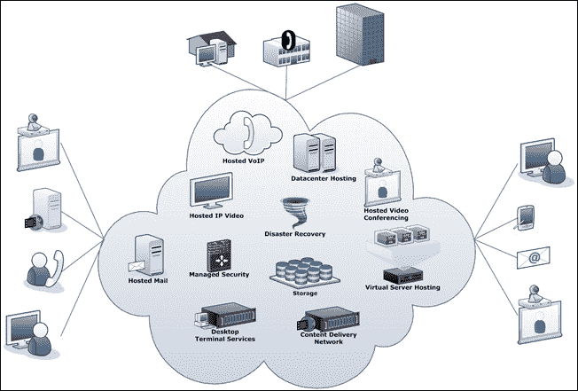
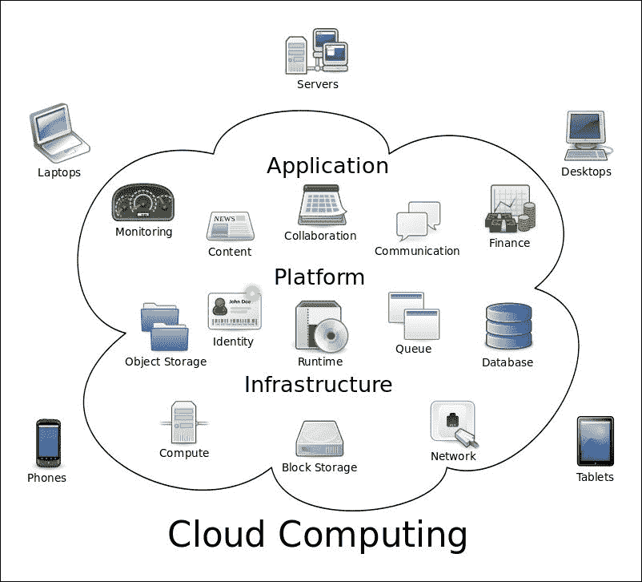
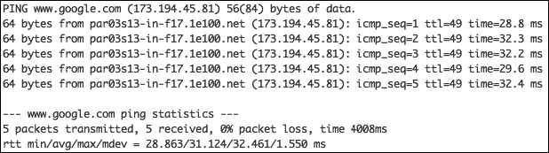
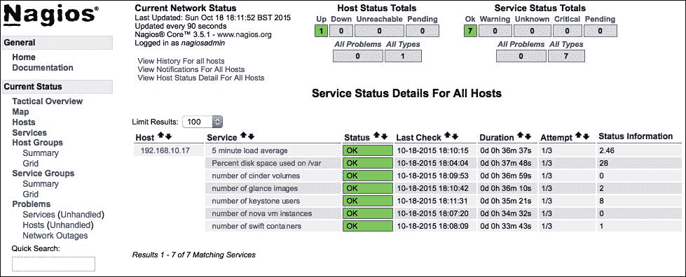
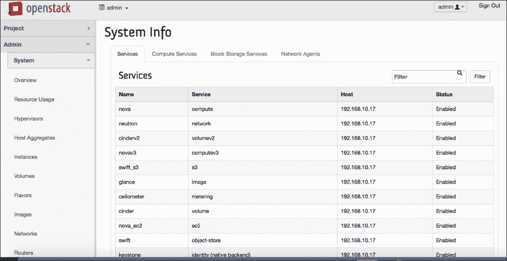
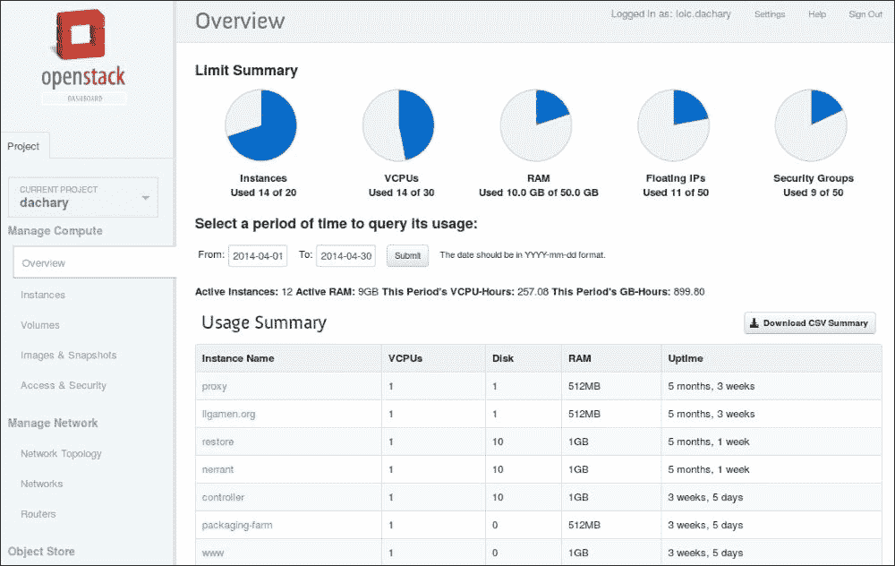
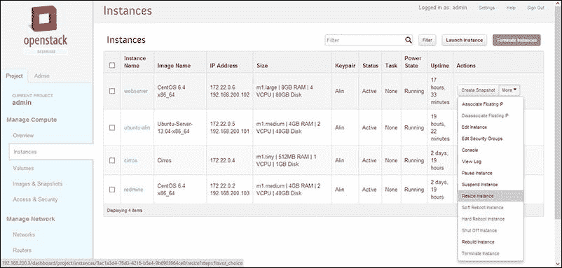

# 第七章。云计算

通过互联网提供的新一代服务被称为云计算。在计算机行业，许多组织使用云计算，因为他们不喜欢购买能够解决其资源解决方案的设备，或者雇佣管理和维护所需的人员。云计算就像一个第三方数据源，提供各种存储和处理数据的能力。

在建立云计算环境的最佳解决方案列表中，我们选择了 OpenStack。在本章中，我们将简要介绍什么是云计算，以及如何使用 OpenStack 设置单个节点。

在本章中，我们将讨论以下主题:

*   云计算概述
*   云计算服务
*   介绍 OpenStack
*   OpenStack 的组件
*   OpenStack 的安装和设置

# 云计算概述

云计算是在通常依赖本地机器的方式之外执行计算的能力。云计算依靠共享资源来处理所需的计算或处理。它与网格计算有着相同的方面，在网格计算中，两种技术都将处理能力聚集起来，以解决或处理对于独立机器(服务器或个人计算机)来说过于繁重的问题。

云计算的目标是利用高超级计算能力在面向消费者的应用程序中执行高级计算，如金融、个性化信息交付、数据存储等。

为了完成这项艰巨的任务，云计算依赖于通过极快的连接(InfiniBand (IB))连接的大量超级强大的服务器(刀片式服务器…)来分担其计算单元的工作负载。这种基础设施运行在特殊配置的系统上，在这些系统中，它们被链接在一起以简化任务。一些基础设施依赖虚拟化技术来增强其云计算。



来源:[http://networksolutionsintl.com](http://networksolutionsintl.com)

简而言之，许多公司使用云计算的最准确的原因是，它使他们能够使计算机资源看起来像一个实用程序，他们可以随着时间的推移支付费用，而无需在现场拥有真正的硬件以及在团队中管理和维护硬件的负担。此外，云计算为企业提供了许多有趣的功能，例如:

*   **弹性**:根据需要上下扩展计算资源的能力
*   **自助供应**:按需为作业提供所需资源量的能力
*   **按使用付费**:衡量用户使用的资源的能力，因此他们只能为他们使用的资源付费

随着时间的推移，云计算有了巨大的发展。然而，它始终保持主要的三板服务:

*   **软件即服务** ( **SaaS** )
*   **平台即服务** ( **PaaS** )
*   **基础设施即服务** ( **IaaS** )

## 软件即服务

SaaS 指的是在当前用户机器之外的机器上运行的每一个应用程序，其中用户可以通过他们的网络浏览器访问它的部分或全部服务，有时也可以通过一个瘦客户端应用程序访问，该应用程序只有作为演示界面工作的。SaaS 应用程序通常可以在全球范围内使用任何类型的设备(计算机、移动设备等)访问。使 SaaS 应用程序运行良好的是，它是一种可扩展的应用程序，用户可以根据需要在尽可能多的虚拟机上处理它的处理，以满足负载需求。大多数云计算基础设施使用负载平衡系统来组织虚拟机器之间的负载，其中应用程序保持运行而没有任何中断，并且执行结果更好。


来源:[http://icorees.com/](http://icorees.com/)

SaaS 的特点如下:

*   任何连接的设备都可以访问其服务
*   登录后即可使用简单的应用程序
*   其中所有内容都存储在云上，超过数百台机器，这些机器针对磁盘崩溃等灾难进行了良好配置，此外，用户数据和服务始终可用
*   应用程序的计算能力在需要时总是可扩展的

我们可以分辨出一些我们每天使用的最著名的 SaaS，比如电子邮件服务(Gmail，Yahoo…)，社交媒体和通讯工具(脸书，Skype…)。我们使用这些日常服务所需的只是一个互联网连接和一个带有网络浏览器或移动瘦客户端应用程序的设备。

## 平台即服务(PaaS)

PaaS 是一项服务，为其客户提供在基于云的环境中构建和部署应用程序的能力。当向用户提供可伸缩性时，PaaS 就像 SaaS 一样。在部署应用程序时，他们可以按需访问运行应用程序所需的资源，应用程序提供所有这些服务，而无需购买、维护和管理运行应用程序所需的硬件以及所有后勤工作。PaaS 已经得到了很好的开发，可以向客户提供预先准备好的模板，以简化平台上的初始化。


来源:[https://www.zoho.com/](https://www.zoho.com/)

我们可以区分使用 PaaS 与传统解决方案的一些主要优势，如下所示:

*   在环境已经存在的情况下，加快应用程序的开发速度，并在环境已经存在的情况下为市场营销做好准备
*   消除了管理中间件的复杂性，并简化了拥有中间件的任务
*   简化网络应用程序的部署

## 基础设施即服务(IaaS)

第三项服务是 IaaS，一种为用户提供建立完全合格基础设施所需一切的服务。IaaS 按需为服务器提供不同的特性、网络设备和存储空间。基础设施的用户拥有根据需要管理其基础设施的所有权利，以及系统和网络管理员的所有权利。这项服务为用户提供的不仅仅是基础设施，而是一组资源(小型、中型和超大型计算能力和内存)来满足工作负载需求。如前所述，用户充当系统和网络管理员，以便部署他们的应用程序。然后他们需要建立他们的网络，安装所需的操作系统，并设置他们的机器，用户也可以根据需要手动维护、管理和更新他们的系统。


来源:[http://cloudplus.com/](http://cloudplus.com/)

IaaS 的好处可以总结如下:

*   它取消了投资硬件的任务
*   与其他云解决方案一样，IaaS 可按需扩展，以满足用户对资源和设备的需求
*   A variety of flexible and innovative services are provided as per user requirements

    

# 云计算服务

在解释了不同类型的云计算之后，我们现在应该看看那些服务是如何提供的。为此，我们将它们分为三种主要类型:公共云、私有云和混合云。

## 公有云

我们将从介绍公有云开始。公共云，顾名思义，是一种公共可用的云。通常，公共云服务可以根据用户愿意为资源或特殊服务支付的金额进行扩展。由于它在云上，用户不必担心硬件购买、管理和维护。作为公共云提供的大部分服务都是 SaaS 提供的，一小部分是 PaaS。大部分这些服务都是按需提供的。通常，对用户使用的资源(中央处理器、内存、存储、互联网带宽)的收费高于对服务本身的收费。


来源:[http://nextgenaccess.zserver.co.uk/](http://nextgenaccess.zserver.co.uk/)

当多个用户访问托管在一台或多台服务器上的同一服务，以及这些服务器需要处理客户端发送的任务时，就会出现公共云上的资源共享。一些基础设施比其他设施更好，可以处理非常繁忙的交通；其他人可能会觉得有点难。在这个阶段，客户可能会在他们的应用程序中经历缓慢，这才是真正影响服务的糟糕方式。

## 私有云

与公有云不同，私有云是一种为一个用户或一个组织提供的专用服务。由一个客户使用并不会使其与任何其他云不同。它仍然可以由第三方公司或内部团队管理。

大多数组织倾向于使用私有云，因为它具有分配优势，并且能够控制资源。这与公共云不同，公共云是由多个用户共享的。此外，公共云还具有自助服务界面，通过更快的按需方法、更高级的安全协议来提高用户数据的安全性，以及帮助资源管理优化工作负载的高级自动化系统，来帮助和简化系统管理员的资源管理和分配。


来源:[http://blogs.dlt.com](http://blogs.dlt.com)

## 混合云

混合云是公共云和私有云的组合。更具体地说，私有云有时可能非常昂贵且难以调整，尤其是对于不需要私有云所提供的优势的小应用程序。虽然公共云并不是一个昂贵得多的解决方案，并且具有快速部署其应用程序的优势，但组织倾向于根据自己的需求混合使用这两种服务，这就是混合云受欢迎的原因。混合云允许组织将重要数据保存在他们的私有云上，并提供轻量级服务，如公共云上的 SaaS，有能力在需要时切换到所需的服务。


来源:[http://www8.hp.com](http://www8.hp.com)

# 介绍 OpenStack

我们现在已经彻底描述了云计算及其服务，以及客户如何利用这些服务。现在，我们需要谈谈我们在其中的角色。对于系统管理员来说，知道如何使用云计算服务(如 IaaS)在其上部署基础设施并不是最困难的任务之一。但是每个系统管理员都应该知道的是如何部署一个，以及如何向他们的客户提供这些服务。在本节中，我们将探讨如何让云在我们的基础架构中运行，以及如何在我们的 CentOS 7 服务器上提供这些服务。为了执行这项任务，我们将使用 Linux 最著名的开源云解决方案之一，OpenStack，这是一个免费的云计算解决方案，有助于启动、管理和维持拥有所需资源(CPU、内存、网络和存储)的巨大虚拟机池。该基础设施通过用户友好的 web 界面进行管理，该界面有助于向系统管理员呈现节点的状态，并使他们能够轻松地管理基础设施资源。OpenStack 根据用户需求提供开源和企业服务，这使得它被多个组织很好地使用。

如今，开放堆栈被全球数百家组织用来维护他们的云基础设施，他们使用它来启动和运行他们的云解决方案，并将其用于公共或私有云服务。大多数向公众或私人提供云服务的组织都使用 OpenStack 来提供 IaaS 服务。


来源:[https://www.openstack.org/software/](https://www.openstack.org/software/)

OpenStack 在其 API 下管理三个主要部分:计算、网络和存储。通过这个应用编程接口，OpenStack 为它管理的基础设施创建了一个可持续的环境。

## OpenStack 计算

OpenStack 计算是在管理已请求的资源的同时，按需为客户提供计算资源的能力。OpenStack compute 不仅提供了客户在其应用程序上运行的内容，还通过组织资源和应用程序来确保服务本身运行良好。OpenStack 计算既可以通过网络界面进行管理，也可以通过应用编程接口开发和构建应用程序。这种体系结构能够经济地使用物理硬件，并对其进行水平扩展。这项技术还管理和自动化了大量计算资源，同时提供了与各种虚拟化技术的兼容性。

## OpenStack 联网

OpenStack 组网是对 OpenStack 管理的云资源进行组网管理的能力。这项技术确保连接云基础设施的网络资源始终可用，并且不包含任何瓶颈，只是执行网络管理员维护其基础设施网络应该做的事情。

OpenStack 网络提供了一种灵活的网络模型，可以满足平面网络、VLAN 配置、GRE 和 VXLAN 等需求。它提供与普通物理网络硬件相同的服务，如路由、NAT 和 DHCP 以及静态 IP 关联。信息技术还配备了一个智能系统，在出现故障或过载时帮助重定向流量，以帮助保持更好的网络容量。OpenStack 联网不仅支持自动化网络管理，还为其用户提供了通过调整适当的连接来手动管理网络的能力，并根据需要将服务器和终端相互连接。用户还可以利用**(**SDN**)软件定义网络技术实现多租户配置和大规模，如 OpenFlow。它还支持来自多个常见供应商的高级网络服务架构。最后，它提供了一个高级扩展，集成了常见的网络管理技术，如用于私有连接的虚拟专用网络、用于增强安全性的入侵检测系统、负载平衡、用于设置访问规则的防火墙等。**

 **## OpenStack 存储

OpenStack 存储是 OpenStack 在其架构内部提供的数据存储服务。通过其完全分布式的 API 存储平台，云应用程序可以通过多种技术和体系结构(归档、备份、数据保留)访问存储空间。使用 OpenStack 的存储始终是可扩展的，通过允许块设备相互添加并确保更好的性能，来满足用户和应用程序的需求。OpenStack 存储具备与 SolidFire、NetApp 等企业级存储平台集成的能力。

# OpenStack 的组件

OpenStack是一个非常大的平台，有许多小组件，保证了其服务的全部功能。这些组件中的大部分是由开源社区制造的，以帮助满足其用户的需求。在这一节中，我们将讨论作为其核心的一部分的 OpenStack 社区组件。这些组件的特点是由开放堆栈社区维护，作为解决方案的一部分。


来源:[http://redhatstackblog.redhat.com/](http://redhatstackblog.redhat.com/)

这些组件描述如下:

*   **地平线**:这是负责设置 OpenStack 仪表盘的组件。OpenStack 管理员就是从这里管理基础设施的。到目前为止，这是 OpenStack 唯一的图形界面。Horizon 提供了对云基础设施中正在发生的事情的观察，并为系统管理员提供了一些管理它的功能。另一方面，仪表板不支持开发人员的访问。总有 **应用编程接口** ( **API** )他们可以访问云的资源和其他方面。
*   **Nova** :这是 OpenStack 的主计算引擎。它是负责部署和管理云基础设施虚拟机的主要组件，而不仅仅是一个小型基础设施或超级计算机网格。它还管理和组织其他实例，如处理云计算任务。
*   **中子**:这是 OpenStack 的联网组件。它基本上是确保云基础设施不同组件之间联网的一个重要部分。它还支持多种技术，以确保通信可靠。
*   **Keystone** :这是负责识别 OpenStack 管理的服务。它组织使用云的用户，并且组织他们的访问权限。它组织他们正在使用的资源。这对于开发人员跟踪用户使用情况和访问方法也有很大的帮助。
*   **Swift** :这是负责 OpenStack 存储系统的组件。它以一种高级方法存储数据，开发者只将文件指定为一条信息，而 OpenStack 决定将该信息存储在哪里，这有助于扩展和解决存储容量问题。它使大多数常见任务(如备份和安全)由系统而不是开发人员负责。
*   **煤渣**:这是一个较小的存储组件，用于组织块存储。它有助于增强磁盘驱动器中的数据访问，并根据需要以传统方式组织数据访问速度。
*   **Heat** :这是 OpenStack 编排组件。这是一种存储关于云应用程序的信息的方法，它已经定义了该应用程序所需的资源，以更好地组织云基础架构。
*   **扫视**:这是组件，它组织硬盘的虚拟副本，也就是所称的映像，以便以后用作部署新虚拟机的模板。
*   **云高仪**:这是帮助个人用户使用云的计费服务的组件。它充当仪表，报告用户开始使用云期间的系统使用情况。

这些组件在其中一些组件相互依赖的情况下非常重要，如果其中一些组件被禁用或排除，许多基本云服务将无法使用。其中一个非常重要的组件是编排组件，它帮助组织大量的机器并毫无困难地执行高计算机处理。

# 安装和配置 OpenStack

在对云计算和 OpenStack 进行了简单的解释之后，我们现在可以继续在 CentOS 7 Linux 服务器上安装 OpenStack 了。首先，我们将进行一些基本的环境配置，然后进行设置。

对于本次安装，我们将拥有如下云基础设施:

*   路由器/网关服务器作为 *e* 的第四台机器，提供外部网站的互联网接入，IP 地址:`10.0.1.1`
*   托管 OpenStack 的云服务器，IP 地址:`10.0.1.2`
*   将用于云计算的主机，其 IP 地址如下:`10.0.1.4`、`10.0.1.5`、`10.0.1.6`

为了确保 OpenStack 的安全，社区集成了许多服务，以确保其中一些服务通过加密数据传输来保护数据访问和用户身份验证。对于此操作，我们需要在云服务器上安装 OpenSSL，以便 OpenStack 可以使用它来运行其服务:

```sh
$ sudo yum install openssl

```

为了安全安装而不出错，我们需要禁用防火墙(如果有)，如下所示:

```sh
$ sudo systemctl stop firewalld.service

```

然后我们需要确定服务器连接到本地网络并且有互联网接入。为此，我们需要在本地网络和运行良好的网络服务器([https://www.google.co.in/](https://www.google.co.in/))上 ping 通一台机器:

```sh
$ ping –c 5 10.0.1.1
PING 10.0.1.1 (10.0.1.1) 56(84) bytes of data.
64 bytes from 10.0.1.1: icmp_seq=1 ttl=255 time=1.21 ms
64 bytes from 10.0.1.1: icmp_seq=2 ttl=255 time=4.19 ms
64 bytes from 10.0.1.1: icmp_seq=3 ttl=255 time=4.32 ms
64 bytes from 10.0.1.1: icmp_seq=4 ttl=255 time=4.15 ms
64 bytes from 10.0.1.1: icmp_seq=5 ttl=255 time=4.01 ms
--- 10.0.1.1 ping statistics ---
5 packets transmitted, 5 received, 0% packet loss, time 4007ms
rtt min/avg/max/mdev = 1.214/3.580/4.324/1.186 ms
$ ping –c 5 www.google.com

```

测试结果应该如下所示:



然后，我们需要添加所有涉及的节点(控制器节点、网络节点、计算节点、对象存储节点和数据块存储节点):

```sh
$ sudo nano /etc/hosts

```

接下来，为了使节点之间很好地同步，我们需要设置一个时间服务器来为所有服务器配置一个时间。为此，我们将使用 NTP 服务。但是，首先，我们需要安装它:

```sh
$ sudo yum install ntp

```

然后我们需要启动它并使其在系统启动时运行:

```sh
$ sudo systemctl enable ntpd.service
$ sudo systemctl start ntpd.service

```

要验证安装，我们需要使用以下命令:

```sh
$ sudo ntpq -c peers

```

要查看该命令的输出，请查看以下内容:


```sh
$ sudo ntpq -c assoc

```

要查看此命令的输出，请参考以下内容:


我们需要在任意一行的条件栏中看到`sys.peer`。

### 注

我们需要对所有涉及的节点做同样的事情。

现在，我们将 SELinux 置于许可模式:

```sh
$ sudo nano /etc/selinux/config

```

然后考虑这一行:

```sh
SELINUX=enforcing

```

将其更改为以下行:

```sh
SELINUX= permissive

```

然后我们应该重新启动系统，以便更改生效。

系统启动后，我们可以继续进行包源配置。首先，我们需要确保我们的系统包都已更新:

```sh
$ sudo yum update –y

```

然后我们安装`epel`存储库:

```sh
$ sudo yum install epel-release

```

接下来，我们检查附加 EPEL 存储库是否已启用:

```sh
$ sudo nano /etc/yum.repos.d/epel.repo

```

我们需要确保所有模块`([epel] [epel-debuginfo] [epel-source]`都已启用:

```sh
enabled=1

```

然后我们继续安装 YUM 插件优先级，以便在存储库中分配相对优先级:

```sh
$ sudo yum install yum-plugin-priorities

```

最后，我们可以设置 OpenStack 存储库:

```sh
$ sudo yum install https://repos.fedorapeople.org/repos/openstack/openstack-juno/rdo-release-juno-1.noarch.rpm

```

为了让 OpenStack 自动管理其服务的安全策略，我们需要安装 OpenStack-SELinux 包:

```sh
$ sudo yum install openstack-selinux

```

就在为 OpenStack 服务安装正式软件包之前，我们将为我们的云计算平台的 OpenStack 安装 SELinux 策略所需的一些工具。我们将首先安装数据库服务器。为此，我们将拥有 Python MySQL 库和 MariaDB 服务器:

```sh
$ sudo yum install mariadb mariadb-server MySQL-python

```

安装好 MariaDB 后，我们需要继续进行配置。首先，我们需要启动数据库服务器并将其添加到系统启动中:

```sh
$ sudo systemctl enable mariadb.service
$ sudo systemctl start mariadb.service

```

默认情况下，OpenStack 安装时为根目录设置了无密码策略。我们需要在第一次使用时进行更改，同时执行安全设置。

此时，我们已经正确设置了所有必需的工具和配置。我们可以开始 OpenStack 包安装。我们可以单独安装每个 OpenStack 组件，或者通过同时安装和配置它们来提高速度。为此，我们将使用`yum`包管理器:

```sh
$ sudo yum install -y openstack-packstack

```

对于单节点 OpenStack 部署，我们应该使用以下命令进行配置:

```sh
$ sudo packstack --allinone

```

我们应该会看到一条如下所示的消息，提示安装已经正确完成，配置已经正确启动。这可能需要一些时间来完成。


如果配置正确，将出现以下屏幕:


完成配置后，将生成两个认证证书供管理员使用。首先是 Nagios 服务器。登录和密码会出现在屏幕上，我们需要保存它们以便稍后更改密码。第二个是 OpenStack 仪表盘，它将存储在`root`目录下的文件中，名为`keystonerc_admin`。

两个 web 界面中的第一个界面应该如下所示，以确认节点正在运行:



第二个界面如下图所示:



现在我们可以进入网络桥接配置。我们需要创建一个桥接接口:

```sh
$ sudo nano /etc/sysconfig/network-scripts/ifcfg-br-ex

```

创建文件后，我们需要将以下代码放入其中:

```sh
DEVICE=br-ex
DEVICETYPE=ovs
TYPE=OVSBridge
BOOTPROTO=static
IPADDR=10.0.1.2 # Old eth0 IP 
NETMASK=255.255.255.0 # the netmask
GATEWAY=10.0.1.1 # the gateway
DNS1=8.8.8.8 # the nameserver
ONBOOT=yes
Now we've got to fix the eth0 configuration file to look like the following:
BOOTPROTO="none"
IPV4_FAILURE_FATAL="no"
IPV6INIT="yes"
IPV6_AUTOCONF="yes"
IPV6_DEFROUTE="yes"
IPV6_FAILURE_FATAL="no"
NAME="eth0"
UUID="XXXXXXXXXX"
ONBOOT="yes"
HWADDR="XXXXXXXXXXXXXX" # this is the Ethernet network Mac address
IPV6_PEERDNS="yes"
IPV6_PEERROUTES="yes"
TYPE=OVSPort
DEVICETYPE=ovs
OVS_BRIDGE=br-ex
ONBOOT=yes

```

然后我们将以下行添加到中子配置文件中，在`[ovs]` 模块中如下所示:

```sh
$ sudo nano /etc/neutron/plugin.ini
[ovs]
network_vlan_ranges = physnet1
bridge_mappings = physnet1:br-ex

```

接下来，我们重新启动网络:

```sh
$ sudo systemctl restart network.service

```

以下部分是可选的，其中我们将详细展示如果我们以手动方式而不是自动交互方式运行会发生什么。

如果我们想手动部署其他节点，我们应该使用带有`--install-hosts`选项的`packstack`，然后输入其他主机的 IP 地址:

```sh
$ sudo packstack --install-hosts=10.0.1.4

```

如果有很多主机，我们可以在 IP 地址之间加一个逗号(，):

```sh
$ sudo packstack --install-hosts=10.0.1.4,10.0.1.5,10.0.1.6

```

在执行该命令时，我们将被要求分别键入每个系统的根密码以连接到系统，安装 OpenStack 并控制它:

```sh
root@10.0.1.4's password:

```

当我们看到以下消息时，我们知道安装已经完成:

```sh
**** Installation completed successfully ******

```

包含所有选择的配置选项的应答文件保存到我们运行`packstack`的系统的磁盘中。该文件可用于自动化未来的部署:

```sh
* A new answerfile was created in: /root/packstack-answers-XXXXXXXX-XXXX.txt

```

包含 OpenStack 管理员用户的身份验证详细信息的文件保存到部署了 OpenStack 客户端工具的系统的磁盘中。我们需要这些细节来管理开放堆栈环境:

```sh
* To use the command line tools you need to source the file /root/keystonerc_admin created on 10.0.1.4

```

我们可以交互运行`packstack`来创建单节点和多节点 OpenStack 部署:

```sh
$ sudo packstack

```

运行此命令后，我们需要按照步骤列表部署节点。

首先，它会要求将公钥存储在服务器中以获得自动 SSH 访问，因此我们需要已经生成了一个:

```sh
$ ssh-keygen –t rsa

```

然后我们给出它的位置，也就是`~/.ssh/id_rsa.pub`:

```sh
Enter the path to your ssh Public key to install on servers:

```

接下来，我们选择需要部署的服务。我们可以选择我们需要的任何东西:

```sh
Should Packstack install Glance image service [y|n] [y] :
Should Packstack install Cinder volume service [y|n] [y] :
Should Packstack install Nova compute service [y|n] [y] :
Should Packstack install Horizon dashboard [y|n] [y] :
Should Packstack install Swift object storage [y|n] [y] :

```

每个选定的服务都可以部署在本地或远程系统上。每个服务的部署位置将根据我们在部署过程后期提供的 IP 地址来确定。

OpenStack 包括很多客户端工具。进入`y`安装客户端工具。还将创建一个包含管理用户身份验证值的文件:

```sh
Should Packstack install OpenStack client tools [y|n] [y] :

```

或者，`packstack`脚本将配置部署中的所有服务器，以使用 **网络时间协议** ( **NTP** )检索日期和时间信息。要使用该工具，请输入逗号分隔的 NTP 服务器池:

```sh
Enter a comma separated list of NTP server(s). Leave plain if Packstack should not install ntpd on instances.:

```

可选地，`packstack`脚本将安装和配置 Nagios，以提供在 OpenStack 环境中监控节点的高级工具:

```sh
Should Packstack install Nagios to monitor openstack hosts [y|n] [n] : 

```

我们现在进入 MySQL 实例的配置。OpenStack 服务需要一个 MySQL 数据库来存储数据。要配置数据库，我们需要完成以下步骤。

我们键入要在其上部署 MySQL 数据库服务器的服务器的 IP 地址:

```sh
Enter the IP address of the MySQL server [10.0.1.1] :

```

输入 MySQL 管理用户的密码。如果我们不输入值，它将随机生成。生成的密码在当前用户的`~/.my.cnf`文件和应答文件中都可用:

```sh
Enter the password for the MySQL admin user :

```

OpenStack 服务使用 Qpid 消息传递系统进行通信。输入要在其上部署 Qpid 的服务器的 IP 地址:

```sh
Enter the IP address of the QPID service  [10.0.1.2] :

```

OpenStack 将 keystone (openstack-keystone)用于身份、令牌、目录和策略服务。如果选择了 keystone 安装，则在出现提示时输入要部署 keystone 的服务器的 IP 地址:

```sh
Enter the IP address of the Keystone server  [10.0.1.2] :

```

OpenStack 使用扫视(`openstack-glance-*`)来存储、发现和检索虚拟机映像。如果选择了扫视安装，则在出现提示时输入要部署扫视的服务器的 IP 地址:

```sh
Enter the IP address of the Glance server  [10.0.1.2] :

```

为了提供卷存储服务，OpenStack 使用了煤渣(`openstack-cinder-*`)。输入要部署煤渣的服务器的 IP 地址。如果选择了安装卷服务，将显示以下附加配置提示:

```sh
Enter the IP address of the Cinder server  [10.0.1.2] :

```

`packstack`实用程序希望煤渣使用的存储在名为煤渣卷的卷组中可用。如果此卷组不存在，系统会询问我们是否希望自动创建它。

回答`yes`意味着`packstack`将在`/var/lib/cinder`中创建一个原始磁盘映像，并使用回送设备将其挂载给煤渣使用:

```sh
Should Cinder's volumes group be createdi (for proof-of-concept installation)? [y|n] [y]:

```

如果我们选择让 packstack 创建煤渣卷卷组，那么系统会提示我们输入其大小，单位为**千兆字节** ( **GB** ):

```sh
Enter Cinder's volume group size  [20G] :

```

OpenStack 使用 Nova 提供计算服务。Nova 本身由许多必须部署的补充服务组成。如果选择安装计算服务，将显示这些附加配置提示。

Nova API 服务(`openstack-nova-api`)提供了 web 服务端点，用于通过 HTTP 或 HTTPS 进行身份验证和与 OpenStack 环境交互。我们键入要在其上部署 Nova API 服务的服务器的 IP 地址:

```sh
Enter the IP address of the Nova API service  [10.0.1.3] :

```

Nova 包括一个证书管理服务(`openstack-nova-cert`)。输入要在其上部署 Nova 证书管理服务的服务器的 IP 地址:

```sh
Enter the IP address of the Nova Cert service  [10.0.1.3] :

```

Nova VNC 代理提供了将 Nova 计算服务的用户连接到他们在 OpenStack 云中运行的实例的工具。输入要在其上部署 Nova VNC 代理的服务器的 IP 地址:

```sh
Enter the IP address of the Nova VNC proxy  [10.0.1.3] :

```

`packstack`脚本能够部署一个或多个计算节点。输入逗号分隔的列表，其中包含要在其上部署计算服务的所有节点的 IP 地址或主机名:

```sh
Enter a comma separated list of IP addresses on which to install the Nova Compute services  [10.0.1.3] :

```

必须配置专用接口，以便在 Nova 计算节点上提供 DHCP 服务。输入要使用的专用接口的名称:

```sh
Enter the Private interface for Flat DHCP on the Nova compute servers  [eth1] :

```

`Nova`网络服务(`openstack-nova-network`)为计算实例提供网络服务。输入要在其上部署`Nova`网络服务的服务器的 IP 地址:

```sh
Enter the IP address of the Nova Network service  [10.0.1.3] :

```

公共接口必须配置为允许来自其他节点和客户端的连接。输入要使用的公共接口的名称:

```sh
Enter the Public interface on the Nova network server  [eth0] :

```

必须配置专用接口，以便在 Nova 网络服务器上提供 DHCP 服务。输入要使用的专用接口的名称:

```sh
Enter the Private interface for Flat DHCP on the Nova network server  [eth1] :

```

所有计算实例都会自动分配一个私有 IP 地址。输入必须分配这些私有 IP 地址的范围:

```sh
Enter the IP Range for Flat DHCP [10.0.2.0/24] :

```

可以选择为计算实例分配可公开访问的浮动 IP 地址。输入将分配浮动 IP 地址的范围:

```sh
Enter the IP Range for Floating IP's [10.0.1.0/24] :

```

Nova 调度程序(`openstack-nova-scheduler`)用于将计算请求映射到计算资源。输入要在其上部署`Nova`调度程序的服务器的 IP 地址:

```sh
Enter the IP address of the Nova Scheduler service  [10.0.1.4] :

```

在默认的配置中，Nova 允许`overcommitment`的物理 CPU 和内存资源。这意味着，与计算节点上实际存在的资源相比，这些资源中有更多可用于运行实例。

允许的`overcommitment`数量是可配置的。

CPU 的默认级别`overcommitment`允许为物理计算节点上存在的每个物理 CPU 插槽或核心分配 16 个虚拟 CPU。按下*进入*接受默认级别，或者根据需要输入不同的值:

```sh
Enter the CPU overcommitment ratio. Set to 1.0 to disable CPU overcommitment [16.0] : 

```

内存超额承诺的默认级别允许分配给的虚拟内存比物理计算节点上的虚拟内存多 50%。按下*进入*接受默认值，或者根据需要输入不同的值:

```sh
Enter the RAM overcommitment ratio. Set to 1.0 to disable RAM overcommitment [1.5] :

```

如果选择了安装客户端工具，请在出现提示时输入要安装客户端工具的服务器的 IP 地址:

```sh
Enter the IP address of the client server  [10.0.1.4] :

```

OpenStack 使用 Horizon ( `openstack-dashboard`)提供基于 web 的用户界面或仪表盘，用于访问 OpenStack 服务，包括 child、Nova、Swift 和 Keystone。如果选择安装 Horizon 仪表板，则需要这些额外的配置值。

输入要部署 Horizon 的服务器的 IP 地址:

```sh
Enter the IP address of the Horizon server  [10.0.1.4] :

```

要启用与仪表盘的`HTTPS`通信，我们在提示时输入`y`。启用此选项可确保用户对仪表板的访问是加密的:

```sh
Would you like to set up Horizon communication over https [y|n] [n] : 

```

如果我们已经选择安装`Swift`对象存储，那么将请求这些额外的配置值。

输入将充当 Swift 代理的服务器的 IP 地址。该服务器将作为客户端和 Swift 对象存储之间的公共链接:

```sh
Enter the IP address of the Swift proxy service  [10.0.1.2] :

```

输入一个逗号分隔的设备列表，Swift 对象存储将使用该列表来存储对象。每个条目必须以主机/设备格式指定，其中主机由设备连接到的主机的 IP 地址替换，设备由设备的适当路径替换:

```sh
Enter the Swift Storage servers e.g. host/dev,host/dev  [10.0.1.2] :

```

`Swift`对象存储使用分区来确保给定对象的每个副本都单独存储。一个区域可能代表一个单独的磁盘驱动器或阵列、一台服务器、机架中的所有服务器，甚至整个数据中心。

出现提示时，输入必须定义的 Swift 存储区域的数量。请注意，提供的数量不得大于指定的单个设备的数量，如下所示:

```sh
Enter the number of swift storage zones, MUST be no bigger than the number of storage devices configured  [1] :

```

Swift 对象存储依靠复制来维护对象的状态，即使在一个或多个已配置的存储区域发生存储中断的情况下也是如此。输入提示时 Swift 必须为每个对象保留的副本数量。

建议至少三个副本，以确保对象存储中的合理容错程度。但是，请注意，指定的副本数量不得大于存储区域的数量，因为这将导致一个或多个区域包含同一对象的多个副本:

```sh
Enter the number of swift storage replicas, MUST be no bigger than the number of storage zones configured  [1] :

```

目前，`packstack`支持使用`Ext4`或`XFS`文件系统进行对象存储。默认推荐选择为`ext4`。出现提示时，输入所需的值:

```sh
Enter FileSystem type for storage nodes [xfs|ext4]  [ext4] :

```

`packstack`实用程序允许我们配置目标服务器从多个来源检索软件包。我们可以将此部分留空，以依赖节点的默认包源:

```sh
Enter a comma-separated list of URLs to any additional yum repositories to install:

```

此时，我们将被要求确认我们提供的部署细节。键入是，然后按*进入*继续部署。然后，它将向我们显示在整个阶段已经提供的所有信息。验证一切设置正确后，我们为以下问题键入 yes:

```sh
Proceed with the configuration listed above? (yes|no): yes

```

现在，`packstack`将开始部署。注意`packstack`设置 SSH 密钥时，会提示我们输入根密码，连接到尚未配置使用密钥认证的机器。

将 Puppet 清单应用于部署中涉及的所有计算机需要大量时间。`packstack`实用程序提供持续的更新，指示在部署过程中正在部署哪些清单。一旦该过程完成，将显示一条确认消息:

```sh
 **** Installation completed successfully ******
 (Please allow Installer a few moments to start up.....)
Additional information:
 * A new answerfile was created in: /root/packstack-answers-xxxxx-xxxxx.txt
 * Time synchronization was skipped. Please note that unsynchronized time on server instances might be a problem for some OpenStack components.
 * To use the command line tools source the file /root/keystonerc_admin created on 10.0.1.2
 * To use the console, browse to http://10.0.0.2/dashboard
 * The installation log file is available at: /var/tmp/packstack/xxxx-xxxx-TkY04B/openstack-setup.log
You have mail in /var/spool/mail/root
You have successfully deployed OpenStack using packstack.

```

我们提供的配置细节也记录在一个应答文件中，可以在以后重新创建部署。该答案文件默认存储在`~/answers.txt`中。

通过这一步，我们可以说我们已经很好地安装并配置了 OpenStack 作为云计算解决方案，将在 CentOS 7 Linux 服务器的小型基础架构中使用。

OpenStack 仪表板将是我们最好的方法，可以更好、更干净地可视化关于云基础设施状态的有用信息。对于系统管理员来说，维护基础架构并对系统进行任何问题的故障排除是非常有用的。以下是一些截图，显示了一些仪表板概述页面:



来源:[http://dachary.org/?p=2969](http://dachary.org/?p=2969)

下一页给出了正在运行的机器(节点)的列表，其中有一些关于节点的有用的信息，也给了我们一些管理它们的选项。



来源:[http://assist-software.net](http://assist-software.net)

然后我们将看到网络页面，显示了拥有云节点的网络的拓扑结构。


来源:[http://4.bp.blogspot.com](http://4.bp.blogspot.com)

还有另一个 Nova API 仪表盘，其设计更好的界面是用于演示，以及一个巨大的仪表盘屏幕，专门用于监控大网格计算机基础设施。第一个仪表板屏幕显示了关于正在使用的应用编程接口的信息:


来源:[http://openstack-in-production.blogspot.com](http://openstack-in-production.blogspot.com)

第二个仪表板屏幕显示了这些应用编程接口的执行历史以及显示的日志:


来源:[http://openstack-in-production.blogspot.com](http://openstack-in-production.blogspot.com)

# 参考文献

现在，让我们看看本章中使用的参考文献:

*   什么是云计算？，IBM:[http://www . IBM . com/cloud-computing/什么是云计算. html](http://www.ibm.com/cloud-computing/what-is-cloud-computing.html)
*   OpenStack 主页:[https://www.openstack.org/](https://www.openstack.org/)
*   红帽的 OpenStack 平台:[https://access.redhat.com/documentation/en/](https://access.redhat.com/documentation/en/)

# 总结

本章描述了如何在小型或大型计算机基础设施中拥有开源云计算解决方案。我们首先定义了云计算的概念，然后介绍了 OpenStack，并简要描述了它的组件。我们展示了一种实用的方法来设置和配置 OpenStack 节点，可以选择使用它的所有组件。

在下一章中，您将学习自动系统配置，使用的是最新的工具之一，它以一种组织良好的方式进行配置——Puppet。**