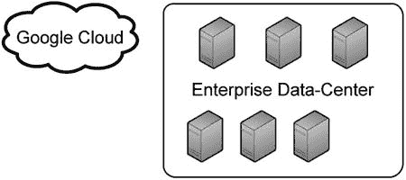
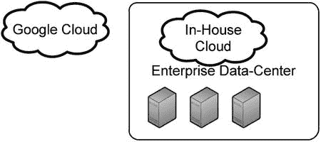
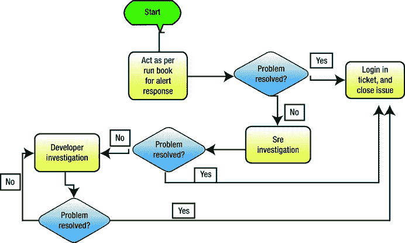

# 2.使用谷歌云平台的托管云解决方案

本章讲述如何将私有云或公共云解决方案集成到您的企业环境中。与传统的实体基础设施相比，云基础设施已经变得非常普遍，并帮助初创公司和企业降低成本和快速部署应用程序。特别是，本章涵盖了谷歌云平台(GCP)，其中包括一系列适用于您企业的公共云解决方案。

## 云还是不云

您应该投资公共云还是私有云？云是一种会随着时间逐渐消失的趋势吗？云计算越来越受欢迎，就目前而言，似乎没有办法阻止它的增长。云计算到底是什么？根据 NIST 的定义，“云计算是一种模式，支持对可配置计算资源(例如，网络、服务器、存储、应用程序和服务)的共享池进行无处不在、方便、按需的网络访问，可以通过最少的管理工作或服务提供商交互来快速供应和发布这些资源。”( [`http://csrc.nist.gov/publications/nistpubs/800-145/SP800-145.pdf`](http://csrc.nist.gov/publications/nistpubs/800-145/SP800-145.pdf) )。是否投资云计算的问题，你的企业要慎重考虑。

基础设施即服务、平台即服务(PaaS)和软件即服务(SaaS)都可以从云计算环境的实施中受益。开发工程师可以专注于编写代码并尽快将其投入生产，而不是关注基础设施问题。随着持续集成、持续交付和持续部署占据了软件工程师的世界，云计算解决方案可以使这三者无缝结合。持续集成是将开发代码与代码主线或主干合并的过程。持续交付是将代码持续提升到不同的环境，比如阶段化、质量保证(QA)和生产。持续部署是在代码准备好的时候就在产品中安装代码。

根据企业的规模，云解决方案的成本可能是一个障碍。然而，内部解决方案的前期资本投资通常值得长期收益，特别是在开发人员的生产力方面。即使内部解决方案没有意义，也不意味着公共云解决方案是不可能的。

## 云的类型

至少有两种云解决方案——三种，如果你包括混合的话。私有云是一种内部云解决方案，使用 OpenStack ( [`http://www.openstack.org`](http://www.openstack.org/) `/`)、VMware 的 vCloud ( [`http://www.vmware.com/cloud-computing/private-cloud`](http://www.vmware.com/cloud-computing/private-cloud) )等软件。第二种类型的云是公共云，托管在提供商的数据中心，而不是您自己的数据中心，是一种按使用付费的模式。公共云解决方案数不胜数，最受欢迎的由 Amazon、Oracle、Google、Microsoft 和 Rackspace 提供。混合云解决方案涉及内部云解决方案和公共云的使用。RedHat 的 OpenShift 是另一个内部托管的 PaaS 解决方案，因此可以归类为混合解决方案( [`https://www.openshift.com/products/enterprise`](https://www.openshift.com/products/enterprise) )。

### 私有云

选择私有云需要在您自己的数据中心构建云基础架构。这个选项可能很昂贵，这取决于需要多少投资和您的组织的规模。例如，OpenStack 是一种分布式的内部云解决方案，不仅需要在硬件方面进行大量投资，还需要在工程技能方面进行投资来管理该解决方案。以下是在决定选择内部私有云时需要记住的一些主题。

*   供应商选择
*   硬件要求
*   能够管理云的工程师的可用性
*   与您现有环境的集成
*   在某些情况下，持续的许可成本
*   管理云的难易程度
*   云的生命周期管理
*   私有云的总拥有成本

如果您有一个强大的基础架构，并拥有快速部署新硬件所需的工具，那么托管自己的云的工作就可以简化。私有云软件解决方案众多；我之前列举了两个——免费的 OpenStack 和必须付费的 VMware。虽然 OpenStack 是免费的，但这并不意味着实现它的成本低于 VMware。请记住，在考虑您的选择时，您应该始终着眼于总拥有成本。私有云架构如图 [2-1](#Fig1) 所示。

图 2-1。

Private cloud solution

### 公共云

公共云解决方案最终可能比私有云更贵或更便宜，这取决于企业的规模。一些云提供商，如亚马逊和谷歌，提供了一个成本计算器。使用这个计算器，您可以确定在提供商的场所托管您的基础架构的大约每月成本。亚马逊的计算器位于 [`https://calculator.s3.amazonaws.com/index.html`](https://calculator.s3.amazonaws.com/index.html) ，谷歌的计算器位于 [`https://cloud.google.com/products/calculator/`](https://cloud.google.com/products/calculator/) 。微软有自己的云平台 Azure，Salesforce.com 是 SaaS 云解决方案提供商领域的市场领导者。图 [2-2](#Fig2) 给出了一个公共云的例子。

图 2-2。

Public cloud solution

### 混合云

混合云解决方案包括内部云解决方案和外部公有云，如图 [2-3](#Fig3) 所示。这种类型的解决方案可用于多种目的。例如，一个用途可能是灾难恢复。如果内部云出现故障，公共云将接管数据服务。另一种替代方案是使用内部云进行开发和试运行，使用公共云进行产品发布。混合云也有助于节省资金，因为您可能最终只在按使用付费的公共云中托管生产基础架构，而将规模更小、更便宜的内部云用于开发、QA 和试运行等非生产环境。如前所述，RedHat 的 OpenShift 是混合云解决方案；它拥有内部和托管基础架构。使用 OpenShift 等集成解决方案的优势在于，您只需为单一平台开发一次，并且可以使用相同的部署引擎在内部和公共云中进行部署。

图 2-3。

Hybrid cloud solution

### 云的组件

云平台(私有、公共或混合)有一些共同的组件，包括:

*   计算:可用于安装应用程序并用于计算的虚拟机或实例
*   App Engine:将代码上传到云中的应用程序容器；在云中运行，无需管理任何虚拟机或实例
*   存储:基于对象存储或非关系数据库存储
*   数据库:MySQL 或类似的东西
*   应用编程接口(API):用于访问云组件，如计算、应用和存储
*   计量:一种跟踪使用情况的方法，并根据某些度量标准增加或减少使用量；也用于计费
*   网络:用于基于云的虚拟机之间的通信，以及从外部资源到云的通信

企业不一定要使用云的所有组件。一个或多个组件可能在云中，但其他组件在云之外。类似地，一个或多个组件可能位于公共云中，但其他组件位于私有云中。

## 迁移到云

将应用程序迁移到云中可能是一项艰巨的任务。假设一个企业没有云解决方案，但已经决定采用一个，那么它如何着手将现有的基础设施应用程序迁移到云呢？在这一节中，我将解释一些您应该记住的事情，以实现成功的迁移。

首先，你应该进行成本分析。使用我之前提到的任何一个云计算器，计算使用谷歌云这样的云的成本。然后，将成本与使用内部云(如 OpenStack)的成本进行比较。要计算 OpenStack 的成本，您必须包括硬件、服务器和网络、工程师和支持成本等项目。关于在线云成本计算器的一个警告是，你的答案可能在他们预测的成本和你最终支付的实际成本之间有所不同。在线计算器的误差系数。

下一步是找出哪些应用程序适合在云中运行。不是所有的应用程序都能在云中很好地运行；有些可能更适合在内部运行。某些行业可能存在禁止使用外部云提供商的法规。例如，如果您在医疗保健行业，那么隐私问题可能会限制您将数据上传到外部云。

隐私的另一个问题可能是关于一个国家的法律。例如，德国有非常严格的个人隐私法，可能禁止德国公司将德国客户数据上传到国际云提供商网络。

接下来，关键是要制定一个项目计划，概述哪些应用程序正在迁移以及何时迁移。迁移现有应用程序的一种可能方式是使用现有的代码库，并将其推到云中。这可能不是最理想的方式，因为不是为在云中运行而设计的遗留应用程序可能无法在云中很好地工作。例如，如果您的应用程序需要一个像 MySQL 这样的数据库，MySQL 可能在云中不可用，您可能必须使用另一个数据库。另一件要记住的事情是，一些应用程序对磁盘输入/输出速度要求非常敏感，因为大多数云是基于虚拟化的，所以它会比直接访问磁盘慢。因此，这些类型的应用程序可能无法在云中很好地工作。有一些云提供商租赁物理服务器而不是虚拟环境，但目前很难看出使用托管物理服务器的优势。

作为应用程序开发人员，您还必须决定应用程序需要哪些云组件。对于公司基础架构中的企业应用程序，有许多其他基础架构服务，如监控、备份和网络操作中心(NOC ),它们提供支持服务。这些在云中没有相同的格式。

例如，谷歌云的 SQL 备份政策，可以在 [`https://developers.google.com/cloud-sql/docs/backup-recovery`](https://developers.google.com/cloud-sql/docs/backup-recovery) 找到，规定一个实例的最后七个备份免费存储。如果您的组织需要备份更长时间的数据，那么必须考虑如何做到这一点以及这样做的成本。

对于监控应用程序，一些云提供商提供了一个可编程使用的框架，并且可以在某些触发器激活时发送警报。Google Cloud 提供了一个 API ( [`https://developers.google.com/cloud-monitoring/`](https://developers.google.com/cloud-monitoring/) )，允许您读取 CPU、磁盘使用等监控指标，并根据这些指标发送警报。企业必须决定使用这个 API 是否有意义，或者利用其现有的监控基础设施并将其扩展到云中。

总的来说，迁移到云的过程不能是突然的切换。在刚刚提出的问题得到解决后，一种策略是将部分数据迁移到云中，并为来自云的 5%的流量提供服务。如果这行得通，那么你可以慢慢增加云的流量，直到它达到 100%。避免立即切换到云的情况；您不希望您的客户经历停机。互联网连接的速度和可靠性也应该是您的云迁移策略的考虑因素。发展中地区可能无法像发达国家那样接入互联网。服务条款、云的可用性和数据隐私也是迁移前和迁移期间需要考虑的重要因素。图 [2-4](#Fig4) 显示了云迁移策略的流程图。

图 2-4。

Flowchart of cloud migration strategy

## DevOps

在准备云迁移策略之前，由谁来管理云应用程序是一个重要的讨论话题。在传统企业中，有开发人员和运营工程师。开发者写代码；然后，运营工程师将代码推向生产，并管理生产环境。但是，在企业使用公有云的情况下，公有云基础设施由提供商管理，那么运营会起到什么作用呢？

最简单的说法是，老年退休金计划不会发挥任何作用。开发人员将根据需要将代码推送到公共代码，来自应用程序的任何警报都将发送给开发人员，他们将全天候待命并解决问题。这种方法的优点是，从开发人员到产品的 bug 修复和新特性的周转时间最短。然而，这种方法也有最高的风险，因为有一个假设，即在代码部署到云中之前，开发人员已经测试了它，并且遵循了部署代码的正确过程。

另一种方法是保持传统模式，让开发人员编写代码并将其交给运营人员，运营人员再将其推送到云。一般来说，这就是传统企业的运作方式。在这个过程中加入适当的检查和平衡，这可能是一种更安全的部署代码的方式。然而，如果您坚持这种方法而不做任何修改，那么利用云中快速代码部署的优势可能会丧失。

第三种选择可能更受欢迎，那就是混合方法。使用这种方法，开发人员编写代码；但是，如果没有运营概览，他们无法将 it 推向云。例如，变更管理必须纳入流程中，这需要操作监督。此外，大多数企业都有一个 NOC，该 NOC 必须参与协调并为代码部署或其他行动引起的事件提供 24/7 的一级支持。一般来说，安全审查属于运营部门的职责范围，因此，新应用程序向云的迁移应由公司安全团队监督。

如您所见，最适合企业的战略取决于很多因素。在管理云的问题上，没有放之四海而皆准的方法。

## 云中的安全性

安全性一直是企业关注的问题，当应用程序部署在公共云中时，安全性就变得更加重要，因为企业的常见控制措施(如防火墙和入侵预防/检测软件)在公共云中可能不可用。通过 VPN 将虚拟公共云基础架构连接到企业网络会使您的企业在受到威胁时容易受到来自公共云的攻击。不用说，将数据推送到公共云时，您必须非常小心。对于私有内部云，适用于其他非云实体的相同控制可以移植到云中，只需做一些修改。

那么，如何在像谷歌云平台(GCP)这样的公共云中处理安全问题呢？GCP 的一个优点是，在您的项目中，您的资源与其他项目是隔离的，即使它们属于同一个组织。这提供了某种程度的安全性。此外，如果您的实例不使用公共 Internet 协议(IP)地址，则无法从 Internet 访问它们。Google Compute Engine (GCE)中的内置防火墙也是安全的，默认情况下会阻止除安全外壳(SSH)之外的所有传入连接。

入侵检测和入侵防御是 GCE 中没有涉及的主题，因此如果您愿意，您可以自行设置。

当使用 Salesforce.com 等 SaaS 或其他托管解决方案时，访问云中数据的位置也是一个安全问题。例如，如果您的员工从网吧访问 SaaS，而网吧的计算机感染了病毒，该病毒可能会记录所有的击键。这将导致您的员工访问 SaaS 的用户名和密码被泄露。

在谷歌应用引擎(GAE)的世界里，你的应用程序的安全性主要依赖于应用程序和你对谷歌基础设施的信任。您对基础设施几乎没有控制权；因此，从安全角度来看，您所做的大部分工作都是基于您的应用程序。

## 谷歌云平台

谷歌云平台(GCP)提供了在谷歌托管服务器上运行应用程序所需的构建模块。GCP 提供的服务可以分为计算、存储、大数据和开发工具。就本章而言，大数据包括在存储的讨论中。要开始使用 GCP，请前往 [`https://cloud.google.com/products/`](https://cloud.google.com/products/) ，看看与计算、存储、大数据和开发相关的不同产品。你需要一个谷歌账户来注册 GCP。在 [`https://console.developers.google.com`](https://console.developers.google.com/) 登录后，您可以开始创建 GCP 资源。以下是在撰写本章时 GCP 提供的产品列表:

*   计算
    *   谷歌应用引擎(GAE)
    *   谷歌计算引擎(GCE)
*   仓库
    *   谷歌云存储(GCS)
    *   谷歌云数据存储(GCD)
    *   云 SQL (GSQL)
    *   BigQuery(大查询)
*   开发工具
    *   谷歌云 SDK
    *   云游乐场
    *   Eclipse 的谷歌插件
    *   推动部署
    *   Android Studio

在 [`https://cloud.google.com`](https://cloud.google.com/) 通过网络界面访问 GCP。还有一个软件开发工具包(SDK)，可以用来管理 GCP；但是，至少在最初，需要某种级别的 web 用户界面来设置您的项目。您可以在 [`https://developers.google.com/cloud/`](https://developers.google.com/cloud/) 查看关于上述主题的大量文档。

### 项目

GCP 的项目是资源分组的一种方式。例如，如果有十个应用程序，每个应用程序可能会有自己的项目。项目的名称完全由你决定。每个项目都有一个项目名称和一个项目 ID。以后可以更改项目名称，但不能更改项目 ID。项目还有一个自动分配的项目编号，不能更改。

例如，如果您的公司是`Example.com`，那么项目可能被命名为 Example-Web-Front-End，项目 ID 为 example-web-fe。项目 ID 也是 GAE 的`.appspot.com` URL 的子域。所有项目都有权限和计费。如果不启用开单，您将无法在项目中创建任何资源。提供信用卡号和银行账号可以实现计费。卓越理财账户不需要信用卡账户；相反，它们是按月计费的。当企业确定要在 GCP 部署时，他们通常会注册卓越理财账户。

处理项目的一种可能方式是为每个应用程序创建三个项目:一个用于开发，另一个用于 QA 或试运行，第三个用于生产。开发人员可以访问开发人员项目，QA 工程师可以访问 QA 项目，操作人员可以访问生产项目。

### 许可

Google 云平台中的权限都是基于 Google 账号的，用来登录 GCP，在项目中应用。项目中有三种权限。“是所有者”允许完全访问，包括计费和管理控制。“可以编辑”允许完全访问应用程序，但不允许计费和管理控制。“可以查看”允许查看权限，但不能修改任何设置。

权限对项目至关重要，拥有不必要的权限会导致安全漏洞，因此在提供权限时要格外小心。一个例子是，大多数项目应该为云管理工程师、开发人员和 NOC 提供不同的权限。但是，如果所有三类人员都被授予相同的访问级别，那么一个组可能会覆盖另一个组设置的设置，从而导致项目的虚拟实例不可访问。你可以在 [`https://cloud.google.com/developers/articles/best-practices-for-configuring-permissions-on-gcp`](https://cloud.google.com/developers/articles/best-practices-for-configuring-permissions-on-gcp) 了解更多权限。

## 谷歌计算引擎

GCE 提供了虚拟机，也称为可用于部署代码的实例。它们由磁盘、映像、实例、网络、负载平衡器等组成。对于某些类型的应用，GAE 是 GCE 的替代产品。有了 GAE，你就没有了 GCE 中的灵活性。例如，在 GCE 中，您可以控制网络、防火墙、负载平衡器和虚拟机配置——这些在 GAE 都是不可行的。如果您需要对您的应用程序进行这种级别的控制，那么使用 GCE 而不是 GAE。您可以在 [`https://developers.google.com/compute/`](https://developers.google.com/compute/) 获取更多 GCE 相关信息。

### 虚拟计算机

要在 GCE 中创建虚拟机，可以使用 Google Cloud SDK 或 web 界面。虚拟机有不同的配置。完整列表可在 [`https://cloud.google.com/products/compute-engine/`](https://cloud.google.com/products/compute-engine/) 找到。定价因实例类型而异。清单 2-1 是一个使用默认设置创建虚拟机的例子。

清单 2-1。创建虚拟机

`##########`

`#Install the Google Cloud SDK`

`$ curl``https://sdk.cloud.google.com`T2】

`##########`

`#Log in to GCP; this will open a web browser that will ask you to give permission for GCP`

`$ gcloud auth login`

`##########`

`#Add an instance to project webexample`

`$ gcutil --project=webexample addinstance www1-example-com`

`Select a zone:`

`1: asia-east1-a`

`2: asia-east1-b`

`3: asia-east1-c`

`4: europe-west1-a`

`5: europe-west1-b`

`6: us-central1-a`

`7: us-central1-b`

`8: us-central1-f`

`>>> 6`

`Select a machine type:`

`1: n1-standard-1        1 vCPU, 3.75 GB RAM`

`2: n1-standard-16       16 vCPUs, 60 GB RAM`

`3: n1-standard-2        2 vCPUs, 7.5 GB RAM`

`4: n1-standard-4        4 vCPUs, 15 GB RAM`

`5: n1-standard-8        8 vCPUs, 30 GB RAM`

`6: n1-highcpu-16        16 vCPUs, 14.4 GB RAM`

`7: n1-highcpu-2         2 vCPUs, 1.8 GB RAM`

`8: n1-highcpu-4         4 vCPUs, 3.6 GB RAM`

`9: n1-highcpu-8         8 vCPUs, 7.2 GB RAM`

`10: n1-highmem-16       16 vCPUs, 104 GB RAM`

`11: n1-highmem-2        2 vCPUs, 13 GB RAM`

`12: n1-highmem-4        4 vCPUs, 26 GB RAM`

`13: n1-highmem-8        8 vCPUs, 52 GB RAM`

`14: f1-micro            1 vCPU (shared physical core) and 0.6 GB RAM`

`15: g1-small            1 vCPU (shared physical core) and 1.7 GB RAM`

`>>> 3`

`Select an image:`

`1: projects/centos-cloud/global/img/centos-6-v20140718`

`2: projects/debian-cloud/global/img/backports-debian-7-wheezy-v20140807`

`3: projects/debian-cloud/global/img/debian-7-wheezy-v20140807`

`4: projects/rhel-cloud/global/img/rhel-6-v20140718`

`5: projects/suse-cloud/global/img/sles-11-sp3-v20140712`

`>>> 1`

`INFO: Waiting for insert of instance www1-example-com. Sleeping for 3s.`

`[SNIP]`

`Table of resources:`

`+------------------+-------------+----------------+---------------+---------+`

`| name             | network-ip  | external-ip    | zone          | status  |`

`+------------------+-------------+----------------+---------------+---------+`

`| www1-example-com | 10.240.93.2 | 146.148.37.192 | us-central1-a | RUNNING |`

`+------------------+-------------+----------------+---------------+---------+`

`Table of operations:`

`-------------------------------------+----------+-------------------------------+---------------+`

`| name                               |  status  | insert-time                   | operation-type|`

`-------------------------------------+----------+-------------------------------+---------------+`

`| operation-140790998[SNIP]-4641f474 |   DONE   | 2014-08-12T23:06:27.376-07:00 |     insert    |`

`+------------------------------------+----------+-------------------------------+---------------+`

`##########`

`#SSH to the instance created earlier`

`$ gcutil --project webexample ssh www1-example-com`

您创建的实例类型取决于应用程序的计算要求。在选择实例类型时要小心，因为如果您高估了，您将最终为未被使用的容量付费。如果你低估了，你总是可以添加更多的实例。例如，实例类型 n1-standard-4 由四个虚拟内核和 15GB 内存组成，在美国的价格为 0.280 美元。如果您选择 n1-standard-16，那么 16 个内核和 64GB 内存的成本为 1.120 美元/小时。

您可以通过在`dmidecode`命令的输出中搜索“Google”来判断您是否登录了 GCE 虚拟实例:

`$ sudo dmidecode -s bios-vendor | grep Google`

`Google`

默认情况下，为实例分配临时 IP 地址。所有实例都有一个只能在网络内寻址的网络 IP。您还可以为实例分配一个公共 IP 地址。公共 IP 地址可以是静态的，也可以是短暂的。默认情况下，实例允许使用以下端口:

*   来自任何地方的传入安全外壳(SSH)
*   端口 3389 上的传入远程桌面协议(RDP)
*   给定项目中同一网络中实例内流量的任何端口和任何协议

可以对实例执行许多操作，下面列出了其中一些操作:

`##########`

`#list instances in a project`

`$ gcloud compute instances list`

`NAME        ZONE          MACHINE_TYPE  INTERNAL_IP    EXTERNAL_IP     STATUS`

`vm1         us-central1-b n1-standard-2 10.240.64.102  23.251.145.124  RUNNING`

`vm2         us-central1-b n1-standard-1 10.240.73.218  23.236.61.138   RUNNING`

`#if an instance is “stuck” you can power cycle it`

`$ gcloud compute  instances reset vm2 --zone us-central1-b`

`Updated [`[`https://www.googleapis.com/compute/v1/projects/webexample/zones/us-central1-b/instances/vm2`](https://www.googleapis.com/compute/v1/projects/webexample/zones/us-central1-b/instances/vm2)T2】

`##########`

`#SSH to an instance without using gcutil`

`#key file is normally ∼/.ssh/google_compute_engine`

`#replace USER@IP_ADDRESS with your username in GCE and IP_ADDRESS with the instance public IP address. You cannot SSH to instances that do not have a public IP address.`

`$ ssh -i KEY_FILE -o UserKnownHostsFile=/dev/null -o CheckHostIP=no -o StrictHostKeyChecking=no USER@IP_ADDRESS`

`##########`

`#delete an instance`

`$ gcloud compute  instances delete vm1 --zone us-central1-b`

`The following instances will be deleted. Attached disks configured to`

`be autodeleted will be deleted unless they are attached to any other`

`instances. Deleting a disk is irreversible and any data on the disk`

`will be lost.`

`- [vm1] in [us-central1-b]`

`Do you want to continue (Y/n?  Y`

`Deleted [`[`https://www.googleapis.com/compute/v1/projects/webexample/zones/us-central1-b/instances/vm1`](https://www.googleapis.com/compute/v1/projects/webexample/zones/us-central1-b/instances/vm1)T2】

Note

创建虚拟机时，请首先检查防火墙规则，以免无意中允许传入流量到达不应接收来自互联网的流量的实例。

### 网络

虚拟机驻留在网络上。默认情况下，在 GCE 中有一个称为默认的网络。这个网络是 10.240.0.0/16。每个网络都有与之关联的防火墙规则。网络只能属于一个项目，不能在项目间共享。默认情况下，所有传入流量都会被阻止。防火墙规则只管理实例的传入流量，不管理传出流量。如果您想要阻止来自虚拟机的传出流量，那么您必须使用 iptables。

Google 还在端口 25 上阻止所有从 GCE 到互联网的出站流量。如果你想在 GCE 之外使用“投递邮件”，那么你必须在 SendGrid ( [`http://sendgrid.com/`](http://sendgrid.com/) )注册一个账户，这是在撰写本章时唯一支持的邮件转发。您可以在 [`https://cloud.google.com/compute/docs/sending-mail`](https://cloud.google.com/compute/docs/sending-mail) 了解更多关于如何设置出站电子邮件的信息。传出端口 465 和 587 也被阻止，除了已知的 Google IP 地址，因为所有三个端口(25、465 和 587)都用于 SMTP 服务。通过查询 Google 的发件人策略框架(SPF)记录，可以得到已知 Google IP 地址的列表，如 [`https://support.google.com/a/answer/60764`](https://support.google.com/a/answer/60764) 所示。

Note

GCE 中的一个项目可以包含多个网络；但是，每个实例或虚拟机只能连接到一个网络。GCE 目前不支持 IPv6，只支持 IPv4，所以所有网络都得是 IPv4。

对于在 GCE 中创建实例的企业来说，如果实例要与公司网络隔离，那么在 GCE 中使用默认网络可能会很方便。另一方面，如果企业想要在 GCE 实例和它的公司网络之间建立一个 VPN，那么它可能适合于企业也管理 GCE 内的网络。例如，如果一家企业的公司网络位于 192.168.0.0/16 范围内，并且希望将该网络扩展到 GCE 中，而不是使用默认的 10.240.0.0/16，那么它可以设置一个连接这两个网络的 VPN。图 [2-5](#Fig5) 显示 GCE 和 Corporate 与 VPN 连接，并且具有不同的网络号。

图 2-5。

VPN between public cloud and corporate network

要通过 VPN 将您的公司网络连接到 GCE，在 GCE 端，您必须使用安装了 VPN 软件的实例，例如 OpenVPN。在企业端，您也可以使用 OpenVPN 或专用的 VPN 设备。

Note

GCE 网络仅支持点对点 IPv4 流量。它们不支持多播或广播。

你可以在 [`https://developers.google.com/compute/docs/networking`](https://developers.google.com/compute/docs/networking) 找到更多关于网络和防火墙的信息。

### 区域和分区

GCE 实例可以部署在不同的地区和区域。磁盘、实例和 IP 地址等资源是特定于区域的。例如，us-central1-a 中的实例不能使用 us-central-1b 中的磁盘。区域是区域的集合。例如，us-central1 是一个由 a 区、b 区和 f 区组成的区域。撰写本文时 GCE 中可用的两个样本区如图 [2-6](#Fig6) 所示。

图 2-6。

Sample GCE regions and zones

您可以使用此处显示的命令查看所有可用的区域:

`$ gcloud compute zones list`

[T2`https://www.googleapis.com/compute/v1/projects/webexample/zones/asia-east1-a`](https://www.googleapis.com/compute/v1/projects/webexample/zones/asia-east1-a)

[T2`https://www.googleapis.com/compute/v1/projects/webexample/zones/asia-east1-c`](https://www.googleapis.com/compute/v1/projects/webexample/zones/asia-east1-c)

[T2`https://www.googleapis.com/compute/v1/projects/webexample/zones/asia-east1-b`](https://www.googleapis.com/compute/v1/projects/webexample/zones/asia-east1-b)

[T2`https://www.googleapis.com/compute/v1/projects/webexample/zones/europe-west1-a`](https://www.googleapis.com/compute/v1/projects/webexample/zones/europe-west1-a)

[T2`https://www.googleapis.com/compute/v1/projects/webexample/zones/europe-west1-b`](https://www.googleapis.com/compute/v1/projects/webexample/zones/europe-west1-b)

[T2`https://www.googleapis.com/compute/v1/projects/webexample/zones/us-central1-a`](https://www.googleapis.com/compute/v1/projects/webexample/zones/us-central1-a)

[T2`https://www.googleapis.com/compute/v1/projects/webexample/zones/us-central1-f`](https://www.googleapis.com/compute/v1/projects/webexample/zones/us-central1-f)

[T2`https://www.googleapis.com/compute/v1/projects/webexample/zones/us-central1-b`](https://www.googleapis.com/compute/v1/projects/webexample/zones/us-central1-b)

为了提出在哪些区域中部署的企业策略，Google 的建议是将实例分布在至少两个区域之间。如果一个区域出现问题，如果您的应用程序在另一个区域中有另一个副本运行，则该应用程序将会启动。如果该企业是一家美国独资企业，请选择位于美国的地区。另一方面，如果企业是全球性的，那么选择企业开展业务的地区。

Tip

为了容错，在创建实例时，在不同的区域中至少创建两个实例。

对处理器的支持也因区域而异。例如，在撰写本文时，英特尔 Sandy Bridge 在美国中部 1-f 地区不可用。当您查看虚拟机的处理器信息时，您将看到已提供的处理器类型。这里显示了一个双核虚拟机的示例:

`$ egrep 'vendor_id|model name'  /proc/cpuinfo`

`vendor_id       : GenuineIntel`

`model name      : Intel(R) Xeon(R) CPU @ 2.60GHz`

`vendor_id       : GenuineIntel`

`model name      : Intel(R) Xeon(R) CPU @ 2.60GHz`

您可以在 [`https://developers.google.com/compute/docs/zones`](https://developers.google.com/compute/docs/zones) 了解更多关于地区和区域的信息。

### 定额

因为 GCE 是一个共享的环境，Google 实现了配额，以确保没有一个客户能够使用所有的资源并影响另一个客户。有两种配额:一种是项目范围的配额，另一种是区域范围的配额。配额是针对静态 IP 地址、图像、网络和防火墙规则等资源的。项目限额见表 [2-1](#Tab1) 。

表 2-1。

GCE Quotas

<colgroup><col> <col></colgroup> 
| 资源 | 限制 |
| --- | --- |
| 防火墙 | One hundred |
| 转发规则 | Fifty |
| 健康检查 | Fifty |
| 形象 | One hundred |
| 网络 | five |
| 路线 | One hundred |
| 快照 | One thousand |
| 目标池 | Fifty |

要查看项目中使用的网络列表，请使用以下命令:

`$ gcloud compute networks list`

`NAME             IPV4_RANGE      GATEWAY_IPV4`

`default          10.240.0.0/16   10.240.0.1`

`corp-net         192.168.0.0/16  192.168.0.1`

Caution

不注意项目配额可能会导致生产中断，尤其是自动缩放资源。

对于一个企业来说，获得适量的资源至关重要——对于项目和区域都是如此。如果项目使用自动缩放和按需增长实例，达到配额限制可能会影响生产。你可以通过网络界面请求谷歌增加配额。这可能需要几天时间，所以要提前计划。申请增加配额的表格在 [`https://docs.google.com/forms/d/1vb2MkAr9JcHrp6myQ3oTxCyBv2c7Iyc5wqIKqE3K4IE/viewform`](https://docs.google.com/forms/d/1vb2MkAr9JcHrp6myQ3oTxCyBv2c7Iyc5wqIKqE3K4IE/viewform) 。密切监控您的使用情况和配额限制，并至少提前几天提出请求。您可以在 [`https://developers.google.com/compute/docs/resource-quotas`](https://developers.google.com/compute/docs/resource-quotas) 查看限额列表。

### 防火墙

默认情况下，GCE 中的所有网络都受到防火墙的保护，防火墙会阻止传入流量。您只能从外部网络连接到那些具有公共 IP 地址的 GCE 实例。如果一个实例没有外部 IP，而您试图通过 SSH 连接到该实例，您将收到如下所示的错误:

`ERROR: (gcloud.compute.ssh) Instance [vm1] in zone [us-central1-b] does not have an external IP address, so you cannot SSH into it. To add an external IP address to the instance, use [gcloud compute instances add-access-config].`

您可以从 GCE 中的其他实例访问 GCE 网络中没有外部 IP 的实例，因为 GCE 使用该主机的内部地址。例如，如果您在 web-server2 上并 ping web-server1，GCE 将使用 web-server1 的内部地址:

`[web-server2 ∼]$ ping web-server1 -c 1`

`PING web-server1.c.webexample.internal (10.240.107.200) 56(84) bytes of data.`

`64 bytes from web-server1.c.webexaple.internal (10.240.107.200): icmp_seq=1 ttl=64 time=0.642 ms`

`--- web-server1.c.webexample.internal ping statistics ---`

`1 packets transmitted, 1 received, 0% packet loss, time 0ms`

`rtt min/avg/max/mdev = 0.642/0.642/0.642/0.000 ms`

如果在 GCE 负载平衡器后面有一个或多个 web 服务器，则不必为 web 服务器实例分配外部 IP 地址，它们就可以接受传入流量。当您创建负载平衡器时，GCE 会为负载平衡器分配一个公共 IP 地址，这是所有传入流量到达的地方。负载平衡器然后将流量转发到 web 服务器。另一方面，如果实例不在 GCE 负载平衡器的后面，那么它必须有一个公共 IP 地址来接受来自 Internet 的连接。

对于企业而言，出于安全原因，除非需要，否则不建议为实例分配公共 IP 地址。您可以创建一个网关主机，允许从公司网络使用 SSH。然后，您可以从网关主机 SSH 到 GCE 中的所有其他实例。

默认情况下，GCE 实例上不配置 Iptables 然而，它可以在 GCE 提供的网络防火墙之外使用，以增加安全性，如清单 2-2 所示。

清单 2-2。GCE 防火墙

`##########\`

`#list the firewall rules associated with all networks in a given project of GCE`

`#we have just one network called 'default'`

`$ gcloud compute firewall-rules list`

`NAME                    NETWORK    SRC_RANGES     RULES                        SRC_TAGS TARGET_TAGS`

`default-allow-internal  default    10.0.0.0/8     tcp:1-65535,udp:1-65535,icmp`

`default-https           default    0.0.0.0/0      tcp:443`

`default-ssh             default    0.0.0.0/0      tcp:22`

`http                    default    0.0.0.0/0      tcp:80`

`##########`

`#view detailed information about the http rule`

`$ gcloud compute firewall-rules describe http`

`allowed:`

`- IPProtocol: tcp`

`ports:`

`- '80'`

`creationTimestamp: '2013-12-18T18:25:30.514-08:00'`

`id: '17036414249969095876'`

`kind: compute#firewall`

`name: http`

`network:`[`https://www.googleapis.com/compute/v1/projects/webexample/global/networks/default`T3】](https://www.googleapis.com/compute/v1/projects/webexample/global/networks/default)

`selfLink:`[`https://www.googleapis.com/compute/v1/projects/webexample/global/firewalls/http`T3】](https://www.googleapis.com/compute/v1/projects/webexample/global/firewalls/http)

`sourceRanges:`

`- 0.0.0.0/0`

`##########`

`#create a new firewall rule that allows incoming TCP traffic on port 7000`

`#call the firewall rule 'my-app'`

`$ gcloud compute firewall-rules create my-app --allow tcp:7000 --source-ranges 0.0.0.0/0`

`Created [`[`https://www.googleapis.com/compute/v1/projects/webexample/global/firewalls/my-app`](https://www.googleapis.com/compute/v1/projects/webexample/global/firewalls/my-app)T2】

`NAME   NETWORK SRC_RANGES RULES    SRC_TAGS TARGET_TAGS`

`my-app default 0.0.0.0/0  tcp:7000`

`##########`

`#verify that the new rule, which we called 'my-app,' is visible when a firewall rule listing is done`

`$ gcloud compute firewall-rules list | grep -i my-app`

`my-app default 0.0.0.0/0 tcp:7000`

`##########`

`#check the details of the new rule called 'my-app'`

`$ gcloud compute firewall-rules describe my-app`

`allowed:`

`- IPProtocol: tcp`

`ports:`

`- '7000'`

`creationTimestamp: '2014-08-17T10:00:56.611-07:00'`

`id: '9293032300921518370'`

`kind: compute#firewall`

`name: my-app`

`network:`[`https://www.googleapis.com/compute/v1/projects/webexample/global/networks/default`T3】](https://www.googleapis.com/compute/v1/projects/webexample/global/networks/default)

`selfLink:`[`https://www.googleapis.com/compute/v1/projects/webexample/global/firewalls/my-app`T3】](https://www.googleapis.com/compute/v1/projects/webexample/global/firewalls/my-app)

`sourceRanges:`

`- 0.0.0.0/0`

`##########`

`#update the new rule to allow TCP port 8001 instead of port 7000`

`$ gcloud compute firewall-rules update my-app --allow tcp:8001`

`Updated [`[`https://www.googleapis.com/compute/v1/projects/webexample/global/firewalls/my-app`](https://www.googleapis.com/compute/v1/projects/webexample/global/firewalls/my-app)T2】

`##########`

`#verify that the update went through`

`$ gcloud compute firewall-rules describe my-app`

`allowed:`

`- IPProtocol: tcp`

`ports:`

`- '8001'`

`creationTimestamp: '2014-08-17T10:00:56.611-07:00'`

`id: '9293032300921518370'`

`kind: compute#firewall`

`name: my-app`

`network:`[`https://www.googleapis.com/compute/v1/projects/webexample/global/networks/default`T3】](https://www.googleapis.com/compute/v1/projects/webexample/global/networks/default)

`selfLink:`[`https://www.googleapis.com/compute/v1/projects/webexample/global/firewalls/my-app`T3】](https://www.googleapis.com/compute/v1/projects/webexample/global/firewalls/my-app)

`sourceRanges:`

`- 0.0.0.0/0`

### 形象

映像是可引导的操作系统资源，包括引导加载程序和系统分区。有公共图像也有私人图像。任何使用 GCE 的人都可以使用公共图像。私有图像是特定于项目的。您可以创建自己的映像，将其上传到项目中，并从该实例部署实例。

有些图片需要额外付费，而有些则是免费的。例如，centos-6-v20140718 网络图像是一个免费的公共图像。另一方面，rhel-6-v20140718 映像会产生额外的费用，因为 RedHat 是一个许可的操作系统。清单 2-3 显示了一些基本的图像操作，包括创建一个图像。

清单 2-3。图像操作

`##########`

`#list images available`

`$ gcloud compute images list`

`NAME                                PROJECT            DEPRECATED STATUS`

`centos-6-v20140718                  centos-cloud                  READY`

`coreos-alpha-402-2-0-v20140807      coreos-cloud                  READY`

`coreos-beta-367-1-0-v20140715       coreos-cloud                  READY`

`coreos-stable-367-1-0-v20140724     coreos-cloud                  READY`

`backports-debian-7-wheezy-v20140807 debian-cloud                  READY`

`debian-7-wheezy-v20140807           debian-cloud                  READY`

`opensuse-13-1-v20140711             opensuse-cloud                READY`

`rhel-6-v20140718                    rhel-cloud                    READY`

`sles-11-sp3-v20140712               suse-cloud                    READY`

`##########`

`#Create an instance based on the latest centos-6 image, call the instance centos-vm1`

`$ gcloud compute instances create centos-vm1 --image centos-6 --zone us-central1-a`

`Created [`[`https://www.googleapis.com/compute/v1/projects/webexample/zones/us-central1-a/instances/centos-vm1`](https://www.googleapis.com/compute/v1/projects/webexample/zones/us-central1-a/instances/centos-vm1)T2】

`NAME       ZONE          MACHINE_TYPE  INTERNAL_IP  EXTERNAL_IP  STATUS`

`centos-vm1 us-central1-a n1-standard-1 10.240.35.23 23.251.150.5 RUNNING`

`##########`

`#ensure that the instance is running`

`$ gcloud compute instances list centos-vm1`

`NAME       ZONE          MACHINE_TYPE  INTERNAL_IP  EXTERNAL_IP  STATUS`

`centos-vm1 us-central1-a n1-standard-1 10.240.35.23 23.251.150.5 RUNNING`

`##########`

`#attempt to SSH to the instance we created just now`

`$ gcutil ssh centos-vm1`

`INFO: Zone for centos-vm1 detected as us-central1-a.`

`INFO: Running command line: ssh -o UserKnownHostsFile=/dev/null -o CheckHostIP=no -o StrictHostKeyChecking=no -i /Users/syedali/.ssh/google_compute_engine -A -p 22 23.251.150.5 --`

`[centos-vm1 ∼]$ hostname`

`centos-vm1`

`[centos-vm1 ∼]$ exit`

`Logout`

`Connection to 23.251.150.5 closed.`

您还可以创建自己的映像，并使用它来部署实例，如清单 2-4 所示。

清单 2-4。创建自定义图像

`##########`

`#create an instance called web-server, using the centos-6 image, in zone us-central1-b`

`#we specify the scope of storage-rw and compute-rw to allow access to Google Cloud Storage`

`#you can learn more about scopes using the command 'gcloud compute instances create --help'`

`$ gcloud compute instances create web-server --scopes storage-rw compute-rw --image centos-6 --zone us-central1-b`

`Created [`[`https://www.googleapis.com/compute/v1/projects/webexample/zones/us-central1-b/instances/web-server`](https://www.googleapis.com/compute/v1/projects/webexample/zones/us-central1-b/instances/web-server)T2】

`NAME       ZONE          MACHINE_TYPE  INTERNAL_IP   EXTERNAL_IP  STATUS`

`web-server us-central1-b n1-standard-1 10.240.111.65 108.59.82.59 RUNNING`

`##########`

`#SSH to the instance we created earlier`

`#install httpd`

`$ gcloud compute ssh web-server --zone us-central1-b`

`[web-server ∼]$ sudo yum install httpd -y`

`Loaded plugins: downloadonly, fastestmirror, security`

`Determining fastest mirrors`

`* base: mirror.us.oneandone.net`

`* extras: mirror.wiredtree.com`

`* updates: centos.corenetworks.net`

`.....[SNIP].....`

`Installed:`

`httpd.x86_64 0:2.2.15-31.el6.centos`

`.....[SNIP].....`

`Complete!`

`[web-server ∼]$ exit`

`logout`

`Connection to 108.59.82.59 closed.`

`##########`

`#delete the instance while keeping the boot disk, because we don't need the instance anymore`

`#you can also keep the instance for future modifications if you want`

`$ gcloud compute instances delete web-server --keep-disks boot --zone us-central1-b`

`The following instances will be deleted. Attached disks configured to`

`be auto-deleted will be deleted unless they are attached to any other`

`instances. Deleting a disk is irreversible and any data on the disk`

`will be lost.`

`- [web-server] in [us-central1-b]`

`Do you want to continue (Y/n)?  y`

`Updated [`[`https://www.googleapis.com/compute/v1/projects/webexample/zones/us-central1-b/instances/web-server`](https://www.googleapis.com/compute/v1/projects/webexample/zones/us-central1-b/instances/web-server)T2】

`Deleted [`[`https://www.googleapis.com/compute/v1/projects/webexample/zones/us-central1-b/instances/web-server`](https://www.googleapis.com/compute/v1/projects/webexample/zones/us-central1-b/instances/web-server)T2】

`##########`

`#now create a new image called web-server-image using the boot disk of the previous instance on which we installed httpd`

`#the --source-disk provides the name of web-server, because that was the name of the disk from the earlier instance`

`$ gcloud compute images create web-server-image --source-disk web-server --source-disk-zone us-central1-b`

`Created [`[`https://www.googleapis.com/compute/v1/projects/webexample/global/img/web-server-image`](https://www.googleapis.com/compute/v1/projects/webexample/global/img/web-server-image)T2】

`NAME              PROJECT               DEPRECATED STATUS`

`web-server-image  webexample            READY`

`##########`

`#list the images and make sure you see the web-server-image`

`$ gcloud compute images list`

`NAME                              PROJECT               DEPRECATED STATUS`

`web-server-image                  webexample            READY`

`centos-6-v20140718                centos-cloud          READY`

`.....[SNIP].....`

`rhel-6-v20140718                  rhel-cloud            READY`

`sles-11-sp3-v20140712             suse-cloud            READY`

`##########`

`#attempt to create a new instance called web-server2 using the web-server-image we created earlier`

`$ gcloud compute instances create web-server2  --image web-server-image --zone us-central1-b`

`Created [`[`https://www.googleapis.com/compute/v1/projects/webexample/zones/us-central1-b/instances/web-server2`](https://www.googleapis.com/compute/v1/projects/webexample/zones/us-central1-b/instances/web-server2)T2】

`NAME         ZONE           MACHINE_TYPE   INTERNAL_IP    EXTERNAL_IP   STATUS`

`web-server2  us-central1-b  n1-standard-1  10.240.84.183  108.59.82.59  RUNNING`

`##########`

`#once the instance is up, SSH to it and verify that httpd is present on it`

`$ gcloud compute ssh web-server2 --zone us-central1-b`

`[web-server2 ∼]$ hostname`

`web-server2`

`[web-server2 ∼]$ rpm -qa | grep -i httpd`

`httpd-tools-2.2.15-31.el6.centos.x86_64`

`httpd-2.2.15-31.el6.centos.x86_64`

`[web-server2 ∼]$ exit`

`logout`

`Connection to 108.59.82.59 closed.`

### 网络负载平衡

GCE 中的负载平衡非常简单。在撰写本文时，它还不支持多种负载平衡算法。支持的算法是基于协议的；换句话说，它基于地址、端口和协议类型。默认情况下，GCE 根据源 IP 和端口以及目标 IP 和端口的散列来挑选真实的服务器。传入的连接分布在真正的服务器上，不是通过数据包，而是通过连接。例如，如果有三个真实服务器，并且连接到给定的真实服务器，则在连接关闭之前，该连接的所有分组将去往同一服务器。

Note

Google 不支持不同的负载平衡算法，例如最少连接、动态循环、加权循环、预测和观察。

要设置负载平衡，首先创建一个目标池。该池应该包含一个或多个真实的服务器，流量将被发送到这些服务器。一个池可以包含不同区域中的实例，只要它们在同一个区域中。

创建池后，创建将流量转发到先前创建的目标池的转发规则。转发的流量类型可以是 TCP 或 UDP，您可以指定一个端口范围。

最后，打开防火墙上转发到真实服务器的端口，以便流量可以流向这些服务器。

如果要进行加密，那么必须在实例级别进行设置；负载平衡器不会为您进行任何解密。您不能在负载平衡器处终止安全套接字层，并期望它不加密地与真正的服务器通信。这里总结了一般步骤，如清单 2-5 所示:

Create web server instances.   Install httpd, and start httpd on servers.   Tag the web servers with a tag such as www.   Create a firewall rule to allow HTTP traffic to target tag www.   Verify that you can access the web servers remotely on port 80.   Create a health check on port 80 for the load balancer.   Define a target pool and add the two instances to the pool.   Create a load balancer forwarding rule to forward http port 80 traffic to the previously created target pool.   Ensure the forwarding rule works.  

清单 2-5。负载平衡的 Web 服务器部署

`###############`

`#view a list of instances in our project`

`#it looks like we have only one instance called web-server2`

`$ gcloud compute instances list`

`NAME           ZONE          MACHINE_TYPE  INTERNAL_IP    EXTERNAL_IP     STATUS`

`web-server2    us-central1-b n1-standard-1 10.240.84.183  108.59.82.59    RUNNING`

`###############`

`#because we want to test load balancing, we are going to create another web server`

`#the second web server will be called web-server1, because the earlier one is called web-server2`

`#this web server is going to be in another zone, in the same region, for fault tolerance in case one zone goes down`

`$ gcloud compute instances create web-server1  --image web-server-image --zone us-central1-a`

`Created [`[`https://www.googleapis.com/compute/v1/projects/webexample/zones/us-central1-a/instances/web-server1`](https://www.googleapis.com/compute/v1/projects/webexample/zones/us-central1-a/instances/web-server1)T2】

`NAME         ZONE           MACHINE_TYPE   INTERNAL_IP     EXTERNAL_IP      STATUS`

`web-server1  us-central1-a  n1-standard-1  10.240.107.200  199.223.235.248  RUNNING`

`###############`

`#ensure that both the instances are running`

`$ gcloud compute instances list --regex '^web.*'`

`NAME         ZONE           MACHINE_TYPE   INTERNAL_IP     EXTERNAL_IP      STATUS`

`web-server1  us-central1-a  n1-standard-1  10.240.107.200  199.223.235.248  RUNNING`

`web-server2  us-central1-b  n1-standard-1  10.240.84.183   108.59.82.59     RUNNING`

`###############`

`#create a file on each of the web servers`

`[root@web-server1 html]# cat > index.html`

`web-server1`

`#repeat the above step on web-server2, using hostname web-server2 in index.html`

`###############`

`#we need to start Apache on each of the web servers`

`$ gcloud compute ssh web-server1 --zone us-central1-a`

`[web-server1 ∼]$ sudo /etc/init.d/httpd start`

`Starting httpd:                                           [  OK  ]`

`[web-server1 ∼]$ exit`

`logout`

`Connection to 199.223.235.248 closed.`

`$ gcloud compute ssh web-server2 --zone us-central1-b`

`[web-server2 ∼]$ sudo /etc/init.d/httpd start`

`Starting httpd:                                            [  OK  ]`

`[web-server2 ∼]$ logout`

`Connection to 108.59.82.59 closed.`

`###############`

`#now that we have two web servers, we are going to tag them both with www`

`#tags are one way of grouping instances; it makes it easy to apply firewall rules`

`$ gcloud compute instances add-tags web-server1 --tags www --zone us-central1-a`

`Updated [`[`https://www.googleapis.com/compute/v1/projects/webexample/zones/us-central1-a/instances/web-server1`](https://www.googleapis.com/compute/v1/projects/webexample/zones/us-central1-a/instances/web-server1)T2】

`$ gcloud compute instances add-tags web-server2 --tags www --zone us-central1-b`

`Updated [`[`https://www.googleapis.com/compute/v1/projects/webexample/zones/us-central1-b/instances/web-server2`](https://www.googleapis.com/compute/v1/projects/webexample/zones/us-central1-b/instances/web-server2)T2】

`###############`

`#because we tagged both web servers, we can now create a firewall rule allowing incoming port 80 traffic to`

`#all instances that have been tagged with www`

`$ gcloud compute firewall-rules create www --target-tags www --allow tcp:80`

`Created [`[`https://www.googleapis.com/compute/v1/projects/webexample/global/firewalls/www`](https://www.googleapis.com/compute/v1/projects/webexample/global/firewalls/www)T2】

`NAME NETWORK SRC_RANGES RULES  SRC_TAGS TARGET_TAGS`

`www  default 0.0.0.0/0  tcp:80          www`

`###############`

`# check to make sure that Apache is running and is accessible on both web servers`

`$ curl -I 199.223.235.248`

`HTTP/1.1 200 OK`

`Date: Sat, 16 Aug 2014 04:02:01 GMT`

`Server: Apache/2.2.15 (CentOS)`

`Last-Modified: Sat, 16 Aug 2014 03:47:01 GMT`

`ETag: "44de-c-500b6fd85c69c"`

`Accept-Ranges: bytes`

`Content-Length: 12`

`Connection: close`

`Content-Type: text/html; charset=UTF-8`

`$ curl -I 108.59.82.59`

`HTTP/1.1 200 OK`

`Date: Sat, 16 Aug 2014 04:02:21 GMT`

`Server: Apache/2.2.15 (CentOS)`

`Last-Modified: Sat, 16 Aug 2014 03:48:14 GMT`

`ETag: "44e5-c-500b701e8f71b"`

`Accept-Ranges: bytes`

`Content-Length: 12`

`Connection: close`

`Content-Type: text/html; charset=UTF-8`

`###############`

`#create a health check called www-check on port 80`

`$ gcloud compute http-health-checks create www-check`

`Created [`[`https://www.googleapis.com/compute/v1/projects/webexample/global/healthChecks/www-check`](https://www.googleapis.com/compute/v1/projects/webexample/global/healthChecks/www-check)T2】

`NAME      HOST PORT REQUEST_PATH`

`www-check      80   /`

`###############`

`#once we create the health check we can check to make sure it is working`

`$ gcloud compute http-health-checks describe www-check`

`checkIntervalSec: 5`

`creationTimestamp: '2014-08-15T16:56:33.068-07:00'`

`healthyThreshold: 2`

`id: '9586071737643618960'`

`kind: compute#httpHealthCheck`

`name: www-check`

`port: 80`

`requestPath: /`

`selfLink:`[`https://www.googleapis.com/compute/v1/projects/webexample/global/httpHealthChecks/www-check`T3】](https://www.googleapis.com/compute/v1/projects/webexample/global/httpHealthChecks/www-check)

`timeoutSec: 5`

`unhealthyThreshold: 2`

`###############`

`#create a target pool called www-pool in the us-central1 region using health check www-check`

`$ gcloud compute target-pools create www-pool --region us-central1 --health-check www-check`

`Created [`[`https://www.googleapis.com/compute/v1/projects/webexample/regions/us-central1/targetPools/www-pool`](https://www.googleapis.com/compute/v1/projects/webexample/regions/us-central1/targetPools/www-pool)T2】

`NAME     REGION      SESSION_AFFINITY BACKUP HEALTH_CHECKS`

`www-pool us-central1 NONE                    www-check`

`###############`

`#add instances to the pool www-pool`

`$ gcloud compute target-pools add-instances www-pool --instances web-server1 --zone us-central1-a`

`Updated [`[`https://www.googleapis.com/compute/v1/projects/webexample/regions/us-central1/targetPools/www-pool`](https://www.googleapis.com/compute/v1/projects/webexample/regions/us-central1/targetPools/www-pool)T2】

`$ gcloud compute target-pools add-instances www-pool --instances web-server2 --zone us-central1-b`

`Updated [`[`https://www.googleapis.com/compute/v1/projects/webexample/regions/us-central1/targetPools/www-pool`](https://www.googleapis.com/compute/v1/projects/webexample/regions/us-central1/targetPools/www-pool)T2】

`###############`

`#create a forwarding rule in the load balancer`

`$ gcloud compute forwarding-rules create www-rule --region us-central1 --port-range 80 --target-pool www-pool`

`Created [`[`https://www.googleapis.com/compute/v1/projects/webexample/regions/us-central1/forwardingRules/www-rule`](https://www.googleapis.com/compute/v1/projects/webexample/regions/us-central1/forwardingRules/www-rule)T2】

`NAME      REGION       IP_ADDRESS      IP_PROTOCOL  TARGET`

`www-rule  us-central1  173.255.119.47  TCP          us-central1/targetPools/www-pool`

`###############`

`#check the forwarding rule`

`$ gcloud compute forwarding-rules describe www-rule  --region us-central1`

`IPAddress: 173.255.119.47`

`IPProtocol: TCP`

`creationTimestamp: '2014-08-15T17:26:05.071-07:00'`

`id: '11261796502728168445'`

`kind: compute#forwardingRule`

`name: www-rule`

`portRange: 80-80`

`region:`[`https://www.googleapis.com/compute/v1/projects/webexample/regions/us-central1`T3】](https://www.googleapis.com/compute/v1/projects/webexample/regions/us-central1)

`selfLink:`[`https://www.googleapis.com/compute/v1/projects/webexample/regions/us-central1/forwardingRules/www-rule`T3】](https://www.googleapis.com/compute/v1/projects/webexample/regions/us-central1/forwardingRules/www-rule)

`target:`[`https://www.googleapis.com/compute/v1/projects/webexample/regions/us-central1/targetPools/www-pool`T3】](https://www.googleapis.com/compute/v1/projects/webexample/regions/us-central1/targetPools/www-pool)

`###############`

`#we can use curl to check the web server`

`#the reason we see web-server1 and web-server2 is that the load balancer is sending the requests to each of the`

`#web servers`

`$ while true; do curl -m1 173.255.119.47; done`

`web-server1`

`web-server2`

`web-server1`

`web-server2`

`web-server2`

`web-server2`

你可以在 [`https://developers.google.com/compute/docs/load-balancing/network/`](https://developers.google.com/compute/docs/load-balancing/network/) 阅读更多关于 GCE 世界的网络负载均衡。

### 保持

Google 定期对 GCE 基础设施进行定期维护。维护可以是透明的，可以在一个区域内进行，也可以影响整个区域。在透明维护的情况下，实例在虚拟机管理程序之间移动，因此您可能不会注意到。实例的移动可能会导致轻微的性能下降。对于完整的区域维护，实例不会移动到另一个区域，因此会关闭。如果您的应用程序只在一个区域中运行，那么它将在维护窗口期间关闭，这可能需要两周时间。

默认情况下，Google live 会在预定的维护窗口期间迁移实例。您可以将实例设置为在维护期间终止并重新启动，而不是使用实时迁移。如果设置了这个选项，那么 Google 会向实例发送一个关闭信号。之后，Google 终止实例，然后执行预定的维护。维护完成后，实例将重新通电。您可以使用如下所示的`operations list`命令查看在包含维护操作的区域中的实例上执行的操作:

`$ gcloud compute operations list --zones us-central1-b`

`NAME                            TYPE        TARGET                       HTTP_STATUS  STATUS`

`operation-..[SNIP]..-9e593195   delete      us-central1-b/instances/vm1  400          DONE`

`operation-..[SNIP]..327480ef    delete      us-central1-b/instances/vm2  200          DONE`

`operation-..[SNIP]..-33aa0766   reset       us-central1-b/instances/vm3  200          DONE`

`systemevent-..[SNIP]..tances.migrateOnHostMaintenance ..[SNIP]..vm4      200          DONE`

您还可以配置 GCE 在实例崩溃时自动重启。这可以通过 web 控制台或 API 来完成。

作为一种企业策略，使用透明维护具有优势，因为您不必担心实例在维护期间被关闭。此外，如果您启用实例的自动重启功能，在实例崩溃时，它会自动恢复在线。你可以在 [`https://developers.google.com/compute/docs/robustsystems`](https://developers.google.com/compute/docs/robustsystems) 了解更多关于谷歌的维护政策。

## 谷歌云存储

到目前为止，我们已经了解了 GCE，即 Google Compute Engine，这是一个用于构建云基础设施的基于实例的环境。除了计算环境，谷歌还提供了一个强大的存储环境。云存储中包含的组件有谷歌云存储(GCS)、谷歌云数据存储(GCD)、云 SQL (GSQL)和 BigQuery。

谷歌云存储( [`https://cloud.google.com/products/cloud-storage/`](https://cloud.google.com/products/cloud-storage/) )是一种对象存储服务。可以通过 API 和 GCS web 界面进行访问。GCS 中有两种类型的存储解决方案:标准存储或持久降低可用性(DRA)。DRA 适用于备份和批处理作业，因为某些不可用性对于 DRA 应用程序来说应该是可以接受的。DRA 的成本低于标准存储。两者的差价可以在 [`https://developers.google.com/storage/pricing#storage-pricing`](https://developers.google.com/storage/pricing#storage-pricing) 查看。

谷歌云 SQL ( [`https://developers.google.com/cloud-sql/`](https://developers.google.com/cloud-sql/) )是一种关系数据库，类似于 MySQL。它基于实例，还提供自动备份和复制。

Google Cloud Datastore([`https://developers.google.com/datastore/`](https://developers.google.com/datastore/))是一个托管的、无模式的数据库，用于存储非关系数据。这是一个高度可伸缩和可靠的 NoSQL 数据库。对于 GSQL 做不到的情况，GCD 可能是更好的选择。

Google BigQuery ( [`https://developers.google.com/bigquery/`](https://developers.google.com/bigquery/) )是一个数据分析环境，而不是数据仓库。您可以从 GCS 批量上传数据或以流的形式输入数据。有浏览器界面、命令行和 API 访问。

存储解决方案的选择完全取决于应用。如果正在开发一个数据中心库存管理系统，并且数据适合关系数据库，那么 GSQL 可能是一个不错的解决方案。另一方面，如果正在开发一个社交网络应用程序，由于数据的不稳定性，GCD 可能是一个更好的解决方案。

## 谷歌应用引擎

Google App Engine ( [`https://developers.google.com/appengine/`](https://developers.google.com/appengine/) )是一个 PaaS 环境，可以让你将应用上传到云端，并在 Google 的基础设施上运行。与 GCE 不同，不需要维护计算实例；你只需上传你的应用程序，谷歌运行该应用程序。

GAE 支持 Java、Python、PHP 和 Go。要为 GAE 开发应用程序，你可以下载 SDK ( [`https://developers.google.com/appengine/downloads`](https://developers.google.com/appengine/downloads) )，然后开始编写代码，一旦使用 SDK 上传到 GAE，就可以运行了。GAE 与其他谷歌云解决方案集成良好，如 GCE 和 GCS。

对于在 GAE 投资的企业来说，了解哪些应用程序是可能的候选对象是至关重要的。安全性是 GAE 的一个大问题，因为写得不好的应用程序会导致互联网上的数据泄露。身份验证、授权和加密是成功的 GAE 部署策略的关键组成部分。对 GAE 的深入讨论超出了本章的范围，因为没有运行或管理的基础设施。

## 部署工具

有许多工具可以用来与 GCP 互动。Cloud Playground ( [`https://code.google.com/p/cloud-playground/`](https://code.google.com/p/cloud-playground/) )是一种不用下载 SDK 就可以尝试不同谷歌云服务的快捷方式。谷歌 Eclipse 插件( [`https://developers.google.com/eclipse/`](https://developers.google.com/eclipse/) )让你可以在 Eclipse 中与 GCP 互动。对于想要从集成开发环境中上传代码到 GCP 的开发人员来说，这是一个非常有用的工具。

推送部署( [`https://developers.google.com/cloud/devtools/repo/push-to-deploy`](https://developers.google.com/cloud/devtools/repo/push-to-deploy) )是一种通过推送至 Git 存储库将代码部署到 GCP 的方法。这个方法是“发布管道”的一部分，可以节省使用 SDK 上传到 GCP 的工作量。

Android Studio ( [`https://developer.android.com/sdk/installing/studio.html`](https://developer.android.com/sdk/installing/studio.html) )是一个 Android 开发环境，也为 GCP 支持一个后端。这使得测试和部署到 Android 应用程序的 GCP 后端( [`https://developers.google.com/cloud/devtools/android_studio_templates/`](https://developers.google.com/cloud/devtools/android_studio_templates/) )变得很容易。

### 谷歌云 SDK

SDK 是管理 GCE 的重要工具。如前所述，安装 SDK 的方法是使用`curl`:

`curl`[`https://sdk.cloud.google.com`](https://sdk.cloud.google.com/)T2】

当 SDK 的更新可用时，您将在任何时候尝试使用 SDK 时看到类似于此处显示的消息:

`There are available updates for some Cloud SDK components.  To`

`install them, please run:`

`$ gcloud components update`

要更新 SDK，请运行以下命令:

`$  gcloud components update`

`The following components will be updated:`

`--------------------------------------------------------------------------------------------| App Engine Launcher Application for Mac                          |      1.9.7 |   7.3 MB |`

`| App Engine SDK for Java                                          |      1.9.7 | 153.1 MB |`

`| App Engine SDK for Java (Platform Specific)                      |      1.9.6 |   < 1 MB |`

`| BigQuery Command Line Tool                                       |     2.0.18 |   < 1 MB |`

`[SNIP]`

`Do you want to continue (Y/n)?  Y`

`Creating update staging area...`

`Uninstalling: App Engine Launcher Application for Mac ... Done`

`Uninstalling: App Engine SDK for Java ... Done`

`Uninstalling: App Engine SDK for Java (Platform Specific) ... Done`

`Uninstalling: BigQuery Command Line Tool ... Done`

`Uninstalling: BigQuery Command Line Tool (Platform Specific) ... Done`

`..... [SNIP].....`

`Creating backup and activating new installation...`

`Done!`

`gcutil`是 SDK 的一部分，可用于与 GCP 交互。你可以在 [`https://developers.google.com/compute/docs/gcutil/tips`](https://developers.google.com/compute/docs/gcutil/tips) 查看关于`gcutil`的一些非常有用的小技巧。`ccutil`被认为是遗产，它的替代者是`gcloud`。关于使用`gcloud`的信息可以在 [`https://developers.google.com/compute/docs/gcloud-compute/`](https://developers.google.com/compute/docs/gcloud-compute/) 找到。

## GCP 支持

Google 提供青铜级、白银级、黄金级和白金级支持。每一关都比前一关花费更多。青铜级支持是免费的，通过在线帮助中心提供支持。对于需要 24/7 支持的企业，金牌和白金是可用的选择。白金级提供专门的技术客户管理团队。更多详情可登陆 [`https://cloud.google.com/support/`](https://cloud.google.com/support/) 。谷歌在 [`https://developers.google.com/compute/docs/faq`](https://developers.google.com/compute/docs/faq) 也有一个健康的常见问题。

对于他们的存储产品，每月正常运行时间百分比中的服务级别协议(SLA)大于或等于 99.9%。这相当于每月停机时间略多于 43 分钟。有一些 GCP 产品不包括在服务水平协议中，因为它们可能处于预览模式或可能是实验性的。请务必仔细阅读 [`https://developers.google.com/storage/sla`](https://developers.google.com/storage/sla) 中的实验功能。请记住，任何云提供商都存在宕机的风险，从亚马逊网络服务不可用并导致 Instagram、Vine、Airbnb 和 IFTTT 宕机的历史案例中可以明显看出这一点。

对于企业来说，处理 GCP 支持的一种方式是通过 NOC。如果申请出现问题，NOC 应该是第一个收到警报的。然后，It 可以协调或筛选解决应用程序问题所需的团队。这应该通过运行手册来完成。例如，如果 web 前端出现故障，NOC 可能会尝试一些记录良好的步骤来查看某些错误并重启某些服务，如 web 服务器。如果这些步骤失败，NOC 可以联系随叫随到的操作工程师，后者可以做更多的故障排除工作。如果做不到这一点，开发人员可以参与研究这个问题。Google 电话支持也可以通过其支持门户获得白金级和黄金级支持。

对于某些应用程序，运行人员可能不一定会被呼叫，而开发人员可能会直接与 NOC 联系。当操作人员不支持应用程序时，会出现这种情况。图 [2-7](#Fig7) 显示了 GCP 支持的流程图。

图 2-7。

GCP support flowchart

## 变更管理

企业生产的变化一般是通过变化管理来控制的。无论是通过使用变更控制委员会还是通过其他方法，变更管理在云中都更加重要。由于在生产项目中创建和删除计算实例相对容易，并且开发人员对项目具有管理权限，因此企业可能会因变更管理策略松懈而遭遇意外停机。

生产中与实例、防火墙规则、负载平衡和 GCS 解决方案相关的所有变更都应经过批准和审查的变更管理流程。例如，如果在 GAE 上传生产应用程序是在 Git 的帮助下进行的，那么任何开发人员都不应该在没有变更申请的情况下将应用程序签入生产 Git 存储库。这个库和存储源代码的库不是同一个库，但是这个库是谷歌自动上传到 GAE 的。

回滚也非常关键。GCE 实例或 GCS 中的存储桶没有“取消删除”按钮。因此，应该仔细分析生产项目的变化。防火墙规则就是一个简单错误的例子，它会在生产项目中造成漏洞。如果防火墙规则的目标是某个标记(如 www ),允许入站端口 80 TCP 流量，则意外地将目标从标记更改为所有实例将允许入站流量到达端口 80 上具有公共 IP 的所有实例。这可能会导致安全事故。

随着时间的推移，谷歌不喜欢某些公共图片。如果一个实例正在使用某个即将过时的映像，那么您必须迁移到另一个受支持的映像。例如，某些内核版本可能会被弃用，并且不支持使用它们。

## 结论

在撰写本文时，云计算似乎还不是一种趋势，而是运行应用程序的一种可行方式。有许多关于云计算的决定要做，我希望本章的信息能帮助你做出那些关键的决定。无论是内部云、托管云还是两者的组合，投资云都可以帮助企业缩短生产应用程序的部署时间。

此外，许多公司通过投资云计算和放弃传统的实体基础设施服务，节省了大量成本。计算即服务使应用程序开发人员可以轻松地专注于编写应用程序，而不是专注于运行应用程序的基础架构。

尽管与亚马逊网络服务或 Rackspace 相比，GCP 相对较新，但 GCP 正迅速受到欢迎，并为企业运行其应用程序提供了可行的解决方案。