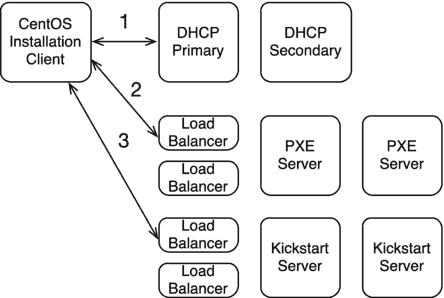
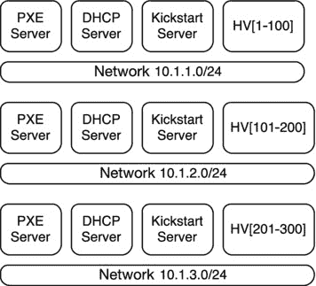
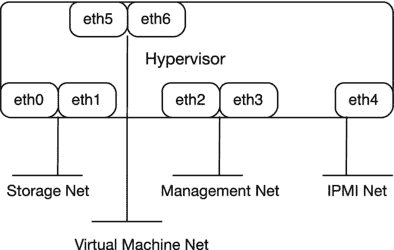
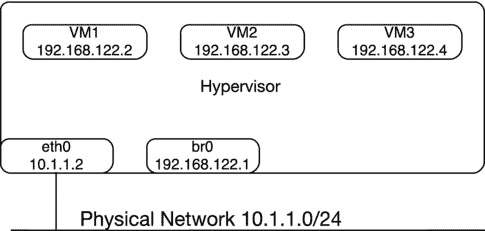
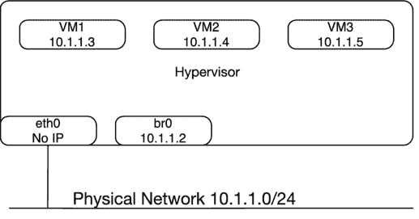
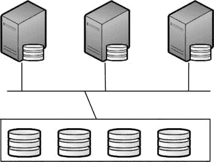
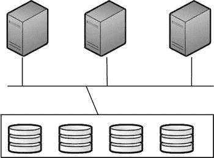
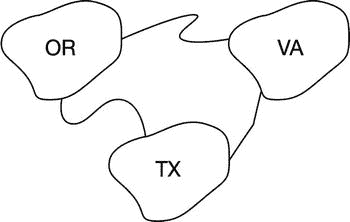

# 3.KVM 虚拟化

本章介绍了企业级虚拟化解决方案的设计和实施。我关注基于内核的虚拟机(KVM ),因为它是基于 Linux 的。本章的主题包括如何理解虚拟化、选择硬件和配置网络；存储；文件系统选择；优化；安全问题；和一个参考架构将所有这些整合在一起。

## 什么是虚拟化？

操作系统的虚拟化是在另一台机器内创建虚拟机(VM)。主机称为虚拟机管理程序，来宾称为虚拟机。如图 [3-1](#Fig1) 所示，五个虚拟机运行在一个物理机箱上。假设主机或虚拟机管理程序正在运行 RedHat 或 CentOS，并且虚拟机也在运行相同的程序，那么您最终会得到操作系统的六个副本。

使用 KVM，首先安装基本操作系统，然后安装 KVM 包，之后就可以开始创建虚拟机了。

图 3-1。

Virtualization in a nutshell

企业使用虚拟化的一些优势如下:

*   降低资本支出，因为您购买的服务器更少
*   更快的资源调配，因为您可以按需扩展
*   由于服务器数量减少，能源成本降低
*   使用高可用性使灾难恢复变得更容易
*   更容易支持传统应用程序
*   向云迈进了一步
*   由于数据中心占地面积更小，支持需求减少

无论如何，虚拟化都不是灵丹妙药。使用虚拟化的一些缺点如下:

*   虚拟化的抽象层增加了性能损失。
*   在虚拟化平台上很容易过度配置，导致高峰时段系统性能下降。
*   软件定义网络的缓慢采用导致虚拟网络难以管理，虚拟网络拥塞。
*   重写应用程序以使其对虚拟/云更加友好可能会导致额外的前期采用成本。
*   虚拟机管理程序的丢失会导致虚拟机管理程序上的大量虚拟机丢失。
*   虚拟化管理需要运营领域的额外培训和流程。

### 虚拟化解决方案

以下是一些不同的企业级虚拟化解决方案:

*   LXC [`https://linuxcontainers.org/`](https://linuxcontainers.org/)
*   OpenVZ [`http://openvz.org/Main_Page`](http://openvz.org/Main_Page)
*   QEMU/KVM[t0](http://www.linux-kvm.org/page/Main_Page)的缩写形式
*   VMware[`http://www.vmware.com/`T2】](http://www.vmware.com/)
*   XenServer [`http://www.xenserver.org/`](http://www.xenserver.org/)
*   微软的 Hyper-V，基于 Windows 的 [`http://www.microsoft.com/en-us/server-cloud/solutions/virtualization.aspx`](http://www.microsoft.com/en-us/server-cloud/solutions/virtualization.aspx)
*   Bhyve，FreeBSD 基础 [`http://bhyve.org/`](http://bhyve.org/)

本章介绍 KVM。选择哪个平台可能很复杂。一种可能的选择是使用 SPEC virt ( [`http://www.spec.org/virt_sc2013/`](http://www.spec.org/virt_sc2013/) )之类的虚拟化基准软件来比较您环境中的两个或更多解决方案。使用 SPEC virt，您可以启动许多虚拟机，然后运行不同的工作负载，如 web 服务器、数据库服务器等。最后，SPEC virt 给出了一堆数字，您可以通过比较来确定 XenServer、KVM 或其他虚拟化平台是否能提供更好的性能。

Linux 容器(LXC)；它是一个用户空间界面，用于创建和管理系统和应用程序容器。与 KVM 相比，LXC 是轻量级的，对于每个虚拟机管理程序，您通常可以创建比虚拟机多得多的 Linux 容器。在企业中，您可能会发现虚拟机和 LXC。LXC 和 KVM 的一个主要区别是，使用 KVM，你运行不同的内核，每个 VM 一个，但是使用 LXC，你共享同一个内核。LXC 也受限于与 hypervisor 相同的操作系统，但 KVM 没有；您可以在虚拟机上安装与虚拟机管理程序不同的操作系统。管理 LXC 的工具不同于管理 KVM 的工具。Libvirt 是一个虚拟化管理库，可用于管理 KVM 虚拟机和 Linux 容器。Libvirt 非常灵活，可以管理多种虚拟化技术。LXC 的例子如图 [3-2](#Fig2) 所示。

图 3-2。

LXC Design

OpenVZ 也是基于容器的，类似于 LXC。选择使用 LXC 还是 OpenVZ 可能会很复杂。LXC 有 RedHat 的支持，所以如果你是一个 CentOS 或 RedHat 商店，你可能会发现 LXC 比 OpenVZ 更容易获得支持。另一个迅速流行的基于容器的技术是 Docker([`https://www.docker.com/`](https://www.docker.com/)`).`)Docker 可用于快速应用程序部署。

十多年来，VMware 一直是虚拟化解决方案的领导者。VMware 中的虚拟机管理程序基于 Linux，管理服务器基于 Windows。使用 VMware 的一个优势是虚拟机管理程序嵌入在一些服务器中，这样可以省去安装虚拟机管理程序的麻烦。VMware 和微软虚拟化解决方案的一个注意事项是许可成本。尽管两家公司都提供免费的虚拟化解决方案，但它们的企业产品都不是免费的。

在 Linux 领域，XenServer、VMware 和 KVM 是领先的虚拟化提供商。您在企业中的选择取决于许多因素:

*   可用工程技能集
*   已安装的操作系统库
*   组织内部的政治
*   供应商和合作伙伴关系
*   业务需求
*   企业采用的技术方向

例如，如果您运行的是 Linux，而没有 Windows 服务器，那么使用 Hyper-V 是没有意义的；KVM 可能是更好的选择。另一方面，如果您喜欢具有全功能图形用户界面和基于 Linux 的虚拟机管理程序的成熟产品，VMware 可能是比 KVM 更好的解决方案。选择 KVM 的一个好处是它完全受 RedHat 支持。XenServer 也完全支持 Citrix 但是，它不像 KVM 那样紧密集成到 RedHat 或 CentOS 中。

## 企业架构

拥有企业架构意味着什么？一般来说，企业架构是指具有数千个物理或虚拟服务器的多站点设计。企业设计中遇到的大量挑战都与规模有关。例如，如果您必须部署少量 KVM 服务器，与部署数百台 KVM 服务器相比，这是一个相对容易的任务。

KVM 本身没有任何企业意识；很大程度上取决于您为 KVM 选择的管理解决方案。例如，如果您选择 oVirt 或 RHEVM，它们都支持逻辑数据中心，可用于定义不同的站点并管理它们。

## KVM 虚拟机管理程序配置

KVM 可以使用虚拟化集合安装在 CentOS 上。安装相当容易；然而，诀窍是在企业范围内以自动化的方式进行安装。为此我推荐使用 Kickstart。使用 Kickstart 安装 CentOS 后，虚拟化组可以作为安装后脚本的一部分进行安装。对于手动安装，清单 3-1 中的步骤向您展示了如何进行。

清单 3-1。手动 KVM 安装

`# Installing the virtualization group`

`# yum groupinstall "Virtualization"`

`Loaded plugins: fastestmirror, security`

`Loading mirror speeds from cached hostfile`

`Setting up Group Process`

`Loading mirror speeds from cached hostfile`

`base/group_gz | 212 kB     00:00`

`epel6/group_gz | 237 kB     00:00`

`Resolving Dependencies`

`--> Running transaction check`

`---> Package hypervkvpd.x86_64 0:0-0.9.el6 will be installed`

`---> Package qemu-kvm.x86_64 2:0.12.1.2-2.355.0.1.el6_4.9 will be installed`

`[SNIP]`

`# Viewing the packages in Virtualization group`

`# yum groupinfo Virtualization`

`Loaded plugins: fastestmirror`

`Setting up Group Process`

`Loading mirror speeds from cached hostfile`

`[SNIP]`

`Group: Virtualization`

`Description: Provides an environment for hosting virtualized guests.`

`Mandatory Packages:`

`qemu-kvm`

`Default Packages:`

`hypervkvpd`

`Optional Packages:`

`qemu-guest-agent`

`qemu-kvm-tools`

`# Creating a virtual machine. In this example, we are using br0, which is a network bridge, and routed mode. In addition, we are pointing to a local ISO image for installation, and displaying graphics of the VM using Spice.`

`# virt-install --connect qemu:///system --name`vm1.example.com`\`

`--ram 32768 --vcpus 4 --disk`path =/vm1/vm1 . example . com . qco w2`\`

`--network=bridge:br0 --os-type=linux --os-variant=rhel6 \`

`--cdrom /vm1/iso/CentOS-6.4-x86_64-bin-DVD1.iso \`

`--graphics spice,password=mypassword –autostart`

`# Enable libvirt to start automatically.`

`# chkconfig libvirtd on`

`# service libvirtd start`

`# Starting a running VM`

`# virsh start`vm1.example.com

`# Stopping a running VM`

`# virsh shutdown`vm1.example.com

`# Shutting down a VM forcefully`

`# virsh destroy`vm1.example.com

`# Deleting a VM definition`

`# virsh undefine`vm1.example.com

### 自动化 KVM 安装

Kickstart 可以调整为在任何给定时间支持数百台主机。开箱即用，在调整 TFTP 限制后，您可以轻松地一次克隆 500 个虚拟机管理程序。基本上，您可以配置 PXE 来引导虚拟机管理程序。之后，安装 CentOS 或 RedHat，然后安装 KVM 软件包。清单 3-2 显示了一个示例 PXE Linux 配置文件，清单 3-3 显示了一个示例 Kickstart 配置文件。

清单 3-2。PXE Linux 配置

`default menu.c32`

`prompt 0`

`timeout 5`

`menu title PXE Boot Menu`

`label 1`

`menu label ^1 - Install KVM`

`kernel img/6.5/x86_64/vmlinuz`

`APPEND text load_ramdisk=1 initrd=img/6.5/x86_64/initrd.img network noipv6 ksdevice=eth0 ks=``http://ks/kickstart/ks.cfg`T2】

`label local`

`menu label ^0 - Boot from first hard drive`

`com32 chain.c32`

`append hd0`

清单 3-3。Kickstart 安装后文件

`# commands sections (required)`

`bootloader --location=mbr`

`authconfig --enableshadow`

`keyboard us`

`autopart`

`# optional components`

`clearpart -all`

`firewall --disabled`

`install --url`http://ks.example.com/centos/6.4

`network --bootproto=static --ip=10.1.1.100 --netmask=255.255.255.0 --gateway=10.1.1.1 --nameserver=10.1.1.10`

`#packages section (required)`

`%packages`

`@Virtualization`

`# preinstall section (optional)`

`%pre`

`# postinstall section (optional)`

`%post`

问题是:如何让 KVM enterprise 的 Kickstart 变得友好？对于企业来说，仅设置一台 Kickstart 服务器是不够的。使用本章稍后定义的 Example.com 参考体系结构，如果我们有三个不同的站点，每个站点至少有 500 个虚拟机管理程序，我们需要为每个站点设置许多 Kickstart 服务器。此外，因为 PXE 是基于广播的，所以我们必须在不同虚拟机管理程序网络之间的路由器上设置 IP 助手。我们希望避免所有虚拟机管理程序的平面网络空间，因为这有点难以管理。一个需要回答的重要问题是:你预计会发生多少次并发启动？Kickstart 架构的解决方案基于您的回答。有许多方法可以设计一个解决方案，我在下面的章节中概述了两种可能性。

#### 集群 kickstarter 解决方案

借助该解决方案，我们可以设置两个集群:一个用于 PXE 引导，另一个用于通过 HTTP 提供 CentOS 安装文件。每个站点将有一对集群。在集群中，我们将有一对负载平衡器和真正的服务器。不使用 PXE，让我们使用 iPXE ( [`http://ipxe.org/`](http://ipxe.org/) `)`)，它支持 HTTP 上的 PXE。另一对以主模式和辅助模式运行的 DHCP 服务器将为 DHCP 服务。没有必要在负载均衡器后面运行 DHCP，因为如果您使用互联网系统联盟(ISC) DHCPD ( [`https://www.isc.org/downloads/dhcp/`](https://www.isc.org/downloads/dhcp/) `)`)，则支持主要和次要模式。使用集群解决方案的优势在于，您可以按需扩展，同时减少服务器蔓延。每个站点都有一个集群，随着传入连接的增加，您可以增加负载平衡器后面的真实服务器数量以匹配负载。必须在跨虚拟机管理程序网络的路由器上配置 IP 助手，以便将 DHCP 流量传递到 DHCP 服务器。示例如图 [3-3](#Fig3) 所示。

图 3-3。

KVM installation in clustered mode

在 BIOS 中，虚拟机管理程序的引导顺序如下:

*   硬盘驱动器
*   网络/PXE

在第一次引导期间，由于没有安装操作系统，硬盘引导将失败，然后尝试从网络上引导。因为我们已经配置了 PXE，所以引导继续，安装可以开始了。iPXE 服务器和 Kickstart 服务器的负载平衡器可以是企业认可的负载平衡器。HAProxy 是一个免费的负载均衡器( [`http://www.haproxy.org/`](http://www.haproxy.org/) )，可用于 Kickstart 服务器负载均衡。HAProxy 不支持 UDP，因此对于 PXE，您可能需要一个基于 UDP 的负载均衡器，例如 F5 networks ( `https://f5.com/`)的负载均衡器。清单 3-4 显示了使用 PXE 时的示例 DHCPD 配置文件。注意这个阶层`pxeclients`。

清单 3-4。PXE 的 DHCPD 配置

`subnet 10.1.1.0 netmask 255.255.255.0 {`

`option domain-name-servers 10.1.1.2;`

`option routers 10.1.1.1;`

`pool {`

`failover peer "failover-partner";`

`range 10.1.1.50 10.1.1.250;`

`}`

`class "pxeclients" {`

`match if substring(option vendor-class-identifier, 0, 9) = "PXEClient";`

`next-server 10.1.1.3;`

`filename = "pxelinux.0";`

`}`

在 DHCP 配置示例中，DHCP IP 地址在 10.1.1.0/24 子网中租用。提供的 IP 地址将在 50 到 250 的范围内。当服务器启动时，它首先从 DHCP 服务器获得一个 IP，此时 DHCP 服务器使用`next-server`字符串指向 PXE 服务器。引导服务器然后使用 TFTP 来联系 iPXE 服务器并下载 PXE 引导文件，服务器从该文件引导。使用 PXE 内核启动后，它可以下载 CentOS 或 RedHat 安装文件并开始安装。清单 3-5 显示了一个 DHCPD 主服务器配置文件；清单 3-6 显示了二级 DHCPD 配置文件。

清单 3-5。DHCPD 主要配置

`failover peer "failover-partner" {`

`primary;`

`address`dhcp-primary.example.com`;`

`port 519;`

`peer address`dhcp-secondary.example.com`;`

`peer port 520;`

`max` - `response` - `delay 60;`

`max` - `unacked` - `updates 10;`

`mclt 3600;`

`split 128;`

`load balance max seconds 3;`

`}`

`omapi-port 7911;`

`omapi-key omapi_key;`

`key omapi_key {`

`algorithm hmac-md5;`

`secret Ofakekeyfakekeyfakekey==;`

`}`

清单 3-6。DHCPD 辅助配置

`failover peer "failover-partner" {`

`secondary;`

`address`dhcp-secondary.example.com`;`

`port 520;`

`peer address`dhcp-primary.example.com`;`

`peer port 519;`

`max` - `response` - `delay 60;`

`max` - `unacked` - `updates 10;`

`load balance max seconds 3;`

`}`

`omapi-port 7911;`

`omapi-key omapi_key;`

`key omapi_key {`

`algorithm hmac-md5;`

`secret Ofakekeyfakekeyfakekey==;`

`}`

一级和二级配置来自 [`https://kb.isc.org/article/AA-00502/0/A-Basic-Guide-to-Configuring-DHCP-Failover.html`](https://kb.isc.org/article/AA-00502/0/A-Basic-Guide-to-Configuring-DHCP-Failover.html) 。

#### 分布式 kickstarter 解决方案

使用此解决方案，您可以设置大量 DHCP、PXE 和 Kickstart 服务器，而不是每个站点只有一个集群。分布式设置的优点是避免了集群的复杂性，并且可以将负载分散到不同的网络和不同的主机上。分布式服务器的数量取决于网络的规模。例如，如果虚拟机管理程序分布在每个站点的十个网络中，那么您至少需要十个 Kickstart、DHCP 和 PXE 服务器。这种设置的成本可能比设置一个集群的成本还要高，但是您减少了它们同时不可用的可能性。此外，您不需要在路由器上配置 IP 助手来将 BOOTP DHCP 流量转发到服务器。这种解决方案的一个缺点是您需要管理更多的硬件。但是，如果某个网络的 Kickstart 关闭，只有该网络会受到影响。图 [3-4](#Fig4) 给出了该解决方案的一个示例。需要记住的是，如果您有大量的网络，这种解决方案可能不切实际，您可能更喜欢使用集群解决方案。

图 3-4。

Distributed Kickstart configuration

## 虚拟机资源调配

安装 KVM 后，虚拟机的配置将在企业范围内发挥作用。对于虚拟机来说，使用 Kickstart 也是一个选项，如果您使用桥接网络模式，这种方式效果很好。使用虚拟机的一大优势是您可以克隆它们，并显著减少您的配置时间。例如，使用 Kickstart，每个虚拟机可能需要 20 分钟。另一方面，从克隆模板部署虚拟机可能不会超过几分钟。清单 3-7 展示了如何使用`virt`命令克隆一个虚拟机。

清单 3-7。克隆虚拟机

`# Use virt-sysprep to prepare a turned off virtual machine as a template`

`# virt-sysprep -d centos.template`

`Examining the guest ...`

`Performing "yum-uuid" ...`

`Performing "utmp" ...`

`Performing "udev-persistent-net" ...`

`Performing "sssd-db-log" ...`

`Performing "ssh-userdir" ...`

`Performing "ssh-hostkeys" ...`

`Performing "smolt-uuid" ...`

`Performing "script" ...`

`Performing "samba-db-log" ...`

`Performing "rpm-db" ...`

`Performing "rhn-systemid" ...`

`Performing "random-seed" ...`

`Performing "puppet-data-log" ...`

`Performing "pam-data" ...`

`Performing "package-manager-cache" ...`

`Performing "pacct-log" ...`

`Performing "net-hwaddr" ...`

`Performing "net-hostname" ...`

`Performing "mail-spool" ...`

`Performing "machine-id" ...`

`Performing "logfiles" ...`

`Performing "hostname" ...`

`Performing "firstboot" ...`

`Performing "dovecot-data" ...`

`Performing "dhcp-server-state" ...`

`Performing "dhcp-client-state" ...`

`Performing "cron-spool" ...`

`Performing "crash-data" ...`

`Performing "blkid-tab" ...`

`Performing "bash-history" ...`

`Performing "abrt-data" ...`

`Performing "lvm-uuids" ...`

`# Using the earlier created template, clone a new VM.`

`# virt-clone -o centos.template -n newclone -f /vm1/newclone.img`

`Allocating 'newclone.img'          | 8.0 GB     00:09`

`Clone 'newclone' created successfully.`

`# Make sure you can see the new cloned virtual machine`

`# virsh list --all`

`Id    Name                           State`

`----------------------------------------------------`

`1` `vm1.example.com                running`

`2` `vm2.example.com                running`

`-     centos.template                shut off`

`-     newclone                       shut off`

`# Start the new cloned VM.`

`# virsh start newclone`

`Domain newclone started`

`#Ensure that it is running.`

`# virsh list`

`Id    Name                           State`

`----------------------------------------------------`

`1` `vm1.example.com                running`

`2` `vm2.example.com                running`

`3     newclone                       running`

我们必须使用`virt-sysprep`来准备用于克隆的映像。`virt-sysprep`修改映像并删除某些设置，或者取消某些设置的配置，如果保留这些设置，将会在另一个虚拟机上发生冲突。sysprep 代表系统准备。你可以在 [`http://libguestfs.org/virt-sysprep.1.html`](http://libguestfs.org/virt-sysprep.1.html) 了解更多。

`virt-clone`克隆从`virt-sysprep`创建的模板。有两种类型的克隆:链接克隆和完整克隆。链接克隆依赖于克隆它的映像，并且不能删除原始映像。另一方面，完整克隆独立于克隆它的映像。

## KVM 管理解决方案

有许多解决方案可用于管理 KVM，其中一些是免费的，而另一些是商业产品。您可以在 [`http://www.linux-kvm.org/page/Management_Tools`](http://www.linux-kvm.org/page/Management_Tools) 找到此类解决方案的列表。这些选择可以大致分为两类:一类是基于命令行或 shell 的，另一类是基于图形或图形用户界面的。oVirt ( [`http://www.ovirt.org/Home`](http://www.ovirt.org/Home) )是一个非常流行的用于管理 KVM 实例的开源软件。RedHat 有一个围绕 oVirt 构建的商业产品，叫做 RHEVM，或者 red hat Enterprise virtual ization Manager([`http://www.redhat.com/products/cloud-computing/virtualization/`](http://www.redhat.com/products/cloud-computing/virtualization/))。第三种选择是使用 libvirt API 编写自己的管理。你可以在 [`http://libvirt.org/`](http://libvirt.org/) 了解更多关于 libvirt 的信息。

### Libvirt

Libvirt 是一个工具包，支持与各种虚拟化平台交互，KVM 就是其中之一。libvirt 的 API 非常广泛，如果您围绕 KVM 编写自己的管理，它将非常有用。libvirt 的 C 库参考可以在 [`http://libvirt.org/html/libvirt-libvirt.html`](http://libvirt.org/html/libvirt-libvirt.html) 找到。libvirt 有许多可用的语言绑定，比如 C#、Java、OCaml、Perl、PHP、Python 和 Ruby。在下面的例子中，我使用 Python 绑定来演示如何为 KVM 编写一个基本的管理应用程序(清单 3-8)。您可以在 [`http://libvirt.org/bindings.html`](http://libvirt.org/bindings.html) 了解更多绑定信息。

清单 3-8。示例 Libvirt Python 代码

`import libvirt`

`import sys`

`# Open a read-only connection to the local hypervisor.`

`conn = libvirt.openReadOnly(None)`

`if conn == None:`

`print 'Failed to open connection to the hypervisor'`

`sys.exit(1)`

`# Get some information about the hypervisor.`

`hv_info = conn.getInfo()`

`# Print out the architecture, memory, cores, and speed of the processor.`

`print 'hv arch {0}'.format(hv_info[0])`

`print 'hv memory {0}'.format(hv_info[1])`

`print 'cores in hv {0}'.format(hv_info[2])`

`print 'Mhz speed of hv CPU {0}'.format(hv_info[3])`

### 维尔什

virsh 包含在 KVM 中，它是管理 KVM 的一种快速简单的方法。如果您喜欢简单，可以使用 virsh 并跳过其他管理解决方案。virsh 使用 libvirt。但是，您必须围绕 virsh 编写脚本来管理大量虚拟机管理程序。清单 3-9 展示了一些使用 virsh 的例子。你可以在 [`http://linux.die.net/man/1/virsh`](http://linux.die.net/man/1/virsh) 了解更多关于 virsh 的信息。

清单 3-9。生动的例子

`# Given a file called hv.txt, which contains a list of KVM hypervisors, loop through the file and get a list of VMs running on each hypervisor.`

`# cat hv.txt`

`hv1.example.com`

`hv2.example.com`

`hv3.example.com`

`# cat hv.sh`

`#!/bin/bash`

`HVLIST=hv.txt`

`USER=fakeuser`

`for hv in `cat ${HVLIST}``

`do`

`echo ${hv}`

`virsh -c qemu+ssh://${USER}@${hv}/system list`

`done`

`# When you run hv.sh, below is a sample output you may get.`

`# ./hv.sh`

`hv1.example.com`

`Id    Name                           State`

`----------------------------------------------------`

`1`vm1.example.com`running`

`3`vm2.example.com`running`

`4`vm3.example.com`running`

`hv2.example.com`

`Id    Name                           State`

`----------------------------------------------------`

`1`vm4.example.com`running`

`3`vm5.example.com`running`

`4`vm6.example.com`running`

`hv3.example.com`

`Id    Name                           State`

`----------------------------------------------------`

`1`vm7.example.com`running`

`3`vm8.example.com`running`

`4`vm9.example.com`running`

`# Get information on architecture, CPU, and memory of hypervisor.`

`# In hv.sh, replace the 'list' command with 'nodeinfo' command`

`[SNIP]`

`for hv in `cat ${HVLIST}``

`do`

`echo ${hv}`

`virsh -c qemu+ssh://${USER}@${hv}/system nodeinfo`

`done`

`# ./hv.sh`

`hv1.example.com`

`CPU model:           x86_64`

`CPU(s):              8`

`CPU frequency:       3292 MHz`

`CPU socket(s):       1`

`Core(s) per socket:  4`

`Thread(s) per core:  2`

`NUMA cell(s):        1`

`Memory size:         16301672 KiB`

`Hv2.example.com`

`CPU model:           x86_64`

`CPU(s):              8`

`CPU frequency:       3292 MHz`

`CPU socket(s):       1`

`Core(s) per socket:  4`

`Thread(s) per core:  2`

`NUMA cell(s):        1`

`Memory size:         16301672 KiB`

`Hv3.example.com`

`CPU model:           x86_64`

`CPU(s):              8`

`CPU frequency:       3292 MHz`

`CPU socket(s):       1`

`Core(s) per socket:  4`

`Thread(s) per core:  2`

`NUMA cell(s):        1`

`Memory size:         16301672` `KiB`

## 选择物理服务器

什么样的服务器适合虚拟化平台？这是拥有一个成功的虚拟化平台需要回答的基本问题。本节探讨了一些选项，如定制、知名品牌、开放式计算、机架式和刀片式服务器。

### 定制服务器

您可以购买部件，组装自己的服务器。这种方法的一个优点是您可以完全控制服务器的每个组件，如硬盘、CPU、内存、网络、外形和电源。缺点是你必须花很多时间来确保组件一起工作。此外，您必须维护备件，因为您现在选择的零件将来可能会停产。与名牌服务器相比，您的前期资本支出应该较低。

### 名牌

与定制服务器相比，戴尔、惠普、IBM 等知名品牌可以让您更容易做出购买决定。选择这种方法的明显优势是，您不必担心获得未经测试的硬件。此外，供应商在整个支持合同期间负责硬件支持；因此，你不一定要储存备用零件。缺点是与定制服务器相比，成本更高，因为您需要为供应商进行集成测试付费，还需要为支持付费。

### 开放式计算兼容服务器

开放计算( [`http://www.opencompute.org/`](http://www.opencompute.org/) )是一个旨在用符合特定规格的部件以低成本制造硬件的项目。如果您购买的硬件符合开放式计算服务器的规格，那么您可以肯定，您得到的硬件是为低成本运行而设计的。

### 机架式和刀片式服务器

刀片服务器在虚拟化领域非常受欢迎。原因是每个刀片都可以是虚拟机管理程序，这允许在给定的机箱中有大量虚拟机。

机架式服务器也可以用于虚拟化；但是，相对于给定机架中可以拥有的虚拟机数量，您会失去刀片式服务器提供的密度。

思科 UCS 或统一计算系统是另一种类型的刀片服务器的例子。Cisco UCS 有一个称为光纤互连的控制器，用于管理机箱中的刀片。大多数刀片服务器没有外部控制器模块。

### 做出你的选择

无论您选择哪种平台，您都应该选择以下一些功能:

*   易于维护
*   波形因数
*   备件的可用性
*   低功耗
*   远程控制台访问

在选择 CPU 时，市场上的两大巨头是英特尔和 AMD。在下面的例子中，我主要关注英特尔。您希望英特尔 CPU 具备的一些虚拟化特性包括

*   英特尔 VT-x
*   英特尔 vt-d
*   英特尔 VT-c

清单 3-10 显示了如何使用`virsh`命令获得关于特定管理程序的信息。

清单 3-10。KVM 虚拟机管理程序信息

`# Get version information.`

`# virsh version`

`Compiled against library: libvirt 0.10.2`

`Using library: libvirt 0.10.2`

`Using API: QEMU 0.10.2`

`Running hypervisor: QEMU 0.12.1`

`#View information about a hypervisor.`

`# virsh sysinfo`

`<sysinfo type='smbios'>`

`<bios>`

`<entry name='vendor'>Dell Inc.</entry>`

`<entry name='version'>2.2.3</entry>`

`<entry name='date'>10/25/2012</entry>`

`<entry name='release'>2.2</entry>`

`</bios>`

`<system>`

`<entry name='manufacturer'>Dell Inc.</entry>`

`<entry name='product'>PowerEdge T110 II</entry>`

`<entry name='version'>Not Specified</entry>`

`<entry name='serial'>XXXXXXX</entry>`

`<entry name='uuid'>4C4C4544-0034-5210-8054-B7C04F435831</entry>`

`<entry name='sku'>Not Specified</entry>`

`<entry name='family'>Not Specified</entry>`

`</system>`

`<processor>`

`<entry name='socket_destination'>CPU1</entry>`

`<entry name='type'>Central Processor</entry>`

`<entry name='family'>Xeon</entry>`

`<entry name='manufacturer'>Intel(R) Corporation</entry>`

`<entry name='signature'>Type 0, Family 6, Model 58, Stepping 9</entry>`

`<entry name='version'>Intel(R) Xeon(R) CPU E3-1230 V2 @ 3.30GHz</entry>`

`<entry name='external_clock'>100 MHz</entry>`

`<entry name='max_speed'>4000 MHz</entry>`

`<entry name='status'>Populated, Enabled</entry>`

`<entry name='serial_number'>NotSupport</entry>`

`<entry name='part_number'>FFFF</entry>`

`</processor>`

`<memory_device>`

`<entry name='size'>4096 MB</entry>`

`<entry name='form_factor'>DIMM</entry>`

`<entry name='locator'>DIMM A2</entry>`

`<entry name='bank_locator'>BANK 0</entry>`

`<entry name='type'>DDR3</entry>`

`<entry name='type_detail'>Synchronous Unbuffered (Unregistered)</entry>`

`<entry name='speed'>1600 MHz</entry>`

`<entry name='manufacturer'>80CE000080CE</entry>`

`<entry name='serial_number'>85DF74FD</entry>`

`<entry name='part_number'>M391B5273DH0-YK0</entry>`

`</memory_device>`

`[SNIP]`

`</sysinfo>`

## 设计 KVM 网络

Sun Microsystems 的 John Burdette Gage 曾经说过，“网络就是计算机”，这是非常正确的。您可以拥有最好的存储解决方案和最好的物理硬件，但是如果没有快速网络，它们将毫无用处。大多数现代网络的每台物理服务器至少有一个或多个 10GB 网络适配器。当使用 KVM 进行虚拟化时，10GB 是每个网络接口的最低容量。在此之上，网络拓扑层更为重要。对于企业网络，不需要考虑平面网络空间的问题。

Open vSwitch ( [`http://openvswitch.org/`](http://openvswitch.org/) )是一款流行的虚拟交换机，可以配合 KVM 使用。使用 Open vSwitch 的优势在于它提供了 KVM 网络不一定提供的灵活性。它是可编程配置的，并且支持许多企业友好的特性。

KVM 支持以下类型的网络来为虚拟机分配 IP 地址:

*   网络地址转换(NAT)虚拟网络
*   桥接网络
*   外围组件互连(PCI)的物理设备分配
*   单根输入/输出虚拟化

您的虚拟机管理程序上应该有多少个物理网卡？一种可能性是将网络接口划分如下:

*   两个处于故障切换模式，用于存储
*   两个处于故障转移模式，用于管理 KVM
*   两个虚拟机处于故障转移模式
*   一个用于基于带外智能平台管理接口(IPMI)的访问

示例如图 [3-5](#Fig5) 所示。

图 3-5。

Network interfaces on hypervisor

### 网络地址转换

NAT 一般与私有 IP 空间 RFC 1918 一起使用，RFC 1918 是 10.0.0.0/8、172.16.0.0/12 和 192.168.0.0/16。默认情况下，KVM 为虚拟机选择 192.168.122.0/24 范围内的 IP 空间。如果您决定使用 NAT，并且您的虚拟机管理程序本身位于 NAT 网络上，那么您实际上是在为虚拟机访问启用双重 NAT，如图 [3-6](#Fig6) 所示。

图 3-6。

NAT mode

### 桥接网络

在桥接网络模式下，虚拟机和物理网络之间不进行 NAT。虚拟机的行为就好像它是物理网络上的另一个节点。如果物理虚拟机管理程序位于 NAT 网络上，则虚拟机共享同一个网络。这样做的好处是降低了整个网络管理的复杂性。示例如图 [3-7](#Fig7) 所示。

图 3-7。

Bridged mode

清单 3-11 中包含了几个使用`virsh`网络命令的例子。

清单 3-11。KVM 网络命令

`# View defined networks. By default, KVM creates one network called “default.”`

`# This is the 192.168.122.0/24 network.`

`# virsh net-list`

`Name                 State      Autostart     Persistent`

`--------------------------------------------------`

`default              active     yes           yes`

`# Get information on a given network names.`

`# Each network is given a unique UUID, and you can see that the default network is active.`

`# virsh net-info default`

`Name            default`

`UUID            f604318f-d3ad-45cb-8e27-d2519d79a3e9`

`Active:         yes`

`Persistent:     yes`

`Autostart:      yes`

`Bridge:` `virbr0`

### 网络结合

网络绑定允许两个接口处于主动/主动或主动/被动模式。网络绑定的优势在于它提供了针对物理网络接口硬件故障的保护。清单 3-12 显示了一个网络绑定设置。

清单 3-12。网络绑定示例

`-bash-3.2$ cat /etc/sysconfig/network-scripts/ifcfg-bond0`

`DEVICE=bond0`

`BOOTPROTO=none`

`ONBOOT=yes`

`IPADDR=10.1.1.2`

`NETMASK=255.255.255.0`

`BONDING_OPTS="mode=1 miimon=80 primary=slave"`

`-bash-3.2$ cat /etc/sysconfig/network-scripts/ifcfg-eth0`

`DEVICE=eth0`

`ONBOOT=yes`

`BOOTPROTO=none`

`USERCTL=no`

`MASTER=bond0`

`SLAVE=yes`

`HWADDR=00:E0:81:C5:76:0A`

`-bash-3.2$ cat /etc/sysconfig/network-scripts/ifcfg-eth1`

`DEVICE=eth1`

`ONBOOT=yes`

`BOOTPROTO=none`

`USERCTL=no`

`MASTER=bond0`

`SLAVE=yes`

`HWADDR=00:E0:81:C5:73:36`

`-bash-3.2$ cat /etc/modprobe.conf`

`alias eth0 e1000e`

`alias eth1 igb`

`alias eth2 igb`

`alias scsi_hostadapter ahci`

`alias bond0 bonding`

`options bond0 miimon=80 mode=` `1`

### 虚拟局域网

虚拟局域网(VLANs)有助于创建广播域，从而使网络更易于管理。在给定的企业中，经常会发现大量的 VLANs。关于将 KVM 与 VLAN 一起使用，如果虚拟机将与虚拟机管理程序在同一个 VLAN 上，那么您不必在 KVM 的网络端进行任何额外的配置。然而，这种架构并不实用，因为虚拟机将位于不同的 VLANs 上。因此，对于企业来说，推荐的选择是将接口中继到 KVM 管理程序中。中继允许多个 VLANs 通过同一个接口。例如，如果虚拟机管理程序网络是 10.1.1.0/24，则不同网络(如 10.1.2.0/24 或 10.1.3.0/24)上的虚拟机可以驻留在虚拟机管理程序上，而不会出现任何网络问题。RedHat 或 CentOS 在内核中支持 VLANs，这相当容易配置。示例如图 [3-8](#Fig8) 所示。

图 3-8。

VLAN configuration of VMs

### 打开 vSwitch

如前所述，您可以用更加灵活的 Open vSwitch 代替 KVM 的内置网络。Open vSwitch 是一个深入的主题，其内容超出了本章的范围。我推荐阅读这篇文章—[`http://git.openvswitch.org/cgi-bin/gitweb.cgi?p=openvswitch;a=blob_plain;f=INSTALL.KVM;hb=HEAD`—](http://git.openvswitch.org/cgi-bin/gitweb.cgi?p=openvswitch;a=blob_plain;f=INSTALL.KVM;hb=HEAD%E2%80%94to)开始配置 Open vSwitch。

## 设计 KVM 存储

谈到存储，您必须考虑最终目标，并以此为基础做出决定。如果最终目标是拥有可处置的虚拟机，并在应用程序中内置冗余，则可能不需要在 KVM 虚拟机管理程序之间拥有通用的共享存储解决方案。另一方面，如果您正在寻求容错能力，并且希望即使一个或多个虚拟机管理程序关闭，您的虚拟机也能正常运行，那么共享存储就是最佳选择。

如果没有共享存储，当虚拟机管理程序停止运行时，该虚拟机管理程序上的虚拟机也会停止运行。因为虚拟机映像存储在虚拟机管理程序上，或者存储在不与其他虚拟机管理程序共享的存储子系统上，所以其他活动的虚拟机管理程序无法访问虚拟机的映像，也无法启动关闭的虚拟机。基本上，您必须启动崩溃的虚拟机管理程序，然后启动在其上运行的虚拟机。

借助共享存储，每个虚拟机管理程序都可以访问同一个虚拟机映像文件，这样，如果主机虚拟机管理程序崩溃，虚拟机就可以在任何其他虚拟机管理程序上运行。

设计存储时要考虑的另一个问题是，是从本地磁盘引导虚拟机管理程序，还是使用网络引导。使用网络引导消除了对本地硬盘驱动器的需求，并且可以省钱。另一方面，这种解决方案增加了复杂性，因为您必须投资支持网络引导的存储区域网络。

如果没有共享存储，每个虚拟机管理程序都有自己的磁盘，KVM 和虚拟机的本地磁盘都驻留在该磁盘上，如图 [3-9](#Fig9) 所示。

图 3-9。

KVM without shared storage

借助共享存储，每个虚拟机管理程序都有自己的安装 KVM 的磁盘，虚拟机存储在共享存储上。共享存储可以是共享区域网络(SAN)，如图 [3-10](#Fig10) 所示。

图 3-10。

KVM with shared storage

使用共享存储，没有本地磁盘，虚拟机管理程序从 SAN 启动，虚拟机也存储在 SAN 上，如图 [3-11](#Fig11) 所示。

图 3-11。

KVM with no local disk and SAN boot

如果您决定需要共享存储提供的灵活性，您应该使用哪种共享存储？一些可用的选项包括:

*   网络文件系统
*   存储
*   基于光纤通道的 LUN

对于 NFS，专用的 NFS 服务器或 NFS 设备是合适的。在企业网络中，NFS 设备往往更普遍地用于虚拟机的共享存储，而不是专用于运行 NFS 的 Linux 服务器。NFS 设备(如 NetApp)的优势在于，与运行 NFS 的 Linux 服务器相比，您更有可能获得更快的性能。您不能单独使用 NFS 来引导虚拟机管理程序，但是您可以在虚拟机管理程序上使用 NFS 挂载的分区来存储您的虚拟机映像。

iSCSI 可用于从网络上启动您的虚拟机管理程序。您可以在 Linux 机器上安装 iSCSI，也可以使用专用的存储设备，例如支持 iSCSI 的 Netapp。iSCSI 目标将是存储设备，启动器将是虚拟机管理程序。如果您决定使用 iSCSI 进行引导，建议您在虚拟机管理程序上使用专用网卡。如果您决定不使用 iSCSI 来引导虚拟机管理程序，那么您仍然可以使用 iSCSI 来装载 LUN 并存储您的虚拟映像。您必须使用 iSCSI 多路径，才能让同一个 LUN 跨其他虚拟机管理程序可见。

## 图像选择

您选择的虚拟机映像类型会影响所使用的存储量和虚拟机的性能。手册页( [`http://linux.die.net/man/1/qemu-img`](http://linux.die.net/man/1/qemu-img) )中列出了一些可用的图像类型，包括:

*   生的
*   Qcow2
*   格式
*   母牛
*   植物草图索引（vegetation draught index 的缩写）
*   虚拟机磁盘文件
*   虚拟机
*   Cloop(克隆)

列表中最受欢迎的是 Qcow/Qcow2 和 Raw。已经对其中一种技术的性能和存储使用进行了大量研究。Raw 图像比 Qcow2 图像具有更好的性能；但是，您不能“快照”原始图像。拍摄虚拟机快照的一个好处是，您可以在代码部署之前拍摄快照，如果部署不顺利，您可以简单地恢复到快照的前一个版本(清单 3-13)。

清单 3-13。快照管理

`# Creating a snapshot`

`# virsh snapshot-create`vm1.example.com

`Domain snapshot 1407102907 created`

`# Viewing a list of snapshots`

`# virsh snapshot-list`vm1.example.com

`Name                 Creation Time             State`

`------------------------------------------------------------`

`1407102907           2014-08-03 14:55:07 -0700 shutoff`

`# Getting snapshot information`

`# virsh snapshot-info`vm1.example.com`--current`

`Name:           1407102907`

`Domain:`vm1.example.com

`Current:        yes`

`State:          shutoff`

`Location:       internal`

`Parent:         -`

`Children:       0`

`Descendants:    0`

`Metadata:       yes`

`# View XML information about snapshot`

`# virsh snapshot-dumpxml`vm1.example.com`1407102907`

`<domainsnapshot>`

`<name>1407102907</name>`

`<state>shutoff</state>`

`<creationTime>1407102907</creationTime>`

`<memory snapshot='no'/>`

`<disks>`

`<disk name='vda' snapshot='internal'/>`

`<disk name='hdc' snapshot='no'/>`

`</disks>`

`<domain type='kvm'>`

`<name>`vm1.example.com`</name>`

`<uuid>ba292588-6570-2674-1425-b2ee6a4e7c2b</uuid>`

`<memory unit='KiB'>1048576</memory>`

`<currentMemory unit='KiB'>1048576</currentMemory>`

`<vcpu placement='static'>1</vcpu>`

`<os>`

`<type arch='x86_64' machine='rhel6.4.0'>hvm</type>`

`<boot dev='hd'/>`

`</os>`

`[SNIP]`

`</domain>`

`</domainsnapshot>`

`# Revert to a snapshot.`

`# virsh snapshot-revert`vm1.example.com`–current`

`# Delete a snapshot.`

`# virsh snapshot-delete`vm1.example.com`--current`

域快照 1407102907 已删除

## 文件系统选择

因为虚拟机映像基本上是文件，所以问题出现了:您使用哪个文件系统来放置文件？一些选项是

*   使用文件系统，如 ext3、ext4、XFS 或类似的系统
*   将虚拟机放在 Linux 逻辑卷管理器(LVM)分区上

当使用虚拟机管理程序上的文件系统来放置虚拟机文件时，会产生访问虚拟机的开销。这种开销并不多，但是通过将虚拟机放在例如未格式化的 LVM 上，您可能会获得更好的性能。

文件系统的布局也很重要，不仅在虚拟机管理程序上如此，在虚拟机上也是如此。清单 3-14 和清单 3-15 显示了一个最小安装的 VM 磁盘分区。

清单 3-14。虚拟机磁盘分区

`# Disk partition layout`

`# We reserve 500MB for boot and the rest for an LVM physical volume.`

`# This is based on an 80GB disk size for a VM.`

`# parted -l /dev/sda2`

`Model: XX (scsi)`

`Disk /dev/sda: 85.9GB`

`Sector size (logical/physical): 512B/512B`

`Partition Table: msdos`

`Number  Start   End     Size    Type     File system  Flags`

`1      1049kB  538MB   537MB   primary  ext4         boot`

`2      538MB   85.9GB  85.4GB  primary               lvm`

`[SNIP]`

`Using LVM we create on the physical volume.`

`Size is based on what is left over after allocating 500MB for boot.`

`# pvs`

`PV         VG   Fmt  Attr PSize  PFree`

`/dev/sda2  vg0  lvm2 a--  79.50g    0`

`# One volume group that covers the entire disk`

`# vgs`

`VG   #PV #LV #SN Attr   VSize  VFree`

`vg0    1   4   0 wz--n- 79.50g    0`

`# I have created logical volumes with names that are self-descriptive.`

`# lvs`

`LV      VG   Attr       LSize  Pool Origin Data%  Move Log Cpy%Sync Convert`

`lv_home vg0  -wi-ao---- 20.00g`

`lv_root vg0  -wi-ao---- 47.50g`

`lv_swap vg0  -wi-ao----  2.00g`

`lv_var  vg0  -wi-ao---- 10.` `00g`

使用 LVM 的一个明显优势是，您可以按需增加磁盘分区。引导分区不能在 LVM 上，因为 LVM 内核模块没有加载到`initrd` RAM 磁盘中的挂载`boot`。但是，所有其他分区都可以是 LVM 分区。关于卷组的命名，我选择了一个简单的名称，即顺序名称。你可以挑适合你的。对于每个逻辑卷的大小，我基于 VM 磁盘大小，即 80GB。表 [3-1](#Tab1) 中列出了 RedHat 提出的适用于 CentOS 的交换空间大小建议。

表 3-1。

CentOS/RedHat swap recommendations

<colgroup><col> <col></colgroup> 
| 安装的内存 | 推荐的互换 |
| --- | --- |
| 2GB 或更少 | 两次安装的 RAM |
| >2-8 兆字节 | 与 RAM 数量相同 |
| >8-64 英寸 | 最低 4GB |
| 超过 64GB | 最低 4GB |

清单 3-15。虚拟机文件系统布局

`# cat /etc/fstab`

`/dev/mapper/vg0-lv_root /       ext4    noatime,nodiratime,relatime        1 1`

`UUID=141c589e-a255-4cfd-b1bc-8fd337c22cd5 /boot    ext4    defaults        1 2`

`/dev/mapper/vg0-lv_home /home   ext4    noatime,nodiratime,relatime        1 2`

`/dev/mapper/vg0-lv_var  /var    ext4    noatime,nodiratime,relatime        1 2`

`/dev/mapper/vg0-lv_swap swap                    swap       defaults        0 0`

`tmpfs                   /dev/shm                tmpfs      defaults        0 0`

`devpts                  /dev/pts                devpts     gid=5,mode=620  0 0`

`sysfs                   /sys                    sysfs      defaults        0 0`

`proc                    /proc                   proc       defaults        0 0`

## 虚拟图像优化

应该对虚拟机进行优化，以便在 KVM 虚拟机管理程序上更高效地运行。考虑到企业拥有大量虚拟机管理程序和虚拟机，如果不进行优化，性能可能会受到影响。应该在虚拟机上进行的更改因系统内核设置和服务而异。在这一节中，我提供了你可以用来优化图像的各种步骤。

在安装 CentOS 或 RedHat 时，选择最小安装，不要开始其他操作。这种策略减小了图像的大小。较小的映像克隆速度更快，即使您使用 Kickstart，它们的安装速度也会更快。此外，您只需要最少的软件包，从而减少了安全风险。

`# Configure tuned for virtual guest`

`# tuned-adm profile virtual-guest`

`# chkconfig tuned on`

`tuned`是一个系统调优守护进程，它根据配置文件设置各种系统/内核参数。

禁用不需要的服务。让它们处于启用状态会减慢启动过程，并且存在安全风险。以下是一些可能被关闭的服务:

`# for svc in ip6tables cups abrtd abrt-ccpp atd kdump mdmonitor NetworkManager; do chkconfig $svc off; done`

`root# for svc in ip6tables cups abrtd abrt-ccpp atd kdump mdmonitor NetworkManager; do service $svc stop; done`

`# Disable IPv6 if you are not using it.`

`# echo "NETWORKING_IPV6=no`

`IPV6INIT=no" >> /etc/sysconfig/network`

`# echo "`

`# Disable IPv6.`

`net.ipv6.conf.all.disable_ipv6 = 1`

`net.ipv6.conf.default.disable_ipv6 = 1`

`" >> /etc/sysctl.conf`

`# smartd monitors hard drives; no need for that on a VM`

`root# service smartd stop`

`root# chkconfig --del smartd`

`# Allow virsh shutdown to turn of the VM.`

`# If we do a minimal CentOS install, acpid is not installed by default.`

`# yum install acpid`

`# chkconfig acpid on`

`# service acpid start`

要使用`virsh console`命令访问虚拟机的控制台，您必须通过串行控制台重定向虚拟机控制台输出。以下步骤向您展示了如何做到这一点:

`# Getting serial console to work on KVM with RHEL 6 and also with GRUB`

`# Comment out splashimage and hiddenmenu`

`# Remove 'rhgb' and 'quiet' from the kernel line`

`# Add the 'serial' and the 'terminal' line`

`# Add the last two 'console' parameters on the kernel line`

`# Now try to access the serial console using 'virsh console <hostname>'`

`# cat /etc/grub.conf`

`# grub.conf generated by anaconda`

`#`

`# Note you do not have to rerun grub after making changes to this fil.e`

`# NOTICE:  You have a /boot partition. This means that`

`#          all kernel and initrd paths are relative to /boot/, e.g.,`

`#          root (hd0,0)`

`#          kernel /vmlinuz-version ro root=/dev/mapper/vg_ns-lv_root`

`#          initrd /initrd-[generic-]version.img`

`# boot=/dev/vda`

`default=0`

`timeout=10`

`serial --unit=0 --speed=115200`

`terminal --timeout=5 serial console`

`#splashimage=(hd0,0)/grub/splash.xpm.gz`

`#hiddenmenu`

`title CentOS (2.6.32-431.el6.x86_64)`

`root (hd0,0)`

`kernel /vmlinuz-2.6.32-431.el6.x86_64 ro root=/dev/mapper/vg_ns-lv_root rd_NO_LUKS LANG=en_US.UTF-8 rd_NO_MD SYSFONT=latarcyrheb-sun16 rd_LVM_LV=vg_ns/lv_root crashkernel=auto  KEYBOARDTYPE=pc KEYTABLE=us rd_LVM_LV=vg_ns/lv_swap rd_NO_DM console=tty0 console=ttyS0,115200`

`initrd /initramfs-2.6.32-431.el6.x86_64.` `img`

## 安全考虑

在虚拟环境中，许多虚拟机可能在物理虚拟机管理程序上运行，虚拟机上可能有彼此不相关的应用程序。虚拟机是虚拟机管理程序上任何其他进程一样的进程。理论上，可以脱离一台虚拟机并访问虚拟机管理程序，然后从那里访问另一台虚拟机。一般来说，KVM 维护人员很快就能解决安全问题。

SELinux 为虚拟机管理程序和虚拟机提供了一个安全层。如果您决定使用 SELinux，请记住，要让 KVM 与 SELinux 一起工作，需要做一些更改。

虚拟机管理程序和虚拟机上的 iptables 可以在网络层保护主机。

网络设计和虚拟机分布在安全性方面也发挥着作用。例如，一些企业可能会选择特定于应用程序的虚拟机管理程序。因此，如果有 24 个应用程序，那么每个应用程序至少有 24 组众多的虚拟机管理程序。如果一个或多个应用程序比其他应用程序有更多的安全风险，这种隔离可以提供保护。

当然，网络发挥着巨大的作用。为虚拟机管理程序、IPMI 管理、存储以及每个应用程序网络建立一个单独的管理网络有助于为安全毯添加更多层。

总的来说，安全性必须与易用性相平衡。请记住，可能还必须遵守任何政府或其他安全标准，如美国国家标准与技术研究所和 PCI 的标准。

## 参考架构

基于我们在本章中学到的知识，让我们为一个名为 Example.com 的样本企业设计企业虚拟化策略。

该公司是一家在线零售商。其大部分服务器运行 Apache 来满足其在线零售需求。还有一些 MySQL 数据库服务器充当 Apache 的后端。

参考架构由一家拥有三个数据中心的企业组成，一个在俄勒冈州，另一个在德克萨斯州，第三个在弗吉尼亚州，如图 [3-12](#Fig12) 所示。每个数据中心有 500 个虚拟机管理程序，每个虚拟机管理程序上运行 10 个虚拟机，每个站点总共有 5000 个虚拟机。三个站点总共有 15，000 台虚拟机。这些虚拟机都基于 Linux，运行 CentOS 6.5。虚拟机管理程序运行 CentOS 6.5，其上安装了 KVM。

图 3-12。

Example.com data center sites

虚拟机管理程序的硬件由名牌服务器组成，有七个 10GB 网卡，两个用于存储网络，两个用于管理网络，一个用于 IPMI，两个用于应用程序网络。每台服务器中有两个基于固态驱动器(SSD)的硬盘，两个驱动器都是镜像的，每个驱动器的大小为 120GB。每台服务器上有两个 CPUsCPU 是英特尔 E7-8870 2.4Ghz 至强处理器，具有 10 个内核和 20 个线程。每个线程可以作为一个虚拟 CPU 分配给一个虚拟机，总共有 40 个虚拟 CPU。如果虚拟机密度为每个虚拟机管理程序 10 个虚拟机，我们可以为每个虚拟机分配 4 个虚拟 CPU。每个虚拟机平均需要 32GB 的物理内存，每台服务器的总内存占用量为 320GB。再加上虚拟机管理程序的开销，您需要 384GB 的物理内存。服务器有 12 个物理内存插槽；如果我们使用 32GB 的 DIMMS，那么我们总共可以得到 384GB 的物理内存，这将满足我们的需求。

对于存储，`Example.com`使用 NetApp NFS 文件服务器来存储虚拟机映像。来自文件服务器的共享装载在虚拟机管理程序上。因为每个站点有 500 个虚拟机管理程序，所以虚拟机管理程序被划分为更小的单元，每个单元 100 个虚拟机管理程序，每个站点总共有 5 个单元。一个 pod 由 100 个虚拟机管理程序、1000 个虚拟机和一个作为群集一部分的文件服务器组成。该群集至少有两个磁头和许多磁盘架。样品舱如图 [3-13](#Fig13) 所示。

选择这种架构的原因是基于`Example.com`的工作负载类型。整个工程平台的工作负载非常一致，因此我们可以在一台具有四个虚拟 CPU 的虚拟机上实现标准化。在内存使用方面，Apache 实例已经在 32GB 的 RAM 上实现了标准化。这样做的原因是基于 Apache 孩子的数量。跨虚拟机标准化工作负载；因此，Apache prefork 进程的数量在不同的虚拟机上是相同的。假设每个进程消耗 20 MB 的内存，每个 VM 可以支持 1200 个 Apache 进程，总共消耗 24GB 的 RAM，剩下 8GB 的 RAM 用于操作系统和其他进程。

对于图像类型，`Example.com`使用 Qcow2，因为我们希望能够对图像进行快照，而原始图像类型不支持快照。

图 3-13。

A pod with ten hypervisors and a cluster of NetApp filers

对于管理，`Example.com`使用定制的脚本和程序，这些脚本和程序使用 libvirt Python API。

## 结论

KVM 是一个强大的虚拟化解决方案。在 RedHat 等主要 Linux 供应商和开源社区的支持下，它正在迅速增加其虚拟化市场份额。使用本章中介绍的一种或多种设计技术，您可以创建一个稳定且易于管理的企业基础设施。