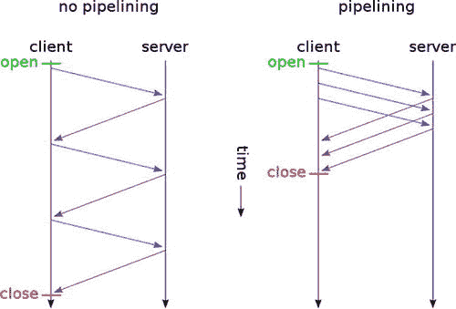
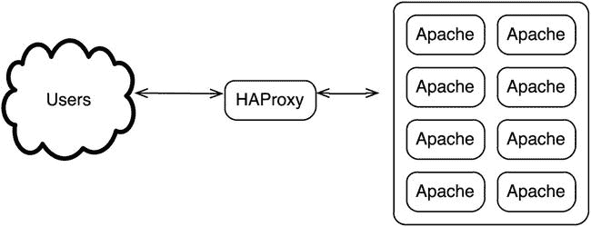
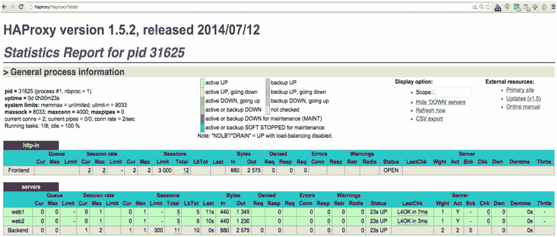

# 6.Apache 支持企业级容错

Web 服务是托管在互联网上的应用程序的基础。本章介绍 Apache HTTP 服务器，它运行在大多数互联网网站上。首先简要讨论了 Apache 软件基金会(ASF ),然后深入分析了 HTTP 和 Apache HTTP。对 HTTP 负载均衡器 HAProxy 进行了研究，并对故障转移软件 Keepalived 进行了简要总结。

## 阿帕奇软件基金会

ASF 由 150 多个开源项目组成。这些项目的类别包括数据库、HTTP、邮件、大数据、构建管理等等。他们的一些更受欢迎的项目包括:

*   Apache Hadoop ( [`https://hadoop.apache.org/`](https://hadoop.apache.org/) )
*   Apache CouchDB ( [`https://couchdb.apache.org/`](https://couchdb.apache.org/)
*   Apache HTTP 服务器( [`https://httpd.apache.org/`](https://httpd.apache.org/) `)`
*   阿帕奇流量服务器( [`https://trafficserver.apache.org/`](https://trafficserver.apache.org/) `)`
*   阿帕奇雄猫( [`https://tomcat.apache.org/`](https://tomcat.apache.org/) )

您可以在 [`https://projects.apache.org/`](https://projects.apache.org/) 查看 Apache 项目页面，查看所有 Apache 项目的完整列表。相信开源软件的企业可以从 Apache 项目中受益匪浅。在构建 Linux 基础设施时，使用 ASF 支持的软件可以为您做以下事情:

*   降低做生意的成本
*   让您获得高质量的软件
*   让您的组织跟上开源软件运动

如果你使用 ASF 的软件，考虑向他们捐款。ASF 是志愿者运行的，它的基础设施需要我们的财政支持，为他们提供开放源码自由软件繁荣发展的框架。

其他资源可在以下网址找到

*   ASF 网站( [`https://www.apache.org/`](https://www.apache.org/)
*   ASF 项目清单( [`https://projects.apache.org/`](https://projects.apache.org/) )
*   捐赠给 ASF ( [`https://www.apache.org/foundation/contributing.html`](https://www.apache.org/foundation/contributing.html) )

## 了解 HTTP

HTTP 是一种基于事务性 TCP 的协议。客户端和服务器之间至少有三种不同的 HTTP 通信方法:

Pipelining: The connection is opened between the client and the server, and numerous requests are sent at the same time. Not all HTTP servers support this method, because it requires the HTTP server to keep track of request order and response order. `Open->Request1->Request2<-Response1<-Response2<-Close`   Keep-alive:- A single connection is opened, content length is decided between the server and the client, and, for the duration of the content length, the connection is open with sequential requests and responses. `Open->Request1<-Response1->Request2<-Response2<-Close`   Traditional method: With this method the client opens a connection, sends a single request, receives a response, and then closes the connection. `Open->Request1<-Response1<-Close` `Open->Request2<-Response2<-Close`  

Apache HTTP Server 支持所有这三种方法。默认情况下，Keep-alive 是启用的，如果浏览器使用管道，那么 Apache 支持它。图 [6-1](#Fig1) 显示了使用和不使用流水线( [`https://en.wikipedia.org/wiki/HTTP_pipelining#mediaviewer/File:HTTP_pipelining2.svg`](https://en.wikipedia.org/wiki/HTTP_pipelining#mediaviewer/File:HTTP_pipelining2.svg) )时请求和响应的区别。

图 6-1。

HTTP with and without pipelining

## HTTP 标题

HTTP 头是 HTTP 会话中请求和响应的一部分。清单 6-1 显示了一些常见的标题。请求和响应中都有标头。您看到的以`>`开头的行是请求头的一部分；以`<`开头的行是响应头的一部分。许多标题是不言自明的。例如，`User-Agent`头是请求的一部分，它指定了连接到 web 服务器的软件。在这种情况下，因为使用了 Linux 的`curl`命令，所以`User-Agent`是`curl/7.37.1`。

类似地，响应头包含了最容易理解的内容。例如，`Date`列出了日期。再比如 HTTP 版本，是 1.1，后面是响应码，200。还有一个 cookie 是 Google 用`Set-Cookie:`返回的。你可以在 [`http://www.w3.org/Protocols/rfc2616/rfc2616-sec14.html`](http://www.w3.org/Protocols/rfc2616/rfc2616-sec14.html) 了解更多关于 HTTP 头的内容。

清单 6-1。HTTP 标题

`$ curl -s -I -v`[`www.google.com`](http://www.google.com/)T2】

`* Rebuilt URL to:`[`www.google.com/`T3】](http://www.google.com/)

`* Hostname was NOT found in DNS cache`

`*   Trying 74.125.239.147...`

`* Connected to`[`www.google.com`](http://www.google.com/)T2】

`> HEAD / HTTP/1.1`

`> User-Agent: curl/7.37.1`

`> Host:`[`www.google.com`T3】](http://www.google.com/)

`> Accept: */*`

`>`

`< HTTP/1.1 200 OK`

`< Date: Mon, 17 Nov 2014 05:25:20 GMT`

`< Expires: -1`

`< Cache-Control: private, max-age=0`

`< Content-Type: text/html; charset=ISO-8859-1`

`< Set-Cookie: PREF=ID=0bc84cc1a616136e:FF=0:TM=1416201920:LM=1416201920:S=ayPF-9wOyv5Qgxx4; expires=Wed, 16-Nov-2016 05:25:20 GMT; path=/;` `domain=.google.com`

`< Set-Cookie: NID=67=ezWHuu1mNYXg2I_JleI3Mwuirzt8ETbv8RZiyfqMp3sMkBNFJMdbgSFPmCk36QUmFvYwC46b0LEyCbJuzvpjBsQwuASOw4JHxkA3y-f35D3uGTW83S4hI1AcbiHARi1-; expires=Tue, 19-May-2015 05:25:20 GMT; path=/;``domain=.google.com`T2】

`< P3P: CP="This is not a P3P policy! See``http://www.google.com/support/accounts/bin/answer.py?hl=en&answer=151657`T2】

`* Server gws is not blacklisted`

`< Server: gws`

`< X-XSS-Protection: 1; mode=block`

`< X-Frame-Options: SAMEORIGIN`

`< Alternate-Protocol: 80:quic,p=0.01`

`< Transfer-Encoding: chunked`

`<`

`* Connection #0 to host` [`www.google.com`](http://www.google.com/) `left`

## HTTP 方法

HTTP 方法包含在 HTTP 头中，为客户端提供了一种向服务器请求信息的方式。有八种 HTTP 方法:

`HEAD`: Used for validating links, verifying accessibility, and checking for any recent modifications.   `GET`: Used to get information from the server; contains a message body when the server responds.   `POST`: Used to upload data to a web server.   `PUT`: Similar to `POST`, with the difference being `PUT` identifies the resource that handles the data, and it should be applied only to that resource.   `CONNECT`: Used for proxy that can switch dynamically to a tunnel.   `DELETE`: Use to request that the identified resource be deleted.   `OPTIONS`: Used to request communication options from the server by the client.   `TRACE`: Used for diagnostics and testing.  

关于 HTTP 方法的更多信息可以在 [`http://www.w3.org/Protocols/rfc2616/rfc2616-sec9.html`](http://www.w3.org/Protocols/rfc2616/rfc2616-sec9.html) 找到。

## HTTP 响应

HTTP 响应类似于 HTTP 请求(用 HTTP 方法发出)。清单 6-2 显示了一个示例响应。

清单 6-2。HTTP 响应

`$ curl -IL` `http://172.16.127.212`

`HTTP/1.1 200 OK`

`Date: Wed, 12 Nov 2014 06:53:03 GMT`

`Server: Apache/2.4.10 (Unix)`

`Last-Modified: Mon, 11 Jun 2007 18:53:14 GMT`

`ETag: "2d-432a5e4a73a80"`

`Accept-Ranges: bytes`

`Content-Length: 45`

`Content-Type: text/html`

HTTP 响应行的结构如下:

*   一个版本标签:`HTTP/1.1`
*   一个状态代码:`200`
*   一个原因:`OK`

状态代码始终为三位数，并且属于以下类型:

*   1xx:信息性消息(100，101)
*   2xx:好，内容如下(200，206)
*   3xx:好的，没有内容跟随(302，304)
*   4xx:由客户端导致的错误(401、403、404)
*   5xx:服务器导致的错误(500、502、503)

## Apache HTTP 服务器的角色

这一章主要是关于位于 [`https://httpd.apache.org/`](https://httpd.apache.org/) 的 Apache HTTP Server 项目。俗称阿帕奇或 HTTPD，是互联网上使用最广泛的 web 服务器( [`http://news.netcraft.com/archives/2014/02/03/february-2014-web-server-survey.html`](http://news.netcraft.com/archives/2014/02/03/february-2014-web-server-survey.html) )。在本章中，当我说 Apache 时，我指的是 Apache HTTP Server。

Apache 1.0 发布于 1995 年 12 月，在撰写本文时，它的版本是 2.4。本章涵盖版本 2.4。除了 web 服务器最明显的用途之外，Apache 还可以帮助其他应用程序，比如正向代理、反向代理、缓存服务器等等。

## 安装 Apache HTTP 服务器

与大多数其他开源软件一样，您可以使用 CentOS/RedHat 上的`yum`存储库来安装 Apache，也可以下载源代码，编译并安装它。如果使用`yum`安装，配置文件在`/etc/httpd`中。如果编译 Apache，默认目的地是`/usr/local/apache2`。清单 6-3 显示了如何安装 Apache HTTP Server。

清单 6-3。安装 Apache HTTP 服务器

首先，安装`yum`开发工具组，这样你就有了编译器和 make 工具。

`# yum groupinstall 'Development Tools'`

接下来，安装 APR，这是 Apache 可移植运行时项目。对于 Apache 2.4.10，您需要 APR 1.5.X。

`# cd /usr/local/src`

`# wget`[`http://www.eng.lsu.edu/mirrors/apache//apr/apr-1.5.1.tar.gz`T3】](http://www.eng.lsu.edu/mirrors/apache//apr/apr-1.5.1.tar.gz)

`# tar xvfz apr-1.5.1.tar.gz`

`# cd apr-1.5.1`

`# ./configure`

`# make`

`# make test`

`# make install`

您还需要 APR-Util，它是 APR 的一部分。

`# cd /usr/local/src`

`# wget`[`http://apache.spinellicreations.com//apr/apr-util-1.5.4.tar.gz`T3】](http://apache.spinellicreations.com//apr/apr-util-1.5.4.tar.gz)

`# tar xvfz apr-util-1.5.4.tar.gz`

`# cd apr-util-1.5.4`

`# ./configure --with-apr=/usr/local/apr/`

`# make`

`# make test`

`# make install`

此外，您需要 Perl 兼容的正则表达式库，或 PCRE。

`# cd /usr/local/src`

`# wget`[`http://sourceforge.net/projects/pcre/files/pcre/8.36/pcre-8.36.tar.gz/download -O pcre-8.36.tar.gz`T3】](http://sourceforge.net/projects/pcre/files/pcre/8.36/pcre-8.36.tar.gz/download%20-O%20pcre-8.36.tar.gz)

`# tar xvfz pcre-8.36.tar.gz`

`# cd pcre-8.36`

`# ./configure`

`# make`

`# make test`

`# make install`

最后，编译并安装 Apache。

`# wget`[`http://mirror.nexcess.net/apache//httpd/httpd-2.4.10.tar.gz`T3】](http://mirror.nexcess.net/apache//httpd/httpd-2.4.10.tar.gz)

`# tar xvf httpd-2.4.10.tar.gz`

`# cd httpd-2.4.10`

`# ./configure --with-pcre=/usr/local/bin/pcre-config`

`# make`

`# make install`

使用`apachectl`启动 Apache。

`# /usr/local/apache2/bin/apachectl -k start`

使用`curl`访问网络服务器。在这种情况下，它是 172.16.127.212。如果你看到“成功了！，“你的 web 服务器准备好了！

`$ curl` `http://172.16.127.212`

`<html><body><h1>It works!</h1></body></html>`

## 配置 Apache HTTP 服务器

Apache 是通过许多基于文本的配置文件来配置的。因为我们编译了 Apache 并安装在默认位置，所以配置目录是`/usr/local/apach2/conf`，配置文件本身是`/usr/local/apach2/conf/httpd.conf`。如果您使用的是通过`yum`安装的 Apache 版本，那么配置目录的位置是`/etc/httpd/conf`，配置文件是`/etc/httpd/conf/httpd.conf`。

最佳实践包括在您安装的应用程序的各个配置文件中添加 Apache HTTP 的任何附加配置设置。对于安装了`yum`的版本，这些特定于应用程序的 HTTP 配置文件应该在`/etc/httpd/conf.d`中；对于您的编译版本，默认位置是`/usr/local/apache2/conf/extra`。你可以使用`httpd.conf`指令`Include conf.d/*.conf`或添加`Include extra/*.conf`来改变它的位置。放置在`conf.d`或`extra`目录中并以`*.conf`扩展名结尾的任何文件都被读取为 Apache 配置文件，并与`httpd.conf`配置文件合并。

Apache HTTP 中有许多可用的配置选项。本节将对其中一些进行解释。

*   `ServerRoot:`指定 Apache 配置文件的位置。对于安装了阿帕奇的`yum`，它是`/etc/httpd`。因为我编译了 Apache HTTP，安装在默认位置，所以是`/usr/local/apache2`。
*   `Listen:`指定 Apache 应该监听哪个端口。
*   `DocumentRoot`:列出了 Apache 提供文件的路径。如果你请求`http://www.example.com/help.html`，那么`help.html`必须是`DocumentRoot`目录中的一个文件。
*   `VirtualHost`:特定于虚拟主机的设置。

在

样品`httpd.conf`可以在 [`https://github.com/syedaali/configs/blob/master/http-vanilla.conf`](https://github.com/syedaali/configs/blob/master/http-vanilla.conf) 查看。详见 [`https://httpd.apache.org/docs/2.4/configuring.html`](https://httpd.apache.org/docs/2.4/configuring.html) 。

## Apache 多处理模块

Apache HTTP Server 编译时支持多处理模块(MPM)。有三种 MPM:

Worker: Worker uses multiple child processes with many threads each, one connection per thread. For sites that have a lot of connections per Apache server, worker is a good choice because it can handle a lot of connections with a low memory footprint.   Event: Similar to worker MPM, but Event can handle more simultaneous requests than worker because it passes off some processing work to supporting threads, freeing up the main thread to accept more connections. When compiling, the Apache HTTP event MPM is picked by default if the system supports threads.   Prefork: Prefork uses multiple child processes with one thread each. It consumes more memory than event or worker, because one process per connection is required. It is, however, easier to debug on systems that have poor thread debugging support. Prefork can also be used with non-thread safe modules.  

您可以使用命令`curl -s http://<server-name>/server-info | html2text | egrep '^\s+MPM Name:'`找出 MPM Apache 使用的是哪一个。如果没有加载`server-info`模块，那么按照下一节中的说明将其打开，以便可以实时查询加载的模块。另一种找出 Apache 编译了哪些模块的方法是运行命令`/usr/local/apache2/bin/httpd  -l`。`-l`选项不列出动态加载的模块，只列出编译 Apache 时使用的模块。清单 6-4 显示了获取 MPM 信息的示例输出。

清单 6-4。阿帕奇 MPM 信息

`## Figure out which MPM is currently loaded in running Apache HTTP instance`

`# curl -s  http://localhost/server-info` `| html2text | egrep '^\s+MPM Name:'`

`MPM Name: event`

`## View the static modules Apache was compiled with; in our case, the event module is static`

`# /usr/local/apache2/bin/httpd  -l`

`Compiled in modules:`

`core.c`

`mod_so.c`

`http_core.c`

`event.c`

`## List static AND shared modules`

`# /usr/local/apache2/bin/httpd  -M`

`Loaded Modules:`

`core_module (static)`

`so_module (static)`

`http_module (static)`

`mpm_event_module (static)`

`...[SNIP]...`

如果 Apache HTTP 只使用一个 MPM 编译，而您想要更改 MPM，那么您必须重新编译 Apache HTTP。要让 Apache 在运行`configure`命令时将 MPM 作为动态共享对象(DSO)加载，如本章前面所示，添加`--enable-mpms-shared=all`选项，如清单 6-5 所示。

清单 6-5。用 MPM 作为 DSO 编译 Apache

`## Compiling Apache with MPM as a DSO`

`# ./configure --enable-mpms-shared=all --with-pcre=/usr/local/bin/pcre-config --with-apr=/usr/local/apr`

`# make`

`# make install`

`## Verifying after installation that there is no static MPM loaded`

`# /usr/local/apache2/bin/httpd -l`

`Compiled in modules:`

`core.c`

`mod_so.c`

`http_core.c`

`## If we attempt to start Apache HTTP without configuring a DSO MPM, we get an error`

`# /usr/local/apache2/bin/apachectl start`

`AH00534: httpd: Configuration error: No MPM loaded.`

`## Uncomment the httpd-mpm line in /usr/local/apache2/conf/httpd.conf file`

`Include conf/extra/httpd-mpm.conf`

`## Add the mpm module line in /usr/local/apache2/conf/httpd.conf file`

`LoadModule mpm_event_module modules/mod_mpm_event.so`

您可以用一条`LoadModule`线在事件、预工作和工作模块之间切换。清单 6-6 显示了如何在模块之间切换。正在修改的文件是`/usr/local/apache2/conf/httpd.conf`。

清单 6-6。在 MPM 之间切换

`## Worker`

`LoadModule mpm_worker_module modules/mod_mpm_worker.so`

`## Prefork`

`LoadModule mpm_prefork_module modules/mod_mpm_prefork.so`

`## Event`

`LoadModule mpm_event_module modules/mod_mpm_event.so`

`## Verify running module`

`# curl -s  http://<server-name>/server-info | html2text | egrep '^\s+MPM Name:'`

`MPM Name: prefork`

更改模块后，总是重新启动 Apache HTTP，并使用命令`curl -s http://<server-name>/server-info | html2text | egrep '^\s+MPM Name:'`验证模块是否已加载。

Note

默认情况下，如果系统支持线程和线程安全轮询，Apache HTTP 会编译一个静态多处理事件模块，特别是`kqueue`和`epoll`函数。

## 监控 Apache HTTP 服务器

为了从 Apache HTTP 获取更多信息，您应该启用两个配置选项:第一个是`server-status`，第二个是`server-info`。

要启用`/usr/local/apache2/conf/httpd.conf`文件中的`server-status`，取消对`Include conf/extra/httpd-info.conf`行的注释。编辑`/usr/local/apach2/conf/extra/httpd-info.conf`文件并确保以下内容:

The two `server-status` and `server-info Location` directives are uncommented, as seen in Listing 6-7.   Change the `Require` lines in the `Location` directive and add your domain as well as the network range. If you want, you can use only one of the directives: domain or network range. It is highly recommended in a production site to restrict access to `server-info` and `server-status`, because the information available can be used to exploit Apache.   Uncomment the `ExtendedStatus On` line and, last, restart Apache HTTP.  

清单 6-7。Apache HTTP `server-info`和`server-status`

`# grep -iv '^#' conf/extra/httpd-info.conf`

`<Location /server-status>`

`SetHandler server-status`

`#Require host .example.com`

`#Require ip 127`

`</Location>`

`ExtendedStatus On`

`<Location /server-info>`

`SetHandler server-info`

`#Require host .example.com`

`#Require ip 127`

`</Location>`

`#/usr/local/apache2/bin/apachectl restart`

完成清单 6-7 中的任务后，您可以用`http://<server-name>/server-status`或`http://<server-name>/server-info`访问`server-status`和`server-info` URL。这两者都为您提供了关于 Apache HTTP 的非常有用的信息，帮助您监视 Apache HTTP。清单 6-8 给出了显示信息的一个例子。

清单 6-8。Apache HTTP 服务器信息

`curl -s http://`hostname`/server-status | html2text`

`****** Apache Server Status for dlmgr002-ota.va3.svcmot.com` `******`

`Server Version: Apache/2.2.15 (Unix) DAV/2 mod_ssl/2.2.15 OpenSSL/1.0.0-fips`

`Server Built: Aug 13 2013 17:29:28`

`===============================================================================`

`Current Time: Sunday, 16-Nov-2014 21:35:24 UTC`

`Restart Time: Sunday, 16-Nov-2014 03:11:01 UTC`

`Parent Server Generation: 3`

`Server uptime: 18 hours 24 minutes 22 seconds`

`Total accesses: 87412 - Total Traffic: 87.3 GB`

`CPU Usage: u837.98 s256.39 cu0 cs0 - 1.65% CPU load`

`1.32 requests/sec - 1.3 MB/second - 1.0 MB/request`

`27 requests currently being processed, 328 idle` `workers`

## Apache HTTP 基准测试

在安装并配置了 Apache HTTP Server 之后，应该对它进行基准测试，以确定它是否可以在负载下运行。基准测试有助于您实现以下目标:

*   计算出一台服务器可以处理的最大连接数
*   确定可能存在于服务器端的任何网络问题
*   让您了解 Apache HTTP 的吞吐量

至少有三个程序可以让您对 Apache 进行负载测试:

HTTP ab: A simple-to-use HTTP 1.0–based tool that can help do rapid load testing ( [`https://httpd.apache.org/docs/2.4/programs/ab.html`](https://httpd.apache.org/docs/2.4/programs/ab.html) )   Apache JMeter: A more complex Java–based tool for comprehensive Apache HTTP Server benchmarking ( [`https://jmeter.apache.org/`](https://jmeter.apache.org/) )   curl-loader: C-based HTTP/HTTPS load-testing software ( [`http://curl-loader.sourceforge.net/`](http://curl-loader.sourceforge.net/) )  

清单 6-9 展示了如何使用 HTTP `ab`。

清单 6-9。使用 Apache `ab`

要使用`ab`，如果尚未安装`httpd-tools`，请安装它。然后，让我们与 web 服务器建立 20，000 个连接，每次 200 个，并测量响应时间。

`# yum install httpd-tools`

`# ab  -n 20000 -c 200` `http://web2/`

`Benchmarking web2 (be patient)`

`Completed 2000 requests`

`Completed 4000 requests`

`Completed 6000 requests`

`Completed 8000 requests`

`Completed 10000 requests`

`Completed 12000 requests`

`Completed 14000 requests`

`Completed 16000 requests`

`Completed 18000 requests`

`Completed 20000 requests`

`Finished 20000 requests`

`Server Software:        Apache/2.4.10`

`Server Hostname:        web2`

`Server Port:            80`

`Document Path:          /`

`Document Length:        45 bytes`

`Concurrency Level:      200`

`Time taken for tests:   9.499 seconds`

`Complete requests:      20000`

`Failed requests:        0`

`Write errors:           0`

`Total transferred:      5780000 bytes`

`HTML transferred:       900000 bytes`

`Requests per second:    2105.39 [#/sec] (mean)`

`Time per request:       94.994 [ms] (mean)`

`Time per request:       0.475 [ms] (mean, across all concurrent requests)`

`Transfer rate:          594.20 [Kbytes/sec] received`

`Connection Times (ms)`

`min  mean[+/-sd] median   max`

`Connect:        0   20 170.3      0    6999`

`Processing:     0   68 128.8     61    6293`

`Waiting:        0   68 128.8     61    6292`

`Total:         42   88 221.7     62    7293`

`Percentage of the requests served within a certain time (ms)`

`50%     62`

`66%     62`

`75%     63`

`80%     63`

`90%     64`

`95%     66`

`98%    277`

`99%   1061`

`100%   7293 (longest request)`

虽然在`ab`的输出中有很多数据，但一些感兴趣的项目包括:

*   测试花费的时间是 9.499 秒
*   每秒请求数为 2105.39 #/秒(平均值)
*   最长的请求耗时 7293 毫秒
*   传输速率为 594.20 千字节/秒

当我们使用`ss`命令检查传出 TCP 连接的数量时，我们可以看到客户端建立了 200 个连接。在`ab`开始之前，有 13 个连接；在`ab`运行期间，这个数字跃升至 213 个连接。

`# ss -s | grep TCP`

`TCP:   20 (estab 2, closed 7, orphaned 0, synrecv 0, timewait 6/0), ports 28`

`4         2`

`TCP       13        8         5`

在`ab`运行期间，连接数跃升至 213。

`# ss -s | grep TCP`

`TCP:   220 (estab 160, closed 7, orphaned 0, synrecv 0, timewait 6/0), ports 236`

`4         2`

`TCP       213       208       5`

这个测试是在没有使用`keep-alive. ab`的情况下运行的，支持带有`keep-alive`的 HTTP 1.0。使用`-k`选项，我们可以建立 20，000 个连接，一次 200 个。

## 调优 Apache HTTP

开箱即用，Apache HTTP 表现不错；但是，您会发现，通过调优，您可以从 Apache 中获得更多。本节解释了一些可以用来提高 Apache 性能的选项。

### 五金器具

Apache 受到系统中物理 RAM 和 CPU 处理能力的限制。这是一个越大越好的例子。CPU 和 RAM 越多，可以派生的 Apache HTTP 子进程就越多，或者可以创建更多的线程来服务更多的连接。Apache 服务器不应该交换进程，因为这会大大降低性能。计算每个子进程占用的内存量，然后乘以 Apache HTTP 子进程允许的最大数量。解决方案是 Apache 所需的最小内存量，不包括其他进程和操作系统。

网络吞吐量对 Apache HTTP 的性能也非常重要。如果您的 HTTP 服务器有多个网络接口，Apache HTTP 的网络带宽容量会增加。对于繁忙的站点，应考虑 10GB 网络接口。此外，拥有冗余的多个网络接口，并使用 Linux 网络接口控制器(NIC)绑定将它们绑定在一起，以提供故障转移和更大的容量。

### 软件

使用最新版本的 Apache 来更好地利用您的 HTTP 进程。一般来说，较新版本的 Apache 在性能上比以前的版本有所改进，或者修复了一些错误，这可能会为您当前的环境增加重要的价值。

### 模块

Apache HTTP 提供了很多模块，很多都是默认加载的。您可以通过查询`server-info`获得服务器中加载的所有模块的列表，如清单 6-10 所示。

清单 6-10。向 Apache 查询加载的模块

`# curl -s  http://localhost/server-info?list` `| html2text`

`****** Apache Server Information ******`

`Server Module List`

`core.c`

`event.c`

`http_core.c`

`mod_access_compat.c`

`mod_alias.c`

`mod_auth_basic.c`

`mod_authn_core.c`

`mod_authn_file.c`

`mod_authz_core.c`

`mod_authz_groupfile.c`

`mod_authz_host.c`

`mod_authz_user.c`

`mod_autoindex.c`

`mod_dir.c`

`mod_env.c`

`mod_filter.c`

`mod_headers.c`

`mod_info.c`

`mod_log_config.c`

`mod_mime.c`

`mod_reqtimeout.c`

`mod_setenvif.c`

`mod_so.c`

`mod_status.c`

`mod_unixd.c`

`mod_version.c`

`===============================================================================`

其中一些模块可能不需要，应该删除。要弄清楚一个模块做什么，请阅读 [`https://httpd.apache.org/docs/2.4/mod/`](https://httpd.apache.org/docs/2.4/mod/) 的模块文档。要禁用`/usr/local/apache2/conf/httpd.conf`中的一个模块，注释掉以`LoadModule <modulename>`开头的行，然后用命令`/usr/local/apache2/bin/apachectl restart`重启 Apache HTTP。

### 修改 MPM 配置

Apache HTTP default 被配置为在使用默认设置安装时接受一定数量的客户端连接。对于基于事件的 MPM，您可以轻松地增加`MaxRequestWorkers`连接以适应服务器的内存量。清单 6-11 显示了基于事件的 MPM 的默认设置。如果您想增加 Apache 可以为基于事件的 MPM 处理的并发连接数，请增加`MaxRequestWorkers`的值。将`ServerLimit`的值乘以`ThreadsPerChild`得到`MaxRequestWorkers`的值。如果你增加`MaxRequestWorkers. ServerLimit`默认值为 16，你也应该增加`ServerLimit`的值；如果您在`httpd-mpm.conf`文件中没有找到它，为了清楚起见，将其添加进来。

Apache HTTP 启动一个单独的父进程，然后产生在`StartServers`中指定数量的服务器。在清单 6-11 中，这是一个父进程，后面跟着三个进程。这些进程中的每一个都会产生`MinSpareThreads`，在本例中是 75。除了`MinSpareThreads`之外，还产生了一个线程，它是一个监听线程，用于监听连接并将它们传递给处理线程。

`MaxSpareThreads`是空闲线程的上限，在此之后 Apache 开始杀死线程以使它们保持在以下`MaxSpareThreads. MaxConnectionsPerChild`是一个孩子可以服务的连接数，在此之后这个孩子被杀死并产生一个新的孩子。如果您在 web 应用程序中有内存泄漏，这可能会有所帮助。将该值设置为零可以让 Apache 知道，在达到一定的连接数限制后，没有必要终止线程。

事件和工作者 MPM 的`ServerLimit`的代码限制为 20，000。对于 prefork，上限是 20 万。如果您想超过每个服务器的这个限制，您必须在源代码中更改`MAX_SERVER_LIMIT`的值并重新编译。

清单 6-11。事件 MPM 默认值

`## From /usr/local/apache2/conf/extra/httpd-mpm.conf`

`# event MPM`

`# StartServers: initial number of server processes to start`

`# MinSpareThreads: minimum number of worker threads which are kept spare`

`# MaxSpareThreads: maximum number of worker threads which are kept spare`

`# ThreadsPerChild: constant number of worker threads in each server process`

`# MaxRequestWorkers: maximum number of worker threads`

`# MaxConnectionsPerChild: maximum number of connections a server process serves`

`# before terminating`

`<IfModule mpm_event_module>`

`ServerLimit             16`

`StartServers             3`

`MinSpareThreads         75`

`MaxSpareThreads        250`

`ThreadsPerChild         25`

`MaxRequestWorkers      400`

`MaxConnectionsPerChild   0`

`</IfModule>`

您可以使用命令`pstree`来查看 Apache HTTP 将创建的进程和线程的数量。当`ServerLimit`是`3`时，`MinSpareThreads`是`3`，您会看到类似于清单 6-12 所示的输出。你会有一个父进程；这个例子中的进程 ID 是 65427，它产生了三个子进程:65428、65429 和 65430。每个孩子都有一个监听线程和最小数量的线程，在本例中是三个。每个进程有一个“额外”线程的原因是处理传入的连接，并将它们传递给“工作”线程。

清单 6-12。`pstree`与 MPM 事件

`httpd(65427)-+-httpd(65428)-+-{httpd}(65486)`

`|              |-{httpd}(65487)`

`|              |-{httpd}(65488)`

`|              |-{httpd}(65489)`

`|-httpd(65429)-+-{httpd}(65460)`

`|              |-{httpd}(65461)`

`|              |-{httpd}(65462)`

`|              |-{httpd}(65463)`

``-httpd(65430)-+-{httpd}(65434)`

`|-{httpd}(65435)`

`|-{httpd}(65436)`

`|-{httpd}(65437)`

工人 MPM 与基于事件的 MPM 非常相似。因此，设置似乎是相似的。清单 6-13 显示了工人 MPM 的默认值。

清单 6-13。工人 MPM 违约

`# worker MPM`

`# StartServers: initial number of server processes to start`

`# MinSpareThreads: minimum number of worker threads that are kept spare`

`# MaxSpareThreads: maximum number of worker threads that are kept spare`

`# ThreadsPerChild: constant number of worker threads in each server process`

`# MaxRequestWorkers: maximum number of worker threads`

`# MaxConnectionsPerChild: maximum number of connections a server process serves`

`# before terminating`

`<IfModule mpm_worker_module>`

`ServerLimit             16`

`StartServers             3`

`MinSpareThreads         75`

`MaxSpareThreads        250`

`ThreadsPerChild         25`

`MaxRequestWorkers      400`

`MaxConnectionsPerChild   0`

`</IfModule>`

prefork MPM 与 event 和 worker 有点不同，因为它生成的是进程而不是线程。prefork 从值为`5`的`StartServers`开始，而不是默认的 75 个事件和工作线程。`MaxRequestWorkers`小于事件和工人 MPMs，列为 250，而事件和工人为 400。进程比线程更昂贵，因此您需要更多的资源来完成相同的任务。清单 6-14 显示了预加工 MPM 的默认值。

清单 6-14。预工作 MPM 默认值

`# prefork MPM`

`# StartServers: number of server processes to start`

`# MinSpareServers: minimum number of server processes that are kept spare`

`# MaxSpareServers: maximum number of server processes that are kept spare`

`# MaxRequestWorkers: maximum number of server processes allowed to start`

`# MaxConnectionsPerChild: maximum number of connections a server process serves`

`# before terminating`

`<IfModule mpm_prefork_module>`

`ServerLimit             16`

`StartServers             5`

`MinSpareServers          5`

`MaxSpareServers         10`

`MaxRequestWorkers      250`

`MaxConnectionsPerChild   0`

`</IfModule>`

### 配置

还有一些配置选项，应该对它们进行调整以帮助加速 Apache HTTP。下面列出了其中的一些选项:

*   `HostnameLookups Off`在场。它减少了 Apache 必须执行的名称查找查询，从而使 Apache 更快。
*   避免使用`Options SymLinksIfOwnerMatch`，因为这会导致对目录和文件的两次`lsta` t 调用。使用`FollowSymLinks`来避免两次`lstat`的处罚。
*   指定`AllowOverride None`以省去 Apache 检查`.htaccess`文件的麻烦。
*   避免内容协商，使用`DirectoryIndex index.cgi index.pl index.html`等细节。
*   使用`mod_cache`来加速页面服务。
*   验证`ExtendedStatus off`是否存在。

在 [`https://httpd.apache.org/docs/current/misc/perf-tuning.html`](https://httpd.apache.org/docs/current/misc/perf-tuning.html) 有关于性能调整的附加信息。

### 启用保活

启用`keep-alive`可减少客户端从您的网络服务器下载内容所需的时间。`keep-alive`在 Apache 中默认是开启的。控制它的指令是`KeepAlive On`。使用`keep-alive`的一些优点如下:

*   由于连接更少，服务器上的 CPU/内存使用更少
*   减少网络拥塞，因为一个 TCP 连接传输多个 HTTP 对象
*   减少了来自客户端的后续请求的延迟，因为它们使用相同的 TCP 连接
*   请求的 HTTP 管道

在上一节 Apache 基准测试中，您了解了如何使用 HTTP `ab`进行 Apache 基准测试。默认情况下，HTTP `ab`不使用`keep-alive`。清单 6-15 运行了与清单 6-9 相同的测试，但是启用了`keep-alive`。

清单 6-15。启用了`keep-alive`的 HTTP `ab`

`-k`选项告诉`ab`使用`keep-alive`。

`# ab -k  -n 20000 -c 200` `http://web2/`

`...[SNIP]...`

`Benchmarking web2 (be patient)`

`Completed 2000 requests`

`Completed 4000 requests`

`Completed 6000 requests`

`Completed 8000 requests`

`Completed 10000 requests`

`Completed 12000 requests`

`Completed 14000 requests`

`Completed 16000 requests`

`Completed 18000 requests`

`Completed 20000 requests`

`Finished 20000 requests`

`Server Software:        Apache/2.4.10`

`Server Hostname:        web2`

`Server Port:            80`

`Document Path:          /`

`Document Length:        45 bytes`

`Concurrency Level:      200`

`Time taken for tests:   4.114 seconds`

`Complete requests:      20000`

`Failed requests:        502`

`(Connect: 0, Receive: 0, Length: 502, Exceptions: 0)`

`Write errors:           0`

`Keep-Alive requests:    19498`

`Total transferred:      6337489 bytes`

`HTML transferred:       877410 bytes`

`Requests per second:    4861.57 [#/sec] (mean)`

`Time per request:       41.139 [ms] (mean)`

`Time per request:       0.206 [ms] (mean, across all concurrent requests)`

`Transfer rate:          1504.40 [Kbytes/sec] received`

`Connection Times (ms)`

`min  mean[+/-sd] median   max`

`Connect:        0    1  18.8      0    1001`

`Processing:     0   39  85.6     11    1233`

`Waiting:        0   32  70.1     10    1233`

`Total:          0   40  88.4     11    1241`

`Percentage of the requests served within a certain time (ms)`

`50%     11`

`66%     15`

`75%     19`

`80%     57`

`90%     96`

`95%    145`

`98%    345`

`99%    478`

`100%   1241 (longest request)`

比较使用`keep-alive`(如清单 6-15 所示)和不使用`keep-alive`(如清单 6-9 所示)时`ab`的输出，你应该注意到使用`keep-alive`时性能的巨大提高，如表 [6-1](#Tab1) 所示。

表 6-1。

Comparing HTTP Response Time with `keep-alive` and without `keep-alive`

<colgroup><col> <col> <col></colgroup> 
| 公制的 | 不带`keep-alive` | 用`keep-alive` |
| --- | --- | --- |
| 测试花费的时间(秒) | Nine point four nine nine | Four point one one four |
| 每秒请求数 | Two thousand one hundred and five point three nine | Four thousand eight hundred and sixty-one point five seven |
| 最长请求(毫秒) | Seven thousand two hundred and ninety-three | One thousand two hundred and forty-one |
| 传输速率(KB/秒) | Five hundred and ninety-four point two | One thousand five hundred and four point four |

有关其他信息，请参见

*   [T2`https://httpd.apache.org/docs/2.4/misc/perf-tuning.html`](https://httpd.apache.org/docs/2.4/misc/perf-tuning.html)
*   [T2`http://www.w3.org/Protocols/HTTP/Performance/Pipeline.html`](http://www.w3.org/Protocols/HTTP/Performance/Pipeline.html)
*   [T2`https://en.wikipedia.org/wiki/HTTP_persistent_connection`](https://en.wikipedia.org/wiki/HTTP_persistent_connection)

## Apache 反向代理

反向代理模式是 Apache HTTP 充当透明代理，客户端不知道请求正在通过代理服务器。反向代理也称为网关模式。图 [6-2](#Fig2) 显示了一个反向代理的例子。

图 6-2。

Apache reverse proxy

如果您在防火墙后面有真实的服务器，并且您不想从互联网上直接访问它们，那么反向代理就很有用。您可以在隔离区(DMZ)中放置一个 Apache HTTP 反向代理，然后通过该代理提供对真实服务器的访问。

要使用反向代理模式，必须使用`mod_proxy`。该模块提供基本的代理服务。如果您也想使用负载平衡特性，那么您必须包含`mod_proxy_balancer`。

反向代理是使用 Apache 的`ProxyPass`指令激活的。作为一种选择，您可以在`RewriteRule`指令中使用`[P]`标志。

Apache HTTP 还允许您使用它作为反向代理的负载平衡器，类似于 HAProxy，尽管 HAProxy 功能更全，可能是更好的选择。可以把 Apache HTTP 服务器放在 Jetty ( [`http://www.eclipse.org/jetty/`](http://www.eclipse.org/jetty/) )等应用 web 服务器前面，获得更好的性能。

让我们回顾一个例子来更全面地理解反向代理。假设您管理一个像`www.example.com`这样的站点，并且您有一个 web 服务器来托管该站点的文档。文档服务器叫做`docs.example.com`。当用户访问`www.example.com/help`时，你想把他们重定向到`docs.example.com`。为此，首先您必须启用`mod_proxy.so`和`mod_proxy_http.so`模块。然后，您必须在 Apache HTTP 配置文件中添加`ProxyPass`或`ProxyPassMatch`指令，并重启 Apache HTTP，如清单 6-16 所示。`ProxyPassReverseCookieDomain`和`ProxyPassReverseCookiePath`用于在执行反向代理时启用 Apache HTTP Server cookie 处理。

使用反向代理比使用重写规则更可取，除非您有大量的重写规则在使用重写模块时更有意义。

清单 6-16。Apache HTTP 反向代理

`## On www.example.com` `, in /usr/local/apache2/conf/httpd.conf file, uncomment the lines:`

`LoadModule proxy_module modules/mod_proxy.so`

`LoadModule proxy_http_module modules/mod_proxy_http.so`

`## In /usr/local/apache2/conf/httpd.conf file, add a line such as:`

`Include conf/extra/httpd-proxy.conf`

`## Create a file called /usr/local/apache2/conf/extra/httpd-proxy.conf with contents:`

`ProxyPass /help` `http://docs.example.com/`

`ProxyPassReverse /help` `http://docs.example.com/`

`ProxyPassReverseCookieDomain docs.example.com` `www.example.com`

`ProxyPassReverseCookiePath / /help`

`## Instead of using ProxyPass, you can also use ProxyPassMatch. The difference between the two ## is that ProxyPassMatch supports regular expressions and ProxyPass does not. You only need to ## use one of them and not both.`

`ProxyPassMatch /help` `http://docs.example.com/`

其他文档可用于以下内容:

*   `mod_proxy` ( [`https://httpd.apache.org/docs/2.4/mod/mod_proxy.html`](https://httpd.apache.org/docs/2.4/mod/mod_proxy.html) )
*   `mod_proxy_balancer` ( [`https://httpd.apache.org/docs/2.4/mod/mod_proxy_balancer.html`](https://httpd.apache.org/docs/2.4/mod/mod_proxy_balancer.html) )
*   `ProxyPass` ( [`https://httpd.apache.org/docs/2.4/mod/mod_proxy.html#proxypass`](https://httpd.apache.org/docs/2.4/mod/mod_proxy.html#proxypass) )
*   `RewriteRule` ( [`https://httpd.apache.org/docs/2.4/mod/mod_rewrite.html#rewriterule`](https://httpd.apache.org/docs/2.4/mod/mod_rewrite.html#rewriterule) )

## Apache 转发代理

转发代理服务器位于客户端和源服务器之间。为了访问源服务器，客户端向转发代理发送一个请求，将源服务器命名为目标。代理从源服务器获取数据，并将其提供给客户端。如果您想避免从 intranet 直接访问 Internet，可以使用转发代理将 intranet 用户连接到 Internet。图 [6-3](#Fig3) 显示了一个转发代理的例子。

图 6-3。

Apache forward proxy

清单 6-17 显示了如何设置一个转发代理。必须提供两个指令:`ProxyRequests`和`ProxyVia. ProxyVia`控制`Via:` HTTP 头。该割台有四个选项:开、关、满和阻塞。出于安全考虑，建议使用`Require`指令来限制谁可以使用代理服务器。没有限制，任何人都可以使用代理服务器。

客户端还必须在其系统上配置代理设置。如果他们使用 Firefox 浏览器，那么他们必须进入 Firefox 的高级网络设置，并添加一个指向 Apache 转发代理的 HTTP 代理。

清单 6-17。Apache HTTP 转发代理

`ProxyRequests On`

`ProxyVia On`

`<Proxy *>`

`Require ip 10.0.0.0/255.0.0.0`

`</Proxy>`

有关其他文档，请参考

*   [T2`https://httpd.apache.org/docs/2.4/mod/mod_proxy.html`](https://httpd.apache.org/docs/2.4/mod/mod_proxy.html)
*   [T2`https://httpd.apache.org/docs/2.4/mod/mod_proxy.html#proxyvia`](https://httpd.apache.org/docs/2.4/mod/mod_proxy.html#proxyvia)
*   [T2`https://httpd.apache.org/docs/2.4/mod/mod_proxy.html#proxyrequests`](https://httpd.apache.org/docs/2.4/mod/mod_proxy.html#proxyrequests)

## 使用 Python 的 Apache

在 Apache 中使用 Python 程序有很多选择:

*   公共网关接口(CGI)是用 Apache 运行 Python 的最古老的方法。启用 CGI 的 Python 库是`cgitb`。CGI 并不是用 Apache 运行 Python 的最佳方式，因为每个 CGI 请求都会启动一个新的 Python 解释器，这使得它在大负载情况下运行缓慢( [`https://docs.python.org/2/library/cgi.html`](https://docs.python.org/2/library/cgi.html) )。
*   `mod_python`模块在 Apache 中嵌入了 Python 解释器。与 CGI 不同，新的 Python 解释器不是针对每个请求启动的。但是，每个 Apache 子进程都启动自己的嵌入式 Python 解释器。用`mod_python`编写的程序不能移植到其他 web 服务器上( [`http://modpython.org/`](http://modpython.org/) )。
*   两个阿帕奇模块，`mod_fastcgi`和`mod_fcgid`，试图克服`mod_python`的局限性。他们没有在 Apache 中嵌入解释器，而是创建了一个单独的、长期运行的 Python 流程。Apache 中还有一个模块与长时间运行的 Python 进程进行通信( [`http://www.fastcgi.com/drupal/node/2`](http://www.fastcgi.com/drupal/node/2) [`https://pypi.python.org/pypi/scgi`](https://pypi.python.org/pypi/scgi) )。
*   模块`mod_wsgi`(其中 WSGI 代表 web 服务器网关接口)被 Python 框架用来允许 Python 程序在 web 服务器中运行( [`https://code.google.com/p/modwsgi/`](https://code.google.com/p/modwsgi/) )。
*   Gunicorn 和 Cherry 等 WSGI 服务器是 Apache 的替代品，虽然你可以把 Apache 放在前面( [`http://gunicorn.org/`](http://gunicorn.org/) 和 [`http://www.cherrypy.org/`](http://www.cherrypy.org/) )。
*   运行 Python ( [`https://www.djangoproject.com/`](https://www.djangoproject.com/) [`http://www.zope.org/`](http://www.zope.org/) )时可以用 Apache 部署 Django、Zope 等 Python 框架。

有关其他信息，请参见以下内容:

*   Python web 服务器( [`https://docs.python.org/2/howto/webservers.html`](https://docs.python.org/2/howto/webservers.html) )
*   PEP 333 for WSGI ( [`http://legacy.python.org/dev/peps/pep-0333/`](http://legacy.python.org/dev/peps/pep-0333/) )

## 哈普西

HAProxy 是一个开源负载均衡器，经常与 Apache 一起使用。带有 Apache HTTP 的 HAProxy 的典型配置如图 [6-4](#Fig4) 所示。

图 6-4。

HAProxy with Apache HTTP

要安装 HAProxy，运行`sudo yum install haproxy`。HAProxy 的配置存储在`/etc/haproxy/haproxy.cfg`中。

HAProxy 配置可以通过三种方式完成:通过 HAProxy 的命令行参数，通过`haproxy.cfg`文件的全局段，以及通过同一个文件的代理段。清单 6-18 显示了一个示例配置。

清单 6-18。`haproxy.cfg`样本文件

`global`部分定义了整个文件的选项。我们指定 HAProxy 使用`syslog`来发送日志，使用`local2`设施。`local2`应在`syslog.conf`中配置。我们还指定 HAProxy 应该在`chroot`环境中作为`user haproxy`和`group haproxy`运行。`maxconn`指令将连接数限制为 4000；我们可以根据需要增加这个值。记住`ulimit`应该增加到 2 × `maxconn` + `nbproxies` + `nbservers` + 1。

`global`

`log         127.0.0.1 local2`

`chroot      /var/lib/haproxy`

`pidfile     /var/run/haproxy.pid`

`# use su haproxy --shell /bin/bash --command "ulimit -n" to get haproxy ulimit`

`maxconn     4000`

`user        haproxy`

`group       haproxy`

`daemon`

`stats socket /var/lib/haproxy/stats`

默认值适用于由`listen`、`frontend`、`backend`和`defaults`组成的`proxy`段。我们可以在`default`部分指定一次，而不是在每个`proxy`部分重复它们，并且`listen`、`frontend`和`backend`部分继承这些值。

`defaults`

`mode                    http`

`log                     global`

`option                  httplog`

`option                  dontlognull`

`option http-server-close`

`option forwardfor       except 127.0.0.0/8`

`option                  redispatch`

`retries                 3`

`timeout http-request    10s`

`timeout queue           1m`

`timeout connect         10s`

`timeout client          1m`

`timeout server          1m`

`timeout http-keep-alive 10s`

`timeout check           10s`

`maxconn                 3000`

`listen frontend`

`bind *:80`

`balance  roundrobin`

`stats enable`

`stats uri /haproxy?stats`

`option  tcplog`

`server web1 172.16.127.211:80  check`

`server web2 172.16.127.212:80` `check`

你一定注意到了有两个`maxconn`语句。一个在`global`段，另一个在`proxy`段。`global`值适用于 HAProxy 处理的所有连接。`default`段中的`maxconn`语句是针对`proxy`语句的。

在`haproxy.cfg`文件中指定真实服务器的另一种方法如清单 6-19 所示。我们用`frontend`和`backend`代替了一个`listen`语句。净效果是一样的；然而，使用`frontend`和`backend`给你额外的灵活性来做第 7 层负载平衡。

清单 6-19。具有`frontend`和`backend`配置的 HAProxy

`frontend http-in`

`bind *:80`

`default_backend servers`

`backend servers`

`balance  roundrobin`

`stats enable`

`stats uri /haproxy?stats`

`server web1 172.16.127.211:80  check`

`server web2 172.16.127.212:80 check`

在图 [6-5](#Fig5) 中可以看到一个样本 HAProxy 统计页面。

图 6-5。

HAProxy stats page Note

在应用配置更改之前，用 sudo haproxy `-f /etc/haproxy/haproxy.cfg -c`进行测试。这个测试让你知道你的配置文件中是否有语法错误，而不需要重启 HAProxy。

其他文档可从以下网址获得

*   [T2`http://www.haproxy.org/`](http://www.haproxy.org/)
*   [T2`http://www.haproxy.org/download/1.5/doc/configuration.txt`](http://www.haproxy.org/download/1.5/doc/configuration.txt)

## HAProxy 负载平衡算法

HAProxy 支持多种负载平衡算法，其中一些算法包括:

*   `roundrobin`，带权重:改变服务器的权重会动态地改变到它的连接。如果没有指定，这是默认算法。使用`roundrobin`最多支持 4095 台真实服务器。
*   `static-rr`:这个算法和`roundrobin`差不多，只是改变权重没有动态效果。
*   `leastconn`:新连接优先选择连接数最少的服务器。
*   `first`:顾名思义，使用第一个可用的服务器，直到到达`maxconn`，然后使用下一个。
*   `source`:`source`IP 地址被散列并除以正在运行的服务器的总权重，以指定哪个服务器接收请求(来自 HAProxy 文档)。
*   `uri`:该算法对统一资源标识符(URI)的左边部分(在问号之前)或整个 URI(如果`whole`参数存在)进行散列，并将散列值除以正在运行的服务器的总权重。结果指定哪个服务器接收请求(来自 HAProxy 文档)。

HAProxy 还支持其他负载平衡算法，比如`url_param`、`hdr`和`rdp-cookie`。有关它们的更多信息，请参考 HAProxy 的文档。

## 代理管理

管理 HAProxy 最简单的方法是通过 HAProxy 提供的 Unix 套接字。要在`global`部分的`/etc/haproxy/haproxy.cfg`中启用它，添加一行如`stats  socket /var/lib/haproxy/stats`并重启 HAProxy。用`yum install socat`命令下载并安装`socat`。安装完`socat`后，你可以用它来连接 HAProxy 管理套接字，如清单 6-20 所示。

清单 6-20。通过套接字管理 HAProxy

`$ grep -i socket /etc/haproxy/haproxy.cfg`

`stats  socket /var/lib/haproxy/stats`

`$ sudo yum install socat -y`

`# echo "show info" | socat stdio /var/lib/haproxy/stats`

`Name: HAProxy`

`Version: 1.4.24`

`Release_date: 2013/06/17`

`Nbproc: 1`

`Process_num: 1`

`Pid: 21664`

`Uptime: 30d 16h17m41s`

`Uptime_sec: 2650661`

`Memmax_MB: 0`

`Ulimit-n: 8023`

`Maxsock: 8023`

`Maxconn: 4000`

`Maxpipes: 0`

`CurrConns: 11`

`PipesUsed: 0`

`PipesFree: 0`

`Tasks: 18`

`Run_queue: 1`

`node: haproxy.example.local`

`description:`

## 保持存活

Keepalived 是一款基于 Linux 的路由器，支持虚拟路由器冗余协议(VRRP)。它通常与 HAProxy 一起使用以提供冗余，因为 HAProxy 本身不提供任何冗余。图 [6-6](#Fig6) 显示了 HAProxy 和 Keepalived 的典型配置。

图 6-6。

HAProxy with Keepalived

HAProxy 服务器中的一个是保持活动的主服务器；另一个是活着的奴隶。清单 6-21 显示了一个主/从配置。

清单 6-21。保持有效的主/从配置

安装 Keepalived。

`# yum install keepalived -y`

`/etc/keepalived/keepalived.conf`主画面上有以下内容:

`global_defs {`

`notification_email {`

`admin@example.com`

`}`

`notification_email_from` `keepalived@example.com`

`smtp_server 10.1.1.100`

`smtp_connect_timeout 30`

`router_id LVS_DEVEL`

`}`

`vrrp_script check_haproxy {`

`script    "/sbin/service haproxy status"`

`interval 2`

`fall 2`

`rise 2`

`}`

`vrrp_instance VI_1 {`

`state MASTER`

`interface eth0`

`virtual_router_id 51`

`priority 101`

`advert_int 1`

`authentication {`

`auth_type PASS`

`auth_pass 1111`

`}`

`virtual_ipaddress {`

`10.1.1.30`

`}`

`track_script {`

`check_haproxy`

`}`

`}`

`/etc/keepalived/Keepalived.conf`在备份服务器上有以下内容:

`global_defs {`

`notification_email {`

`admin@example.com`

`}`

`notification_email_from` `keepalived@example.com`

`smtp_server 10.1.1.100`

`smtp_connect_timeout 30`

`router_id LVS_DEVEL`

`}`

`vrrp_script check_haproxy {`

`script    "/sbin/service haproxy status"`

`interval 2`

`fall 2`

`rise 2`

`}`

`vrrp_instance VI_1 {`

`state MASTER`

`interface eth0`

`virtual_router_id 51`

`priority 101`

`advert_int 1`

`authentication {`

`auth_type PASS`

`auth_pass 1111`

`}`

`virtual_ipaddress {`

`10.1.1.30`

`}`

`track_script {`

`check_haproxy`

`}`

`}`

其他文档可从以下网址获得

*   [T2`http://www.keepalived.org/`](http://www.keepalived.org/)
*   [T2`http://datatracker.ietf.org/wg/vrrp/documents/`](http://datatracker.ietf.org/wg/vrrp/documents/)

## 行动中保持活力

清单 6-22 展示了 Keepalived 的实际应用。有两个 HAProxy 服务器；一个叫`haproxy`，是高手。主服务器的 IP 地址是 172.16.127.210。另一台服务器叫做`haproxy1`，它的 IP 地址是 172 . 16 . 127 . 213；它也是备份服务器。他们都安装并配置了 HAProxy。虚拟 IP 地址值是 172.16.127.214。当主服务器在线时，它拥有虚拟 IP 地址。当我们停止主服务器上的`haproxy`服务时，备份服务器接管虚拟 IP 地址。

清单 6-22。行动中保持活力

确保服务`haproxy`正在运行。

`# service haproxy status`

`haproxy (pid  2435) is running...`

检查主保持激活主机的 IP 地址。它的 IP 地址是 172.16.127.210。虚拟浮动 IP 地址是 172.16.127.214。

`# ip addr show | egrep '^\s+inet\s+'`

`inet 127.0.0.1/8 scope host lo`

`inet 172.16.127.210/24 brd 172.16.127.255 scope global eth0`

`inet 172.16.127.214/32 scope global eth0`

在备份主机上，确保服务`haproxy`正在运行。

`# service haproxy status`

`haproxy (pid  2341) is running...`

检查备份保持活动状态的主机的 IP 地址。我们只看到接口的单个 IP:172 . 16 . 127 . 213。

`# ip addr show | egrep '^\s+inet\s+'`

`inet 127.0.0.1/8 scope host lo`

`inet 172.16.127.213/24 brd 172.16.127.255 scope global eth1`

在 master 上，我们停止`haproxy`服务。

`# service haproxy stop`

当我们在主服务器上检查`/var/log/messages`时，我们看到虚拟 IP 地址被删除。

`Nov 19 13:48:07 haproxy Keepalived_vrrp[2471]: VRRP_Script(check_haproxy) failed`

`Nov 19 13:48:07 haproxy Keepalived_vrrp[2471]: VRRP_Instance(VI_1) Entering FAULT STATE`

`Nov 19 13:48:07 haproxy Keepalived_vrrp[2471]: VRRP_Instance(VI_1) removing protocol VIPs.`

`Nov 19 13:48:07 haproxy Keepalived_vrrp[2471]: VRRP_Instance(VI_1) Now in FAULT state`

`Nov 19 13:48:07 haproxy Keepalived_healthcheckers[2470]: Netlink reflector reports IP 172.16.127.214 removed`

在备份中，我们检查`/var/log/messages`并确定它是否正在获取虚拟 IP 地址 172.16.127.214。

`Nov 19 13:48:07 haproxy Keepalived_vrrp[2366]: VRRP_Instance(VI_1) Transition to MASTER STATE`

`Nov 19 13:48:08 haproxy Keepalived_vrrp[2366]: VRRP_Instance(VI_1) Entering MASTER STATE`

`Nov 19 13:48:08 haproxy Keepalived_vrrp[2366]: VRRP_Instance(VI_1) setting protocol VIPs.`

`Nov 19 13:48:08 haproxy Keepalived_vrrp[2366]: VRRP_Instance(VI_1) Sending gratuitous ARPs on eth1 for 172.16.127.214`

`Nov 19 13:48:08 haproxy Keepalived_healthcheckers[2365]: Netlink reflector reports IP 172.16.127.214 added`

在备份主机上，当我们检查 IP 地址时，我们注意到浮动 IP 地址 172.16.127.214 现在属于备份主机。

`# ip addr show | egrep '^\s+inet\s+'`

`inet 127.0.0.1/8 scope host lo`

`inet 172.16.127.213/24 brd 172.16.127.255 scope global eth1`

`inet 172.16.127.214/32 scope global eth1`

## 获得帮助

Apache 已经存在很多年了，关于它的文档很容易找到。这里列出了一些获得额外帮助的方法:

*   阿帕奇文档( [`https://httpd.apache.org/docs/current/`](https://httpd.apache.org/docs/current/) )
*   关于阿帕奇的书籍( [`http://www.amazon.com/Apache-Books/lm/2P2M3GSM1NKR8`](http://www.amazon.com/Apache-Books/lm/2P2M3GSM1NKR8) )
*   Apache 邮件列表( [`https://httpd.apache.org/lists.html`](https://httpd.apache.org/lists.html) )
*   IRC ( `#httpd channel on irc.freenode.net`)

## 结论

在这一章中，我简单介绍了 ASF，也解释了 HTTP 协议。之后，我们看了如何安装和配置 Apache，以及如何增强 Apache 的性能。最后，我们检查了 HAProxy 和 Keepalived。使用这些工具，您可以构建一个容错的企业基础设施。负载平衡、代理、故障转移、缓存和服务功能可帮助您构建一个冗余的基础架构，从而增加正常运行时间。