# Linux 安全问题

Linux 机器的安全性取决于管理员对它的配置。一旦我们安装了我们选择的 Linux 发行版，并在安装后删除了所有不必要的包，我们就可以通过微调安装的软件和服务来开始系统的安全方面的工作。

在本章中，我们将讨论以下主题:

*   配置服务器安全性
*   安全策略—服务器安全
*   定义安全控制
*   缺少备份计划

本章将介绍以下配方:

*   使用校验和检查安装介质的完整性
*   使用 LUKS 磁盘加密
*   利用`sudoers`—配置`sudo`访问
*   用 Nmap 扫描主机
*   在易受攻击的 Linux 系统上扎根
*   缺少备份计划

# 安全策略

安全策略是概述组织中计算机网络安全应遵循的规则和实践的定义。安全策略中定义了组织应该如何管理、保护和分发敏感数据。

# 制定安全政策

创建安全策略时，您应该记住，它应该简单且易于所有用户遵循。该政策的目标应该是在保护用户隐私的同时保护数据。

应围绕以下几点进行开发:

*   系统的可访问性
*   系统上的软件安装权限
*   数据权限
*   从失败中恢复

在开发安全策略时，用户应该只使用那些已被授予权限的服务。任何不允许的事情都应该在政策中加以限制。让我们看看一些常见的 Linux 安全神话。

# Linux 安全神话

计划在业务中使用基于 Linux 的系统时，您可能会感到紧张。这可能是由于一些关于 Linux 安全性的虚假谣言，即这些系统可能已经成为任何神话的牺牲品。

# 误解——由于 Linux 是开源的，它被认为是不安全的

Linux 作为一个自由开源的操作系统，有自己的优势。它包括大量的开发人员，他们不断审核源代码中任何可能的安全风险；Linux 社区可以为任何潜在的安全问题提供快速的支持和修复。补丁很快发布，供社区测试，这样他们就不必处理其他 Unix 供应商可能不得不处理的笨拙管理。

由于庞大的全球用户群，Linux 的安全性在各种各样的计算环境中得到测试，从而使其成为最稳定和安全的操作系统之一。由于 Linux 对世界各地的开发人员开放审查，它有助于 Linux 通过分配特权的方式获得卓越的安全性。在 Linux 系统中分配这些特权的方式也是源自系统开源代码的安全特性。

# 误解——Linux 是一个专家专用的系统，只有他们知道如何在安全性方面配置他们的系统

假设 Linux 是为懂得应对病毒的专家准备的，这是一种误解。Linux 已经发展成为任何人都可以使用的最友好的操作系统之一，无论是新手还是专家。

Linux 是安全的，因为它有强大的架构。Linux 系统上的普通用户拥有低特权帐户，而不是根特权。

# 误解——Linux 是无病毒的

由于其强大的体系结构，即使一个 Linux 系统受到损害，病毒也不会有根访问权限，因此不会对系统造成任何重大损害。

即使在 Linux 服务器上，也实现了几个安全级别，并且它们更新得更频繁，这也有助于保护服务器免受病毒攻击。

仍然有许多病毒以 Linux 为目标，因此它并不完全没有病毒。但是大多数为 Linux 而存在的病毒本质上是非破坏性的。

# 配置服务器安全性

一旦创建了 Linux 服务器，下一步就是实施安全程序，以确保任何威胁都不会导致系统受损。对 Linux 服务器进行恶意攻击的一个主要原因是安全性实施不佳或存在漏洞。配置服务器时，需要正确实施安全策略，以创建一个安全的环境，帮助防止您的企业被黑客攻击。

# 怎么做...

让我们看看每一个配置。

# 用户管理

按照以下步骤配置服务器安全性:

1.  创建 Linux 服务器时，默认情况下创建的第一个用户总是根用户。该根用户应仅用于初始配置。
2.  完成初始配置后，应该通过 SSH 禁用该根用户。这将使任何黑客很难访问您的 Linux 机器。
3.  此外，应该创建一个辅助用户来登录和管理机器。如果需要执行管理操作，可以授予该用户 sudo 权限。

# 密码策略

按照以下步骤配置服务器安全性:

1.  创建用户帐户时，请确保使用强密码。如果允许，请将密码长度保持在 12 到 14 个字符之间。
2.  如果可能，随机生成密码，包括小写和大写字母、数字和符号。
3.  避免使用容易猜到的密码组合，如字典单词、键盘模式、用户名、身份证号码等。
4.  避免两次使用相同的密码。

# 配置策略

按照以下步骤配置服务器安全性:

1.  服务器上的操作系统应该按照 InfoSec 批准的指南进行配置。
2.  任何未使用的服务或应用程序都应尽可能禁用。
3.  应该监视和记录对服务器上的服务和应用程序的每次访问。还应该通过访问控制方法来保护它。这方面的一个例子将在[第 3 章](03.html)、*本地文件系统安全*中介绍。
4.  系统应该保持更新，任何最新的安全补丁，如果有，应该尽快安装
5.  尽可能避免使用根帐户。最好使用需要最少访问来执行功能的安全原则。

6.  任何类型的特权访问都必须尽可能通过安全通道连接(SSH)来执行。
7.  对服务器的访问应该在受控的环境中进行。

# 监控策略

1.  必须记录服务器系统上所有与安全相关的操作，审计报告应保存如下:

*   在一个月的时间内，所有与安全相关的日志都应保持在线
*   每日备份和每周备份应保留一个月
*   每月完整备份应保留至少两年

2.  任何与安全性受损相关的事件都应报告给信息安全团队。然后，他们应查看日志，并将事件报告给信息技术部门。
3.  安全相关事件的一些示例如下:

*   端口扫描相关攻击
*   未经授权访问特权帐户
*   由于主机上的特定应用程序而导致的异常情况

# 它是如何工作的...

遵循此处给出的策略有助于组织拥有或运营的内部服务器的基本配置。有效实施该政策将最大限度地减少对任何敏感和专有信息的未经授权的访问。

# 安全策略–服务器安全

对 Linux 服务器进行恶意攻击的一个主要原因是实施的安全性差或存在漏洞。配置服务器时，需要正确实施安全策略，并且需要获得所有权，以便正确定制服务器。

# 怎么做…

让我们看看各种安全策略

# 总方针

让我们讨论各种安全策略:

1.  组织中所有内部服务器的管理都是一个专门团队的责任，该团队还应该关注任何类型的法规遵从性问题。如果出现合规性问题，团队应立即审查并实施更新的安全策略。
2.  配置内部服务器时，必须以这样一种方式进行注册，即可以根据以下信息识别服务器:
    *   服务器的位置
    *   操作系统版本和硬件配置
    *   服务器上运行的服务和应用程序
3.  组织管理系统中的任何信息都必须始终保持最新。

# 配置策略

让我们讨论各种安全策略:

1.  服务器上的操作系统应该按照 InfoSec 批准的指南进行配置。
2.  任何未使用的服务或应用程序都应尽可能禁用。
3.  应该监视和记录对服务器上的服务和应用程序的每次访问。还应该通过访问控制方法来保护它。这方面的一个例子将在[第 3 章](03.html)、*本地文件系统安全中介绍。*
4.  系统应该保持更新，任何最新的安全补丁，如果有，应该尽快安装
5.  尽可能避免使用根帐户。最好使用需要最少访问来执行功能的安全原则。
6.  只要有可能，任何类型的特权访问都必须通过安全通道连接(SSH)执行。
7.  对服务器的访问应该在受控的环境中进行。

# 监控策略

让我们讨论各种安全策略:

1.  必须记录服务器系统上所有与安全相关的操作，审计报告应保存如下:
    *   在一个月的时间内，所有与安全相关的日志都应保持在线
    *   每日备份和每周备份应保留一个月
    *   每月完整备份应保留至少两年
2.  任何与安全性受损相关的事件都应报告给信息安全团队。然后，他们应查看日志，并将事件报告给信息技术部门。
3.  安全相关事件的一些示例如下:
    *   端口扫描相关攻击
    *   未经授权访问特权帐户
    *   由于主机上的特定应用程序而导致的异常情况

# 它是如何工作的…

遵循此处给出的策略有助于组织拥有或运营的内部服务器的基本配置。有效实施该政策将最大限度地减少对任何敏感和专有信息的未经授权的访问。

# 定义安全控制

保护 Linux 服务器从强化系统的过程开始，为此，定义一个安全控制列表是很重要的。安全控制列表(或安全清单)确认已经实施了适当的安全控制。

# 怎么做...

让我们看看各种安全控制清单。

# 装置

现在，我们将查看每个安全控制清单:

*   应使用校验和检查光盘/DVD/ISO 等安装介质
*   创建服务器时，应进行最小基础安装
*   为`/home`和`/tmp`创建单独的文件系统是一个很好的做法
*   良好的做法是在服务器上安装最少的软件，以最大限度地减少漏洞
*   始终保持 Linux 内核和软件是最新的

# 引导和磁盘

现在，我们将查看每个安全控制清单:

*   使用磁盘加密方法(如 LUKS)加密分区。
*   通过配置基本输入输出系统密码来限制对基本输入输出系统的访问。
*   限制可引导设备，只允许引导磁盘等设备。
*   配置密码以访问单用户模式引导加载程序。

# 网络和服务

现在，我们将查看每个安全控制清单:

*   通过检查打开的网络端口来确定正在运行的服务。
*   根据需要使用`iptables/nftables`等防火墙限制对服务的访问。
*   加密通过网络传输的所有数据。
*   避免使用 FTP、Telnet 和 Rlogin/Rsh 等服务。
*   应该禁用任何不需要的服务。
*   应该使用集中式身份验证服务。

# 入侵检测和拒绝服务

现在，我们将查看每个安全控制清单:

*   应该安装和配置文件完整性工具，如 AIDE、Samhain 和 AFICK，以监控重要文件。
*   使用恶意软件扫描程序(如 CalmAV)来防范恶意脚本。
*   出于检测、取证和归档的目的，将系统日志记录配置到远程计算机。
*   通过使用反暴力工具进行身份验证尝试来阻止暴力攻击。

# 审核和可用性

现在，我们将查看每个安全控制清单:

*   通读日志以监控可疑活动。
*   配置审计配置以执行系统记帐。
*   确保备份工作正常，并检查恢复情况。

# 它是如何工作的...

实施这些安全控制可以最大限度地降低 Linux 服务器的安全风险。这有助于保护您的数据免受黑客攻击。

# 使用校验和检查安装介质的完整性

无论何时下载任何 Linux 发行版的图像文件，都应该检查其正确性和安全性。这可以通过在下载图像文件后生成 MD5 哈希，然后将生成的哈希与提供图像文件的组织生成的哈希进行比较来实现。

这有助于检查下载文件的完整性。如果原始文件被篡改，可以使用 MD5 哈希比较来检测。文件越大，文件更改的可能性就越高。始终建议您对文件(如操作系统安装光盘)进行 MD5 哈希比较。

# 准备好

`md5sum`在大多数 Linux 发行版中是正常安装的，所以不需要安装。

# 怎么做…

请执行以下步骤:

1.  打开 Linux 终端，然后将目录更改为包含下载的 ISO 文件的文件夹。

Because Linux is case sensitive, type the correct spelling for the folder name. Downloads are not the same as downloads in Linux.

2.  切换到下载目录后，键入以下命令:

```sh
md5sum ubuntu-filename.iso
```

md5sum 将在一行中打印计算出的哈希，如下所示:

```sh
8044d756b7f00b695ab8dce07dce43e5 ubuntu-filename.iso
```

现在，我们可以将该命令计算的哈希与 UbuntuHashes 页面([https://help.ubuntu.com/community/UbuntuHashes](https://help.ubuntu.com/community/UbuntuHashes))上的哈希进行比较。打开 UbuntuHashes 页面后，我们只需要在浏览器的 Find 框中复制这个之前计算的哈希(通过按 *Ctrl* + *F* )。

# 它是如何工作的…

如果计算出的哈希和 UbuntuHashes 页面上的哈希匹配，那么下载的文件不会被损坏。如果哈希值不匹配，则文件可能被篡改或损坏。请再次尝试下载该文件。如果问题仍然存在，建议您向服务器管理员报告该问题。

# 请参见

这里有一些额外的东西，以防你想走得更远:Ubuntu 可用的图形用户界面校验和计算器。

有时候用终端做校验和真的很不方便。您需要知道下载文件的正确文件夹以及确切的文件名。这使得很难记住确切的命令。

作为一个解决方案，有非常小而简单的软件–**GtkHash**。

可以在这里下载工具:[http://gtkhash.sourceforge.net/](http://gtkhash.sourceforge.net/)。

或者，您可以使用以下命令安装它:

```sh
sudo apt-get install gtkhash 
```

# 使用 LUKS 磁盘加密

在企业、小型企业和政府办公室中，用户可能必须保护他们的系统，以保护他们的私人数据，包括客户详细信息、重要文件、联系方式等。为了帮助解决这个问题，Linux 提供了大量的加密技术，可以用来保护物理设备(如硬盘或可移动介质)上的数据。一种这样的加密技术是使用磁盘格式的 Linux 统一密钥设置。这种技术允许对 Linux 分区进行加密。

这就是 LUKS 所做的 **:**

*   整个块设备可以使用 LUKS 加密；它非常适合保护可移动存储介质或笔记本电脑磁盘驱动器上的数据
*   LUKS 使用现有的设备映射器内核子系统
*   它还提供了密码短语强化，这有助于防范字典攻击

# 准备好了

为了使下面的过程正常工作，在安装 Linux 时还需要创建一个单独的分区，该分区将使用 LUKS 加密。

Configuring LUKS using the steps given will remove all data on the partition being encrypted. So, before starting the process of using LUKS, make sure you take a backup of the data to some external source.

# 怎么做...

要开始手动加密目录，请执行以下步骤:

1.  如图所示安装`cryptsetup`，这是一个用于设置加密文件系统的实用程序:

```sh
apt-get install cryptsetup
```

前面的命令生成以下输出:

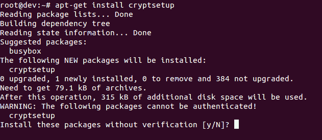

2.  加密您的`/dev/sdb1`分区，这是一个可移动设备。要加密分区，请键入以下命令:

```sh
cryptsetup -y -v luksFormat /dev/sdb1
```

前面的命令生成以下输出:


此命令初始化分区并设置密码。确保记下密码以便进一步使用。

3.  Now open the newly created encrypted device by creating a mapping:

    

4.  检查以确认设备存在:

```sh
ls -l /dev/mapper/backup2
```

前面的命令生成以下输出:

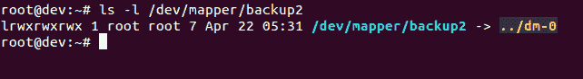

5.  Check the status of the mapping using the following command:

    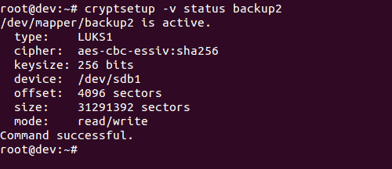

6.  Dump LUKS headers using the following command:

    

7.  Next, write zeros to `/dev/mapper/backup2` encrypted device:

    

由于`dd`命令可能需要几个小时才能完成，我们使用`pv`命令来监控进度。

8.  现在创建一个文件系统:

```sh
mkfs.ext4 /dev/mapper/backup2
```

前面的命令生成以下输出:

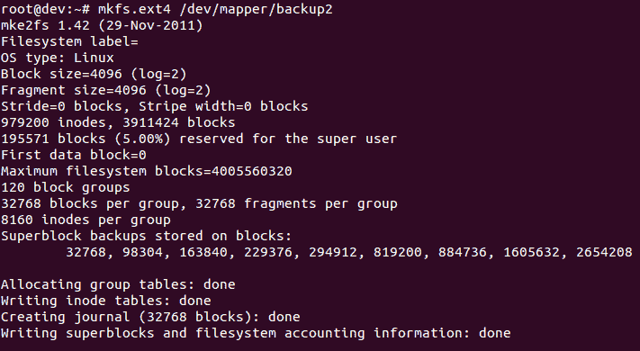

9.  Then mount the new filesystem and confirm the filesystem is visible:

    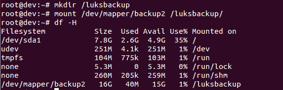 

恭喜你！您已经成功创建了一个加密分区。现在，即使电脑关机，您也可以保护所有数据的安全。

# 还有更多...

执行以下命令卸载并保护分区上的数据:

```sh
umount /backup2
cryptsetup luksClose backup
```

要重新装载加密分区，请执行以下步骤:

```sh
cryptsetup luksOpen /dev/xvdc backup2
mount /dev/mapper/backup2 /backup2
df -H
mount
```

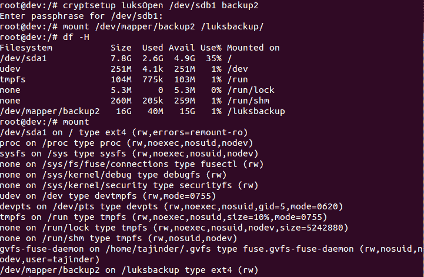

# 利用 sudoers–配置 sudo 访问

Sudoer 是 Linux 系统的功能，管理员可以使用它向受信任的常规用户提供管理访问，而无需实际共享根用户的密码。管理员只需将普通用户添加到 sudoers 列表中。

一旦用户被添加到 sudoers 列表中，他们就可以通过在它前面加上 sudo 来执行任何管理命令。然后用户会被要求输入自己的密码。此后，管理命令将以与根用户相同的方式执行。

# 准备好了

由于配置文件是预定义的，并且使用的命令是内置的，因此在开始这些步骤之前不需要额外配置。

# 怎么做…

请执行以下步骤:

1.  您将首先创建一个普通帐户，然后授予它 sudo 访问权限。完成后，您将能够从新帐户中使用`sudo`命令，然后执行管理命令。按照给出的步骤配置 sudo 访问。首先，使用根帐户登录系统，然后使用`useradd`命令创建用户帐户，如图所示。将命令中的 USERNAME 替换为您选择的任何名称:


2.  Now, using the `passwd` command set a password for the new user account, as shown:

    

3.  Now edit the `/etc/sudoers` file by running the `visudo` as shown. The policies applied when using the `sudo` command, are defined by the `/etc/sudoers` file:

    

4.  Once the file is open in the editor, search for the following lines which allow sudo access to the users in the test group:

    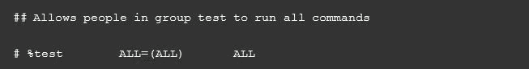

5.  You can enable the given configuration by deleting the comment character (`#`) at the beginning of the second line. Once the changes are done, save the file and exit from the editor. Now using the `usermod` command, add the previously created user to the test group:

    

6.  现在您需要检查现在创建的配置是否允许新用户帐户使用`sudo`运行命令。

7.  To switch to the newly created user account, use the `su` option:

    

8.  Now use the `groups` command to confirm the presence of the user account in the test group:

    

最后，用新账户的`sudo`运行`whoami`命令。当您第一次使用这个新用户帐户使用`sudo`执行命令时，将显示`sudo`命令的默认横幅消息。屏幕还会要求输入用户帐户密码:

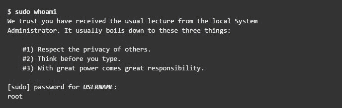

9.  所示输出的最后一行是`whoami`命令返回的用户名。如果`sudo`配置正确，该值将是根值。

您已成功配置了具有 sudo 访问权限的用户。现在，您可以登录到该用户帐户，并使用`sudo`运行命令，方式与您从根用户运行命令的方式相同。

# 它是如何工作的…

创建新帐户时，它没有运行管理员命令的权限。但是，在编辑`/etc/sudoers`文件，并输入适当的条目以授予 sudo 对新用户帐户的访问权限后，您可以开始使用新用户帐户运行所有管理员命令。

# 还有更多…

这里有一些额外的措施，你可以采取，以确保整体安全。

# 脆弱性评估

漏洞评估是审核网络和系统安全性的过程，通过它您可以了解网络的机密性、完整性和可用性。漏洞评估的第一个阶段是侦察，这进一步导致了系统准备阶段，我们主要检查目标中所有已知的漏洞。接下来是报告阶段，我们将发现的所有漏洞分为低、中和高风险类别。

# 用 Nmap 扫描主机

Nmap 可以用来扫描网络，是 Linux 中最流行的工具之一。它已经存在多年，目前是收集网络信息的首选工具之一。网络管理员可以使用 Nmap 来查找任何打开的端口和主机系统。在执行漏洞评估时，Nmap 无疑是一个不容错过的工具。

# 准备好

大多数 Linux 版本都安装了 Nmap。第一步是使用以下命令检查您是否已经拥有它:

```sh
    nmap --version
```

如果 Nmap 存在，您应该会看到类似如下的输出:

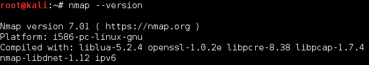

如果还没有安装 Nmap，可以从这个链接下载安装:[https://nmap.org/download.html.](https://nmap.org/download.html)

以下命令将在您的系统上快速安装 Nmap:

```sh
sudo apt-get install nmap
```

# 怎么做...

使用 Nmap 扫描主机时，请遵循以下步骤:

1.  Nmap 最常见的用途是查找给定 IP 范围内的所有在线主机。使用的默认命令需要一些时间来扫描整个网络，具体取决于网络中的主机数量。
2.  The following screenshot shows an example:

    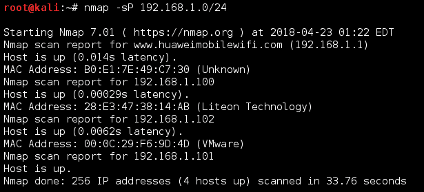

3.  To perform a SYN scan on a particular IP from a subnet, use the following command:

    

4.  If SYN scan does not work properly, you can also use Stealth scan:

    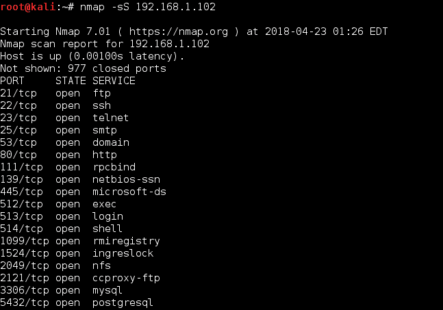

5.  To detect the version number of the services running on the remote host, you can perform Service Version Detection scan as follows:

    

6.  如果要检测远程主机上运行的操作系统，请运行以下命令:

```sh
nmap -O 192.168.1.102
```


7.  The output here has been truncated:

    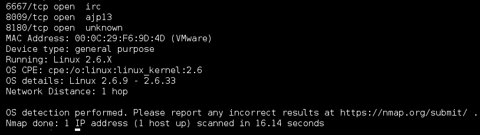

8.  If you wish to scan only for a particular port, such as `80`, run the command:

    

# 它是如何工作的...

Nmap 通过测试最常见的网络通信端口来检查正在侦听的服务。此信息有助于网络管理员关闭所有不需要或未使用的端口和服务。前面的例子展示了如何使用端口扫描和 Nmap 作为强大的工具来研究我们周围的网络。

# 请参见

Nmap 还有脚本功能，我们可以用它来编写自定义脚本。这些脚本可以与 Nmap 一起使用，以自动化和扩展 Nmap 的扫描功能。

你可以在 Nmap 的官方主页找到更多关于使用 Nmap 的信息: [【https://nmap.org/】](https://nmap.org/)。 [](https://nmap.org/) 

# 在易受攻击的 Linux 系统上扎根

当试图学习如何扫描和利用 Linux 机器时，我们遇到的一个主要问题是去哪里尝试。为此，Metasploit 团队开发并发布了一款名为*metasploable*的虚拟机。这台机器有目的地变得易受攻击，许多服务运行时没有打补丁。正因如此，它成为了练习或开发渗透测试技能的绝佳平台。在本节中，我们将学习如何扫描 Linux 系统，然后使用扫描结果，如何找到易受攻击的服务。使用易受攻击的服务，我们将获得系统的根访问权限。

# 准备好

这一部分将使用 Kali Linux 和 Metasploitable VMware 系统。Metasploitable 的图像文件可以从以下链接下载:

*   [http://SourceForge . net/project/metasploile/files/Metasploitable2/](http://sourceforge.net/projects/metasploitable/files/Metasploitable2/)
*   [https://images .进攻性-security . com/virtual-img/kali-Linux-2018.2-VM-i386 . zip](https://images.offensive-security.com/virtual-img/kali-linux-2018.2-vm-i386.zip)

# 怎么做...

Metasploit 框架是一个开源工具，由全球安全专业人员使用，通过在框架内的目标系统上执行漏洞利用代码来执行渗透测试。它预装了 Kali Linux(安全专业人士首选的发行版)。

按照以下步骤获得对易受攻击的 Linux 系统的根访问权限:

1.  首先通过运行以下命令在 Kali 系统上打开 Metasploit 控制台:

```sh
service postgresql start
msfconsole
```


2.  在屏幕底部，您应该会看到由`msf>`表示的 Metasploit 框架提示。
3.  接下来，我们需要扫描目标，在这个例子中是`192.168.0.102`，使用 Nmap:

以下屏幕截图显示了该命令的输出:


4.  在前面的命令中，您可以看到有许多服务在不同的端口上运行。其中你可以看到 FTP 也在端口`21`上运行。
5.  我们现在将专注于 FTP 服务。从显示的输出中，您可以看到 FTP 服务是由 vsftpd 应用程序版本 2.3.4 提供的。
6.  现在，让我们通过简单地执行命令`search` `vsftpd.`来尝试在 Metasploit 框架内找到`vsftpd`的漏洞，输出如下:

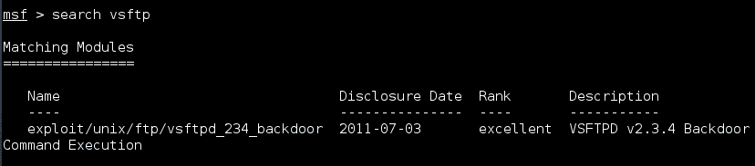

7.  搜索结果显示了一个模块，VSFTPD 后门命令执行，具有优秀的评级，这意味着这个漏洞将工作得非常好。

8.  Now run the following commands to use the exploit and check its options:

    

9.  从截图中可以看到，需要设置`RHOST`的值，在我们这里是`192.168.1.102`。
10.  设置`RHOST`的值，然后运行漏洞利用，如下所示:


11.  一旦攻击成功运行，您将获得 root 访问权限，如前面的截图所示。

# 它是如何工作的...

我们首先进行了一次 Nmap 扫描，检查正在运行的服务和打开的端口，发现 FTP 服务正在运行。然后我们试图找到 FTP 服务的版本。一旦我们得到信息，我们就搜索任何可用于 VSFTPD 的漏洞。搜索结果中发现的 VSFTPD 后门模块实际上是 Metasploit 框架正在发送到目标机器的代码。由于 VSFTPD 的一个模块编程不正确，代码在目标机器上执行。一旦代码被执行，我们就可以访问 Kali 机器上的根外壳

利用为 VSFTPD 找到的漏洞，我们试图攻击目标系统，并在其上获取根外壳。

# 还有更多...

让我们了解更多 Linux 中常见的漏洞和攻击。

# 缺少备份计划

在这个恶意攻击和危险的网络攻击的时代，你的数据永远不会安全。您的数据需要的不仅仅是保护。它需要备份形式的保险。在任何时候，如果您的数据丢失，进行数据备份可以确保您的业务能够立即启动并运行。

# 准备好了

当我们谈论 Linux 中的数据备份时，选择符合您业务需求的最佳备份工具至关重要。每个人都需要有一个可靠的数据备份工具，但是没有必要花太多的钱来获得一个具有满足您需求的功能的工具。备份工具应该允许您拥有本地备份、远程备份、一次性备份、定时备份和许多其他功能。

# 怎么做...

让我们来看看一些优秀的 Linux 备份工具。

# fwbackups

这是所有 Linux 备份工具中最简单的。fwbackups 有一个用户友好的界面，可以用于单次备份，也可以用于定期计划备份。

本地和远程备份可以采用各种格式，如`tar`、`tar.gz`、`tar.bz`或`rsync`格式。使用此工具可以备份单个文件或整个计算机。

使用此工具，备份和恢复可以轻松完成。可以执行增量备份或差异备份来加快该过程。

# rsync

这是 Linux 最广泛使用的备份解决方案之一。它可以用于增量备份，无论是本地备份还是远程备份。

`rsync`可用于更新目录树和文件系统，同时保留链接、所有权、权限和特权。

作为命令行工具，`rsync`非常适合创建与`cron`结合使用的简单脚本，从而创建自动备份。

# 阿曼达(高级马里兰自动网络磁盘归档器)

这是为“*中型计算机中心*开发的免费开源工具。它旨在通过网络将多台机器备份到磁带驱动器、磁盘或光盘上。

利用主备份服务器和 Linux 或 Windows 的组合，Amanda 可以用来备份多样化网络上的所有内容。

也可以使用此工具处理 LVM 快照和硬件快照。

# 简单备份解决方案

SBS 主要针对桌面备份，可用于备份文件和目录。它还允许正则表达式用于排除目的。

它包括预定义的备份配置，可用于备份目录，如`/var/`、`/etc/`、`/usr/local`。

SBS 可用于自定义备份、手动备份和计划备份，并且不限于预定义的备份。

# Bacula

Bacula 是一个免费的开源工具，需要在每个备份系统上安装客户端程序。所有这些系统都由一台集中处理备份规则的服务器控制。

Bacula 有自己的文件格式，这不是专有的，因为该工具是开源的。

日常完整备份和增量备份可以使用该工具完成，如果多个服务器使用自己的磁带驱动器，它可以为设置提供更好的支持。

Bacula 支持加密和 RAID。Bacula 还提供了定制备份作业的脚本语言，可用于合并加密。

# 它是如何工作的...

备份工具对于信息技术行业的任何人或计算机高级用户来说都是必要的。备份工具应该能够执行定时备份、一次性备份、本地备份、远程备份和许多其他功能。