# Linux 中的本地认证

在本章中，我们将讨论以下内容:

*   用户身份验证和记录
*   限制用户的登录能力
*   禁用用户名/密码登录
*   使用帐户监控用户活动
*   使用 USB 设备和 PAM 进行登录验证
*   定义用户授权控制
*   使用 IDAM 的访问管理

# 用户身份验证和记录

用户认证的主要部分之一是监控系统的用户。有多种方法可以跟踪用户在 Linux 中所有成功和失败的登录尝试。

# 准备好

Linux 系统维护系统中不同帐户所有登录尝试的日志。这些日志都位于`/var/log/`:


# 怎么做...

Linux 有许多方法可以帮助管理员查看日志，包括图形和命令行方法:

1.  如果我们想要检查特定用户(例如 root)的错误登录尝试，我们可以使用以下命令:

```sh
    lastb root  
```

**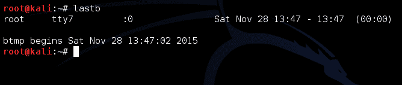**

2.  要使用终端查看日志，我们使用`dmesg`命令。此命令显示存储在内存中的 Linux 内核消息的缓冲区，如下所示:


3.  如果我们希望过滤前面的输出，只显示与 USB 设备相关的日志，我们可以通过使用`grep`来完成:


4.  如果我们希望仅查看特定日志文件中的 10 个最新日志，而不是查看所有日志，则命令如下:

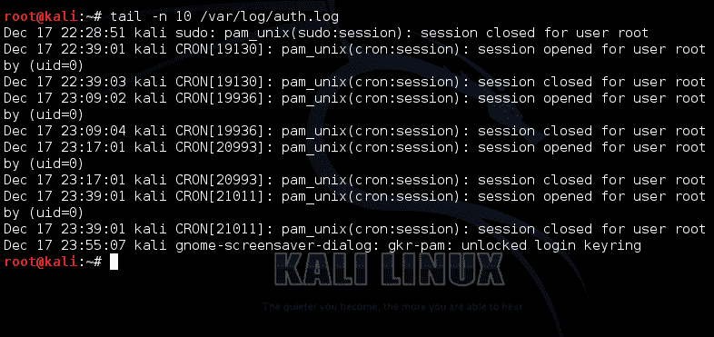

在前面的命令中，`-n`选项用于指定要显示的行数。

5.  如果我们希望查看用户帐户最近的登录尝试，请使用`last`:

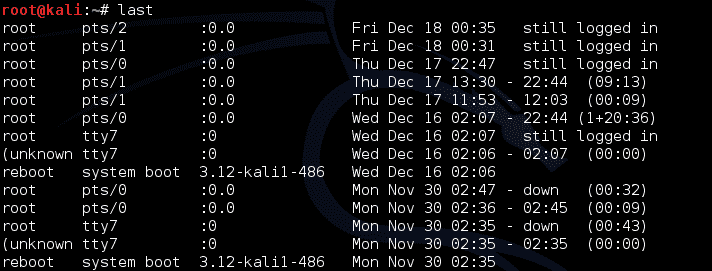

`last`命令以格式化的方式显示`var/log/wtmp`。

6.  如果我们想查看每个用户最后一次登录系统的时间，我们可以使用`lastlog`命令:


# 它是如何工作的...

Linux 有不同的文件来记录不同类型的细节。使用此处显示的命令，我们能够查看这些日志并查看详细信息。每个命令都给我们不同类型的细节。

# 限制用户的登录能力

作为 Linux 系统管理员，您可能希望限制指定用户或组对 Linux 系统的访问。在本节中，我们将学习如何使用两个文件`/etc/securetty`和`/etc/security/access.conf`来限制用户访问。

# 准备好

这里给出的所有步骤都已经在 Ubuntu 系统上尝试过了；但是，您也可以在任何其他 Linux 发行版上遵循这些原则。

# 怎么做...

让我们学习如何编辑前面提到的两个文件，以便在 Linux 系统上对用户访问应用不同的限制:

1.  首先，我们将使用`more`命令检查`/etc/securetty`文件的内容:

```sh
more /etc/securetty
```


正如我们在前面的截图中看到的，该文件指定了允许 root 用户登录的终端。

2.  现在，使用您选择的任何编辑器编辑文件，并对`tty1`条目进行注释，如下所示:

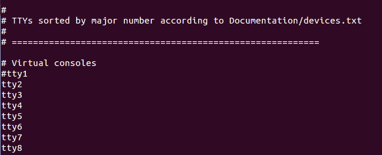

完成上一步中提到的更改后，保存并退出编辑器。

3.  现在，通过运行命令`chvt 1`切换到终端`tty1`。如果我们现在尝试以 root 用户身份登录，将会得到以下结果:

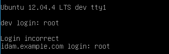

我们可以看到系统拒绝了对根帐户的访问。如果我们仍然希望获得 root 权限，我们必须首先以普通用户身份登录，然后使用`sudo`或`su`命令。

4.  从同一个终端，当我们尝试从普通用户帐户登录时，我们会登录，如下所示:

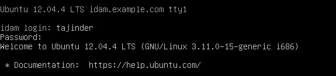

5.  我们已经看到了如何使用`/etc/securetty`文件来指定从任何终端对根帐户的访问。现在，让我们看看如何允许或拒绝特定用户的访问。
6.  首先要做的是修改`/etc/pam.d/login`文件，添加`pam_access.so`模块。这将允许`pam`扫描`/etc/security/access.conf`文件并检查我们定义的规则。

于是我们打开`etc/pam.d/login`，找到写着`#account required pam_access.so`的那一行，去掉`#`对该行取消评论:

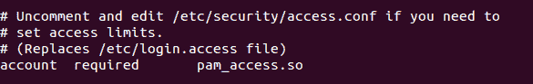

7.  接下来，我们将在`/etc/security/access.conf`中定义一个规则。在任何编辑器中打开文件，并根据以下语法定义规则:

```sh
permission : users : origins
```

8.  如果我们想拒绝从终端`tty1`访问根帐户，我们使用以下规则:


9.  要拒绝访问`user1`，我们使用以下规则:

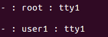

10.  如果我们想在同一个规则中指定多个用户名，我们可以按照以下规则进行:

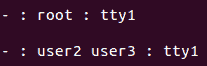

# 它是如何工作的...

Linux 使用`/etc/securetty`来指定可以从哪个终端进行根访问。因此，当我们对该文件进行更改时，来自特定终端的根访问也会受到影响。

类似地，`pam`使用`/etc/security/access.conf`文件来检查是否允许特定用户访问终端。该文件中定义的规则遵循以下语法:

```sh
permission : users: origins
```

这里，`permission`指的是拒绝或允许规则，用`-`或`+`符号表示。

用户指的是登录名列表。

来源是指允许或拒绝访问的来源。

# 禁用用户名/密码登录

系统管理员的一个主要角色是配置和管理 Linux 系统上的用户和组。它还涉及检查所有用户的登录能力并在需要时禁用它们的任务。

# 准备好了

这里给出的所有步骤都已经在 Ubuntu 系统上尝试过了；但是，您也可以在任何其他 Linux 发行版上遵循这些原则。

# 怎么做...

在这里，我们将讨论如何在 Linux 系统上限制用户的登录能力:

1.  我们可以通过将用户帐户的登录Shell更改为`/etc/passwd`文件中的特殊值来限制用户帐户的访问。我们来检查一个账户的详细信息，以`user1`为例，在`/etc/passwd`文件中，如下图所示:

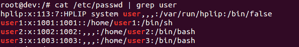

2.  在这些细节中，`user1`账户的最终值被设置为`/bin/bash`。目前，我们可以从`user1`账号登录。现在，如果我们想更改我们希望限制的用户帐户的Shell，我们可以这样做，如下所示:

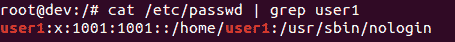

3.  如果我们现在尝试从用户 1 登录，会出现以下错误:

**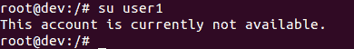**

4.  另一种限制用户访问的方法是使用`/etc/shadow`文件。如果我们使用`cat`命令检查这个文件的细节，我们会得到如下结果:

**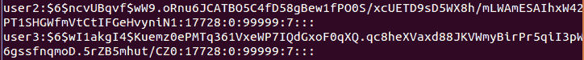**

5.  详细信息显示了`user3`账户的散列密码(以...6 美元 11 公斤 14...).

6.  现在锁定账户`user3`的命令如下:

```sh
 passwd -l user3 
```


让我们再次查看`user3`账户的`/etc/shadow`文件中的详细信息。我们看到散列的密码由于前面加了一个`!`而无效。

```sh
cat /etc/shadow | grep user3
```

**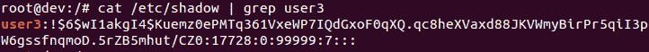**

7.  要再次解锁帐户，命令如下:

```sh
    passwd -u user3
```

8.  如果我们希望检查帐户是否已经被锁定，我们可以使用以下命令:

****

在输出中我们可以看到`user1`账户被锁定，在细节的第二个字段用`L`表示，而`user2`没有被锁定，如细节中所示`P`。

9.  锁定或解锁账户的过程也可以使用`usermod`命令完成。使用`usermod`锁定账户，命令如下:

```sh
    usermod -L user2
```

****

10.  一旦锁定，如果我们尝试从该帐户登录，我们会得到以下错误:

****

11.  使用`usermod`解锁账户，命令如下:

```sh
    usermod -U user2
```

****

# 它是如何工作的...

对于 Linux 中的每个帐户，用户帐户详细信息都存储在`/etc/passwd`和`/etc/shadow`文件中。这些详细信息指定了用户帐户将如何操作。当我们能够更改这些文件中任何用户帐户的详细信息时，我们就能够更改用户帐户的行为。

在前面的部分中，我们已经看到了如何修改这些文件来“锁定”或“解锁”用户帐户。

# 使用帐户监控用户活动

**Acct** 是一个开源应用程序，可以帮助监控 Linux 系统上的用户活动。它在后台运行，跟踪用户的所有活动，还维护正在使用的资源的跟踪。

# 准备好了

要使用`acct`命令，我们首先需要使用以下命令在我们的 Linux 系统上安装软件包:

```sh
    apt-get install acct
```

**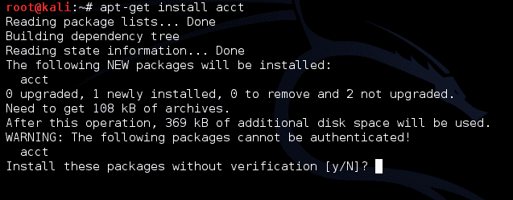**

如果前面的方法不能正常工作，我们可以通过访问以下链接手动下载包:

[http://packages.ubuntu.com/precise/admin/acct](http://packages.ubuntu.com/precise/admin/acct)

下载软件包后，我们需要将其提取到某个目录中，就像我们在桌面上做的那样:


然后，进入目录:

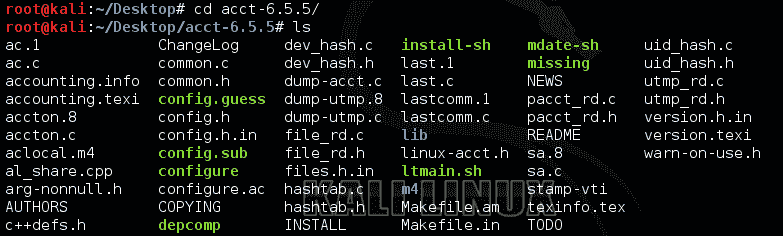

接下来运行脚本来配置包:


一旦配置完成，接下来我们运行`make`命令:

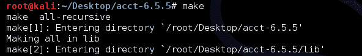

然后，运行`make install`命令:

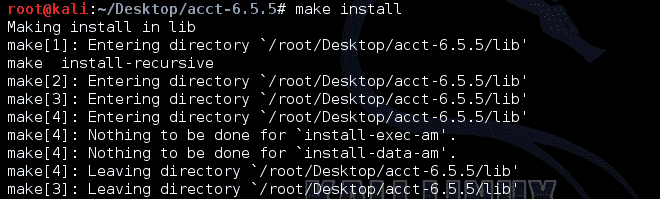

一旦成功完成，它将在您的 Linux 系统上安装软件包。

# 怎么做...

acct 包有不同的命令来监控流程活动:

1.  基于特定用户从 wtmp 文件登录和注销，如果我们希望检查总连接时间，我们可以使用`ac`命令:


2.  如果我们希望按天打印总登录时间，我们将使用带有“ac”命令的`-d`选项:


3.  要打印用户的总登录时间，我们使用以下命令:

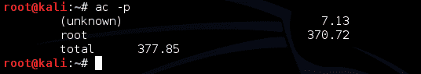

4.  如果我们希望只检查特定用户的登录时间，我们可以使用以下命令:


5.  通过使用`lastcomm`命令，我们还可以看到之前为所有用户或特定用户执行的命令:


# 它是如何工作的...

为了监控系统，我们首先在系统上安装 acct 包。对于一些其他的 Linux 发行版，如果`acct`不兼容，将使用的包将是`psacct`。

一旦工具安装并运行，它就开始维护系统上的活动日志。然后，我们可以使用上一节中讨论的命令来查看这些日志。

# 使用 USB 设备和 PAM 进行登录验证

当 Linux 用户想要保护系统时，最常见的方法总是使用他们的登录密码。然而，我们知道这种方法不太可靠，因为有许多方法可以破解传统密码。为了提高安全级别，我们可以使用像身份验证令牌这样的 USB 设备，它将用于登录系统。

# 准备好了

按照这些步骤，我们需要在 Linux 系统上下载一个 USB 存储设备和**可插拔认证模块** ( **PAM** )。大多数 Linux 系统都有预编译包形式的 PAM，可以从相关的存储库中访问。

# 怎么做...

通过使用任何类型的 USB 存储设备和 PAM，我们可以创建身份验证令牌:

1.  首先，我们首先需要安装 PAM USB 身份验证所需的软件包。为此，我们运行以下命令:

```sh
 $ sudo apt-get install pamusb-tools libpam-usb
```

**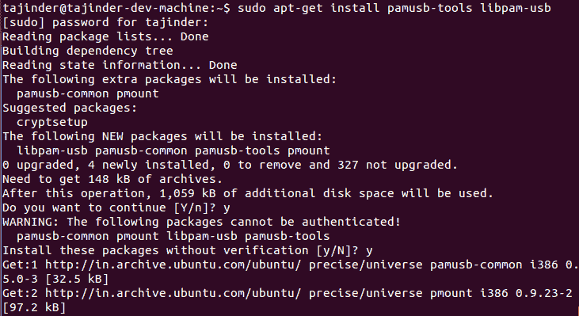**

2.  一旦安装了软件包，我们就必须将 USB 设备配置为使用 PAM 身份验证。为此，我们可以使用一个命令，或者我们可以编辑`/etc/pamusb.conf`文件。

要使用命令方法，首先连接 USB 设备，然后执行以下命令:

```sh
    $ sudopamusb-conf --add-device usb-device  
```


在前面的命令中，`usb-device`是我们正在使用的 USB 设备的名称。这个名字可以是你选择的任何名字。

当使用`pamusb-conf`命令时，它会自动发现 USB 设备，该设备也包括多个分区。当命令完成执行时，它将一个 XML 代码块添加到`/etc/pamusb.conf`文件中，定义我们的 USB 设备:

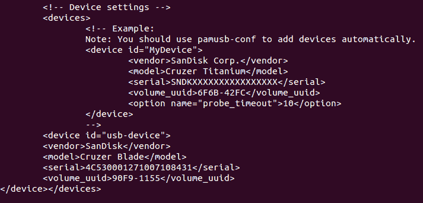

3.  接下来，我们定义我们的 USB 设备:

```sh
    $ sudopamusb-conf --add-user user1
```

****

如果用户已经存在，它将被添加到 PAM 配置中。

前面的命令将`pam_usb`用户的定义添加到`/etc/pamusb.conf`文件中:


4.  现在，我们将配置 PAM 在系统认证过程中添加`pam_usb`模块。为此，我们将编辑`/etc/pam.d/common-auth`文件并添加以下行:

**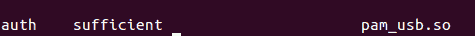**

这将使系统范围内的 PAM 库意识到`pam_usb`模块。

`required`选项指定需要正确的密码，而`sufficient`选项则表示这也可以认证用户。在前面的配置中，我们使用`sufficient`进行 usb 设备认证，但使用`required`作为默认密码。

如果系统中没有为`user1`定义的 USB 设备，用户需要输入正确的密码。要强制用户在授予对系统的访问权限之前将两个身份验证例程都准备好，请将`sufficient`更改为`required`。

5.  现在，我们将尝试切换到`user1`:


需要时，连接 usb 设备。如果连接了正确的通用串行总线令牌设备，登录将完成，否则会出现错误。

6.  如果出现任何错误，例如这里显示的错误，可能是 USB 设备的路径添加不正确:

```sh
    Error: device /dev/sdb1 is not removable
    * Mount failed
```

在这种情况下，将 USB 设备的完整路径添加到`/etc/pmount.allow`。

7.  现在，运行命令检查 USB 设备分区是如何在文件系统中列出的:

```sh
    $ sudo fdisk -l
```

**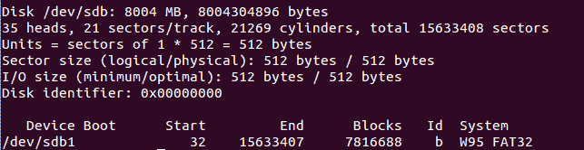**

在我们的例子中，分区已经被列为`/dev/sdb1`。

8.  现在，在`/etc/pmount.allow`文件中添加一行来解决错误。
9.  我们到目前为止在`/etc/pam.d/common-auth`中所做的配置意味着如果没有连接 USB 设备，用户仍然可以用正确的密码登录。如果我们希望强制用户也使用 USB 设备登录，那么将`sufficient`更改为`required`，如下图所示:

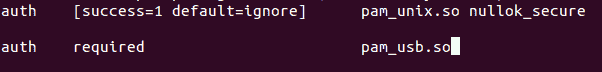

10.  如果用户现在尝试登录，他们必须输入正确的密码并插入 USB 设备:

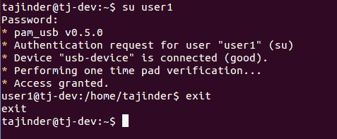

11.  现在，取出 USB 设备，并尝试使用正确的密码再次登录:


# 它是如何工作的...

一旦我们安装了所需的`pam-usb`包，我们就可以编辑配置文件来添加我们的 USB 设备，我们希望将其用作身份验证令牌。之后，我们添加要使用的用户帐户。然后，我们在`/etc/pam.d/common-auth`文件中进行更改，以指定 USB 身份验证应该如何工作，以及是否总是需要登录。

# 还有更多...

我们已经看到了如何使用 USB 设备来验证用户登录。除此之外，我们还可以使用 USB 设备来触发事件，每次它都与系统断开或连接。

让我们修改`/etc/pamusb.conf`中的 XML 代码，为用户定义添加事件代码:

****

由于前面的修改，每当用户断开 USB 设备时，屏幕都会被锁定。同样，当用户再次连接 USB 设备时，屏幕也会解锁。

# 定义用户授权控制

在计算机上定义用户授权主要涉及决定允许或不允许用户进行的活动。这可能包括执行程序或读取文件等活动。

由于`root`帐户拥有所有权限，授权控制主要处理允许或不允许用户帐户的根访问。

# 准备好

为了了解用户授权是如何工作的，我们需要一个用户帐户来尝试这些命令。因此，我们创建了几个用户帐户，`user1`和`user2`，来尝试这些命令。

# 怎么做...

在本节中，我们将介绍可应用于用户帐户的各种控制:

1.  假设我们有两个用户账户，`user1`和`user2`。我们从`user2`登录，然后尝试运行一个命令`ps`，作为`user1`。在正常情况下，我们会得到这样的结果:


2.  现在，编辑`/etc/sudoers`文件并添加这一行:

```sh
    User2 ALL = (user1) /bin/ps
```

2.  保存`/etc/sudoers`中的更改后，再次尝试从`user2`运行`ps`命令为`user1`:

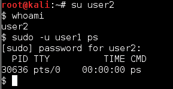

3.  现在，如果我们想从`user2`再次运行与`user1`相同的命令，但不需要输入密码，我们可以通过编辑如下所示的`/etc/sudoers`文件来实现:


4.  现在，当我们作为`user1`从`user2`运行`ps`命令时，我们看到它不再要求密码:


5.  既然我们已经看到了如何在不要求输入密码的情况下运行命令，那么系统管理员最关心的就是`sudo`应该总是提示输入密码。

6.  要使`sudo`始终在系统上提示`user1`用户帐户的密码，请编辑`/etc/sudoers`文件并添加以下行:

```sh
    Defaults:user1    timestamp_timeout = 0
```

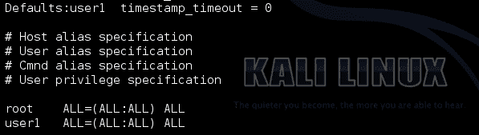

7.  现在，如果`user1`试图运行任何命令，它们将总是被提示输入密码:

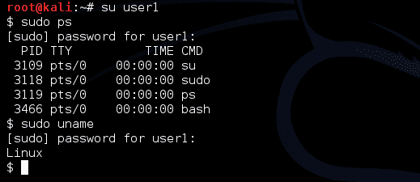

8.  现在，让我们假设我们想给`user1`帐户更改`user2`和`user3`密码的权限。编辑`/etc/sudoers`文件并添加此行:


9.  现在，从`user1`登录，让我们尝试更改`user2`和`user3`账户的密码:

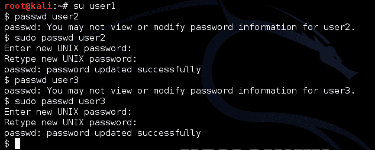

# 它是如何工作的...

使用`sudo`命令和`/etc/sudoers`文件，我们根据需要进行所需的更改以执行任务。

我们编辑文件以允许作为另一个用户执行程序。我们还添加了`NOPASSWD`选项来执行程序，而无需询问密码。然后我们添加所需的行，以便`sudo`总是提示输入密码。

接下来，我们将了解如何授权用户帐户更改其他用户帐户的密码。

# 使用 IDAM 的访问管理

在当今世界，单一的 Linux 系统可能被不同的用户本地或远程使用。管理这些用户的访问变得至关重要，以保护只有少数经过身份验证的用户才能访问的敏感和机密信息。

身份和访问管理工具可以帮助系统管理员轻松管理各种用户的身份和访问。

# 准备好

为了开始 WSO2 身份服务器的安装和配置，我们需要安装 Java 环境的任何 Linux 发行版。

在这里，我们将看到如何设置 Java 环境:

1.  在安装 JDK 之前，我们将安装一个与 Python 相关的包作为依赖项的一部分。执行此操作的命令如下:


2.  现在，要安装甲骨文发行的官方版本甲骨文 JDK，我们必须更新系统的软件包库，并添加甲骨文的 PPA。为此，我们运行以下命令:

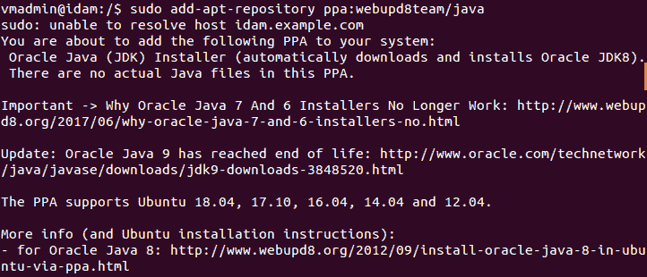

3.  现在，通过运行以下命令来安装 Java 的稳定版本:

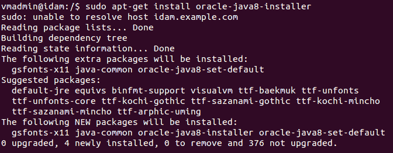

4.  安装完成后，下一步是设置`JAVA_HOME`环境变量。为此，使用任何编辑器编辑`/etc/environment`文件，并添加以下行:


5.  要测试环境变量是否设置正确，请执行以下命令:

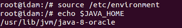

我们可以看到前面步骤中设置的路径。

# 怎么做...

在我们的系统上完成 JDK 的安装和配置后，我们可以继续安装和配置 WSO 身份和访问管理服务器:

1.  首先，从这里给出的链接下载 WSO2 包:[https://WSO2 . com/identity-and-access-management/install/download/？type=ubuntu](https://wso2.com/identity-and-access-management/install/download/?type=ubuntu)

2.  接下来，创建一个目录`/var/wso2`，并将下载的包解包到这个目录中:


3.  要提取包，请运行以下命令:

```sh
unzip ~/wso2is-5.6.0.zip /var/wso2
```

4.  提取过程完成后，我们可以检查目录中的文件:

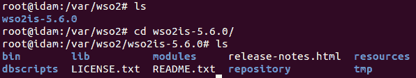

5.  接下来，如果我们希望将服务器配置为使用 FQDN 而不是`localhost`启动，我们可以更改`carbon.xml`文件中的配置。为此，编辑位于`[INSTALL_DIR]/repository/conf/carbon.xml`的`carbon.xml`文件:


对`<HostName>`进行更改，用系统的 FQDN 替换本地主机:


6.  现在，我们可以启动 WSO2 身份服务器。为此，我们运行以下命令:


7.  一旦服务器成功启动运行，将显示类似`WSO2 Carbon started in 463 sec`的一行，如下图输出所示:

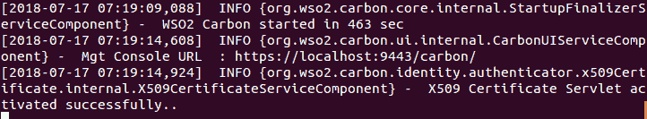

8.  一旦服务器启动并运行，我们就可以通过浏览器访问它。访问服务器的默认配置始终是通过端口`9443`上的 HTTPS 广告:


在登录页面，使用默认用户名`admin`和默认密码`admin`登录。

9.  登录后，我们可以使用它为这些用户添加用户和角色。

Linux 管理员现在可以使用 WSO2 IS 来管理身份和执行访问管理。

# 它是如何工作的...

WSO2 身份服务器是一个开源的 IAM 产品。它擅长访问管理、访问控制、身份治理管理、应用编程接口安全和许多其他功能。