# 网络安全性

在本章中，我们将讨论以下主题:

*   管理网络
*   使用数据包嗅探器监控网络流量
*   使用 IP 表配置防火墙
*   阻止欺骗地址
*   阻止传入流量
*   配置和使用 TCP 包装器
*   使用`mod_security`阻止特定国家的交通
*   使用 SSL 保护网络流量

# 管理网络

随着计算机网络规模的增长，管理网络信息成为系统管理员的一项重要任务。

# 准备好了

在开始对 TCP/IP 配置进行任何更改之前，请确保使用以下命令创建网络管理器配置文件的备份:

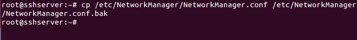

也用同样的方法备份`/etc/network/interfaces`文件。

# 怎么做...

在本节中，我们将了解如何使用命令行手动配置网络设置:

1.  在开始手动配置之前，首先让我们检查一下我们当前的 IP 地址，它已经被 DHCP 自动分配给系统了。我们可以通过右键点击右上角面板的联网图标，然后选择**连接信息**来图形化查看详情，如下图截图所示:

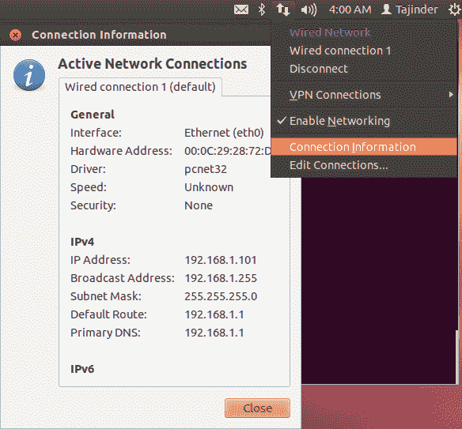

我们可以看到我们系统当前的 IP 地址是`192.168.1.101`。

2.  接下来，我们通过输入`ifconfig`命令，使用命令行检查相同的信息:

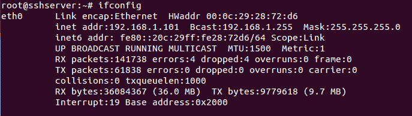

3.  如果我们只想检查系统上可用的以太网设备，我们可以运行以下命令:


前面的命令将列出系统上所有可用以太网设备的单行描述。

4.  如果我们想获得更多关于网络接口的详细信息，我们可以使用名为`lshw`的工具，如下所示:

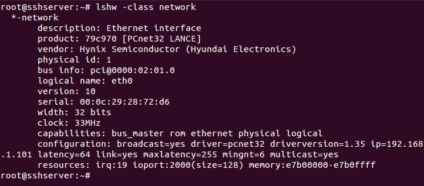

该命令还提供了硬件其他功能的详细信息。

5.  现在，我们将禁用网络管理器，然后手动设置 IP 地址详细信息。要禁用网络管理器，请编辑`/etc/NetworkManager/NetworkManager.conf`文件，如下所示:

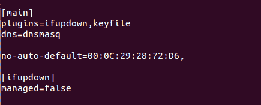

将`managed=false`行改为`managed=true`行，保存文件。

6.  现在，在您选择的任何编辑器中打开`/etc/network/interfaces`文件。我们可以看到，默认情况下，没有关于`eth0`界面的信息:


7.  编辑文件并添加如下截图所示的信息。确保根据您的网络设置添加 IP 详细信息:

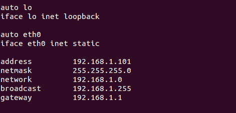

完成后，保存文件，然后重新启动计算机到`disengage`网络管理器。

8.  如果希望创建虚拟网络适配器，可以在`/etc/network/interfaces`文件中添加以下几行，如下所示:


通过这样做，我们向单个以太网卡添加了两个 IP 地址。我们可以这样做来创建网卡的多个实例。

9.  完成编辑后，使用以下命令重新启动网络服务:

```sh
    service network-manager restart
```

您也可以使用此命令:

```sh
    /etc/init.d/networking restart
```

10.  接下来，我们可以看看如果手动配置 IP 地址，如何配置要使用的合适的`nameserver`。

要进行更改，请在任意编辑器中编辑`/etc/resolv.conf`文件，并添加如下截图所示的行:


按照前面的步骤，我们将能够成功配置 IP 详细信息。

# 它是如何工作的...

系统上的 TCP/IP 设置可以自动管理，也可以手动管理。根据`/etc/NetworkManager/NetworkManager.conf`文件中的内容，系统了解设置是自动管理还是手动管理。

对于手动配置，我们编辑`/etc/network/interfaces`文件，并输入上一节所示的 IP 详细信息。完成后，我们会重新启动网络服务或完全重新启动系统，以使更改生效。

# 使用数据包嗅探器监控网络流量

Linux 最广泛使用的命令行数据包嗅探器或数据包分析器工具之一是 Tcpdump。它有助于捕获或过滤通过网络在特定接口上传输或接收的 TCP/IP 数据包。

# 准备好

Tcpdump 预装在大多数基于 Linux/Unix 的操作系统中。如果它不可用，我们可以使用以下命令安装它:

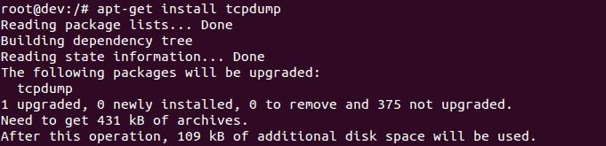

# 怎么做...

一旦`tcpdump`安装完毕，我们只需运行命令`tcpdump`就可以开始使用了:

1.  当我们简单运行`tcpdump`时，它将开始捕获任何接口上发送或接收的所有数据包。


2.  如果我们想要捕获仅在特定接口上的数据包，我们可以按照下面的截图所示进行操作:

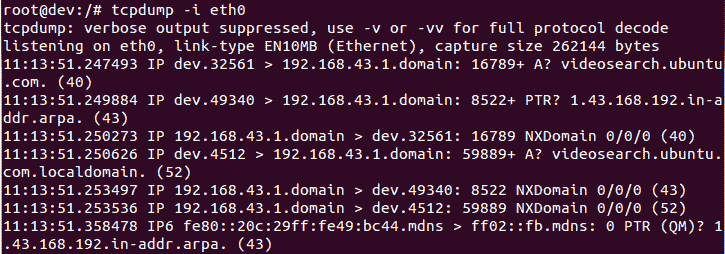

3.  前面的命令将捕获在定义的接口上接收的所有数据包，直到手动停止。如果我们希望捕获特定数量的数据包，我们可以使用`-c`选项来实现，如下所示:


4.  要以 ASCII 格式显示捕获的数据包，我们可以使用`-A`选项:


5.  如果我们希望列出系统上可用接口的数量，我们可以使用`-D`选项来做同样的事情:

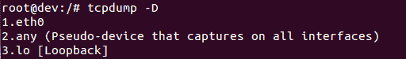

6.  如果我们在捕获数据包时使用`-XX`选项，tcpdump 将以十六进制和 ASCII 格式捕获数据包的链路层报头，如下所示:

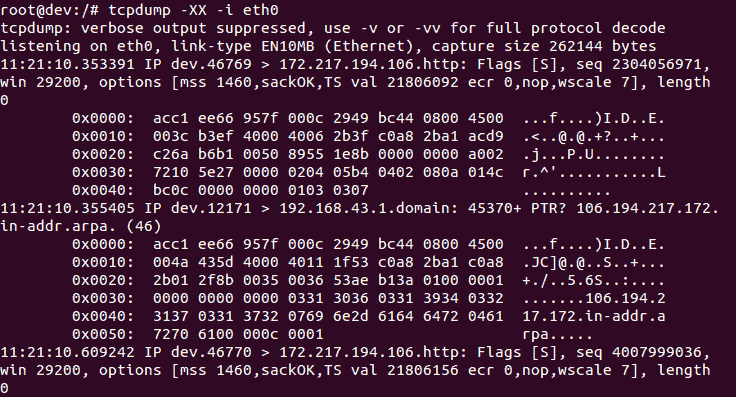

7.  我们可以在执行`tcpdump`时使用`-w`选项将捕获的数据包保存在`.pcap`格式的文件中:


在前面的命令中，我们已经将数据保存在`capture.pcap`文件中。

8.  当我们想要读取和分析捕获的数据包文件时，我们使用带有`-r`选项的命令，如下所示:

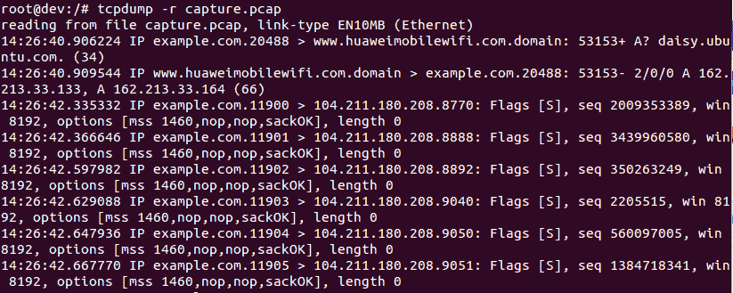

9.  默认情况下，`tcpdump`捕获所有端口的数据包。如果我们想要捕获任何特定端口的数据包，例如端口`80`，我们可以这样做:

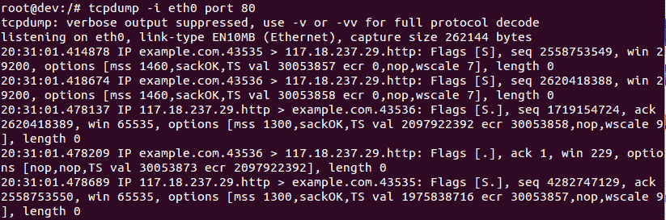

# 它是如何工作的...

TCPdump 分析网络行为、性能以及生成或接收网络流量的应用程序。Tcpdump 使用`libpacp/winpcap`来捕获数据，并使用其内部构建的大量协议定义来分析捕获的数据包。

# 使用 IP 表配置防火墙

保护 Linux 系统的一个重要步骤是建立一个好的防火墙。大多数 Linux 发行版预装了不同的防火墙工具。Iptables 就是 Linux 发行版中的一个这样的默认防火墙。对于旧版本的 Linux 内核，Ipchains 是默认的防火墙。

# 准备好

由于 **Iptables** 附带了 Linux 发行版，使用它不需要安装额外的工具。但是，建议使用 Iptables 时，不要使用根帐户。相反，请使用具有超级用户访问权限的普通帐户来有效运行命令。

# 怎么做...

我们可以使用 Iptables 定义不同的规则。内核在检查传入和传出的流量数据包时会遵循这些规则:

1.  我们在系统上要做的第一件事是使用以下命令检查安装了哪个版本的`iptables`:

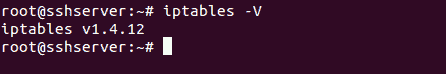

2.  现在，我们将使用`-L`选项检查系统上是否已经存在针对 Iptables 的任何规则:

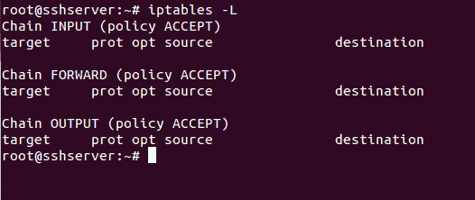

3.  前面的输出也可以看到一种格式，它告诉我们每个策略所需的命令。为此，使用`-S`选项，如下所示:

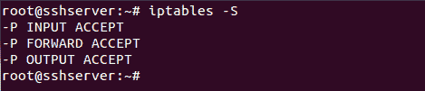

4.  现在，我们将使用以下命令检查`iptables`的哪些模块默认加载了正确的功能:


5.  现在，让我们添加我们的第一个规则，它将确保目前所有的在线连接都将保持在线，即使在我们制定了阻止不需要的服务的规则之后:

```sh
    iptables -A INPUT -m conntrack --ctstate ESTABLISHED,RELATED -j ACCEPT
```

这里，`-A`选项将一个规则附加到现有的表中。`INPUT`告诉我们这个规则会被追加到 Iptables 的输入链中。命令的下一个参数`-m conntrack --ctstateESTABLISHED,RELATED`，确保该规则仅适用于当前在线的连接。然后`-j ACCEPT`告诉`iptables`接受并允许符合先前指定标准的数据包。

6.  现在，如果我们再次检查`iptables`中的规则列表，我们可以看到我们的规则已经被添加:

**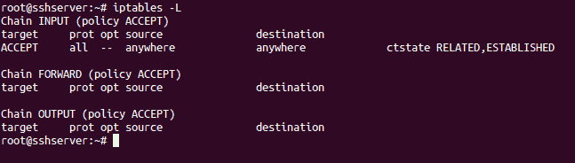**

7.  现在，让我们假设我们希望通过 Iptables 保持 SSH 连接。为此，我们添加了如下截图所示的规则:

**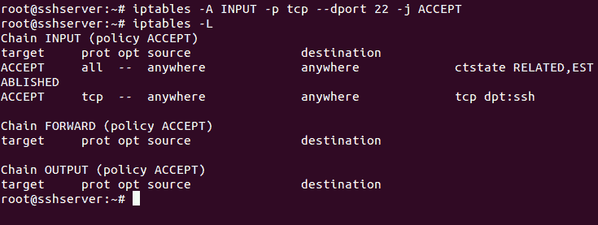**

我们使用了端口`22`，因为它是 SSH 的默认端口。如果您已经更改了服务器中 SSH 的端口，请使用前面截图中的适当端口。

8.  我们还需要确保我们的服务器继续正常运行，让服务器上的服务相互通信，而不受 Iptables 规则的阻止。为此，我们希望允许所有数据包发送到环回接口。

我们添加以下规则来允许环回访问:

```sh
 iptables -I INPUT 1 -i lo -j ACCEPT
```

这里，`-I`选项告诉 iptables 插入一个新规则，而不是附加它。它接受需要添加新规则的链和位置。在前面的命令中，我们将此规则添加为`INPUT`链中的第一条规则，因此这是应用的第一条规则。

9.  现在，如果我们使用`-v`选项查看 Iptables 中的规则列表，我们可以看到环回接口的规则`lo`，作为我们的第一个规则:

**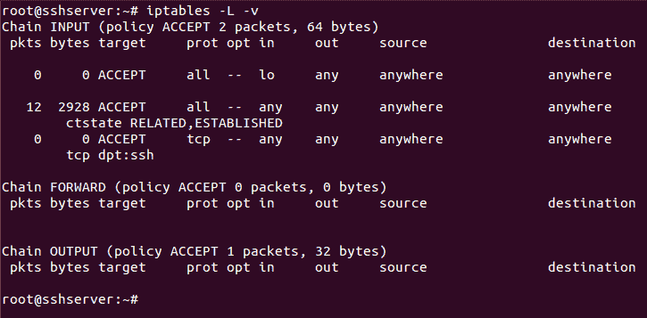**

10.  现在，假设我们已经根据我们的要求添加了允许所有数据包的规则，我们必须确保进入`INPUT`链的任何其他数据包都应该被阻止。

为此，我们将通过运行`iptables -A INPUT -j DROP`命令来修改`INPUT`链:

**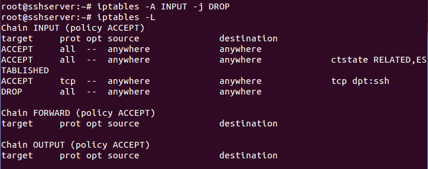**

从前面的代码中我们可以看到，丢弃所有数据包的规则已经被添加到`INPUT`链的列表底部。这确保了每当数据包进入时，`itpables`规则都按照指定的顺序进行检查。如果没有任何规则与数据包匹配，它将被丢弃，从而阻止数据包被默认接受。

11.  到目前为止，我们在 Iptables 中添加的任何规则都是非持久性的。这意味着系统一重启，`iptables`的所有规则就没了。为了保存我们创建的规则，然后在服务器重新启动时自动加载它们，我们可以使用`iptables-persistent`包。

12.  使用以下命令安装软件包:

```sh
    apt-get install iptables-persistent
```

**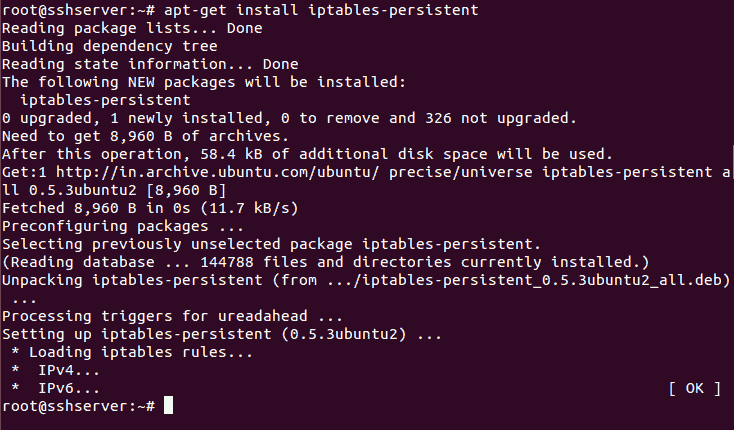**

13.  在安装过程中，系统会询问您是否要保存当前的 iptables 规则并自动加载它们。根据您的选择选择`Yes`或`No`。

14.  安装完成后，我们可以通过运行以下命令来启动包:

**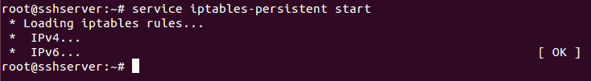**

# 它是如何工作的...

在前面的例子中，我们在 Linux 中使用 Iptables 在我们的系统上配置防火墙。

首先，我们浏览了`iptables`命令的基本选项，然后我们看到了如何在`iptables`中添加不同的规则。我们添加了允许本地主机访问和传出活动连接的规则。然后，我们添加了一个允许 SSH 连接的规则。

然后，我们添加了规则来拒绝与上述应用规则不匹配的所有其他传入数据包。

最后，我们使用`iptables-persistent`包保存 iptables 的规则，即使在系统重启之后。

# 阻止欺骗地址

IP 欺骗是攻击者用来向服务器计算机发送恶意数据包的一种非常常见的技术。它是用伪造的 IP 地址创建 IP 数据包的过程。主要用于执行**拒绝服务** ( **DoS** )攻击等攻击。

# 准备好

如果我们希望阻止欺骗的 IP 地址，我们需要一个这些 IP 地址或域名的列表，这些欺骗的连接正试图连接。

# 怎么做...

我们将尝试创建 iptables 的基本规则集，使用该规则集，我们将限制所有传入的数据包，但对我们来说必要的数据包除外:

1.  第一步是创建一个允许访问环回接口的规则，以便系统上的服务可以在本地正确地相互通信。这样做的命令如下:

```sh
    iptables -A INPUT -i lo -j ACCEPT  
```


这是系统正常运行所必需的。

2.  接下来，我们将为系统启动的出站连接创建规则:

```sh
    iptables -A INPUT -m conntrack --ctstate RELATED,ESTABLISHED -j ACCEPT
```

这将接受所有出站流量，包括来自我们尝试连接的远程服务器(如我们正在访问的任何网站)的响应:


3.  现在，让我们创建一个要在`iptables`中使用的表。我们称之为`blocked_ip`。您可以选择任何想要的名称:

```sh
    iptables -N blocked_ip  
```

这是一个表格，我们将在其中添加我们想要阻止的欺骗 IP 地址。

4.  现在，我们将使用以下命令将该表插入到 iptables 的`INPUT`表中:

```sh
    iptables -I INPUT 2 -j blocked_ip  
```

请注意，我们使用了数字`2`来确保该规则将是`iptables`中从顶部开始的第二个规则。

5.  现在，让我们将坏的 IPs 添加到我们创建的`blocked_ip`表中:

```sh
    iptables -A blocked_ip -s 192.168.1.115 -j DROP  
```

我们在这里以 IP 地址`192.168.1.115`为例。您可以将其替换为要阻止的 IP 地址。如果您有多个 IP 地址要屏蔽，请逐一添加到`iptables`。

6.  现在，我们可以使用以下命令查看`iptables`中的规则列表:

```sh
    iptables -L
```

在下面截图显示的细节中，我们可以看到，在底部，我们有我们试图阻止的 IP 地址。您可以根据自己的选择指定单个 IP 地址或范围:

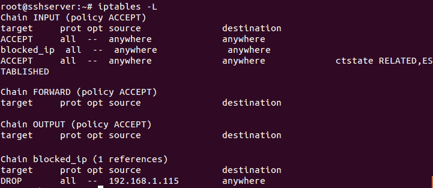

7.  在 Iptables 中制定规则后，我们也可以编辑`/etc/host.conf`文件。在您选择的任何编辑器中打开文件。我用的是纳米:

```sh
    nano /etc/host.conf
```

现在，在文件中添加或编辑以下行，如下所示:

```sh
    order hosts,bind
    nospoof on
```

****

在前面的示例中，no spufo on 选项将主机名查找返回的 IP 地址与 IP 地址查找返回的主机名进行比较。如果比较失败，此选项将生成欺骗警告。

完成后，保存并关闭文件。这也将有助于保护系统免受 IP 欺骗。

# 它是如何工作的...

为了阻止假冒的 IP 地址或任何其他 IP 地址，我们再次使用 Iptables，因为它是默认的防火墙，除非我们不想使用任何其他适用于 Linux 的工具。

我们再次创建规则来允许本地主机访问系统，并保持出站活动连接活动。然后，我们在 Iptables 中创建了一个表，用来维护我们想要阻止的欺骗 IP 地址列表。之后，我们将此表添加到 Iptables 的输入链中。现在，我们可以在任何需要的时候向表中添加任何 IP 地址，它将自动被阻止。

我们也可以使用`/etc/host.conf`文件来保护系统免受 IP 欺骗。

# 阻止传入流量

对于 Linux 系统管理员来说，最重要的任务之一是控制对网络服务的访问。有时，最好阻止服务器上的所有传入流量，只允许所需的服务连接。

# 准备好

因为我们也将在这里使用`iptables`，所以不需要额外的包来执行这些步骤。我们只需要一个拥有超级用户访问权限的用户帐户。但是，这个账户最好不要是`root`账户。

# 怎么做...

我们会将 Iptables 配置为拒绝所有内容，除了从我们的系统内部发起的流量(例如，网络浏览器有网络流量，或者为了更新软件包或任何其他软件，一些下载已经提前发起):

1.  和前面的例子一样，Iptables 中的第一条规则是允许访问 localhost 数据。为此，请运行以下命令:

```sh
    iptables -A INPUT -i lo -j ACCEPT  
```

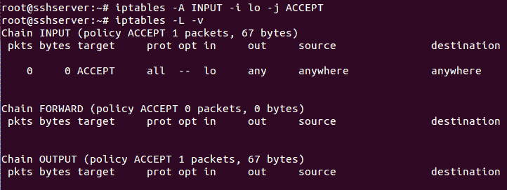

2.  我们的下一个规则是接受所有与出站连接相关的流量。这还包括我们的系统所连接的远程服务器的响应:


3.  接下来，我们将添加接受超时 ICMP 数据包的规则。这对于限时连接设置非常重要:

```sh
    iptables -A INPUT -p icmp -m icmp --icmp-type 11 -j ACCEPT   
```

4.  之后，我们将添加规则来接受来自远程服务器的目标不可达 ICMP 数据包:

```sh
    iptables -A INPUT -p icmp -m icmp --icmp-type 3/4 -j ACCEPT
```

5.  接下来，添加接受 PING 请求/响应(Echo ICMP)的规则，以保持我们的系统对那些可能需要 PING 的 web 服务的连接有效:

```sh
    iptables -A INPUT -p icmp -m icmp --icmp-type 8 -j ACCEPT  
```

6.  添加上述规则后，我们通过运行以下命令来检查 Iptables 中的列表:

```sh
    iptables -L 
```

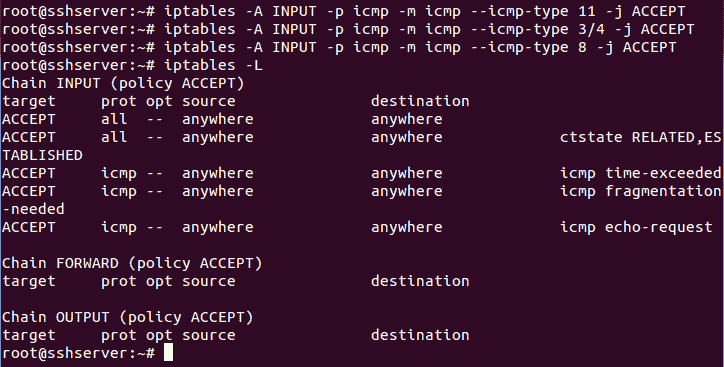

7.  现在，我们将创建一个 iptables 表，其中包含可接受的规则和服务列表:

```sh
    iptables -N allowed_ip  
```

然后，我们将此表添加到 Iptables 的`INPUT`链中:

```sh
    iptables -A INPUT -j allowed_ip  
```

8.  现在，让我们添加一个规则，以便允许在系统上访问 SSH。为此，我们可以运行以下命令:

```sh
    iptables -A allowed_ip -p tcp --dport 22 -j ACCEPT
```

9.  现在，如果我们检查 iptables 中的规则列表，我们会得到以下结果:

```sh
 iptables -L 
```


10.  一旦我们添加了规则来接受我们想要的流量，我们现在就想要拒绝所有其他没有设置规则的流量。为此，我们添加了以下规则:

```sh
    iptables -A INPUT -j REJECT --reject-with icmp-host-unreachable

```

这样，每当有人试图连接到服务器时，就会向他们发送一个**主机不可达** ICMP 数据包，然后终止连接尝试。

11.  在添加了所有上述给定的规则后，我们的 iptables 现在看起来像下面的截图所示:

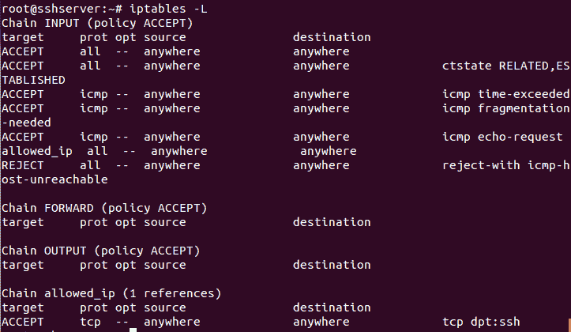

# 它是如何工作的...

为了阻止服务器上的所有传入流量，只允许出站连接，我们再次使用 Iptables，因为它是 Linux 的默认防火墙。

为了允许服务器在内部正常运行，我们允许访问 localhost。

接下来，为了保持出站连接活动，我们添加规则来接受**时间超过**、**目的地不可达**和**回声** ICMP 数据包。

一旦添加了这些规则，我们就可以定义是否允许某些特定服务的任何传入流量，例如 SSH 或特定的客户端地址。为此，我们创建了一个表来添加我们想要允许的客户端的 IP 地址列表。之后，我们添加一个规则来允许访问 SSH 服务，或者根据我们的要求访问任何其他服务。

最后，我们添加规则来拒绝所有没有添加规则的流量。

# 配置和使用 TCP 包装器

通过限制访问来保护服务器是一项关键措施，在设置服务器时绝不能忽略。使用 TCP 包装器，我们可以只允许那些网络访问我们已经配置并支持 TCP 包装器的服务器服务。

# 准备好了

为了演示以下步骤，我们使用了位于同一网络上的两个系统，它们可以成功地相互 ping 通。一个系统将用作服务器，另一个将用作客户端。

# 怎么做...

Linux 提供了几种工具来控制对网络服务的访问。TCP 包装器就是其中之一，它增加了一层额外的保护。在以下步骤中，我们将看到如何配置 TCP 包装器来定义不同主机的访问权限:

1.  首先，我们需要检查一个程序是否支持 TCP 包装器。为此，首先，使用`which`命令找到可执行程序的路径:

```sh
    which sshd 
```


这里，我们以`SSH`程序为例。

2.  接下来，我们使用`ldd`程序来检查`SSH`程序与 TCP 包装器的兼容性:

```sh
    ldd /usr/sbin/sshd  
```

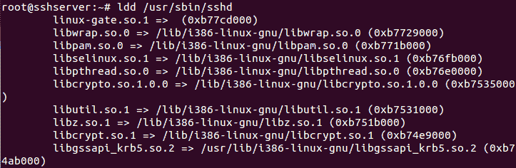

如果前面命令的输出包含`libwrap.so`，则表示程序受 TCP Wrappers 支持。

3.  现在，每当 SSH 程序尝试使用 TCP Wrappers 连接到服务器时，都会按以下顺序检查两个文件:

4.  如果在特定程序的两个文件中没有找到匹配的规则，将允许访问。

5.  如果我们尝试连接到 SSH 服务器，在添加任何规则之前，我们将看到它成功连接:


6.  现在，让我们假设我们想要拒绝具有给定 IP 地址的特定系统对 SSH 程序的访问。为此，我们将编辑`/etc/hosts.deny`文件，如下所示:


7.  现在，如果我们试图从拒绝访问的特定系统连接到 SSH 服务器，它会显示以下错误:


8.  如果我们想允许所有程序和所有客户端的访问，要么在这两个文件中不添加任何规则，要么在`/etc/hosts.allow`文件中添加以下行:


9.  如果我们希望允许从具有 IP 地址`192.168.1.106`的特定客户端访问所有服务，那么我们在`/etc/hosts.allow`文件中添加以下行:

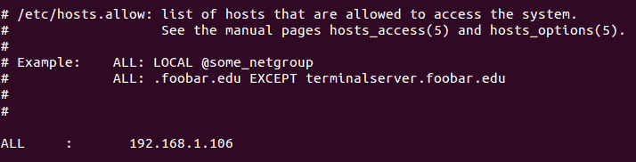

10.  如果我们想要允许特定网络上的所有客户端访问 SSH，除了具有 IP 地址`192.168.1.100`的特定客户端，我们在`/etc/hosts.allow`文件中执行以下更改:

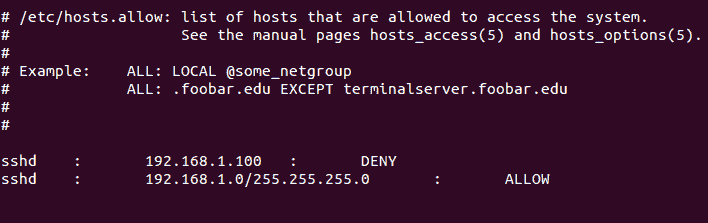

11.  进行上述更改后，当我们尝试通过 SSH 连接时，我们将看到以下错误:

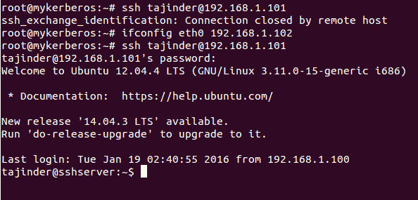

我们可以看到，一旦为客户端更改了 IP 地址，现在就允许 SSH 访问，这意味着特定网络上的所有客户端都可以访问 SSH，但 IP 地址被拒绝了。

12.  前面的步骤阻止了我们在`/etc/hosts.allow`文件中为其定义规则的服务。然而，在服务器端，我们无法找出哪个客户端试图访问服务器以及何时访问。因此，如果我们想要维护客户端所有连接尝试的日志，我们可以编辑`/etc/hosts.allow`文件，如下所示:

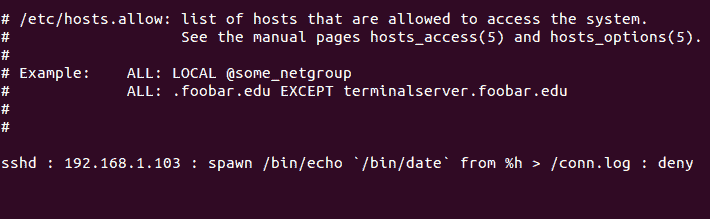

在前一行中，`spawn`关键字定义了每当客户端发出连接请求时，它将按照`%h`选项的规定回显详细信息，并将其保存在日志文件`conn.log`中。

13.  现在，当我们阅读`conn.log`文件的内容时，我们会看到它的详细信息，如下所示:


该文件包含客户端尝试连接的时间和 IP 地址的日志。通过使用`spawn`命令的不同参数可以获取更多细节。

# 它是如何工作的...

我们使用 TCP 包装器来限制对受 TCP 包装器包支持的程序的访问。我们首先使用`ldd`工具检查我们想要限制的程序是否被 TCP Wrapper 支持。然后我们根据我们的要求在`/etc/hosts.allow`或`/etc/hosts.deny`文件中添加一条规则。

然后，根据我们的选择，我们添加规则来限制程序来自特定客户端或整个网络。使用 TCP 包装器中的`spawn`选项，我们甚至为我们限制的客户端或程序进行的连接尝试维护一个日志。

# 使用 mod_security 阻止特定国家/地区的流量

ModSecurity 是一个 web 应用程序防火墙，可用于 Apache web 服务器。它提供日志记录功能，可以监控 HTTP 流量，以便检测攻击。ModSecurity 还可以用作入侵检测工具，我们可以根据自己的要求使用它来阻止特定国家的流量。

# 准备好

在我们开始`mod_security`的安装和配置之前，我们需要在我们的 Ubuntu 系统上安装 Apache 服务器。

要在 Ubuntu 上安装 Apache，请运行以下命令:

```sh
apt-get update
apt-get install apache2
```

# 怎么做...

在本节中，我们将了解如何安装和配置 ModSecurity **网络应用防火墙** ( **WAF** )来阻止特定国家/地区的流量:

1.  在 Ubuntu 上安装 Apache 后，下一步是通过运行以下命令来安装 ModSecurity:

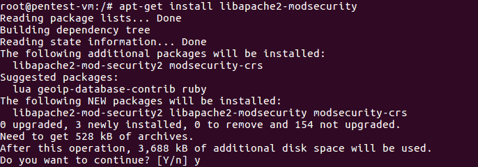

2.  安装 ModSecurity 后，重新启动 Apache:


3.  要确认 ModSecurity 已成功安装，请运行以下命令:

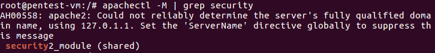

如果安装成功，我们应该会看到类似这样的内容:`security2_module (shared)`，如前面的截图所示。

4.  安装完成后，我们开始配置 ModSecurity。为此，我们使用位于`/etc/modsecurity`目录中的预包含和推荐的配置文件— `modsecurity.conf-recommended`。

5.  重命名`modsecurity.conf-recommended`文件，如下所示:

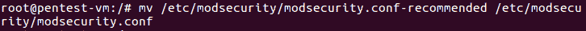

6.  重命名文件后，我们编辑`modsecurity.conf`文件并将`SecRuleEngine detectiononly`的值更改为上的`SecRuleEngine`:

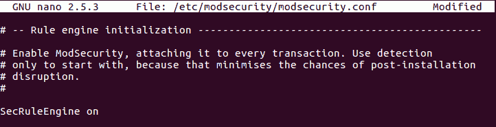

7.  保存这些更改后，重新启动 Apache:


8.  ModSecurity 附带了许多**核心规则** ( **CSR** )。但是，我们可以使用以下命令从 GitHub 下载最新的 OWASP ModSecurity CRS:

```sh
git clone https://github.com/SpiderLabs/owasp-modsecurity-crs.git
```

9.  下载后，进入下载目录。接下来，将`crs-setup.conf.example`文件移动并重命名为`/etc/modsecurity/`，如下所示。将`rules/`目录也移到`/etc/modsecurity/`:


10.  现在，编辑 Apache 配置文件`/etc/apache2/mods-available/security2.conf`，并添加`Include`指令指向规则集，如下所示:


11.  再次重新启动 Apache 以反映更改:


12.  ModSecurity 通过与免费的 Maxmind 数据库集成，支持地理位置数据的使用。
13.  为了阻止特定国家的流量，我们首先必须在配置了 ModSecurity 的同一台服务器上下载地理位置数据库。要下载数据库，请使用以下命令:

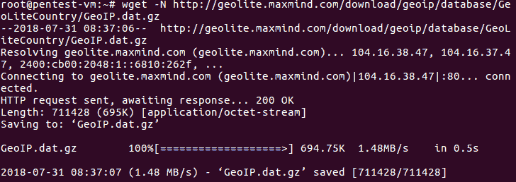

14.  下载完成后，提取文件并移动到`/usr/share/GeoIP/`。

15.  下一步是编辑`/etc/modsecurity/crs-setup.conf`文件，以启用地理位置数据库的使用。为此，我们启用`SecGeoLookupDb`指令，并定义下载的 GeoIP 数据库文件的路径:


16.  接下来，我们需要一个规则来阻止来自任何国家的交通。配置文件有一个示例规则供参考，可以通过取消规则的注释来使用:


17.  取消规则注释并添加我们要阻止的国家的国家代码后，如下图所示，我们可以保存文件:


18.  如果我们希望我们的服务器只能从一个特定的国家访问，并阻止来自所有其他国家的流量，我们可以创建一个规则，如下所示:

```sh
SecRule *GEO:COUNTRY_CODE3* "***!@streq USA***" "phase:1,t:none,log,deny,msg:'Client IP not from USA'"
```

这样，我们可以使用 ModSecurity 来阻止或允许特定国家的流量。

# 使用 SSL 保护网络流量

**TLS** 和 **SSL** 是安全协议，已经被开发用于将正常流量放入受保护的加密包装中。在这些协议的帮助下，流量可以以加密格式在远程用户之间发送，从而保护流量不被任何其他人拦截和读取。这些证书是数据加密过程的重要组成部分，有助于确保互联网交易的安全。

# 准备好

在我们开始创建和配置自签名证书之前，我们需要在我们的 Ubuntu 系统上安装 Apache 服务器。

要在 Ubuntu 上安装 Apache，请运行以下命令:

```sh
apt-get update
apt-get install apache2
```

# 怎么做...

在本节中，我们将学习如何创建自签名证书来加密到我们的 Apache 服务器的流量:

1.  安装好 Apache 服务器后，我们可以通过访问浏览器上的`http://localhost`链接来检查默认网页:

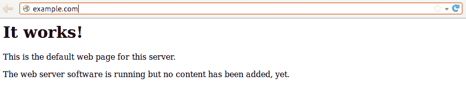

2.  但是，当我们尝试使用 HTTPS 访问同一页面时，会出现以下错误:


3.  要开始使用 SSL，我们必须在 Ubuntu 服务器上启用 SSL 支持模块。为此，我们必须运行以下命令:

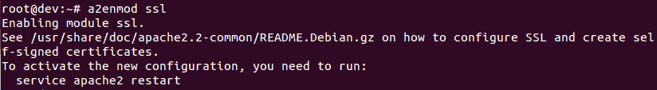

4.  启用 SSL 模块后，重新启动 Apache 服务器，以便可以识别更改:

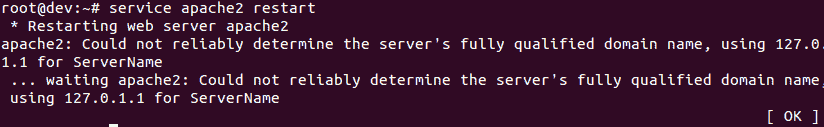

5.  现在，我们将继续创建自签名证书。首先，在 Apache 的配置层次结构中创建一个子目录。我们将要创建的证书文件将放在这里。运行以下命令:


6.  现在，我们将创建我们的密钥和证书文件，并将它们放在我们在上一步中创建的目录中。要创建密钥和证书文件，我们可以使用`openssl`命令，如下所示:


有关与`openssl`命令一起使用的选项的更多细节，建议查看该命令的手册。

7.  当我们执行前面的命令时，我们会被问到几个问题。输入完成证书创建过程所需的详细信息:

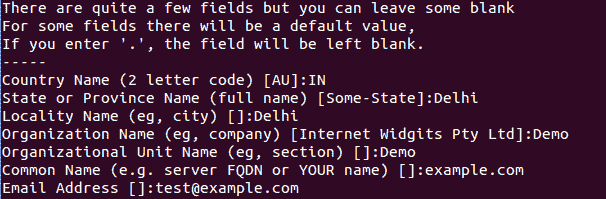

这些问题中，最重要的是`Common Name`(服务器的`FQDN or YOUR name`)。在这里，我们必须输入应该与证书关联的域名。如果我们没有域名，也可以使用服务器的公共 IP。

8.  命令完成后，我们可以检查之前创建的`/etc/apache2/ssl`目录。我们将看到密钥和证书文件已经放在这里:

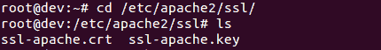

9.  创建密钥和证书文件后，下一步是配置 Apache 使用这些文件。我们将基于`etc/apache2/sites-available/default-ssl`文件进行配置，因为它包含默认的 SSL 配置。

10.  编辑文件并设置我们将为虚拟主机配置的值。这包括`SeverAdmin`、`ServerName`、`ServerAlias`等等。按如下方式输入详细信息:

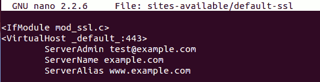

11.  在同一个文件中，我们必须定义 Apache 可以找到 SSL 证书和密钥的位置，如下图所示:

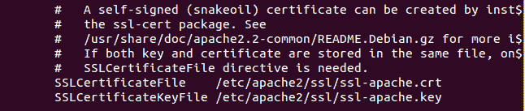

12.  为启用 SSL 的虚拟主机完成上述配置后，我们必须启用它。为此，我们运行以下命令:

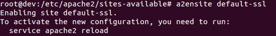

13.  要加载新的虚拟主机文件，请重新启动 Apache 以使更改生效。

14.  完成所有设置后，我们现在可以通过使用 HTTPS 协议访问服务器的域名来测试我们的配置。一旦我们在浏览器中用`https`输入域名，并按*进入*，我们会得到如下画面:


这确认正在加载证书。由于它是自签名证书，我们会收到一条警告消息，指出此连接不受信任。如果证书是由浏览器信任的某个证书颁发机构签署的，则不会出现此警告。

15.  一旦我们单击我了解风险并继续，我们将被要求添加一个安全例外，如下图所示。确认安全异常以在浏览器中添加我们的自签名证书:

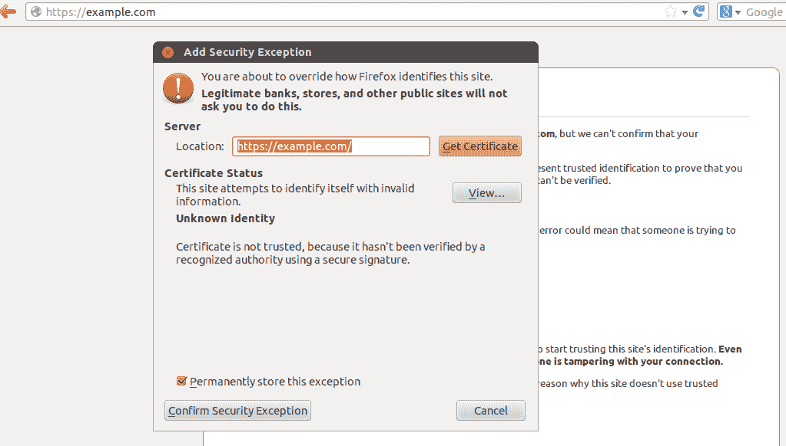

我们现在已经在我们的网络服务器上启用了 SSL。这将有助于保护用户和服务器之间的流量。

# 它是如何工作的...

SSL 证书是数字护照，提供身份验证以保护服务器和浏览器之间通信的机密性和完整性。SSL 证书有一个密钥对:公钥和私钥，它们共同建立加密连接。

当浏览器试图连接到使用 SSL 保护的网络服务器时，它会要求网络服务器识别自己。然后，服务器发送其 SSL 证书的副本。收到证书后，浏览器向服务器发送消息。此后，服务器发回一个数字签名的确认，告诉服务器启动一个 SSL 加密连接。现在，服务器和浏览器之间共享的所有数据都被加密了。