# 安全工具

在本章中，我们将讨论以下内容:

*   Linux s-氧化物
*   港口哨兵
*   使用 Squid 代理
*   openssl 服务器
*   绊网
*   海滨
*   欧司
*   鼻息声
*   Rsync 和 Grsync—备份工具

# Linux s-氧化物

在 Linux 中，文件通常具有读取、写入和执行的权限。除了这些权限，它还可以有特殊权限，如 SUID(设置所有者用户标识)和 SGID。由于这些权限，用户可以从他们的帐户登录，并且仍然以实际文件所有者(也可以是 root)的权限运行特定的文件/程序。sXid 是定期监测 SUID/SGID 的工具。使用这个工具，我们可以跟踪文件和文件夹在 SUID/SGID 的变化。

# 准备好

要使用这个工具，我们需要在我们的 Linux 系统上安装 sXid 包。我们可以使用`apt-get`命令安装软件包，也可以下载软件包，手动配置安装。要安装 sXid 包，我们运行以下命令:

```sh
    apt-get install sxid
```

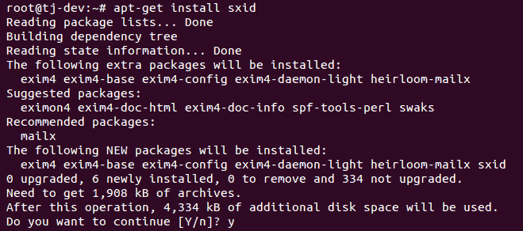

# 怎么做...

为了开始监控文件和文件夹的`suid/sgid`，我们对工具进行如下配置:

1.  一旦安装完成，我们就开始编辑`/etc/sxid.conf`文件，按照我们的要求使用工具。在您选择的编辑器中打开文件:

```sh
    nano /etc/sxid.conf
```

2.  在配置文件中，查找以下行:

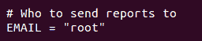

如果您希望在运行`sxid`时将更改输出发送到您的电子邮件标识，请将`EMAIL`的值更改为任何其他电子邮件标识。

3.  接下来，寻找上面写着`KEEP_LOGS`的行，并将该值更改为您选择的数值。此数字定义了要保留的日志文件数量:


4.  如果即使 sXid 没有发现任何变化，您也希望获得日志，那么将`ALWAYS_NOTIFY`的值更改为是:


5.  我们可以为`SEARCH `选项定义一个目录列表，用空格隔开，让 sXID 作为搜索的起点。但是，如果我们希望从搜索中排除任何目录，我们可以在`EXCLUDE `选项下指定:

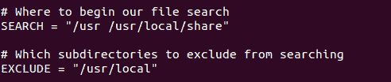

假设我们有一个目录`/usr/local/share`，需要搜索，`/usr/local`目录已经在排除列表中提到；它仍将被搜索。这对于排除主目录并只指定一个目录非常有用。

7.  `/etc/sxid.conf`中还有很多选项，可以根据我们的要求进行配置。编辑完文件后，保存并关闭文件。

8.  现在，如果我们想手动运行 sxid 进行抽查，我们使用以下命令:

```sh
    sxid -c /etc/sxid.conf -k
```

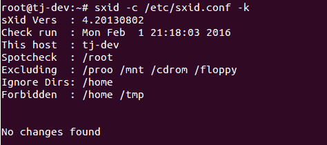

在这里，`-c`选项有助于定义配置文件的路径，如果它没有被命令自动拾取的话。`-k`选项运行工具。

# 它是如何工作的...

我们首先安装 sxid 包，然后按照我们的要求通过编辑`/etc/sxid.conf`文件进行配置。配置完成后，我们手动运行 sXid 来执行抽查。如果我们愿意，我们甚至可以在`crontab`中添加一个条目，以定义的时间间隔自动运行 sXid。

# 港口哨兵

作为系统管理员，一个主要的问题是保护系统免受网络入侵。这就是 PortSentry 进入画面的地方。它能够检测主机系统上的扫描，并以我们选择的方式对这些扫描做出反应。

# 准备好

为了演示 PortSentry 的实现和使用，我们需要同一网络上的两个系统，它们可以相互 ping 通。此外，我们需要一个系统上的 Nmap 包，它将被用作客户端，而在另一个系统上，我们将安装和配置 PortSentry 包。要安装`nmap`包，使用`apt-get install nmap`命令:

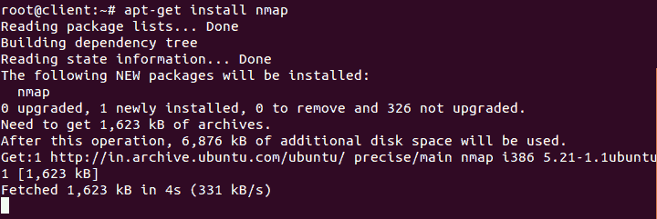

# 怎么做...

1.  在第一个系统上，我们使用以下命令安装 PortSentry 包:

```sh
    apt-get install portsentry
```


2.  在安装过程中，将会打开一个窗口，其中包含一些关于 PortSentry 的信息。只需点击`Ok `继续。

3.  安装一完成，PortSentry 就开始监控 TCP 和 UDP 端口。我们可以通过使用以下命令检查`/var/log/syslog`文件来验证这一点:

```sh
    grep portsentry /var/log/syslog
```


我们可以在日志中看到与`portsentry`相关的消息。

4.  现在，在我们用作客户端的第二台机器上，运行如下所示的`nmap`命令:

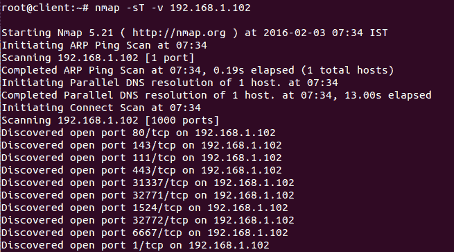

我们也可以使用任何其他`nmap`命令在运行`portsentry`的第一个系统上执行 TCP 或 UDP 扫描。要检查 Nmap 命令，请参见[第 1 章](01.html)、 *Linux 安全问题。*在前面的结果中，我们可以看到，即使在第一个系统上运行 PortSentry，nmap 也能够成功扫描。我们甚至可以尝试从客户端 ping 服务器系统，看看它在安装 Portsentry 后是否工作。

5.  现在，让我们通过编辑服务器系统上的`/etc/portsentry/portsentry.conf`文件来配置 PortSentry。在您选择的编辑器中打开后，查找此处显示的行，并将值更改为`1`:

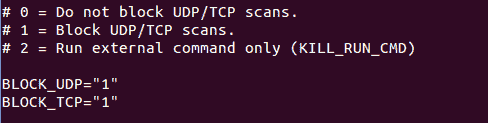

6.  向下滚动，然后找到并取消注释这一行:


7.  接下来，取消对以下行的注释:

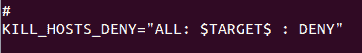

完成后，保存并关闭文件。

8.  接下来，编辑`/etc/default/portsentry`文件:

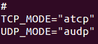

在这里显示的行中，我们需要提到 Portsentry 应该为哪个协议工作，TCP 还是 ATCP。

9.  现在，编辑`/etc/portsentry/portsentry.ignore.static`文件，并在底部添加一行，如下图所示:


这里，`192.168.1.104`是我们试图屏蔽的客户端机器的 IP 地址。

10.  现在，通过运行以下命令重新启动 Portsentry 服务:

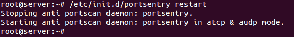

11.  一旦前面的步骤完成，我们将再次尝试在客户端机器上运行`nmap`，看看它是否仍然正常工作:

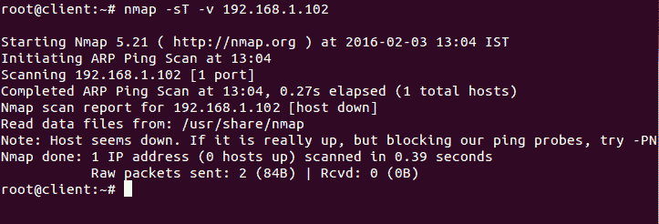

我们可以看到 nmap 现在无法扫描 IP 地址。

12.  如果我们尝试从客户端 ping 服务器，即使这样也不起作用:


13.  如果我们检查`/etc/hosts.deny`文件，我们将会看到自动添加了以下行:


14.  同样，当我们检查`/var/lib/portsentry/portsentry.history`文件时，我们得到类似于此截图最后一行的 a 结果:

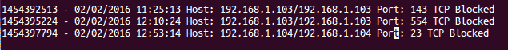

# 它是如何工作的...

我们使用两种系统。第一个系统充当 Portsentry 服务器，而另一个系统充当客户端。在第一个系统上，我们安装 Portsentry 包，在第二个系统上，我们安装 nmap，它将用于演示 Portsentry 的工作方式。现在我们从服务器上的客户机执行 Nmap 扫描。我们可以看到它运行良好。之后，我们通过编辑各种文件，按照我们的要求配置 Portsentry。编辑完成后，重新启动 portsentry 服务，然后再次尝试从服务器上的客户端执行 Nmap 扫描。我们看到现在扫描不能正常工作。

# 使用 Squid 代理

Squid 是一个具有多种配置和用途的 web 代理应用程序。Squid 有大量的访问控制，支持不同的协议，如 HTTP、HTTPS、FTP 和 SSL。在本节中，我们将看到如何使用 Squid 作为 HTTP 代理。

# 准备好

要在特定的系统和网络上安装和使用 Squid，请确保系统有足够的物理内存，因为 Squid 还充当缓存代理服务器，因此需要空间来维护缓存。我们使用一个 Ubuntu 系统作为例子，Squid 在 Ubuntu 存储库中是可用的。因此，我们需要确保我们的系统是最新的。为此，我们运行以下命令:

```sh
    apt-get update
```

然后我们运行这个命令:

```sh
    apt-get upgrade
```

# 怎么做...

要在我们的系统上安装和配置 Squid，我们必须遵循以下步骤:

1.  第一步是使用以下命令安装 Squid 包:

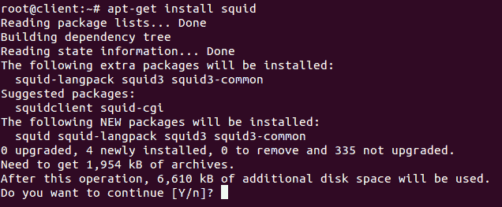

2.  一旦安装了 Squid，它将使用默认配置开始运行，默认配置被定义为阻止网络上的所有 HTTP/HTTPS 流量。要检查这一点，我们只需要在网络上的任何系统上配置浏览器，以使用代理系统的 IP 地址，如下所示:

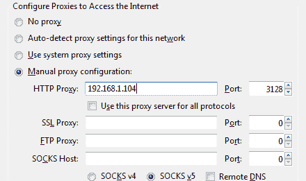

3.  完成后，我们现在可以尝试访问任何网站，我们将看到一个错误屏幕，如下图所示:

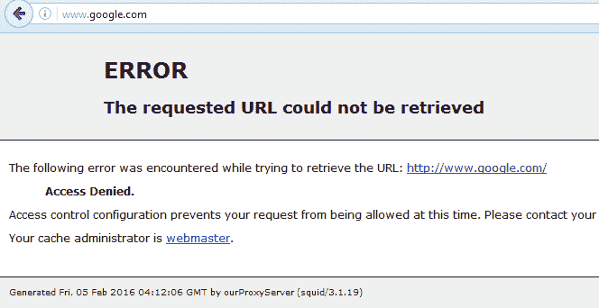

4.  现在，我们将开始配置我们的代理服务器，使其按照我们的要求工作。为此，我们将在我们选择的编辑器中编辑`/etc/squid3/squid.conf`文件。一旦文件在编辑器中打开，搜索类别为`TAG: visible_hostname`。在此类别下，添加一行，`visible_hostname ourProxyServer`:


这里，`ourProxyServer`是我们给代理服务器起的名字。

5.  接下来，搜索显示`TAG: cache_mgr`的类别，并添加一行`cache_mgr email@yourdomainname`。在这里，提到可以联系的管理员的电子邮件 ID，而不是`email@yourdomainname`:

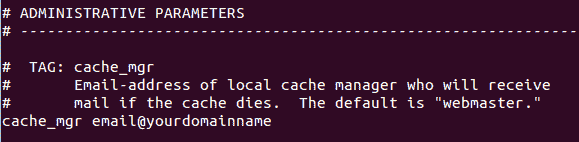

6.  接下来，我们搜索如下图所示的行。`http_port`变量定义了 Squid 将监听的端口。默认端口为`3128`，但我们可以将其更改为任何其他未使用的端口。我们甚至可以定义多个端口供 Squid 收听，如下所示:

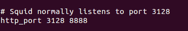

7.  现在，我们需要根据我们的要求添加允许网络计算机流量的规则。为此，我们将搜索上面写着`acl localnet src 10.0.0.8`的行。在这里，我们添加我们的规则，`acl localnetwork src 192.168.1.0/24`，如下图所示:


在我们之前添加的规则中，`acl `用于定义新规则，`localnetwork`是我们给规则起的名字。`src`定义将到达代理服务器的流量来源。我们定义网络 IP 地址，子网以位为单位，如下所示。根据我们的要求，我们可以添加任意多的规则。

8.  接下来，搜索上面写着`http_access allow localhost`的行，并在下面添加行`http_access allow localnetwork`以开始使用我们在上一步中添加的规则并允许流量:


9.  完成前面的配置步骤后，我们使用以下命令重新启动 Squid 服务:

```sh
    service squid3 restart
```

10.  现在，我们的 Squid 代理服务器正在运行。要进行检查，我们可以尝试从网络上任何系统的浏览器访问代理服务器的 IP 地址:


上一个错误屏幕告诉我们 Squid 代理工作正常。现在，我们可以尝试访问任何其他网站，它应该按照我们在 Squid 的配置文件中添加的规则打开。

# 它是如何工作的...

我们从安装 Squid 包开始。软件包安装完成后，我们编辑其配置文件`/etc/squid3/squid.conf`，并添加主机名、管理员的电子邮件 id 以及 Squid 应该监听的端口。然后，我们创建规则来允许同一网络上所有系统的流量。一旦我们保存了所有的配置，我们重新启动 Squid 服务，我们的代理服务器现在可以工作了。

# openssl 服务器

SSL(安全套接字层)是一种用于在互联网上传输敏感信息的协议。这可能包括帐户密码和信用卡详细信息等信息。SSL 最常用于通过 HTTP 协议浏览网页。OpenSSL 库提供了 SSL 和 TLS(传输层安全)协议的实现。

# 准备好

为了演示 OpenSSL 的使用，我们需要两个系统。一个将被用作服务器，我们将在其上安装 OpenSSL 包，还有 Apache。第二个系统将用作客户端。要安装 Apache，我们运行以下命令:

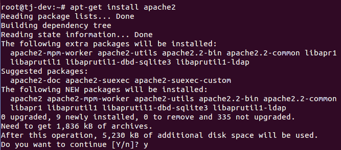

# 怎么做...

我们现在将看到如何使用 OpenSSL 为 Apache 创建自签名证书。这将有助于加密到服务器的流量:

1.  我们首先使用以下命令在第一个系统上安装 OpenSSL 包:

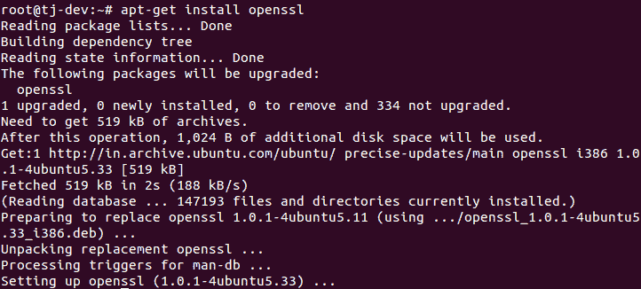

2.  一旦安装了 OpenSSL，我们就需要启用 SSL 支持，这是 Ubuntu 的 Apache 包中的标准配置。为此，我们运行以下命令:

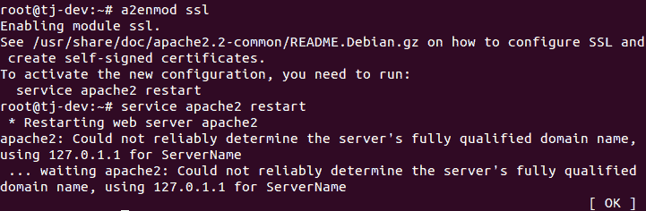

启用 SSL 支持后，使用以下命令重新启动 Apache:

```sh
    service apache2 restart
```

3.  现在，在 Apache 的配置目录中创建一个目录。这是我们保存下一步将要制作的证书文件的地方:

```sh
    mkdir /etc/apache2/ssl
```

4.  现在，我们将使用以下命令创建密钥和证书:


在前面的命令中，`req -x509`指定我们将创建一个自签名证书，该证书将遵守 X.509 CSR(证书签名请求)管理。`-nodes`指定创建密钥文件时不使用任何密码保护。`-days 365`告诉我们，正在创建的证书有效期为一年。`-newkeyrsa:2048`告诉我们私钥文件和证书文件都会同时创建，生成的密钥长度为 2048 位。下一个参数`-keyout`指定将要创建的私钥的名称。`-out`参数提到正在创建的证书文件的名称。

5.  当创建密钥和证书文件时，您会被问到几个问题。提供配置的详细信息。然而，上面写着`Common Name (e.g. server FQDN or YOUR name)`的选项很重要，我们必须提供域名或服务器的公共 IP。

6.  接下来，我们需要编辑`/etc/apache2/sites-available/default`文件，以配置 Apache 使用在前面步骤中创建的密钥文件和证书文件。查找并编辑此处显示的行。对于`ServerName`，我们提供了 Apache 服务器系统的 IP 地址:


7.  在同一个文件中，滚动到文件的末尾，在`<VirtualHost>`块关闭之前，添加这里给出的行。提及创建这些文件时使用的密钥文件名和证书文件名:


8.  现在，在客户端系统上，打开任何浏览器，使用`https:// protocol`访问 Apache 服务器的公共 IP，如下所示:

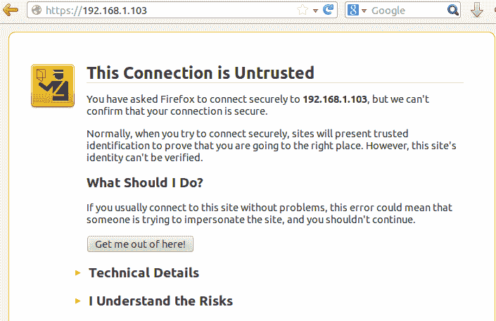

浏览器将显示一条关于连接不安全的警告消息，因为证书没有由任何受信任的机构签名。

9.  点击`I Understand the Risks`，然后点击`Add Exception`按钮，在浏览器中添加证书:

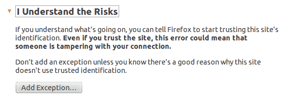

10.  接下来的窗口将显示一些关于服务器的信息。要继续并添加证书，请点击`Confirm Security Exception`:

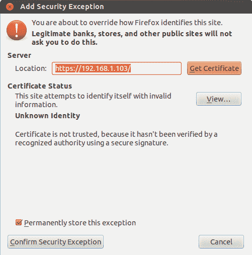

11.  如果您希望查看证书的更多详细信息，请单击上一屏幕中的`View`，您将看到一个显示证书完整详细信息的新窗口。
12.  证书添加成功后，网页加载将完成，如下所示:

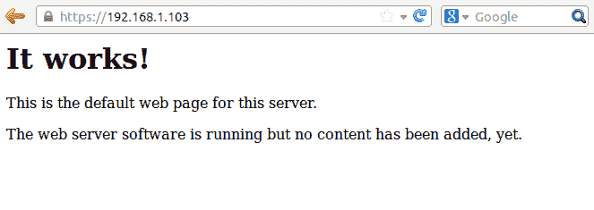

# 它是如何工作的...

在这个设置中，我们使用两个系统。第一个是我们安装 OpenSSL 包的 Apache 服务器。第二个系统作为客户端工作，我们将尝试从该客户端连接到 Apache 网络服务器。在第一个系统上安装了 Apache 和 OpenSSL 包后，我们启用了对 Apache 的 SSL 支持。然后，我们使用 OpenSSL 工具和一些参数创建服务器密钥和服务器证书文件。之后，我们编辑`/etc/apache2/sites-available/default`文件，这样 Apache 就可以使用我们创建的密钥和证书。完成后，我们尝试通过客户端机器上的浏览器访问 Apache 网络服务器。我们看到它要求将新证书添加到浏览器中，这样做之后，我们就可以使用 HTTPS 协议访问 web 浏览器了。

# 还有更多...

我们已经看到了如何使用 OpenSSL 来创建自签名证书。除了创建自签名证书，OpenSSL 还有各种其他用例。在这里，我们将看到其中的一些:

1.  如果我们想要创建一个新的**证书签名请求** ( **CSR** )和一个新的私钥，我们可以使用这里显示的命令来完成:


2.  在这个过程中，它会询问一些细节。输入如下所示的详细信息:

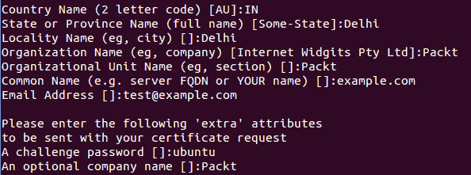

3.  我们可以看到在当前目录中创建的两个文件:

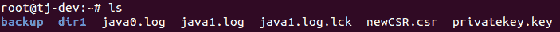

4.  如果我们想在 CA 签署之前检查企业社会责任，我们可以这样做，如下所示:

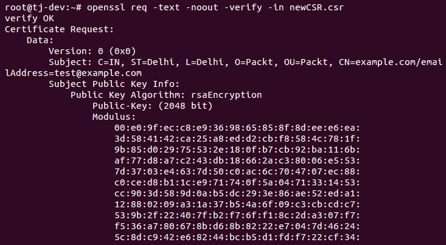

同样，还有其他命令可以与 OpenSSL 一起使用。

# 绊网

随着如今对服务器的攻击越来越多，在确保安全的同时管理服务器成为一个复杂的问题。要确定每一次攻击都被有效阻挡很难知道。Tripwire 是一个基于主机的入侵**检测系统** ( **IDS** )，可用于监控不同的文件系统数据点，然后在任何文件被修改或更改时向我们发出警报。

# 准备好了

我们只需要在我们的 Linux 系统上安装 Tripwire 包来配置我们的 IDS。在下一节中，我们将看到如何安装和配置该工具。

# 怎么做...

我们将在以下步骤中讨论如何在我们的 Ubuntu 系统上安装和配置 Tripwire:

1.  第一步是使用`apt-get`安装绊网套件，如下图所示:


2.  在安装过程中，它将显示一个信息窗口。单击“确定”继续。
3.  在下一个窗口中，选择“互联网站点”作为邮件配置类型，然后单击“确定”:


4.  在下一个窗口，它会询问`system mail name`。输入您正在配置 Tripwire 的系统的域名:

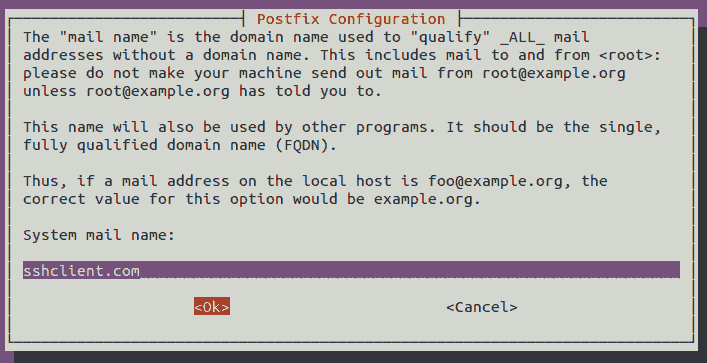

5.  按下一个屏幕上的“确定”继续。
6.  现在，我们将被询问是否要为 Tripwire 创建密码。选择是并继续。
7.  现在，我们将被询问是否要重建配置文件。选择是并继续:

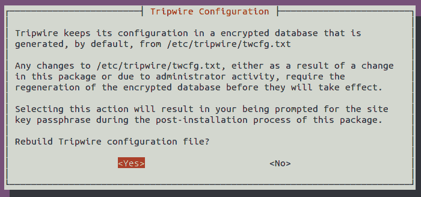

8.  接下来，选择是重建 Tripwire 的策略文件:


9.  接下来，提供您希望为 Tripwire 配置的密码:

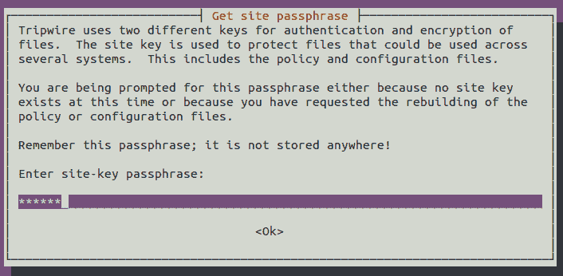

它还会要求您在下一个屏幕中重新确认密码。

10.  接下来，提供本地密钥的密码，并在下一个屏幕中重新确认:


11.  下一个屏幕确认安装过程已成功完成。单击“确定”完成安装:


12.  一旦安装成功，我们的下一步就是初始化 Tripwire 数据库。为此，我们运行如下所示的命令:

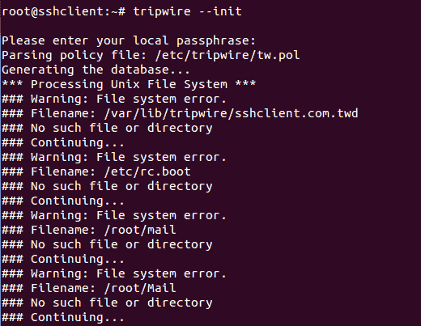

在这里显示的输出中，我们可以看到许多文件名都显示了一个名为`No such file or directory`的错误。这是因为 Tripwire 会扫描其配置文件中提到的每个文件，无论它是否存在于系统中。

13.  如果我们希望消除前面显示的错误，我们必须编辑`/etc/tripwire/tw.pol`文件，并对系统中不存在的文件/目录的行进行注释。如果我们愿意，我们甚至可以让它保持原样，因为它不会妨碍 Tripwire。

14.  如果我们得到任何与“分段故障”相关的错误，我们可能需要编辑/etc/tripwire/twpol.txt 文件来禁用出现错误的设备/文件，如下所示-


13.  我们现在将测试 Tripwire 是如何工作的。为此，我们将通过运行以下命令创建一个新文件:

```sh
    touch tripwire_testing
```

您可以为文件选择任何名称。

15.  现在，运行 Tripwire 交互命令来测试它是否工作。为此，命令如下:

```sh
    tripwire --check --interactive
```

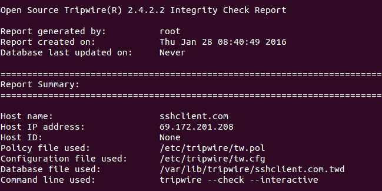

我们将获得前面显示的输出。Tripwire 将检查所有文件/目录，如果有任何修改，将显示在结果中:


在我们的例子中，它显示了前面显示的行，告诉我们一个文件`tripwire_testing`已经被添加到`/root`目录中。如果我们希望保留显示的更改，只需保存在编辑器中自动打开的结果文件。保存结果时，系统会提示您输入本地密码。输入您在安装 Tripwire 期间配置的密码。

16.  最后，我们在`crontab`中添加一个条目来自动运行 Tripwire，以检查文件/目录中的更改。在您选择的编辑器中打开`/etc/crontab`文件，并添加这一行:


这里，`00 6`告诉我们，Tripwire 每天 6 点会检查。

# 它是如何工作的...

我们首先安装 Tripwire 软件包，在安装过程中，我们按照要求填写详细信息。安装完成后，我们初始化 tripwire 数据库。之后，我们检查绊网是否正常工作。为此，我们首先在任何位置创建一个新文件，然后运行 tripwire interactive 命令。命令完成后，我们在输出中看到它显示新文件已经添加。这证实了 Tripwire 的工作非常完美。然后，我们编辑 Crontab 配置，以特定的时间间隔自动运行 Tripwire。

# 海滨

想设置一个 Linux 系统作为小型网络的防火墙？Shorewall 帮助我们通过标准 Shorewall 工具配置企业级防火墙。Shorewall 实际上是建立在 Iptables 上的，但它使配置变得更加容易。

# 准备好

配置 Shorewall 需要一个安装了两个网卡并正常工作的 Linux 系统。一张卡将用作外部网络接口，第二张卡将用作内部网络接口。在我们的例子中，我们使用`eth0`作为外部，`eth1`作为内部。根据网络配置配置两个卡。确保您能够 ping 通本地网络上的另一个系统以及外部网络上的某个系统，即互联网。在这个系统上，我们将安装 Shorewall 软件包，然后按照我们的要求进行配置。

# 怎么做...

1.  我们首先使用`apt-get`命令在系统上安装 Shorewall:

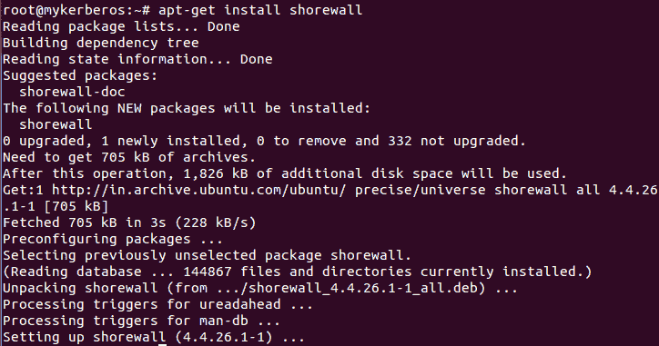

2.  安装完成后，尝试启动 Shorewall。您将获得如下所示的错误消息:

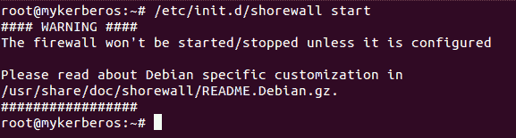

这意味着我们需要先配置 Shorewall，然后它才能开始运行。

3.  要配置 Shorewall，请在您选择的编辑器中编辑`/etc/default/shorewall`文件。寻找上面写着`startup=0`的行，将其值改为`1`:


4.  接下来，编辑`/etc/shorewall/shorewall.conf`文件，找到写着`IP_FORWARDING`的行。验证其值是否设置为`On`:


5.  Shorewall 的配置文件位于`/etc/shorewall`目录。它工作所必需的最小文件是接口、策略、规则和区域。如果安装后在`/etc/shorewall`目录中找不到这些文件，我们可以在`/usr/share/doc/shorewall/default-config/`目录中找到相同的文件。将所需文件从该位置复制到`/etc/shorewall`目录。
6.  现在，编辑`/etc/shorewall/interfaces`文件，添加如下截图所示的行:

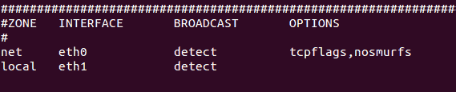

在我们的配置中，我们将`eth0`称为`net`，将`eth1`称为`local`。您可以选择任何其他名称，只要它是字母数字和`5`字符或更少。

7.  接下来，编辑`/etc/shorewall/zones`文件。区域主要用于设置是使用`ipv4`还是`ipv6`:


在之前的配置中，`fw`指的是`me`或者岸墙防火墙本身。接下来的两行为两个网络接口定义了`ipv4`。

8.  现在，编辑`/etc/shorewall/policy`策略文件。这个文件主要用来设置谁被允许去哪里的总体政策。该文件中的每一行都是从上到下处理的，并且每一行都是按照以下格式读取的:如果数据包是从 _____ 发送到 ____，则 ____:

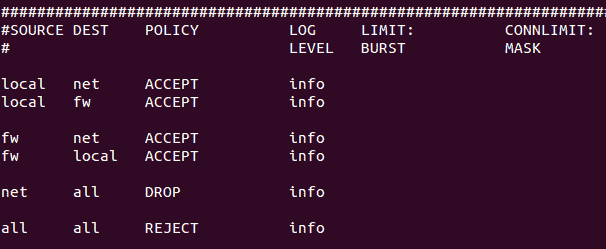

在我们的例子中，如果我们读取第一个策略，它将被读取如下:如果一个数据包从本地发送到网络，那么接受它。您可以通过同样的方式添加任意多的策略，Shorewall 防火墙也将相应地工作。

9.  最后，我们编辑`/etc/shorewall/rules`文件。此文件用于创建策略的例外。它主要用于您希望允许外部网络的人员进入内部网络。这里显示了一个示例规则文件:

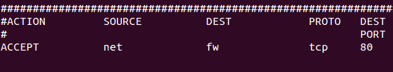

我们添加了一条规则，规定:如果数据包是使用端口号为`80`的`tcp`协议从`net`发送到`fw`的，则为`accept`。

10.  根据我们的要求配置完之前的文件后，我们可以通过运行以下命令来测试设置:

```sh
    shorewall check
```

11.  在显示的输出中，滚动到底部，如果显示`Shorewall configuration verified`，则表示设置已经正确完成，现在 shorewall 可以用作防火墙:

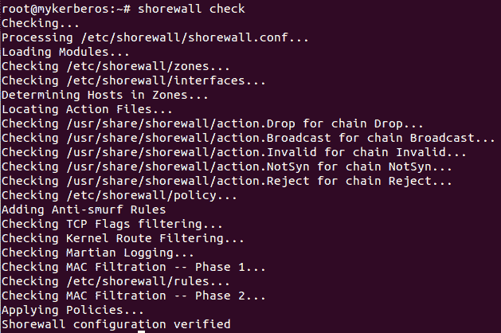

12.  现在，重新启动`shorewall`服务以应用设置:

```sh
    serviceshorewall restart
```

# 它是如何工作的...

我们首先在系统上安装 shorewall，它有两个网络接口卡。安装完成后，我们编辑`/etc/default/shorewall`文件和`/etc/shorewall/shorewall.conf`文件。然后，我们在`/etc/shorewall`位置编辑或创建这些文件:接口、策略、规则和区域。并且，我们根据给定的要求在每个文件中添加行。编辑完成后，我们检查一切正常，然后启动`shorewall`服务启动防火墙。

# 欧司

作为系统管理员，我们可能希望跟踪您服务器上的授权和未授权活动。奥塞梯可能是解决这个问题的办法。这是一个开源的基于主机的入侵检测系统，可用于跟踪服务器活动。正确配置后，OSSEC 可以执行日志分析、完整性检查、rootkit 检测、基于时间的警报和许多其他操作。

# 准备好

为了安装和配置 OSSEC，我们将使用 Ubuntu 服务器。编译和运行 OSSEC 可能需要额外的包，如 gcc、libc、Apache 和 PHP。此外，如果我们希望实时警报工作，将需要一个单独的软件包。要安装所有必需的软件包，请运行此处显示的命令:

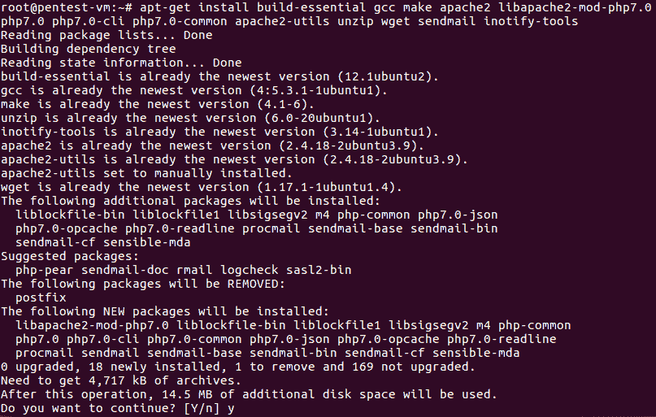

# 怎么做...

在本节中，我们将学习如何安装和配置 OSSEC 来监控本地 Ubuntu 服务器。我们还将针对任何文件修改测试 OSSEC:

1.  我们的第一步将是使用以下命令从其 GitHub 存储库中下载最新版本的 OSSEC:

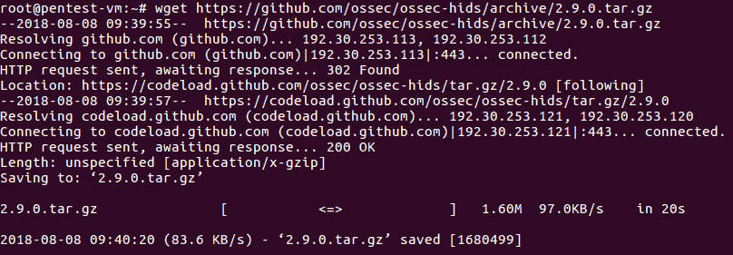

2.  根据下载完成后保存的位置，使用以下命令提取下载的文件:

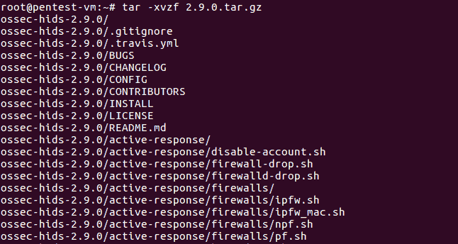

3.  在提取的目录中移动并列出其内容。我们将看到一个 install.sh 脚本，它将用于安装 OSSEC:

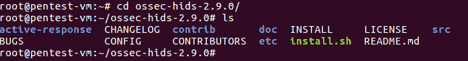

4.  运行 install.sh，如下所示安装 OSSEC:

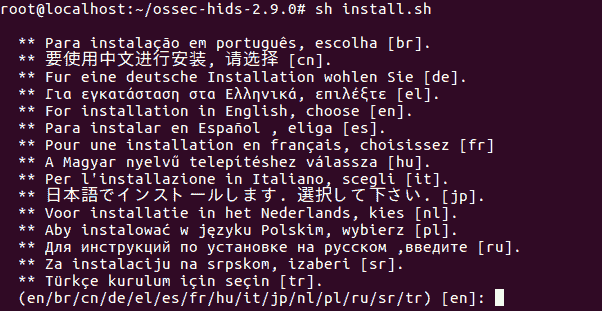

当提示时，我们将选择我们的语言。所以，如果我们的语言是英语，那么我们将输入`en`并按*进入*。

5.  一旦我们按下*进入*，就会看到如下输出:


6.  再次按*进入*继续。在下一个屏幕中，它将要求您选择我们想要的安装类型。键入`local`监控正在安装 OSSEC 的服务器，然后按*进入*:


7.  接下来，我们将为 OSSEC 选择安装位置。默认安装位置为`/var/ossec`。按回车键继续:


8.  我们可以配置 OSSEC，将电子邮件通知发送到我们的本地电子邮件地址。键入`y`并按回车键:

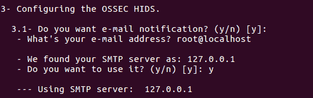

9.  在下一步中，我们将被询问是否要运行完整性检查守护程序和 rootkit 检测引擎。两者输入`Y`并按*进入*继续:

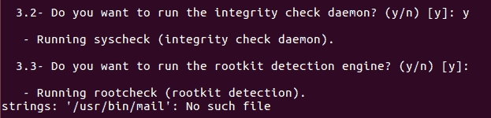

10.  接下来，我们将启用主动响应:

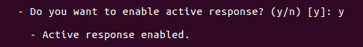

11.  进一步启用防火墙丢弃响应:

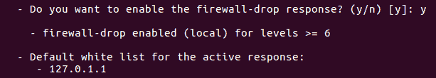

12.  如果我们愿意，我们可以将入侵防御系统添加到白名单中。否则，输入`n`并按*进入*继续:


13.  接下来，按*进入*启用远程系统日志。
14.  所有配置完成后，按*进入*开始安装。一旦安装开始，这里显示的输出将出现:

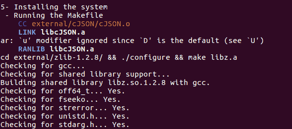

15.  安装完成后，将看到以下输出:


16.  安装完成后，我们可以使用以下命令检查 OSSEC 的状态:

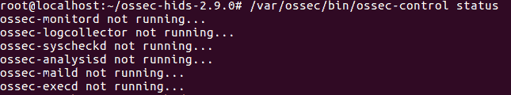

17.  要启动 OSSEC，请运行以下命令:


18.  一旦 OSSEC 启动，我们将收到一封电子邮件警报。键入`mail`查看邮件，如下图:


19.  我们下一步就是编辑 OSSEC 的主配置文件，也就是`/var/ossec/etc/ossec.conf`文件。使用像 nano 这样的编辑器打开`ossec.conf`配置文件。
20.  当我们打开文件时，它会显示我们在安装过程中指定的电子邮件配置。我们可以随时更改此设置:

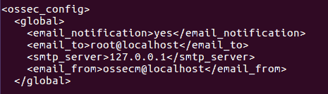

21.  根据默认配置，当新文件添加到服务器时，OSSEC 不会提醒我们。我们可以通过在该部分下添加新行来更改此设置，如下所示:


22.  如果我们想让 OSCEC 发送实时警报，我们必须对 OSCEC 应该检查的目录列表进行更改。为此，我们需要修改以下两行，以使 OSSEC 报告实时更改。进行如下所示的更改:


23.  接下来，修改位于`/var/ossec/rul` `es`目录中的`local_rules.xml`规则文件，以包含添加到系统中的新文件的规则:


24.  完成上述更改后，保存并关闭文件。然后，重启 OSSEC:


25.  现在，我们将检查 OSSEC 是否工作。让我们尝试在`/etc/network/interfaces`中做一些改变。如果 OSSEC 工作正常，我们应该会收到一封电子邮件提醒，提到系统中发生了一些变化。将会看到如下警报:


# 它是如何工作的...

我们首先在我们的 Ubuntu 服务器上安装 OSEC，在安装过程中，我们提供了我们希望在哪里接收 OSEC 生成的警报的详细信息。我们还在安装过程中启用了我们想要用于监控的守护程序。安装完成后，我们对配置文件进行更改，以便在每次向服务器添加新文件时收到警报。在相应的配置文件中还进行了其他必要的更改，以从 OSSEC 获得警报。

# 鼻息声

在当今的企业环境中，安全性是一个主要问题，有许多工具可用于保护网络基础设施和互联网通信的安全。Snort 就是这些工具之一，因为它是开源的，所以可以免费获得。它是一个轻量级的网络入侵检测和防御系统。Snort 以三种不同的模式工作:嗅探器模式、数据包记录模式和网络入侵检测系统模式。

# 准备好

在开始安装 Snort 之前，请确保我们的系统是最新的，并在其上安装所需的依赖项。要安装所需的依赖项，我们运行以下命令:


# 怎么做...

Snort 可以安装在 Ubuntu 上，可以从它的源代码安装，也可以通过 deb 包安装。在本节中，我们将使用 deb 包安装 Snort:

1.  首先，我们在我们的 Ubuntu 系统上安装，使用`apt-get`命令，如下所示:


2.  在安装过程中，我们将被要求选择 Snort 应该监听数据包的接口。选择的默认界面为`eth0`，如下图:


3.  根据我们的系统配置选择接口:


4.  现在，让我们开始 Snort 的嗅探器模式。在嗅探器模式下，Snort 读取网络流量并显示人类可读的翻译。要在嗅探器模式下测试 Snort，请键入以下命令:


5.  在此处显示的输出中，我们可以看到 Snort 在系统、路由器和互联网之间检测到的流量报头:


6.  以下输出显示了 Snort 分析的流量摘要:


7.  如果我们希望 Snort 也显示数据，我们可以运行以下命令:

```sh
-snort -vd
```


这将给出前面显示的输出。

8.  现在，让我们开始使用 Snort 的数据包记录器模式。如果我们希望 Snort 只显示流量头，并在磁盘上记录完整的流量细节，我们需要首先指定一个目录，Snort 可以在其中保存它的报告。为此，我们进入`/var/log/snort`并创建一个任意名称的目录，如下所示:


9.  现在，运行此处显示的命令，Snort 的日志将保存在`logs_snort`目录中:


10.  一旦我们记录了足够多的数据包，我们就停止命令。现在，我们可以检查我们的`logs_snort`目录，并看到已经创建了一个文件:


11.  如果我们想读取在上一步中创建的日志文件的内容，我们可以运行以下命令:


我们可以看到完整的输出，如前所示。

# 它是如何工作的...

Snort 以三种不同的模式工作:嗅探器模式、数据包记录模式和网络入侵检测系统模式。基于运行 Snort 时使用的参数，相应的模式被启动，我们可以相应地捕获和监控日志。

# Rsync 和 Grsync–备份工具

**远程同步** ( **Rsync** )是本地和远程文件同步工具。使用它的算法，它可以高效地复制和同步文件，这允许我们只传输两组文件之间的差异。Grsync 是 rsync 工具的图形用户界面前端。由于是跨平台的，它可以在 Linux、Windows 和 macOS 上运行。

# 准备好

由于 Rsync 在 Linux 和类似 Unix 的系统上很受欢迎，默认情况下，它会预装在大多数 Linux 发行版中。但是，如果没有安装，我们可以通过运行以下命令来安装它:


与 Rsync 不同，Grsync 在 Linux 发行版中没有预装。要在 Ubuntu 上安装 Grsync，请运行以下命令:


要使用 rsync 和 grsync 进行远程文件同步，必须在两个系统上启用 SSH 访问，并且 Rsync 和 Grsync 应该安装在两个系统上。

# 怎么做...

在本节中，我们将看到如何使用 rsync 和 grsync 在本地同步文件/目录，以及如何从一个系统远程同步到另一个系统。

1.  让我们从在一个系统上创建两个测试目录开始，并在其中一个目录中创建一些测试文件。为此，我们运行以下命令:


这里，我们已经创建了两个目录，`dir1`和`dir2`，`dir1`在其中创建了五个空文件。

2.  如果我们想在本地同步`dir1`和`dir2`的内容，我们可以使用以下命令:


`-r`选项指的是递归方法，`dir1`末尾的尾斜杠(`/`)指的是`dir1`的内容。

3.  如果我们想将`dir1`目录远程同步到另一个系统，我们可以使用以下命令来实现:


这里，我们提到了目的地系统用户名前面的目的地地址。当我们运行命令时，它会询问远程用户的密码。输入密码后，同步将会完成。

4.  一旦前一个命令完成工作，我们就可以在远程系统上检查并看到`dir1`目录已经在远程系统上同步，如下图所示:


5.  现在，让我们看看如何使用图形用户界面使用 Grsync 同步文件。我们可以通过应用程序菜单或命令行，使用`grsync`命令启动 Grsync。Grsync 的默认界面如下所示:


6.  要将目录(`/root/backup`)从本地系统备份到远程系统，请输入源和目标详细信息，如下所示:


7.  输入之前的详细信息后，转到“文件”菜单并单击“模拟”以验证是否收集了输入的详细信息:


单击模拟后，它会提示您输入远程用户的密码。

8.  如果输入的详细信息正确并且一切正常，将会出现一条“成功完成”消息，如下所示:


9.  现在，我们可以通过单击文件菜单中的执行选项来开始文件传输:


同样，它将提示输入远程用户密码。请提供密码以继续。

10.  根据目录的内容，该过程可能需要一些时间。一旦完成，将出现一条成功完成的消息，如下所示:


11.  我们可以通过检查远程系统上的备份文件来验证传输是否成功:


# 它是如何工作的...

Rsync 和 Grsync 是在本地和远程工作的同步工具。虽然 rsync 是一个命令行工具，但 Grsync 为 Rsync 提供了一个图形用户界面。使用这些工具中提供的不同选项，我们可以管理两个系统之间的备份同步。