# Linux 安全发行版

在本章中，我们将讨论:

*   Kali Linux
*   pfSense
*   **数字证据与取证工具包** ( **DEFT** )
*   网络安全工具包( **NST** )
*   安全洋葱
*   尾部操作系统
*   什么事

# Kali Linux

Kali 是一个基于 Debian 的 Linux 发行版，是为了安全测试而开发的。预装了数百个渗透测试工具，Kali 是一个现成的操作系统。我们可以通过实时光盘、u 盘或虚拟机来运行它。

Kali 的最新版本经历了一些重大变化，其中之一是，自 Kali 2.0 以来，整个系统已经转向滚动发布模式。现在我们只需在系统上安装 Kali 2.0 或更高版本，并通过正常更新获得其中工具的最新版本。这意味着我们不必移除现有的操作系统并安装最新版本的 Kali 2.2 来获取最新的东西。

要探索 Kali 2.2，请从其官方网站[https://www.kali.org/downloads/.](https://www.kali.org/downloads/)下载最新版本

我们可以下载国际标准化组织，然后将其刻录到光盘或创建一个可引导的通用串行总线设备。我们甚至可以从同一个链接下载 **Kali Linux VMWare** 、 **VirtualBox** 或者 **ARM** 的图片。

最新版本的 Kali 在更新的开发环境和工具方面包含了重大变化。我们将探索这些变化，以了解差异是什么。

要开始使用 Kali，我们可以安装它，也可以通过 live 选项使用它。

当我们启动 Kali 时，我们注意到 GRUB 屏幕发生了变化，使用变得简单，如图所示:

Kali 的桌面环境已经转移到 GNOME 3，有了新的重新设计的用户界面。我们可以在这里的登录屏幕上看到这些变化，该屏幕也经过了重新设计:

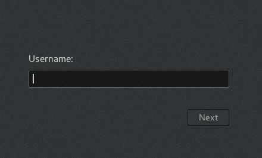

整个桌面以及面板和应用程序菜单都经过了重新设计/重构:

我们也可以通过点击工具条底部的菜单图标来访问这些工具，如图所示。这样我们可以同时看到所有的工具:

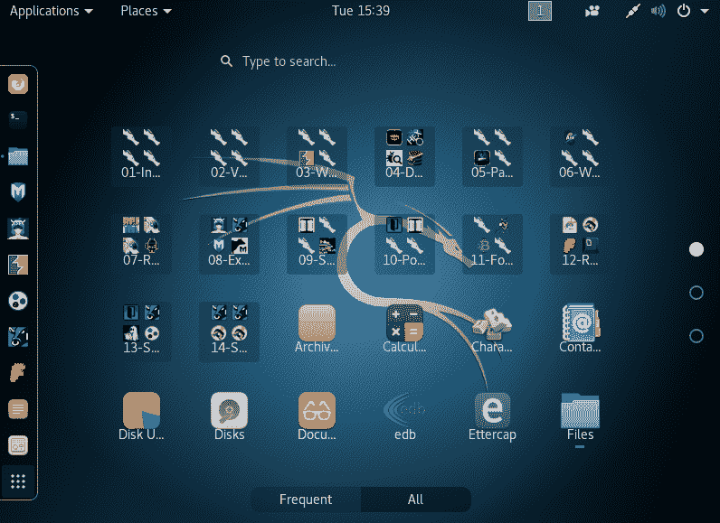

Kali 包括一个内置的屏幕播放选项，它实际上是 GNOME 3 的一部分。在顶部，右击录音机图标，我们可以选择开始录音。现在，只需点击一下，您就可以制作您在 Kali 上所做的任何事情的视频:

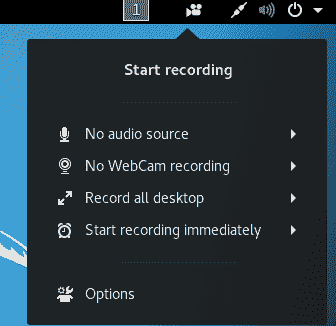

如果我们希望访问 Kali 的设置菜单，我们会看到它在应用程序菜单下丢失了。要访问设置，单击右上角的电源图标，弹出一个菜单。

在此菜单中，我们可以看到左下角的设置图标:

我们还可以在这个菜单中看到一个虚拟专用网选项。使用此选项，我们可以配置虚拟专用网设置。

当我们点击上一步中的设置图标时，我们得到如下所示的设置菜单。现在根据要求更改系统设置:

向下滚动并点击详细信息，查看关于 Kali Linux 的更多信息。

我们可以在此处显示的屏幕中看到系统的详细信息。这包括关于 GNOME 版本的信息:

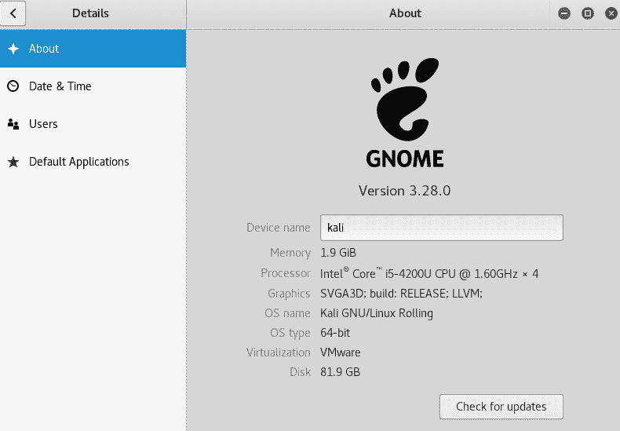

每当我们想要更新 Kali 时，只需点击“详细信息”窗口中的“检查更新”按钮。

如果您的系统已经是最新的，则会出现一条消息，如下所示，否则可以下载可用的更新:

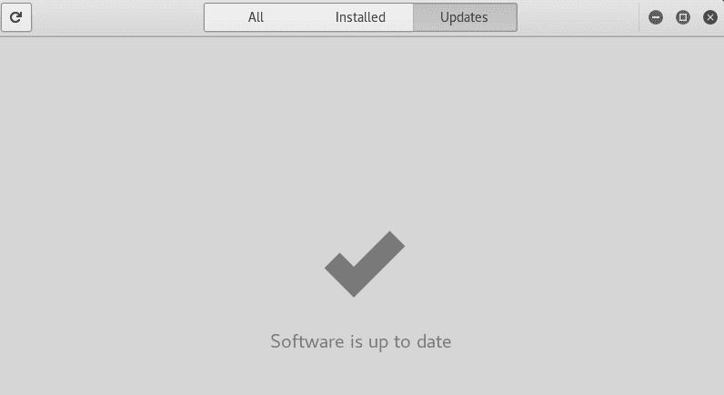

当我们引导 Kali 时，我们会看到桌面屏幕发生了变化。我们现在在屏幕左侧有一个侧边栏，帮助我们轻松访问应用程序。

左上角的应用程序菜单包含不同类别下的所有工具。也可以使用底部边栏上的菜单图标来访问应用程序。

接下来，我们看到 Kali 包括一个内置的屏幕录制工具，可以从右上角的菜单中访问。在同一个菜单中，我们现在可以选择进入系统设置菜单。

然后我们可以看到检查系统更新以保持 Kali 更新的选项。

Kali 包含了更新的工具，它的构建是为了从 Debian 获取更新，以确保系统始终是最新的，并确保安全更新定期实施。

# pfSense

作为网络管理员，安装防火墙和路由器至关重要。当我们谈论设置防火墙时，我们可以选择简单地安装来自任何供应商的预配置防火墙，或者设置我们自己的防火墙系统。

pfSense 是一个令人惊叹的软件发行版，如果你希望从头开始建立自己的防火墙。它是一个基于 FreeBSD 的开源发行版，专门设计用作防火墙，可以通过网络界面轻松管理。

# 准备好了

1.  从以下链接下载 pfSense:[https://www.pfsense.org/download/mirror.php?section =下载。](https://www.pfsense.org/download/mirror.php?section=downloads)
2.  根据您的需求选择正确的计算机架构和平台。
3.  下载 pfSense 后，将 ISO 文件刻录到 CD/DVD 介质上，或者您甚至可以创建一个实时可引导的 USB 介质。
4.  我们还需要一个带有两个网络接口卡的系统来安装和配置 pfSense。

This system will be dedicated to the firewall functionality and will not be usable for any other computing task such as web browsing or so. It is recommended you use an old computer such as a Pentium 4 machine, or even a virtual machine can be set up and used for this purpose.

# 怎么做...

按照以下步骤设置和配置 pfSense 防火墙:

1.  当我们使用 pfSense CD/DVD 或 USB 设备引导系统时，会出现如下所示的闪屏。按 *6* 配置启动选项:

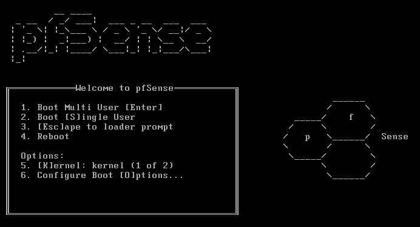

2.  在下一屏，再次按 *6* 打开详细，然后按 *1* 返回上一屏。

当回到第一屏时，按*进入*启动 pfSense。

3.  pfSense 将开始启动。在引导过程中，我们会看到如下所示的屏幕:

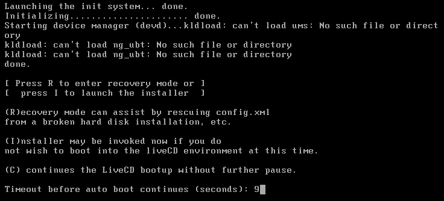

按 *I* 安装 pfSense。在 20 秒内快速选择选项。

4.  下一个屏幕要求您配置控制台。选择接受这些设置选项，然后按*进入*继续。
5.  在下一个屏幕中，选择快速/简易安装(如果 pfSense 不熟悉)，否则您可以在安装过程中选择自定义安装以获得更多高级选项。
6.  按“确定”继续安装。安装过程将立即开始。
7.  在安装过程中，系统会要求您选择要安装的内核配置。当我们在台式机或电脑上安装 pfSense 时，请选择标准内核。如果安装在嵌入式平台上，如路由器主板，我们可以选择选项，嵌入式内核。
8.  此后，安装将继续。完成后，选择重启并按*进入*完成安装。

9.  在重新启动过程中，pfSense 的默认用户名和密码将显示如下:

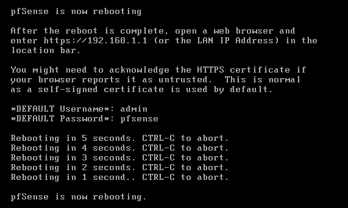

10.  重启后，我们现在必须根据网络配置来配置我们的接口卡。将显示两个界面的名称，如图所示。在您的情况下，这些名称可能不同:

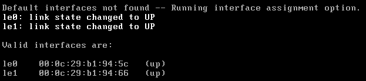

11.  现在会问你现在要设置虚拟局域网吗？此时输入`n`为否。
12.  现在我们需要输入用于广域网的接口名称。在我们的例子中是`le0`。根据您的配置输入名称。

13.  接下来输入用于局域网的接口名称。举个例子，就是`le1`:

然后按 *Y* 继续设置。

14.  一旦设置好界面，我们将获得如下所示的 pfSense 菜单:

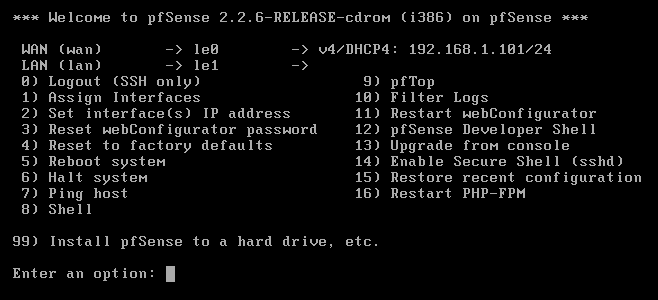

如果广域网和局域网接口的 IP 地址没有正确设置到这一步，我们可以通过从前面的菜单中选择选项 *2* 来手动设置 IP 地址。

15.  选择要配置的接口，然后为其提供 IP 地址:

16.  接下来，输入子网和默认网关:

17.  对局域网接口执行相同的步骤。完成后，屏幕上会显示一个链接，可用于访问`pfSensewebConfigurator`界面:

在我们的例子中是`http://192.168.1.115.`

18.  现在，从与 pfSense 系统位于同一本地网络的系统上的任何浏览器访问此链接。访问链接后，我们会看到如下所示的登录屏幕:

输入默认用户名`admin`和默认密码`pfsense`登录。这些详细信息可以在登录后更改。

成功登录后，我们会看到 pfSense 的主仪表盘:

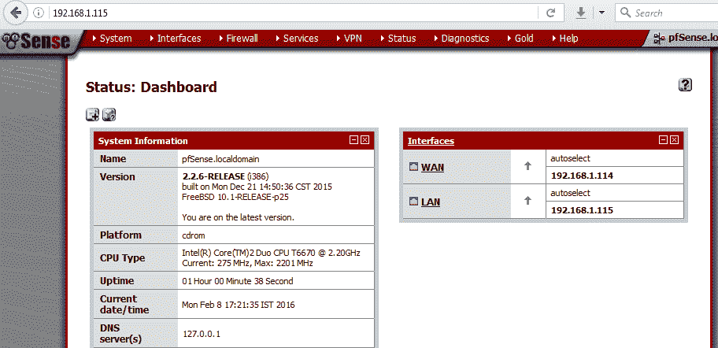

# 它是如何工作的...

我们从 pfSense 光盘启动，然后选择在系统上安装操作系统的选项。

要安装 pfSense，我们在引导过程中使用选项 I，然后使用快速/轻松安装。安装完成后，我们设置两个接口卡。第一张卡是根据外部网络配置的，使用菜单中的设置接口 IP 地址选项。然后我们配置 IP 地址、子网和网关地址。

接下来，我们对第二张卡重复同样的过程，这是我们根据本地网络配置的。

配置完成后，我们可以使用第二张卡的 IP 地址从同一网络系统上的任何浏览器访问 pfSense 的网络接口，并根据我们的要求定制我们的路由器/防火墙。

# 数字证据和法医工具包

在执行计算机取证时，重要的是所使用的软件能够确保文件结构的完整性。它还应该能够分析正在调查的系统，没有任何更改、删除或更改数据。

DEFT 是为取证而设计的，基于 Lubuntu，而 Lubuntu 本身也是基于 ubuntu 的。

DEFT 可以从这个链接下载:[http://www.deftlinux.net/download/.](http://www.deftlinux.net/download/)

下载后，我们可以将图像文件刻录在光盘介质上，或者创建一个实时可引导的 USB 介质。

要使用 DEFT，我们需要获得操作系统中包含的内容的概述，接下来我们将这样做。

一旦我们启动了 DEFT CD/DVD 或 USB 媒体，我们就会得到启动屏幕。首先，我们需要选择语言。一旦完成，我们可以选择实时运行 DEFT，或者在我们的系统上安装 DEFT。

在我们的例子中，我们选择了引导 DEFT 直播。引导过程完成后，我们应该会看到 DEFT 桌面。

现在让我们了解一下 DEFT 中有哪些不同的工具。

在开始菜单中，DEFT 下的第一个子菜单包含各种分析工具的列表:

下一个子菜单显示了所有的反恶意软件工具。然后我们有了数据恢复相关工具的子菜单。

下一个子菜单包含不同哈希工具的列表，可用于检查和比较任何文件的哈希。

在下一个子菜单中，我们获得用于成像的工具。这些可以在取证调查期间用于创建需要调查的系统磁盘映像。随着 DEFT 7 的发布，用于分析移动设备的工具也增加了。这些可以在“移动取证”子菜单下找到。

下一个子菜单包含网络取证工具。下一个菜单，OSINT，包含开源智能工具。

DEFT 还包含密码恢复工具，可以在下一个子菜单中找到。

除了这些工具类别之外，DEFT 还包含一些报告工具，这些工具在创建报告时非常有用。DEFT 使用 **WINE** 在 Linux 下执行 Windows 工具，WINE 的选项可以在主菜单下找到。

我们要么安装 DEFT，要么使用实时光盘选项在系统上启动它。一旦启动，我们进入开始菜单，然后我们进入 DEFT 菜单。在这里我们可以找到不同类别下的各种工具。我们可以使用工具进行分析、数据恢复、移动取证、网络取证等等。

WINE 在 DEFT 中用于执行 Windows 应用程序。

# 网络安全工具包

Linux 有许多发行版主要是为了渗透测试而开发的。其中一个是**网络安全工具包** ( **NST** )，它的开发是为了在一个地方提供对开源网络安全应用程序的轻松访问。

NST 基于 Fedora Linux，包含面向专业人员和网络管理员的工具。

# 准备好

NST 可从其网页下载或直接从以下链接下载:[http://sourceforge.net/projects/nst/files/.](http://sourceforge.net/projects/nst/files/)

下载后，我们可以将国际标准化组织刻录在光盘上，或者创建一个实时可引导的通用串行总线媒体。

# 怎么做...

当我们知道如何使用操作系统以及操作系统中包含哪些工具时，使用 NST 进行渗透测试变得很容易。

1.  要使用 NST，第一步是用 NST 引导系统。我们可以选择使用实时选项引导，或者直接在系统上安装 NST。在我们的示例中，我们选择了实时引导选项。你可以根据自己的要求选择任何一个选项。

2.  引导完成后，我们将获得 NST 的默认桌面，如下所示:

3.  NST 自带一个 web 用户界面，这是一种可以用 NST 做任何事情的控制面板。但是，只有在现有用户帐户设置了密码的情况下，才能进行访问。要设置密码，我们单击桌面上的“设置 NST 系统密码”图标。这将打开一个终端窗口，并提供创建新密码的选项:

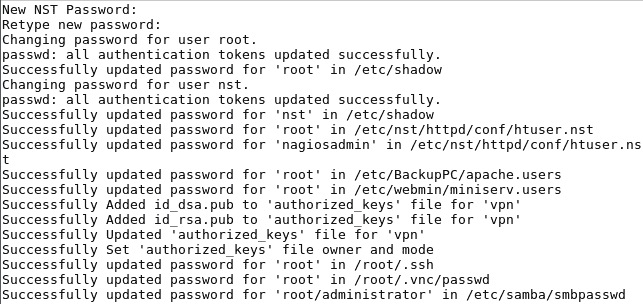

4.  一旦设置了密码，我们就可以从我们选择的任何浏览器访问 NST 网络用户界面。要在本地系统上访问它，我们可以使用这个地址:`http://127.0.0.1:9980/nstwui.`

如果从本地网络上的任何其他系统访问，则使用运行 NST 的系统的 IP 地址:

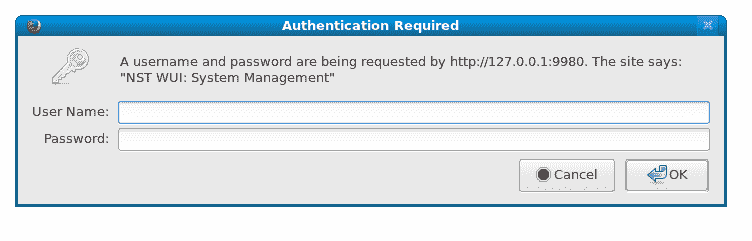

打开链接后，系统会提示我们输入用户名和密码。输入详细信息，然后单击确定。

5.  现在我们看到 **NSTWUI** 的登陆页面。在左上角，我们可以看到运行 NST 的系统的详细信息。下面是 NST 菜单:

我们还可以在右上角看到有关系统运行时间的信息:

6.  NST 配有各种工具，其中之一是**带宽**。此工具显示网络使用概述，我们可以通过转到网络|监视器|带宽用户界面菜单来启用它:

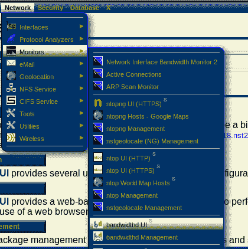

7.  一旦我们点击开始带宽，工具将开始运行。
8.  另一个可用的重要特性是能够使用网络接口通过 SSH 进行远程活动。转到系统|控制管理|运行命令菜单。

将会打开一个窗口，如截图所示。我们可以在这里运行任何命令:

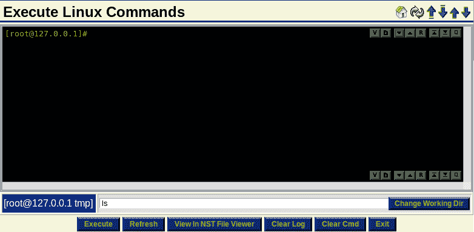

9.  NSTWUI 还允许管理员从 web 界面远程重启或关闭服务器。为此，请转到系统|控制管理|重新启动菜单。
10.  单击继续重新启动该 NST 系统进行确认。否则，单击“退出”取消。
11.  在下一个屏幕中，输入如图所示的文本，然后按确定:

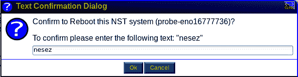

# 它是如何工作的...

安装或引导 NST 后，第一步是为现有用户帐户设置密码。这是通过使用选项设置 NST 系统密码来完成的。

设置密码后，我们通过任何浏览器访问系统的 IP 地址，通过 web 用户界面访问 NST。

登录 NSTWUI 后，我们会得到一个与网络安全相关的各种工具的列表。

我们可以探索一些工具，如 bandwidthd 和 SSH。

# 安全洋葱

**安全洋葱**是 Linux 的免费开源发行版。它对于入侵检测、企业级安全监控和日志管理非常有用。Security Onion 预装了一套工具，如 Snort、Suricata、Kibana、OSSEC 等。

# 准备好了

安全洋葱可以使用安全洋葱的国际标准化组织图像安装，其链接可在其官方网站上获得。安装安全洋葱的另一种方法是首先安装一个标准的 Ubuntu 16.04 ISO 映像，然后添加安全洋葱的 PPA 和软件包。

要下载安全洋葱的国际标准化组织图像，请访问以下链接:

[https://github . com/Security-Onion-Solutions/Security-Onion/blob/master/Verify _ iso . MD .](https://github.com/Security-Onion-Solutions/security-onion/blob/master/Verify_ISO.md)

# 怎么做...

在本节中，我们将看到如何使用 ISO 映像安装 Security Onion。安装完成后，我们将对其进行配置，以便进一步使用:

1.  为了开始安装，我们使用 ISO 映像引导我们的系统。我们将看到下面的屏幕，在这里我们选择启动安全洋葱的第一个选项:

2.  引导完成后，桌面出现。在桌面上，我们可以看到安装安全洋葱 16.04 的图标:

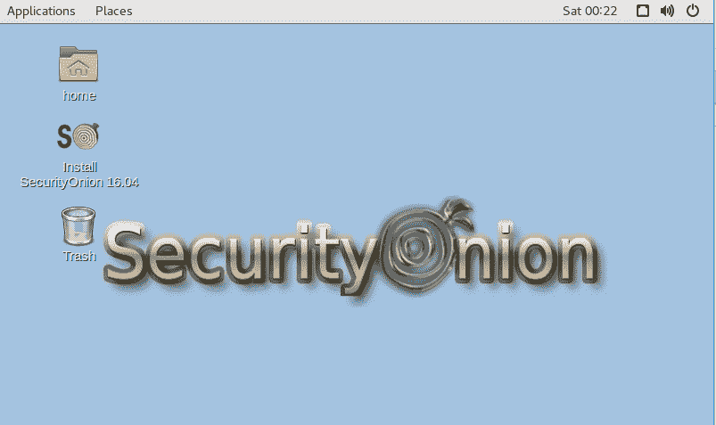

3.  我们点击图标，安装开始。第一个屏幕将要求我们选择安装类型。根据要求选择任何选项，否则继续默认选择:

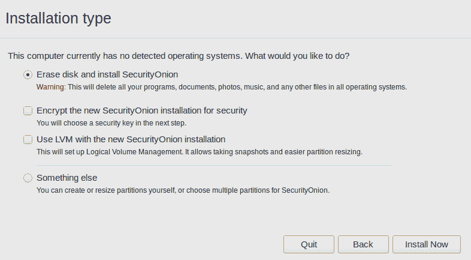

8.  一旦我们单击立即安装，安装过程就开始了。这需要一些时间来完成。
9.  一旦初始安装完成，它将提示我们重新启动系统。选择“立即重新启动”以完成安装。
10.  当系统重新启动时，我们会看到启动菜单。选择默认选项，按*进入*启动安全洋葱。
11.  重启后，我们会看到登录屏幕。输入安装过程中配置的用户名和密码。
12.  登录后，我们可以在屏幕上看到一个设置图标。我们将使用它来完成安全洋葱中提供的安全工具的设置:

13.  系统将提示我们输入管理帐户的密码。
14.  输入密码后，在下一个屏幕中，我们将看到将要配置的服务列表。按是，继续！要继续:

15.  安装程序将询问我们是否希望现在或以后配置接口。按“是”立即配置接口:

16.  安装程序将检测系统中存在的接口并对其进行配置。如果有多个接口，我们可以选择要配置的接口:

17.  根据要求选择静态或 DHCP 选项:

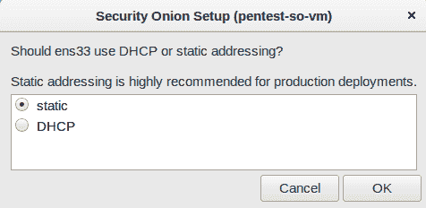

18.  完成后，单击是，进行更改以继续。

19.  安装程序将要求我们重新启动系统。重新启动以继续安装。
20.  系统重新启动后，再次单击安装图标继续安装。我们将被询问是否要重新配置接口或跳过。单击是，跳过网络配置继续:

21.  在下一步中，安装程序将询问我们是为评估模式还是生产模式设置系统。目前我们将选择评估模式并点击确定:

22.  现在，我们将创建一个用户帐户，供安装程序将要配置的服务使用。在此处显示的窗口中输入用户名:

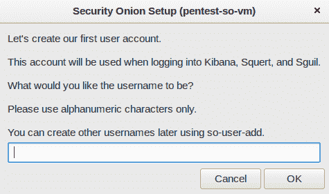

23.  接下来，为创建的新用户配置密码:

24.  在下一个屏幕中，单击是继续进行更改。

25.  安装完成后，我们会看到以下窗口:

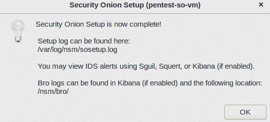

26.  设置还会显示信息，如下所示，以供进一步使用服务:

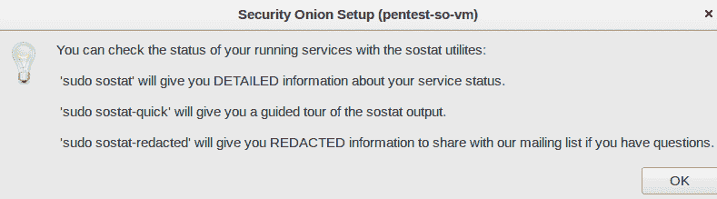

27.  安装程序还显示服务正在使用的规则的位置信息:

28.  要在设置过程中开始使用 Security Onion 配置的服务，请打开浏览器并访问 [https://localhost](https://localhost) 。接受关于 SSL 证书的安全警告并继续。我们会看到一个网页，如下所示:

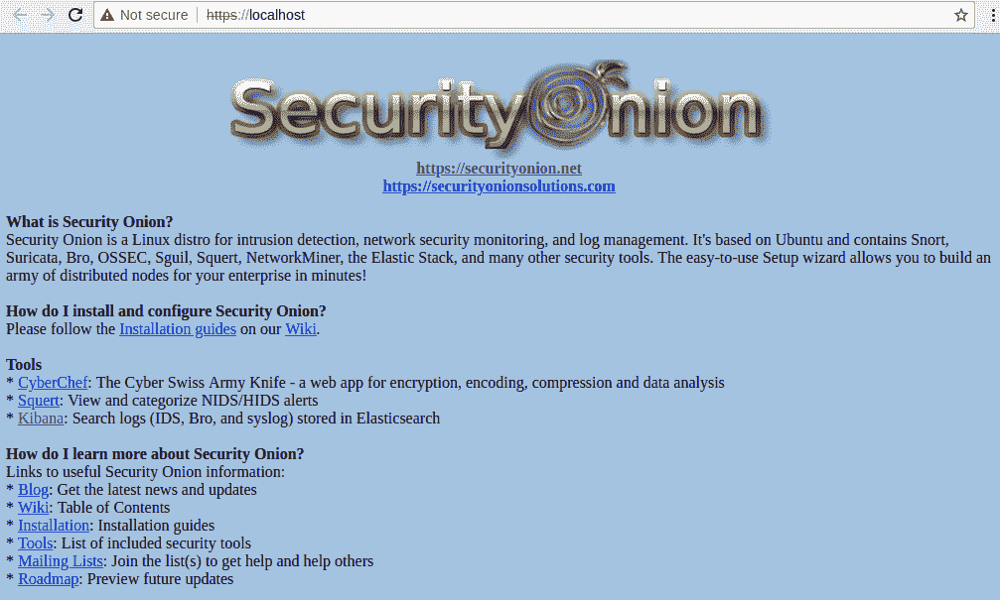

使用此页面，我们可以开始访问安全洋葱工具套件中包含的服务。

# 它是如何工作的...

安全洋葱自带一套安全工具。我们在系统上安装安全洋葱，然后设置套件中的所有工具。一旦安装完成，我们就可以开始使用在安装过程中配置了用户帐户的工具。

# 尾部操作系统

**Tails** 是一个 Linux 发行版，作为一个实时操作系统运行，可以从 u 盘或 DVD 在任何系统上运行。

它旨在通过帮助用户匿名使用互联网来保护用户的隐私和匿名性，并避免用户几乎走到哪里都受到限制。Tails 还帮助用户执行活动而不留下任何痕迹，除非他们明确要求这样做。

# 准备好了

Tails 是一个建立在 Debian 上的自由软件，ISO 镜像可以从其网站上下载:[https://tails.boum.org/index.en.html](https://tails.boum.org/index.en.html):

使用右边的按钮下载尾部的 ISO。

# 怎么做...

Tails 是一个完整的操作系统，可以用作 u 盘或 DVD 上的实时操作系统。

要使用 Tails，我们使用 Tails 的实时 DVD 或 USB 引导系统，当我们使用 Tails 引导系统时，我们会看到以下屏幕:

单击开始尾部开始使用尾部操作系统。引导完成后，我们将看到桌面。单击应用程序菜单，我们可以看到不同类别的工具，就像任何其他基于 Debian 的操作系统一样。但是，菜单中有一类尾巴:

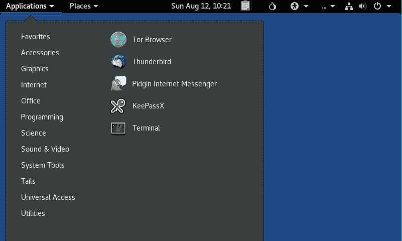

Tails 子菜单包含有助于维护隐私和匿名性的工具。Tails 包含 **Tor** 浏览器，有助于维护在线隐私。当我们点击 Tor 浏览器时，它开始在后台运行。一旦 Tor 准备好，我们会收到通知:

当我们在任何系统上使用 Tails 时，它不会改变或依赖于系统上当前运行的操作系统。Tails 已被配置为不使用运行它的系统的硬盘，除非用户明确想要在硬盘上保存任何数据。Tails 还附带了一套使用强加密保护数据的工具。这包括用于加密 u 盘或外置硬盘的 LUKS。Tails 使用 HTTPS Everywhere，自动加密与任何主要网站的所有通信。

我们可以使用应用程序菜单中的尾部安装程序，在 u 盘上安装尾部:

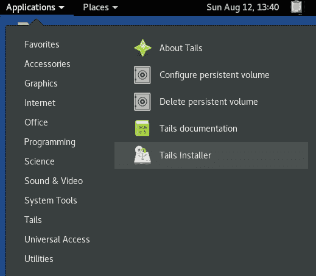

Tails 可以用作实时操作系统，它附带了预先安装的应用程序，这些应用程序在配置时考虑到了安全性。一旦用户使用 Tails 引导他们的计算机，他们就可以使用这些工具中的任何一个来维护隐私和匿名。

# 什么事

目前有许多 Linux 发行版可用，这包括几个利基发行版。 **Qubes** 就是这样一个注重安全性的 Linux 发行版。正如其口号所说，这是一个“*相当安全的操作系统*”

当用户使用任何其他操作系统时，如果他们在不知情的情况下运行恶意软件(可能是通过电子邮件附件)，根据恶意软件的严重程度，它会影响系统上的一切。

然而，量子位是用一种不同的方法构建的，这种方法被称为通过划分的*安全性。*它使用 Qubes(虚拟实例)来隔离用户运行的程序。

# 准备好

要使用 Qubes，我们可以从其官方网站下载其 ISO 映像:

[https://www.qubes-os.org/downloads/.](https://www.qubes-os.org/downloads/)

要在计算机上安装 Qubes，建议您使用这里提到的最低配置:

*   64 位英特尔或 AMD 处理器(x86_64 也称为 x64 又名 AMD64)
*   4 GB RAM
*   32 GB 磁盘空间

量子位也可以安装在不符合这些推荐配置的系统上，但是性能可能会很慢。

# 怎么做...

下载完量子位的 ISO 映像后，我们可以开始在符合推荐配置的系统上安装。

1.  为了安装 Qubes，我们使用之前下载的 ISO 映像引导我们的系统。
2.  一旦 ISO 启动，它将呈现一个菜单。选择测试该介质并安装量子位，然后按*进入*开始安装。
3.  下一个屏幕将要求我们选择语言。我们将选择英语并点击继续:

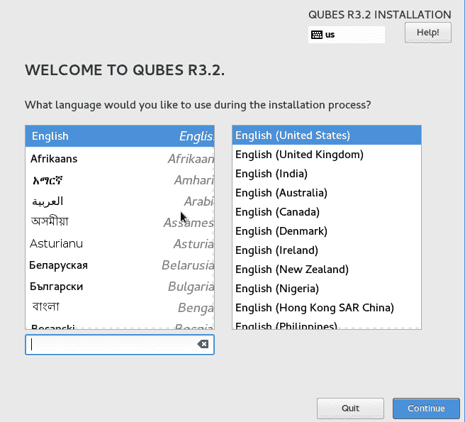

4.  在下一个窗口中，单击安装目标:

5.  这将打开另一个窗口。向下滚动并取消选中加密我的数据选项，然后单击左上角的完成:

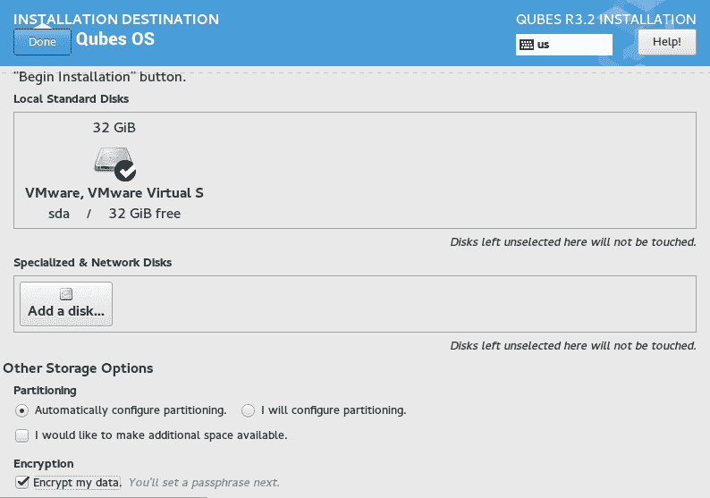

6.  现在，我们回到前面的窗口。单击开始安装继续:

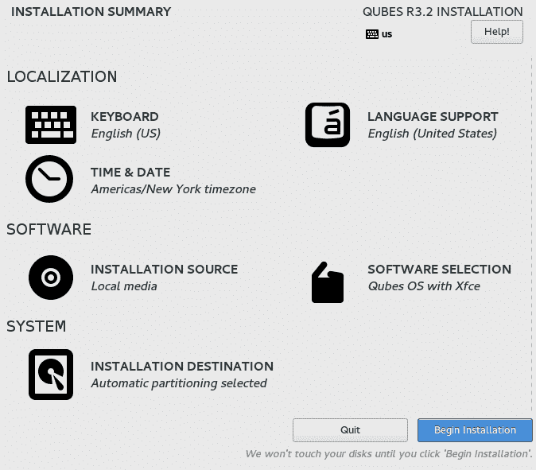

7.  随着安装的继续，我们获得了用户设置选项。在这里，我们可以设置根帐户的密码，还可以通过单击用户创建来创建使用量子位的新用户:

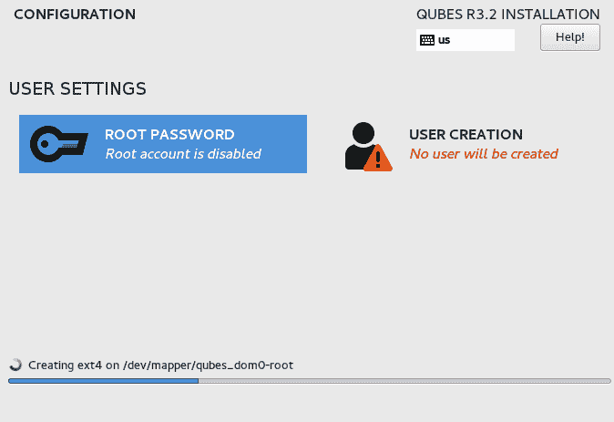

8.  当我们点击用户创建时，我们会看到一个新窗口，为新用户设置用户名和密码。完成后，安装将继续:

9.  一旦安装完成，我们需要重新启动系统来开始使用 Qubes。点击重启，如这里所示，使用量子位:

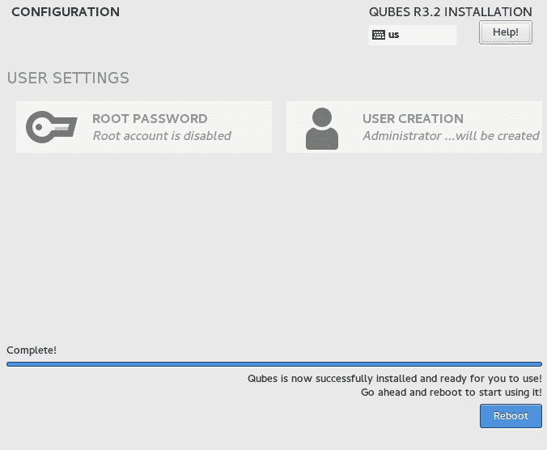

10.  当系统重新启动时，我们会看到以下屏幕，其中显示了 QUBES 操作系统上的一个图标。点击 QUBES 操作系统进行设置以供使用:

11.  在下一个窗口中，根据您的要求选择选项，然后单击完成:

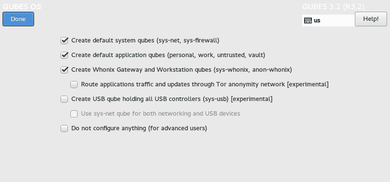

12.  单击“完成”后，Qubes 安装程序将开始使用默认模板配置系统，如下所示:

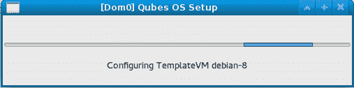

13.  模板配置完成后，我们会看到下面的屏幕。单击“完成配置”继续:

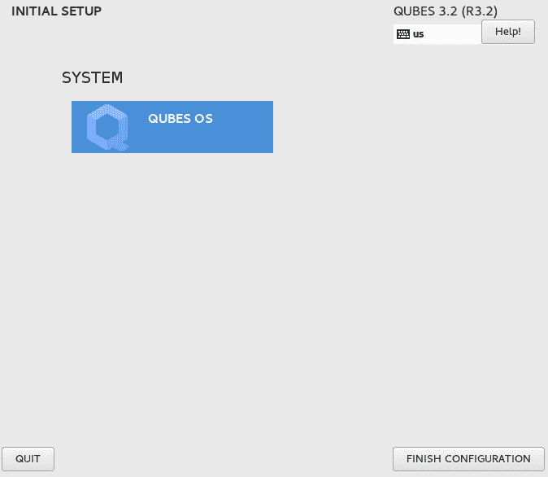

14.  现在，我们可以使用安装过程中创建的用户帐户登录 Qubes:

15.  登录后，我们会看到量子位虚拟机管理器窗口，其中显示了已配置量子位的列表。我们可以从列表中启动任何现有的量子位，或者使用虚拟机管理器根据我们的要求创建一个新的量子位:

16.  一旦我们创建了不同的虚拟机(也称为**量子位**)，我们就可以开始使用它们了。在一个量子位内部访问的任何应用程序都与另一个量子位分开运行，从而提供隔离。

# 它是如何工作的...

Qubes OS 使用 **Xen 虚拟机管理程序**来创建和隔离虚拟机。我们可以在这些虚拟机上单独访问同一个应用程序。

我们可以并排使用同一个浏览器的两个不同实例，它们可能运行在不同的安全域上。如果我们使用两种浏览器访问一个网站，并在其中一个浏览器上登录到该网站，则另一个浏览器窗口将不会使用该登录会话，因为它运行在完全不同的虚拟机上。