# 九、Bash 漏洞修补

本章将介绍以下配方:

*   了解 Bash 漏洞–Shell冲击
*   安全问题–Shellshock
*   补丁管理系统
*   在 Linux 网络上集成补丁
*   其他众所周知的 Linux 漏洞

# 了解 Bash 漏洞–Shell冲击

**Shellshock** 或 **Bashdoor** 是 Linux 和 Unix 操作系统的大多数版本中都存在的漏洞。它于 2014 年 9 月 12 日被发现，影响了所有使用 Bash shell 的 Linux 发行版。Shellshock 漏洞使得使用环境变量远程执行命令成为可能。

# 准备好

为了理解 Shellshock，我们将需要一个使用 4.3 之前版本的 Bash 的 Linux 系统，它容易受到这个错误的攻击。

# 怎么做...

在本节中，我们将了解如何设置我们的系统来了解 Shellshock 漏洞的内部细节:

1.  要执行的第一步是检查 Linux 系统上的 Bash 版本，这样我们就可以发现我们的系统是否容易受到 **Shellshock** 的攻击。要检查我们的 Bash 版本，请运行以下命令:

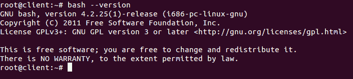

据报道，Bash 版本到 4.3 容易受到 Shellshock 的攻击。例如，我们使用的是 Ubuntu 12.04 LTS 桌面版。从前面截图中的输出，我们可以理解这个系统是易受攻击的。

2.  现在，让我们检查漏洞是否真的存在。为此，我们运行以下代码:

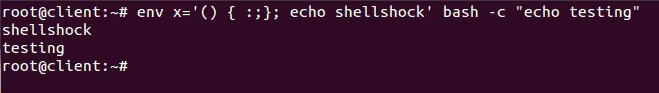

一旦我们运行了前面的命令，如果输出已经打印了`shellshock`，它就确认了漏洞。

3.  现在，让我们了解漏洞的见解。为此，首先，我们需要了解 Bash shell 变量的基础知识。

4.  如果我们想在 bash 中创建一个名为`testvar`的变量，并在其中存储一个值`'shellshock'`，我们必须运行以下命令:

```sh
 testvar="shellshock'
```

现在，如果我们希望打印这个变量的值，我们可以使用`echo`命令，如下所示:

```sh
          echo $testvar
```

5.  现在，我们将通过运行`bash`命令来打开 bash 的一个子进程。然后，再一次，我们来尝试在子进程中打印变量`testvar`的值:

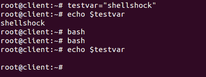

我们可以看到，当我们试图在子进程中打印值时，我们无法获得任何输出。

6.  现在，我们将通过使用 bash 的环境变量来尝试做同样的事情。当我们启动 bash 的新 shell 会话时，有几个变量可供使用，这些变量被称为**环境变量**。
7.  为了使我们的`testvar`变量成为环境变量，我们将导出它。导出后，我们也可以在子Shell中使用它，如下所示:


8.  因为我们已经定义了变量，然后导出了它们，以同样的方式，我们可以定义一个函数并导出它，以便在子 shell 中可用。以下步骤显示了如何定义函数并将其导出:

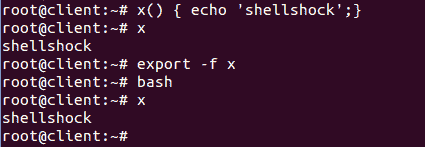

在前面的例子中，我们可以看到函数`x`已经被定义，并且已经使用`-f`标志导出。

9.  现在，让我们定义一个新变量，将其命名为`testfunc`，并赋值，如下所示:

```sh
    testfunc='() { echo 'shellshock';}'
```

以前定义的变量可以像常规变量一样访问:

```sh
    echo $testfunc
```

10.  接下来，我们将导出这个变量，使之成为一个环境变量，然后尝试从子 shell 访问它，如下图所示:


我们可以在前面的结果中看到一些意想不到的东西。在父 shell 中，变量作为普通变量访问。但是，在子 shell 中，它被解释为一个函数，并执行该函数的主体。

11.  接下来，我们将终止函数的定义，然后传递任意命令，如下所示:

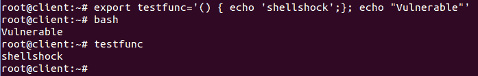

在前面的例子中，我们可以看到，只要我们启动一个新的`bash` shell，在函数外部定义的代码就会在`bash`启动期间执行。

这就是`bash`Shell中的漏洞。

# 它是如何工作的...

我们首先检查系统上运行的 bash 版本。然后，我们运行众所周知的代码来确认 shellshock 漏洞是否存在。

为了理解 shellshock 漏洞是如何工作的，我们在 bash 中创建一个变量，然后尝试将其导出到子 shell 并在那里执行。接下来，我们尝试创建另一个变量，并将其值赋值为`'() { echo 'shellshock';}'`。这样做之后，当我们将这个变量导出到一个子 shell 并在那里执行它时，我们可以看到它被解释为一个函数并执行该函数的主体。

这就是 bash 容易受到 shellshock 攻击的原因，在 shell shock 中，当 bash 启动时，可以使用特制的变量来运行其中的任何命令。

# 安全问题–Shellshock

在这个几乎一切都在线的时代，在线安全是一个主要问题。如今，许多网络服务器、网络连接设备和服务都使用 Linux 作为平台。大多数版本的 Linux 都使用 Unix bash shell，因此 Shellshock 漏洞可能会影响很大一部分网站和网络服务器。

在前面的配方中，我们了解了 Shellshock 漏洞的详细信息。现在，我们将了解如何通过 SSH 利用这个 bug。

# 准备好

要利用 Shellshock 漏洞，我们需要两个系统。第一个系统将被用作受害者的系统，应该容易受到 Shellshock 的攻击。在我们的例子中，我们使用 Ubuntu 系统作为易受攻击的系统。第二个系统将被用作攻击者，并且可以在其上运行任何 Linux 版本。对于我们的案例，我们在第二个系统上运行 Kali。

受害者系统将运行`openssh-server`包。可以使用以下命令安装它:

```sh
    apt-get install openssh-server
```

然后，我们将把这个系统配置为一个易受攻击的 SSH 服务器，以展示如何使用 Shellshock bug 来利用它。

# 怎么做...

要了解 Shellshock 错误如何被用来利用 SSH 服务器，我们需要首先将我们的 SSH 服务器配置为易受攻击的系统。为此，我们将遵循以下步骤:

1.  第一步是在 SSH 服务器系统上添加一个名为`user1`的新用户账号。我们还必须添加`/home/user1`作为其主目录，`/bin/bash`作为其Shell:

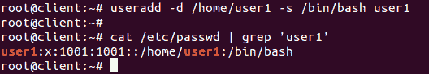

账户添加后，我们通过查看`/etc/passwd`文件进行交叉核对。

2.  接下来，我们在`/home`中为`user1`创建一个目录，并将该目录的所有权授予`user1`帐户:


3.  现在，我们需要对攻击者进行认证，以使用授权密钥登录 SSH 服务器。为此，我们将首先使用以下命令在攻击者的系统上生成授权密钥:


我们可以看到公钥/私钥已经生成。

4.  生成授权密钥后，我们将通过 SFTP 向远程 SSH 服务器发送公钥。首先，我们已经将公钥文件`id_rsa.pub`复制到桌面，然后我们运行以下命令，使用 SFTP 连接到 SSH 服务器:


连接后，我们使用`put`命令传输文件。

5.  现在，在受害者 SSH 服务器系统上，我们在`/home/user1/`内创建一个名为`.ssh`的目录，然后我们将`id_rsa.pub`文件的内容写入`/home/user1/.ssh/`目录内的`authorized_keys`:


6.  之后，我们编辑 SSH 的配置文件，`etc/ssh/sshd_config`，并启用`PublicKeyAuthentication`变量。我们还检查了`AuthorizedKeysFile`是否被正确指定:


7.  成功完成上述步骤后，我们可以尝试从攻击者系统登录 SSH 服务器，看看是否会提示我们输入密码:


8.  现在，我们将创建一个基本脚本，如果用户试图传递`date`命令作为参数，它将显示消息`restricted`。然而，如果除了`date`之外的任何东西被通过，它将被执行。我们将这个脚本命名为`sample.sh`:

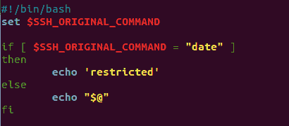

9.  创建脚本后，我们可以运行给定的命令来授予它可执行的权限:

```sh
    chmod +x sample.sh
```

10.  之后，我们使用`authorized_keys`文件中的`command`选项，通过添加脚本的路径来运行我们的`sample.sh`脚本:


在`authorized_keys`文件中标记先前的更改，以限制用户执行一组预定义的命令，这将使公钥认证易受攻击。

11.  现在，从攻击者的系统，尝试通过 SSH 连接到受害者的系统，同时传递`date`作为参数:


我们可以看到由于我们添加到`authorized_keys`文件的脚本而显示的消息`restricted`。

11.  接下来，我们尝试将 Shellshock 漏洞作为一个参数传递，如下所示:

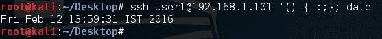

我们可以看到，即使我们在这个脚本中限制了`date`命令，但这次它被执行了，我们得到了`date`命令的输出。

12.  现在，让我们看看如何使用 Shellshock 漏洞来危害正在运行任何脚本的 Apache 服务器，这些脚本可以用环境变量触发 bash shell。

13.  如果受害者的系统上尚未安装 Apache，我们必须通过运行以下命令来安装它:

```sh
       apt-get install apache2
```

安装后，我们使用以下命令启动 Apache 服务器:

```sh
        service apache2 start
```

14.  接下来，我们移动到`/usr/lib/cgi-bin/`路径，创建一个名为`example.sh`的脚本，其中包含以下代码，以显示一些 HTML 输出:

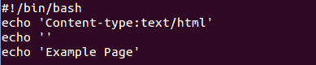

然后，我们通过运行以下命令使其可执行:

```sh
          chmod +x example.sh
```

现在从攻击者的系统中，我们尝试使用名为`curl -`的命令行工具远程访问`example.sh`文件。

我们得到了预期的脚本输出:`Example Page`。

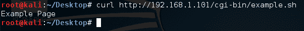

15.  现在，让我们向服务器发送一个恶意请求，使用 curl 打印受害者系统的`/etc/passwd`文件的内容:

```sh
    curl -A '() { :;}; echo "Content-type: text/plain"; echo; /bin/cat /etc/passwd' http://192.168.1.104/cgi-bin/example.sh
```


以下是输出，但被截断:


我们可以看到攻击者系统上的输出，向我们展示了如何使用 Shellshock 漏洞远程访问受害者的系统。在前面的命令中，`() { :;} ;`表示看起来像函数的变量。在这段代码中，函数是一个单一的`:`，定义为什么都不做，只是一个简单的命令。

16.  我们将尝试另一个命令来查看受害者系统当前目录的内容，如下所示:


我们可以在前面的输出中看到受害者系统的`root`目录的内容。

# 它是如何工作的...

在我们的 SSH 服务器系统上，我们创建一个新的用户帐户，并为其分配一个 bash shell 作为默认 shell。我们还在`/home`中为这个新用户账户创建一个目录，并将其所有权分配给这个账户。

接下来，我们配置 SSH 服务器系统，使用授权密钥对连接到它的另一个系统进行认证。

然后，我们创建一个 bash 脚本来限制特定的命令，例如`date`，并使用命令选项将该脚本路径添加到`authorized_keys`。

在这之后，当我们试图从另一个系统连接到 SSH 服务器时，该系统的授权密钥已经在前面配置好了，如果我们在连接时将`date`命令作为参数传递，我们可以看到该命令受到了限制。

然而，当同一个`date`命令与 Shellshock 漏洞利用一起传递时，我们可以看到它的输出，从而向我们展示了 Shellshock 如何被用来利用 SSH 服务器。

同样，我们通过创建一个示例脚本并将其放入 Apache 系统的`/usr/lib/cgi-bin`目录来利用 Apache 服务器。

然后，我们尝试使用 curl 工具从另一个系统访问这个脚本。

我们可以看到，如果我们在通过 curl 访问脚本时通过`shellshock exploit`，我们就能够在 Apache 服务器上远程运行我们的命令。

# Linux 补丁管理系统

在当前的计算场景中，漏洞和补丁管理是一个永无止境的循环。当由于已知漏洞被利用而在计算机上发生攻击时，我们可以看到针对此类漏洞的补丁已经存在，但尚未在系统上正确实施，这导致了攻击的发生。

作为系统管理员，我们必须知道需要安装哪个补丁，应该忽略哪个补丁。

# 准备好

因为补丁管理可以使用 Linux 的内置工具来完成，所以在执行这些步骤之前不需要配置特定的设置。

# 怎么做...

保持系统更新最简单有效的方法是使用更新管理器，它内置于 Linux 系统中。在本食谱中，我们将探索更新管理器如何在 Ubuntu 系统上工作:

1.  要在 Ubuntu 中打开图形版本的更新管理器，点击左侧工具栏顶部的**超级键**，然后输入`update`。在下面的截图中，我们可以看到更新管理器:


2.  当我们打开更新管理器时，我们将看到以下弹出框，显示可供安装的不同安全更新:

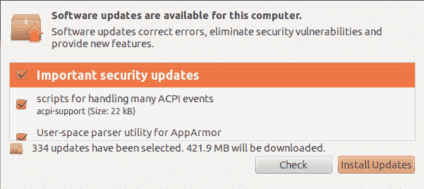

选择要安装的更新，然后单击安装更新继续。

3.  在同一个窗口中，我们在左下角有设置按钮。当我们单击该按钮时，我们会看到一个名为“软件源”的新窗口，其中有更多配置更新管理器的选项。
4.  第一个标签是 Ubuntu 软件，它显示了下载更新的存储库列表。我们根据要求从列表中选择选项:

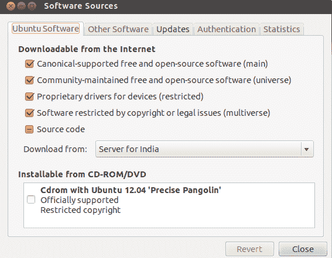

5.  如果我们单击“下载自”选项，我们可以选择更改用于下载的存储库服务器。如果我们在连接到当前选定的服务器时遇到任何问题，或者服务器速度很慢，此选项非常有用:


6.  从下拉列表中，当我们选择“其他”选项时，我们会得到一个选择服务器的列表，如下所示:


7.  下一个选项卡“其他软件”用于添加 Canonical 的合作伙伴存储库:

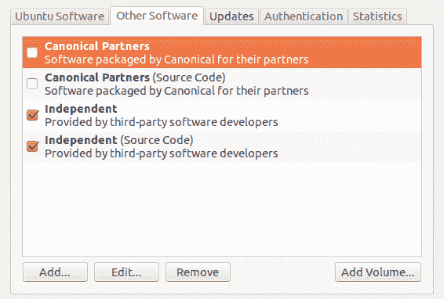

8.  我们可以从上一张截图中显示的列表中选择任何选项，然后单击编辑对存储库详细信息进行更改:

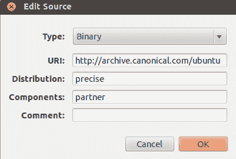

9.  “更新”选项卡用于定义 Ubuntu 系统接收更新的方式和时间:


10.  下一个选项卡“认证”包含有关软件提供商的认证密钥的详细信息，这些信息是从软件存储库的维护者那里获得的:

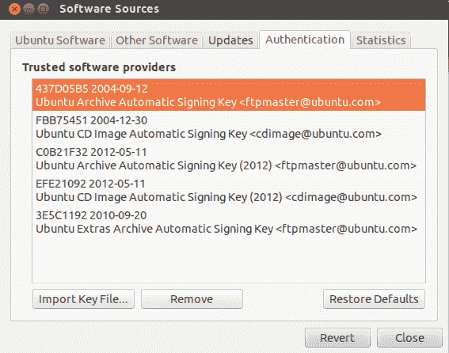

11.  最后一个标签名为 Statistics，对于那些希望匿名向 Ubuntu 开发人员项目提供数据的用户来说是可用的。这些信息有助于开发人员提高软件的性能和体验:


12.  在任何选项卡下进行任何更改后，当我们单击关闭时，它会提示我们确认新的更新是否应该显示在列表中。单击重新加载或关闭:

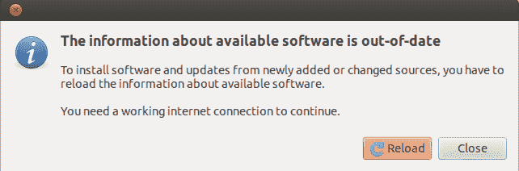

13.  如果我们想检查更新管理器检索所有包的位置列表，我们可以检查`/etc/apt/sources.list`文件的内容。我们得到以下结果:

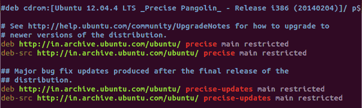

# 它是如何工作的...

为了更新我们的 Linux 系统，我们根据 Linux 发行版使用了内置的更新管理器。

在更新管理器中，我们要么安装所有可用的更新，要么使用设置窗口根据我们的要求进行配置。

在“设置”窗口中，我们可以选择显示可从中下载更新的存储库列表。

“设置”窗口中的第二个选项卡允许我们添加第三方合作伙伴的 Canonical 存储库。

使用下一个选项卡，我们可以指定应该在什么时候下载什么类型的更新。

我们还使用“设置”窗口检查软件提供商的认证密钥。

最后一个标签名为 Statistics，帮助我们向 Ubuntu 项目开发人员发送数据，以提高软件的性能。

# 在 Linux 中应用补丁

每当在任何软件中发现安全漏洞时，都会为该软件发布一个安全补丁来修复错误。通常，我们使用 Linux 内置的更新管理器来应用安全更新。但是，对于我们通过编译源代码安装的软件，更新管理器可能没有帮助。

对于这种情况，我们可以将补丁文件应用于原始软件的源代码，然后重新编译软件。

# 准备好了

因为我们将使用 Linux 的内置命令来创建和应用补丁，所以在开始以下步骤之前不需要做任何事情。我们将用 C 语言创建一个示例程序，以了解创建补丁文件的过程。

# 怎么做...

在本节中，我们将看到如何使用`diff`命令为程序创建补丁，然后使用`patch`命令应用补丁:

1.  我们的第一步将是创建一个名为`example.c`的简单 C 程序来打印`This is an example`，如下所示:


2.  现在，我们将创建一个`example.c`的副本，并将其命名为`example_new.c`
3.  接下来，我们将编辑新文件`example_new.c`，并在其中添加几行额外的代码，如下所示:

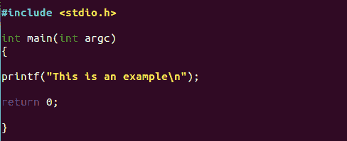

4.  现在`example_new.c`可以认为是`example.c`的更新版本

5.  我们现在将创建一个补丁文件，并使用`diff`命令将其命名为`example.patch`，如下所示:

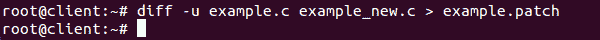

6.  如果我们检查补丁文件的内容，我们会得到以下输出:


7.  现在，在应用补丁之前，我们可以使用`-b`选项对原始文件进行备份，如下所示:


我们可以看到已经创建了一个名为`example.c.orig`的新文件，这是备份文件。

8.  在进行实际的修补之前，我们可以试运行修补文件来检查是否有任何错误。为此，我们运行以下命令:

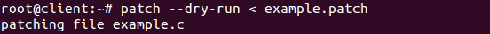

如果我们没有收到错误消息，这意味着补丁文件现在可以在原始文件上运行。

9.  现在，我们运行以下命令将补丁应用于原始文件:

```sh
    patch < example.patch
```

10.  应用补丁后，如果我们现在检查`example.c`程序的内容，我们会看到它已经用额外的代码行进行了更新，如`example_new.c`中所写:


11.  在原始文件上应用补丁后，如果我们希望反转补丁，我们可以使用`-R`选项，如下所示:


我们可以看到修补后和反转后文件大小的差异。

# 它是如何工作的...

我们首先创建一个示例 C 程序。然后，我们创建它的一个副本，再添加几行代码，使它成为一个更新的版本。之后，我们使用`diff`命令创建一个补丁文件。在应用补丁之前，我们通过试运行来检查它是否有任何错误。

如果没有错误，我们使用`patch`命令应用补丁。现在，原始文件与更新的版本文件具有相同的内容。

我们也可以使用`-R`选项反转补丁。

# 其他众所周知的 Linux 漏洞

随着时间的推移，Linux 因其开源特性而获得了很大的普及。然而，这也导致了更多的安全问题。Linux 系统往往和其他操作系统一样容易受到攻击，比如 Windows。这些漏洞可能是由于操作系统的错误，或者是由于 Linux 管理员的疏忽。

# 怎么做...

在本节中，我们将看到对一些最常见的 Linux 漏洞的讨论，如下所示:

1.  **Linux 内核 netfilter: xt_TCPMSS** :即使是一个老漏洞，影响到 4.11 之前的 Linux 内核，以及 4.9.36 之前的 4.9.x，但它仍然存在于很多没有注意到这个漏洞，仍然在使用旧版 Linux 内核的组织的系统中。它的 CVE ID 为:CVE-2017-18017，关键漏洞得分为 9.8。
2.  如果成功利用，上述漏洞可以帮助黑客发送大量通信，并导致**拒绝服务** ( **DoS** )攻击。
3.  **脏牛虫** : CVE-2016-5195 是这个虫的官方参考。发现在处理私有只读内存映射的写时复制破坏时，Linux 内核的内存管理器中存在竞争条件。

该缺陷位于 Linux 内核的一个部分，这是几乎每一个开源操作系统发行版的一部分，已经存在了将近十年:


4.  利用这个 bug 不会在日志中留下任何异常发生的痕迹。任何本地用户都可以写入他们可以读取的任何文件，并且至少从 Linux 内核版本 2.6.22 开始就存在了。
5.  如果你想了解更多关于这个漏洞的信息，你可以查看:[https://www.exploit-db.com/exploits/40839/](https://www.exploit-db.com/exploits/40839/)。
6.  Metasploit 框架是最流行的渗透测试框架，它还包括一个针对 Dirty Cow bug 的漏洞利用模块。更多相关信息可在此找到:[https://github.com/rapid7/metasploit-framework/pull/7476](https://github.com/rapid7/metasploit-framework/pull/7476)。

# 它是如何工作的...

一次又一次，在 Linux 中检测到许多漏洞，无论是与内核还是操作系统级别的代码有关。

一些漏洞，如脏牛，已经存在了很长时间，使得攻击者很容易利用它们。

这些漏洞中的大多数都有可用的漏洞，因此为了保持安全，有必要对我们的系统进行修补和更新。