# 漏洞扫描和入侵检测

在本章中，我们将讨论以下内容:

*   使用安全洋葱进行网络安全监控
*   使用 OpenVAS 查找漏洞
*   使用 Nikto 进行网络服务器扫描
*   使用 Lynis 强化

# 使用安全洋葱进行网络安全监控

**安全洋葱**是一个基于 Linux 的发行版，是为了网络安全监控而构建的。如果用于识别漏洞，监控网络的安全相关事件可以是主动的，或者在事件响应等情况下可以是被动的。

安全洋葱通过提供对警报周围的网络流量和上下文的洞察来提供帮助。

# 准备好

在前几章中，我们讨论了在系统上安装和配置安全洋葱的过程。遵循这些步骤后，我们有了一个安装了 Security Onion 的启动和运行系统。

使用安全洋葱不需要其他先决条件。

# 怎么做...

在本节中，我们将介绍 Security Onion 中包含的一些有助于安全监控的工具:

1.  一旦我们完成了安全洋葱中包含的安全工具的设置，我们必须创建一个用户帐户来使用这些工具。打开终端，运行以下命令为工具创建用户:

在前面的步骤中，我们已经创建了一个名为`pentest1`的用户，然后为他们配置了密码。

2.  创建用户帐户后，我们就可以开始使用这些工具了。
3.  在桌面上，我们可以找到 SGUIL 工具的图标。双击图标运行工具。

4.  将打开一个登录屏幕，如下所示。输入上一步配置的用户详细信息，点击**确定**:

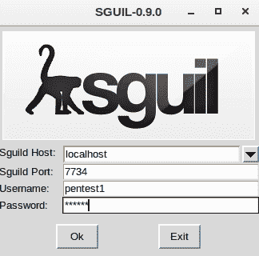

5.  验证用户详细信息后，下一个窗口将要求选择要监控的网络。从可用的选项中选择界面，点击**启动 SGUIL** 继续:

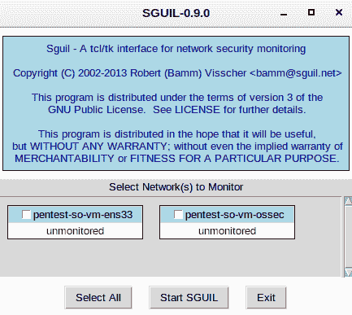

6.  接下来我们会看到窗口。这是 SGUIL 工具的主屏幕。在这里，我们可以监控上一步中选择的网络上发生的实时事件，以及会话数据和原始数据包捕获:

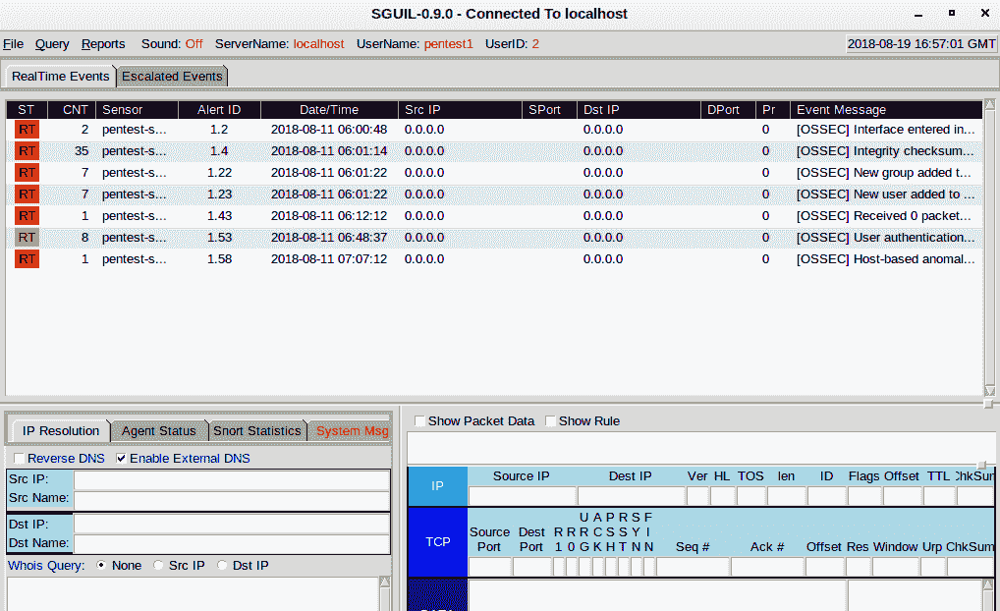

More information about using the tool can be found at [http://bammv.github.io/sguil/index.html](http://bammv.github.io/sguil/index.html).

7.  《安全洋葱》中还包括其他工具，如 Kibana。要访问这个工具，我们可以在桌面上找到快捷方式。一旦我们双击快捷方式，它将打开指向网址的浏览器:`https://localhost/app/kibana`。
8.  浏览器将给出关于**不安全连接/连接不是私有的**的警告，因为正在使用自签名的 SSL 证书。忽略如下所示的错误，单击高级，然后继续:

9.  接下来，基巴纳将询问用户详细信息以登录。使用第一步中配置的用户详细信息。成功登录后，我们会看到以下窗口:

10.  Kibana 有助于可视化弹性搜索数据，并导航弹性堆栈。

11.  安全洋葱包括其他工具，可用于监控网络中的各种活动。探索工具，深入了解它们。

# 它是如何工作的...

安全洋葱是一个开源的 Linux 发行版，用于企业安全监控、入侵检测和日志管理。为了帮助管理员执行安全监控，它包括各种安全工具，如 Sguil、Kibana、Suricata、Snort、OSSEC、Squert、NetworkMiner 和许多其他工具。

# 使用 OpenVAS 查找漏洞

作为一名 Linux 管理员，我们希望跟踪系统中可能存在的漏洞。及时发现这些漏洞也有助于在任何攻击利用它们之前修复它们。

要找到漏洞，可以使用 **OpenVAS** 等漏洞扫描工具。它是目前最先进的开源漏洞扫描工具之一。

# 准备好

要使用 OpenVAS，我们必须首先在系统上安装和配置它。关于安装配置过程的更多信息，可以参考 OpenVAS 官网:[http://www.openvas.org/](http://www.openvas.org/)。

# 怎么做...

一旦我们完成了 OpenVAS 的安装和初始配置，我们就可以使用它来扫描我们网络中的服务器。在本节中，我们将了解如何配置和运行扫描:

1.  要访问 OpenVAS，请在浏览器中访问此 URL:`https://127.0.0.1:9392`。
2.  我们将获得一个登录屏幕，如下所示。输入 OpenVAS 安装过程中配置的用户详细信息:

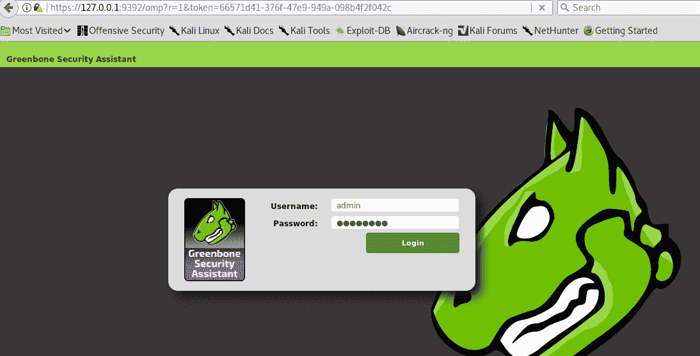

3.  登录后，我们会看到以下窗口。在顶部菜单中，我们可以找到不同的选项来使用，如**扫描**、**资产**、**配置**:

4.  要扫描服务器，我们将首先将其添加为要扫描的目标。为此，点击**配置**，然后点击**目标**，如下图:

5.  我们会看到下面的窗口。在左上角，我们可以看到一个星形图标。一旦我们单击此图标，它将打开一个新窗口来添加目标服务器:

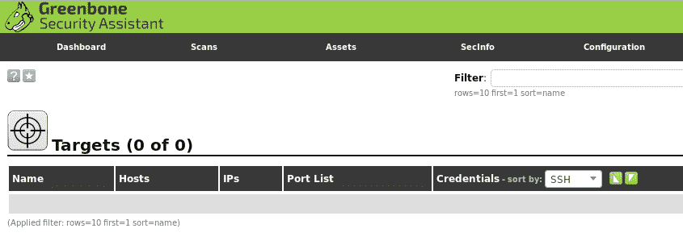

6.  在新窗口中，输入目标服务器的详细信息。为其命名，以便于识别目标，然后输入如下所示的 IP 地址:

输入详细信息后，单击创建将目标保存在目标列表中。

7.  我们可以在目标列表下看到目标服务器:

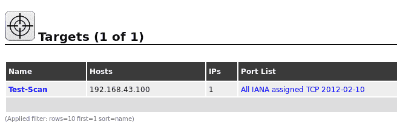

8.  接下来，我们点击**扫描**菜单，然后点击**任务**开始创建扫描任务:

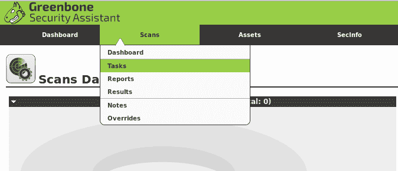

9.  在下一个窗口中，点击蓝星图标，然后点击**新任务**继续:

10.  现在，我们将为正在创建的扫描命名，然后使用**扫描目标**菜单下的列表选择我们的目标服务器，如下所示:

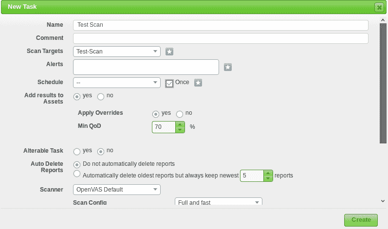

对于计划选项，选中“一次”框，只运行一次扫描。我们可以根据需要安排扫描运行多次。接下来，单击创建。

11.  单击“创建”后，我们的扫描任务已经创建，可以在任务列表中看到，如下所示:

12.  在我们创建的扫描的最右边，我们可以看到**动作**列中的一些按钮，如下所示。在这里，我们可以启动或暂停之前创建的扫描任务:

13.  一旦我们点击前面截图中显示的开始或播放按钮，我们的扫描将开始运行。根据网络速度和其他资源，完成扫描的时间可能会有所不同。
14.  扫描完成后，可以在**扫描任务**列表中看到，如下图:

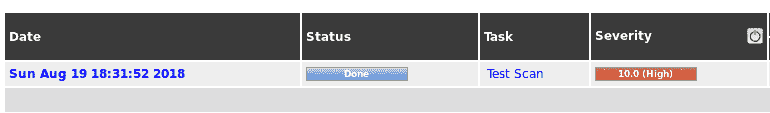

15.  **严重性**列显示扫描的摘要。它根据问题的严重性显示发现的问题计数。

16.  要查看扫描器发现的漏洞的完整列表，我们可以点击**扫描名称**，我们会看到 OpenVAS 发现的漏洞列表，如下图所示:

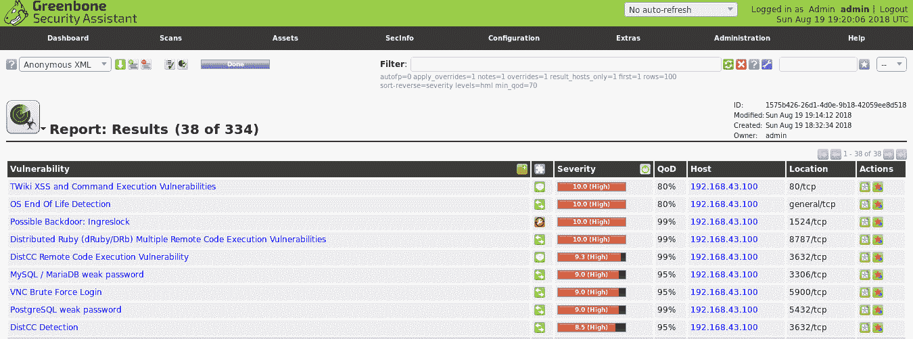

List of the vulnerabilities found by OpenVAS

# 它是如何工作的...

OpenVAS 允许我们使用**目标**选项添加我们想要扫描的服务器。添加服务器后，我们使用**扫描菜单**创建**扫描任务**。在**扫描任务**中，我们选择之前创建的目标，需要对其执行扫描。

当**扫描任务**配置成功后，我们运行扫描。完成后，我们可以看到 OpenVAS 发现的漏洞列表。

# 使用 Nikto 进行网络服务器扫描

如果我们的 Linux 服务器被配置为作为网络服务器运行，则网络服务器和网络服务器上托管的网络应用程序可能存在漏洞。在这种情况下，我们可以使用网络应用程序扫描工具来识别这些漏洞，Nikto 就是这样一个开源网络扫描仪。

它可以与任何 web 服务器一起使用，并且可以扫描大量项目来检测漏洞、错误配置、有风险的文件等。

# 准备好

要使用 Nikto 扫描我们的网络服务器，我们必须首先将它安装在我们的系统上，从那里开始扫描。如果我们使用的是 Kali Linux，那么 Nikto 是预装在里面的。对于其他 Linux 发行版，我们可以使用以下命令安装该工具:

# 怎么做...

在本节中，我们将了解如何使用 Nikto 检查 web 服务器并报告潜在的漏洞:

1.  要查看 Nikto 支持的选项的更多详细信息，我们运行以下命令:

2.  Nikto 支持各种插件来发现不同的漏洞。如果我们想查看插件列表，我们可以使用以下命令:

3.  现在，让我们使用 Nikto 在我们的网络服务器上运行带有 IP 地址`192.168.43.100`的扫描。我们使用以下命令开始扫描:

一旦我们运行命令，扫描将开始运行。根据网络速度和可能存在的漏洞数量，完成扫描的时间可能会有所不同。

4.  我们可以在下面的截图中看到，Nikto 在我们的网络服务器中发现了一些漏洞。它还告诉我们，web 服务器正在运行 Apache 2.2.8，如前所述:

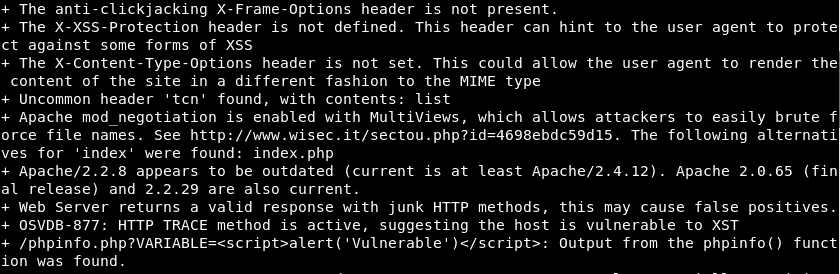

# 它是如何工作的...

Nikto 附带了 6700 多个插件，使用这些插件可以测试网络服务器中可能存在的安全问题。

一旦我们运行了扫描，Nikto 就会使用这些插件，检查所有的漏洞，如果发现了就报告。

# 使用 Lynis 强化

**Lynis** 是一个开源的安全工具，有助于审计类似 Unix 的系统。它对系统进行全面扫描，并根据扫描结果为系统强化和合规性测试提供指导。

Lynis 可用于各种目的，包括漏洞检测、渗透测试、安全审计、合规性测试和系统强化。

# 准备好了

几乎所有基于 Unix 的操作系统和版本都支持 Lynis。我们可以通过访问以下链接从 Lynis 的官方网站获得一份副本:

[https://cisofy.com/documentation/lynis/get-started/](https://cisofy.com/documentation/lynis/get-started/)

例如，我们使用 Ubuntu 系统来安装 Lynis。我们运行以下命令来安装该工具:

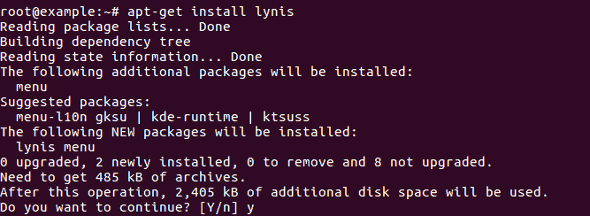

# 怎么做...

在本节中，我们将了解如何使用 Lynis 对系统安全方面和配置进行详细审核:

1.  一旦 Lynis 安装到我们的系统上，我们就可以运行`lynis`命令，如下所示，查看关于该工具支持的选项的更多信息:

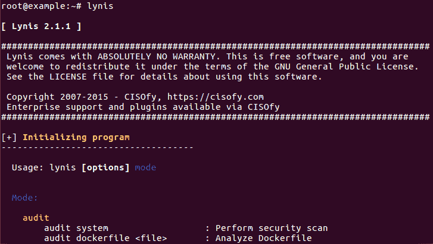

2.  我们可以通过运行以下命令来检查此版本的 Lynis 是否是最新的:

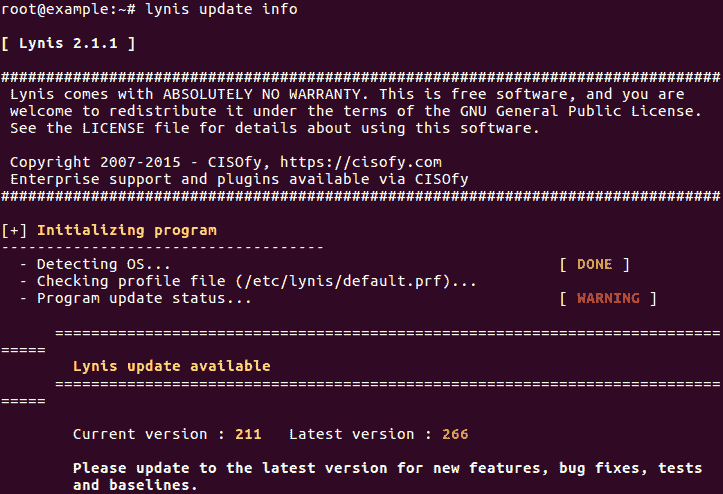

我们可以在输出中看到，当前版本为`211`，可用的最新版本为`266`。如果我们希望更新版本，我们可以继续输出中显示的步骤。

3.  现在，我们将开始扫描，通过运行以下命令来审核我们的系统并确定差距:

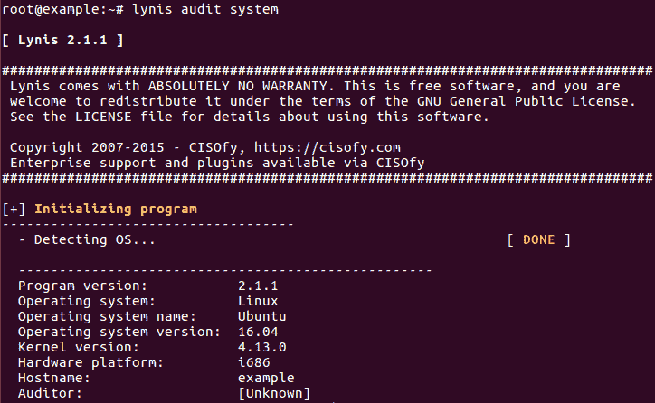

4.  随着扫描的进行，我们可以在此处显示的输出中看到扫描结果:

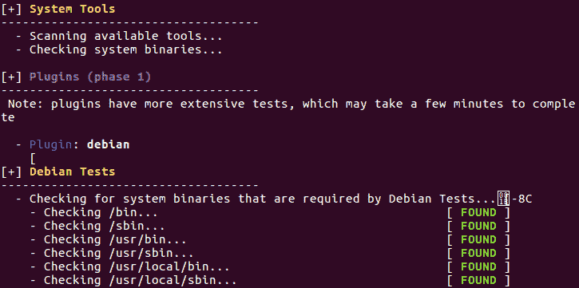

5.  在下面的输出中，我们可以看到 Lynis 已经确定了服务器上缺少的模块:

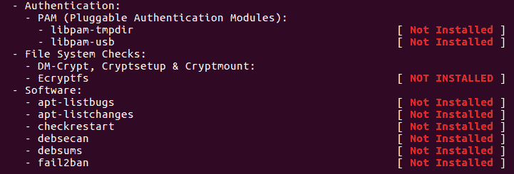

6.  扫描完成后，我们可以看到扫描摘要，如下所示:

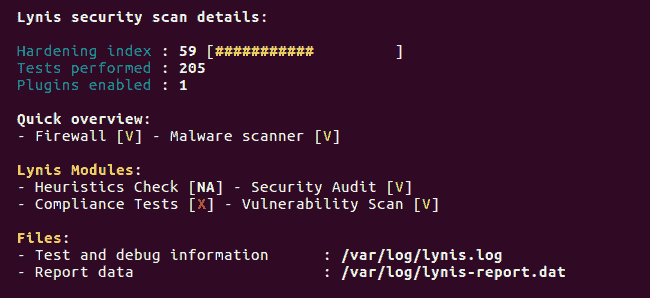

# 它是如何工作的...

当我们使用 Lynis 审计系统时，它首先初始化并执行基本检查，以确定操作系统和工具。Lynis 将根据定义的类别运行启用的插件和安全测试

Lynis 执行数百次测试，这将有助于确定系统的安全状态。

扫描完成后，Lynis 将报告扫描状态。