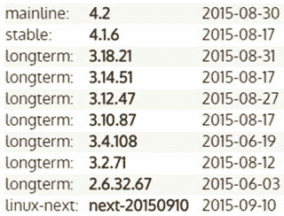
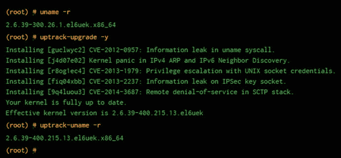

# 四、零停机时间 Linux

与微软服务器相比，使我如此重视 Unix 类型的系统的一个关键因素是缺少生产系统所需的重启。

根据我的经验，在最初构建之后，您通常可以预期 Unix 衍生产品会连续运行一年，甚至没有任何迹象表明它们需要您的关注。一些系统管理员甚至声称继承了十年没有重启的机器，在合适的环境下，我可以相信这一点。当然，这并不是鼓励这样的做法，因为这意味着在过去的十年里没有任何内核安全补丁发生。

正如你们中的一些人所知，几年前，最后一句话已经过时了。这是因为在相对较短的时间内，系统管理员已经能够实时修补他们的 Linux 内核，而不会中断服务或重启。在这一章中，我将讨论 2015 年的 Linux 内核补丁是如何向前推进了重要的一步。本章还探讨了一些立即可用的选择，以那些想利用这种照明技术。这样做的系统管理员肯定会从生产服务器的正常运行时间和安全性的显著增加中受益。

顺便说一句，说到监控，你可以通过使用一个叫做`tuptime`的聪明的小工具来更密切地关注你的重启(意外或其他)和总的正常运行时间，这个小工具可以在 [`https://github.com/rfrail3/tuptime`](https://github.com/rfrail3/tuptime) 找到。

## 持续可用性的承诺

我应该说，我一直支持关键服务不应该以高可用性(HA)为目标，而应该以连续可用性(CA)为目标。我记得读到过，大型在线视频流媒体巨头网飞( [`http://www.netflix.com`](http://www.netflix.com/) )承认，尽管他们采用了无可置疑的云技术，但即使他们不得不接受他们的服务，在某些时候也会失败。如果你仔细想想，这是一个相当了不起的说法。假设网飞有世界上最好的建筑师和工程师为其工作，据报道，现在几乎完全使用占主导地位的云提供商亚马逊网络服务。

在过去的几年里，我一直饶有兴趣地关注着开发人员为内核的实时补丁提供解决方案的尝试。如上所述，这种解决方案消除了在应用内核补丁后重启 Linux 服务器的需要；这些补丁可能会解决安全问题或应用急需的错误修复。

由于我对这一领域的兴趣，当第一个完全成熟的商业服务上市时，我成为了 Ksplice“Uptrack”服务( [`http://www.ksplice.com`](http://www.ksplice.com/) )的早期客户之一。这是在 2010 年初。即使在那个阶段，我也发现这项服务非常灵活，并在关键的生产服务器上连续多年使用它，主要运行 Debbie 和 Ian 最喜欢的 Linux 发行版。稍后，我将更深入地讨论这个话题。

Uptrack 的主要目的(至少对我来说)是推迟重启，并将必须在午夜开始的维护窗口数量保持在绝对最小。这些通常只在应用内核安全补丁后才需要。这种修补可能需要一年三次到一个月一次，这取决于您使用计算机的目的以及所涉及的版本或错误。

Ksplice 的 Uptrack(据我所知，当时被称为“Ksplice ”)主要是由麻省理工学院的杰夫·阿诺德撰写的，他无疑是个聪明人。即使在测试阶段，研究了从 2005 年 5 月到 2007 年 12 月的 50 个内核漏洞，Ksplice 也能成功修补 84%的漏洞。

可以肯定地说，Ksplice 是第一个吸引市场注意力的著名商业企业。如今，也有其他明显的竞争对手，如 KernelCare ( [`http://www.kernelcare.com`](http://www.kernelcare.com) )，在撰写本文时，根据其网站，约有 2500 家供应商使用其软件服务。

正如所有令人兴奋的新技术一样，一定程度的景观变化是不可避免的。Oracle 于 2011 年 7 月收购了 Ksplice，因此该服务现在仅提供给 Oracle Linux 高级支持客户。传统客户(我很高兴地说)仍然能够使用他们的帐户。

不久前，当内核版本 4 于 2015 年 4 月 12 日上线时，德高望重的 Linus Torvalds 引用了两句话，引起了我的注意。媒体对升级到内核版本 4 大做文章，主要是因为我怀疑版本号有相当大的变化(见图 [4-1](#Fig1) )。很好，老托瓦尔兹，谁有时可以是一个轻描淡写的大师，说新内核“没有太多特别的”，而且“新内核补丁基础设施做了很多”。他列举了版本升级的主要原因，因为大量的内务处理工作已经完成。

图 4-1。

There was a big jump in kernel version numbers this year

我怀疑关于内核补丁的引用是每个人都在谈论一些“新”的东西，以至于在他的脑海中它很快就变成了“旧”的新闻。我绝不会与像托瓦尔兹这样的人和他神一般的地位争论；我敢肯定，他不会介意我说，新的内核确实包括一段时间以来对实时内核补丁最重要的变化。

## 实时修补内核

事实上，实时内核补丁代码现在位于主流内核中，被称为`livepatch`，这是一个有争议的话题，尽管最终需要的只是代码的基础。

故事是这样的，Linux 的长期忠实用户 SUSE ( [`https://www.suse.com/products/live-patching/`](https://www.suse.com/products/live-patching/) )，追溯到 1992 年，正在开发“kGraft”以便为运行 SUSE Enterprise Linux 的企业客户提供零停机功能。与此同时，红帽正在开发`kPatch` ( [`http://rhelblog.redhat.com/2014/02/26/kpatch/`](http://rhelblog.redhat.com/2014/02/26/kpatch/) )，现在作为“技术预览版”包含在红帽企业版 Linux(RHEL)7.0 版本中。

似乎有时大声疾呼的 Torvalds 对本质上解决 Linux 内核中存在的同一个问题的两种解决方案有话要说:“利益相关方很快就明白，在这种情况下，让一个任务的几个独立的解决方案在内核中共存是绝对不切实际的。”

当关于内核是否会包含`kGraft`或`kPatch`的争论发生时，看起来红帽确实有一点优势。这是因为内核不需要预先准备就可以让系统使用实时内核更新，并且错误可以被更好地捕获。

经过一番忙乱之后，达成了一项协议。这样的讨论( [`http://linuxplumbersconf.org/2014/wp-content/uploads/2014/10/LPC2014_LivePatching.txt`](http://linuxplumbersconf.org/2014/wp-content/uploads/2014/10/LPC2014_LivePatching.txt) )的长短可以总结如下:“问题:我们能在同一个内核中同时运行`kPatch`和`kGraft`吗？回答:可以！”

当时显然有一个由 Red Hat 编写的名为`livepatch`的新内核补丁，使`kGraft`和`kPatch`能够完美和谐地运行。在 2014 年 11 月对其进行审查后，该代码被认为能够去除芥菜，并在 2015 年 2 月由 Torvalds 等人尽职尽责地合并到内核中。

据说 Red Hat 和 SUSE 都(至少官方上)不知道对方提供实时内核补丁的项目。重要的是达成了一个公平的妥协，双方都感到满意，至少在公开场合是如此。

根据 Torvalds 提交给内核的代码提交，Red Hat 的`kPatch`通过向内核发送一个`stop_machine()`来工作，当它确信这样做是安全的。此时，它会将新代码注入到活动内核中。不要误解我的意思，我们并没有强制“暂停”或任何持续时间超过几分之一秒的事情，所以这实际上是一个即时的动作，你的服务器甚至不会注意到。

另一方面，显然`kGraft`通过跟踪检查点，在每个任务的基础上工作，通过修补来实现它的目标。在 [`https://lkml.org/lkml/2014/11/7/354`](https://lkml.org/lkml/2014/11/7/354) 从 SUSE 那里了解他们的东西的人的帖子中有一个沉思的例子。

作为妥协、相对较小的重写和适当合作的结果，现在您已经拥有了 Linux 中实时内核补丁所需的基础设施。这包括应用程序编程接口(API)和应用程序二进制接口(ABI)，它们允许用户空间启用、禁用和显示应用了哪些补丁的列表。这当然是一个好的开始。

显然，实时内核补丁软件很好地利用了内核的`ftrace`(“函数跟踪器”)功能。代码是完全自包含的，这意味着它甚至不与内核的其他组件对话，或者更准确地说，不会对它们造成任何不适当的干扰。在发布时，只有 x86 硬件能够利用这项技术。PowerPC、S/390 和 ARM 已经在考虑将它包含在其内核中。

Torvalds 指出，“一旦这个公共基础设施被合并，Red Hat 和 SUSE 都同意立即开始在此基础上移植他们当前的解决方案，放弃他们的树外代码。”为了达到这一阶段，双方都相对认真地对待各自的发展道路，这反过来又为正在进行的发展带来了希望。一个例子是，2014 年，Red Hat 为其使用 RHEL 7 服务器的现有客户成立了一个特殊兴趣小组(SIG)。随着多个常见漏洞和暴露(CVE)的公布，一些 CVE 被精心挑选出来并提供给用户，以查看针对安全问题和错误修复的实时补丁有多容易。

## Ksplice 的上行轨道

图 [4-2](#Fig2) 展示了实时内核补丁背后的工作方式，正如 Oracle 的 Ksplice 服务“Uptrack”所展示的那样。`uname -r`命令让您显示系统正在使用的内核版本。

图 4-2。

Oracle Ksplice’s magical Upstart in a nutshell, displayed at [`http://ksplice.oracle.com`](http://ksplice.oracle.com/)

运行带有`-y`选项(“yes”)的`uptrack-upgrade`命令将安装 Uptrack 当时提供的所有可用补丁。

最后，当运行`uptrack-uname -r`时，您可以检查系统正在使用的有效内核版本(注意`-400`与`-300`)。这一切都发生在一瞬间。这不是很聪明吗？你当然可以明白为什么 Red Hat 和 SUSE 在 Uptrack 上市后也加入了进来。

接下来，要检查 Uptrack 应用了哪些修补程序，您可以运行以下命令:

`# uptrack-show`

如果您手动安装了一些修补程序，但遗漏了一些，或者如果您想查看哪些尚未应用，您可以尝试以下命令:

`# uptrack-show --available`

您也可以通过更改配置文件`/etc/uptrack/uptrack.conf`中的相关行来设置全自动修补。我建议不要在生产机器上使用这个特性，并且建议您只在不太重要的系统上使用这个特性，直到出于明显的原因测试了补丁。您可以使用类似 Puppet 的东西在您的服务器资产周围触发`upgrade`命令。一旦你用相同的内核版本和发行版在一个机器上测试了补丁，剩下的部分就会自动修补。

同样在这个配置文件中，您可以设置`install_on_reboot`,这样在一次(潜在的意外)重启之后，补丁将被提升到与之前相同的级别，而不需要通过您的包管理器匆忙应用您的内核更新。如果有其他可能已经应用的更新，那么您可能希望将选项`upgrade_on_reboot`设置为“yes”来合并这些更新。

如果您需要删除修补程序，只需使用此命令即可将其全部删除:

`# uptrack-remove -y`

或者，您可以使用 Ksplice ID(可以从`uptrack-show`命令中收集到)来具体选择要删除哪个补丁，而不是使用`-y`。如果某个补丁出现了问题，例如，你的某些系统硬件的驱动程序出现了问题，你可能需要用到它。

## 第一印象

我可以非常诚实地说，在我在关键任务的 Linux 路由器上使用 Uptrack 的这些年里，我没有遭受任何不受欢迎的停机，并且发现 Ksplice 的服务非常好。请注意，关键词是“服务”。

实时内核补丁的前提(对于所有的意图和目的)是用一个`diff`来比较当前内核中的“不同”之处。然后，程序员仔细挑选要应用的补丁的骨架，并创建可以部署在其修补基础架构中的特定类型的补丁。然后，在它们支持的不同架构和发行版之间复制(有时使用不同的专业内核程序员)。

过去，在被 Oracle 收购之前，可以理解的是，在某种程度上被锁定以供其高端客户使用，Ksplice 支持更多的发行版。也就是说，RHEL、CentOS、Debian、Ubuntu、Virtuozzo 和 OpenVZ 补丁仍然对以前的用户可用——至少现在是这样。如果我没记错的话，我在生产中使用 Ksplice 时，对早期的容器技术(顺便提一下，它仍然非常优秀)，即 OpenVZ，没有任何问题。

然而，如果你有兴趣亲自体验一下这种魔力，Ubuntu 和 Fedora 用户可以安装一个免费的桌面版。我强烈推荐它；桌面页面可以在 [`http://www.ksplice.com/try/desktop`](http://www.ksplice.com/try/desktop) 找到。

我遇到的唯一问题(Ksplice 当时的工作人员反应很快)发生在两个不同的场合。这是在应用了一些内核补丁后产生的看似无害的错误消息。不用说，如果我登录到一个生产系统，看到了看起来很糟糕的错误，而这些错误本不应该出现，我会立即处理。尽管身处不同的时区(尽管我只是一个月收入只有几美元的客户)，但支持团队显然非常有能力并迅速做出了回应。否则，最重要的因素，当然是我非常珍贵的生产系统的可靠性，是完美的。这意味着我可以多睡几个小时，否则我会在许多不同的维护窗口期间醒着眯着眼睛看屏幕。

## kernel care—物有所值

如果我不更详细地提及 KernelCare 的提议，那将是我的失职。既然 Ksplice 本质上是一个排外的俱乐部，那就没有什么能阻止你去 KernelCare 了。这是一家名为 CloudLinux 的公司运营的服务，该公司自 2009 年以来一直存在，旨在尽可能简化系统管理员的生活。在甲骨文收购之前，Ksplice 于 2010 年 8 月( [`https://www.cloudlinux.com/company/news/index.php?ELEMENT_ID=495`](https://www.cloudlinux.com/company/news/index.php?ELEMENT_ID=495) )开始提供 CloudLinux 作为其支持的发行版之一，这一事实没有逃过我的眼睛。

如果你在两台或更多的机器上使用 KernelCare 的服务，每台机器每月的费用不到 3 美元。相信我，当你的关键工程师连续几个月看起来精神饱满地走进工作岗位时，那几美元是非常值得的。我自己还没有尝试过 KernelCare 服务，但是可以肯定地说，在不太重要的系统上试用几个月是一种尝试的好方法。

实时内核补丁商业模式的好处在于，由于受支持的发行版和架构的数量相对较少，如果服务提供商的程序员把补丁移植到他们的服务上搞砸了，那么一切都乱套了。成百上千的客户将会受到影响，这通常意味着如果出现故障，可以很快修复，并且事先进行大量测试。

KernelCare 显然有着重拾 Ksplice 的雄心。下面是网站上的一段话，请记住，它的准入门槛非常低，每月只允许一台服务器以几美元的价格使用它的服务:“KernelCare 支持 CentOS/RHEL 5、6 和 7，CloudLinux 5 和 6，OpenVZ，Virtuozzo，PC，Debian 6 和 7 以及 Ubuntu 14.04。其他内核也会随之而来。”还有一个邮件列表可以随时了解最新进展: [`http://kernelcare.com/mailing-lists.php`](http://kernelcare.com/mailing-lists.php) 。

我记得可能值得指出的一点是，至少在使用 Uptrack 时，即使您自动应用了内核补丁，也应该记住，默认情况下，您并没有将更新应用到操作系统的 Uptrack 包中。简而言之，加入邮件列表，确保你知道软件什么时候有重要的变化；这也适用于补丁。

## 试试 kPatch

多亏了 Red Hat 和 SUSE 的新主流内核代码，如果你想的话，你可以马上动手做，而不是尝试商业服务。然而，要知道这还处于早期阶段。一个例子就是通过访问优秀 GitHub 上的这个`kPatch`页面: [`https://github.com/dynup/kpatch`](https://github.com/dynup/kpatch) 。

很难忽略那一页顶部用相当大的字母写的警告，如果我是你，我会采纳这个建议:“警告:小心使用！可能会出现内核崩溃、自发重启、数据丢失！”

对于这个`kPatch`方法和`livepatch` :

> There is also a useful brief explanation: "Starting from Linux 4.0, Linux kernel has livepatch, which is a new integrated real-time kernel patch framework. The Livepatch is similar in function to the core module of kpatch, although it doesn't have all the functions of kpatch. "

在撰写本文时，Fedora 21、RHEL 7、CentOS 7、Oracle Linux 7、Ubuntu 14.04、Debian 8 和 Debian 7.x 被认为是必备软件。然而，下一个警告提到“`kpatch-build`命令只在 Fedora 20、RHEL 7、Oracle Linux 7、CentOS 7 和 Ubuntu 14.04 上进行了测试和确认”，尽管现代内核应该很好地支持它。

还有一个写得很好的“它是如何工作的”部分，该机制的局限性，以及一个相对全面的 FAQ，为感兴趣的人提供一些不错的技术细节。在接下来的几个月里，我会密切关注这一页，看看事情进展如何。

## 不是重启的结束

正如我们所知，实时内核补丁技术并不意味着重启的终结。

几年前，我试着做了一些关于这个主题的阅读，对 Debian 命令`checkrestart`中的`lsof`命令的功能产生了兴趣(如果你感兴趣的话，它被埋在`debian-goodies`包中)。无价的`checkrestart`本质上是寻找在文件系统中被新文件取代后仍在使用的旧文件。

它检查由进程保持打开的文件，然后将列表与那些在文件系统上仍然可见的文件进行比较。之后，如果不存在的“旧”文件仍然加载在内存中，它会尽职尽责地发出警告(例如，它们可能会带来安全风险)。

这些罪魁祸首是共享库，这当然并不罕见。一旦它确定了哪些服务需要“刷新”,那么聪明的`checkrestart`会提供一些关于如何用`init`脚本格式来做到这一点的建议，比如`service postfix restart`或`/etc/init.d/postfix restart`。

代号为“Jessie”的 Debian 发行版的最新版本有一个新的对`systemd`友好的化身，叫做`needrestart`。我喜欢`needrestart`以其自身的包装呈现的事实，因为如果它受欢迎，它可能会得到更多的报道和进一步的开发。它不再深埋在糖果袋里。

`needrestart`——与“杰西”捆绑在一起的`checkrestart`的更新版本——的一些功能包括(根据 [`https://packages.debian.org/jessie/admin/needrestart`](https://packages.debian.org/jessie/admin/needrestart) ):

*   支持`systemd`(但不要求)
*   二进制黑名单(即显示管理器)
*   检测挂起的内核升级
*   检测基于解释器的守护程序所需的重新启动
*   支持 Perl、Python 和 Ruby
*   使用钩子完全集成到`apt/dpkg`中

如果你运行这些工具(或者单独运行`lsof`命令),那么一些服务，比如`glibc`和`dbus`,在某些升级之后可能会显示很多结果。你很快就会意识到(我认为这是一次很好的学习经历),在一些包升级之后，当手动清理大量共享库时，几乎不可能不撞倒服务器。

因此，除非达成共识，绝对确保每个包和服务都可以在不关闭服务器的情况下“实时重启”，否则不幸的是，半夜发生的生产服务器重启仍将存在。我可能已经错过了一些东西，当然，也可能有其他方式，我还没有遇到过，以协助这种软件包升级。显而易见，这一计算领域正以极快的速度发展。拿我来说，我会经常关注内核补丁领域的任何进展。

## 摘要

主要的经验法则是在您的服务器上安装尽可能少的包(在这种情况下，越少就是“越少”)。我怎么强调这一点都不为过。此外，要知道你的每一台服务器都做些什么。我的意思是隔离你的服务。例如，确保 web 服务器只负责 HTTP，并让您的邮件服务器在完全独立的机器上运行。这样，你不眠之夜的数量肯定会减少。连锁效应是您的正常运行时间统计数据将大放异彩，成为大多数其他系统管理员只能渴望的目标。