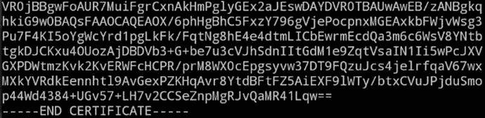

# 8.没有 sFTP 并不意味着没有加密

如今，远程访问类似 Unix 的服务器几乎都是通过 SSH(安全外壳)来完成的。SSH 如此受欢迎，以至于很少不使用它(而是使用类似 Telnet 客户端的东西)的时候必须在图表上显示为百分之一的最小部分。我个人很少用 SCP(安全拷贝)；相反，我使用 sFTP(安全文件传输协议)进行大多数手动文件传输。聪明的 sFTP 功能作为 SSH 的一个子系统运行，它为传统的文件传输协议(FTP)增加了加密功能，以确保登录详细信息和交易信息在传输过程中更加安全。

然而，有时您会发现自己感到沮丧，因为在连接的一端您没有 SSH 或 sFTP 可用。在这种情况下，您需要一个简单的命令行工具，让您可以通过 Internet 从 Unix 类型的命令行安全地使用 FTP。在这一章中，你将看到一个叫做`lftp`的小软件，它允许你在不使用 SSH 的情况下加密文件传输。我将分析几个不同的场景，以便您做好准备，以防有一天您发现 SSH 对您不可用，因为您在一个封闭的环境中工作，或者您有一个不安全的 SSH 版本，由于某种原因您无法升级。

## 使用 ftp

首先，您将看到连接到一个支持加密版本的 FTP 的服务器，从 SSH 的定义来看，它实际上不是 sFTP，而是 FTPS(据报道，它涵盖了 FTP-ES、FTP-SSL 和 FTP Secure)。FTP-ES 明确要求使用加密，而 FTPS 暗示应该使用加密。

我经常求助的安全 FTP 选项之一叫做`lftp`，根据它的手册，它“可以处理几种文件访问方法——`ftp`、`ftps`、`http`、`https`、`hftp`、`fish`、`sftp`和`file` ( `https`和`ftps`只有在`lftp`用 GNU TLS 或 OpenSSL 库编译时才可用)。”事实上，对于任何小型公用事业公司来说，这都是一个令人印象深刻的协议范围。唯一想到的警告是防火墙——与 ftp 不同，FTPS 不使用网络端口 21，而是默认使用端口 990。

### 装置

在 Debian 衍生产品上，您可以通过运行以下命令来安装`lftp`:

`# apt-get install lftp`

在 Red Hat 衍生产品上，您可以通过运行以下命令来安装它:

`# yum install lftp`

如果出于某种原因，您需要从源代码安装`lftp`包，您应该使用以下命令(注意，当使用某些操作系统版本时，您可能还需要安装其他包):

`# ./configure --with-openssl=/usr/lib`

`# make; make install`

如果您有任何 SSL 或 TLS 支持问题，比如连接没有成功启动，请使用以下命令检查`lftp`实用程序是否已经编译了`libgnutls`或`libssl`功能:

`# ldd /usr/bin/lftp`

在结果输出中，查找以`libgnutls`或`libssl`开头的行，以确认它是否已经用该功能编译过。如果您不确定您的`lftp`二进制文件的确切路径，只需运行这些命令添加到上面的`ldd`命令中:

`# updatedb; locate lftp`

### 入门指南

与旧式的命令行 FTP 客户端一样，您可以将连接命令塞进一行，或者进入各种子 shell 并从那里进行交互。`nslookup`命令提供了与之交互的类似方式。

首先，一个直接连接到远程主机并且只被要求输入密码的例子:

`# lftp chrisbinnie@secure.chrisftp.tld`

`Password:`

在这个例子中，我还没有进入一个 subshell 相反，我在命令行上直接传递用户名。然而，如果不在一行中这样做，`lftp`的输出如下所示(减去`chrisbinnie@`元素):

`# lftp secure.chrisftp.tld`

`lftp secure.chrisftp.tld:-> user chrisbinnie`

`Password:`

注意，我已经为这个交互添加了`user`选项。不要让不同的命令接口方式迷惑了你。然而，偶尔一个值得注意的好理由是，世界上最大的虚拟主机公司之一似乎坚持在其共享主机平台上使用这种格式的用户名:`chris@chris.binnie.tld`。在我看来，这是相当疯狂的，尽管很明显为什么他们更喜欢这种格式来跟踪用户属于哪个主机或域名。然而，除非是电子邮件地址，否则在用户名中使用`@`符号可能会被判定为非法，可能会被判终身使用 Windows 机器。

我反对用户名格式是有道理的。为了连接到世界上最大的 web 主机之一，产生的令人困惑的单行`lftp`连接如下所示:

`# lftp chris@chris.binnie.tld@chris.binnie.tld`

为了清楚起见，我可能会建议选择“user”subshell 替代选项，如果您被迫使用奇怪的用户名，我刚才会考虑这个选项。此外，与普通的 FTP 文件传输不同，如果连接是加密的，当然可能会涉及到证书。

然而，继续上一个例子，输入我的密码后，在尝试用`ls`命令列出远程主机上的文件后，我收到了一个相当可怕且不受欢迎的错误:

`# ls`

`ls: Fatal error: Certificate verification: Not trusted`

顺便说一下，如果你遇到错误，输入`quit`(不要按 Ctrl+C)。

当面临这样的问题时，您可以使用您最喜欢的文本编辑器应用下面的修复方法。您可以在主目录的资源文件中控制您的`lftp`首选项。通过写入名为`rc`的文件，如下所示，您可以添加不同设置的负载:

`# mkdir /home/chrisbinnie/.lftp`

`# pico -w /home/chrisbinnie/.lftp/rc`

`set ssl:verify-certificate no`

第一行在您的主目录中创建一个隐藏目录，第二行启动 pico 编辑器；在这种情况下，要改变 SSL 证书的处理方式。显然这并不理想，因为您实际上忽略了强制的证书检查。请记住，尽管许多 FTP(S)服务器将提供自签名证书，而不是支付可信证书。这意味着您在连接过程中发送的凭证和命令将很难被窃听，因为它们是加密的，但远程服务器的身份不能得到保证。尽管如此，仍然可能有一个服务器假冒您的文件存储库，怀着不良的意图，试图窃取您的密码。我偶然发现了这个忽略自签名证书错误的好办法，允许您无缝地使用它们。多才多艺的网络解决方案 [`http://www.versatilewebsolutions.com/blog/2014/04/lftp-ftps-and-certificate-verification.html`](http://www.versatilewebsolutions.com/blog/2014/04/lftp-ftps-and-certificate-verification.html) 在这个博客上对此做了很好的解释。

事情是这样的:本质上，您需要从将要连接的远程主机获取并存储证书。然后从您的`lftp`配置中引用该证书。并且，当您将来再次连接时，您将能够知道这是否是您上次连接的同一台计算机。

要提取有问题的证书，您需要 OpenSSL 的一点帮助。使用名为`s_client`的内置客户端，您可以手动建立到远程主机的连接(它将使用 SSL[安全套接字层]或其继任者 TLS[传输层安全性]进行连接)。

OpenSSL 表明，它所捆绑的客户机实际上只是为了测试目的，因此它只提供非常基本的接口。然而，在内部，它确实使用了非常流行的、无孔不入的 OpenSSL `ssl`库的大部分内容，如果您需要进行全面的测试，这是很方便的。

下面是优秀网页建议的 OpenSSL 命令(显然在`:21`前替换你的主机名):

`# openssl s_client -showcerts -connect secure.chrisbinnie.tld:21 -starttls ftp`

运行该命令后，您会看到大量数据，这些数据可以分成两部分。图 [8-1](#Fig1) 显示了一个特意截取的证书文件(顶部缺少`“-----BEGIN CERTIFICATE-----”`部分标题)出现在输出的顶部。为了保持简洁，我删减了输出。您想要复制并粘贴到文件中的部分就是这个部分(包括开头和结尾带有破折号的行)。

图 8-1。

An abbreviated certificate

图 [8-2](#Fig2) 显示了连接的更多细节，这证实了它是一个自签名证书。

图 8-2。

Some more information about the self-signed certificate and its connection

在将证书信息粘贴到一个文件中之后(例如，为了方便起见，我将它复制到了`/home/chrisbinnie/.lftp`目录中)，您可以将您的`rc`首选项文件指向它。如果你没有使用单独的文件(保存在主配置旁边的目录中)，那么你可以选择不创建一个目录，只使用一个名为`/home/yourname/.lftprc`的文件来保存你的首选项配置。

让我们按照我采取的行动。首先，将远程服务器的证书粘贴到一个名为`ftpbox-cert.crt`或类似的文件中:

`# pico -w /home/chrisbinnie/.lftp/ftpbox-cert.crt`

接下来，查看您的`/home/yourname/.lftp/rc`文件，并在删除最初添加的`verify`行之后添加以下行:

`set ssl:ca-file "ftpbox-cert.crt"`

如果您得到另一个奇怪的错误，比如`“Certificate verification: certificate common name doesn’t match requested hostname,”`，那么将这一行添加到您的`/home/yourname/.lftp/rc`文件中，以忽略输入到自签名证书中的主机名:

`set ssl:check-hostname no`

尽管您可能会忽略主机名，但是您应该会看到初始化连接时所出示的证书的任何更改。这显然比在你开始上传敏感数据之前，盲目的连接到任何一个你的 DNS 或者网络认为有效的旧盒子要好得多。

提到这个技巧的来自多功能 web 解决方案的网页也尽职尽责地提醒我们，即使是自签名证书也会过期，所以要注意，当远程证书的过期日期到来时，您可能会得到令人讨厌的错误。

或者，您也可以使用以下命令连接到匿名 FTP 站点，该站点默认要求您输入您的电子邮件地址而不是密码:

`# lftp`

`# open -u anonymous,chris@binnie.tld -p 21 ftpbox.binnie.tld`

如果您想永久设置您的匿名密码，请将其添加到您的`rc`文件中(否则将使用使用`lftp`的用户的用户名):

`set ftp:anon-pass "chris@binnie.tld"`

## 主要配置选项

您可以选择启用对您的`rc`文件的调试选项，尤其是当您遇到困难时:只需添加`debug`就可以打开它。这很有用，因为否则`lftp`会在后台安静地运行，不会有太多日志记录。如果您想要输出完整的调试信息，请使用此设置:

`# debug 5`

要降低日志记录的噪音，您可以选择以下设置:

`# debug 3`

顺便说一下，这可以通过使用命令行上的`-d`开关来覆盖，并且将显示完整的调试级别。

现在，让我们来看看您可以使用的众多其他选项中的一小部分。

一种选择带有明确的警告。我强烈建议你不要启用它，除非你绝对有必要，而且只是为了连接到匿名的 FTP 站点。这是因为`lftp`能够标记 FTP 站点并包含它们的密码(这是非常不安全的)。当我提到它提供书签时，听起来像是在运行 GUI(图形用户界面),但它不是。您可以像这样关闭`rc`文件中的密码保存:

`set bmk:save-passwords no`

一些 FTP 服务器往往比其他服务器更挑剔，如果没有启用“同步模式”，它们将无法正常工作。所谓的“同步模式”的工作原理是宽容的`lftp`耐心地一次发送一个命令，然后等待响应。当路由器有点不正常时，它也能有所帮助。

如果你不启用同步模式，那么`lftp`会连续发送一大串命令并等待响应。如果使用它，您可能会加快命令交换。然而；正如我所说的，一些主机和路由器不同意发送这些命令，所以默认情况下“同步模式”是打开的，以保持通信尽可能合理。

如果你谨慎的话，通过调整`lftp`的配置设置，你可以留意一些服务器，如果横幅或标题包含某种信息，就打开“同步模式”。它使用如下所示的正则表达式进行匹配，其中管道符号充当`OR`:

`set ftp:auto-sync-mode "Rubbish Server|MS-based FTP Box"`

在本例中，如果介绍性欢迎标语包含“`Rubbish Server”`或`“MS-based FTP Box”`，那么“同步模式”将自动启用，同时为您连接的其他 FTP 站点打开节流阀。

如果你在某种程度上使用过 FTP，那么你几乎肯定以前遇到过被动模式。FTP 作为一种协议，独占使用 TCP(传输控制协议)(你想知道你的上传到底有没有做到)，避免使用 UDP(用户数据报协议)。

默认情况下，FTP 将尝试使用 TCP 端口 21 进行命令通信，TCP 端口 20 将用于实际负载(即上传或下载的数据)。然而，当端口 20 实际上不用于数据传输时，会出现各种各样的问题。

显然，在主动模式下，FTP 客户端将查看其中一个临时端口(也称为非特权端口)，该端口高于用于其数据连接的 TCP 端口 0 到 1023。在主动模式下，端口被打乱，一些客户端和服务器陷入混乱。在被动模式下(在 FTP 中写成“PASV”作为一个命令，以防被 FTP 的说法所迷惑)，您可以在晚上睡得很好，因为知道 TCP 端口 20 不会在事务中使用，而是会使用更高的临时端口号。因此，好的、旧的被动模式可能会通过防火墙规则或易怒的路由器来挽救局面。

您可以在您的`rc`文件中强制 PASV 模式，如下所示:

`set ftp:passive-mode yes`

如果你坚持使用主动模式，你可以强制使用`PORT`号。这是用于数据连接的 TCP 端口，如果没有使用 PASV，则由客户端建议。要将活动传输锁定到特定的 IP 地址和端口号，您可以使用以下配置设置:

`set ftp:port-ipv4 123.123.123.123`

`set ftp:port-range 2000-3000`

您可以将`123.123.123.123`调整到您的 IP 地址，第二行让您根据需要微调防火墙端口。

要甚至在匿名 FTP 服务器上使用 SSL，以便您的凭证或命令不被公开，请使用以下命令:

`set ftp:ssl-force yes`

您可以更进一步，还坚持所有数据都通过加密连接传输，如下所示:

`set ftp:ssl-protect-data yes`

在我看来，这是一个非常合理的设定；除非是公共数据，否则轻微的传输速度和 CPU 开销可能是非常值得的。

一个常见的 FTP 命令是`list`或`ls`命令(T2 命令也值得一提)，用于刷新连接(如果你用和我一样的方式输入)或检查上传何时完成。如果您希望尽可能保证您的连接安全，您可能还想隐藏文件列表产生的输出。尝试在您的`rc`文件中使用这个命令来管理:

`set ftp:ssl-protect-list yes`

有时，你正在使用的连接的带宽是稀缺的，或者你的 FTP 服务器软件是坏脾气的。灵活的`lftp`考虑到了一切，甚至让你关闭默认的`QUIT`命令来礼貌地关闭连接。您可以像这样更改默认值:

`set ftp:use-quit no`

如果您在 HTTP 上遇到一个看起来很权威的用户和密码请求，您可以使用这个选项，按照您认为合适的方式更改`username:password`:

`set http:authorization "username:passwd"`

另一个我觉得有用的选项是`clobber`，它可以让你调整你的覆盖设置。

`set xfer:clobber on`

在这个例子中，如果关闭了`clobber`，FTP GET 命令不会覆盖现有文件，而是会报错。在低带宽链路上，您可能希望将其测试为“关闭”。

如果你作为一个初出茅庐的技术人员学到了什么，那么任何系统管理员心目中良好的内务管理都应该包括日志记录。您可以将传输记录指向如下文件:

`set xfer:log-file "/home/chrisbinnie/biglog.log"`

我相信您会同意，能够保留您所有的转账详细信息以供将来参考是一项有用的附加功能；需要时可以启用和禁用它。

## 默认的 lftp 配置文件

为了让您了解默认配置选项的样子，请看一下配置文件。

清单 [8-1](#FPar1) 显示了 lftp 配置文件，它在 Debian 上的默认状态下位于`/etc/lftp.conf`。

Listing 8-1.The Main Config File for lftp Found at /etc/lftp.conf

`## some useful aliases`

`alias dir ls`

`alias less more`

`alias zless zmore`

`alias bzless bzmore`

`alias reconnect "close; cache flush; cd ."`

`alias edit "eval -f \"get $0 -o ∼/.lftp/edit.tmp.$$ && shell \\\"cp -p ∼/.lftp/edit.tmp.$$ ∼/.lftp/edit.tmp.$$.orig && $EDITOR ∼/.lftp/edit.tmp.$$ && test ∼/.lftp/edit.tmp.$$ -nt ∼/.lftp/edit.tmp.$$.orig\\\" && put ∼/.lftp/edit.tmp.$$ -o $0; shell rm -f ∼/.lftp/edit.tmp.$$*\""`

`## make prompt look better`

`set prompt "lftp \S\? \u\@\h:\w> "`

`## some may prefer colors (contributed by Matthew <mwormald@optusnet.com.au>)`

`#set prompt "\[\e[1;30m\][\[\e[0;34m\]f\[\e[1m\]t\[\e[37m\]p\[\e[30m\]] \[\e[34m\]\u\[\e[0;34m\]\@\[\e[1m\]\h\[\e[1;30m\]:\[\e[1;34m\]\w\[\e[1;30m\]>\[\e[0m\] "`

`## Uncomment the following two lines to make switch cls and ls, making`

`## cls the default.`

`#alias ls command cls`

`#alias hostls command ls`

`## default protocol selection`

`#set default-protocol/ftp.*     ftp`

`#set default-protocol/www.*     http`

`#set default-protocol/localhost file`

`## this makes lftp faster but doesn’t work with some sites/routers`

`#set ftp:sync-mode off`

`## synchronous mode for broken servers and/or routers`

`set sync-mode/`[`ftp.idsoftware.com`](http://ftp.idsoftware.com/)T2】

`set sync-mode/`[`ftp.microsoft.com`](http://ftp.microsoft.com/)T2】

`set sync-mode/`[`sunsolve.sun.com`](http://sunsolve.sun.com/)T2】

`## extended regex to match first server message for automatic sync-mode.`

`set auto-sync-mode "Microsoft FTP Service|MadGoat|MikroTik"`

`## if default ftp passive mode does not work, try this:`

`# set ftp:passive-mode off`

`## Set this to follow http redirections`

`set xfer:max-redirections 10`

`## Proxy can help to pass a firewall`

`## Environment variables ftp_proxy, http_proxy and no_proxy are used to`

`## initialize the below variables automatically. You can set them here too.`

`##`

`## ftp:proxy must communicate with client over ftp protocol, squid won’t do.`

`## This can be e.g. TIS-FWTK or rftpd. User and password are optional.`

`# set ftp:proxy ftp://[user:pass@]your_ftp_proxy:port`

`## ...but squid still can be used to access ftp servers, using hftp protocol:`

`# set ftp:proxy`http://your . squid . address:port

`## ...if squid allows CONNECT to arbitrary ports, then you can use CONNECT`

`## instead of hftp:`

`# set ftp:use-hftp no`

`##`

`## no proxy for host`

`# set ftp:proxy/local_host ""`

`## or domain`

`# set ftp:proxy/*.``domain.com`T2】

`##`

`## http:proxy must communicate with client over http protocol, e.g. squid.`

`## Default port is 3128.`

`# set http:proxy your_http_proxy[:port]`

`## hftp:proxy must also be an http proxy. It is used for FTP over HTTP access.`

`# set hftp:proxy your_http_proxy[:port]`

`##`

`## net:no-proxy disables proxy usage for list of domains.`

`# set net:no-proxy .` `domain.com` `,.` [`otherdom.net`](http://otherdom.net/)

`## If you don’t have direct ftp access, this setting can be useful to select`

`## hftp instead of ftp automatically.`

`# set ftp:proxy` `http://your.http.proxy:port`

`## This can be used for automatic saving of configuration`

`# set at-exit "set > ∼/.lftp/settings"`

`# source ∼/.lftp/settings`

`## and this is for remembering last site`

`## (combine with previous rule if you want)`

`# set at-exit "bo a last"`

`# open last`

`## Terminal strings to set titlebars for terminals that don’t`

`## properly specify tsl and fsl capabilities.`

`## Use cmd:set-term-status to enable this.`

`set cmd:term-status/*screen* "\e_\T\e\\"`

`set cmd:term-status/*xterm* "\e[11;0]\e]2;\T\007\e[11]"`

`set cmd:term-status/*rxvt* "\e[11;0]\e]2;\T\007\e[11]"`

`# set cmd:set-term-status on`

`## If you don’t like advertising lftp or servers hate it, set this:`

`# set ftp:anon-pass "mozilla@"`

`# set ftp:client ""`

`# set http:user-agent "Mozilla/4.7 [en] (WinNT; I)"`

`# try inet6 before inet`

`set dns:order "inet6 inet"`

顶部讨论了别名以及什么等于什么(例如，在 Windows 上，`dir`几乎等同于 Unix 类型的`ls`命令)。清单 [8-1](#FPar1) 中的第二部分是根据您的喜好修改提示。第三部分询问如何设置要连接的默认 HTTP(超文本传输协议)或 FTP 协议。该部分的第三个条目是`set default-protocol/localhost file`，只有在启动`lftp`后进入一个 subshell，然后键入`open`和一个服务器名时才会用到。默认为 FTP。我已经介绍了“同步模式”和 have 提到的重定向主要是为 HTTP 连接而添加的，并防止客户端从一个页面或站点重定向到另一个页面或站点，这是某些 web 浏览器在某些 web 站点上可能会遇到的情况。

清单 [8-1](#FPar1) 中显示的第四部分表明`lftp`也可以通过代理处理推和拉流量。我将让您探索这些选项。看看下面的设置:

`set at-exit "set > ∼/.lftp/settings"`

`source ∼/.lftp/settings`

通过取消对这些行的注释，您可以在退出程序时要求`lftp`将您当前的配置自动写入文件`/home/yourname/.lftp/settings`。然后，当你启动软件时，你可以通过第二行的`source`命令检索这些设置。

最后，如果您希望记住以前的连接细节(因为它们很难输入)，那么取消对这两行的注释:

`set at-exit "bo a last"`

`open last`

类似于之前的`set at-exit`设置，如果您启用此设置，那么`lftp`将保存并打开您连接的最后一个服务器。

## 向一行添加多个选项

还要注意，你不必一直调整你的配置或`rc`文件。如果您想要测试您计划稍后写入您的配置文件的设置，或者只是使用一个不寻常的组合来与一个特定的服务器对话，那么`lftp`在命令行上同样适用。以下示例通过使用`-e`选项向`lftp`方向抛出一次性配置设置:

`# lftp -e "set ftp:ssl-allow off;" -u chrisbinnie,passwd ftpbox.chrisbinnie.tld`

您可以将这些配置设置链接起来，并用分号将它们分开。

## 镜像目录

通过在`lftp`提示符下运行`mirror`命令，可以使用`lftp`相对容易地镜像本地和远程目录。首先确保您位于本地和远程机器上的正确目录中。如果您使用带有`-c`选项的`mirror`命令，以便传输在中断时继续，您可以将所有内容从远程目录复制到您的本地目录。

`# mirror -c`

转账完成后，您应该会看到适量的交易详情。这将是与复制的目录、文件和符号链接的数量以及那些被移除的相关的信息。正如你所料，还会有带宽和传输时间统计，以保持你在脚本任何内容同步的权利。显然，这个简单的命令允许您解决在几种不同情况下出现的问题。例如，您可以使用此选项来备份网站或在 web 服务器集群之间同步数据。

## 使用正则表达式

当然，你也可以使用 regex 和`lftp` transfers。下面是一个简单的上传文件的命令行示例:

`# lftp -e ’mirror -R -i "\.(php|html)$" /path_on_localmachine/ /’ -u chrisbinnie,passwd ftpbox.chrisbinnie.tld`

用用户名`chrisbinnie`和简单的密码`passwd`，你连接到服务器`ftpbox.chrisbinnie.tld`。如你所见，我还使用了`mirror`命令(带有`-R`选项，用于递归处理一切)；`lftp`只会上传`php`和`html`文件。这是一个非常方便的脚本选项。

### 故障排除提示

如果您曾经得到过时的文件列表并且不知道为什么，这将从 lftp 提示符中适当地清除当前的列表:

`> cache flush`

如果您有兴趣进一步了解如何清除过时文件缓存，请再次在`lftp`提示符下键入:

`> help cache`

您应该看到到期时间和内存大小限制选项，并了解如何更改它们。如果您的文件名和目录经常被写入或删除，这将非常方便。

## 摘要

不言而喻，互联网不再是过去那个美好的地方了。如果您的系统长时间处于未受保护的状态，很难再回到原来的状态。在当今的互联网上，加密传输的数据非常重要。这适用于数据流以及凭证的输入和接受。

本章只介绍了几个有用的特性。要获得更多选项，请浏览`lftp`手册，并在线搜索一些有问题的场景，其他用户已经通过使用`lftp`找到了解决方案。`lftp`实用程序功能丰富，只要你注意登录凭证不再以明文形式发送，那么你的数据就相当安全。多亏了`lftp`,即使在另一端没有 SSH 服务器的情况下，你也很有可能成功运行加密的 FTP 会话。