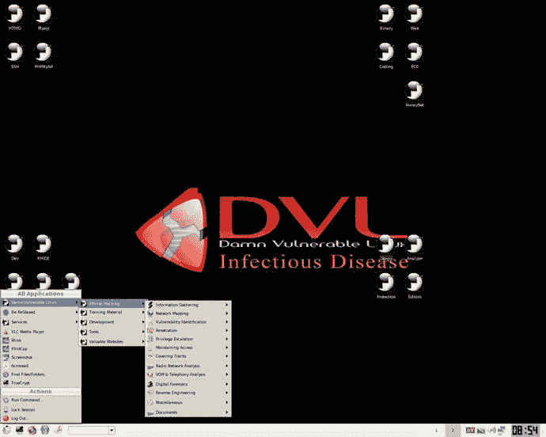

# 破解、破解、修复

虽然安全行业在不断发展其应对技术，但自互联网诞生以来，遭受的攻击种类很少改变。无论是白帽子还是黑帽子，无论是出于善意进行测试还是恶意攻击网络和系统，通常都只了解少数不同类别的攻击。

对于任何白帽子来说，了解攻击者将瞄准的许多攻击媒介都是至关重要的。本附录探讨了如何在当今的互联网上很好地利用一个旧工具。事实上，您可以安全地尝试利用自己的漏洞，并了解如何防范它们，这意味着与其他安全工具相比，这种非常宝贵的工具价值非常高。

向前一步“该死的脆弱的 Linux”(被称为 DVL)。如果你想学习黑客技术，堵塞安全漏洞，修复损坏的系统，那么在我看来，优秀的 DVL 仍然值得一看。

## 探索 DVL

DVL 网站在 2011 年左右被关闭，据称是因为它威胁违反德国安全法。尽管如此，DVL 是过去几年里任何对 Linux 感兴趣的人都可以探索的最有用的安全技术之一。

我们强烈建议您不要在硬盘上安装 DVL，所以我假设您可以配置自己的 VirtualBox ( [`https://www.virtualbox.org`](https://www.virtualbox.org/) )、虚拟机(VM)或其他类型的容器。或者，您可以在自己的 live CD 上使用 DVL(根本不需要任何永久安装)，或者在推送时，您可能有一台合适的旧机器，它的驱动器可以被愉快地擦除。

如果你访问这里提到的 SourceForge 下载 URL，然后查看 ISO 文件列表，你可以看到一些不同 DVL 版本的列表。

顶部的链接写着“寻找最新版本？”可能就够了。提到了开发人员正在开发 DVL 的第二版，这个链接提到了`bt2final.iso`。如果这对你不起作用，你应该可以成功下载“DVL 1.5 传染病网站”。

一旦安装了 DVL，你会看到一个提到古老的回溯 Linux 的屏幕(遗憾的是它现在已经过时了，它的站点现在有效地指向了 Kali Linux 参见 [`https://www.kali.org`](https://www.kali.org/) )，取决于你的版本。按照屏幕上的说明，您应该能够使用如下凭据登录:

`Login: root`

`Password: toor`

图 [A-1](#Fig1) 展示了 1.5 版本的基本 GUI 桌面管理器，尽管你将在 DVL 上做的大量工作是基于命令行的(在一个 shell 中)。

图 A-1。

An image showing the DVL desktop manager as found on the DistroWatch site; see [`http://distrowatch.com/img/dvl.png`](http://distrowatch.com/img/dvl.png)

通过使用旧的、更易受攻击的内核版本，DVL 可以大大增加虚拟机的攻击面。你肯定可以对一些谜题和可开发的软件大展身手。例如，在堆积如山的好东西中，有一些令人讨厌的 SQL(结构化查询语言)注入，您可以探索一下。

很多系统功能都被故意破坏到不同程度，比如网络配置。然而，就软件包而言，您可以尝试旧版本的 web 服务器(Apache)、PHP、数据库服务器(MySQL)和 FTP 服务器。你也可以尽情地玩 GCC (GNU 编译器集合)和`strace`，以及其他许多编译器包。

前 DVL 网站大谈不能作弊，因为没有提供解决方案。这是一个很好的说法，当你取得来之不易的成功时，它会增加你吹嘘的权利。让我们来看看 DVL 附带的一些应用程序(为了避免扫了你的兴，没有给出太多)。

图 [A-2](#Fig2) 展示了一个旨在让您保持警觉的捆绑软件示例。

图 A-2。

A snapshot from the DVL’s Wikipedia page

根据您使用的 DVL 版本，您应该会遇到一些 web 浏览器(Firefox 和 Konqueror)、一些有用的文档(从开始按钮开始跟踪该死的易受攻击的 Linux)，以及对 shell 的快速而简单的访问。

稍加挖掘，您还可以看到一个名副其实的实用程序宝库，比如反汇编程序和调试器。如果你曾经遇到过所谓的“断点测试”或者使用过观察点，这些工具将会帮助你。

## 盒子里有什么

正如我提到的，优秀的测试平台，也就是易受攻击的 Linux，为您提供了许多不同的方面来攻击、破坏和修复。还包括一些非常有用的教程。此前，DVL 网站上有许多视频来补充这些文件，但你现在可能很难在网上找到它们。

显然，我们中大约 65%的人是“视觉学习者”，这意味着我们会对从图形和图表中学习做出最好的反应。有几个用户炫耀他们的 DVL 技巧，似乎可以在 YouTube 上找到奇怪的样本，但一眼看去原始视频是不可用的。时光倒流机终究只能提供这么多( [`https://archive.org/web`](https://archive.org/web) )。

一个名为 VulnHub 的优秀网站(见 [`https://www.vulnhub.com/series/damn-vulnerable-linux,1/`](https://www.vulnhub.com/series/damn-vulnerable-linux,1/) )有一个全面的列表，并包含在 DVL 的版本中。例如，根据 1.4 版中的 VulnHub(代号“士的宁”)，您可以期望找到以下内容:

*   [应用开发]添加电机 IDE
*   【应用开发】将 HLA 更新到 1.98，StdLib 更新到 2.3
*   [应用程序开发]添加日志观察
*   【DVL 核心】添加 XEN
*   [反向代码工程]添加 Insight GDB 调试器
*   [教程]添加 CPU Sim——一个基于 Java 的交互式 CPU 模拟器
*   【逆向代码工程】添加 JAD Java 反编译器
*   [工具]添加 VLC 媒体播放器
*   [文档]添加 TeTex
*   [文档]添加 JabRef
*   【应用开发】添加 Kile
*   [文档]添加 kDissert Mindmapper
*   [渗透测试]添加 JBroFuzz
*   【应用开发】添加 WebScarab
*   [渗透测试]添加 CAL9000
*   【逆向代码工程】添加 KDBG
*   【应用开发】添加 xchm
*   [DVL 核心]添加 gtk 库
*   [工具]添加 xvidcap
*   [工具]添加 AcroRead
*   [工具]添加 Scite

作为一个引子(我承诺不讨论细节是有充分理由的)，下面的列表显示了 DVL v1 包含了什么。这个版本显然只是一个工具集，相对于入侵、破坏和修复虚拟机，虚拟机可以在这个工具集上进一步开发。

*   HT 0.5
*   libreadline4_4.2a-5_i386
*   gdb_5.2.cvs20020401-6_i386
*   binutils_2.12.90.0.1-4_i386(包括 objdumps、gas、strings)
*   鼻涕虫-0.98-1.i386
*   HLA v1.86 版
*   libelphish 0-dev _ 0.65 RC 1-1 _ i386
*   elphish _ 0.65 RC 1-1 _ i386
*   阿帕奇 2.0.5.4
*   Php 4.4
*   ethereal-common _ 0 . 9 . 4-1 wood 12 _ i386
*   缥缈 _ 0 . 9 . 4-1 木质 12_i386
*   libpcap0_0.6.2-2_i386
*   tcpdump_3.6.2-2.8_i386
*   lsof_4.57 1_i386
*   ltrace_0.3.26_i386
*   nmap_2.54.31 测试版-1_i386
*   失去了 4.4-1.2-i3 86
*   ELFkickers-2.0a(包括 sstrip、rebind、elfls、ebfc、elftoc)
*   GCC/G++ 3.3.4
*   GNU Make 3.80
*   混蛋-bin-0.17 tgz
*   MySQL-服务器 4.4.1
*   Ruby 1.8
*   Python 2.3
*   丽达-03.00.00
*   DDD

## 易受伤害的

很难忽略 VulnHub 网站。如果你曾经迷上了一个爱好，你可能会比失去一两个周末更糟糕，使用 VulnHub 上的一些 VM 镜像。这是一个预先构建的图像的集合，除了其他东西，我们鼓励你去利用它。下面是一个在“Acid: Reloaded”虚拟机上发现的既定目标的示例:“将权限提升到 root 用户并捕获标志”。

如果您对 SQL 漏洞感兴趣，您可能也想看看这个演示。它被称为“代码攻击”( [`http://www.codebashing.com/sql_demo`](http://www.codebashing.com/sql_demo) )，该网站讲述了如何保护你的应用程序。有付费选项，网站承诺程序员会教你所有关于应用程序安全性的重要知识。

一个旨在让用户上传沙盒应用供他人破解的社区项目被恰如其分地命名为 [`https://hack.me`](https://hack.me/) 。我喜欢这个网站的是它所谓的“黑客”的多样性。如果你访问 [`https://hack.me/explore`](https://hack.me/explore) ，那么这里有网络表单、PHP bugs 和其他可用的变种。有一个名为“删除所有东西”的“黑客工具”，它友好地请求您使用 SQL 注入来删除数据库中的整个`users`表。如果你有兴趣的话，这个建得很好的网站当然值得一看，并为之添砖加瓦。

目前 Java 似乎风靡一时。有一个故意不安全的 J2EE(Java 2 Platform Enterprise Edition)应用程序，旨在帮助教授安全概念，名为 WebGoat ( [`https://www.owasp.org/index.php/WebGoat_User_Guide_Table_of_Contents`](https://www.owasp.org/index.php/WebGoat_User_Guide_Table_of_Contents) )。一旦启动并运行了 Tomcat，每次安全评估都会要求您执行以下操作:

*   检查客户端内容，如 HTML 和脚本。
*   分析客户端和服务器之间的通信。
*   查看任何 cookies 和其他本地数据。

您只需将本地浏览器指向 [`http://127.0.0.1/WebGoat/attack`](http://127.0.0.1/WebGoat/attack) 即可开始使用。您可以使用这些凭据获得访问权限:

`Login: guest`

`Password: guest`

同样，你可能会在 WebGoat 迷路几天。

最后，这里有一篇以前的文章(写于 1999 年)，它研究了利用具有 SUID 权限的程序的缓冲区溢出。它写得很好，提供了攻击期间幕后发生的事情(或者至少是 1999 年发生的事情)的洞察力； [`http://www.linuxjournal.com/article/2902`见](http://www.linuxjournal.com/article/2902)。

## 摘要

你可能会花上几天时间来尝试利用、强化和修复我们所看到的一些代码和虚拟机。攻击者和那些想要保护他们系统的人可以使用成千上万的安全工具。

如果您以前没有见过类似的工具，那么您很难立即进入渗透测试领域或者成为一名安全专家。然而，你应该准备一些非常有用的工具来帮助你达到目的。如果您对这一领域感兴趣，您可以看看名为 Metasploit ( [`http://www.metasploit.com`](http://www.metasploit.com/) )的优秀、全面的软件包。它提供了一个框架，帮助将漏洞注入远程机器，以便从本质上监控它们如何反应。除了其他方面，您还可以使用有效负载并选择利用哪个 bug。还有一个令人大开眼界的方法是如何对攻击流量进行编码，以便防火墙(入侵检测系统)在过滤规则中忽略有效载荷。总而言之，它可能是一个非常复杂的工具，但却是一个奇妙的学习体验，将会比许多其他可用的工具更进一步。

希望您的武器库现在包括足够多的额外安全武器来帮助您做更多的事情来保持您的服务运行。