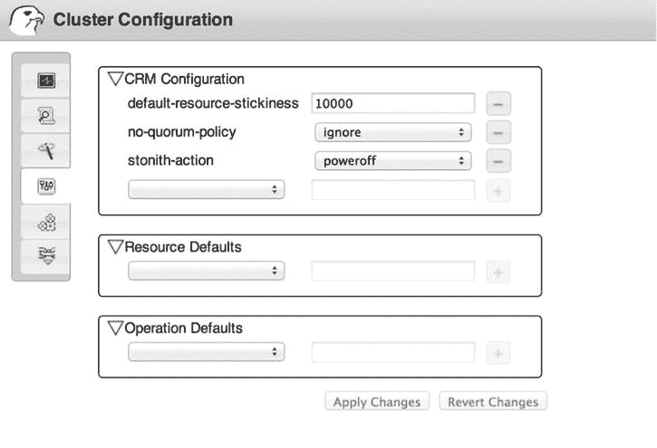

# 5.配置基本群集设置

设置集群时，需要注意一些基本设置。这些设置适用于整个集群，并定义了集群在特定条件下的运行方式。此外，你必须确保 STONITH(射击另一个节点的头部)，也被称为击剑，是照顾。本章向您展示了如何操作，并介绍了以下主题:

*   指定默认群集设置
*   建立 STONITH
*   在 Red Hat 集群上使用围栏

## 指定默认群集设置

在集群中创建任何东西之前，您应该花点时间考虑一些默认的集群设置。默认情况下，群集设计为在不更改任何群集属性的情况下正常工作。但是，在特定情况下，更改一些设置的默认值是有意义的，如下所示:

*   `no-quorum-policy`
*   `default-resource-stickiness`
*   `stonith-action`

### 无法定人数政策

法定人数是集群中的大多数。为了避免出现裂脑，集群只有在达到法定人数时才会做出反应。假设有一个五节点集群，其中由于网络故障，形成了两个组:一个三节点组和一个两节点组。在这种情况下，只有三节点组占多数。因此，只有三节点组能够运行群集中的资源。这是一个非常重要的设置，因为如果双节点组也运行资源，就会出现资源损坏的风险。因此，默认的`no-quorum-policy`被设置为`stop`。

以下`no-quorum-policy`设置可用:

*   `stop`:这是默认设置。如果仲裁丢失，所有资源将立即停止，以确保只有占多数的群集才能运行资源。
*   `ignore`:这是使用 2.3.x 之前版本的 Corosync 的双节点集群所需要的。如果一个节点关闭，双节点集群将总是失去仲裁。为确保资源仍能运行，将`no-quorum-policy`设置为`ignore`。在 Corosync 2.3 和更高版本中，仲裁由 Corosync 提供，它有一个双节点设置。通过将该值设为 1，仲裁将自动得到正确的处理，即使在双节点集群中也是如此。
*   如果仲裁丢失，什么都不会发生，资源将会停留在它们原来的位置。例如，当 OCFS2 和 GFS2 之类的服务无法在变得不定额的分区中干净地停止时，这可能是需要的。在这种情况下，这可能是最明智的选择。如果 quorate 分区仍然存在，服务将被隔离，但否则，这是提供服务的最佳方式。
*   所有自己检测到失去仲裁的节点将自我防护。

`no-quorum-policy`被设置为值`stop`，这是由三个或更多节点组成的集群中的默认设置。在三节点集群中使用这种方法是有意义的，因为在裂脑事件中，一个节点单独运行，它应该真正理解它可能永远不会运行任何资源。这正是`no-quorum-policy stop`正在做的事情:它停止失去仲裁的节点上的所有资源，以便集群中的其他节点可以安全地接管资源。

如前所述，在某些情况下，使用`freeze`作为`no-quorum-policy`值是有意义的。下面的过程描述了如何做到这一点。

Open a shell on one of the cluster nodes, either as root or as user hacluster.   Type `crm configure edit`. This brings you in a vim editing mode, in which you can change cluster parameters.   Locate the line that reads `property $id="cib-bootstrap-options"` and add the following line to the end: `no-quorum-policy="freeze"`.   Note the use of slashes. All lines that are not the last line in this part of the configuration should end with a slash (see the following listing).  

`property $id="cib-bootstrap-options" \`

`dc-version="1.1.9-2db99f1" \`

`cluster-infrastructure="classic openais (with plugin)" \`

`expected-quorum-votes="2" \`

`no-quorum-policy="ignore"`

Write the changes and quit the editor interface. You have now successfully defined the required settings for a two-node cluster.  

### 默认资源粘性

如果您想要影响资源放置的位置，那么`default-resource-stickiness`参数可以派上用场。默认行为是资源将尝试回到最初为它们提供服务的节点。这意味着发生故障后，资源将被转移到集群中的另一个节点，一旦原始节点恢复，资源将再次回到原始节点。这并不理想，因为用户将经历两次停机。为了防止这种情况发生，您可以设置`default-resource-stickiness`参数。

此参数取-1，000，000 到 1，000，000 之间的值。(指定这些值时不要使用逗号。我把它们放在这里只是为了增加可读性！)负值意味着集群将总是将其从当前位置移除，这是没有意义的。所以，不要用它，除非你想演示一个有很多活动的集群。值为 0 通常意味着资源将移回其原始位置，如果值为正值，资源将停留在原来的位置。这里最好使用适度的正值，例如 10，000，这意味着群集更愿意将资源留在原处，防止它移回原始节点，从而导致与此相关的停机。但是，您应该认识到，它取决于使用的其他权重，例如，在约束中。请注意，资源粘性也可以基于每个资源进行设置。

### stonith 行动

正如您将在本章的下一节中读到的，STONITH 是在群集与节点的通信失败时停止节点的原因。默认情况下，在 STONITH(拍摄另一个节点的头部)操作后，该节点将重新启动，并自动再次添加到群集。这听起来不错，但是如果您的节点遇到了严重的问题，很可能在回到集群后，它会立即遇到同样的问题，并再次重新启动。为了防止这种情况发生，您可能需要将`stonith-action="poweroff"`添加到集群配置中。这确保了在被其对等节点杀死之后，该节点只有在被系统管理员手动重启的情况下才会恢复。请注意，这也可以通过设置 SBD (STONITH 数据块设备)STONITH 代理来实现。有关更多详细信息，请参考手册页。

您还可以从 Hawk web 界面配置前面提到的设置。在 Hawk 中，选择左侧的集群属性选项卡。接下来，在集群配置下，使用下拉列表设置您想要为集群配置的所有属性(图 [5-1](#Fig1) )。

图 5-1。

Setting cluster properties from Hawk

## 建立 STONITH

如前所述，STONITH(击中另一个节点的头部)是一种强制机制，可以在转移资源之前保证集群的完整性。即使技术上可行，您也不应该禁用 STONITH，因为可能会出现不可预知的结果。在某些环境中，STONITH 被称为击剑。两者指的是同一个机制。首字母缩写词 STONITH 来自 Linux HA 历史，而在 Red Hat HA 集群中，单词 fencing 更常见。

除了 STONITH 通过终止不再回复集群的节点来保证集群中资源的完整性之外，还需要在集群中移动资源。这意味着当群集对事件做出反应时，它不会移动任何资源，直到 STONITH 确认故障节点已经终止。这是 STONITH 的本质:它迫使故障节点离开集群并进入干净状态，以便其资源可以在其他地方启动。STONITH 还帮助清理短暂/暂时的错误和崩溃。

### 不同的解决方案

STONITH 的本质是仍然处于稳定状态的集群节点之一和 quorate 集群的一部分必须向失败节点的管理机制发送消息，以便它可以被终止。没必要有条不紊的把它拆下来，拔掉电源插头就够好了。可以想象，一个好的 STONITH 解决方案需要一个故障节点操作系统之外的机制。存在不同的方法。

*   基于硬件:STONITH 与硬件设备通信，如集成在服务器中的戴尔 DRAC(戴尔远程访问控制器)、惠普 ILO 或 IBM RSA 管理板。管理板得到终止故障节点的指令。基于硬件的 STONITH 的另一个例子是使用可管理的电源开关，该开关可以从集群获得指令以终止故障节点。
*   基于共享磁盘:集群给共享磁盘设备写“毒丸”。为其创建毒丸的节点必须处理毒丸并自行终止。
*   基于虚拟机管理程序:这仅适用于虚拟化平台上的机器。虚拟化平台获得终止故障节点的指令，该故障节点显然是虚拟机。
*   测试解决方案:这些解决方案包括空 STONITH、基于 SSH 的 STONITH 或“肉制品”STONITH。在 null STONITH 中，加载了一个 STONITH 代理，它什么也不做。它只满足 STONITH 现有的软件要求。在 SSH STONITH 中，集群将使用 SSH 连接到故障节点，并告诉它停止。(您可以想象，如果故障节点确实发生了故障，这可能会很困难。)肉件 STONITH 是一种解决方案，通过该解决方案，“肉件设备”(即管理员)获得手动停止故障节点的指令，并向群集确认它确实已被停止。

除了测试解决方案之外，所有这些解决方案都运行良好。但是实现基于测试解决方案的 STONITH 总比没有 STONITH 要好！

每个 STONITH 解决方案都由三部分组成。

*   启动集群软件时开始的第一个进程。这个 stonithd 进程必须在所有节点上运行。它通常不需要太多额外的配置。
*   可以作为程序运行的资源代理。在 SLES 服务器上，您将在`/usr/lib64/stonith/plugins`目录中找到这些代理，并且您可以通过使用`stonith -L`命令获得所有已安装代理的概述。
*   集群中告诉集群如何执行 STONITH 操作的指令。

设置 STONITH 的一般方法是首先找出应该如何使用特定的 STONITH 代理。例如，基于 KVM 的 STONITH 代理与基于 IPMI(智能平台管理界面)的 STONITH 代理需要完全不同的方法。在后续部分提供的过程描述中，您将找到一些资源代理的具体说明。

如果您知道 STONITH 代理是如何工作的，接下来您必须在没有集群的情况下运行代理，以验证您可以从命令行操作 STONITH 操作。一旦验证了这一点，就可以将 STONITH 配置集成到集群中。

要使用 STONITH，您需要一个支持您想要用于 STONITH 的机制的 STONITH 代理。默认情况下，会安装许多 STONITH 代理。您可以使用命令`stonith -l`请求所有这些的列表。清单 5-1 显示了这个命令的输出。

清单 5-1。使用`stonith -l`获取可用 STONITH 代理的列表

`node1:∼ #` `stonith -L`

`apcmaster`

`apcmastersnmp`

`apcsmart`

`baytech`

`bladehpi`

`cyclades`

`drac3`

`external/drac5`

`external/dracmc-telnet`

`external/hetzner`

`external/hmchttp`

`external/ibmrsa`

`external/ibmrsa-telnet`

`external/ipmi`

`external/ippower9258`

`external/kdumpcheck`

`external/libvirt`

`external/nut`

`external/rackpdu`

`external/riloe`

`external/sbd`

`external/vcenter`

`external/vmware`

`external/xen0`

`external/xen0-ha`

`ibmhmc`

`ipmilan`

`meatware`

`nw_rpc100s`

`rcd_serial`

`rps10`

`suicide`

`wti_mpc`

`wti_nps`

### 设置基于 libvirt 虚拟机管理程序的 STONITH

因为基于虚拟机管理程序的 STONITH 解决方案相对容易设置，所以我将详细讨论这种设置。在本节中，您将学习同样适用于硬件和基于共享磁盘的 STONITH 的通用技术。

在本节中，您还将了解如何为 KVM 虚拟机设置 STONITH。这是一个典型的场景，将在测试环境中使用，其中多个虚拟机运行在同一个 KVM 虚拟机管理程序之上。在 KVM 环境中管理虚拟机的 STONITH 代理与`libvirt`守护进程对话。libvirt 是一个进程，可用于管理 KVM 或 Xen 虚拟化平台上的虚拟机。

The first step in the configuration of every STONITH agent is that you must set up access for the STONITH agent to the device. If the device is an ILO board in an HP server, you need a username and password. In this case, the STONITH “device” is a KVM hypervisor, so you need a means of allowing the STONITH agent to communicate with the KVM hypervisor. For this specific STONITH agent, SSH keys are the most efficient solution. The following steps help you set up SSH key–based authentication. Make sure that hostname resolving is set up properly, so that all cluster nodes and the KVM host can find one another based on their names.   As root on the first cluster node, use `ssh-keygen -t dsa`. Press Enter to accept the default answers for all questions.   Still on the first cluster node, use `ssh-copy-id ∼/.ssh/id_dsa.pub kvmhost` to copy the SSH public key to the kvmhost. Replace “kvmhost” with the actual name of the KVM host.   Repeat these commands on all other cluster nodes.   The libvirt STONITH agent that you are going to use to send STONITH commands to KVM virtual machines requires that the libvirt package be installed on all virtual machines. Use `zypper in libvirt` on all KVM virtual machines in the cluster now, to accomplish this. Without this package, the hypervisor won’t be able to contact virtual machines in order to terminate them.   At this point, you should have met all prerequisites, and it’s time for the first test. To start with, you should now request the parameters this STONITH agent requires. To do this, use `stonith -t external/libvirt -n`. The command shows you that the STONITH agent needs a `hostlist`, a `hypervisor_uri`, and a `reboot_method`. To use all these in the appropriate command, you can now run the following command:    

`stonith -t external/libvirt hostlist="node1,node2" hypervisor_uri="qemu+ssh://lin/system" -T reset node1`

在这个命令中，使用了许多参数。首先，在`-t`之后，提到了 STONITH 代理人的名字。该名称必须与您在`stonith -L`命令的输出中看到的名称相同。接下来，`hostlist`参数用于给出一个逗号分隔的节点列表，这些节点可以由这个 STONITH 代理管理。接下来，就是`hypervisor_uri`了。URI 从访问机制开始，在本例中是`qemu+ssh`(这意味着您使用 SSH 向 qemu 层发送命令)。URI 中接下来是 KVM 主机的名称，后面是`/system`。接下来是 STONITH 动作，它是用选项`-T` reset 定义的，也是最后一个参数，表示要被石头砸死的节点的名称。

如果手动 STONITH 工作，你准备继续进行。如果没有，您应该检查命名，这是该 STONITH 代理最常见的错误。您寻址的主机的名称必须被 KVM 管理程序识别(在管理程序上运行`virsh list`来找出答案)，并且它们还必须是在节点上使用的内核名称(使用`uname -n`来找出答案)。如果 virsh 列表名与 uname `-n`名不匹配，这个 STONITH 方法就不起作用，所以在继续之前一定要修复它！

此时，您已经准备好将所有需要的参数放入集群中。当然，您可以采取简单的方法，使用 Hawk web 界面，您可以从下拉列表中选择所有可用的选项。您还可以使用`crm` shell 接口将资源直接添加到集群中。为了能够从 shell 添加资源，您必须找出想要添加的资源支持哪些参数。这些是您之前用`stonith -t external/libvirt -n`命令找到的参数。接下来，您唯一要做的就是使用正确的语法将它们放入集群中。以下过程描述了如何做到这一点。

On one of the cluster nodes, as root or any user that has been granted CIB access, enter the command `crm`. This takes you into the `crm` shell.   Type `configure`. You are now in the configuration environment. Type `help` to see a list of all commands that are available. Now type `edit` to open the cluster editor. At this point, you should see something similar to Listing 5-2.  

清单 5-2。编辑集群配置

`node node1`

`node node2`

`property $id="cib-bootstrap-options" \`

`dc-version="1.1.9-2db99f1" \`

`cluster-infrastructure="classic openais (with plugin)" \`

`expected-quorum-votes="2"`

`#vim:set syntax=pcmk`

`∼`

`∼`

`∼`

`∼`

`∼`

`∼`

`∼`

`∼`

`∼`

`∼`

`∼`

`∼`

`∼`

`∼`

`∼`

`∼`

`"/tmp/tmpFYbDVV.pcmk" 7L, 197C`

As you are in a vim interface, you can use your normal editor skills to add the following block somewhere in the configuration:  

`primitive stonith-libvirt stonith:external/libvirt \`

`params hostlist="node1,node2" \`

`hypervisor_uri="qemu+ssh://lin/system" \`

`op monitor interval="60" timeout="20" \`

`meta target-role="Started"`

Now, type `commit`, to write the changes to the cluster, and type `exit`, to quit the `crm` shell. You can now verify that the STONITH agent is running somewhere in the cluster, using `crm_mon` or `crm status`.  

`node2:∼ #` `crm status`

`============`

`Last updated: Tue Apr  1 03:40:30 2014`

`Last change: Sat Mar 22 10:18:29 2014 by hacluster via crmd on node1`

`Stack: openais`

`Current DC: node1 - partition with quorum`

`Version: 1.1.6-b988976485d15cb702c9307df55512d323831a5e`

`2 Nodes configured, 2 expected votes`

`1 Resources configured.`

`============`

`Online: [ node1 node2 ]`

`kvm-stonith        (stonith:external/libvirt):        Started node1`

After configuring STONITH, you can run a STONITH test on either of the nodes, for instance, by using `killall -9 corosync`. That should put the node in an unreachable state and issue a STONITH action on the node.  

### 设置基于硬件的 STONITH:APC 主电源开关

作为集群管理员，能够处理不同环境中的 STONITH 非常重要。那么，让我们来看看基于硬件的 STONITH，并配置一个 APC 主电源开关。这是一个可管理的多插座，服务器通过它获得电源。在 APC 电源交换机上，每个插座都有一个端口名，作为管理员，您可以配置哪个端口包含哪个服务器。这意味着，从群集中，您可以告诉电源开关关闭特定端口上的电源，关闭连接到该端口的节点。请注意，像 APC 电源开关这样的硬件解决方案已经变得越来越不常见，因为现在大多数服务器都带有管理板。

在集群中使用 APC Master 之前，您必须设置它。您可以使用以下步骤为设备分配一个 IP 地址。在开始之前，请确保 APC 连接到您的局域网，并且您有一些服务器连接到 APC 的电源插座。

Write down the MAC address of the device. You can find this address on a sticker on the device.   Use ARP to define an IP address for the device on your local computer. You won’t really set the IP address on the device, but you will tell your computer that the device can be reached at this IP address—and that works fine for the further configuration. On Linux, you would do that using the following command:  

`arp -s 192.168.1.245 00:c0:b7:4b:c9:d9`

Now, use ping with a package size of 113 bytes to set the IP address on the local device as well.  

`ping 192.168.1.245 -s 113`

您将看到设备对 ping 数据包做出响应。

Use telnet to connect to the device. The default username is apc; the default password is also apc. Make sure to change the password, to prevent others from having fun with your equipment.   After logging in to the device, choose Network from the Console menu; select TCP/IP and then Manual boot mode. You need this to tell the device that it’s not booting through a DHCP server.   Back in the main Network menu, specify the System IP, Subnet Mask, and Default Gateway address.   Use Ctrl+C to exit the Control Console menu, followed by option 4 to log out. This will write the changes to the device and make them persistent.  

此时，您的 APC 设备就可以在集群中使用了。是时候做个小测试了。以下过程概述了如何重新启动 APC 上的端口。

Open a telnet session to the APC and enter the username and password that you’ve provided for the device (default for both is apc). This gives you the main menu, which you can see in Listing 5-3.  

清单 5-3。主菜单，通过它可以控制对 APC PDU 的访问

`American Power Conversion               Network Management Card AOS      v3.7.0`

`(c) Copyright 2008 All Rights Reserved  Rack PDU APP                     v3.7.0`

`-------------------------------------------------------------------------------`

`Name      : RackPDU                                   Date : 09/19/2000`

`Contact   : Unknown                                   Time : 12:20:01`

`Location  : Unknown                                   User : Administrator`

`Up Time   : 0 Days 0 Hours 5 Minutes                  Stat : P+ N+ A+`

`Switched Rack PDU: Communication Established`

`------- Control Console -------------------------------------------------------`

`1- Device Manager`

`2- Network`

`3- System`

`4- Logout`

`<ESC>- Main Menu, <ENTER>- Refresh, <CTRL-L>- Event Log`

From the menu, select 1, to gain access to the device manager. This gives you access to three different options, from which you select option 2, Outlet Management.   At this point, select option 1, Outlet Control/Configuration. This gives you a list of all available power outlets and their current status. (See Listing 5-4)  

清单 5-4。插座控制/配置菜单

`------- Outlet Control/Configuration ------------------------------------------`

`1- Outlet 1                 ON`

`2- Outlet 2                 ON`

`3- Outlet 3                 ON`

`4- Outlet 4                 ON`

`5- Outlet 5                 ON`

`6- Outlet 6                 ON`

`7- Outlet 7                 ON`

`8- Outlet 8                 ON`

`9- Master Control/Configuration`

`<ESC>- Back, <ENTER>- Refresh, <CTRL-L>- Event Log     >`

Now, select the outlet that you want to shut down and say that you want to work on outlet 1\. Next, choose option 1, Control Outlet.   At this point, you see the menu with available options (see Listing 5-5). From this menu, select Immediate Reboot and confirm your choice by typing “Yes.” The power will now be recycled, and your server will reboot.  

清单 5-5。控制插座菜单为您提供了不同的电源管理选项

`------- Control Outlet --------------------------------------------------------`

`Name         : Outlet 1`

`Outlet       : 1`

`State        : ON`

`1- Immediate On`

`2- Immediate Off`

`3- Immediate Reboot`

`4- Delayed On`

`5- Delayed Off`

`6- Delayed Reboot`

`7- Cancel`

现在，您已经对 APC PDU 的功能有了大致的了解，是时候让它为您的集群所用了。首先，您必须考虑如何将节点连接到 PDU。您应该确保不要将所有节点连接到一个 PDU。这将使 PDU 成为单点故障。因此，如果您正在构建一个四节点集群，将两个节点连接到 PDU1，将两个节点连接到 PDU2，在这种情况下，您的资源将在 PDU 关闭的情况下继续存在。如果您的服务器有多个电源(这很常见)，请确保它们都连接到同一个 PDU，否则将无法工作。

接下来，您必须设置 PDU 本身。这意味着您必须为设备的每个端口配置一个名称。例如，集群将与 APC 对话，告诉它关闭 node1。但是为了实现这一点，APC 在与 node1 对话时必须知道它在与什么对话。通过为设备上的每个端口命名来进行配置。之后，您还必须设置它使用简单网络管理协议(SNMP)。STONITH 将使用此协议与设备对话，要进行配置，您必须设置一个密码，允许 SNMP 对当前配置进行更改。下一个过程描述了如何执行这两个步骤。

Open a telnet session to the PDU and log in with the username and password that are set on the device (defaults are apc, apc).   From the main menu, select option 1, Device Manager. Next, choose option 2, Outlet Management, followed by option 1, Outlet Control/Configuration. This allows access to the outlet configuration menu, from which you can enter a name for each of the outlets (Listing 5-6). Make sure that the name corresponds to the real hostname of the node.  

清单 5-6。插座控制/配置菜单

`------- Outlet Management -----------------------------------------------------`

`1- Outlet Control/Configuration`

`2- Outlet Restriction`

`<ESC>- Back, <ENTER>- Refresh, <CTRL-L>- Event Log`

`> 1`

`------- Outlet Control/Configuration ------------------------------------------`

`1- node1                    ON`

`2- node2                    ON`

`3- SAN                      ON`

`4- Outlet 4                 ON`

`5- Outlet 5                 ON`

`6- Outlet 6                 ON`

`7- Outlet 7                 ON`

`8- Outlet 8                 ON`

`9- Master Control/Configuration`

`<ESC>- Back, <ENTER>- Refresh, <CTRL-L>- Event Log`

After configuring a name for the outlet, make sure that you select option 5, Accept Changes, to actually write the changes to the device. After doing that, press the Escape key five times, which brings you back to the main menu.   From the main menu, select Network, and from the Network menu, select SNMP. In the SNMP menu, select 2—SNMPv1 Specific Settings. This allows access to a list of four different access controls. Access control number 1 allows you to set the SNMP read community name; access control number 2 allows you to set the write community name. At this point, select option 2, which gives access to the default settings for the write community. It’s a good idea to change to something more secure the default setting on which the community name private is used. (Otherwise, anyone who uses private as the community name to access your PDU will have complete write access to the device!)   After making the changes, select option 4, to accept the changes and write them to the device. Next, press Escape until you get back to the main menu, then log out from the device (Listing 5-7).  

清单 5-7。将默认的 Write Community Name private 更改为更安全的名称

`------- SNMPv1 Access Control 2 -----------------------------------------------`

`Access Control Summary`

`#  Community        Access         NMS IP`

`-----------------------------------------------------------------------`

`1  public           Read           0.0.0.0`

`2  private          Write          0.0.0.0`

`3  public2          Disabled       0.0.0.0`

`4  private2         Disabled       0.0.0.0`

`1- Community Name: private`

`2- Access Type   : Write`

`3- NMS IP/Name   : 0.0.0.0`

`4- Accept Changes:`

`?- Help, <ESC>- Back, <ENTER>- Refresh, <CTRL-L>- Event Log`

现在，您已经在主机上手动执行了电源循环，并且设置了 PDU 来与集群通信。按照下一个过程，您将了解如何设置集群，以便使用 PDU 进行 STONITH 操作。

Make sure Hawk is started on one of the cluster nodes and log in to it.   Click Resources and add a Resource ID. Choose, for example, the Resource ID `apc-stonith` and select the class `stonith`.   Note that there are different resource agents that seem to make sense. To control a power switch using the SNMP protocol, select the type `external/rackpdu`.   Make sure all of the required parameters have the appropriate values. You must at least specify the following three parameters:

*   `community`:这是连接到电源开关所需的 SNMP 团体名称。
*   `hostlist`:设置为自动，向设备查询所有可用的主机名，或者手动指定集群节点的名称。
*   `pduip`:这是设备的 IP 地址。

  Now, you can set the `target-role` to Started and create the resource.  

现在，您应该有了 APC 主设备的工作资源。清单 5-8 显示了从`crm` shell 看它的配置。

清单 5-8。APC 主 STONITH 设备配置

`primitive apc-stonith stonith:external/rackpdu \`

`params pduip="192.168.122.22" hostlist="AUTO" community="private" \`

`op start interval="0" timeout="20" \`

`op stop interval="0" timeout="15" \`

`op monitor interval="3600" timeout="20" start-delay="15" \`

`meta target-role="Started"`

### 为戴尔 DRAC 和其他服务器管理卡(如 HP ILO)配置 STONITH

许多服务器品牌都配备了管理卡。这个管理卡有自己的操作系统，它允许您管理服务器的状态。例如，作为管理员，您可以登录管理卡并手动重启服务器。在集群中，您可以创建一个资源代理来自动完成这项工作。

使用 DRAC 硬件有一个挑战，那就是它有如此多的版本。在群集中受到良好支持的 DRAC(戴尔远程访问控制器)版本是 DRAC5。从 DRAC6 开始，您必须输入一些额外的配置。

在集群中设置 STONITH 资源代理之前，必须确保可以从集群连接到它。这涉及许多任务。

Configure the DRAC device on its own network and make sure that the DRAC network interfaces can be reached from the console of the cluster nodes. If you cannot ping the DRAC interfaces, you certainly won’t be able to log in and perform STONITH operations.   Set the DRAC username and password. You’ll need these to connect to it from the STONITH RA.   Enable SSH.  

配置 DRAC BIOS 后，引导服务器。一旦它启动并再次运行(并且您已经在集群中的所有节点上执行了此过程)，您就可以开始配置资源了。

用于配置 DRAC 的基本资源代理是 DRAC5 资源代理。这是所有 DRAC 管理卡的起点。或者，您可以使用 IPMI 资源代理。该代理使用 IPMI，这是一组可以在不同资源代理上使用的通用命令。

DRAC5 资源代理使用一个相对简单的 shell 脚本:`/usr/lib64/stonith/plugins/external/drac5`。这个脚本的基础是它使用 SSH 登录到 DRAC 卡并执行命令。为了执行命令，使用了`racadm`命令，然后是必须执行的动作。下面一行包含了 DRAC5 资源代理所做的所有工作的基础:

`/usr/bin/ssh -q -x -n $userid$ipaddr racdm serveraction "$1"`

传递给 DRAC 接口的特定命令被指定为脚本的第一个参数。例如，如果使用 reset 参数，`racadm`命令`hardreset`用于重置服务器。

处理默认资源代理有点困难，因为它只知道三个默认参数:`hostname`、`ipaddr`和`userid`。`hostname`是需要管理的主机名称；`ipaddr`是指 DRAC 卡的 IP 地址；而`userid`是需要登录设备的用户的 ID。这意味着资源代理必须从正确的参数开始。即使脚本有不同的参数可以使用(比如`gethosts`、`on`、`off`、`reset`等等)，CRM 也没有选择这些不同参数的选项。这就是使用`default-stonith-action`参数的原因。使用这个代理有点困难的第二点是，您不能指定登录密码。相反，DRAC 设备必须配置为基于 SSH 的登录。

DRAC·STONITH 代理的资源配置类似于清单 5-9。

清单 5-9。DRAC 设备配置

`primitive drac-node1 stonith:external/drac5 \`

`params ipaddr="192.168.10.1" hostname="node1" userid="dracadmin" \`

`op start interval="0" timeout="20" \`

`op stop interval="0" timeout="15" \`

`op monitor interval="3600" timeout="20" start-delay="15" \`

`meta target-role="Started"`

因为 DRAC STONITH 代理相对较小，而且理解如何组织防护代理是有意义的，清单 5-10 给出了 SLES 11 SP3 服务器上的资源代理的内容。建议看一下，即使你不使用 DRAC，因为了解资源代理是如何组织的，对于排除它们的故障真的很有帮助。

清单 5-10。DRAC5 资源代理的内容

`node1:/usr/lib64/stonith/plugins/external # vim drac5`

`#!/bin/sh`

`#`

`# External STONITH module for DRAC5 adapters.`

`#`

`# Author:  Jun Wang`

`# License:      GNU General Public License (GPL)`

`#`

`...`

`drac_on() {`

`sshlogin poweron`

`}`

`drac_off() {`

`sshlogin poweroff`

`}`

`drac_status() {`

`sshlogin powerstatus`

`}`

`case $1 in`

`gethosts)`

`echo $hostname`

`;;`

`on)`

`drac_poweron`

`;;`

`off)`

`drac_poweroff`

`;;`

`reset)`

`drac_reset`

`;;`

`status)`

`drac_status`

`;;`

`getconfignames)`

`for i in hostname ipaddr userid; do`

`echo $i`

`done`

`;;`

`getinfo-devid)`

`echo "DRAC5 STONITH device"`

`;;`

`getinfo-devname)`

`echo "DRAC5 STONITH device"`

`;;`

`getinfo-devdescr)`

`echo "DRAC5 host reset/poweron/poweroff"`

`;;`

`getinfo-devurl)`

`echo "`[`http://www.dell.com`](http://www.dell.com/)T2】

`;;`

`getinfo-xml)`

`cat <<EOF`

`<parameters>`

`<parameter name="hostname" unique="1">`

`<content type="string" />`

`<shortdesc lang="en">`

`Hostname`

`</shortdesc>`

`<longdesc lang="en">`

`The hostname of the host to be managed by this STONITH device`

`</longdesc>`

`</parameter>`

`<parameter name="ipaddr" unique="1">`

`<content type="string" />`

`<shortdesc lang="en">`

`IP Address`

`</shortdesc>`

`<longdesc lang="en">`

`The IP address of the STONITH device`

`</longdesc>`

`</parameter>`

`<parameter name="userid" unique="1">`

`<content type="string" />`

`<shortdesc lang="en">`

`Login`

`</shortdesc>`

`<longdesc lang="en">`

`The username used for logging in to the STONITH device`

`</longdesc>`

`</parameter>`

`</parameters>`

`EOF`

`;;`

`*)`

`exit 1`

`;;`

`esac`

### IPMI 和其他管理委员会

因为没有服务器管理卡的标准，所以创建了一个通用的解决方案来与它们接口。这是 IPMI。包括戴尔、惠普和 IBM 在内的许多供应商都支持 IPMI 标准。这意味着，您可以使用 IPMI 命令，而不是将特定于供应商的命令传递给管理卡，这些命令应该适用于所有管理卡。但是，在使用它们之前，您应该始终确保您正在使用的管理卡上启用了 IPMI 支持！

IPMI 资源代理使用`ipmitool`命令。这是一个应该安装在您的服务器上的二进制文件，您可以使用它向启用 IPMI 的接口发送特定的命令。使用命令`ipmitool --help`找出哪些参数可以和它一起使用。要从 IPMI 管理界面自动使用它，您可以在 IPMI STONITH 资源中使用以下参数:

*   `hostname`:应该被屏蔽的主机的名称
*   `interface`:IPMI 接口，通常设置为局域网
*   `ipaddr`:IPMI 设备的 IP 地址
*   `ipmitool`:如果不在`$PATH`中，这应该是`ipmitool`命令的完整路径。
*   `passwd`:用于登录设备的密码
*   `userid`:登录 IPMI 设备所需的用户名

### 设置基于共享磁盘的 STONITH

设置 STONITH 的一种简便方法是使用 STONITH 块设备(SBD)。这种 STONITH 方法需要访问共享磁盘设备，因此您只能在 SAN 磁盘可用时使用它。在 SAN 磁盘上，您必须创建一个小分区(8MB 就足够了)来存储 SBD STONITH 信息。为了可靠性，如果可能的话，可以使用三个设备而不是一个。

SBD·STONITH 是基于毒丸的原理。如果必须终止一个节点，则在 SBD 分区中为该节点编写一个毒丸。吃下毒丸是强制性的，这意味着只要失败节点上的 SBD 进程仍然可用，它就会处理毒丸并自杀。

在以下过程中，您将了解如何设置基于 SBD 的 STONITH。

Make sure a shared device is available and create a small, 8MB partition on the device. Do NOT put a file system on the partition; an unformatted partition is enough!   From one of the nodes connected to the shared device, you have to initialize the shared device. To do this, use `sbd -d /dev/sdc1 create`. (Read carefully, the command is `sbd`, not SBD!) Also, you should consider using `/dev/disk/by-id` names, which won’t change, instead of short names like `/dev/sdc1`.   Verify that the SBD metadata are written to the device, using `sbd -d /dev/sdc1 dump`. This should show something similar to Listing 5-11.  

清单 5-11。验证 SBD 元数据

`node2:∼ #` `sbd -d /dev/sdc1 dump`

`==Dumping header on disk /dev/sdc1`

`Header version     : 2.1`

`UUID               : aaa1b226-8c0c-45ac-9f88-8fe5571f8fc7`

`Number of slots    : 255`

`Sector size        : 512`

`Timeout (watchdog) : 5`

`Timeout (allocate) : 2`

`Timeout (loop)     : 1`

`Timeout (msgwait)  : 10`

`==Header on disk /dev/sdc1 is dumped`

To protect your configuration from a system hang (where stonithd can no longer be addressed to crash the failing node), it is mandatory to load a watchdog module in the kernel. Some hardware has a specific watchdog, if your hardware doesn’t, you can load the software-based watchdog `softdog`. To make sure that this module is loaded upon a system start, open `/etc/init.d/boot.local` with an editor and put the line `modprobe softdog` in this file. You should, however, use `softdog` only as a last resort. A hardware-assisted watchdog is the only reliable protection against the kernel crashing.   To use SBD STONITH, you also have to make sure the `sbd` daemon is started with the cluster. On systemd-based systems, this is done via the `sbd.service` file (which automatically groups itself with Pacemaker). Up to SLES 11, this process was started from the `openais` cluster load script, but it needs a configuration file `/etc/sysconfig/sbd` that has the following contents:  

`SBD_DEVICE="/dev/sdc1"`

`SBD_OPTS="-W -P"`

注意，在这里出错会有严重的后果:如果 SBD 设备不可用，集群将不会启动。此时，重新启动集群中的节点是个好主意。

After restart, you can use the `sbd -d /dev/sdc1 list` command. This gives an overview of nodes that have the `sbd` daemon started and are currently using the SBD STONITH device.  

`node1:∼ #` `sbd -d /dev/sdc1 list`

`0        node2        clear`

`1        node1        clear`

Now, it’s time for a first test. Use the following command to effectuate a STONITH operation from the command line: `stonith -t external/sbd sbd_device=/dev/sdc1 -T reset node2`. This should crash the node.   If the preceding test worked well, you can perform a second test and see if the watchdog is doing its work. On one of the nodes, use `echo c > /proc/sysrq-trigger` to crash the node. If the watchdog is doing its work properly, the node will be STONITHed.   If your previous tests have all succeeded, you can now add the resource agent to the cluster. Use `crm configure edit` and add the following line to the cluster configuration:  

`primitive sbd-stonith stonith:external/sbd \`

You can now use `crm_mon` to verify the current cluster configuration and check that the STONITH agent has properly loaded.  

## 在 Red Hat 集群上使用围栏

如果你明白如何使用 STONITH，你也会明白如何使用击剑。在 Red Hat 集群上，`fence`守护进程 fenced 与其特定的资源代理脚本一起使用，以实现与 STONITH 相同的功能。所有的基本构件都与 STONITH 相同；只有资源脚本不同。(如果你需要击剑，而不是 STONITH，阅读关于 STONITH 的部分仍然是一个好主意，以了解它是如何工作的。)

Red Hat 系统上提供了许多隔离脚本，您可以在命令行上以及从集群中运行所有这些脚本，以便自动将隔离参数传递给集群。

因为在某些情况下，它需要在隔离硬件上进行一些额外的配置，所以在将配置放入集群之前，使用命令行中的隔离命令来测试隔离机制是一个好主意。在尝试之前先看看可用的命令参数，因为它们在每个防护设备上是不同的。一旦你发现一个特定的设备是如何被使用的，你可以尝试从命令行进行隔离操作。例如，以下命令将使用`fence_drac5`通过 SSH 向 node1 发送隔离操作:

`fence -a 192.168.100.1 -l dracadmin -p password -x`

仅当您确认此命令表现出预期行为时，才继续操作。

在将配置放入集群之前，您应该找出哪些是可用的参数。您可以通过使用`crm ra meta`命令来做到这一点，该命令提供了大量的详细信息。例如，使用`crm ra meta stonith:fence_drac5`获得 DRAC5 所有可用参数的概述，包括如何使用这些参数的描述。

在找出要使用的参数后，您可以在集群配置中包括隔离设备。在清单 5-12 中，您可以看到使用`fence_drac5`代理隔离特定节点的配置。

清单 5-12。DRAC 的围栏配置示例

`primitive Fenceapache1 stonith:fence_drac5 \`

`params action="reboot" cmd_prompt="/admin1->" ipaddr="192.168.12.97" login="admin" passwd="secret" secure="1" pcmk_host_list="apache1.moodle.hosting.local" \`

`op monitor interval="30s" \`

`meta target-role="Started"`

## 摘要

在本章中，您已经了解了如何构建基本的集群配置。您已经学习了如何设置一些基本的集群参数，以及如何使用 STONITH 或隔离来保证集群中资源的完整性。在下一章中，您将了解如何将服务添加到集群中，作为集群资源进行管理。