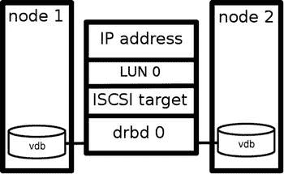

# 九、创建开源 SAN

现在您已经了解了所有基本的集群配置，是时候看看一些实际的用例了。在本章中，您将了解如何使用 Pacemaker 和相关的开源软件创建一个开源存储区域网络(SAN)。您将了解如何配置以下内容:

*   带有分布式复制块设备(DRBD)的镜像网络块设备
*   iSCSI 的一个目标是提供进入 DRBD 的通道
*   管理活动 DRBD 位置的集群配置

## 使用 Pacemaker 创建开源 SAN

存储区域网络(SAN)设备以高价出售。在某些情况下，当您可以创建开源 SAN 解决方案时，在专有 SAN 设备上花费大量资金是没有意义的。即使从性能的角度来看，基于开源软件的 SAN 解决方案也不一定提供低劣的性能。使用这种类型的解决方案的优点是有许多性能优化选项可用，并且您不会受到可以应用的优化的限制。

创建一个开源 SAN 大致包括两个步骤:首先，您必须配置一个分布式复制块设备(DRBD ),并让它由集群管理。接下来，您必须配置一个 iSCSI 目标，并让它跟随主 DRBD。本章详细解释了如何做到这一点。

## 使用 DRBD 通过网络配置 RAID 1

如果您想要创建一个多个节点可以同时访问您的数据的环境，分布式复制块设备(DRBD)是一个很好的选择。如果您想要建立一个双节点集群，其中一个节点必须能够尽快接管另一个节点的确切状态，这一点尤其正确。DRBD 通过网络执行块的`delta-sync`,这确保您在几秒钟内就可以在不同的机器上拥有完全相同的状态。

基本上，DRBD 是网络上的 RAID 1。在本章介绍的设置中，一个节点充当活动节点。另一个节点是备用节点，但始终完全同步。这意味着，如果活动节点出现故障，备用节点可以立即接管。可以在没有 Pacemaker 集群的情况下设置 DRBD，但是在这种情况下，如果当前活动的节点发生问题，您将必须手动切换活动节点。在本章介绍的设置中，您将了解如何通过将 DRBD 集成到Pacemaker集群中来实现自动切换。

DRBD 的一个优点是，使用它时，您不需要昂贵的 SAN 解决方案。那是因为基本上，DRBD 是你的 SAN。SAN 的基本功能是提供一个共享设备，在该设备中提供数据块级别的访问，这正是 DRBD 正在为您做的。您甚至可以在 DRBD 之上构建一个额外的解决方案，其中 iSCSI 目标安装在 DRBD 之上，以实施镜像 SAN 解决方案。这并不难做到，只需在遵循 DRBD 主机的 Pacemaker 集群中添加一个 iSCSI 目标资源，如本章所述。

### 预防措施

设置 DRBD 的目的是创建一个通过网络同步的设备。为了实现这个目标，您需要两台服务器，并且在两台服务器上，您都需要一个存储设备，如本地硬盘—如果可能的话，在两个节点上具有相同的大小。您想为共享存储设备使用什么并不重要，许多解决方案都可行。如果您不能专用一个完整的磁盘，也可以使用分区或 LVM 逻辑宗卷。只要能作为块设备进行寻址，使用什么并不重要。

在本章中，我将使用一个在两个节点上都可用的名为`/dev/vdb`的专用设备。使该设备可用后，您必须确保 DRBD 软件也已安装。

Important!

DRBD 可能会同步大量数据。如果这种同步发生在用于集群流量的同一个网络接口上，您可能会遇到 totem 超时，导致集群开始认为其他节点不可用。为了防止这种情况发生，将 DRBD 同步流量与图腾流量分开非常重要。最好的方法是使用 DRBD 专用网络。如果这不可行，至少您必须确保 totem 流量使用另一个网络接口。尤其是在所有操作都在一个网络接口上进行的测试环境中，集群超时不再被遵守的情况经常发生，节点因此而接收到 STONITH！

### 创建配置

安装软件后，您可以创建 DRBD 配置。

首先，我们假设您使用两个不同的服务器，分别名为 node1 和 node2，在这些服务器上，一个专用硬盘`/dev/vdb`可用作 DRBD。此外，您必须确保默认的 DRBD 端口 7780 在防火墙上是打开的，然后您就可以开始工作了。

The name of the default DRBD configuration file is `/etc/drbd.conf`. This file serves as a starting point for finding the additional configuration, and to accomplish this goal, you’ll have to include two lines that ensure that these configuration files can be found. To do this, make sure the following two lines are in the `drbd.conf` file:  

`include "drbd.d/global_common.conf";`

`include "drbd.d/*.res";`

Now, you need to make sure that the real configuration is defined in the `/etc/drbd.d/global_common.conf` file. Make sure it includes the following generic settings for smooth operation:  

`global {`

`minor-count  5;`

`dialog-refresh       1;`

`}`

`common {`

`}`

For the next part of the configuration, you’ll have to define the DRBD resource itself. This is done by creating several configuration files, one for each resource. Just make sure that this resource-specific configuration file is using the extension `.res`, to have it included in the configuration, as indicated in the `/etc/drbd.conf file`. Following, you can see what the configuration file would look like for a DRBD resource with the name `drbd0`. Note that the handlers section has to be present only if you’re integrating DRBD with a Pacemaker cluster. Don’t include it in setting up the initial synchronization on the DRBD! That’s why, in the following listing, that part of the configuration is followed by hashes:  

`resource drbd0 {`

`protocol     C;`

`disk {`

`on-io-error       pass_on;`

`#  fencing resource-only;`

`}`

`#handlers {`

`#   fence-peer "/usr/lib/drbd/crm-fence-peer.sh";`

`#   after-resync-target "/usr/lib/drbd/crm-unfence-peer.sh";`

`#}`

`on node2 {`

`disk      /dev/vdb;`

`device    /dev/drbd0;`

`address   192.168.122.131:7676;`

`meta-disk internal;`

`}`

`on node1 {`

`disk      /dev/vdb;`

`device    /dev/drbd0;`

`address   192.168.122.130:7676;`

`meta-disk internal;`

`}`

`syncer {`

`rate 7M;`

`}`

`}`

作为该文件的第一部分，定义了资源的名称。在这种情况下，我们使用`drbd0`，但是您可以完全自由地选择任何您喜欢的名称。接下来，指定设备节点的名称，因为它将出现在`/dev`目录中，包括用于该设备的次要编号。请确保选择唯一的资源名和设备名。否则，内核将无法区分您可能正在使用的不同 DRBDs。

接下来，您将指定哪个本地设备将在节点之间复制。通常，这是一个空设备，但在 DRBD 配置中，可以将一个带有现有文件系统的设备放入其中，并将该文件系统的内容同步到 DRBD 对中的另一个设备。在设备名称之后，您将包括不同节点的配置。节点名必须等于由`uname`命令返回的内核名。作为最后一部分，您将设置同步速度。这决定了 DRBD 可用的带宽量。如果你没有 DRBD 专用的网络连接，不要把这个设置的太高；否则，您可能会使用所有的带宽，并冒着其他流量无法通过的风险，这可能会导致集群节点被阻塞。

After creating the initial configuration files on one node, it’s a good idea to verify the configuration. To do this, use the command `drbdadm dump all`. If this command displays the contents of all the configuration files (instead of complaining about missing parts of the configuration), everything is okay, and you can proceed to the next step.   After verifying the configuration on the first node, you can transfer it to the second node. Make sure that you can perform the transfer using the node name of the other node. If nodes cannot reach each other by node name, your DRBD is going to fail. So, if necessary, configure your `/etc/hosts` or `DNS` before moving on.  

`scp /etc/drbd.conf node2:/etc/`

`scp /etc/drbd.d/* node2:/etc/drbd.d/`

Now it’s time to create the DRBD metadata on both nodes. First, use the `drbdadm` command as in the following example. Next, you can start the DRBD service, as follows:  

`#drbdadm -- --ignore-sanity-checks create-md drbd0`

`Writing meta data...`

`initializing activity log`

`NOT initialized bitmap`

`New drbd meta data block successfully created.`

`#service drbd start`

此时，您可以使用`service drbd start`启动 DRBD 服务。接下来，使用`service drbd status`请求它的状态。然后，您会看到两台设备都处于连接状态，但都被设置为辅助设备，并且它们不一致。

`node1:∼ # service drbd status`

`drbd driver loaded OK; device status:`

`version: 8.4.1 (api:1/proto:86-100)`

`GIT-hash: 91b4c048c1a0e06777b5f65d312b38d47abaea80 build by phil@fat-tyre, 2011-12-20 12:43:15`

`m:res    cs         ro                   ds                         p  mounted  fstype`

`0:drbd0  Connected  Secondary/Secondary  Inconsistent/Inconsistent  C`

Now you can start the synchronization on one of the nodes, using the following command:  

`drbdadm -- --overwrite-data-of-peer primary drbd0`

如果您现在再次使用`service drbd status`命令来监控当前的同步状态，您将看到状态现在被设置为 synchronized(已同步),并且您已经建立了一个`Primary/Secondary`关系。现在，您必须等到两个节点上的状态都是`UpToDate`。

`node1:∼ # service drbd status`

`drbd driver loaded OK; device status:`

`version: 8.4.1 (api:1/proto:86-100)`

`GIT-hash: 91b4c048c1a0e06777b5f65d312b38d47abaea80 build by phil@fat-tyre, 2011-12-20 12:43:15`

`m:res    cs          ro                 ds                     p  mounted  fstype`

`0:drbd0  SyncTarget  Secondary/Primary  Inconsistent/UpToDate  C`

`...      sync'ed:    4.3%               (1006992/1048508)K`

同步完成后，service drbd status 命令的输出将如下所示:

`node1:∼ # service drbd status`

`drbd driver loaded OK; device status:`

`version: 8.4.1 (api:1/proto:86-100)`

`GIT-hash: 91b4c048c1a0e06777b5f65d312b38d47abaea80 build by phil@fat-tyre, 2011-12-20 12:43:15`

`m:res    cs         ro                 ds                 p  mounted  fstype`

`0:drbd0  Connected  Secondary/Primary  UpToDate/UpToDate  C`

### 与 DRBD 合作

设备完全同步后(取决于设备的大小，这可能需要很长时间！)，您可以在主 DRBD 节点上创建文件系统。为此，您可以使用以下命令:

`mkfs.ext3 /dev/drbd0`

`mount /dev/drbd0 /mnt`

如果一切顺利，设备现在将安装在目录`/mnt`的主节点上。如果您现在在该目录中创建文件，它们将立即同步到另一个节点。然而，因为您使用的是`Primary/Secondary`设置，所以不可能在另一个节点上直接访问这些文件，但是它们是存在的，以防出现任何问题。

如果到目前为止一切顺利，那么您可以执行一个测试，让另一个节点成为主节点。为此，请使用以下步骤:

Unmount the DRBD on node node1.   Use the following command to make node node1 the secondary: `drbdadm secondary drbd0`.   Now go to node node2 and promote the DRBD to primary, using the command `drbdadm primary drbd0`.   On node node2, use the command `service drbd status` to verify that all went well. If this is the case, your DRBD is now fully operational, and it’s time to move on to the next step and integrate it in Pacemaker.  

### 断开状态故障排除

如果在状态改变后，DRBD 设置中的两个节点都返回到`StandAlone`状态，那么您的 DRBD 设置就处于裂脑状态，无法验证哪个节点包含主数据集。要解决这种情况，您必须手动干预，选择一个将放弃修改的节点。(这个节点被称为裂脑受害者。)使用以下命令执行该干预:

`drbdadm secondary resource`

`drbdadm -- --discard-my-data connect resource`

在另一个节点(裂脑幸存者)上，如果其连接状态也是`StandAlone`，您将输入以下内容:

`drbdadm connect resource`

### 使用双主模式

在某些情况下，将 DRBD 配置为主动/主动模式是有意义的，例如，如果您想要配置一个托管 KVM 或 Xen 虚拟机的平台，其中在一个`fail-over`配置中使用两个主机，以便在需要时允许所有虚拟机在一个主机上。请注意，在这样的配置中，没有必要从集群管理 DRBD 资源。这是因为不需要状态管理，因为节点应该处于的唯一状态是`Primary`。

要使用`active-active`配置，您必须输入一些额外的配置。首先，在资源定义中，您必须包含一个 net 部分，它允许使用两个主要部分并设置正确的同步协议。此外，您将需要一个启动部分，在启动时自动切换到两个节点上的主要角色。下面几行将为您完成这项工作:

`resource drbd0`

`net {`

`protocol C;`

`allow-two-primaries yes;`

`}`

`startup {`

`become-primary-on-both;`

`}`

`...`

`}`

## 将 DRBD 集成到Pacemaker集群中

使用`drbdadm`命令，您可以手动确定哪个节点将成为主节点，哪个节点将成为辅助节点。在真实的 HA 环境中，您必须将 DRBD 集成到 Pacemaker 集群软件中。这样做假设集群将管理 DRBD，而不是本地管理员。

在将资源添加到集群之前，您还必须在`drbd`资源文件中采取一些预防措施。通过包含以下几行，您将确保如果 DRBD 复制链路断开连接，`crm-fence-peer.sh`脚本会联系集群管理器，并确定与该 DRBD 资源相关联的Pacemaker`master-slave`资源。接下来，它将确保 Pacemaker 中的`master-slave`资源不会在当前活动节点之外的任何其他节点上得到提升。这保证了您不会遇到两个节点都认为自己是主节点的情况，这将导致大脑分裂的情况。为此，请在资源配置文件中包含以下内容:

`resource drbd0 {`

`disk {`

`fencing resource-only;`

`...`

`}`

`handlers {`

`fence-peer "/usr/lib/drbd/crm-fence-peer.sh";`

`after-resync-target "/usr/lib/drbd/crm-unfence-peer.sh";`

`...`

`}`

`...`

`}`

接下来的步骤描述了如何在 Pacemaker 中添加管理 DRBD 的资源。此过程假设您已经有一个可运行的Pacemaker集群。

Start Hawk and log in as user hacluster.   Add a primitive for the DRBD resource. Select class OCF, the Provider Linbit, and the type `drbd`.   Set the `drbd_resource` parameter to the name of the `drbd` resource that you’ve created. This is the name of the resource as defined in the `drbd0.res` file and not the name of the device, so enter `drbd0` and not `/dev/drbd0`.   From the parameters drop-down list, select the `drbdconf` parameter and provide the value of the `drbd.conf` file, which would be `/etc/drbd.conf`. Also, add the resource name, which should be the same as the name of the resource as defined in the DRBD resource file. Next, click Create Resource, to add the resource to your configuration.   At this point, go back to the resources tab and add a `master-slave` resource. Give it the name `drbd-ms`, and as the child resource, select the `drbd` resource you’ve just created.   Under Meta-Attributes, set the target role to Started and click Create Master/Slave to add the `master-slave` resource to the configuration.  

`primitive drbd ocf:linbit:drbd \`

`params drbdconf="/etc/drbd.conf" drbd_resource="drbd0" \`

`op start interval="0" timeout="240" \`

`op monitor interval="20" role="Slave" timeout="20" start-delay="60" \`

`op monitor interval="10" role="Master" timeout="20" start-delay="60"\`

`op stop interval="0" timeout="100" \`

`meta target-role="Started"`

`ms drbd-ms drbd \`

`meta master-max="1" master-node-max="1" clone-max="2" \`

`clone-node-max="1" notify="true" \`

`meta target-role="Started"`

### 测试

在继续使用您的设置并将 iSCSI 目标添加到配置中之前，最好重新启动集群中的两个节点，并确保集群确实在管理 DRBD 资源，而不是本地 DRBD 服务。重新启动后，验证 DRBD 资源在两个节点上都已启动，其中一个节点用作主节点，另一个用作辅助节点。检查集群配置本身也是一个好主意。由于这是一个双节点集群，请确保将无仲裁策略设置为忽略。此外，确保 STONITH 是可操作的。如果是这种情况，您可以执行测试并关闭主节点。辅助节点现在应该会自动接管。

## 向开源 SAN 添加 iSCSI 目标

一旦您的 DRBD 运行并由集群管理，您必须向其添加一个 iSCSI 目标。在第 2 章中，您将了解如何设置存储，尤其是 iSCSI 目标。在本节中，您将了解如何设置 iSCSI 目标以提供对活动 DRBD 的访问，并让它由集群进行管理。

有不同的方法来设置它。使用简化的架构，您可以在共享存储之上设置 DRBD(如前一节所述)。除此之外，您还可以配置一个 iSCSI 目标和一个专用 IP 地址。图 [9-1](#Fig1) 提供了该配置的概述。即使此选项可行，它也不会在存储层为您提供太多的灵活性，因为您将需要为将要添加的每个额外的 iSCSI LUN 添加一个新的 DRBD。如果您预计不会有太多变化，这没问题，但是如果您确实预计存储拓扑会有变化，您可能会更喜欢更灵活的配置。

图 9-1。

Open source SAN simple configuration

这就是为什么在 DRBD 上创建 LVM 图层要灵活得多的原因。这使您可以灵活地选择提供给 iSCSI 启动器的 LUN 的大小。图 [9-2](#Fig2) 给出了该配置的概述。

图 9-2。

Open source SAN complex configuration

在复杂配置中，许多组件需要协同工作，包括:

A DRBD   The DRBD master that is managed from the cluster   An LVM configuration with a physical volume (PV), volume group (VG), and logical volume (LV)on top of the DRBD   An iSCSI target   An iSCSI logical unit that replaces the definition of the LUN in the iSCSI target configuration file   An IP address that allows nodes to connect to the configuration.  

在上一节中，您学习了如何在集群环境中设置 DRBD 和 DRBD 主服务器。在第 2 章中，你学习了如何设置 iSCSI。在本节中，您将了解如何设置集群化的 iSCSI 目标和 iSCSI 逻辑单元，以及在此之上的 IP 地址。您还将学习如何在集群环境中设置 LVM 配置。

### 用 LVM 创建开源 SAN

首先，您需要在 DRBD 之上创建一个 LVM 物理卷。接下来，必须将对 LVM 卷组的访问设置为由集群管理。要创建此配置，请执行以下步骤:

Make sure that the DRBD is scanned by LVM for LVM metadata. To do this, you have to change the contents of the `/etc/lvm/lvm.conf` file to include the DRBDs. This following example will only consider DRBDs and ignore everything else:  

`filter = [ "a|/dev/drbd.*|", "r|.*|" ]`

Now you have to disable the LVM cache on both nodes. Do this by including the following line, also in `/etc/lvm/lvm.conf`:  

`write_cache_state = 0`

始终确保删除当前可能存在的缓存:`rm -rf /etc/lvm/.cache`。

Before continuing, use the command `vgscan` to update LVM metadata.   Assuming the name of the DRBD is `drbd0`, use `pvcreate /dev/drbd0` to mark the DRBD as a physical volume.   Now you can create the LVM stack, consisting of a PV, a VG, and an LV. The following three commands will create the volume group and a 1GB logical volume as well. Issue them on the node that currently has the primary DRBD device (`!`):  

`pvcreate /dev/drbd0`

`vgcreate vgdrbd /dev/drbd/by-res/drbd0`

`lvcreate -L 1G -n lvlun0 vgdrbd`

At this point, you can put the LVM configuration in the cluster. Type `crm configure edit` and add the following lines to the cluster configuration:  

`primitive lvm-drbdvol ocf:heartbeat:LVM \`

`params volgrpname="vgdrbd" \`

`op monitor interval="10s" timeout="30s" depth="0"`

Verify that the volume group resource is running in the cluster, before continuing.  

### 在集群中设置 iSCSI 目标

现在，您已经在集群中添加了 DRBD 和 LVM 资源，您可以继续并配置 iSCSI。你现在需要的是一个 iSCSI 目标。与 iSCSI 目标相关的配置包括三个不同的部分:

Make sure the iSCSI target software is installed on your computer. In [Chapter 2](02.html), you can read in detail about all the different options that exist for creating an iSCSI target. In this procedure, I’ll show you how to work with the tgt iSCSI target software that you may still encounter on older Linux distributions. Before proceeding, type `{ yum | zypper | install tgtd` to install the software. Notice that this installs the tgt target software and not the ietd. The tgt software offers more advanced ways to define node restrictions, and therefore, I prefer it for complex environments.   Make sure that the iSCSI target software is not started automatically when your server boots, using either `chkconfig tgtd off` or `sysctl disable tgtd`.   Add the service to the cluster by using `crm configure edit` and include the following. (Note that you initially don’t start the iSCSI target, because it needs additional configuration.)  

*   需要由集群启动的 iSCSI 目标进程
*   `iSCSILogicalUnit`资源，管理由 iSCSI 目标提供的 LUN
*   将用于访问 iSCSI 目标的集群 IP 地址

`primitive iscsitarget-drbd ocf:heartbeat:iSCSITarget \`

`params iqn="iqn.2014-02.com.example:drbdsan" tid="1" \`

`implementation="tgt" \`

`op monitor interval="10s" timeout="20s" \`

`meta target-role="Stopped"`

At this point, you can add the iSCSI LUN, by adding a cluster resource. Note that on normal configurations, you would do this in the iSCSI configuration file, but you can do it perfectly from the cluster as well. The advantage is that the cluster will take care of making the required configuration present on all nodes in the cluster.  

`primitive drbdvol-lun0 ocf:heartbeat:iSCSILogicalUnit \`

`params target_iqn="iqn.2014-02.com.example:drbdsan" lun="1" \`

`path="/dev/vgdrbd/lvlun0" \`

`op monitor interval="10"`

此时，您可以在集群中启动软件，开始使用基于 iSCSI 的开源 SAN。在下面的示例配置中，您可以看到所有的东西都在一起。首先，让我们看一下集群配置。

`chimay:∼ # cat cluster-santnet-san.conf`

`node san-1.example.com`

`node san-2.example.com`

`primitive drbd_sandisk0 ocf:linbit:drbd \`

`params drbd_resource="sandisk0" drbdconf="/etc/drbd.conf" \`

`op stop interval="0" timeout="100" \`

`op start interval="0" timeout="240" \`

`op monitor interval="20" role="Slave" timeout="20" start-delay="60" \`

`op monitor interval="10" role="Master" timeout="20" start-delay="60"`

`primitive ip-iscsi ocf:heartbeat:IPaddr2 \`

`params ip="172.16.50.20" cidr_netmask="24" \`

`op stop interval="0" timeout="20s" \`

`op monitor interval="10s" timeout="20s" \`

`op start interval="0" timeout="20s"`

`primitive iscsitarget lsb:iscsitarget \`

`op stop interval="0" timeout="15" \`

`op start interval="0" timeout="15" \`

`op monitor interval="15" timeout="15"`

`primitive vgsan ocf:heartbeat:LVM \`

`params volgrpname="vgsan" \`

`op monitor interval="10s" timeout="30" depth="0"`

`group iscsi-group vgsan ip-iscsi iscsitarget \`

`meta target-role="Started"`

`ms sandisk_ms drbd_sandisk0 \`

`meta clone-max="2" target-role="Started" notify="true"`

`order vgsan-after-drbd 1000: sandisk_ms iscsi-group`

`property $id="cib-bootstrap-options" \`

`dc-version="1.1.6-b988976485d15cb702c9307df55512d323831a5e" \`

`cluster-infrastructure="openais" \`

`no-quorum-policy="ignore" \`

`stonith-enabled="false" \`

`expected-quorum-votes="2" \`

`last-lrm-refresh="1393398237"`

您可以看到该配置的本质由两部分组成:由`master-slave`资源`drbd`管理的 DRBD 和在该设备之后启动的`iscsi-group`，它确保 iSCSI 目标在固定的 IP 地址可用。

在这个集群中，使用了`ietd` iSCSI 目标，因为它很容易设置。`/etc/ietd.conf`中的配置如下:

`Target iqn.2014-02.santnet.sante:target1`

`Lun 0 Path=/dev/vgsan/lun0,Type=fileio`

`Lun 1 Path=/dev/vgsan/lun1,Type=fileio`

`Lun 2 Path=/dev/vgsan/lun2,Type=fileio`

`Lun 3 Path=/dev/vgsan/lun3,Type=fileio`

DRBD 的配置与本章前面描述的配置非常相似。

`san-1:/etc/drbd.d # cat sandisk0.res`

`resource sandisk0 {`

`protocol        C;`

`disk {`

`on-io-error        pass_on;`

`fencing resource-only;`

`}`

`handlers {`

`fence-peer "/usr/lib/drbd/crm-fence-peer.sh";`

`after-resync-target "/usr/lib/drbd/crm-unfence-peer.sh";`

`}`

`on san-2.example.com` `{`

`disk        /dev/sdb;`

`device        /dev/drbd0;`

`address        172.17.50.22:7676;`

`meta-disk internal;`

`}`

`on san-1.example.com` `{`

`disk         /dev/sdb;`

`device  /dev/drbd0;`

`address 172.17.50.21:7676;`

`meta-disk internal;`

`}`

`syncer {`

`rate 70M;`

`}`

`}`

在`drbd0` iSCSI 设备背后是一个 1.5TB 的磁盘设备，在高度商业化的环境中为数十个 iSCSI 启动器主机提供服务。

## 摘要

在本章中，您已经学习了如何使用 Pacemaker 和其他开源软件来配置开源存储区域网络(SAN)。结果是一个真正的 SAN，它可以在生产环境中使用，并且实际上可以在全球不同客户的站点上运行。在[第 10 章](10.html)中，您将了解另一个用例，其中 Pacemaker 用于为 KVM 或 Xen 虚拟机提供高可用性服务。